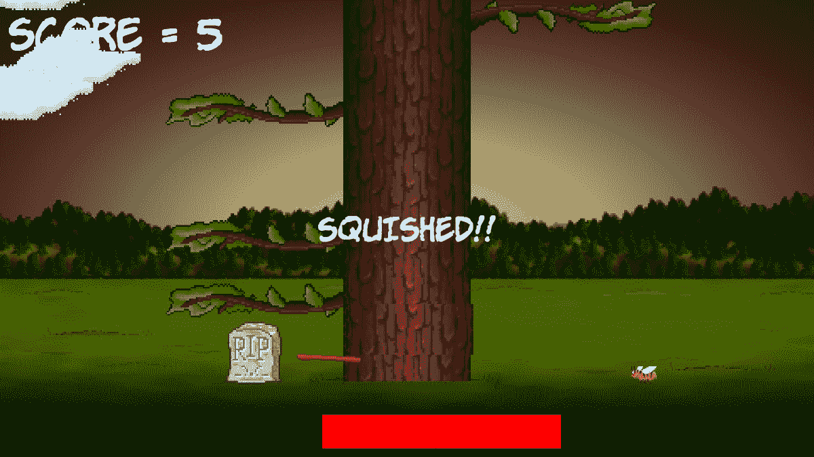

# *第 5 章*：碰撞、声音和结束条件-使游戏可玩

这是第一个项目的最后阶段。本章结束时，您将完成第一个完整的游戏。一旦你有了木材！！！启动和运行时，请务必阅读本章的最后一节，因为它将提出使游戏更好的方法。

在本章中，我们将介绍以下主题：

*   添加其余的精灵
*   处理播放器输入
*   设置飞行日志的动画
*   处理死亡
*   添加声音效果
*   添加功能和改进木材！！！

# 准备玩家（和其他精灵）

让我们为玩家的精灵添加代码，同时添加一些精灵和纹理。下面这个相当大的代码块还添加了一个墓碑精灵，用于在玩家被压扁时使用，一个斧头精灵用于劈砍，以及一个可以在玩家每次劈砍时快速离开的原木精灵。

注意，在`spritePlayer`对象之后，我们声明了一个`side`变量`playerSide`，以跟踪玩家当前的位置。此外，我们为`spriteLog` 对象添加了一些额外的变量，包括`logSpeedX`、`logSpeedY`和`logActive`，以存储日志移动的速度以及当前是否正在移动。`spriteAxe`还有两个相关的`float`常量变量，用于记住理想像素位置在左右两侧的位置。

在`while(window.isOpen())`代码之前添加以下代码块，就像我们以前经常做的那样。请注意，下面代码块中的所有代码都是新的，而不仅仅是突出显示的代码。我没有为这段代码提供任何额外的上下文，因为`while(window.isOpen())`应该很容易识别。突出显示的代码就是我们刚才讨论的代码。

在`while(window.isOpen())`行之前添加以下代码的全部内容，并记下我们简要讨论过的突出显示的行。这将使本章代码的其余部分更容易理解：

```cpp
// Prepare the player
Texture texturePlayer;
texturePlayer.loadFromFile("graphics/player.png");
Sprite spritePlayer;
spritePlayer.setTexture(texturePlayer);
spritePlayer.setPosition(580, 720);
// The player starts on the left
side playerSide = side::LEFT;
// Prepare the gravestone
Texture textureRIP;
textureRIP.loadFromFile("graphics/rip.png");
Sprite spriteRIP;
spriteRIP.setTexture(textureRIP);
spriteRIP.setPosition(600, 860);
// Prepare the axe
Texture textureAxe;
textureAxe.loadFromFile("graphics/axe.png");
Sprite spriteAxe;
spriteAxe.setTexture(textureAxe);
spriteAxe.setPosition(700, 830);
// Line the axe up with the tree
const float AXE_POSITION_LEFT = 700;
const float AXE_POSITION_RIGHT = 1075;
// Prepare the flying log
Texture textureLog;
textureLog.loadFromFile("graphics/log.png");
Sprite spriteLog;
spriteLog.setTexture(textureLog);
spriteLog.setPosition(810, 720);
// Some other useful log related variables
bool logActive = false;
float logSpeedX = 1000;
float logSpeedY = -1500;
```

在前面的代码中，我们添加了许多新变量。在我们真正使用它们之前，很难完整地解释它们，但下面是它们的用途概述。有一个名为`playerSide`的`side`枚举类型变量被初始化为`left`。这将跟踪玩家在树的哪一侧。

有两个`const float`值决定了斧头将被划到的水平位置，这取决于玩家是在树的左侧还是右侧。

还有三个变量有助于在原木被砍断并飞离树木时保持对原木的控制，`bool`用于确定原木是否在运动（`logActive`和两个`float`值用于保持原木的水平和垂直速度。

现在，我们可以画所有的新精灵了。

# 绘制玩家和其他精灵

在我们添加代码来移动玩家并使用我们所有的新精灵之前，让我们先绘制它们。我们这样做是为了在添加代码以更新/更改/移动它们时，能够看到发生了什么。

添加以下高亮显示的代码以绘制四个新精灵：

```cpp
// Draw the tree
window.draw(spriteTree);
// Draw the player
window.draw(spritePlayer);
// Draw the axe
window.draw(spriteAxe);
// Draw the flying log
window.draw(spriteLog);
// Draw the gravestone
window.draw(spriteRIP);
// Draw the bee
window.draw(spriteBee);
```

前面的代码将我们的四个新精灵一个接一个地传递给`draw`函数。

运行游戏，您将在场景中看到我们的新精灵：


我们现在真的很接近一场比赛了。下一个任务是编写一些代码，让玩家控制发生的事情。

# 处理玩家的输入

一些不同的事情取决于玩家的移动，如下所示：

*   什么时候展示斧头
*   何时开始设置日志动画
*   何时将所有分支向下移动

因此，为正在切球的球员设置键盘操作是有意义的。完成后，我们可以将刚才提到的所有特性放在代码的同一部分中。

让我们思考一下如何检测键盘按下。在每一帧中，我们测试当前是否按下了特定的键盘键。如果是，我们就采取行动。如果按下*Esc*键，我们退出游戏，如果按下*Enter*键，我们重新开始游戏。到目前为止，这已足以满足我们的需要。

然而，当我们试图处理砍树时，这种方法存在一个问题。问题一直存在,；直到现在才有关系。根据你的电脑功能的不同，游戏循环每秒可以执行数千次。每次通过游戏循环，按下一个键，就会被检测到，相关代码就会执行。

所以，实际上，每次你按*回车*重新启动游戏，你很可能会重新启动它超过一百次。这是因为即使是最简单的印刷机也只能持续很短的一秒钟。您可以通过运行游戏并按住*回车*键来验证这一点。请注意，时间条不会移动。这是因为游戏一次又一次地重新启动，每秒数百甚至数千次。

如果我们不使用一种不同的方法来砍树，那么仅仅一次尝试砍树就会在短短的几秒钟内把整棵树砍倒。我们需要更成熟一点。我们要做的是允许玩家切碎，然后当他们这样做时，禁用检测按键的代码。然后，我们将检测玩家何时将手指从按键上移开，然后重新启用按键检测。以下是明确列出的步骤：

1.  等待玩家使用左箭头键或右箭头键切碎原木。
2.  当播放器切碎时，禁用按键检测。
3.  等待玩家将手指从钥匙上取下。
4.  可重入斩波检测。
5.  重复步骤 1。

这听起来可能很复杂，但在 SFML 的帮助下，这将很简单。现在，让我们一步一步地实现它。

添加以下突出显示的代码行，它声明了一个名为`acceptInput`的`bool`变量，该变量将用于确定何时侦听印章以及何时忽略印章：

```cpp
float logSpeedX = 1000;
float logSpeedY = -1500;
// Control the player input
bool acceptInput = false;
while (window.isOpen())
{
```

现在我们已经设置了布尔值，我们可以继续下一步了。

## 处理设置新游戏

为了准备好处理切块，请将以下突出显示的代码添加到启动新游戏的`if`块：

```cpp
/*
****************************************
Handle the players input
****************************************
*/
if (Keyboard::isKeyPressed(Keyboard::Escape))
{
    window.close();
}
// Start the game
if (Keyboard::isKeyPressed(Keyboard::Return))
{
    paused = false;
    // Reset the time and the score
    score = 0;
    timeRemaining = 6;
 // Make all the branches disappear -
 // starting in the second position
 for (int i = 1; i < NUM_BRANCHES; i++)
 {
 branchPositions[i] = side::NONE;
 }
 // Make sure the gravestone is hidden
 spriteRIP.setPosition(675, 2000);
 // Move the player into position
 spritePlayer.setPosition(580, 720);
 acceptInput = true;
}
/*
****************************************
Update the scene
****************************************
*/
```

在前面的代码中，我们使用`for`循环来准备没有分支的树。这对玩家来说是公平的，因为如果游戏开始时树枝正好在他们头顶上方，这将被认为是不体育的。然后，我们只需将墓碑从屏幕上移开，玩家就可以进入左侧的起始位置。前面代码所做的最后一件事是将`acceptInput`设置为`true`。

我们现在准备好接受切碎按键。

## 检测玩家切球

现在，我们可以处理左右光标按键。添加这个简单的`if`块，它只在`acceptInput`为`true`时执行：

```cpp
// Start the game
if (Keyboard::isKeyPressed(Keyboard::Return))
{
    paused = false;
    // Reset the time and the score
    score = 0;
    timeRemaining = 5;
    // Make all the branches disappear
    for (int i = 1; i < NUM_BRANCHES; i++)
    {
        branchPositions[i] = side::NONE;
    }
    // Make sure the gravestone is hidden
    spriteRIP.setPosition(675, 2000);
    // Move the player into position
    spritePlayer.setPosition(675, 660);
    acceptInput = true;
}
// Wrap the player controls to
// Make sure we are accepting input
if (acceptInput)
{
 // More code here next...
}
/*
****************************************
Update the scene
****************************************
*/
```

现在，在我们刚刚编码的`if`块中，添加以下突出显示的代码，以处理玩家按下键盘上的右光标键时发生的情况：

```cpp
// Wrap the player controls to
// Make sure we are accepting input
if (acceptInput)
{
    // More code here next...

 // First handle pressing the right cursor key
 if (Keyboard::isKeyPressed(Keyboard::Right))
 {
 // Make sure the player is on the right
 playerSide = side::RIGHT;

 score ++;
 // Add to the amount of time remaining
 timeRemaining += (2 / score) + .15;
 spriteAxe.setPosition(AXE_POSITION_RIGHT,
 spriteAxe.getPosition().y);
 spritePlayer.setPosition(1200, 720);
 // Update the branches
 updateBranches(score);

 // Set the log flying to the left
 spriteLog.setPosition(810, 720);
 logSpeedX = -5000;
 logActive = true;
 acceptInput = false;
 }
 // Handle the left cursor key
}
```

在前面的代码中发生了很多事情，所以让我们来看看：

*   首先，我们检测玩家是否在树的右侧砍树。如果他们有，那么我们将`playerSide`设置为`side::RIGHT`。我们稍后将在代码中响应`playerSide`的值。然后，我们在分数上加上一个`score ++`。
*   下一行代码有点神秘，但所发生的一切是我们增加了剩余的时间。我们奖励球员采取行动。然而，对于玩家来说，问题是分数越高，额外增加的时间就越少。你可以使用这个公式使游戏更容易或更难。
*   然后，用`spriteAxe.setPosition`将斧头移动到其右侧位置，玩家精灵也移动到其右侧位置。
*   接下来，我们调用`updateBranches`将所有分支向下移动一个位置，并在树的顶部生成一个新的随机分支（或空间）。
*   然后，`spriteLog`被移动到其起始位置，伪装成树，其`speedX`变量被设置为负数，以便向左呼啸。另外，`logActive`被设置为`true`，这样我们将很快编写的日志移动代码将在每一帧为日志设置动画。
*   最后，`acceptInput`设置为`false`。此时，玩家不能再进行排骨。我们已经解决了压力机被频繁检测的问题，我们将看看如何尽快重新启动切碎。

现在，仍然在我们刚刚编码的`if(acceptInput)`块中，添加以下突出显示的代码来处理当播放器按下键盘上的左光标键时发生的情况：

```cpp
    // Handle the left cursor key
 if (Keyboard::isKeyPressed(Keyboard::Left))
 {
 // Make sure the player is on the left
 playerSide = side::LEFT;
 score++;
 // Add to the amount of time remaining
 timeRemaining += (2 / score) + .15;
 spriteAxe.setPosition(AXE_POSITION_LEFT,
 spriteAxe.getPosition().y);
 spritePlayer.setPosition(580, 720);
 // update the branches
 updateBranches(score);
 // set the log flying
 spriteLog.setPosition(810, 720);
 logSpeedX = 5000;
 logActive = true;
 acceptInput = false;
 }
}
```

前面的代码与处理右侧印章的代码相同，只是精灵的位置不同，`logSpeedX`变量设置为正值，以便日志向右旋转。

现在，我们可以对释放键盘键时发生的情况进行编码。

## 检测到钥匙被释放

要使前面的代码在第一次切块之后工作，我们需要检测玩家何时释放一个键，然后将`acceptInput`设置回`true`。

这与我们到目前为止看到的密钥处理略有不同。SFML 有两种不同的方法来检测来自播放器的键盘输入。我们在处理*回车*键时已经看到了第一种方法，它是动态的、瞬时的，这正是我们需要立即对按键做出响应的。

下面的代码使用了检测何时释放钥匙的方法。在`Handle the players input`部分顶部输入以下突出显示的代码，然后我们将进行检查：

```cpp
/*
****************************************
Handle the players input
****************************************
*/
Event event;
while (window.pollEvent(event))
{
 if (event.type == Event::KeyReleased && !paused)
 {
 // Listen for key presses again
 acceptInput = true;
 // hide the axe
 spriteAxe.setPosition(2000,
 spriteAxe.getPosition().y);
 }
}
if (Keyboard::isKeyPressed(Keyboard::Escape))
{
    window.close();
}
```

在前面的代码中，我们声明了一个名为`event`的`Event`类型的对象。然后，我们调用`window.pollEvent`函数，传入新对象`event`。`pollEvent`函数将数据放入描述操作系统事件的`event`对象中。这可能是按键、按键释放、鼠标移动、鼠标单击、游戏控制器动作，或者窗口本身发生的事情（调整大小、移动等等）。

我们将代码包装在`while`循环中的原因是队列中可能存储了许多事件。`window.pollEvent`功能将一次加载一个到`event`中。通过循环的每次传递，我们将看到我们是否对当前事件感兴趣，如果感兴趣，我们将做出响应。当`window.pollEvent`返回`false`时，表示队列中不再有事件，`while`循环将退出。

此`if`条件`(event.type == Event::KeyReleased && !paused)`在两个按键都已释放且游戏未暂停时执行。

在`if`区块内，我们将`acceptInput`设置回`true`并将斧头精灵隐藏在屏幕外。

现在，您可以运行游戏并敬畏地注视移动的树、摆动的斧头和动画播放器。然而，它不会压扁玩家，而且原木在切碎时也不会移动。

让我们继续让原木移动。

## 为砍下的原木和斧头制作动画

当玩家切块时，`logActive`被设置为`true`，因此我们可以将一些代码包装在一个块中，该块仅在`logActive`为`true`时执行。此外，每一个印章都会将`logSpeedX`设置为正数或负数，因此原木可以开始以正确的方向从树上飞走。

在更新分支精灵的位置之后添加以下高亮显示的代码：

```cpp
    // update the branch sprites
    for (int i = 0; i < NUM_BRANCHES; i++)
    {
        float height = i * 150;
        if (branchPositions[i] == side::LEFT)
        {
            // Move the sprite to the left side
            branches[i].setPosition(610, height);
            // Flip the sprite round the other way
            branches[i].setRotation(180);
        }
        else if (branchPositions[i] == side::RIGHT)
        {
            // Move the sprite to the right side
            branches[i].setPosition(1330, height);
            // Flip the sprite round the other way
            branches[i].setRotation(0);
        }
        else
        {
            // Hide the branch
            branches[i].setPosition(3000, height);
        }
    }
 // Handle a flying log
 if (logActive)
 {
 spriteLog.setPosition(
 spriteLog.getPosition().x + 
 (logSpeedX * dt.asSeconds()),

 spriteLog.getPosition().y + 
 (logSpeedY * dt.asSeconds()));
 // Has the log reached the right hand edge?
 if (spriteLog.getPosition().x < -100 ||
 spriteLog.getPosition().x > 2000)
 {
 // Set it up ready to be a whole new log next frame
 logActive = false;
 spriteLog.setPosition(810, 720);
 }
 }
} // End if(!paused)
/*
****************************************
Draw the scene
****************************************
*/
```

该代码通过使用`getPosition`获取精灵当前的水平和垂直位置，然后分别使用`logSpeedX`和`logSpeedY`乘以`dt.asSeconds`来设置精灵的位置。

在每帧移动日志精灵后，代码使用`if`块查看精灵在左侧或右侧是否消失在视野之外。如果有，则将原木移回起点，准备进行下一次切碎。

如果您现在运行游戏，您将能够看到日志飞到屏幕的适当一侧：


现在，让我们转到一个更敏感的话题。

# 处理死亡

每一场比赛的结局都必须很糟糕，要么是球员的时间不够（我们已经处理好了），要么是被树枝压扁。

检测球员被压扁真的很简单。我们只想知道：`branchPositions`数组中的最后一个分支是否等于`playerSide`？如果是这样，玩家就死了。

添加以下高亮显示的代码，当玩家被分支挤压时检测并执行该代码。我们将在稍后讨论：

```cpp
    // Handle a flying log
    if (logActive)
    {
        spriteLog.setPosition(
            spriteLog.getPosition().x + 
                (logSpeedX * dt.asSeconds()),

        spriteLog.getPosition().y + 
            (logSpeedY * dt.asSeconds()));
        // Has the log reached the right-hand edge?
        if (spriteLog.getPosition().x < -100 ||
            spriteLog.getPosition().x > 2000)
        {
            // Set it up ready to be a whole new cloud next frame
            logActive = false;
            spriteLog.setPosition(800, 600);
        }
    }
 // has the player been squished by a branch?
 if (branchPositions[5] == playerSide)
 {
 // death
 paused = true;
 acceptInput = false;

 // Draw the gravestone
 spriteRIP.setPosition(525, 760);
 // hide the player
 spritePlayer.setPosition(2000, 660);
 // Change the text of the message
 messageText.setString("SQUISHED!!");
 // Center it on the screen
 FloatRect textRect = messageText.getLocalBounds();
 messageText.setOrigin(textRect.left +
 textRect.width / 2.0f,
 textRect.top + textRect.height / 2.0f);
 messageText.setPosition(1920 / 2.0f,
 1080 / 2.0f);
 }
} // End if(!paused)
/*
****************************************
Draw the scene
****************************************
*/
```

在玩家死亡后，前面的代码所做的第一件事就是将`paused`设置为`true`。现在，循环将完成此帧，并且在玩家启动新游戏之前不会再次运行循环的更新部分。

然后，我们将墓碑移动到靠近玩家站立的位置，并将玩家精灵隐藏在屏幕外。

我们将`messageText`的字符串设置为`"Squished!!"`，然后使用通常的技术将其置于屏幕中央。

您现在可以运行游戏并真正玩它。下面的屏幕截图显示了球员的最终得分和墓碑，以及**压扁的**信息：



还有一个问题要处理。只是我，还是有点安静？

# 简单的声音效果

在本节中，我们将添加三种声音。每种声音都将在特定的游戏事件中播放，即，当玩家切碎时发出简单的砰砰声，当玩家用完时间时发出黯淡的失败声，当玩家被压死时发出复古的粉碎声。

## SFML 声音是如何工作的

SFML 使用两个不同的类播放声音效果。第一节课是`SoundBuffer`课。这个类保存声音文件中的实际音频数据。由`SoundBuffer`负责将`.wav`文件加载到 PC 的 RAM 中，其格式可以在无需进一步解码的情况下播放。

当我们在一分钟内为声音效果编写代码时，我们将看到，一旦我们有一个`SoundBuffer`对象，其中存储了我们的声音，我们将创建另一个`Sound`类型的对象。然后我们可以将这个`Sound`对象与`SoundBuffer`对象关联起来。然后，在代码中的适当时刻，我们将能够调用适当的`Sound`对象的`play`函数。

## 何时播放声音

正如我们将很快看到，加载和播放声音的 C++代码非常简单。然而，我们需要考虑的是，当我们称为 TytT0 函数时，在我们的代码中，我们将函数调用设为 ORT T1？让我们看看：

*   可通过按下左右光标键来调用印章声音。
*   死亡之声可以从`if`模块中播放，该模块检测到一棵树损坏了播放器。
*   可以从检测`timeRemaining`是否小于零的`if`块播放超时声音。

现在，我们可以编写声音代码了。

## 添加声音代码

首先，我们将添加另一个`#include`指令，使 SFML 声音相关类可用。添加以下突出显示的代码：

```cpp
#include <sstream>
#include <SFML/Graphics.hpp>
#include <SFML/Audio.hpp>
using namespace sf;
```

现在，我们将声明三个不同的`SoundBuffer`对象，将三个不同的声音文件加载到其中，并将三个`Sound`类型的不同对象与`SoundBuffer`类型的相关对象相关联。添加以下突出显示的代码：

```cpp
// Control the player input
bool acceptInput = false;
// Prepare the sounds
// The player chopping sound
SoundBuffer chopBuffer;
chopBuffer.loadFromFile("sound/chop.wav");
Sound chop;
chop.setBuffer(chopBuffer);
// The player has met his end under a branch
SoundBuffer deathBuffer;
deathBuffer.loadFromFile("sound/death.wav");
Sound death;
death.setBuffer(deathBuffer);
// Out of time
SoundBuffer ootBuffer;
ootBuffer.loadFromFile("sound/out_of_time.wav");
Sound outOfTime;
outOfTime.setBuffer(ootBuffer);
while (window.isOpen())
{
```

现在，我们可以播放我们的第一个音效。将以下单行代码添加到`if`块，该块检测到播放机已按下右光标键：

```cpp
// Wrap the player controls to
// Make sure we are accepting input
if (acceptInput)
{
    // More code here next...

    // First handle pressing the right cursor key
    if (Keyboard::isKeyPressed(Keyboard::Right))
    {
        // Make sure the player is on the right
        playerSide = side::RIGHT;

        score++;
        timeRemaining += (2 / score) + .15;
        spriteAxe.setPosition(AXE_POSITION_RIGHT,
            spriteAxe.getPosition().y);
        spritePlayer.setPosition(1120, 660);
        // update the branches
        updateBranches(score);

        // set the log flying to the left
        spriteLog.setPosition(800, 600);
        logSpeedX = -5000;
        logActive = true;
        acceptInput = false;
 // Play a chop sound
 chop.play();
    }
```

提示

将完全相同的代码添加到以`if (Keyboard::isKeyPressed(Keyboard::Left))`开头的下一个代码块的末尾，当玩家在树的左侧砍树时发出劈啪声。

查找处理播放器时间不足的代码，并添加以下突出显示的代码以播放与时间不足相关的音效：

```cpp
if (timeRemaining <= 0.f) {
    // Pause the game
    paused = true;
    // Change the message shown to the player
    messageText.setString("Out of time!!");
    //Reposition the text based on its new size
    FloatRect textRect = messageText.getLocalBounds();
    messageText.setOrigin(textRect.left +
        textRect.width / 2.0f,
        textRect.top +
        textRect.height / 2.0f);
    messageText.setPosition(1920 / 2.0f, 1080 / 2.0f);
 // Play the out of time sound
 outOfTime.play();
}
```

最后，要在播放器被压扁时播放死亡之声，请将以下突出显示的代码添加到`if`块，该块在底部分支与播放器位于同一侧时执行：

```cpp
// has the player been squished by a branch?
if (branchPositions[5] == playerSide)
{
    // death
    paused = true;
    acceptInput = false;

    // Draw the gravestone
    spriteRIP.setPosition(675, 660);
    // hide the player
    spritePlayer.setPosition(2000, 660);
    messageText.setString("SQUISHED!!");
    FloatRect textRect = messageText.getLocalBounds();
    messageText.setOrigin(textRect.left +
        textRect.width / 2.0f,
        textRect.top + textRect.height / 2.0f);
    messageText.setPosition(1920 / 2.0f, 1080 / 2.0f);
 // Play the death sound
 death.play();
}
```

就这样！我们已经完成了第一场比赛。在进入第二个项目之前，让我们讨论一些可能的增强。

# 改进游戏和代码

看看这些建议的木材增强！！！项目您可以在下载包的`Runnable`文件夹中看到正在运行的增强功能：

*   **加快代码速度：**我们的代码中有一部分正在减慢我们的游戏速度。这对于这个简单的游戏来说并不重要，但是我们可以通过将`sstream`代码放入一个只偶尔执行的块中来加快速度。毕竟，我们不需要每秒更新数千次分数！
*   **调试控制台：**让我们再添加一些文本，以便查看当前的帧速率。就像分数一样，我们不需要经常更新。每一百帧一次就可以了。
*   **在背景中添加更多的树：**只需添加更多的树精灵，并在任何看起来合适的位置绘制它们（一些靠近相机，一些远离相机）。
*   **提高 HUD 文本的可视性：**我们可以在分数和 FPS 计数器后面绘制简单的`RectangleShape`对象。带点透明度的黑色看起来很不错。
*   **提高云代码的效率：**正如我们已经多次提到的，我们可以利用我们对数组的了解来缩短云代码。

看一看游戏，游戏中有额外的树、云和透明的文本背景：


要查看这些增强功能的代码，请查看下载包的`Timber Enhanced Version` 文件夹。

# 总结

在本章中，我们为木材添加了画龙点睛和图形！！！游戏如果在这本书之前，你从来没有编码过一行 C++，那么你可以在后面给自己一个大的拍子。在短短的五章中，你已经从零知识变成了一个有效的游戏。

然而，我们不会恭喜自己太久，因为在下一章，我们将直接转向一些稍微多的硬核 C++。而下一个游戏，一个简单的乒乓球游戏，在某些方面比木材更简单！！，学习编写我们自己的课程将为我们构建更复杂、功能更丰富的游戏做好准备。

# 常见问题

Q） 我承认云的阵列解决方案更有效。但是我们真的需要三个单独的阵列吗？一个用于活动，一个用于速度，一个用于精灵本身？

A） 如果我们查看各种对象的属性/变量，例如，`Sprite`对象，我们会发现它们数量众多。精灵还有位置、颜色、大小、旋转等。但如果他们有`active`、`speed`或者更多，那就太完美了。问题是，SFML 的编码人员不可能预测我们希望使用他们的`Sprite`类的所有方式。幸运的是，我们可以自己上课。我们可以创建一个名为`Cloud`的类，它的布尔值表示`active`和`int`表示速度。我们甚至可以给我们的`Cloud`类一个 SFML`Sprite`对象。然后我们可以进一步简化我们的云代码。我们将在下一章中介绍如何设计自己的类。