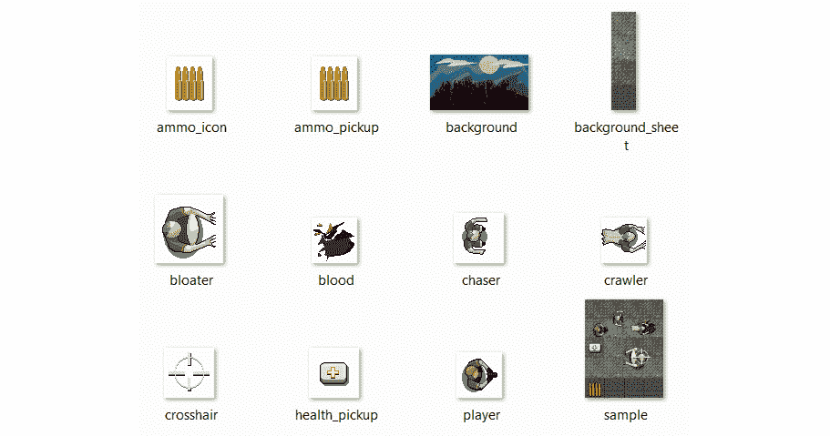
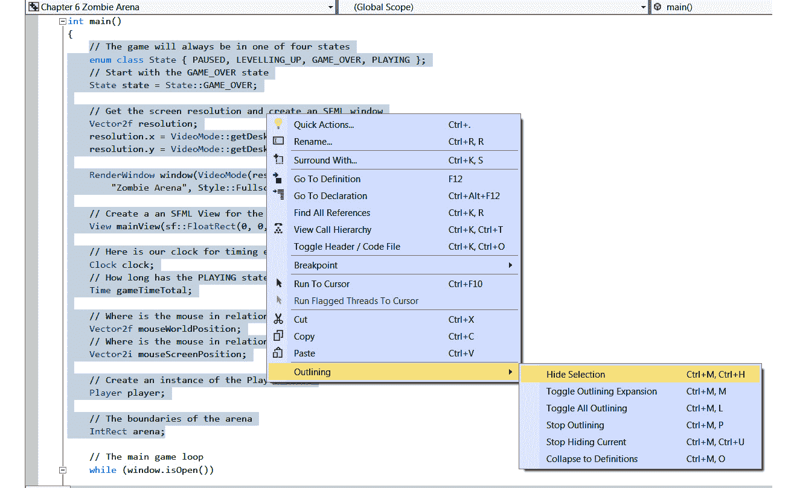

# 八、SFML 视图——开始僵尸射击游戏

在这个项目中，我们将更多地使用**OOP**并产生强大的效果。我们还将探索 SFML`View`类。这个多才多艺的课程可以让我们轻松地将游戏划分为不同的层次，以适应游戏的不同方面。在僵尸射手项目中，我们将有一个用于 HUD 的层和一个用于主游戏的层。这是必要的，因为当玩家每次清除僵尸浪潮时，游戏世界都会扩大，最终，游戏世界将比屏幕更大，需要滚动。使用`View`类将防止 HUD 的文本与背景一起滚动。在下一个项目中，我们将更进一步，创建一个由 SFML`View`类完成大部分艰苦工作的合作分屏游戏。

这是我们在本章中要做的：

*   规划和启动僵尸竞技场游戏
*   对`Player`类进行编码
*   学习 SFML`View`课程
*   构建僵尸竞技场游戏引擎
*   让`Player`班开始工作

# 规划并启动僵尸竞技场游戏

在这一点上，如果你还没有，我建议你去看一段超过 9000 个僵尸的视频*（[http://store.steampowered.com/app/273500/](http://store.steampowered.com/app/273500/) 和*深红色土地*（[http://store.steampowered.com/app/262830/](http://store.steampowered.com/app/262830/) 。我们的游戏显然不会像这两个例子中的任何一个那样深入或先进，但我们也将拥有相同的基本功能和游戏机制，例如：*

 **   平视显示器（HUD），显示详细信息，如分数、高分和剪辑中的子弹、剩余子弹数、玩家健康状况以及剩余可杀死的僵尸数。
*   玩家会在疯狂逃离僵尸的同时射杀僵尸。
*   使用*WASD*键盘键在滚动世界中移动，同时使用鼠标对准枪。
*   在每个关卡之间，玩家将选择一个“升级”关卡，该关卡将影响玩家获胜所需的游戏方式。
*   玩家需要收集“拾起物”以恢复生命和弹药。
*   每一波都会带来更多的僵尸和更大的竞技场，使其更具挑战性。

将有三种类型的僵尸飞溅。它们将具有不同的属性，例如外观、健康和速度。我们称之为追逐者、膨胀者和爬虫。请查看游戏的以下注释屏幕截图，以查看游戏中的一些功能以及组成游戏的组件和资产：


以下是关于每个编号点的更多信息：

1.  乐谱和 hi 乐谱。这些以及 HUD 的其他部分将在一个单独的层中绘制，称为视图，并由`View`类的实例表示。hi 分数将被保存并加载到文件中。
2.  将在竞技场周围建造一堵墙的纹理。该纹理包含在称为**精灵片**的单个图形中，以及其他背景纹理（点**3**、**5**和**6**）。
3.  来自 sprite 表的两个泥纹理中的第一个。
4.  这是一个“弹药收集”。当玩家得到这个，他们将得到更多的弹药。还有一个“健康提升”，玩家将从中获得更多的健康。玩家可以在僵尸浪潮之间选择升级这些皮卡。
5.  草纹理，也来自雪碧表。
6.  sprite 表中的第二个泥纹理。
7.  曾经有僵尸的血迹。
8.  HUD 的底部。从左到右，有一个图标表示弹药、剪辑中的子弹数、备用子弹数、健康栏、当前僵尸数量以及当前僵尸数量。
9.  球员的性格。
10.  玩家用鼠标瞄准的十字线。
11.  一个行动缓慢但强壮的“胖”僵尸。
12.  一个移动稍快但较弱的“爬虫”僵尸。还有一种“追逐者僵尸”，速度很快，力量也很弱。不幸的是，在他们全部被杀之前，我没能在截图中找到一个。

所以，我们有很多事情要做，还有新的 C++ 技能。让我们从创建一个新项目开始。

## 创建新项目

由于创建项目是一个相对复杂的过程，我将再次详细介绍所有步骤。对于更多的细节和图像，请参阅 OutT0.在 OrtT2 中设置木材项目 AuthT1A.第 1 章，第 4 章，第 5 章，第 6 页，C++，SFML，VisualStudio，并开始第一个游戏 Ty7 T7。

由于建立一个项目是一个复杂的过程，我们将一步一步地进行，就像我们为木材项目所做的那样。我不会给你展示和我一样的木材项目，但是这个过程是一样的，所以回溯到 TytT0。T1 章第 1 章，AtT2。让我们看一下以下步骤：

1.  启动 Visual Studio 并单击**创建新项目**按钮。如果您打开了另一个项目，您可以选择**文件****新项目**。
2.  在接下来显示的窗口中，选择**控制台应用程序**并点击**下一步**按钮。然后您将看到**配置新项目**窗口。
3.  在**配置新项目**窗口中，在**项目****名称**字段中键入`Zombie Arena`。
4.  在**位置**字段中，浏览到`VS Projects`文件夹。
5.  选中选项**将解决方案和项目放在同一目录**中。
6.  完成上述步骤后，单击**创建**。
7.  现在，我们将配置该项目以使用我们放在`SFML`文件夹中的 SFML 文件。从主菜单中选择**项目****僵尸竞技场属性…**。在此阶段，您应该打开**僵尸竞技场属性页**窗口。
8.  在**僵尸竞技场属性页**窗口中，执行以下步骤。从**配置：**下拉菜单中选择**所有配置**。
9.  现在，从左侧菜单中选择**C/C++**，然后选择**General**。
10.  接下来，找到**附加包含目录**编辑框，键入 SFML 文件夹所在的驱动器号，然后键入`\SFML\include`。如果您在 D 驱动器上找到了`SFML`文件夹，则键入的完整路径将为`D:\SFML\include`。如果在不同的驱动器上安装了 SFML，请更改路径。
11.  点击**应用**保存到目前为止的配置。
12.  现在，仍在同一窗口中，执行以下步骤。从左侧菜单中选择**链接器**，然后选择**常规**。
13.  现在，找到**附加库目录**编辑框，键入`SFML`文件夹所在的驱动器号，然后键入`\SFML\lib`。因此，如果您在 D 驱动器上找到了您的`SFML`文件夹，那么输入的完整路径将是`D:\SFML\lib`。如果将 SFML 安装到其他驱动器，请更改路径。
14.  点击**应用**保存到目前为止的配置。
15.  接下来，仍然在同一窗口中，执行以下步骤。切换**配置：**下拉菜单到**调试**，因为我们将在调试模式下运行和测试 Pong。
16.  选择**连接器**，然后**输入**。
17.  找到**附加依赖项**编辑框并单击最左侧的它。现在复制并粘贴/键入以下内容：`sfml-graphics-d.lib;sfml-window-d.lib;sfml-system-d.lib;sfml-network-d.lib;sfml-audio-d.lib;`。要格外小心，将光标正好放在编辑框当前内容的开头，以免覆盖已有的任何文本。
18.  点击**确定**。
19.  点击**应用**，然后点击**确定**。

现在，您已经配置了项目属性，几乎可以开始了。接下来，我们需要按照以下步骤将 SFML`.dll`文件复制到主项目目录中：

1.  我的主要项目目录是`D:\VS Projects\Zombie Arena`。此文件夹是由 Visual Studio 在前面的步骤中创建的。如果您将`Projects`文件夹放在其他地方，请在您的目录中执行此步骤。我们需要复制到项目文件夹中的文件位于您的`SFML\bin`文件夹中。为两个位置中的每一个打开一个窗口，并突出显示所有`.dll`文件。
2.  现在，将高亮显示的文件复制并粘贴到项目中。

该项目现已建立并准备就绪。接下来，我们将探索并添加项目资产。

## 项目资产

与之前的奥运会相比，本项目中的资产数量更多、种类更多。这些资产包括：

*   屏幕上文本的字体
*   不同动作的音效，如射击、重新加载或被僵尸击中
*   角色、僵尸和各种背景纹理的精灵表的图形

游戏所需的所有图形和声音效果都包含在下载包中。它们可以分别在`Chapter 8/graphics`和`Chapter 8/sound`文件夹中找到。

尚未提供所需的字体。这样做是为了避免有关许可证的任何可能的歧义。这不会造成问题，因为将提供下载字体以及如何选择字体以及在何处选择字体的链接。

## 探索资产

图形资源构成了我们的僵尸竞技场游戏场景的一部分。查看以下图形资产；您应该清楚游戏中的资产将用于何处：



然而，可能不太明显的是`background_sheet.png`文件，它包含四个不同的图像。这是我们前面提到的精灵表。我们将看到如何使用 SpRITE 表来保存内存并增加游戏的速度，在 Tyl T1 中，To.T2A.第 9 章 AutoT3。

声音文件都是`.wav`格式。这些文件包含触发某些事件时将播放的声音效果。详情如下:

*   `hit.wav`：僵尸与玩家接触时发出的声音。
*   `pickup.wav`：当玩家碰撞或踏上（收集）健康提升（拾取）时播放的声音。
*   `powerup.wav`：当玩家在每一波僵尸之间选择一个属性来增加力量（加电）时发出的声音。
*   `reload.wav`：令人满意的点击，让玩家知道他们已经装载了新的弹药。
*   `reload_failed.wav`：不太令人满意的声音，表示无法加载新子弹。
*   `shoot.wav`：枪声。
*   `splat.wav`：像僵尸被子弹击中的声音。

一旦决定了要使用哪些资产，就应该将它们添加到项目中。

## 将资产添加到项目中

以下说明假设您使用的所有资产都是该书的下载包。当您使用自己的资源时，只需使用相同的文件名将相应的声音或图形文件替换为您自己的文件。让我们来看看这些步骤：

1.  浏览至`D:\VS Projects\ZombieArena`。
2.  在此文件夹中创建三个新文件夹，并将其命名为`graphics`、`sound`和`fonts`。
3.  从下载包中，将`Chapter 8/graphics`的全部内容复制到`D:\VS Projects\ZombieArena\graphics`文件夹中。
4.  从下载包中，将`Chapter 6/sound`的全部内容复制到`D:\VS Projects\ZombieArena\sound`文件夹中。
5.  现在，请访问[http://www.1001freefonts.com/zombie_control.font 在 web 浏览器中下载](http://www.1001freefonts.com/zombie_control.font)并下载**僵尸控件**字体。
6.  提取压缩下载的内容并将`zombiecontrol.ttf`文件添加到`D:\VS Projects\ZombieArena\fonts`文件夹中。

现在，是时候考虑 OOP 将如何帮助我们完成这个项目，然后我们可以开始为 Zombie Arena 编写代码。

# OOP 与僵尸竞技场项目

我们面临的最初问题是当前项目的复杂性。让我们考虑一下，只有一个僵尸；以下是我们需要使其在游戏中发挥作用的内容：

*   它的水平和垂直位置
*   它的大小
*   它所面临的方向
*   每种僵尸类型都有不同的纹理
*   精灵
*   每种僵尸类型的速度不同
*   每种僵尸类型的运行状况不同
*   跟踪每个僵尸的类型
*   碰撞检测数据
*   它的智能（追逐玩家），对于每种类型的僵尸略有不同
*   僵尸是活的还是死的指示

这意味着一个僵尸可能需要十几个变量，而管理一个僵尸部落则需要这些变量的整个数组。但是机关枪、皮卡和不同级别的皮卡上的子弹呢？简单的木材！！！而乒乓球游戏也开始变得有点难以管理，很容易猜测，这个更复杂的射击游戏会更糟糕很多倍！

幸运的是，我们将把我们在前两章学到的所有 OOP 技能付诸实践，同时学习一些新的 C++ 技术。

我们将用一个类来表示玩家，以此开始我们的项目编码。

# 打造一流的玩家

让我们想想我们的`Player`课程需要做什么，以及我们需要做什么。学员需要*知道*的移动速度、当前在游戏世界中的位置以及健康状况。在玩家眼中，`Player`类是一个 2D 图形字符，因此该类需要一个`Sprite`对象和一个`Texture`对象。

此外，尽管目前原因可能并不明显，但我们的`Player`课程也将从了解游戏运行的总体环境的一些细节中获益。这些细节包括屏幕分辨率、组成竞技场的瓷砖大小以及当前竞技场的总体大小。

由于`Player`类将全权负责在每个帧中更新自身（就像蝙蝠和球一样），因此它需要知道玩家在任何给定时刻的意图。例如，玩家当前是否按住键盘方向键？或者玩家当前是否按住多个键盘方向键？布尔变量用于确定*W*、*A*、*S*和*D*键的状态，并且是必需的。

很明显，我们需要在新类中选择大量变量。在了解了 OOP 的所有知识之后，我们当然会将所有这些变量都私有化。这意味着我们必须在适当的情况下从`main`功能提供访问。

我们将使用一大堆 getter 函数以及一些函数来设置我们的对象。这些功能相当多。这个类中有 21 个函数。一开始，这似乎有点令人畏惧，但我们将通读它们，并看到它们中的大多数只是设置或获取一个私有变量。

只有几个深入的函数：`update`，它将从`main`函数中每帧调用一次，`spawn`，它将在每次生成玩家时初始化一些私有变量。然而，正如我们将看到的，没有什么复杂的东西，它们都将被详细描述。

最好的方法是对头文件进行编码。这将使我们有机会查看所有私有变量并检查所有函数签名。

提示

请密切注意返回值和参数类型，因为这将使理解函数定义中的代码更加容易。

## 对玩家类头文件进行编码

右键点击**解决方案资源管理器**中的**头文件**并选择**添加【新项目】**。在**添加新项目**窗口中，突出显示**头文件（.h）**，然后在**名称**字段中键入`Player.h`。最后，点击**添加**按钮。我们现在准备为第一个类编写头文件。

通过添加声明开始编码`Player`类，包括开头和结尾的大括号，后跟分号：

```cpp
#pragma once
#include <SFML/Graphics.hpp>
using namespace sf;
class Player
{
};
```

现在，让我们在文件中添加所有私有成员变量。根据我们已经讨论过的内容，看看您是否能够计算出他们每个人将做什么。我们将在稍后逐一介绍：

```cpp
class Player
{
private:
 const float START_SPEED = 200;
 const float START_HEALTH = 100;
 // Where is the player
 Vector2f m_Position;
 // Of course, we will need a sprite
 Sprite m_Sprite;
 // And a texture
 // !!Watch this space – Interesting changes here soon!!
 Texture m_Texture;
 // What is the screen resolution
 Vector2f m_Resolution;
 // What size is the current arena
 IntRect m_Arena;
 // How big is each tile of the arena
 int m_TileSize;
 // Which direction(s) is the player currently moving in
 bool m_UpPressed;
 bool m_DownPressed;
 bool m_LeftPressed;
 bool m_RightPressed;
 // How much health has the player got?
 int m_Health;
 // What is the maximum health the player can have
 int m_MaxHealth;
 // When was the player last hit
 Time m_LastHit;
 // Speed in pixels per second
 float m_Speed;
// All our public functions will come next
};
```

前面的代码声明了所有的成员变量。有些是正则变量，有些是对象。请注意，它们都在类的`private:`部分下，因此不能从类外直接访问。

另外，请注意，我们使用的命名约定是在非常量变量的所有名称前加上前缀`m_`。`m_`前缀将提醒我们，在编码函数定义时，它们是成员变量，不同于我们将在某些函数中创建的局部变量，也不同于函数参数。

使用的所有变量都很简单，例如`m_Position`、`m_Texture`和`m_Sprite`，分别用于玩家的当前位置、纹理和精灵。除此之外，每个变量（或变量组）都会被注释，以使其用法简单明了。

然而，为什么需要它们，以及它们将在什么环境中使用，可能并不那么明显。例如，`m_LastHit`是`Time`类型的对象，用于记录玩家上次收到僵尸攻击的时间。不清楚*为什么*我们可能需要这些信息，但我们将很快进行讨论。

当我们将游戏的其余部分拼凑在一起时，每个变量的上下文将变得更加清晰。现在，重要的是熟悉名称和数据类型，以便在项目的其余部分中轻松完成以下内容。

提示

您不需要记住变量名和类型，因为我们将在使用它们时讨论所有代码。然而，你确实需要花点时间去查看它们，并更加熟悉它们。此外，在我们继续的过程中，如果有什么不清楚的地方，可能值得参考这个头文件。

现在，我们可以添加一个完整的函数列表。添加以下突出显示的代码，看看您是否能够了解这些代码的作用。请密切注意返回类型、参数和每个函数的名称。这是理解我们将在本项目其余部分编写的代码的关键。关于每个功能，他们告诉了我们什么？添加以下突出显示的代码，然后我们将对其进行检查：

```cpp
// All our public functions will come next
public:
 Player();
 void spawn(IntRect arena, Vector2f resolution, int tileSize);
 // Call this at the end of every game
 void resetPlayerStats();

 // Handle the player getting hit by a zombie
 bool hit(Time timeHit);
 // How long ago was the player last hit
 Time getLastHitTime();
 // Where is the player
 FloatRect getPosition();
 // Where is the center of the player
 Vector2f getCenter();
 // What angle is the player facing
 float getRotation();
 // Send a copy of the sprite to the main function
 Sprite getSprite();
 // The next four functions move the player
 void moveLeft();
 void moveRight();
 void moveUp();
 void moveDown();
 // Stop the player moving in a specific direction
 void stopLeft();
 void stopRight();
 void stopUp();
 void stopDown();
 // We will call this function once every frame
 void update(float elapsedTime, Vector2i mousePosition);
 // Give the player a speed boost
 void upgradeSpeed();
 // Give the player some health
 void upgradeHealth();
 // Increase the maximum amount of health the player can have
 void increaseHealthLevel(int amount);
 // How much health has the player currently got?
 int getHealth();
};
```

首先，请注意，所有功能都是公共的。这意味着我们可以使用`main`函数中的类实例调用所有这些函数，代码如下：

```cpp
player.getSprite();
```

假设`player`是`Player`类的完全设置实例，前面的代码将返回`m_Sprite`的副本。将此代码放到真实的上下文中，我们可以在`main`函数中编写如下代码：

```cpp
window.draw(player.getSprite());
```

前面的代码将在正确的位置绘制玩家图形，就像精灵是在`main`函数中声明的一样。这就是我们在 Pong 项目中对`Bat`类所做的。

在我们开始在相应的 To.T0.file 中实现这些函数（即，写定义）之前，让我们依次看看它们中的每一个：

*   `void spawn(IntRect arena, Vector2f resolution, int tileSize)`：此函数按其名称执行。它将准备好对象以供使用，包括将其放在其起始位置（即生成它）。注意，它不返回任何数据，但有三个参数。接收一个名为`arena`的`IntRect`实例，该实例将是当前级别的大小和位置；一个`Vector2f`实例，包含屏幕分辨率；还有一个`int`，它将保持背景瓷砖的大小。
*   `void resetPlayerStats`：一旦我们赋予玩家在波浪之间升级的能力，我们需要能够在新游戏开始时移除/重置这些能力。
*   `Time getLastHitTime()`：这个函数只做一件事——它返回玩家最后一次被僵尸击中的时间。我们将在检测碰撞时使用此功能，它将允许我们确保玩家不会因为接触僵尸而频繁受到惩罚*。*
**   `FloatRect getPosition()`：此函数返回一个`FloatRect`实例，描述矩形的水平和垂直浮点坐标，其中包含玩家图形。这对于碰撞检测也很有用。*   `Vector2f getCenter()`：这与`getPosition`略有不同，因为它是`Vector2f`类型，只包含玩家图形中心的*x*和*y*位置。*   `float getRotation()`：`main`函数中的代码有时需要知道玩家当前面对的方向（以度为单位）。3 点钟为 0 度，顺时针增加。*   `Sprite getSprite()`：如前所述，此函数返回代表玩家的精灵副本。*   `void moveLeft()`、`..Right()`、`..Up()`、`..Down()`：这四个功能没有返回类型和参数。当按下一个或多个*WASD*键时，`main`函数将调用它们，`Player`类将能够动作。*   `void stopLeft()`、`..Right()`、`..Up()`、`..Down()`：这四个功能没有返回类型和参数。它们将从`main`函数调用，`Player`类将能够在一个或多个*WASD*键被释放时进行操作。*   `void update(float elapsedTime, Vector2i mousePosition)`: This will be the only long function of the entire class. It will be called once per frame from `main`. It will do everything necessary to make sure the `player` object's data is updated so that it's ready for collision detection and drawing. Notice that it returns no data but receives the amount of elapsed time since the last frame, along with a `Vector2i` instance, which will hold the horizontal and vertical screen location of the mouse pointer/crosshair.

    重要提示

    请注意，这些是整数屏幕坐标，不同于浮点世界坐标。

    *   `void upgradeSpeed()`：当玩家选择让玩家更快时，可以从升级屏幕调用该功能。*   `void upgradeHealth()`：当玩家选择让玩家更强壮（即更健康）时，可以从升级屏幕调用的另一个功能。*   `void increaseHealthLevel(int amount)`：与之前的功能有一个微妙但重要的区别，即此功能将增加玩家的生命值，达到当前设置的最大值。此功能将在玩家拾取健康拾取时使用。*   `int getHealth()`：由于健康水平是动态的，我们需要能够确定玩家在任何给定时刻的健康水平。此函数返回一个保存该值的`int`。*

 *与变量一样，现在应该清楚每个函数的用途。还有*为什么*以及使用其中一些函数的确切上下文，只有在我们进行项目时才会显示出来。

提示

您不需要记住函数名、返回类型或参数，因为我们将在使用它们时讨论代码。但是，您确实需要花时间查看它们，以及前面的解释，并更加熟悉它们。此外，在我们继续的过程中，如果有什么不清楚的地方，可能值得参考这个头文件。

现在，我们可以进入函数的核心部分：定义。

## 对玩家类函数定义进行编码

最后，我们可以开始编写完成类工作的代码。

*在**解决方案资源管理器**中**源文件**上点击*右键，选择**添加【新项目】。。。**。在 AuthT9.中添加新的条目，即“T10”窗口，突出显示（由 To.T11.左键单击 AdT12To on）AutoT13+c++ 文件（.CPP）AUT1414，然后，在 AUTT15 的名称 No.T1616 字段中，键入 TyT0.最后，点击**添加**按钮。

提示

从现在开始，我将简单地要求您创建一个新的类或头文件。因此，将前面的步骤提交到内存中，或者如果需要提醒，请返回此处。

我们现在已经准备好为这个项目中的第一个类编写`.cpp`文件。

下面是必要的 include 指令，后面是构造函数的定义。记住，当我们第一次实例化`Player`类型的对象时，将调用构造函数。将以下代码添加到`Player.cpp`文件中，然后我们可以仔细查看它：

```cpp
#include "player.h"
Player::Player()
{
    m_Speed = START_SPEED;
    m_Health = START_HEALTH;
    m_MaxHealth = START_HEALTH;
    // Associate a texture with the sprite
    // !!Watch this space!!
    m_Texture.loadFromFile("graphics/player.png");
    m_Sprite.setTexture(m_Texture);
    // Set the origin of the sprite to the center, 
    // for smooth rotation
    m_Sprite.setOrigin(25, 25);
}
```

在构造函数中（当然，它与类同名且没有返回类型），我们编写代码开始设置`Player`对象，以备使用。

要清楚；当我们从`main`函数编写以下代码时，将运行此代码：

```cpp
Player player;
```

现在不要添加前一行代码。

我们在构造函数中所做的就是根据它们的相关常量初始化`m_Speed`、`m_Health`和`m_MaxHealth`。然后，我们将玩家图形加载到`m_Texture`中，将`m_Texture`与`m_Sprite`关联，并将`m_Sprite`的原点设置到中心`(25, 25)`。

提示

请注意隐晦的注释`// !!Watch this space!!`，这表示我们将返回到纹理的加载以及一些与之相关的重要问题。我们最终会改变我们如何处理这种纹理，一旦我们发现了问题，并学到了更多的 C++。我们将在[*第 10 章*](10.html#_idTextAnchor214)*、指针、标准模板库和纹理管理*中进行。

接下来，我们将对`spawn`函数进行编码。我们将只创建一个`Player`类的实例。然而，我们需要为每一个波将其生成到当前级别。这就是`spawn`函数将为我们处理的内容。将以下代码添加到`Player.cpp`文件中，确保检查详细信息并阅读注释：

```cpp
void Player::spawn(IntRect arena, 
        Vector2f resolution, 
        int tileSize)
{
    // Place the player in the middle of the arena
    m_Position.x = arena.width / 2;
    m_Position.y = arena.height / 2;
    // Copy the details of the arena 
    // to the player's m_Arena
    m_Arena.left = arena.left;
    m_Arena.width = arena.width;
    m_Arena.top = arena.top;
    m_Arena.height = arena.height;
    // Remember how big the tiles are in this arena
    m_TileSize = tileSize;
    // Store the resolution for future use
    m_Resolution.x = resolution.x;
    m_Resolution.y = resolution.y;
}
```

前面的代码首先将`m_Position.x`和`m_Position.y`值初始化为传入`arena`的高度和宽度的一半。这具有将玩家移动到关卡中心的效果，无论其大小。

接下来，我们将传入的`arena`的所有坐标和维度复制到相同类型的成员对象`m_Arena`。当前竞技场的大小和坐标的细节被频繁使用，这样做是有意义的。我们现在可以使用`m_Arena`来完成一些任务，比如确保玩家不能穿墙。除此之外，出于同样的目的，我们将传入的`tileSize`实例复制到成员变量`m_TileSize`。我们将在`update`功能中看到`m_Arena`和`m_TileSize`的作用。

前面代码的最后两行将屏幕分辨率从`Vector2f` `resolution`（是`spawn`的一个参数）复制到`m_Resolution`（是`Player`的一个成员变量）。我们现在可以在`Player`类中访问这些值。

现在，添加非常简单的`resetPlayerStats`函数代码：

```cpp
void Player::resetPlayerStats()
{
    m_Speed = START_SPEED;
    m_Health = START_HEALTH;
    m_MaxHealth = START_HEALTH;
}
```

当玩家死亡时，我们将使用它重置他们可能使用的任何升级。

在项目即将完成之前，我们不会编写调用`resetPlayerStats`函数的代码，但它已经为我们需要它的时候做好了准备。

在代码的下一部分中，我们将再添加两个函数。他们将处理玩家被僵尸击中时发生的事情。我们将能够在当前游戏时间内呼叫`player.hit()`并通过。我们还可以通过调用`player.getLastHitTime()`查询玩家最后一次被击中的时间。当我们有一些僵尸时，这些函数的实用性将变得非常明显。

将两个新的定义添加到 HORT T0 文件中，然后再仔细检查 C++ 代码：

```cpp
Time Player::getLastHitTime()
{
    return m_LastHit;
}
bool Player::hit(Time timeHit)
{
    if (timeHit.asMilliseconds() 
        - m_LastHit.asMilliseconds() > 200)
    {
        m_LastHit = timeHit;
        m_Health -= 10;
        return true;
    }
    else
    {
        return false;
    }
}
```

`getLastHitTime()`的代码非常简单；它将返回`m_LastHit`中存储的任何值。

`hit`功能更加深入细致。首先，`if`语句检查作为参数传入的时间是否比`m_LastHit`中存储的时间提前 200 毫秒。如果是，`m_LastHit`会随着时间的推移而更新，`m_Health`会从其当前值中扣除 10。`if`语句中的最后一行代码是`return true`。注意，`else`子句只是将`false`返回给调用代码。

此功能的总体效果是，每秒最多只能从玩家身上扣除五次生命值。请记住，我们的游戏循环可能以每秒数千次迭代的速度运行。在这种情况下，如果没有此功能提供的限制，僵尸只需与玩家接触一秒钟，就会扣除数万点生命值。`hit`功能控制并限制此现象。它还通过返回`true`或`false`让调用代码知道是否注册了新的命中。

这段代码意味着我们将在`main`函数中检测僵尸和玩家之间的冲突。然后我们将致电`player.hit()`决定是否扣除任何健康积分。

接下来，对于`Player`类，我们将实现一系列 getter 函数。它们允许我们将数据整齐地封装在`Player`类中，同时将其值提供给`main`函数。

在上一个块的后面添加以下代码：

```cpp
FloatRect Player::getPosition()
{
    return m_Sprite.getGlobalBounds();
}
Vector2f Player::getCenter()
{
    return m_Position;
}
float Player::getRotation()
{
    return m_Sprite.getRotation();
}
Sprite Player::getSprite()
{
    return m_Sprite;
}
int Player::getHealth()
{
    return m_Health;
}
```

前面的代码非常简单。前面五个函数中的每一个都返回一个成员变量的值。仔细查看每一个函数，熟悉哪个函数返回哪个值。

接下来的八个短函数启用键盘控件（我们将从`main`函数中使用），以便我们可以更改`Player`类型的对象中包含的数据。将以下代码添加到`Player.cpp`文件中，然后我们将总结其工作原理：

```cpp
void Player::moveLeft()
{
    m_LeftPressed = true;
}
void Player::moveRight()
{
    m_RightPressed = true;
}
void Player::moveUp()
{
    m_UpPressed = true;
}
void Player::moveDown()
{
    m_DownPressed = true;
}
void Player::stopLeft()
{
    m_LeftPressed = false;
}
void Player::stopRight()
{
    m_RightPressed = false;
}
void Player::stopUp()
{
    m_UpPressed = false;
}
void Player::stopDown()
{
    m_DownPressed = false;
}
```

前面的代码有四个函数（`moveLeft`、`moveRight`、`moveUp`、`moveDown`），它们将相关的布尔变量（`m_LeftPressed`、`m_RightPressed`、`m_UpPressed`、`m_DownPressed`设置为`true`。其他四个函数（`stopLeft`、`stopRight`、`stopUp`和`stopDown`的作用正好相反，将相同的布尔变量设置为`false`。`Player`类的实例现在可以随时了解*WASD*键中哪些被按下，哪些没有被按下。

下面的函数是完成所有艰苦工作的函数。`update`函数将在游戏循环的每一帧中调用一次。添加以下代码，然后我们将详细检查它。如果我们按照前面的八个功能进行操作，并且还记得我们是如何为木材制作云和蜜蜂的动画的！！！项目和乒乓球的球拍和球，我们可能会理解以下大部分代码：

```cpp
void Player::update(float elapsedTime, Vector2i mousePosition)
{
    if (m_UpPressed)
    {
        m_Position.y -= m_Speed * elapsedTime;
    }
    if (m_DownPressed)
    {
        m_Position.y += m_Speed * elapsedTime;
    }
    if (m_RightPressed)
    {
        m_Position.x += m_Speed * elapsedTime;
    }
    if (m_LeftPressed)
    {
        m_Position.x -= m_Speed * elapsedTime;
    }
    m_Sprite.setPosition(m_Position);
    // Keep the player in the arena
    if (m_Position.x > m_Arena.width - m_TileSize)
    {
        m_Position.x = m_Arena.width - m_TileSize;
    }
    if (m_Position.x < m_Arena.left + m_TileSize)
    {
        m_Position.x = m_Arena.left + m_TileSize;
    }
    if (m_Position.y > m_Arena.height - m_TileSize)
    {
        m_Position.y = m_Arena.height - m_TileSize;
    }
    if (m_Position.y < m_Arena.top + m_TileSize)
    {
        m_Position.y = m_Arena.top + m_TileSize;
    }
    // Calculate the angle the player is facing
    float angle = (atan2(mousePosition.y - m_Resolution.y / 2,
        mousePosition.x - m_Resolution.x / 2)
        * 180) / 3.141;
    m_Sprite.setRotation(angle);
}
```

前面代码的第一部分移动玩家精灵。四个`if`语句检查哪些与运动相关的布尔变量（`m_LeftPressed`、`m_RightPressed`、`m_UpPressed`或`m_DownPressed`为真，并相应地更改`m_Position.x`和`m_Position.y`。还使用前两个项目中相同的公式计算移动量：

**位置（+或-）速度*经过的时间。**

在这四条`if`语句之后，调用`m_Sprite.setPosition`并传入`m_Position`。精灵现在已经被调整到一帧的正确数量。

接下来的四个`if`语句检查`m_Position.x`或`m_Position.y`是否超出当前竞技场的任何边缘。请记住，当前竞技场的范围存储在`m_Arena`中的`spawn`函数中。让我们看看这四个`if`语句中的第一个，以便理解它们：

```cpp
if (m_Position.x > m_Arena.width - m_TileSize)
{
    m_Position.x = m_Arena.width - m_TileSize;
}
```

前面的代码测试`m_position.x`是否大于`m_Arena.width`，减去瓷砖的大小（`m_TileSize`。我们将在创建背景图形时看到，此计算将检测到玩家误入墙中。

当`if`语句为真时，`m_Arena.width - m_TileSize`计算用于初始化`m_Position.x`。这意味着玩家图形的中心永远无法偏离右侧墙的左侧边缘。

接下来的三个`if`语句，即我们刚才讨论的那个语句之后的三个`if`语句，除了对其他三堵墙做同样的事情。

前面代码中的最后两行计算并设置玩家精灵旋转的角度（即朝向）。这行代码看起来可能有点复杂，但它只是简单地使用十字线的位置（`mousePosition.x`和`mousePosition.y`）以及屏幕的中心（`m_Resolution.x`和`m_Resolution.y`）在一个经过尝试和测试的三角函数中。

`atan`如何使用这些坐标以及 Pi（3.141）是相当复杂的，这就是为什么它被包装在一个方便的函数中。

重要提示

如果您想更详细地研究三角函数，可以在此处进行：[http://www.cplusplus.com/reference/cmath/](http://www.cplusplus.com/reference/cmath/) 。

我们将为`Player`类添加的最后三个函数分别使玩家的速度提高 20%，使玩家的生命值增加 20%，并使玩家的生命值增加传入的数量。

在`Player.cpp`文件的末尾添加以下代码，我们将仔细查看：

```cpp
void Player::upgradeSpeed()
{
    // 20% speed upgrade
    m_Speed += (START_SPEED * .2);
}
void Player::upgradeHealth()
{
    // 20% max health upgrade
    m_MaxHealth += (START_HEALTH * .2);
}
void Player::increaseHealthLevel(int amount)
{
    m_Health += amount;
    // But not beyond the maximum
    if (m_Health > m_MaxHealth)
    {
        m_Health = m_MaxHealth;
    }
}
```

在前面的代码中，`upgradeSpeed()`和`upgradeHealth()`函数分别增加`m_Speed`和`m_MaxHealth`中存储的值。通过将起始值乘以.2 并将其添加到当前值，这些值将增加 20%。当玩家在两个关卡之间选择他们想要改善的角色属性（即升级）时，这些函数将从`main`函数调用。

`increaseHealthLevel()`函数从`amount`参数中的`main`获取`int`值。这个`int`值将由一个名为`Pickup`的类提供，我们将在[*第 11 章*](11.html#_idTextAnchor249)*、碰撞检测、皮卡和子弹*中写入。`m_Health`成员变量按传入值增加。然而，对于球员来说有一个陷阱。`if`语句检查`m_Health`是否超过`m_MaxHealth`，如果超过，则将其设置为`m_MaxHealth`。这意味着玩家不能简单地从拾取中获得无限的生命值。相反，他们必须小心地平衡他们在不同级别之间选择的升级。

当然，我们的`Player`类不能做任何事情，除非我们实例化它并将其应用到我们的游戏循环中。在此之前，我们先来看看游戏摄像机的概念。

# 用 SFML 视图控制游戏摄像机

在我看来，SFML`View`类是最整洁的类之一。读完这本书后，当我们在不使用媒体/游戏库的情况下制作游戏时，我们会真正注意到`View`的缺失。

AutoT0.类允许我们考虑我们的游戏在它自己的世界中发生，具有它自己的属性。我是什么意思？嗯，当我们创建一个游戏时，我们通常试图创建一个虚拟世界。虚拟世界很少，如果有的话，是以像素来衡量的，而且很少，如果有的话，这个世界的像素数将与玩家的显示器相同。我们需要一种方法来抽象我们正在构建的虚拟世界，以便它可以是我们喜欢的任何大小或形状。

另一种看待 SFML`View`的方式是将其视为一个摄像头，玩家可以通过它查看虚拟世界的一部分。大多数游戏都会有一个以上的摄像头/世界视图。

例如，考虑一个分屏游戏，两个玩家可以同时在世界的不同地方。

或者，考虑一个游戏，其中有一个小区域的屏幕代表整个游戏世界，但在一个非常高的水平/放大，像一个迷你地图。

即使我们的游戏比前两个例子简单得多，并且不需要分割屏幕或迷你地图，我们也可能希望创建一个比正在玩的屏幕更大的世界。当然，僵尸竞技场就是这样。

此外，如果我们不断移动游戏摄像机来显示虚拟世界的不同部分（通常是跟踪玩家），HUD 会发生什么变化？如果我们绘制分数和其他屏幕上的 HUD 信息，然后我们滚动世界以跟随玩家，分数将相对于该相机移动。

SFML`View`类可以轻松启用所有这些特性，并用非常简单的代码解决这个问题。诀窍是为每个摄像头创建一个`View`实例——可能是迷你地图的`View`实例，滚动游戏世界的`View`实例，然后是 HUD 的`View`实例。

`View`的实例可以根据需要四处移动、调整大小和位置。因此，游戏后的主`View`实例可以跟踪玩家，迷你地图视图可以保持在屏幕的固定、缩小的小角落，HUD 可以覆盖整个屏幕，永远不会移动，尽管主`View`实例可以在玩家去的任何地方。

让我们看一下使用几个`View`实例的一些代码。

提示

此代码用于介绍`View`类。不要将此代码添加到僵尸竞技场项目中。

创建并初始化几个`View`实例：

```cpp
// Create a view to fill a 1920 x 1080 monitor
View mainView(sf::FloatRect(0, 0, 1920, 1080));
// Create a view for the HUD
View hudView(sf::FloatRect(0, 0, 1920, 1080));
```

前面的代码创建了两个填充 1920 x 1080 监视器的`View`对象。现在，我们可以让`mainView`变魔术，同时让`hudView`完全独处：

```cpp
// In the update part of the game
// There are lots of things you can do with a View
// Make the view centre around the player                
mainView.setCenter(player.getCenter());
// Rotate the view 45 degrees
mainView.rotate(45)
// Note that hudView is totally unaffected by the previous code
```

当我们操纵`View`实例的属性时，我们是这样做的。当我们在视图中绘制精灵、文本或其他对象时，我们必须明确地**将**视图设置为窗口的当前视图：

```cpp
// Set the current view
window.setView(mainView);
```

现在，我们可以在该视图中绘制我们想要的所有内容：

```cpp
// Do all the drawing for this view
window.draw(playerSprite);
window.draw(otherGameObject);
// etc
```

玩家可能处于任何坐标；这并不重要，因为`mainView`以图形为中心。

现在，我们可以将 HUD 绘制到`hudView`。请注意，就像我们从后面到前面在层中绘制单个元素（背景、游戏对象、文本等），我们也从后面到前面绘制视图。因此，在主游戏场景后绘制 HUD：

```cpp
// Switch to the hudView
window.setView(hudView);
// Do all the drawing for the HUD
window.draw(scoreText);
window.draw(healthBar);
// etc
```

最后，我们可以用通常的方式绘制/显示当前帧的窗口及其所有视图：

```cpp
window.display();
```

提示

如果您想进一步了解 SFML`View`而不是本项目所需的内容，包括如何实现分屏和迷你地图，那么最好的网站指南是 SFML 官方网站：[https://www.sfml-dev.org/tutorials/2.5/graphics-view.php](https://www.sfml-dev.org/tutorials/2.5/graphics-view.php) 。

现在我们已经了解了`View`，我们可以开始编写僵尸竞技场`main`函数，并将我们的第一个`View`实例用于实际。在[*第 12 章*](12.html#_idTextAnchor272)*分层视图和实现 HUD*中，我们将为 HUD 引入第二个`View`实例，并将其分层到主`View`实例的顶部。

# 启动僵尸竞技场游戏引擎

在这个游戏中，我们需要在`main`中稍微升级一下游戏引擎。我们将有一个名为`state`的枚举，它将跟踪游戏的当前状态。然后，在整个`main`中，我们可以包装部分代码，以便在不同的状态下发生不同的事情。

当我们创建项目时，VisualStudio 为我们创建了一个名为`ZombieArena.cpp`的文件。这将是包含我们的`main`函数和实例化和控制所有类的代码的文件。

我们从现在熟悉的`main`函数和一些包含指令开始。注意为`Player`类添加了 include 指令。

将以下代码添加到`ZombieArena.cpp`文件中：

```cpp
#include <SFML/Graphics.hpp>
#include "Player.h"
using namespace sf;
int main()
{
    return 0;
}
```

前面的代码中没有什么新内容，除了`#include "Player.h"`行意味着我们现在可以在代码中使用`Player`类。

让我们充实一下我们的游戏引擎。下面的代码做了很多工作。在添加代码时，请务必阅读注释，以了解正在发生的事情。然后我们将更详细地讨论它。

在`main`功能开始处添加以下突出显示的代码：

```cpp
int main()
{
 // The game will always be in one of four states
 enum class State { PAUSED, LEVELING_UP, 
 GAME_OVER, PLAYING };

 // Start with the GAME_OVER state
 State state = State::GAME_OVER;
 // Get the screen resolution and 
 // create an SFML window
 Vector2f resolution;
 resolution.x = 
 VideoMode::getDesktopMode().width;
 resolution.y = 
 VideoMode::getDesktopMode().height;
 RenderWindow window(
 VideoMode(resolution.x, resolution.y), 
 "Zombie Arena", Style::Fullscreen);
 // Create a an SFML View for the main action
 View mainView(sf::FloatRect(0, 0, 
 resolution.x, resolution.y));
 // Here is our clock for timing everything
 Clock clock;
 // How long has the PLAYING state been active
 Time gameTimeTotal;
 // Where is the mouse in 
 // relation to world coordinates
 Vector2f mouseWorldPosition;
 // Where is the mouse in 
 // relation to screen coordinates
 Vector2i mouseScreenPosition;
 // Create an instance of the Player class
 Player player;
 // The boundaries of the arena
 IntRect arena;
 // The main game loop
 while (window.isOpen())
 {

 }
    return 0;
}
```

让我们浏览一下我们输入的所有代码的每个部分。在`main`函数中，我们有以下代码：

```cpp
// The game will always be in one of four states
enum class State { PAUSED, LEVELING_UP, GAME_OVER, PLAYING };
// Start with the GAME_OVER state
State state = State::GAME_OVER;
```

前面的代码创建了一个名为`State`的新枚举类。然后，代码创建一个名为`state`的`State`类实例。`state`枚举现在可以是声明中定义的四个值之一。这些值分别为`PAUSED`、`LEVELING_UP`、`GAME_OVER`和`PLAYING`。这四个值正是我们跟踪和响应游戏在任何给定时间可能处于的不同状态所需要的。请注意，`state`不可能一次保存多个值。

紧接着，我们添加了以下代码：

```cpp
// Get the screen resolution and create an SFML window
Vector2f resolution;
resolution.x = VideoMode::getDesktopMode().width;
resolution.y = VideoMode::getDesktopMode().height;
RenderWindow window(VideoMode(resolution.x, resolution.y), 
    "Zombie Arena", Style::Fullscreen);
```

前面的代码声明了一个名为`resolution`的`Vector2f`实例。我们通过调用`width`和`height`的`VideoMode::getDesktopMode`函数来初始化`resolution`（`x`和`y`的两个成员变量。`resolution`对象现在拥有游戏运行的监视器的分辨率。最后一行代码使用适当的分辨率创建一个名为`window`的新`RenderWindow`实例。

下面的代码创建一个 SFML`View`对象。视图（最初）定位在监视器像素的精确坐标处。如果我们使用这个`View`在当前位置绘制一些图形，它将与绘制没有视图的窗口相同。然而，我们最终将开始将这一观点转移到玩家需要看到的游戏世界的各个部分。然后，当我们开始使用第二个`View`实例时，它保持不变（对于 HUD），我们将看到这个`View`实例如何跟踪动作，而另一个实例保持不变以显示 HUD：

```cpp
// Create a an SFML View for the main action
View mainView(sf::FloatRect(0, 0, resolution.x, resolution.y));
```

接下来，我们创建了一个`Clock`实例来进行计时，并创建了一个名为`gameTimeTotal`的`Time`对象，该对象将保存已过的游戏总时间。随着项目的进展，我们还将引入更多变量和对象来处理时间安排：

```cpp
// Here is our clock for timing everything
Clock clock;
// How long has the PLAYING state been active
Time gameTimeTotal;
```

下面的代码声明了两个向量：一个包含两个`float`变量，称为`mouseWorldPosition`，另一个包含两个整数，称为`mouseScreenPosition`。鼠标指针有点反常，因为它存在于两个不同的坐标空间中。如果我们愿意，我们可以把它们想象成平行宇宙。首先，当玩家在世界各地移动时，我们需要跟踪十字线在那个世界的位置。这些将是浮点坐标，并将存储在`mouseWorldCoordinates`中。当然，监视器本身的实际像素坐标永远不会改变。对于水平分辨率-1，垂直分辨率-1，它们将始终为 0,0。我们将使用`mouseScreenPosition`中存储的整数跟踪鼠标指针相对于该坐标空间的位置：

```cpp
// Where is the mouse in relation to world coordinates
Vector2f mouseWorldPosition;
// Where is the mouse in relation to screen coordinates
Vector2i mouseScreenPosition;
```

最后，我们开始使用`Player`类。这行代码将导致构造函数（`Player::Player`）执行。如果您想刷新有关此功能的记忆，请参阅`Player.cpp`：

```cpp
// Create an instance of the Player class
Player player;
```

此`IntRect`对象将保持起始水平和垂直坐标，以及宽度和高度。一旦初始化，我们将能够访问当前竞技场的大小和位置详细信息，代码为`arena.left`、`arena.top`、`arena.width`和`arena.height`：

```cpp
// The boundaries of the arena
IntRect arena;
```

当然，我们前面添加的代码的最后一部分是我们的游戏循环：

```cpp
// The main game loop
while (window.isOpen())
{
}
```

我们可能已经注意到代码变得相当长。我们将在下一节讨论这一不便之处。

# 管理代码文件

使用类和函数进行抽象的优点之一是可以减少代码文件的长度（行数）。尽管我们将在这个项目中使用十几个代码文件，`ZombieArena.cpp`中的代码长度在接近结尾时仍然会变得有点笨拙。在最后一个项目“太空入侵者++”中，我们将研究更多抽象和管理代码的方法。

现在，请使用此技巧使事情易于管理。请注意，Visual Studio 中代码编辑器的左侧有几个**+**和**-**符号，其中一个如下图所示：


代码的每个块（`if`、`while`、`for`等）将有一个符号。您可以通过点击**+**和**-**标志来展开和折叠这些块。我建议保留所有当前未讨论的代码。这将使事情更加清楚。

此外，我们可以创建自己的可折叠块。我建议在主游戏循环开始之前用所有代码制作一个可折叠块。要执行此操作，请高亮显示代码，然后*右键单击*并选择**概述****隐藏选择**，如下图所示：



现在，您可以点击**-**和**+**标志来展开和折叠区块。每次我们在主游戏循环之前添加代码（这将是非常常见的），您可以展开代码，添加新行，然后再次折叠它。以下屏幕截图显示了代码折叠时的外观：


这比以前更容易管理。现在，我们可以从主游戏循环开始。

# 开始对主游戏循环进行编码

如您所见，前面代码的最后一部分是游戏循环（`while (window.isOpen()){}`。我们现在将关注这一点。具体来说，我们将对游戏循环的输入处理部分进行编码。

我们将要添加的代码相当长。不过，这并没有什么复杂的地方，我们将在稍后对其进行全面检查。

将以下突出显示的代码添加到游戏循环中：

```cpp
// The main game loop
while (window.isOpen())
{
 /*
 ************
 Handle input
 ************
 */
 // Handle events by polling
 Event event;
 while (window.pollEvent(event))
 {
 if (event.type == Event::KeyPressed)
 { 
 // Pause a game while playing
 if (event.key.code == Keyboard::Return &&
 state == State::PLAYING)
 {
 state = State::PAUSED;
 }
 // Restart while paused
 else if (event.key.code == Keyboard::Return &&
 state == State::PAUSED)
 {
 state = State::PLAYING;
 // Reset the clock so there isn't a frame jump
 clock.restart();
 }
 // Start a new game while in GAME_OVER state
 else if (event.key.code == Keyboard::Return &&
 state == State::GAME_OVER)
 {
 state = State::LEVELING_UP;
 }
 if (state == State::PLAYING)
 {
 }
 }
 }// End event polling
}// End game loop
```

在前面的代码中，我们实例化了一个`Event`类型的对象。我们将使用`event`，就像在以前的项目中一样，对系统事件进行轮询。为此，我们将上一个块中的其余代码包装在一个带有`window.pollEvent(event)`条件的`while`循环中。这将继续循环每个帧，直到没有更多的事件要处理。

在这个`while`循环中，我们处理我们感兴趣的事件。首先，我们测试`Event::KeyPressed`事件。如果在游戏处于`PLAYING`状态时按下*返回*键，则我们将`state`切换到`PAUSED`。

如果在游戏处于`PAUSED`状态时按下*返回*键，则我们将`state`切换到`PLAYING`并重新启动`clock`对象。我们从`PAUSED`切换到`PLAYING`后重新启动`clock`的原因是，当游戏暂停时，经过的时间仍在累积。如果我们不重新启动时钟，我们的所有对象都会更新它们的位置，就好像帧刚刚花了很长时间一样。当我们充实此文件中的其余代码时，这一点将变得更加明显。

然后我们有一个`else if`块来测试在游戏处于`GAME_OVER`状态时是否按下了`Return`键。如果是，则将`state`更改为`LEVELING_UP`。

重要提示

注意，`GAME_OVER`状态是显示主屏幕的状态。所以，`GAME_OVER`状态是玩家刚死后，玩家第一次运行游戏时的状态。玩家在每场比赛中首先要做的事情就是选择一个属性进行改进（即升级）。

在前面的代码中，有一个最终的`if`条件来测试状态是否等于`PLAYING`。此`if`块为空，我们将在整个项目中向其添加代码。

提示

在整个项目中，我们将向该文件的许多不同部分添加代码。因此，花时间了解我们的游戏可能处于的不同状态以及我们在哪里处理它们是值得的。在适当的时候折叠和扩展不同的`if`、`else`和`while`块也是非常有益的。

花些时间彻底熟悉我们刚刚编码的`while`、`if`和`else if`块。我们会定期转介他们。

接下来，在前面的代码之后，仍然在游戏循环中，仍然在处理输入，添加下面突出显示的代码。请注意，现有代码（未突出显示）准确显示了新代码（突出显示）的位置：

```cpp
    }// End event polling
 // Handle the player quitting
 if (Keyboard::isKeyPressed(Keyboard::Escape))
 {
 window.close();
 }
 // Handle WASD while playing
 if (state == State::PLAYING)
 {
 // Handle the pressing and releasing of the WASD keys
 if (Keyboard::isKeyPressed(Keyboard::W))
 {
 player.moveUp();
 }
 else
 {
 player.stopUp();
 }
 if (Keyboard::isKeyPressed(Keyboard::S))
 {
 player.moveDown();
 }
 else
 {
 player.stopDown();
 }
 if (Keyboard::isKeyPressed(Keyboard::A))
 {
 player.moveLeft();
 }
 else
 {
 player.stopLeft();
 }
 if (Keyboard::isKeyPressed(Keyboard::D))
 {
 player.moveRight();
 }
 else
 {
 player.stopRight();
 }
 }// End WASD while playing
}// End game loop
```

在前面的代码中，我们首先测试玩家是否按下了*退出*键。如果按下，游戏窗口将关闭。

接下来，在一个大的`if(state == State::PLAYING)`区块内，我们依次检查每个*WASD*键。如果按下一个键，我们调用相应的`player.move...`函数。如果不是，我们调用相关的`player.stop...`函数。

此代码确保在每一帧中，玩家对象将使用按下和未按下的*WASD*键进行更新。`player.move...`和`player.stop...`函数将信息存储在成员布尔变量（`m_LeftPressed`、`m_RightPressed`、`m_UpPressed`和`m_DownPressed`中。然后，`Player`类在`player.update`函数的每一帧中响应这些布尔值，我们将在游戏循环的更新部分调用这些函数。

现在，我们可以处理键盘输入，让玩家在每场比赛开始时以及每场比赛之间升级。添加并研究以下突出显示的代码，然后我们将对其进行讨论：

```cpp
    }// End WASD while playing
 // Handle the LEVELING up state
 if (state == State::LEVELING_UP)
 {
 // Handle the player LEVELING up
 if (event.key.code == Keyboard::Num1)
 {
 state = State::PLAYING;
 }
 if (event.key.code == Keyboard::Num2)
 {
 state = State::PLAYING;
 }
 if (event.key.code == Keyboard::Num3)
 {
 state = State::PLAYING;
 }
 if (event.key.code == Keyboard::Num4)
 {
 state = State::PLAYING;
 }
 if (event.key.code == Keyboard::Num5)
 {
 state = State::PLAYING;
 }
 if (event.key.code == Keyboard::Num6)
 {
 state = State::PLAYING;
 }

 if (state == State::PLAYING)
 { 
 // Prepare the level
 // We will modify the next two lines later
 arena.width = 500;
 arena.height = 500;
 arena.left = 0;
 arena.top = 0;
 // We will modify this line of code later
 int tileSize = 50;
 // Spawn the player in the middle of the arena
 player.spawn(arena, resolution, tileSize);

 // Reset the clock so there isn't a frame jump
 clock.restart();
 }
 }// End LEVELING up

}// End game loop
```

在前面的代码中，我们处理键盘键*1*、*2*、*3*、*4*、*5*和*6*，测试`state`的当前值是否等于`LEVELING_UP`。在`if`块中，我们只需将`state`设置为`State::PLAYING`。我们将在后面的[*第 13 章*](13.html#_idTextAnchor279)*中添加一些代码来处理每个升级选项、音效、文件 I/O 和完成游戏*。

此代码执行以下操作：

1.  如果`state`等于`LEVELING_UP`，等待*1*、*2*、*3*、*4*、*5*或*6*按键按下。
2.  按下时，将`state`更改为`PLAYING`。
3.  当状态改变时，仍然在`if (state == State::LEVELING_UP)`块内，嵌套的`if(state == State::PLAYING)`块将运行。
4.  在该块中，我们设置`arena`的位置和大小，将`tileSize`设置为`50`，将所有信息传递给`player.spawn`，并调用`clock.restart`。

现在，我们有了一个实际生成的玩家对象，它知道自己的环境，可以响应按键。现在，我们可以在每次通过循环时更新场景。

确保从游戏循环的输入处理部分整齐地折叠代码，因为我们现在已经完成了。下面的代码位于游戏循环的更新部分。添加并研究以下突出显示的代码，然后我们可以讨论它：

```cpp
    }// End LEVELING up
 /*
 ****************
 UPDATE THE FRAME
 ****************
 */
 if (state == State::PLAYING)
 {
 // Update the delta time
 Time dt = clock.restart();

 // Update the total game time
 gameTimeTotal += dt;

 // Make a decimal fraction of 1 from the delta time
 float dtAsSeconds = dt.asSeconds();
 // Where is the mouse pointer
 mouseScreenPosition = Mouse::getPosition();
 // Convert mouse position to world coordinates of mainView
 mouseWorldPosition = window.mapPixelToCoords(
 Mouse::getPosition(), mainView);
 // Update the player
 player.update(dtAsSeconds, Mouse::getPosition());
 // Make a note of the players new position
 Vector2f playerPosition(player.getCenter());

 // Make the view centre around the player 
 mainView.setCenter(player.getCenter());
 }// End updating the scene

}// End game loop
```

首先，注意前面的代码被包装在一个测试中，以确保游戏处于`PLAYING`状态。如果游戏已暂停、已结束或玩家正在选择升级内容，我们不希望此代码运行。

首先，我们重新启动时钟并将前一帧的时间存储在`dt`变量中：

```cpp
// Update the delta time
Time dt = clock.restart();
```

接下来，我们将前一帧的时间添加到游戏运行的累计时间中，如`gameTimeTotal`所示：

```cpp
// Update the total game time
gameTimeTotal += dt;
```

现在，我们使用`dt.AsSeconds`函数返回的值初始化一个名为`dtAsSeconds`的`float`变量。对于大多数帧，这将是 1 的一小部分。这非常适合传递到`player.update`函数，用于计算移动玩家精灵的量。

现在，我们可以使用`MOUSE::getPosition`函数初始化`mouseScreenPosition`。

重要提示

您可能想知道获取鼠标位置的语法有点不寻常。这称为一个**静态函数**。如果我们用 static 关键字在类中定义函数，我们可以使用类名调用该函数，而不需要类的实例。C++ OOP 有很多怪癖和规则。随着我们的进步，我们将看到更多。

然后使用`window`上的 SFML`mapPixelToCoords`函数初始化`mouseWorldPosition`。我们在本章前面讨论`View`类时讨论了这个函数。

此时，我们可以根据需要调用`player.update`并传入`dtAsSeconds`和鼠标的位置。

我们将玩家的新中心存储在名为`playerPosition`的`Vector2f`实例中。目前，这是未使用的，但我们将在项目的后面使用它。

然后，我们可以使用`mainView.setCenter(player.getCenter())`将视图集中在玩家最新位置的中心。

我们现在可以把玩家拉到屏幕上了。添加以下突出显示的代码，将主游戏循环的平局部分拆分为不同的状态：

```cpp
        }// End updating the scene
 /*
 **************
 Draw the scene
 **************
 */
 if (state == State::PLAYING)
 {
 window.clear();
 // set the mainView to be displayed in the window
 // And draw everything related to it
 window.setView(mainView);
 // Draw the player
 window.draw(player.getSprite());
 }
 if (state == State::LEVELING_UP)
 {
 }
 if (state == State::PAUSED)
 {
 }
 if (state == State::GAME_OVER)
 {
 }
 window.display();
    }// End game loop
    return 0;
}
```

在前面代码的`if(state == State::PLAYING)`部分中，我们清除屏幕，将窗口视图设置为`mainView`，然后用`window.draw(player.getSprite())`绘制玩家精灵。

在处理完所有不同的状态后，代码以通常的方式用`window.display();`显示场景。

你可以运行游戏，看到我们的玩家角色随着鼠标的移动而旋转。

提示

运行游戏时，需要按*键*开始游戏，然后选择*1*到*6*之间的数字，模拟选择升级选项。然后，游戏就开始了。

您还可以在（空的）500 x 500 像素竞技场内移动玩家。您可以在屏幕中央看到我们的孤独玩家，如下所示：


然而，你没有任何运动感，因为我们没有实现背景。我们将在下一章中这样做。

# 总结

呸！那是一个很长的问题。本章我们做了很多工作：我们为僵尸竞技场项目`Player`构建了第一个类，并将其用于游戏循环。我们还学习并使用了`View`类的一个实例，尽管我们还没有探讨它给我们带来的好处。

在下一章中，我们将通过探索什么是精灵床单来构建竞技场背景。我们还将学习关于 C++ 的 ToR.T0}引用 To1-T1，它允许我们操纵变量，即使它们超出范围（也就是在另一个函数中）。

# 常见问题

Q） 我注意到我们已经编写了很多`Player`类的函数，但我们没有使用这些函数。为什么会这样？

A） 我们没有继续回到`Player`类，而是添加了整个项目所需的所有代码。在[*第 13 章*](13.html#_idTextAnchor279)*音效、文件 I/O、游戏*结束时，我们将充分利用所有这些功能。**