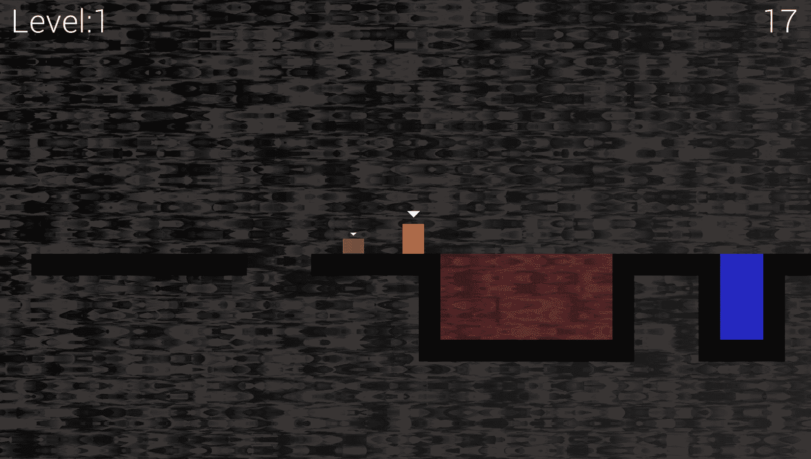
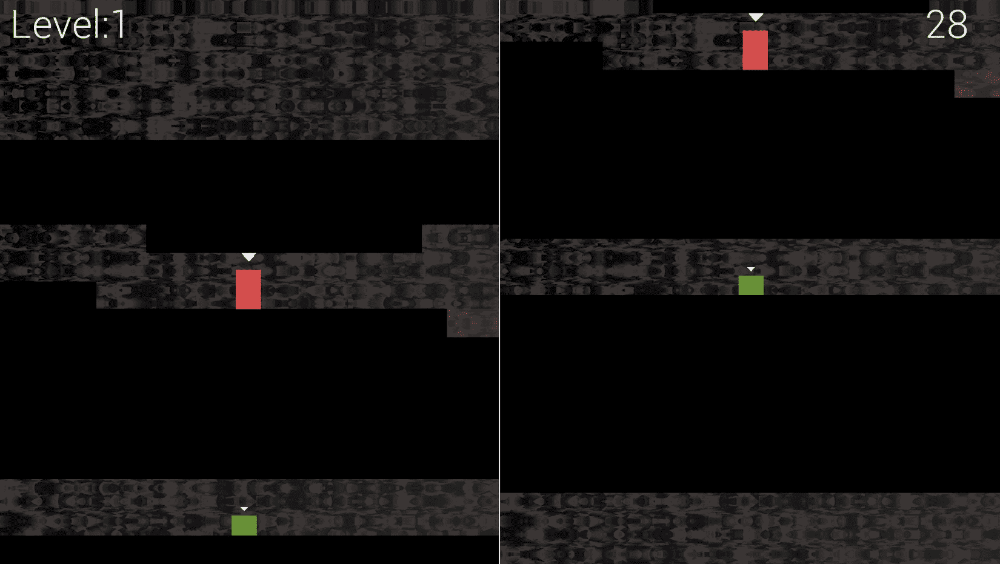
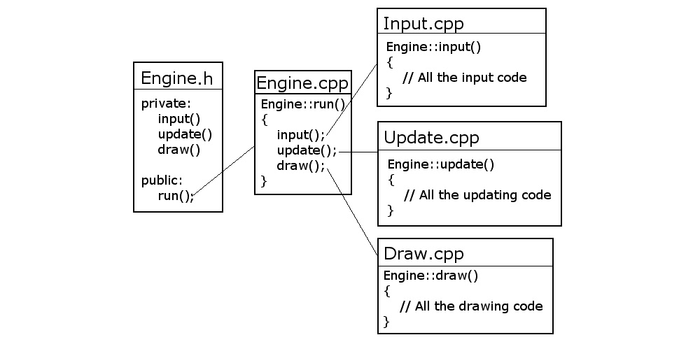
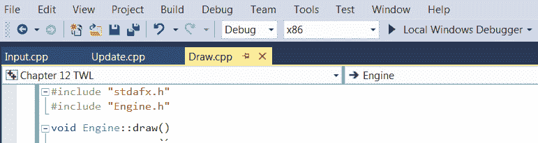

# 十四、抽象和代码管理——更好地利用面向对象

在这一章中，我们将首先看一下本书倒数第二个项目。我们将建立的项目将使用高级功能，如定向声音，其效果是相对于玩家的位置来看。它还将有分屏合作游戏。此外，本项目将引入**着色器**的概念，这是用另一种语言编写的直接在显卡上运行的程序。到第 18 章[](18.html#_idTextAnchor356)**粒子系统和着色器*结束时，你将拥有一个功能齐全的多人平台游戏，该游戏采用了热门经典游戏*托马斯独自一人*的风格。*

 *这一章的重点将是让项目开始，并探索如何构建代码，以更好地利用面向对象程序。以下是本章将涵盖的主题的详细信息:

*   介绍最终项目，托马斯迟到了，包括游戏特性和项目资产
*   与以前的项目相比，我们将如何改进代码结构的详细讨论
*   托马斯迟到游戏引擎的编码
*   实现分屏功能

# 托马斯迟到的游戏

小费

在这一点上，如果你还没有，我建议你去看看托马斯在 http://store.steampowered.com/app/220780/的视频。

请注意简单但美观的图形。视频还展示了多种玩法挑战，比如使用角色的不同属性(身高、跳跃、力量等)。为了保持我们的游戏简单而不失去挑战，我们将有比托马斯独自一人更少的拼图功能，但将有额外的挑战，创造两个玩家合作玩的需求。只是为了保证比赛不会太轻松，我们也会让球员们不得不抢着打卡，这也是为什么我们比赛的名字叫托马斯迟到了。

## 托马斯迟到的特征

我们的游戏将不会像我们试图模仿的杰作那样先进，但它将有许多令人兴奋的游戏功能，例如:

*   从与关卡挑战相适应的时间开始倒计时的时钟。
*   相对于玩家的位置发出吼声的火坑，如果他们掉进去，会在开始时让玩家重生。水坑有同样的效果，但没有定向音效。
*   合作游戏。两位玩家都必须在规定的时间内让他们的角色到达目标。他们需要经常一起工作，这样个子较矮、跳得较低的鲍勃就需要站在他朋友(托马斯)的头上。
*   玩家可以选择全屏和分屏，这样他们就可以自己控制两个角色。
*   每个级别都将在文本文件中设计和加载。这将使设计多种多样的层次变得容易。

看看下面这个带注释的游戏截图，看看一些正在运行的功能和组成游戏的组件/资产:


让我们看看这些特性中的每一个，并再描述几个:

*   前面的截图显示了一个简单的平视显示器，详细说明了关卡编号和玩家失败并必须重启关卡之前剩余的秒数。
*   您还可以清楚地看到分屏合作在运行。请记住，这是可选的。单个玩家可以全屏观看比赛，同时在托马斯和鲍勃之间切换镜头焦点。
*   在前面的截图中不是很清楚(尤其是在印刷品中)，但是当一个角色死亡时，他们会爆发出类似星爆/烟花的粒子效果。
*   水和火瓷砖可以有策略地放置，使关卡变得有趣，并迫使角色之间合作。更多这方面的内容将在 [*第 16 章*](16.html#_idTextAnchor327)*建筑可玩关卡和碰撞检测*中介绍。
*   接下来，请注意托马斯和鲍勃。他们不仅身高不同，而且跳跃能力也大不相同。这意味着鲍勃依赖托马斯进行大跳跃，可以设计关卡迫使托马斯走特定路线，以避免他“敲打头部”。
*   此外，火砖会发出咆哮的声音。这些将是相对于托马斯的位置。它们不仅是定向的，来自左或右扬声器，而且随着托马斯靠近或远离声源，它们也会变得越来越大声和安静。
*   最后，在前面带注释的截图中，您可以看到背景。为什么不将它与`background.png`文件(本章下文显示)进行比较？你会看到它是完全不同的。我们将在 [*第 18 章*](18.html#_idTextAnchor356)*粒子系统和着色器*中使用 OpenGL 着色器效果，以实现背景中的移动、几乎冒泡的效果。

所有这些特性都需要更多的截图，这样我们在编写 C++ 代码时就可以记住最终的产品。

下面的截图显示了托马斯和鲍勃到达一个火坑，如果没有帮助，鲍勃没有机会跳过去:



下面的截图显示了鲍勃和托马斯合作清除不稳定的跳跃:


下面的截图展示了我们如何设计需要“信念飞跃”才能达到目标的谜题:


下面的截图展示了我们如何设计几乎任何尺寸的压迫性洞穴系统。我们还可以设计出鲍勃和托马斯被迫分开走不同路线的层次:



## 创建项目

创建托马斯迟到项目将遵循我们在前面三个项目中使用的相同过程。由于创建项目是一个稍微复杂的过程，我将在这里再次详述所有步骤。有关更多细节和图像，请参考设置木材！！！ [*第一章*](01.html#_idTextAnchor017)*c++、SFML、Visual Studio、首发游戏*中的项目:

1.  启动 Visual Studio，点击**新建项目**按钮。如果您打开了另一个项目，您可以选择**文件** | **新项目**。
2.  在接下来显示的窗口中，选择**控制台应用**并点击**下一步**按钮。然后你会看到**配置你的新项目**窗口。
3.  在**配置您的新项目**窗口中，在**项目** **名称**字段中键入`TWL`。
4.  在**位置**字段中，浏览至`VS Projects`文件夹。
5.  勾选**选项，将解决方案和项目放在同一个目录**中。
6.  完成这些步骤后，点击**创建**。
7.  我们现在将配置项目使用我们放在`SFML`文件夹中的 SFML 文件。从主菜单中，选择**项目** | **TWL 物业…** 。在此阶段，您应该打开 **TWL 物业页面**窗口。
8.  在 **TWL 物业页面**窗口中，执行以下步骤。从**配置:**下拉菜单中选择**所有配置**。
9.  现在，从左侧菜单中选择 **C/C++** ，然后选择**通用**。
10.  现在，找到**附加包含目录**编辑框，键入您的 SFML 文件夹所在的驱动器号，然后是`\SFML\include`。如果你在硬盘上找到你的`SFML`文件夹，完整的打字路径是`D:\SFML\include`。如果您在不同的驱动器上安装了 SFML，请改变您的路径。
11.  点击**应用**保存到目前为止的配置。
12.  现在，仍然在同一个窗口中，执行以下步骤。从左侧菜单中，选择**链接器**，然后选择**通用**。
13.  现在，找到**附加库目录**编辑框，键入您的`SFML`文件夹所在的驱动器号，然后是`\SFML\lib`。所以，如果你在硬盘上找到你的`SFML`文件夹，完整的输入路径是`D:\SFML\lib`。如果您将 SFML 安装到不同的驱动器，请改变您的路径。
14.  点击**应用**保存到目前为止的配置。
15.  接下来，仍然在同一个窗口中，执行以下步骤。将**配置:**下拉菜单切换到**调试**，因为我们将在调试模式下运行和测试 Pong。
16.  选择**链接器**，然后**输入**。
17.  找到**附加依赖**编辑框，点击最左侧。现在，复制并粘贴/键入以下内容:`sfml-graphics-d.lib;sfml-window-d.lib;sfml-system-d.lib;sfml-network-d.lib;sfml-audio-d.lib;`。格外小心地将光标放在编辑框当前内容的开头，这样就不会覆盖已经存在的任何文本。
18.  点击**确定**。
19.  点击**应用**，然后**确定**。

这是已配置并准备好的项目属性。现在，我们需要按照以下步骤将 SFML `.dll`文件复制到主项目目录中:

1.  我的主要项目目录是`D:\VS Projects\TWL`。此文件夹是由 Visual Studio 在前面的步骤中创建的。如果您将`Projects`文件夹放在其他地方，请在那里执行此步骤。我们需要复制到项目文件夹中的文件位于我们的`SFML\bin`文件夹中。为这两个位置分别打开一个窗口，高亮显示所有`.dll`文件。
2.  现在，将突出显示的文件复制并粘贴到项目中。

这个项目现在已经准备好了。

## 项目资产

这个项目中的资产甚至比僵尸竞技场游戏还要多和多样。像往常一样，这些资产包括用于在屏幕上书写的字体、用于不同动作(如跳跃、到达目标或远处的轰鸣声)的音效，当然还有托马斯和鲍勃的图形以及用于所有背景图块的精灵表。

该游戏所需的所有资产都包含在下载包中。它们可以在`Chapter 14/graphics`和`Chapter 14/sound`文件夹中找到。

除了我们期待的图形、声音和字体，这款游戏还有两种新的资产类型。它们是关卡设计文件和 GLSL 着色器程序。让我们了解一下他们每个人。

### 游戏级设计

级别都是在文本文件中创建的。通过使用数字 0 到 3，我们可以构建关卡设计来挑战玩家。所有级别设计都与其他资产在同一目录下的`levels`文件夹中。现在可以随便看一下，但是我们将在*第 18 章*、*粒子系统和着色器*中详细讨论它们。

除了这些级别设计资产，我们还有一种特殊类型的图形资产，称为**着色器**。

### GLSL 着色器

**着色器**是用 **GLSL** ( **图形库着色语言**编写的程序。不要担心必须学习另一种语言，因为我们不需要太深入来利用着色器。着色器是特殊的，因为它们是独立于我们的 C++ 代码的完整程序，由 GPU 每一帧执行。事实上，这些着色器程序中的一些是针对每一帧、每一个像素运行的！我们将在 [*第 18 章*](18.html#_idTextAnchor356)*粒子系统和着色器*中找到更多关于这些细节的信息。如果等不了那么久，看看下载包`Chapter 14/shaders`文件夹里的文件。

### 图形资产关闭

图形资源构成了我们游戏场景的一部分。如果您看一下图形资产，应该很清楚它们将在我们的游戏中的什么地方使用:


如果`tiles_sheet`图形上的瓷砖看起来与游戏截图有点不同，这是因为它们是部分透明的，通过它们显示的背景会有一点变化。如果背景图形看起来与游戏截图中的实际背景完全不同，那是因为我们将要编写的着色器程序将操纵每一个像素、每一帧，以创建一种“熔化”效果。

### 声音资产关闭

声音文件都是`.wav`格式。这些文件包含我们将在整个游戏中的某些事件中播放的声音效果。它们如下:

*   `fallinfire.wav`:玩家头部起火，玩家没有逃生机会时会发出的声音。
*   `fallinwater.wav`:水和火有一样的终结效果:死亡。这个音效通知玩家，他们需要从关卡的开头开始。
*   `fire1.wav`:这个音效是单声道录制的。它将以不同的音量播放，根据玩家与火砖的距离，以及根据玩家是在火砖的左边还是右边，从不同的扬声器播放。显然，我们还需要学习一些技巧来实现这个功能。
*   `jump.wav`:玩家跳跃时发出的令人愉悦(略微可预测)的鸣响。
*   `reachgoal.wav`:当玩家将两个角色(托马斯和鲍勃)都拿到目标牌时发出的令人愉悦的胜利声音。

音效非常简单，你可以很容易地创建自己的。如果您打算替换`fire1.wav` 文件，请务必以单声道(非立体声)格式保存您的声音。原因将在 [*第 17 章*](17.html#_idTextAnchor340)*声音空间化和平显中解释。*

### 将资产添加到项目

一旦您决定了要使用哪些资产，就该将它们添加到项目中了。以下说明将假设您正在使用本书下载包中提供的所有资源。

如果您使用自己的文件，只需用自己的文件替换适当的声音或图形文件，使用完全相同的文件名。让我们开始吧:

1.  浏览至`D:\VS Projects\TWL`文件夹。
2.  在此文件夹中创建五个新文件夹，并将其命名为`graphics`、`sound`、`fonts`、 `shaders,` 和 `levels`。
3.  从下载包中，将`Chapter 14/graphics`的全部内容复制到`D:\VS Projects\TWL\graphics`文件夹中。
4.  从下载包中，将`Chapter 14/sound`的全部内容复制到`D:\VS Projects\TWL\sound`文件夹中。
5.  现在，在你的网络浏览器中访问[http://www.dafont.com/roboto.font](http://www.dafont.com/roboto.font)，下载**机器人之光**字体。
6.  提取压缩下载的内容，并将`Roboto-Light.ttf`文件添加到`D:\VS Projects\TWL\fonts`文件夹。
7.  从下载包中，将`Chapter 12/levels` 的全部内容复制到`D:\VS Projects\TWL\levels`文件夹中。
8.  从下载包中，将`Chapter 12/shaders` 的全部内容复制到`D:\VS Projects\TWL\shaders`文件夹中。

现在我们有了一个新项目，以及整个项目所需的所有资产，我们可以讨论如何构建游戏引擎代码。

# 构建托马斯迟到的代码

尽管采取了一些措施来减少问题，但是一个问题随着项目的进行变得越来越糟糕，那就是代码变得多长，多笨拙。**面向对象编程** ( **OOP** )允许我们将我们的项目分成逻辑的和可管理的块，称为类。

通过引入`Engine`类，我们将对这个项目中代码的可管理性进行很大的改进。在其他功能中，`Engine`类将有三个私有功能。这些是`input`、`update`和`draw`。这些听起来应该很熟悉。这些函数中的每一个都将保存先前在`main`函数中的一大块代码。这些功能中的每一个都将在自己的代码文件中，即分别为`Input.cpp`、`Update.cpp`和`Draw.cpp`。

`Engine`类中还会有一个公共函数，可以用`Engine`的一个实例来调用。该功能为`run`，负责游戏每帧调用`input`、`update`、`draw`一次:



此外，因为我们已经将游戏引擎的主要部分抽象到了`Engine`类，所以我们也可以将许多变量从`main`中移出，并使它们成为`Engine`的成员。我们所需要做的就是创建一个`Engine`的实例，并调用它的`run`函数。这里是超级简单的`main`功能的预览:

```cpp
int main()
{
    // Declare an instance of Engine
    Engine engine;
    // Start the engine
    engine.run();
    // Quit in the usual way when the engine is stopped
    return 0;
}
```

小费

暂时不要添加前面的代码。

为了使我们的代码更加易于管理和阅读，我们还将抽象出大任务的责任，例如将级别和冲突检测加载到单独的函数中(在单独的代码文件中)。这两个功能分别是`loadLevel`和`detectCollisions`。我们还将编写其他函数来处理托马斯迟到项目的一些新特性。当它们发生时，我们将详细介绍它们。

为了进一步利用面向对象程序，我们将把游戏领域的责任完全委托给新的类。你可能还记得，在以前的项目中，声音和抬头显示器代码相当长。我们将构建一个`SoundManager`和`HUD`类，以更干净的方式处理这些方面。当我们实现它们时，将深入探索它们是如何工作的。

游戏关卡本身也比以前的游戏深入很多，所以我们也将会编码一个`LevelManager`类。

正如你所料，可玩的角色也将由职业组成。然而，对于这个项目，我们将学习更多的 C++ 并实现一个具有托马斯和鲍勃所有共同功能的`PlayableCharacter`类。然后，`Thomas`和`Bob`类将*继承*这个共同的功能，并实现自己独特的功能和能力。这种技术，也许不出所料，被称为**继承**。关于继承，我会在下一章详细介绍: [*第十五章*](15.html#_idTextAnchor306)*高级 OOP——继承与多态*。

我们还将实现其他几个类来执行特定的职责。例如，我们将使用粒子系统进行一些简单的爆炸。你也许能猜到，为了做到这一点，我们将编码一个`Particle`类和一个`ParticleSystem`类。所有这些类都有属于`Engine`类的实例。这样做将使游戏的所有功能都可以从游戏引擎中访问，但是将细节封装到适当的类中。

小费

请注意，尽管有这些新技术来分离我们代码的不同方面，到这个项目结束时，我们仍然会有一些稍微笨拙的类。这本书的最后一个项目，虽然是一个简单得多的射击游戏，但将探索另一种组织代码的方式，使其易于管理。

在我们继续查看将构成`Engine`类的实际代码之前，最后要提到的是，我们将重用`TextureHolder`类，而不做任何更改，该类是我们为僵尸竞技场游戏讨论和编码的。

# 构建游戏引擎

正如我们在上一节中所建议的，我们将编写一个名为`Engine`的类来控制和绑定托马斯迟到游戏的不同部分。

我们要做的第一件事是在这个项目中提供上一个项目的`TextureHolder`类。

## 重用 TextureHolder 类

我们为僵尸竞技场游戏讨论和编码的`TextureHolder`类在这个项目中也很有用。虽然可以直接从上一个项目中添加文件(`TextureHolder.h`和`TextureHolder.cpp`)，而无需重新编码或重新创建文件，但我不想假设您没有直接跳到这个项目。接下来是非常简短的说明，以及我们需要的完整代码清单，以创建`TextureHolder`类。如果您想要解释类或代码，请参见 [*第 10 章*](10.html#_idTextAnchor214)*指针、标准模板库和纹理管理*。

小费

如果你已经完成了上一个项目，并且你*想从僵尸竞技场项目中添加一个职业，简单地做下面的事情。在**解决方案资源管理器**窗口中，右键单击**头文件**，选择**添加|现有项目...**。从上一个项目浏览到`TextureHolder.h`并选择。在**解决方案资源管理器**窗口中，右键单击**源文件**并选择**添加|现有项目...**。从上一个项目浏览到`TextureHolder.cpp`并选择它。现在你可以在这个项目中使用`TextureHolder`类。请注意，文件在项目之间共享，任何更改都将在两个项目中生效。*

要从头创建`TextureHolder`类，右键单击**解决方案资源管理器**中的**头文件**，并选择**添加|新项目...**。在**添加新项目**窗口中，突出显示(通过左键单击)**头文件(。h)** ，然后在**名称**字段中，键入`TextureHolder.h`。最后，点击**添加**按钮。

在`TextureHolder.h`中添加以下代码:

```cpp
#pragma once
#ifndef TEXTURE_HOLDER_H
#define TEXTURE_HOLDER_H
#include <SFML/Graphics.hpp>
#include <map>
class TextureHolder
{
private:
    // A map container from the STL,
    // that holds related pairs of String and Texture
    std::map<std::string, sf::Texture> m_Textures;
    // A pointer of the same type as the class itself
    // the one and only instance
    static TextureHolder* m_s_Instance;
public:
    TextureHolder();
    static sf::Texture& GetTexture(std::string const& filename);
};
#endif
```

右键单击**解决方案资源管理器**中的**源文件**，并选择**添加|新项目...**。在**添加新项目**窗口中，突出显示(通过左键单击) **C++ 文件(。cpp)** ，然后在**名称**字段中，键入`TextureHolder.cpp`。最后，点击**添加**按钮。

在`TextureHolder.cpp`中添加以下代码:

```cpp
#include "TextureHolder.h"
#include <assert.h>
using namespace sf;
using namespace std;
TextureHolder* TextureHolder::m_s_Instance = nullptr;
TextureHolder::TextureHolder()
{
    assert(m_s_Instance == nullptr);
    m_s_Instance = this;
}
sf::Texture& TextureHolder::GetTexture(std::string const& filename)
{
    // Get a reference to m_Textures using m_S_Instance
    auto& m = m_s_Instance->m_Textures;
    // auto is the equivalent of map<string, Texture>
    // Create an iterator to hold a key-value-pair (kvp)
    // and search for the required kvp
    // using the passed in file name
    auto keyValuePair = m.find(filename);
    // auto is equivalent of map<string, Texture>::iterator
    // Did we find a match?
    if (keyValuePair != m.end())
    {
        // Yes
        // Return the texture,
        // the second part of the kvp, the texture
        return keyValuePair->second;
    }
    else
    {
        // File name not found
        // Create a new key value pair using the filename
        auto& texture = m[filename];
        // Load the texture from file in the usual way
        texture.loadFromFile(filename);
        // Return the texture to the calling code
        return texture;
    }
}
```

我们现在可以继续上新的`Engine`课了。

## 编码引擎

像往常一样，我们将从头文件开始，头文件保存函数声明和成员变量。请注意，我们将在整个项目中重新访问这个文件，以添加更多的函数和成员变量。在这个阶段，我们将只添加必要的代码。

右键单击**解决方案资源管理器**中的**头文件**，选择**添加|新项目...**。在**添加新项目**窗口中，突出显示(通过左键单击)**头文件(。h)** 然后在**名称**字段中，输入`Engine.h`。最后，点击**添加**按钮。我们现在准备为`Engine`类编码头文件。

添加以下成员变量以及函数声明。他们中的许多人我们在其他项目中已经见过，其中一些在*构建托马斯迟到代码*一节中讨论过。注意函数和变量名，以及它们是私有的还是公共的。将以下代码添加到`Engine.h`文件中，然后我们将讨论它:

```cpp
#pragma once
#include <SFML/Graphics.hpp>
#include "TextureHolder.h"
using namespace sf;
class Engine
{
private:
    // The texture holder
    TextureHolder th;
    const int TILE_SIZE = 50;
    const int VERTS_IN_QUAD = 4;
    // The force pushing the characters down
    const int GRAVITY = 300;
    // A regular RenderWindow
    RenderWindow m_Window;
    // The main Views
    View m_MainView;
    View m_LeftView;
    View m_RightView;
    // Three views for the background
    View m_BGMainView;
    View m_BGLeftView;
    View m_BGRightView;
    View m_HudView;
    // Declare a sprite and a Texture 
    // for the background
    Sprite m_BackgroundSprite;
    Texture m_BackgroundTexture;
    // Is the game currently playing?
    bool m_Playing = false;
    // Is character 1 or 2 the current focus?
    bool m_Character1 = true;
    // Start in full screen (not split) mode
    bool m_SplitScreen = false;
    // Time left in the current level (seconds)
    float m_TimeRemaining = 10;
    Time m_GameTimeTotal;
    // Is it time for a new/first level?
    bool m_NewLevelRequired = true;

    // Private functions for internal use only
    void input();
    void update(float dtAsSeconds);
    void draw();

public:
    // The Engine constructor
    Engine();
    // Run will call all the private functions
    void run();
};
```

这是所有私有变量和函数的完整运行记录。在适当的地方，我会花一点时间解释:

*   `TextureHolder th`:唯一的`TextureHolder`类实例。
*   `TILE_SIZE`:一个有用的常数，提醒我们子画面中的每个图块都是 50 像素宽，50 像素高。
*   `VERTS_IN_QUAD`:一个有用的常数，让我们对`VertexArray`的操作不那么容易出错。事实上，一个四边形有四个顶点。现在，我们不能忘记它。
*   `GRAVITY`:一个常量 int 值，表示每秒向下推动游戏角色的像素数。一旦游戏结束，这是一个非常有趣的玩法。我们在这里将其初始化为 300，因为这对于我们的初始级别设计很有效。
*   `m_Window`:我们所有项目中常见的`RenderWindow`对象。
*   SFML `View`对象、`m_MainView`、`m_LeftView`、`m_RightView`、`m_BGMainView` : `m_BGLeftView`、`m_BGRightView`和`m_HudView`:前三个`View`对象是游戏的全屏视图和左右分屏视图。我们也有一个单独的 SFML `View`对象为这三个，这将绘制背后的背景。最后一个`View`对象`m_HudView`将绘制在其他六个视图的适当组合之上，以显示分数、剩余时间以及给玩家的任何消息。拥有七个不同的`View`对象可能意味着复杂性，但是当你看到随着章节的进展我们如何处理它们时，你会发现它们非常简单。到本章结束时，我们将把整个分屏/全屏难题整理出来。
*   `Sprite m_BackgroundSprite`和`Texture m_BackgroundTexture`:可以预见的是，这个 SFML 精灵和纹理的组合将用于显示和保存图形资源文件夹中的背景图形。
*   `m_Playing`:该布尔值将告知游戏引擎关卡是否已经开始(通过按*回车*键)。玩家一旦开始游戏，就不能选择暂停游戏。
*   `m_Character1`:屏幕满屏时，应该以托马斯(`m_Character1` `= true`)还是鲍勃(`m_Character1 = false`)为中心？最初，它被初始化为真，以托马斯为中心。
*   `m_SplitScreen`:这个变量用来判断当前正在玩的游戏是否处于分屏模式。我们将使用这个变量来决定如何准确地使用我们在几个步骤前声明的所有视图对象。
*   `m_TimeRemaining`变量:这个`float`变量保存了到达当前关卡目标的剩余时间(以秒为单位)。在前面的代码中，出于测试的目的，它被设置为 10，直到我们为每个级别设置一个特定的时间。
*   `m_GameTimeTotal`变量:这个变量是一个 SFML `Time`对象。它记录游戏已经玩了多长时间。
*   `m_NewLevelRequired`布尔变量:这个变量关注玩家是刚完成一关还是失败一关。然后，我们可以使用它来触发加载下一个级别或重新启动当前级别。
*   `input`功能:这个功能会处理玩家的所有输入，在这个游戏中完全是来自键盘。乍一看，它似乎直接处理所有的键盘输入。然而，在这个游戏中，我们将在`Thomas`和`Bob`类中处理直接影响托马斯或鲍勃的键盘输入。该功能还将处理键盘输入，如退出，切换到分屏，以及任何其他键盘输入。
*   `update`功能:该功能将完成我们之前在`main`功能的更新部分所做的所有工作。我们还将从`update`函数中调用一些其他函数，以保持代码的组织性。如果你回头看代码，你会看到它接收到一个`float`参数，该参数将保存从上一帧开始过去的几分之一秒。当然，这正是我们更新所有游戏对象所需要的。
*   `draw`功能:该功能将保存以前项目中主功能的绘图部分中曾经进入的所有代码。然而，当我们考虑用 SFML 绘制的其他方法时，我们会有一些没有保存在这个函数中的绘图代码。当我们在 [*第 18 章*](18.html#_idTextAnchor356)*粒子系统和着色器*中了解粒子系统时，我们会看到这个新代码。

现在，让我们运行所有的公共函数:

*   `Engine`构造函数:正如我们已经预料到的，当我们第一次声明`Engine`的一个实例时，这个函数将被调用。它将完成类的所有设置和初始化。我们将在不久后对`Engine.cpp`文件进行编码时看到确切的内容。
*   `run`函数:这是我们唯一需要调用的公共函数。会触发`input`、`update`、`draw`的执行，会为我们做所有的工作。

接下来，我们将看到所有这些函数的定义以及一些正在运行的变量。

## 编码引擎

在我们之前的所有类中，我们已经将所有函数定义放入了以类名为前缀的`.cpp`文件中。因为我们这个项目的目标是让代码更容易管理，所以我们做的事情有点不同。

在`Engine.cpp`文件中，我们将放置构造函数(`Engine`)和公共`run`函数。其余的功能将放在它们自己的`.cpp`文件中，该文件有一个名称，表明哪个功能放在哪里。如果我们在包含来自`Engine`类的函数定义的所有文件的顶部添加适当的 include 指令(`#include "Engine.h"` ) ，这对于编译器来说不是问题。

让我们从编码`Engine`并在`Engine.cpp`中运行开始。在**解决方案资源管理器**中右键单击**源文件**，选择**添加|新项目...**。在**添加新项目**窗口中，突出显示(通过左键单击) **C++ 文件(。cpp)** 然后，在**名称**字段中，键入`Engine.cpp`。最后，点击**添加**按钮。我们现在准备为`Engine`类编码`.cpp`文件。

### 编写引擎类构造函数定义

这个函数的代码将放在我们最近创建的`Engine.cpp`文件中。

添加以下代码，然后我们可以讨论它:

```cpp
#include "Engine.h"
Engine::Engine()
{
    // Get the screen resolution 
    // and create an SFML window and View
    Vector2f resolution;
    resolution.x = VideoMode::getDesktopMode().width;
    resolution.y = VideoMode::getDesktopMode().height;
    m_Window.create(VideoMode(resolution.x, resolution.y),
        "Thomas was late",
        Style::Fullscreen);
    // Initialize the full screen view
    m_MainView.setSize(resolution);
    m_HudView.reset(
        FloatRect(0, 0, resolution.x, resolution.y));
    // Initialize the split-screen Views
    m_LeftView.setViewport(
        FloatRect(0.001f, 0.001f, 0.498f, 0.998f));
    m_RightView.setViewport(
        FloatRect(0.5f, 0.001f, 0.499f, 0.998f));
    m_BGLeftView.setViewport(
        FloatRect(0.001f, 0.001f, 0.498f, 0.998f));
    m_BGRightView.setViewport(
        FloatRect(0.5f, 0.001f, 0.499f, 0.998f));

    m_BackgroundTexture = TextureHolder::GetTexture(
        "graphics/background.png");
    // Associate the sprite with the texture
    m_BackgroundSprite.setTexture(m_BackgroundTexture);
}
```

我们以前见过很多这样的代码。例如，有通常的代码行来获得屏幕分辨率，以及创建`RenderWindow`。在前面代码的末尾，我们使用现在熟悉的代码加载一个纹理，并将其分配给一个 Sprite。在这种情况下，我们正在加载`background.png`纹理并将其分配给`m_BackgroundSprite`。

需要解释的是对`setViewport`函数的四次调用之间的代码。`setViewport`功能将屏幕的一部分分配给 SFML `View`对象。然而，它不适用于像素坐标。它使用比率工作。这里，“1”是整个屏幕(宽度或高度)。每次调用`setViewport`的前两个值是起始位置(先水平后垂直)，后两个值是结束位置。

请注意`m_LeftView`和`m_BGLeftView`被放置在完全相同的位置，也就是说，从屏幕的最左边(0.001)开始，到中间(0.498)的千分之二结束。

`m_RightView`和`m_BGRightView`也处于彼此完全相同的位置，从前面两个`View`对象的右侧(0.5)开始，几乎延伸到最右侧(0.998)。

此外，所有的视图在屏幕的顶部和底部都留有微小的缝隙。当我们在屏幕上绘制这些`View`物体时，在一个白色背景的上面，会有屏幕两边之间有一条细细的白线，以及边缘周围有一条细细的白色边框的屏幕分割效果。

我试图在下图中表示这种效果:


理解它的最好方法是完成这一章，运行代码，并看到它在运行。

### 运行函数定义的编码

这个函数的代码将放在我们最近创建的`Engine.cpp`文件中。

在前一个构造函数代码之后立即添加以下代码:

```cpp
void Engine::run()
{
    // Timing     
    Clock clock;
    while (m_Window.isOpen())
    {
        Time dt = clock.restart();
        // Update the total game time
        m_GameTimeTotal += dt;
        // Make a decimal fraction from the delta time
        float dtAsSeconds = dt.asSeconds();
        // Call each part of the game loop in turn
        input();
        update(dtAsSeconds);
        draw();
    }
}
```

`run`功能是我们发动机的中心；它启动所有其他部分。首先，我们声明一个`Clock`对象。接下来，我们有熟悉的`while(window.isOpen())`循环，它创建了游戏循环。在这个 while 循环中，我们执行以下操作:

1.  重启`clock`并保存上一个循环在`dt.`中花费的时间
2.  记录`m_GameTimeTotal.`中经过的总时间
3.  声明并初始化一个`float`来表示在前一帧中经过的那一秒的分数。
4.  呼叫`input.`
5.  调用`update`，传入经过的时间(`dtAsSeconds`)。
6.  呼叫`draw.`

所有这些看起来应该都很熟悉。新的是包裹在`run`功能中。

### 输入函数定义的编码

正如我们之前解释的那样，`input`函数的代码将放在自己的文件中，因为它比构造函数或`run`函数更广泛。我们将使用`#include "Engine.h"`并将`Engine::`作为函数签名的前缀，以确保编译器知道我们的意图。

右键单击**解决方案资源管理器**中的**源文件**，并选择**添加|新项目...**。在**添加新项目**窗口中，突出显示(通过左键单击) **C++ 文件(。cpp)** 然后，在**名称**字段中，键入`Input.cpp`。最后，点击**添加**按钮。我们现在准备对`input` 功能进行编码。

添加以下代码:

```cpp
void Engine::input()
{
    Event event;
    while (m_Window.pollEvent(event))
    {
        if (event.type == Event::KeyPressed)
        {            
            // Handle the player quitting
            if (Keyboard::isKeyPressed(Keyboard::Escape))
            {
                m_Window.close();
            }
            // Handle the player starting the game
            if (Keyboard::isKeyPressed(Keyboard::Return))
            {
                m_Playing = true;
            }
            // Switch between Thomas and Bob
            if (Keyboard::isKeyPressed(Keyboard::Q))
            {
                m_Character1 = !m_Character1;
            }
            // Switch between full and split-screen
            if (Keyboard::isKeyPressed(Keyboard::E))
            {
                m_SplitScreen = !m_SplitScreen;
            }
        }
    }    
}
```

像前面的项目一样，我们检查每一帧的`RenderWindow`事件队列。也像我们之前做的一样，我们使用`if (Keyboard::isKeyPressed...`检测特定的键盘按键。我们刚刚添加的代码中最相关的信息是密钥的作用:

*   和往常一样， *Esc* 键关闭窗口，游戏将退出。
*   *进入*键将`m_Playing`设置为真，最终这将具有开始关卡的效果。
*   *Q* 键在真和假之间交替`m_Character1`的值。该键仅在全屏模式下有效。它将在托马斯和鲍勃之间切换，成为主`View`的中心。
*   *E* 键盘键在真和假之间切换`m_SplitScreen`。这将具有在全屏和分屏视图之间切换的效果。

到本章结束时，大部分键盘功能将完全正常工作。我们正在接近能够运行我们的游戏引擎。接下来，让我们对`update`函数进行编码。

### 对更新函数定义进行编码

正如我们之前所解释的，这个函数的代码将放在它自己的文件中，因为它比构造函数或`run`函数更广泛。我们将使用`#include "Engine.h"`并在函数签名前加上`Engine::`前缀，以确保编译器知道我们的意图。

右键单击**解决方案资源管理器**中的**源文件**，并选择**添加|新项目...**。在**添加新项目**窗口中，突出显示(通过左键单击) **C++ 文件(。cpp)** 然后，在**名称**字段中，键入`Update.cpp`。最后，点击**添加**按钮。我们现在准备为`update` 函数编写一些代码。

在`Update.cpp` 文件中添加以下代码来实现`update`功能:

```cpp
#include "Engine.h"
#include <SFML/Graphics.hpp>
#include <sstream>
using namespace sf;
void Engine::update(float dtAsSeconds)
{
    if (m_Playing)
    {
        // Count down the time the player has left
        m_TimeRemaining -= dtAsSeconds;
        // Have Thomas and Bob run out of time?
        if (m_TimeRemaining <= 0)
        {
            m_NewLevelRequired = true;
        }
    }// End if playing

}
```

首先，注意`update`函数接收前一帧作为参数的时间。当然，这对于更新功能履行其职责是必不可少的。

前面的代码在这个阶段没有实现任何可见的东西。它确实建立了我们在未来章节中需要的结构。它从`m_TimeRemaining`中减去前一帧所花费的时间，并检查时间是否已经用完。如果有，则将`m_NewLevelRequired`设置为`true`。所有这些代码都封装在一个`if`语句中，该语句仅在`m_Playing`为`true`时执行。这样做的原因是，和之前的项目一样，我们不希望游戏还没有开始的时候，时间就提前了，对象就更新了。

随着项目的继续，我们将在此代码的基础上进行构建。

### 绘制函数定义的编码

正如我们之前所解释的，这个函数的代码将放在它自己的文件中，因为它比构造函数或`run`函数更广泛。我们将使用`#include "Engine.h"`并在函数签名前加上`Engine::`前缀，以确保编译器知道我们的意图。

右键单击**解决方案资源管理器**中的**源文件**，并选择**添加|新项目...**。在**添加新项目**窗口中，突出显示(通过左键单击) **C++ 文件(。cpp)** 然后，在**名称**字段中，键入`Draw.cpp`。最后点击**添加**按钮。我们现在准备向`draw` 功能添加一些代码。

在`Draw.cpp`文件中添加以下代码来实现`draw`功能:

```cpp
#include "Engine.h"
void Engine::draw()
{
    // Rub out the last frame
    m_Window.clear(Color::White);
    if (!m_SplitScreen)
    {
        // Switch to background view
        m_Window.setView(m_BGMainView);
        // Draw the background
        m_Window.draw(m_BackgroundSprite);
        // Switch to m_MainView
        m_Window.setView(m_MainView);        
    }
    else
    {
        // Split-screen view is active
        // First draw Thomas' side of the screen
        // Switch to background view
        m_Window.setView(m_BGLeftView);
        // Draw the background
        m_Window.draw(m_BackgroundSprite);
        // Switch to m_LeftView
        m_Window.setView(m_LeftView);

        // Now draw Bob's side of the screen
        // Switch to background view
        m_Window.setView(m_BGRightView);
        // Draw the background
        m_Window.draw(m_BackgroundSprite);
        // Switch to m_RightView
        m_Window.setView(m_RightView);

    }
    // Draw the HUD
    // Switch to m_HudView
    m_Window.setView(m_HudView);

    // Show everything we have just drawn
    m_Window.display();
}
```

在前面的代码中，没有什么是我们以前没有见过的。像往常一样，代码从清除屏幕开始。在这个项目中，我们用白色清除屏幕。新的是不同的绘图选项被一个条件分开的方式，该条件检查屏幕当前是否被分割:

```cpp
if (!m_SplitScreen)
{
}
else
{
}
```

如果屏幕没有分屏，我们在后台`View` ( `m_BGView`)画背景精灵，然后切换到主全屏`View` ( `m_MainView`)。注意，目前我们在`m_MainView`不做任何绘图。

另一方面，如果屏幕被分割，执行`else`块中的代码，我们用屏幕左侧的背景精灵绘制`m_BGLeftView`，然后切换到`m_LeftView`。

然后，还是在`else`块，我们用屏幕右边的背景精灵画`m_BGRightView`，然后切换到`m_RightView`。

在我们刚刚描述的`if` `else`结构之外，我们切换到`m_HUDView`。在这个阶段，我们实际上没有在`m_HUDView`中绘制任何东西。

像另外两个(`input`、`update`)最显著的三个函数一样，我们会经常回到`draw`函数。我们将为我们的游戏添加需要绘制的新元素。您会注意到，每次我们这样做的时候，我们都会将代码添加到主部分、左侧部分和右侧部分。

让我们快速回顾一下`Engine`课，然后我们可以启动它。

## 迄今为止的发动机等级

我们所做的是将曾经在`main`函数中的所有代码抽象成`input`、`update`和`draw`函数。这些功能的连续循环以及计时由`run`功能处理。

考虑在 Visual Studio 中打开 **Input.cpp** 、 **Update.cpp** 和 **Draw.cpp** 选项卡，可能是按顺序组织的，如下图所示:



我们将在整个项目过程中重新访问这些函数中的每一个，并添加更多的代码。现在我们已经有了`Engine`类的基本结构和功能，我们可以在`main`函数中创建它的一个实例，并看到它在运行。

# 编码主要功能

让我们将项目创建时自动生成的`TFL.cpp`文件重命名为`Main.cpp`。右键单击**解决方案资源管理器**中的`TFL`文件，并选择**重命名**。更名为`Main.cpp`。这将是包含我们的`main`函数和实例化`Engine`类的代码的文件。

在`Main.cpp`中添加以下代码:

```cpp
#include "Engine.h"
int main()
{
    // Declare an instance of Engine
    Engine engine;
    // Start the engine VRRrrrrmmm
    engine.run();
    // Quit in the usual way when the engine is stopped
    return 0;
}
```

我们所做的就是为`Engine`类添加一个`include`指令，声明一个`Engine`的实例，然后调用它的`run`函数。一切都将由`Engine`类处理，直到玩家退出，执行返回到`main`和`return 0`语句。

那很简单。现在，我们可以运行游戏，看到空的背景，无论是全屏还是分屏，最终都会包含所有的动作。

这是目前为止全屏模式下的游戏，只显示了背景:


现在，点击 *E* 键。您将能够看到屏幕被整齐地分成两半，为分屏合作游戏做好准备:


# 总结

在这一章中，我们介绍了托马斯迟到游戏，并为项目的其余部分奠定了理解和代码结构的基础。的确，解决方案资源管理器中有很多文件，但是，如果我们理解每个文件的目的，我们会发现实现项目的其余部分非常容易。

在下一章中，我们将学习两个更基本的 C++ 主题，继承和多态性。我们也将开始使用它们，建造三个职业来代表两个可玩的角色。

# 常见问题

你可能会想到一个问题:

问)我不完全理解代码文件的结构。我该怎么办？

答:的确，抽象会让我们的代码结构变得不那么清晰，但实际代码本身会变得容易得多。我们将把代码分成`Input.cpp`、`Update.cpp`和`Draw.cpp`，而不是像在前面的项目中那样把所有东西都塞进`main`函数。此外，我们将使用更多的类来将相关代码组合在一起。再次学习*构建托马斯迟到代码*部分，尤其是图表。*