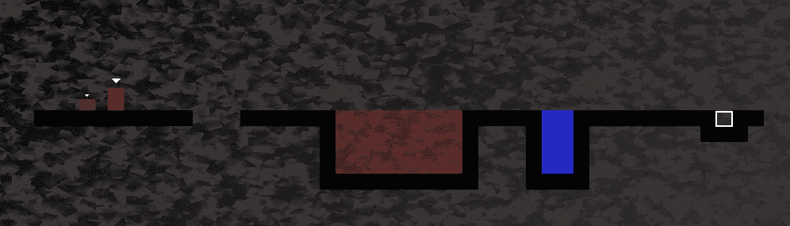
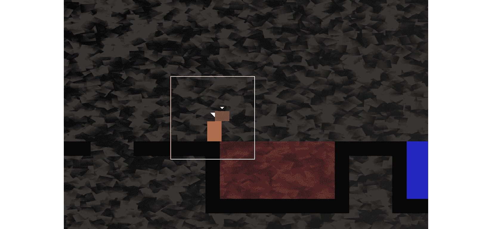
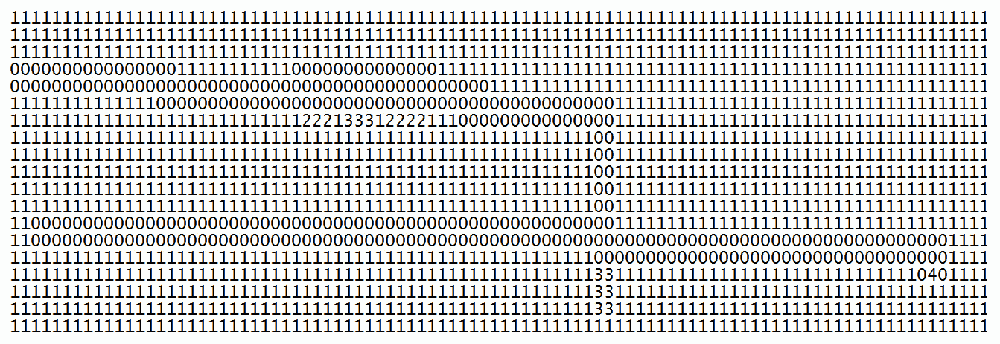
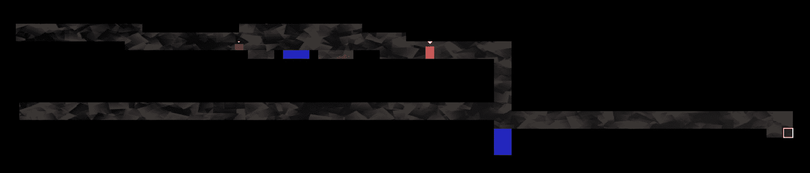
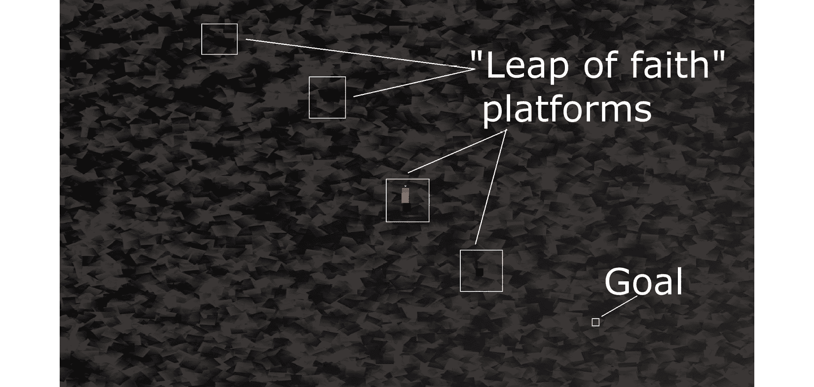

# *第 16 章*:建造可玩关卡和碰撞检测

这一章可能是这个项目最令人满意的章节之一。这样做的原因是，到最后，我们将有一个可玩的游戏。尽管仍有一些功能需要实现(声音、粒子效果、平视显示器和着色器效果)，鲍勃和托马斯将能够奔跑、跳跃和探索世界。此外，你将能够通过简单地在文本文件中制作平台和障碍物来创建任何大小或复杂程度的自己的关卡设计。

我们将通过涵盖以下主题来实现这一切:

*   探索如何设计文本文件中的级别
*   建立一个`LevelManager`类，它将从文本文件中加载等级，将它们转换成我们的游戏可以使用的数据，并跟踪等级细节，如产卵位置、当前等级和允许的时间限制
*   更新游戏引擎使用`LevelManager`
*   编写多态函数来处理鲍勃和托马斯的冲突检测

# 设计一些关卡

还记得我们在 [*第 14 章*](14.html#_idTextAnchor292)*抽象和代码管理——更好地利用 OOP* 中介绍的精灵表吗？又来了，用数字标注，代表我们将从中构建所有级别的每个图块:


图像被放置在灰色背景上，这样我们可以更好地看到精灵表的不同细节。方格背景代表透明度。所以，除了 1 号以外，所有的瓷砖都会露出它们背后的至少一点背景。我们现在来复习一下:

*   图块 0 是完全透明的，将用于填充没有任何其他图块的间隙。
*   瓷砖 1 是托马斯和鲍勃将要走过的平台。
*   瓷砖 2 是防火瓷砖，3 是防水瓷砖。
*   就图块 4 而言，您可能需要仔细查看才能看到它。它有一个白色的方形轮廓。这是关卡的目标，也是托马斯和鲍勃必须走到一起的地方。

在我们讨论设计关卡时，请记住这张图片。

我们将在文本文件中输入这些图块编号的组合来设计布局。一个例子会有帮助:

```cpp
0000000000000000000000000000000000000000000000
0000000000000000000000000000000000000000000000
0000000000000000000000000000000000000000000000
0000000000000000000000000000000000000000000000
0000000000000000000000000000000000000000000000
0000000000000000000000000000000000000000000000
1111111111000111111222222221111133111111111411
0000000000000000001222222221000133100000001110
0000000000000000001222222221000133100000000000
0000000000000000001222222221000133100000000000
0000000000000000001111111111000111100000000000
```

前面的代码转换为以下级别布局:



请注意，为了获得上一张截图，我必须缩小`View`，并且图像已经被裁剪。该级别的实际开始如下所示:


这些截图展示了两件事。首先，您可以看到如何使用简单自由的文本编辑器(如 Windows 记事本或 Notepad ++)快速构建关卡设计。只要确保你使用等间距字体，这样所有的数字都是相同的大小。这使得设计关卡变得更加容易。

其次，这些截图展示了设计的游戏性。在关卡中从左到右，托马斯和鲍勃需要跳过一个小洞，否则他们会摔死(重生)。然后，他们有一大片火要穿越。鲍勃不可能跳过那么多瓷砖。玩家需要共同努力找到解决方案。鲍勃清除火砖的唯一方法是站在托马斯的头上，然后从那里跳下去，如下图所示:



然后很容易达到目标，进入下一个阶段。

小费

我强烈建议你完成这一章，然后花一些时间设计你自己的水平。

为了让我们开始，我加入了一些关卡设计。它们在我们在 [*第 14 章*](14.html#_idTextAnchor292)*抽象和代码管理-更好地利用 OOP* 中添加到项目中的`levels`文件夹中。

那里有一些游戏的缩小视图，以及关卡设计的代码截图。代码的截图可能比复制文本内容更有用。如果需要检查代码，只需打开`levels`文件夹中的文件。

代码是这样的:



这是前面的代码将生成的级别布局:



这一级是我在 [*第十四章*](14.html#_idTextAnchor292)*抽象与代码管理——更好地利用 OOP* 中提到的“信念飞跃”级:


游戏内平台的代码已经突出显示，因为它们在下面的缩小截图中不是很清楚:



提供的设计很简单。游戏引擎将能够处理非常大的设计，但我们有自由使用我们的想象力，并建立一些长期和具有挑战性的水平。

当然，这些设计不会做任何事情，直到我们学会如何加载它们，并将文本转换成可玩的级别。此外，在我们实现碰撞检测之前，不可能站在任何平台上。

首先，让我们处理加载关卡设计。

# 构建级别管理器类

这将需要几个阶段的编码，使我们的水平设计工作。

我们首先要做的是对`LevelManager`头文件进行编码。这将允许我们查看和讨论`LevelManager`类中的成员变量和函数。

接下来，我们将对`LevelManager.cpp`文件进行编码，其中将包含所有的函数定义。由于这是一个长文件，我们将把它分成几个部分来编码和讨论它们。

一旦`LevelManager`类完成，我们将把它的一个实例添加到游戏引擎(`Engine`类)。我们还将在`Engine`类`loadLevel`中添加一个新的函数，每当需要一个新的级别时，我们都可以从`update`函数中调用这个函数。`loadLevel`功能将不仅使用`LevelManager`实例来加载适当的级别，它还将处理诸如生成玩家角色和准备时钟等方面。

现在，让我们通过编码`LevelManager.h`文件来了解一下`LevelManager`的概况。

## 编码级别管理器

右键单击**解决方案资源管理器**中的**头文件**，选择**添加|新项目...**。在**添加新项目**窗口中，突出显示(通过左键单击)**头文件(。h)** 然后在**名称**字段中，输入`LevelManager.h`。最后，点击**添加**按钮。我们现在准备为`LevelManager`类编码头文件。

添加以下包含指令和私有变量，然后我们将讨论它们:

```cpp
#pragma once
#include <SFML/Graphics.hpp>
using namespace sf;
using namespace std;
class LevelManager
{
private:
    Vector2i m_LevelSize;
    Vector2f m_StartPosition;
    float m_TimeModifier = 1;
    float m_BaseTimeLimit = 0;
    int m_CurrentLevel = 0;
    const int NUM_LEVELS = 4;
// public declarations go here
```

前面的代码声明了一个`Vector2i`、`m_LevelSize`来保存两个整数值，这两个整数值将保存当前地图包含的水平和垂直切片数。`Vector2f`、`m_StartPosition`包含了世界上鲍勃和托马斯应该诞生的坐标。请注意，这不是与`m_LevelSize`单位相关的平铺位置，而是水平和垂直像素位置。

`m_TimeModifier`成员变量是一个浮点型变量，用于乘以当前级别的可用时间。我们想这样做的原因是，我们可以改变(减少)这个值，这样我们就可以缩短玩家每次尝试相同级别的可用时间。举个例子，如果玩家第一次尝试一级获得 60 秒，那么 60 乘以 1 当然就是 60。当玩家完成所有关卡并第二次回到 1 级时，`m_TimeModifier`将被降低 10%。然后，当可用时间乘以 0.9，玩家可用的时间将是 54 秒。这要少 10%。比赛会越来越难。

`m_BaseTimeLimit`浮点变量保持我们刚刚讨论的原始的、未修改的时间限制。

我们大概可以猜测`m_CurrentLevel`会持有当前正在玩的关卡号。

当再次回到 1 级并降低`m_TimeModifier`值合适时，将使用`int`、`NUM_LEVELS`常量进行标记。

现在，在我们之前添加的代码之后添加以下公共变量和函数声明:

```cpp
public:
    const int TILE_SIZE = 50;
    const int VERTS_IN_QUAD = 4;
    float getTimeLimit();
    Vector2f getStartPosition();
    int** nextLevel(VertexArray& rVaLevel);
    Vector2i getLevelSize();
    int getCurrentLevel();
};
```

在前面的代码中，有两个常量`int`成员。`TILE_SIZE`是一个有用的常数，提醒我们子画面中的每个图块都有 50 像素宽和 50 像素高。`VERTS_IN_QUAD`是一个有用的常数，让我们对`VertexArray`的操作不那么容易出错。事实上，一个四边形有四个顶点。现在，我们不能忘记这一点。

`getTimeLimit`、`getStartPosition`、`getLevelSize`和`getCurrentLevel`函数是简单的 getter 函数，返回我们在前面代码块中声明的私有成员变量的当前值。

值得多谈的功能是`nextLevel`。这个函数接收一个`VertexArray`引用，就像我们在僵尸竞技场游戏中使用的一样。然后，该函数可以在`VertexArray`引用上工作，所有的更改都将出现在调用代码的`VertexArray`引用中。

`nextLevel`函数返回一个指向指针的指针，这意味着我们可以返回一个二维数组`int`值的第一个元素的地址。我们将建立一个二维数组`int`的价值，将代表每个层次的布局。当然，这些 int 值将从关卡设计文本文件中读取。

## 对 LevelManager.cpp 文件进行编码

右键单击**解决方案资源管理器**中的**源文件**，并选择**添加|新项目...**。在**添加新项目**窗口中，突出显示(通过左键单击) **C++文件(。cpp)** 然后，在**名称**字段中，键入`LevelManager.cpp`。最后，点击**添加**按钮。我们现在准备为`LevelManager`类编码`.cpp`文件。

由于这是一堂相当长的课，我们将把它分成六大块来讨论。前五个将覆盖`nextLevel`功能，第六个将覆盖其余功能。

添加以下包含指令和`nextLevel`功能的第一(五)部分:

```cpp
#include <SFML/Graphics.hpp>
#include <SFML/Audio.hpp>
#include "TextureHolder.h"
#include <sstream>
#include <fstream>
#include "LevelManager.h"
using namespace sf;
using namespace std;
int** LevelManager::nextLevel(VertexArray& rVaLevel)
{
    m_LevelSize.x = 0;
    m_LevelSize.y = 0;
    // Get the next level
    m_CurrentLevel++;
    if (m_CurrentLevel > NUM_LEVELS)
    {
        m_CurrentLevel = 1;
        m_TimeModifier -= .1f;
    }
    // Load the appropriate level from a text file
    string levelToLoad;
    switch (m_CurrentLevel)
    {
    case 1:
        levelToLoad = "levels/level1.txt";
        m_StartPosition.x = 100;
        m_StartPosition.y = 100;
        m_BaseTimeLimit = 30.0f;
        break;
    case 2:
        levelToLoad = "levels/level2.txt";
        m_StartPosition.x = 100;
        m_StartPosition.y = 3600;
        m_BaseTimeLimit = 100.0f;
        break;
    case 3:
        levelToLoad = "levels/level3.txt";
        m_StartPosition.x = 1250;
        m_StartPosition.y = 0;
        m_BaseTimeLimit = 30.0f;
        break;
    case 4:
        levelToLoad = "levels/level4.txt";
        m_StartPosition.x = 50;
        m_StartPosition.y = 200;
        m_BaseTimeLimit = 50.0f;
        break;
    }// End switch
```

在包含指令之后，代码将`m_LevelSize.x`和`m_LevelSize.y`变量初始化为零。

接下来，`m_CurrentLevel`递增。接下来的`if`语句检查`m_CurrentLevel`是否大于`NUM_LEVELS`。如果是，那么`m_CurrentLevel`被设置回`1`并且`m_TimeModifier`被减少`0.1`以缩短所有级别的允许时间。

然后代码根据`m_CurrentLevel`保存的值进行切换。每个`case`语句初始化保存关卡设计的文本文件的名称，托马斯和鲍勃的起始位置，以及`m_BaseTimeLimit`，这是所讨论关卡的未修改的时间限制。

小费

如果您设计了自己的级别，请在这里添加一个`case`语句和相应的值。另外，编辑`LevelManager.h`文件中的`NUM_LEVELS`常量。

现在，添加`nextLevel`功能的第二部分，如下。在前一个代码之后立即添加此代码。添加代码时请仔细研究，以便我们可以讨论它:

```cpp
    ifstream inputFile(levelToLoad);
    string s;
    // Count the number of rows in the file
    while (getline(inputFile, s))
    {
        ++m_LevelSize.y;
    }
    // Store the length of the rows
    m_LevelSize.x = s.length();
```

在前面(第二部分)的代码中，我们声明了一个名为`inputFile`的`ifstream`对象，该对象打开了一个指向包含在`levelToLoad`中的文件名的流。

代码使用`getLine`循环遍历文件的每一行，但不记录其任何内容。它所做的只是通过增加`m_LevelSize.y`来计算行数。在`for`循环后，使用`s.length`功能将水平仪的宽度保存在`m_LevelSize.x`中。这意味着所有线的长度必须相同，否则我们会遇到麻烦。

至此，我们知道并已经在`m_LevelSize`中保存了当前级别的长度和宽度。

现在，添加`nextLevel`函数的第三部分，如下代码所示。将代码添加到前面代码的正下方。添加代码时请仔细研究，以便我们可以讨论它:

```cpp
    // Go back to the start of the file
    inputFile.clear();
    inputFile.seekg(0, ios::beg);
    // Prepare the 2D array to hold the int values from the file
    int** arrayLevel = new int*[m_LevelSize.y];
    for (int i = 0; i < m_LevelSize.y; ++i)
    {
        // Add a new array into each array element
        arrayLevel[i] = new int[m_LevelSize.x];
    }
```

首先，我们使用`clear`功能清除`inputFile`。使用`0, ios::beg`参数调用的`seekg`函数将文件光标的位置(从下一个字符开始读取的位置)移动到文件的开头。

接下来，我们声明一个指向名为`arrayLevel`的指针的指针。请注意，这是使用`new`关键字在自由存储/堆上完成的。一旦我们初始化了这个二维数组，我们就可以将它的地址返回给调用代码，它将一直存在，直到我们删除它或者游戏关闭。

`for`循环从 0 循环到`m_LevelSize.y -1`。在循环的每一遍中，它都会在堆上添加一个新的`int`值数组，以匹配`m_LevelSize.x`的值。我们现在有了一个完美配置的(当前级别的)二维数组。唯一的问题是里面还什么都没有。

现在，添加`nextLevel`函数的第四部分，如下代码所示。在前一个代码之后立即添加此代码。添加代码时请仔细研究，以便我们可以讨论它:

```cpp
    // Loop through the file and store all 
   // the values in the 2d array
    string row;
    int y = 0;
    while (inputFile >> row)
    {
        for (int x = 0; x < row.length(); x++) {
            const char val = row[x];
            arrayLevel[y][x] = atoi(&val);
        }
        y++;
    }
    // Close the file
    inputFile.close();
```

首先，代码初始化一个名为`row`的`string`，它一次只保存一行关卡设计。我们还声明并初始化了一个名为`y`的`int`，它将帮助我们计算行数。

`while`循环重复执行，直到`inputFile`经过最后一行。在`while`循环中，有一个`for`循环，它遍历当前行的每个字符，并将其存储在二维数组`arrayLevel`中。请注意，我们使用`arrayLevel[y][x]=`访问二维数组的右边元素。`atoi`功能将`char val`转换为`int`。这是必需的，因为我们有一个二维数组用于`int`，而不是用于`char`。

现在，我们来添加`nextLevel`函数的第五部分，如下图所示。在前一个代码之后立即添加此代码。添加代码时请仔细研究，这样我们就可以讨论它:

```cpp
    // What type of primitive are we using?
    rVaLevel.setPrimitiveType(Quads);
    // Set the size of the vertex array
    rVaLevel.resize(m_LevelSize.x * 
      m_LevelSize.y * VERTS_IN_QUAD);
    // Start at the beginning of the vertex array
    int currentVertex = 0;
    for (int x = 0; x < m_LevelSize.x; x++)
    {
        for (int y = 0; y < m_LevelSize.y; y++)
        {
            // Position each vertex in the current quad
            rVaLevel[currentVertex + 0].position = 
                Vector2f(x * TILE_SIZE, 
                y * TILE_SIZE);
            rVaLevel[currentVertex + 1].position = 
                Vector2f((x * TILE_SIZE) + TILE_SIZE, 
                y * TILE_SIZE);
            rVaLevel[currentVertex + 2].position = 
                Vector2f((x * TILE_SIZE) + TILE_SIZE, 
                (y * TILE_SIZE) + TILE_SIZE);
            rVaLevel[currentVertex + 3].position = 
                Vector2f((x * TILE_SIZE), 
                (y * TILE_SIZE) + TILE_SIZE);
            // Which tile from the sprite sheet should we use
            int verticalOffset = arrayLevel[y][x] * TILE_SIZE;
            rVaLevel[currentVertex + 0].texCoords = 
                Vector2f(0, 0 + verticalOffset);
            rVaLevel[currentVertex + 1].texCoords = 
                Vector2f(TILE_SIZE, 0 + verticalOffset);
            rVaLevel[currentVertex + 2].texCoords = 
                Vector2f(TILE_SIZE, TILE_SIZE + verticalOffset);
            rVaLevel[currentVertex + 3].texCoords = 
                Vector2f(0, TILE_SIZE + verticalOffset);
            // Position ready for the next four vertices
            currentVertex = currentVertex + VERTS_IN_QUAD;
        }
    }
    return arrayLevel;
} // End of nextLevel function
```

虽然这是五段代码中最长的一段(我们把`nextLevel`一分为二)，但也是最直接的。这是因为我们在僵尸竞技场项目中看到了非常相似的代码。

预编码的过程是嵌套的`for`循环从零到水平的宽度和高度循环。对于阵列中的每个位置，四个顶点被放入`VertexArray`中，并且从子画面表中分配四个纹理坐标。使用`currentVertex`变量、`TILE SIZE`和`VERTS_IN_QUAD`常数计算顶点和纹理坐标的位置。在内部`for`循环的每个循环结束时，`currentVertex`增加`VERTS_IN_QUAD`，很好地移动到下一个图块。

重要说明

关于`VertexArray`要记住的重要一点是它是通过引用传入`nextLevel`的。因此，`VertexArray`将在调用代码中可用。我们将从`Engine`类的代码中调用`nextLevel`。

一旦调用了这个函数，`Engine`类将有一个`VertexArray`以图形方式表示该层，还有一个二维数组`int`值作为该层中所有平台和障碍物的数字表示。

其余的`LevelManager`函数都是简单的 getter 函数，但是要花时间去熟悉哪个函数返回了哪个私有值。添加`LevelManager`类的剩余功能，如下所示:

```cpp
Vector2i LevelManager::getLevelSize()
{
    return m_LevelSize;
}
int LevelManager::getCurrentLevel()
{
    return m_CurrentLevel;
}
float LevelManager::getTimeLimit()
{
    return m_BaseTimeLimit * m_TimeModifier;
}
Vector2f LevelManager::getStartPosition()
{
    return m_StartPosition;
}
```

现在`LevelManager`类已经完成，我们可以继续使用它了。为此，我们将在`Engine`类中编写另一个函数。

# 对负载水平函数进行编码

需要明确的是，这个函数是`Engine`类的一部分，尽管它会将其大部分工作委托给其他函数，包括我们刚刚构建的`LevelManager`类的那些函数。

首先，让我们将新函数的声明以及一些其他新代码添加到`Engine.h`文件中。打开`Engine.h`文件，添加`Engine.h`文件的缩略快照中突出显示的代码行，如下所示:

```cpp
#pragma once
#include <SFML/Graphics.hpp>
#include "TextureHolder.h"
#include "Thomas.h"
#include "Bob.h"
#include "LevelManager.h"
using namespace sf;
class Engine
{
private:
    // The texture holder
    TextureHolder th;
    // Thomas and his friend, Bob
    Thomas m_Thomas;
    Bob m_Bob;
 // A class to manage all the levels
 LevelManager m_LM;
    const int TILE_SIZE = 50;
    const int VERTS_IN_QUAD = 4;
    // The force pushing the characters down
    const int GRAVITY = 300;
    // A regular RenderWindow
    RenderWindow m_Window;
    // The main Views
    View m_MainView;
    View m_LeftView;
    View m_RightView;
    // Three views for the background
    View m_BGMainView;
    View m_BGLeftView;
    View m_BGRightView;
    View m_HudView;
    // Declare a sprite and a Texture for the background
    Sprite m_BackgroundSprite;
    Texture m_BackgroundTexture;
    // Is the game currently playing?
    bool m_Playing = false;
    // Is character 1 or 2 the current focus?
    bool m_Character1 = true;
    // Start in full screen mode
    bool m_SplitScreen = false;
    // How much time is left in the current level
    float m_TimeRemaining = 10;
    Time m_GameTimeTotal;
    // Is it time for a new/first level?
    bool m_NewLevelRequired = true;
 // The vertex array for the level tiles
 VertexArray m_VALevel;
 // The 2d array with the map for the level
 // A pointer to a pointer
 int** m_ArrayLevel = NULL;
 // Texture for the level tiles
 Texture m_TextureTiles;

    // Private functions for internal use only
    void input();
    void update(float dtAsSeconds);
    void draw();    
 // Load a new level
 void loadLevel();

public:
    // The Engine constructor
    Engine();
    ...
    ...        
    ...
```

这是我们在前面的代码中可以看到的:

*   我们包括了`LevelManager.h`文件。
*   我们添加了一个名为`m_LM`的`LevelManager`实例。
*   我们增加了一个`VertexArray`叫做`m_VALevel`。
*   我们添加了一个指向 int 的指针，该指针将保存从`nextLevel`返回的二维数组。
*   我们为精灵表添加了一个新的`Texture`对象。
*   我们添加了现在将要编写的`loadLevel`函数的声明。

右键单击**解决方案资源管理器**中的**源文件**，并选择**添加|新项目...**。在**添加新项目**窗口中，突出显示(通过左键单击) **C++文件(。cpp)** 然后，在**名称**字段中，键入`LoadLevel.cpp`。最后，点击**添加**按钮。我们现在准备对`loadLevel`功能进行编码。

将`loadLevel`功能的代码添加到`LoadLevel.cpp`文件中。然后，我们可以讨论一下:

```cpp
#include "Engine.h"
void Engine::loadLevel()
{
    m_Playing = false;
    // Delete the previously allocated memory
    for (int i = 0; i < m_LM.getLevelSize().y; ++i)
    {
        delete[] m_ArrayLevel[i];
    }
    delete[] m_ArrayLevel;
    // Load the next 2d array with the map for the level
    // And repopulate the vertex array as well
    m_ArrayLevel = m_LM.nextLevel(m_VALevel);
    // How long is this new time limit
    m_TimeRemaining = m_LM.getTimeLimit();
    // Spawn Thomas and Bob
    m_Thomas.spawn(m_LM.getStartPosition(), GRAVITY);
    m_Bob.spawn(m_LM.getStartPosition(), GRAVITY);
    // Make sure this code isn't run again
    m_NewLevelRequired = false;
}
```

首先，我们将`m_Playing`设置为假，以阻止部分`update`功能的执行。接下来，我们遍历`m_ArrayLevel`中的所有水平数组并删除它们。在`for`循环之后，我们删除`m_ArrayLevel`本身。

`m_ArrayLevel = m_LM.nextLevel(m_VALevel)`调用`nextLevel`并准备`VertexArray` `m_VALevel`，以及被称为`m_ArrayLevel`的二维数组。关卡已经设置好，可以开始了。

通过调用`getTimeLimit`初始化`m_TimeRemaining`，使用`spawn`函数产生托马斯和鲍勃，以及从`getStartPosition`返回的值。

最后将`m_NewLevelRequired`设置为`false`。几页后我们会看到，`m_NewLevelRequired`被设置为`true`会导致`loadLevel`被调用。我们只想运行这个函数一次。

# 更新发动机

打开`Engine.cpp`文件，在引擎构造器的末尾添加以下高亮显示的代码来加载子画面纹理:

```cpp
Engine::Engine()
{
    // Get the screen resolution and create an SFML window and View
    Vector2f resolution;
    resolution.x = VideoMode::getDesktopMode().width;
    resolution.y = VideoMode::getDesktopMode().height;
    m_Window.create(VideoMode(resolution.x, resolution.y),
        "Thomas was late",
        Style::Fullscreen);
    // Initialize the full screen view
    m_MainView.setSize(resolution);
    m_HudView.reset(
        FloatRect(0, 0, resolution.x, resolution.y));
    // Initialize the split-screen Views
    m_LeftView.setViewport(
        FloatRect(0.001f, 0.001f, 0.498f, 0.998f));
    m_RightView.setViewport(
        FloatRect(0.5f, 0.001f, 0.499f, 0.998f));
    m_BGLeftView.setViewport(
        FloatRect(0.001f, 0.001f, 0.498f, 0.998f));
    m_BGRightView.setViewport(
        FloatRect(0.5f, 0.001f, 0.499f, 0.998f));
    // Can this graphics card use shaders?
    if (!sf::Shader::isAvailable())
    {
        // Time to get a new PC
        m_Window.close();
    }
    m_BackgroundTexture = TextureHolder::GetTexture(
        "graphics/background.png");
    // Associate the sprite with the texture
    m_BackgroundSprite.setTexture(m_BackgroundTexture);
 // Load the texture for the background vertex array
 m_TextureTiles = TextureHolder::GetTexture(
 "graphics/tiles_sheet.png");
}
```

我们在前面的代码中所做的就是将精灵表加载到`m_TextureTiles`中。

打开`Update.cpp`文件，进行以下突出显示的更改和添加:

```cpp
void Engine::update(float dtAsSeconds)
{
    if (m_NewLevelRequired)
    {
        // These calls to spawn will be moved to a new
        // loadLevel function soon
        // Spawn Thomas and Bob
 //m_Thomas.spawn(Vector2f(0,0), GRAVITY);
 //m_Bob.spawn(Vector2f(100, 0), GRAVITY);
        // Make sure spawn is called only once
 //m_TimeRemaining = 10;
 //m_NewLevelRequired = false;
 // Load a level
 loadLevel();

    }
```

实际上，我们应该删除而不是注释掉我们不再使用的行。我刚刚用这种方式展示了它，这样变化就很明显了。在之前的`if`语句中应该有的只是对`loadLevel`的调用。

最后，在我们可以看到本章到目前为止所做工作的结果之前，打开`Draw.cpp`文件，并进行以下突出显示的添加，以绘制代表级别的顶点数组:

```cpp
void Engine::draw()
{
    // Rub out the last frame
    m_Window.clear(Color::White);
    if (!m_SplitScreen)
    {
        // Switch to background view
        m_Window.setView(m_BGMainView);
        // Draw the background
        m_Window.draw(m_BackgroundSprite);
        // Switch to m_MainView
        m_Window.setView(m_MainView);        
 // Draw the Level
 m_Window.draw(m_VALevel, &m_TextureTiles);
        // Draw thomas
        m_Window.draw(m_Thomas.getSprite());
        // Draw bob
        m_Window.draw(m_Bob.getSprite());
    }
    else
    {
        // Split-screen view is active
        // First draw Thomas' side of the screen
        // Switch to background view
        m_Window.setView(m_BGLeftView);
        // Draw the background
        m_Window.draw(m_BackgroundSprite);
        // Switch to m_LeftView
        m_Window.setView(m_LeftView);
 // Draw the Level
 m_Window.draw(m_VALevel, &m_TextureTiles);

        // Draw bob
        m_Window.draw(m_Bob.getSprite());
        // Draw thomas
        m_Window.draw(m_Thomas.getSprite());

        // Now draw Bob's side of the screen
        // Switch to background view
        m_Window.setView(m_BGRightView);
        // Draw the background
        m_Window.draw(m_BackgroundSprite);
        // Switch to m_RightView
        m_Window.setView(m_RightView);
 // Draw the Level
 m_Window.draw(m_VALevel, &m_TextureTiles);
        // Draw thomas
        m_Window.draw(m_Thomas.getSprite());
        // Draw bob
        m_Window.draw(m_Bob.getSprite());

    }
    // Draw the HUD
    // Switch to m_HudView
    m_Window.setView(m_HudView);

    // Show everything we have just drawn
    m_Window.display();
}
```

请注意，我们需要为所有屏幕选项(全、左、右)绘制`VertexArray`。

现在，你可以运行游戏了。然而，不幸的是，托马斯和鲍勃直接从我们精心设计的平台上跌落下来。由于这个原因，我们无法尝试并在关卡中前进，也无法战胜时间。

# 碰撞检测

我们将使用矩形交叉和 SFML `intersects`功能来处理碰撞检测。在这个项目中不同的是，我们将把碰撞检测代码抽象成它自己的功能。正如我们已经看到的，托马斯和鲍勃有多个矩形(`m_Head`、`m_Feet`、`m_Left`和`m_Right`)需要我们检查碰撞。

## 对探测碰撞功能进行编码

需要明确的是，这个函数是`Engine`类的一部分。打开`Engine.h`文件，添加一个名为`detectCollisions`的函数声明。这在下面的代码片段中突出显示:

```cpp
    // Private functions for internal use only
    void input();
    void update(float dtAsSeconds);
    void draw();
    // Load a new level
    void loadLevel();
 bool detectCollisions(PlayableCharacter& character);

public:
    // The Engine constructor
    Engine();
```

从签名中注意到`detectCollision`函数将多态参数作为`PlayerCharacter`对象。我们知道，`PlayerCharacter`是抽象的，永远不可能被实例化。然而，我们通过`Thomas`和`Bob`类继承了它。我们将能够通过`m_Thomas`或`m_Bob`至`detectCollisions`。

右键单击**解决方案资源管理器**中的**源文件**，并选择**添加|新项目...**。在**添加新项目**窗口中，突出显示(通过左键单击) **C++文件(。cpp)** 然后，在**名称**字段中，键入`DetectCollisions.cpp`。最后，点击**添加**按钮。我们现在准备对`detectCollisions` 功能进行编码。

在`DetectCollisions.cpp`中添加以下代码。请注意，这只是该函数的第一部分:

```cpp
#include "Engine.h"
bool Engine::detectCollisions(PlayableCharacter& character)
{
    bool reachedGoal = false;
    // Make a rect for all his parts
    FloatRect detectionZone = character.getPosition();
    // Make a FloatRect to test each block
    FloatRect block;
    block.width = TILE_SIZE;
    block.height = TILE_SIZE;
    // Build a zone around thomas to detect collisions
    int startX = (int)(detectionZone.left / TILE_SIZE) - 1;
    int startY = (int)(detectionZone.top / TILE_SIZE) - 1;
    int endX = (int)(detectionZone.left / TILE_SIZE) + 2;
    // Thomas is quite tall so check a few tiles vertically
    int endY = (int)(detectionZone.top / TILE_SIZE) + 3;
    // Make sure we don't test positions lower than zero
    // Or higher than the end of the array
    if (startX < 0)startX = 0;
    if (startY < 0)startY = 0;
    if (endX >= m_LM.getLevelSize().x)
        endX = m_LM.getLevelSize().x;
    if (endY >= m_LM.getLevelSize().y)
        endY = m_LM.getLevelSize().y;
```

我们首先要做的是声明一个名为`reachedGoal`的布尔值。这是`detectCollisions`函数返回给调用代码的值。它被初始化为`false`。

接下来，我们声明一个名为`detectionZone`的`FloatRect`对象，并用代表字符子画面整个矩形的同一个矩形初始化它。请注意，我们实际上不会对这个矩形进行相交测试。之后，我们宣布另一个`FloatRect`叫做`block`。我们将`block`初始化为一个 50 乘 50 的游戏单位矩形。我们将很快看到`block`投入使用。

接下来，我们将看看如何使用`detectionZone`。通过将`detectionZone`周围的区域扩大几个街区，我们初始化了四个`int`变量:`startX`、`startY`、`endX`和`endY`。在接下来的四个`if`语句中，我们检查了在不存在的图块上尝试并进行碰撞检测是不可能的。我们将通过确保从不检查小于零或大于`getLevelSize().x`或`.y`返回的值的位置来实现这一点。

前面这段代码所做的就是创建一个区域来进行碰撞检测。在距离角色数百或数千像素的块上进行碰撞检测是没有意义的。另外，如果我们尝试在不存在数组位置的地方(小于零或大于`getLevelSize()...`)做碰撞检测，游戏会崩溃。

接下来，添加以下代码，处理玩家掉出关卡的情况:

```cpp
    // Has the character fallen out of the map?
    FloatRect level(0, 0, 
        m_LM.getLevelSize().x * TILE_SIZE, 
        m_LM.getLevelSize().y * TILE_SIZE);

    if (!character.getPosition().intersects(level))
    {
        // respawn the character
        character.spawn(m_LM.getStartPosition(), GRAVITY);
    }
```

一个角色要想停止坠落，必须与一个平台发生碰撞。因此，如果玩家移出地图(没有平台的地方)，他们会不断掉落。之前的代码检查字符*是否没有*与`FloatRect`、`level`相交。如果没有，则它已经掉出水平，`spawn`功能将其发送回起点。

添加以下内容，相当长。代码块，然后我们将了解它的功能:

```cpp
    // Loop through all the local blocks
    for (int x = startX; x < endX; x++)
    {
        for (int y = startY; y < endY; y++)
        {
            // Initialize the starting position of the current block
            block.left = x * TILE_SIZE;
            block.top = y * TILE_SIZE;
            // Has character been burnt or drowned?
            // Use head as this allows him to sink a bit
            if (m_ArrayLevel[y][x] == 2 || m_ArrayLevel[y][x] == 3)
            {
                if (character.getHead().intersects(block))
                {
                    character.spawn(m_LM.getStartPosition(), GRAVITY);
                    // Which sound should be played?
                    if (m_ArrayLevel[y][x] == 2)// Fire, ouch!
                    {
                        // Play a sound
                    }
                    else // Water
                    {
                        // Play a sound
                    }
                }
            }

            // Is character colliding with a regular block
            if (m_ArrayLevel[y][x] == 1)
            {
                if (character.getRight().intersects(block))
                {
                    character.stopRight(block.left);
                }
                else if (character.getLeft().intersects(block))
                {
                    character.stopLeft(block.left);
                }
                if (character.getFeet().intersects(block))
                {
                    character.stopFalling(block.top);
                }
                else if (character.getHead().intersects(block))
                {
                    character.stopJump();
                }
            }

            // More collision detection here once we have 
            // learned about particle effects
            // Has the character reached the goal?
            if (m_ArrayLevel[y][x] == 4)
            {
                // Character has reached the goal
                reachedGoal = true;
            }
        }
    }
```

前面的代码使用相同的技术做了三件事。它循环遍历包含在`startX`、`endX`和`startY`、`endY`之间的所有值。对于每次通过，它都会检查并执行以下操作:

*   角色是被烧死还是淹死？`if (m_ArrayLevel[y][x] == 2 || m_ArrayLevel[y][x] == 3)`判断当前被检查的位置是火瓦还是水瓦。如果角色的头部与这些牌中的一个相交，玩家将被重新上牌。我们还编写了一个空的`if` / `else`块，准备在下一章中添加声音。
*   角色接触过普通瓷砖吗？`code if (m_ArrayLevel[y][x] == 1)`确定正在检查的当前位置是否包含常规图块。如果它与代表角色不同身体部位的任何矩形相交，则相关函数被调用(`stopRight`、`stopLeft`、`stopFalling`或`stopJump`)。传递给这些函数的值以及函数如何使用该值来重新定位字符是非常微妙的。虽然没有必要仔细检查这些值来理解代码，但我们可能希望查看传入的值，然后参考上一章中`PlayableCharacter`类的适当函数。这将帮助你准确地理解正在发生的事情。
*   角色有没有碰到球门瓷砖？这是由`if (m_ArrayLevel[y][x] == 4)`决定的。我们只需要将`reachedGoal`设置为`true`。`Engine`类的`update`功能将跟踪两个角色(托马斯和鲍勃)是否同时达到目标。我们将在一分钟后在`update`函数中编写这段代码。

将以下代码行添加到`detectCollisions`功能中:

```cpp
    // All done, return, whether or 
   // not a new level might be required
    return reachedGoal;
}
```

前一行代码返回`reachedGoal`布尔值，这样如果两个字符同时达到目标，调用代码可以保持跟踪并做出适当的响应。

我们现在需要做的就是每一个字符，每一帧调用一次`detectCollision`函数。在`if(m_Playing)`代码块内的`Update.cpp`文件中添加以下突出显示的代码:

```cpp
if (m_Playing)
{
    // Update Thomas
    m_Thomas.update(dtAsSeconds);
    // Update Bob
    m_Bob.update(dtAsSeconds);
 // Detect collisions and see if characters 
 // have reached the goal tile
 // The second part of the if condition is only executed
 // when thomas is touching the home tile
 if (detectCollisions(m_Thomas) && detectCollisions(m_Bob))
 {
 // New level required
 m_NewLevelRequired = true;
 // Play the reach goal sound 
 }
 else
 {
 // Run bobs collision detection
 detectCollisions(m_Bob);
 }
    // Count down the time the player has left
    m_TimeRemaining -= dtAsSeconds;
    // Have Thomas and Bob run out of time?
    if (m_TimeRemaining <= 0)
    {
        m_NewLevelRequired = true;
    }
}// End if playing
```

前面的代码调用`detectCollision`函数，检查鲍勃和托马斯是否同时达到了目标。如果有，则通过将`m_NewLevelRequired`设置为`true`来准备下一级。

你可以运行游戏，在平台上行走。你可以达到目标，开始一个新的水平。同样，第一次，跳转按钮( *W* 或 *Up* 箭头)将工作。

如果你达到了目标，那么下一关就会载入。如果你达到了最后一关的目标，那么第一关将会减少 10%的时间限制。当然，目前还没有视觉反馈，因为我们还没有建立平视显示器。我们将在下一章这样做。

然而，许多级别需要托马斯和鲍勃作为一个团队工作。更具体地说，托马斯和鲍勃需要能够爬到对方的头上。

## 更多碰撞检测

在`if (m_Playing)`部分的`Update.cpp`文件中添加了之前的代码之后，再添加以下代码:

```cpp
if (m_Playing)
{
    // Update Thomas
    m_Thomas.update(dtAsSeconds);
    // Update Bob
    m_Bob.update(dtAsSeconds);
    // Detect collisions and see if characters 
    // have reached the goal tile
    // The second part of the if condition is only executed
    // when thomas is touching the home tile
    if (detectCollisions(m_Thomas) && detectCollisions(m_Bob))
    {
        // New level required
        m_NewLevelRequired = true;
        // Play the reach goal sound
    }
    else
    {
        // Run bobs collision detection
        detectCollisions(m_Bob);
    }
 // Let bob and thomas jump on each others heads
 if (m_Bob.getFeet().intersects(m_Thomas.getHead()))
 {
 m_Bob.stopFalling(m_Thomas.getHead().top);
 }
 else if (m_Thomas.getFeet().intersects(m_Bob.getHead()))
 {
 m_Thomas.stopFalling(m_Bob.getHead().top);
 }
    // Count down the time the player has left
    m_TimeRemaining -= dtAsSeconds;
    // Have Thomas and Bob run out of time?
    if (m_TimeRemaining <= 0)
    {
        m_NewLevelRequired = true;
    }
}// End if playing
```

你可以再次运行游戏，站在托马斯和鲍勃的头上，到达以前无法到达的难以到达的地方:


# 总结

这一章有相当多的代码。我们学习了如何从文件中读取并将文本字符串转换成`char`值，然后转换成 int `values`。一旦我们有了一个二维的`int`值数组，我们就能够填充一个`VertexArray`实例来显示屏幕上的级别。然后，我们使用相同的二维数组`int`值来实现碰撞检测。我们使用了矩形交叉，就像我们在僵尸竞技场项目中所做的那样，尽管这一次，为了更精确，我们给了每个角色四个碰撞区域——每个区域代表他们的头、脚、左侧和右侧。

现在游戏已经完全可以玩了，我们需要在屏幕上表示游戏的状态(分数和时间)。在下一章中，我们将实现平视显示器，以及一些比我们迄今为止使用的更高级的音效。