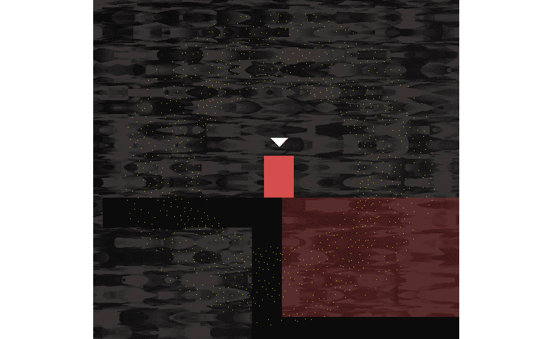

# *第 18 章*:粒子系统和着色器

在这一章中，我们将看看什么是粒子系统，然后将它编码到我们的游戏中。我们将触及 OpenGL 着色器主题的表面，看看如何用另一种语言( **GLSL** )编写可以直接在显卡上运行的代码，以获得流畅的图形效果，否则这可能是不可能的。像往常一样，我们也将使用我们的新技能和知识来增强当前的项目。

在本章中，我们将涵盖以下主题:

*   构建粒子系统
*   OpenGL 着色器和 GLSL
*   在托马斯迟到游戏中使用着色器

# 构建粒子系统

在我们开始编码之前，看看我们到底想要实现什么是有帮助的。

请看下图:


上图是素色背景上粒子效果的截图。我们将在我们的游戏中使用这个效果。我们会在玩家每次死亡时产生一个这样的效果。

我们实现这一效果的方式如下:

1.  首先，我们在选定的像素位置生成 1000 个点(粒子)，一个在另一个之上。
2.  游戏的每一帧以预定但随机的速度和角度向外移动 1000 个粒子中的每一个。
3.  重复第二步两秒钟，然后让粒子消失。

我们将使用一个`VertexArray`来绘制所有的点，并使用`Point`的原始类型来直观地表示每个粒子。此外，我们将继承 SFML `Drawable`类，这样我们的粒子系统就可以处理绘图本身。

## 对粒子类进行编码

`Particle`类将是一个简单的类，只代表一千个粒子中的一个粒子。让我们开始编码。

### 编码粒子

右键单击**解决方案资源管理器**中的**头文件**，选择**添加|新项目...**。在**添加新项目**窗口中，突出显示(通过左键单击)**头文件(。h)** 然后在**名称**字段中，输入`Particle.h`。最后，点击**添加**按钮。我们现在准备为`Particle`类编码头文件。

将以下代码添加到`Particle.h`文件中:

```cpp
#pragma once
#include <SFML/Graphics.hpp>
using namespace sf;
class Particle
{
private:
    Vector2f m_Position;
    Vector2f m_Velocity;
public:
    Particle(Vector2f direction);
    void update(float dt);
    void setPosition(Vector2f position);
    Vector2f getPosition();
};
```

在前面的代码中，我们有两个`Vector2f`对象。一个将代表粒子的水平和垂直坐标，而另一个将代表水平和垂直速度。

重要说明

当您在多个方向上有变化率(速度)时，组合值也定义了一个方向。这叫做**速度**。因此`Vector2f`被称为`m_Velocity`。

我们还有几个公共功能。首先是构造函数。它需要一个`Vector2f`并利用这个让它知道这个粒子会有哪个方向/速度。这意味着选择速度的是系统，而不是粒子本身。

接下来是`update`功能，它占用前一帧所占用的时间。我们将使用它精确地移动粒子正确的量。

最后两个函数`setPosition`和`getPosition`分别用于移动粒子的位置和找出其位置。

当我们对这些函数进行编码时，它们都将完全有意义。

### 对粒子文件进行编码

右键单击**解决方案资源管理器**中的**源文件**，并选择**添加|新项目...**。在**添加新项目**窗口中，突出显示(通过左键单击) **C++文件(。cpp)** 然后，在**名称**字段中，键入`Particle.cpp`。最后，点击**添加**按钮。我们现在准备为`Particle`类编码`.cpp`文件。

在`Particle.cpp`中添加以下代码:

```cpp
#include "Particle.h"
Particle::Particle(Vector2f direction)
{
    // Determine the direction

    m_Velocity.x = direction.x;
    m_Velocity.y = direction.y;
}
void Particle::update(float dtAsSeconds)
{
    // Move the particle
    m_Position += m_Velocity * dtAsSeconds;
}
void Particle::setPosition(Vector2f position)
{
    m_Position = position;
}
Vector2f Particle::getPosition()
{
    return m_Position;
}
```

所有这些函数都使用我们以前见过的概念。构造函数使用在`Vector2f`对象中传递的来设置`m_Velocity.x`和`m_Velocity.y`值。

`update`功能通过将`m_Velocity`乘以经过的时间(`dtAsSeconds`)来移动粒子的水平和垂直位置。请注意，要实现这一点，我们只需将两个`Vector2f`对象添加在一起。不需要分别为 x 和 y 成员执行计算。

如前所述，`setPosition`函数用传入的值初始化`m_Position`对象。`getPosition`功能返回`m_Position`到调用代码。

我们现在有了一个功能齐全的`Particle`类。接下来，我们将编写一个`ParticleSystem`类来产生和控制粒子。

## 对粒子系统类进行编码

`ParticleSystem`类为我们的粒子效果做了大部分工作。我们将在`Engine`类中创建的实例就是这个类。然而，在此之前，让我们再多谈一谈面向对象编程和 SFML `Drawable`课程。

# 探索 SFML 的可绘制类和面向对象程序设计

`Drawable`类只有一个功能。它也没有变量。此外，它唯一的功能是纯虚拟的。这意味着，如果我们从`Drawable`继承，我们必须实现它唯一的功能。从第 14 章[](14.html#_idTextAnchor292)**抽象和代码管理——更好地利用 OOP* 中可以看出，我们可以将继承自`drawable`的类用作多态类型。更简单地说，SFML 允许我们用`Drawable`对象做的任何事情，我们都可以用从它继承的类来做。唯一的要求是我们必须为纯虚函数提供一个定义，`draw`。*

 *一些继承自`Drawable`的职业已经包括`Sprite`和`VertexArray`(以及其他)。每当我们使用`Sprite`或`VertexArray`时，我们都将其传递给`RenderWindow`类的`draw`功能。

我们之所以能够在这整本书里画出我们曾经画过的每一个物体，是因为它们都是从`Drawable`继承而来的。我们可以利用这些知识。

我们可以用任何喜欢的对象从`Drawable`继承，只要实现纯虚的`draw`功能。这也是一个简单的过程。考虑一个假设的`SpaceShip`类。从`Drawable`继承的`SpaceShip`类的头文件(`SpaceShip.h`)如下所示:

```cpp
class SpaceShip : public Drawable
{
private:
    Sprite m_Sprite;
    // More private members
public:
    virtual void draw(RenderTarget& target, 
        RenderStates states) const;
    // More public members
};
```

在前面的代码中，我们可以看到纯虚拟的`draw`函数和一个`Sprite`实例。请注意，在课堂之外没有办法进入私人的`Sprite`，甚至连`getSprite`功能都没有！

`SpaceShip.cpp`文件看起来像这样:

```cpp
void SpaceShip::SpaceShip
{
    // Set up the spaceship
}
void SpaceShip::draw(RenderTarget& target, RenderStates states) const
{
    target.draw(m_Sprite, states);
}
// Any other functions
```

在前面的代码中，请注意`draw`函数的简单实现。参数超出了本书的范围。只需注意`target`参数用于调用`draw`，传入`m_Sprite`以及另一个参数`states`。

小费

虽然没有必要了解充分利用`Drawable`的参数，但在本书的上下文中，您可能会感兴趣。你可以在 SFML 网站上读到更多关于 SFML 的信息。

在主游戏循环中，我们现在可以将`SpaceShip`实例视为`Sprite`或从`Drawable`继承的任何其他类，如下所示:

```cpp
SpaceShip m_SpaceShip;
// create other objects here
// ...
// In the draw function
// Rub out the last frame
m_Window.clear(Color::Black);
// Draw the spaceship
m_Window.draw(m_SpaceShip);
// More drawing here
// ...
// Show everything we have just drawn
m_Window.display();
```

因为`SpaceShip` **是** `Drawable`所以我们可以把它当作`Sprite`或者`VertexArray`来对待，因为我们否决了纯虚的`draw`函数，所以一切都按照我们希望的那样运行。在本章中，您将使用这种方法来绘制粒子系统。

在我们讨论面向对象程序设计的时候，让我们来看看将绘图代码封装到游戏对象中的另一种方法，我们将在下一个项目中使用它。

## 从可绘制继承的替代方案

也有可能通过实现我们自己的函数，在我们的类中，通过使用下面的代码，将所有的绘图功能保留在作为要绘制的对象的类中:

```cpp
void drawThisObject(RenderWindow window)
{
    window.draw(m_Sprite)
}
```

前面的代码假设`m_Sprite`代表我们正在绘制的当前类的视觉外观，就像它在这个项目和上一个项目中一样。假设包含`drawThisObject`函数的类的实例被称为`playerHero`，并且进一步假设我们有一个名为`m_Window`的`RenderWindow`的实例，那么我们可以使用以下代码从主游戏循环中绘制对象:

```cpp
 playerHero.draw(m_Window);
```

在这个解决方案中，我们将`RenderWindow`、`m_Window`作为参数传递到`drawThisObject`函数中。`drawThisObject` 功能然后使用`RenderWindow`绘制`Sprite`、`m_Sprite`。

如果我们有一组更复杂的游戏对象，那么传递一个`RenderWindow`的引用给要绘制的对象，每一帧，这样它就可以自己绘制，是一个很好的战术。

我们将在本书的最后一个项目中使用这种策略，我们将在下一章开始。让我们通过编码`ParticleSystem`类来完成粒子系统，这个类将继承自`Drawable`。

### 编码粒子系统

右键单击**解决方案资源管理器**中的**头文件**，选择**添加|新项目...**。在**添加新项目**窗口中，突出显示(通过左键单击)**头文件(。h)** 然后在**名称**字段中，输入`ParticleSystem.h`。最后，点击**添加**按钮。我们现在准备为`ParticleSystem`类编码头文件。

将`ParticleSystem`类的代码添加到`ParticleSystem.h`中:

```cpp
#pragma once
#include <SFML/Graphics.hpp>
#include "Particle.h"
using namespace sf;
using namespace std;
class ParticleSystem : public Drawable
{
private:
    vector<Particle> m_Particles;
    VertexArray m_Vertices;
    float m_Duration;
    bool m_IsRunning = false;
public:
    virtual void draw(RenderTarget& target, 
      RenderStates states) const;

    void init(int count);
    void emitParticles(Vector2f position);
    void update(float elapsed);
    bool running();
};
```

让我们一点一点来看这个。首先，请注意我们继承了 SFML 的`Drawable`类。这将允许我们将我们的`ParticleSystem`实例传递给`m_Window.draw`，因为`ParticleSystem` **是一个** `Drawable`。而且，由于我们从`Drawable`继承，我们可以使用与`Drawable`类内部使用的相同的函数签名来覆盖`draw`函数。很快，当我们使用`ParticleSystem`类时，我们将看到以下代码。

```cpp
m_Window.draw(m_PS);
```

`m_PS`对象是我们的`ParticleSystem`类的一个实例，我们将它直接传递给`RenderWindow`类的`draw`函数，就像我们对`Sprite`、`VertexArray`和`RectangleShape`实例所做的一样。继承和多态的力量使这一切成为可能。

小费

暂时不要添加`m_Window.draw…`代码；我们首先还有一点工作要做。

有一个名为`Particle`类型的`m_Particles`的向量。这个向量将保存`Particle`的每一个实例。接下来，我们有一个`VertexArray`叫做`m_Vertices`。这将用于以一整串`Point`图元的形式绘制所有粒子。

`m_Duration`、`float`变量是每个效果持续的时间。我们将在构造函数中初始化它。

`m_IsRunning`布尔变量将用于指示粒子系统当前是否正在使用。

接下来，在公共部分，我们有纯虚拟函数`draw`，我们将很快实现它来处理当我们将`ParticleSystem`的实例传递给`m_Window.draw`时发生的事情。

`init`功能将准备`VertexArray`和`vector`。它还将初始化所有`Particle`物体(由`vector`持有)的速度和初始位置。

`update`函数将遍历`vector`中的每个`Particle`实例，并调用它们各自的`update`函数。

`running`功能提供对`m_IsRunning`变量的访问，以便游戏引擎可以查询`ParticleSystem`当前是否在使用。

让我们对函数定义进行编码，看看`ParticleSystem`里面发生了什么。

### 粒子系统. cpp 文件的编码

右键单击**解决方案资源管理器**中的**源文件**，并选择**添加|新项目...**。在**添加新项目**窗口中，突出显示(通过左键单击) **C++文件(。cpp)** 然后，在**名称**字段中，键入`ParticleSystem.cpp`。最后，点击**添加**按钮。我们现在准备为`ParticleSystem`类编码`.cpp`文件。

我们将把这个文件分成五个部分，这样我们就可以更详细地编码和讨论它。添加第一段代码，如下所示:

```cpp
#include <SFML/Graphics.hpp>
#include "ParticleSystem.h"
using namespace sf;
using namespace std;
void ParticleSystem::init(int numParticles)
{
    m_Vertices.setPrimitiveType(Points);
    m_Vertices.resize(numParticles);
    // Create the particles
    for (int i = 0; i < numParticles; i++)
    {
        srand(time(0) + i);
        float angle = (rand() % 360) * 3.14f / 180.f;
        float speed = (rand() % 600) + 600.f;
        Vector2f direction;
        direction = Vector2f(cos(angle) * speed,
            sin(angle) * speed);
        m_Particles.push_back(Particle(direction));
    }
}
```

经过必要的`includes`，我们有了 `init`函数的定义。我们称`setPrimitiveType`为`Points`作为参数，以便`m_VertexArray`知道它将处理什么类型的原语。我们用`numParticles`调整`m_Vertices`的大小，调用`init`函数时传递给了它。

`for`循环为速度和角度创建随机值。然后，它使用三角函数将这些值转换成存储在`Vector2f`、`direction`中的向量。

小费

如果你想了解更多关于三角函数(`cos`和`sin`)如何将角度和速度转换成矢量的知识，那么你可以看看这篇文章系列:[http://gamecode school . com/essentials/computing-heading-in-2d-games-use-三角函数-part-1/](http://gamecodeschool.com/essentials/calculating-heading-in-2d-games-using-trigonometric-functions-part-1/) 。

在`for`循环(和`init`函数)中发生的最后一件事是向量被传递到`Particle`构造器中。使用`push_back`功能，新的`Particle`实例存储在`m_Particles`中。因此，调用值为`1000`的`init`就意味着我们有 1000 个`Particle`的实例，随机速度，藏在`m_Particles`里，只等着爆炸！

接下来，在`ParticleSysytem.cpp`中增加`update`功能:

```cpp
void ParticleSystem::update(float dt)
{
    m_Duration -= dt;
    vector<Particle>::iterator i;
    int currentVertex = 0;
    for (i = m_Particles.begin(); i != m_Particles.end(); i++)
    {
        // Move the particle
        (*i).update(dt);
        // Update the vertex array
        m_Vertices[currentVertex++].position = i->getPosition();
    }
    if (m_Duration < 0)
    {
        m_IsRunning = false;
    }
}
```

`update`功能比乍一看要简单。首先，`m_Duration`是通过时间流逝而减少的，`dt`。这样我们就能知道两秒钟过去了。向量迭代器`i`被声明为与`m_Particles`一起使用。

`for`循环经过`m_Particles`中的每个`Particle`实例。对于每一个，它调用其`update`函数并传入`dt`。每个粒子都会更新它的位置。粒子自我更新后，`m_Vertices`中适当的顶点会使用粒子的`getPosition`功能进行更新。在每次通过`for`循环结束时，`currentVertex`递增，为下一个顶点做好准备。

`for`循环完成编码后，`if(m_Duration < 0)`检查是否到了关闭效果的时间。如果两秒钟过去了，`m_IsRunning`被设置为`false`。

接下来，添加`emitParticles`功能:

```cpp
void ParticleSystem::emitParticles(Vector2f startPosition)
{
    m_IsRunning = true;
    m_Duration = 2;

    int currentVertex = 0;
    for (auto it = m_Particles.begin(); 
         it != m_Particles.end();
         it++)
    {
        m_Vertices[currentVertex++].color = Color::Yellow;
        it->setPosition(startPosition);
    }
}
```

这是我们将调用的启动粒子系统的函数。所以可以预见的是，我们将`m_IsRunning`设置为`true`，将`m_Duration`设置为`2`。我们声明一个`iterator`、`i`，来遍历`m_Particles`中的所有`Particle`对象，然后我们在`for`循环中这样做。

在`for`循环中，我们将顶点数组中的每个粒子设置为黄色，并将每个位置设置为`startPosition`，作为参数传入。请记住，每个粒子在相同的位置开始生命，但它们各自被赋予不同的速度。

接下来，添加纯虚`draw`函数定义:

```cpp
void ParticleSystem::
       draw(RenderTarget& target, 
       RenderStates states) const
{
    target.draw(m_Vertices, states);
}
```

在前面的代码中，我们简单地使用`target`来调用`draw`，传递`m_Vertices`和`states`作为参数。记住我们永远不会直接调用这个函数！很快，当我们声明一个`ParticleSystem`的实例时，我们将把这个实例传递给`RenderWindow draw`函数。我们刚刚编码的`draw`函数将从那里内部调用。

最后，增加`running`功能:

```cpp
bool ParticleSystem::running()
{
    return m_IsRunning;
}
```

`running`函数是一个简单的 getter 函数，返回`m_IsRunning`的值。我们将在本章中看到这在哪里有用，这样我们就可以确定粒子系统的当前状态。

## 使用粒子系统对象

把我们的粒子

系统工作起来非常简单，尤其是因为我们继承了`Drawable`。

### 向引擎类添加粒子系统对象

打开`Engine.h`并添加一个`ParticleSystem`对象，如下图高亮显示的代码所示:

```cpp
#pragma once
#include <SFML/Graphics.hpp>
#include "TextureHolder.h"
#include "Thomas.h"
#include "Bob.h"
#include "LevelManager.h"
#include "SoundManager.h"
#include "HUD.h"
#include "ParticleSystem.h"
using namespace sf;
class Engine
{
private:
    // The texture holder
    TextureHolder th;
    // create a particle system
    ParticleSystem m_PS;
    // Thomas and his friend, Bob
    Thomas m_Thomas;
    Bob m_Bob;
```

现在，我们需要初始化系统。

### 初始化粒子系统

打开`Engine.cpp`文件，在`Engine`构造函数的末尾添加短的高亮代码:

```cpp
Engine::Engine()
{
    // Get the screen resolution and create an SFML window and View
    Vector2f resolution;
    resolution.x = VideoMode::getDesktopMode().width;
    resolution.y = VideoMode::getDesktopMode().height;
    m_Window.create(VideoMode(resolution.x, resolution.y),
        "Thomas was late",
        Style::Fullscreen);
    // Initialize the full screen view
    m_MainView.setSize(resolution);
    m_HudView.reset(
        FloatRect(0, 0, resolution.x, resolution.y));
    // Initialize the split-screen Views
    m_LeftView.setViewport(
        FloatRect(0.001f, 0.001f, 0.498f, 0.998f));
    m_RightView.setViewport(
        FloatRect(0.5f, 0.001f, 0.499f, 0.998f));
    m_BGLeftView.setViewport(
        FloatRect(0.001f, 0.001f, 0.498f, 0.998f));
    m_BGRightView.setViewport(
        FloatRect(0.5f, 0.001f, 0.499f, 0.998f));
    // Can this graphics card use shaders?
    if (!sf::Shader::isAvailable())
    {
        // Time to get a new PC
        m_Window.close();
    }
    m_BackgroundTexture = TextureHolder::GetTexture(
        "graphics/background.png");
    // Associate the sprite with the texture
    m_BackgroundSprite.setTexture(m_BackgroundTexture);
    // Load the texture for the background vertex array
    m_TextureTiles = TextureHolder::GetTexture(
        "graphics/tiles_sheet.png");
    // Initialize the particle system
    m_PS.init(1000);
}// End Engine constructor
```

`Particle`实例的`VertexArray`和`vector`已准备好采取行动。

### 每帧更新粒子系统

打开`Update.cpp`文件，添加以下高亮显示的代码。它可以在`update`功能结束时直接进入:

```cpp
    // Update the HUD every m_TargetFramesPerHUDUpdate frames
    if (m_FramesSinceLastHUDUpdate > m_TargetFramesPerHUDUpdate)
    {
        // Update game HUD text
        stringstream ssTime;
        stringstream ssLevel;
        // Update the time text
        ssTime << (int)m_TimeRemaining;
        m_Hud.setTime(ssTime.str());
        // Update the level text
        ssLevel << "Level:" << m_LM.getCurrentLevel();
        m_Hud.setLevel(ssLevel.str());
        m_FramesSinceLastHUDUpdate = 0;
    }
    // Update the particles
    if (m_PS.running())
    {
        m_PS.update(dtAsSeconds);
    }
}// End of update function
```

前面的代码只需要调用`update`。请注意，它包含在检查中，以确保系统当前正在运行。如果它没有运行，更新它是没有意义的。

### 启动粒子系统

打开`DetectCollisions.cpp`文件，里面有`detectCollisions`功能。我们最初编码的时候在里面留了一个注释。

根据上下文确定正确的位置，并添加以下突出显示的代码:

```cpp
// Is character colliding with a regular block
if (m_ArrayLevel[y][x] == 1)
{
    if (character.getRight().intersects(block))
    {
        character.stopRight(block.left);
    }
    else if (character.getLeft().intersects(block))
    {
        character.stopLeft(block.left);
    }
    if (character.getFeet().intersects(block))
    {
        character.stopFalling(block.top);
    }
    else if (character.getHead().intersects(block))
    {
        character.stopJump();
    }
}
// More collision detection here once 
// we have learned about particle effects
// Have the characters' feet touched fire or water?
// If so, start a particle effect
// Make sure this is the first time we have detected this
// by seeing if an effect is already running            
if (!m_PS.running()) {
    if (m_ArrayLevel[y][x] == 2 || m_ArrayLevel[y][x] == 3)
    {
        if (character.getFeet().intersects(block))
        {
            // position and start the particle system
            m_PS.emitParticles(character.getCenter());
        }
    }
}
// Has the character reached the goal?
if (m_ArrayLevel[y][x] == 4)
{
    // Character has reached the goal
    reachedGoal = true;
}
```

首先，代码检查粒子系统是否已经在运行。如果不是，它会检查正在检查的当前图块是水图块还是火图块。如果是这两种情况，它会检查角色的脚是否与它接触。当这些`if`语句都为真时，粒子系统通过调用`emitParticles`函数并传入角色中心的位置作为坐标来启动效果。

### 绘制粒子系统

这是最好的部分。看看画`ParticleSystem`有多容易。在检查粒子系统正在运行之后，我们将实例直接传递给`m_Window.draw`函数。

打开`Draw.cpp`文件，在所有需要的地方添加以下高亮显示的代码:

```cpp
void Engine::draw()
{
    // Rub out the last frame
    m_Window.clear(Color::White);
    if (!m_SplitScreen)
    {
        // Switch to background view
        m_Window.setView(m_BGMainView);
        // Draw the background
        m_Window.draw(m_BackgroundSprite);
        // Switch to m_MainView
        m_Window.setView(m_MainView);        
        // Draw the Level
        m_Window.draw(m_VALevel, &m_TextureTiles);
        // Draw thomas
        m_Window.draw(m_Thomas.getSprite());
        // Draw bob
        m_Window.draw(m_Bob.getSprite());
        // Draw the particle system
        if (m_PS.running())
        {
            m_Window.draw(m_PS);
        }
    }
    else
    {
        // Split-screen view is active
        // First draw Thomas' side of the screen
        // Switch to background view
        m_Window.setView(m_BGLeftView);
        // Draw the background
        m_Window.draw(m_BackgroundSprite);
        // Switch to m_LeftView
        m_Window.setView(m_LeftView);
        // Draw the Level
        m_Window.draw(m_VALevel, &m_TextureTiles);

        // Draw bob
        m_Window.draw(m_Bob.getSprite());
        // Draw thomas
        m_Window.draw(m_Thomas.getSprite());
        // Draw the particle system
        if (m_PS.running())
        {
            m_Window.draw(m_PS);
        }

        // Now draw Bob's side of the screen
        // Switch to background view
        m_Window.setView(m_BGRightView);
        // Draw the background
        m_Window.draw(m_BackgroundSprite);
        // Switch to m_RightView
        m_Window.setView(m_RightView);
        // Draw the Level
        m_Window.draw(m_VALevel, &m_TextureTiles);
        // Draw thomas
        m_Window.draw(m_Thomas.getSprite());
        // Draw bob
        m_Window.draw(m_Bob.getSprite());
        // Draw the particle system
        if (m_PS.running())
        {
            m_Window.draw(m_PS);
        }

    }

    // Draw the HUD
    // Switch to m_HudView
    m_Window.setView(m_HudView);
    m_Window.draw(m_Hud.getLevel());
    m_Window.draw(m_Hud.getTime());
    if (!m_Playing)
    {
        m_Window.draw(m_Hud.getMessage());
    }

    // Show everything we have just drawn
    m_Window.display();
}
```

请注意，我们必须在所有的左、右和全屏代码块中绘制粒子系统。

运行游戏，将角色的一只脚移到火砖的边缘。注意粒子系统爆发出生命:



不 w，是时候做一些新的事情了。

# OpenGL、着色器和 GLSL

**开放图形库** ( **OpenGL** )是一个处理 2D 和 3D 图形的编程库。OpenGL 适用于所有主要的桌面操作系统，还有一个版本适用于移动设备，称为 OpenGL ES。

OpenGL 最初发布于 1992 年。经过二十多年的提炼和完善。此外，显卡制造商设计他们的硬件，使其与 OpenGL 配合良好。提到这一点并不是为了历史课，而是为了解释，试图改进 OpenGL 并在桌面上的 2D(和 3D 游戏)中使用它将是徒劳的，尤其是如果我们希望我们的游戏不仅仅在窗口上运行，这是显而易见的选择。我们已经在使用 OpenGL 了，因为 SFML 使用的是 OpenGL。着色器是在图形处理器本身上运行的程序。我们将在下一节中找到关于它们的更多信息。

## 可编程管道和着色器

通过 OpenGL，我们可以访问所谓的**可编程管道**。我们可以用`RenderWindow`实例的`draw`功能发送我们要绘制的图形，每一帧。在调用`draw`后，我们还可以编写运行在图形处理器上的代码，独立处理每个像素。这是一个非常强大的功能。

这个运行在图形处理器上的额外代码被称为**着色器程序**。我们可以在**顶点着色器**中编写代码来操作图形的几何形状(位置)。我们还可以编写代码，在代码中单独操纵每个像素的外观。这就是所谓的**片段着色器**。

虽然我们不会深入探索着色器，但我们将使用 **GL 着色器语言** ( **GLSL** )编写一些着色器代码，我们将一窥它提供的可能性。

在 OpenGL 中，一切都是点、线或三角形。此外，我们可以将颜色和纹理附加到这个基本的几何图形上，我们还可以将这些元素结合起来，制作出我们在当今现代游戏中看到的复杂图形。这些统称为**原语**。我们可以通过 SFML 原语和`VertexArray`以及`Sprite`和`Shape`类访问 OpenGL 原语。

除了图元，OpenGL 还使用矩阵。矩阵是一种执行算术的方法和结构。这种算法可以是极其简单的高中水平计算，例如移动(转换)坐标，也可以是相当复杂的，例如执行更高级的数学运算，例如将我们的游戏世界坐标转换成 GPU 可以使用的 OpenGL 屏幕坐标。幸运的是，SFML 在幕后为我们处理的正是这种复杂性。SFML 还允许我们直接处理 OpenGL。

小费

如果你想了解更多关于 OpenGL 的知识，可以从这里开始:[http://learnopengl.com/#!Introduction](http://learnopengl.com/#!Introduction)。如果你想直接用 OpenGL，旁边还有 SFML，可以看这篇文章了解更多:[https://www.sfml-dev.org/tutorials/2.5/window-opengl.php](https://www.sfml-dev.org/tutorials/2.5/window-opengl.php)。

一个应用程序可以有许多着色器。然后我们可以*将*不同的着色器附加到不同的游戏对象上，以创建所需的效果。在这个游戏中，我们将只有一个顶点和一个片段着色器。我们将把它应用于每一帧，以及背景。

但是，当您看到如何将着色器附加到`draw`调用时，很明显拥有更多着色器是微不足道的。

我们将遵循以下步骤:

1.  首先，我们需要将在 GPU 上执行的着色器的代码。
2.  然后，我们需要编译这些代码。
3.  最后，我们需要在我们游戏引擎的绘制函数中将着色器附加到适当的`draw`函数调用中。

GLSL 是一种语言，它也有自己的类型，以及这些类型的变量，可以声明和使用。此外，我们可以通过 C++代码与着色器程序的变量进行交互。

正如我们将看到的，GLSL 与 C++有一些语法上的相似之处。

## 编码片段着色器

这是来自`shaders`文件夹中`rippleShader.frag`文件的代码。我们不需要对此进行编码，因为这是我们在 [*第 14 章*](14.html#_idTextAnchor292)*抽象和代码管理–更好地利用 OOP* 中添加的资产:

```cpp
// attributes from vertShader.vert
varying vec4 vColor;
varying vec2 vTexCoord;
// uniforms
uniform sampler2D uTexture;
uniform float uTime;
void main() {
    float coef = sin(gl_FragCoord.y * 0.1 + 1 * uTime);
    vTexCoord.y +=  coef * 0.03;
    gl_FragColor = vColor * texture2D(uTexture, vTexCoord);
}
```

前四行(不包括注释)是片段着色器将使用的变量，但它们不是普通变量。我们能看到的第一种类型是`varying`。这些变量的范围介于`shaders`和`uniform`之间。接下来，我们有`uniform`变量。这些变量可以直接从我们的 C++代码中操作。我们将很快看到如何做到这一点。

除了`varying`和`uniform`类型之外，每个变量还有一个定义实际数据的更常规的类型，如下所示:

*   `vec4`是一个有四个值的向量。
*   `vec2`是一个有两个值的向量。
*   `sampler2d` 会持有一个纹理。
*   `float`就像 C++中的一个`float data type`。

执行`main`函数内部的代码。如果我们仔细观察`main`中的代码，我们会看到每个变量都在使用。这段代码的具体功能超出了本书的范围。然而，总之，纹理坐标(`vTexCoord`)和像素/片段的颜色(`glFragColor`)由几个数学函数和运算操纵。请记住，这是对我们游戏的每一帧中调用的`draw`函数所涉及的每个像素执行的。此外，请注意`uTime`是作为每个帧的不同值传入的。我们很快就会看到，结果将是一种涟漪效应。

## 编码顶点着色器

这是来自`vertShader.vert`文件的代码。你不需要编码。这是我们在第 14 章[](14.html#_idTextAnchor292)**抽象和代码管理-更好地利用 OOP* 中添加的资产:*

```cpp
//varying "out" variables to be used in the fragment shader
varying vec4 vColor;
varying vec2 vTexCoord;

void main() {
    vColor = gl_Color;
    vTexCoord = (gl_TextureMatrix[0] * gl_MultiTexCoord0).xy;
    gl_Position = gl_ModelViewProjectionMatrix * gl_Vertex;
}
```

首先，注意两个`varying`变量。这些就是我们在片段着色器中操作的变量。在`main`函数中，代码操纵每个顶点的位置。代码如何工作超出了本书的范围，但是在幕后有一些相当深入的数学研究。如果你对它感兴趣，那么进一步探索 GLSL 将会很有趣。

现在我们有了两个着色器(一个片段和一个顶点)，我们可以在游戏中使用它们。

## 向引擎类添加着色器

打开`Engine.h`文件。添加以下突出显示的代码行，它将名为`m_RippleShader`的 SFML `Shader`实例添加到`Engine`类中:

```cpp
// Three views for the background
View m_BGMainView;
View m_BGLeftView;
View m_BGRightView;
View m_HudView;
// Declare a sprite and a Texture for the background
Sprite m_BackgroundSprite;
Texture m_BackgroundTexture;
// Declare a shader for the background
Shader m_RippleShader;
// Is the game currently playing?
bool m_Playing = false;
// Is character 1 or 2 the current focus?
bool m_Character1 = true;
```

引擎对象及其所有功能现在都可以访问`m_RippleShader`。请注意，SFML `Shader`对象将由两个着色器代码文件组成。

## 加载着色器

添加以下代码，检查播放器的 GPU 是否可以处理着色器。如果不能，游戏将退出。

小费

你必须有一台非常旧的电脑，否则就无法工作。如果你有一个不处理着色器的图形处理器，请接受我的道歉。

接下来，我们将添加一个`else`子句，如果系统可以处理着色器的话，该子句将加载着色器。打开`Engine.cpp`文件，将此代码添加到构造函数中:

```cpp
// Can this graphics card use shaders?
if (!sf::Shader::isAvailable())
{
    // Time to get a new PC
    // Or remove all the shader related code L
    m_Window.close();
}
else
{
    // Load two shaders (1 vertex, 1 fragment)
    m_RippleShader.loadFromFile("shaders/vertShader.vert",
        "shaders/rippleShader.frag");
}
m_BackgroundTexture = TextureHolder::GetTexture(
    "graphics/background.png");
```

我们几乎准备好看到我们的连锁反应在行动。

## 更新和绘制着色器

打开`Draw.cpp`文件。正如我们在编码着色器时已经讨论过的，我们将在每一帧直接从我们的 C++代码中更新`uTime`变量。我们将通过`setParameter`功能来实现。

在每个可能的绘制场景中，添加以下高亮显示的代码来更新着色器的`uTime`变量，并将对`m_BackgroundSprite`的调用更改为`draw`:

```cpp
void Engine::draw()
{
    // Rub out the last frame
    m_Window.clear(Color::White);
    // Update the shader parameters
m_RippleShader.setUniform("uTime", 
      m_GameTimeTotal.asSeconds());
    if (!m_SplitScreen)
    {
        // Switch to background view
        m_Window.setView(m_BGMainView);
        // Draw the background
        //m_Window.draw(m_BackgroundSprite);
        // Draw the background, complete with shader effect
        m_Window.draw(m_BackgroundSprite, &m_RippleShader);
        // Switch to m_MainView
        m_Window.setView(m_MainView);
        // Draw the Level
        m_Window.draw(m_VALevel, &m_TextureTiles);
        // Draw thomas
        m_Window.draw(m_Thomas.getSprite());
        // Draw thomas
        m_Window.draw(m_Bob.getSprite());
        // Draw the particle system
        if (m_PS.running())
        {
            m_Window.draw(m_PS);
        }
    }
    else
    {
        // Split-screen view is active
        // First draw Thomas' side of the screen
        // Switch to background view
        m_Window.setView(m_BGLeftView);
        // Draw the background
        //m_Window.draw(m_BackgroundSprite);
        // Draw the background, complete with shader effect
        m_Window.draw(m_BackgroundSprite, &m_RippleShader);
        // Switch to m_LeftView
        m_Window.setView(m_LeftView);
        // Draw the Level
        m_Window.draw(m_VALevel, &m_TextureTiles);

        // Draw thomas
        m_Window.draw(m_Bob.getSprite());
        // Draw thomas
        m_Window.draw(m_Thomas.getSprite());
        // Draw the particle system
        if (m_PS.running())
        {
            m_Window.draw(m_PS);
        }

        // Now draw Bob's side of the screen
        // Switch to background view
        m_Window.setView(m_BGRightView);
        // Draw the background
        //m_Window.draw(m_BackgroundSprite);
        // Draw the background, complete with shader effect
        m_Window.draw(m_BackgroundSprite, &m_RippleShader);
        // Switch to m_RightView
        m_Window.setView(m_RightView);
        // Draw the Level
        m_Window.draw(m_VALevel, &m_TextureTiles);
        // Draw thomas
        m_Window.draw(m_Thomas.getSprite());
        // Draw bob
        m_Window.draw(m_Bob.getSprite());
        // Draw the particle system
        if (m_PS.running())
        {
            m_Window.draw(m_PS);
        }                
    }

    // Draw the HUD
    // Switch to m_HudView
    m_Window.setView(m_HudView);
    m_Window.draw(m_Hud.getLevel());
    m_Window.draw(m_Hud.getTime());
    if (!m_Playing)
    {
        m_Window.draw(m_Hud.getMessage());
    }    

    // Show everything we have just drawn
    m_Window.display();
}
```

最好删除被注释掉的代码行。

运行游戏，你会得到一种怪异的熔岩。尝试改变背景图像以获得一些乐趣:


就这样！我们的第四场比赛结束了。

# 总结

在本章中，我们探讨了粒子系统和着色器的概念。虽然我们看了每个可能最简单的情况，我们仍然设法创造了一个简单的爆炸和一个怪异的熔融岩石效果。

在接下来的四章中，我们将在构建太空入侵者游戏的同时，研究更多使用设计模式改进代码的方法。**