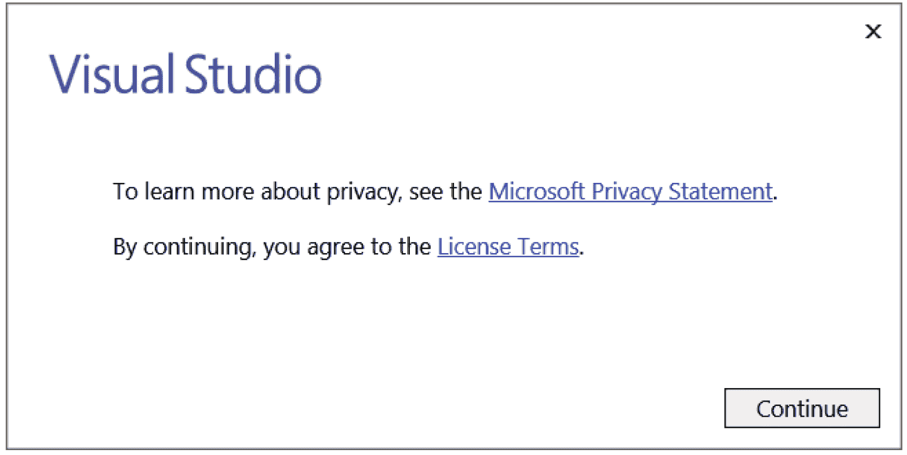
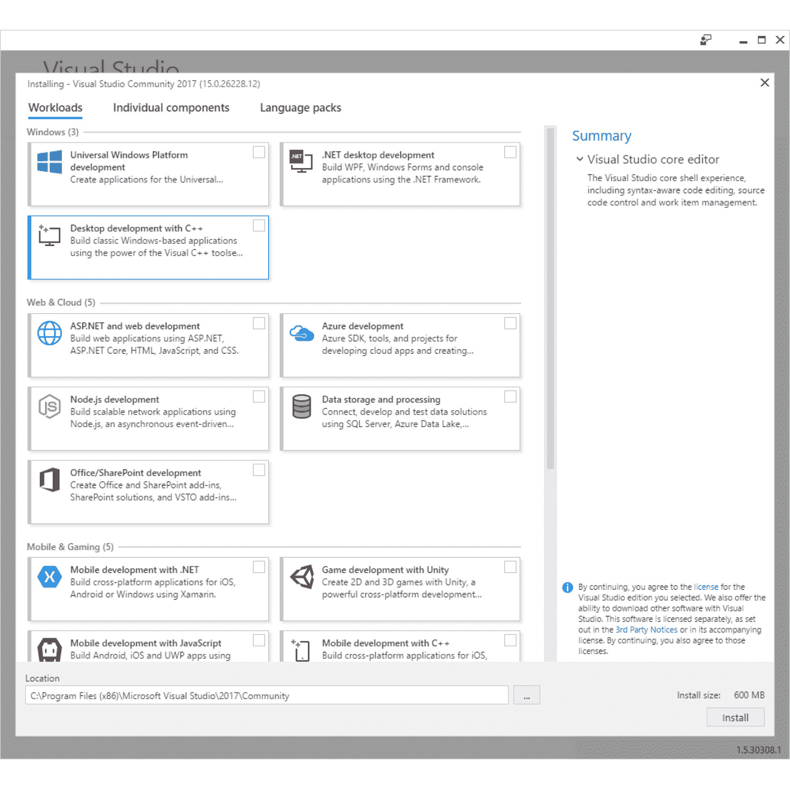
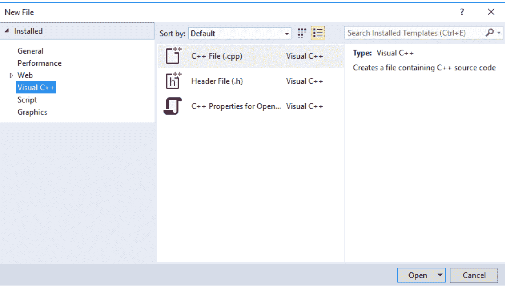

# 一、从 C++ 开始

为什么是 C++？ 使用 C++ 的理由和本书的读者一样多。

您选择 C++ 可能是因为您必须支持 C++ 项目。 在其生命周期的 30 年中，已经编写了数百万行 C++，大多数流行的应用和操作系统将主要用 C++ 编写，或者将使用 C++ 编写的组件和库。 几乎不可能找到一台不包含一些用 C++ 编写的代码的计算机。

或者，您可能选择了 C++ 来编写新代码。 这可能是因为您的代码将使用用 C++ 编写的库，并且有数千个库可用：开放源码库、共享软件库和商业库。

或者，这可能是因为您被 C++ 提供的功能和灵活性所吸引。 现代高级语言的设计目的是使程序员能够轻松地执行操作；虽然 C++ 具有这样的功能，但它也允许您尽可能地接近机器，从而赋予您直接内存访问(有时是危险的)功能。 通过类和重载等语言特性，C++ 是一种灵活的语言，允许您扩展该语言的工作方式并编写可重用的代码。

无论您决定使用 C++ 的原因是什么，您都做出了正确的选择，这本书是正确的起点。

# 在这一章中你会发现什么？

由于这本书是一本动手手册，因此它包含您可以键入、编译和运行的代码。 要编译代码，您需要 C++ 编译器和链接器，在本书中，这指的是提供 Visual C++ 的 Visual Studio2017 社区版。 之所以选择这个编译器，是因为它是免费下载的，它符合 C++ 标准，并且它有非常广泛的工具来简化代码的编写。 Visual C++ 提供了与 C++ 11 兼容的语言功能以及几乎所有 C++ 14 和 C++ 17 的语言功能。Visual C++ 还提供了 C99 运行时库、C++ 11 标准库和 C++ 14 标准库。 所有这些提到**标准**意味着您在本书中学习编写的代码可以用所有其他标准 C++ 编译器编译。

本章将从如何获取和安装 Visual Studio 2017 社区版的详细信息开始。 如果您已经有 C++ 编译器，您可以跳过这一节。 本书的大部分内容对编译器和链接器工具都是厂商中立的，但第 10 章*诊断和调试*将涵盖一些特定于 Microsoft 的功能。 Visual Studio 具有功能齐全的代码编辑器，因此即使您不使用它来管理项目，您也会发现编辑代码非常有用。

在我们描述了安装之后，您将学习 C++ 的基础知识：如何构建源文件和项目，以及如何管理可能包含数千个文件的项目。

最后，本章将以一个循序渐进的结构化示例结束。 在这里，您将学习如何编写使用标准 C++ 库和一种机制来管理项目中的文件的简单函数。

# 什么是 C++？

C++ 的前身是 C，由贝尔实验室的 Dennis Richie 设计，于 1973 年首次发布。 C 语言是一种广泛使用的语言，用于编写 Unix 和 Windows 的早期版本。 事实上，许多操作系统的库和软件开发库仍然是用 C 接口编写的。 C 是强大的，因为它可以用来编写编译成紧凑形式的代码，它使用静态类型系统(因此编译器执行类型检查工作)，并且该语言的类型和结构允许对计算机体系结构的直接内存访问。

然而，C 是过程性的，基于函数，虽然它有记录类型(`struct`)来封装数据，但它没有类似对象的行为来作用于封装的状态。 显然，不仅需要 C 语言的强大功能，还需要面向对象类的灵活性和可扩展性：一种以 C 语言为基础，带有类的语言。 1983 年，Bjarne Stroustrup 发布了 C++。 ++ 来自 C 增量运算符`++ `。

Strictly, when postfixed to a variable, the `++ ` operator means *increment the variable, but return the variable's value before it was incremented*. So the C statements `int c = 1; int d = c++ ;` will result in variable `d` having a value of 1 and variable `c` having a value of 2\. This does not quite express the idea that C++ is an increment on C.

# 安装 Visual C++

Microsoft 的 Visual Studio Community 2017 包含 Visual C++ 编译器、C++ 标准库和一组可用于编写和维护 C++ 项目的标准工具。 这本书不是关于如何编写 Windows 代码的，而是关于如何编写标准 C++ 以及如何使用 C++ 标准库的。 本书中的所有示例都将在命令行上运行。 之所以选择 visual Studio，是因为它是免费下载的(尽管您确实需要向 Microsoft 注册电子邮件地址)，而且它符合标准。 如果您已经安装了 C++ 编译器，则可以跳过本部分。

# 设置

在开始安装之前，您应该知道，作为作为 Microsoft 社区程序一部分安装 Visual Studio 的协议的一部分，您应该拥有 Microsoft 帐户。 第一次运行 Visual Studio 时，您可以选择创建一个 Microsoft 帐户，如果您跳过此阶段，您将获得 30 天的试用期。 Visual Studio 将在本月提供完整的功能，但如果您想在此之后使用 Visual Studio，您必须提供一个 Microsoft 帐户。 Microsoft 帐户不会强加给您任何义务，当您在登录后使用 Visual C++ 时，您的代码仍将保留在您的计算机上，没有义务将其传递给 Microsoft。

当然，如果您在一个月内阅读了这本书，您将能够使用 Visual Studio，而无需使用您的 Microsoft 帐户登录；您可以将此视为一种激励，促使您勤奋地读完这本书！

# 正在下载安装文件

要下载 Visual Studio Community 2017 安装程序，请访问[https://www.visualstudio.com/vs/社区/](https://www.visualstudio.com/vs/%20community/)。

当您单击 Download Community 2017 按钮时，您的浏览器将下载一个名为`vs_community__1698485341.1480883588.exe`的 1 MB 文件。 当您运行此应用时，它将允许您指定要安装的语言和库，然后它将下载并安装所有必要的组件。

# 安装 Visual Studio

Visual Studio 2017 将 Visual C++ 视为可选组件，因此您必须明确表示要通过自定义选项安装它。 首次执行安装程序时，您将看到以下对话框：



当您单击“继续”按钮时，应用将设置安装程序，如下所示：



顶部有三个选项卡，分别标记为工作负载、单个组件和语言包。 确保您已经选择了 WorkLoads 选项卡(如屏幕截图所示)，并选中了名为 Desktop Development with C++ 的项目中的复选框。

安装程序将检查您是否有足够的磁盘空间来安装所选选项。 Visual Studio 需要的最大空间量是 8 GB，但对于 Visual C++，您使用的空间要少得多。 当您选中 Desktop Development with C++ Item 时，您将看到对话框右侧更改为列出所选选项和所需的磁盘大小，如下所示：


对于本书，保留安装程序选择的选项，然后单击右下角的安装按钮。 安装程序将下载所需的所有代码，并通过以下对话框让您随时了解进度：


安装完成后，Visual Studio Community 2017 项将更改为有两个按钮，Modify 和 Launch，如下所示：


Modify 按钮允许您添加更多组件。 单击启动以首次运行 Visual Studio。

# 正在向 Microsoft 注册

第一次运行 Visual Studio 时，它将通过以下对话框要求您登录到 Microsoft 服务：


您不必注册 Visual Studio，但如果您选择不注册，Visual Studio 将只工作 30 天。 向 Microsoft 注册不会给您带来任何义务。 如果您愿意注册，那么不妨现在就注册。 单击“登录”按钮提供您的 Microsoft 凭据，或者如果您没有帐户，则单击“注册”以创建帐户。

当您单击启动按钮时，将打开一个新窗口，但安装程序窗口将保持打开状态。 您可能会发现安装程序窗口隐藏了欢迎窗口，因此请检查 Windows 任务栏以查看是否打开了另一个窗口。 一旦 Visual Studio 启动，您就可以关闭安装程序窗口。

现在，您将能够使用 Visual Studio 编辑代码，并且在您的计算机上安装了 Visual C++ 编译器和库，因此您将能够在 Visual Studio 中或在命令行上编译 C++ 代码。

# 检查 C++ 项目

C++ 项目可以包含数千个文件，管理这些文件可能是一项任务。 在生成项目时，是否应该编译文件？如果是，使用哪种工具？ 文件应该按什么顺序编译？ 这些编译器将产生什么输出？ 编译后的文件应该如何组合才能生成可执行文件？

编译器工具还将有大量选项，包括调试信息、优化类型、对不同语言功能的支持以及处理器功能。 编译器选项的不同组合将在不同的情况下使用(例如，发布版本和调试版本)。 如果从命令行编译，则必须确保选择正确的选项，并在编译的所有源代码中一致地应用这些选项。

管理文件和编译器选项可能会变得非常复杂。 这就是为什么对于生产代码，您应该使用 make 工具。 有两个是随 Visual Studio 一起安装的：**MSBuild**和**nmake**。 在 Visual Studio 环境中生成 Visual C++ 项目时，将使用 MSBuild，编译规则将存储在 XML 文件中。 您还可以在命令行上调用 MSBuild，将 XML 项目文件传递给它。 Nmake 工具是 Microsoft 版本的程序维护实用程序，在许多编译器中通用。 在本章中，您将学习如何编写一个简单的**Makefile**，以便与 nmake 实用程序一起使用。

在介绍项目管理的基础知识之前，我们首先要检查 C++ 项目中常见的文件，以及编译器将对这些文件做什么。

# 编译器

C++ 是一种高级语言，旨在为您提供丰富的语言工具，便于您和其他开发人员阅读。 计算机的处理器执行低级代码，编译器的目的是将 C++ 转换为处理器的机器码。 单个编译器可能能够面向几种类型的处理器，如果代码是标准 C++，则可以使用支持其他处理器的其他编译器进行编译。

然而，编译器所做的远不止这些。 正如在[第 4 章](04.html)，*使用内存、数组和指针*中所解释的，C++ 允许您将代码拆分成函数，这些函数接受参数并返回值，因此编译器设置用于传递此数据的内存。 此外，函数可以声明仅在该函数内使用的变量([第 5 章](05.html)，*使用函数*，将提供更多详细信息)，并且仅在函数执行时存在。 编译器设置这个内存，称为**堆栈帧**。 您有关于如何创建堆栈帧的编译器选项；例如，Microsoft 编译器选项`/Gd`、`/Gr`和`/Gz`确定将函数参数压入堆栈的顺序，以及调用方函数或被调用函数是否在调用结束时从堆栈中删除参数。 当您编写要共享的代码时，这些选项非常重要(但出于本书的目的，应该使用默认的堆栈结构)。 这只是一个方面，但它应该会给您留下深刻的印象，即编译器设置为您提供了大量的功能和灵活性。

编译器编译 C++ 代码，如果在代码中遇到错误，它将发出编译器错误。 这是代码的语法检查。 需要指出的是，从语法的角度来看，您编写的代码可以是完美的 C++ 代码，但也可能是无稽之谈。 编译器的语法检查是对代码的一项重要检查，但您应该始终使用其他检查。 例如，下面的代码声明一个整数变量并为其赋值：

```cpp
    int i = 1 / 0;
```

编译器将发出错误`C2124 : divide or mod by zero`。 但是，下面的代码将使用另一个变量执行相同的操作，该变量在逻辑上是相同的，但编译器不会发出错误：

```cpp
    int j = 0; 
    int i = 1 / j;
```

当编译器发出错误时，它将停止编译。 这意味着两件事。 首先，您得不到编译后的输出，因此错误不会进入可执行文件。 其次，这意味着，如果源代码中还有其他错误，只有在修复了当前错误并重新编译之后才能知道。 如果要执行语法检查并将编译留待以后进行，请使用`/Zs`开关。

编译器还将生成警告消息。 警告意味着代码将进行编译，但代码中可能存在影响可执行文件运行方式的问题。 Microsoft 编译器定义了四个级别的警告：级别 1 是最严重的(应该解决)，级别 4 是信息性的。

警告通常用于指示正在编译的语言功能可用，但它需要开发人员尚未使用的特定编译器选项。 在代码开发过程中，您通常会忽略警告，因为您可能要测试语言功能。 但是，当您接近生成生产代码时，您应该更多地关注警告。 默认情况下，Microsoft 编译器将显示 1 级警告，您可以使用带数字的`/W`选项来指示您希望看到的级别(例如，`/W2`表示您希望看到 2 级警告和 1 级警告)。 在生产代码中，您可以使用`/Wx`选项，该选项告诉编译器将警告视为错误，以便您必须修复问题才能编译代码。 您还可以使用`pragmas`命令编译器(`pragmas`将在后面解释)和编译器选项来隐藏特定警告。

# 链接代码

编译器将产生输出。 对于 C++ 代码，这将是目标代码，但您可能有其他编译器输出，如编译的资源文件。 这些文件本身无法执行；尤其是因为操作系统需要设置某些结构。 C++ 项目总是分为两个阶段：将代码编译成一个或多个目标文件，然后将目标文件链接到可执行文件。 这意味着您的 C++ 编译器将提供另一个称为链接器的工具。

链接器还具有确定其工作方式以及指定其输出和输入的选项，并且还将发出错误和警告。 与编译器一样，Microsoft 链接器有一个选项`/WX`，可以将警告视为发布版本中的错误。

# 源文件

在最基本的级别上，C++ 项目将只包含一个文件：C++ 源文件，通常扩展名为`cpp`或`cxx`。

# 一个简单的例子

最简单的 C++ 程序如下所示：

```cpp
    #include <iostream> 

    // The entry point of the program 
    int main() 
    { 
        std::cout << "Hello, world!n"; 
    }
```

要说明的第一点是，以`//`开头的行是注释。 编译器将忽略行尾之前的所有文本。 如果希望有多行注释，则每行必须以`//`开头。 您也可以使用 C 注释。 C 注释以`/*`开头，以`*/`结束，这两个符号之间的所有内容都是注释，包括换行符。

C 注释是注释掉部分代码的快捷方法。

大括号`{}`表示代码块；在本例中，C++ 代码用于函数`main`。 我们知道这是一个函数，因为它的基本格式是：首先是返回值的类型，然后是带一对圆括号的函数名，它用于声明传递给函数的参数(及其类型)。 在本例中，该函数名为`main`，圆括号为空，表示该函数没有参数。 函数名(`int`)之前的标识符表示该函数将返回一个整数。

C++ 的惯例是，名为`main`的函数是可执行文件的**入口点**，也就是说，当您从命令行调用可执行文件时，这将是代码中将被调用的第一个函数。

This simple example function immediately immerses you into an aspect of C++ that irritates programmers of other languages: the language may have rules, but the rules don't always appear to be followed. In this case, the `main` function is declared to return an integer, but the code returns no value. The rule in C++ is that, if the function declares that it returns a value, then it must return a value. However, there is a single exception to this rule: if the `main` function does not return a value, then a value of `0` will be assumed. C++ contains many quirks such as this, but you will soon learn what they are and get used to them.

`main`函数只有一行代码；这是一个以`std`开头、以分号(`;`)结尾的语句。 C++ 可以灵活地使用空格(空格、制表符和换行符)，这将在下一章中解释。 但是，重要的是要注意，您必须小心使用文字字符串(就像这里使用的那样)，并且每个语句都用分号分隔。 忘记必需的分号是编译器错误的常见来源。 额外的分号只是一条空语句，因此对于初学者来说，分号太多对代码的致命影响可能比分号太少要小。

这条语句将字符串`Hello, world!`(和换行符)打印到控制台。 您知道这是一个字符串，因为它用双引号(`″″`)括起来。 使用运算符`<<`将字符串*放入*流对象`std::cout`。 名称的`std`部分是一个**名称空间**，实际上是具有类似目的的代码集合，或者来自单一供应商的代码集合。 在本例中，`std`表示`cout`流对象是标准 C++ 库的一部分。 双冒号`::`是**作用域解析**操作符，表示您希望访问在`std`名称空间中声明的`cout`对象。 您可以定义自己的命名空间，在大型项目中应该定义自己的命名空间，因为这将允许您使用可能已在其他命名空间中声明的名称，并且此语法允许您消除符号的歧义。

`cout`对象是`ostream`类的实例，在调用`main`函数之前已经为您创建了该实例。 `<<`表示调用名为`operator <<`的函数并向其传递字符串(它是一个由`char`个字符组成的数组)。 此函数将字符串中的每个字符打印到控制台，直到它达到`NUL`字符。
这是 C++ 灵活性的一个例子，该特性称为**运算符重载**。 `<<`运算符通常与整数一起使用，也用于将整数中的位左移指定的位数；`x << y`将返回一个`x`中的每一位都左移了`y`位的值，实际上是返回一个乘以 2<sup>y</sup>的值。 然而，在前面的代码中，代替整数`x`的是流对象`std::cout`，代替左移索引的是字符串。 显然，这在`<<`操作符的 C++ 定义中没有任何意义。 当与左侧的`ostream`对象一起使用时，C++ 标准有效地重新定义了`<<`运算符的含义。 此外，此代码中的`<<`操作符将向控制台打印一个字符串，因此它在右侧获取一个字符串。 C++ 标准库定义了允许将其他数据类型打印到控制台的其他`<<`操作符。 它们的调用方式都相同；编译器根据使用的参数类型确定编译哪个函数。
前面我们说过，已经将`std::cout`对象创建为`ostream`类的实例，但是没有说明这是如何发生的。 这将我们带到简单源文件的最后一部分，还没有解释：以`#include`开头的第一行。 这里的`#`有效地指示将向编译器提供某种类型的消息。 您可以发送各种类型的消息(有几种消息是`#define`、`#ifdef`、`#pragma`，我们将在本书的其他地方介绍这些消息)。 在本例中，`#include`告诉编译器在此时将指定文件的内容复制到源文件中，这实质上意味着该文件的内容也将被编译。 指定的文件称为**头文件**，在文件管理和通过库重用代码方面非常重要。

文件`<iostream>`(注意，没有扩展名)是标准库的一部分，可以在 C++ 编译器提供的**include 目录**中找到。 尖括号(`<>`)表示编译器应该查找用于存储头文件的标准目录，但您可以使用双引号(`″″`)提供头文件的绝对位置(或相对于当前文件的位置)。 C++ 标准库使用不使用文件扩展名的约定。 在命名您自己的头文件时，应该使用扩展名`h`(或`hpp`，很少使用`hxx`)。 C 运行时库(C++ 代码也可以使用该库)也对其头文件使用扩展名`h`。

# 正在创建源文件

首先，在开始菜单上找到 Visual Studio 2017 文件夹，然后单击 VS2017 的 Developer Command Prompt 条目。 这将启动 Windows 命令提示符，并将环境变量设置为使用 Visual C++ 2017。 但是，非常无益的是，它还会将命令行保留在 Program Files 文件夹下的 Visual Studio 文件夹中。 如果您打算进行任何开发，您会希望从这个文件夹移到一个创建和删除文件不会有任何危害的文件夹。 在执行此操作之前，请移动到 Visual C++ 文件夹并列出文件：

```cpp
C:\Program Files\Microsoft Visual Studio\2017\Community>cd %VCToolsInstallDir%
C:\Program Files\Microsoft Visual Studio\2017\Community\VC\Tools\MSVC\14.0.10.2517>dir
```

由于安装程序会将 C++ 文件放在包含编译器当前版本的文件夹中，因此使用环境变量`VCToolsInstallDir`比指定特定版本以使用最新版本(在本例中为 14.0.10.2517)更安全。
有几件事需要注意。 首先，文件夹`bin`、`include`和`lib`：

| **文件夹** | **说明** |
| `bin` | 它间接包含 Visual C++ 的可执行文件。 `bin`文件夹将包含您正在使用的 CPU 类型的单独文件夹，因此您必须导航到该文件夹下方才能找到包含可执行文件的实际文件夹。 两个主要的可执行文件是`cl.exe`(它是 C++ 编译器)和`link.exe`(它是链接器)。 |
| `include` | 此文件夹包含 C 运行时库和 C++ 标准库的头文件。 |
| `lib` | 此文件夹包含 C 运行时库和 C++ 标准库的静态链接库文件。同样，CPU 类型将有单独的文件夹 |

我们将在本章后面部分回顾这些文件夹。

需要指出的另一件事是`VC\Auxillary\Build`文件夹下的文件`vcvarsall.bat`。 当您在开始菜单上单击 VS2017 的开发者命令提示符时，将运行此批处理文件。 如果您希望使用现有的命令提示符编译 C++ 代码，可以通过运行此批处理文件进行设置。 此批处理文件的三个最重要的操作是设置`PATH`环境变量以包含 bin 文件夹的路径，并设置`INCLUDE`和`LIB`环境变量分别指向 Include 和 lib 文件夹。

现在导航到根目录并创建一个新文件夹`Beginning_C++ `，然后移动到该目录。 接下来，为本章创建一个名为`Chapter_01`的文件夹。 现在您可以切换到 Visual Studio；如果该程序尚未运行，请从“开始”菜单启动它。

在 Visual Studio 中，单击文件菜单，然后单击新建，然后单击文件...。 菜单项以获得 New File 对话框，并在左侧的树状视图中，单击 Visual C++ 选项。 在中间面板中，您将看到两个选项：C++ 文件(.cpp)和头文件(.h)，以及`Open`文件夹的 C++ 属性，如以下屏幕截图所示：



前两种文件类型用于 C++ 项目，第三种类型创建一个 JSON 文件来帮助 Visual Studio IntelliSence(键入时帮助)，本书中不会使用。
单击第一个选项，然后单击打开按钮。 这将创建一个名为 Source1.cpp 的新空文件，因此在单击 File 菜单，然后将 Source1.cpp 另存为，并导航到项目文件夹时，在单击 Save 按钮之前，将其作为 simple.cpp 保存到章节项目文件夹中，将 File name 框中的名称更改为 simple.cpp。

现在您可以输入简单程序的代码，如下所示：

```cpp
    #include <iostream> 

    int main() 
    { 
        std::cout << "Hello, world!n"; 
    }
```

当您完成此代码的键入后，通过单击文件菜单，然后单击菜单中的保存 simple.cpp 选项来保存文件。 现在就可以编译代码了。

# 编译代码

转到命令提示符并键入`**cl /?**`命令。 由于`PATH`环境设置为包含到`bin`文件夹的路径，因此您将看到编译器的帮助页面。 您可以通过按 Return 键滚动浏览这些页面，直到返回到命令提示符。 这些选项中的大多数都超出了本书的范围，但下表显示了我们将讨论的一些选项：

| **编译器开关** | **说明** |
| `/c` | 仅编译，不链接。 |
| `/D<symbol>` | 定义常量或宏<symbol>。</symbol> |
| `/EHsc` | 启用 C++ 异常处理，但指示不处理来自`extern ″C″`函数(通常是操作系统函数)的异常。 |
| `/Fe:<file>` | 提供要链接到的可执行文件的名称。 |
| `/Fo:<file>` | 提供要编译到的目标文件的名称。 |
| `/I <folder>` | 提供用于搜索包含文件的文件夹的名称。 |
| `/link<linker options>` | 将<linker options="">传递给链接器。 这必须在源文件名和用于编译器的任何开关之后。</linker> |
| `/Tp <file>` | 将<file>编译为 C++ 文件，即使它的文件扩展名没有`.cpp`或`.cxx`。</file> |
| `/U<symbol>` | 删除先前定义的<symbol>宏或常量。</symbol> |
| `/Zi` | 启用调试信息。 |
| `/Zs` | 仅限语法，不编译或链接。 |

请注意，有些选项在开关和选项之间需要空格，有些选项不能有空格，而对于其他选项，空格是可选的。 通常，如果您有包含空格的文件或文件夹的名称，则应该用双引号将名称括起来。 在使用开关之前，最好查阅帮助文件，了解它是如何使用空格的。

在命令行中，键入`**cl simple.cpp**`命令。 您会发现编译器将发出警告`**C4530**`和`**C4577**`。 原因是 C++ 标准库使用异常，而您没有指定编译器应该为异常提供必要的支持代码。 使用`/EHsc`开关可以很容易地克服这些警告。 在命令行中，键入`cl /EHsc simple.cpp`命令。 如果您正确地键入了代码，它应该会编译：

```cpp
C:\Beginning_C++ \Chapter_01>cl /EHsc simple.cpp
Microsoft (R) C/C++ Optimizing Compiler Version 19.00.25017 for x86
Copyright (C) Microsoft Corporation.  All rights reserved

simple.cpp

Microsoft (R) Incremental Linker Version 14.10.25017.0
Copyright (C) Microsoft Corporation.  All rights reserved.
/out:simple.exe

simple.obj
```

默认情况下，编译器会将该文件编译为目标文件，然后将该文件传递给链接器以链接为命令行可执行文件，该命令行可执行文件与 C++ 文件同名，但扩展名为：`.exe`。 表示`/out:simple.exe`的行是由链接器生成的，而`/out`是链接器选项。

列出文件夹的内容。 您将发现三个文件：`simple.cpp`，源文件；simple.obj，编译器的输出；以及`simple.exe`，链接器将目标文件与适当的运行时库链接后的输出。 现在，您可以通过在命令行中键入`simple`来运行可执行文件：

```cpp
C:\Beginning_C++ \Chapter_01>simple
Hello, World!
```

# 在命令行和可执行文件之间传递参数

前面，您发现`main`函数返回一个值，默认情况下该值为零。 当应用完成时，您可以将错误代码返回到命令行；这样您就可以在批处理文件和脚本中使用可执行文件，并使用该值来控制脚本中的流。 同样，当您运行可执行文件时，您可以从命令行传递参数，这将影响可执行文件的行为方式。

通过在命令行中键入`**simple**`命令来运行简单的应用。 在 Windows 中，错误码是通过伪环境变量`ERRORLEVEL`获取的，因此可以通过`**ECHO**`命令获取此值：

```cpp
C:\Beginning_C++ \Chapter_01>simple
Hello, World!

C:\Beginning_C++ \Chapter_01>ECHO %ERRORLEVEL%
0
```

要显示该值是由应用返回的，请更改`main`函数以返回非 0 的值(在本例中为 99，突出显示)：

```cpp
    int main() 
    { 
        std::cout << "Hello, world!n"; 
 return 99; 
    }
```

编译并运行此代码，然后打印出前面所示的错误代码。 您会发现错误代码现在显示为 99。

这是一种非常基本的通信机制：它只允许传递整数值，调用代码的脚本必须知道每个值的含义。 您更有可能将参数传递给应用，这些参数将通过`main`函数的参数通过您的代码传递。 将`main`函数替换为以下内容：

```cpp
        int main(int argc, char *argv[]) 
        { 
            std::cout << "there are " << argc << " parameters" <<  
            std::endl; 
            for (int i = 0; i < argc; ++ i) 
            { 
                std::cout << argv[i] << std::endl; 
            } 
        }
```

当您编写`main`函数从命令行获取参数时，惯例是它具有这两个参数。

第一个参数通常称为`argc`。 它是一个整数，表示传递给应用的参数数量。 *此参数非常重要。* 原因是您将要通过数组访问内存，而此参数给出了您的访问限制。 如果您访问超过此限制的内存，您将会遇到问题：最好的情况是访问未初始化的内存，但在最坏的情况下，您可能会导致访问冲突。

重要的是，无论何时访问内存，您都要了解要访问的内存量，并将其保持在其限制范围内。

第二个参数通常称为`argv`，是指向内存中 C 字符串的指针数组。 您将在[第 4 章](04.html)，*使用内存、数组和指针*中了解更多关于数组和指针的内容，在[第 9 章](09.html)，*中使用 Strings*了解更多关于字符串的内容，因此我们不在这里进行详细讨论。 方括号(`[]`)表示参数是一个数组，数组的每个成员的类型由`char *`给出。 `*`表示每一项都是指向内存的指针。 通常，这将被解释为指向给定类型的单个项的指针，但字符串不同：`char *`表示在内存中，指针将有零个或多个字符后跟`NUL`字符()。 字符串的长度是直到`NUL`字符的字符数。
此处显示的第三行将传递给应用的字符串数打印到控制台。 在本例中，我们不使用换行符(`n`)来添加换行符，而是使用流：`std::endl`。 您可以使用几个操纵器，这些操纵器将在第 6 章*类*中讨论。 `std::endl`操纵器将把换行符放入输出流中，然后它将刷新流。 该行显示 C++ 允许您将`<<`PUT 操作符的使用链接到一个流中。 该行还显示`<<`PUT 操作符是重载的，也就是说，不同参数类型有不同版本的操作符(在本例中，有三个版本：一个接受整数，用于`argv`，一个接受字符串参数，另一个接受操纵器作为参数)，但调用这些操作符的语法完全相同。

最后，有一个代码块用于打印`argv`数组中的每个字符串，如下所示：

```cpp
    for (int i = 0; i < argc; ++ i) 
    { 
        std::cout << argv[i] << std::endl; 
    }
```

`for`语句意味着将调用代码块，直到变量`i`小于`argc`的值，并且在每次循环成功迭代之后，变量`i`递增(使用前缀增量运算符`++ `)。 数组中的项通过方括号语法访问(`[]`)。 传递的值是数组中的*索引*。

请注意，变量`i`的起始值为`0`，因此访问的第一个项是`argv[0]`，由于当变量`i`的值为`argc`时，`for`循环结束，这意味着访问的数组中的最后一个项是`argv[argc-1]`。 这是数组的典型用法：第一个索引为零，如果数组中有`n`个项目，则最后一个项目的索引为`n-1`。

像以前一样编译并运行此代码，不带参数：

```cpp
C:\Beginning_C++ \Chapter_01>simple
there are 1 parameters
simple
```

请注意，虽然您没有提供参数，但程序认为有一个参数：程序可执行文件的名称。 事实上，这不仅仅是名称，它还是用于调用可执行文件的命令。 在本例中，您键入了`**simple**`命令(不带扩展名)，并将文件`simple`的值作为参数打印在控制台上。 重试此操作，但这一次使用其全名`simple.exe`调用该程序。 现在您会发现第一个参数是`simple.exe`。
尝试使用一些实际参数调用代码。 在命令行中键入以下命令：

```cpp
C:\Beginning_C++ \Chapter_01>simple test parameters
there are 3 parameters
simple
test parameters
```

这一次，程序说有三个参数，并且使用空格字符对它们进行了分隔。 如果要在单个参数中使用空格，则应将整个字符串放在双引号中：

```cpp
C:\Beginning_C++ \Chapter_01>simple ″test parameters″
there are 2 parameters
simple
test parameters
```

请记住，`argv`是一个字符串指针数组，因此，如果您希望从命令行传入数值类型，并且希望在程序中将其用作数字，则必须从通过`argv`访问的字符串表示形式进行转换。

# 预处理器和符号

C++ 编译器需要几个步骤来编译源文件。 顾名思义，编译器预处理器是这个过程的开始。 预处理器定位头文件并将其插入源文件。 它还替换宏和定义的常量。

# 定义常量

通过预处理器定义常量主要有两种方式：通过编译器开关和在代码中定义。 要了解这是如何工作的，让我们更改`main`函数以打印出常量的值；下面突出显示两行重要内容：

```cpp
    #include <iostream>  
 #define NUMBER 4 

    int main() 
    { 
 std::cout << NUMBER << std::endl; 
    }
```

以`#define`开头的行是给预处理器的指令，它说明，无论文本中有确切的符号`NUMBER`，都应该替换为 4。这是一个文本搜索和替换，但它只替换整个符号(因此，如果文件中有一个名为`NUMBER99`的符号，则不会替换`NUMBER`部分)。 预处理器完成其工作后，编译器将看到以下内容：

```cpp
    int main() 
    { 
 std::cout << 4 << std::endl; 
    }
```

编译并运行原始代码，并确认程序只是将 4 打印到控制台。

预处理器的文本搜索和替换方面可能会导致一些奇怪的结果，例如，将`main`函数更改为声明一个名为`NUMBER`的变量，如下所示：

```cpp
    int main() 
    { 
 int NUMBER = 99; 
        std::cout << NUMBER << std::endl; 
    }
```

现在编译代码。 您将从编译器收到一个错误：

```cpp
C:\Beginning_C++ \Chapter_01>cl /EHhc simple.cpp
Microsoft (R) C/C++ Optimizing Compiler Version 19.00.25017 for x86
Copyright (C) Microsoft Corporation.  All rights reserved.

simple.cpp
simple.cpp(7): error C2143: syntax error: missing ';' before 'constant'
simple.cpp(7): error C2106: '=': left operand must be l-value
```

这表明第 7 行有错误，这是声明变量的新行。 但是，由于预处理器执行的搜索和替换，编译器看到的是如下所示的行：

```cpp
    int 4 = 99;
```

这不是正确的 C++！
在您键入的代码中，很明显是什么导致了问题，因为您对同一文件中的符号有`#define`指令。 实际上，您将包括几个头文件，这些头文件可能包括文件本身，因此错误的`#define`指令可能位于多个文件中的一个文件中。 同样，您的常量符号可能与`#define`指令后包含的头文件中的变量同名，并可能被预处理器替换。

使用`#define`作为定义全局常量的方法通常不是一个好主意，在 C++ 中还有更好的方法，正如您将在[第 3 章](03.html)，*探索 C++ 类型*中看到的那样。

如果您认为问题来自于预处理器替换符号，可以在预处理器完成工作后查看传递给编译器的源文件来调查这一问题。 为此，请使用`/EP`开关进行编译。 这将取消实际编译，并将预处理器的输出发送到`stdout`(命令行)。 请注意，这可能会产生大量文本，因此通常更好的做法是将此输出定向到一个文件，然后使用 Visual Studio 编辑器检查该文件。

提供预处理器使用的值的另一种方法是通过编译器开关传递它们。 编辑代码并删除以`#define`开头的行。 正常编译这段代码(`**cl /EHsc simple.cpp**`)，运行它，并确认控制台上打印的数字是 99，这是分配给变量的值。 现在使用下面的代码行重新编译代码：

```cpp
cl /EHsc simple.cpp /DNUMBER=4
```

请注意，`/D`开关和符号名称之间没有空格。 这会告诉预处理器用文本`4`替换每个`NUMBER`符号，这会导致与上面相同的错误，表明预处理器正在尝试用提供的值替换符号。

Visual C++ 和 nmake 项目等工具将具有通过 C++ 编译器定义符号的机制。 `/D`开关用于仅定义一个符号，如果您想定义其他符号，它们将有自己的`/D`开关。

您现在会感到奇怪，为什么 C++ 有这样一个奇怪的工具，它似乎只会导致令人困惑的错误。 一旦了解了预处理器正在做什么，定义符号就会变得非常强大。

# 使用宏

预处理器符号的一个有用功能是**宏**。 宏具有参数，预处理器将确保搜索和替换将宏中的符号替换为用作宏的参数的符号。

编辑`main`函数，如下所示：

```cpp
    #include <iostream> 

    #define MESSAGE(c, v)  
    for(int i = 1; i < c; ++ i) std::cout << v[i] << std::endl; 

    int main(int argc, char *argv[]) 
    { 
        MESSAGE(argc, argv); 
        std::cout << "invoked with " << argv[0] << std::endl; 
    }
```

`main`函数调用名为`MESSAGE`的宏并将命令行参数传递给它。 然后，该函数将第一个命令行参数(调用命令)打印到控制台。 `MESSAGE`不是一个函数，它是一个宏，这意味着预处理器将用前面定义的文本中的两个参数替换出现的每个`MESSAGE`，用作为宏的第一个参数传递的任何参数替换`c`参数，用作为第二个参数的任何参数替换`v`。 预处理器处理完文件后，`main`将如下所示：

```cpp
    int main(int argc, char *argv[]) 
    { 
        for(int i = 1; i < argc; ++ i)  
            std::cout << argv[i] << std::endl; 
        std::cout << "invoked with " << argv[0] << std::endl; 
    }
```

请注意，在宏定义中，反斜杠()用作行续行符，因此您可以使用多行宏。 使用一个或多个参数编译并运行此代码，并确认`MESSAGE`打印出命令行参数。

# 使用符号

您可以在没有值的情况下定义符号，并且可以告诉预处理器测试是否定义了符号。 最明显的情况是为调试版本编译与发布版本不同的代码。

编辑代码以添加此处突出显示的行：

```cpp
 #ifdef DEBUG 
    #define MESSAGE(c, v)  
    for(int i = 1; i < c; ++ i) std::cout << v[i] << std::endl; 
 #else #define MESSAGE #endif
```

第一行告诉预处理器查找`DEBUG`符号。 如果定义了此符号(无论其值如何)，则将使用`MESSAGE`宏的第一个定义。 如果未定义符号(发布版本)，则定义了`MESSAGE`符号，但它什么也不做：实质上，将从代码中删除出现的带有两个参数的`MESSAGE`。

编译此代码并使用一个或多个参数运行程序。 例如：

```cpp
C:\Beginning_C++ \Chapter_01>simple test parameters
invoked with simple
```

这表明代码编译时没有定义`DEBUG`，因此将`MESSAGE`定义为不执行任何操作。 现在再次编译这段代码，但这次使用/DDEBUG 开关来定义`DEBUG`符号。 再次运行该程序，您将看到控制台上打印了命令行参数：

```cpp
C:\Beginning_C++ \Chapter_01>simple test parameters
test parameters 
invoked with simple
```

这段代码使用了宏，但您可以在 C++ 代码中的任何位置对符号使用条件编译。 以这种方式使用的符号允许您编写灵活的代码，并通过编译器命令行上定义的符号选择要编译的代码。 此外，编译器将自己定义一些符号，例如，`__DATE__`将具有当前日期，`__TIME__`将具有当前时间，而`__FILE__`将具有当前文件名。

Microsoft, and other compiler producers, defines a long list of symbols that you can access, and you are advised to look these up in the manual. A few that you may find useful are as follows: `__cplusplus` will be defined for C++ source files (but not for C files) so you can identify code that needs a C++ compiler; `_DEBUG` is set for debug builds (note the preceding underscore), and `_MSC_VER` has the current version of the Visual C++ compiler, so you can use the same source for various versions of the compiler.

# 使用语用

与符号和条件编译相关的是编译器指令`#pragma once`。 Pragma 是特定于编译器的指令，不同的编译器将支持不同的编译指示。 Visual C++ 定义了`#pragma once`来解决当您有多个头文件(每个头文件都包括相似的头文件)时出现的问题。 问题是，这可能会导致相同的项被多次定义，编译器会将其标记为错误。 有两种方法可以做到这一点，您接下来包含的`<iostream>`头文件将使用这两种技术。 您可以在 Visual C++ `include`文件夹中找到此文件。 在该文件的顶部，您可以找到以下内容：

```cpp
    // ostream standard header 
    #pragma once 
    #ifndef _IOSTREAM_ 
    #define _IOSTREAM_
```

在底部，您将看到以下行：

```cpp
    #endif /* _IOSTREAM_ */
```

首先是条件编译：第一次包含这个头文件时，将不会定义符号`_IOSTREAM_`，因此将定义该符号，然后将包括文件的其余部分，直到`#endif`行。

这说明了使用条件编译时的良好实践。 对于每个`#ifndef`，必须有一个`#endif`，并且它们之间通常可能有数百行。 当您使用`#ifdef`或`#ifundef`时，最好使用相应的`#else`和`#endif`来提供注释，以指示它所引用的符号。

如果再次包含该文件，则将定义符号`_IOSTREAM_`，因此将忽略`#ifndef`和`#endif`之间的代码。 但是，必须指出的是，即使定义了符号，头文件仍将被加载和处理，因为有关如何操作的指令包含在文件中。

`#pragma once`执行与条件编译相同的操作，但它绕过了使用可能重复的符号的问题。 如果您将这一行添加到头文件的顶部，您就是在指示预处理器加载并处理此文件一次。 预处理器维护它已处理的文件的列表，如果后续标头尝试加载已处理的文件，则不会加载该文件，也不会处理该文件。 这减少了项目预处理所需的时间。
在关闭`<iostream>`文件之前，请查看文件中的行数。 对于`<iostream>`版本 v6.50：0009，有 55 行。 这是一个小文件，但它包括`<istream>`(1,157 行)，其中包括`<ostream>`(1,036 行)，其中包括`<ios>`(374 行)，其中包括`<xlocnum>`(1,630 行)，依此类推。 预处理的结果可能意味着源文件中将包含数万行代码，即使对于只有一行代码的程序也是如此！

# 依附者 / 附属国 / 附属地区 / 从属物

C++ 项目将生成一个可执行文件或库，这将由链接器从目标文件构建。 可执行文件或库依赖于这些对象文件。 目标文件将从 C++ 源文件(以及可能的一个或多个头文件)编译而来。 目标文件依赖于这些 C++ 源文件和头文件。 了解依赖项很重要，因为它有助于您了解编译项目中文件的顺序，并且允许您通过只编译那些已更改的文件来更快地构建项目。

# 图书馆 / 图书馆的藏书 / 资料室 / 文库

当您在源文件中包含一个文件时，您的代码将可以访问该头文件中的代码。 您的包含文件可能包含整个函数或类定义(这些将在后面的章节中介绍)，但这将导致前面提到的问题：一个函数或类的多个定义。 相反，您可以声明一个类或**函数原型**，它指示调用代码将如何调用函数，而不实际*定义*它。 显然，代码必须在其他地方定义，这可以是源文件或库，但是编译器会很高兴，因为它只看到一个定义。

库是已经定义的代码；它已经过充分的调试和测试，因此，用户不需要访问源代码。 C++ 标准库主要通过头文件共享，这有助于您调试代码，但您必须抵制编辑这些文件的诱惑。 其他库将作为编译后的库提供。

基本上有两种编译的库：静态库和动态链接库。 如果使用静态库，则编译器将从静态库复制您使用的编译代码，并将其放入可执行文件中。 如果您使用动态链接(或共享)库，则链接器将添加在运行时(可能是在加载可执行文件时，甚至可能延迟到调用函数)期间使用的信息，以将共享库加载到内存中并访问函数。

Windows uses the extension `lib` for static libraries and `dll` for dynamic link libraries. GNU **gcc** uses the extension `a` for static libraries and `so` for shared libraries.

如果在静态或动态链接库中使用库代码，编译器将需要知道您正在正确调用函数-以确保您的代码使用正确的参数数量和正确的类型调用函数。 这就是函数原型的目的：它向编译器提供它需要知道的有关调用函数的信息，而不提供函数的实际主体，即函数定义。

本书不会详细介绍如何编写库，因为它是特定于编译器的；也不会深入到调用库代码的细节，因为不同的操作系统有不同的代码共享方式。 通常，C++ 标准库将通过标准头文件包含在您的代码中。 C 运行时库(它为 C++ 标准库提供了一些代码)将是静态链接的，但是如果编译器提供动态链接版本，您将有一个编译器选项来使用它。

# 预编译头

当您将文件包含到源文件中时，预处理器将包含该文件的内容(在考虑了任何条件编译指令之后)，并递归地包含该文件包含的任何文件。 如前所述，这可能会导致数千行代码。 在开发代码时，通常会编译项目，以便测试代码。 每次编译代码时，也会编译头文件中定义的代码，即使库头文件中的代码没有更改。 对于大型项目，这可能会使编译花费很长时间。

为了解决此问题，编译器通常提供预编译头文件的选项，这些头文件不会更改。 创建和使用预编译头是特定于编译器的。 例如，使用 GNU C++ 编译器 GCC，您可以将头文件编译为 C++ 源文件(使用`/x`开关)，编译器将创建一个扩展名为`gch`的文件。 当 GCC 编译使用头文件的源文件时，它将搜索`gch`文件，如果找到预编译头文件，它将使用该文件；否则，它将使用头文件。
在 Visual C++ 中，这个过程稍微复杂一些，因为您必须明确地告诉编译器在编译源文件时查找预编译头文件。 Visual C++ 项目中的约定是有一个名为`stdafx.cpp`的源文件，它只有一行包含文件`stdafx.h`。 您将所有稳定的头文件包含放在`stdafx.h`中。 接下来，通过使用`/Yc`编译器选项编译`stdafx.cpp`来创建预编译头，以指定`stdafx.h`包含要编译的稳定头。 这将创建一个`pch`文件(通常，Visual C++ 将以您的项目命名它)，其中包含编译到包含`stdafx.h`头文件的代码。 其他源文件必须包括`stdafx.h`头文件作为第一个头文件，但也可以包括其他文件。 编译源文件时，使用`/Yu`开关指定稳定的头文件(`stdafx.h`)，编译器将使用预编译头文件`pch`而不是头文件。

在检查大型项目时，您通常会发现使用了预编译头；正如您所看到的，它改变了项目的文件结构。 本章后面的示例将说明如何创建和使用预编译头。

# 项目结构

将代码组织到模块中以使您能够有效地维护它，这一点很重要。 [第 7 章](07.html)，*面向对象编程简介*解释了面向对象，这是组织和重用代码的一种方式。 但是，即使您正在编写类似 C 的过程代码(即，您的代码涉及以线性方式调用函数)，您也将从将其组织到模块中受益。 例如，您可能有操作字符串的函数和其他访问文件的函数，因此您可能决定将字符串函数的定义放在一个源文件`string.cpp`中，而将文件函数的定义放在另一个文件`file.cpp`中。 为了使项目中的其他模块可以使用这些文件，您必须在头文件中声明函数的原型，并在使用这些函数的模块中包含该头文件。

语言中没有关于头文件和包含函数定义的源文件之间的关系的绝对规则。 对于`string.cpp`中的函数，您可能有一个名为`string.h`的头文件；对于`file.cpp`中的函数，您可能有一个名为`file.h`的头文件。 或者，您可能只有一个名为`utilities.h`的文件，其中包含两个文件中所有函数的声明。 您必须遵守的唯一规则是，在编译时，编译器必须能够通过头文件或函数定义本身访问当前源文件中的函数声明。
编译器不会在源文件中*向前查找*，因此如果函数`A`调用同一源文件中的另一个函数`B`，则在函数`A`调用它之前必须已经定义了函数`B`，或者必须有原型声明。 这导致了一个典型的约定，即具有与每个源文件相关联的头文件，每个源文件包含源文件中的函数原型，并且源文件包括此头文件。 当您编写类时，此约定变得更加重要。

# 管理依赖项

使用生成工具生成项目时，将执行检查以查看生成的输出是否存在，如果不存在，则执行相应的生成操作。 常见的术语是，构建步骤的输出称为**目标**，构建步骤的输入(例如，源文件)是该目标的**依赖关系**。 每个目标的依赖项是用于创建它们的文件。 依赖项本身可能是构建操作的目标，并且具有自己的依赖项。

例如，下图显示了项目中的依赖关系：


在该项目中，有三个源文件(`main.cpp`、`file1.cpp`和`file2.cpp`)。 这些文件中的每一个都包含相同的头文件`utils.h`，该头文件是预编译的(因此有第四个源文件`utils.cpp`，它只包含`utils.h`)。 所有源文件都依赖于`utils.pch`，而后者又依赖于`utils.h`。 源文件`main.cpp`具有`main`函数，并调用其他两个源文件(`file1.cpp`和`file2.cpp`)中的函数，并通过相关联的头文件`file1.h`和`file2.h`访问这些函数。

在第一次编译时，构建工具将看到可执行文件依赖于这四个目标文件，因此它将查找构建每个目标文件的规则。 对于三个 C++ 源文件，这意味着编译`cpp`文件，但由于`utils.obj`用于支持预编译头文件，因此构建规则将与其他文件不同。 当构建工具生成这些目标文件后，它会将它们与任何库代码(此处未显示)链接在一起。

随后，如果您更改`file2.cpp`并构建项目，构建工具将看到只有`file2.cpp`发生了更改，而且由于只有`file2.obj`依赖于`file2.cpp`，因此 Make 工具需要做的全部工作就是编译`file2.cpp`，然后将新的`file2.obj`与现有的对象文件链接起来创建可执行文件。 如果更改头文件`file2.h`，构建工具将看到有两个文件依赖于此头文件`file2.cpp`和`main.cpp`，因此构建工具将编译这两个源文件，并将新的两个目标文件`file2.obj`和`main.obj`与现有的目标文件链接以形成可执行文件。 但是，如果预编译头文件`util.h`改变，则意味着必须编译所有*个源文件*。

对于小项目，依赖项很容易管理，正如您所看到的，对于单个源文件项目，您甚至不必担心调用链接器，因为编译器会自动调用链接器。 随着 C++ 项目变得越来越大，管理依赖项变得越来越复杂，这就是 Visual C++ 等开发环境变得至关重要的地方。

# Makefiles

如果你支持一个 C++ 项目，你很可能会遇到一个 Makefile。 这是一个文本文件，其中包含用于在项目中构建目标的目标、依赖项和规则。 Makefile 是通过 make 工具调用的，在 Windows 上是 nmake，在类 Unix 平台上是**make**。

Makefile 是一系列规则，如下所示：

```cpp
 targets : dependents 
        commands 
```

目标是依赖于从属对象的一个或多个文件(可能是几个文件)，因此，如果一个或多个从属对象比一个或多个目标新(因此自上次构建目标以来发生了更改)，则需要重新构建目标，这可以通过运行命令来完成。 可能有多个命令，并且每个命令都在单独的行上，并以制表符为前缀。 目标可能没有依赖项，在这种情况下，将始终调用命令。

例如，使用前面的示例，可执行文件`test.exe`的规则如下所示：

```cpp
    test.exe : main.obj file1.obj file2.obj utils.obj 
        link /out:test.exe main.obj file1.obj file2.obj utils.obj
```

由于`main.obj`目标文件依赖于源文件`main.cpp`、头文件`File1.h`和`File2.h`以及预编译头文件`utils.pch`，因此该文件的规则如下：

```cpp
    main.obj : main.cpp file1.h file2.h utils.pch 
        cl /c /Ehsc main.cpp /Yuutils.h
```

使用`/c`开关调用编译器，该开关指示代码已编译为目标文件，但编译器不应调用链接器。 编译器被告知通过带有`/Yu`开关的头文件`utils.h`使用预编译头文件`utils.pch`。 其他两个源文件的规则将类似。

生成预编译头文件的规则如下：

```cpp
    utils.pch : utils.cpp utils.h 
        cl /c /EHsc utils.cpp /Ycutils.h
```

`/Yc`开关告诉编译器使用头文件`utils.h`创建预编译头。

Makefile 通常比这复杂得多。 它们将包含对目标、从属对象或命令开关进行分组的宏。 它们将包含目标类型的一般规则，而不是此处显示的特定规则，并且它们将具有条件测试。 如果您需要支持或编写 Makefile，那么您应该在手册中查找该工具的所有选项。

# 写一个简单的项目

本项目将说明 C++ 的特性以及您在本章中学到的项目。 该项目将使用多个源文件，以便您可以看到依赖项的效果以及生成工具将如何管理对源文件的更改。 该项目很简单：它将要求您键入您的名字，然后它会将您的姓名以及时间和日期打印到命令行。

# 项目结构

该项目使用三个函数：`main`函数，它调用两个函数`print_name`和`print_time`。 它们位于三个单独的源文件中，由于`main`函数将调用其他源文件中的其他两个函数，这意味着`main`源文件必须具有这些函数的原型。 在本例中，这意味着每个文件都有一个头。 该项目还将使用预编译头文件，这意味着源文件和头文件。 总而言之，这意味着将使用三个头文件和四个源文件。

# 创建预编译头

代码将使用 C++ 标准库通过流进行输入和输出，因此它将使用`<iostream>`头。 代码将使用 C++ `string`类型来处理输入，因此它将使用`<string>`头。 最后，它访问 C 运行时时间和日期函数，因此代码将使用`<ctime>`头。 这些都是标准的头文件，在开发项目时不会更改，因此它们很适合进行预编译。

在 Visual Studio 中，创建一个 C++ 头文件并添加以下行：

```cpp
    #include <iostream> 
    #include <string> 
    #include <ctime>
```

将文件另存为`utils.h`。

现在创建一个 C++ 源文件，并添加一行以包含您刚刚创建的头文件：

```cpp
    #include ″utils.h″
```

将其另存为`utils.cpp`。 您将需要为项目创建一个 Makefile，因此在 New File 对话框中，选择 Text File 作为您的文件类型。 添加以下构建预编译头的规则：

```cpp
    utils.pch utils.obj :: utils.cpp utils.h 
        cl /EHsc /c utils.cpp /Ycutils.h
```

将此文件另存为`makefile.`，并附加句点。 由于您将此文件创建为文本文件，因此 Visual Studio 通常会自动为其提供扩展名`txt`，但由于我们不想要扩展名，因此您需要添加句点以表示没有扩展名。 第一行说明两个文件`utils.pch`和`utils.obj`取决于指定的源文件和头文件。 第二行(前缀为制表符)告诉编译器编译 C++ 文件，而不是调用链接器，并告诉编译器保存包含在`utils.h`中的预编译代码。 该命令将创建指定的两个目标`utils.pch`和`utils.obj`。

当 make 实用程序看到有两个目标时，默认操作(当目标和依赖项之间使用单个冒号时)是为每个目标调用一次命令(有一些宏可用于确定正在构建哪个目标)。 这意味着同一编译器命令将被调用两次。 我们不希望出现这种行为，因为两个目标都是通过一次命令调用创建的。 双冒号`::`是一种变通方法：它告诉 nmake 不要使用为每个目标调用命令的行为。 结果是，当 make 实用程序调用了一次命令 make`utils.pch`时，它会尝试 make`utils.obj`，但是发现它已经做了，因此意识到它不需要再次调用该命令。

现在试试看这个。 在命令行中，在包含项目的文件夹中键入`nmake`。

如果您没有给出 Makefile 的名称，程序维护工具将自动使用名为`makefile`的文件(如果您想使用另一个名称的 Makefile，请使用`/f`开关提供名称)：

```cpp
C:\Beginning_C++ \Chapter_01\Code>nmake
Microsoft (R) Program Maintenance Utility Version 14.00.24210.0
Copyright (C) Microsoft Corporation.  All rights reserved.

cl /EHsc /c utils.cpp /Ycutils.h
Microsoft (R) C/C++ Optimizing Compiler Version 19.00.24210 for x86
Copyright (C) Microsoft Corporation.  All rights reserved.

utils.cpp
```

列出目录以确认已创建`utils.pch`和`utils.obj`。

# 创建主文件

现在创建一个 C++ 源文件并添加以下代码：

```cpp
    #include "utils.h" 
    #include "name.h" 
    #include "time.h" 

    void main() 
    { 
        print_name(); 
        print_time(); 
    }
```

将此文件另存为`main.cpp`。

第一个包含文件是标准库头的预编译头。 另外两个文件为在`main`函数中调用的两个函数提供函数原型声明。

现在您需要将`main`文件的规则添加到 Makefile。 将以下突出显示的行添加到文件顶部：

```cpp
 main.obj : main.cpp name.h time.h utils.pch cl /EHsc /c main.cpp /Yuutils.h 

    utils.pch utils.obj :: utils.cpp utils.h 
        cl /EHsc /c utils.cpp /Ycutils.h
```

这一新行说明`main.obj`目标依赖于两个头文件：源文件和预编译头文件`utils.pch`。 此时，`main.cpp`文件将不会编译，因为头文件还不存在。 这样我们就可以测试 Makefile，创建两个 C++ 头文件；在第一个头文件中，添加函数 Prototype：

```cpp
    void print_name();
```

将此文件另存为`name.h`。 在第二个头文件中，添加函数 Prototype：

```cpp
    void print_time();
```

将此文件另存为`time.h`。
现在可以运行 make 实用程序，它将只编译`main.cpp`文件。 测试一下：通过在命令行中键入`del main.obj utils.obj utils.pch`删除所有目标文件，然后再次运行 make 实用程序。 这一次，您将看到 make 实用程序首先编译`utils.cpp`，然后编译`main.cpp`。 这样排序的原因是因为第一个目标是`main.obj`，但是因为这取决于`utils.pch`，所以 make 工具移动到下一个规则并使用它来生成预编译头，然后返回到规则来创建`main.obj`。

注意，您没有定义`print_name`也没有定义`print_time`，但是编译器没有错误。 原因是编译器只创建目标文件，而链接器负责解析函数的链接。 头文件中的函数原型使编译器确信函数将在另一个目标文件中定义。

# 使用输入流和输出流

到目前为止，我们已经了解了如何通过`cout`对象将数据输出到控制台。 标准库还提供了一个`cin`流对象，允许您从命令行输入值。

创建一个 C++ 源文件并添加以下代码：

```cpp
    #include "utils.h" 
    #include "name.h" 

    void print_name() 
    { 
        std::cout << "Your first name? "; 
        std::string name; 
        std::cin >> name; 
        std::cout << name; 
    }
```

将此文件另存为`name.cpp`。

第一个包含文件是预编译头文件，它将包括两个标准库头`<iostream>`和`<string>`，因此您可以使用在这些文件中声明的类型。 函数的第一行打印字符串您的名字？ 在控制台上。 请注意，查询后有一个空格，因此光标将保持在同一行上，为输入做好准备。
下一行声明一个 C++ `string`对象变量。 字符串是零个或多个字符，每个字符都会占用内存。 `string`类完成分配和释放字符串将使用的内存的所有工作。 这个类将在[章](08.html)，*中使用标准库容器*进行更详细的描述。 `cin`重载`>>`操作符以从控制台获取输入。 当您按 Enter 键时，`>>`运算符将返回您在`name`变量中键入的字符(将空格字符视为分隔符)。 然后，该函数将`name`变量的内容打印到控制台，而不换行。

现在，将此源文件的规则添加到 Makefile；将以下行添加到文件的顶部：

```cpp
    name.obj : name.cpp name.h utils.pch 
        cl /EHsc /c name.cpp /Yuutils.h
```

保存此文件并运行 Make 工具以确认它将成为`name.obj`目标。

# 使用时间函数

最终的源文件将获得时间并在控制台上打印出来。 创建一个 C++ 源文件并添加以下行：

```cpp
    #include "utils.h" 
    #include "time.h" 

    void print_time() 
    { 
        std::time_t now = std::time(nullptr); 
        std::cout << ", the time and date are " 
                  << std::ctime(&now) << std::endl; 
    }
```

`std::time`和`std::gmtime`这两个函数是 C 函数，`std::time_t`是 C 类型；都可以通过 C++ 标准库获得。 `std::time`函数用于获取自 1970 年 1 月 1 日午夜以来的秒数。 该函数返回一个`std::time_t`类型的值，它是一个 64 位整数。 如果您将指针传递到内存中存储变量的位置，则该函数可以选择将该值复制到另一个变量。 在本例中，我们不需要此工具，因此我们将 C++ `nullptr`传递给函数以指示不应执行复制。
接下来，我们需要将秒数转换为以您可以理解的格式包含时间和日期的字符串。 这就是`std::ctime`函数的用途，该函数将指向保存秒数的变量的指针作为参数。 `now`变量具有秒数，`&`运算符用于获取该变量在内存中的地址。 内存和指针在[第 4 章](04.html)，*使用内存、数组和指针*中有更详细的介绍。 此函数返回一个字符串，但您尚未为该字符串分配任何内存，也不应尝试释放该字符串使用的内存。 函数的作用是：创建一个**静态分配的**内存缓冲区，该缓冲区将由当前执行线程上运行的所有代码使用。 每次在同一执行线程上调用`std::ctime`函数时，使用的内存位置将是相同的，尽管内存的内容可能会改变。

此函数说明查看手册以了解谁负责分配和释放内存有多么重要。 [第 4 章](04.html)，*使用内存、数组和指针*更详细地介绍了内存分配。

通过多次调用 put`<<`操作符来格式化输出，从`std::ctime`返回的字符串被打印到控制台。

现在将构建规则添加到 Makefile。 将以下内容添加到文件顶部：

```cpp
    time.obj : time.cpp time.h utils.pch 
        cl /EHsc /c time.cpp /Yuutils.h
```

保存此文件并运行 Make 工具，并确认它构建了`time.obj`目标。

# 生成可执行文件

现在，您已经拥有了项目所需的所有对象文件，因此下一项任务是将它们链接在一起。 为此，请将以下行添加到 Makefile 的顶部：

```cpp
    time_test.exe : main.obj name.obj time.obj utils.obj 
        link /out:$@ $**
```

这里的目标是可执行文件，从属文件是四个目标文件。 生成可执行文件的命令调用链接工具并使用特殊语法。 Make 工具将`$@`符号解释为使用目标，因此`/out`开关实际上将是`/out:time_test.out`。 生成工具将`$**`符号解释为*使用所有从属关系*，以便链接所有从属关系。

保存此文件并运行 make 实用程序。 您应该会发现，只有链接工具会被调用，它会将目标文件链接在一起来创建可执行文件。

最后，添加清理项目的规则。 最好提供一种机制来删除编译过程创建的所有文件，并使项目保持干净，只保留源文件。 在链接目标文件的行之后，添加以下行：

```cpp
    time_test.exe : main.obj name.obj time.obj utils.obj 
        link /out:$@ $** 
 clean : @echo Cleaning the project...    
        del main.obj name.obj time.obj utils.obj utils.pch del time_test.exe
```

目标`clean`是一个伪目标：实际上没有创建任何文件，因此没有依赖关系。 这说明了 make 实用程序的一个特性：如果您使用目标的名称调用 nmake，该实用程序将只生成该目标。 如果未指定目标，则实用程序将创建 Makefile 中提到的第一个目标，在本例中为`time_test.exe`。

`clean`伪目标有三个命令。 第一个命令将`Cleaning the project...`打印到控制台。 这里的`@`符号告诉 make 实用程序在不将命令打印到控制台的情况下运行命令。 第二个和第三个命令调用命令行工具`del`来删除文件。 现在，通过在命令行中键入`nmake clean`来清理项目，并确认目录中只有头文件、源文件和 Makefile。

# 测试代码

再次运行 make 实用程序，以便构建可执行文件。 在命令行上，通过键入*`**time_test**`命令运行该示例。 系统将要求您键入您的名字；执行此操作，然后按 Enter 键。 您会发现您的姓名、时间和日期打印在控制台上：

```cpp
C:\Beginning_C++ \Chapter_01>time_test
Your first name? Richard
Richard, the time and date are Tue Sep  6 19:32:23 2016
```

# 更改项目

现在您已经有了基本的项目结构，有了 Makefile，您就可以对文件进行更改，并且可以放心，在重新构建项目时，只会编译更改过的文件。 为了说明这一点，请更改`name.cpp`中的`print_name`函数，以更礼貌的方式询问您的姓名。 更改函数体中的第一行，如下突出显示：

```cpp
    void print_name() 
    {
 std::cout << "Please type your first name and press [Enter] "; 
        std::string name;
```

保存文件，然后运行 make 实用程序。 这一次，只编译`name.cpp`源文件，结果文件`name.obj`与现有目标文件链接。

现在更改`name.h`头文件，并在文件中添加注释：

```cpp
 // More polite version 
    void print_name();
```

做好项目。 你发现了什么？ 这一次，编译了*两个*源文件`name.cpp`和`main.cpp`，并将它们与现有目标文件链接以创建可执行文件。 要了解编译这两个文件的原因，请看一下 Makefile 中的依赖项规则。 唯一更改的文件是`name.h`，该文件在`name.obj`和`main.obj`的依赖列表中命名，因此，这两个文件被重新构建。 由于这两个文件位于`time_test.exe`的依赖项列表中，因此也将重新构建可执行文件。

# 简略的 / 概括的 / 简易判罪的 / 简易的

本章是对 C++ 的温和而全面的介绍。 您了解了使用该语言的原因以及如何从一家供应商安装编译器。 您了解了 C++ 项目的结构、源文件和头文件，以及如何通过库共享代码。 您还学习了如何使用 makefile 维护项目，并且通过一个简单的示例，您获得了编辑和编译代码的实践经验。

您已经有了一个编译器、一个编辑器和一个管理项目的工具，所以现在您已经准备好学习关于 C++ 的更多细节，从下一章的 C++ 语句开始，并控制应用中的执行流程。