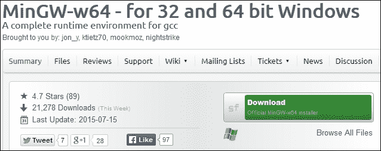
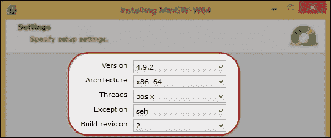
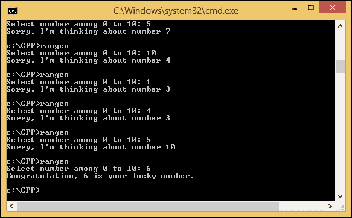
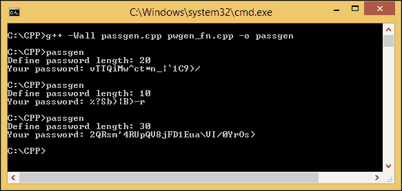

# 一、使用 C++ 简化您的网络编程

我们可以从网上选择几个 C++ 编译器。为了让您更容易理解本书中的所有代码，我选择了一个编译器，它将使编程过程更简单——绝对是最简单的一个。在本章中，您将发现以下主题:

*   设置 MinGW 编译器
*   用 C++ 编译
*   GCC C++ 中的故障排除

# 设置 MinGW 编译器和文本编辑器

这是最难的部分——我们必须选择一个编译器。尽管我意识到每个编译器都有自己的优点和缺点，但我想让您更容易地浏览本章中的所有代码。因此，我建议您应用与我们相同的环境，包括我们使用的编译器。

我将使用 GNU 编译器集合 **GCC** ，因为它是广泛使用的开源。由于我的环境包括微软视窗作为操作系统，我将使用T4【视窗的极简主义 GCC】(**MinGW**)作为我的 C++ 编译器。对于那些没有听说过 GCC 的人来说，它是一个 C/C++ 编译器，你可以在 Linux 操作系统中找到，它也包含在 Linux 发行版中。MinGW 是海湾合作委员会在视窗环境下的一个港口。因此，本书中的整个代码和示例适用于任何其他 GCC 风格。

## 安装 MinGW-w64

为了您的方便，并且由于我们使用的是 64 位的 Windows 操作系统，所以我们选择了 MinGW-w64，因为它可以用于 Windows 32 位和 64 位架构。要安装它，只需打开您的互联网浏览器，导航至[http://sourceforge.net/projects/mingw-w64/](http://sourceforge.net/projects/mingw-w64/)进入下载页面，点击**下载**按钮。稍等片刻，直到`mingw-w64-install.exe`文件完全下载完毕。参考以下截图找到**下载**按钮:



现在，执行安装程序文件。将会出现**欢迎**对话框。只需按下**下一步**按钮，进入**设置**对话框。在该对话框中，选择最新的 GCC 版本(此时为 **4.9.2** ，其余选项可选，如下:



点击**下一步**按钮继续，进入安装位置选项。在这里，您可以更改默认安装位置。我准备把安装位置改成`C:\MinGW-w64`以便我们下一步的设置更容易，但是如果你愿意的话可以保留这个默认位置。


点击**下一步**按钮进入下一步，等待片刻，直到文件下载完毕，安装过程完成。

## 设置路径环境

现在你的机器上安装了 C++ 编译器，但是你只能从它的安装目录中访问它。为了从系统中的任何目录访问编译器，您必须通过执行以下步骤来设置 **路径环境**:

1.  按下*窗口* + *R* 键，以管理员身份运行命令提示符。在文本框中输入`cmd`，不按*回车*键，而是按*Ctrl*+*Shift*+*回车*在管理员模式下运行命令提示符。这时将出现**用户账户控制**对话框。选择**是**确认您打算在管理员模式下运行命令提示符。如果操作正确，你会得到一个标题栏，标签为**管理员:命令提示符**。如果您没有得到它，您可能没有管理员权限。在这种情况下，您必须联系计算机管理员。
2.  在管理员模式下的命令提示符下键入以下命令:

    ```cpp
    rundll32.exe sysdm.cpl,EditEnvironmentVariables

    ```

3.  Press the *Enter* key and the command prompt will immediately run the **Environment Variables** window. Afterwards, go to **System variables**, select the variable named **Path**, click on the **Edit** button to open the **Edit System Variable** dialog box, and then append the last **Variable value** parameter with the following string:

    ```cpp
    ;C:\MinGW-w64\mingw64\bin
    ```

    (否则，如果使用安装向导在上一步中给出的默认位置，则必须调整安装目录的路径)

4.  点击**编辑系统变量**对话框中的**确定**按钮，在**环境变量**对话框中再次点击**确定**按钮保存这些更改。

是时候尝试我们的环境变量设置了。在除`C:\MinGW-w64`以外的任何活动目录中，以管理员或非管理员模式打开一个新的命令提示符窗口，并键入以下命令:

```cpp
g++ --version

```

如果您看到输出通知您以下内容，您已经配置了正确的设置:

```cpp
g++ (x86_64-posix-seh-rev2, Built by MinGW-W64 project) 4.9.2

```

如果显示不同的版本号，您的计算机上可能有另一个 GCC 编译器。要解决这个问题，您可以修改**环境变量**，并删除与其他 GCC 编译器相关联的所有路径环境设置，例如`C:\StrawberryPerl\c\bin`。

但是，如果您确信已经正确执行了所有步骤，但仍然收到错误消息，如以下代码片段所示，您可能需要重新启动计算机来设置新的系统设置:

```cpp
'g++' is not recognized as an internal or external command, operable program or batch file.

```

## 选择和安装文本编辑器

微软 Windows 已经配备了**记事本**，一个创建纯文本文件的简单文本编辑器。您可以使用记事本创建一个 C++ 文件，其中文件必须只包含纯文本格式。当你想编辑你的代码时，你也可以求助于一个沉重的 **集成开发环境** ( **IDE** )，但是我更喜欢一个简单、轻量、可扩展的编程纯文本编辑器，所以我选择使用文本编辑器而不是 IDE。由于我在编写代码时需要语法高亮，以使更容易阅读和理解，所以我选择**记事本++** 作为我们的文本编辑器。只要将输出文件保存为纯文本，您就可以选择自己喜欢的文本编辑器。以下是记事本++ 中语法高亮显示的示例:


如果你和我一样决定使用 Notepad++ 的话，可以去[http://notepad-plus-plus.org/](http://notepad-plus-plus.org/)到抓取 Notepad++ 的最新版本。在主页面找到**下载**菜单，选择当前版本链接。在那里，您将找到下载安装程序文件的链接。使用**记事本++ 安装程序**文件代替程序包文件，按照安装程序向导上的所有说明，获得在您的机器上设置它的最简单方法。


# 使用 GCC C++ 编译器

现在我们已经准备好了我们的开发，我们可以编写我们的第一个 C++ 程序了。为了保持干净，在 C 驱动器(`C:\CPP`)中创建一个`CPP`文件夹来存储我们的示例代码。您可以在系统上有相同的目录位置，以便更方便地执行所有步骤。否则，如果您决定使用不同的目录位置，您将不得不做一些修改。

## 编译一个 C++ 程序

我们不会创造你好世界！第一个示例代码的程序。在我看来，这很无聊，到现在，你应该已经知道如何编写 Hello World 了！程序。我们将创建一个简单的随机数生成器。你可以用这个程序和你的朋友一起玩。他们必须猜测程序将显示哪个数字。如果答案不正确，你可以用记号笔划掉他/她的脸，继续玩，直到你再也认不出你朋友的脸。下面是创建该生成器的代码:

```cpp
/* rangen.cpp */
#include <cstdlib>
#include <iostream>
#include <ctime>
int main(void) {
  int guessNumber;
  std::cout << "Select number among 0 to 10:";
  std::cin >> guessNumber;
  if(guessNumber < 0 || guessNumber > 10) {
    return 1;
  }
  std::srand(std::time(0));
  int randomNumber = (std::rand() % (10 + 1));
  if(guessNumber == randomNumber) {
    std::cout << "Congratulation, " <<guessNumber<<" is your lucky number.\n";
  }
  else {
    std::cout << "Sorry, I'm thinking about number \n" << randomNumber;
  }
  return 0;
}
```

在文本编辑器中键入代码，并将其与文件名称`rangen.cpp`一起保存在`C:\CPP`位置。然后，打开命令提示符，在命令提示符下键入以下命令，将活动目录指向`C:\CPP`位置:

```cpp
cd C:\CPP

```

接下来，在控制台中键入以下命令来编译代码:

```cpp
g++ -Wall rangen.cpp -o rangen

```

前面的命令用一个名为`rangen.exe`的可执行文件编译`rangen.cpp`文件，该文件包含一堆机器码(自动添加`exe`扩展名，表示该文件是微软 Windows 中的可执行文件)。使用`-o`选项指定机器代码的输出文件。如果使用该选项，还必须指定输出文件的名称；否则，编译器会给你一个丢失文件名的错误。如果省略`-o`选项和输出文件名，输出将被写入名为`a.exe`的默认文件。

### 类型

与当前目录中的编译源文件同名的现有可执行文件将被覆盖。

我建议您使用`-Wall`选项，并使其成为一种习惯，因为该选项将打开所有最常用的编译器警告。如果该选项被禁用，GCC 不会给你任何警告。因为我们的随机数生成器代码是完全有效的，所以 GCC 在编译时不会给出任何警告。这就是为什么我们依赖编译器警告来确保我们的代码是有效的并且被干净地编译。

要运行该程序，在控制台中以`C:\CPP`位置作为活动目录键入`rangen`，会显示一个欢迎词:**从 0 到 10** 中选择一个数字。按照它的指示去做，在`0`到`10`之间选择一个数字。然后，按*进入*，程序会给出一个数字。和你自己的比较一下。如果两个数字相同，你会受到祝贺。但是，如果您选择的号码与代码生成的号码不同，您将收到相同的通知。程序的输出如下图所示:


不幸的是，在我尝试的三次中，我从未猜出正确的数字。事实上，要猜测`rand()`函数生成了哪个数字并不容易，即使每次生成数字时都使用新的种子。为了尽量减少混乱，我将剖析`rangen.cpp`代码，如下所示:

```cpp
int guessNumber;
std::cout << "Select number among 0 to 10: ";
std::cin >> guessNumber;

```

我保留了一个名为`guessNumber`的变量来存储来自用户的整数，并使用`std::cin`命令来获取从控制台输入的数字。

```cpp
if(guessNumber < 0 || guessNumber > 10) {
 return 1;
}

```

如果用户给出了一个超出范围的数字，请通知操作系统程序中出现了错误——我发送了错误 1，但实际上，您可以发送任何数字——并让它处理该错误。

```cpp
std::srand(std::time(0));
int randomNumber = (std::rand() % (10 + 1);

```

`std::srand`函数用于初始化种子，为了在每次调用`std::rand()`函数时生成一个不同的随机数，我们从表头`ctime`使用`std::time(0)`函数。要生成一系列随机数，我们使用`modulo`方法，如果您调用类似`std::rand() % n`的函数，该方法将生成从 0 到(n-1)的随机数。如果你想把 *n* 也包括在内，只需用`1`加上 *n* 。

```cpp
if(guessNumber == randomNumber) {
 std::cout << "Congratulation ,"<< guessNumber<<" is your lucky number.\n";
}
else {
 std::cout << "Sorry, I'm thinking about number " << randomNumber << "\n";
}

```

这里是好玩的部分，程序将用户的猜测数与生成的随机数进行比较。无论发生什么，程序都会通知用户结果。让我们看看下面的代码:

```cpp
return 0;

```

一个`0`返回告诉操作系统程序已经正常终止，不用担心。让我们看看下面的代码:

```cpp
#include <cstdlib>
#include <iostream>
#include <ctime>

```

不要忘记在前面的代码中包含前三个头，因为它们包含了我们在这个程序中使用的函数，例如`<ctime>`头中定义了`time()`函数，`srand()`函数和`rand()`函数在`<cstdlib>`头中定义，`cout()`和`cin()`函数在`<iostream>`头中定义。

如果你发现很难猜出程序生成的数字，这是因为我们使用当前时间作为随机生成器种子，这样做的结果是，在程序的每次调用中，生成的数字总是不同的。以下是我在大约六到七次尝试后能够正确猜测生成的随机数的截图(对于所有的程序调用，除了最后一次尝试之外，我们都错误地猜测了该数字):



## 编译多个源文件

有时，当我们的代码有错误时，我们必须修改它。如果我们只是制作一个包含所有代码行的单个文件，当我们想要修改源代码时，我们会感到困惑，或者我们很难理解程序的流程。为了解决这个问题，我们可以将代码分成多个文件，其中每个文件只包含两到三个函数，以便于理解和维护它们。

我们已经能够生成随机数，所以现在，让我们看看密码生成器程序。我们将使用它来尝试编译多个源文件。我将创建三个文件来演示如何编译多个源文件，它们是`pwgen_fn.h`、`pwgen_fn.cpp`和`passgen.cpp`。我们将从`pwgen_fn.h`文件开始，其代码如下:

```cpp
/* pwgen_fn.h */
#include <string>
#include <cstdlib>
#include <ctime>
class PasswordGenerator {
  public:
    std::string Generate(int);
};
```

前面的代码用于声明类名。在这个例子中，类名是`PasswordGenerator`，在这种情况下它将做的是在实现存储在`.cpp`文件中的同时生成密码。以下是包含`Generate()`功能实现的`pwgen_fn.cpp`文件列表:

```cpp
/* pwgen_fn.cpp */
#include "pwgen_fn.h"
std::string PasswordGenerator::Generate(int passwordLength) {
  int randomNumber;
  std::string password;
  std::srand(std::time(0));
  for(int i=0; i < passwordLength; i++) {
    randomNumber = std::rand() % 94 + 33;
    password += (char) randomNumber;
  }
  return password;
}
```

主入口文件`passgen.cpp`包含一个使用`PasswordGenerator`类的程序:

```cpp
/* passgen.cpp */
#include <iostream>
#include "pwgen_fn.h"
int main(void) {
  int passLen;
  std::cout << "Define password length: ";
  std::cin >> passLen;
  PasswordGenerator pg;
  std::string password = pg.Generate(passLen);
  std::cout << "Your password: "<< password << "\n";
  return 0;
}
```

根据前面三个源文件，我们将生成一个可执行文件。为此，请转到命令提示符并在其中键入以下命令:

```cpp
g++ -Wall passgen.cpp pwgen_fn.cpp -o passgen

```

我没有得到任何警告或错误，所以即使你不应该。前面的命令编译`passgen.cpp`和`pwgen_fn.cpp`文件，然后将它们链接到一个名为`passgen.exe`的可执行文件。`pwgen_fn.h`文件，由于是和源文件同名的头文件，不需要在命令中声明相同。

以下是在控制台窗口中键入`passgen`命令运行程序会得到的结果；每次运行程序时，您将获得不同的密码:



现在，是时候让我们剖析前面的源代码了。我们将从`pwgen_fn.h`文件开始，该文件只包含函数声明，如下所示:

```cpp
std::string Generate(int);

```

从声明中可以看到，`Generate()`函数将有一个带有`int`类型的参数，并将返回`std::string`函数。我们没有在头文件中为参数定义名称，因为它将自动与源文件匹配。

打开`pwgen_fn.cpp`文件，看到如下语句:

```cpp
std::string PasswordGenerator::Generate(int passwordLength)

```

在这里，我们可以指定参数名称，即`passwordLength`。在这种情况下，我们可以有两个或多个同名的函数，只要它们在不同的类中。让我们看看下面的代码:

```cpp
int randomNumber;
std::string password;

```

我保留了名为`randomNumber`的变量来存储由`rand()`函数生成的随机数，并保留了`password`参数来存储由随机数转换而来的 ASCII 码。让我们看看下面的代码:

```cpp
std::srand(std::time(0));

```

种子随机`srand()`函数与我们在前面的代码中用来生成随机种子的函数相同。我们使用它是为了在每次调用`rand()`函数时产生不同的数字。让我们看看下面的代码:

```cpp
for(int i=0; i < passwordLength; i++) {
 randomNumber = std::rand() % 94 + 33;
 password += (char) randomNumber;
}
return password;

```

`for`迭代取决于用户定义的`passwordLength`参数。使用随机数生成器语句`std::rand() % 94 + 33`，我们可以根据其代码从 33 到 126 生成代表 ASCII 可打印字符的数字。关于 ASCII 码表的更多详细信息，可以去[http://en.wikipedia.org/wiki/ASCII](http://en.wikipedia.org/wiki/ASCII)。让我们看看下面的代码:

```cpp
#include "pwgen_fn.h"

```

`#include`头文件的单行会调用`pwgen_fn.h`文件中包含的所有头文件，所以我们不需要在这个源文件中声明包含的头文件，如下所示:

```cpp
#include <string>
#include <cstdlib>
#include <ctime>

```

现在，我们转到存储在`passgen.cpp`文件中的主入口代码:

```cpp
int passLen;
std::cout << "Define password length: ";
std::cin >> passLen;

```

首先，用户决定他/她想要多长时间的密码，并且程序将其存储在`passLen`变量中:

```cpp
PasswordGenerator pg;
std::string password = pg.Generate(passLen);
std::cout << "Your password: "<< password << "\n";

```

然后，程序实例化`PasswordGenerator`类，并调用`Generate()`函数产生一个长度为用户之前定义的密码。

再看一下`passgen.cpp`文件，会发现 include 语句`#include <iostream>`(带尖括号)和`#include "pwgen_fn.h"`(带引号)两种形式是有区别的。通过在`#include`头文件语句中使用尖括号，编译器将查找系统头文件目录，但默认情况下不会在当前目录中查找。`#include`头文件语句中带引号，编译器会在当前目录中搜索头文件，然后查找系统头文件目录。

## 分别编译和链接程序

我们可以把一个大程序拆分成一组源文件，分别编译。假设我们有许多小文件，我们只想在其中一个文件中编辑一行，如果我们编译所有文件，而只需要修改一个文件，这将非常耗时。

通过使用`-c`选项，我们可以编译单独的源代码来生成扩展名为`.o`的目标文件。在第一阶段，编译文件时不创建可执行文件。然后，在第二阶段，目标文件通过一个称为链接器的独立程序链接在一起。链接器将所有目标文件组合在一起，创建一个可执行文件。使用前面的`passgen.cpp`、`pwgen_fn.cpp`和`pwgen_fn.h`源文件，我们将尝试创建两个目标文件，然后将它们链接在一起以生成一个可执行文件。使用以下两个命令执行相同的操作:

```cpp
g++ -Wall -c passgen.cpp pwgen_fn.cpp
g++ -Wall passgen.o pwgen_fn.o -o passgen

```

第一个命令使用`-c`选项，将创建两个与源文件名同名但扩展名不同的目标文件。第二个命令将它们链接在一起，并生成输出可执行文件，该文件的名称在`-o`选项之后，即`passgen.exe`文件。

如果需要编辑`passgen.cpp`文件而不接触另外两个文件，只需要编译`passgen.cpp`文件，如下:

```cpp
g++ -Wall -c passgen.cpp

```

然后，您需要像前面的第二个命令一样运行链接命令。

## 在 C++ 程序中检测到警告

正如我们之前讨论的，编译器警告是确保代码有效性的重要辅助。现在，我们将尝试从我们创建的代码中找到错误。下面是一个 C++ 代码，它包含一个未初始化的变量，这会给我们一个不可预测的结果:

```cpp
/* warning.cpp */
#include <iostream>
#include <string>
int main (void) {
  std::string name;
  int age;
  std::cout << "Hi " << name << ", your age is " << age << "\n";
}
```

然后，我们将运行以下命令来编译前面的`warning.cpp`代码:

```cpp
g++ -Wall -c warning.cpp

```

有时，我们无法检测到这个错误，因为它在第一眼看起来并不明显。但是，通过启用`-Wall`选项，我们可以防止错误，因为如果我们在启用警告选项的情况下编译前面的代码，编译器将产生警告消息，如以下代码所示:

```cpp
warning.cpp: In function 'int main()':
warning.cpp:7:52: warning: 'age' may be used uninitialized in this function [-Wmaybe-uninitialized]
std::cout << "Hi " << name << ", your age is " << age << "\n";]

```

警告信息显示第 7 行第 52 列的`warning.cpp`文件中的`age`变量未初始化。GCC 产生的消息总是有**文件:行号:列号:错误类型:消息**形式。错误类型区分阻止成功编译的错误消息和指示可能的问题(但不阻止程序编译)的警告消息。

显然，不检查编译器警告就开发程序是非常危险的。如果有任何未正确使用的功能，它们会导致程序崩溃或产生不正确的结果。打开编译器警告选项后，`-Wall`选项会捕捉 C++ 编程中出现的许多常见错误。

# 了解 GCC C++ 编译器中的其他重要选项

GCC 支持 **ISO C++ 1998** 、 **C++ 2003** ，也支持 4.9.2 版**c++ 2011**T13】标准。在 GCC 中选择该标准是使用以下选项之一完成的:`-ansi`、`-std=c++ 98`、`-std=c++ 03`或`–std=c++ 11`。让我们看看下面的代码，给它起个名字`hash.cpp`:

```cpp
/* hash.cpp */
#include <iostream>
#include <functional>
#include <string>
int main(void) {
  std::string plainText = "";
  std::cout << "Input string and hit Enter if ready: ";
  std::cin >> plainText;
  std::hash<std::string> hashFunc;
  size_t hashText = hashFunc(plainText);
  std::cout << "Hashing: " << hashText << "\n";
  return 0;
}
```

如果你编译并运行程序，它会给你一个每个纯文本用户输入的散列数。然而，编译前面的代码有点棘手。我们必须定义我们想要使用的国际标准化组织标准。让我们看一下以下五个编译命令，并在命令提示符窗口中逐一尝试它们:

```cpp
g++ -Wall hash.cpp -o hash
g++ -Wall -ansi hash.cpp -o hash
g++ -Wall -std=c++ 98 hash.cpp -o hash
g++ -Wall -std=c++ 03 hash.cpp -o hash
g++ -Wall -std=c++ 11 hash.cpp -o hash

```

当我们运行前面的前四个编译命令时，我们应该会得到以下错误消息:

```cpp
hash.cpp: In function 'int main()':
hash.cpp:10:2: error: 'hash' is not a member of 'std'
 std::hash<std::string> hashFunc;
hash.cpp:10:23: error: expected primary-expression before '>' token
 std::hash<std::string> hashFunc;
hash.cpp:10:25: error: 'hashFunc' was not declared in this scope
 std::hash<std::string> hashFunc;

```

上面说`std`班没有`hash`。实际上，这是不正确的，因为自 C++ 2011 年以来，散列已经在标题`<string>`中定义了。为了解决这个问题，我们可以运行前面最后一个编译命令，如果它不再抛出错误，那么我们可以通过在控制台窗口中键入`hash`来运行程序。


正如你在前面的截图中看到的，我调用了程序两次，并给出了 **Packt** 和 **packt** 作为输入。虽然我只是改变了一个字符，但整个散列发生了巨大的变化。这就是为什么散列被用来检测数据或文件的任何变化，如果它们被传输，只是为了确保数据不被改变。

有关 GCC 中可用的 ISO C++ 11 特性的更多信息，请前往[http://gcc.gnu.org/projects/cxx0x.html](http://gcc.gnu.org/projects/cxx0x.html)。要获得标准要求的所有诊断，还应指定`-pedantic`选项(如果要将警告作为错误处理，则指定`-pedantic-errors`选项)。

### 注

仅`-ansi`选项不会导致非 ISO 程序被无端拒绝。为此，除了`-ansi`选项外，还需要`-pedantic`选项或`-pedantic-errors`选项。

# GCC c++ 编译器中的故障排除

GCC 提供了几个帮助和诊断选项，以帮助解决编译过程中的问题。您可以用来简化故障排除过程的选项将在接下来的章节中介绍。

## 命令行选项的帮助

使用 `help`选项获取顶级 GCC 命令行选项的摘要。该命令如下:

```cpp
g++ --help

```

要显示 GCC 及其相关程序选项的完整列表，如 GNU 链接器和 GNU 汇编器，请使用前面的`help`选项和详细(`-v`)选项:

```cpp
g++ -v --help

```

由前面的命令产生的选项的完整列表非常长，您可能希望使用`more`命令浏览它，或者将输出重定向到一个文件以供参考，如下所示:

```cpp
g++ -v --help 2>&1 | more

```

## 版本号

您可以使用`version`选项找到您安装的 GCC 安装的版本号，如下命令所示:

```cpp
g++ --version

```

在我的系统中，如果我运行前面的命令，我将得到如下输出:

```cpp
g++ (x86_64-posix-seh-rev2, Built by MinGW-W64 project) 4.9.2

```

这取决于您在安装过程中调整的设置。

在调查编译问题时，版本号很重要，因为旧版本的 GCC 可能会缺少程序使用的一些功能。版本号有`major-version.minor-version`或`major-version.minor-version.micro-version`形式，其中附加的第三个“微”版本号(如前面的命令所示)用于一个发布系列中后续的 bug 修复发布。

## 冗长的编译

`-v`选项也可以用来显示用于编译和链接程序的命令的确切顺序的详细信息。下面是一个例子，向您展示了`hello.cpp`程序的详细编译:

```cpp
g++ -v -Wall rangen.cpp

```

在此之后，您将在控制台中看到类似这样的内容:

```cpp
Using built-in specs.
COLLECT_GCC=g++
COLLECT_LTO_WRAPPER=C:/mingw-w64/bin/../libexec/gcc/x86_64-w64-mingw32/4.9.2/lto-wrapper.exe
Target: x86_64-w64-mingw32
Configured with: ../../../src/gcc-4.9.2/configure –
...Thread model: posix
gcc version 4.9.2 (x86_64-posix-seh-rev2, Built by MinGW-W64 project)
...

```

每当编译过程本身出现问题时，`-v`选项产生的输出会很有用。它显示用于搜索头文件和库的完整目录路径、预定义的预处理器符号以及用于链接的对象文件和库。

# 总结

我们成功地准备了 C++ 编译器，您学习了如何编译您使用编译器创建的源代码文件。每次编译源代码时，不要忘记使用`-Wall`(警告全部)选项，因为避免警告和细微错误很重要。此外，使用`-ansi`和`-pedantic`选项很重要，这样你的源代码可以在任何编译器中编译，因为它将检查 ANSI 标准并拒绝非 ISO 程序。

现在，我们可以进入下一章学习网络概念，以便您了解网络体系结构，从而简化您的网络应用编程过程。