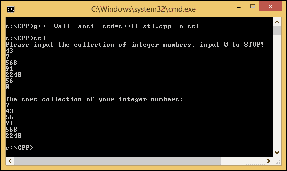
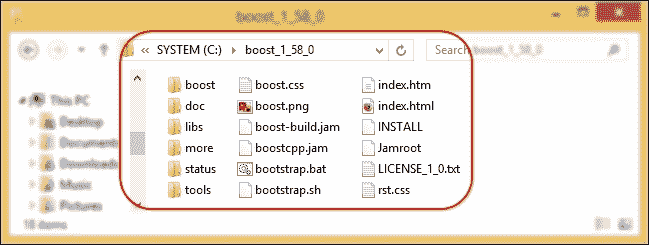
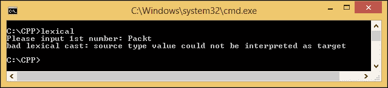

# 三、Boost C++ 库简介

许多程序员使用库，因为这简化了编程过程。因为他们不再需要从头开始编写函数，所以使用库可以节省很多代码开发时间。在本章中，我们将了解 Boost C++ 库。让我们准备自己的编译器和文本编辑器来证明 Boost 库的强大。在此过程中，我们将讨论以下主题:

*   介绍 C++ 标准模板库
*   介绍增强库
*   在 MinGW 编译器中准备 Boost C++ 库
*   构建增强库
*   编译包含 Boost C++ 库的代码

# 介绍 C++ 标准模板库

C++ **标准模板库** ( **STL** )是一个基于通用模板的库，提供通用容器等。程序员可以轻松地使用 STL 提供的算法，而不是处理动态数组、链表、二叉树或哈希表。

STL 由容器、迭代器和算法构成，它们的作用如下:

*   **容器**:它们的主要作用是管理某类对象的集合，比如整数数组或者字符串链表。
*   **迭代器**:它们的主要作用是遍历集合的元素。迭代器的工作类似于指针。我们可以使用`++ `操作符增加迭代器，使用`*`操作符访问值。
*   **算法**:它们的主要作用是处理集合的元素。算法使用迭代器遍历所有元素。在迭代元素之后，它处理每个元素，例如，修改元素。它还可以在迭代完所有元素后搜索和排序元素。

让我们通过创建以下代码来检查构成 STL 的三个元素:

```cpp
/* stl.cpp */
#include <vector>
#include <iostream>
#include <algorithm>

int main(void) {
  int temp;
  std::vector<int> collection;
  std::cout << "Please input the collection of integer numbers, input 0 to STOP!\n";
  while(std::cin >> temp != 0) {
    if(temp == 0) break;
    collection.push_back(temp);
  }
  std::sort(collection.begin(), collection.end());
  std::cout << "\nThe sort collection of your integer numbers:\n";
  for(int i: collection) {
    std::cout << i << std::endl;
  }
}
```

命名前面的代码`stl.cpp`，运行下面的命令进行编译:

```cpp
g++ -Wall -ansi -std=c++ 11 stl.cpp -o stl

```

在我们剖析这段代码之前，让我们运行它看看会发生什么。这个程序会要求用户输入任意数量的整数，然后对数字进行排序。要停止输入并要求程序开始排序，用户必须输入`0`。这意味着`0`将不包括在排序过程中。由于我们不阻止用户输入非整数数字，如 3.14，在用户输入非整数数字后，程序将很快停止等待下一个数字。该代码产生以下输出:



我们输入了六个整数:`43`、`7`、`568`、`91`、`2240`、`56`。最后一个条目是`0`以停止输入过程。然后程序开始对数字进行排序，我们得到按顺序排序的数字:`7`、`43`、`56`、`91`、`568`和`2240`。

现在，让我们检查代码，以识别包含在 STL 中的容器、迭代器和算法:

```cpp
std::vector<int> collection;

```

前面的代码片段包含来自 STL 的容器。有几个容器，我们在代码中使用一个 **向量**。一个向量在一个动态数组中管理它的元素，它们可以通过相应的索引被随机和直接地访问。在我们的代码中，容器准备容纳整数，所以我们必须定义尖括号`<int>`内的值的类型。这些尖括号在 STL 中也被称为**泛型**:

```cpp
collection.push_back(temp);
std::sort(collection.begin(), collection.end());

```

前面代码中的 `begin()`和`end()`函数是 STL 中的算法。它们扮演着处理容器中的数据的角色，这些数据用于获取容器中的第一个和最后一个元素。在此之前，我们可以看到`push_back()`函数，该函数用于向容器追加一个元素:

```cpp
for(int i: collection) {
 std::cout << i << std::endl;
}

```

前面的`for`块将迭代称为`collection`的整数的每个元素。每次迭代元素时，我们可以单独处理该元素。在前面的例子中，我们向用户展示了这个数字。STL 中的迭代器就是这样发挥作用的。

```cpp
#include <vector>
#include <algorithm>

```

我们包括定义所有`vector`函数的向量定义和调用`sort()`函数的`algorithm`定义。

# 介绍 Boost C++ 库

Boost C++ 库是一组补充 C++ 标准库的库。这个集合包含了一百多个库，我们可以用它们来提高我们在 C++ 编程中的生产力。当我们的需求超出了 STL 中的可用范围时，也会用到它。它在 Boost Licence 下提供源代码，这意味着它允许我们免费使用、修改和分发库，甚至用于商业用途。

Boost 的开发由 Boost 社区处理，该社区由来自世界各地的 C++ 开发人员组成。社区的使命是开发高质量的库，作为 STL 的补充。只有经验证的库才会添加到 Boost 库中。

### 注

有关 Boost 库的详细信息，请访问[www.boost.org](http://www.boost.org)。如果你想为 Boost 贡献开发库，你可以加入[lists.boost.org/mailman/listinfo.cgi/boost](http://lists.boost.org/mailman/listinfo.cgi/boost)的开发者邮件列表。

库的全部源代码可以在 github.com/boostorg 的官方网站上找到。

## Boost 库的优势

众所周知，使用 Boost 库将提高程序员的工作效率。此外，通过使用 Boost 库，我们将获得以下优势:

*   它是开源的，所以我们可以检查源代码，并在需要时进行修改。
*   它的许可证允许我们开发开源和闭源项目。它还允许我们自由地将我们的软件商业化。
*   它有很好的文档记录，我们可以找到所有解释过的库，以及来自官方网站的示例代码。
*   它几乎支持任何现代操作系统，比如 Windows 和 Linux。它还支持许多流行的编译器。
*   它是 STL 的补充，而不是替代。这意味着使用 Boost 库将简化那些还没有被 STL 处理的编程过程。事实上，Boost 的许多部分都包含在标准的 C++ 库中。

# 为 MinGW 编译器准备 Boost 库

在我们通过使用 Boost 库来编程我们的 C++ 应用之前，需要配置这些库，以便被 MinGW 编译器识别。在这里，我们将准备我们的编程环境，以便我们的编译器能够使用 Boost 库。

## 下载增强库

下载 Boost 的最佳来源是官方下载页面。我们可以通过将我们的网络浏览器指向 www.boost.org/users/download T2 来到达那里。在**当前版本**部分找到**下载**链接。在写作的时候，Boost 库的当前版本是 1.58.0，但是当你读这本书的时候，版本可能已经改变了。如果是这样，您仍然可以选择当前版本，因为较高版本必须与较低版本兼容。但是，您必须进行调整，因为我们稍后将讨论设置。否则，选择同一个版本会让你很容易按照这本书的所有说明去做。

有四种文件格式可供下载；分别是`.zip`、`.tar.gz`、`.tar.bz2`和`.7z`。这四个文件之间没有区别，只是文件大小不同。最大的文件是 ZIP 格式，最小的是 7Z 格式。由于文件大小，Boost 建议我们下载 7Z 格式。对比见下图:


从前面的图片中，我们可以看到 ZIP 版本的大小为 123.1 MB，而 7Z 版本的大小为 65.2 MB。这意味着 ZIP 版本的大小几乎是 7Z 版本的两倍。因此，他们建议您选择 7Z 格式，以减少下载和解压缩时间。让我们选择`boost_1_58_0.7z`进行下载并保存到我们的本地存储中。

## 部署增强库

当我们在本地存储中获得`boost_1_58_0.7z`后，使用 7ZIP 应用对其进行解压缩，并将解压缩文件保存到`C:\boost_1_58_0`。

### 注

7ZIP 应用可以从[www.7-zip.org/download.html](http://www.7-zip.org/download.html)获取。

该目录应该包含如下文件结构:



### 注

我们可以直接去[sourceforge.net/projects/boost/files/boost/1.58.0](http://sourceforge.net/projects/boost/files/boost/1.58.0)而不是浏览到 Boost 下载页面，手动搜索 Boost 版本。当 1.58.0 版本不再是当前版本时，这将非常有用。

## 使用增强库

Boost 中的大部分库都是**头文件**；这意味着所有函数的声明和定义，包括名称空间和宏，对编译器都是可见的，不需要单独编译它们。我们现在可以尝试使用程序的 Boost 将字符串转换为`int`值，如下所示:

```cpp
/* lexical.cpp */
#include <boost/lexical_cast.hpp>
#include <string>
#include <iostream>

int main(void) {
  try 	{
    std::string str;
    std::cout << "Please input first number: ";
    std::cin >> str;
    int n1 = boost::lexical_cast<int>(str);
    std::cout << "Please input second number: ";
    std::cin >> str;
    int n2 = boost::lexical_cast<int>(str);
    std::cout << "The sum of the two numbers is ";
    std::cout << n1 + n2 << "\n";
    return 0;
  }
  catch (const boost::bad_lexical_cast &e) {
    std::cerr << e.what() << "\n";
    return 1;
  }
}
```

打开记事本++ 应用，输入前面的代码，并将其保存为`C:\CPP`中的`lexical.cpp`—我们在[第 1 章](1.html#page "Chapter 1. Simplifying Your Network Programming in C++")、*中创建的目录，用 C++ 简化您的网络编程*。现在打开命令提示符，将活动目录指向`C:\CPP`，然后键入以下命令:

```cpp
g++ -Wall -ansi lexical.cpp –Ic:\boost_1_58_0 -o lexical

```

我们这里有一个新的选项，就是`–I`(“包含”选项)。此选项与目录的完整路径一起使用，以通知编译器我们有另一个标题目录要包含在代码中。由于我们将 Boost 库存储在`c:\ boost_1_58_0`中，因此我们可以使用`–Ic:\boost_1_58_0`作为附加参数。

在`lexical.cpp`中，我们应用`boost::lexical_cast`将`string`类型数据转换为`int`类型数据。程序会要求用户输入两个数字，然后自动找出两个数字的总和。如果用户输入了不合适的号码，它会通知他们发生了错误。

Boost 提供了`Boost.LexicalCast`库，用于将一种数据类型转换为另一种数据类型(将数值类型如`int`、`double`或`floats`转换为`string`类型，反之亦然)。现在，让我们仔细分析一下`lexical.cpp`来更详细地了解它的功能:

```cpp
#include <boost/lexical_cast.hpp>
#include <string>
#include <iostream>

```

我们包括`boost/lexical_cast.hpp`以便能够调用`boost::lexical_cast`函数，因为该函数在`lexical_cast.hpp`中声明。我们还使用`string`表头应用`std::string`功能，以及`iostream`表头应用`std::cin`、`std::cout`和`std::cerr`功能。

其他功能，比如`std::cin`、`std::cout`，在[第一章](1.html#page "Chapter 1. Simplifying Your Network Programming in C++")、*中已经讲过了，在 C++* 中简化你的网络编程，我们看到了它们的功能是什么，所以我们可以跳过那些行:

```cpp
int n1 = boost::lexical_cast<int>(str);
int n2 = boost::lexical_cast<int>(str);

```

我们使用前面两个单独的行将用户提供的输入`string`转换为`int`数据类型。然后，在转换数据类型之后，我们总结了两个`int`值。

我们还可以看到前面代码中的块。如果用户输入了一个不合适的数字，除了 0 到 9，它用来捕捉错误。

```cpp
catch (const boost::bad_lexical_cast &e)
{
 std::cerr << e.what() << "\n";
 return 1;
}

```

前面的代码片段将捕捉错误，并通过使用`boost::bad_lexical_cast`通知用户错误消息到底是什么。我们调用`e.what()`函数获取错误消息的字符串。

现在让我们通过在命令提示符下键入`lexical`来运行应用。我们将获得如下输出:


我把`10`作为第一次输入，`20`作为第二次输入。结果是`30`因为它只是把两个输入加起来。但是如果我输入一个非数值会发生什么，例如`Packt`。以下是尝试该条件的输出:



一旦应用发现错误，将忽略下一条语句，直接进入`catch`块。通过使用`e.what()`功能，应用可以获得错误消息并将其显示给用户。在我们的示例中，我们将`bad lexical cast: source type value could not be interpreted`作为错误消息的目标，因为我们试图将`string`数据分配给`int`类型变量。

## 建立助推库

正如我们之前讨论的一样，Boost 中的大多数库都是只有头文件的，但不是全部。有些库必须单独建造。它们是:

*   `Boost.Chrono`:这是用来显示时钟的种类，比如当前时间，两次之间的范围，或者计算过程中经过的时间。
*   `Boost.Context`:这是用来创建更高级别的抽象，比如协同程序和协同线程。
*   `Boost.Filesystem`:用于处理文件和目录，如获取文件路径或检查文件或目录是否存在。
*   `Boost.GraphParallel`:这是**增强图形库** ( **BGL** )的扩展，用于并行和分布式计算。
*   `Boost.IOStreams`:这是用来使用 stream 读写数据的。例如，它将文件内容加载到内存或以 GZIP 格式写入压缩数据。
*   `Boost.Locale`:这是用来本地化应用，换句话说就是把应用界面翻译成用户的语言。
*   `Boost.MPI`:这是用来开发并发执行任务的程序。 **MPI 本身代表消息传递接口**。
*   `Boost.ProgramOptions`:用于解析命令行选项。它使用双减号(`--`)来分隔每个命令行选项，而不是使用`main`参数中的`argv`变量。
*   `Boost.Python`:这是用来解析 C++ 代码中 Python 语言的。
*   `Boost.Regex`:这是用来在我们的代码中应用正则表达式的。但是如果我们的开发支持 C++ 11，我们不再依赖`Boost.Regex`库，因为它在`regex`头文件中可用。
*   `Boost.Serialization`:这是用来把对象转换成一系列的字节，可以保存，然后再次还原成同一个对象。
*   `Boost.Signals`:这是用来创造信号的。该信号将触发一个事件，使在其上运行一个功能。
*   `Boost.System`:这是用来定义错误。包含`system::error_code`、`system::error_category`、`system::error_condition`和`system::system_error`四个等级。所有这些类都在`boost`命名空间内。C++ 11 环境中也支持，但是因为很多 Boost 库都使用`Boost.System`，所以需要保持包含`Boost.System`。
*   `Boost.Thread`:这是用来应用线程编程。它提供了同步多线程数据访问的类。在 C++ 11 环境中，`Boost.Thread`库提供了扩展，所以我们可以在`Boost.Thread`中中断线程。
*   `Boost.Timer`:这是用时钟来衡量代码性能的。它根据通常的时钟和中央处理器时间来测量经过的时间，这表明执行代码花费了多少时间。
*   `Boost.Wave`:这个提供了一个可重用的 C 预处理器，我们可以在我们的 C++ 代码中使用。

还有一些库有可选的、单独编译的二进制文件。它们如下:

*   `Boost.DateTime`:用于处理时间数据；例如，日历日期和时间。它有一个二进制组件，只有当我们使用`to_string`、`from_string`或序列化特性时才需要它。如果我们的应用以 Visual C++ 6.x 或 Borland 为目标，也需要它。
*   `Boost.Graph`:是用来创建二维图形的。它有一个二进制组件，只有当我们打算解析`GraphViz`文件时才需要它。
*   `Boost.Math`:用于处理数学公式。它具有用于`cmath`功能的二进制组件。
*   `Boost.Random`:用于生成随机数。它有一个二进制组件，只有当我们想使用`random_device`时才需要它。
*   `Boost.Test`:用于编写和组织测试程序及其运行时执行。它可以在只有头文件的模式下使用，也可以单独编译的模式下使用，但是严重的话建议单独编译。
*   `Boost.Exception`:用于在异常抛出后给异常添加数据。它为 32 位`_MSC_VER==1310`和`_MSC_VER==1400`提供了`exception_ptr`的非侵入式实现，这需要单独编译的二进制文件。这是由`#define BOOST_ENABLE_NON_INTRUSIVE_EXCEPTION_PTR`启用的。

让我们尝试重新创建我们在[第 1 章](1.html#page "Chapter 1. Simplifying Your Network Programming in C++")*中创建的随机数生成器程序，用 C++ 简化您的网络编程*。但是现在我们将使用`Boost.Random`库，而不是 C++ 标准函数中的`std::rand()`。让我们看看下面的代码:

```cpp
/* rangen_boost.cpp */
#include <boost/random/mersenne_twister.hpp>
#include <boost/random/uniform_int_distribution.hpp>
#include <iostream>

int main(void) {
  int guessNumber;
  std::cout << "Select number among 0 to 10: ";
  std::cin >> guessNumber;
  if(guessNumber < 0 || guessNumber > 10) {
    return 1;
  }
  boost::random::mt19937 rng;
  boost::random::uniform_int_distribution<> ten(0,10);
  int randomNumber = ten(rng);
  if(guessNumber == randomNumber) {
    std::cout << "Congratulation, " << guessNumber << " is your lucky number.\n";
  }
  else {
    std::cout << "Sorry, I'm thinking about number " << randomNumber << "\n"; 
  }
  return 0;
}
```

我们可以使用以下命令编译前面的源代码:

```cpp
g++ -Wall -ansi -Ic:/boost_1_58_0 rangen_boost.cpp -o rangen_boost

```

现在，让我们运行程序。不幸的是，在我运行程序的三次中，我总是获得相同的随机数，如下所示:


从这个例子中我们可以看到，我们总是得到数字 8。这是因为我们应用了 Mersenne Twister，一个**伪随机数发生器** ( **PRNG** )，它使用默认种子作为随机性的来源，所以每次程序运行时都会生成相同的数字。当然，这不是我们期望的计划。

现在，我们将再次修改程序，只用两行。首先，找到下面一行:

```cpp
#include <boost/random/mersenne_twister.hpp>

```

更改如下:

```cpp
#include <boost/random/random_device.hpp>

```

接下来，找到下面一行:

```cpp
boost::random::mt19937 rng;

```

更改如下:

```cpp
boost::random::random_device rng;

```

然后，将文件保存为`rangen2_boost.cpp`，并使用我们编译`rangen_boost.cpp`时使用的命令编译`rangen2_boost.cpp`文件。该命令如下所示:

```cpp
g++ -Wall -ansi -Ic:/boost_1_58_0 rangen2_boost.cpp -o rangen2_boost

```

可悲的是，将会有一些错误，编译器将显示以下错误消息:

```cpp
cc8KWVvX.o:rangen2_boost.cpp:(.text$_ZN5boost6random6detail20generate_uniform_intINS0_13random_deviceEjEET0_RT_S4_S4_N4mpl_5bool_ILb1EEE[_ZN5boost6random6detail20generate_uniform_intINS0_13random_deviceEjEET0_RT_S4_S4_N4mpl_5bool_ILb1EEE]+0x24f): more undefined references to boost::random::random_device::operator()()' follow
collect2.exe: error: ld returned 1 exit status

```

这是因为，正如我们前面看到的，如果我们想使用`random_device`属性，那么`Boost.Random`库需要单独编译。

Boost 库有一个自己编译或构建 Boost 的系统，叫做`Boost.Build`库。安装`Boost.Build`库需要完成两个步骤。首先，通过将命令提示符下的活动目录指向`C:\boost_1_58_0`并键入以下命令来运行**引导程序**:

```cpp
bootstrap.bat mingw

```

我们使用我们在[第 1 章](1.html#page "Chapter 1. Simplifying Your Network Programming in C++")、*中安装的 MinGW 编译器，作为我们编译 Boost 库的工具集。稍等片刻，如果该过程成功，我们将获得以下输出:*

```cpp
Building Boost.Build engine

Bootstrapping is done. To build, run:

    .\b2

To adjust configuration, edit 'project-config.jam'.
Further information:

    - Command line help:
    .\b2 --help

    - Getting started guide:
    http://boost.org/more/getting_started/windows.html

    - Boost.Build documentation:
    http://www.boost.org/build/doc/html/index.html
```

在这一步中，我们将在 Boost 库的根目录中找到四个新文件。它们是:

*   `b2.exe`:这是一个构建 Boost 库的可执行文件
*   `bjam.exe`:这个和`b2.exe`一模一样，不过是旧版
*   `bootstrap.log`:包含`bootstrap`过程的日志
*   `project-config.jam`:这包含了一个设置，当我们运行`b2.exe`时，这个设置将用于构建过程中

我们还发现这一步在`C:\boost_1_58_0\tools\build\src\engine\bin.ntx86`中创建了一个新的目录，其中包含了一堆与需要编译的 Boost 库相关的`.obj`文件。

之后，通过在命令提示符下键入以下命令来运行第二步:

```cpp
b2 install toolset=gcc

```

运行该命令后，给自己倒杯咖啡，因为根据您的系统规格，完成该过程大约需要 20 到 50 分钟。我们将获得的最后一个输出如下:

```cpp
...updated 12562 targets...

```

这意味着这个过程已经完成，我们现在已经构建了 Boost 库。如果我们签入我们的浏览器，`Boost.Build`库会添加`C:\boost_1_58_0\stage\lib`，它包含了我们可以直接在程序中使用的静态和动态库的集合。

### 注

`bootstrap.bat`和`b2.exe`使用`msvc`(微软 Visual C++ 编译器)作为默认工具集，很多 Windows 开发者的机器上已经安装了`msvc`。由于我们已经安装了 GCC 编译器，我们在 Boost 的构建中设置了`mingw`和`gcc`工具集选项。如果您也安装了`mvsc`并想在 Boost 的构建中使用它，可以省略工具集选项。

现在，让我们再次尝试编译`rangen2_boost.cpp`文件，但是现在使用以下命令:

```cpp
c:\CPP>g++ -Wall -ansi -Ic:/boost_1_58_0 rangen2_boost.cpp -Lc:\boost_1_58_0\stage\lib -lboost_random-mgw49-mt-1_58 -lboost_system-mgw49-mt-1_58 -o rangen2_boost

```

我们这里有两个新选项，分别是`–L`和`–l`。如果库文件不在活动目录中，则`-L`选项用于定义包含库文件的路径。`–l`选项用于定义库文件的名称，但省略了文件名前的第一个`lib`字。在这种情况下，原始库文件名为`libboost_random-mgw49-mt-1_58.a`，我们省略了`lib`短语和选项`-l`的文件扩展名。

名为`rangen2_boost.exe`的新文件将在`C:\CPP`中创建。但是在我们运行程序之前，我们必须确保程序安装的目录包含程序所依赖的两个库文件。这些是`libboost_random-mgw49-mt-1_58.dll`和`libboost_system-mgw49-mt-1_58.dll`，我们可以从库目录`c:\boost_1_58_0_1\stage\lib`中找到它们。

为了方便我们运行该程序，运行以下`copy`命令将两个库文件复制到`C:\CPP`:

```cpp
copy c:\boost_1_58_0_1\stage\lib\libboost_random-mgw49-mt-1_58.dll c:\cpp
copy c:\boost_1_58_0_1\stage\lib\libboost_system-mgw49-mt-1_58.dll c:\cpp

```

现在程序应该运行顺利了。

为了创建一个网络应用，我们将使用`Boost.Asio`库。我们在非头文件库中找不到`Boost.Asio`——我们要用来创建网络应用的库。似乎我们不需要建立 Boost 库，因为`Boost.Asio`是只有头文件的库。这是真的，但是由于`Boost.Asio`依赖于`Boost.System`并且`Boost.System`需要在使用之前构建，所以在我们可以使用它来创建我们的网络应用之前，首先构建 Boost 是很重要的。

### 类型

对于选项`–I`和`–L`，编译器不在乎我们是否使用反斜杠(\)或斜杠(/)来分隔路径中的每个目录名，因为编译器可以同时处理 Windows 和 Unix 路径样式。

# 总结

我们看到 Boost C++ 库是为了补充标准 C++ 库而开发的。我们还能够设置我们的 MinGW 编译器，以便编译包含 Boost 库的代码，并构建必须单独编译的库的二进制文件。下一章谈到`Boost.Asio`库(我们将要用来开发网络应用的库)，我们将具体研究 Boost 库。请记住，虽然我们可以使用`Boost.Asio`库作为仅头库，但最好使用`Boost.Build`库来构建所有的 Boost 库。我们将很容易使用所有的库，而不用担心编译失败。