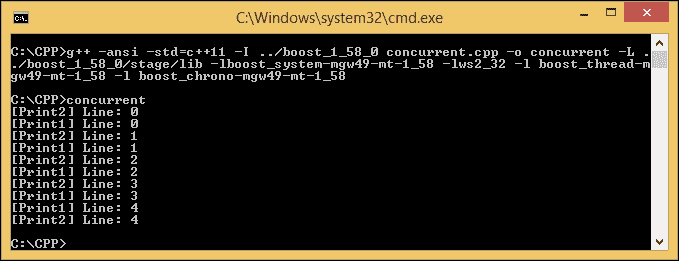
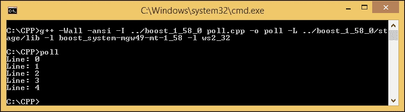
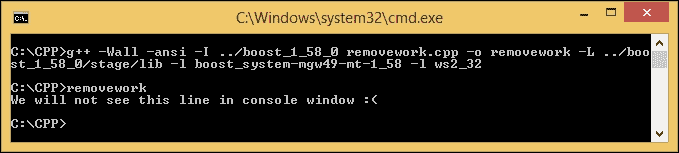
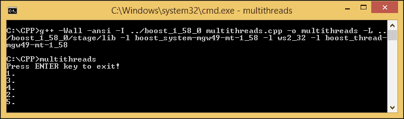
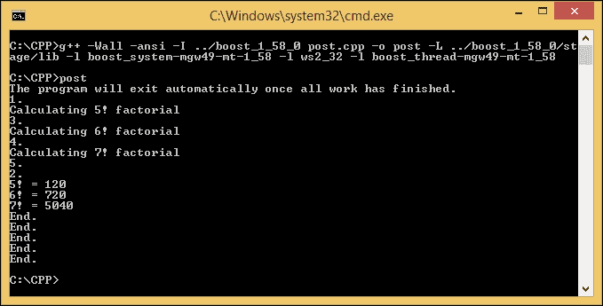
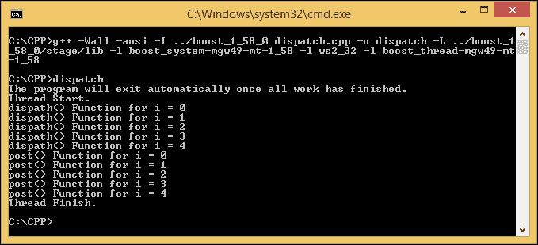

# 第四章。Boost 入门。Asio

我们已经大致了解了 Boost C++ 库。现在是时候了解更多关于 Boost 的信息了。Asio，我们用来开发网络应用程序的库。助推。Asio 是用来异步处理数据的库的集合，因为 Asio 本身代表**异步 I/O** ( **输入输出**)。异步意味着程序中的特定任务将在不阻塞其他任务和 Boost 的情况下运行。Asio 将在完成任务后通知程序。换句话说，任务是并发执行的。

在本章中，我们将讨论以下主题:

*   区分并发和非并发编程
*   了解输入/输出服务、Boost 的大脑和心脏。Asio
*   将函数动态绑定到函数指针
*   同步访问任何全局数据或共享数据

# 越来越接近助推。Asio 库

假设我们正在开发一个音频下载器应用程序，我们希望用户能够导航到应用程序中的所有菜单，即使下载过程正在进行中。如果我们不使用异步编程，应用程序将被下载过程阻止，用户将不得不等到文件下载完成。但是由于异步编程，用户不需要等到下载过程完成才能继续使用应用程序。

换句话说，一个同步的过程就像是在剧场售票线上排队。只有当我们到达售票柜台时，我们才会得到服务，在此之前，我们必须等待排在我们前面的前顾客的所有流程完成。相比之下，我们可以想象异步过程就像在餐厅用餐，服务员不必等待顾客的订单由厨师准备。服务员可以去接其他顾客的订单，而不是耽误时间等厨师。

`Boost`库也有用来并发执行任务的`Boost.Thread`库，但是`Boost.Thread`库是用来访问内部资源的，比如 CPU 核心资源，而`Boost.Asio`库是用来访问外部资源的，比如网络连接，因为数据是通过网卡收发的。

让我们区分和并发和非并发编程。请看下面的代码:

```cpp
/* nonconcurrent.cpp */
#include <iostream>

void Print1(void) {
  for(int i=0; i<5; i++) {
    std::cout << "[Print1] Line: " << i << "\n";
  }
}

void Print2(void) {
  for(int i=0; i<5; i++) {
    std::cout << "[Print2] Line: " << i << "\n";
  }
}

int main(void) {
  Print1();
  Print2();
  return 0;
}
```

前面的代码是非电流程序。将代码保存为`nonconcurrent.cpp`，然后使用以下命令进行编译:

```cpp
g++ -Wall -ansi nonconcurrent.cpp -o nonconcurrent

```

运行`nonconcurrent.cpp`后，会有这样的输出显示在你面前:


我们要运行两个功能:`Print1()`和`Print2()`。在非电流编程中，应用程序首先运行`Print1()`功能，然后完成功能中的所有指令。程序继续调用`Print2()`功能，直到指令完全运行。

现在，让我们比较非并发编程和并发编程。为此，请看下面的代码:

```cpp
/* concurrent.cpp */
#include <boost/thread.hpp>
#include <boost/chrono.hpp>
#include <iostream>

void Print1() {
  for (int i=0; i<5; i++) {
    boost::this_thread::sleep_for(boost::chrono::milliseconds{500});
    std::cout << "[Print1] Line: " << i << '\n';
  }
}

void Print2() {
  for (int i=0; i<5; i++) {
    boost::this_thread::sleep_for(boost::chrono::milliseconds{500});
    std::cout << "[Print2] Line: " << i << '\n';
  }
}

int main(void) {
  boost::thread_group threads;
  threads.create_thread(Print1);
  threads.create_thread(Print2);
  threads.join_all();
}
```

将前面的代码保存为`concurrent.cpp`，并使用以下命令进行编译:

```cpp
g++ -ansi -std=c++ 11 -I ../boost_1_58_0 concurrent.cpp -o concurrent -L ../boost_1_58_0/stage/lib -lboost_system-mgw49-mt-1_58 -lws2_32 -l boost_thread-mgw49-mt-1_58 -l boost_chrono-mgw49-mt-1_58

```

运行程序，得到如下输出:



从前面的输出中我们可以看到`Print1()`和`Print2()`功能是并发运行的。`Print2()`函数不需要等待`Print1()`函数完成所有要调用的指令的执行。这就是为什么我们称之为并发编程。

### 类型

如果在代码中包含库，请不要忘记复制关联的动态库文件。例如，如果您使用`–l`选项包含`boost_system-mgw49-mt-1_58`，您必须复制`libboost_system-mgw49-mt-1_58.dll`文件并将其粘贴到与输出可执行文件相同的目录中。

# 检查提升中的输入/输出服务。Asio 库

`Boost::Asio`命名空间的核心对象是`io_service`。**输入/输出服务**是一个通道，用于访问操作系统资源，并在我们的程序和执行输入/输出请求的操作系统之间建立通信。还有一个I/O 对象有提交 I/O 请求的作用。对于实例，`tcp::socket`对象将从我们的程序向操作系统提供套接字编程请求。

## 使用和阻止 run()功能

输入/输出服务对象中最常使用的功能之一是`run()`功能。用于运行`io_service`对象的事件处理循环。它将阻塞下一个语句程序，直到`io_service`对象中的所有工作完成，并且不再有要调度的处理程序。如果我们停止`io_service`对象，它将不再阻塞程序。

### 注

在编程中，`event`是程序检测到的动作或事件，将由程序使用`event handler`对象处理。`io_service`对象有一个或多个处理事件的实例，即`event processing loop`。

现在，让我们看看下面的代码片段:

```cpp
/* unblocked.cpp */
#include <boost/asio.hpp>
#include <iostream>

int main(void) {
  boost::asio::io_service io_svc;

  io_svc.run();

  std::cout << "We will see this line in console window." << std::endl;

  return 0;
}
```

我们将前面的代码保存为`unblocked.cpp`，然后运行以下命令进行编译:

```cpp
g++ -Wall -ansi -I ../boost_1_58_0 unblocked.cpp -o unblocked -L ../boost_1_58_0/stage/lib -l boost_system-mgw49-mt-1_58 -l ws2_32

```

当我们运行程序时，会显示以下输出:

```cpp
We will see this line in console window.

```

然而，为什么我们仍然在控制台中获得文本行，尽管以前我们知道`run()`函数在被调用后会阻止下一个函数？这是因为我们没有给`io_service`对象任何工作。既然`io_service`没有工作要做，`io_service`对象就不应该屏蔽程序。

现在，让我们给`io_service`对象一些工作要做。这方面的程序如下代码所示:

```cpp
/* blocked.cpp */
#include <boost/asio.hpp>
#include <iostream>

int main(void) {
  boost::asio::io_service io_svc;
  boost::asio::io_service::work worker(io_svc);

  io_svc.run();

  std::cout << "We will not see this line in console window :(" << std::endl;

  return 0;
}
```

将前面的代码命名为`blocked.cpp`和，然后在我们的控制台窗口中键入以下命令进行编译:

```cpp
g++ -Wall -ansi -I ../boost_1_58_0 blocked.cpp -o blocked -L ../boost_1_58_0/stage/lib -l boost_system-mgw49-mt-1_58 -l ws2_32

```

如果我们通过在控制台中键入`blocked`来运行程序，我们将不再看到文本行，因为我们添加了以下代码行:

```cpp
boost::asio::io_service::work work(io_svc);

```

`work`类负责告诉`io_service`对象什么时候开始工作，什么时候结束工作。它将确保在工作进行期间`io_service`对象中的`run()`功能不会退出。此外，当没有未完成的工作时，它将确保`run()`功能确实退出。在我们前面的代码中，`work`类通知`io_service`对象它有工作要做，但是我们没有定义工作是什么。因此，程序将被无限阻塞，并且不会显示输出。之所以被屏蔽，是因为`run()`功能被调用，即使我们仍然可以通过按 *Ctrl* + *C* 来终止程序。

## 使用非阻塞轮询()功能

现在，我们暂时离开`run()`功能，尝试使用`poll()`功能。`poll()`功能用于运行准备好的处理程序，直到没有剩余的准备好的处理程序，或者直到`io_service`对象已经停止。但是，与`run()`功能相比，`poll()`功能不会阻塞程序。

让我们键入以下使用`poll()`功能的代码，并将其保存为`poll.cpp`:

```cpp
/* poll.cpp */
#include <boost/asio.hpp>
#include <iostream>

int main(void) {
  boost::asio::io_service io_svc;

  for(int i=0; i<5; i++) {
    io_svc.poll();
    std::cout << "Line: " << i << std::endl;
  }

  return 0;
}
```

然后，使用以下命令编译`poll.cpp`:

```cpp
g++ -Wall -ansi -I ../boost_1_58_0 poll.cpp -o poll -L ../boost_1_58_0/stage/lib -l boost_system-mgw49-mt-1_58 -l ws2_32

```

因为没有`io_service`对象要做的工作，程序应该如下显示五行文本:



然而，如果我们在使用`poll()`功能时给`io_service`对象做功呢？为了找到答案，让我们输入以下代码并将其保存为`pollwork.cpp`:

```cpp
/* pollwork.cpp */
#include <boost/asio.hpp>
#include <iostream>

int main(void) {
  boost::asio::io_service io_svc;
  boost::asio::io_service::work work(io_svc);

  for(int i=0; i<5; i++) {
    io_svc.poll();
    std::cout << "Line: " << i << std::endl;
  }

  return 0;
}
```

要编译`pollwork.cpp`，使用以下命令:

```cpp
g++ -Wall -ansi -I ../boost_1_58_0 pollwork.cpp -o pollwork -L ../boost_1_58_0/stage/lib -l boost_system-mgw49-mt-1_58 -l ws2_32

```

`poll.cpp`文件和`pollwork.cpp`文件的区别只有以下几行:

```cpp
boost::asio::io_service::work work(io_svc);

```

但是，如果我们运行`pollwork.exe`，我们将获得与`poll.exe`相同的输出。这是因为，如我们之前所知，`poll()`功能不会在有更多工作要做时阻止程序。它将执行当前工作，然后返回值。

## 移除工作对象

我们也可以通过从`io_service`对象中移除`work`对象来解锁程序，但是我们必须在中使用指向`work`对象的指针来移除`work`对象本身。我们将使用`shared_ptr`指针，一个由`Boost`库提供的智能指针。

让我们使用`blocked.cpp`的修改代码。这方面的代码如下:

```cpp
/* removework.cpp */
#include <boost/asio.hpp>
#include <boost/shared_ptr.hpp>
#include <iostream>

int main(void) {
  boost::asio::io_service io_svc;
  boost::shared_ptr<boost::asio::io_service::work> worker(
    new boost::asio::io_service::work(io_svc)
  );

  worker.reset();

  io_svc.run();

  std::cout << "We will not see this line in console window :(" << std::endl;

  return 0;
}
```

将前面的代码保存为`removework.cpp`，并使用以下命令编译它:

```cpp
g++ -Wall -ansi -I ../boost_1_58_0 removework.cpp -o removework -L ../boost_1_58_0/stage/lib -l boost_system-mgw49-mt-1_58 -l ws2_32

```

当我们运行`removework.cpp`的时候，相比于`blocked.cpp`会无限的阻塞程序，下面一行文字会显示给我们:



现在，让我们剖析一下代码。正如我们在前面的代码中看到的，我们使用了`shared_ptr`指针来实例化`work`对象。借助 Boost 提供的智能指针，我们不再需要手动删除内存分配来存储指针，因为它保证了当最后一个指针被破坏或重置时，所指向的对象将被删除。不要忘记在`boost`目录中包含`shared_ptr.hpp`，因为`shared_ptr`指针是在头文件中定义的。

我们还添加了`reset()`函数，以便在准备后续的`run()`函数调用时重置`io_service`对象。在调用`run()`或`poll()`函数之前，必须调用`reset()`函数。它还会告诉`shared_ptr`指针自动销毁我们创建的指针。关于`share_ptr`指针的更多信息，可在[www.boost.org/doc/libs/1_58_0/libs/smart_ptr/shared_ptr.htm](http://www.boost.org/doc/libs/1_58_0/libs/smart_ptr/shared_ptr.htm)找到。

前面的程序解释了我们已经成功地从`io_service`对象中移除了对象。我们可以使用这个功能，如果我们打算完成所有悬而未决的工作，即使它实际上还没有完成。

## 处理多个线程

到目前为止，我们只为一个`io_service`对象处理了一个线程。如果我们想在单个`io_service`对象中处理更多的线程，下面的代码将解释如何做到这一点:

```cpp
/* multithreads.cpp */
#include <boost/asio.hpp>
#include <boost/shared_ptr.hpp>
#include <boost/thread.hpp>
#include <iostream>

boost::asio::io_service io_svc;
int a = 0;

void WorkerThread() {
  std::cout << ++ a << ".\n";
  io_svc.run();
  std::cout << "End.\n";
}

int main(void) {
  boost::shared_ptr<boost::asio::io_service::work> worker(
    new boost::asio::io_service::work(io_svc)
  );

  std::cout << "Press ENTER key to exit!" << std::endl;

  boost::thread_group threads;
  for(int i=0; i<5; i++)
    threads.create_thread(WorkerThread);

  std::cin.get();

  io_svc.stop();

  threads.join_all();

  return 0;
}
```

给前面的代码命名为`mutithreads.cpp`，然后使用以下命令编译它:

```cpp
g++ -Wall -ansi -I ../boost_1_58_0 multithreads.cpp -o multithreads -L ../boost_1_58_0/stage/lib -l boost_system-mgw49-mt-1_58 -l ws2_32 -l boost_thread-mgw49-mt-1_58

```

我们将包含在`thread.hpp`头文件中，这样我们就可以使用头文件中定义的对象。线程本身是一段可以独立运行的指令序列，所以我们可以同时运行多个线程。

现在，在我们的控制台中运行`mutithreads.exe`。我通过运行它获得了以下输出:



您可能会获得不同的输出，因为被设置为线程池的所有线程都是彼此等效的。`io_service`对象可以随机选择其中任意一个并调用其处理程序，所以我们不能保证`io_service`对象是否会顺序选择一个线程:

```cpp
for(int i=0; i<5; i++)
 threads.create_thread(WorkerThread);

```

使用前面的代码片段，我们可以创建五个线程来显示文本行，如您在前面的截图中所见。对于本例来说，五行文本足以查看非电流的顺序:

```cpp
std::cout << ++ a << ".\n";
io_svc.run();

```

在创建的每个线程中，程序将调用`run()`函数来运行`io_service`对象的工作。调用一次`run()`函数是不够的，因为所有非工作人员都将在`run()`对象完成所有工作后被调用。

创建五个线程后，程序运行`io_service`对象的工作:

```cpp
std::cin.get();

```

所有工作运行完毕后，程序等待您使用前面的代码片段从键盘上按下*进入*键:

```cpp
io_svc.stop();

```

一旦用户按下*进入*键，程序将点击前面的代码片段。`stop()`功能会通知`io_service`对象所有工作都应该停止。这意味着程序将停止我们拥有的五个线程:

```cpp
threads.join_all();

```

`join_all()`功能随后将继续处理所有未完成的线程，程序将等待，直到所有线程中的所有进程都完成。前面的代码片段将在`WorkerThread()`块中继续下面的语句:

```cpp
std::cout << "End.\n";

```

所以在我们按下*进入*键后，程序将完成它剩余的代码，我们将获得如下剩余的输出:


# 了解助力。绑定库

我们已经能够使用`io_service`对象并初始化`work`对象。在这之后我们应该知道的是如何给`io_service`对象一些工作。但是在我们向`io_service`服务提供工作之前，我们需要了解`boost::bind`图书馆。

`Boost.Bind`库用于简化函数指针的调用。它将语法从深奥和令人困惑的东西转换成易于理解的东西。

## 包装函数调用

让我们按照的顺序查看下面的代码，以了解如何包装函数调用:

```cpp
/* uncalledbind.cpp */
#include <boost/bind.hpp>
#include <iostream>

void func() {
  std::cout << "Binding Function" << std::endl;
}

int main(void) {
  boost::bind(&func);
  return 0;
}
```

将前面的代码保存为`uncalledbind.cpp`，然后使用以下命令进行编译:

```cpp
g++ -Wall -ansi -I ../boost_1_58_0 uncalledbind.cpp -o uncalledbind

```

我们不会得到任何一行文本作为输出，因为我们只是创建了一个函数调用，但实际上并没有调用它。我们必须将其添加到`()`运算符中，以调用如下函数:

```cpp
/* calledbind.cpp */
#include <boost/bind.hpp>
#include <iostream>

void func() {
  std::cout << "Binding Function" << std::endl;
}

int main(void) {
  boost::bind(&func)();
  return 0;
}
```

命名前面的代码`calledbind.cpp`并运行以下命令编译它:

```cpp
g++ -Wall -ansi -I ../boost_1_58_0 calledbind.cpp -o calledbind

```

现在，如果我们运行程序，我们将获得文本行作为输出，当然，我们将看到`bind()`函数作为输出:

```cpp
boost::bind(&func)();

```

正如我们在整个代码中所看到的，更改只发生在一行中，如前面的代码片段所示。

现在，让我们使用带有参数的函数来传递。我们将在下面的代码中为此目的使用`boost::bind`:

```cpp
/* argumentbind.cpp */
#include <boost/bind.hpp>
#include <iostream>

void cubevolume(float f) {
  std::cout << "Volume of the cube is " << f * f * f << std::endl;
}

int main(void) {
  boost::bind(&cubevolume, 4.23f)();
  return 0;
}
```

运行以下命令编译前面的`argumentbind.cpp`文件:

```cpp
g++ -Wall -ansi -I ../boost_1_58_0 argumentbind.cpp -o argumentbind

```

我们使用`boost::bind`成功调用了带有参数的函数，因此我们获得了以下输出:

```cpp
Volume of the cube is 75.687

```

您需要记住，如果函数有多个参数，我们必须精确匹配函数签名。下面的代码将对此进行更详细的解释:

```cpp
/* signaturebind.cpp */
#include <boost/bind.hpp>
#include <iostream>
#include <string>

void identity(std::string name, int age, float height) {
  std::cout << "Name   : " << name << std::endl;
  std::cout << "Age    : " << age << " years old" << std::endl;
  std::cout << "Height : " << height << " inch" << std::endl;
}

int main(int argc, char * argv[]) {
  boost::bind(&identity, "John", 25, 68.89f)();
  return 0;
}
```

使用以下命令编译`signaturebind.cpp`代码:

```cpp
g++ -Wall -ansi -I ../boost_1_58_0 signaturebind.cpp -o signaturebind

```

身份函数的签名是`std::string`、`int`和`float`。因此，我们必须分别用`std::string`、`int`和`float`填充`bind`参数。

因为我们已经精确地匹配了函数签名，我们将获得如下输出:


我们已经能够在`boost::bind`中调用`global()`函数。现在，让我们继续在`boost::bind`中调用类内的函数。这方面的代码如下:

```cpp
/* classbind.cpp */
#include <boost/bind.hpp>
#include <iostream>
#include <string>

class TheClass {
public:
  void identity(std::string name, int age, float height) {
    std::cout << "Name   : " << name << std::endl;
    std::cout << "Age    : " << age << " years old" << std::endl;
    std::cout << "Height : " << height << " inch" << std::endl;
  }
};

int main(void) {
  TheClass cls;
  boost::bind(&TheClass::identity, &cls, "John", 25, 68.89f)();
  return 0;
}
```

使用以下命令编译前面的`classbind.cpp`代码:

```cpp
g++ -Wall -ansi -I ../boost_1_58_0 classbind.cpp -o classbind

```

这个输出将与`signaturebind.cpp`代码完全相同，因为函数的内容也完全相同:

```cpp
boost::bind(&TheClass::identity, &cls, "John", 25, 68.89f)();

```

正如我们在前面的代码片段中看到的，我们必须传递带有类和函数名的`boost:bind`参数、类的对象和基于函数签名的参数。

## 使用助推器。绑定库

到目前为止，我们已经能够将`boost::bind`用于全局和类函数。但是，当将`io_service`对象与`boost::bind`一起使用时，我们会出现**不可复制的**错误，因为`io_service`对象无法复制。

现在，我们再来看看`multithreads.cpp`。我们将修改代码来解释`io_service`对象的`boost::bind`的用法，我们仍然需要`shared_ptr`指针的帮助。让我们看看下面的代码片段:

```cpp
/* ioservicebind.cpp */
#include <boost/asio.hpp>
#include <boost/shared_ptr.hpp>
#include <boost/thread.hpp>
#include <boost/bind.hpp>
#include <iostream>

void WorkerThread(boost::shared_ptr<boost::asio::io_service> iosvc, int counter) {
  std::cout << counter << ".\n";
  iosvc->run();
  std::cout << "End.\n";
}

int main(void) {
  boost::shared_ptr<boost::asio::io_service> io_svc(
    new boost::asio::io_service
  );

  boost::shared_ptr<boost::asio::io_service::work> worker(
    new boost::asio::io_service::work(*io_svc)
  );

  std::cout << "Press ENTER key to exit!" << std::endl;

  boost::thread_group threads;
  for(int i=1; i<=5; i++)
    threads.create_thread(boost::bind(&WorkerThread, io_svc, i));

  std::cin.get();

  io_svc->stop();

  threads.join_all();

  return 0;
}
```

我们将前面的代码命名为`ioservicebind.cpp`，并使用以下命令进行编译:

```cpp
g++ -Wall -ansi -I ../boost_1_58_0 ioservicebind.cpp -o ioservicebind –L ../boost_1_58_0/stage/lib -l boost_system-mgw49-mt-1_58 -l ws2_32 -l boost_thread-mgw49-mt-1_58

```

当我们运行`ioservicebind.exe`时，我们获得与`multithreads.exe`相同的输出，但当然，程序会随机化所有线程的顺序:

```cpp
boost::shared_ptr<boost::asio::io_service> io_svc(
 new boost::asio::io_service
);

```

我们实例化`shared_ptr`指针中的`io_service`对象，使其**可复制**，这样我们就可以将其绑定到我们用作线程处理程序的工人`thread()`函数:

```cpp
void WorkerThread(boost::shared_ptr<boost::asio::io_service> iosvc, int counter)

```

前面的代码片段向我们展示了`io_service`对象可以被传递给函数。我们不需要像在`multithreads.cpp`代码片段中那样定义`int`全局变量，因为我们也可以将`int`参数传递给`WorkerThread()`函数:

```cpp
std::cout << counter << ".\n";

```

现在，不是增加显示给用户的`int`变量。我们可以使用前面的代码片段，因为我们从`main`块中的`for`循环传递了计数器。

如果我们看一下`create_thread()`函数，我们会看到它在`ioservicebind.cpp`和`multithreads.cpp`文件中得到不同的参数。我们可以传递一个指向`void()`函数的指针，该函数不接受任何参数作为`create_thread()`函数的参数，如我们在`multithreads.cpp`文件中所见。我们还可以将绑定函数作为参数传递给`create_thread()`函数，正如我们在`ioservicebind.cpp`文件中看到的那样。

## 使数据访问与升压同步。互斥库

你运行`multithreads.exe`或者`ioservicebind.exe`可执行文件的时候有没有得到过下面的输出？


我们可以在前面的截图中看到这里有一个格式问题。因为`std::cout`对象是一个全局对象，同时从不同的线程写入它可能会导致输出格式问题。为了解决这个问题，我们可以使用一个`mutex`对象，该对象可以在`thread`库提供的`boost::mutex`对象中找到。互斥体用于同步对任何全局数据或共享数据的访问。为了更好地理解 Mutex，请看下面的代码:

```cpp
/* mutexbind.cpp */
#include <boost/asio.hpp>
#include <boost/shared_ptr.hpp>
#include <boost/thread.hpp>
#include <boost/bind.hpp>
#include <iostream>

boost::mutex global_stream_lock;

void WorkerThread(boost::shared_ptr<boost::asio::io_service> iosvc, int counter) {
  global_stream_lock.lock();
  std::cout << counter << ".\n";
  global_stream_lock.unlock();

  iosvc->run();

  global_stream_lock.lock();
  std::cout << "End.\n";
  global_stream_lock.unlock();
}

int main(void) {
  boost::shared_ptr<boost::asio::io_service> io_svc(
    new boost::asio::io_service
  );

  boost::shared_ptr<boost::asio::io_service::work> worker(
    new boost::asio::io_service::work(*io_svc)
  );

  std::cout << "Press ENTER key to exit!" << std::endl;

  boost::thread_group threads;
  for(int i=1; i<=5; i++)
    threads.create_thread(boost::bind(&WorkerThread, io_svc, i));

  std::cin.get();

  io_svc->stop();

  threads.join_all();

  return 0;
}
```

将前面的代码保存为`mutexbind.cpp`和，然后使用以下命令进行编译:

```cpp
g++ -Wall -ansi -I ../boost_1_58_0 mutexbind.cpp -o mutexbind -L ../boost_1_58_0/stage/lib -l boost_system-mgw49-mt-1_58 -l ws2_32 -l boost_thread-mgw49-mt-1_58

```

现在，运行`mutexbind.cpp`文件，我们将不再面临格式问题:

```cpp
boost::mutex global_stream_lock;

```

我们实例化新的`mutex`对象，`global_stream_lock`。有了这个对象，我们可以调用`lock()`和`unlock()`函数。`lock()`函数将阻止访问相同函数的其他线程等待当前线程完成。如果只有当前线程调用了`unlock()`函数，其他线程可以访问相同的函数。需要记住的一点是，我们不应该递归调用`lock()`函数，因为如果`lock()`函数没有被`unlock()`函数解锁，那么就会出现线程死锁，从而冻结应用程序。所以，我们在使用`lock()`和`unlock()`功能时一定要小心。

# 给输入输出服务一些工作

现在，是时候给`io_service`对象一些工作了。更多的了解`boost::bind`和`boost::mutex`会帮助我们给`io_service`对象工作做。`io_service`对象中有两个成员函数:`post()`和`dispatch()`函数，我们将经常使用这两个函数。`post()`功能是在我们将所有工作排队后，请求`io_service`对象运行`io_service`对象的工作，所以不允许我们立即运行工作。而`dispatch()`功能也是用来向`io_service`对象发出请求运行`io_service`对象的工作，但它会马上执行工作而不排队。

## 使用 post()函数

让我们通过创建下面的代码来检查`post()`函数。我们将使用`mutexbind.cpp`文件作为我们的基础代码，因为我们将只修改源代码:

```cpp
/* post.cpp */
#include <boost/asio.hpp>
#include <boost/shared_ptr.hpp>
#include <boost/thread.hpp>
#include <boost/bind.hpp>
#include <iostream>

boost::mutex global_stream_lock;

void WorkerThread(boost::shared_ptr<boost::asio::io_service> iosvc, int counter) {
  global_stream_lock.lock();
  std::cout << counter << ".\n";
  global_stream_lock.unlock();

  iosvc->run();

  global_stream_lock.lock();
  std::cout << "End.\n";
  global_stream_lock.unlock();
}

size_t fac(size_t n) {
  if ( n <= 1 ) {
    return n;
  }
  boost::this_thread::sleep(
    boost::posix_time::milliseconds(1000)
  );
  return n * fac(n - 1);
}

void CalculateFactorial(size_t n) {
  global_stream_lock.lock();
  std::cout << "Calculating " << n << "! factorial" << std::endl;
  global_stream_lock.unlock();

  size_t f = fac(n);

  global_stream_lock.lock();
  std::cout << n << "! = " << f << std::endl;
  global_stream_lock.unlock();
}

int main(void) {
  boost::shared_ptr<boost::asio::io_service> io_svc(
    new boost::asio::io_service
  );

  boost::shared_ptr<boost::asio::io_service::work> worker(
    new boost::asio::io_service::work(*io_svc)
  );

  global_stream_lock.lock();
  std::cout << "The program will exit once all work has finished." << std::endl;
  global_stream_lock.unlock();

  boost::thread_group threads;
  for(int i=1; i<=5; i++)
    threads.create_thread(boost::bind(&WorkerThread, io_svc, i));

  io_svc->post(boost::bind(CalculateFactorial, 5));
  io_svc->post(boost::bind(CalculateFactorial, 6));
  io_svc->post(boost::bind(CalculateFactorial, 7));

  worker.reset();

  threads.join_all();

  return 0;
}
```

将前面的代码命名为`post.cpp`，并使用下面的命令进行编译:

```cpp
g++ -Wall -ansi -I ../boost_1_58_0 post.cpp -o post -L ../boost_1_58_0/stage/lib -l boost_system-mgw49-mt-1_58 -l ws2_32 -l boost_thread-mgw49-mt-1_58

```

在运行程序之前，让我们检查代码以了解其行为:

```cpp
size_t fac(size_t n) {
 if (n <= 1) {
 return n;
 }
 boost::this_thread::sleep(
 boost::posix_time::milliseconds(1000)
 );
 return n * fac(n - 1);
}

```

我们添加`fac()`函数来递归计算 *n* 阶乘。为了查看工作线程的工作情况，会有一个时间延迟来减慢进程:

```cpp
io_svc->post(boost::bind(CalculateFactorial, 5));
io_svc->post(boost::bind(CalculateFactorial, 6));
io_svc->post(boost::bind(CalculateFactorial, 7));

```

在`main`块中，我们使用`post()`函数在`io_service`对象上发布三个函数对象。我们在初始化五个工作线程之后就这样做了。但是，因为我们在每个线程内部调用`io_service`对象的`run()`函数，所以`io_service`对象的工作将运行。这意味着`post()`功能将发挥作用。

现在，让我们运行`post.cpp`并看看这里发生了什么:



正如我们在前面截图的输出中所看到的，程序运行线程池中的线程，完成一个线程后，从`io_service`对象调用`post()`函数，直到调用完所有三个`post()`函数和所有五个线程。然后，它计算每三个 *n* 数的阶乘。得到`worker.reset()`功能后，通知工作已经完成，然后通过`threads.join_all()`功能加入所有线程。

## 使用调度()功能

现在，让我们通过检查`dispatch()`功能来给`io_service`功能一些工作。我们仍将使用`mutexbind.cpp`文件作为我们的基本代码，我们将对其稍加修改，使其如下所示:

```cpp
/* dispatch.cpp */
#include <boost/asio.hpp>
#include <boost/shared_ptr.hpp>
#include <boost/thread.hpp>
#include <boost/bind.hpp>
#include <iostream>

boost::mutex global_stream_lock;

void WorkerThread(boost::shared_ptr<boost::asio::io_service> iosvc) {
  global_stream_lock.lock();
  std::cout << "Thread Start.\n";
  global_stream_lock.unlock();

  iosvc->run();

  global_stream_lock.lock();
  std::cout << "Thread Finish.\n";
  global_stream_lock.unlock();
}

void Dispatch(int i) {
  global_stream_lock.lock();
  std::cout << "dispath() Function for i = " << i <<  std::endl;
  global_stream_lock.unlock();
}

void Post(int i) {
  global_stream_lock.lock();
  std::cout << "post() Function for i = " << i <<  std::endl;
  global_stream_lock.unlock();
}

void Running(boost::shared_ptr<boost::asio::io_service> iosvc) {
  for( int x = 0; x < 5; ++ x ) {
    iosvc->dispatch(boost::bind(&Dispatch, x));
    iosvc->post(boost::bind(&Post, x));
    boost::this_thread::sleep(boost::posix_time::milliseconds(1000));
  }
}

int main(void) {
  boost::shared_ptr<boost::asio::io_service> io_svc(
    new boost::asio::io_service
  );

  boost::shared_ptr<boost::asio::io_service::work> worker(
    new boost::asio::io_service::work(*io_svc)
  );

  global_stream_lock.lock();
  std::cout << "The program will exit automatically once all work has finished." << std::endl;
  global_stream_lock.unlock();

  boost::thread_group threads;

  threads.create_thread(boost::bind(&WorkerThread, io_svc));

  io_svc->post(boost::bind(&Running, io_svc));

  worker.reset();

  threads.join_all();

  return 0;
}
```

将前面的代码命名为`dispatch.cpp`，使用以下命令编译它:

```cpp
g++ -Wall -ansi -I ../boost_1_58_0 dispatch.cpp -o dispatch -L ../boost_1_58_0/stage/lib -l boost_system-mgw49-mt-1_58 -l ws2_32 -l boost_thread-mgw49-mt-1_58

```

现在，让我们运行程序以获得以下输出:



与`post.cpp`文件不同的是，在`dispatch.cpp`文件中，我们只创建了一个工作线程。另外，我们添加了两个函数，`dispatch(),`和`post()`来理解这两个函数之间的区别:

```cpp
iosvc->dispatch(boost::bind(&Dispatch, x));
iosvc->post(boost::bind(&Post, x));

```

如果我们在`Running()`函数中查看前面的代码片段，我们期望得到`dispatch()`和`post()`函数之间的有序输出。然而，当我们看到输出时，我们发现结果是不同的，因为首先调用`dispatch()`函数，然后调用`post()`函数。发生这种情况是因为`dispatch()`函数可以从当前工作线程调用，而`post()`函数必须等到工作线程的处理程序完成后才能调用。换句话说，`dispatch()`函数的事件可以从当前工作线程执行，即使有其他未决事件排队，而`post()`函数的事件必须等到处理程序完成执行后才能被允许执行。

# 总结

我们可以使用两个函数来获取为我们工作的`io_service`对象:`run()`和`poll()`成员函数。`run()`功能阻止程序，因为它必须等待我们分配给它的工作，而`poll()`功能不阻止程序。当我们需要对`io_service`对象进行一些工作时，我们只需根据需要使用`poll()`或`run()`功能，然后根据需要调用`post()`或`dispatch()`功能。`post()`函数用于命令`io_service`对象运行给定的处理程序，但不允许处理程序由`io_service`对象从该函数内部调用。而`dispatch()`函数用于调用当前正在调用`run()`或`poll()`函数的线程中的处理程序。`dispatch()`和`post()`功能的根本区别在于`dispatch()`功能只要有可能就马上完成工作，而`post()`功能总是将工作排队。

我们发现了`io_service`对象，如何运行它，以及如何给它一些工作。现在，让我们进入下一章，了解更多关于`Boost.Asio`库的信息，我们离创建我们的网络编程又近了一步。