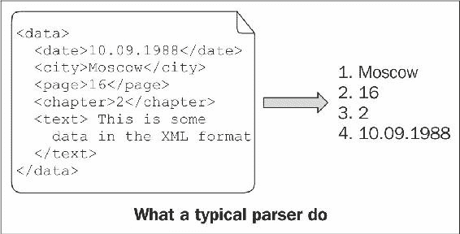

# 转换和铸造

在本章中，我们将介绍:

*   将字符串转换为数字
*   将数字转换为字符串
*   将数字转换成数字
*   将用户定义的类型转换为字符串或从字符串转换
*   转换智能指针
*   铸造多态对象
*   解析简单输入
*   解析复杂输入

# 介绍

现在，我们知道了一些基本的 Boost 类型，是时候了解数据转换功能了。在本章中，我们将看到如何将字符串、数字、指针和用户定义的类型相互转换，如何安全地转换多态类型，以及如何在 C++源文件中编写大小解析器。

# 将字符串转换为数字

用 C++把字符串转换成数字会让很多人因为效率低和用户不友好而沮丧。查看字符串`100`如何转换为`int`:

```cpp
#include <sstream> 

void sample1() {
    std::istringstream iss("100");
    int i;
    iss >> i;

    // ...
}
```

最好不要想，从早期的转换过程中，有多少不必要的操作、虚函数调用、原子操作和内存分配发生了。顺便说一下，我们不再需要`iss`变量了，但是它会一直存在到作用域结束。

c 方法也好不到哪里去:

```cpp
#include <cstdlib> 

void sample2() {
    char * end;
    const int i = std::strtol ("100", &end, 10);

    // ...
}
```

是把整数值转换成`int`还是停在中间某处？为了理解这一点，我们必须检查`end`变量的内容。之后，我们将有一个无用的`end`变量挡道，直到范围结束。我们想要一辆`int`，但是`strtol`返回`long int`。换算值是否符合`int`？

# 准备好

这个食谱只需要 C++和标准库的基础知识。

# 怎么做...

Boost 中有一个库，可以帮助你应对字符串到数字转换的令人沮丧的困难。它被称为`Boost.LexicalCast`，由一个`boost::bad_lexical_cast`异常类和几个`boost::lexical_cast`和`boost::conversion::try_lexical_convert`函数组成:

```cpp
#include <boost/lexical_cast.hpp> 

void sample3() {
    const int i = boost::lexical_cast<int>("100");
    // ...
}
```

它甚至可以用于非零结尾的字符串:

```cpp
#include <boost/lexical_cast.hpp>

void sample4() {
    char chars[] = {'x', '1', '0', '0', 'y' }; 
    const int i = boost::lexical_cast<int>(chars + 1, 3); 
    assert(i == 100); 
}
```

# 它是如何工作的...

`boost::lexical_cast`函数接受字符串作为输入，并将其转换为三角括号中指定的类型。`boost::lexical_cast`功能甚至会为您检查边界:

```cpp
#include <boost/lexical_cast.hpp>
#include <iostream>

void sample5() {
    try {
        // short usually may not store values greater than 32767
        const short s = boost::lexical_cast<short>("1000000");
        assert(false); // Must not reach this line.
    } catch (const boost::bad_lexical_cast& e) {
        std::cout << e.what() << '\n';
    }
}
```

前面的代码输出:

```cpp
bad lexical cast: source type value could not be interpreted as target.
```

它还检查输入的语法是否正确，如果输入错误，将引发异常:

```cpp
#include <boost/lexical_cast.hpp>
#include <iostream>

void sample6() {
    try {
        const int i = boost::lexical_cast<int>("This is not a number!");
        assert(false); // Must not reach this line.
    } catch (const boost::bad_lexical_cast& /*e*/) {}
}
```

从 Boost 1.56 开始，有一个`boost::conversion::try_lexical_convert`函数，通过返回代码报告错误。在经常出现错误输入的性能关键的地方，它可能很有用:

```cpp
#include <boost/lexical_cast.hpp>
#include <cassert>

void sample7() {
    int i = 0;
    const bool ok = boost::conversion::try_lexical_convert("Bad stuff", i);
    assert(!ok);
}
```

# 还有更多...

`lexical_cast`和所有的`std::stringstream`类一样，使用`std::locale`并可以转换本地化的数字，但是对于 **C 语言环境**和没有数字分组的语言环境也有一套令人印象深刻的优化:

```cpp
#include <boost/lexical_cast.hpp>
#include <locale> 

void sample8() {
    try {
        std::locale::global(std::locale("ru_RU.UTF8"));
        // In Russia coma sign is used as a decimal separator.
        float f = boost::lexical_cast<float>("1,0");
        assert(f < 1.01 && f > 0.99);
        std::locale::global(std::locale::classic()); // Restoring C locale
    } catch (const std::runtime_error&) { /* locale is not supported */ }
} 
```

C++标准库没有`lexical_cast`，但是由于 C++17 有`std::from_chars`函数，可以用来创建速度惊人的通用转换器。请注意，这些转换器根本不使用区域设置，因此它们的功能略有不同。`std::from_chars`函数被设计成不分配内存，不抛出异常，并且没有原子或其他一些繁重的操作。

# 请参见

*   有关`boost::lexical_cast`表演的信息，请参考*将数字转换为字符串*配方。
*   `Boost.LexicalCast`的官方文档包含一些示例、绩效衡量标准和常见问题的答案。在[http://boost.org/libs/lexical_cast](http://boost.org/libs/lexical_cast)有售。

# 将数字转换为字符串

在本食谱中，我们将继续讨论词汇转换，但现在我们将使用`Boost.LexicalCast`将数字转换为字符串。像往常一样，`boost::lexical_cast`将提供一种非常简单的方法来转换数据。

# 准备好

这个食谱只需要 C++的基础知识和一个标准库。

# 怎么做...

让我们使用`boost::lexical_cast`将整数`100`转换为`std::string`:

```cpp
#include <cassert>
#include <boost/lexical_cast.hpp> 

void lexical_cast_example() {
    const std::string s = boost::lexical_cast<std::string>(100);
    assert(s == "100");
}
```

将其与传统的 C++转换方法进行比较:

```cpp
#include <cassert>
#include <sstream> 

void cpp_convert_example() {
    std::stringstream ss;  // Slow/heavy default constructor.
    ss << 100;
    std::string s;
    ss >> s;

    // Variable 'ss' will dangle all the way, till the end
    // of scope. Multiple virtual methods and heavy 
    // operations were called during the conversion.
    assert(s == "100");
}
```

并对照 C 转换方法:

```cpp
#include <cassert>
#include <cstdlib> 

void c_convert_example() {
     char buffer[100];
     std::sprintf(buffer, "%i", 100);

     // You will need an unsigned long long int type to 
     // count how many times errors were made in 'printf' 
     // like functions all around the world. 'printf' 
     // functions are a constant security threat! 

     // But wait, we still need to construct a std::string.
     const std::string s = buffer;
     // Now we have a 'buffer' variable that is not used.

     assert(s == "100");
}
```

# 它是如何工作的...

`boost::lexical_cast`函数也可以接受数字作为输入，并将其转换为指定为模板参数的字符串类型(在三角括号中)。这与我们在之前的食谱中所做的非常接近。

# 还有更多...

细心的读者会注意到，在`lexical_cast`的情况下，我们有一个额外的调用来字符串复制构造函数，这样的调用会降低性能。这是真的，但只适用于老的或不好的编译器。现代编译器实现了一个名为**的返回值优化** ( **NRVO** )，它消除了对复制构造函数和析构函数的不必要的调用。即使 C++11 兼容的编译器没有检测到 NRVO，也使用`std::string`的移动构造函数，快速高效。`Boost.LexicalCast`文档的*性能*部分显示了不同类型的不同编译器的转换速度。在大多数情况下，`lexical_cast`比`std::stringstream`和`printf`功能更快。

如果将`boost::array`或`std::array`作为输出参数类型传递给`boost::lexical_cast`，则动态内存分配会更少(或者根本没有内存分配，这取决于`std::locale`的实现)。
C++11 有`std::to_string`和`std::to_wstring`功能，在`<string>`头中声明。这些函数使用区域设置，行为分别非常接近`boost::lexical_cast<std::string>`和`boost::lexical_cast<std::wstring>`。C++17 有`std::to_chars`功能，可以以惊人的速度将数字转换成字符数组。`std::to_chars`不分配内存，不抛出异常，可能会使用错误代码报错。如果你需要真正快速的不使用语言环境的转换功能，那就使用`std::to_chars`。

# 请参见

*   Boost 的官方文档包含将`lexical_cast`性能与其他转换方法进行比较的表格。在大多数情况下，`lexical_cast`比其他方法[http://boost.org/libs/lexical_cast](http://boost.org/libs/lexical_cast)更快。
*   将字符串转换为数字的*方法。*
*   将用户定义的类型转换成字符串的方法。

# 将数字转换成数字

您可能还记得编写以下代码的情况:

```cpp
void some_function(unsigned short param); 
int foo(); 

void do_something() {
    // Some compilers may warn, that int is being converted to  
    // unsigned short and that there is a possibility of loosing  
    // data.
    some_function(foo());
} 
```

通常，程序员只是通过隐式转换到`unsigned short`数据类型来忽略这些警告，如下面的代码片段所示:

```cpp
// Warning suppressed.
some_function( 
    static_cast<unsigned short>(foo()) 
); 
```

但是，如果`foo()`返回不符合`unsigned short`的数字怎么办？这导致难以检测的错误。这种错误可能会在代码中存在多年，然后才会被发现并修复。看看`foo()`的定义:

```cpp
// Returns -1 if error occurred.
int foo() { 
    if (some_extremely_rare_condition()) { 
        return -1; 
    } else if (another_extremely_rare_condition()) { 
        return 1000000; 
    } 
    return 42; 
}
```

# 准备好

这个食谱只需要 C++的基础知识。

# 怎么做...

库`Boost.NumericConversion`为这种情况提供了解决方案。把`static_cast`换成`boost::numeric_cast`就可以了。当源值不能存储在目标中时，后者将引发异常:

```cpp
#include <boost/numeric/conversion/cast.hpp> 

void correct_implementation() { 
    // 100% correct.
    some_function( 
        boost::numeric_cast<unsigned short>(foo()) 
    ); 
} 

void test_function() {
    for (unsigned int i = 0; i < 100; ++i) {
        try {
            correct_implementation();
        } catch (const boost::numeric::bad_numeric_cast& e) {
            std::cout << '#' << i << ' ' << e.what() << std::endl;
        }
    }
}
```

现在，如果我们运行`test_function()`，它将输出以下内容:

```cpp
#47 bad numeric conversion: negative overflow 
#58 bad numeric conversion: positive overflow 
```

我们甚至可以检测特定的溢出类型:

```cpp
void test_function1() { 
   for (unsigned int i = 0; i < 100; ++i) { 
       try { 
           correct_implementation(); 
       } catch (const boost::numeric::positive_overflow& e) { 
           // Do something specific for positive overflow. 
           std::cout << "POS OVERFLOW in #" << i << ' '
                     << e.what() << std::endl; 
       } catch (const boost::numeric::negative_overflow& e) { 
           // Do something specific for negative overflow. 
           std::cout <<"NEG OVERFLOW in #" << i << ' '
                     << e.what() << std::endl; 
       } 
   } 
} 
```

`test_function1()`功能将输出以下内容:

```cpp
NEG OVERFLOW in #47 bad numeric conversion: negative overflow 
POS OVERFLOW in #59 bad numeric conversion: positive overflow 
```

# 它是如何工作的...

`boost::numeric_cast`检查输入参数的值是否适合新类型而不丢失数据，如果在转换过程中丢失了什么，则抛出异常。

`Boost.NumericConversion`库的实现速度非常快。它可以在编译时做很多工作，比如转换成更大范围的类型时，只需通过`static_cast`就可以将源转换成目标类型。

# 还有更多...

`boost::numeric_cast`功能通过`boost::numeric::converter`实现，可以调整为使用不同的溢出、范围检查和舍入策略。但通常情况下，`numeric_cast`正是你所需要的。

这里有一个小例子，演示了如何为`boost::numeric::cast`制作自己的溢出处理程序:

```cpp
template <class SourceT, class TargetT> 
struct mythrow_overflow_handler {
    void operator() (boost::numeric::range_check_result r) { 
        if (r != boost::numeric::cInRange) { 
            throw std::logic_error("Not in range!"); 
        } 
    } 
}; 

template <class TargetT, class SourceT> 
TargetT my_numeric_cast(const SourceT& in) { 
    typedef boost::numeric::conversion_traits<
        TargetT, SourceT
    > conv_traits; 
    typedef boost::numeric::converter < 
        TargetT, 
        SourceT, 
        conv_traits, // default conversion traits
        mythrow_overflow_handler<SourceT, TargetT> // !!! 
    > converter; 

    return converter::convert(in); 
} 
```

以下是如何使用我们的自定义转换器:

```cpp
void example_with_my_numeric_cast() {
    short v = 0;
    try {
        v = my_numeric_cast<short>(100000);
    } catch (const std::logic_error& e) {
        std::cout << "It works! " << e.what() << std::endl;
    }
}
```

上述代码输出以下内容:

```cpp
It works! Not in range!
```

即使是 C++17 也没有安全的数字转换工具。然而，这方面的工作正在进行中。2020 年后，我们完全有机会看到这样的设施。

# 请参见

Boost 的官方文档包含数值转换器所有模板参数的详细描述；可在以下链接获得:[http://boost.org/libs/numeric/conversion](http://boost.org/libs/numeric/conversion)

# 将用户定义的类型转换为字符串或从字符串转换

`Boost.LexicalCast`中有一个功能，可以让用户用`lexical_cast`使用自己的类型。该功能要求用户为该类型编写正确的`std::ostream`和`std::istream`运算符。

# 怎么做...

1.  你只需要提供`operator<<`和`operator>>`流操作符。如果您的类已经可以流式传输，则无需执行任何操作:

```cpp
#include <iostream>
#include <stdexcept>

// Negative number that does not store minus sign.
class negative_number {
    unsigned short number_; 

public:
    explicit negative_number(unsigned short number = 0)
        : number_(number)
    {} 

    // ...
    unsigned short value_without_sign() const {
        return number_;
    }
}; 

inline std::ostream&
    operator<<(std::ostream& os, const negative_number& num)
{
    os << '-' << num.value_without_sign();
    return os;
}

inline std::istream& operator>>(std::istream& is, negative_number& num)
{
    char ch;
    is >> ch;
    if (ch != '-') {
        throw std::logic_error(
            "negative_number class stores ONLY negative values"
        );
    }

    unsigned short s;
    is >> s;
    num = negative_number(s);
    return is;
}
```

2.  现在，我们可以使用`boost::lexical_cast`来进行往返于`negative_number`类的转换。这里有一个例子:

```cpp
#include <boost/lexical_cast.hpp>
#include <boost/array.hpp>
#include <cassert>

void example1() {
    const negative_number n
        = boost::lexical_cast<negative_number>("-100");
    assert(n.value_without_sign() == 100);

    const int i = boost::lexical_cast<int>(n);
    assert(i == -100);

    typedef boost::array<char, 10> arr_t;
    const arr_t arr = boost::lexical_cast<arr_t>(n);
    assert(arr[0] == '-');
    assert(arr[1] == '1');
    assert(arr[2] == '0');
    assert(arr[3] == '0');
    assert(arr[4] == 0);
} 
```

# 它是如何工作的...

`boost::lexical_cast`功能可以检测并使用流操作符转换用户定义的类型。

`Boost.LexicalCast`库有许多针对基本类型的优化，当用户定义类型转换为基本类型或基本类型转换为用户定义类型时，都会触发这些优化。

# 还有更多...

`boost::lexical_cast`函数也可以转换为宽字符串，但是需要正确的`basic_istream`和`basic_ostream`运算符重载:

```cpp
template <class CharT> 
std::basic_ostream<CharT>& 
    operator<<(std::basic_ostream<CharT>& os, const negative_number& num)
{ 
    os << static_cast<CharT>('-') << num.value_without_sign(); 
    return os; 
} 

template <class CharT> 
std::basic_istream<CharT>& 
    operator>>(std::basic_istream<CharT>& is, negative_number& num)
{ 
    CharT ch; 
    is >> ch; 
    if (ch != static_cast<CharT>('-')) { 
        throw std::logic_error(
            "negative_number class stores ONLY negative values"
        ); 
    } 
    unsigned short s; 
    is >> s; 
    num = negative_number(s); 
    return is; 
} 

void example2() { 
    const negative_number n = boost::lexical_cast<negative_number>(L"-1"); 
    assert(n.value_without_sign() == 1); 

    typedef boost::array<wchar_t, 10> warr_t; 
    const warr_t arr = boost::lexical_cast<warr_t>(n); 
    assert(arr[0] == L'-'); 
    assert(arr[1] == L'1'); 
    assert(arr[2] == 0); 
} 
```

`Boost.LexicalCast`库不是 C++的一部分。很多 Boost 库都在使用它，我希望它也能让你的生活更轻松。

# 请参见

*   `Boost.LexicalCast`文档包含一些示例、性能度量和常见问题的答案；它在[http://boost.org/libs/lexical_cast](http://boost.org/libs/lexical_cast)有售
*   将字符串转换为数字的*方法*
*   将数字转换为字符串的*方法*

# 转换智能指针

这里有一个问题:

1.  你有一个名为`some_class`的班级:

```cpp
struct base {
    virtual void some_methods() = 0;
    virtual ~base();
};

struct derived: public base {
    void some_methods() /*override*/;
    virtual void derived_method() const;

    ~derived() /*override*/;
};
```

2.  您有一个第三方应用编程接口，它通过共享指向`base`的指针返回构造的`derived`，并在其他函数中接受共享指向`const derived`的指针:

```cpp
#include <boost/shared_ptr.hpp>
boost::shared_ptr<const base> construct_derived();
void im_accepting_derived(boost::shared_ptr<const derived> p);
```

3.  您必须使以下代码工作:

```cpp
void trying_hard_to_pass_derived() {
    boost::shared_ptr<const base> d = construct_derived();

    // Oops! Compile time error:
    // ‘const struct base; has no member named ‘derived_method;.
    d->derived_method();

    // Oops! Compile time error:
    // could not convert ‘d; to ‘boost::shared_ptr<const derived>;.
    im_accepting_derived(d);
}
```

你如何以一种友好的方式解决这个问题？

# 入门指南

这个食谱需要 C++和智能指针的基本知识。

# 怎么做...

解决方案是对智能指针使用特殊的强制转换。在这种特殊情况下，我们需要使用`dynamic_cast`功能，所以我们使用`boost::dynamic_pointer_cast`:

```cpp
void trying_hard_to_pass_derived2() {
    boost::shared_ptr<const derived> d
        = boost::dynamic_pointer_cast<const derived>(
            construct_derived()
        );

    if (!d) {
        throw std::runtime_error(
            "Failed to dynamic cast"
        );
    }

    d->derived_method();
    im_accepting_derived(d);
} 
```

# 它是如何工作的...

Boost 库有很多智能指针转换的功能。它们都接受一个智能指针和一个模板参数`T`，其中`T`是智能指针想要的模板类型。这些转换运算符模仿内置转换的行为，同时正确管理引用计数和其他智能指针内部:

*   `boost::static_pointer_cast<T>(p)` -做`static_cast<T*>(p.get())`
*   `boost::dynamic_pointer_cast<T>(p)` -做`dynamic_cast<T*>(p.get())`
*   `boost::const_pointer_cast<T>(p)` -做`const_cast<T*>(p.get())`
*   `boost::reinterpret_pointer_cast<T>(p)` -做`reinterpret_cast<T*>(p.get())`

# 还有更多...

所有的`boost::*_pointer_cast`函数都可以使用标准库中的智能指针和 C 指针，如果你包括`<boost/pointer_cast.hpp>`。
在 C++11 中，标准库在`<memory>`头中定义了`std::static_pointer_cast`、`std::dynamic_pointer_cast`和`std::const_pointer_cast`，但是，它只针对`std::shared_ptr`。C++17 标准库有`std::reinterpret_pointer_cast`，但只针对`std::shared_ptr`。

# 请参见

*   `Boost.SmartPointer`库文档包含更多关于位于[http://boost.org/libs/smart_ptr/pointer_cast.html](http://boost.org/libs/smart_ptr/pointer_cast.html)的标准库的指针强制转换的示例
*   `boost::shared_ptr`的铸件参考可在[http://boost.org/libs/smart_ptr/shared_ptr.htm](http://boost.org/libs/smart_ptr/shared_ptr.htm)获得
*   本章中的*铸造多态对象*配方将向您展示一种更好的动态铸造方法

# 铸造多态对象

想象一下，一些程序员设计了这样一个糟糕的接口，如下所示(这是一个很好的例子，说明了接口不应该如何编写):

```cpp
struct object { 
    virtual ~object() {} 
}; 

struct banana: public object { 
    void eat() const {} 
    virtual ~banana(){} 
}; 

struct penguin: public object { 
    bool try_to_fly() const {
        return false; // penguins do not fly
    }
    virtual ~penguin(){} 
}; 

object* try_produce_banana(); 
```

我们的任务是创建一个吃香蕉的函数，如果有不同的东西来代替香蕉，就会抛出异常(`try_produce_banana()`可能会返回`nullptr`),所以如果我们不检查就取消引用它返回的值，我们就有取消引用空指针的危险。

# 入门指南

这个食谱需要 C++的基础知识。

# 怎么做...

因此，我们需要编写以下代码:

```cpp
void try_eat_banana_impl1() { 
    const object* obj = try_produce_banana(); 
    if (!obj) { 
        throw std::bad_cast(); 
    } 
    dynamic_cast<const banana&>(*obj).eat(); 
} 
```

很丑，不是吗？`Boost.Conversion`提供了稍微好一点的解决方案:

```cpp
#include <boost/cast.hpp> 

void try_eat_banana_impl2() { 
    const object* obj = try_produce_banana(); 
    boost::polymorphic_cast<const banana*>(obj)->eat(); 
} 
```

# 它是如何工作的...

`boost::polymorphic_cast`函数只是包装第一个例子的代码，仅此而已。它检查输入是否为空，然后尝试进行动态转换。这些操作中的任何错误都将引发`std::bad_cast`异常。

# 还有更多...

`Boost.Conversion`库还有一个`polymorphic_downcast`功能，应该只用于肯定会成功的向下转换。在调试模式下(当`NDEBUG`未定义时)，它将使用`dynamic_cast`检查正确的下变频。当`NDEBUG`被定义时，`polymorphic_downcast`功能将只做一个`static_cast`操作。在性能关键的部分使用它是一个很好的功能，仍然保留了在调试编译中检测错误的能力。
从 Boost 1.58 开始，`Boost.Conversion`库中就有了`boost::polymorphic_pointer_downcast`和`boost::polymorphic_pointer_cast`功能。这些功能允许您安全地转换智能指针，并且具有与`boost::polymorphic_cast`和`boost::polymorphic_downcast`相同的特性。
c++标准库缺少`polymorphic_cast`和`polymorphic_downcast`。

# 请参见

*   最初，`polymorphic_cast`的想法是在《C++编程语言》*比雅尼·斯特劳斯特鲁普*一书中提出的。关于不同主题的更多信息和一些好主意，请参考这本书。
*   官方文件可能也有帮助；在[http://boost.org/libs/conversion](http://boost.org/libs/conversion)有售。
*   有关铸造智能指针的更多信息，请参考之前的配方。

# 解析简单输入

解析小文本是一项常见的任务。这样的情况总是让人左右为难:是用一些第三方专业的好的解析工具，比如 Bison 或者 ANTLR，还是只用 C++和标准库来尝试手工编写？第三方工具很适合处理复杂文本的解析，使用它们编写解析器很容易，但是它们需要额外的工具来从语法中创建 C++或 C 代码，并为项目添加更多的依赖项。

手写解析器通常很难维护，但是除了 C++编译器，它们什么都不需要。



让我们从一个非常简单的任务开始，解析 ISO 格式的日期，如下所示:

```cpp
YYYY-MM-DD 
```

以下是可能的输入示例:

```cpp
2013-03-01 
2012-12-31  // (woo-hoo, it almost a new year!) 
```

我们需要来自以下链接[http://www.ietf.org/rfc/rfc333:](http://www.ietf.org/rfc/rfc3339.txt:)的解析器语法

```cpp
   date-fullyear   = 4DIGIT 
   date-month      = 2DIGIT  ; 01-12 
   date-mday       = 2DIGIT  ; 01-28, 01-29, 01-30, 01-31 based on 
                             ; month/year 
   full-date       = date-fullyear "-" date-month "-" date-mday 
```

# 准备好

确保您熟悉占位符的概念，或者阅读[第 1 章](01.html#RL0A0-712b4ba1126a4c7c89e1d44de61b4bdd)、*开始编写应用程序*中的*重新排序函数参数*和*将值绑定为函数参数*的方法。解析工具的基础知识会很好。

# 怎么做...

让我给你介绍一个`Boost.Spirit`图书馆。它允许直接用 C++代码编写解析器(以及 lexers 和生成器)，这些解析器可以立即执行(不需要额外的工具来生成 C++代码)。`Boost.Spirit`的语法非常接近**扩展的巴克斯-诺尔形式** ( **EBNF** )，它被用于以多种标准表达语法，并被其他流行的解析器所理解。本章开头的语法是在 EBNF:

1.  我们需要包含以下标题:

```cpp
#include <boost/spirit/include/qi.hpp>
#include <boost/spirit/include/phoenix_core.hpp>
#include <boost/spirit/include/phoenix_operator.hpp>
#include <cassert>
```

2.  现在，是时候创建一个`date`结构来保存解析后的数据了:

```cpp
struct date {
    unsigned short year;
    unsigned short month;
    unsigned short day;
};
```

3.  让我们看看解析器(在下一节中可以找到它如何工作的逐步描述):

```cpp
// See recipe "Type 'reference to string'" for a better type
// than std::string for parameter 's'
date parse_date_time1(const std::string& s) {
    using boost::spirit::qi::_1;
    using boost::spirit::qi::ushort_;
    using boost::spirit::qi::char_;
    using boost::phoenix::ref;

    date res;
    const char* first = s.data();
    const char* const end = first + s.size();
    const bool success = boost::spirit::qi::parse(first, end,

        // Implementation of 'full-date' rule from EBNF grammar.
        ushort_[ ref(res.year) = _1 ] >> char_('-')
           >> ushort_[ ref(res.month) = _1 ] >> char_('-')
           >> ushort_[ ref(res.day) = _1 ]

    ); 

    if (!success || first != end) {
        throw std::logic_error("Parsing failed");
    }
    return res;
}
```

4.  现在，我们可以在任何地方使用这个解析器:

```cpp
int main() {
    const date d = parse_date_time1("2017-12-31");
    assert(d.year == 2017);
    assert(d.month == 12);
    assert(d.day == 31);
}
```

# 它是如何工作的...

这是一个非常简单的实现；它不检查数字的位数。解析发生在`boost::spirit::qi::parse`函数中。让我们稍微简化一下，去掉成功解析的动作:

```cpp
const bool success = boost::spirit::qi::parse(first, end, 
     ushort_ >> char_('-') >> ushort_ >> char_('-') >> ushort_ 
); 
```

`first`参数指向要解析的数据的开头。它必须是非恒定变量，因为`parse`函数会将其修改为指向解析序列的末尾。
参数`end`指向要解析的最后一个元素之后的位置。`first`和`end`应为迭代器或指针。

函数的第三个参数是解析规则。它看起来完全像 EBNF 规则:

```cpp
date-fullyear "-" date-month "-" date-md 
```

我们刚刚用`>>`运算符替换了空格。

`parse`功能成功返回`true`。如果我们想确保整个字符串被成功解析，我们需要检查解析器的返回值以及`end`和修改后的`first`迭代器的相等性。

现在，我们需要处理成功解析的动作，这个方法就结束了。`Boost.Spirit`中的语义动作写在`[]`内部，可以使用函数指针、函数对象、`boost::bind`、`std::bind`(或其他`bind()`实现)或 C++11 lambda 函数来编写。

因此，您也可以使用 C++11 lambda 为`YYYY`编写一个规则:

```cpp
const auto y = [&res](unsigned short s) { res.year = s; };
// ...

ushort_[y] >> char_('-') >> // ...
```

You cannot put the lambda definition directly inside the `[]` because the C++ compiler will think that it's an attribute. As a workaround, you can make an `auto` variable with the lambda function in it and use that variable in parser rule description (just like it was done in the preceding code snippet).

现在，我们来仔细看看月的语义动作:

```cpp
ushort_[ ref(res.month) = _1 ] 
```

对于从头读起这本书的人来说，前面的代码提醒了关于`boost::bind`、`boost::ref`和占位符。`ref(res.month)`表示将`res.month`作为可修改的引用传递，`_1`表示第一个输入参数，它将是一个数字(解析`ushort_`的结果)。

# 还有更多...

现在让我们修改我们的解析器，这样它可以处理数字计数。为此，我们将采用`unit_parser`类模板并设置正确的参数:

```cpp
date parse_date_time2(const std::string& s) { 
    using boost::spirit::qi::_1; 
    using boost::spirit::qi::uint_parser; 
    using boost::spirit::qi::char_; 
    using boost::phoenix::ref; 

    date res; 

    // Use unsigned short as output type; require Radix 10 and
    // from 2 to 2 digits.
    uint_parser<unsigned short, 10, 2, 2> u2_; 

    // Use unsigned short as output type; require Radix 10 and
    // from 4 to 4 digits.
    uint_parser<unsigned short, 10, 4, 4> u4_; 

    const char* first = s.data(); 
    const char* const end = first + s.size(); 
    const bool success = boost::spirit::qi::parse(first, end, 

        u4_ [ ref(res.year) = _1 ] >> char_('-') 
            >> u2_ [ ref(res.month) = _1 ] >> char_('-')
            >> u2_ [ ref(res.day) = _1 ] 

    ); 
    if (!success || first != end) { 
        throw std::logic_error("Parsing failed"); 
    } 
    return res; 
} 
```

如果那些例子看起来很复杂，不要担心。第一次我也是被`Boost.Spirit`吓到的，但现在真的简化了我的生活。如果这段代码没有吓到你，你是非常勇敢的。

不要在头文件中编写解析器，因为这会增加项目的编译时间。在源文件中编写解析器，并隐藏该文件中的所有`Boost.Spirit`内部。如果我们调整前面的示例以遵循该规则，那么头文件将如下所示:

```cpp
// Header file.
#ifndef MY_PROJECT_PARSE_DATE_TIME
#define MY_PROJECT_PARSE_DATE_TIME

#include <string>

struct date { 
    unsigned short year; 
    unsigned short month; 
    unsigned short day; 
}; 

date parse_date_time2(const std::string& s);

#endif // MY_PROJECT_PARSE_DATE_TIME
```

还要注意传递给`boost::spirit::parse`函数的迭代器类型。使用的迭代器类型越少，得到的二进制文件就越小。

如果您现在认为使用标准库手工实现解析日期更简单，那么您是对的！但只是现在。看看下一个食谱，它会给你更多关于`Boost.Spirit`用法的例子，并将这个例子扩展为案例，当手工编写解析器比使用`Boost.Spirit`更难的时候。

`Boost.Spirit`库不是 C++的一部分，在最近的将来也不会被提议包含在内。但是，它与现代 C++特性配合得非常好，所以如果您的编译器支持 C++11，请使用它们:

```cpp
date parse_date_time2_cxx(const std::string& s) {
    using boost::spirit::qi::uint_parser; 
    using boost::spirit::qi::char_; 

    date res; 

    uint_parser<unsigned short, 10, 2, 2> u2_; 
    uint_parser<unsigned short, 10, 4, 4> u4_; 

    const auto y = [&res](unsigned short s) { res.year = s; };
    const auto m = [&res](unsigned short s) { res.month = s; };
    const auto d = [&res](unsigned short s) { res.day = s; };

    const char* first = s.data(); 
    const char* const end = first + s.size();
    const bool success = boost::spirit::qi::parse(first, end, 
        u4_[y] >> char_('-') >> u2_[m] >> char_('-') >> u2_[d] 
    );

    if (!success || first != end) { 
        throw std::logic_error("Parsing failed"); 
    } 
    return res;
}
```

# 请参见

*   [第一章](01.html#RL0A0-712b4ba1126a4c7c89e1d44de61b4bdd)、*中*重新排序功能*配方参数开始编写应用程序*。
*   *绑定一个值作为功能参数*配方。
*   `Boost.Spirit`是一个巨大的只有标题的库。关于它，可能会写一本单独的书。欢迎在[http://boost.org/libs/spirit.](http://boost.org/libs/spirit)使用其文档

# 解析复杂输入

在前面的食谱中，我们编写了一个简单的日期解析器。想象一下，一段时间过去了，任务变了。现在，我们需要编写一个支持多种输入格式和区域偏移量的日期时间解析器。我们的解析器必须理解以下输入:

```cpp
2012-10-20T10:00:00Z      // date time with zero zone offset 
2012-10-20T10:00:00       // date time without zone offset 
2012-10-20T10:00:00+09:15 // date time with zone offset 
2012-10-20-09:15          // date time with zone offset 
10:00:09+09:15            // time with zone offset 
```

# 准备好

我们将使用`Boost.Spirit`库，这在*解析简单输入*食谱中有描述。在接触这个食谱之前，请先阅读它。

# 怎么做...

1.  让我们从编写一个保存解析结果的日期时间结构开始:

```cpp
#include <stdexcept>
#include <cassert>

struct datetime {
    enum zone_offsets_t {
        OFFSET_NOT_SET,
        OFFSET_Z,
        OFFSET_UTC_PLUS,
        OFFSET_UTC_MINUS
    };

private:
    unsigned short year_;
    unsigned short month_;
    unsigned short day_;

    unsigned short hours_;
    unsigned short minutes_;
    unsigned short seconds_;

    zone_offsets_t zone_offset_type_;
    unsigned int zone_offset_in_min_;

    static void dt_assert(bool v, const char* msg) {
        if (!v) {
            throw std::logic_error(
                "Assertion failed in datetime: " + std::string(msg)
            );
        }
    }

public:
    datetime()
        : year_(0), month_(0), day_(0)
        , hours_(0), minutes_(0), seconds_(0)
        , zone_offset_type_(OFFSET_NOT_SET), zone_offset_in_min_(0)
    {}

    // Getters: year(), month(), day(), hours(), minutes(),
    // seconds(), zone_offset_type(), zone_offset_in_min()
    // ...

    // Setters: set_year(unsigned short), set_day(unsigned short), ...
    //
    // void set_*(unsigned short val) {
    //     Some dt_assert.
    //     Setting the '*_' to 'val'.
    // }
    // ...

}; 
```

2.  现在，让我们编写一个函数来设置区域偏移:

```cpp
void set_zone_offset(datetime& dt, char sign, unsigned short hours
    , unsigned short minutes)
{
    dt.set_zone_offset(
        sign == '+'
        ? datetime::OFFSET_UTC_PLUS
        : datetime::OFFSET_UTC_MINUS
    );
    dt.set_zone_offset_in_min(hours * 60 + minutes);
}
```

3.  编写解析器可以分为编写几个简单的解析器。我们从编写一个区域偏移解析器开始:

```cpp
// Default includes for Boost.Spirit.
#include <boost/spirit/include/qi.hpp>
#include <boost/spirit/include/phoenix_core.hpp>
#include <boost/spirit/include/phoenix_operator.hpp>

// We'll use bind() function from Boost.Spirit,
// because it interates better with parsers.
#include <boost/spirit/include/phoenix_bind.hpp>

datetime parse_datetime(const std::string& s) {
    using boost::spirit::qi::_1;
    using boost::spirit::qi::_2;
    using boost::spirit::qi::_3;
    using boost::spirit::qi::uint_parser;
    using boost::spirit::qi::char_;
    using boost::phoenix::bind;
    using boost::phoenix::ref;

    datetime ret;

    // Use unsigned short as output type; require Radix 10 and
    // from 2 to 2 digits.
    uint_parser<unsigned short, 10, 2, 2> u2_;

    // Use unsigned short as output type; require Radix 10 and
    // from 4 to 4 digits.
    uint_parser<unsigned short, 10, 4, 4> u4_;

    boost::spirit::qi::rule<const char*, void()> timezone_parser
        = -( // unary minus means optional rule

            // Zero offset
            char_('Z')[ bind(
                &datetime::set_zone_offset, &ret, datetime::OFFSET_Z
            ) ]

            | // OR

            // Specific zone offset
            ((char_('+')|char_('-')) >> u2_ >> ':' >> u2_) [
                bind(&set_zone_offset, ref(ret), _1, _2, _3)
            ]
        );
```

4.  让我们通过编写剩余的解析器来结束我们的示例:

```cpp
    boost::spirit::qi::rule<const char*, void()> date_parser =
           u4_ [ bind(&datetime::set_year, &ret, _1) ] >> '-'
        >> u2_ [ bind(&datetime::set_month, &ret, _1) ] >> '-'
        >> u2_ [ bind(&datetime::set_day, &ret, _1) ]; 

    boost::spirit::qi::rule<const char*, void()> time_parser =
            u2_ [ bind(&datetime::set_hours, &ret, _1) ] >> ':'
         >> u2_ [ bind(&datetime::set_minutes, &ret, _1) ] >> ':'
         >> u2_ [ bind(&datetime::set_seconds, &ret, _1) ]; 

    const char* first = s.data();
    const char* const end = first + s.size();
    const bool success = boost::spirit::qi::parse(first, end,
        (
            (date_parser >> 'T' >> time_parser)
            | date_parser
            | time_parser
        )
        >> timezone_parser
    );

    if (!success || first != end) {
        throw std::logic_error("Parsing of '" + s + "' failed");
    }
    return ret;
} // end of parse_datetime() function
```

# 它是如何工作的...

这里一个非常有趣的变量是`boost::spirit::qi::rule<const char*, void()>`。它删除了生成的解析器的确切类型，并允许您为递归语法编写解析器。它还允许您在源文件中编写解析器，并将它们导出到头文件，而不会显著影响项目的编译时间。例如:

```cpp
// Somewhere in header file 
class example_1 { 
    boost::spirit::qi::rule<const char*, void()> some_rule_; 
public: 
    example_1(); 
}; 

// In source file 
example_1::example_1() { 
    some_rule_ = /* ... a lot of parser code ... */; 
} 
```

请注意，这个类暗示了编译器的优化障碍，所以不需要的时候不要使用它。

有时候我们用`>> ':'`代替`>> char_(':')`。第一种方法的局限性更大:您不能将动作绑定到它，也不能仅通过组合字符来创建新的规则(例如，您根本不能在不使用`char_`的情况下编写`char_('+')|char_('-')`。但是为了获得更好的性能，请使用第一种方法，因为有些编译器可能会稍微优化一下。

# 还有更多...

我们可以通过移除进行类型擦除的`rule<>`对象来使我们的示例稍微快一点。只需用 C++11 `auto`关键字替换即可。

`Boost.Spirit`库生成非常快的解析器；在官方网站上有一些性能指标。官方文档包含编写更快解析器的高级建议。

`boost::phoenix::bind`的用法不是强制性的，但是如果没有它，解析`timezone_parser`中特定区域偏移的规则将处理

`boost::fusion::vector<char, unsigned short, unsigned short>`型。使用`bind(&set_zone_offset, ref(ret), _1, _2, _3)`似乎是一个更方便读者的解决方案。

解析大文件时，考虑阅读[第 11 章](11.html#GUKG20-712b4ba1126a4c7c89e1d44de61b4bdd)、*中的*最快读取文件的方法*，使用系统*，因为不正确的文件处理可能比解析更能降低程序的速度。

编译使用`Boost.Spirit`(或`Boost.Fusion`)库的代码可能会花费大量时间，因为模板实例数量巨大。当实验`Boost.Spirit`库使用现代编译器时，它们提供了更好的编译时间。

# 请参见

`Boost.Spirit`图书馆值得单独写一本书，不可能在几个食谱中描述它的所有特征，所以参考文档会帮助你获得更多关于它的信息。在[http://boost.org/libs/spirit](http://boost.org/libs/spirit)有售。在那里，您将找到更多的例子、现成的解析器，以及如何使用 Boost 在 C++11 代码中直接编写 lexers 和生成器的信息。