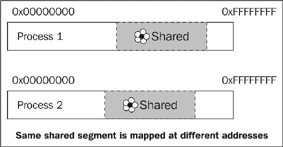
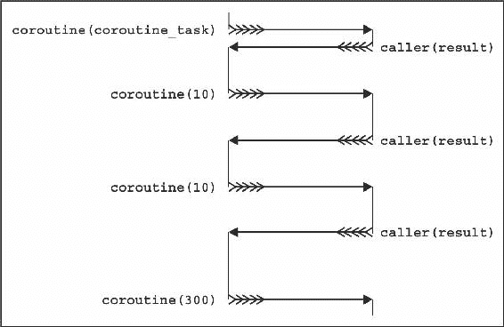

# 十一、使用系统

在本章中，我们将介绍:

*   列出目录中的文件
*   擦除和创建文件和目录
*   编写和使用插件
*   获取回溯-当前调用序列
*   将数据从一个进程快速传递到另一个进程
*   同步进程间通信
*   在共享内存中使用指针
*   读取文件的最快方法
*   共同诉讼-拯救国家和推迟执行

# 介绍

每个操作系统都有许多系统调用。这些调用从一个操作系统到另一个操作系统是不同的，同时做非常接近的事情。Boost 为这些调用提供了可移植的安全包装。包装器的知识对于编写好的程序是必不可少的。

本章专门介绍如何使用操作系统。我们已经在[第 6 章](06.html#9KVM80-712b4ba1126a4c7c89e1d44de61b4bdd)、*操控任务*中看到了如何处理网络通信和信号。在这一章中，我们将详细了解文件系统、创建和删除文件。我们将看到数据如何在不同的系统进程之间传递，如何以最大速度读取文件，以及如何执行其他技巧。

# 列出目录中的文件

有标准的库函数和类来读写数据到文件。但是在 C++ 17 之前，没有列出目录中的文件、获取文件类型或获取文件访问权限的函数。

让我们看看如何使用 Boost 修复这样的不公正。我们将编写一个程序，列出当前目录中文件的名称、写访问和类型。

# 准备好

C++ 的一些基础知识对于使用这个方法来说已经足够了。

该配方需要链接到`boost_system`和`boost_filesystem`库。

# 怎么做...

这个食谱和下一个食谱是关于使用文件系统的可移植包装器的:

1.  我们需要包含以下两个标题:

```cpp
#include <boost/filesystem/operations.hpp> 
#include <iostream> 
```

2.  现在，我们需要指定一个目录:

```cpp
int main() { 
    boost::filesystem::directory_iterator begin("./"); 
```

3.  指定目录后，遍历其内容:

```cpp
    boost::filesystem::directory_iterator end; 
    for (; begin != end; ++ begin) { 
```

4.  下一步是获取文件信息:

```cpp
        boost::filesystem::file_status fs = 
            boost::filesystem::status(*begin);
```

5.  现在，输出文件信息:

```cpp
        switch (fs.type()) { 
        case boost::filesystem::regular_file: 
            std::cout << "FILE       ";  
            break; 
        case boost::filesystem::symlink_file: 
            std::cout << "SYMLINK    ";  
            break; 
        case boost::filesystem::directory_file: 
            std::cout << "DIRECTORY  ";  
            break; 
        default: 
            std::cout << "OTHER      ";  
            break; 
        } 
        if (fs.permissions() & boost::filesystem::owner_write) { 
            std::cout << "W "; 
        } else { 
            std::cout << "  "; 
        } 
```

6.  最后一步是输出文件名:

```cpp
        std::cout << *begin << '\n'; 
    } /*for*/ 
} /*main*/ 
```

就是这样；现在，如果我们运行程序，它将输出如下内容:

```cpp
FILE W "./main.o" 
FILE W "./listing_files" 
DIRECTORY W "./some_directory" 
FILE W "./Makefile" 
```

# 它是如何工作的...

`Boost.Filesystem`的函数和类只是包装系统特定的函数来处理文件。

注意*第二步*中`/`的用法。POSIX 系统使用斜线来指定路径；默认情况下，Windows 使用反斜杠。不过 Windows 也懂正斜杠，所以`./`会在所有流行的操作系统上工作，也就是当前目录。

看看*第 3 步*，我们默认构建`boost::filesystem::directory_iterator`类。它就像一个`std::istream_iterator`类一样工作，当默认构造时，它充当一个`end`迭代器。

*第四步*是一个棘手的步骤，不是因为这个函数很难理解，而是因为很多转换正在发生。取消引用`begin`迭代器返回`boost::filesystem::directory_entry`，该迭代器隐式转换为`boost::filesystem::path`，用作`boost::filesystem::status`函数的参数。事实上，我们可以做得更好:

```cpp
boost::filesystem::file_status fs = begin->status(); 
```

Read the reference documentation carefully to avoid unrequired implicit conversions.

*第 5 步*是显而易见的，所以我们移至*第 6 步*，在此再次发生到路径的隐式转换。更好的解决方案如下:

```cpp
std::cout << begin->path() << '\n'; 
```

这里，`begin->path()`返回对包含在`boost::filesystem::directory_entry`中的`boost::filesystem::path`变量的常量引用。

# 还有更多...

；`Boost.Filesystem`是 C++ 17 的一部分。C++ 17 中的所有内容都位于名称空间`std::filesystem`中的一个头文件`<filesystem>`中。文件系统的标准库版本与 Boost 版本略有不同，主要是通过使用作用域枚举(`enum class`),其中`Boost.Filesystem`使用的是未作用域的`enum`。

There is a class ; `directory_entry`. That class provides caching of filesystem information, so if you work a lot with filesystem and query different information, try using `directory_entry` for a better performance.

就像其他 Boost 库一样，`Boost.Filesystem`在 C++ 17 之前的编译器上工作，甚至在 C++ 11 之前的编译器上工作。

# 请参见

*   *擦除和创建文件和目录*的方法将显示另一个使用`Boost.Filesystem`的例子
*   阅读助推的官方文档`Boost.Filesystem`获得更多关于其能力的信息；可通过以下链接获得:[http://boost.org/libs/filesystem](http://boost.org/libs/filesystem)
*   你可以在[http://www . open-std.org/jtc1/sc22/wg21/docs/papers/2017/n4659.pdf](http://www.open-std.org/jtc1/sc22/wg21/docs/papers/2017/n4659.pdf)找到 C++ 17 草稿

# 擦除和创建文件和目录

让我们考虑下面几行代码:

```cpp
    std::ofstream ofs("dir/subdir/file.txt"); 
    ofs << "Boost.Filesystem is fun!"; 
```

在这几行中，我们试图在`dir/subdir`目录中向`file.txt`写一些东西。如果没有这样的目录，此尝试将会失败。使用文件系统的能力是编写好的工作代码所必需的。

在这个食谱中，我们将构造一个目录和一个子目录，将一些数据写入一个文件，并尝试创建`symlink`。如果符号链接创建失败，请擦除创建的实体。我们还应该避免使用异常作为错误报告机制，更喜欢某种返回代码。

让我们看看如何使用 Boost 以优雅的方式实现这一点。

# 准备好

这个食谱需要 C++ 和`std::ofstream`类的基础知识。

；`Boost.Filesystem`不是一个只有标题的库，所以这个食谱中的代码需要链接到`boost_system`和`boost_filesystem`库。

# 怎么做...

我们继续处理文件系统的可移植包装器，在这个食谱中，我们将看到如何修改目录内容:

1.  一如既往，我们需要包含一些标题:

```cpp
#include <boost/filesystem/operations.hpp> 
#include <cassert> 
#include <fstream> 
```

2.  现在，我们需要一个变量来存储错误(如果有的话):

```cpp
int main() { 
    boost::system::error_code error; 
```

3.  如果需要，我们还将创建目录，如下所示:

```cpp
    boost::filesystem::create_directories("dir/subdir", error); 
    assert(!error); 
```

4.  然后，我们将数据写入文件:

```cpp
    std::ofstream ofs("dir/subdir/file.txt");
    ofs << "Boost.Filesystem is fun!";
    assert(ofs);
    ofs.close();
```

5.  我们需要尝试创建`symlink`:

```cpp
    boost::filesystem::create_symlink(
        "dir/subdir/file.txt", "symlink", error);
```

6.  然后，我们需要检查文件是否可以通过`symlink`访问:

```cpp
    if (!error) {
        std::cerr << "Symlink created\n";
        assert(boost::filesystem::exists("symlink"));
```

7.  如果`symlink`创建失败，我们将删除创建的文件:

```cpp
    } else {
        std::cerr << "Failed to create a symlink\n";

        boost::filesystem::remove_all("dir", error);
        assert(!error);

        boost::filesystem::remove("symlink", error);
        assert(!error);
    } /*if (!error)*/
} /*main*/
```

# 它是如何工作的...

我们在[第六章](06.html#9KVM80-712b4ba1126a4c7c89e1d44de61b4bdd)、*操纵任务*的几乎所有食谱中都看到了`boost::system::error_code`在起作用。它可以存储关于错误的信息，并广泛应用于所有的 Boost 库。

If you do not provide an instance of `boost::system::error_code` to the `Boost.Filesystem` functions, the code will compile well. In that case, when an error occurs, a `boost::filesystem::filesystem_error` exception is thrown.

仔细看看*第三步*。我们使用的是`boost::filesystem::create_directories`功能，而不是`boost::filesystem::create_directory`，因为后者无法创建子目录。`boost::filesystem::remove_all``boost::filesystem::remove`也是如此。第一个可以删除包含文件和子目录的非空目录。第二个删除单个文件。

剩下的步骤很容易理解，应该不会引起任何麻烦。

# 还有更多...

`boost::system::error_code`类是 C++ 11 的一部分，可以在`std::`命名空间的`<system_error>`头中找到。`Boost.Filesystem`的类是 C++ 17 的一部分。

最后，这里给打算用`Boost.Filesystem`的人一个小小的推荐。当错误在文件系统期间发生时，操作是例行的或者应用需要高的责任/性能，为此，使用`boost::system::error_codes`。否则，捕捉异常更可取、更可靠。

# 请参见

目录中的*列表文件也包含`Boost.Filesystem`的信息。阅读 http://boost.org/libs/filesystem 的 Boost 官方文档，获取更多信息和示例。*

# 编写和使用插件

这里有一个棘手的问题:我们希望允许用户编写程序功能的扩展，但我们不想给他们源代码。换句话说，我们想说，“*写一个函数 X，打包到一个共享库中。我们可能会将您的功能与其他用户的功能一起使用！”*

You meet this technique in everyday life: your browser uses it to allow third-party plugins, your text editor may use it for syntax highlighting, games use **dynamic library loading** for **downloadable content** (**DLC**s) and for adding gamer's content, web pages are returned by servers that use modules/plugins for encryption/authentication and so forth.

对一个用户的函数有什么要求，我们如何在某个时候使用该函数而不将其链接到共享库？

# 准备好

这个食谱需要 C++ 的基础知识。阅读[第 10 章](10.html#FKLNA0-712b4ba1126a4c7c89e1d44de61b4bdd)中的*导出和导入功能和类的可移植方式*是一个要求。

# 怎么做...

首先，你必须和你的用户达成协议:

1.  记录插件接口的需求。例如，你可能会说所有的插件必须导出一个名为`greet`的函数，该函数必须接受`const std::string&`并返回`std::string`。

2.  之后，用户可以通过以下方式开始编写插件/共享库:

```cpp
#include <string>
#include <boost/config.hpp>

#define API extern "C" BOOST_SYMBOL_EXPORT

API std::string greeter(const std::string& name) {
    return "Good to meet you, " + name + ".";
}
```

3.  您用于加载共享库的程序代码必须包含来自`Boost.DLL`的标题:

```cpp
#include <boost/dll/shared_library.hpp>
```

4.  加载库的代码必须如下:

```cpp
int main() {
    boost::filesystem::path plugin_path = /* path-to-pligin */;

    boost::dll::shared_library plugin(
        plugin_path,
        boost::dll::load_mode::append_decorations
    );
```

5.  获取用户的功能必须如下所示:

```cpp
    auto greeter = plugin.get<std::string(const std::string&)>("greeter");
```

6.  完成了。现在，您可以使用该函数:

```cpp
    std::cout << greeter("Sally Sparrow");
}
```

根据加载的插件，您会得到不同的结果:

`plugin_hello`:

```cpp
Good to meet you, Sally Sparrow.
```

`plugin_do_not`:

```cpp
They are fast. Faster than you can believe. Don't turn 

your back, don't look away, and don't blink. Good luck, Sally Sparrow.
```

# 它是如何工作的...

*第二步*有一个小技巧。当你声明一个函数为`extern "C"`时，意味着编译器不能**篡改**(改变)函数名。换句话说，在*步骤 2* 中，我们只需创建一个名为`greet`的函数，并从共享库中以该确切名称导出。

在*步骤 4 中，*我们创建一个名为`plugin`的`boost::dll::shared_library`变量。该变量的构造函数通过指定路径将共享库加载到当前可执行文件的地址空间中。在*步骤 5 中，*我们在`plugin`中搜索名为`greet`的函数。我们还指定该函数具有签名`std::string(const std::string&)`，并将指向该函数的指针存储在变量`greet`中。

就这样！从现在开始，我们可以使用`greet`变量作为函数，只要不破坏`plugin`变量及其所有副本。

您可以从共享库中导出多个函数；您甚至可以导出变量。

Be careful! Always link C and C++ libraries dynamically to the plugin and your main executable, because otherwise your application will crash. Always use the same or ABI compatible versions of C and C++ libraries in your plugins and in your application. Otherwise your application will crash. Read the docs for typical missuses!

# 还有更多...

`Boost.DLL`是一个新的图书馆；它出现在 Boost 1.61 中。该库我最喜欢的部分是能够在共享库名称中添加特定于平台的装饰。例如，根据平台的不同，以下代码将尝试加载`"./some/path/libplugin_name.so"`、`"./some/path/plugin_name.dll"`或`"./some/path/libplugin_name.dll"`:

```cpp
boost::dll::shared_library lib(
    "./some/path/plugin_name",
    boost::dll::load_mode::append_decorations
);
```

C++ 17 没有类似`boost::dll::shared_library`的类。但是，工作正在进行中，有一天我们可能会在 C++ 标准中看到它。

# 请参见

官方文档包含多个例子，更重要的是，还有图书馆[http://boost.org/libs/dll](http://boost.org/libs/dll)网站的典型问题/失误。

# 获取回溯-当前调用序列

当报告错误或失败时，更重要的是报告导致错误的步骤，而不是错误本身。考虑一下天真的交易模拟器:

```cpp
int main() {
    int money = 1000;
    start_trading(money);
}
```

它报告的只有一行:

```cpp
Sorry, you're bankrupt!
```

那是不行的。我们想知道它是怎么发生的，导致破产的步骤是什么！

好吧。让我们修复以下函数，并让它报告导致破产的步骤:

```cpp
void report_bankruptcy() {
    std::cout << "Sorry, you're bankrupt!\n";

    std::exit(0);
}
```

# 入门指南

你需要一个 Boost 1.65 或更新的配方。C++ 基础知识也是要求。

# 怎么做...

对于这个配方，我们只需要构造一个类并输出它:

```cpp
#include <iostream>
#include <boost/stacktrace.hpp>

void report_bankruptcy() {
    std::cout << "Sorry, you're bankrupt!\n";
    std::cout << "Here's how it happened:\n" 
        << boost::stacktrace::stacktrace();

    std::exit(0);
}
```

完成了。现在`report_bankruptcy()`输出类似如下的内容(从下往上读):

```cpp
Sorry, you're bankrupt!
Here's how it happened:
 0# report_bankruptcy()
 1# loose(int)
 2# go_to_casino(int)
 3# go_to_bar(int)
 4# win(int)
 5# go_to_casino(int)
 6# go_to_bar(int)
 7# win(int)
 8# make_a_bet(int)
 9# loose(int)
10# make_a_bet(int)
11# loose(int)
12# make_a_bet(int)
13# start_trading(int)
14# main
15# 0x00007F79D4C48F45 in /lib/x86_64-linux-

gnu/libc.so.6
16# 0x0000000000401F39 in ./04_stacktrace
```

# 它是如何工作的...

所有的魔法都在`boost::stacktrace::stacktrace`等级之内。在构建时，它会将当前调用堆栈快速存储在自身中。`boost::stacktrace::stacktrace`是可复制和可移动的，所以一个存储的 a 调用序列可以传递给其他函数，复制到异常类中，甚至存储在某个文件中。你爱怎么用就怎么用！

输出上的`boost::stacktrace::stacktrace`实例，解码存储的调用序列并尝试获得人类可读的函数名。这就是你在前面的例子中看到的:导致`report_bankruptcy()`函数调用的调用序列。

`boost::stacktrace::stacktrace`你需要迭代存储的地址，将单个地址解码成人类可读的名字。如果不喜欢跟踪的默认输出格式，可以编写自己的函数，以自己喜欢的方式进行输出。

请注意，回溯有用性取决于多种因素。程序的发布版本可能包含内联函数，导致可读性较差的跟踪:

```cpp
 0# report_bankruptcy()
 1# go_to_casino(int)
 2# win(int)
 3# make_a_bet(int)
 4# make_a_bet(int)
 5# make_a_bet(int)
 6# main
```

构建没有调试符号的可执行文件可能会产生没有很多函数名的跟踪。

Read the *Configuration and Build* section of the official documentation for more information about different compilation flags and macros that may affect trace readability.

# 还有更多...

一个`Boost.Stacktrace`库对于大项目有一个非常简洁的特性。您可以在链接程序时禁用所有跟踪。这意味着您不需要重建所有的源文件。只需为整个项目定义`BOOST_STACKTRACE_LINK`宏即可。现在，如果你链接到`boost_stacktrace_noop`图书馆，空的痕迹将被收集。与`boost_stacktrace_windbg` / `boost_stacktrace_windbg_cached` / `boost_stacktrace_backtrace` / `... libraries`链接，获得不同可读性的痕迹。

`Boost.Stacktrace`是新图书馆；它出现在 1.65 年的 Boost 中。

`boost::stacktrace::stacktrace`收集当前通话序列非常快；它只是动态地分配一大块内存，并将一堆地址复制到内存中。解码地址要慢得多；它使用多个特定于平台的调用，可以分叉进程，并且可以初始化和使用 **COM** 。

C++ 17 没有`Boost.Stacktrace`功能。正在努力将其添加到下一个 C++ 标准中。

# 请参见

http://boost.org/libs/stacktrace/的官方文档中有一些异步信号安全堆栈跟踪的例子，以及所有`Boost.Stacktrace`能力[的详细描述。](http://boost.org/libs/stacktrace)

# 将数据从一个进程快速传递到另一个进程

有时候，我们编写程序，经常互相交流。当程序在不同的机器上运行时，使用套接字是最常见的通信技术。但是如果多个进程在一台机器上运行，我们可以做得更好！

让我们看看如何使用`Boost.Interprocess`库使单个内存片段从不同的进程中可用。

# 准备好

这个食谱需要 C++ 的基础知识。原子变量的知识也是必需的(查看*并参见*部分了解更多关于原子的信息)。有些平台要求链接运行时库`rt`。

# 怎么做...

在本例中，我们将在进程之间共享一个原子变量，使其在新进程启动时递增，在进程终止时递减:

1.  我们需要包含以下进程间通信的标题:

```cpp
#include <boost/interprocess/managed_shared_memory.hpp> 
```

2.  在标题`typedef`之后，一个检查将帮助我们确保原子可以用于这个例子:

```cpp
#include <boost/atomic.hpp> 

typedef boost::atomic<int> atomic_t; 
#if (BOOST_ATOMIC_INT_LOCK_FREE != 2) 
#error "This code requires lock-free boost::atomic<int>" 
#endif 
```

3.  创建或获取共享内存段:

```cpp
int main() {
    boost::interprocess::managed_shared_memory 
        segment(boost::interprocess::open_or_create, "shm1-cache", 1024);
```

4.  获取或构造一个`atomic`变量:

```cpp
    atomic_t& atomic 
        = *segment.find_or_construct<atomic_t> // 1
            ("shm1-counter")                   // 2
            (0)                                // 3
    ;
```

5.  以通常的方式使用`atomic`变量:

```cpp
    std::cout << "I have index " << ++ atomic 
        << ". Press any key...\n";
    std::cin.get();
```

6.  销毁`atomic`变量:

```cpp
    const int snapshot = --atomic;
    if (!snapshot) {
        segment.destroy<atomic_t>("shm1-counter");
        boost::interprocess::shared_memory_object
                ::remove("shm1-cache");
    }
} /*main*/ 
```

仅此而已！现在，如果我们同时运行这个程序的多个实例，我们会看到每个新实例都会增加其索引值:

```cpp
I have index 1\. Press any key...
I have index 2\. 

Press any key...
I have index 3\. Press any key...
I have index 4\. Press any key...
I have index 5\. 

Press any key...
```

# 它是如何工作的...

这个方法的主要思想是获取一段对所有进程都可见的内存，并在其中放置一些数据。让我们来看看*第三步*，在这里我们检索到这样一段记忆。这里，`shm1- cache`是片段的名称(不同的片段名称不同)。你可以给这些片段起任何名字。第一个参数是`boost::interprocess::open_or_create`，它告诉`boost::interprocess::managed_shared_memory`必须打开一个名为`shm1- cache`的现有线段，或者构造它。最后一个参数是线段的大小。

The size of the segment must be big enough to fit the `Boost.Interprocess` library-specific data in it. That's why we used `1024` and not `sizeof(atomic_t)`. But actually, the operating system rounds this value to the nearest bigger supported value, which is usually equal to or bigger than 4 kilobytes.

*第 4 步*是一个棘手的步骤，因为我们在这里同时执行多个任务。在这一步的`2`部分，我们在线段中找到或构造一个名为`shm1-counter`的变量。在*第 4 步*的`3`部分，我们提供了一个参数，用于变量的初始化，如果在*第 2 步*中没有找到的话。仅当找不到变量并且必须构造变量时，才使用该参数，否则将忽略该参数。仔细看看第二行(部分`1`)。参见对取消引用操作符`*`的调用。我们这样做是因为`segment.find_or_construct<atomic_t>`返回一个指向`atomic_t`的指针，在 C++ 中使用裸指针是一种不好的风格。

We are using atomic variables in shared memory! This is required, because two or more processes may simultaneously work with the same `shm1-counter` atomic variable.

使用共享内存中的对象时，必须非常小心；别忘了摧毁它们！在*步骤 6* 中，我们正在使用对象和片段的名称销毁它们。

# 还有更多...

仔细看看*第二步*，我们正在检查`BOOST_ATOMIC_INT_LOCK_FREE != 2`。我们正在检查`atomic_t`是否不使用互斥体。这非常重要，因为通常的互斥锁在共享内存中不起作用。所以如果`BOOST_ATOMIC_INT_LOCK_FREE`不等于`2`，我们得到一个未定义的行为。

不幸的是，C++ 11 没有进程间类，而且据我所知，`Boost.Interprocess`并没有被提议包含在 C++ 20 中。

Once a managed segment is created, it cannot increase in size automatically! Make sure that you are creating segments big enough for your needs, or take a look at the *See also* section for information about increasing managed segments.

共享内存是进程通信的最快方式，但适用于可能共享内存的进程。这通常意味着进程必须运行在同一台主机上或一个**对称多处理** ( **SMP** )集群上。

# 请参见

*   *同步进程间通信*配方将告诉您更多关于共享内存、进程间通信以及同步访问微程内存中的资源的信息
*   关于原子的更多信息，使用原子配方快速访问公共资源
*   Boost 的`Boost.Interprocess`官方文档可能也有帮助；在[http://boost.org/libs/interprocess](http://boost.org/libs/interprocess)有售
*   如何增加管理的细分市场在[http://boost.org/libs/interprocess](http://boost.org/libs/interprocess)的*增长管理的细分市场*中有描述

# 同步进程间通信

在前面的食谱中，我们看到了如何创建共享内存以及如何在其中放置一些对象。现在，是时候做点有用的事情了。我们从[第五章](05.html#7PRJC0-712b4ba1126a4c7c89e1d44de61b4bdd)、*多线程*中的*制作工作队列*食谱来举个例子，让它可以为多个进程工作。在这个例子的最后，我们将得到一个类，它可以存储不同的任务，并在进程之间传递它们。

# 准备好

这个食谱使用了前一个食谱的技术。您还需要阅读[第 5 章](05.html#7PRJC0-712b4ba1126a4c7c89e1d44de61b4bdd)、*多线程*中的*制作工作队列*食谱，并了解其主要思想。该示例需要链接到某些平台上的运行时库`rt`。

# 怎么做...

人们认为，生成单独的子进程而不是线程会使程序更加可靠，因为子进程的终止不会终止主进程。我们在这里不反对这个假设，只是看看如何实现流程之间的数据共享。

1.  该配方需要很多标题:

```cpp
#include <boost/interprocess/managed_shared_memory.hpp> 
#include <boost/interprocess/containers/deque.hpp> 
#include <boost/interprocess/allocators/allocator.hpp> 
#include <boost/interprocess/sync/interprocess_mutex.hpp> 
#include <boost/interprocess/sync/interprocess_condition.hpp> 
#include <boost/interprocess/sync/scoped_lock.hpp> 

#include <boost/optional.hpp> 
```

2.  现在，我们需要定义我们的结构`task_structure`，它将用于存储任务:

```cpp
struct task_structure { 
    // ... 
}; 
```

3.  让我们开始写`work_queue`课:

```cpp
class work_queue { 
public: 
    typedef boost::interprocess::managed_shared_memory  
            managed_shared_memory_t; 

    typedef task_structure task_type; 
    typedef boost::interprocess::allocator< 
        task_type,  
        boost::interprocess::managed_shared_memory::segment_manager 
    > allocator_t; 
```

4.  将`work_queue`的成员写如下:

```cpp
private: 
    managed_shared_memory_t segment_; 
    const allocator_t       allocator_; 

    typedef boost::interprocess::deque<task_type, allocator_t> deque_t; 
    deque_t&        tasks_; 

    typedef boost::interprocess::interprocess_mutex mutex_t; 
    mutex_t&        mutex_; 

    typedef boost::interprocess::interprocess_condition condition_t; 
    condition_t&    cond_; 

    typedef boost::interprocess::scoped_lock<mutex_t> scoped_lock_t;
```

5.  成员的初始化必须如下所示:

```cpp
public: 
    explicit work_queue()
        : segment_(
              boost::interprocess::open_or_create,
              "work-queue",
              1024 * 1024 * 32
        )
        , allocator_(segment_.get_segment_manager())
        , tasks_(
            *segment_.find_or_construct<deque_t>
              ("work-queue:deque")(allocator_)
        )
        , mutex_(
            *segment_.find_or_construct<mutex_t>
              ("work-queue:mutex")()
        )
        , cond_(
            *segment_.find_or_construct<condition_t>
              ("work-queue:condition")()
        )
    {}
```

6.  我们需要对`work_queue`的成员函数做一些小的改动，比如使用`scoped_lock_t`，而不是原来的唯一锁:

```cpp
    boost::optional<task_type> try_pop_task() { 
        boost::optional<task_type> ret; 
        scoped_lock_t lock(mutex_); 
        if (!tasks_.empty()) { 
            ret = tasks_.front(); 
            tasks_.pop_front(); 
        } 
        return ret; 
    }
```

7.  不要忘记资源清理:

```cpp
    void cleanup() {
        segment_.destroy<condition_t>("work-queue:condition");
        segment_.destroy<mutex_t>("work-queue:mutex");
        segment_.destroy<deque_t>("work-queue:deque");

        boost::interprocess::shared_memory_object
            ::remove("work-queue");
    }
```

# 它是如何工作的...

在这个食谱中，我们所做的事情几乎与[第 5 章](05.html#7PRJC0-712b4ba1126a4c7c89e1d44de61b4bdd)、*多线程*中【制作工作队列】 *类*食谱完全相同，但是我们在共享内存中分配数据。

Take additional care when storing the shared memory objects that have pointers or references as member fields. We'll see how to cope with pointers in the next recipe.

看看*第二步*。我们没有使用`boost::function`作为任务类型，因为它里面有指针，所以它在共享内存中不起作用。

*第三步*因`allocator_t`而有趣。如果没有从共享内存段分配内存，则其他进程可以使用它；这就是为什么需要一个特定的容器分配器。`allocator_t`是一个有状态的分配器，这意味着它是和容器一起复制的。此外，它不能被默认构造。

*第四步*很简单，除了我们只提到`tasks_`、`mutex_`和`cond_`。这样做是因为对象本身是在共享内存中构造的。所以，`work_queue`可能只在里面存储引用。

在*步骤 5 中，*我们正在初始化成员。这段代码你一定很熟悉。我们在之前的食谱中做了完全相同的事情。

We are providing an instance of the allocator to `tasks_` while constructing it. That's because `allocator_t` cannot be constructed by the container itself. Shared memory is not destructed at the exit event of a process, so we may run the program once, post the tasks to a work queue, stop the program, start some other program, and get tasks stored by the first instance of the program. Shared memory is destroyed only at restart, or if you explicitly call `segment.deallocate("work-queue");`.

# 还有更多...

正如在前面的食谱中已经提到的，C++ 17 没有从`Boost.Interprocess`开始的类。此外，您不能在共享内存段中使用 C++ 17 或 C++ 03 容器。其中一些容器可能可以工作，但是这种行为是不可移植的。

如果你查看一些`<boost/interprocess/containers/*.hpp>`头，你会发现它们只是使用了`Boost.Containers`库中的容器:

```cpp
namespace boost { namespace interprocess { 
    using boost::container::vector; 
}} 
```

`Boost.Interprocess`的容器拥有`Boost.Containers`库的所有优点，包括右值引用及其在旧编译器上的模拟。

A `Boost.Interprocess`是在同一台机器上运行的进程通信的最快解决方案。

# 请参见

*   使用共享内存中指针的*配方*
*   阅读[第五章](05.html#7PRJC0-712b4ba1126a4c7c89e1d44de61b4bdd)**多线程*，了解更多关于同步原语和多线程的信息*
**   更多示例和信息，请参考 Boost 官方文档`Boost.Interprocess`库；可通过以下链接获得:[http://boost.org/libs/interprocess](http://boost.org/libs/interprocess)*

 *# 使用共享内存中的指针

很难想象写出一些没有指针的低级 C++ 核心类。指针和引用在 C++ 中无处不在，它们在共享内存中不起作用！因此，如果我们在共享内存中有这样的结构，并且将共享内存中某个整数变量的地址分配给`pointer_`，那么`pointer_`在其他进程中将无效:

```cpp
struct with_pointer { 
    int* pointer_; 
    // ... 
    int value_holder_; 
}; 
```

我们如何解决这个问题？

# 准备好

理解这个食谱需要前面的食谱。该示例需要链接到某些平台上的运行时系统库`rt`。

# 怎么做...

修复它非常简单；我们只需要将指针替换为`offset_ptr<>`:

```cpp
#include <boost/interprocess/offset_ptr.hpp> 

struct correct_struct { 
    boost::interprocess::offset_ptr<int> pointer_; 
    // ... 
    int value_holder_; 
}; 
```

现在，我们可以像使用普通指针一样自由使用它:

```cpp
int main() {
    boost::interprocess::managed_shared_memory 
        segment(boost::interprocess::open_or_create, "segment", 4096);

    correct_struct* ptr =
        segment.find<correct_struct>("structure").first;

    if (ptr) {
        std::cout << "Structure found\n";
        assert(*ptr->pointer_ == ethalon_value);
        segment.destroy<correct_struct>("structure");
    }
}
```

# 它是如何工作的...

我们不能在共享内存中使用指针，因为当一块共享内存被映射到一个进程的地址空间时，它的地址只对该进程有效。当我们得到一个变量的地址时，它只是该进程的一个本地地址。其他进程将共享内存映射到不同的基址，因此，变量地址也不同。



那么，我们如何处理一个总是在变化的地址呢？有一招！由于指针和结构在同一个共享内存段中，它们之间的距离不会改变。`boost::interprocess::offset_ptr`背后的想法是记住`offset_ptr`和尖值之间的距离。出于尊重，`offset_ptr`将距离值添加到`offset_ptr`变量的进程相关地址。

偏移指针模仿指针的行为，所以它是一个可以快速应用的插入替换。

Do not place the classes that may have pointers or references into shared memory!

# 还有更多...

偏移指针的工作速度比普通指针稍慢，因为每次取消引用时，都需要计算地址。但是，这种差异通常不是你应该担心的。

C++ 17 没有偏移指针。

# 请参见

*   Boost 的官方文档包含很多例子和更高级的`Boost.Interprocess`特性；在[http://boost.org/libs/interprocess](http://boost.org/libs/interprocess)有售
*   阅读文件的最快方法食谱包含一些关于`Boost.Interprocess`库的非传统用法的信息

# 读取文件的最快方法

在互联网上，人们都在问*“最快的文件读取方式是什么？”*。让我们让这个食谱的任务变得更加困难:什么是读取二进制文件的最快和可移植的方法？

# 准备好

这个食谱需要 C++ 和`std::fstream`的基础知识。

# 怎么做...

该配方中的技术被对输入和输出性能至关重要的应用广泛使用。这是读取文件最快的方法:

1.  我们需要包含来自`Boost.Interprocess`库的两个标题:

```cpp
#include <boost/interprocess/file_mapping.hpp> 
#include <boost/interprocess/mapped_region.hpp> 
```

2.  现在，我们需要打开一个文件:

```cpp
const boost::interprocess::mode_t mode = boost::interprocess::read_only; 
boost::interprocess::file_mapping fm(filename, mode); 
```

3.  这个方法的主要部分是将所有文件映射到内存:

```cpp
boost::interprocess::mapped_region region(fm, mode, 0, 0);
```

4.  获取指向文件中数据的指针:

```cpp
const char* begin = static_cast<const char*>(
    region.get_address()
);
```

就这样！现在，我们可以像处理普通内存一样处理文件:

```cpp
const char* pos = std::find(
    begin, begin + region.get_size(), '\1'
);
```

# 它是如何工作的...

所有流行的操作系统都能够将文件映射到进程的地址空间。完成这种映射后，该过程可以像使用普通内存一样使用这些地址。操作系统负责所有文件操作，如缓存和预读。

为什么它比传统的读/写更快？这是因为在大多数情况下，读/写被实现为内存映射，并将数据复制到用户指定的缓冲区。所以，read 通常比 memory map 做的多一点。

就像标准库的`std::fstream`的情况一样，我们在打开文件时必须提供一个打开模式。参见我们提供`boost::interprocess::read_only`模式的*步骤 2* 。

参见第 3 步第 3 步第 1 步，我们一次映射了整个文件。这个操作实际上非常快，因为操作系统不从磁盘读取数据，而是等待对映射区域的一部分的请求。在请求了映射区域的一部分后，操作系统将文件的该部分从磁盘加载到内存中。正如我们可能看到的，内存映射操作是懒惰的，映射区域的大小不会影响性能。

However, a 32-bit OS cannot memory-map big files, so you have to map them by pieces. POSIX (Linux) operating systems require the `_FILE_OFFSET_BITS=64` macro to be defined for the whole project to work with big files on a 32-bit platform. Otherwise, the OS won't be able to map parts of the file that are beyond 4 GB.

现在，是时候衡量性能了:

```cpp
    $ TIME="%E" time ./reading_files m
    mapped_region: 0:00.08

    $ TIME="%E" time ./reading_files r
    ifstream: 0:00.09

    $ TIME="%E" time ./reading_files a
    C: 0:00.09
```

正如预期的那样，内存映射文件比传统读取稍快。我们可能还会看到，纯 C 方法的性能与 C++ `std::ifstream`类相同，所以不要在 C++ 中使用与`FILE*`相关的函数。它们只是为了 C，而不是为了 C++！

为了`std::ifstream`的最佳性能，不要忘记以二进制模式打开文件并按块读取数据:

```cpp
std::ifstream f(filename, std::ifstream::binary); 
// ... 
char c[kilobyte]; 
f.read(c, kilobyte); 
```

# 还有更多...

不幸的是，内存映射文件的类不是 C++ 17 的一部分，看起来它们也不会出现在 C++ 20 中。

写入内存映射区域也是一个非常快速的操作。操作系统缓存写入内容，不会立即刷新对光盘的修改。操作系统和`std::ofstream`数据缓存是有区别的。如果`std::ofstream`数据被应用缓存，如果应用终止，缓存的数据可能会丢失。当数据被操作系统缓存时，应用的终止不会导致数据丢失。在这两种情况下，电源故障和操作系统崩溃都会导致数据丢失。

如果多个进程映射单个文件，并且其中一个进程修改了映射的区域，则其他进程可以立即看到更改(即使没有实际将数据写入磁盘！现代 OS 非常聪明！).

# 请参见

`Boost.Interprocess`库包含了很多有用的功能来配合系统工作；这本书并没有涵盖所有的内容。你可以在官方网站上读到更多关于这个伟大图书馆的信息:http://boost.org/libs/interprocess。

# 共同诉讼-拯救国家和推迟执行

如今，许多嵌入式设备仍然只有一个内核。开发人员为这些设备编写程序，试图从这些设备中获取最大性能。

对此类设备使用`Boost.Threads`或其他一些线程库是无效的。操作系统将被迫为执行、管理资源等安排线程，因为硬件无法并行运行它们。

那么，如何在等待主体部分某个资源的同时，强制程序切换到子程序的执行呢？此外，如何控制子程序的执行时间？

# 准备好

这个食谱需要 C++ 和模板的基本知识。阅读一些关于`Boost.Function`的食谱也可能有所帮助。

# 怎么做...

这个食谱是关于允许多个入口点的**子程序**或**子程序**的。多个入口点使我们能够在特定位置暂停和恢复程序的执行，切换到其他子程序。

1.  `Boost.Coroutine2`图书馆几乎什么都管。我们只需要包括它的标题:

```cpp
#include <boost/coroutine2/coroutine.hpp> 
```

2.  使用所需的输入参数类型创建一个协同类型:

```cpp
typedef boost::coroutines2::asymmetric_coroutine<std::size_t> corout_t;
```

3.  创建一个类，代表一个子程序:

```cpp
struct coroutine_task {
    std::string& result;

    coroutine_task(std::string& r)
        : result(r)
    {}

    void operator()(corout_t::pull_type& yield);

private:
    std::size_t ticks_to_work;
    void tick(corout_t::pull_type& yield);
};
```

4.  让我们来创建花冠本身:

```cpp
int main() {
    std::string result;
    coroutine_task task(result);
    corout_t::push_type coroutine(task);
```

5.  现在，我们可以在等待主程序中的某个事件时执行子程序:

```cpp
    // Somewhere in main():

    while (!spinlock.try_lock()) {
        // We may do some useful work, before
        // attempting to lock a spinlock once more.
        coroutine(10); // 10 is the ticks count to run.
    }
    // Spinlock is locked.
    // ...

    while (!port.block_ready()) {
        // We may do some useful work, before
        // attempting to get block of data once more.
        coroutine(300); // 300 is the ticks count to run.

        // Do something with `result` variable.
    }
```

6.  协同方法可能是这样的:

```cpp
void coroutine_task::operator()(corout_t::pull_type& yield) {
    ticks_to_work = yield.get();

    // Prepare buffers.
    std::string buffer0;

    while (1) {
        const bool requiers_1_more_copy = copy_to_buffer(buffer0);
        tick(yield);

        if (requiers_1_more_copy) {
            std::string buffer1;
            copy_to_buffer(buffer1);
            tick(yield);

            process(buffer1);
            tick(yield);
        }

        process(buffer0);
        tick(yield);
    }
}
```

7.  `tick()`功能可以这样实现:

```cpp
void coroutine_task::tick(corout_t::pull_type& yield) {
    if (ticks_to_work != 0) {
        --ticks_to_work;
    }

    if (ticks_to_work == 0) {
        // Switching back to main.
        yield();

        ticks_to_work = yield.get();
    }
}
```

# 它是如何工作的...

在*步骤 2* 中，我们使用`std::size_t`作为模板参数来描述子程序的输入参数。

*第三步*非常简单，除了`corout_t::pull_type& yield`参数。我们将在几秒钟内看到它的运行。

当我们在*步骤 5* 中调用`coroutine(10)`时，我们正在制作一个协同程序来执行。执行跳转到`coroutine_task::operator()`，调用`yield.get()`返回输入参数`10`。执行继续，并且`coroutine_task::tick`功能测量经过的刻度。

最有趣的部分来了！

在*步骤 7 中，*如果在函数`coroutine_task::tick`中`ticks_to_work`变量变得等于`0`，则在`yield()`暂停执行协同程序，`main()`继续执行。在下一次调用`coroutine(some_value)`时，从`tick`功能的中间继续执行协同程序，就在`yield()`旁边的行。在该行中，执行`ticks_to_work = yield.get();`，并且`ticks_to_work`变量开始保持新的输入值`some_value`。

这意味着我们可以在函数的多个地方暂停/继续协同。所有的函数状态和变量都被恢复:



让我描述一下协同程序和线程之间的主要区别。当一个协同任务被执行时，主任务什么也不做。当主任务被执行时，协同任务什么也不做。线程没有这样的保证。使用 coroutines，您可以显式指定何时启动子任务以及何时挂起它。在单核环境中，线程随时可能切换；你无法控制这种行为。

# 还有更多...

在切换线程的时候，OS 做了很多工作，所以不是一个很快的操作。但是，使用 coroutines，您可以完全控制切换任务；此外，您不需要做一些特定于操作系统的内部内核工作。切换协同程序比切换线程要快得多，尽管没有调用`boost::function`快。

`Boost.Coroutine2`库关心在协同任务中为变量调用析构函数，所以不需要担心泄漏。

Coroutines use the `boost::coroutines2::detail::forced_unwind` exception to free resources that are not derived from `std::exception`. You must take care to not catch that exception in coroutine tasks.

你不能复制`Boost.Coroutine2`花冠，但你可以`std::move`它们。

有一个`Boost.Coroutine`库(末尾没有`2`！)，这不需要 C++ 11 兼容的编译器。但是该库已被弃用，并且有一些不同之处(例如，它不传播来自 coroutines 的异常)。当心差异！`Boost.Coroutine`在 Boost 1.56 中也显著改变了界面。

C++ 17 没有协同程序。但是 **Coroutines TS** 几乎已经准备好了，所以下一个 C++ 标准将它们开箱即用的可能性很大。

花冠 TS 不同于`Boost.Coroutine2`！Boost 提供**stack ful**coroutine，也就是说你不需要特意用宏/关键词修饰你的代码来使用它们。但这也意味着 Boost 协同程序更难被编译器优化，它们可能会分配更多的内存。协同程序 TS 提供了**无堆栈**协同程序，这意味着编译器可以精确计算协同程序所需的内存，甚至优化整个协同程序。但是，这种方法需要更改代码，采用起来可能会稍微困难一些。

# 请参见

*   Boost 的官方文档包含了更多的例子、性能说明、限制以及`Boost.Coroutines2`库的用例；可通过以下链接获得[http://boost.org/libs/coroutine2](http://boost.org/libs/coroutine2)
*   从[第 2 章](02.html#36VSO0-712b4ba1126a4c7c89e1d44de61b4bdd)、*管理资源*、[第 5 章](05.html#7PRJC0-712b4ba1126a4c7c89e1d44de61b4bdd)、*多线程*来看一下菜谱，得到`Boost.Coroutine`、`Boost.Thread`和`Boost.Function`库的区别
*   对 Coroutines TS 感兴趣？以下是作者 *CppCon 2016: Gor Nishanov 关于它们的实现的有趣的谈话。C++ 协同程序:在[https://www.youtube.com/watch?v=8C8NnE1Dg4A](https://www.youtube.com/watch?v=8C8NnE1Dg4A)的封面下**