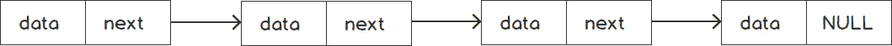
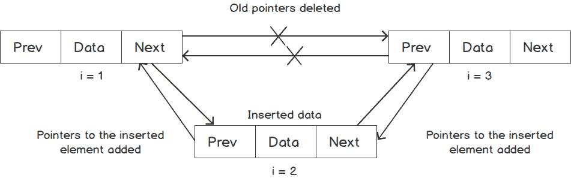

# 1。列表、堆栈和队列

## 学习目标

本章结束时，您将能够:

*   描述在任何应用程序中使用正确数据结构的重要性
*   根据问题，实现各种内置数据结构，使应用程序开发更加容易
*   如果 C++提供的数据结构对于用例来说不够好，那么实现适合给定情况的定制线性数据结构
*   分析实际问题，其中不同类型的线性数据结构是有帮助的，并决定哪一种最适合给定的用例

本章描述了在任何应用程序中使用正确数据结构的重要性。我们将学习如何在 C++中使用一些最常见的数据结构，以及使用这些结构的内置和定制容器。

## 简介

在设计任何应用程序时，数据管理都是需要牢记的最重要的考虑因素之一。任何应用程序的目的都是获取一些数据作为输入，对其进行处理或操作，然后提供合适的数据作为输出。例如，让我们考虑一个医院管理系统。在这里，我们可以有关于不同医生、病人和档案记录等的数据。医院管理系统应该允许我们执行各种操作，如接收病人，更新不同专业医生的加入和离开。虽然面向用户的界面将以与医院管理员相关的格式呈现信息，但在内部，系统将管理不同的记录和项目列表。

一个程序员可以使用几种结构来保存内存中的任何数据。为保存数据选择正确的结构，也称为**数据结构**，对于确保可靠性、性能和实现应用程序中所需的功能至关重要。除了正确的数据结构，正确选择算法来访问和操作数据对于应用程序的最佳行为也是必要的。这本书将使你有能力为你的应用程序设计实现正确的数据结构和算法，以使你能够开发良好优化和可扩展的应用程序。

本章介绍 C++中提供的基本和常用的线性数据结构。我们将看看他们各自的设计、优缺点。我们还将在练习的帮助下实现所述结构。了解这些数据结构将有助于您以更高性能、标准化、可读和可维护的方式管理任何应用程序中的数据。

线性数据结构可以大致分为连续或链接结构。让我们理解两者之间的区别。

## 连续与链接数据结构

在任何应用程序中处理数据之前，我们必须决定如何存储数据。这个问题的答案取决于我们想要对数据执行什么样的操作以及操作的频率。我们应该选择在延迟、内存或任何其他参数方面为我们提供最佳性能的实现，而不影响应用程序的正确性。

确定要使用的数据结构类型的一个有用指标是算法复杂度，也称为**时间复杂度**。时间复杂度表示执行某项操作所需的相对时间，与数据大小成比例。因此，时间复杂度显示了如果我们改变数据集的大小，时间将如何变化。对任何数据类型进行不同操作的时间复杂度取决于数据在其中的存储方式。

数据结构可以分为两种类型:连续数据结构和链接数据结构。在接下来的章节中，我们将仔细研究这两者。

### 连续数据结构

如前所述，**连续数据结构**将所有元素存储在单个内存块中。下图显示了数据如何存储在连续的数据结构中:


###### 图 1.1:连续数据结构的图示

在上图中，将较大的矩形视为存储所有元素的单个内存块，而较小的矩形表示为每个元素分配的内存。这里需要注意的一点是，所有的元素都是同一类型的。因此，它们都需要相同的内存量，如`sizeof(type)`所示。第一个元素的地址也被称为**基址** ( **BA** )。因为它们都是同一类型，所以下一个元素出现在`BA + sizeof(type)`位置，然后一个出现在`BA + 2 * sizeof(type)`位置，以此类推。因此，要访问索引`i`中的任何元素，我们可以使用通用公式:`BA + i * sizeof(type)`。

在这种情况下，我们总是可以使用公式立即访问任何元素，而不管数组的大小如何。因此，访问时间总是恒定的。这在大 O 符号中由 *O(1)* 表示。

数组的两种主要类型是静态和动态的。静态数组只在其声明块中有生存期，但是动态数组提供了更好的灵活性，因为程序员可以确定何时应该分配它，何时应该取消分配它。我们可以根据需要选择其中的任何一种。两者对于不同的操作具有相同的性能。由于这个数组是在 C 语言中引入的，所以它也被称为 C 风格的数组。以下是这些数组的声明方式:

*   静态数组被声明为`int arr[size];`。
*   C 中的一个动态数组被声明为`int* arr = (int*)malloc(size * sizeof(int));`。
*   一个动态数组在 C++中被声明为`int* arr = new int[size];`。

静态数组是聚合的，这意味着它是在堆栈上分配的，因此当流退出函数时会被解除分配。另一方面，一个动态数组被分配在一个堆上，并保持在那里，直到手动释放内存。

由于所有元素都是相邻的，因此当访问其中一个元素时，它旁边的一些元素也会被带入缓存。因此，如果您想访问这些元素，这是一个非常快速的操作，因为数据已经存在于缓存中。此属性也称为缓存局部性。虽然它不影响任何操作的渐近时间复杂度，但在遍历数组时，它可以在实践中为连续数据提供令人印象深刻的优势。由于遍历需要按顺序遍历所有元素，因此在获取第一个元素后，可以直接从缓存中检索接下来的几个元素。因此，该阵列被称为具有良好的缓存局部性。

### L 链接的数据结构

链接数据结构将数据保存在多个内存块(也称为节点)中，这些内存块可能位于内存中的不同位置。下图显示了数据如何存储在链接数据结构中:



###### 图 1.2:链接的数据结构

在链表的基本结构中，每个节点包含要存储在该节点中的数据和指向下一个节点的指针。最后一个节点包含一个`NULL`指针来指示列表的结束。要到达任何元素，我们必须从链表的开头，也就是头开始，然后跟随下一个指针，直到到达预期的元素。因此，要到达索引`i`处的元素，我们需要遍历链表并迭代`i`次。因此，我们可以说访问元素的复杂度是*O(n)*；也就是说，时间随着节点的数量成比例地变化。

如果我们想要插入或删除任何元素，并且如果我们有一个指向该元素的指针，那么与数组相比，对于链表来说，这个操作非常小而且非常快。让我们来看看在链表中插入一个元素是如何工作的。下图说明了在链表的两个元素之间插入一个元素的情况:


###### 图 1.3:将元素插入链表

对于插入，一旦我们构造了要插入的新节点，我们只需要重新排列链接，使得前面元素的下一个指针 *(i = 1)* 指向新元素 *(i = 2)* 而不是其当前元素 *(i = 3)* ，新元素的下一个指针 *(i = 2)* 指向当前元素的下一个元素 *(i = 3)* 。这样，新节点就成为链表的一部分。

类似地，如果我们想删除任何元素，我们只需要重新排列链接，以便要删除的元素不再与任何列表元素相连。然后，我们可以解除分配该元素，或者对其采取任何其他适当的操作。

链表根本不能提供缓存局部性，因为元素不是连续存储在内存中的。因此，如果不实际访问存储在当前元素中的指针，就没有办法将下一个元素带入缓存。因此，尽管理论上，它的遍历时间复杂度与数组相同，但实际上，它的性能很差。

下一节提供了连续数据结构和链接数据结构的比较摘要。

### Com 型坯

下表概括总结了链接数据结构和连续数据结构之间的重要区别:


###### 图 1.4:比较连续和链接数据结构的表格

下表包含有关各种参数的数组和链表的性能摘要:


###### 图 1.5:显示数组和链表的一些操作的时间复杂性的表格

对于任何应用程序，我们可以根据不同操作的要求和频率，选择数据结构或两者的组合。

数组和链表非常常见，广泛用于任何存储数据的应用程序。因此，这些数据结构的实现必须尽可能没有错误和高效。为了避免重新发明代码，C++提供了各种各样的结构，比如`std::array`、`std::vector`和`std::list`。我们将在接下来的章节中更详细地看到其中的一些。

### C 型数组的极限

虽然 C 风格的数组可以完成这项工作，但它们并不常用。有许多限制表明需要更好的解决方案。其中一些主要限制如下:

*   内存分配和释放必须手动处理。解除分配失败会导致内存泄漏，即内存地址变得不可访问。
*   `operator[]`函数不检查参数是否大于数组的大小。如果使用不当，这可能会导致分段错误或内存损坏。
*   嵌套数组的语法变得非常复杂，导致代码不可读。
*   深度复印不是默认功能。它必须手动实现。

为了避免这些问题，C++在名为`std::array`的 C 风格数组上提供了一个非常薄的包装器。

## 标准::数组

`std::array`自动分配和解除分配内存。`std::array`是一个模板化的类，它接受两个参数——元素的类型和数组的大小。

在下面的例子中，我们将声明大小为`10`的`int`的`std::array`，设置任何元素的值，然后打印该值以确保其有效:

```cpp
std::array<int, 10> arr;        // array of int of size 10
arr[0] = 1;                    // Sets the first element as 1
std::cout << "First element: " << arr[0] << std::endl;
std::array<int, 4> arr2 = {1, 2, 3, 4};
std::cout << "Elements in second array: ";
  for(int i = 0; i < arr.size(); i++)
    std::cout << arr2[i] << " ";
```

该示例将产生以下输出:

```cpp
First element: 1
Elements in second array: 1 2 3 4 
```

我们可以看到，`std::array`提供了`operator[]`，和 C 风格的数组一样，避免了检查索引是否小于数组大小的开销。此外，它还提供了一个名为`at(index)`的函数，如果参数无效，它会抛出一个异常。这样，我们可以以适当的方式处理异常。因此，如果我们有一段代码，其中我们将访问具有一点不确定性的元素，例如依赖于用户输入的数组索引，我们总是可以使用异常处理来捕获错误，如下例所示。

```cpp
try
{
    std::cout << arr.at(4);    // No error
    std::cout << arr.at(5);    // Throws exception std::out_of_range
}
catch (const std::out_of_range& ex)
{
    std::cerr << ex.what();
}
```

除此之外，将`std::array`传递给另一个函数类似于传递任何内置数据类型。我们可以通过值或引用传递它，有或没有`const`。此外，该语法不涉及任何指针相关操作或引用和去引用操作。因此，与 C 风格的数组相比，可读性要好得多，即使对于多维数组也是如此。下面的示例演示如何按值传递数组:

```cpp
void print(std::array<int, 5> arr)
{
    for(auto ele: arr)
    {
        std::cout << ele << ", ";
    }
}
std::array<int, 5> arr = {1, 2, 3, 4, 5};
print(arr);
```

该示例将产生以下输出:

```cpp
1, 2, 3, 4, 5
```

我们不能为这个函数传递任何其他大小的数组，因为数组的大小是函数参数的数据类型的一部分。所以，比如我们通过`std::array<int, 10>`，编译器会返回一个错误，说它不能匹配函数参数，也不能从一个转换到另一个。然而，如果我们想有一个通用函数，可以使用任何大小的`std::array`，我们可以为该函数模板化数组的大小，它将为数组的所有所需大小生成代码。因此，签名将如下所示:

```cpp
template <size_t N>
void print(const std::array<int, N>& arr)
```

除了可读性，在传递`std::array`的同时，默认情况下会将所有元素复制到一个新数组中。因此，执行自动深度复制。如果我们不想要那个特性，我们可以一直使用其他类型，比如 reference 和`const` reference。因此，它为程序员提供了更大的灵活性。

实际上，对于大多数操作来说，`std::array`提供了与 C 风格数组相似的性能，因为它只是一个薄薄的包装器，以减少程序员的工作量，并使代码更加安全。`std::array`提供两种不同的功能来访问数组元素–`operator[]`和`at()`。`operator[]`，类似于 C 风格的数组，不执行任何索引检查。但是，`at()`函数对索引进行检查，如果索引超出范围就会抛出异常。正因为如此，在实践中稍慢一些。

如前所述，迭代数组是一种非常常见的操作。`std::array`在循环和迭代器范围的帮助下，提供了一个非常好的界面。因此，打印数组中所有元素的代码如下所示:

```cpp
std::array<int, 5> arr = {1, 2, 3, 4, 5};
for(auto element: arr)
{
    std::cout << element << ' ';
}
```

该示例将显示以下输出:

```cpp
1 2 3 4 5 
```

在前面的例子中，当我们演示打印出所有的元素时，我们使用了一个索引变量进行迭代，在这里我们必须确保根据数组的大小正确使用它。因此，与此示例相比，它更容易出现人为错误。

我们能够使用基于范围的循环迭代`std::array`的原因是由于迭代器。`std::array`有名为`begin()`和`end()`的成员函数，返回一种访问第一个和最后一个元素的方式。为了从一个元素移动到下一个元素，它还提供了算术运算符，如增量运算符(`++`)和加法运算符(`+`)。因此，基于范围的`for`循环从`begin()`开始，在`end()`结束，使用增量操作符(`++`)一步步前进。迭代器为所有可动态迭代的 STL 容器提供了统一的接口，例如`std::array`、`std::vector`、`std::map`、`std::set`和`std::list`。

除了迭代器，我们需要在容器中指定位置的所有函数都是基于迭代器的；例如，在特定位置插入、删除范围内或特定位置的元素以及其他类似的功能。这使得代码更加可重用、可维护和可读。

#### 注意

对于 C++中所有借助迭代器指定范围的函数来说，`start()`迭代器通常是包含的，`end()`迭代器通常是排他的，除非另有说明。

因此，`array::begin()`函数返回一个指向第一个元素的迭代器，但是`array::end()`在最后一个元素之后返回一个迭代器。因此，基于范围的循环可以写成如下形式:

```cpp
for(auto it = arr.begin(); it != arr.end(); it++)
{
    auto element = (*it);
    std::cout << element << ' ';
}
```

还有一些其他形式的迭代器，比如`const_iterator`和`reverse_iterator`，也是相当有用的。`const_iterator`是普通迭代器的`const`版本。如果数组被声明为`const`，其与迭代器相关的函数，如`begin()`和`end()`，返回`const_iterator`。

`reverse_iterator`允许我们反向遍历数组。所以，它的函数，比如增量运算符(`++`)和`advance`，是普通迭代器的逆运算。

除了`operator[]`和`at()`功能，`std::array`还提供了其他访问器，如下表所示:


###### 图 1.6:显示 std::数组的一些访问器的表格

下面的代码片段演示了如何使用这些函数:

```cpp
std::array<int, 5> arr = {1, 2, 3, 4, 5};
std::cout << arr.front() << std::endl;       // Prints 1
std::cout << arr.back() << std::endl;        // Prints 5
std::cout << *(arr.data() + 1) << std::endl; // Prints 2
```

`std::array`提供的另一个有用的功能是用于深度比较的关系运算符和用于深度复制的复制分配运算符。所有尺寸运算符(`<`、`>`、`<=`、`>=`、`==`、`!=`)都是为`std::array`定义的，以比较两个数组，前提是也为底层类型的`std::array`提供相同的运算符。

c 风格的数组也支持所有的关系运算符，但是这些运算符实际上并不比较数组内部的元素；事实上，他们只是比较指针。因此，只是将元素的地址作为整数进行比较，而不是对数组进行深度比较。这也叫一个**浅比较**，实际用处不大。同样，赋值也不会创建已赋值数据的副本。相反，它只是生成一个指向相同数据的新指针。

#### 注意

关系运算符仅适用于相同大小的`std::array`。这是因为数组的大小是数据类型本身的一部分，它不允许比较两种不同数据类型的值。

在下面的例子中，我们将看到如何包装一个 C 风格的数组，它的大小由用户定义。

### 练习 1:实现动态大小的数组

让我们写一个小应用程序来管理学校的学生记录。一个班级的学生人数和他们的详细情况将作为输入给出。编写一个类似数组的容器来管理数据，这样也可以支持动态调整大小。我们还将实现一些实用函数来合并不同的类。

执行以下步骤完成练习:

1.  首先，包含所需的标题:

    ```cpp
    #include <iostream>
    #include <sstream>
    #include <algorithm>
    ```

2.  现在，让我们编写一个名为`dynamic_array`的基本模板化结构，以及主数据成员:

    ```cpp
    template <typename T>
    class dynamic_array
    {
        T* data;
        size_t n;
    ```

3.  现在，让我们添加一个构造函数，它采用数组的大小并复制它:

    ```cpp
    public:
    dynamic_array(int n)
    {
        this->n = n;
        data = new T[n];
    }
        dynamic_array(const dynamic_array<T>& other)
      {
        n = other.n;
        data = new T[n];
        for(int i = 0; i < n; i++)
        data[i] = other[i];
      }
    ```

4.  现在，让我们在`public`访问器中添加`operator[]`和`function()`，以支持直接访问数据，类似于`std::array` :

    ```cpp
    T& operator[](int index)
    {
        return data[index];
    }
    const T& operator[](int index) const
    {
        return data[index];
    }
    T& at(int index)
    {
        if(index < n)
        return data[index];
        throw "Index out of range";
    }
    ```

5.  现在，让我们添加一个名为`size()`的函数来返回数组的大小，以及一个析构函数来避免内存泄漏:

    ```cpp
    size_t size() const
    {
        return n;
    }
    ~dynamic_array()
    {
        delete[] data;   // A destructor to prevent memory leak
    }
    ```

6.  现在，让我们添加迭代器函数来支持基于范围的循环来迭代`dynamic_array` :

    ```cpp
    T* begin()
    {
        return data;
    }
    const T* begin() const
    {
        return data;
    }
    T* end()
    {
        return data + n;
    }
    const T* end() const
    {
        return data + n;
    }
    ```

7.  现在，让我们添加一个函数，使用`+`运算符将一个数组追加到另一个数组中。让我们保持它作为一个`friend`功能，以获得更好的可用性:

    ```cpp
    friend dynamic_array<T> operator+(const dynamic_array<T>& arr1, dynamic_array<T>& arr2)
    {
        dynamic_array<T> result(arr1.size() + arr2.size());
        std::copy(arr1.begin(), arr1.end(), result.begin());
        std::copy(arr2.begin(), arr2.end(), result.begin() + arr1.size());
        return result;
    }
    ```

8.  现在，让我们添加一个`to_string`函数，该函数以分隔符作为参数，默认值为“`,`”:

    ```cpp
    std::string to_string(const std::string& sep = ", ")
    {
      if(n == 0)
        return "";
      std::ostringstream os;
      os << data[0];
      for(int i = 1; i < n; i++)
        os << sep << data[i];
      return os.str();
    }
    };
    ```

9.  现在，让我们为学生添加一个`struct`。为了简单起见，我们只保留名字和标准(即学生学习的年级/班级)，并添加`operator<<`以正确打印:

    ```cpp
    struct student
    {
        std::string name;
        int standard;
    };
    std::ostream& operator<<(std::ostream& os, const student& s)
    {
        return (os << "[Name: " << s.name << ", Standard: " << s.standard << "]");
    }
    ```

10.  现在，让我们添加一个`main`函数来使用这个数组:

    ```cpp
    int main()
    {
        int nStudents;
        std::cout << "Enter number of students in class 1: ";
        std::cin >> nStudents;
    dynamic_array<student> class1(nStudents);
    for(int i = 0; i < nStudents; i++)
    {
        std::cout << "Enter name and class of student " << i + 1 << ": ";
        std::string name;
        int standard;
        std::cin >> name >> standard;
        class1[i] = student{name, standard};
    }
    // Now, let's try to access the student out of range in the array
    try
    {
        class1[nStudents] = student{"John", 8};  // No exception, undefined behavior
        std::cout << "class1 student set out of range without exception" << std::endl;
        class1.at(nStudents) = student{"John", 8};  // Will throw exception
    }
    catch(...)
    {
    std::cout << "Exception caught" << std::endl;
    }
    auto class2 = class1;  // Deep copy
        std::cout << "Second class after initialized using first array: " << class2.to_string() << std::endl;
        auto class3 = class1 + class2;
        // Combines both classes and creates a bigger one
        std::cout << "Combined class: ";
        std::cout << class3.to_string() << std::endl;
        return 0;
    }
    ```

11.  Execute the preceding code with three students – `Raj(8)`, `Rahul(10)`, and `Viraj(6)` as input. The output looks like the following in the console:

    ```cpp
    Enter number of students in class 1 : 3
    Enter name and class of student 1: Raj 8
    Enter name and class of student 2: Rahul 10
    Enter name and class of student 3: Viraj 6
    class1 student set out of range without exception
    Exception caught
    Second class after initialized using first array : [Name: Raj, Standard: 8], [Name: Rahul, Standard: 10], [Name: Viraj, Standard: 6]
    Combined class : [Name: Raj, Standard: 8], [Name: Rahul, Standard: 10], [Name: Viraj, Standard: 6], [Name: Raj, Standard: 8], [Name: Rahul, Standard: 10], [Name: Viraj, Standard: 6]
    ```

    这里提到的大部分功能都有类似于`std::array`的实现。

既然我们已经看到了各种容器，我们将在下面的练习中学习如何实现一个可以接受任何类型的数据并以通用形式存储它的容器。

### 练习 2:通用快速数据存储容器构建器

在本练习中，我们将编写一个函数，该函数接受任意类型的任意数量的元素，这些元素又可以转换为一个公共类型。该函数还应该返回一个容器，该容器将所有元素转换为通用类型，并且遍历速度应该很快:

1.  让我们从包含所需的库开始:

    ```cpp
    #include <iostream>
    #include <array>
    #include <type_traits>
    ```

2.  First, we'll try to build the signature of the function. Since the return type is a container that is fast to traverse, we'll go ahead with `std::array`. To allow any number of parameters, we'll use variadic templates:

    ```cpp
    template<typename ... Args>
    std::array<?,?> build_array(Args&&... args)
    ```

    考虑到返回类型的容器应该快速遍历的要求，我们可以选择数组或向量。由于元素的数量是在编译时根据函数的参数数量已知的，我们可以继续`std::array`。

3.  现在，我们必须为`std::array`提供元素的类型和元素的数量。我们可以使用`std::common_type`模板找出`std::array`内部的元素类型。由于这取决于参数，我们将提供函数的返回类型作为尾随类型:

    ```cpp
    template<typename ... Args>
    auto build_array(Args&&... args) -> std::array<typename std::common_type<Args...>::type, ?>
    {
        using commonType = typename std::common_type<Args...>::type;
        // Create array
    }
    ```

4.  如前面的代码所示，我们现在需要弄清楚两件事——元素的数量，以及如何用`commonType` :

    ```cpp
    template< typename ... Args>
    auto build_array(Args&&... args) -> std::array<typename std::common_type<Args...>::type, sizeof...(args)>
    {
        using commonType = typename std::common_type<Args...>::type;
        return {std::forward<commonType>(args)...};
    }
    ```

    创建数组
5.  现在，让我们编写`main`函数，看看我们的函数是如何工作的:

    ```cpp
    int main()
    {
        auto data = build_array(1, 0u, 'a', 3.2f, false);
        for(auto i: data)
            std::cout << i << " ";
        std::cout << std::endl;
    }
    ```

6.  Running the code should give the following output:

    ```cpp
    1 0 97 3.2 0
    ```

    正如我们所看到的，所有的最终输出都是以 float 的形式，因为一切都可以转换成 float。

7.  To test this further, we can add the following inside the `main` function and test the output:

    ```cpp
    auto data2 = build_array(1, "Packt", 2.0);
    ```

    通过这种修改，我们应该会得到一个错误，说所有的类型都不能转换成一个公共类型。确切的错误消息应该提到模板推导失败。这是因为没有单一的类型可以同时转换字符串和数字。

构建 r 函数，比如我们在本练习中创建的函数，可以在您不确定数据类型时使用，但您需要优化效率。

有很多有用的特性和实用功能`std::array`没有提供。这样做的一个主要原因是，与 C 风格的阵列相比，保持类似或更好的性能和内存要求。

为了更高级的特性和灵活性，C++提供了另一种称为`std::vector`的结构。我们将在下一节研究这是如何工作的。

## 标准::矢量

正如我们前面看到的，`std::array`是对 C 风格数组的一个很好的改进。但是`std::array`也有一些局限性，它在编写应用程序的时候缺少一些常用用例的功能。以下是`std::array`的一些主要缺点:

*   `std::array`的大小必须是常量，在编译时提供，并且是固定的。所以，我们不能在运行时改变它。
*   由于大小限制，我们无法在数组中插入或移除元素。
*   `std::array`不能自定义分配。它总是使用堆栈内存。

在大多数实际应用中，数据是动态的，而不是固定的大小。例如，在我们前面的医院管理系统的例子中，我们可以有更多的医生加入医院，我们可以有更多的紧急病人，等等。因此，提前知道数据的大小并不总是可能的。所以，`std::array`并不总是最好的选择，我们需要有动态大小的东西。

现在，我们来看看`std::vector`是如何为这些问题提供解决方案的。

### 标准::v 矢量–可变长度阵列

正如标题所示，`std::vector`解决了数组最突出的问题之一——固定大小。`std::vector`初始化时不需要我们提供它的长度。

以下是初始化向量的一些方法:

```cpp
std::vector<int> vec;
// Declares vector of size 0
std::vector<int> vec = {1, 2, 3, 4, 5};
// Declares vector of size 5 with provided elements
std::vector<int> vec(10);
// Declares vector of size 10
std::vector<int> vec(10, 5);
// Declares vector of size 10 with each element's value = 5
```

正如我们从第一次初始化中看到的，提供大小不是强制性的。如果我们没有显式地指定大小，并且如果我们没有通过指定它的元素来推断它，则根据编译器的实现，用元素的容量来初始化向量。术语“大小”是指向量中实际存在的元素的数量，这可能与其容量不同。因此，对于第一次初始化，大小将为零，但容量可能是一些小数字或零。

我们可以使用`push_back`或`insert`函数在向量中插入元素。`push_back`将在末尾插入元素。`insert`将迭代器作为位置的第一个参数，可以用来在任意位置插入元素。`push_back`是一个非常常用的向量函数，因为它的性能。`push_back`算法的伪代码如下:

```cpp
push_back(val):
    if size < capacity
    // If vector has enough space to accommodate this element
    - Set element after the current last element = val
    - Increment size
    - return; 
    if vector is already full
    - Allocate memory of size 2*size
    - Copy/Move elements to newly allocated memory
    - Make original data point to new memory
    - Insert the element at the end
```

实际的实现可能有点不同，但是逻辑保持不变。我们可以看到，如果有足够的空间，只需要 *O(1)* 时间就可以在后面插入东西。然而，如果没有足够的空间，它将不得不复制/移动所有元素，这将花费 *O(n)* 时间。每次容量用完时，大多数实现都会将向量的大小增加一倍。因此， *O(n)* 时间操作在 n 个元素之后进行。因此，平均而言，它只需多走一步，使其平均时间复杂度更接近 *O(1)* 。实际上，这提供了相当好的性能，因此，它是一个高使用率的容器。

对于`insert`函数，除了将给定迭代器之后的元素向右移动之外，您别无选择。`insert`功能为我们做到了这一点。每当需要时，它还负责重新分配。由于需要移动元素，需要 *O(n)* 时间。以下示例演示如何实现向量插入函数。

考虑一个具有前五个自然数的向量:

```cpp
std::vector<int> vec = {1, 2, 3, 4, 5};
```

#### 注意

矢量没有`push_front`功能。它具有通用的`insert`函数，该函数将迭代器作为位置的参数。

通用的`insert`功能可以用来在前面插入一个元素，如下所示:

```cpp
vec.insert(int.begin(), 0);
```

让我们再看几个`push_back`和`insert`函数的例子:

```cpp
std::vector<int> vec;
// Empty vector {}
vec.push_back(1);
// Vector has one element {1}
vec.push_back(2);
// Vector has 2 elements {1, 2}
vec.insert(vec.begin(), 0);
// Vector has 3 elements {0, 1, 2}
vec.insert(find(vec.begin(), vec.end(), 1), 4);
// Vector has 4 elements {0, 4, 1, 2}
```

如前面的代码所示，`push_back`在末尾插入一个元素。此外，`insert`功能将插入位置作为参数。它采用迭代器的形式。因此，`begin()`功能允许我们在开头插入一个元素。

现在我们已经了解了正常的插入函数，让我们来看看一些更好的替代方法，与`push_back`和`insert`函数相比，矢量可以使用。`push_back`和`insert`的缺点之一是，它们首先构造元素，然后将元素复制或移动到向量缓冲区内的新位置。这个操作可以通过在新位置调用新元素的构造函数来优化，这可以通过`emplace_back`和`emplace`函数来完成。为了获得更好的性能，建议您使用这些函数而不是普通的插入函数。因为我们正在构造元素，我们只需要传递构造函数参数，而不是构造值本身。然后，该函数将负责将参数转发到适当位置的构造函数。

`std::vector`还提供了`pop_back`和`erase`功能，可以移除其中的元素。`pop_back`从向量中移除最后一个元素，有效地将大小减少一。`erase`有两个重载——移除迭代器提供的指向它的单个元素，以及移除迭代器提供的元素范围，其中该范围是通过定义要移除的第一个元素(包含)和要移除的最后一个元素(排除)来定义的。C++标准不需要这些函数来减少向量的容量。这完全取决于编译器的实现。`pop_back`不需要任何元素的重新排列，因此可以很快完成。其复杂度为 *O(1)* 。然而，`erase`需要移动元素，因此需要 *O(n)* 时间。在下面的练习中，我们将看到这些功能是如何实现的。

现在，让我们看一下关于以不同方式从向量中移除元素的示例:

考虑一个有 10 个元素的向量–`{0, 1, 2, 3, 4, 5, 6, 7, 8, 9}`:

```cpp
vec.pop_back();
// Vector has now 9 elements {0, 1, 2, 3, 4, 5, 6, 7, 8}
vec.erase(vec.begin());
// vector has now 7 elements {1, 2, 3, 4, 5, 6, 7, 8}
vec.erase(vec.begin() + 1, vec.begin() + 4);
// Now, vector has 4 elements {1, 5, 6, 7, 8}
```

现在，让我们看看其他一些有用的功能:

*   `clear()`:这个函数只是通过移除所有元素来清空向量。
*   `reserve(capacity)`:该功能用于指定矢量的容量。如果指定为参数的值大于当前容量，它将重新分配内存，新容量将等于参数。但是，对于所有其他情况，它不会影响向量的容量。这个函数不修改向量的大小。
*   `shrink_to_fit()`:这个功能可以用来释放多余的空间。调用此函数后，大小和容量变得相等。当我们不期望向量的大小进一步增加时，可以使用这个函数。

### 为标准向量分配参数:

`std::vector`通过允许我们在数据类型之后传递一个分配器作为模板参数，解决了`std::array`关于自定义分配器的缺点。

为了使用定制分配器，我们遵循某些概念和接口。由于向量在与内存访问相关的大多数行为中使用分配器函数，我们需要将这些函数作为分配器的一部分提供–`allocate`、`deallocate`、`construct`和`destroy`。这个分配器必须负责内存分配、解除分配和处理，以免损坏任何数据。对于依赖自动内存管理的高级应用程序来说，机制可能太昂贵，并且应用程序有自己的内存池或类似的资源，必须使用它们来代替默认的堆内存，客户分配器非常方便。

因此矿石，`std::vector`是`std::array`的一个很好的替代品，在大小、生长和其他方面提供了更多的灵活性。渐近地，阵列的所有相似函数都具有与向量相同的时间复杂度。我们通常只为额外的功能支付额外的性能成本，这是相当合理的。对于一般情况，向量的性能离数组不远。因此，在实践中，`std::vector`是 C++中最常用的 STL 容器之一，因为它具有灵活性和性能。

## 标准::f 前进 _ 列表

到目前为止，我们只看到了类似数组的结构，但是，正如我们所看到的，数据结构中间的插入和删除对于连续的数据结构来说是非常低效的操作。这就是类似链表的结构出现的地方。许多应用程序需要频繁地在数据结构中间插入和删除。例如，任何具有多个选项卡的浏览器都可以在任何时间点和任何位置添加额外的选项卡。同样，任何音乐播放器都会有一个循环播放的歌曲列表，你也可以在中间插入任何歌曲。在这种情况下，我们可以使用链表结构来获得良好的性能。我们将在*活动 1* 、*实现歌曲播放列表*中看到音乐播放器的用例。现在，让我们探索 C++为我们提供了什么样的容器。

链表的基本结构要求我们有一个指针，并使用`new`和`delete`运算符手动管理内存分配和解除分配。虽然不难，但会导致难以追踪的 bug。因此，就像`std::array`为 C 风格的数组提供了一个薄包装一样，`std::forward_list`为基本链表提供了一个薄包装。

`std::forward_list`的目的是提供一些额外的功能，与基本的链表相比不会影响性能。为了保持性能，它不提供函数来获取列表的大小或直接获取第一个元素以外的任何元素。因此，它有一个名为`front()`的函数来获取对第一个元素的引用，但没有像`back()`那样访问最后一个元素。它确实为常见操作提供了功能，如插入、删除、反向和拼接。这些函数不会影响基本链表的内存需求或性能。

另外，和`std::vector`一样，`std::forward_list`如果需要也可以将自定义分配器作为第二个模板参数。因此，我们可以轻松地将其用于受益于自定义内存管理的高级应用程序。

### 在转发列表中插入和删除元素

`std:: forward_list`提供`push_front`和`insert_after`功能，可用于在链表中插入元素。与向量的插入函数相比，这两者略有不同。`push_front`用于在前面插入元素。由于`forward_list`不能直接访问最后一个元素，所以它不提供`push_back`功能。对于特定位置的插入，我们使用`insert_after`代替`insert`。这是因为在链表中插入一个元素需要更新元素的下一个指针，之后我们要插入一个新元素。如果我们只提供迭代器，在那里我们想要插入一个新元素，我们不能快速访问前一个元素，因为在`forward_list`中不允许向后遍历。

由于这是一种基于指针的机制，我们并不需要在插入过程中移动元素。因此，与任何基于数组的结构相比，这两个插入函数都要快得多。这两个函数只是修改指针，以便在指定位置插入新元素。该操作不依赖于列表的大小，因此时间复杂度为 *O(1)* 。我们将在下面的练习中研究这些功能的实现。

现在，让我们看看如何在链表中插入元素:

```cpp
std::forward_list<int> fwd_list = {1, 2, 3};
fwd_list.push_front(0);
// list becomes {0, 1, 2, 3}
auto it = fwd_list.begin();
fwd_list.insert_after(it, 5);
// list becomes {0, 5, 1, 2, 3}
fwd_list.insert_after(it, 6);
// list becomes {0, 6, 5, 1, 2, 3}
```

`forward_list`还提供了`emplace_front`和`emplace_after`，类似于矢量的`emplace`。这两个函数的作用与插入函数相同，但通过避免额外的复制和移动，效率更高。

`forward_list`还具有删除元素的`pop_front`和`erase_after`功能。`pop_front`，顾名思义，去掉了第一个元素。由于不需要任何换挡，实际操作起来相当快，时间复杂度为 *O(1)* 。`erase_after`有两个重载——移除单个元素(通过对其前一个元素使用迭代器)，以及移除一个范围内的多个元素(通过对该范围第一个元素之前的元素使用迭代器，对最后一个元素使用另一个迭代器)。

`erase_after`函数的时间复杂度与被擦除的元素数量成线性关系，因为元素的删除不能通过释放单个内存块来完成。由于所有的节点分散在内存中的随机位置，函数需要分别释放它们。

现在，让我们看看如何从列表中删除这些元素:

```cpp
std::forward_list<int> fwd_list = {1, 2, 3, 4, 5};
fwd_list.pop_front();
// list becomes {2, 3, 4, 5}
auto it = fwd_list.begin();
fwd_list.erase_after(it);
// list becomes {2, 4, 5}
fwd_list.erase_after(it, fwd_list.end());
// list becomes {2}
```

让我们在下一节中探索我们可以使用`forward_list`进行哪些其他操作。

### 转发列表上的其他操作

除了`erase`函数根据迭代器确定的位置删除元素外，`forward_list`还提供了`remove`和`remove_if`函数根据元素的值删除元素。`remove`函数接受一个参数——要删除的元素的值。它会根据为值类型定义的相等运算符，移除与给定元素匹配的所有元素。如果没有相等运算符，编译器不允许我们调用该函数，并抛出编译错误。由于`remove`只删除基于等式运算符的元素，所以不能使用它来删除基于其他条件的元素，因为我们不能在定义一次等式运算符后更改它。对于有条件的移除，`forward_list`提供`remove_if`功能。它以谓词为参数，谓词是以值类型的元素为参数的函数，以布尔值为返回值。因此，谓词返回 true 的所有元素都将从列表中删除。在最新的 C++版本中，我们也可以很容易地用 lambdas 指定谓词。下面的练习将帮助您理解如何实现这些功能。

### 练习 3:使用 remove_if 从链接列表中有条件地移除元素

在本练习中，我们将使用一些印度公民在选举期间的样本信息，并根据他们的年龄从选民名册中删除不符合资格的公民。为了简单起见，我们只存储公民的姓名和年龄。

我们将数据存储在链表中，并使用`remove_if`移除所需的元素，这提供了一种移除满足特定条件的元素的方法，而不是定义要移除的元素的位置:

1.  让我们首先包含所需的标题，并添加`struct citizen` :

    ```cpp
    #include <iostream>
    #include <forward_list>
    struct citizen
    {
        std::string name;
        int age;
    };
    std::ostream& operator<<(std::ostream& os, const citizen& c)
    {
        return (os << "[Name: " << c.name << ", Age: " << c.age << "]");
    }
    ```

2.  现在，让我们编写一个`main`函数，并在一个`std::forward_list`中初始化几个公民。我们还将复制它，以避免再次初始化:

    ```cpp
    int main()
    {
      std::forward_list<citizen> citizens = {{"Raj", 22}, {"Rohit", 25}, {"Rohan", 17}, {"Sachin", 16}};
      auto citizens_copy = citizens;
      std::cout << "All the citizens: ";
      for (const auto &c : citizens)
          std::cout << c << " ";
      std::cout << std::endl;
    ```

3.  Now, let's remove all of the ineligible citizens from the list:

    ```cpp
    citizens.remove_if(
        [](const citizen& c)
        {
            return (c.age < 18);
        });
    std::cout << "Eligible citizens for voting: ";
    for(const auto& c: citizens)
        std::cout << c << " ";
    std::cout << std::endl;
    ```

    `remove_if`函数移除给定谓词为真的所有元素。这里，我们提供了一个λ，因为条件非常简单。如果这是一个复杂的条件，我们还可以编写一个普通的函数，该函数接受底层类型列表的一个参数并返回一个布尔值。

4.  Now, let's find out who'll be eligible for voting next year:

    ```cpp
    citizens_copy.remove_if(
        [](const citizen& c)
        {
        // Returns true if age is less than 18
            return (c.age != 17);
        });
    std::cout << "Citizens that will be eligible for voting next year: ";
    for(const auto& c: citizens_copy)
        std::cout << c << " ";
    std::cout << std::endl;
    }
    ```

    如你所见，我们只保留那些 17 岁的公民。

5.  进行练习。你应该得到这样的输出:

    ```cpp
    All the citizens: [Name: Raj, Age: 22] [Name: Rohit, Age: 25] [Name: Rohan, Age: 17] [Name: Sachin, Age: 16] 
    Eligible citizens for voting: [Name: Raj, Age: 22] [Name: Rohit, Age: 25] 
    Citizens that will be eligible for voting next year: [Name: Rohan, Age: 17] 
    ```

`remove_if`函数的时间复杂度为 *O(n)* ，因为它只需遍历列表一次，同时根据需要移除所有元素。如果我们想要移除具有特定值的元素，我们可以使用另一个版本的`remove`，它只需获取对象的一个参数，并从列表中移除与给定值匹配的所有对象。它还要求我们为给定的类型实现`==`运算符。

`forward_list`还提供了`sort`功能对数据进行排序。所有与数组相关的结构都可以通过一个通用函数`std::sort(first iterator, last iterator)`进行排序。然而，它不能被基于链表的结构使用，因为我们不能随机访问任何数据。这也使得`forward_list`提供的迭代器不同于数组或向量的迭代器。我们将在下一节更详细地了解这一点。作为`forward_list`的一部分提供的`sort`功能有两个过载–`sort`基于小于运算符(`<`)和`sort`基于作为参数提供的比较器。默认的`sort`功能使用`std::less<value_type>`进行比较。如果第一个参数小于第二个参数，它只返回`true`，因此，需要我们为自定义类型定义小于运算符(`<`)。

除此之外，如果我们想基于一些其他参数进行比较，我们可以使用参数重载，它采用二进制谓词。这两种过载都具有线性时间复杂度-*0(n×log n)*。以下示例演示了`sort`的两种重载:

```cpp
std::forward_list<int> list1 = {23, 0, 1, -3, 34, 32};
list1.sort();
// list becomes {-3, 0, 1, 23, 32, 34}
list1.sort(std::greater<int>());
// list becomes {34, 32, 23, 1, 0, -3}
```

这里，`greater<int>`是标准本身提供的一个谓词，它是大于运算符(`>`)的包装器，将元素按降序排序，从列表的值中我们可以看到这一点..

`forward_list`提供的其他功能有`reverse`和`unique`。`reverse`功能只是在与列表中存在的元素数量成线性关系的持续时间内颠倒元素的顺序，即时间复杂度为 *O(n)* 。`unique`函数仅保留列表中的唯一元素，并移除除第一个之外的所有重复值函数。因为它依赖于元素的相等性，所以它有两个重载——第一个重载不带参数，对值类型使用相等运算符，而第二个重载使用带有两个值类型参数的二元谓词。`unique`函数的时间复杂度是线性的。因此，它不会将每个元素与其他元素进行比较。相反，它只比较连续的元素是否相等，如果后者与基于默认或自定义二进制谓词的前者相同，则删除后者。因此，要使用`unique`函数从列表中移除所有唯一的元素，我们需要在调用函数之前对元素进行排序。在给定谓词的帮助下，`unique`会将所有元素与其相邻元素进行比较，如果谓词返回`true`，则移除后面的元素。

现在让我们看看如何使用列表的`reverse`、`sort`和`unique`功能:

```cpp
std::forward_list<int> list1 = {2, 53, 1, 0, 4, 10};
list1.reverse();
// list becomes {2, 53, 1, 0, 4, 10}
list1 = {0, 1, 0, 1, -1, 10, 5, 10, 5, 0};
list1.sort();
// list becomes {-1, 0, 0, 0, 1, 1, 5, 5, 10, 10}
list1.unique();
// list becomes {-1, 0, 1, 5, 10}
list1 = {0, 1, 0, 1, -1, 10, 5, 10, 5, 0};
list1.sort();
// list becomes {-1, 0, 0, 0, 1, 1, 5, 5, 10, 10}
```

如果元素比先前有效的元素至少大 2，则以下示例将移除这些元素:

```cpp
list1.unique([](int a, int b) { return (b - a) < 2; });
// list becomes {-1, 1, 5, 10}
```

#### 注意

在调用`unique`函数之前，程序员必须确保数据已经排序。因此，我们在它前面调用`sort`函数。`unique`功能将元素与已经满足条件的前一个元素进行比较。此外，它总是保留原始列表的第一个元素。因此，总有一个可以比较的因素。

在下一节中，我们将看看`forward_list`迭代器与向量/数组迭代器有何不同。

## 迭代〔t0〕之外

您可能已经注意到，在一些数组和向量的例子中，我们给迭代器添加了数字。迭代器就像指针，但是它们也为 STL 容器提供了一个公共接口。对这些迭代器的操作严格基于迭代器的类型，这取决于容器。向量和数组的迭代器在功能上是最灵活的。由于数据的连续性质，我们可以使用`operator[]`基于其位置直接从容器中访问任何元素。这个迭代器也被称为随机访问迭代器。但是对于`forward_list`来说，没有直接的方法可以遍历回去，甚至从一个节点到它的前一个节点，而不从头开始。因此，唯一允许的算术运算符是增量。这个迭代器也被称为前向迭代器。

根据迭代器的类型，我们还可以使用其他实用函数，如`advance`、`next`和`prev`。`next`和`prev`取一个迭代器和一个距离值，然后返回指向与给定迭代器有给定距离的元素的迭代器。如果给定的迭代器支持该操作，这将按预期工作。例如，如果我们试图将`prev`函数与`forward`迭代器一起使用，它将抛出一个编译错误，因为这个迭代器是向前迭代器，只能向前移动。这些函数花费的时间取决于所用迭代器的类型。所有这些都是随机访问迭代器的常数时间函数，因为加法和减法是常数时间操作。对于其余的迭代器，它们都与需要向前或向后遍历的距离成线性关系。我们将在下面的练习中使用这些迭代器。

### 练习 4:探索不同类型的迭代器

假设我们有过去几年新加坡 F1 大奖赛的获胜者名单。借助向量迭代器，我们将发现如何从这些数据中检索有用的信息。之后，我们将尝试用`forward_list`做同样的事情，看看它与向量迭代器有什么不同:

1.  让我们首先包括标题:

    ```cpp
    #include <iostream>
    #include <forward_list>
    #include <vector>
    int main()
    {
    ```

2.  让我们写一个带有赢家列表的向量:

    ```cpp
    std::vector<std::string> vec = {"Lewis Hamilton", "Lewis Hamilton", "Nico Roseberg", "Sebastian Vettel", "Lewis Hamilton", "Sebastian Vettel", "Sebastian Vettel", "Sebastian Vettel", "Fernando Alonso"};
    auto it = vec.begin();       // Constant time
    std::cout << "Latest winner is: " << *it << std::endl;
    it += 8;                    // Constant time
    std::cout << "Winner before 8 years was: " << *it << std::endl;
    advance(it, -3);            // Constant time
    std::cout << "Winner before 3 years of that was: " << *it << std::endl;
    ```

3.  让我们对`forward_list`迭代器进行同样的尝试，看看它们与向量迭代器有什么不同:

    ```cpp
    std::forward_list<std::string> fwd(vec.begin(), vec.end());
    auto it1 = fwd.begin();
    std::cout << "Latest winner is: " << *it << std::endl;
    advance(it1, 5);   // Time taken is proportional to the number of elements
    std::cout << "Winner before 5 years was: " << *it << std::endl;
    // Going back will result in compile time error as forward_list only allows us to move towards the end.
    // advance(it1, -2);      // Compiler error
    }
    ```

4.  运行本练习应产生以下输出:

    ```cpp
    Latest winner is : Lewis Hamilton
    Winner before 8 years was : Fernando Alonso
    Winner before 3 years of that was : Sebastian Vettel
    Latest winner is : Sebastian Vettel
    Winner before 5 years was : Sebastian Vettel
    ```

5.  Now, let's see what happens if we add a number to this iterator by putting the following line inside the `main` function at the end:

    ```cpp
    it1 += 2;
    ```

    我们将收到类似如下的错误消息:

    ```cpp
    no match for 'operator+=' (operand types are std::_Fwd_list_iterator<int>' and 'int')
    ```

我们在本练习中探索的各种迭代器对于从数据集中轻松获取任何数据非常有用。

正如我们所看到的，`std::array`是 C 风格数组上的一个薄包装器，`std::forward_list`只不过是一个单链表上的一个薄包装器。它提供了一个简单且不易出错的界面，不会影响性能或内存。

除此之外，因为我们可以直接访问向量中的任何元素，所以向量迭代器上的加减运算是 *O(1)* 。另一方面，`forward_list`只支持通过遍历元素来访问元素。因此，它的迭代器的加法运算是 *O(n)* ，其中 n 是我们前进的步数。

在下面的练习中，我们将制作一个自定义容器，其工作方式类似于`std::forward_list`，但有一些改进。我们将定义许多等同于`forward_list`函数的函数。它还应该帮助你理解这些功能是如何在引擎盖下工作的。

### 练习 5:构建基本定制容器

在本练习中，我们将实现一个带有一些改进的`std::forward_list`等效容器。我们将从一个名为`singly_ll`的基本实现开始，并逐渐改进:

1.  让我们添加所需的头，然后从单个节点的基本实现`singly_ll`开始:

    ```cpp
    #include <iostream>
    #include <algorithm>
    struct singly_ll_node
    {
        int data;
        singly_ll_node* next;
    };
    ```

2.  现在，我们将实现实际的`singly_ll`类，它将节点包装起来以便更好地接口:

    ```cpp
    class singly_ll
    {
    public:
        using node = singly_ll_node;
        using node_ptr = node*;
    private:
        node_ptr head;
    ```

3.  现在，让我们添加`push_front`和`pop_front`，就像在`forward_list`中一样:

    ```cpp
    public:
    void push_front(int val)
    {
        auto new_node = new node{val, NULL};
        if(head != NULL)
            new_node->next = head;
        head = new_node;
    }
    void pop_front()
    {
        auto first = head;
        if(head)
        {
            head = head->next;
            delete first;
        }
        else
            throw "Empty ";
    }
    ```

4.  现在让我们为我们的`singly_ll`类实现一个基本的迭代器，带有构造函数和访问函数:

    ```cpp
    struct singly_ll_iterator
    {
    private:
        node_ptr ptr;
    public:
        singly_ll_iterator(node_ptr p) : ptr(p)
        {
    }
    int& operator*()
    {
        return ptr->data;
    }
    node_ptr get()
    {
        return ptr;
    }
    ```

5.  让我们添加增量前和增量后的`operator++`功能:

    ```cpp
    singly_ll_iterator& operator++()     // pre-increment
    {
            ptr = ptr->next;
            return *this;
    }
    singly_ll_iterator operator++(int)    // post-increment
    {
        singly_ll_iterator result = *this;
    ++(*this);
    return result;
    }
    ```

6.  让我们添加等式运算作为`friend`函数:

    ```cpp
        friend bool operator==(const singly_ll_iterator& left, const singly_ll_iterator& right)
        {
            return left.ptr == right.ptr;
        }
        friend bool operator!=(const singly_ll_iterator& left, const singly_ll_iterator& right)
        {
            return left.ptr != right.ptr;
        }
    };
    ```

7.  让我们跳回我们的链表类。现在我们已经有了迭代器类，让我们实现`begin`和`end`函数来简化遍历。我们还将为两者添加`const`版本:

    ```cpp
    singly_ll_iterator begin()
    {
        return singly_ll_iterator(head);
    }
    singly_ll_iterator end()
    {
        return singly_ll_iterator(NULL);
    }
    singly_ll_iterator begin() const
    {
        return singly_ll_iterator(head);
    }
    singly_ll_iterator end() const
    {
        return singly_ll_iterator(NULL);
    }
    ```

8.  让我们实现一个默认构造函数，一个用于深度复制的复制构造函数，以及一个带有`initializer_list` :

    ```cpp
    singly_ll() = default;
    singly_ll(const singly_ll& other) : head(NULL)
    {
        if(other.head)
            {
                head = new node;
                auto cur = head;
                auto it = other.begin();
                while(true)
                {
                    cur->data = *it;
                    auto tmp = it;
                    ++tmp;
                    if(tmp == other.end())
                        break;
                    cur->next = new node;
                    cur = cur->next;
                    it = tmp;
                }
            }
    }
    singly_ll(const std::initializer_list<int>& ilist) : head(NULL)
    {
        for(auto it = std::rbegin(ilist); it != std::rend(ilist); it++)
                push_front(*it);
    }
    };
    ```

    的构造函数
9.  让我们编写一个`main`函数来使用前面的函数:

    ```cpp
    int main()
    {
        singly_ll sll = {1, 2, 3};
        sll.push_front(0);
        std::cout << "First list: ";
        for(auto i: sll)
            std::cout << i << " ";
        std::cout << std::endl;

        auto sll2 = sll;
        sll2.push_front(-1);
        std::cout << "Second list after copying from first list and inserting -1 in front: ";
        for(auto i: sll2)
            std::cout << i << ' ';  // Prints -1 0 1 2 3
        std::cout << std::endl;
        std::cout << "First list after copying - deep copy: ";
    for(auto i: sll)
            std::cout << i << ' ';  // Prints 0 1 2 3
        std::cout << std::endl;
    }
    ```

10.  运行本练习应产生以下输出:

    ```cpp
    First list: 0 1 2 3
    Second list after copying from first list and inserting -1 in front: -1 0 1 2 3 
    First list after copying - deep copy: 0 1 2 3
    ```

正如我们在前面的例子中看到的，我们能够使用`std::initializer_list`初始化我们的列表。我们可以调用`push`、`pop_front`和`back`功能。如我们所见，`sll2.pop_back`只移除了`sll2`的元素，而没有移除`sll`。`sll`依然完好，五行全无。因此，我们也可以执行深度复制。

### 活动 1:实现歌曲播放列表

在本练习中，我们将研究一些双链表不够或不方便的应用程序。我们将构建一个适合应用程序的调整版本。我们经常会遇到必须定制默认实现的情况，例如在音乐播放器中循环播放歌曲时，或者在多个玩家一个接一个转圈的游戏中。

这些应用程序有一个共同的特性——我们以循环方式遍历序列的元素。因此，在遍历列表时，最后一个节点之后的节点将是第一个节点。这被称为循环链表。

我们将以音乐播放器为例。它应该支持以下功能:

1.  使用多首歌曲创建播放列表。
2.  将歌曲添加到播放列表。
3.  从播放列表中移除歌曲。
4.  Play songs in a loop (for this activity, we will print all the songs once).

    #### 注意

    你可以参考*练习 5* 、*构建一个基本的定制容器*，在这里我们从头构建了一个支持类似功能的容器。

以下是解决问题的步骤:

1.  首先，设计一个支持循环数据表示的基本结构。
2.  之后，在结构中实现`insert`和`erase`功能，支持各种操作。
3.  我们必须编写一个自定义迭代器。这有点棘手。重要的是确保我们能够使用基于范围的循环方法遍历容器。因此，`begin()`和`end()`应该返回不同的地址，尽管结构是圆形的。
4.  After building the container, build a wrapper over it, which will store different songs in the playlist and perform relevant operations, such as `next`, `previous`, `print all`, `insert`, and `remove`.

    #### 注意

    这个活动的解决方案可以在第 476 页找到。

`std::forward_list`有几个限制。`std::list`展示了一个更加灵活的列表实现，并有助于克服`forward_list`的一些缺点。

## STD::l〔t0〕是

如前一节中的 n 所示，`std::forward_list`只是基本链表的一个又好又薄的包装器。它不提供在末尾插入元素、向后遍历或获取列表大小等有用操作的功能。该功能仅限于节省内存和保持快速性能。除此之外，`forward_list`的迭代器只能支持很少的操作。在任何应用程序的大多数实际情况下，诸如在末尾插入一些东西和获取容器大小的功能都非常有用，并且经常使用。因此，`std::forward_list`并不总是需要快速插入的理想容器。为了克服对`std::forward_list`的一些限制，C++提供了`std::list`，由于它是一个双向链表，也称为双链表，所以有几个额外的特性。但是，请注意，这是以额外的内存需求为代价的。

双链表的普通版本如下所示:

```cpp
struct doubly_linked_list
{
    int data;
    doubly_linked_list *next, *prev;
};
```

如您所见，它有一个额外的指针指向前一个元素。因此，它为我们提供了一种向后遍历的方式，我们还可以存储大小和最后一个元素来支持快速`push_back`和`size`操作。还有，就像`forward_list`一样，也可以支持客户分配器作为模板参数。

### 标准列表的常用功能

`std::list`的大部分功能与`std::forward_list`的功能相同或相似，只是有一些小的改动。其中一个调整是以`_after`结尾的函数名有它们的等价物，没有`_after`。因此，`insert_after`和`emplace_after`简单的变成了`insert`和`emplace`。这是因为，使用`std::list`迭代器，我们也可以向后遍历，因此不需要提供前面元素的迭代器。相反，我们可以提供要执行操作的确切元素的迭代器。除此之外，`std::list`还为`push_back`、`emplace_back`、`pop_back`提供快速操作。以下练习演示了插入和删除功能在`std::list`中的使用。

### 练习 6:标准::列表的插入和删除功能

在本练习中，我们将使用`std::list`创建一个简单的整数列表，并探索在其中插入和删除元素的各种方法:

1.  首先，让我们包含所需的标题:

    ```cpp
    #include <iostream>
    #include <list>
    int main()
    {
    ```

2.  Then, initialize a list with a few elements and experiment on it with various insertion functions:

    ```cpp
    std::list<int> list1 = {1, 2, 3, 4, 5};
    list1.push_back(6);
    // list becomes {1, 2, 3, 4, 5, 6}
    list1.insert(next(list1.begin()), 0);
    // list becomes {1, 0, 2, 3, 4, 5, 6}
    list1.insert(list1.end(), 7);
    // list becomes {1, 0, 2, 3, 4, 5, 6, 7}
    ```

    可以看到，`push_back`函数在末尾插入了一个元素。`insert`功能在第一个元素后插入`0`，用`next(list1.begin())`表示。之后，我们在最后一个元素后插入`7`，用`list1.end()`表示。

3.  现在，让我们来看看移除功能`pop_back`，该功能在`forward_list`中不存在:

    ```cpp
    list1.pop_back();
    // list becomes {1, 0, 2, 3, 4, 5, 6}
    std::cout << "List after insertion & deletion functions: ";
    for(auto i: list1)
        std::cout << i << " ";
    }
    ```

4.  Running this exercise should give the following output:

    ```cpp
    List after insertion & deletion functions: 1 0 2 3 4 5 6
    ```

    这里，我们移除了刚刚插入的最后一个元素。

    #### 注意

    虽然`push_front`、`insert`、`pop_front`、`erase`的时间复杂度与`forward_list`的等效函数相同，但这些对于`std::list`来说稍微贵一些。原因是列表的每个节点都有两个指针，而不是像`forward_list`那样只有一个。所以，我们必须保持两个指针值的有效性。因此，当我们重新输入这些变量时，我们需要付出比单链表几乎两倍的努力。

之前，我们看到了一个单链表的插入。现在让我们在下图中演示双链表的指针操作是什么样子的:



###### 图 1.7:在双向链表中插入一个元素

可以看到，即使在`std::list`的情况下，运算次数也是恒定的；然而，与`forward_list`相比，我们必须修正`prev`和`next`指针，以维护双链表，与`forward_list`相比，这在内存和性能方面花费了我们几乎两倍的成本。类似的想法也适用于其他功能。

其他功能，如`remove`、`remove_if`、`sort`、`unique`和`reverse`提供了与`std::forward_list`相同的功能。

### 双向迭代器

在*迭代器*部分，我们看到了基于数组的随机访问迭代器和基于`forward_list`的前向迭代器的灵活性之间的区别。`std::list::iterator`的灵活性介于两者之间。与前向迭代器相比，它更灵活，因为它允许我们向后遍历。因此，`std::list`也支持反向遍历的功能，在操作被反转的地方公开反向迭代器。话虽如此，它不如随机访问迭代器灵活。虽然我们可以通过任意数量的移动向任何方向前进，但是由于这些移动必须通过逐个遍历元素来完成，而不是直接跳到所需的元素，所以时间复杂度仍然是线性的，而不是常数，就像随机访问迭代器的情况一样。因为这些迭代器可以在任一方向上移动，所以它们被称为双向迭代器。

### 不同容器的失效迭代

到目前为止，我们已经看到迭代器为我们提供了从任何容器中访问、遍历、插入和删除元素的统一方式。但是在某些情况下，迭代器在修改容器后变得无效，因为迭代器是基于绑定到内存地址的指针来实现的。因此，如果任何节点或元素的内存地址因为容器中的修改而改变，它将使迭代器无效，无论如何使用它都会导致未定义的行为。

例如，一个非常基本的例子是`vector::push_back`，它只是在末尾添加了一个新元素。然而，正如我们前面看到的，在某些情况下，它还需要将所有元素移动到一个新的缓冲区。因此，所有迭代器、指针，甚至对任何现有元素的引用都将失效。同样，如果`vector::insert`功能导致重新分配，所有元素都需要移动。因此，所有的迭代器、指针和引用都是无效的。如果没有，函数将使指向插入位置右侧元素的所有迭代器无效，因为这些元素将在过程中被移动。

与向量不同，基于链表的迭代器对于插入和删除操作更安全，因为元素不会被移动。因此，`std::list`或`forward_list`的插入函数都不会影响迭代器的有效性。一个例外是与删除相关的操作会使被删除元素的迭代器失效，这是显而易见的，也是合理的。它不影响其余元素的迭代器的有效性。以下示例显示了不同迭代器的迭代器无效:

```cpp
std::vector<int> vec = {1, 2, 3, 4, 5};
auto it4 = vec.begin() + 4;
// it4 now points to vec[4]
vec.insert(vec.begin() + 2, 0);
// vec becomes {1, 2, 0, 3, 4, 5}
```

`it4`现在无效，因为它出现在插入位置之后。访问它将导致未定义的行为:

```cpp
std::list<int> lst = {1, 2, 3, 4, 5};
auto l_it4 = next(lst.begin(), 4);
lst.insert(next(lst.begin(), 2), 0);
// l_it4 remains valid
```

正如我们所知 aw，`std::list`比`std::forward_list`灵活得多。提供了`size`、`push_back`、`pop_back`等大量操作，操作的时间复杂度为 *O(1)* 。因此，与`std::forward_list`相比，`std::list`的使用频率更高。`forward_list`如果我们对内存和性能有非常严格的限制，并且我们确定不想向后遍历，那么它是一个更好的选择。所以，大多数情况下，`std::list`是比较安全的选择。

### 活动 2:模拟纸牌游戏

在本练习中，我们将分析给定的情况，并尝试提出最合适的数据结构来实现最佳性能。

我们将尝试模拟一个纸牌游戏。游戏有 4 个玩家，每个玩家从 13 张随机牌开始。然后，我们将尝试从每个玩家手中随机挑选一张牌。这样，我们将有 4 张卡片进行比较。之后，我们将从这 4 张卡片中移除匹配的卡片。剩下的牌，如果有的话，会被放出来的玩家收回。如果有多个匹配对，其中只有一个可以删除，我们可以选择其中任何一个。如果没有配对，玩家可以洗牌。

现在，我们需要一遍又一遍地继续这个过程，直到其中至少有一个没有牌。第一个扔掉所有牌的人赢得比赛。然后，我们将在最后打印获胜者。

执行以下步骤来解决活动:

1.  首先，确定哪个容器最适合存储每个玩家的卡片。我们应该有四个容器，里面有一套牌——每个玩家一张。
2.  编写一个函数来初始化和洗牌。
3.  写一个函数，在四个玩家中随机发牌。
4.  写一个匹配的函数。该功能将从每个玩家中挑选一张牌，并根据游戏规则的要求进行比较。然后，它会移除必要的卡片。我们必须明智地选择卡，这样移除它会更快。在决定容器时也应该考虑这个参数。
5.  现在，让我们写一个函数，看看我们是否有赢家。
6.  Finally, we'll write the core logic of the game. This will simply call the matching function until we have a winner based on the function written in the previous step.

    #### 注意

    这个活动的解决方案可以在第 482 页找到。

## 标准::deque–标准::矢量的特殊版本

到目前为止，我们已经看到了基于数组和基于链表的容器。`std::deque`将两者混合，并在一定程度上结合各自的优势。正如我们所看到的，虽然 vector 是一个可变长度的数组，但是它的一些功能，比如`push_front`和`pop_front`，是非常昂贵的操作。`std::deque`可以帮助我们克服这一点。Deque 是双端队列的缩写。

### 德格的结构

C++标准只定义容器的行为，而不定义实现。到目前为止，我们所看到的容器足够简单，我们可以预测它们的实现。然而，德奎比这稍微复杂一点。因此，我们将首先看看它的需求，然后我们将尝试深入一点实现。

C++标准为 deque 的不同操作保证了以下时间复杂性:

*   *0(1)*代表`push_front`、`pop_front`、`push_back`和`pop_back`
*   *O(1)* 用于随机访问所有元素
*   在中间插入或删除的情况下 *N/2* 步的最大值，其中 *N* =德格的大小

从需求来看，我们可以说容器应该能够非常快速地在任一方向上增长，并且仍然能够提供对所有元素的随机访问。因此，该结构必须有点像矢量，但仍然可以从前面和后面扩展。插入和删除的要求给出了一个轻微的提示，我们将移动元素，因为我们只被允许进行 *N/2* 步。这也验证了我们之前关于类似于向量的行为的假设。由于容器可以向任何一个方向快速增长，我们不必每次都将元素向右移动。相反，我们可以将元素移向最近的一端。这将给我们一个最大 *N/2* 步的时间复杂度，因为最近的末端离容器内的任何插入点不能超过 *N/2* 个节点。

现在，让我们关注前面的随机访问和插入。该结构不能存储在单个内存块中。相反，我们可以有多个相同大小的内存块。这样，基于块的索引和大小(或者每个块的元素数量)，我们可以决定我们想要哪个块的索引元素。只有当我们将指向所有内存块的指针存储在一个连续的位置时，这才能帮助我们在 *O(1)* 时间内实现随机访问。因此，可以假设该结构类似于数组的向量。

当我们想在前面插入一些东西，而第一个内存块没有足够的空间时，我们必须分配另一个块，并在前面的指针向量中插入它的地址。这可能需要重新分配指针向量，但实际数据不会被移动。为了优化这种重新分配，我们可以从向量的中间块开始插入，而不是从第一个块开始。这样，我们在一定数量的前端插入时是安全的。我们可以在重新分配指针向量时遵循同样的方法。

#### 注意

因为 deque 不像本章中讨论的其他容器那么简单，所以实际实现可能会有所不同，或者可能比我们讨论的有更多的优化，但是基本思想保持不变。也就是说，我们需要多个连续内存块来实现这样一个容器。

deque 支持的函数和操作更多的是向量和列表支持的函数的组合；因此，我们有`push_front`、`push_back`、`insert`、`emplace_front`、`emplace_back`、`emplace`、`pop_front`、`pop_back`、`erase`等等。我们也有向量的功能，如`shrink_to_fit`，来优化容量，但我们没有一个名为`capacity`的功能，因为这高度依赖于实现，因此预计不会被暴露。正如您所料，它像向量一样提供随机访问迭代器。

让我们看看如何在 deque 上使用不同的插入和删除操作:

```cpp
std::deque<int> deq = {1, 2, 3, 4, 5};
deq.push_front(0);
// deque becomes {0, 1, 2, 3, 4, 5}
deq.push_back(6);
// deque becomes {0, 1, 2, 3, 4, 5, 6}
deq.insert(deq.begin() + 2, 10);
// deque becomes {0, 1, 10, 2, 3, 4, 5, 6}
deq.pop_back();
// deque becomes {0, 1, 10, 2, 3, 4, 5}
deq.pop_front();
// deque becomes {1, 10, 2, 3, 4, 5}
deq.erase(deq.begin() + 1);
// deque becomes {1, 2, 3, 4, 5}
deq.erase(deq.begin() + 3, deq.end());
// deque becomes {1, 2, 3}
```

这种结构可用于航班登机排队等情况。

容器之间唯一不同的是性能和内存需求。Deque 将为前端和后端的插入和删除提供非常好的性能。中间的插入和删除平均来说也比向量快一点，虽然，渐近来说，它和向量是一样的。

除此之外，deque 还允许我们像向量一样拥有客户分配器。我们可以在初始化时将其指定为第二个模板参数。这里需要注意的一点是，分配器是类型的一部分，而不是对象的一部分。这意味着我们不能比较两个对象的两个德格或两个向量，其中每个都有不同类型的分配器。同样，我们不能对不同类型的分配器对象进行其他操作，如赋值或复制构造函数。

正如我们看到的 aw，`std::deque`与之前我们检查过的其他容器相比，结构稍微复杂一些。事实上，它是唯一一个提供高效随机访问以及快速`push_front`和`push_back`功能的容器。Deque 被用作其他容器的底层容器，我们将在下一节中看到。

## 包含 er 适配器

我们现在看到的容器都是从零开始建造的。在本节中，我们将看看构建在其他容器之上的容器。在现有容器上提供包装有多种原因，例如为代码提供更多的语义含义，限制某人仅仅因为可用就意外使用非预期的函数，以及提供特定的接口。

一个这样的具体用例是**栈**数据结构。堆栈遵循**后进先出** ( **后进先出**结构来访问和处理数据。在功能方面，它只能在容器的一端插入和删除，除了在突变端，它不能更新甚至访问任何元素。这一端称为栈顶。我们可以很容易地使用任何其他容器，比如 vector 或 deque，因为默认情况下它可以满足这些要求。然而，这样做有一些基本问题。

下面的示例显示了堆栈的两种实现:

```cpp
std::deque<int> stk;
stk.push_back(1);  // Pushes 1 on the stack = {1}
stk.push_back(2);  // Pushes 2 on the stack = {1, 2}
stk.pop_back();    // Pops the top element off the stack = {1}
stk.push_front(0); // This operation should not be allowed for a stack
std::stack<int> stk;
stk.push(1);       // Pushes 1 on the stack = {1}
stk.push(2);       // Pushes 2 on the stack = {1, 2}
stk.pop();         // Pops the top element off the stack = {1}
stk.push_front(0); // Compilation error
```

正如我们在这个例子中看到的，使用 deque 的堆栈的第一个块仅通过变量的名称来提供语义含义。对数据进行操作的函数仍然不会强制程序员添加不应该被允许的代码，比如`push_front`。此外，`push_back`和`pop_back`函数会暴露不必要的细节，这些细节应该是默认的，因为它是一个堆栈。

与此相比，如果我们看第二个版本，它看起来更准确地表明了它的功能。最重要的是，它不允许任何人做任何意想不到的事情，即使是偶然的。

堆栈的第二个版本只不过是前一个容器 deque 的包装器，它为用户提供了一个良好的受限界面。这被称为容器适配器。C++提供了三种容器适配器:`std::stack`、`std::queue`和`std::priority_queue`。现在让我们简单地看一下它们。

### 标准::st ack

如前所述，适配器只是重复使用其他容器，如 deque、vector 或任何其他容器。默认情况下，`std::stack`将`std::deque`作为其底层容器。它提供了一个仅与堆栈相关的接口–`empty`、`size`、`top`、`push`、`pop`和`emplace`。这里，`push`只是为底层容器调用`push_back`函数，`pop`只是调用`pop_back`函数。`top`从底层容器调用`back`函数，获取最后一个元素，也就是栈顶。因此，它将用户操作限制为后进先出，因为它只允许我们更新底层容器一端的值。

这里，我们使用 deque 作为底层容器，而不是向量。其背后的原因是，与 vector 不同，deque 不需要您在重新分配期间移动所有元素。因此，与矢量相比，使用 deque 更有效。但是，如果对于某些场景，任何其他容器更有可能提供更好的性能，stack 为我们提供了将容器作为模板参数的功能。因此，我们也可以使用向量或列表来构建堆栈，如下所示:

```cpp
std::stack<int, std::vector<int>> stk;
std::stack<int, std::list<int>> stk;
```

一个栈的所有操作的时间复杂度为 *O(1)* 。通常没有将调用转发到底层容器的开销，因为编译器可以通过优化内联所有内容。

### STD::qu〔t0〕新

就像`std::stack`一样，我们有另一个容器适配器来处理很多应用中频繁出现的 **FIFO** ( **先进先出**)的场景，这个结构是由一个名为`std::queue`的适配器提供的。它的功能集几乎和堆栈一样，但是为了遵循先进先出而不是后进先出，意义和行为是不同的。对于`std::queue`，`push`就是`push_back`的意思，就像一叠，但是`pop`就是`pop_front`。代替`pop`，由于队列应该是暴露两端进行读取，所以它有`front`和`back`功能。

下面是`std::queue`用法的一个小例子:

```cpp
std::queue<int> q;
q.push(1);  // queue becomes {1}
q.push(2);  // queue becomes {1, 2}
q.push(3);  // queue becomes {1, 2, 3}
q.pop();    // queue becomes {2, 3}
q.push(4);  // queue becomes {2, 3, 4}
```

如本例所示，首先，我们按顺序插入`1`、`2`和`3`。之后，我们将从队列中弹出一个元素。由于`1`是先推的，所以先从队列中移除。然后，下一次推送将`4`插入队列的后面。

`std::queue`也使用`std::deque`作为底层容器，原因和 stack 一样，对于这里显示的所有方法，它也有 *O(1)* 的时间复杂度。

### std::pr 优先级 _ 队列

优先级队列通过其接口提供了一个非常有用的结构**堆**。众所周知，堆数据结构可以从容器中快速访问最小(或最大)元素。获取最小/最大元素是一个时间复杂度为 *O(1)* 的操作。插入具有 *O(对数 n)* 时间复杂度，而删除只能对最小/最大元素执行，该元素始终位于顶部。

这里需要注意的一点是，我们只能让 min 或 max 函数快速可用，而不能同时使用这两个函数。这是由提供给容器的比较器决定的。与堆栈和队列不同，优先级队列默认基于向量，但是如果需要，我们可以更改它。同样，默认情况下，比较器是`std::less`。因为这是一个堆，所以得到的容器是一个最大堆。这意味着默认情况下，最大元素将位于顶部。

这里，由于插入需要确保我们可以立即访问顶部元素(根据比较器的不同，最小或最大)，所以它不是简单地将调用转发到底层容器。相反，它使用比较器根据需要将数据向上冒泡，从而实现了数据堆积的算法。该操作需要的时间长度与容器的大小成对数关系，因此*0(对数 n)* 的时间复杂性。在用多个元素初始化不变量时，也需要维护它。但是这里`priority_queue`构造函数并不是简单的为每个元素调用插入函数；相反，它在 *O(n)* 中应用不同的堆化算法来加快速度。

### 适配器的迭代器

到目前为止，我们所看到的所有适配器都只公开了实现其语义所需的功能。从逻辑上考虑，遍历堆栈、队列和优先级队列没有意义。在任何时候，我们应该只能看到前面的元素。因此，STL 不为此提供迭代器。

## 钳工 工作

正如我们已经看到的，不同的容器有各种利弊，没有一个容器是每种情况下的完美选择。有时，对于给定的场景，多个容器可能会给出相似的平均性能。在这种情况下，标杆就是我们的朋友。这是一个根据统计数据确定更好方法的过程。

考虑一个场景，其中我们希望将数据存储在连续的内存中，访问它，并使用各种函数对它进行操作。可以说要么用`std::vector`，要么用`std::deque`。但是我们不确定哪一个是最好的。乍一看，他们两个似乎都为这种情况给出了很好的表现。在不同的操作中，例如访问、插入、`push_back`和修改特定元素，有些支持`std::vector`，有些支持`std::deque`。那么，我们应该如何进行呢？

想法是创建一个实际模型的小原型，并使用`std::vector`和`std::deque`来实现它。然后，在原型上测量两者的性能。根据性能测试的结果，我们可以选择整体效果更好的一个。

最简单的方法是测量两者执行不同操作所需的时间，并进行比较。然而，在不同的运行期间，相同的操作可能需要不同的时间，因为还有其他因素，例如操作系统调度、缓存和中断等。这些参数会导致我们的结果严重偏离，因为执行一次任何操作都需要几百纳秒。为了克服这一点，我们可以多次执行操作(也就是说，我们的意思是几百万次)，直到我们在两次测量之间获得相当大的时间差。

有一些我们可以使用的基准测试工具，比如 quic[k-bench.com](http://k-bench.com)，它们为我们提供了一种运行基准测试的简单方法。您可以尝试在 vector 和 deque 上运行前面提到的操作，以快速比较性能差异。

### 活动 3:模拟办公室中共享打印机的队列

在本练习中，我们将模拟办公室中共享打印机的队列。在任何公司办公室，打印机通常在打印室的整个楼层共享。这个房间里的所有电脑都连接到同一台打印机上。但是打印机在任何时间点只能做一个打印作业，完成任何作业也需要一定的时间。同时，一些其他用户可以发送另一个打印请求。在这种情况下，打印机需要将所有待处理的作业存储在某个地方，以便在当前任务完成后可以处理它们。

执行以下步骤来解决活动:

1.  创建一个名为`Job`的类(包括作业的标识、提交作业的用户的姓名和页数)。
2.  创建一个名为`Printer`的类。这将提供一个添加新作业的界面，并处理到目前为止添加的所有作业。
3.  要实现`printer`类，它需要存储所有未完成的作业。我们将实施一个非常基本的策略——先到先得。谁先提交工作，谁就先完成工作。
4.  Finally, simulate a scenario where multiple people are adding jobs to the printer, and the printer is processing them one by one.

    #### 注意

    这个活动的解决方案可以在第 487 页找到。

## 总结

在这一章中，我们学习了如何通过选择存储数据的方式，根据应用程序的需求来设计应用程序。我们解释了我们可以对数据执行的不同类型的操作，这些操作可以根据操作的频率用作多个数据结构之间比较的参数。我们了解到容器适配器提供了一种非常有用的方式来表明我们在代码中的意图。我们看到，使用作为适配器提供的更具限制性的容器，而不是使用提供更多功能的主容器，在可维护性方面更有效，并且还减少了人为错误。我们详细讲解了各种数据结构–`std::array`、`std::vector`、`std::list`、`std::forward_list`，它们在任何应用开发过程中都是非常频繁的，它们的接口默认由 C++提供。这有助于我们编写高效的代码，而无需重新设计整个周期，并使过程更快。

在本章中，我们看到的所有结构在逻辑上都是线性的，也就是说，我们可以从任何元素前进或后退。在下一章中，我们将探索使用这些结构无法轻松解决的问题，并实现新类型的结构来解决这些问题。