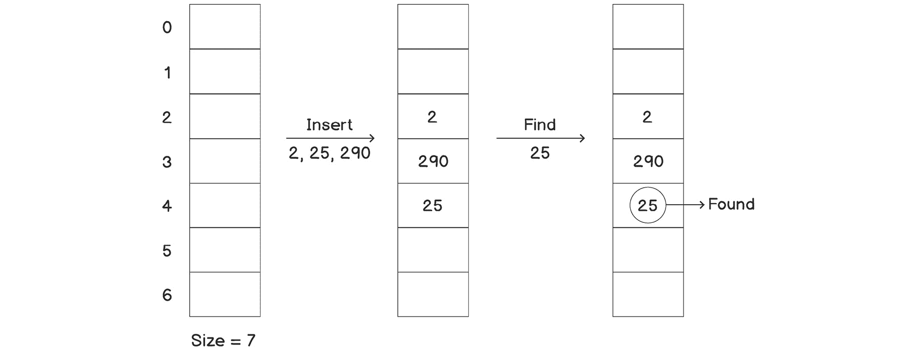
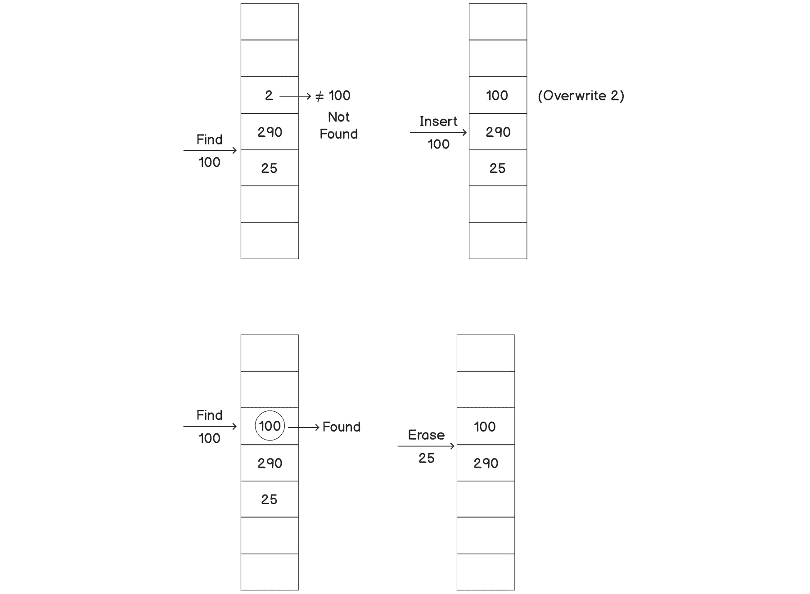
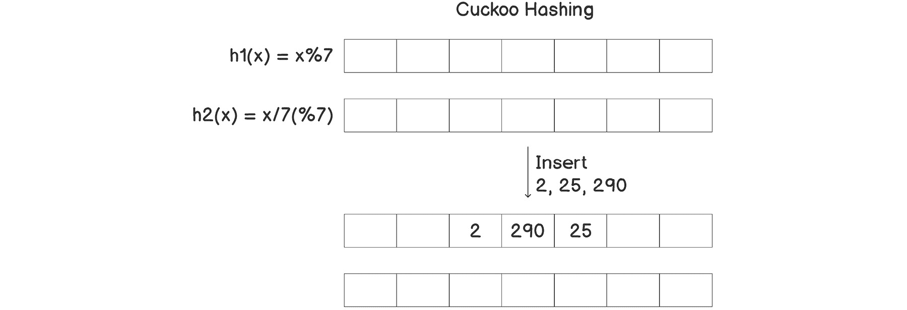
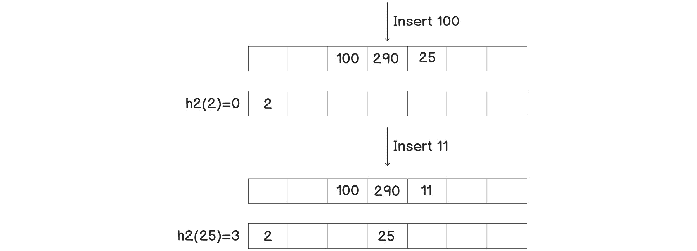
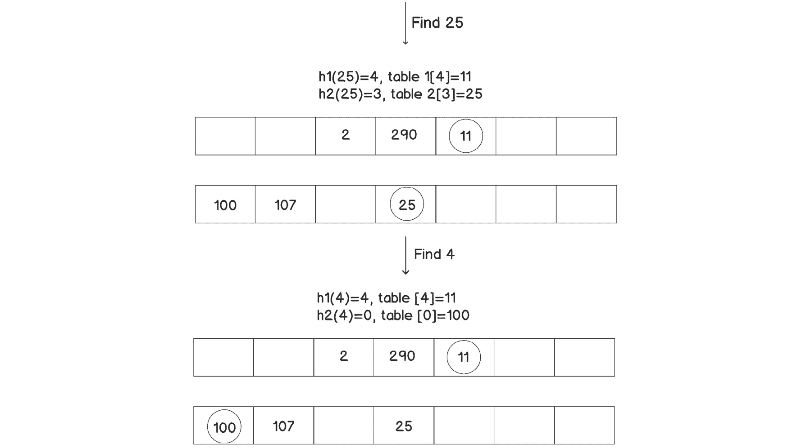
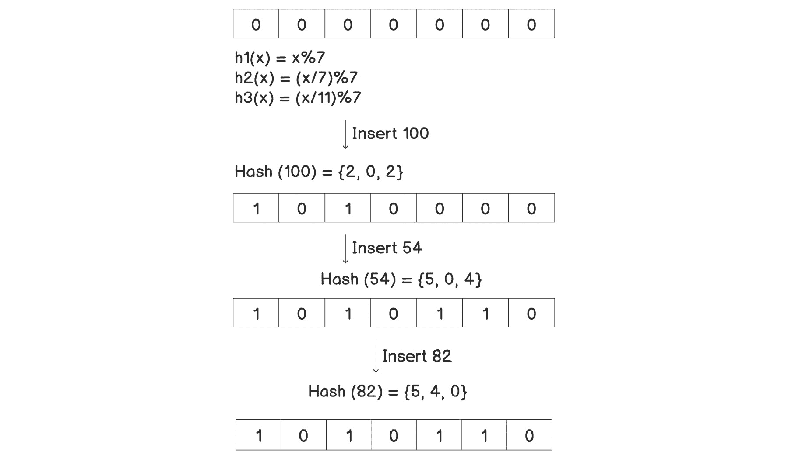
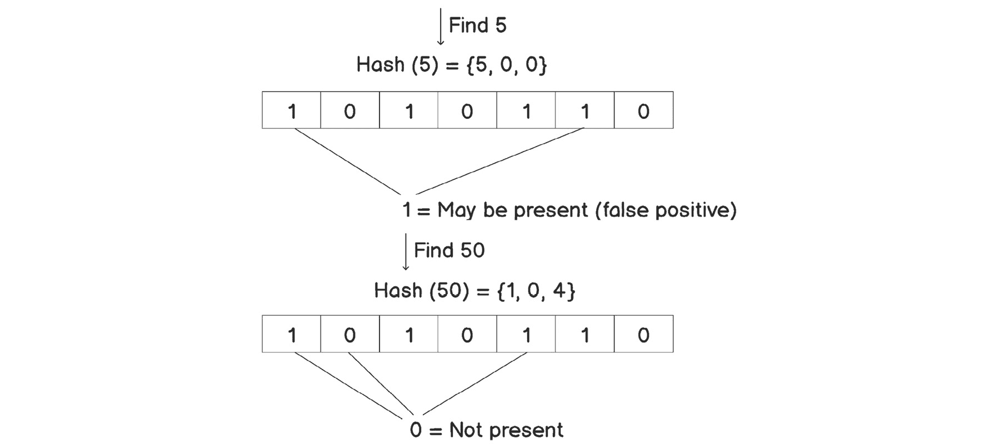

# 3。哈希表和布隆过滤器

## 学习目标

本章结束时，您将能够:

*   在任何大型应用中轻松识别与查找相关的问题
*   评估问题是否适合确定性或非确定性查找解决方案
*   根据场景实施高效的查找解决方案
*   在大型应用中实现作为 C++ STL 的一部分提供的通用解决方案

在本章中，我们将研究快速查找的问题。我们将了解解决这个问题的各种方法，并了解哪种方法可以用于特定的情况。

## 简介

查找只不过是检查容器中是否存在元素，或者为容器中的键找到相应的值。在前面几章提到的学生数据库系统和医院管理系统的例子中，一个常见的操作是从存储在系统中的大量数据中获取特定的记录。从字典中获取单词的意思、根据一组记录检查一个人是否被允许进入某个设施(访问控制)以及许多其他应用时，也会出现类似的问题。

对于这些场景中的大多数，仅仅线性地遍历所有元素并匹配这些值将会非常耗时，尤其是考虑到存储的大量记录。让我们举一个在字典中查找单词的简单例子。英语词典中大约有 17 万个单词。最简单的方法之一是线性遍历字典，并将给定的单词与字典中的所有单词进行比较，直到找到该单词，或者到达字典的末尾。但是这个太慢了，会有 *O(n)* 的时间复杂度，其中 n 是字典中的字数，不仅庞大而且还在逐日增加。

因此，我们需要更有效的算法，以便更快地进行查找。在本章中，我们将研究两种高效的结构，即哈希表和布隆过滤器。我们将实现它们，并比较它们的优缺点。

## 哈希表

让我们看看查字典这个最基本的问题。《牛津英语词典》大约有 17 万个单词。正如我们在引言中提到的，线性搜索将花费 *O(n)* 时间，其中 *n* 是字数。存储数据的更好方法是将其存储在高度平衡的树中，该树具有与 BST 相似的属性。这使得它比线性搜索快得多，因为它的时间复杂度只有 *O(对数 n)* 。但是对于需要大量这种查询的应用来说，这仍然不是一个足够好的改进。想想包含数百万或数十亿条记录的数据需要多长时间，比如神经科学数据或遗传数据。在数据中找到一些东西需要几天的时间。对于这些情况，我们需要更快的东西，比如**哈希表**。

哈希表的组成部分之一是**哈希**。这背后的想法是用一个可能唯一的键来表示每个值，然后根据用例，使用同一个键来检查键的存在或检索相应的值。从给定数据中导出唯一键的函数称为哈希函数。让我们通过看一些例子来看看如何存储和检索数据，让我们了解为什么我们需要这样一个函数。

### 散列

让我们先举一个简单的例子，然后再进入散列。假设我们有一个存储整数的容器，我们想尽快知道一个特定的整数是否是容器的一部分。最简单的方法是使用布尔数组，每个位代表一个与其索引相同的值。当我们想要插入一个元素时，我们会将该元素对应的布尔值设置为 *0* 。要插入 *x* ，我们只需设置*数据【x】=真*。检查一个特定的整数 *x* 是否在容器内也很简单——我们只需检查*数据【x】*是否为*真*。因此，我们的插入、删除和搜索功能变成了 *O(1)* 。存储从 *0* 到 *9* 的整数的简单哈希表如下所示:


###### 图 3.1:一个简单的散列表

但是，这种方法存在一些问题:

*   如果数据是浮点数呢？
*   如果数据不仅仅是一个数字呢？
*   如果数据的范围太高怎么办？也就是说，如果我们有十亿个数字，那么我们需要一个十亿大小的布尔数组，这并不总是可行的。

为了解决这个问题，我们可以实现一个函数，将任何数据类型的任何值映射到所需范围内的整数。我们可以选择范围，使其布尔数组具有可行的大小。这个函数被称为**散列函数**，正如我们在上一节中提到的。它将把一个数据元素作为输入，并在提供的范围内提供相应的输出整数。

对于大范围内的整数，最简单的散列函数是模函数(由 *%* 表示)，它将元素除以指定的整数( *n* )并返回余数。因此，我们将简单地拥有一个大小为 *n* 的数组。

如果我们想插入一个给定值， *x* ，我们可以对其应用模函数( *x % n* ，我们将总是得到一个介于 *0* 和(*n–1*之间的值，包括这两个值)。现在可以在 *(x % n)* 位置插入 *x* 。这里，通过应用散列函数获得的数字被称为**散列值**。

我们可能会遇到的一个主要问题是，两个元素可能具有相同的模函数输出。一个例子是( *9 % 7* )和( *16 % 7* ，这两者都产生一个哈希值 *2* 。因此，如果对应于 *2* 的槽是*真*(或 *1* 为布尔型)，我们将不知道 *2* 、 *9* 、 *16* 或返回 *x % 7 = 2* 的任何其他整数中的哪一个存在于我们的容器中。这个问题被称为冲突，因为应用哈希函数后，多个键具有相同的值，而不是唯一的值。

如果我们在哈希表中存储实际值而不是布尔整数，我们将知道我们有哪个值，但是我们仍然不能存储具有相同哈希值的多个值。我们将在下一节讨论如何处理这个问题。但是首先，让我们在下面的练习中看看一组整数的基本字典的实现。

### 练习 13:整数基础词典

在本练习中，我们将实现无符号整数哈希映射的基本版本。让我们开始吧:

1.  首先，让我们包含所需的标题:

    ```cpp
    #include <iostream>
    #include <vector>
    ```

2.  现在，让我们添加`hash_map`类。我们将别名`unsigned int`以避免写长名字:

    ```cpp
    using uint = unsigned int;
    class hash_map
    {
        std::vector<int> data;
    ```

3.  Now, let's add a constructor for this, which will take the size of the data or hash map:

    ```cpp
    public:
    hash_map(size_t n)
    {
        data = std::vector<int>(n, -1);
    }
    ```

    如图所示，我们使用`–1`来表示元素的缺失。这是我们将用作数据的唯一负值。

4.  Let's add the `insert` function:

    ```cpp
    void insert(uint value)
    {
        int n = data.size();
        data[value % n] = value;
        std::cout << "Inserted " << value << std::endl;
    }
    ```

    正如我们所看到的，我们并没有真正检查是否有一个值已经存在相同的哈希值。如果已经存在任何值，我们只是简单地覆盖。因此，对于给定的哈希值，将只存储最新插入的值。

5.  Let's write a lookup function to see whether an element is present in the map or not:

    ```cpp
    bool find(uint value)
    {
        int n = data.size();
        return (data[value % n] == value);
    }
    ```

    我们将简单地检查该值是否出现在基于哈希值计算的索引中。

6.  让我们实现一个`remove`函数:

    ```cpp
    void erase(uint value)
    {
        int n = data.size();
        if(data[value % n] == value)
        {
    data[value % n] = -1;
            std::cout << "Removed " << value << std::endl;
    }
    }
    };
    ```

7.  让我们在`main`中写一个小的 lambda 函数来打印查找的状态:

    ```cpp
    int main()
    {
        hash_map map(7);
        auto print = [&](int value)
            {
                if(map.find(value))
                    std::cout << value << " found in the hash map";
                else
                    std::cout << value << " NOT found in the hash map";
                std::cout << std::endl;
            };
    ```

8.  让我们使用地图上的`insert`和`erase`功能:

    ```cpp
        map.insert(2);
        map.insert(25);
        map.insert(290);
        print(25);
        print(100);
        map.insert(100);
        print(100);
        map.erase(25);
    }
    ```

9.  程序输出如下:

    ```cpp
    Inserted 2
    Inserted 25
    Inserted 290
    25 found in the hash map
    100 NOT found in the hash map
    Inserted 100
    100 found in the hash map
    Removed 25
    ```

正如我们所看到的，我们能够像预期的那样找到我们之前插入的大部分值，除了最后一种情况，`100`被`0`覆盖，因为它们具有相同的哈希值。正如我们之前所描述的，这被称为碰撞。在接下来的部分中，我们将看到如何避免这种问题，以使我们的结果更加准确。

下图展示了与上一练习不同的功能，应该会使这一点更加清晰:



###### 图 3.2:哈希表中的基本操作



###### 图 3.3:哈希表中的基本操作(续)

如上图所示，我们不能插入两个哈希值相同的元素；我们必须扔掉其中一个。

现在，正如我们前面提到的，哈希表的一个主要用途是找到对应于某个键的值，而不仅仅是检查该键是否存在。这可以简单地通过存储键值对来实现，而不仅仅是数据中的键。因此，我们的插入、删除和查找函数仍然会根据我们的键计算哈希值，但是一旦我们找到数组中的位置，我们就会将我们的值作为该对的第二个参数。

## 散列表中的列

在前面几节中，我们看了哈希表如何帮助我们存储大量的密钥，使得查找任何所需的密钥变得容易。但是，我们也遇到了一个问题，多个密钥具有相同的哈希值，也称为**冲突**。在*练习 13* 、*整数基础字典*中，我们通过简单地重写密钥并保留对应于给定哈希值的最新密钥来处理这个问题。然而，这并不允许我们存储所有的密钥。在接下来的子主题中，我们将看几个方法来帮助我们克服这个问题，并允许我们在哈希表中保留所有的键值。

### Clo se 寻址–链接

到目前为止，我们只为任何哈希值存储了一个元素。如果我们已经有了特定哈希值的元素，我们别无选择，只能丢弃新值或旧值。**链接**的方法是我们保留两种价值观的一种方式。在这种方法中，我们将为每个索引存储一个链表，而不是在哈希表中存储一个键。因此，每当我们遇到碰撞问题时，我们只需在列表的末尾插入新的密钥。因此，本质上，我们可以存储任意多的元素，而不是一个元素。为每个索引选择链表而不是向量(新元素使用`push_back`)的原因是为了能够从任何位置快速移除元素。让我们在下面的练习中实现这一点。

### 练习 14:带链接的哈希表

在本练习中，我们将实现一个哈希表，并使用链接来处理冲突。让我们开始吧:

1.  首先，让我们包含所需的标题:

    ```cpp
    #include <iostream>
    #include <vector>
    #include <list>
    #include <algorithm>
    ```

2.  现在，让我们添加`hash_map`类。我们将别名`unsigned int`以避免写长名字:

    ```cpp
    using uint = unsigned int;
    class hash_map
    {
        std::vector<std::list<int>> data;
    ```

3.  现在，让我们为`hash_map`添加一个构造函数，它将采用数据或哈希映射的大小:

    ```cpp
    public:
    hash_map(size_t n)
    {
        data.resize(n);
    }
    ```

4.  Let's add an `insert` function:

    ```cpp
    void insert(uint value)
    {
        int n = data.size();
        data[value % n].push_back(value);
        std::cout << "Inserted " << value << std::endl;
    }
    ```

    正如我们所看到的，我们总是在数据中插入值。一种替代方法是搜索该值，并仅在该值不存在时插入它。

5.  Let's write the lookup function to see whether an element is present in the map:

    ```cpp
    bool find(uint value)
    {
        int n = data.size();
        auto& entries = data[value % n];
        return std::find(entries.begin(), entries.end(), value) != entries.end();
    }
    ```

    正如我们所看到的，我们的查找似乎比传统方法更快，但不如以前那么快。这是因为现在，它也依赖于数据，以及`n`的值。在这个练习之后，我们将再次回到这一点。

6.  让我们实现一个移除元素的函数:

    ```cpp
    void erase(uint value)
    {
        int n = data.size();
        auto& entries = data[value % n];
        auto iter = std::find(entries.begin(), entries.end(), value);

        if(iter != entries.end())
        {
    entries.erase(iter);
            std::cout << "Removed " << value << std::endl;
    }
    }
    };
    ```

7.  让我们编写与上一个练习相同的`main`函数，并看看不同之处:

    ```cpp
    int main()
    {
        hash_map map(7);
        auto print = [&](int value)
            {
                if(map.find(value))
                    std::cout << value << " found in the hash map";
                else
                    std::cout << value << " NOT found in the hash map";
                std::cout << std::endl;
            };
    ```

8.  Let's use the `insert` and `erase` functions on `map`:

    ```cpp
        map.insert(2);
        map.insert(25);
        map.insert(290);
        map.insert(100);
        map.insert(55);
        print(100);
        map.erase(2);
    }
    ```

    下面是我们程序的输出:

    ```cpp
    Inserted 2
    Inserted 25
    Inserted 290
    Inserted 100
    Inserted 55
    100 found in the hash map
    Removed 2
    ```

正如我们所看到的，这些值不会被覆盖，因为我们可以在列表中存储任意数量的值。因此，我们的输出完全准确可靠。

下图说明了如何对数据集执行不同的操作:


###### 图 3.4:带链接的哈希表的基本操作


###### 图 3.5:带链接的哈希表的基本操作(续)

正如我们所看到的，我们将具有相同哈希值的元素附加到节点中的列表中，而不是单个元素。

现在，让我们考虑这些操作的时间复杂性。我们看到，插入功能仍然是 *O(1)* 。虽然`push_back`可能比仅仅设置一个值慢一点，但并没有明显的慢。考虑到这种方法解决的问题，这是一个小代价。但是根据哈希表的大小和数据集，查找和删除可能会慢很多。例如，如果所有键都具有相同的哈希值，则搜索所需的时间将为 O(n)，因为它将简单地变成链表中的线性搜索。

如果哈希表与要存储的密钥数量相比非常小，将会有很多冲突，并且列表平均会更长。另一方面，如果我们保留一个非常大的哈希表，我们可能最终会有非常稀疏的数据，并最终浪费内存。因此，哈希表的大小应该根据应用的上下文和场景进行优化。我们也可以用数学来定义这些东西。

**加载因子**表示哈希表中每个列表的平均键数。可以使用以下公式计算:


###### 图 3.6:负载系数

如果键的数量等于我们的哈希表大小，加载因子将是 *1* 。这是一个理想的场景；所有的操作我们都会靠近 *O(1)* ，所有的空间都会得到适当的利用。

如果该值小于 *1* ，这意味着我们甚至没有为每个列表存储一个键(假设我们希望每个索引都有一个列表)，这实际上浪费了一些空间。

如果该值大于 *1* ，这意味着我们的列表的平均长度大于 1，因此我们的查找和删除功能平均会慢一点。

负载系数的值可以随时在 *O(1)* 中计算。一些高级散列表实现利用该值来修改散列函数(也称为再散列)，如果该值在 1 的任一侧超过某些阈值。散列函数被修改，使得负载系数更接近 1。然后，哈希表的大小可以根据我们的负载系数和基于更新的哈希函数重新分配的值进行更新。再次清洗是一项昂贵的操作，因此不应过于频繁。但是，如果采用适当的策略，我们可以在平均时间复杂度方面取得非常好的结果。

然而，负载系数并不是决定这项技术性能的唯一因素。考虑以下场景:我们有一个大小为 *7* 的哈希表，它有七个元素。然而，它们都具有相同的哈希值，因此它们都存在于单个桶中。因此，搜索将始终花费 *O(n)* 而不是 *O(1)* 时间。然而，负载系数将是 1，这是一个绝对理想的值。这里，实际的问题是散列函数。散列函数的设计应该使不同的键尽可能均匀地分布在所有可能的索引中。基本上，最小铲斗尺寸和最大铲斗尺寸之间的差异不应该很大(在这种情况下为 7)。如果哈希函数的设计方式是所有七个元素得到不同的哈希值，那么所有的搜索函数调用都会产生 *O(1)* 复杂度和即时结果。这是因为最小和最大铲斗尺寸之差将为 *0* 。然而，这通常不会在哈希表实现中完成。它应该由哈希函数本身处理，因为哈希表不依赖于哈希函数的实现。

### 开放寻址

另一种解决冲突的方法是**开放寻址**。在这个方法中，我们将所有元素存储在哈希表中，而不是将元素链接到哈希表。因此，为了容纳所有元素，哈希表的大小必须大于元素的数量。其思想是探查对应于特定哈希值的单元是否已经被占用。我们可以通过多种方式来探索这个值，正如我们将在下面的副主题中看到的。

**线性探测**

这是一种简单的探测技术。如果在一个特定的哈希值上有冲突，我们可以简单地查看一个空单元格的后续哈希值，并在找到空间后插入我们的元素。如果 *hash(x)* 处的单元格已满，那么我们需要检查 *hash(x + 1)* 处的单元格是否为空。如果也是满的，看*哈希(x + 2)* 等等。

下图说明了线性探测的工作原理:


###### 图 3.7:带有线性探测的哈希表的基本操作


###### 图 3.8:哈希表填满后无法插入元素

如我们所见，如果对应于其哈希值的位置已经被占用，我们将在下一个可用的槽中插入一个元素。插入前三个元素后，我们可以看到它们聚集在一起。如果在同一个范围内插入了更多的元素，那么所有的元素都将连续出现在簇的末尾，从而使簇增长。现在，当我们试图搜索一个值时，该值不存在于哈希函数首先计算的位置，而是存在于一个大簇的末尾，我们必须线性搜索簇中的所有键。因此，搜索变得非常慢。

因此，如果数据密集地聚集在一起，我们就会遇到一个大问题。我们可以说，如果数据以这样一种方式分布，即存在一些值出现频率非常高的组，则数据是密集聚集的。例如，假设在 *100* 的哈希表中有很多哈希值为 *3* 到 *7* 的键。之后，所有的键将被连续探测到一些值，这将大大降低我们的搜索速度。

**二次探测**

正如我们所看到的，线性探测的主要问题是聚类。这背后的原因是，在碰撞的情况下，我们是线性运动的。这个问题很大程度上可以用二次方程代替线性方程来解决。这就是二次探测所提供的。

首先，我们尝试在位置*散列(x)* 处插入值 *x* 。如果那个位置已经被占用了，我们就去位置*hash(x+1**2**)*，然后*hash(x+2**2**)*以此类推。因此，我们以二次方式增加偏移量，从而降低创建小数据簇的概率。

这两种探测技术还有一个优点——一个元素的位置可能会受到其他不具有相同哈希值的元素的影响。因此，基本上，即使只有一个具有特定哈希值的键，它也会发生冲突，因为该位置存在一些其他元素，而链接则不是这种情况。例如，在线性探测中，如果我们有两个哈希值为 4 的键，其中一个将插入位置 4，另一个将插入位置 5。接下来，如果我们需要插入一个哈希值为 5 的密钥，它将需要在 6 处插入。该密钥受到影响，即使它与任何其他密钥没有相同的哈希值。

### 完美散列–布谷鸟散列

正如标题所示，**布谷鸟哈希**是完美的哈希技术之一。我们之前提到的方法在最坏的情况下不能保证 *O(1)* 的时间复杂度，但是如果实施得当，布谷鸟哈希可以实现这一点。

在布谷鸟哈希中，我们保留了两个大小相同的哈希表，每个哈希表都有自己唯一的哈希函数。任何元素都可以出现在任意一个哈希表中，其位置基于相应的哈希函数。

布谷鸟哈希与我们以前的哈希技术有两个主要不同之处:

*   任何元素都可以出现在两个哈希表的任何一个中。
*   任何元素都可以在将来移动到另一个位置，即使是在插入之后。

早期的散列技术不允许在插入后移动元素，除非我们做了完全的重新散列，但是布谷鸟散列却不是这样，因为任何元素都可能有两个可能的位置。我们仍然可以通过增加任何元素的可能位置的数量来增加度数，以便获得更好的结果，并且减少重复使用的频率。但是，在本章中，我们将只查看具有两个可能位置(哈希表)的版本，因为它更容易理解。

对于查找，我们只需要查看两个位置来确定元素是否存在。因此，查找总是需要 *O(1)* 时间。

然而，插入功能可能需要更长的时间。在这种情况下，插入函数首先检查是否有可能在第一个哈希表中插入新元素，比如说 *A* 。如果是这样，它会在那里插入元素，我们就完成了。但是如果那个位置被一个预先存在的元素占据，比如说 *B* ，我们仍然继续插入 *A* 并将 *B* 移动到第二个哈希表。如果第二个哈希表中的这个新位置也被占用了，比如说通过元素 *C* ，我们再次将 *B* 插入到那里，并将 *C* 移动到第一个表中。我们可以递归地继续下去，直到找到所有元素的空槽。下图说明了这一过程:


###### 图 3.9:布谷鸟散列

一个主要问题是，我们可能会陷入一个循环，递归可能会导致无限循环。对于上一段中的例子，考虑有一个元素 *D* ，我们希望在这里插入 *C* ，但是如果我们试图移动 *D* ，它会转到 *A* 的位置。因此，我们处在一个无限循环中。下图应该有助于您直观地看到这一点:


###### 图 3.10:杜鹃杂凑过程中形成的循环

为了解决这个问题，一旦我们确定了周期，我们就需要用新的散列函数来重新散列一切。用新的哈希函数创建的哈希表可能仍然存在相同的问题，因此我们可能需要重新散列并尝试不同的哈希函数。然而，有了聪明的策略和明智选择的散列函数，我们可以高概率地实现摊销 *O(1)* 的性能。

就像开放寻址一样，我们不能存储超过哈希表总大小的元素。为了确保良好的性能，我们应该确保我们的负载系数小于 50%，也就是说，元素的数量应该小于可用容量的一半。

在下面的练习中，我们将看看布谷鸟散列的实现。

### 练习 15:布谷鸟杂凑

在本练习中，我们将实现布谷鸟哈希来创建哈希表，并在其中插入各种元素。我们还将跟踪操作如何进行，这将使我们能够了解插入是如何工作的。让我们开始吧:

1.  让我们像往常一样从包含所需的头开始:

    ```cpp
    #include <iostream>
    #include <vector>
    ```

2.  Let's add a class for the hash map. We'll also store size separately this time:

    ```cpp
    class hash_map
    {
        std::vector<int> data1;
        std::vector<int> data2;
        int size;
    ```

    如我们所见，我们使用两张桌子。

3.  Now, let's add the corresponding hash functions:

    ```cpp
    int hash1(int key) const
    {
        return key % size;
    }
    int hash2(int key) const
    {
        return (key / size) % size;
    }
    ```

    在这里，我们保持了这两个功能非常简单，但这些功能可以根据需要进行调整。

4.  Now, let's add a constructor that will set our data for initialization:

    ```cpp
    public:
    hash_map(int n) : size(n)
    {
        data1 = std::vector<int>(size, -1);
        data2 = std::vector<int>(size, -1);
    }
    ```

    如我们所见，我们只是将两个数据表初始化为空(由`–1`表示)。

5.  Let's write a `lookup` function first:

    ```cpp
    std::vector<int>::iterator lookup(int key)
    {
        auto hash_value1 = hash1(key);
        if(data1[hash_value1] == key)
        {
            std::cout << "Found " << key << " in first table" << std::endl;
            return data1.begin() + hash_value1;
        }
        auto hash_value2 = hash2(key);
        if(data2[hash_value2] == key)
        {
            std::cout << "Found " << key << " in second table" << std::endl;
            return data2.begin() + hash_value2;
        }
        return data2.end();
    }
    ```

    我们试图在两个表中找到键，如果找到了，就返回相关的迭代器。我们并不总是需要迭代器，但是我们将在删除函数中使用它来使事情变得更容易。如果没有找到元素，我们将返回`data2`表的末尾。如我们所见，查找的时间复杂度为 *O(1)* ，并且执行速度非常快。

6.  Let's implement a delete function:

    ```cpp
    void erase(int key)
    {
        auto position = lookup(key);
        if(position != data2.end())
        {
            *position = -1;
            std::cout << "Removed the element " << key << std::endl;
        }
        else
        {
            std::cout << "Key " << key << " not found." << std::endl;
        }
    }
    ```

    我们可以看到，大部分工作都是通过调用`lookup`函数来完成的。我们只需要验证结果并重置值，将其从表中删除。

7.  For insertion, we shall implement the actual logic in a different function because it will be recursive. One more thing we want to do is avoid cycles. However, keeping a record of all the values that are visited can be costly. To avoid that, we will simply stop the function once it is called more than n times. Since the threshold of the recursion depth of n is dependent on our memory (or hash table size), this gives good performance:

    ```cpp
    void insert(int key)
    {
        insert_impl(key, 0, 1);
    }
    void insert_impl(int key, int cnt, int table)
    {
        if(cnt >= size)
        {
            std::cout << "Cycle detected, while inserting " << key << ". Rehashing required." << std::endl;
            return;
        }
        if(table == 1)
        {
    int hash = hash1(key);
            if(data1[hash] == -1)
            {
                std::cout << "Inserted key " << key << " in table " << table << std::endl;
                data1[hash] = key;
            }
            else
            {
                int old = data1[hash];
                data1[hash] = key;
                std::cout << "Inserted key " << key << " in table " << table << " by replacing " << old << std::endl;
                insert_impl(old, cnt + 1, 2);
            }
        }
        else
        {
    int hash = hash2(key);
            if(data2[hash] == -1)
            {
                std::cout << "Inserted key " << key << " in table " << table << std::endl;
                data2[hash] = key;
            }
            else
            {
                int old = data2[hash];
                data2[hash] = key;
                std::cout << "Inserted key " << key << " in table " << table << " by replacing " << old << std::endl;
                insert_impl(old, cnt + 1, 2);
            }
        }
    }
    ```

    正如我们所看到的，实现需要三个参数——键、我们想要插入键的表以及递归调用堆栈的计数，以跟踪我们已经改变位置的元素的数量。

8.  现在，让我们编写一个实用函数来打印哈希表中的数据。虽然这不是真正必要的，也不应该公开，但我们会这样做，以便更好地理解我们的 insert 函数是如何在内部管理数据的:

    ```cpp
    void print()
    {
        std::cout << "Index: ";
        for(int i = 0; i < size; i++)
            std::cout << i << '\t';
        std::cout << std::endl;
        std::cout << "Data1: ";
        for(auto i: data1)
            std::cout << i << '\t';
        std::cout << std::endl;
        std::cout << "Data2: ";
        for(auto i: data2)
            std::cout << i << '\t';
        std::cout << std::endl;
    }
    };
    ```

9.  现在，让我们编写`main`函数，这样我们就可以使用这个散列图:

    ```cpp
    int main()
    {
        hash_map map(7);
        map.print();
        map.insert(10);
        map.insert(20);
        map.insert(30);
        std::cout << std::endl;
        map.insert(104);
        map.insert(2);
        map.insert(70);
        map.insert(9);
        map.insert(90);
        map.insert(2);
        map.insert(7);
        std::cout << std::endl;
        map.print();
        std::cout << std::endl;
        map.insert(14);  // This will cause cycle.
    }
    ```

10.  您应该会看到以下输出:

    ```cpp
    Index: 0    1    2    3    4    5    6    
    Data1: -1    -1    -1    -1    -1    -1    -1    
    Data2: -1    -1    -1    -1    -1    -1    -1    
    Inserted key 10 in table 1
    Inserted key 20 in table 1
    Inserted key 30 in table 1
    Inserted key 104 in table 1 by replacing 20
    Inserted key 20 in table 2
    Inserted key 2 in table 1 by replacing 30
    Inserted key 30 in table 2
    Inserted key 70 in table 1
    Inserted key 9 in table 1 by replacing 2
    Inserted key 2 in table 2
    Inserted key 90 in table 1 by replacing 104
    Inserted key 104 in table 2 by replacing 2
    Inserted key 2 in table 1 by replacing 9
    Inserted key 9 in table 2
    Inserted key 2 in table 1 by replacing 2
    Inserted key 2 in table 2 by replacing 104
    Inserted key 104 in table 1 by replacing 90
    Inserted key 90 in table 2
    Inserted key 7 in table 1 by replacing 70
    Inserted key 70 in table 2
    Index: 0    1    2    3    4    5     6
    Data1: 7   -1    2    10  -1   -1     104
    Data2: 2    9    20   70   30   90   -1
    Inserted key 14 in table 1 by replacing 7
    Inserted key 7 in table 2 by replacing 9
    Inserted key 9 in table 1 by replacing 2
    Inserted key 2 in table 2 by replacing 2
    Inserted key 2 in table 1 by replacing 9
    Inserted key 9 in table 2 by replacing 7
    Inserted key 7 in table 1 by replacing 14
    Cycle detected, while inserting 14\. Rehashing required.
    ```

正如我们所看到的，输出显示了两个表是如何在内部维护的完整轨迹。我们已经打印了内部步骤，因为一些值正在移动。`14`的最后一次插入导致了一个循环，从痕迹中我们可以看到。插入深度已经超过`7`。同时，我们还可以看到两张桌子几乎都坐满了。我们已经从`14`中填充了`11`元素，因此替换值的机会在每一步都在增加。我们也在周期前打印了表格。

此外，删除一个元素需要花费*0(1)*的时间，因为它只使用`lookup`函数，如果找到的话，会删除该元素。所以，唯一昂贵的功能是插入。因此，如果插入的数量比任何应用中的查找数量都少，这是一个理想的实现。

让我们使用以下视觉辅助工具，以便更好地理解这一点:



###### 图 3.11:在使用布谷鸟哈希的哈希表中插入元素



###### 图 3.12:使用布谷鸟哈希处理哈希表中的冲突


###### 图 3.13:使用布谷鸟哈希处理哈希表中的冲突(续)



###### 图 3.14:在使用布谷鸟哈希的哈希表中查找值


###### 图 3.15:擦除使用布谷鸟哈希的哈希表中的值

从前面的一系列图中我们可以看到，首先，我们尝试在第一个表中插入元素。如果已经有了另一个元素，我们覆盖它，并在另一个表中插入先前存在的元素。我们重复这个过程，直到可以安全地插入最后一个元素。

## C++ 散列表

正如我们前面提到的，在大多数应用中，查找操作非常频繁。然而，我们可能并不总是遇到正整数，它们很容易散列。大多数情况下，您可能会遇到字符串。考虑我们之前考虑的英语词典的例子。我们可以通过使用单词作为关键字和单词定义作为值来存储字典数据。另一个例子是我们在*第 1 章*、*列表、堆栈和队列*中考虑的医院记录数据库，其中患者的姓名可以用作关键字，其他相关信息可以作为值存储。

我们之前用来计算整数哈希值的简单模函数不适用于字符串。一个简单的选择是计算所有字符的 ASCII 值之和的模。然而，一个字符串中所有字符的排列将会非常庞大，这将会产生很多冲突。

C++ 提供了一个名为`std::hash<std::string>(std::string)`的函数，我们可以用它来生成字符串的哈希值。它有一个内置的算法来处理散列函数。同样，C++ 为所有基本类型的数据提供了这样的函数。

现在，看看我们在*练习 14* 、*带链接的哈希表*中实现的哈希表，似乎很明显，我们可以简单地基于数据类型对其进行模板化，并制定一个通用解决方案来为任何给定类型的数据提供哈希函数。STL 为此提供了几个解决方案:`std::unordered_set<Key>`和`std::unordered_map<Key, Value>`。无序集合只能存储一组键，而无序映射可以存储键及其值。因此，每个唯一键在容器中都有一个对应的值。

这两个容器都是以相同的方式实现的——使用带有链接的哈希表。哈希表中的每一行都是一个存储键(以及映射的值)的向量。这些行被称为**桶**。因此，在计算一个键的哈希值后，它将被放入一个桶中。每个桶也是一个支持链接的列表。

默认情况下，这些集装箱的最大装载系数为 *1* 。一旦元素数量超过哈希表的大小，哈希函数将被更改，哈希值将被重新计算(重新散列)，并且将重建一个更大的哈希表来降低负载系数。我们也可以使用`rehash`功能手动完成。使用`max_load_factor(float)`功能可以更改 *1* 的负载系数默认最大限值。一旦负载系数超过定义的最大限值，这些值将被重新刷新。

这些容器提供了常用的功能，如`find`、`insert`和`erase`。它们还提供了迭代所有元素的迭代器，以及使用其他容器(如向量和数组)创建无序集和映射的构造函数。无序映射还提供`operator[]`，以便它可以返回已知键的值。

在下面的练习中，我们将研究无序集和映射的实现。

### 练习 16:STL 提供的哈希表

在本练习中，我们将实现无序集和映射，并在这些容器上应用插入、删除和查找等操作。让我们开始吧:

1.  包括所需的标题:

    ```cpp
    #include <iostream>
    #include <unordered_map>
    #include <unordered_set>
    ```

2.  现在，让我们编写一些简单的`print`函数，使我们的`main`函数更易读:

    ```cpp
    void print(const std::unordered_set<int>& container)
    {
        for(const auto& element: container)
            std::cout << element << " ";
        std::cout << std::endl;
    }
    void print(const std::unordered_map<int, int>& container)
    {
        for(const auto& element: container)
            std::cout << element.first << ": " << element.second << ", ";
        std::cout << std::endl;
    }
    ```

3.  同样，在`find`函数上添加包装器以保持代码整洁:

    ```cpp
    void find(const std::unordered_set<int>& container, const auto& element)
    {
        if(container.find(element) == container.end())
            std::cout << element << " not found" << std::endl;
        else
            std::cout << element << " found" << std::endl;
    }
    void find(const std::unordered_map<int, int>& container, const auto& element)
    {
        auto it = container.find(element);
        if(it == container.end())
            std::cout << element << " not found" << std::endl;
        else
            std::cout << element << " found with value=" << it->second << std::endl;
    }
    ```

4.  现在，编写`main`函数，这样我们就可以使用`unordered_set`和`unordered_map`，然后对其进行各种操作。我们将找到、插入和删除元素:

    ```cpp
    int main()
    {
        std::cout << "Set example: " << std::endl;
        std::unordered_set<int> set1 = {1, 2, 3, 4, 5};
        std::cout << "Initial set1: ";
        print(set1);
        set1.insert(2);
        std::cout << "After inserting 2: ";
        print(set1);
        set1.insert(10);
        set1.insert(351);
        std::cout << "After inserting 10 and 351: ";
        print(set1);
        find(set1, 4);
        find(set1, 100);
        set1.erase(2);
        std::cout << "Erased 2 from set1" << std::endl;
        find(set1, 2);
        std::cout << "Map example: " << std::endl;
        std::unordered_map<int, int> squareMap;
        squareMap.insert({2, 4});
        squareMap[3] = 9;
        std::cout << "After inserting squares of 2 and 3: ";
        print(squareMap);
        squareMap[30] = 900;
        squareMap[20] = 400;
        std::cout << "After inserting squares of 20 and 30: ";
        print(squareMap);
        find(squareMap, 10);
        find(squareMap, 20);
        std::cout << "Value of map[3]=" << squareMap[3] << std::endl;
        std::cout << "Value of map[100]=" << squareMap[100] << std::endl;
    }
    ```

5.  这个程序的一个可能输出如下。集合和地图中元素的顺序可以不同，因此称为*无序*集合/地图:

    ```cpp
    Set example: 
    Initial set1: 5 4 3 2 1 
    After inserting 2: 5 4 3 2 1 
    After inserting 10 and 351: 351 10 1 2 3 4 5 
    4 found
    100 not found
    Erased 2 from set1
    2 not found
    Map example: 
    After inserting squares of 2 and 3: 3: 9, 2: 4, 
    After inserting squares of 20 and 30: 20: 400, 30: 900, 2: 4, 3: 9, 
    10 not found
    20 found with value=400
    Value of map[3]=9
    Value of map[100]=0
    ```

正如我们所看到的，我们可以从两个容器中插入、查找和删除元素。这些操作正在按预期进行。如果我们将这些操作与其他容器(如 vector、list、array、deque 等)进行比较，这里的性能会快得多。

我们可以存储键值对，并使用`operator[]`访问任何给定键的值，如本练习所示。它返回一个引用，因此也允许我们设置值，而不仅仅是检索它。

#### 注意

由于`operator[]`返回一个引用，如果找不到关键字，它会将默认值添加到条目中。

在最后一行，我们得到了`map[100] = 0`，即使`100`从未插入地图。这是因为`operator[]`正在返回默认值。

如果我们想跟踪桶的数量，因为它们基于重新散列而改变，我们可以使用`bucket_count()`函数来实现。还有其他功能可以获取其他内部参数的详细信息，如`load_factor`、`max_bucket_count`等。我们也可以使用`rehash`功能手动重洗。

因为这些容器是使用链接实现的，所以它们实际上是将键/值对存储在不同的桶中。因此，在搜索任何桶中的键时，我们需要比较它们是否相等。因此，我们需要为键类型定义相等运算符。或者，我们可以将其作为另一个模板参数传递。

正如我们在本练习中看到的，无序集和映射不允许重复键。如果需要存储重复值，可以使用`unordered_multiset`或`unordered_multimap`。为了支持多个值，insert 函数不会检查容器中是否已经存在该键。此外，它还支持一些额外的函数来检索带有特定键的所有项目。我们不会再看更多关于这些容器的细节，因为它不在本书的讨论范围之内。

STL 为 C++ 支持的所有基本数据类型提供散列函数。因此，如果我们想要一个定制的类或结构作为任何上述容器的键类型，我们需要在`std`命名空间内实现一个散列函数。或者，我们可以将其作为模板参数传递。然而，每次我们自己编写一个散列函数并不是一个好主意，因为性能很大程度上取决于它。设计散列函数需要对手头的问题进行大量的研究和理解，以及数学技能。因此，我们将它排除在本书的范围之外。出于我们的目的，我们可以简单地使用`boost`库中提供的`hash_combine`功能，如下例所示:

```cpp
#include <boost/functional/hash.hpp>
struct Car
{
    std::string model;
    std::string brand;
    int buildYear;
};
struct CarHasher
{
    std::size_t operator()(const Car& car) const
    {
        std::size_t seed = 0;
        boost::hash_combine(seed, car.model);
        boost::hash_combine(seed, car.brand);
        return seed;
    }
};
struct CarComparator
{
    bool operator()(const Car& car1, const Car& car2) const
    {
    return (car1.model == car2.model) && (car1.brand == car2.brand);
    }
};
// We can use the hasher as follows:
std::unordered_set<Car, CarHasher, CarComparator> carSet;
std::unordered_map<Car, std::string, CarHasher, CarComparator> carDescriptionMap;
```

正如我们所看到的，我们已经用`operator()`定义了一个散列结构，它将被无序容器使用。我们还用`operator()`定义了比较器结构来支持相关功能。我们将这些结构作为模板参数传递。这也允许我们对不同的对象使用不同类型的比较器和散列器。

除了简单的散列函数(如模)之外，还有一些复杂的散列函数，称为加密散列函数，如 MD5、SHA-1 和 SHA-256。这些算法非常复杂，它们可以将任何类型的数据(甚至是文件)作为输入值。密码函数的一个重要特征是很难从给定的散列值(也称为反向散列)中确定实际数据，因此它们被用于一些最安全的系统中。例如，比特币区块链使用 SHA-256 算法来存储交易记录真实性的重要证明。区块链中的每个*块*包含其先前链接块的 SHA-256 哈希值，当前块的哈希值包含在后续块中。非法修改任何块都会使从该块开始的整个区块链失效，因为现在修改后的块的哈希值将与存储在下一个块中的值不匹配。即使有一些世界上最快的超级计算机，也需要数百年才能打破这种局面，创造伪造的交易记录。

### 活动 6:将长网址映射到短网址

在本活动中，我们将创建一个程序来实现类似于[https://tinyurl.com/](https://tinyurl.com/)的服务。它可以取一个很长的网址，并将其映射到一个小的网址，方便共享。每当我们输入短网址时，它应该检索原始网址。

我们需要以下功能:

*   高效地存储用户提供的原始网址和相应的较小网址
*   如果找到，根据给定的较小网址检索原始网址；否则，返回一个错误

这些高级步骤应该有助于您解决此活动:

1.  创建一个包含`unordered_map`作为主要数据成员的类。
2.  添加插入值的函数。这个函数应该有两个参数:原始网址和较小版本的网址。
3.  Add a function to find the actual URL based on a given small URL if present.

    #### 注意

    这个活动的解决方案可以在第 498 页找到。

## 布隆过滤器

与哈希表相比，Bloom 过滤器非常节省空间，但代价是答案的确定性；也就是说，我们得到的答案是不确定的。只保证不会有假阴性，但可能有假阳性。换句话说，如果我们得到一个正命中，元素可能存在，也可能不存在；但是如果我们得到一个负数，那么元素肯定不存在。

就像布谷鸟散列一样，我们将在这里使用多个散列函数。然而，我们将保留三个函数，因为两个函数不能达到足够的精度。基本思想是，我们不存储实际值，而是存储一个布尔数组，指示一个值是否(可能)存在。

为了插入一个元素，我们计算所有散列函数的值，并将数组中所有三个散列值对应的位设置为 *1* 。对于查找，我们计算所有散列函数的值，并检查是否所有对应的位都设置为 *1* 。如果是，我们返回*真*；否则，我们返回 *false* (元素不存在)。

显而易见的问题是——为什么查找是不确定的？原因是任何位都可以由多个元素设置。因此，一个特定值(称之为 *x* )的所有相关位被设置为 *1* 的概率相对较大，因为之前插入了一些其他元素，尽管 *x* 根本没有被插入。在这种情况下，查找功能仍将返回*真*。因此，我们可以预期一些假阳性。我们插入的元素越多，误报的几率就越高。但是，如果 *x* 的其中一个位没有设置，那么我们可以说该元素不存在。所以，假阴性不可能。

当布尔数组中的所有位都设置为 *1* 时，数组将饱和。因此，查找功能将始终返回*真*，而插入功能将不会有任何影响，因为所有的位已经设置为 *1* 。

下图更清楚地说明了这一点:



###### 图 3.16:在布隆过滤器中插入元素



###### 图 3.17:在布隆过滤器中查找元素


###### 图 3.18:在布隆过滤器中查找元素(续)

如前面的图表所示，我们根据散列函数设置相关的位，对于插入，我们进行逐位`AND`来查找元素，正如我们前面解释的那样。

在下面的练习中，我们将在 C++ 中实现一个布隆过滤器。

### 练习 17:创建布隆过滤器

在本练习中，我们将创建一个布隆过滤器，并尝试一些基本操作。我们还将测试查找中的误报。让我们开始吧:

1.  让我们包括所需的标题:

    ```cpp
    #include <iostream>
    #include <vector>
    ```

2.  现在，让我们为布隆过滤器创建一个类，并添加所需的数据成员:

    ```cpp
    class bloom_filter
    {
        std::vector<bool> data;
        int nBits;
    ```

3.  Now, let's add the required hash functions. Again, we'll use very basic hash functions:

    ```cpp
    int hash(int num, int key)
    {
        switch(num)
        {
        case 0:
            return key % nBits;
        case 1:
            return (key / 7) % nBits;
        case 2:
            return (key / 11) % nBits;
        }
        return 0;
    }
    ```

    如您所见，我们使用单个函数，用一个名为`num`的参数来确定散列函数，以避免其他函数中不必要的`if` - `else`块。这也很容易扩大；我们只需要为每个散列函数添加一个 case。

4.  让我们为布隆过滤器添加一个构造函数:

    ```cpp
    public:
    bloom_filter(int n) : nBits(n)
    {
        data = std::vector<bool>(nBits, false);
    }
    ```

5.  Now, let's add a `lookup` function:

    ```cpp
    void lookup(int key)
    {
        bool result = data[hash(0, key)] & data[hash(1, key)] & data[hash(2, key)];
        if(result)
        {
            std::cout << key << " may be present." << std::endl;
        }
        else
        {
            std::cout << key << " is not present." << std::endl;
        }
    }
    ```

    `lookup`功能果然很简单。检查是否所有需要的位都设置为`1`。如果有可变数量的散列函数，我们总是可以循环所有的散列函数来检查是否所有对应的位都被设置为`1`。为了使我们的话更准确，我们还说由于误报的可能性，一个关键*可能存在*。另一方面，如果`lookup`返回否定，我们完全确定一个键不存在。

6.  甚至插入函数也同样简单:

    ```cpp
    void insert(int key)
    {
        data[hash(0, key)] = true;
        data[hash(1, key)] = true;
        data[hash(2, key)] = true;
        std::cout << key << " inserted." << std::endl;
    }
    };
    ```

7.  让我们添加`main`函数，这样我们就可以使用这个类:

    ```cpp
    int main()
    {
    bloom_filter bf(11);
    bf.insert(100);
    bf.insert(54);
    bf.insert(82);
    bf.lookup(5);
    bf.lookup(50);
    bf.lookup(2);
    bf.lookup(100);
    bf.lookup(8);
    bf.lookup(65);
    }
    ```

8.  您应该会看到以下输出:

    ```cpp
    100 inserted.
    54 inserted.
    82 inserted.
    5 may be present.
    50 is not present.
    2 is not present.
    100 may be present.
    8 is not present.
    65 may be present.
    ```

我们可以看到，有几个假阳性，但没有假阴性。

与以前的技术不同，这种结构只需要 11 位来存储这些信息，这一点我们可以从 Bloom 过滤器的构造函数中看到。因此，我们可以轻松地增加过滤器的大小，并相应地更新散列函数，以获得更好的结果。例如，我们可以将数组的大小增加到 1，000(因为 1，023 是一个素数，所以使用频率很高)，我们将仍然使用不到 130 个字节，这比大多数其他技术要少得多。随着哈希表大小的增加，我们的哈希函数也会变成 *%1023* 或者类似的，会提供更好的结果和更好的数字分布。

这里需要注意的一个要点是，由于我们没有将实际数据存储在容器中，因此我们可以将其用作异构结构；也就是说，只要我们的散列函数足够好，我们就可以在同一个 Bloom 过滤器中同时插入不同类型的数据，例如整数、字符串和双精度值。

这在现实生活中有一些非常好的用例，尤其是当数据量太大，即使使用哈希表也无法搜索时，一些误报是可以接受的。例如，当使用电子邮件提供商(如 Gmail 或 Outlook)创建新的电子邮件地址时，会检查该电子邮件地址是否已经存在。数据库中有数十亿个电子邮件地址，对这样一个基本且频繁的查询进行精确检查将非常昂贵。幸运的是，即使电子邮件地址还没有被占用，有时说它被占用也没关系，因为它不会造成任何伤害。用户将简单地选择其他东西。在这种情况下，使用布隆过滤器是一个可行的选择。我们将在*活动 7* 、*电子邮件地址验证器*中看到这一点。

另一个例子是用于显示服务使用的新广告的推荐算法，例如脸书广告。每次你查看订阅源时，它都会显示一个新广告。它可以简单地将你看过的广告的标识存储在一个布隆过滤器中。然后，在您的提要中显示特定广告之前，可以对照它检查其标识。如果该检查返回您已经观看了特定的广告，即使您没有观看(假阳性)，它也不会显示该广告。然而，这很好，因为你不会知道它，因为你没有看到那个广告。这样，你每次都可以通过快速查找获得新广告。

### 活动 7:电子邮件地址验证器

在本活动中，我们将为电子邮件创建一个验证器，类似于我们在注册时在许多电子邮件服务中发现的(如 Gmail 和 Outlook)。我们将使用布隆过滤器来检查某个电子邮件地址是否已经被其他人占用。

这些高级步骤应该有助于您完成本活动:

1.  创建一个`BloomFilter`类，它可以接受多个散列函数和布隆的大小。
2.  对于哈希，使用 OpenSSL 库中的 MD5 算法来生成给定电子邮件的哈希值。MD5 是一种 128 位哈希算法。对于多个散列函数，我们可以将每个字节用作单独的散列值。
3.  要在布隆过滤器中添加一封电子邮件，我们需要将来自我们在*步骤 2* 中计算的哈希值的每个字节的所有位设置为 *true* 。
4.  To find any email, we need to check whether all the relevant bits are *true* based on the hash value we calculated in *step 2*.

    #### 注意

    这个活动的解决方案可以在 503 页找到。

## 总结

正如我们在介绍中提到的，在大多数应用中都会遇到这样或那样的查找问题。我们可以根据需要使用确定性和概率性解决方案。在本章中，我们实现并看到了如何使用它们。最后，我们还看了一个 C++ 中用于散列的内置容器的例子。当我们编写应用时，这些容器非常有用，因为我们不需要每次都为每种类型自己实现它们。一个简单的经验法则是这样的:如果我们可以看到对容器的`find`函数的大量函数调用，我们应该选择基于查找的解决方案。

到目前为止，我们已经看到了如何在各种类型的数据结构中存储数据并执行一些基本操作。在接下来的章节中，我们将研究各种类型的算法设计技术，以便我们可以优化这些操作，从分治开始。