# 6。图形算法 1

## 学习目标

本章结束时，您将能够:

*   描述图形在解决各种现实问题中的效用
*   选择并实现正确的遍历方法来查找图中的元素
*   用 Prim 算法求解最小生成树问题
*   确定何时使用 Prim 和 Kruskal 算法来解决 MST 问题
*   使用迪克斯特拉算法寻找图中两个顶点/节点之间的最短路径

在这一章中，我们将研究基本的和最常用的算法来解决问题，可以用图形的形式来表示，这将在下一章中进一步讨论。

## 简介

在前两章中，我们讨论了两种算法设计范式:分治法和贪婪方法，这两种方法使我们对广泛使用和重要的计算问题(如排序、搜索和寻找图上的最小权重生成树)找到了众所周知的解决方案。在本章中，我们将讨论一些特别适用于图形数据结构的算法。

一个**图形**被定义为一组连接一对顶点的**顶点**和**边**。数学上，这通常写成 *G = < V，E >* ，其中 *V* 表示顶点集， *E* 表示构成图的边集。从一个节点指向另一个节点的边称为*有向*，而没有方向的边称为*无向*。正如我们在*第二章*、*树、堆和图形*中看到的那样，边也可能与*权重*相关联，或者是*未加权的*。

#### 注意

当我们谈论图时，术语“节点”和“顶点”可以互换使用。在这一章，我们将坚持“顶点”

图形是一些最通用的数据结构，以至于其他链接数据结构，如树和链表，都被认为是图形的特例。使图形有用的是它们是*对象*(表示为**节点**)之间*关系*(表示为**边**)的一般表示。图可以在同一对节点之间有多条边，甚至在一条边上有多条边权重，节点也可以有从自身到自身的边(也称为自边)。下图中显示的图表显示了这些功能在图表中的表现方式。称为“超图”的图的变体也允许具有连接多个节点的边，并且另一组称为“混合图”的变体也允许在同一图中具有有向和无向边:


###### 图 6.1:具有多重边权重、自边(也称为循环)以及有向和无向边的图

由于图形提供的高度通用性，它们在几个应用中找到了用途。理论计算机科学家使用图来建模有限状态机和自动机，人工智能和机器学习专家使用图来从不同种类网络的结构随时间的变化中提取信息，交通工程师使用图来研究通过道路网络的交通流。

在本章中，我们将仅限于研究使用加权有向图的算法，如果需要，还将研究正边权重。我们将首先研究**图遍历问题**，并涵盖两种解决方案:**广度优先搜索** ( **BFS** )和**深度优先搜索** ( **DFS** )。接下来，我们将回到上一章介绍的最小生成树问题，并提供一个不同的解决方案，称为 Prim 算法。最后，我们将讨论单一来源的最短路径问题，该问题为谷歌地图和 OSRM 路线规划等导航应用提供了动力。

让我们先来看看遍历一个图的基本问题。

## 图的遍历问题

想象一下，你最近搬进了一个新社区的公寓。当你遇到你的新邻居并结交新朋友时，人们经常推荐你去附近的餐馆吃饭。你希望参观所有推荐的餐馆，所以你拿出一张附近的地图，并在地图上标记所有的餐馆和你的家，地图上已经标记了所有的道路。如果我们将每个餐厅和你的家表示为一个顶点，将连接餐厅的道路表示为图中的边，那么当从给定的顶点开始时，访问图中所有顶点的问题称为图遍历问题。

在下图中，蓝色的数字是假设的顶点标识。顶点 *1* 为*家*，餐厅标注从 *R1* 到 *R7* 。没有一条边有箭头，因为这些边被认为是双向的，也就是说，你可以在道路上沿任一方向行驶:

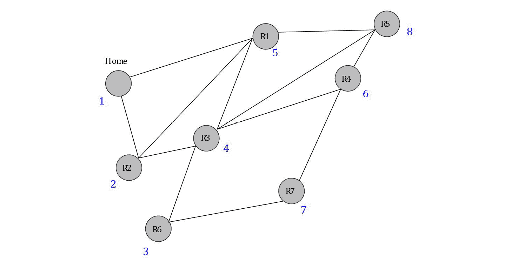

###### 图 6.2:将邻域图表示为图形

在数学记数法中，给定一个图， *G = < V，E >* ，图的遍历问题是访问所有*V**∑**V*从给定顶点开始， *s* 。图遍历问题也被称为**图搜索问题**，因为它可以用来“找到”图中的一个顶点。不同的图遍历算法给出了访问图中顶点的不同顺序。

### 广度优先搜索

图的“广度优先”搜索或广度优先遍历开始于将起始顶点添加到由一组先前访问过的顶点组成的**边界**，然后迭代探索与当前边界相邻的顶点。下面举例说明的步骤应该有助于您理解这个想法:

1.  First, the *Home* vertex, which is the starting point, is visited. *R1* and *R2* are the neighbors of the vertices in the current frontier, which is represented by a blue dotted line in the following figure:

    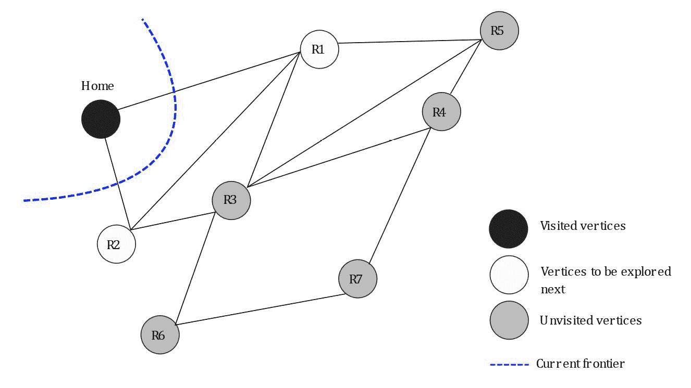

    ###### 图 6.3:BFS 边界的初始化

2.  The following figure shows BFS after visiting *R1* and *R1*, either of which can be visited before the other. The order of visiting vertices that are at the same distance from the source vertex is irrelevant; however, the vertices with lower distance from the source are always visited first:

    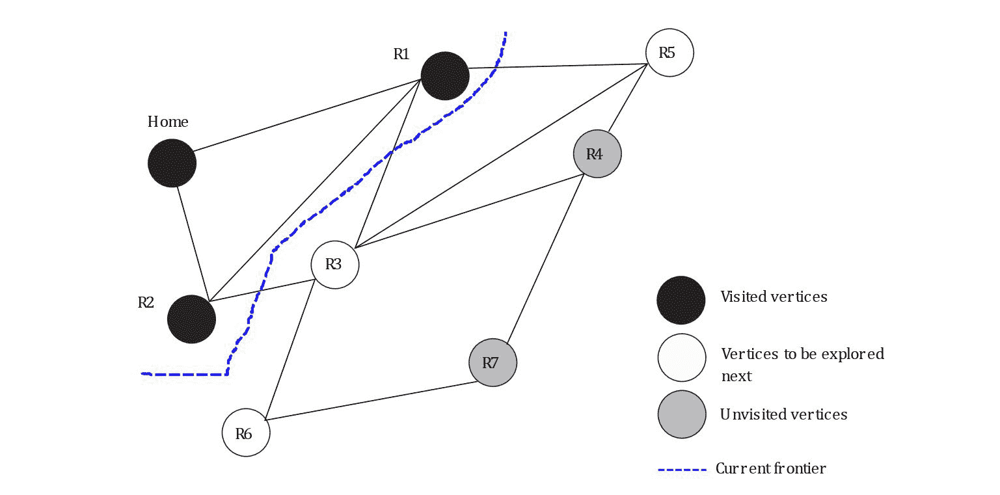

    ###### 图 6.4:访问 R1 和 R2 顶点后的 BFS 边界

3.  下图为访问 *R3* 、 *R5* 、 *R6* 后的 BFS 状态。这基本上是遍历整个图之前的倒数第二个阶段:


###### 图 6.5:访问 R3、R5 和 R6 后的 BFS 边境

BFS 的一个有用的性质是，对于每个被访问的顶点，它的所有子顶点都在任何子顶点之前被访问。但是，在实现 BFS 时，通常不会在单独的数据结构中明确维护边界。相反，使用顶点标识队列来确保更靠近源顶点的顶点总是在更远的顶点之前被访问。在下面的练习中，我们将用 C++实现 BFS。

### 练习 28:实施 BFS

在本练习中，我们将使用图的边列表表示来实现广度优先搜索算法。为此，请执行以下步骤:

1.  添加需要的头文件并声明图形，如下:

    ```cpp
    #include <string>
    #include <vector>
    #include <iostream>
    #include <set>
    #include <map>
    #include <queue>
    template<typename T> class Graph;
    ```

2.  Write the following struct, which represents an edge in our graph:

    ```cpp
    template<typename T>
    struct Edge
    {
        size_t src;
        size_t dest;
        T weight;
        // To compare edges, only compare their weights,
        // and not the source/destination vertices
        inline bool operator< (const Edge<T>& e) const
        {
            return this->weight < e.weight;
        }
        inline bool operator> (const Edge<T>& e) const
        {
            return this->weight > e.weight;
        }
    };
    ```

    因为我们对边的定义使用模板，所以可以很容易地使边具有所需的任何数据类型的边权重。

3.  接下来，重载`Graph`数据类型的`<<`运算符，以显示图形的内容:

    ```cpp
    template <typename T>
    std::ostream& operator<<(std::ostream& os, const Graph<T>& G)
    {
        for (auto i = 1; i < G.vertices(); i++)
        {
            os << i << ":\t";
            auto edges = G.outgoing_edges(i);
            for (auto& e : edges)
                os << "{" << e.dest << ": " << e.weight << "}, ";
            os << std::endl;
        }
        return os;
    }
    ```

4.  编写一个类来定义我们的图数据结构，如下图所示:

    ```cpp
    template<typename T>
    class Graph
    {
    public:
        // Initialize the graph with N vertices
        Graph(size_t N) : V(N)
        {}
        // Return number of vertices in the graph
        auto vertices() const
        {
            return V;
        }
        // Return all edges in the graph
        auto& edges() const
        {
            return edge_list;
        }
        void add_edge(Edge<T>&& e)
        {
            // Check if the source and destination vertices are within range
            if (e.src >= 1 && e.src <= V &&
                e.dest >= 1 && e.dest <= V)
                edge_list.emplace_back(e);
            else
                std::cerr << "Vertex out of bounds" << std::endl;
        }
        // Returns all outgoing edges from vertex v
        auto outgoing_edges(size_t v) const
        {
            std::vector<Edge<T>> edges_from_v;
            for (auto& e : edge_list)
            {
                if (e.src == v)
                    edges_from_v.emplace_back(e);
            }
            return edges_from_v;
        }
        // Overloads the << operator so a graph be written directly to a stream
        // Can be used as std::cout << obj << std::endl;
        template <typename T>
        friend std::ostream& operator<<(std::ostream& os, const Graph<T>& G);
    private:
        size_t V;        // Stores number of vertices in graph
        std::vector<Edge<T>> edge_list;
    };
    ```

5.  For this exercise, we shall test our implementation of BFS on the following graph:

    

    ###### 图 6.6:练习 28 中实现 BFS 遍历的图形

    我们需要一个函数来创建和返回所需的图形。请注意，虽然图中的每条边都分配了边权重，但这不是必需的，因为 BFS 算法不需要使用边权重。按如下方式实现该功能:

    ```cpp
    template <typename T>
    auto create_reference_graph()
    {
        Graph<T> G(9);
        std::map<unsigned, std::vector<std::pair<size_t, T>>> edges;
        edges[1] = { {2, 2}, {5, 3} };
        edges[2] = { {1, 2}, {5, 5}, {4, 1} };
        edges[3] = { {4, 2}, {7, 3} };
        edges[4] = { {2, 1}, {3, 2}, {5, 2}, {6, 4}, {8, 5} };
        edges[5] = { {1, 3}, {2, 5}, {4, 2}, {8, 3} };
        edges[6] = { {4, 4}, {7, 4}, {8, 1} };
        edges[7] = { {3, 3}, {6, 4} };
        edges[8] = { {4, 5}, {5, 3}, {6, 1} };
        for (auto& i : edges)
            for (auto& j : i.second)
                G.add_edge(Edge<T>{ i.first, j.first, j.second });
        return G;
    }
    ```

6.  像这样实现广度优先搜索:

    ```cpp
    template <typename T>
    auto breadth_first_search(const Graph<T>& G, size_t dest)
    {
        std::queue<size_t> queue;
        std::vector<size_t> visit_order;
        std::set<size_t> visited;
        queue.push(1); // Assume that BFS always starts from vertex ID 1
        while (!queue.empty())
        {
            auto current_vertex = queue.front();
            queue.pop();
            // If the current vertex hasn't been visited in the past
            if (visited.find(current_vertex) == visited.end())
            {
                visited.insert(current_vertex);
                visit_order.push_back(current_vertex);
                for (auto e : G.outgoing_edges(current_vertex))
                    queue.push(e.dest);
            }
        }
        return visit_order;
    }
    ```

7.  添加以下创建参考图的测试和驱动程序代码，从顶点 *1* 开始运行 BFS，并输出结果:

    ```cpp
    template <typename T>
    void test_BFS()
    {
        // Create an instance of and print the graph
        auto G = create_reference_graph<unsigned>();
        std::cout << G << std::endl;
        // Run BFS starting from vertex ID 1 and print the order
        // in which vertices are visited.
        std::cout << "BFS Order of vertices: " << std::endl;
        auto bfs_visit_order = breadth_first_search(G, 1);
        for (auto v : bfs_visit_order)
            std::cout << v << std::endl;
    }
    int main()
    {
        using T = unsigned;
        test_BFS<T>();
        return 0;
    }
    ```

8.  运行前面的代码。您的输出应该如下所示:


###### 图 6.7:练习 28 的预期输出

下图显示了我们的 BFS 实现访问的顶点顺序。请注意，搜索从顶点 *1* 开始，然后逐渐访问离源更远的顶点。在下图中，红色的整数表示顺序，箭头表示我们的 BFS 实现访问图的顶点的方向:


###### 图 6.8:练习 28 中的 BFS 实现

BFS 的时间复杂度为 *O(V + E)* ，其中 *V* 为顶点数， *E* 为图中边数。

### 深度优先搜索

当 BFS 从源顶点开始并逐渐向外扩展搜索到更远的顶点时，DFS 从源顶点开始并沿着某个路径迭代访问尽可能远的顶点，返回到更早的顶点以沿着图中不同的路径探索顶点。这种搜索图形的方法也叫做**回溯**。以下图示步骤显示了 DFS 的工作原理:

1.  Naturally, we begin our traversal by visiting the *Home* vertex, as shown in the following figure:

    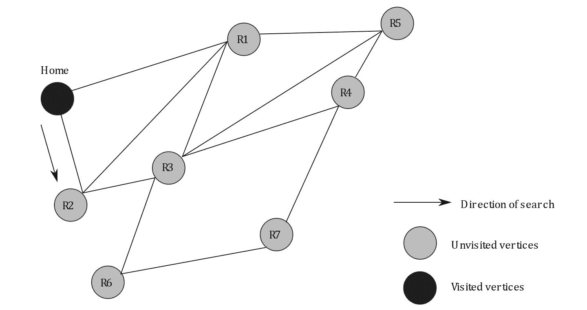

    ###### 图 6.9: DFS 初始化

2.  Next, we visit vertex *R2*. Note that *R2* is chosen arbitrarily over *R1* since both are adjacent to *Home*, and either could have been chosen without affecting the correctness of the algorithm:

    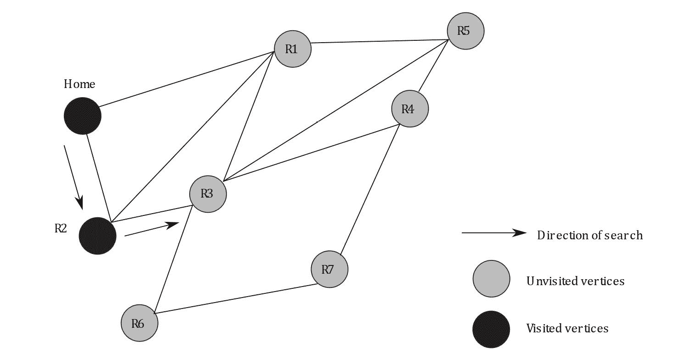

    ###### 图 6.10:访问 R2 后的 DFS

3.  Next, we visit vertex *R3*, as shown in the following figure. Again, either of *R3* or *R1* could have been chosen arbitrarily, as both are adjacent to *R2*:

    

    ###### 图 6.11:访问 R3 后的 DFS

4.  通过在每次迭代中访问任意未访问的相邻顶点来继续搜索。在 *R1* 被访问之后，搜索尝试寻找下一个未访问的顶点。由于没有剩余，搜索终止:


###### 图 6.12:访问图中所有顶点后的 DFS

在实现 BFS 时，我们使用队列来跟踪未访问的顶点。由于队列是**先进先出** ( **先进先出**)的数据结构，其中顶点从队列中移除的顺序与它们被添加到队列中的顺序相同，因此 BFS 算法使用它来确保更靠近起始顶点的顶点在更远的顶点之前被访问。实现 DFS 与实现 BFS 非常相似，除了一个区别:我们现在可以使用堆栈，而算法的其余部分保持不变，而不是使用队列作为要访问的顶点列表的容器。这种方法之所以有效，是因为在每次迭代中，DFS 都会访问当前顶点的一个未访问的邻居，这可以很容易地使用堆栈进行跟踪，堆栈是一种**后进先出** ( **后进先出**)数据结构。

### 练习 29:实施 DFS

在本练习中，我们将用 C++实现 DFS 算法，并在*图 6.2* 所示的图形上进行测试。步骤如下:

1.  包括需要的头文件，如下:

    ```cpp
    #include <string>
    #include <vector>
    #include <iostream>
    #include <set>
    #include <map>
    #include <stack>
    template<typename T> class Graph;
    ```

2.  Write the following struct in order to implement an edge in our graph:

    ```cpp
    template<typename T>
    struct Edge
    {
        size_t src;
        size_t dest;
        T weight;
        // To compare edges, only compare their weights,
        // and not the source/destination vertices
        inline bool operator< (const Edge<T>& e) const
        {
            return this->weight < e.weight;
        }
        inline bool operator> (const Edge<T>& e) const
        {
            return this->weight > e.weight;
        }
    };
    ```

    同样，由于我们的实现使用了结构的模板化版本，它允许我们分配任何所需数据类型的边权重。然而，出于 DFS 的目的，我们将使用空值作为边缘权重的占位符。

3.  接下来，重载图形的`<<`操作符，以便使用以下功能打印出来:

    ```cpp
     template <typename T>
    std::ostream& operator<<(std::ostream& os, const Graph<T>& G)
    {
        for (auto i = 1; i < G.vertices(); i++)
        {
            os << i << ":\t";
            auto edges = G.outgoing_edges(i);
            for (auto& e : edges)
                os << "{" << e.dest << ": " << e.weight << "}, ";
            os << std::endl;
        }
        return os;
    }
    ```

4.  实现使用边列表表示的图形数据结构，如下所示:

    ```cpp
    template<typename T>
    class Graph
    {
    public:
        // Initialize the graph with N vertices
        Graph(size_t N) : V(N)
        {}
        // Return number of vertices in the graph
        auto vertices() const
        {
            return V;
        }
        // Return all edges in the graph
        auto& edges() const
        {
            return edge_list;
        }
        void add_edge(Edge<T>&& e)
        {
            // Check if the source and destination vertices are within range
            if (e.src >= 1 && e.src <= V &&
                e.dest >= 1 && e.dest <= V)
                edge_list.emplace_back(e);
            else
                std::cerr << "Vertex out of bounds" << std::endl;
        }
        // Returns all outgoing edges from vertex v
        auto outgoing_edges(size_t v) const
        {
            std::vector<Edge<T>> edges_from_v;
            for (auto& e : edge_list)
            {
                if (e.src == v)
                    edges_from_v.emplace_back(e);
            }
            return edges_from_v;
        }
        // Overloads the << operator so a graph be written directly to a stream
        // Can be used as std::cout << obj << std::endl;
        template <typename T>
        friend std::ostream& operator<< <>(std::ostream& os, const Graph<T>& G);
    private:
        size_t V;        // Stores number of vertices in graph
        std::vector<Edge<T>> edge_list;
    };
    ```

5.  现在，我们需要一个函数来为我们的图执行 DFS。执行如下:

    ```cpp
     template <typename T>
    auto depth_first_search(const Graph<T>& G, size_t dest)
    {
        std::stack<size_t> stack;
        std::vector<size_t> visit_order;
        std::set<size_t> visited;
        stack.push(1); // Assume that DFS always starts from vertex ID 1
        while (!stack.empty())
        {
            auto current_vertex = stack.top();
            stack.pop();
            // If the current vertex hasn't been visited in the past
            if (visited.find(current_vertex) == visited.end())
            {
                visited.insert(current_vertex);
                visit_order.push_back(current_vertex);
                for (auto e : G.outgoing_edges(current_vertex))
                {    
                    // If the vertex hasn't been visited, insert it in the stack.
                    if (visited.find(e.dest) == visited.end())
                    {
                        stack.push(e.dest);
                    }
                }
            }
        }
        return visit_order;
    }
    ```

6.  We shall test our implementation of the DFS on the graph shown here:

    

    ###### 图 6.13:练习 29 中实现 DFS 遍历的图

    使用以下函数创建并返回图表:

    ```cpp
    template <typename T>
    auto create_reference_graph()
    {
        Graph<T> G(9);
        std::map<unsigned, std::vector<std::pair<size_t, T>>> edges;
        edges[1] = { {2, 0}, {5, 0} };
        edges[2] = { {1, 0}, {5, 0}, {4, 0} };
        edges[3] = { {4, 0}, {7, 0} };
        edges[4] = { {2, 0}, {3, 0}, {5, 0}, {6, 0}, {8, 0} };
        edges[5] = { {1, 0}, {2, 0}, {4, 0}, {8, 0} };
        edges[6] = { {4, 0}, {7, 0}, {8, 0} };
        edges[7] = { {3, 0}, {6, 0} };
        edges[8] = { {4, 0}, {5, 0}, {6, 0} };
        for (auto& i : edges)
            for (auto& j : i.second)
                G.add_edge(Edge<T>{ i.first, j.first, j.second });
        return G;
    }
    ```

    请注意边缘权重使用空值，因为 DFS 不需要边缘权重。图的更简单的实现可以完全省略边权重，而不影响我们的 DFS 算法的行为。

7.  最后，添加以下测试和驱动程序代码，运行我们的 DFS 实现并打印输出:

    ```cpp
    template <typename T>
    void test_DFS()
    {
        // Create an instance of and print the graph
        auto G = create_reference_graph<unsigned>();
        std::cout << G << std::endl;
        // Run DFS starting from vertex ID 1 and print the order
        // in which vertices are visited.
        std::cout << "DFS Order of vertices: " << std::endl;
        auto dfs_visit_order = depth_first_search(G, 1);
        for (auto v : dfs_visit_order)
            std::cout << v << std::endl;
    }
    int main()
    {
        using T = unsigned;
        test_DFS<T>();
        return 0;
    }
    ```

8.  编译并运行前面的代码。您的输出应该如下所示:


###### 图 6.14:练习 29 的预期输出

下图显示了我们的 DFS 实现访问顶点的顺序:

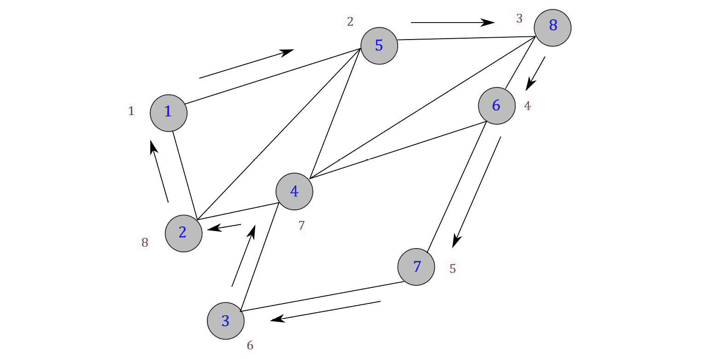

###### 图 6.15:访问顶点的顺序和 DFS 的方向

BFS 和 DFS 的时间复杂度都是 *O(V + E)* 。然而，这两种算法之间有几个重要的区别。下面的列表总结了两者之间的差异，并指出了其中一个优于另一个的一些情况:

*   BFS 更适合寻找离源顶点更近的顶点，而 DFS 通常更适合寻找离源更远的顶点。
*   一旦在 BFS 访问了一个顶点，从源点到顶点的路径保证是最短路径，而 DFS 则不存在这样的保证。这就是为什么所有单源和多源最短路径算法都使用某种 BFS 变体的原因。这将在本章接下来的章节中探讨。
*   当 BFS 访问与当前边界相邻的所有顶点时，BFS 创建的搜索树又短又宽，需要相对较多的内存，而 DFS 创建的搜索树又长又窄，需要相对较少的内存。

### 活动 13:使用 DFS 找出一个图是否是二分图

二部图是这样一种图，其中顶点可以被分成两组，这样图中的任何边都必须将一组中的一个顶点连接到另一组中的一个顶点。

二分图可以用来建模几种不同的实际用例。例如，如果给我们一个学生列表和一个班级列表，学生和班级之间的关系可以建模为一个包含学生和班级之间的边的二部图，如果学生注册了那个班级。正如你所想象的，从一个学生到另一个学生，或者从一个学科到另一个学科的优势是没有意义的。因此，这样的边在二部图中是不允许的。下图说明了这样一个模型:

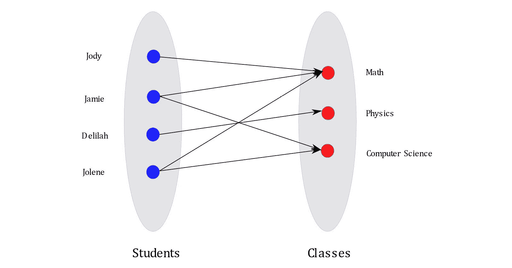

###### 图 6.16:代表不同班级学生注册情况的二分图示例

一旦像这里所示的模型已经准备好了，它就可以用来创建一个课程表，这样同一学生注册的两个班级就不会重叠。例如，如果 Jolene 注册了*数学*和*计算机科学*，这两门课就不应该同时安排，以免发生冲突。通过解决图中的最大流问题，可以使时间表中的冲突最小化。对于最大流问题，有几种标准算法是已知的:福特-富尔克森算法、迪尼奇算法和推-重新标记算法就是一些例子。然而，这样的算法通常很复杂，因此超出了本书的范围。

使用二分图建模实体之间关系的另一个用例是观众和大型视频流平台(如网飞和 YouTube)维护的电影列表之间的关系。

二部图的一个有趣的性质是，对于一般图来说是 *NP-complete* 的一些运算，如寻找最大匹配和顶点覆盖，对于二部图来说可以在多项式时间内求解。因此，确定给定的图是否是二分图是有用的。在本练习中，您需要实现一个 C++程序来检查给定的图 *G* 是否是二分图。

二分检查算法使用稍微修改的 DFS 版本，其工作原理如下:

1.  假设 DFS 从顶点 *1* 开始。将顶点标识 *1* 添加到堆栈中。
2.  如果堆栈上仍有未访问的顶点，请从堆栈中弹出一个顶点，并将其设置为当前顶点。
3.  如果分配给父顶点的颜色是蓝色，则将当前顶点分配为红色；否则，将当前顶点指定为蓝色。
4.  将当前顶点的所有未访问的相邻顶点添加到堆栈中，并将当前顶点标记为已访问。
5.  重复*步骤 2* 、*步骤 3* 和*步骤 4* ，直到所有顶点都被指定了颜色。如果算法终止时所有顶点都是彩色的，则给定的图是二分图。
6.  如果在运行*步骤 2* 时，搜索遇到一个已经被访问过的顶点，并且该顶点被分配了一种不同于其在*步骤 3* 中被分配的颜色(在搜索树中被分配给其父顶点的颜色的倒数)，则算法立即终止，并且给定的图不是二分图。

下图说明了前面算法的工作原理:

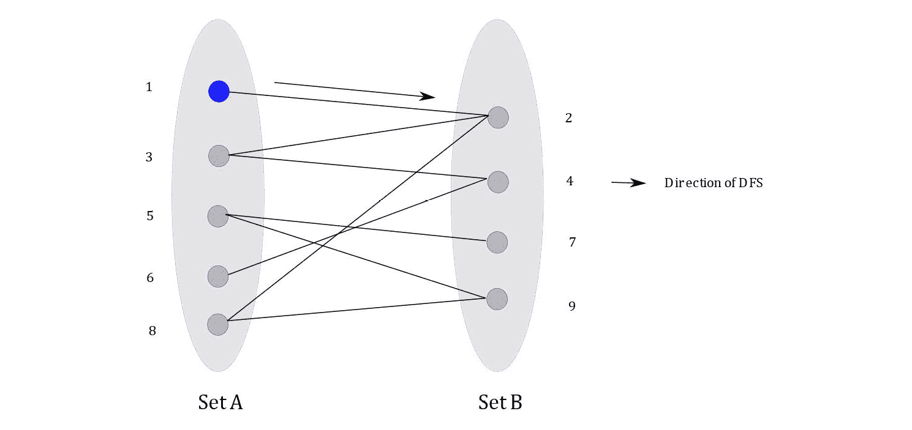

###### 图 6.17:初始化

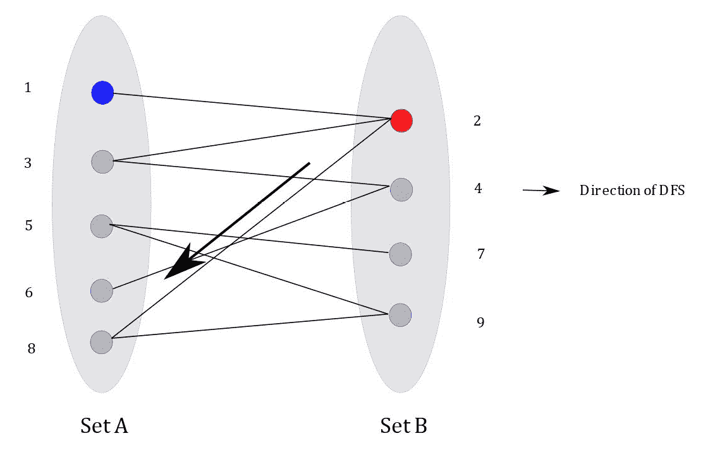

###### 图 6.18:由于顶点 1 被指定为蓝色，我们将顶点 2 涂成红色


###### 图 6.19:由于顶点 2 被涂成红色，我们把顶点 8 涂成蓝色。

从前面的一组图中可以观察到，该算法在图中曲折前进，为每个访问过的顶点分配交替的颜色。如果所有的顶点都可以这样着色，那么这个图就是二分图。如果 DFS 到达两个已经被分配了相同颜色的顶点，则可以安全地声明该图不是二分图。

使用图 6.17*中的图形作为输入，您的最终输出应该如下所示:*


###### 图 6.20:活动 13 的预期产出

#### 注意

这个活动的解决方案可以在第 524 页找到。

## Prim 的 MST 算法

MST 问题在*第 5 章*、*贪婪算法*中介绍，定义如下:

*“给定一个图，G = < V，E >，其中 V 是顶点集，E 是边集，每个边都与一个边权重相关联，找到一个树 T，它跨越 V 中的所有顶点，并且具有最小的总权重。”*

在*第 5 章*、*贪婪算法*中，我们讨论了 MST 问题和 Kruskal 算法的实际应用，该算法在给定的图中找到一个 MST。Kruskal 的算法将图的所有边添加到最小堆中，并贪婪地将最小成本边添加到 MST 中，检查每次添加时树中没有形成循环。

Prim 算法(也称为 Jarvik 算法)背后的思想与 BFS 相似。该算法首先将起始顶点添加到一个*边界*，该边界由一组先前访问过的顶点组成，然后迭代探索与当前边界相邻的顶点。然而，在每次迭代中选择要访问的顶点时，从边界选择具有最低成本边的顶点。

在实现 Prim 的算法时，我们在图的每个顶点上附加了一个*标签*，它存储了它与起始顶点的距离。该算法的工作原理如下:

1.  First, it initializes the labels on all the vertices and sets all the distances to infinity. Since the distance from the starting vertex to itself is *0*, it sets the label of the starting vertex to *0*. Then, it adds all the labels to a min-heap, *H*.

    下图中，红色显示的数字表示距起始顶点的估计距离，假设为顶点*1*；黑色数字表示边缘权重:

    

    ###### 图 6.21:初始化 Prim 的 MST 算法

2.  接下来，从 *H* 弹出一个顶点 *U* 。自然地， *U* 是与起始顶点距离最小的顶点。
3.  For all vertices, *V*, adjacent to *U*, if the label of *V* > edge weight of *(U, V)*, set the label of *V* = edge weight of *(U, V)*. This step is called *settling* or *visiting* vertex *U*:

    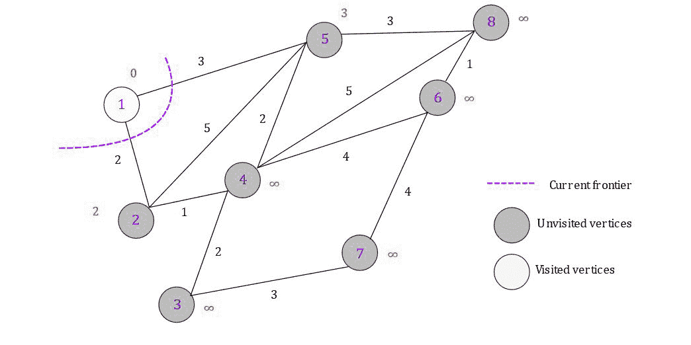

    ###### 图 6.22:访问顶点 1 后图的状态

4.  While unvisited vertices remain in the graph, go to *step 2*. The following figure shows the state of the graph after visiting vertex *2*, where the edge shown in green is the sole edge in our MST so far:

    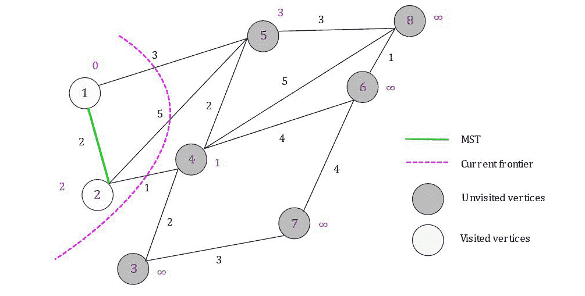

    ###### 图 6.23:访问顶点 2 后图的状态

5.  此处显示了所有顶点都已确定后的最终 MST:

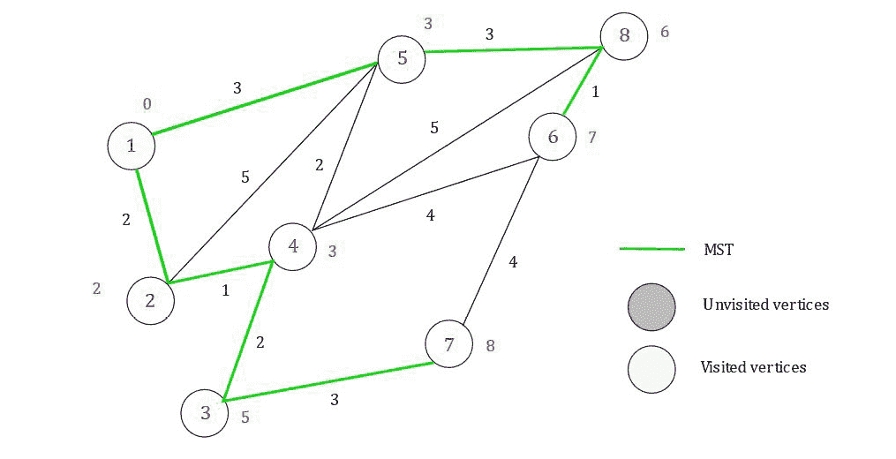

###### 图 6.24:我们图表的最大似然时间

### 练习 30:普里姆算法

在本练习中，我们将实施 Prim 算法，在*图 6.22* 所示的图中找到 MST。按照以下步骤完成本练习:

1.  添加需要的头文件，如下图:

    ```cpp
    #include <set>
    #include <map>
    #include <queue>
    #include <limits>
    #include <string>
    #include <vector>
    #include <iostream>
    ```

2.  使用以下结构实现图中的边:

    ```cpp
    template<typename T> class Graph;
    template<typename T>
    struct Edge
    {
        size_t src;
        size_t dest;
        T weight;
        // To compare edges, only compare their weights,
        // and not the source/destination vertices
        inline bool operator< (const Edge<T>& e) const
        {
            return this->weight < e.weight;
        }
        inline bool operator> (const Edge<T>& e) const
        {
            return this->weight > e.weight;
        }
    };
    ```

3.  使用以下函数重载`Graph`类的`<<`运算符，以便我们可以将图形输出到 C++流:

    ```cpp
     template <typename T>
    std::ostream& operator<<(std::ostream& os, const Graph<T>& G)
    {
        for (auto i = 1; i < G.vertices(); i++)
        {
            os << i << ":\t";
            auto edges = G.outgoing_edges(i);
            for (auto& e : edges)
                os << "{" << e.dest << ": " << e.weight << "}, ";
            os << std::endl;
        }
        return os;
    }
    ```

4.  添加一个基于边列表的图实现，如下图:

    ```cpp
    template<typename T>
    class Graph
    {
    public:
        // Initialize the graph with N vertices
        Graph(size_t N) : V(N)
        {}
        // Return number of vertices in the graph
        auto vertices() const
        {
            return V;
        }
        // Return all edges in the graph
        auto& edges() const
        {
            return edge_list;
        }
        void add_edge(Edge<T>&& e)
        {
            // Check if the source and destination vertices are within range
            if (e.src >= 1 && e.src <= V &&
                e.dest >= 1 && e.dest <= V)
                edge_list.emplace_back(e);
            else
                std::cerr << "Vertex out of bounds" << std::endl;
        }
        // Returns all outgoing edges from vertex v
        auto outgoing_edges(size_t v) const
        {
            std::vector<Edge<T>> edges_from_v;
            for (auto& e : edge_list)
            {
                if (e.src == v)
                    edges_from_v.emplace_back(e);
            }
            return edges_from_v;
        }
        // Overloads the << operator so a graph be written directly to a stream
        // Can be used as std::cout << obj << std::endl;
        template <typename T>
        friend std::ostream& operator<< <>(std::ostream& os, const Graph<T>& G);
    private:
        size_t V;        // Stores number of vertices in graph
        std::vector<Edge<T>> edge_list;
    };
    ```

5.  使用以下代码创建并返回图 6.22 所示的图形:

    ```cpp
     template <typename T>
    auto create_reference_graph()
    {
        Graph<T> G(9);
        std::map<unsigned, std::vector<std::pair<size_t, T>>> edges;
        edges[1] = { {2, 2}, {5, 3} };
        edges[2] = { {1, 2}, {5, 5}, {4, 1} };
        edges[3] = { {4, 2}, {7, 3} };
        edges[4] = { {2, 1}, {3, 2}, {5, 2}, {6, 4}, {8, 5} };
        edges[5] = { {1, 3}, {2, 5}, {4, 2}, {8, 3} };
        edges[6] = { {4, 4}, {7, 4}, {8, 1} };
        edges[7] = { {3, 3}, {6, 4} };
        edges[8] = { {4, 5}, {5, 3}, {6, 1} };
        for (auto& i : edges)
            for (auto& j : i.second)
                G.add_edge(Edge<T>{ i.first, j.first, j.second });
        return G;
    }
    ```

6.  接下来，我们将实现`Label`结构，它的一个实例被分配给图中的每个顶点，以便存储它与边界的距离。使用以下代码进行操作:

    ```cpp
    template<typename T>
    struct Label
    {
        size_t vertex_ID;
        T distance_from_frontier;
        Label(size_t _id, T _distance) :
            vertex_ID(_id),
            distance_from_frontier(_distance)
        {}
        // To compare labels, only compare their distances from source
        inline bool operator< (const Label<T>& l) const
        {
            return this->distance_from_frontier < l.distance_from_frontier;
        }
        inline bool operator> (const Label<T>& l) const
        {
            return this->distance_from_frontier > l.distance_from_frontier;
        }
        inline bool operator() (const Label<T>& l) const
        {
            return this > l;
        }
    };
    ```

7.  编写一个函数来实现 Prim 的 MST 算法，如下所示:

    ```cpp
    template <typename T>
    auto prim_MST(const Graph<T>& G, size_t src)
    {
        std::priority_queue<Label<T>, std::vector<Label<T>>, std::greater<Label<T>>> heap;
        std::set<int> visited;
        std::vector<T> distance(G.vertices(), std::numeric_limits<T>::max());
        std::vector<size_t> MST;
        heap.emplace(src, 0);
        // Search for the destination vertex in the graph
        while (!heap.empty())
        {
            auto current_vertex = heap.top();
            heap.pop();
            // If the current vertex hasn't been visited in the past
            if (visited.find(current_vertex.vertex_ID) == visited.end())
            {
                std::cout << "Settling vertex ID " 
    << current_vertex.vertex_ID << std::endl;
                MST.push_back(current_vertex.vertex_ID);
            // For each outgoing edge from the current vertex, 
            // create a label for the destination vertex and add it to the heap
                for (auto e : G.outgoing_edges(current_vertex.vertex_ID))
                {
                    auto neighbor_vertex_ID = e.dest;
                    auto new_distance_to_frontier = e.weight;
            // Check if the new path to the vertex is shorter
            // than the previously known best path. 
            // If yes, update the distance 
                    if (new_distance_to_frontier < distance[neighbor_vertex_ID])
                    {
    heap.emplace(neighbor_vertex_ID,  new_distance_to_frontier);
                        distance[e.dest] = new_distance_to_frontier;
                    }
                }
                visited.insert(current_vertex.vertex_ID);
            }
        }
        return MST;
    }
    ```

8.  最后，添加以下代码，运行我们对 Prim 算法的实现并输出结果:

    ```cpp
    template<typename T>
    void test_prim_MST()
    {
        auto G = create_reference_graph<T>();
        std::cout << G << std::endl;
        auto MST = prim_MST<T>(G, 1);
        std::cout << "Minimum Spanning Tree:" << std::endl;
        for (auto v : MST)
            std::cout << v << std::endl;
        std::cout << std::endl;
    }
    int main()
    {
        using T = unsigned;
        test_prim_MST<T>();
        return 0;
    }
    ```

9.  运行程序。您的输出应该如下所示:


###### 图 6.25:练习 30 的输出

当使用二进制最小堆和邻接表来存储 MST 时，Prim 算法的时间复杂度是*O(E+V log V)*，当使用一种称为“斐波那契最小堆”的堆时，可以将其改进为 *O(E + V log V)*

虽然 Prim 和 Kruskal 都是贪婪算法的例子，但它们在重要方面有所不同，其中一些总结如下:

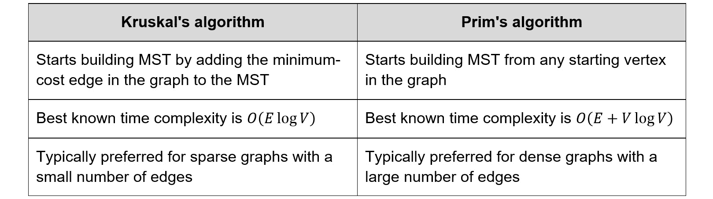

###### 图 6.26:比较克鲁斯卡尔和普里姆算法的表格

## 迪克斯特拉最短路径算法

每当用户在谷歌地图等路线规划应用程序或汽车内置的导航软件中请求路线时，图上的单源最短路径问题就会得到解决。问题定义如下:

*“给定一个有向图，G - < V，E >，其中 V 是顶点集，E 是边集，每个边都与边权重、源顶点和目的顶点相关联，找到从源到目的地的最小成本路径。”*

Dijkstra 的算法适用于非负边权重的图，只是对 Prim 的 MST 算法稍作修改，有两个主要变化:

*   Dijkstra 的算法不是将每个顶点上的标签设置为距离边界的最小距离，而是将每个顶点上的标签设置为距离源顶点的总距离。
*   如果从堆中弹出目标顶点，Dijkstra 的算法就会终止，而 Prim 的算法只有在堆中没有更多顶点需要处理时才会终止。

该算法的工作过程如下所示:

1.  First, it initializes the labels on all the vertices and sets all the distances to infinity. Since the distance from the starting vertex to itself is *0*, it sets the label of the starting vertex to *0*. Then, it adds all the labels to a min-heap, *H*.

    在下图中，红色数字表示从源(顶点 *2* )到目的地(顶点 *6* )的当前已知最佳距离:

    

    ###### 图 6.27:初始化迪克斯特拉算法

2.  然后，从 *H* 弹出一个顶点 *U* 。自然， *U* 是距离起始顶点距离最小的顶点。如果 *U* 是需要的目的地，我们已经找到了最短路径，算法终止。
3.  For all vertices, *V*, adjacent to *U*, if the label of *V* > (label of *U* + edge weight of *(U, V)*), we have found a path to *V* that is shorter than the previously known minimum-cost path. Therefore, set the label of *V* to (label of *U* + edge weight of *(U, V)*). This step is called **settling** or **visiting** the vertex *U*:

    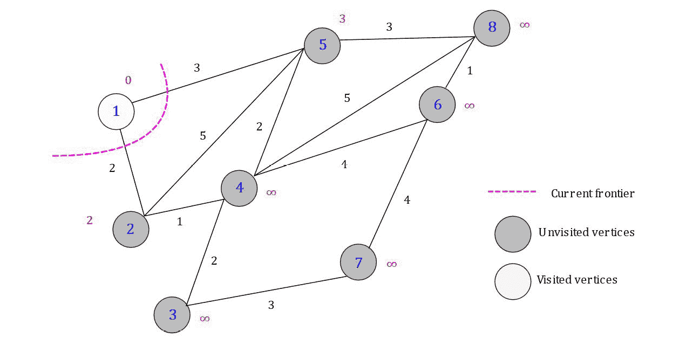

    ###### 图 6.28:解决顶点 1 后的算法状态

4.  While unvisited vertices remain in the graph, go to *step 2*. The following figure shows the state of the graph after settling vertex *2*:

    

    ###### 图 6.29:解决顶点 2 后算法的状态

5.  当从 *H* 弹出目的顶点(顶点标识 *6* )时，算法终止。算法从 *1* 到 *6* 找到的最短路径如下图所示。另外，其他固定顶点上的标签显示了从 *1* 到该顶点的最短距离:


###### 图 6.30:从 1 到 6 的最短路径

### 练习 31:实现迪克斯特拉算法

在本练习中，我们将实现 Dijkstra 算法，以在*图 6.28* 所示的图中找到最短路径。按照以下步骤完成本练习:

1.  包含需要的头文件，声明图形数据结构，如下图:

    ```cpp
    #include <string>
    #include <vector>
    #include <iostream>
    #include <set>
    #include <map>
    #include <limits>
    #include <queue>
    template<typename T> class Graph;
    ```

2.  编写以下结构来实现我们的图实现中的一条边:

    ```cpp
    template<typename T>
    struct Edge
    {
        size_t src;
        size_t dest;
        T weight;
        // To compare edges, only compare their weights,
        // and not the source/destination vertices
        inline bool operator< (const Edge<T>& e) const
        {
            return this->weight < e.weight;
        }
        inline bool operator> (const Edge<T>& e) const
        {
            return this->weight > e.weight;
        }
    };
    ```

3.  为`Graph`类重载`<<`运算符，以便可以使用流输出，如下所示:

    ```cpp
     template <typename T>
    std::ostream& operator<<(std::ostream& os, const Graph<T>& G)
    {
        for (auto i = 1; i < G.vertices(); i++)
        {
            os << i << ":\t";
            auto edges = G.outgoing_edges(i);
            for (auto& e : edges)
                os << "{" << e.dest << ": " << e.weight << "}, ";
            os << std::endl;
        }
        return os;
    }
    ```

4.  实现图形，如下图所示:

    ```cpp
    template<typename T>
    class Graph
    {
    public:
        // Initialize the graph with N vertices
        Graph(size_t N) : V(N)
        {}
        // Return number of vertices in the graph
        auto vertices() const
        {
            return V;
        }
        // Return all edges in the graph
        auto& edges() const
        {
            return edge_list;
        }
        void add_edge(Edge<T>&& e)
        {
            // Check if the source and destination vertices are within range
            if (e.src >= 1 && e.src <= V &&
                e.dest >= 1 && e.dest <= V)
                edge_list.emplace_back(e);
            else
                std::cerr << "Vertex out of bounds" << std::endl;
        }
        // Returns all outgoing edges from vertex v
        auto outgoing_edges(size_t v) const
        {
            std::vector<Edge<T>> edges_from_v;
            for (auto& e : edge_list)
            {
                if (e.src == v)
                    edges_from_v.emplace_back(e);
            }
            return edges_from_v;
        }
        // Overloads the << operator so a graph be written directly to a stream
        // Can be used as std::cout << obj << std::endl;
        template <typename T>
        friend std::ostream& operator<< <>(std::ostream& os, const Graph<T>& G);
    private:
        size_t V;        // Stores number of vertices in graph
        std::vector<Edge<T>> edge_list;
    };
    ```

5.  使用`Graph`类编写一个函数来创建*图 6.28* 所示的参考图，如下所示:

    ```cpp
    template <typename T>
    auto create_reference_graph()
    {
        Graph<T> G(9);
        std::map<unsigned, std::vector<std::pair<size_t, T>>> edges;
        edges[1] = { {2, 2}, {5, 3} };
        edges[2] = { {1, 2}, {5, 5}, {4, 1} };
        edges[3] = { {4, 2}, {7, 3} };
        edges[4] = { {2, 1}, {3, 2}, {5, 2}, {6, 4}, {8, 5} };
        edges[5] = { {1, 3}, {2, 5}, {4, 2}, {8, 3} };
        edges[6] = { {4, 4}, {7, 4}, {8, 1} };
        edges[7] = { {3, 3}, {6, 4} };
        edges[8] = { {4, 5}, {5, 3}, {6, 1} };
        for (auto& i : edges)
            for (auto& j : i.second)
                G.add_edge(Edge<T>{ i.first, j.first, j.second });
        return G;
    }
    ```

6.  Implement Dijkstra's algorithm, as shown here:

    ```cpp
    template <typename T>
    auto dijkstra_shortest_path(const Graph<T>& G, size_t src, size_t dest)
    {
        std::priority_queue<Label<T>, std::vector<Label<T>>, std::greater<Label<T>>> heap;
        std::set<int> visited;
        std::vector<size_t> parent(G.vertices());
        std::vector<T> distance(G.vertices(), std::numeric_limits<T>::max());
        std::vector<size_t> shortest_path;
        heap.emplace(src, 0);
        parent[src] = src;
        // Search for the destination vertex in the graph
        while (!heap.empty()) {
            auto current_vertex = heap.top();
            heap.pop();
            // If the search has reached the destination vertex
            if (current_vertex.vertex_ID == dest) {
                std::cout << "Destination " << 
    current_vertex.vertex_ID << " reached." << std::endl;
                break;
            }
            if (visited.find(current_vertex.vertex_ID) == visited.end()) {
                std::cout << "Settling vertex " << 
    current_vertex.vertex_ID << std::endl;
                // For each outgoing edge from the current vertex, 
                // create a label for the destination vertex and add it to the heap
                for (auto e : G.outgoing_edges(current_vertex.vertex_ID)) {
                    auto neighbor_vertex_ID = e.dest;
                    auto new_distance_to_dest=current_vertex.distance_from_source 
    + e.weight;
                    // Check if the new path to the destination vertex 
    // has a lower cost than any previous paths found to it, if // yes, then this path should be preferred 
                    if (new_distance_to_dest < distance[neighbor_vertex_ID]) {
                        heap.emplace(neighbor_vertex_ID, new_distance_to_dest);
                        parent[e.dest] = current_vertex.vertex_ID;
                        distance[e.dest] = new_distance_to_dest;
                    }
                }
                visited.insert(current_vertex.vertex_ID);
            }
        }
        // Construct the path from source to the destination by backtracking 
        // using the parent indexes
        auto current_vertex = dest;
        while (current_vertex != src) {
            shortest_path.push_back(current_vertex);
            current_vertex = parent[current_vertex];
        }
        shortest_path.push_back(src);
        std::reverse(shortest_path.begin(), shortest_path.end());
        return shortest_path;
    }
    ```

    我们的实现分两个阶段工作——它从源开始搜索目的顶点，并使用回溯阶段，其中最短路径是通过跟踪从目的点到源的父指针找到的。

7.  最后，通过在图中找到顶点 *1* 和 *6* 之间的最短路径，添加以下代码来测试我们对 Dijkstra 算法的实现:

    ```cpp
     template<typename T>
    void test_dijkstra()
    {
        auto G = create_reference_graph<T>();
        std::cout << "Reference graph:" << std::endl;
        std::cout << G << std::endl;
        auto shortest_path = dijkstra_shortest_path<T>(G, 1, 6);
        std::cout << "The shortest path between 1 and 6 is:" << std::endl;
        for (auto v : shortest_path)
            std::cout << v << " ";
        std::cout << std::endl;
    }
    int main()
    {
        using T = unsigned;
        test_dijkstra<T>();
        return 0;
    }
    ```

8.  运行程序。您的输出应该如下所示:

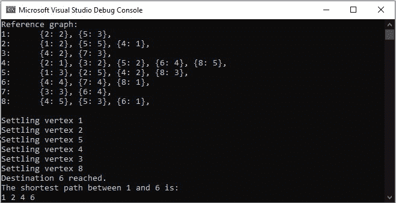

###### 图 6.31:练习 31 的输出

正如您在前面的输出中所看到的，我们的程序沿着顶点 *1* 和 *6* 之间的最短路径跟踪顶点。当使用 Fibonacci 最小堆时，Dijkstra 算法最著名的运行时间是 *O(E + V log V)* 。

### 活动 14:纽约最短路径

在本练习中，您需要用 C++实现 Dijkstra 算法，以便它可以用来在给定的纽约道路网络中找到最短路径。我们的道路图由 264，326 个顶点和 733，846 条有向边组成，边权重是顶点之间的欧氏距离。此活动的步骤如下:

1.  Download the road graph file from the following link: [https://raw.githubusercontent.com/TrainingByPackt/CPP-Data-Structures-and-Algorithm-Design-Principles/master/Lesson6/Activity14/USA-road-d.NY.gr](https://raw.githubusercontent.com/TrainingByPackt/CPP-Data-Structures-and-Algorithm-Design-Principles/master/Lesson6/Activity14/USA-road-d.NY.gr).

    #### 注意

    如果文件不是自动下载的，而是在您的浏览器中打开的，请通过右键单击任意空白处并选择“**另存为…** ”来下载文件

2.  If you're running Windows, move the downloaded file to `<project directory>/out/x86-Debug/Chapter6`.

    如果你运行的是 Linux，把下载的文件移到`<project directory>/build/Chapter6`。

    #### 注意

    目录结构可能因您的集成开发环境而异。该文件需要放在与编译的二进制文件相同的目录中。或者，您可以调整实现以接受文件的路径。

3.  The road graph is a text file with three different kinds of rows:

    

    ###### 图 6.32:描述纽约道路图文件的表格

4.  实现一个加权边图。假设一旦创建了图形，就不能在图形中添加或删除顶点，这是可以接受的。
5.  实现一个函数来解析道路图文件并填充该图。
6.  实现 Dijkstra 算法，通过寻找顶点`913`和`542`之间的最短路径来测试你的实现。您的输出应该如下所示:


###### 图 6.33:活动 14 的预期产出

#### 注意

这个活动的解决方案可以在第 530 页找到。

## 总结

本章我们讨论了三个主要的图问题:首先，图遍历问题，介绍了两种解决方案，广度优先搜索(BFS)和深度优先搜索(DFS)。其次，我们重新讨论了最小生成树问题，并使用 Prim 算法进行了求解。我们还将其与 Kruskal 算法进行了比较，并讨论了一个算法优于另一个算法的条件。最后，我们引入了单源最短路径问题，该问题在图中寻找最小代价的最短路径，并覆盖了 Dijkstra 最短路径算法。

然而，Dijkstra 算法只适用于边权重为正的图。在下一章中，我们将寻求放松这一限制，并引入一个最短路径算法，可以处理负边缘权重。我们还将推广最短路径问题，以找到图中所有顶点对之间的最短路径。