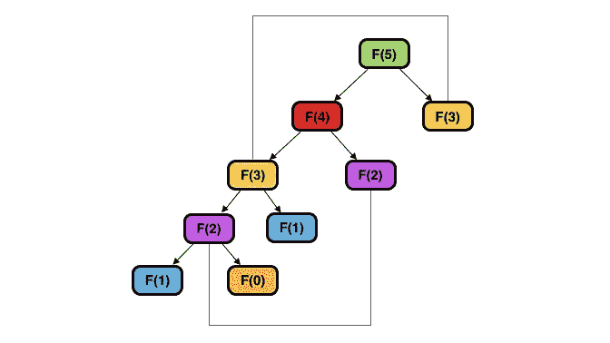
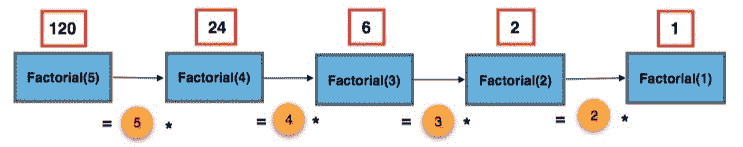
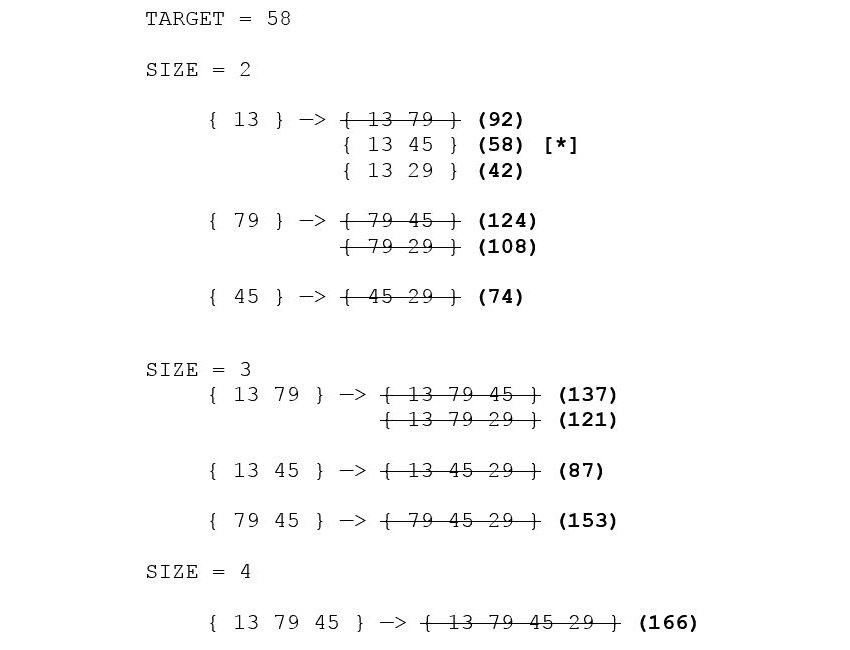
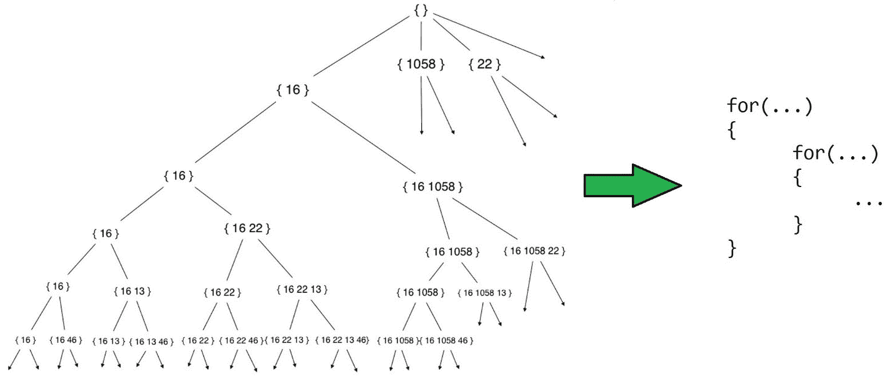
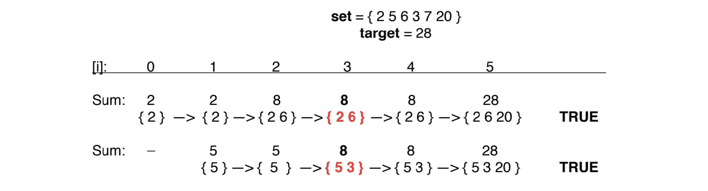
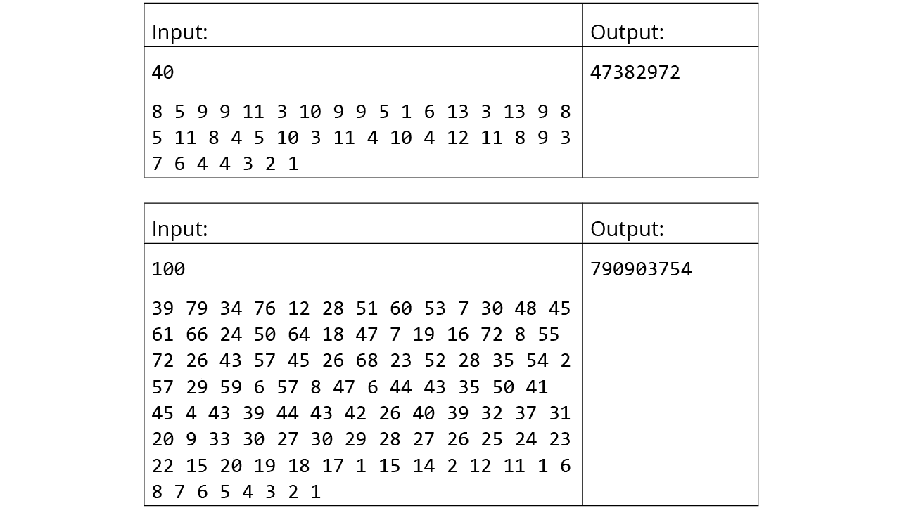
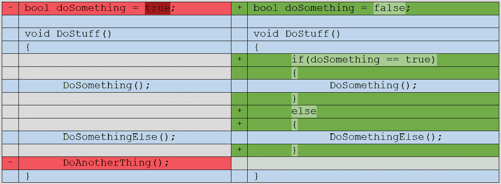
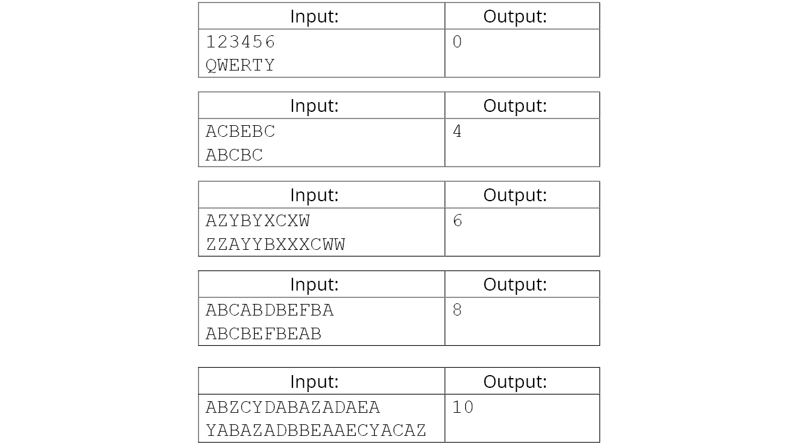
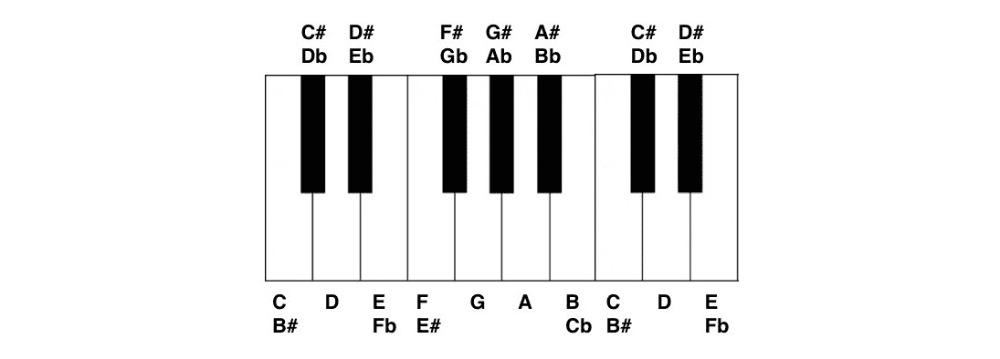

# 8。动态规划一

## 学习目标

本章结束时，您将能够:

*   分析动态规划方法是否可以应用于给定的问题
*   比较并选择记忆和列表的正确方法
*   使用记忆选择合适的缓存解决方案
*   使用简单的暴力方法分析问题
*   通过实施逐步优化的算法来开发动态编程解决方案

在本章中，将向您介绍动态编程方法。本章将指导您实现这种方法来解决计算机科学中一些众所周知的问题。

## 简介

受到许多程序员同样程度的喜爱和恐惧，**动态编程** ( **DP** )是各个击破范式的概念扩展，属于特定的问题类别。动态编程问题涉及的困难是多方面的，通常需要创造力、耐心和可视化抽象概念的能力。然而，这些问题带来的挑战往往有优雅而令人惊讶的简单解决方案，这可以为程序员提供远远超出当前任务范围的见解。

在前一章中，我们讨论了几种技术，例如各个击破和贪婪方法。这些方法虽然在正确的情况下相当有效，但在某些情况下不会产生最佳结果。例如，在前一章中，我们讨论了 Dijkstra 算法如何不能为具有负边权重的图产生最优结果，而 Bellman-Ford 算法却产生了最优结果。对于可以递归解决但无法使用上述技术解决的问题，动态规划解决方案通常可能是最好的方法。

DP 问题也在各种各样的情况下遇到。这里只是几个广泛的例子:

*   组合学(计算符合特定标准的序列组合/排列的数量)
*   字符串/数组(编辑距离、最长公共子序列、最长递增子序列等)
*   图(最短路径问题)
*   机器学习(语音/人脸识别)

让我们从了解动态编程的基本思想开始。

## 什么是动态规划？

回答这个问题的最好方法是举个例子。为了说明动态编程的目的，让我们考虑斐波那契数列:

```cpp
{ 0, 1, 1, 2, 3, 5, 8, 13, 21, 34, 55, … }
```

通过观察前面的序列，我们可以看到，从第三个元素开始，每个项都等于前面两个项的总和。这可以简单地用下面的公式表示:

```cpp
F(0) = 0
F(1) = 1
…
F(n) = F(n-1) + F(n-2)
```

我们可以清楚地看到，这个序列的项具有递归关系——当前项 *F(n)* 是基于之前项 *F(n-1)* 和 *F(n-2)* 的结果，因此前面的等式，即 *F(n) = F(n-1) + F(n-2)* ，被描述为序列的**递归关系**。初始术语 *F(0)* 和 *F(1)* 被描述为**基本情况**，或者产生溶液而不需要进一步递归的点。这些操作如下图所示:


###### 图 8.1:计算斐波那契数列中的第 n 项

用英语描述前面的图可能是这样的:

```cpp
F5 is equal to: 
    F4 + F3, where F4 is equal to:
    .    F3 + F2, where F3 is equal to:
    .    .    F2 + F1, where F2 is equal to:
    .    .    .    F1 + F0, where F1 = 1 and F0 = 0.
    .    .    …and F1 = 1.
    .    …and F2 is equal to:
    .        F1 + F0, where F1 = 1 and F0 = 0.
    …and F3 is equal to:
        F2 + F1, where F2 is equal to:
        .    F1 + F0, where F1 = 1 and F0 = 0
        …and F1 = 1.
```

我们将前面的方法描述为**自顶向下的解决方案**，因为它从递归树(即解决方案)的顶部开始，向下遍历其分支，直到到达基本用例。在 C++中，这可以用下面的递归函数来编写:

```cpp
    int Fibonacci(int n)
    {
        if(n < 2)
        {
            return n;
        }
        return Fibonacci(n – 1) + Fibonacci(n – 2);
    }
```

通过进一步观察树，我们可以看到几个**子问题**，或者说为了找到最终解而必须解决的中间问题，必须解决不止一次。比如 *F(2)* 的解必须找到才能得到*F(4)【F(3)+F(2)】*和*F(3)【F(2)+F(1)】*的解。因此，据说斐波那契数列表现出一种称为**重叠子问题**的性质。这是将标准的分治问题与动态编程问题分开的决定性特征之一；在前一种情况下，子问题往往是唯一的，而在后一种情况下，相同的子问题必须重复求解。

我们还可以看到，几个解分支彼此完全相同。例如，寻找 *F(2)* 的解将需要相同的一组计算，而不管你是需要它来求解 *F(4)* 还是 *F(3)* 。这说明了动态规划问题的第二个定义特征，即最优子结构。当整个问题的最优解可以通过其子问题的最优解的某种组合而形成时，一个问题被称为表现出**最优子结构**。

要用动态规划解决一个问题，它必须具备这两个性质。由于子问题的重叠性质，随着输入的增加，这些问题的复杂性趋于指数增长；然而，利用最佳子结构特性可以显著降低复杂性。因此，本质上，DP 的目的是设计一种缓存先前解决方案的方法，以避免重复计算先前解决的子问题。

## 记忆化——自上而下的方法

不，这不是“记忆”，尽管这也能相当准确地描述这种技术。使用记忆化，我们可以重新制定我们之前描述的自顶向下的解决方案，以利用斐波那契序列展示的最佳子结构属性。我们的程序逻辑将与以前基本相同，只是现在，在每一步都找到解决方案后，我们将结果缓存在一个数组中，根据 *n* 的当前值进行索引(在这个问题中， *n* 代表**状态**或定义当前递归分支的一组参数)。在每次函数调用的最开始，我们将检查缓存中是否有状态 *F(n)* 的可用解决方案。如果是这样，我们将简单地返回缓存值:

```cpp
const int UNKNOWN = -1;
const int MAX_SIZE = 100000;
vector<int> memo(MAX_SIZE, UNKNOWN);
int Fibonacci(int n)
{
    if(n < 2)
    {
        return n;
    }
    if(memo[n] != UNKNOWN)
    {
        return memo[n];
    }
    int result = Fibonacci(n - 1) + Fibonacci(n - 2);
    memo[n] = result;
    return result;
}
```

递归树现在如下所示:



###### 图 8.2:使用缓存的解计算斐波那契序列中的第 n 项

通过这样做，我们已经消除了相当多的多余工作。这种以自上而下的方式递归缓存解决方案的技术被称为**记忆**，并且基本上可以用于任何 DP 问题，假设以下情况成立:

1.  您可以设计一个缓存方案，利用不同状态的相似性，同时保留它们的唯一性。
2.  在超出可用的堆栈空间之前，您可以积累必要的子问题的解决方案。

第一点意味着为以后使用的结果编制索引的方法应该既有效又有用。为了使缓存方案有效，它必须仅被认为是状态的匹配，这些状态的解是从相同系列的子问题导出的；为了使它有用，它不能是特定于状态的，以至于不能被有效地使用(例如，如果每个子问题在缓存中都被分配了一个唯一的索引，条件“`if(memo[KEY] != UNKNOWN)`”将永远不会为真)。

第二点指的是导致堆栈溢出错误的可能性，如果递归调用的数量可能非常高，这是任何自顶向下方法的基本限制。当程序超过调用堆栈上可用的分配内存量时，就会发生堆栈溢出。根据给定问题的性质，所需的递归深度可能会阻止记忆成为可行的选择；一如既往，在选择方法之前评估手头任务的潜在复杂性是非常有益的。

记忆化通常是一种不错的动态规划优化方法。然而，在许多情况下，有更好的选择，我们将在下一节中研究。

## 列表-自下而上的方法

动态规划的*核心*是制表，这是记忆的逆方法。事实上，虽然术语*动态编程*有时被用于记忆和制表，但它的使用通常被认为是专指后者。

制表的标准实现包括存储基本情况的解决方案，然后用每个子问题的解决方案迭代填充一个表，然后可以重用该表来寻找其他子问题的解决方案。列表式解决方案通常被认为比记忆式解决方案更难概念化，因为每个子问题的状态必须以一种可以迭代表达的方式来表示。

计算斐波那契数列的列表解决方案如下:

```cpp
int Fibonacci(int n)
{
        vector<int> DP(n + 1, 0);
        DP[1] = 1;
        for(int i = 2; i <= n; i++)
        {
            DP[i] = DP[i-1] + DP[i-2];
        }
        return DP[n];
} 
```

在斐波那契例子中，状态非常简单，因为它是一维的和无条件的——公式总是认为，对于大于 *1* 的任何 n， *F(n) = F(n-1) + F(n-2)* 。但是，动态规划问题通常包含定义给定状态的几个维度，并且可能有多个条件影响状态之间的转换。在这种情况下，除了全面理解问题之外，确定如何表示当前状态可能还需要相当多的创造力。

然而，列表的优势是显著的。除了列表式解决方案往往在内存方面更高效这一事实之外，它们还会生成包含每个给定状态的完整查找表。因此，如果您可能会收到关于问题任何状态的查询，列表可能是您的最佳选择。

有趣的是，任何可以用记忆解决的问题，理论上都可以重新表述为列表式解决方案，反之亦然。使用前者通常可以为如何接近后者提供巨大的洞察力。在接下来的几节中，我们将探索动态编程问题的几个经典示例，并演示使用多种方法(从简单的暴力开始)如何让您达到表格解决方案所需的理解水平。

## 子集和问题

假设您正在实现数字收银机的逻辑。每当客户需要零钱时，您希望显示一条消息，告诉收银员当前在收银机中的钱是否可以以某种方式组合，以便其总和等于所需的零钱金额。例如，如果一个产品花费 7.50 美元，客户支付 10.00 美元，消息将报告收银机中的钱是否可以用来产生正好 2.50 美元的零钱。

假设登记簿目前包含十个 25 分硬币(10 x 0.25 美元)、四个一角硬币(4 x 0.10 美元)和六个五分硬币(6 x 0.05 美元)。我们可以很容易地得出结论，2.50 美元的目标金额可以通过以下方式形成:

```cpp
10 quarters                    -> $2.50
9 quarters, 2 dimes, 1 nickel  -> $2.25 + $0.20 + $0.05
9 quarters, 1 dime,  3 nickels -> $2.25 + $0.10 + $0.15
9 quarters, 5 nickels          -> $2.25 + $0.25
8 quarters, 4 dimes, 2 nickels -> $2.00 + $0.40 + $0.10
8 quarters, 3 dimes, 4 nickels -> $2.00 + $0.30 + $0.20
8 quarters, 2 dimes, 6 nickels -> $2.00 + $0.20 + $0.30
```

有了这些参数，问题就变得相当简单了，只需尝试所有可用的货币组合，直到找到与 2.50 美元匹配的金额，就可以解决这个问题。但是，如果需要的零钱是 337.81 美元，并且收银机包含 100 张钞票/硬币，分为 20 美元、10 美元、5 美元、1 美元、0.25 美元、0.10 美元、0.05 美元和 0.01 美元的面额，该怎么办？我们可以清楚地看到，随着复杂性的增加，尝试每一个可能的总和变得非常不切实际。这是一个被称为子集和问题的经典问题的例子。

**子集和问题**最基本的形式是问:给定一组非负整数`S`和一个整数`x`，是否有一个`S`元素的子集和等于`x`？看看下面的例子:

```cpp
S = { 13, 79, 45, 29 }
x = 42 —> True (13 + 29)
x = 25 —> False 
```

以前面的集合为例，我们可以找到以下 16 个子集:

```cpp
{ }
{ 13 }
{ 79 }
{ 45 }
{ 29 }
{ 13, 79 }
{ 13, 45 }
{ 13, 29 }
{ 79, 45 }
{ 79, 29 }
{ 45, 29 }
{ 13, 79, 45 }
{ 13, 79, 29 }
{ 13, 45, 29 }
{ 79, 45, 29 }
{ 13, 79, 45, 29 }
```

通过列出可以为不同大小的集合生成的子集总数，我们得到以下数字:

```cpp
0: 1
1: 2
2: 4
3: 8
4: 16
5: 32
6: 64
7: 128
…
```

从这个列表中，我们可以推导出从一组大小`n`可以形成的子集总数等于*2*T3】n，这证明了要考虑的子集数量随着 *n* 的大小呈指数增长。假设 *S* 中的元素数量很少，比如说 10 个或更少的元素，这个问题的强力方法可以很快找到解决方案；但是如果我们重新考虑包含 100 种不同纸币/硬币的收银机的例子， *S* 的大小将等于 100，这将需要探索 1，267，650，600，228，229，401，496，703，205，376 个子集！

### 解决子集和问题–步骤 1:评估数据保护的需求

当面临这样的问题时，我们的第一步是确定它是否可以(和/或应该)用 DP 解决。重申一下，如果 DP 具有以下特性，问题是可以解决的:

*   **重叠子问题**:和标准的各个击破法一样，通过某种方式将较小子问题的解进行组合，就可以推导出最终的解；然而，与分而治之相反，某些子问题会遇到多次。
*   **最优子结构**:给定问题的最优解可以由其子问题的最优解产生。

让我们从是否具备这些特征的角度来分析前面的例子:


###### '

###### 图 8.3:最优子结构和重叠子问题

如图所示，重新格式化子集集合清楚地说明了大小为 n 的每个新子集是如何通过向大小为`n - 1`的子集添加单个新元素而形成的。这是构建新子集的最佳方法，对于大小大于 0 的每个子集都适用。因此，子集和问题有一个**最优子结构**。我们还可以看到，几个子集都是由同一个“子子集”派生而来的(例如 *{ 13 79 45 }* 和 *{ 13 79 29 }* 都是基于 *{ 13 79 }* )。所以问题也有**重叠子问题**。

满足这两个标准后，我们可以得出结论，这个问题可以用动态规划来解决。

### 步骤 2–定义状态和基本案例

在确定这是一个发展伙伴关系问题之后，我们现在必须确定在这个问题的背景下什么构成了一种状态。换句话说，就我们试图回答的问题而言，是什么让一个可能的解决方案与另一个不同？

虽然在过程的早期考虑问题的这些方面通常是明智的，但是在没有清楚地理解最终结果是如何形成的情况下，定义 DP 问题的状态通常是非常困难的，因此以最直接的方式实施解决方案通常是非常有帮助的。因此，我们将通过两种不同的方式来解决子集和问题的基本情况和状态，这两种方式更容易实现。

在我们对动态编程的探索中，我们将考虑每一个问题总共四种不同的方法:**蛮力**、**回溯**、**记忆**和**制表**。与任何 DP 问题一样，所有这些方法都能够产生正确的结果，但前三种方法会随着输入规模的增加而迅速证明其局限性。然而，当处理任何动态编程问题时，以这种方式实现逐步优化的解决方案可以发挥很大的作用。

### 第二步:暴力

尽管效率低下，暴力解决方案在发展对手头问题的理解方面还是很有帮助的。实施强力方法可能是形成动态规划解决方案过程中必不可少的一步，原因如下:

*   **简单性**:编写一个解决方案而不考虑其效率的简单性可以是一个很好的方式来发展对问题基本方面的理解；它还可以导致对问题本质的洞察，否则在没有足够背景的情况下，试图理解其复杂性的行为可能会错过这些洞察。
*   **解决方案正确性的确定性**:通常情况下，当问题被更好地理解时，一个特别复杂的 DP 解决方案将需要相当多的重新设计。因此，有一种方法将您的解决方案输出与正确答案进行比较是非常重要的。
*   **可视化子问题的能力**:强力解决方案会生成每个潜在的解决方案，然后选择符合问题标准的解决方案。这为可视化如何形成正确的解决方案提供了一种有效的方法，然后可以检查其基本模式，以便在以后的方法中使用。

下面的练习演示了暴力方法的实现。

### 练习 36:使用蛮力方法解决子集和问题

在本练习中，我们将使用蛮力方法找到子集和问题的解决方案。让我们开始吧:

1.  让我们从包含以下标题(为了方便起见还有`std`名称空间)开始:

    ```cpp
    #include <iostream>
    #include <vector>
    #include <algorithm>
    using namespace std;
    ```

2.  另外，让我们定义一个名为`DEBUG`的预处理器常量和一个名为`PRINT`的宏，只有当`DEBUG`不为零时才会打印到`stderr`:

    ```cpp
    #define DEBUG 0
    #if DEBUG
    #define PRINT(x) cerr << x
    #else
    #define PRINT(x) 
    #endif
    ```

3.  我们现在将声明一个新的函数`SubsetSum_BruteForce()`，它接受两个参数——一个整数数组`set`和一个整数`sum`，并返回一个布尔值:

    ```cpp
    bool SubsetSum_BruteForce(vector<int> set, int sum)
    {
        ……
    }
    ```

4.  现在，让我们声明另一个函数，`GetAllSubsets()`，它接受四个参数——两个整数向量，`set`和`subset`；一个整数；`index`；和一个名为`allSubsets`的三维整数向量(通过引用传递)。我们将使用该函数递归生成 *S* 的所有子集:

    ```cpp
    void GetAllSubsets(vector<int> set, vector<int> subset, int index, vector<vector<vector<int>>> &allSubsets)
    {    
        // Terminate if the end of the set is reached
        if(index == set.size()) 
        {
            // Add the accumulated subset to the results, indexed by size
            allSubsets[subset.size()].push_back(subset);
            return;
        }
        // Continue without adding element to subset
        GetAllSubsets(set, subset, index + 1, allSubsets);
        // Add element to subset
        subset.push_back(set[index]);
        GetAllSubsets(set, subset, index + 1, allSubsets);
    }
    ```

5.  回到我们的`SubsetSum_BruteForce()`函数，我们现在可以声明`allSubsets`并调用函数:

    ```cpp
    bool SubsetSum_BruteForce(vector<int> set, int target)
    {
        vector<vector<vector<int>>> allSubsets(set.size() + 1);

        GetAllSubsets(set, {}, 0, allSubsets);

        ……
    ```

6.  现在，我们可以遍历每个子集，并将其总和与`target`进行比较，如果找到匹配，则返回`true`:

    ```cpp
    for(int size = 0; size <= set.size(); size++)
    {
        PRINT("SIZE = " << size << endl);
        for(auto subset : allSubsets[size])
        {
            int sum = 0;
            PRINT("\t{ ");
            for(auto number : subset)
            {
                    PRINT(number << " ");
                    sum += number;
            }
            PRINT("} = " << sum << endl);
            if(sum == target) return true;
        }
    }
    ```

7.  如果在检查每个子集后没有找到匹配的和，我们返回`false` :

    ```cpp
        ……
        return false;
    }
    ```

8.  现在，在`main()`功能中，让我们定义我们的集合和目标如下:

    ```cpp
    int main()
    {
        vector<int> set = { 13, 79, 45, 29 };
        int target = 58;
        ……
    }
    ```

9.  我们现在可以这样调用`SubsetSum_BruteForce()`输入:

    ```cpp
    bool found = SubsetSum_BruteForce(set, target);
    if(found)
    {
        cout << "Subset with sum " << target << " was found in the set." << endl;
    }
    else 
    {
        cout << "Subset with sum " << target << " was not found in the set." << endl;
    }
    ```

10.  运行上述代码后，您应该会看到以下输出:

    ```cpp
    Subset with sum 58 was found in the set.
    ```

11.  现在，让我们将`target`设置为集合中找不到的总和:

    ```cpp
    int target = 1000000;
    ```

12.  再次运行程序应产生以下输出:

    ```cpp
    Subset with sum 1000000 was not found in the set.
    ```

13.  最后，让我们将`DEBUG`常数重新定义为 1:

    ```cpp
    #define DEBUG 1
    ```

14.  现在运行程序将产生以下输出:

    ```cpp
    SIZE = 0
        { } = 0
    SIZE = 1
        { 29 } = 29
        { 45 } = 45
        { 79 } = 79
        { 13 } = 13
    SIZE = 2
        { 45 29 } = 74
        { 79 29 } = 108
        { 79 45 } = 124
        { 13 29 } = 42
        { 13 45 } = 58
        { 13 79 } = 92
    SIZE = 3
        { 79 45 29 } = 153
        { 13 45 29 } = 87
        { 13 79 29 } = 121
        { 13 79 45 } = 137
    SIZE = 4
        { 13 79 45 29 } = 166
    Subset with sum 1000000 was not found in the set.
    ```

因此，我们能够使用蛮力方法找到所需的子集。请注意，为了找到解决方案，我们基本上在尝试各种可能性。在下一节中，我们将对其进行一层优化。

### 步骤 2.b:优化我们的方法——回溯

显然，暴力方法还有很多不足之处。就性能而言，它已经尽可能地低效了。通过不加区别地检查每个可能的子集，我们在确定选项永远不会导致解决方案(例如，总和超过目标的子集)之后很久才考虑选项。为了改进我们的算法，我们可以利用**回溯**来排除保证无效的子问题的所有分支。

在尝试使用 DP 之前实现回溯解决方案的主要优点是，它要求我们确定问题的基本情况和中间递归状态。正如我们在本章前面定义的，基本情况是递归函数中的一个条件，它不依赖于进一步的递归来产生答案。为了进一步说明，考虑计算一个数的阶乘的问题(一个数的阶乘， *n* ，相当于*n *(n-1)*(n-2)*(n-3)……* 1*)。我们可以编写一个 C++函数，如下所示:

```cpp
int Factorial(int n)
{
    // Base case — stop recursing
    if(n == 1)
    {
        return 1;
    }
    // Recurse until base case is reached
    return n * Factorial(n - 1);
}
```

这个递归函数的结构可以这样说明:



###### 图 8.4:递归计算第 n 个阶乘

`n = 1`条件是基本情况，因为这是解可以返回而不进一步递归的点。

在子集和问题中，定义基本情况的一种方法如下:

```cpp
If sum of a given subset is equal to target : TRUE

Otherwise:
    — If sum is greater than target : FALSE
    — If end of set is reached : FALSE
```

既然我们已经建立了基本案例，我们需要定义我们的中间状态。使用我们的蛮力算法的输出作为参考，我们可以分析每个大小组的子集是如何形成的，以绘制出我们的状态转换:

```cpp
Base case —> { } [SUM = 0]
{ } —> { 13 } [0 + 13 = 13]
       { 79 } [0 + 79 = 79]
       { 45 } [0 + 45 = 45]
       { 29 } [0 + 29 = 29]
```

当然大小`0`和大小`1`状态是最容易理解的。我们从一个空集合开始，我们可以向其中添加任何元素，以便创建大小为 1 的所有子集。

```cpp
{ 13 } —> { 13 79 } [13 + 79 = 92]
          { 13 45 } [13 + 45 = 58]
          { 13 29 } [13 + 29 = 42]
{ 79 } —> { 79 45 } [79 + 45 = 124]
          { 79 29 } [79 + 29 = 108]
{ 45 } —> { 45 29 } [45 + 29 = 74]
```

对于大小为 2 的子集，我们可以遵循同样的逻辑。只需取大小为 1 的每个子集，并追加索引大于该子集中索引最高的元素的每个元素。这基本上是我们在强力实现中采用的方法；但是，这一次，我们将在处理它们时考虑每个子集的总和，并在当前总和超过目标时终止它们:



###### 图 8.5:消除超出目标的值

当`target`等于`58`时，我们可以看到大小为 3 或 4 的子集都不需要考虑。因此，我们可以如下描述我们的中间状态转换:

```cpp
for element of set at index i and subset ss:
    If sum of ss with set[i] is less than or equal to target: 
        1) Append set[i] to ss
        2) Increment i 
        Next state —> (i = i + 1, ss = ss ∪ set[i])
    In any case: 
        1) Do not append set[i] to ss
        2) Increment i
        Next state —> (i = i + 1, ss = ss)
```

现在，我们应该问以下问题:

*   表示这种状态所需的最小数据量是多少？
*   我们如何重新表述前面的逻辑来删除不必要的信息？

考虑我们试图解决的具体问题:寻找元素的子集是否存在于和等于目标的集合中。根据问题描述，我们的任务不要求我们产生实际的子集，而只要求它们的和。因此，我们的伪代码可以更简洁地表达如下:

```cpp
for element of set at index i and its sum as sum:
    If sum plus set[i] is less than or equal to target: 
        1) Add value of set[i] to sum
        2) Increment i 
        Next state —> (i = i + 1, sum = sum + set[i])
    In any case: 
        1) Do not add value of set[i] to sum
        2) Increment i
        Next state —> (i = i + 1, sum = sum)
```

使用这种新的方法，我们基本上可以用两个整数`sum`和`i`来表示每个状态转换，消除了在最坏的情况下存储 *2* *n* 子集数组的需要。此外，我们可以通过反转问题来消除跟踪目标值的需要(即，从`target`开始，在每一步减去`set[i]`)。作为最后的优化，我们可以在调用函数之前对集合进行排序，这样一旦总和超过目标，我们就可以确定没有其他有效的可能性。我们将在下面的练习中用 C++实现这一点。

### 练习 37:用回溯法解决子集和问题

在本练习中，我们将解决一个类似于*练习 36* 、*中演示的问题，使用蛮力方法*解决子集和问题，但使用回溯方法和更复杂的输入来突出差异。让我们开始吧:

1.  为了实现子集和问题的回溯解，我们定义了一个名为`SubsetSum_Backtracking()`的函数，如下所示:

    ```cpp
    bool SubsetSum_Backtracking(vector<int> &set, int sum, int i) 
    {
        ……
    }
    ```

2.  正如递归函数中经常出现的情况，我们在最开始定义我们的基本情况:

    ```cpp
    // The sum has been found
    if(sum == 0)
    {
        return true;
    }
    // End of set is reached, or sum would be exceeded beyond this point
    if(i == set.size() || set[i] > sum)
    {
        return false;
    }
    ```

3.  在每一步，我们的选择是将当前元素的值添加到总和中，或者保持总和不变。我们可以把这个逻辑浓缩成一行，比如:

    ```cpp
    // Case 1: Add to sum
    // Case 2: Leave as-is 
    return SubsetSum_Backtracking(set, sum – set[i], i + 1) 
        || SubsetSum_Backtracking(set, sum, i + 1); 
    ```

4.  回到`main`，让我们对集合进行排序，并将我们的呼叫添加到`SubsetSum_BruteForce()`呼叫下面的`SubsetSum_Backtracking()`:

    ```cpp
    sort(set.begin(), set.end());
    bool found;

    found = SubsetSum_BruteForce(set, target);
    found = SubsetSum_Backtracking(set, target, 0); 
    ```

5.  为了测试，我们将实现一个函数，显示每种方法找到解决方案所需的时间。首先，我们需要包括`<time.h>`和`<iomanip>`标题:

    ```cpp
    #include <iostream>
    #include <vector>
    #include <algorithm> 
    #include <time.h>
    #include <iomanip>
    ```

6.  我们还将定义一个名为`types`的字符串数组，我们将使用它来标记每种方法的结果:

    ```cpp
    vector<string> types = 
    {
        "BRUTE FORCE",
        "BACKTRACKING",
        "MEMOIZATION",
        "TABULATION"
    };
    const int UNKNOWN = INT_MAX;
    ```

7.  现在，我们将编写另一个函数`GetTime()`，该函数引用一个名为`timer`的`clock_t`对象和一个`string type`，然后返回`void` :

    ```cpp
    void GetTime(clock_t &timer, string type)
    {
        // Subtract timer value from current time to get time elapsed
        timer = clock() - timer;
        // Display seconds elapsed
        cout << "TIME TAKEN USING " << type << ": " << fixed << setprecision(5) << (float)timer / CLOCKS_PER_SEC << endl; 

        timer = clock(); // Reset timer 
    }
    ```

8.  现在，让我们重写`main()`函数，这样我们就可以按顺序执行每个函数调用，并比较每种方法花费的时间:

    ```cpp
    int main()
    {
        vector<int> set = { 13, 79, 45, 29 };
        int target = 58;
        int tests = 2;
        clock timer = clock();
        sort(set.begin(), set.end());
        for(int i = 0; i < tests; i++)
        {
            bool found;
            switch(i)
            {
                case 0: found = SubsetSum_BruteForce(set, target); break;
                case 1: found = SubsetSum_Backtracking(set, target, 0); break;
            }
            if(found)
            {
                cout << "Subset with sum " << target << " was found in the set." << endl;
            }
            else 
            {
                cout << "Subset with sum " << target << " was not found in the set." << endl;
            }    
            GetTime(timer, types[i]);
            cout << endl;
        }
        return 0;
    }
    ```

9.  最后，让我们重新定义我们的输入，以突出两种方法之间的效率差异:

    ```cpp
    vector<int> set = { 16, 1058, 22, 13, 46, 55, 3, 92, 47, 7, 98, 367, 807, 106, 333, 85, 577, 9, 3059 };
    int target = 6076;
    ```

10.  Your output will produce something along the lines of the following:

    ```cpp
    Subset with sum 6076 was found in the set.
    TIME TAKEN USING BRUTE FORCE: 0.89987
    Subset with sum 6076 was found in the set.
    TIME TAKEN USING BACKTRACKING: 0.00078
    ```

    #### 注意

    所用时间的实际值会因您的系统而异。请注意数值的差异。

正如您所看到的，在这个特殊的例子中，使用回溯方法找到答案的速度快了 1000 多倍。在下一节中，我们将通过使用缓存来进一步优化这个解决方案。

### 第三步:记忆

尽管回溯解决方案明显优于暴力破解，但仍远非理想。考虑一种情况，其中目标和很高，并且不在集合中——如果目标大于或等于集合中每个元素的和，我们可以通过预先计算总数并检查目标是否在有效范围内来轻松确定结果。然而，如果目标总和只是稍微低于这个数量，我们的算法仍然会被迫在完成之前探索几乎每一种可能性。

为了演示这种差异，请尝试使用`6799`作为目标运行上一练习中的代码(正好比集合中所有元素的总和少 1)。在作者的机器上，回溯解决方案平均花费大约 0.268 秒产生结果——比练习中使用的目标值花费的平均时间长近 350 倍。

值得庆幸的是，我们已经拥有了在利用记忆的同时设计自上而下的解决方案所需的所有信息。更好的是，我们几乎不需要修改我们以前的方法来实现它！

### 设计缓存方案

使用内存化最重要的方面是定义缓存方案。内存化解决方案的缓存结果可以通过多种方式完成，但最常见的方式如下:

*   简单数组，状态由数字索引表示
*   哈希表/映射，状态由描述性字符串表示，使用内置语言功能进行哈希处理
*   哈希表/映射，其状态由使用原始哈希公式创建的哈希值表示

这里的选择在很大程度上取决于上下文，但这里有一些一般的指导原则:

*   由数字索引访问的数组/向量往往比映射快得多，后者必须在映射中定位给定的键，以确定它是否已经被缓存。
*   即使状态可以表示为整数，如果缓存键非常大，那么一个数组的内存需求大到足以包含它们可能是不合理的。在这种情况下，地图是更好的选择。
*   哈希表(例如，`std::unordered_map`)在定位和检索关键字方面往往比标准的映射/字典结构快得多(但仍然比数组慢)。
*   `std::map`在哪些类型的数据可以用作密钥方面比`std::unordered_map`通用得多。虽然`std::unordered_map`在技术上可以提供相同的功能，但是它需要程序员为数据类型创建他们自己的散列函数，默认情况下，它不能存储为密钥。

您可能还记得本章的介绍，缓存方案应该如下:

*   **有效**:缓存键的表示方式必须避免不同状态之间的冲突，这些状态不用于解决同一组子问题。
*   **有价值/有用**:如果你的缓存方案非常具体，以至于它实际上从未产生任何“命中”，那么它基本上什么也没有完成。

在子集和问题中，我们可能会错误地认为，无法从具有给定`sum`值的状态中找到目标意味着不可能从具有相同和的任何其他状态中获得真实结果。因此，我们可以决定仅基于`sum`(即`if(memo[sum] != UNKNOWN) return memo[sum];`)的值来缓存每个解决方案。这是一个无效缓存方案的例子，因为它没有考虑到在同一个集合中可能有多种方法可以达到相同的总和，如下所示:

```cpp
{ 1 5 6 2 3 9 } 
Sum of { 1 5 } = 6
Sum of { 6 } = 6
Sum of { 1 2 3 } = 6
```

假设目标值是前面例子中的`8`。如果首先遇到第三种情况，`memo[6]`将被设置为`false`，这显然是不正确的，因为通过包含第四个元素(`2`)可以从其他两种情况中达到目标。

无用记忆方案的一个例子是这样一种方案，其中关键字等于子集的索引，因为每个可能的状态将包含一个完全唯一的关键字；因此，由同一组子问题形成的状态不会触发缓存命中。

如果您不确定缓存方案的有效性，存储一个在每次缓存命中时递增的计数器可能会很有用。如果该计数器的最终值等于`0`，或者相对于您必须考虑的状态数量非常低，您可以得出您的缓存方案需要修订的结论。

我们将探索使用向量缓存来实现记忆化。

### 练习 38:用记忆法解决子集和问题

在本练习中，我们将尝试实现与我们在*练习 37* 、*中通过使用回溯*解决子集和问题相同的解决方案，但是增加了记忆。让我们开始吧:

1.  我们现在将创建另一个名为`SubsetSum_Memoization()`的函数。该函数的定义将与`SubsetSub_Backtracking()`相同，除了它将包括对一个名为`memo` :

    ```cpp
    bool SubsetSum_Memoization(vector<int> &set, int sum, int         i, vector<vector<int>> &memo)
    {
        ……
    }
    ```

    的二维整数向量的引用
2.  这个函数的大部分代码看起来与回溯方法非常相似。例如，我们的基本案例将像以前一样定义:

    ```cpp
    if(sum == 0)
    {
        return true;
    }
    if(i == set.size() || set[i] > sum)
    {
        return false;
    }
    ```

3.  关键的区别在于，在基本情况之后，我们不是立即调查接下来的两个状态，而是检查`memo`表中的缓存结果:

    ```cpp
    // Is this state's solution cached?
    if(memo[i][sum] == UNKNOWN)
    {
        // If not, find the solution for this state and cache it
        bool append = SubsetSum_Memoization(set, sum - set[i], i + 1, memo);
        bool ignore = SubsetSum_Memoization(set, sum, i + 1, memo);
        memo[i][sum] = append || ignore;
    }
    // Return cached value
    return memo[i][sum];
    ```

4.  现在，我们应该在`main()`函数中插入对`SubsetSum_Memoization()`的调用:

    ```cpp
    int tests = 3;
    for(int i = 0; i < tests; i++)
    {
        bool found;
        switch(i)
        {
            case 0: found = SubsetSum_BruteForce(set, target); break;
            case 1: found = SubsetSum_Backtracking(set, target, 0); break;
            case 2:
            {
                // Initialize memoization table
                vector<vector<int>> memo(set.size(), vector<int>(7000, UNKNOWN));
                found = SubsetSum_Memoization(set, target, 0, memo);
                break;
            }
        }

        if(found)
        {
            cout << "Subset with sum " << target << " was found in the set." << endl;
        }
        else
        {
            cout << "Subset with sum " << target << " was not found in the set." << endl;
        }
        GetTime(timer, types[i]);
        cout << endl;
    }
    ```

5.  Now, let's define `target` as `6799` and run our code. You should see an output similar to this:

    ```cpp
    Subset with sum 6799 was not found in the set.
    TIME TAKEN USING BRUTE FORCE: 1.00100
    Subset with sum 6799 was not found in the set.
    TIME TAKEN USING BACKTRACKING: 0.26454
    Subset with sum 6799 was not found in the set.
    TIME TAKEN USING MEMOIZATION: 0.00127
    ```

    #### 注意

    所用时间的实际值会因您的系统而异。请注意数值的差异。

从输出中我们可以看到，缓存以指数因子优化了我们的问题。

### 第四步:制表

到目前为止，我们已经实现了三种不同的算法方法来解决子集和问题，每种方法都比前一种方法有显著的改进。然而，假设我们想要一个给定集合中所有可能子集和的列表。我们必须对每个和重复运行我们的算法，从 1 到整个集合的总和。对于这种情况，列表往往是唯一有效的选择。

实现这样一个问题的迭代列表解决方案通常很难概念化。尽管问题的递归公式非常适合多维状态和分支条件，但列表解决方案必须使用标准的`for` / `while`循环，以某种方式将复杂的层次浓缩成一组简单的迭代:



###### 图 8.6:描述了子集和问题的递归结构的复杂性是如何在表格化的 DP 解决方案中降低的

有几种方法可以解决这种减少，但最终它倾向于归结为你是否足够好地理解这个问题，以做出正确的概括。

与记忆一样，在定义问题的基本情况和状态后，第一个目标是开发一个方案来存储不同状态的解决方案。通常，列表方法使用简单的数组/向量来达到这个目的。在斐波那契数列的计算中，我们已经看到了一个非常简单的 DP 表的例子:

```cpp
F[n] = F[n – 1] + F[n – 2];
```

在本章前面，我们还讨论了如何递归计算阶乘。一种自下而上的方法来填充该问题的表格，如下所示:

```cpp
factorial[n] = factorial[n – 1] * n;
```

这些都是非常简单的例子，因为它们只包含一个维度，没有条件逻辑。每个州从头到尾都有一个一致的、可预测的公式。

这些例子和子集和问题之间的主要区别在于，在后者中唯一表示每个状态的最小方式需要两个维度——集合中的索引和当前和。

让我们更深入地考虑一下我们在这个问题上获得的一些见解:

*   每个可能的尺寸子集`k`可以通过获取新元素并将其附加到每个尺寸子集`k – 1`上来形成。
*   如果在索引`i`处找到了一个解，其和值为`x`，那么任何最终导致相同条件集的状态转换序列都将产生相同的结果:



###### 图 8.7:同一索引值上具有相同和值的多条路径

这两个递归路径在用红色表示的状态下具有等于`8`的和值和等于`3`的索引值，由于子集和问题的最优子结构，这意味着该状态的解只需要被找到一次——无论之前发生了什么，它的结果都将是相同的。

考虑到这些事实，我们可以从本质上颠倒自上而下的方法来开发自下而上的方法。

**自上而下逻辑:**

1.  从目标总和和集合的第一个索引开始。
2.  Iterate through the set:

    -如果总和减为零，结果为`TRUE`。

    -如果达到设定的终点或超过目标，结果为`FALSE`。

    -否则，您可以从总和中减去当前值或忽略它。

3.  如果可以从状态`S`找到目标，其中和等于`x`，指数等于`i`，那么也可以从任何更早的状态找到目标，最终导致状态`S`。

**自下而上逻辑:**

1.  从等于`0`的总和和索引值开始。
2.  Iterate through the set:

    -如果在指数`0`和`i`之间可以找到等于`x`的和，那么在指数`0`和`i+1`之间也可以找到等于`x`的和。

    -如果在指数`0`和`i`之间可以找到等于`x`的和，那么在指数`0`和`i+1`之间可以找到等于`x + set[i]`的和。

    就如何填充表格而言，自上而下的方法可以描述如下:

    在 S1 州，如果总和等于`x`且指数等于`i`，则出现以下任一情况时，`memo(i, x) = true`的值为:

    -目标可以从 S2 州找到(这里总和等于`x – set[i]`，指数等于`i + 1`)，或者…

    -可以从 S3 州找到目标(其中总和等于`x`，指数等于`i + 1`)

    -否则，`memo(i, x) = false`。

    这种逻辑的自下而上版本如下:

    如果总和等于`x`且指数等于`i`，则出现以下任一情况时，`DP(i, x) = true`的值为:

    - `x`小于`set[i]`和`DP(i-1, x) = true`的值

    - `x`大于或等于`set[i]`和`DP(i-1, sum) = true OR DP(i-1, sum – set[i]) = true`的值

    -否则，`DP(i, x) = false`。

换句话说，如果我们已经确定在指数`0`和`i`(含)之间可以形成和`x`，那么很明显，在指数`0`和`i + 1`之间可以形成等于`x`和`x + set[i]`的和。在下面的练习中，我们将看一下这一点的实现。

### 练习 39:用列表法解决子集和问题

在本练习中，我们将修改*练习 38* 、*使用记忆*解决子集和问题的解决方案，以便我们可以通过将逻辑从自上而下转换为自下而上来使用制表。让我们开始吧:

1.  我们将定义一个名为`SubsetSum_Tabulation()`的新函数，它以一个名为`set`的整数向量作为参数，并返回一个二维布尔向量:

    ```cpp
    vector<vector<bool>> SubsetSum_Tabulation(vector<int> set)
    {
        ……
    }
    ```

2.  我们声明一个叫做`DP`的二维布尔向量。第一个维度的大小应该等于`set`的长度，第二个维度的大小应该等于集合中最高可能的子集和(即所有元素的总和)加 1。DP 的每个值都应该初始化为`false`，除了基本情况(即总和等于零):

    ```cpp
    int maxSum = 0;
    for(auto num : set) 
    {
        maxSum += num;
    }
    vector<vector<bool>> DP(set.size() + 1, vector<bool>(maxSum + 1, false));
    for(int i = 0; i < set.size(); i++)
    {
        // Base case — a subset sum of 0 can be found at any index
        DP[i][0] = true;
    }
    ```

3.  现在，我们迭代两个嵌套的`for`循环，对应于`DP`表的第一个和第二个维度:

    ```cpp
    for(int i = 1; i <= set.size(); i++)
    {
        for(int sum = 1; sum <= maxSum; sum++)
        {
            ……
        }
    }
    ```

4.  现在，要填充表格，请使用以下代码:

    ```cpp
    for(int i = 1; i <= set.size(); i++)
    {
        for(int sum = 1; sum <= maxSum; sum++)
        {
            if(sum < set[i-1])
            {
                DP[i][sum] = DP[i-1][sum];
            }
            else
            {
                DP[i][sum] = DP[i-1][sum]
                        || DP[i-1][sum – set[i-1]];
            }
        }
    }
    return DP;
    ```

5.  现在，我们再次修改`main()`函数以包含我们的列表解决方案:

    ```cpp
    int main()
    {
        vector<int> set = { 16, 1058, 22, 13, 46, 55, 3, 92, 47, 7, 98, 367, 807, 106, 333, 85, 577, 9, 3059 };
        int target = 6076
        int tests = 4;
        clock_t timer = clock();
        sort(set.begin(), set.end());
        for(int i = 0; i < tests; i++)
        {
            bool found;
            switch(i)
            {
                ……
                case 3:
                {
                    vector<vector<bool>> DP = SubsetSum_Tabulation(set);
                    found = DP[set.size()][target];
                    break;
                }
            }
        }
        ……
    }
    ```

6.  You should see an output something like the one shown here:

    ```cpp
    Subset with sum 6076 was found in the set.
    TIME TAKEN USING BRUTE FORCE: 0.95602
    Subset with sum 6076 was found in the set.
    TIME TAKEN USING BACKTRACKING: 0.00082
    Subset with sum 6076 was found in the set.
    TIME TAKEN USING MEMOIZATION: 0.00058
    Subset with sum 6076 was found in the set.
    TIME TAKEN USING TABULATION: 0.00605
    ```

    #### 注意

    所用时间的实际值会因您的系统而异。请注意数值的差异。

7.  正如我们所看到的，列表解所花费的时间比记忆解和回溯解都要长。但是，使用`SubsetSum_Tabulation()`返回的 DP 表，我们可以使用下面的代码来查找每个可能的子集和:

    ```cpp
    int total = 0;
    for(auto num : set) 
    {
        total += num;
    }
    vector<vector<bool>> DP = SubsetSum_Tabulation(set);
    vector<int> subsetSums;
    for(int sum = 1; sum <= total; sum++)
    {
        if(DP[set.size()][sum])
        {
            subsetSums.push_back(sum);
        }
    }
    cout << "The set contains the following " << subsetSums.size() << " subset sums: ";
    for(auto sum : subsetSums) 
    {
        cout << sum << " ";
    }
    cout << endl; 
    ```

8.  这个的输出应该是这样开始和结束的:

    ```cpp
    The set contains the following 6760 subset sums: 3 7 9 10 12 13 16 19 20 22 …… 6790 6791 6793 6797 6800
    ```

因此，我们优化了解，也获得了所有状态的和值。

在这一章中，我们探索了多种解决子集和问题的方法，这反过来证明了动态编程方法的明显优势；然而，尽管 DP 解决方案相对于替代方案具有比较优势，但我们也展示了天真且相对低效的方法如何帮助我们更好地理解问题，这极大地简化了使用 DP 设计解决方案的过程。

动态编程解决方案所需的一些逻辑最初可能看起来相当复杂，难以掌握。强烈建议您在继续下一步之前充分理解我们在本节中讨论的每种解决方案方法，因为这是一个可以通过使用不同的输入参数和比较结果来加速的过程。此外，根据给定的输入绘制不同解决方案的图表可能特别有帮助。

### 活动 18:旅行行程

你正在为一家旅行社设计一个网络应用程序，希望帮助客户规划他们的假期行程。该软件的一个主要方面涉及路线规划，它允许用户指定他们想要访问的多个地点，然后查看他们在前往最终目的地的途中必须经过的城市列表。

你的代理机构与每个主要城市的特定运输公司都有合同，每个运输公司都对他们能走多远设定了限制。一架飞机或火车可以穿越多个城市，甚至整个国家，而公共汽车或出租车服务可能只愿意在最初位置之外的一两个城市旅行。当您的软件生成可能的中间站列表时，它还会显示该位置的运输公司愿意行驶的最大城市数量，以便客户可以相应地规划他们的路线。

您最近意识到，您的应用程序需要某种方法来允许客户过滤提供给他们的选项数量，因为许多受欢迎的旅游地点被密集的城镇群隔开。为此，您需要确定从给定的起始位置到达最终目的地的可能方法的总数，以便减少当信息过多时显示的信息量。

您的应用程序已经能够计算出发点和目的地之间的理想路线上的位置列表。由此，您得到了以下数据:

*   `N`:表示源和目的地之间城市数量的整数
*   `distance`:整数数组，代表运输公司在每个地点愿意穿越的最大城市数量

您的任务是实现一个算法，该算法将计算通过一系列中间位置到达目的地的可能方式的总数。

**输入**

第一行包含单个整数，`N`，起点和终点之间的城市数。

第二行包含`N`个用空格分隔的整数，其中每个整数 di 代表从索引`i`处的城市开始可以行驶的最大距离。

**输出**

您的程序应该输出一个整数以及从索引`0`开始到索引`N`结束遍历城市的总次数。因为数值随着`N`的增加而变得很大，所以将每个结果输出为`modulo 1000000007`。

**例**

假设您得到了以下输入:

```cpp
6
1 2 3 2 2 1
```

这意味着在源位置和目标位置之间总共有六个城市。从索引`i`处的给定城市，您可以选择前往`i + 1`至`i + distance[i]`(含)范围内的任何其他城市。如果我们把城市序列想象成一个图，前面例子的邻接关系如下:

```cpp
[0]: { 1 }
[1]: { 2, 3 }
[2]: { 3, 4, 5 }
[3]: { 4, 5 }
[4]: { 5, 6 }
[5]: { 6 }  
```

观察下图以获得进一步的说明:


###### 图 8.8:城市周边的例子

在上例中，可以通过以下方式到达目的地(以`E`代表终点):

```cpp
0 > 1 > 2 > 3 > 4 > 5 > E
0 > 1 > 2 > 3 > 4 > E
0 > 1 > 2 > 3 > 5 > E
0 > 1 > 2 > 4 > 5 > E
0 > 1 > 3 > 4 > 5 > E
0 > 1 > 2 > 4 > E
0 > 1 > 2 > 5 > E
0 > 1 > 3 > 4 > E
0 > 1 > 3 > 5 > E
```

这给了我们一个`9`的答案。

一般来说，遍历总是从索引`0`开始，到索引`N`结束。保证一个城市的指数`i`与`distance[i]`之和永远不会大于`N`，每个城市至少有一个对应的距离值`1`。

**测试用例**

以下测试用例应该有助于您更好地理解这个问题:


###### 图 8.9:活动 18 简单测试用例

下面是一些更复杂的测试案例:



###### 图 8.10:活动 18 复杂的测试用例

**额外积分**

假设您已经找到了一种方法，在合理的时间限制内通过了前面的测试用例，那么您可以用最后一个测试用例真正测试您的算法的效率，其中`N`等于`10000000`。因为值的数量会占用太多的打印空间，所以可以使用以下代码以编程方式生成数组值:

```cpp
vector<int> Generate(int n)
{
    vector<int> A(n);

    ULL val = 1;

    for(int i = 0; i < n; i++)
    {
        val = (val * 1103515245 + 12345) / 65536;
        val %= 32768;

        A[i] = ((val % 10000) % (n – i)) + 1;
    }
    return A;
}
```

你的程序应该打印`318948158`作为这个测试用例的结果。一个最佳算法应该能够在一秒钟内找到结果。

**活动指南**

*   最佳方法将在`O(n)`时间内运行，并且需要精确的`n`迭代。
*   如果您完全不确定如何制定差压解决方案，请使用本章中描述的增量方法，即先使用蛮力，然后逐步优化解决方案。
*   For insights into how the problem's states are formed, consider the recurrence relation exhibited by the Fibonacci sequence.

    #### 注意

    这个活动的解决方案可以在第 556 页找到。

## 字符串和序列的动态编程

到目前为止，我们对动态规划的探索主要集中在组合问题和用定义的公式计算整数序列的项上。现在，我们将考虑 DP 的另一个最常见的用途，即处理数据序列中的模式。程序员将 DP 用于此目的的最典型场景通常涉及搜索、比较和构造字符串。

作为软件开发人员，我们经常与几个人合作，他们都有能力对同一个项目做出贡献和修改。由于程序员可能会无意中在代码中引入一个错误，或者团队可能会针对给定的特性尝试一种不同的方法，然后决定返回到他们原来的方法，因此拥有某种版本控制系统变得极其重要。如果最近工作的某个功能神秘地出现了故障，那么有能力看到对代码所做的更改是至关重要的，尤其是在它们与早期版本的差异方面。因此，所有的版本控制系统都有一个“差异”特性，可以分析同一代码的两个版本之间的相似性，然后以某种方式向用户显示出来。

例如，假设您已经将以下代码添加到存储库中:

```cpp
bool doSomething = true;
void DoStuff()
{
    DoSomething();
    DoSomethingElse();
    DoAnotherThing();
}
```

第二天，你做了一些改变:

```cpp
bool doSomething = false;
void DoStuff()
{
    if(doSomething == true)
    { 
        DoSomething();
    }
    else 
    {
        DoSomethingElse();
    }
}
```

然后，diff 实用程序将显示类似如下的内容:



###### 图 8.11:差异实用程序输出

为了实现这一点，实用程序需要计算两个代码文件的相似性，方法是考虑两个版本共有的文本序列在字符串中不一定是连续的。此外，部分原始文本可能已被删除或出现在新版本的其他位置。这表明需要**近似**(或“**模糊**”**字符串匹配**，这是一种经常使用动态编程的技术。

### 最长公共子序列问题

**最长公共子序列问题**(通常缩写为 **LCS** )是动态规划最著名的经典例子之一。它回答了以下问题:给定两个数据序列，它们共同的最长子序列是什么？

举个例子，考虑两个字符串，`A`和`B`:


###### 图 8.12:找到最长公共子序列的两个给定字符串

最长的公共子序列是“`LONGEST`”:


###### 图 8.13:给定字符串中最长的公共子序列

根据我们从针对子集和问题实现的一系列方法中获得的见解，让我们更明智地处理这个问题。我们将从基本案例开始，提前制定一些关于问题结构的想法。

由于在没有首先考虑琐碎输入的情况下，很难理解大输入的 DP 问题的本质，让我们创建一些使用小输入字符串的不同场景的例子，并尝试找到最长公共子序列的长度(LCS):

```cpp
Case 1): A or B is empty
A   = ""
B   = ""
LCS = 0
A   = "A"
B   = ""
LCS = 0
A   = ""
B   = "PNEUMONOULTRAMICROSCOPICSILICOVOLCANOCONIOSIS"
LCS = 0
```

在一个或两个字符串都为空的情况下，很明显最长的公共子序列的长度总是等于零:

```cpp
Case 2) Both A and B contain a single character
A   = "A"
B   = "A"
LCS = 1
A   = "A"
B   = "B"
LCS = 0
Case 3) A has one character, B has two characters
A   = "A"
B   = "AB"
LCS = 1
A   = "A"
B   = "BB"
LCS = 0
```

这两种情况有一个简单的二进制定义——它们要么有共同的特征，要么没有:

```cpp
Case 4) Both A and B contain two characters
A:  = "AA"
B:  = "AA"
LCS = 2
A   = "BA"
B   = "AB"
LCS = 1
A   = "AA"
B   = "BB"
LCS = 0
```

长度为 2 的字符串会让事情变得更有趣，但逻辑仍然很琐碎。给定两个长度为 2 的字符串，它们要么相同，要么有一个共同的字符，要么没有共同的字符:

```cpp
Case 5) A and B both contain 3 characters
A   = "ABA"
B   = "AAB"
LCS = 2    
A   = "ABC"
B   = "BZC"
LCS = 2
```

现在，问题的复杂性开始显现。这个案例表明，比较逐渐变得不那么简单:

```cpp
Case 6: A and B both contain 4 characters
A   = AAAB
B   = AAAA
{ "AAA_", "AAA_" }
{ "AAA_", "AA_A" }
{ "AAA_", "A_AA" }
{ "AAA_", "_AAA" }
LCS = 3
A   = AZYB
B   = YZBA    
{ "_Z_B", "_ZB_" }
{ "__YB", "Y_B_" }
LCS = 2
```

到目前为止，应该相当明显的是，LCS 问题确实包含重叠的子问题。类似于前面的问题，我们可以观察到给定字符串有 2n 个可能的子集，其中`n`等于字符串的长度，除了现在我们有两个序列要处理。更糟糕的是，我们不能简单地独立考虑每个序列的子集，还必须对它们进行比较:


###### 图 8.14:两个字符串的所有可能的字符子序列，ABCX 和 ACY

我们不仅仅是在寻找连续的字符组，这一事实有几个含义:首先，相同的字符序列可以在整个字符串中出现多次，并且可以以任何可能的排列方式在任意字符串中间隔开，假设字符的顺序相同。其次，从任何给定的索引开始，可以有许多公共子序列。

在实现我们的暴力方法之前，让我们也定义什么构成了这个问题的状态。假设我们正在维护两个指针`i`和`j`，它们分别表示`A`和`B`中的字符索引，以及我们已经找到的常见字符子序列的记录:

```cpp
if i exceeds length of A, or j exceeds length of B:
— Terminate recursion and return length of subsequence
```

如果我们已经到达任何一个字符串的末尾，那么就没有什么可以比较的了，因为子序列的索引是有序的:

```cpp
if A[i] = B[j]:
— Increase length of subsequence by 1
— Increment both i and j by 1 
```

如果字符相等，不将其包含在我们找到的子序列中没有好处。我们增加两个指针，因为任何给定的字符在每个子序列中只能被认为是一次:

```cpp
Otherwise:
    Option 1) Explore further possibilities with i + 1, and j
    Option 2) Explore further possibilities with i, and j + 1
    LCS from this state is equal to maximum value of Option 1 and Option 2
```

如果我们没有找到匹配，我们可以选择探索下一个 A 的字符子集，或者下一个 B 的字符子集。我们不包括从这个状态同时递增两个索引的情况，因为这是多余的。下一次函数调用将探讨这种情况。概述此循环的结构如下所示:


###### 图 8.15:最长子序列问题的子问题树

在上图中，重叠的子问题已经用颜色编码。这个问题的最优子结构还不太清楚，但我们仍然可以做一些基本的概括:

*   我们只需要比较等长的子集。
*   从一个给定的状态，下一个状态的可能性可以通过增加`i`、`j`或两者来探索。
*   我们的搜索总是在到达任一字符串的末尾时结束。

希望我们的初步强力实现能够提供额外的见解。让我们在下面的练习中直接进入正题。

### 练习 40:使用蛮力方法找到最长的公共子序列

在本练习中，我们将使用蛮力方法来解决这个问题，就像我们在*练习 36* 、*中使用蛮力方法*解决子集和问题一样。让我们开始吧:

1.  首先包含以下标题，并定义我们在上一章中使用的`DEBUG`和`PRINT`宏:

    ```cpp
    #include <iostream>
    #include <time.h>
    #include <iomanip>
    #include <algorithm>
    #include <utility>
    #include <vector>
    #include <strings.h>
    #define DEBUG 1
    #if DEBUG
    #define PRINT(x) cerr << x
    #else 
    #define PRINT(x)
    #endif
    using namespace std;
    ```

2.  定义一个名为`LCS_BruteForce()`的函数，该函数接受以下参数:两个字符串`A`和`B`，两个整数`i`和`j`，以及一个整数对向量`subsequence`，并返回一个整数。在这个函数上面，我们还会声明一个全局范围的整数对的二维向量，即`found` :

    ```cpp
    vector<vector<pair<int, int>>> found;
    int LCS_BruteForce(string A, string B, int i, int j, vector<pair<int, int>> subsequence)
    {
        ……
    }
    ```

3.  `A` and `B` are, of course, the strings we are comparing, `i` and `j` represent our current positions in `A` and `B`, respectively, and `subsequence` is the collection of index pairs that form each common subsequence, which will be collected in `found` for output.

    由于我们已经有了伪代码，我们可以相对容易地实现我们的函数，只需将伪代码的每一行作为注释插入到我们的函数中，并将其翻译成下面的 C++代码:

    ```cpp
    // If i exceeds length of A, or j exceeds length of B:
    if(i >= A.size() || j >= B.size())
    {
        found.push_back(subsequence);
        //Terminate recursion and return length of subsequence
        return subsequence.size();
    }
    // if A[i] = B[j]:
    if(A[i] == B[j])
    {
        // Increase length of subsequence by 1
        subsequence.push_back({ i, j });
        // Increment both i and j by 1 
        return LCS_BruteForce(A, B, i + 1, j + 1, subsequence);
    }    
    /*
        Option 1) Explore further possibilities with i + 1, and j        
        Option 2) Explore further possibilities with i, and j + 1
        LCS from this state is equal to maximum value of Option 1 and Option 2
    */
    return max(LCS_BruteForce(A, B, i + 1, j, subsequence),
             LCS_BruteForce(A, B, i, j + 1, subsequence));
    ```

4.  在`main()`中，我们将以两个字符串的形式接收输入，然后在上面调用我们的函数:

    ```cpp
    int main() 
    {
        string A, B;
        cin >> A >> B;
        int LCS = LCS_BruteForce(A, B, 0, 0, {}); 
        cout << "Length of the longest common subsequence of " << A << " and " << B << " is: " << LCS << endl;
        …    
    }
    ```

5.  就像我们在上一章所做的那样，如果`DEBUG`没有设置为`0`，我们也将把找到的子序列输出到`stderr`。然而，由于这个问题更复杂，我们将把这个输出放在一个单独的函数中，`PrintSubsequences()` :

    ```cpp
    void PrintSubsequences(string A, string B)
    {
        // Lambda function for custom sorting logic
        sort(found.begin(), found.end(), [](auto a, auto b)
        {
            // First sort subsequences by length
            if(a.size() != b.size())
            {
                return a.size() < b.size();
            }
            // Sort subsequences of same size by lexicographical order of index
            return a < b;
        });
        // Remove duplicates 
        found.erase(unique(found.begin(), found.end()), found.end());
        int previousSize = 0;
        for(auto subsequence : found)
        {
            if(subsequence.size() != previousSize)
            {
                previousSize = subsequence.size();
                PRINT("SIZE = " << previousSize << endl);
            }
            // Fill with underscores as placeholder characters
            string a_seq(A.size(), '_');
            string b_seq(B.size(), '_');
            for(auto pair : subsequence)
            {
                // Fill in the blanks with the characters of each string that are part of the subsequence
                a_seq[pair.first] = A[pair.first];
                b_seq[pair.second] = B[pair.second];
            }
            PRINT("\t" << a_seq << " | " << b_seq << endl);
        }
    }
    ```

6.  然后我们可以在`main()`中调用这个函数，指定它应该被忽略，除非`DEBUG`被设置:

    ```cpp
    int main()
    {
        ……
    #if DEBUG
        PrintSubsequences();
    #endif
        return 0;
    }
    ```

7.  将`DEBUG`设置为`1`，并使用`ABCX`和`ACYXB`作为输入，将产生以下输出:

    ```cpp
    Length of the longest common subsequence of ABCX and ACYXB is: 3
    SIZE = 1
        A___ A____
    SIZE = 2
        AB__ A___B
        A_C_ AC___
        A__X A__X_
    SIZE = 3
        A_CX AC_X_
    ```

这个输出向我们展示了子序列对的所有可能组合。让我们在下一节中分析这个输出，并努力优化我们的解决方案。

### 优化的第一步——找到最佳子结构

让我们再次回顾一下我们之前的方法的逻辑，看看如何对其进行优化。使用上一个练习的输入字符串`ABCX`和`ACYXB`，如果我们当前的状态有`i = 0`和`j = 0`，我们可以清楚地看到我们下一个状态的唯一可能性如下:

```cpp
LCS(A, B, 0, 0) = 1 + LCS(A, B, 1, 1)
```

大家可能还记得，我们最初的见解之一是，如果一个或两个弦都是空的，LCS 等于`0`。我们还可以推广`A`给定前缀和`B`给定前缀的 LCS 等于 A 的前缀用`B`减少一个字符，【T4 的】前缀用`A`减少一个字符的最大 LCS:

```cpp
A = "ABC"
B = "AXB"
LCS of "ABC", "AXB" 
= max(LCS of "AB" and "AXB", LCS of "ABC" and "AX") 
= LCS of "AB" and "AXB"
= "AB"
```

使用基于前缀 LCS 的两个字符串的 LCS 的概念，我们可以重新定义我们的逻辑如下:

```cpp
If prefix for either string is empty:
   LCS = 0
Otherwise:
   If character in last position of A's prefix is equal to character in last position of B's prefix:
         LCS is equal to 1 + LCS of prefix of A with last character removed and prefix of B with last character removed
   Otherwise:
          LCS is equal to maximum of:
            1) LCS of A's current prefix and B's prefix with last character removed 
            2) LCS of B's current prefix and A's prefix with last character removed 
```

使用记忆，我们可以将每一步的结果存储在二维表格中，第一维等于`A`的大小，第二维等于`B`的大小。假设我们还没有到达基本情况，我们可以检查我们是否有一个缓存的结果存储在`memo[i - 1][j - 1]`中。如果我们做了，我们返回结果；如果没有，我们以与之前相同的方式递归地探索可能性，并相应地存储结果。我们将在下面的活动中实现这一点。

### 活动 19:利用记忆寻找最长的公共子序列

在解决子集和问题时，我们实现了各种方法，即蛮力、回溯、记忆和制表。在本练习中，您的任务是使用记忆独立实现最长公共子序列问题的解决方案。

**输入**

两根弦，分别为 *A* 和 *B* 。

**输出**

*A* 和 *B* 的最长公共子序列的长度。

**测试用例**

以下测试用例应该有助于您更好地理解这个问题:



###### 图 8.16:活动 19 测试用例

**活动指南:**

*   可以用两个维度来表示状态，第一个维度以 *A* 的长度为界，第二个维度以 *B* 的长度为界。
*   要将强力算法转换成记忆算法，几乎不需要做什么改动。
*   Make sure your approach has a way to differentiate between subproblems that have already been cached versus those that have not.

    #### 注意

    这个活动的解决方案可以在第 563 页找到。

### 从自上而下到自下而上–将记忆方法转换为列表方法

如果我们打印出一对字符串`ABCABDBEFBA`和`ABCBEFBEAB`的备忘表的值，它将是这样的(注意`-1`的值是未知的):


###### 图 8.17:abcbbefba 和 ABCBEFBE 的备忘录表

查找任意字符相等的行/列组合(比如第 7 行和第 7 列)，我们注意到一个模式:`memo[i][j]`处的值等于`memo[i - 1][j - 1] + 1`。

现在我们来看另一种情况(即人物不对等)；我们看到的模式是`memo[i][j]`等于`memo[i - 1][j]`和`memo[i][j - 1]`的最大值。

假设我们已经找到了问题的最优子结构，那么仅仅通过获取记忆解产生的表格并设计一个自下而上的构建方案，使用制表来形成一个解，通常是一项相当简单的任务。我们需要用稍微不同的方式来表述我们的一些逻辑，但是总体思路基本上是相同的。首先要处理的差异是备忘录表的值被初始化为`UNKNOWN` ( `-1`)。请记住，列表式解决方案会用适当的结果填充整个*表，因此当算法完成时，没有什么是*未知的。**

我们取第二行第三列的未知值；这应该等于什么？假设我们考虑的那个点的前缀是`AB_________`和`ABC_______`，那么应该相当清楚，这个点的 LCS 等于`2`。现在我们来考虑一下第 10 行第 9 列的未知值:我们此时考虑的前缀是`ABCABDBEFB_`和`ABCBEFBEA_`，此时找到的 LCS 是`ABC_B__EFB_` — > `ABCBEFB___`，7 个字符长。我们可以从逻辑上推导出，给定状态下的 LCS 值要么等于先前发现的 LCS，要么大于先前发现的 LCS(如果字符相等)。当然，最低可能的 LCS 值应该等于 0。因此，我们迭代填充 DP 表的逻辑如下所示:

```cpp
If i = 0 or j = 0 (empty prefix):
  LCS(i, j) = 0
Otherwise:
  If the last characters of both prefixes are equal:
    LCS(i, j) = LCS(i - 1, j - 1) + 1
  Otherwise:
    LCS(i, j) = Maximum of:
        LCS(i - 1, j)  LCS for A's current prefix and B's prefix with the last character removed 
        LCS(i, j - 1)  LCS for B's current prefix and A's prefix with the last character removed
```

我们的逻辑本质上与记忆化解决方案相同，只是我们没有递归地找到未探索状态的值来填充表中当前状态的值，而是先填充这些状态的值，然后根据需要简单地重用它们。我们将在下面的活动中把这个逻辑放入代码中。

### 活动 20:使用列表寻找最长的公共子序列

在本练习中，您的任务是使用制表来实现最长公共子序列问题的自下而上的解决方案。

**输入**

两根弦，分别为 *A* 和 *B* 。

**输出**

*A* 和 *B* 的最长公共子序列的长度。

**额外积分**

除了 LCS 的长度，还输出它包含的实际字符。

**测试用例**

以下测试用例应该有助于您更好地理解这个问题:


###### 图 8.18:活动 20 测试用例

**活动指南**

*   像子集和问题一样，列表解需要迭代两个嵌套的`for`循环。
*   对于给定的状态`LCS(I, j)`，有三种可能需要处理——要么字符串的前缀为空， *A* 和 *B* 的前缀的最后字符相等，要么 *A* 和 *B* 的前缀的最后字符不相等。
*   Finding the characters of the LCS can be done by backtracking through the DP table.

    #### 注意

    这个活动的解决方案可以在第 568 页找到。

## 活动 21:旋律排列

#### 注意

这项活动是围绕传统的西方 8 音等律音阶展开的，尽管学生们不需要了解任何音乐理论就可以进行这项活动。这里提供了所有关于音乐方面的必要信息。

音乐集合论是根据音符间的关系对音乐和声和旋律进行分类的一种形式。在音乐术语中，音程可以定义为用乐谱书写时两个音符之间相对位置的距离:


###### 图 8.19:音乐符号

下图展示了以乐谱形式表示的不同音符之间的距离:


###### 图 8.20:音乐音程

你是一个音乐理论家，他很好奇一个特定音符组合在不同作曲家的旋律中出现了多少次。给定一个完整旋律的音符和一组音符，计算音符组的任何[排列](http://www.apple.com)出现在旋律中的次数。对于任何有效的排列，音符可以重复任何次数，并且可以以任何顺序出现:

```cpp
               0    1    2    3    4    5   6
Melody:     { "A", "B", "C", "C", "E", "C, "A" }
Note set:     { "A", "C", "E" }
Subsets:
    { 0, 2, 4 }    —>    { "A", "C", "E" }
    { 0, 3, 4 }    —>    { "A", "C", "E" }
    { 0, 4, 5 }    —>    { "A", "E", "C" }
    { 2, 4, 6 }    —>    { "C", "E", "A" }
    { 3, 4, 6 }    —>    { "C", "E", "A" }
    { 4, 5, 6 }    —>    { "E", "C", "A" }

    { 0, 2, 3, 4 }    —>    { "A", "C", "C", "E" }
    { 0, 2, 4, 5 }    —>    { "A", "C", "E", "C" }
    { 0, 2, 4, 6 }    —>    { "A", "C", "E", "A" }
    { 0, 3, 4, 5 }    —>    { "A", "C", "E", "C" }
    { 0, 3, 4, 6 }    —>    { "A", "C", "E", "A" }
    { 0, 4, 5, 6 }    —>    { "A", "E", "C", "A" }  
    { 2, 3, 4, 6 }    —>    { "C", "C", "E", "A" }
    { 2, 4, 5, 6 }    —>    { "C", "E", "C", "A" }
    { 3, 4, 5, 6 }    —>    { "C", "E", "C", "A" }
    { 0, 2, 3, 4, 5 }       —>    { "A", "C", "C", "E", "C" }
    { 0, 2, 3, 4, 6 }       —>    { "A", "C", "C", "E", "A" }
    { 0, 2, 4, 5, 6 }       —>    { "A", "C", "E", "C", "A" }
    { 0, 3, 4, 5, 6 }       —>    { "A", "C", "E", "C", "A" }
    { 2, 3, 4, 5, 6 }       —>    { "C", "C", "E", "C", "A" }

    { 0, 2, 3, 4, 5, 6 }    —>    { "A", "C", "C", "E", "C", "A" }
Total Permutations = 21
```

以下注释被描述为*在声学上等价的*，并且应该被认为是相同的:

```cpp
C  — B# (B# is pronounced as "B sharp")
C# — Db (Db is pronounced as "D flat")
D# — Eb
E  — Fb
E# — F
F# — Gb
G# — Ab
A# — Bb
B  — Cb
```

下图说明了钢琴上的这种等效性:



###### 图 8.21:在钢琴的一部分上表现出的声学上等价的音符

因此，下列音符组合将被视为等同:

```cpp
{ A#, B#, C# }   = { Bb, C, Db },
{ Fb, Db, Eb }   = { E, C#, D# },
{ C, B#, E#, F } = { C, C, F, F }
And so on…
```

以下是一些示例输入和相应的输出:

输入:

```cpp
Melody:    { "A", "B", "C", "C", "E", "C, "A" }
Note Set:    { "A", "C", "E" }
```

输出:`21`

输入:

```cpp
Melody:    { "A", "B", "D", "C#", "E", "A", "F#", "B", "C", "C#", "D", "E" }
Note Set:    { "B", "D", "F#", "E" }
```

输出:`27`

输入:

```cpp
Melody:    { "Bb", "Db", "Ab", "G", "Fb", "Eb", "G", "G", "Ab", "A", "Bb", "Cb", "Gb", "G", "E", "A", "G#" }
Note Set:    { "Ab", "E", "G" }
```

输出:`315`

输入:

```cpp
Melody:    { "C", "C#", "D", "Bb", "E#", "F#", "D", "C#", "A#", "B#", "C#", "Eb", "Gb", "A", "A#", "Db", "B", "D#" }
Note Set:    { "Bb", "C#", "D#", "B#" }
```

输出:`945`

输入:

```cpp
Melody:    { "A#", "B", "D#", "F#", "Bb", "A", "C", "C#", "Db", "Fb", "G#", "D", "Gb", "B", "Ab", "G", "C", "Ab", "F", "F#", "E#", "G", "Db" }
Note Set:    { "A", "Db", "Gb", "A#", "B", "F#", "E#" }
```

输出:`1323`

这项活动的指导方针如下:

*   除了描述中解释的以外，你实际上不需要知道任何关于音乐理论的知识来解决这个问题。
*   有没有更好的方法来表现音符？它们能被转换成一种更适合于表格 DP 解决方案的格式吗？
*   What is the total count of subsets for *n* elements? Could this bit of information be useful in solving this problem?

    #### 注意

    这个活动的解决方案可以在第 574 页找到。

## 总结

在这一章中，我们分析并实现了两个典型的动态规划例子，并学习了几种处理不同动态规划问题的方法。我们还学习了如何识别可以用动态规划解决的问题的特征，如何从概念上考虑动态规划算法，以及如何使用状态、基本情况和递归关系的概念将复杂的问题分解成更简单的组件。

我们仅仅触及了动态编程技术的表面。事实上，我们深入探讨的两个问题实际上非常相似，无论是在概念上还是在解决方案的实现方式上。然而，这些相似之处中的许多有助于展示几乎每个 DP 问题中遇到的几个共性，因此，它们是对公认相当复杂且难以掌握的主题的极好介绍。

使用动态编程是一项技能，仅仅通过阅读或观察是不可能提高的。真正用这种技术变得更好的唯一方法是用它解决尽可能多的问题，最好没有指导。起初，在找到最佳解决方案之前，某些困难的动态规划问题可能需要多次尝试，但是您通过这一通常是艰巨的过程获得的经验可以说比您通过简单地研究任何数量的动态规划问题的解决方案可能获得的经验要多得多。

本章中演示的解决 DP 问题的渐进方法可以在未来很好地为您服务，但绝不是达到最终解决方案的唯一方法。在解决了许多 DP 问题之后，您无疑会开始注意到某些模式，这些模式可以从一开始就设计出列表式解决方案。但是，在遇到一系列不同的 DP 问题之前，这些模式不太可能被发现。请记住，有了 DP，就像任何具有挑战性的技能一样，持续的练习会让它变得更容易，而且，用不了多久，原本看起来极其令人生畏的事情最终会变得完全可控，甚至相当有趣！

在最后一章中，我们将学习如何将动态编程应用于更高级的情况，并更深入地了解乍看之下彼此差异很大的 DP 问题通常只是同一组概念的变体。最后，我们将通过重新讨论图的主题来演示 DP 范式如何有效地应用于最短路径问题，从而结束这本书。