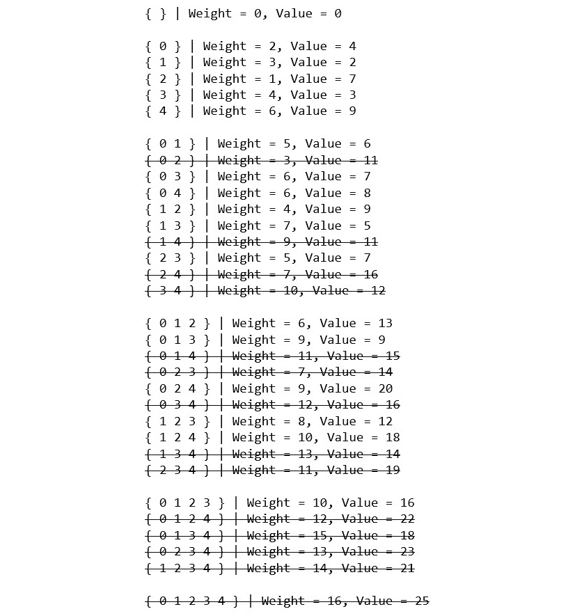
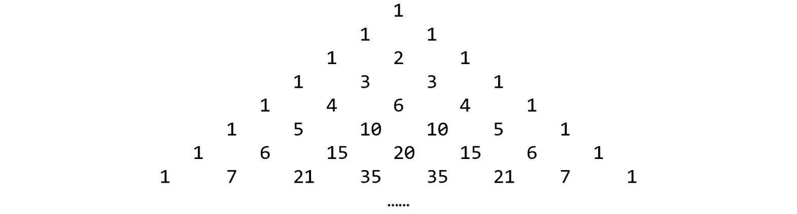
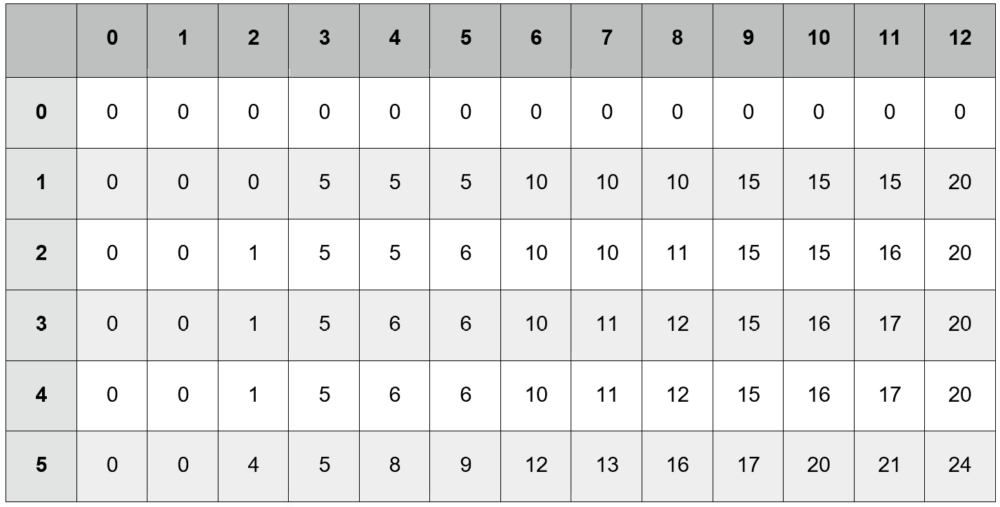
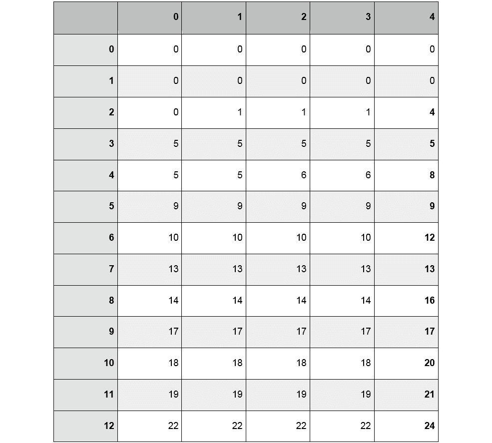
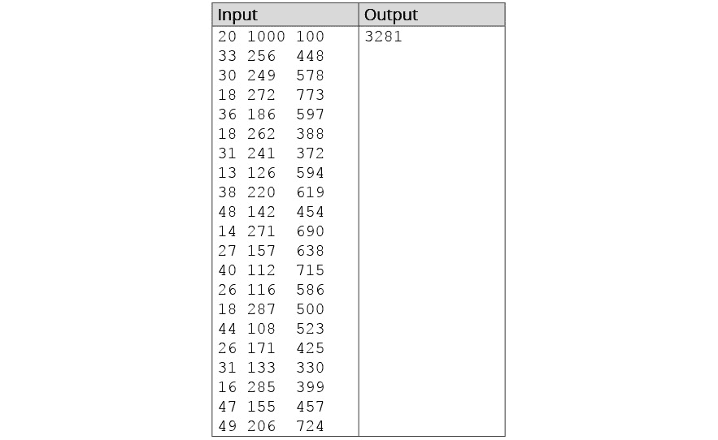
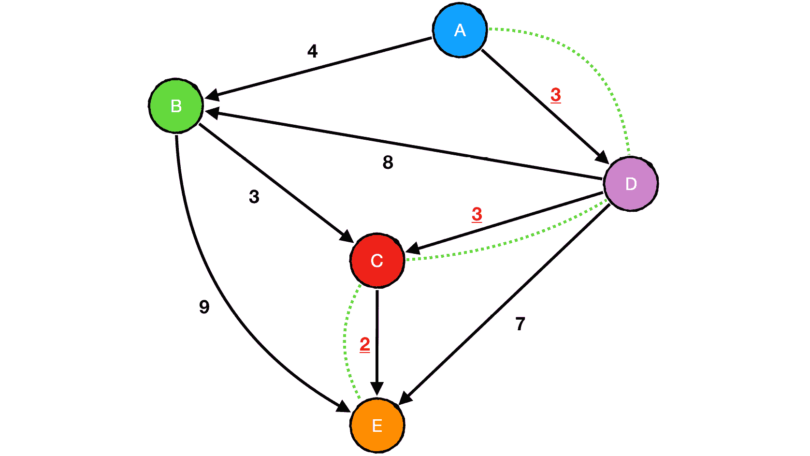
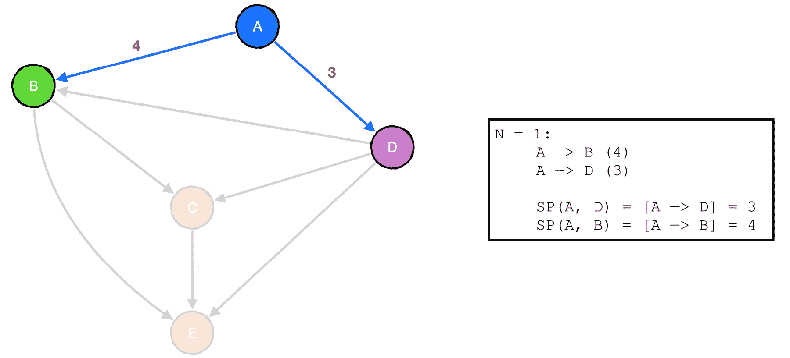
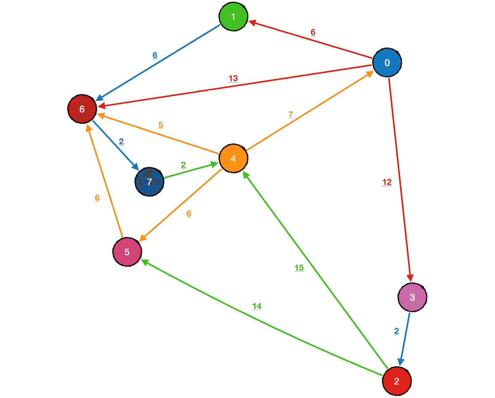
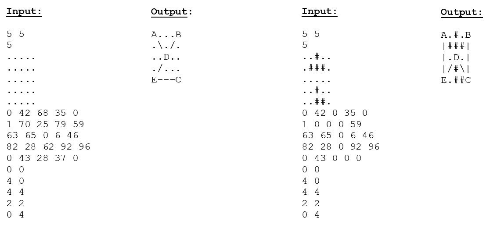

# 9。动态规划二

## 学习目标

本章结束时，您将能够:

*   描述如何在多项式时间和非确定性多项式时间内解决问题，以及这对我们开发高效算法能力的影响
*   实现 0-1 和无界背包问题的解决方案
*   将状态空间约简的概念应用于动态规划问题
*   使用动态编程范式优化的方法确定加权图中的每条最短路径

在本章中，我们将基于对动态编程方法的理解，研究如何使用它来优化我们在上一章中讨论的问题。

## 简介

从上一章开始，您应该对动态编程有了基本的了解，以及一套有效的策略来为一个不熟悉的问题找到动态编程(DP)解决方案。在本章中，我们将通过探索问题之间的关系来进一步发展这种理解，特别是关于如何修改一个问题的基本动态规划逻辑来找到另一个问题的方法。我们还将讨论状态空间缩减的概念，它允许我们利用问题的某些方面，通过减少寻找结果所需的维度和/或操作的数量来进一步优化有效的动态规划解决方案。我们将通过重新讨论图的主题来演示 DP 方法如何应用于最短路径问题，从而结束本章。

## 磷与磷的概述

在*第 8 章*、*动态规划 I、*中，我们展示了动态规划相对于其他方法所能提供的显著效率提升，但可能还不清楚这种差异有多大。重要的是要理解某些问题的复杂性将随着输入边界的增加而扩展的程度，因为这样我们就可以理解 DP 不仅是优选的，而且是必要的情况。

考虑以下问题:

*“给定布尔公式的项和运算符，确定它的计算结果是否为真。”*

看看下面的例子:

```cpp
(0 OR 1)  —> TRUE
(1 AND 0) —> FALSE
(1 NOT 1) —> FALSE
(1 NOT 0) AND (0 NOT 1) —> TRUE
```

这个问题在概念上很容易解决。获得正确结果所需的只是对给定公式的线性评估。然而，想象一下，问题是这样表述的:

*“给定布尔公式的变量和运算符，确定是否存在对每个变量的真/假赋值，以便公式计算为真。”*

看看下面的例子:

```cpp
(a1 OR a2) —> TRUE 
        (0 ∨ 0) = FALSE
        (0 ∨ 1) = TRUE
        (1 ∨ 0) = TRUE
        (1 ∨ 1) = TRUE
(a1 AND a2) —> TRUE
        (0 ∧ 0) = FALSE
        (0 ∧ 1) = FALSE
        (1 ∧ 0) = FALSE
        (1 ∧ 1) = TRUE
(a1 NOT a1) —> FALSE 
        (0 ¬ 0) = FALSE
        (1 ¬ 1) = FALSE
(a1 NOT a2) AND (a1 AND a2) —> FALSE 
        (0 ¬ 0) ∧ (0 ∧ 0) = FALSE
        (0 ¬ 1) ∧ (0 ∧ 1) = FALSE
        (1 ¬ 0) ∧ (1 ∧ 0) = FALSE
        (1 ¬ 1) ∧ (1 ∧ 1) = FALSE
```

#### 注意:

如果你不熟悉逻辑符号，`¬`表示`NOT`，因此有`(1 ¬ 1) = FALSE`和`(1 ¬ 0) = TRUE`。另外，`∧`表示`AND`，而`∨`表示`OR`。

基本的基本概念保持不变，但这两个问题之间的差异是巨大的。在最初的问题中，找到结果的复杂性只取决于一个因素——公式的长度——但是这样说，似乎没有明显的方法来解决它，不需要搜索变量赋值的每个可能的二进制子集，直到找到解决方案。

现在，让我们考虑另一个问题:

*“给定一个图，其中每个顶点被分配了三种可能的颜色之一，确定是否没有两个相邻的顶点是相同的颜色。”*

像我们的第一个例子一样，这很容易实现——遍历图的每个顶点，将其颜色与其每个邻居进行比较，并且只有在找到一对匹配的相邻颜色时才返回 false。但是现在，假设问题如下:

*“给定一个图，其中每个顶点被分配了三种可能的颜色之一，确定是否有可能给它的顶点着色，使得没有两个邻居共享相同的颜色。”*

同样，这是一个非常不同的场景。

这些问题的第一个版本一般归类为 **P** ，简单的说就是有办法在**多项式时间**内解决。当我们描述一个问题的时间复杂度为 *O(n)* 、 *O(n* *2* *)* 、 *O(log n)* 等等时，我们是在描述 *P* 类内的一个问题。然而，重述的形式——至少就目前任何人所能证明的来说——没有现有的方法来找到一个在最坏情况下复杂性不是指数级的解决方案。因此，我们将其复杂度分为 **NP** ，或者**非确定多项式时间**。

这几类问题之间的关系是一个相当有争议的话题。特别令人感兴趣的是*验证*解所需的计算复杂性是“容易的”，而*产生*解的复杂性是“困难的”。这证明了编程中最广泛讨论的未解决问题之一:解的验证是在类 *P* 中这一事实是否意味着也有一种在多项式时间内产生解的方法？换句话说， *P = NP* 吗？虽然这个问题的普遍假设答案是否定的(T8)P≠NP，但这还有待证明，这样做(不管答案实际上是什么)将是算法和计算研究中真正革命性的进步。

可以说，NP 中最有趣的一组问题被称为 **NP-complete** ，因为它们有一个显著的特点:如果发现一个解决方案可以有效地解决其中的任何一个问题(即在多项式时间内)，这个解决方案实际上可以被修改以有效地解决 *NP* 中的所有其他问题。换句话说，如果找到了第一个例子的多项式解(称为**布尔可满足性问题**，或 **SAT** ，相同逻辑的一些变体也可以用于解决第二个例子(称为**图着色问题**，反之亦然。

请记住，并不是每一个指数级的复杂问题都适合这个分类。考虑在国际象棋比赛中决定下一个最佳棋步的问题。您可以如下描述递归逻辑:

```cpp
    For each piece, a, belonging to the current player:
        Consider every possible move, m_a, that a can make:

            For each piece, b, belonging to the opponent:
                Consider each possible move m_b that b can make
                in response to m_a.
                    for each piece, a, belonging to the 
                    current player…
                    (etc.)
        Count number of ways player_1 can win after this move
Next best move is the one where the probability that player_1 wins is maximized.
```

寻找解决方案的复杂性无疑是指数级的。但是这个问题并不符合*NP*-完备性的标准，因为验证某个招式是否最佳的基本动作，需要同样程度的复杂度。

将此示例与解决数独难题进行比较:


###### 图 9.1:一个已解决的数独难题

验证需要扫描矩阵的每一行和每一列，并确定九个轮廓为 3×3 的正方形中的每一个都包含从 1 到 9 的每个数字，并且没有一行或一列包含相同的数字超过一次。一个简单的实现可以使用九个集合的三个集合，每个集合包含`{ 1, 2, 3, 4, 5, 6, 7, 8, 9 }`，第一个集合代表每行中的数字，第二个集合代表每列中的数字，第三个集合代表每个 3×3 正方形中的数字。当扫描每个单元格时，我们会检查它包含的数字是否在对应于该单元格的每个集合中；如果是，它将从集合中移除。否则，结果是*假*。一旦考虑了每个单元，如果每个单元都是空的，结果等于*真*。由于这种方法只需要我们迭代一次矩阵，我们可以得出结论，它可以在多项式时间内求解。然而，假设提供的谜题是不完整的，任务是确定是否存在解，我们将不得不递归地考虑每个单元格的每个数字组合，直到找到有效的解，导致最坏情况的复杂性为*O(9**【n**)*， *n* 等于原始网格中的空方块数；因此，我们可以得出结论，解决数独难题是在 *NP* 中。

## 子集和问题的再思考

在前一章中，我们讨论了子集和问题，我们看到它在最坏的情况下具有指数复杂性。让我们考虑一下这个问题的两种表达方式——寻找解决方案和验证解决方案有效性的相对难度。

让我们考虑验证解决方案有效性的问题:

```cpp
Set    —> { 2 6 4 15 3 9 }
Target —> 24
Subset —> { 2 6 4 }
Sum = 2 + 6 + 4 = 12 
FALSE
Subset —> { 2 6 15 3 }
Sum = 2 + 6 + 15 + 3 = 24
TRUE
Subset —> { 15 9 }
Sum = 15 + 9 = 24
TRUE
Subset —> { 6 4 3 9 }
Sum = 6 + 4 + 3 + 9 = 22
FALSE
```

毫无疑问，关于每个子集的长度，验证的复杂性是线性的——将所有数字相加，并将总和与目标进行比较——这将它直接放在 P 类中。我们发现了一些看似有效的方法来处理寻找解决方案的复杂性，我们可能假设其多项式时间复杂性为 *O(N × M)* ，其中 *N* 是集合的大小， *M* 是目标和。这似乎会取消这个问题是*NP*-完成。然而，事实并非如此，因为 *M* 不是输入的大小，而是它的大小。请记住，计算机用二进制表示整数，需要更多位数来表示的整数也需要更长的处理时间。因此，每次 M 的最大值增加一倍，就需要两倍的计算时间。

因此，不幸的是，我们的动态规划解决方案不具备多项式复杂性。因此，我们将解决这个问题的方法定义为在`pseudo-polynomial time`中运行，我们可以得出结论，子集和问题实际上是*NP*-完全的。

## 背包问题

现在，让我们重新考虑一下我们在*第 5 章*、*贪婪算法*中看到的背包问题，我们可以将其描述为子集和问题的“老大哥”它要求如下:

*“给定一个容量有限的背包和一组不同价值的加权物品，背包中可以包含哪组物品，在不超过容量的情况下产生最大的组合价值？”*

这个问题也是 *NP* 完备性的一个典型例子，因此，它与这个类中的其他问题有许多密切的联系。

考虑以下示例:

```cpp
Capacity —> 10 
Number of items —> 5
Weights —> { 2, 3, 1, 4, 6 } 
Values —>  { 4, 2, 7, 3, 9 }
```

有了这些数据，我们可以生成以下子集:



###### 图 9.2:给定 0-1 背包问题的所有可能子集

这显然是熟悉的领域。这需要对子集和算法稍加修改吗？

### 0-1 背包——子集和算法的扩展

大家可能还记得我们在*第 6 章*、*图算法一*中的讨论，前面的例子是 0-1 背包问题。在这里，我们注意到当前算法和我们用来解决子集和问题的状态逻辑之间的另一个明显的相似之处。

在子集和问题中，我们得出结论，对于每个元素`x`，在`set`中的索引`i`处，我们可以执行以下操作:

1.  将`x`的值加到先前找到的子集和上。
2.  保持子集和不变。

这意味着在索引`i + 1`处的新总和`y`的 DP 表条目可以标记为`TRUE`，如果它如下:

1.  表的前一行中的现有总和`x`，即`DP(i, x)`
2.  `x`与`set[i]`当前元素的总和，即`DP(i, x + set[i])`

换句话说，一个和是否可以由一个跨越集合中第一个`i`元素的子集形成取决于它是否已经被更早地找到，或者它是否可以通过将当前元素的值加到另一个先前找到的和中来找到。

在当前问题中，我们可以观察到，对于每一个项目，`x`，在`set`中带有权重`w`的索引`i`处，我们可以执行以下任一操作:

1.  将`x`的值加到先前找到的项目值的子集和上，只要相应项目与`w`的权重之和小于或等于最大容量。
2.  保持子集和不变。

反过来，这意味着在具有组合权重`W`的项目集合的索引`i + 1`处可以找到的最大值总和`y`可以是以下之一:

1.  在先前的`i`项目中发现的现有最大值总和`x`，其组合重量为`w`
2.  `x`与索引`i`处物品价值的总和，假设物品重量加到`w`时不超过容量

换句话说，可以由跨越第一`i`项并具有组合权重`w`的项的子集形成的最大值总和等于对应于先前`i – 1`项的权重`w`的最大值总和，或者等于通过将当前项的值加到先前找到的子集的总值而产生的总和。

在伪代码中，我们将子集和问题的表填充方案表达如下:

```cpp
for sum (1 <= sum <= max_sum) found at index i of the set: 
   if sum < set[i-1]: 
    DP(i, sum) = DP(i-1, sum)
   if sum >= set[i-1]:
    DP(i, sum) = DP(i-1, sum) OR DP(i-1, sum - set[i-1])
```

0-1 背包问题的等价逻辑如下:

```cpp
for total_weight (1 <= total_weight <= max_capacity) found at index i of the set:
  if total_weight < weight[i]:
     maximum_value(i, total_weight) = maximum_value(i-1, total_weight)
  if total_weight >= weight[i]:
     maximum_value(i, total_weight) = maximum of:
        1) maximum_value(i-1, total_weight)
        2) maximum_value(i-1, total_weight – weight[i]) + value[i]
```

在这里，我们可以看到一般的算法概念实际上是相同的:我们正在遍历由集合的大小和集合元素的最大和所界定的二维搜索空间，并确定是否可以找到新的子集和。不同之处在于，我们不仅仅记录某个子集和是否存在，而是收集与每个项目子集相关联的最大对应值和，并根据它们的总组合权重来组织它们。我们将在下面的练习中研究它的实现。

### 练习 41: 0-1 背包问题

我们现在将使用自下而上的列表方法实现前面的逻辑。让我们开始吧:

1.  我们将从包含以下标题开始:

    ```cpp
    #include <iostream>
    #include <vector>
    #include <algorithm>
    using namespace std;
    ```

2.  我们的第一步是处理输入。我们需要声明两个整数，`items`和`capacity`，分别代表可供选择的物品总数和背包的重量限制。我们还需要两个数组，`value`和`weight`，我们将在其中存储每个项目对应的数据:

    ```cpp
    int main()
    {
        int items, capacity;
        cin >> items >> capacity;
        vector<int> values(items), weight(items);
        for(auto &v : values) cin >> v;
        for(auto &w : weight) cin >> w;
        ……
    }
    ```

3.  现在，我们将定义函数`Knapsack_01()`，它有与输入相对应的参数，并返回一个整数:

    ```cpp
    int Knapsack_01(int items, int capacity, vector<int> value, vector<int> weight)
    {
        ……
    }
    ```

4.  我们的 DP 表将是二维的，并且与我们在子集和问题中使用的表非常接近。在子集和表中，第一维的大小被初始化为比集合长度大一，而第二维的大小被初始化为比集合中所有元素的最大和大一。在这里，我们的第一维的大小将等效初始化为`items + 1`；同样，第二维的大小将被初始化为`capacity + 1` :

    ```cpp
    vector<vector<int>> DP(items + 1, vector<int>(capacity + 1, 0));
    ```

5.  我们需要从`1`开始迭代两个维度的长度。在外循环每次迭代的开始，我们将定义两个变量`currentWeight`和`currentValue`，分别对应于`weight[i-1]`和`values[i-1]`中的元素:

    ```cpp
    for(int i = 1; i <= items; i++)
    {
        int currentWeight = weight[i-1];
        int currentValue = values[i-1];
        for(int totalWeight = 1; totalWeight <= capacity; totalWeight++)
        {
            ……
        }
    }
    ```

6.  现在，我们将实现我们的制表方案:

    ```cpp
    if(totalWeight < currentWeight)
    {
        DP[i][totalWeight] = DP[i-1][totalWeight];
    }
    else 
    {
        DP[i][totalWeight] = max(DP[i-1][totalWeight], DP[i-1][totalWeight - currentWeight] + currentValue);
    }
    ```

7.  在函数的最后，我们返回表的最后一个元素:

    ```cpp
    return DP[items][capacity];
    ```

8.  现在，我们向`main()`添加一个调用，并打印输出:

    ```cpp
    int result = Knapsack_01(items, capacity, values, weight);
    cout << "The highest-valued subset of items that can fit in the knapsack is: " << result << endl;
    return 0;
    ```

9.  Let's try running our program using the following input:

    ```cpp
    8 66
    20 4 89 12 5 50 8 13
    5 23 9 72 16 14 32 4
    ```

    输出应如下所示:

    ```cpp
    The highest-valued subset of items that can fit in the knapsack is: 180
    ```

正如我们所看到的，背包问题的相对有效的动态规划解决方案只不过是对我们用来解决子集和问题的相同算法的轻微修改。

### 无界背包

我们探索的关于背包问题的实现是最传统的版本，但是正如我们在本章前面提到的，这个问题实际上有许多种类，可以应用于不同的场景。我们现在将考虑集合中每个项目的数量不受限制的情况。

让我们考虑一个例子，我们通过蛮力找到解决方案:

```cpp
Capacity = 25
Values —> { 5, 13, 4, 3, 8  }
Weight —> { 9, 12, 3, 7, 19 }
{ 0 } —> Weight = 9, Value = 5
{ 1 } —> Weight = 12, Value = 13
{ 2 } —> Weight = 3, Value = 4
{ 3 } —> Weight = 7, Value = 3
{ 4 } —> Weight = 32, Value = 8
{ 0, 0 } —> Weight = 18, Value = 10
{ 0, 1 } —> Weight = 21, Value = 18
{ 0, 2 } —> Weight = 12, Value = 9
{ 0, 3 } —> Weight = 16, Value = 8
{ 0, 4 } —> Weight = 28, Value = 13
{ 1, 1 } —> Weight = 24, Value = 26
{ 1, 2 } —> Weight = 15, Value = 17
{ 1, 3 } —> Weight = 19, Value = 16
{ 1, 4 } —> Weight = 31, Value = 21
{ 2, 2 } —> Weight = 6, Value = 8
{ 2, 3 } —> Weight = 10, Value = 7
{ 2, 4 } —> Weight = 22, Value = 12
{ 3, 3 } —> Weight = 14, Value = 6
{ 3, 4 } —> Weight = 26, Value = 11
{ 4, 4 } —> Weight = 38, Value = 16
{ 0, 0, 0 } —> Weight = 27, Value = 15
{ 0, 0, 1 } —> Weight = 30, Value = 26
{ 0, 0, 2 } —> Weight = 21, Value = 14
{ 0, 0, 3 } —> Weight = 25, Value = 13
{ 0, 0, 4 } —> Weight = 37, Value = 18
{ 0, 1, 1 } —> Weight = 33, Value = 31
……
```

从暴力的角度来看，这个问题似乎要复杂得多。让我们从 0-1 背包实现中重述我们的伪代码逻辑来处理这个额外的规定。

在具有组合权重`total_weight`的项目集合的索引`i`处可以找到的最大值总和`y`可以是以下任一项:

1.  在先前的`i - 1`项中发现的现有最大值总和`x`，其组合权重等于`total_weight`
2.  Assuming `total_weight` can be formed by adding `current_weight` to some other subset's total weight found within the previous `i – 1` items:

    a)当前项目的值与跨越先前`i - 1`项目且组合权重为`total_weight – current_weight`的子集的最大值之和的总和

    b)当前项目的值与最近迭代中发现的一些先前的`y`的总和，其组合权重为`total_weight – current_weight`

根据 DP 表，我们可以表示新的逻辑如下:

```cpp
for total_weight (1 <= total_weight <= max_capacity) found at index i of the set:
    if total_weight < set[i-1]:
      maximum_value(i, total_weight) = maximum_value(i-1, total_weight)

    if total_weight >= set[i-1]:
      maximum_value(i, total_weight) = maximum of:
        1) maximum_value(i-1, total_weight)
        2) maximum_value(i-1, total_weight - current_weight) + current_value
        3) maximum_value(i, total_weight - current_weight) + current_value
```

我们可以这样实现:

```cpp
auto max = [](int a, int b, int c) { return std::max(a, std::max(b, c)); };
for(int i = 1; i <= items; i++)
{
    int current_weight = weight[i—1];
    int value = values[i-1];
    for(int total_weight = 0; total_weight <= capacity; w++)
    {
        if(total_weight < current_weight)
        {
            DP[i][total_weight] = DP[i-1][total_weight];
        }
        else 
        {
            DP[i][total_weight] = max
            (
                DP[i-1][total_weight], 
                DP[i-1][total_weight – current_weight] + value, 
                DP[i][total_weight – current_weight] + value
            );
        }
    }
}
```

从逻辑上讲，这种方法是可行的，但事实证明，这实际上并不是最有效的实现。让我们在下一节中了解它的局限性以及如何克服它们。

### 状态空间约简

有效使用动态规划的一个相当棘手的方面是**状态空间缩减**的概念，这是重新制定工作动态规划算法的行为，以使用表示一个状态所需的最小空间量。这通常归结为利用问题本质固有的某种模式或对称性。

为了演示这个概念，让我们考虑在**帕斯卡三角形**的 *n* *第*行和 *m* *第*列中寻找值的问题，可以表示如下:



###### 图 9.3:帕斯卡三角形

帕斯卡三角形是根据以下逻辑建立的:

```cpp
For m <= n:
        Base case:
            m = 1, m = n —> triangle(n, m) = 1
        Recurrence: 
            triangle(n, m) = triangle(n-1, m-1) + triangle(n-1, m)
```

换句话说，每一行的第一个值是`1`，后面的每一列值等于前一行当前列和前一列的总和。从下图中可以看到，在第二行的第二列中，我们通过添加上一行的第二列(`1`)和第一列(`1`)中的元素得到了`2`:


###### 图 9.4:获取帕斯卡三角形中的下一个值

使用列表解决在第 *n* *第*行和第 *m* *第*列中查找值的问题可以如下进行:

```cpp
vector<vector<int>> DP(N + 1, vector<int>(N + 1, 0));
DP[1][1] = 1;
for(int row = 2; row <= N; row++)
{
    for(int col = 1; col <= row; col++)
    {
        DP[row][col] = DP[row-1][col-1] + DP[row-1][col];
    }
}
```

在前面的代码中构建的 DP 表对于`N = 7`来说应该是这样的:


###### 图 9.5:帕斯卡三角形表示为一个 N × N DP 表

正如我们所看到的，这种算法在内存使用和冗余计算方面都非常浪费。显而易见的问题是该表有 *N + 1* 列，尽管事实上只有一行包含这么多值。我们可以根据需要初始化每一行，根据所需的元素数量调整大小，从而轻松降低空间复杂度，这将表格所需的空间从 *N* *2* 减少到 *N × (N + 1) / 2* 。让我们修改我们的实现如下:

```cpp
vector<vector<int>> DP(N + 1);
DP[1] = { 0, 1 };
for(int row = 2; row <= N; row++)
{
    DP[row].resize(row + 1);
    for(int col = 1; col <= row; col++)
    {            
        int a = DP[row-1][col-1];
        int b = DP[row-1][min(col, DP[row-1].size()-1)];
        DP[row][col] = a + b;
    }
}
```

我们可以进一步观察到，每行的前半部分和后半部分之间存在对称关系，这意味着我们实际上只需要计算前(n/2)列的值。因此，我们有以下几点:

```cpp
DP(7, 7) ≡ DP(7, 1)
DP(7, 6) ≡ DP(7, 2)
DP(7, 5) ≡ DP(7, 3)
```

我们可以这样概括地说:

```cpp
DP(N, M) ≡ DP(N, N - M + 1)
```

考虑到这一点，我们可以修改我们的实现如下:

```cpp
vector<vector<int>> DP(N + 1);
DP[0] = { 0, 1 };
for(int row = 1; row <= N; row++)
{
    int width = (row / 2) + (row % 2);
    DP[row].resize(width + 2);
    for(int col = 1; col <= width; col++)
    {
        DP[row][col] = DP[row-1][col-1] + DP[row-1][col];
    }
    if(row % 2 == 0) 
    {
        DP[row][width+1] = DP[row][width];
    }
}
……
for(int i = 0; i < queries; i++)
{
    int N, M;
    cin >> N >> M;
    if(M * 2 > N)
    {
        M = N - M + 1;
    } 
    cout << DP[N][M] << endl;
}
```

最后，假设我们能够提前接收输入查询并预计算结果，我们可以放弃完全存储整个表，因为只需要前一行就可以为当前行生成结果。因此，我们可以进一步修改我们的实现如下:

```cpp
map<pair<int, int>, int> results;
vector<pair<int, int>> queries;
int q;
cin >> q;
int maxRow = 0;
for(int i = 0; i < q; i++)
{
    int N, M;
    cin >> N >> M;
    queries.push_back({N, M});

    if(M * 2 > N) M = N - M + 1;
    results[{N, M}] = -1; 
    maxRow = max(maxRow, N);
}
vector<int> prev = { 0, 1 };
for(int row = 1; row <= maxRow; row++)
{
    int width = (row / 2) + (row % 2);
    vector<int> curr(width + 2);
    for(int col = 1; col <= width; col++)
    {
        curr[col] = prev[col-1] + prev[col];
        if(results.find({row, col}) != results.end())
        {
            queries[{row, col}] = curr[col];
        }
    }
    if(row % 2 == 0)
    {
        curr[width + 1] = curr[width];
    }
    prev = move(curr);
}
for(auto query : queries)
{
    int N = query.first, M = query.second;
    if(M * 2 > N) M = N - M + 1;

    cout << results[{N, M}] << endl;
}
```

现在，让我们回到无界背包问题:

```cpp
Capacity     —>   12
Values       —> { 5, 1, 6, 3, 4 }
Weight       —> { 3, 2, 4, 5, 2 }
```

我们在上一节中提出的解决方案构建的 DP 表如下所示:



###### 图 9.6:由提出的算法构建的二维 DP 表

我们用来生成上表的逻辑是基于我们用来解决 0-1 形式的背包问题的方法，因此，我们假设给定的`weight`和`i`类型的项目，即`DP(i, weight)`，的最大值和可以如下:

1.  相同重量和`i - 1`类型项目的最大值和，不包括当前项目，即`DP(i - 1, weight)`
2.  当前项目的`value`与`i - 1`类项目的最大和之和，即`DP(i - 1, weight - w) + value`
3.  当前项目的`value`与`i`类型项目的最大和的和，如果该项目被包含不止一次，即`DP(i, weight - w) + value`

前两个条件对应 0-1 背包问题的逻辑。然而，在无界背包的上下文中考虑它们，并根据我们的算法生成的表检查它们，我们实际上可以得出结论，前两个条件本质上是不相关的。

在最初的问题中，我们关心的是`i - 1`物品的值，因为我们需要决定是包括还是排除物品`i`，但是在这个问题中，我们没有理由排除任何物品，只要它们的重量不超过背包的容量。换句话说，支配每个状态转换的条件只受`weight`的限制，因此可以在一个维度上表示！

这导致了一个必须做出的重要区分:模拟*状态所需的尺寸不一定与*描述*状态所需的尺寸相同。到目前为止，我们所研究的每一个 DP 问题，当被缓存时，都会产生一个本质上等同于状态本身的形式。然而，在无界背包问题中，我们可以如下描述每个状态:*

*“对于重量为 w、价值为 v 的每一项，容量为 C 的背包的最大值等于 v 加上容量为 C–w 的背包的最大值”*

考虑以下输入数据:

```cpp
Capacity —> 12
Values   —> { 5, 1, 6, 3, 4 }
Weight   —> { 3, 2, 4, 5, 2 }
```

在下表中，每一行代表从`0`到最大容量的重量`w`，每一列代表一个项目的指数`i`。每个单元格中的数字表示在考虑了索引`i`处的项目后，每个重量的最大值和:



###### 图 9.7:每个权重指数对的子问题结果

如上表所示，允许重复意味着只要包含在最大容量内，就不需要排除任何项目。因此，在集合的索引 *0* 或索引 *1，000* 处是否可以找到权重和是无关紧要的，因为我们永远不会保持先前找到的子集和不变，除非对它的添加超过背包的定义界限。这意味着维护项目索引的记录没有任何好处，因为它允许我们将子问题缓存在一个维度中，即遇到的任意数量项目的组合权重。我们将在下面的练习中研究它的实现。

### 练习 42:无界背包

在本练习中，我们将通过在一维中表示我们的动态规划表，将状态空间约简的概念应用于无界背包问题。让我们开始吧:

1.  让我们使用与上一个练习中相同的标题和输入:

    ```cpp
    #include <iostream>
    #include <vector>
    #include <algorithm>
    using namespace std;
    ……
    int main()
    {
        int items, capacity;
        cin >> items >> capacity;
        vector<int> values(items), weight(items);
        for(auto &v : values) cin >> v;
        for(auto &w : weight) cin >> w;
        ……
    }
    ```

2.  现在，我们将实现一个名为`UnboundedKnapsack()`的返回整数的函数。其参数将与输入相同:

    ```cpp
    int UnboundedKnapsack(int items, int capacity, vector<int> values, vector<int> weight)
    {
        ……
    }
    ```

3.  我们的 DP 表将表示为大小等于`capacity + 1`的整数向量，每个索引初始化为`0` :

    ```cpp
    vector<int> DP(capacity + 1, 0);
    ```

4.  像 0-1 背包问题一样，我们的状态逻辑将包含在两个嵌套循环中；然而，在这个问题的变体中，我们将反转循环的嵌套，使得外部循环从`0`迭代到`capacity`(包括 T1)，并且内部循环迭代通过项目索引:

    ```cpp
    for(int w = 0; w <= capacity; w++)
    {
        for(int i = 0; i < items; i++)
        {
            ……
        }
    } 
    ```

5.  现在，我们必须决定如何缓存我们的状态。我们唯一担心的是所选物品的重量不会超过容量。由于我们的表格仅仅足够大，可以表示从`0`到`capacity`的重量值，所以我们只需要确保`w`和`weight[i]`之间的差值是非负数。因此，所有的赋值逻辑都可以包含在一个单独的`if`语句中:

    ```cpp
    for(int w = 0; w <= capacity; w++)
    {
        for(int i = 0; i < items; i++)
        {
            if(weight[i] <= w)
            {
                DP[w] = max(DP[w], DP[w - weight[i]] + values[i]);
            }
        }
    }
    return DP[capacity];
    ```

6.  现在回到`main()`，给`UnboundedKnapsack()`添加一个调用，输出结果:

    ```cpp
    int main()
    {
            ……
        int result = UnboundedKnapsack(items, capacity, values, weight);
        cout << "Maximum value of items that can be contained in the knapsack: " << result << endl;
        return 0;
    }
    ```

7.  Try running your program with the following input:

    ```cpp
    30 335
    91 81 86 64 24 61 13 57 60 25 94 54 39 62 5 34 95 12 53 33 53 3 42 75 56 1 84 38 46 62 
    40 13 4 17 16 35 5 33 35 16 25 29 6 28 12 37 26 27 32 27 7 24 5 28 39 15 38 37 15 40 
    ```

    您的输出应该如下所示:

    ```cpp
    Maximum value of items that can be contained in the knapsack: 7138
    ```

正如前面的实现所展示的，在 DP 算法中考虑成本较低的缓存解决方案的方法通常是值得的。看似需要复杂状态表示的问题，经过仔细研究后，往往可以大大简化。

### 活动 22:利润最大化

你在一家大型连锁百货公司工作。像任何零售企业一样，你的公司从批发经销商那里大量购买商品，然后以更高的价格出售，以获得利润。您的商店正在销售的某些类型的产品可以从多个不同的分销商处购买，但是产品的质量和价格可能会有很大差异，这自然会影响其相应的零售价值。一旦将汇率和公共需求等因素考虑在内，来自某些分销商的产品通常可以以比最终售价低得多的单价购买。你的任务是设计一个系统，计算出你可以用分配的预算获得的最大利润。

我们已经向您提供了类似产品的目录。每个列出的产品都有以下信息:

*   产品的批发价
*   加价后销售同一产品所能获得的利润
*   经销商每单位销售的产品数量

考虑到分销商只会以指定的确切数量销售产品，您的任务是确定通过购买所列产品的某个子集可以赚到的最大金额。为了确保商店提供多种选择，列出的每件商品只能购买一次。

由于您只有有限的仓库空间，并且不想积压特定类型的物品，因此您还可以限制可以购买的单个单位的最大数量。因此，您的计划还应确保购买的产品总数不超过此限制。

**例**

假设目录中列出了五个项目，包含以下信息:


###### 图 9.8:利润优化的样本值

你有 100 美元的预算和 20 个单位的仓库容量。以下几组购买将是有效的:

```cpp
{ A B }    Cost: 30     | Quantity: 15    | Value: 70
{ A D }    Cost: 70     | Quantity: 13    | Value: 110
{ A E }    Cost: 60     | Quantity: 14    | Value: 130
{ B C }    Cost: 25     | Quantity: 17    | Value: 40
{ C D }    Cost: 65     | Quantity: 15    | Value: 80
{ C E }    Cost: 55     | Quantity: 16    | Value: 100
{ D E }    Cost: 90     | Quantity: 7     | Value: 140
{ A B D }  Cost: 80     | Quantity: 18    | Value: 130
{ A B E }  Cost: 70     | Quantity: 19    | Value: 150
{ B C D }  Cost: 75     | Quantity: 20    | Value: 100
{ B D E }  Cost: 100    | Quantity: 12    | Value: 160
```

因此，程序应该输出`160`。

**输入**

第一行包含三个整数，`N`为分销商数量，`budget`为可花费的最大金额，`capacity`为可购买的最大单位数量。

接下来的`N`行应该包含三个用空格分隔的整数:

*   `quantity`:经销商提供的单位数量
*   `cost`:物品的价格
*   `value`:销售产品后可以获得的利润金额

**输出**

单个整数，表示通过从目录中选择某些项目子集可以获得的最大利润。

**测试用例**

下面的测试用例集应该可以帮助您更好地理解这个问题:


###### 图 9.9:活动 22 测试用例 1


###### 图 9.10:活动 22 测试用例 2


###### 图 9.11:活动 22 测试用例 3



###### 图 9.12:活动 22 测试用例 4

**活动指南**

*   所需的实现与 0-1 背包问题非常相似。
*   Since there are two constraints (capacity and budget), the DP table will require three dimensions.

    #### 注意

    这个活动的解决方案可以在第 581 页找到。

## 图形和动态规划

在本节中，我们将高级图形算法和动态规划作为明显不同的主题进行了讨论，但通常情况下，它们可以同时使用，具体取决于我们试图解决的问题类型和图形的性质。通常与图相关的几个问题被确定为*NP*-完全(仅举两个例子，图着色和顶点覆盖问题)，并且在适当的情况下可以用动态规划来解决。然而，这些主题中的大多数都不在本书的范围之内(实际上值得让整本书专门用于它们的分析)。

然而，图论中的一个问题特别适合 DP 方法，幸运的是，这是我们已经非常熟悉的一个问题:最短路径问题。事实上，在*第 7 章*、*图算法二*中，我们实际上讨论了一个通常被归类在 DP 保护伞下的算法，尽管事实上我们从未将其确定为这样。

### 重新考虑贝尔曼-福特算法

在我们对贝尔曼-福特算法的探索中，我们是根据我们之前对迪克斯特拉算法的讨论来看待它的，它肯定与迪克斯特拉算法有一些相似之处。但是现在我们已经牢固地掌握了动态编程范式背后的概念，让我们根据我们的新理解重新考虑 Bellman-Ford。

简而言之，贝尔曼-福特公司采用的方法可以描述如下:

给定一个名为`start`的源节点，图的顶点数`V`和边数`E`，执行以下操作:

1.  将每个节点从`0`到`V – 1`(含)的距离标记为`UNKNOWN`，除了`start`，即`0`。
2.  从`1`迭代到`V – 1`(含)。
3.  每次迭代时，考虑`E`中的每条边，检查源节点各自的距离值是否为`UNKNOWN`。如果不是，则将相邻节点当前存储的距离与源节点的距离之和以及它们之间的边缘权重进行比较。
4.  如果源节点的距离和边缘权重的总和小于目标节点的距离，请将目标节点的距离更新为较小的值。
5.  在`V – 1`次迭代后，要么找到了最短路径，要么图的权重循环为负，这可以通过额外的边迭代来确定。

该算法的成功显然依赖于问题表现出最优子结构的事实。我们可以如下说明这个概念背后的递归逻辑:



###### 图 9.13:可视化贝尔曼-福特算法

将它表示为伪代码看起来如下所示:

```cpp
Source —> A
Destination —> E
The shortest path from A to E is equal to:
    …the edge weight from A to B (4), plus…
        …the shortest path from B to E, which is:
            …the edge weight from B to C (3), plus:
                …the edge weight from C to E (2).
            …or the edge weight from B to E (9).
    …or the edge weight from A to D (3), plus:
        …the shortest path from D to E, which is:
            …the edge weight from D to B (8), plus:
                …the shortest path from B to E (9), which is:
                    …the edge weight from B to C (3), plus:
                        …the edge weight from C to E (2).
                    …or the edge weight from B to E (9).
            …the edge weight from D to C (3), plus:
                …the edge weight from C to E (2).
            …or the edge weight from D to E (7).
```

显然，最短路径问题也具有重叠子问题的性质。贝尔曼-福特有效地避免了由于两个关键的观察结果而导致的重新计算:

*   图中任意两个节点之间的非循环遍历可以进行的最大移动次数为`| V – 1 |`(即图中每个节点减去起始节点)。
*   N 次迭代后源节点和每个可达节点之间的最短路径相当于`| N – 1 |`次迭代后每个可达节点的最短路径，加上每个相邻节点的边权重。

下面的一组数字将帮助您更好地可视化贝尔曼-福特算法中的步骤:



###### 图 9.14:行李员-福特第一步


###### 图 9.15:行李员-福特步骤 2


###### 图 9.16:行李员-福特步骤 3

据说 Bellman-Ford 解决的具体问题被称为**单源最短路径问题**，因为它是用来寻找单个节点的最短路径的。在*第 7 章*、*图算法二*中，我们讨论了约翰逊算法，该算法解决了所谓的**全对最短路径问题**，因为它找到了图中每对顶点之间的最短路径。

约翰逊的算法结合了贝尔曼-福特算法中的动态规划方法和迪克斯特拉算法中的贪婪方法。在本节中，我们将探索全对最短路径问题的完整 DP 实现。然而，让我们通过实现自上而下的解决方案来更深入地考虑问题的本质。

### 将最短路径问题作为动态规划问题来处理

更好地理解贝尔曼-福特背后的逻辑的一个方法是将其转化为自上而下的解决方案。为此，让我们从考虑基本案例开始。

贝尔曼-福特通过图的边缘执行`V – 1`迭代，通常是通过`for`循环。由于我们之前的实现已经从`1`迭代到`V – 1`了，让我们从`V – 1`开始自顶向下的解决方案，递减到`0`。根据我们的递归结构，假设每个状态可以描述如下:

```cpp
ShortestPath(node, depth)
node —> the node being considered
depth —> the current iteration in the traversal
```

因此，我们的第一个基本情况可以定义如下:

```cpp
if depth = 0:
        ShortestPath(node, depth) —> UNKNOWN
```

换句话说，如果`depth`已经递减到`0`，我们可以断定不存在路径，并终止我们的搜索。

当然，我们需要处理的第二个基本情况是找到从源到目标的路径。在这种情况下，搜索的深度无关紧要；从目标到自身的最短距离永远是`0`:

```cpp
if node = target: 

        ShortestPath(node, depth) —> 0
```

现在，让我们定义我们的中间状态。让我们回顾一下贝尔曼-福特公司使用的迭代方法是什么样的:

```cpp
for i = 1 to V - 1:
        for each edge in graph:
            edge —> u, v, weight 
            if distance(u) is not UNKNOWN and distance(u) + weight < distance(v):
                distance(v) = distance(u) + weight
```

就递归遍历而言，这可以重申如下:

```cpp
for each edge adjacent to node:

        edge —> neighbor, weight
    if ShortestPath(neighbor, depth - 1) + weight < ShortestPath(node, depth):
            ShortestPath(node, depth) = ShortestPath(neighbor, depth - 1) + weight
```

由于每个状态都可以根据这两个维度进行唯一描述，并且循环的可能存在意味着我们可能会不止一次地遇到相同的状态，因此我们可以得出结论，根据节点深度对进行缓存对于记忆目的既有效又有用:

```cpp
Depth = 7:
    SP(0, 7): 0
    SP(1, 7): 6
    SP(2, 7): UNKNOWN
    SP(3, 7): 12
    SP(4, 7): UNKNOWN
    SP(5, 7): UNKNOWN
    SP(6, 7): 13
    SP(7, 7): UNKNOWN
Depth = 6:
    SP(0, 6): 0
    SP(1, 6): 6
    SP(2, 6): 14
    SP(3, 6): 12
    SP(4, 6): UNKNOWN
    SP(5, 6): UNKNOWN
    SP(6, 6): 12
    SP(7, 6): 15
Depth = 5:
    SP(0, 5): 0
    SP(1, 5): 6
    SP(2, 5): 14
```

下图说明了这些状态:



###### 图 9.17:最短路径问题的所有状态

我们将在下面的练习中研究这种方法的实现。

### 练习 43:单源最短路径(记忆化)

在本练习中，我们将采用自顶向下的动态规划方法来寻找单源最短路径问题的解决方案。让我们开始吧:

1.  让我们首先包含以下头和`std`名称空间，并定义一个`UNKNOWN`常量:

    ```cpp
    #include <iostream>
    #include <vector>
    #include <utility>
    #include <map>
    using namespace std;
    const int UNKNOWN = 1e9;
    ```

2.  让我们也声明`V`和`E`(分别是顶点数和边数)，以及两个二维整数向量，`adj`(我们图的邻接表)和`weight`(边权值矩阵)。最后，我们将定义一个名为`memo`的记忆表。这一次，我们将使用`std::map`来简化检查缓存中是否存在某个键与它的值是否未知之间的区别:

    ```cpp
    int V, E;
    vector<vector<int>> adj;
    vector<vector<int>> weight;
    map<pair<int, int>, int> memo;
    ```

3.  在`main()`函数中，我们应该处理输入，以便接收我们希望应用算法的图形。输入的第一行包含`V`和`E`，后面的`E`行包含三个整数:`u`、`v`和`w`(分别是每个边的来源、目的地和权重):

    ```cpp
    int main()
    {
            int V, E;
            cin >> V >> E;
            weight.resize(V, vector<int>(V, UNKNOWN));
            adj.resize(V);
            for(int i = 0; i < E; i++)
            {
                int u, v, w;
                cin >> u >> v >> w;
                adj[u].push_back(v);
                weight[u][v] = w;
            }
            …
    }
    ```

4.  我们现在将定义一个名为`SingleSourceShortestPaths()`的函数，该函数将接受一个参数— `source`，它是源顶点的索引，并将返回一个整数向量:

    ```cpp
    vector<int> SingleSourceShortestPaths(int source)
    {
            ……
    }
    ```

5.  Now we will need to make some preliminary modifications to our graph. As opposed to traversing from the source node to all the other nodes in the graph, we will instead begin each traversal from the other nodes and calculate the shortest path from the source in reverse. Since our graph is directed, we will have to use its transpose to accomplish this:

    ```cpp
    // Clear table
    vector<vector<int>> adj_t(V);
    vector<vector<int>> weight_t(V, vector<int>(V, UNKNOWN));
    for(int i = 0; i < V; i++)
    {
            // Create transpose of graph
            for(auto j : adj[i])
            {
                adj_t[j].push_back(i);
                weight_t[j][i] = weight[i][j];
            }
            // Base case — shortest distance from source to itself is zero at any depth
            memo[{source, i}] = 0;
            if(i != source) 
            {
                // If any node other than the source has been reached 
                // after V - 1 iterations, no path exists.
                memo[{i, 0}] = UNKNOWN;
            }
    }
    ```

    这里，我们定义了两个新的二维整数向量`adj_t`和`weight_t`，它们将对应于转置图的邻接表和权重矩阵。然后，我们使用嵌套循环来创建修改后的图，并初始化`memo`表中的值。

6.  我们现在应该用四个参数定义`ShortestPath_Memoization()`函数:两个整数，`depth`和`node`，以及`adj`和`weight`(在这种情况下，这将是转置图的引用):

    ```cpp
        int ShortestPath_Memoization(int depth, int node, vector<vector<int>> &adj, vector<vector<int>> &weight)
    {
            ……
        }
    ```

7.  我们的算法本质上将是标准的深度优先搜索，除了我们将在每个函数调用结束时缓存每个`{ node, depth }`对的结果。在函数的顶部，我们将检查缓存的结果，如果关键字存在于映射中，则返回该结果:

    ```cpp
    // Check if key exists in map
    if(memo.find({node, depth}) != memo.end())
    {
        return memo[{node, depth}];
    }
    memo[{node, depth}] = UNKNOWN;
    // Iterate through adjacent edges
    for(auto next : adj[node])
    {
        int w = weight[node][next];
        int dist = ShortestPath_Memoization(depth - 1, next, adj, weight) + w;
        memo[{node, depth}] = min(memo[{node, depth}], dist);
    }
    return memo[{node, depth}];
    ```

8.  回到`SingleSourceShortestPaths()`函数，我们将定义一个名为`V`的整数向量`distance`，并通过对`ShortestPath_Memoization()` :

    ```cpp
    vector<int> distance;

    for(int i = 0; i < V; i++)
    {
        distance[i] = ShortestPath_Memoization(V - 1, i, adj_t, weight_t);
    }
    return distance;
    ```

    的连续调用来填充它
9.  回到`main()`，我们将定义一个名为`paths`的二维整数矩阵，它将存储从`0`到`V` :

    ```cpp
    vector<vector<int>> paths(V);
    for(int i = 0; i < V; i++)
    {
        paths[i] = SingleSourceShortestPaths(i);
    }
    ```

    的每个节点索引从`SingleSourceShortestPaths()`返回的距离
10.  我们现在可以使用`paths`表打印图中每对节点的距离值:

    ```cpp
    cout << "The shortest distances between each pair of vertices are:" << endl;
    for(int i = 0; i < V; i++)
    {
            for(int j = 0; j < V; j++)
            {
              cout << "\t" << j << ": ";
              (paths[i][j] == UNKNOWN) ? cout << "- ";
                                       : cout << paths[i][j] << " ";
            }
            cout << endl;
    }
    ```

11.  Now, run your code with the following input:

    ```cpp
    8 20
    0 1 387
    0 3 38
    0 5 471
    1 0 183
    1 4 796
    2 5 715
    3 0 902
    3 1 712
    3 2 154
    3 6 425
    4 3 834
    4 6 214
    5 0 537
    5 3 926
    5 4 125
    5 6 297
    6 1 863
    6 7 248
    7 0 73
    7 3 874
    ```

    输出应如下所示:

    ```cpp
    The shortest distances between each pair of vertices are:
    0: 0 387 192 38 596 471 463 711 
    1: 183 0 375 221 779 654 646 894 
    2: 1252 1639 0 1290 840 715 1012 1260 
    3: 746 712 154 0 994 869 425 673 
    4: 535 922 727 573 0 1006 214 462 
    5: 537 924 729 575 125 0 297 545 
    6: 321 708 513 359 917 792 0 248 
    7: 73 460 265 111 669 544 536 0  
    ```

不出所料，这并不是处理这个特定问题的首选方式，但是与前面的练习一样，我们可以了解到很多关于如何通过实现像这样的递归解决方案来形成最佳子结构的知识。有了这些见解，我们现在可以完全理解如何使用制表同时找到每对节点之间的最短距离。

### 全对最短路径

我们上一个练习中的程序确实打印了每个顶点对的最短路径，但是它的效率大致相当于对 Bellman-Ford 执行`V`调用，增加了与递归算法相关的内存相关的缺点。

谢天谢地，这个问题有一个非常有用的自下而上的算法，它被配备来处理其他人在 *O(V* *3* *)* 时间和 *O(V* *2* *)* 空间中可以处理的一切。这也非常直观，尤其是在实现了本书中的其他最短路径算法之后。

### 弗洛伊德-沃肖尔算法

到目前为止，我们应该对贝尔曼-福特算法如何利用最短路径问题中表现出的最优子结构有了相当清楚的了解。关键的一点是，两个图顶点之间的任何最短路径都将是从源点到连接路径端点和目标顶点的边的其他最短路径的组合。

**弗洛伊德-沃肖尔算法**使用了同样的概念，通过进行更广泛的概括产生了巨大的效果:

*“如果节点 A 和节点 B 的最短距离为 AB，节点 B 和节点 C 的最短距离为 BC，那么节点 A 和节点 C 的最短距离为 AB + BC。”*

这个逻辑本身当然不是开创性的；但是，结合 Bellman-Ford 所展示的洞察力——图的边上的 *V* 迭代足以确定从一个源节点到图中每隔一个节点的最短路径——我们可以利用这一思想，以`Node A`为源，依次生成节点对之间的最短路径，然后利用这些结果生成`Node B`、`C`、`D`等的潜在最短路径。

弗洛伊德-沃肖尔通过在顶点上执行 *V* *3* 迭代来实现这一点。第一维表示每对可能的顶点 *A* 和 *C* 之间的潜在中点 *B* 。然后，算法检查从 *A* 到 *C* 的当前已知距离值是否大于从 *A* 到 *B* 和 *B* 到 *C* 的最短已知距离之和。如果是，则确定该和至少更接近于 *A* 和 *C* 的最佳最短距离值，并将其缓存在表中。Floyd-Warshall 使用图中的每个节点作为中点进行这些比较，不断提高其结果的准确性。在针对每个可能的中点测试了每个可能的起点和终点对之后，表中的结果包含每对顶点的正确最短距离值。

就像任何与图相关的算法一样，弗洛伊德-沃肖尔并不保证在每种给定的情况下都是最佳选择，应该始终考虑弗洛伊德-沃肖尔和其他替代方案之间的相对复杂性。一个很好的经验法则是对密集图(即包含大量边的图)使用 Floyd-Warshall。例如，假设你有一个有 100 个顶点和 500 条边的图。在每个起始顶点上连续运行贝尔曼-福特算法(最坏情况下的复杂度为 *O(V×E)* )可能会导致 500×100×100(或 5，000，000)次运算的总复杂度，而弗洛伊德-沃肖尔需要 100×100×100(或 1，000，000)次运算。迪克斯特拉的算法通常比贝尔曼-福特更有效，也可能是一个可行的替代方案。尽管如此，Floyd-Warshall 的一个明显优势是，算法的整体复杂性始终精确地为 *O(V* *3* *)* ，而不考虑输入图的其他属性。因此，除了顶点的数量之外，我们不需要知道关于我们正在使用的图的任何细节，就能够准确地确定弗洛伊德-沃肖尔将有多高效(或低效)。

最后要考虑的一点是，像贝尔曼-福特(与迪克斯特拉算法不同)一样，弗洛伊德-沃肖尔能够处理具有负边权重的图，但也会受到没有显式处理的负边权重循环的阻碍。

我们将在下面的练习中实现弗洛伊德-沃肖尔算法。

### 练习 44:实现弗洛伊德-沃肖尔算法

在本练习中，我们将使用弗洛伊德-沃肖尔算法找到每对顶点之间的最短距离。让我们开始吧:

1.  我们将首先包含以下标题并定义一个`UNKNOWN`常数:

    ```cpp
    #include <iostream>
    #include <vector>
    using namespace std;
    const int UNKNOWN = 1e9;
    ```

2.  让我们从处理输入开始，就像我们在前面的练习中所做的那样。然而，这次我们不需要图的邻接表表示:

    ```cpp
    int main()
    {
            int V, E;
            cin >> V >> E;
            vector<vector<int>> weight(V, vector<int>(V, UNKNOWN));
            for(int i = 0; i < E; i++)
            {
                int u, v, w;
                cin >> u >> v >> w;
                weight[u][v] = w;
            }
            ……
            return 0;
    }
    ```

3.  我们的`FloydWarshall()`函数将接受两个参数— `V`和`weight`，并将返回最短路径距离的二维整数向量:

    ```cpp
    vector<vector<int>> FloydWarshall(int V, vector<vector<int>> weight)
    {
            ……
    }
    ```

4.  让我们定义一个名为`distance`的二维 DP 表，并将每个值初始化为`UNKNOWN`。然后，我们需要为每对节点分配最初已知的最短距离“估计值”(即`weight`矩阵中的值)，以及基本情况值(即从每个节点到自身的最短距离，`0` ):

    ```cpp
        vector<vector<int>> distance(V, vector<int>(V, UNKNOWN));
    for(int i = 0; i < V; i++)
    {
        for(int j = 0; j < V; j++)
        {
            distance[i][j] = weight[i][j];
        }
        distance[i][i] = 0;
    }
    ```

5.  我们现在将执行从`0`到`V – 1`(含)的三个嵌套`for`循环，外部循环表示当前中间顶点`mid`，中间循环表示源顶点`start`，最内部循环表示目标顶点`end`。然后，我们将比较每个顶点组合之间的距离值，并在找到较短路径时，从头到尾重新分配距离值:

    ```cpp
    for(int mid = 0; mid < V; mid++)
    {
        for(int start = 0; start < V; start++)
        {
            for(int end = 0; end < V; end++)
            {
                if(distance[start][mid] + distance[mid][end] < distance[start][end])
                {
                    distance[start][end] = distance[start][mid] + distance[mid][end];
                }
            }
        }
    }
    ```

6.  Similar to Bellman-Ford, we will need to check for negative cycles if our input is expected to contain negative edge weights. Thankfully, this can be accomplished with great ease using the distance table.

    考虑这样一个事实:图循环是一条长度大于零的路径，并且是起点和终点相同的地方。在表示每对节点之间距离的表格中，节点与其自身之间的最短路径将包含在`distance[node][node]`中。在只包含正边权重的图中，`distance[node][node]`中包含的值显然只能等于`0`；但是，如果图表包含负权重循环，`distance[node][node]`将为负。因此，我们可以这样测试负周期:

    ```cpp
    for(int i = 0; i < V; i++)
    {
            // If distance from a node to itself is negative, there must be a negative cycle
            if(distance[i][i] < 0)
            {
                return {};
            }
    } 
    return distance;
    ```

7.  现在我们已经完成了算法的编写，我们可以在`main()`中调用`FloydWarshall()`并输出结果:

    ```cpp
    int main()
    {
        ……
        vector<vector<int>> distance = FloydWarshall(V, weight);
        // Graphs with negative cycles will return an empty vector
        if(distance.empty())
        {
            cout << "NEGATIVE CYCLE FOUND" << endl;
            return 0;
        }
        for(int i = 0; i < V; i++)
        {
            cout << i << endl;
            for(int j = 0; j < V; j++)
            {
                cout << "\t" << j << ": ";

                (distance[i][j] == UNKNOWN) 
                    ? cout << "_" << endl 
                    : cout << distance[i][j] << endl;
            }
        }
        return 0;
    }
    ```

8.  让我们在以下输入集上运行我们的程序:

    ```cpp
    Input:
    7 9
    0 1 3
    1 2 5
    1 3 10
    1 5 -4
    2 4 2
    3 2 -7
    4 1 -3
    5 6 -8
    6 0 12
    Output:
    0:
            0: 0
            1: 3
            2: 6
            3: 13
            4: 8
            5: -1
            6: -9
    1:
            0: 0
            1: 0
            2: 3
            3: 10
            4: 5
            5: -4
            6: -12
    2:
            0: -1
            1: -1
            2: 0
            3: 9
            4: 2
            5: -5
            6: -13
    3:
            0: -8
            1: -8
            2: -7
            3: 0
            4: -5
            5: -12
            6: -20
    4:
            0: -3
            1: -3
            2: 0
            3: 7
            4: 0
            5: -7
            6: -15
    5:
            0: 4
            1: 7
            2: 10
            3: 17
            4: 12
            5: 0
            6: -8
    6:
            0: 12
            1: 15
            2: 18
            3: 25
            4: 20
            5: 11
            6: 0
    ```

9.  现在，让我们尝试另一组输入:

    ```cpp
    Input:
    6 8
    0 1 3
    1 3 -8
    2 1 3
    2 4 2
    2 5 5
    3 2 3
    4 5 -1
    5 1 8
    Output:
    NEGATIVE CYCLE FOUND
    ```

如你所见，弗洛伊德-沃肖尔是一个非常有用的算法，它不仅有效，而且非常容易实现。在效率方面，我们应该选择弗洛伊德-沃肖尔算法还是约翰逊算法，完全取决于图的结构。但严格从实施的难易程度来看，弗洛伊德-沃霍尔显然是赢家。

### 活动 23:住宅道路

你是一个房地产开发项目的负责人，该项目正在计划建设一些高端住宅社区。你已经得到了各种各样的信息，关于将要建造开发项目的各种房产，目前的任务是尽可能便宜地设计一个道路系统。

许多社区将建在充满湖泊、森林和山脉的地区。在这些地区，地形往往相当崎岖，这可能会使建筑更加复杂。有人警告你，建筑成本会随着地形的崎岖程度而增加。对于你的初稿，你被告知考虑成本的线性增长，相对于每一个坐标的强度值，在那里可能会建一条路。

您已获得以下信息:

*   属性的映射
*   可以构建属性的坐标
*   每个坐标处地形的崎岖程度

在决定如何修建道路时，您还会得到以下指导方针:

*   地图上可能修建道路的点将标有“`.`”字符。
*   道路只能建在两栋房屋之间，这两栋房屋之间有直接的垂直、水平或对角线路径。
*   社区中的所有房屋都应该可以从其他房屋到达。
*   道路可能不会跨越水体、山脉、森林等等。
*   在两栋房子之间修建一条道路的成本等于两栋房子之间道路的耐用度总和。
*   只有在以尽可能低的成本到达物业指定入口点的道路上，才应在两栋房屋之间修建道路。
*   入口点总是输入中索引最高的房子。

房屋和道路的位置确定后，您应该根据以下图例制作原始地图的新版本:

*   房子应该用大写字母标注，与输入时给出的顺序相对应(即 0 = `A`、1 = `B`、2 = `C`等)。
*   道路应根据其朝向用字符`|`、`-`、`\`和`/`表示。如果两条不同方向的道路相交，应使用`+`字符表示。
*   地图上的所有其他内容都应该显示为输入中最初给出的内容。

**输入格式**

该程序应采用以下格式的输入:

*   第一行包含两个空格分隔的整数`H`和`W`，代表地图的高度和宽度。
*   第二个包含单个整数，`N`，即待建房屋数。
*   接下来的`H`行各包含一串长度`W`，代表网格上的一行。建筑道路的有效位置将标有“`.`”字符。
*   接下来的`N`行包含两个整数，`x`和`y`，这是房屋的坐标。最终索引(即`N - 1`)始终代表社区的入口点。

**输出格式**

程序应输出输入中给出的相同地图，并添加以下内容:

*   每个房子的位置都要用大写字母标注对应其从零开始的索引，原点在左上角，相对于`N`(即 0 = `A`、1 = `B`、2 = `C`等等)。
*   The roads connecting each pair of houses should be indicated as follows:

    `-`如果道路的方向是水平的

    `|`如果道路的方向是垂直的

    `/`或`\`如果道路的方向是对角线的

    `+`如果任意数量的不同方向的道路在同一点相交

**提示/指引**

*   为了产生最终结果，需要许多不同的步骤。建议您在实施之前概述必要的步骤。
*   为程序的每个独立部分设计一些调试和产生测试输出的方案可能会很有帮助。过程早期的错误很可能导致后续步骤失败。
*   如果您在理解需要做什么方面有困难，请研究更简单的输入和输出示例。
*   从实现你知道你需要的算法开始，特别是我们在前一章中讨论过的算法。完成这项任务的每一部分可能有多种方法——发挥创造力！

**测试用例**

这些测试用例应该帮助你理解你需要如何进行。让我们从一个简单的例子开始:



###### 图 9.18:活动 23，测试用例 1(左)和 2(右)

让我们考虑上图右侧的示例输出。在那个例子中，从`E(0,4)`到`C(5,4)`的路径不能被建造为不可逾越的障碍，`#`存在。让我们考虑一些更复杂的示例:


###### 图 9.19:活动 23，测试用例 3(左)和 4(右)

请注意，不同的符号用于表示不同类型的障碍物。尽管任何障碍的影响都是一样的，但我们不能在那里修路。最后，让我们在下面的示例中增加复杂性:


###### 图 9.20:活动 23，测试用例 5

#### 注意

这个活动的解决方案可以在第 585 页找到。

## 总结

既然你已经完成了这一章，你应该对动态编程的价值有相当高的认识。如果你最初发现这个话题有些令人焦虑，你有希望意识到它并不像最初出现时那么复杂。正如我们在本章中所做的那样，通过动态编程的视角来看待熟悉的问题，当然可以帮助我们理解达成可行的动态规划解决方案所需的核心思想。为此，我们鼓励您调查背包问题的其他变体，并尝试使用提供的策略来实现它们。

就这样，你在 C++的算法和数据结构的广阔世界中的旅行已经到达了它的结论。到了这本书的结尾，你应该对如何以及何时使用我们贸易中一些最有用的工具有了一个明显加深的理解。希望您已经对本书中介绍的结构和技术的实际应用有了更好的理解，并且扩展了对 C++语言及其大量特性的了解。

应该注意的是，在实践中使用这些技术的适当场合不一定是显而易见的，这就是为什么将你所学的应用于一系列不同的环境是非常有益的。我们努力提供各种有趣的活动来练习本书中的概念，但强烈建议您也尝试在其他情况下使用这些技能。有太多的在线资源为所有级别的开发人员提供了独特且引人入胜的编程挑战，如果您希望训练自己认识到某些技术如何在各种情况下使用，这些资源将是无价的。

当然，我们在这本书里讨论的每一个主题都值得比任何一本书更深入的研究，我们希望我们提供的信息已经使这些主题变得足够容易理解，从而鼓励你更深入地探索它们。不管你是学生，正在寻找发展工作，还是已经在专业领域工作，你很可能会遇到至少一个(很可能很多)本书所涉及的主题的使用；如果运气好的话，到时候你会知道该怎么做！