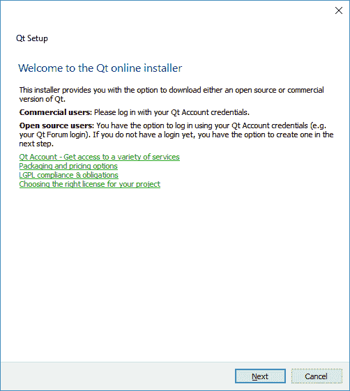
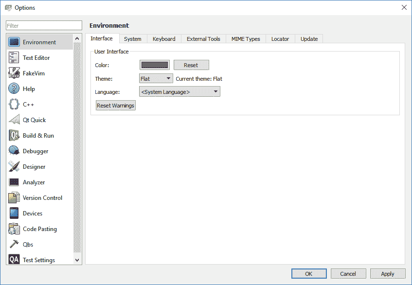
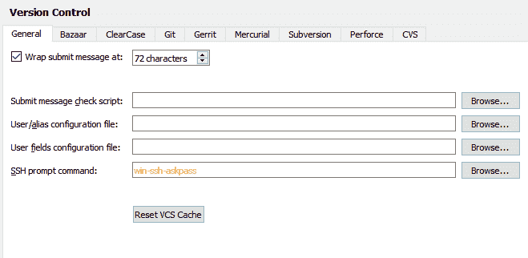
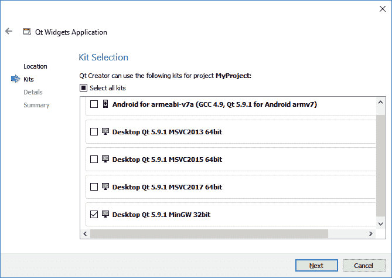
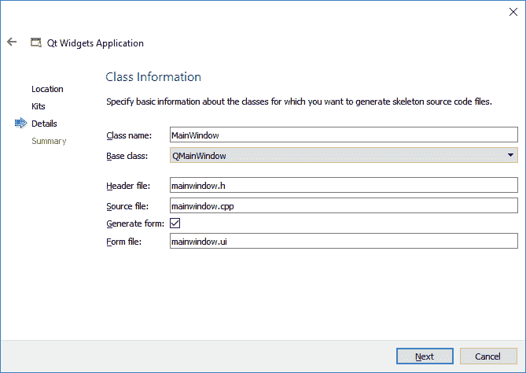
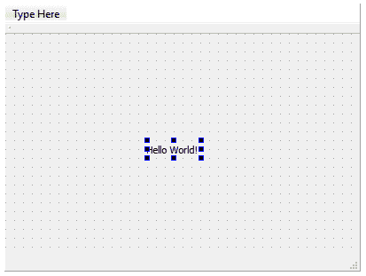
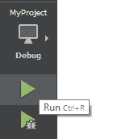

# Qt 简介

Qt(发音为*可爱*)自第一次发布以来，已经被软件工程师和开发人员使用了二十多年来创建跨平台应用程序。在经历了几次所有权变更和大量的重大代码修改之后，Qt 变得更加功能丰富，并且支持比过去更多的平台。Qt 不仅擅长桌面应用程序开发，而且在移动和嵌入式系统开发方面也非常出色。

在本章中，我们将涵盖以下主题:

*   什么是 Qt？
*   为什么要用 Qt？
*   在 Qt 中使用工具
*   下载和安装 Qt
*   建立工作环境
*   运行我们的第一个`Hello World` Qt 程序

在本章中，我们将了解更多关于 Qt 的历史。然后，我们将使用 Qt 的最新版本，也就是 Qt 版本 5，来构建我们的第一个示例程序。为了方便读者，我们将在整本书中简称它为 Qt。

# 什么是 Qt？

目前，Qt 的最新版本(正如本书所写)是 5.10 版本。这个版本包含了许多新特性和数千个错误修复，这使得 Qt 成为软件开发人员和系统工程师非常强大和稳定的开发工具包。Qt 有一个巨大的 SDK(软件开发工具包)包，其中包含了广泛的工具和库，用于帮助开发人员完成工作，而不必太担心与特定平台相关的技术问题。Qt 在幕后为您处理所有混乱的集成和兼容性问题，因此您不必处理它们。这不仅会提高效率，还会降低开发成本，尤其是当您试图开发跨平台应用程序来迎合更广泛的用户时。

Qt 有两种类型的许可证:

*   第一种类型是开源许可证，这是免费的，但前提是您的项目/产品符合其条款和条件。例如，如果您对 Qt 的源代码做了任何更改，您有义务将这些更改提交给 Qt 开发人员。如果做不到这一点，可能会导致严重的法律问题，因此，您可能希望选择第二个选项。
*   第二种类型的许可证是商业许可证，它赋予您对专有 Qt 源代码修改的全部权利，并保持您的应用程序私有。但是，当然，这些特权伴随着一系列费用。

如果你刚刚开始学习 Qt，不要被这些术语所拖累，因为你肯定不会修改 Qt 库的源代码或者从源代码中重新编译它，至少现在不会。

For more information regarding Qt's licensing, please visit [https://www.qt.io/licensing-comparison.](https://www.qt.io/licensing-comparison)

# 为什么要用 Qt？

不难看出，为什么 Qt 有机会战胜市场上所有其他现有的 SDKs 首先，跨平台兼容性。如果不为每个平台编写不同的代码集，你很难找到支持如此多平台的其他开发工具包。通过消除这些额外的步骤，程序员可以专注于开发他们的应用程序，而不需要担心每个特定于平台的特性的实现。此外，您的代码看起来很干净，没有所有的`#ifdef`宏，并且必须为不同的平台加载不同的依赖项。

Qt 一般使用 C++，这是一种编译语言，可以生成小而高效的代码。它也有很好的文档记录，并且遵循一套非常一致的命名约定，这减少了开发人员的学习曲线。

请务必注意，Qt 确实包含少量仅在特定平台上工作的功能。然而，这些都是最小的，通常用于特殊的用例，比如只在移动平台上工作的 Qt SensorsQt Web Engine，只在桌面上工作；Qt NFC，仅适用于 Android 和 Linux 等等。这些是一些非常具体的功能，只存在于支持它们的特定平台上。除此之外，所有平台通常都支持通用特性。

# Qt 设计器

Qt Designer 通常被开发人员用来为桌面应用程序设计 GUI，而 Qt Quick Designer 通常用于移动和嵌入式平台。也就是说，这两种格式在桌面和移动格式上都运行良好，唯一的区别是外观和感觉，以及使用的语言类型。

Qt Designer 保存的 GUI 文件带有`.ui`扩展名，以 XML 格式保存。该文件存储图形用户界面设计者放置的每个小部件的属性，如位置、大小、边距、工具提示、布局方向等。它还将信号和时隙事件名称保存在自身中，以便于在后期与代码连接。这种格式不支持编码，只适用于 Qt C++ 项目，即基于小部件的应用程序项目。

# Qt 快速设计器

另一方面，Qt 快速设计器以`.ui.qml`和`.qml`格式保存图形用户界面文件。Qt Quick 在技术概念和开发方法上是一个非常不同类型的 GUI 系统，我们将在[第 14 章](13.html)、 *Qt Quick 和 QML* 中介绍。Qt Quick Designer 用一种类似于 JavaScript 的声明性语言保存其数据，称为 **QML** 。QML 不仅允许设计师以类似 CSS(层叠样式表)的方式定制他们的图形用户界面，还允许程序员在 QML 文件中编写功能性 JavaScript。如前所述，`.ui.qml`是仅用于视觉装饰的文件格式，而`.qml`包含应用程序逻辑。

如果你正在用 Qt Quick 做一个简单的程序，你根本不需要接触任何 C++ 编码。这对网络开发人员来说尤其受欢迎，因为他们可以立即使用 Qt Quick 并开发自己的应用程序，而无需陡峭的学习曲线；他们对一切都很熟悉。对于更复杂的软件，你甚至可以从 QML 链接 C++ 函数，反之亦然。同样，如果您有兴趣了解更多关于 Qt Quick 和 QML 的信息，请前往[第 14 章](13.html)、 *QtQuick 和 QML* 。

因为 Qt Creator 也是用 Qt 库自己写的，所以也是完全跨平台的。因此，您可以在不同的开发环境中使用相同的工具集，并为您的团队开发统一的工作流，从而提高效率和成本效益。

除此之外，Qt 还附带了许多不同的模块和插件，涵盖了项目所需的广泛功能。您通常不需要寻找其他外部库或依赖项，并自己尝试实现它们。Qt 的抽象层使后端实现对用户不可见，并导致统一的编码风格和语法。如果你自己试着把一堆外部依赖放在一起，你会发现每个库都有自己独特的编码风格。当在同一个项目中混合所有不同的编码风格时，这是相当混乱的，除非您自己制作抽象层，这是一项非常耗时的任务。由于 Qt 已经包含了创建功能丰富的应用程序所需的大部分(如果不是全部的话)模块，因此您不需要实现自己的模块。

For more information regarding the modules that come with Qt, please visit: [http://doc.qt.io/qt-5/qtmodules.html](http://doc.qt.io/qt-5/qtmodules.html).  

也就是说，还有很多第三库扩展了 Qt 本身不支持的特性，比如专注于游戏开发的库或者任何其他为特定用户群体设计的特性。

# 下载和安装 Qt

在不浪费任何时间的情况下，让我们开始安装吧！要获得开源 Qt 的免费安装程序，首先去他们的网站 [https://www.qt.io](https://www.qt.io/) 。在那里，寻找说下载 Qt 的按钮(如果他们更新了，网站可能会看起来不同)。请注意，您可能正在下载商用 Qt 的免费试用版，30 天后将无法使用。请确保您下载的是 Qt 的开源版本。此外，您可能想为您的平台选择合适的安装程序，因为 Qt 有许多不同的安装程序，适用于不同的操作系统 Windows、macOS 和 Linux。

你可能想知道为什么安装程序这么小——只有 19 MB 左右。这是因为统一在线安装程序实际上不包含任何 Qt 包，而是一个下载器客户端，可以帮助您下载所有相关文件，并在下载完成后将其安装到您的计算机上。下载在线安装程序后，双击它，您将看到如下界面(以下示例在 Windows 系统上运行):

点击下一步按钮，将出现**数字版权管理** ( **数字版权管理**)页面，要求您使用 Qt 账户登录。如果您没有帐户，也可以在同一页面上创建您的帐户:

登录后，您将看到一条消息，称您的 Qt 帐户中没有该主机平台的有效商业许可证。别担心，只需点击“下一步”按钮继续。

接下来，您将被要求指定安装路径。默认路径通常很好，但是您可以随意将其更改为任何其他路径。此外，您可以选中“将此常见文件类型与 Qt 创建者相关联”选项，也可以手动取消选中该选项。

之后，您将看到一系列复选框，您可以选择需要安装到计算机上的 Qt 版本。通常，对于新用户，默认选项就足够了。如果你不需要其中的一些选项，比如在安卓系统上支持 Qt，你可以在这里取消选择，以减少下载量。如果需要，您可以随时使用维护工具返回并添加或删除 Qt 组件:

接下来，您将看到许可协议。选中第一个选项，表示我已阅读并同意许可协议中包含的条款，然后单击“下一步”按钮。请务必阅读许可协议中规定的条款和条件！

最后，安装程序将要求您输入一个名称，为 Qt 创建一个开始菜单快捷方式。完成后，只需单击“下一步”，然后单击“安装”。下载过程需要几分钟到几个小时，这取决于你的网速。下载完所有文件后，安装程序会自动将文件安装到您在前面某个步骤中刚刚设置的安装路径。

# 设置工作环境

既然你已经安装了最新版本的 Qt，让我们启动 Qt Creator，开始创建我们的第一个项目！您应该能够在桌面或开始菜单中找到 Qt Creator 的快捷图标。

让我们看看设置环境的步骤:

1.  当您第一次启动 Qt Creator 时，应该会看到以下界面:

2.  在开始创建第一个项目之前，您可能需要调整几个设置。转到顶部菜单，选择工具|选项。屏幕上会弹出一个类似这样的窗口:

3.  在窗口的左边有很多不同的类别。每个类别代表一组选项，您可以设置这些选项来定制 Qt Creator 的外观和操作方式。你可能根本不想接触这些设置，但是先了解一下就好了。您可能想更改的第一个设置之一是“语言”选项，它在“环境”类别中可用。Qt Creator 为我们提供了一个在不同语言之间切换的选项。虽然它不支持所有语言，但大多数流行的语言都是可用的，如英语、法语、德语、日语、汉语、俄语等。选择所需语言后，单击应用并重新启动 Qt 创建器。您必须重新启动 Qt 创建器才能看到更改。

4.  您可能需要的下一个设置是缩进设置。默认情况下，Qt 使用空格缩进，每当您按下键盘上的 *Tab* 键时，脚本中会添加四个空格。有些人，像我一样，更喜欢制表符缩进。您可以在 C++ 类别中更改缩进设置。

Do note that if you are contributing to Qt project's source code, it's required that you use space indentation instead of tabs, which is the coding standard and style of the Qt project.

5.  在 C++ 类别下，您可以在右上方的某个位置找到位于“编辑”按钮旁边的“复制”按钮。点击它，会弹出一个新窗口。
6.  插入您自己的代码样式名称，因为您不能编辑默认的内置代码样式。创建自己的设置后，单击编辑按钮。现在，您可以在常规选项卡下看到实际的选项卡和缩进设置:

7.  请注意，即使有一个标签和缩进设置位于文本编辑器类别，我相信这是一个旧的设置，不再有任何影响的 Qt Creator。用户界面上还写了一个注释，说代码缩进是在 C++ 和 Qt Quick 设置中配置的。一个可能的原因是，由于 Qt Creator 现在支持 C++ 项目和 QML 项目，Qt 开发人员可能觉得有必要将设置分成两部分，因此旧的设置不再有效。我非常确定文本编辑器的这一部分在不久的将来会被弃用。

8.  接下来，在“构建和运行”类别下，您将看到一个标记为“套件”的选项卡。

9.  这是您可以为每个平台设置编译设置的地方。从下一张截图中可以看到，我的 Qt 不支持 MSVC(微软 Visual Studio 编译器)下的桌面构建，因为我从来没有在我的电脑上安装过 Visual Studio。相反，我的 Qt 只支持 MinGW 编译器下的桌面构建。从这个窗口，您可以检查并查看您的 Qt 是否支持您的项目所需的平台和编译器，并在必要时对其进行更改。但现在，我们就让它保持原样。要了解更多关于什么是*套件*以及如何配置构建设置的信息，请前往[第 15 章](14.html)、*跨平台开发*:

10.  最后，我们可以在版本控制类别中将我们的项目链接到我们的版本控制服务器。
11.  版本控制允许您或您的团队将代码更改提交给一个集中的系统，这样每个团队成员都可以获得相同的代码，而无需手动传递文件。当你在一个大团队中工作时，手动跟踪代码变化是非常困难的，合并不同程序员完成的代码更是如此。版本控制系统旨在解决这些问题。Qt 支持不同类型的版本控制系统，比如 Git、SVN、Mercurial、Perforce 等等。虽然这是一个非常有用的功能，尤其是如果您在团队中工作，但我们现在不需要对其进行配置:

# 运行我们的第一个 Hello World Qt 程序

Hello World 程序是一个非常简单的程序，只不过显示一个输出，上面写着`Hello, World!`(或者任何其他东西，不一定是这个)来显示 SDK 工作正常。我们不需要写很长的代码来产生一个`Hello World`程序，我们可以只用最少和最基本的代码来完成。事实上，我们不需要在 Qt 中编写任何代码，因为它会在您第一次创建项目时生成代码！

让我们按照以下步骤开始我们的项目:

1.  要在 Qt 中创建新项目，请单击 Qt 创建器欢迎屏幕上的新建项目按钮。或者，您也可以转到顶部菜单并选择文件|新建文件或项目。

2.  之后，您将看到一个窗口，允许您为项目或文件选择模板。在这个演示中，我们将选择 Qt 小部件应用程序:

3.  之后，设置您的项目名称和项目目录。您还可以选中“用作默认项目位置”复选框，以便下次在 Qt 中创建新项目时可以自动获得相同的路径。

4.  接下来，Qt Creator 将要求您为您的项目选择一个或多个工具包。对于这个演示，我们将选择带有 MinGW 编译器的桌面 Qt。不要担心，因为您可以在开发过程中添加或删除项目中的工具包:

5.  之后，你会看到一个页面，上面写着班级信息。这基本上是您为基本窗口设置类名的地方，但是我们不会更改任何内容，所以只需单击“下一步”按钮继续:

6.  最后，它会要求您将项目链接到版本控制服务器。如果您以前没有向 Qt 添加任何设置，您可以单击配置按钮，这将带您进入我在本章前面部分向您展示的设置对话框。
7.  然而，对于这个演示，我们将保持设置为<none>并按下完成按钮。然后，Qt Creator 将继续为您的项目生成必要的文件。一两秒钟后，Qt Creator 将自动切换到编辑模式，您应该能够在项目面板下看到它为您创建的文件。您可以通过双击 Qt Creator 中的任何文件来打开它们，它们将显示在位于右侧的编辑器中:</none>

8.  在我们开始编译项目之前，让我们在您的项目面板中打开`Forms`目录下的`mainwindow.ui`文件。不要太担心用户界面，因为我们将在下一章讨论它。我们需要做的是单击“显示小部件”类别下的“标签”图标，并将其拖动到右侧窗口的中心，如下图所示:

9.  之后，双击`Text Label`小部件，将文本更改为`Hello World!`。完成后，点击键盘上的*进入*按钮:

10.  最后一步是按左下角的运行按钮，如下所示:

11.  我们通常会先构建程序，然后运行程序，但是 Qt Creator 足够聪明，能够发现它需要构建它。但是，单独构建和运行应用程序仍然是一个好习惯。经过几秒钟的编译，...瞧啊。你已经用 Qt 创建了你的第一个`Hello World`程序！：

# 摘要

Qt Creator 等工具的存在使得设计应用程序的用户界面对开发人员来说变得简单而有趣。我们不再需要仅仅为了创建一个按钮而编写一堆代码，或者仅仅为了调整文本标签的位置而更改一堆代码，因为在我们设计图形用户界面时，Qt Designer 会为我们生成这些代码。Qt 已经将**所见即所得** ( **所见即所得**)的理念应用到工作流程中，它为我们提供了完成工作所需的所有便利和效率。

在下一章，我们将学习 Qt Creator 的来龙去脉，并开始用 Qt 设计我们的第一个 GUI！