# 三、数据库连接

在前一章中，我们学习了如何从头开始创建登录页面。但是，它还没有运行，因为登录页面没有连接到数据库。在本章中，您将学习如何将 Qt 应用程序连接到验证登录凭据的 MySQL(或 MariaDB)数据库。

在本章中，我们将涵盖以下主题:

*   MySQL 数据库系统介绍
*   建立 MySQL 数据库
*   sqlcommand
*   Qt 中的数据库连接
*   功能登录页面

我们将逐步浏览本章，以发现 Qt 附带的强大功能，并允许您的应用程序直接连接到数据库，而无需任何额外的第三方依赖。数据库查询本身是一个巨大的话题，但是我们将能够通过示例和实用方法从头学习最基本的命令。

Qt 支持多种不同类型的数据库系统:

*   MySQL(或 MariaDB)
*   SQLite(版本 2 和 3)
*   IBM DB2
*   神谕
*   开放式数据库连接性
*   一种数据库系统
*   Sybase 自适应服务器

最受欢迎的两个是 MySQL 和 SQLite。SQLite 数据库通常脱机使用，它不需要任何设置，因为它使用磁盘文件格式来存储数据。因此，在本章中，我们将学习如何建立 MySQL 数据库系统，同时学习如何将我们的 Qt 应用程序连接到 MySQL 数据库。用于连接到 MySQL 数据库的 C++ 代码可以被重用来连接到其他数据库系统，而无需进行许多修改。

# MySQL 数据库系统介绍

**MySQL** 是基于关系模型的开源数据库管理系统，是现代数据库系统为各种目的存储信息最常用的方法。

与其他一些遗留模型(如对象数据库系统或分层数据库系统)不同，关系模型已经被证明更加用户友好，并且比其他模型表现更好。这就是为什么我们今天看到的大多数现代数据库系统大多使用这种方法的原因。

MySQL 最初是由一家名为 **MySQL AB** 的瑞典公司开发的，它的名字是该公司联合创始人女儿的名字 *My* 和 *SQL* 的组合，后者是**结构化查询语言**的缩写。

与 Qt 类似，MySQL 在其整个历史中也曾被多个不同的人拥有。最引人注目的收购发生在 2008 年，太阳微系统公司以 10 亿美元收购了 MySQL AB。一年后的 2009 年，**甲骨文公司**收购了太阳微系统公司，因此直到今天，MySQL 仍归甲骨文所有。即使 MySQL 几次易手，它仍然是一个开源软件，允许用户根据自己的目的更改代码。

由于它的开源性质，还有其他数据库系统是从 MySQL 项目派生/分叉而来的，比如**马里亚数据库**、 **Percona 服务器**等等。然而，这些替代方案与 MySQL 并不完全兼容，因为它们已经对其进行了修改以满足自己的需求，因此这些系统中的一些命令可能会有所不同。

根据 **Stack Overflow** 在 2017 年进行的一项调查，MySQL 是 web 开发人员中使用最广泛的数据库系统，我们可以在下面的截图中看到:


调查结果表明，您在本章中学到的知识不仅可以应用于 Qt 项目，还可以应用于网络、移动应用和其他类型的应用。

此外，MySQL 及其变体正被大公司和项目组使用，如脸书、YouTube、推特、美国宇航局、Wordpress、Drupal、Airbnb、Spotify 等。这意味着在开发过程中遇到任何技术问题时，您都可以很容易地得到答案。

For more information regarding MySQL, please visit:
[https://www.mysql.com](https://www.mysql.com)

# 建立 MySQL 数据库

有许多不同的方法来设置您的 MySQL 数据库。这真的取决于你运行的平台类型，无论是 Windows、Linux、Mac 还是其他任何类型的操作系统；它还将取决于您的数据库的用途——无论是用于开发和测试，还是用于大规模生产服务器。

对于大规模的服务(比如社交媒体)，最好的方法是从源头编译 MySQL，因为像这样的项目需要大量的优化、配置，有时还需要定制，以便处理大量的用户和流量。

但是，如果您打算正常使用，您可以下载预编译的二进制文件，因为默认配置已经足够了。你可以从他们的官方网站安装一个独立的 MySQL 安装程序，或者下载除了 MySQL 之外的其他几个软件附带的安装包。

在本章中，我们将使用名为 **XAMPP** 的软件包，这是一个由名为**阿帕奇之友**的小组开发的网络服务器堆栈包。该软件包附带有 **Apache** 、 **MariaDB** 、 **PHP** 以及其他可在安装过程中添加的可选服务。以前，MySQL 是包的一部分，但从 5.5.30 和 5.6.14 版本开始，它已经被 **MariaDB** 取代。MariaDB 的工作原理几乎与 MySQL 相同，除了那些涉及高级功能的命令，我们不会在本书中使用这些命令。

我们使用 XAMPP 的原因是，它有一个控制面板，可以轻松启动和停止服务，而无需使用命令提示符，并提供对配置文件的轻松访问，而无需您自己深入安装目录。对于需要频繁测试的应用程序开发来说，这非常快速有效。但是，不建议您在生产服务器上使用 XAMPP，因为默认情况下某些安全功能已被禁用。

或者，您也可以通过其他类似的软件包安装 MySQL，如 **AppServ** 、 **AMPPS** 、 **LAMP** (仅限 Linux)、 **WAMP** (仅限 Windows)、 **Zend** **服务器**等。

现在，让我们学习如何安装 XAMPP:

1.  首先，前往他们位于[https://www.apachefriends.org](https://www.apachefriends.org)的网站，点击位于您屏幕底部的下载按钮之一，该按钮显示您当前操作系统的图标:


2.  单击下载按钮后，下载过程将在几秒钟内自动开始，一旦完成，它将继续安装程序。确保在安装过程开始之前包含 Apache 和 MySQL/MariaDB。

3.  安装 XAMPP 后，从开始菜单或桌面快捷方式启动控制面板。之后，你可能会注意到什么都没发生。这是因为默认情况下，XAMPP 控制面板隐藏在任务栏中。您可以通过右键单击控制面板窗口并在弹出菜单中选择“显示/隐藏”选项来显示该窗口。下面的截图向您展示了这在 Windows 机器上的样子。对于 Linux，菜单看起来可能略有不同，但总体来说非常相似。对于 macOS，您必须从发射台或坞站启动 XAMPP:


4.  单击“显示/隐藏”选项后，您将最终看到屏幕上显示的控制面板窗口。如果您再次点按“显示/隐藏”选项，窗口将被隐藏:

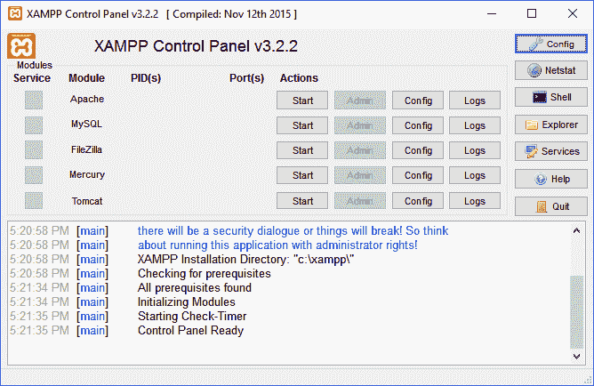

5.  乍看之下，他们的控制面板几乎不言自明。在左侧，您可以看到在 XAMPP 可用的服务名称，在右侧，您将看到指示开始、配置、日志等的按钮。出于某种原因，XAMPP 将 MySQL 显示为模块名，但实际上它运行的是马里亚数据库。不用担心；两者的工作原理基本相同，因为 MariaDB 是 MySQL 的一个分支。
6.  在本章中，我们只需要 Apache 和 MySQL (MariaDB)，所以让我们单击这些服务的开始按钮。一两秒钟后，您会看到开始按钮现在被标记为停止，这意味着服务已经启动！：

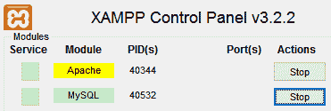

7.  为了验证这一点，我们打开浏览器，输入`localhost`作为网址。如果看到类似下图的内容，说明 Apache web 服务器已经成功启动！：

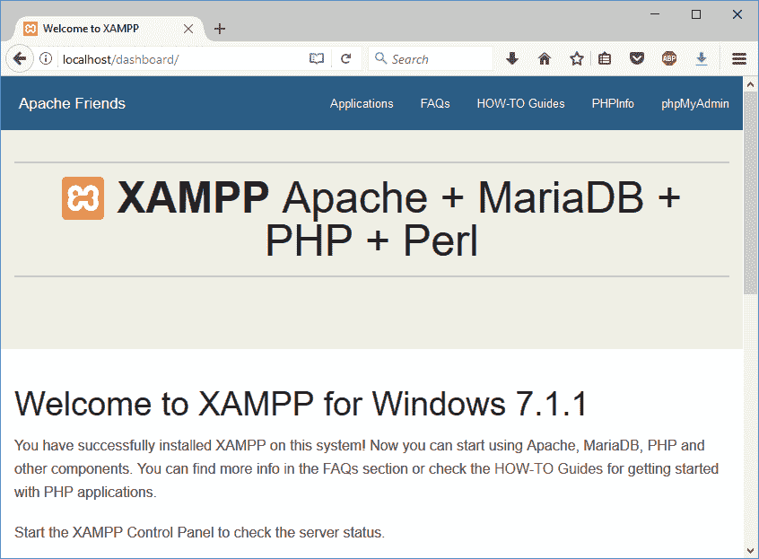

8.  Apache 在这里非常重要，因为我们将使用它来使用名为 **phpMyAdmin** 的基于网络的管理工具配置数据库。phpMyAdmin 是用 PHP 脚本语言编写的 MySQL 的管理工具，因此得名。尽管它最初是为 MySQL 设计的，但它对 MariaDB 也很有效。
9.  要访问 phpMyAdmin 控制面板，请在浏览器上键入`localhost/phpmyadmin`。之后，您应该会看到类似这样的内容:


10.  在页面的左侧，您将看到导航面板，它允许您访问 MariaDB 数据库中可用的不同数据库。页面右侧是各种工具，可让您查看表格、编辑表格、运行 SQL 命令、将数据导出到电子表格、设置权限等。
11.  默认情况下，您只能在右侧的设置面板上修改数据库的常规设置。您必须从左侧的导航面板中选择一个数据库，然后才能修改特定数据库的设置。
12.  数据库就像一个文件柜，您可以在里面存储日志。每个日志都称为一个表，每个表都包含数据，这些数据就像电子表格一样排序。当您想要从 MariaDB 获取数据时，您必须在从中获取数据之前指定您想要访问的文件柜(数据库)和日志簿(表)。希望这将使您更好地理解 MariaDB 和其他类似数据库系统背后的概念。

13.  现在，让我们从创建第一个数据库开始！为此，您可以单击导航面板上数据库名称上方的“新建”按钮，或者单击菜单顶部的“数据库”按钮。这两个按钮都会将您带到“数据库”页面，您应该可以在菜单按钮下方看到:


14.  之后，让我们创建第一个数据库！键入所需的数据库名称，然后单击创建按钮。创建数据库后，您将被重定向到“结构”页面，该页面将列出该数据库中包含的所有表。默认情况下，您新创建的数据库不包含任何表，因此您将看到一行文本，显示在数据库中找不到表:


15.  猜猜我们下一步要做什么？正确，我们将创建我们的第一个表！首先，让我们插入您想要创建的表的名称。因为我们将在本章后面做一个登录页面，让我们命名我们的表`user`。我们将保持默认的列数不变，然后单击开始。
16.  之后，您将被重定向到另一个页面，其中包含许多供您填写的输入字段列。每一列代表一个数据结构，该数据结构将在创建后添加到您的表中。
17.  您需要添加到表结构中的第一件事是一个标识，它将在每次插入新数据时自动增加。然后，添加一个时间戳列来指示数据插入的日期和时间，这有利于调试。最后但同样重要的是，我们将为登录验证添加用户名列和密码列。如果您不确定如何操作，请参考下图。确保您遵循图像中圈出的设置:


18.  结构的类型非常重要，必须根据其预期目的进行设置。例如，id 列必须设置为 INT(整数)，因为它必须是一个完整的数字，而用户名和密码必须设置为 VARCHAR 或其他类似的数据类型(CHAR、TEXT 等)，以便正确保存数据。

19.  另一方面，时间戳必须设置为时间戳类型，并且必须将默认值设置为 CURRENT _ 时间戳，这将通知 MariaDB 在数据插入时自动生成当前时间戳。
20.  请注意，“标识”列的索引设置必须设置为“主要”，并确保勾选了“自动递增”复选框。当您选中“增加索引”复选框时，将出现一个“增加索引”窗口。您可以保持默认设置不变，然后单击“开始”按钮完成步骤并开始创建表格:

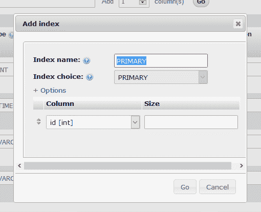

21.  创建新表后，您应该能够看到类似于下图的内容。您仍然可以通过单击“更改”按钮随时编辑结构设置；您也可以通过单击位于列右侧的“删除”按钮来删除任何列。请注意，删除列也会删除属于该列的所有现有数据，并且此操作无法撤消:


22.  即使我们通常会通过我们的程序或网页向数据库添加数据，我们也可以直接在 phpMyAdmin 上添加数据来进行测试。要使用 phpMyAdmin 添加数据，首先，您必须创建一个数据库和表，这是我们在前面的步骤中所做的。然后，单击位于菜单顶部的“插入”按钮:

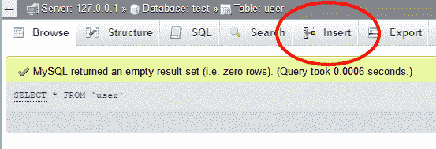

23.  之后，您会看到一个表单出现了，它类似于我们之前创建的数据结构:

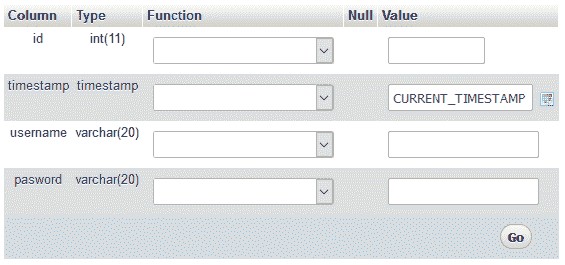

24.  您可以简单地忽略标识和时间戳值，因为它们将在您保存数据时自动生成。在这种情况下，只需要填写用户名和密码。为了测试，我们把`test`作为用户名，`123456`作为密码。然后，单击开始按钮保存数据。

Please note that you should not save your password in a human-readable format on your actual production server. You must encrypt the password with a **cryptographic hash** function such as SHA-512, RIPEEMD-512, BLAKE2b, and so on before passing it to the database. This will ensure that the password is not readable by hackers in case your database is being compromised. We will cover this topic at the end of this chapter.

现在我们已经完成了数据库的设置并插入了第一个测试数据，让我们继续学习一些 SQL 命令！

# sqlcommand

大多数流行的关系数据库管理系统，如 **MySQL** 、 **MariaDB** 、 **Oracle SQL** 、**微软 SQL** 等，都使用一种称为 **SQL** ( **结构化查询语言**)的声明性语言与数据库进行交互。SQL 最初是由 IBM 工程师在 20 世纪 70 年代开发的，但后来，它被**甲骨文公司**和那个时代的其他新兴技术公司进一步增强。

如今，SQL 已经成为美国国家标准协会(T2)和国际标准化组织(T4)的标准。SQL 语言已经被许多不同的数据库系统所采用，并且已经成为现代最流行的数据库语言之一。

在本节中，我们将学习一些基本的 SQL 命令，您可以使用这些命令与您的 MariaDB 数据库进行交互，特别是获取、保存、修改和删除数据库中的数据。这些基本命令可以在其他类型的基于 SQL 的数据库系统中使用，也可以在 ANSI 和 ISO 标准下使用。只是，一些更高级/定制的功能在不同的系统中可能会有所不同，因此在使用这些高级功能之前，请务必阅读系统手册。

好了，我们开始吧！

# 挑选

大多数的 SQL 语句都是一个字的简短和不言自明的。例如，该语句用于从特定表中选择一列或多列，并从所述列中获取数据。让我们来看看一些使用`SELECT`语句的示例命令。

以下命令从`user`表中检索所有列的所有数据:

```cpp
SELECT * FROM user;
```

以下命令仅从用户表中检索`username`列:

```cpp
SELECT username FROM user;
```

以下命令从`user`表中检索`username`和`password`列，条件是`id`等于`1`:

```cpp
SELECT username, password FROM user WHERE id = 1;
```

您可以使用 phpMyAdmin 自己尝试这些命令。为此，请在 phpMyAdmin 中单击位于菜单顶部的“SQL”按钮。之后，您可以在下面的文本字段中键入命令，然后单击“执行”来执行查询:


To learn more about the `SELECT` statement, please refer to the following link: 
[https://dev.mysql.com/doc/refman/5.7/en/select.html](https://dev.mysql.com/doc/refman/5.7/en/select.html)

# 插入

接下来，`INSERT`语句用于将新数据保存到数据库表中。例如:

```cpp
INSERT INTO user (username, password) VALUES ("test2", "123456");
```

前面的 SQL 命令将`username`和`password`数据插入到`user`表中。还有一些其他的语句可以和`INSERT`一起使用，比如`LOW_PRIORITY`、`DELAYED`、`HIGH_PRIORITY`等等。

Please refer to the following link to learn more about these options:
[https://dev.mysql.com/doc/refman/5.7/en/insert.html](https://dev.mysql.com/doc/refman/5.7/en/insert.html)

# 更新

`UPDATE`语句修改数据库中的现有数据。您必须为`UPDATE`命令指定一个条件，否则它将修改表中的每一条数据，这不是我们想要的行为。试试下面的命令，会改变第一个用户的`username`和`password`:

```cpp
UPDATE user SET username = "test1", password = "1234321" WHERE id = 1;
```

但是，如果 ID 为`1`的用户不存在，该命令将失败。如果您提供的`username`和`password`数据与存储在数据库中的数据完全匹配，该命令还将返回状态`0 rows affected`(无变化)。有关`UPDATE`声明的更多信息，请参考以下链接:

[https://dev . MySQL . com/doc/ref man/5.7/en/update . html](https://dev.mysql.com/doc/refman/5.7/en/update.html)

# 删除

`DELETE`语句从数据库的特定表中删除数据。例如，以下命令从携带标识`1`的`user`表中删除一个数据:

```cpp
DELETE FROM user WHERE id = 1;
```

即使可以使用此语句删除不需要的数据，也不建议从数据库中删除任何数据，因为该操作无法撤消。最好在表中添加另一个名为 status 的列，并使用它来指示是否应该显示数据。例如，如果您的用户删除了前端应用程序上的数据，请将该数据的状态设置为(比如说)`1`而不是`0`。然后，当你想在前端显示数据时，只显示带有`0`状态的数据:

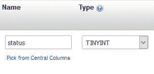

这样，任何意外删除的数据都可以轻松恢复。如果您只打算使用 true 或 false，也可以为此使用 BOOLEAN 类型。我通常会使用 TINYINT，以防将来需要第三或第四个身份。有关`DELETE`声明的更多信息，您可以参考以下链接:

[https://dev . MySQL . com/doc/ref man/5.7/en/delete . html](https://dev.mysql.com/doc/refman/5.7/en/delete.html)

# 加入

使用关系数据库管理系统的优点是，数据可以很容易地从不同的表中连接在一起，并且可以以单个批量返回给用户。这大大提高了开发人员的工作效率，因为在设计复杂的数据库结构时，它允许流动性和灵活性。

在 MariaDB/MySQL 中有许多类型的连接语句——内部连接、完全外部连接、左连接和右连接。所有这些不同的 JOIN 语句在执行时都有不同的行为，如下图所示:

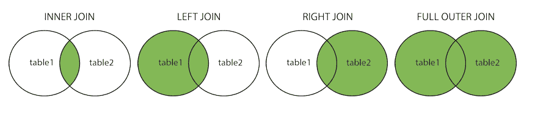

大多数情况下，我们将使用 INNER JOIN 语句，因为它只返回两个表中具有匹配值的数据，因此只返回少量所需的数据。JOIN 命令比其他命令复杂得多，因为您首先需要将表设计为可连接的。在我们开始测试 JOIN 命令之前，让我们创建另一个表来实现这一点。我们将这个新的餐桌部门称为:


之后，添加两个部门，如是:

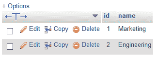

然后，转到用户表，在结构页面上，一直滚动到底部，查找显示的表单，然后单击“转到”按钮:


增加一个名为 deptID(代表部门 ID)的新列，并将其数据类型设置为`int`(整数):

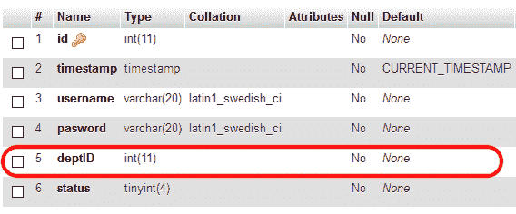

然后，设置几个测试用户，将他们的每个 deptID 设置为`1`或`2`:

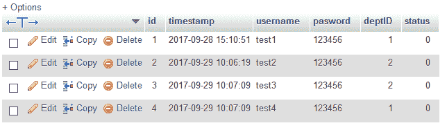

请注意，我还在这里添加了状态列，用于检查用户是否已被删除。完成后，让我们尝试运行一个示例命令！：

```cpp
SELECT my_user.username, department.name FROM (SELECT * FROM user WHERE deptID = 1) AS my_user INNER JOIN department ON department.id = my_user.deptID AND my_user.status = 0 
```

乍一看，这看起来相当复杂，但如果你把它分成几个部分，就真的不复杂了。我们将首先从`()`括号内的命令开始，在该命令中，我们要求 MariaDB/MySQL 选择`user`表中带有`deptID =  1`的所有列:

```cpp
SELECT * FROM user WHERE deptID = 1 
```

之后，将其包含在一个`()`括号内，并将整个命令命名为`my_user.`，之后，您可以使用`INNER JOIN`语句开始将您的用户表(现在称为`my_user`)与部门表连接起来。这里我们还为其增加了一些查找数据的条件，比如部门表的 ID 必须与`my_user`的`deptID`匹配，`my_user`的状态值必须为`0`，表示数据仍然有效，没有被标记为删除:

```cpp
(SELECT * FROM user WHERE deptID = 1) AS my_user INNER JOIN department ON department.id = my_user.deptID AND my_user.status = 0 
```

最后，在前面添加以下代码来完成 SQL 命令:

```cpp
SELECT my_user.username, department.name FROM  
```

让我们尝试前面的命令，看看结果是否如您所料。

只要表通过匹配的列相互链接，就可以使用此方法连接无限个表。

To find out more about the **JOIN** statement, please visit the following link:
[https://dev.mysql.com/doc/refman/5.7/en/join.html](https://dev.mysql.com/doc/refman/5.7/en/join.html)

还有许多其他 SQL 语句我们没有在本章中介绍，但是我们已经介绍过的语句几乎是您开始使用的所有语句。

在我们进入下一部分之前，最后一件事——我们必须为应用程序创建一个用户帐户，以便访问我们的 MariaDB/MySQL 数据库。首先，转到您的 phpMyAdmin 主页，然后单击顶部菜单上的用户帐户:


然后，转到底部，查找名为添加用户帐户的链接:

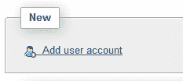

进入“添加用户帐户”页面后，在“登录信息”表单中键入用户名和密码信息。确保主机名设置为本地:

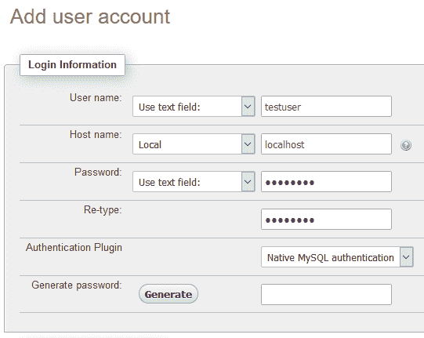

然后，向下滚动并设置用户的全局权限。启用“数据”部分中的选项就足够了，但不要启用其他选项，因为一旦您的服务器遭到破坏，它可能会赋予黑客更改数据库结构的特权:


创建用户帐户后，请按照以下步骤允许新创建的用户访问名为 test 的数据库(或您选择的任何其他表名):

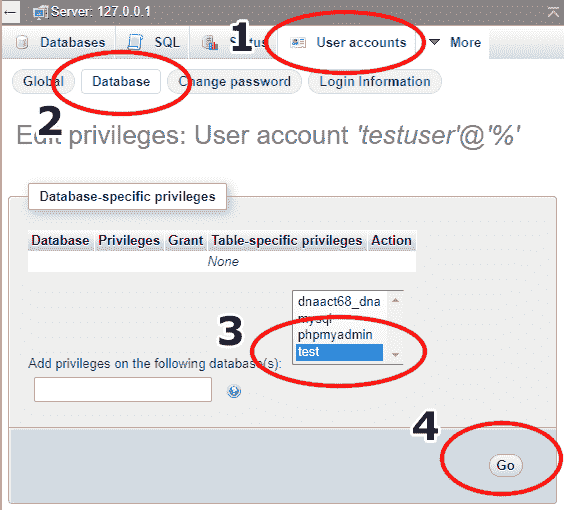

单击“执行”按钮后，您现在已经授予用户帐户访问数据库的权限！在下一节中，我们将学习如何将我们的 Qt 应用程序连接到数据库。

# Qt 中的数据库连接

现在我们已经学习了如何建立一个功能强大的 MySQL/MariaDB 数据库系统，让我们更进一步，在 Qt 中发现数据库连接模块！

在我们继续处理上一章的登录页面之前，让我们先从一个新的 Qt 项目开始，这样更容易演示仅与数据库连接相关的功能，并且我们不会被其他东西分散注意力。这一次，我们将使用名为 Qt 控制台应用程序的终端风格的应用程序，因为我们在这个演示中并不真正需要任何图形用户界面:

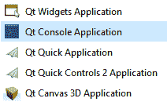

创建新项目后，您应该只看到项目中的两个文件，即[project_name]。pro 和 main.cpp:


首先你需要做的是打开你的项目文件(`.pro`)，在我这里是 DatabaseConnection.pro，在第一行后面加上`sql`关键字，就像这样:

```cpp
QT += core sql 
```

就这么简单，我们已经成功地将`sql`模块导入了我们的 Qt 项目！然后，打开`main.cpp`，你应该会看到一个非常简单的脚本，只包含八行代码。这基本上是创建一个空控制台应用程序所需的全部内容:

```cpp
#include <QCoreApplication> 
int main(int argc, char *argv[]) 
{ 
   QCoreApplication a(argc, argv); 
   return a.exec(); 
} 
```

为了连接到我们的数据库，我们必须首先将相关的头导入`main.cpp`，如下所示:

```cpp
#include <QCoreApplication> 
#include <QtSql> 
#include <QSqlDatabase> 
#include <QSqlQuery> 
#include <QDebug> 
int main(int argc, char *argv[]) 
{ 
   QCoreApplication a(argc, argv); 
   return a.exec(); 
} 
```

没有这些头文件，我们将无法使用 Qt 的`sql`模块提供的功能，我们之前已经导入了这些功能。此外，我们还添加了`QDebug`标题，这样我们就可以轻松地在控制台显示器上打印出任何文本(类似于 C++ 标准库提供的`std::cout`功能)。

接下来，我们将向`main.cpp`文件添加一些代码。在`return a.exec()`前增加以下高亮代码:

```cpp
int main(int argc, char *argv[]) 
{ 
   QCoreApplication a(argc, argv); 
   QSqlDatabase db = QSqlDatabase::addDatabase("QMYSQL"); 
   db.setHostName("127.0.0.1"); 
   db.setPort(3306); 
   db.setDatabaseName("test"); 
   db.setUserName("testuser"); 
   db.setPassword("testpass"); 
   if (db.open()) 
   { 
         qDebug() << "Connected!"; 
   } 
   else 
   { 
         qDebug() << "Failed to connect."; 
         return 0; 
   } 
   return a.exec(); 
} 
```

请注意，数据库名称、用户名和密码可能与您在数据库中设置的不同，因此在编译项目之前，请确保它们是正确的。

完成后，让我们单击“运行”按钮，看看会发生什么！：


如果您看到以下错误，请不要担心:

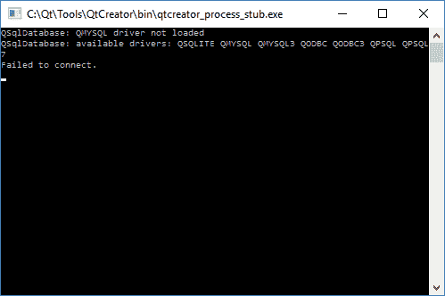

这仅仅是因为您必须将 MariaDB 连接器(或者 MySQL 连接器，如果您正在运行 MySQL)安装到您的计算机上，并将 DLL 文件复制到您的 Qt 安装路径上。请确保 DLL 文件与服务器的数据库库匹配。你可以打开你的 phpMyAdmin 主页，看看它当前使用的是哪个库。

出于某种原因，即使我用马里亚数据库运行 XAMPP，这里的库名显示的是 libmysql 而不是 libmariadb，所以我不得不安装 MySQL Connector 来代替:


If you're using MariaDB, please download the MariaDB Connector at the following link:
[https://downloads.mariadb.org/connector-c](https://downloads.mariadb.org/connector-c) If you're using MySQL instead (or are having the same issue as I did), please visit the other link and download MySQL Connector:
[https://dev.mysql.com/downloads/connector/cpp/](https://dev.mysql.com/downloads/connector/cpp/)

下载马里亚数据库连接器后，将其安装在您的计算机上:

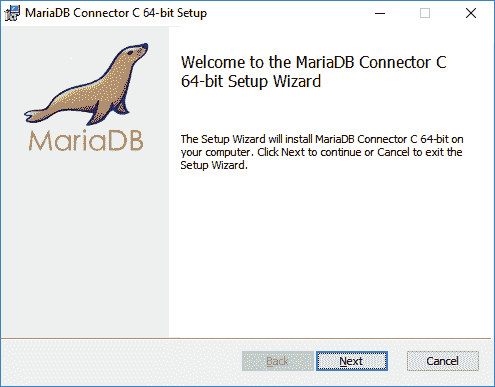

上面的截图显示了 Windows 机器的安装过程。如果您正在运行 Linux，您必须为您的 Linux 发行版下载正确的包。如果您正在运行 Debian、Ubuntu 或其变体之一，请下载 Debian 和 Ubuntu 包。如果您正在运行红帽、Fedora、CentOS 或其变体之一，请下载红帽、Fedora 和 CentOS 软件包。这些软件包的安装是自动化的，所以您可以开始了。但是，如果您两个都没有运行，那么您必须下载下载页面上列出的符合您的系统要求的 gzipped tar 文件。

For more information about installing MariaDB binary tarballs on Linux, please refer to the following link:
[https://mariadb.com/kb/en/library/installing-mariadb-binary-tarballs/](https://mariadb.com/kb/en/library/installing-mariadb-binary-tarballs/)

至于 macOS，则需要使用名为 **Homebrew** 的包管理器来安装 MariaDB 服务器。

For more information, check out the following link:
[https://mariadb.com/kb/en/library/installing-mariadb-on-macos-using-homebrew/](https://mariadb.com/kb/en/library/installing-mariadb-on-macos-using-homebrew/)

安装完成后，转到它的安装目录，查找 DLL 文件(马里亚数据库为`libmariadb.dll`，MySQL 为`libmysql.dll`)。对于 Linux 和 macOS，是`libmariadb.so`或者`libmysql.so`而不是 DLL。

然后，将文件复制到应用程序的构建目录(与应用程序的可执行文件相同的文件夹)。之后，再次尝试运行您的应用程序:


如果您仍然收到`Failed to connect`但没有`QMYSQL driver not loaded`消息，请检查您的 XAMPP 控制面板，并确保您的数据库服务正在运行；还要确保代码中输入的数据库名称、用户名和密码都是正确的信息。

接下来，我们可以开始玩 SQL 命令了！在`return a.exec()`前增加以下代码:

```cpp
QString command = "SELECT name FROM department"; 
QSqlQuery query(db); 
if (query.exec(command)) 
{ 
   while(query.next()) 
   { 
         QString name = query.value("name").toString(); 
         qDebug() << name; 
   } 
} 
```

前面的代码将命令文本发送到数据库，并同步等待服务器返回结果。之后，使用`while`循环遍历每一个结果，并将其转换为字符串格式。然后，在控制台窗口上显示结果。如果一切顺利，你应该看到这样的情况:

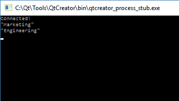

让我们尝试一些更复杂的东西:

```cpp
QString command = "SELECT my_user.username, department.name AS deptname FROM (SELECT * FROM user WHERE status = 0) AS my_user INNER JOIN department ON department.id = my_user.deptID"; 
QSqlQuery query(db); 
if (query.exec(command)) 
{ 
   while(query.next()) 
   { 
         QString username = query.value("username").toString(); 
         QString department = query.value("deptname").toString(); 
         qDebug() << username << department; 
   } 
} 
```

这次我们用 **INNER JOIN** 组合两个表选择`username`和`department`名称。为了避免混淆名为`name`的变量，使用`AS`语句将其重命名为`deptname`。之后，在控制台窗口显示`username`和`department`名称:

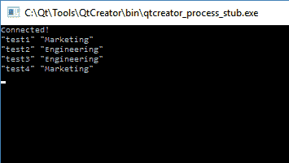

我们结束了...暂时的。让我们进入下一部分，在这里我们将学习如何使我们的登录页面发挥作用！

# 创建我们的功能登录页面

既然我们已经学会了如何将我们的 Qt 应用程序连接到 MariaDB/MySQL 数据库系统，那么现在是时候继续在登录页面上工作了！在前一章中，我们学习了如何设置登录页面的图形用户界面。然而，它根本没有任何作为登录页面的功能，因为它没有连接到数据库和验证登录凭证。因此，我们将学习如何通过增强 Qt 的`sql`模块来实现这一点。

简单回顾一下，登录屏幕是这样的:


我们现在需要做的第一件事是命名这个登录页面中重要的小部件，它们是用户名输入、密码输入和提交按钮。您可以通过选择小部件并在属性编辑器中查找属性来设置这些属性:

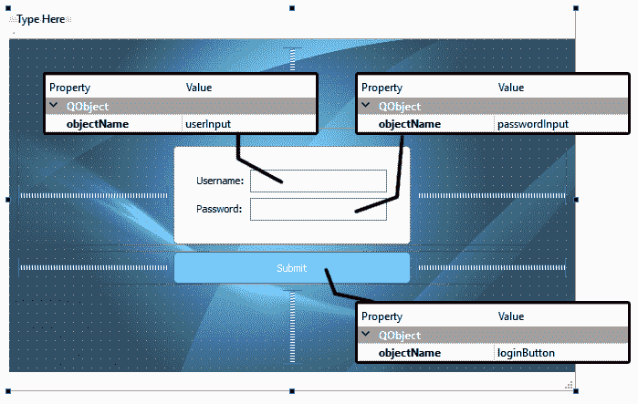

然后，将密码输入的回声模式设置为密码。此设置将通过用点替换来隐藏密码:


之后，右键单击提交按钮并选择转到插槽...将弹出一个窗口，询问您使用哪个信号。选择已单击()并单击确定:


一个名为`on_loginButton_clicked()`的新函数将被自动添加到`MainWindow`类中。当用户按下提交按钮时，Qt 会触发该功能，因此您只需在此处编写代码，将`username`和`password`提交到数据库进行登录验证。信号和槽机制是 Qt 提供的一个特殊功能，用于对象之间的通信。当一个小部件发出信号时，另一个小部件将得到通知，并继续运行一个特定的功能，该功能旨在对特定的信号做出反应。

让我们看看代码。

首先，在您的项目中添加`sql`关键字(。pro)文件:

`QT += core gui`
**sql**

然后，继续并添加相关标题到`mainwindow.cpp`:

```cpp
#ifndef MAINWINDOW_H 
#define MAINWINDOW_H 

#include <QMainWindow> 

#include <QtSql> 
#include <QSqlDatabase> 
#include <QSqlQuery> 
#include <QDebug> 
#include <QMessageBox> 
```

然后，返回`mainwindow.cpp`并在`on_loginButton_clicked()`功能中添加以下代码:

```cpp
void MainWindow::on_loginButton_clicked() 
{ 
   QString username = ui->userInput->text(); 
   QString password = ui->passwordInput->text(); 
   qDebug() << username << password; 
} 
```

现在，单击“运行”按钮，等待应用程序启动。然后，任意输入`username`和`password`，然后点击提交按钮。您现在应该看到您的`username`和`password`显示在 Qt Creator 的应用程序输出窗口上。

接下来，我们将把之前编写的 SQL 集成代码复制到`mainwindow.cpp`中:

```cpp
MainWindow::MainWindow(QWidget *parent) : 
   QMainWindow(parent), 
   ui(new Ui::MainWindow) 
{ 
   ui->setupUi(this); 

   db = QSqlDatabase::addDatabase("QMYSQL"); 
   db.setHostName("127.0.0.1"); 
   db.setPort(3306); 
   db.setDatabaseName("test"); 
   db.setUserName("testuser"); 
   db.setPassword("testpass"); 

   if (db.open()) 
   { 
         qDebug() << "Connected!"; 
   } 
   else 
   { 
         qDebug() << "Failed to connect."; 
   } 
}
```

请注意，我在数据库名称、用户名和密码中使用了一些随机文本。请确保您在此处输入了正确的详细信息，并且这些信息与您在数据库系统中设置的信息相匹配。

对于前面的代码，我们做了一个小的改动，就是我们只需要在`mainwindow.cpp`中调用`db = QSqlDatabase::addDatabase("QMYSQL")`而不需要类名称作为声明`QSqlDatabase db`现在已经被重新定位到`mainwindow.h`:

```cpp
private: 
   Ui::MainWindow *ui; 
 QSqlDatabase db; 
```

最后，我们添加将`username`和`password`信息与 SQL 命令相结合的代码，并将整个内容发送到数据库中执行。如果有与登录信息匹配的结果，则表示登录成功，否则表示登录失败:

```cpp
void MainWindow::on_loginButton_clicked() 
{ 
   QString username = ui->userInput->text(); 
   QString password = ui->passwordInput->text(); 

   qDebug() << username << password; 

   QString command = "SELECT * FROM user WHERE username = '" + username 
   + "' AND password = '" + password + "' AND status = 0"; 
   QSqlQuery query(db); 
   if (query.exec(command)) 
   { 
         if (query.size() > 0) 
         { 
               QMessageBox::information(this, "Login success.", "You 
               have successfully logged in!"); 
         } 
         else 
         { 
               QMessageBox::information(this, "Login failed.", "Login 
               failed. Please try again..."); 
         } 
   } 
} 
```

再次单击“运行”按钮，查看单击“提交”按钮时会发生什么:

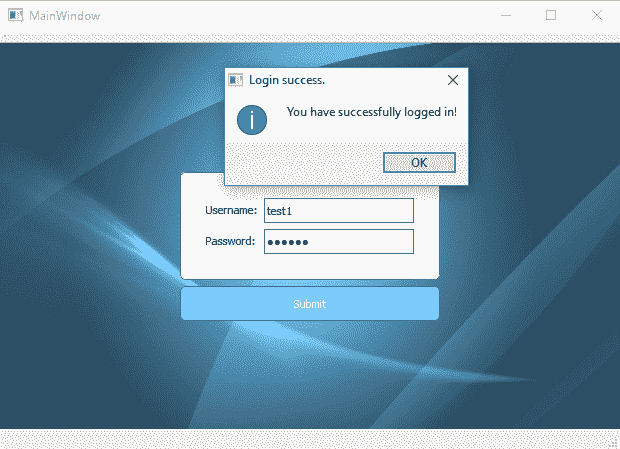

臀部臀部万岁！登录页面现在功能齐全！

# 摘要

在本章中，我们学习了如何建立一个数据库系统，并使我们的 Qt 应用程序连接到它。在下一章中，我们将学习如何使用强大的 Qt 框架绘制图表。