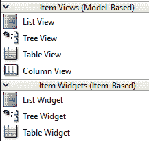
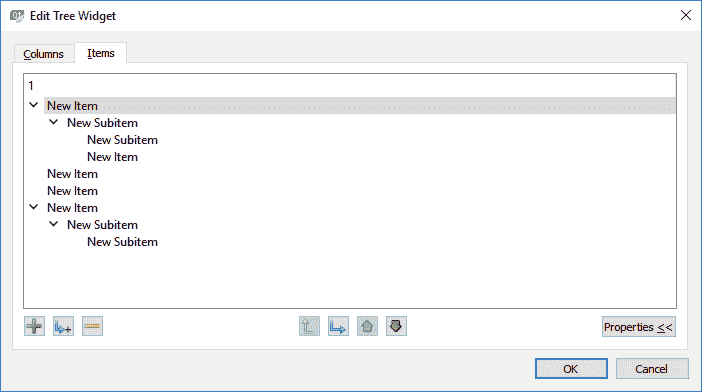
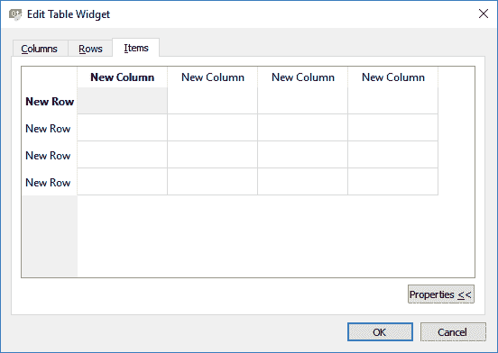
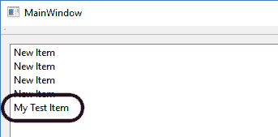
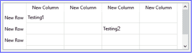
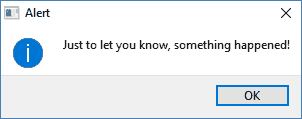
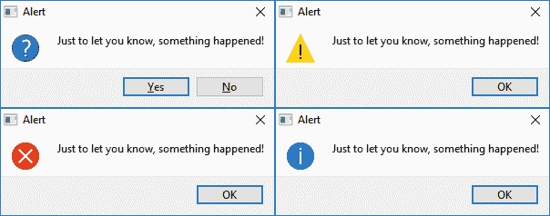
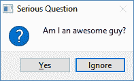
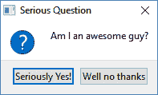
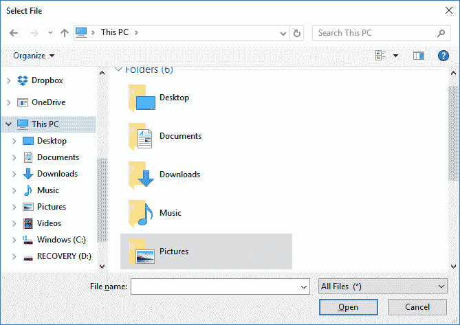

# 项目视图和对话框

在前一章中，我们学习了如何使用不同类型的图表显示数据。图表是在屏幕上向用户呈现信息的许多方式之一。对于您的应用程序来说，向用户呈现重要信息非常重要，这样他们就可以确切地知道应用程序发生了什么——数据是否已成功保存，或者应用程序是否正在等待用户的输入，或者用户应该知道的警告/错误消息，等等——确保应用程序的用户友好性和可用性非常重要。

在本章中，我们将涵盖以下主题:

*   使用项目视图小部件
*   使用对话框
*   使用文件选择对话框
*   图像缩放和裁剪

Qt 为我们提供了许多类型的小部件和对话框，我们可以轻松地使用它们向用户显示重要信息。让我们看看这些小部件是什么！

# 使用项目视图小部件

除了使用不同类型的图表显示数据，我们还可以使用不同类型的项目视图显示这些数据。项目视图小部件通过可视化呈现数据来呈现数据，通常沿垂直轴呈现。

二维项目视图，通常称为**表格视图**，显示垂直和水平方向的数据。这使得它能够在一个紧凑的空间内显示大量数据，并使用户能够非常快速和容易地搜索一个项目。

在项目视图中显示数据有两种方式。最常见的方法是使用**模型-视图架构**，它使用三个不同的组件，模型、视图和委托，从数据源中检索数据并将其显示在项目视图中。这些组件都利用 Qt 提供的**信号槽架构**相互通信:

*   来自模型的信号通知视图数据源所持数据的变化
*   来自视图的信号提供了关于用户与正在显示的项目的交互的信息
*   来自委托的信号在编辑过程中用于告诉模型和视图编辑器的状态

另一种方法是手动方式，程序员必须告诉 Qt 哪些数据进入了哪一列和哪一行。这种方法比模型视图简单得多，但与它的性能相比要慢得多。但是，对于少量数据，性能问题可以忽略不计，这是一个很好的方法。

如果打开 Qt Designer，您将看到项目视图小部件的两个不同类别，即项目视图(基于模型)和项目小部件(基于项目):



尽管它们看起来可能相同，但实际上这两个类别中的小部件工作方式非常不同。在本章中，我们将学习如何使用后一个类别，因为它更简单易懂，并且能够作为前一个类别的先决知识。

在项目小部件(基于项目)类别下，有三种不同的小部件，称为列表小部件、树小部件和表小部件。每个小部件都以不同的方式显示数据。选择一个适合你需求的:


从上图可以看出，**列表小部件**以一维列表的形式显示其项目，而**表格小部件**以二维表格的形式显示其项目。尽管**树小部件**的工作方式与**列表小部件**几乎相似，但它的项目以分层结构显示，其中每个项目下可以递归地有多个子项目。一个很好的例子是我们操作系统中的文件系统，它使用树小部件显示目录结构。

为了说明不同之处，让我们创建一个新的 Qt Widgets 应用程序项目，并亲自尝试一下。

# 创建我们的 Qt 小部件应用程序

创建项目后，打开`mainwindow.ui`并将三个不同的项目部件拖到主窗口。之后，选择主窗口并单击顶部的垂直布局按钮:


然后，双击列表小部件，会弹出一个新窗口。在这里，您可以通过单击+图标向列表小部件添加一些虚拟项目，或者通过从列表中选择一个项目并单击-图标来删除它们。单击“确定”按钮将最终结果应用到小部件:


您可以对树小部件执行同样的操作。它几乎与列表小部件相同，只是您可以递归地向项目添加子项。您还可以向树小部件添加列，并命名这些列:



最后，双击表格小部件打开编辑表格小部件窗口。与其他两个项目视图不同，表格小部件是一个二维项目视图，这意味着您可以像电子表格一样向其中添加列和行。通过在“列”或“行”选项卡中进行设置，可以用所需的名称标记每一列和每一行:



使用 Qt 设计器很容易理解一个小部件是如何工作的。只需将小部件拖放到窗口中，并摆弄它的设置，然后构建并运行项目，亲自查看结果。

在本例中，我们已经演示了三个项目视图小部件之间的区别，但没有编写一行代码:


# 让我们的列表小部件发挥作用

然而，为了让小部件在应用程序中充分发挥作用，仍然需要编写代码。让我们学习如何使用 C++代码向我们的项目视图小部件添加项目！

首先，打开`mainwindow.cpp`，在`ui->setupui(this)`之后，将下面的代码写入类构造函数:

```cpp
ui->listWidget->addItem("My Test Item"); 
```

就这么简单，您已经成功地向列表小部件添加了一个项目！



还有另一种方法可以将项目添加到列表小部件。但在此之前，我们必须在`mainwindow.h`中添加以下标题:

```cpp
#ifndef MAINWINDOW_H 
#define MAINWINDOW_H 

#include <QMainWindow> 
#include <QDebug> 
#include <QListWidgetItem> 
```

`QDebug`头用于我们打印调试消息，`QListWidgetItem`头用于我们声明 List Widget `Item`对象。接下来，打开`mainwindow.cpp`并添加以下代码:

```cpp
QListWidgetItem* listItem = new QListWidgetItem; 
listItem->setText("My Second Item"); 
listItem->setData(100, 1000); 
ui->listWidget->addItem(listItem); 
```

前面的代码与前面的单行代码相同。只不过，这一次，我在项目中添加了额外的数据。`setData()`函数接受两个输入变量——第一个变量是项目的数据角色，它指示 Qt 应该如何处理它。如果放入与`Qt::ItemDataRole`枚举器匹配的值，数据会影响显示、装饰、工具提示等，这可能会改变其外观。

在我的情况下，我只是简单地设置一个与`Qt::ItemDataRole`中的任何一个枚举器都不匹配的数字，这样我就可以将其存储为隐藏数据供以后使用。要检索数据，您只需拨打`data()`并插入与您刚刚设置的号码相匹配的号码:

```cpp
qDebug() << listItem->data(100); 
```

构建和运行项目；您应该能够看到新项目现在被添加到列表小部件:


For more information about `Qt::ItemDataRole` enumerators, please check out the following link: [http://doc.qt.io/qt-5/qt.html#ItemDataRole-enum](http://doc.qt.io/qt-5/qt.html#ItemDataRole-enum)

如前所述，隐藏的数据可以附加到列表项上以备后用。例如，您可以使用列表小部件来显示用户准备购买的产品列表。这些项目中的每一个都可以附加其产品标识，以便当用户选择项目并将其放在购物车上时，您的系统可以通过识别存储为数据角色的产品标识来自动识别哪个产品已添加到购物车中。

在前面的示例中，我在列表项中存储了自定义数据`1000`，并将其数据角色设置为`100`，这与任何`Qt::ItemDataRole`枚举器都不匹配。这样，数据就不会显示给用户，因此只能通过 C++代码来检索。

# 向树小部件添加功能

接下来，让我们继续看树小部件。它实际上与列表小部件没有什么不同。让我们看看下面的代码:

```cpp
QTreeWidgetItem* treeItem = new QTreeWidgetItem; 
treeItem->setText(0, "My Test Item"); 
ui->treeWidget->addTopLevelItem(treeItem); 
```

和列表小部件差不多，只是我们要在`setText()`函数中设置列 ID。这是因为树小部件介于列表小部件和表小部件之间，它可以有多个列，但不能有任何行。

树小部件和其他视图小部件之间最明显的区别是，它的所有项目都可以递归地包含子项目。让我们看看下面的代码，看看如何在树小部件中将子项目添加到现有项目中:

```cpp
QTreeWidgetItem* treeItem2 = new QTreeWidgetItem; 
treeItem2->setText(0, "My Test Subitem"); 
treeItem->addChild(treeItem2); 
```

真的那么简单！最终结果如下:


# 最后，我们的表格小部件

接下来，让我们对表小部件做同样的事情。从技术上讲，这些项目已经存在，并且在创建列和行时保留在表小部件中。我们需要做的是创建一个新的项，并用位于特定列和行的(当前为空的)项替换它，这就是为什么函数名被称为`setItem()`，而不是 List Widget 使用的`addItem()`。

让我们看看代码:

```cpp
QTableWidgetItem* tableItem = new QTableWidgetItem; 
tableItem->setText("Testing1"); 
ui->tableWidget->setItem(0, 0, tableItem); 

QTableWidgetItem* tableItem2 = new QTableWidgetItem; 
tableItem2->setText("Testing2"); 
ui->tableWidget->setItem(1, 2, tableItem2); 
```

从代码中可以看出，我在两个不同的位置添加了两段数据，这转化为以下结果:



就这样！在 Qt 中使用项目视图显示数据非常简单。如果您正在寻找更多与项目视图相关的示例，请访问以下链接:[http://doc.qt.io/qt-5/examples-itemviews.html](http://doc.qt.io/qt-5/examples-itemviews.html)

# 使用对话框

创建用户友好型应用程序的一个非常重要的方面是，当某个事件(有意或无意)发生时，能够显示关于应用程序状态的重要信息。为了显示这样的信息，我们需要一个外部窗口，一旦用户确认了信息，他/她就可以关闭该窗口。

Qt 自带这个功能，并且都驻留在`QMessageBox`类中。Qt 中可以使用几种类型的消息框；最基本的一个只使用一行代码，如下所示:

```cpp
QMessageBox::information(this, "Alert", "Just to let you know, something happened!"); 
```

这个函数需要提供三个参数。第一个是消息框的父窗口，我们将它设置为主窗口。第二个参数是窗口标题，第三个参数是我们想要传递给用户的消息。前面的代码将产生以下结果:



此处显示的外观运行在 Windows 系统上。在不同的操作系统(Linux、macOS 等)上，外观可能会有所不同。如您所见，该对话框甚至带有位于文本前面的图标。有几种类型的图标可以使用，如信息、警告和关键。下面的代码向您展示了用图标调用所有不同消息框的代码:

```cpp
QMessageBox::question(this, "Alert", "Just to let you know, something happened!"); 
QMessageBox::warning(this, "Alert", "Just to let you know, something happened!"); 
QMessageBox::information(this, "Alert", "Just to let you know, something happened!"); 
QMessageBox::critical(this, "Alert", "Just to let you know, something happened!"); 
```

上述代码会产生以下结果:



如果不需要任何图标，只需要调用`QMessageBox::about()`函数即可。您也可以通过从 Qt 提供的标准按钮列表中选择来设置您想要的按钮，例如:

```cpp
QMessageBox::question(this, "Serious Question", "Am I an awesome guy?", QMessageBox::Ignore, QMessageBox::Yes); 
```

前面的代码将产生以下结果:



因为这些是 Qt 提供的内置功能，可以轻松创建消息框，所以它没有给开发人员完全定制消息框的自由。但是，Qt 确实允许您使用另一种方法手动创建消息框，这种方法比内置方法更具可定制性。它需要多几行代码，但编写起来仍然非常简单:

```cpp
QMessageBox msgBox; 
msgBox.setWindowTitle("Alert"); 
msgBox.setText("Just to let you know, something happened!"); 
msgBox.exec(); 
```

前面的代码将产生以下结果:


*看起来都一样*，你是在告诉我。添加我们自己的图标和自定义按钮怎么样？没问题:

```cpp
QMessageBox msgBox; 
msgBox.setWindowTitle("Serious Question"); 
msgBox.setText("Am I an awesome guy?"); 
msgBox.addButton("Seriously Yes!", QMessageBox::YesRole); 
msgBox.addButton("Well no thanks", QMessageBox::NoRole); 
msgBox.setIcon(QMessageBox::Question); 
msgBox.exec(); 
```

上述代码产生以下结果:



在前面的代码示例中，我已经加载了 Qt 附带的问题图标，但是如果您打算这样做，也可以从资源文件中加载您自己的图标:

```cpp
QMessageBox msgBox; 
msgBox.setWindowTitle("Serious Question"); 
msgBox.setText("Am I an awesome guy?"); 
msgBox.addButton("Seriously Yes!", QMessageBox::YesRole); 
msgBox.addButton("Well no thanks", QMessageBox::NoRole); 
QPixmap myIcon(img/icon.png"); 
msgBox.setIconPixmap(myIcon); 
msgBox.exec(); 
```

现在构建并运行项目，您应该能够看到这个神奇的消息框:


了解了如何创建自己的消息框后，让我们继续学习消息框附带的事件系统。

当用户看到一个带有多个不同选项的消息框时，当他/她按下不同的按钮时，他/她会期望应用程序做出不同的反应。

例如，当弹出一个消息框询问用户是否希望退出程序时，按钮“是”将使程序终止，而“否”按钮将什么也不做。

Qt 的`QMessageBox`类为我们提供了一个检查按钮事件的简单解决方案。当消息框被创建时，Qt 将等待用户选择；然后，它将返回被触发的按钮。通过检查正在点击哪个按钮，开发人员可以继续触发相关事件。让我们看一下示例代码:

```cpp
if (QMessageBox::question(this, "Question", "Some random question. Yes or no?") == QMessageBox::Yes) 
{ 
   QMessageBox::warning(this, "Yes", "You have pressed Yes!"); 
} 
else 
{ 
   QMessageBox::warning(this, "No", "You have pressed No!"); 
} 
```

前面的代码将产生以下结果:


如果您更喜欢手动方式创建消息框，检查按钮事件的代码会稍长一些:

```cpp
QMessageBox msgBox; 
msgBox.setWindowTitle("Serious Question"); 
msgBox.setText("Am I an awesome guy?"); 
QPushButton* yesButton = msgBox.addButton("Seriously Yes!", QMessageBox::YesRole); 
QPushButton* noButton = msgBox.addButton("Well no thanks", QMessageBox::NoRole); 
msgBox.setIcon(QMessageBox::Question); 
msgBox.exec(); 

if (msgBox.clickedButton() == (QAbstractButton*) yesButton) 
{ 
   QMessageBox::warning(this, "Yes", "Oh thanks! :)"); 
} 
else if (msgBox.clickedButton() == (QAbstractButton*) noButton) 
{ 
   QMessageBox::warning(this, "No", "Oh why... :("); 
} 
```

即使代码稍微长一点，基本概念也差不多——被点击的按钮总是能够被开发人员检索到以触发适当的动作。然而，这一次，Qt 没有检查枚举器，而是直接检查按钮指针，因为前面的代码没有使用来自`QMessageBox`类的内置标准按钮。

构建项目，您应该能够获得以下结果:


For more information regarding the dialog boxes, please visit the API documents located at the following link: [http://doc.qt.io/qt-5/qdialog.html](http://doc.qt.io/qt-5/qdialog.html)

# 创建文件选择对话框

既然我们已经讨论了关于消息框的主题，那么我们也来了解一下另一种类型的对话框——文件选择对话框。文件选择对话框也非常有用，尤其是如果您的应用程序经常处理文件。要求用户键入他们想要打开的文件的绝对路径是极其不愉快的，因此在这种情况下，“文件选择对话框”非常方便。

Qt 为我们提供了一个内置的文件选择对话框，它看起来和我们在操作系统中看到的完全一样，因此，用户不会感到陌生。文件选择对话框本质上只做一件事——它允许用户选择他们想要的文件或文件夹，并返回所选文件或文件夹的路径；仅此而已。实际上，它并不负责打开文件并读取其内容。

让我们看看如何触发文件选择对话框。首先，打开`mainwindow.h`并添加以下头文件:

```cpp
#ifndef MAINWINDOW_H 
#define MAINWINDOW_H 

#include <QMainWindow> 
#include <QFileDialog> 
#include <QDebug> 
```

接下来，打开`mainwindow.cpp`并插入以下代码:

```cpp
QString fileName = QFileDialog::getOpenFileName(this); 
qDebug() << fileName; 
```

就这么简单！现在构建并运行项目，您应该会得到:



如果用户选择了一个文件并按下打开，则`fileName`变量将被所选文件的绝对路径填充。如果用户点击取消按钮，`fileName`变量将为空字符串。

文件选择对话框还包含几个可以在初始化步骤中设置的选项。例如:

```cpp
QString fileName = QFileDialog::getOpenFileName(this, "Your title", QDir::currentPath(), "All files (*.*) ;; Document files (*.doc *.rtf);; PNG files (*.png)"); 
qDebug() << fileName; 
```

在前面的代码中，我们设置了三项内容，如下所示:

*   文件选择对话框的窗口标题
*   用户在创建对话框时看到的默认路径
*   文件类型过滤器

当您只允许用户选择特定类型的文件(例如，只有 JPEG 图像文件)并隐藏其余文件时，文件类型过滤器非常方便。除了`getOpenFileName()`之外，还可以使用`getSaveFileName()`，这将允许用户指定一个尚不存在的文件名。

For more information regarding the File Selection Dialog, please visit the API documents located at the following link: [http://doc.qt.io/qt-5/qfiledialog.html](http://doc.qt.io/qt-5/qfiledialog.html)

# 图像缩放和裁剪

自从我们在上一节学习了文件选择对话框，我想这次我们应该学点有趣的东西！

首先，让我们创建一个新的 Qt 小部件应用程序。然后，打开`mainwindow.ui`，创建如下用户界面:


让我们把这个用户界面分成三个部分:

*   顶部—图像预览:
    *   首先，向窗口添加水平布局。
    *   然后，在我们刚刚添加的水平布局中添加一个标签小部件，然后将文本属性设置为`empty`。将标签的最小大小和最大大小属性都设置为 150x150。最后，将 QFrame 类别下的 frameShape 属性设置为 Box。
    *   将两个水平间隔物添加到标签的侧面，使其居中。
*   中间—用于调整的滑块:
    *   在我们之前在步骤 1 中添加的水平布局下方，向窗口添加一个表单布局。
    *   在表单布局中添加三个标签，并将它们的文本属性分别设置为`Scale:`、`Horizontal:`和`Vertical:`。
    *   向表单布局添加三个水平滑块。将最小属性设置为`1`，最大属性设置为`100`。然后，将 pageStep 属性设置为`1`。
    *   将比例滑块的值属性设置为`100`。
*   底部—浏览按钮和保存按钮:
    *   将水平布局添加到窗口中，在我们之前在步骤 2 中添加的表单布局下方。
    *   向水平布局添加两个按钮，并分别将其文本属性设置为`Browse`和`Save`。

现在我们已经创建了用户界面，让我们深入研究编码吧！首先，打开`mainwindow.h`并添加以下标题:

```cpp
#ifndef MAINWINDOW_H 
#define MAINWINDOW_H 

#include <QMainWindow> 
#include <QMessageBox> 
#include <QFileDialog> 
#include <QPainter> 
```

之后，在`mainwindow.h`中加入以下变量:

```cpp
private: 
   Ui::MainWindow *ui; 
   bool canDraw; 
   QPixmap* pix; 
   QSize imageSize; 
   QSize drawSize; 
   QPoint drawPos; 
```

然后，返回`mainwindow.ui`并右键单击浏览按钮，然后选择转到插槽。然后，会弹出一个窗口，要求您选择一个信号。选择列表顶部的`clicked()`信号，然后按确定按钮:


一个新的`slot`功能将自动添加到你的源文件中。现在，添加以下代码，在单击浏览按钮时打开文件选择对话框。该对话框仅列出 JPEG 图像，并隐藏其他文件:

```cpp
void MainWindow::on_browseButton_clicked() 
{ 
   QString fileName = QFileDialog::getOpenFileName(this, tr("Open   
   Image"), QDir::currentPath(), tr("Image Files (*.jpg *.jpeg)")); 

   if (!fileName.isEmpty()) 
   { 
         QPixmap* newPix = new QPixmap(fileName); 

         if (!newPix->isNull()) 
         { 
               if (newPix->width() < 150 || newPix->height() < 150) 
               { 
                     QMessageBox::warning(this, tr("Invalid Size"), 
                     tr("Image size too small. Please use an image  
                     larger than 150x150.")); 
                     return; 
               } 

               pix = newPix; 
               imageSize = pix->size(); 
               drawSize = pix->size(); 

               canDraw = true; 

         } 
         else 
         { 
               canDraw = false; 

               QMessageBox::warning(this, tr("Invalid Image"), 
               tr("Invalid or corrupted file. Please try again with  
               another image file.")); 
         } 
   } 
} 
```

如您所见，代码检查用户是否选择了任何图像。如果它再次检查，看看图像分辨率是否至少为 150 x 150。如果没有发现问题，我们会将图像的像素映射保存到一个名为`pix`的指针，然后将图像大小保存到`imageSize`变量，将初始绘图大小保存到`drawSize`变量。最后，我们将`canDraw`变量设置为`true`。

之后，再次打开`mainwindow.h`并声明这两个功能:

```cpp
public: 
   explicit MainWindow(QWidget *parent = 0); 
   ~MainWindow(); 
   virtual void paintEvent(QPaintEvent *event); 
   void paintImage(QString fileName, int x, int y); 
```

第一个函数`paintEvent()`是一个虚拟函数，每当 Qt 需要刷新用户界面时，比如当主窗口正在调整大小时，它就会自动被调用。我们将覆盖这个函数，并将新加载的图像绘制到图像预览小部件上。在这种情况下，我们将在`paintEvent()`虚拟函数中调用`paintImage()`函数:

```cpp
void MainWindow::paintEvent(QPaintEvent *event) 
{ 
   if (canDraw) 
   { 
         paintImage("", ui->productImage->pos().x(), ui->productImage-
         >pos().y()); 
   } 
} 
```

之后，我们将在`mainwindow.cpp`中编写`paintImage()`函数:

```cpp
void MainWindow::paintImage(QString fileName, int x, int y) 
{ 
   QPainter painter; 
   QImage saveImage(150, 150, QImage::Format_RGB16); 

   if (!fileName.isEmpty()) 
   { 
         painter.begin(&saveImage); 
   } 
   else 
   { 
         painter.begin(this); 
   } 

   if (!pix->isNull()) 
   { 
         painter.setClipRect(x, y, 150, 150); 
         painter.fillRect(QRect(x, y, 150, 150), Qt::SolidPattern); 
         painter.drawPixmap(x - drawPos.x(), y - drawPos.y(), 
         drawSize.width(), drawSize.height(), *pix); 
   } 

   painter.end(); 

   if (fileName != "") 
   { 
         saveImage.save(fileName); 
         QMessageBox::information(this, "Success", "Image has been 
         successfully saved!"); 
   } 
} 
```

这个函数做两件事——如果我们不设置`fileName`变量，它将继续在图像预览小部件的顶部绘制图像，否则，它将根据图像预览小部件的尺寸裁剪图像，并将其保存到跟随`fileName`变量的磁盘中。

当点击保存按钮时，我们将再次调用这个函数。这一次，我们将`fileName`变量设置为所需的目录路径和文件名，以便`QPainter`类可以正确保存图像:

```cpp
void MainWindow::on_saveButton_clicked() 
{ 
   if (canDraw) 
   { 
         if (!pix->isNull()) 
         { 
               // Save new pic from painter 
               paintImage(QCoreApplication::applicationDirPath() + 
               "/image.jpg", 0, 0); 
         } 
   } 
} 
```

最后，右键单击三个滑块，并选择转到插槽。然后，选择`valueChanged(int)`并点击确定。


之后，我们将为上一步产生的`slot`函数编写代码:

```cpp
void MainWindow::on_scaleSlider_valueChanged(int value) 
{ 
   drawSize = imageSize * value / 100; 
   update(); 
} 

void MainWindow::on_leftSlider_valueChanged(int value) 
{ 
   drawPos.setX(value * drawSize.width() / 100 * 0.5); 
   update(); 
} 

void MainWindow::on_topSlider_valueChanged(int value) 
{ 
   drawPos.setY(value * drawSize.height() / 100 * 0.5); 
   update(); 
} 
```

缩放滑块主要用于用户在图像预览小部件中将图像调整到所需的比例。左侧滑块供用户水平移动图像，而顶部滑块供用户垂直移动图像。通过组合这三个不同的滑块，用户可以在将图像上传到服务器之前根据自己的喜好调整和裁剪图像，或者将其用于其他目的。

如果您现在构建并运行项目，您应该能够获得以下结果:


您可以单击“浏览”按钮选择要加载的 JPG 图像文件。之后，图像应该出现在预览区域。然后，您可以移动滑块来调整裁剪大小。对结果满意后，单击保存按钮将图像保存在当前目录中。

如果你想详细了解这本书，一定要查看它附带的示例代码。你可以在下面的 GitHub 页面找到源代码:[https://GitHub . com/PacktPublishing/hand-GUI-用-C-QT5 编程](https://github.com/PacktPublishing/Hands-On-GUI-Programming-with-C-QT5)

# 摘要

**输入输出(I/O)** 是现代计算机软件的精髓。Qt 允许我们以许多不同的方式显示我们的数据，这些方式既直观又吸引最终用户。除此之外，Qt 附带的事件系统使我们作为程序员的生活变得更加容易，因为它倾向于通过强大的信号和槽机制自动捕获用户输入，并作为响应触发自定义行为。没有 Qt，我们将很难想出如何重新发明众所周知的轮子，最终可能会创造出一个不太用户友好的产品。

在这一章中，我们学习了如何利用 Qt 提供的出色功能——视图小部件、对话框和文件选择对话框，用于向用户显示重要信息。此外，我们还经历了一个有趣的小项目，该项目教我们如何使用 Qt 小部件进行用户输入来缩放和裁剪图像。在下一章中，我们将学习一些更高级(也更有趣)的东西，那就是使用 Qt 创建我们自己的网络浏览器！