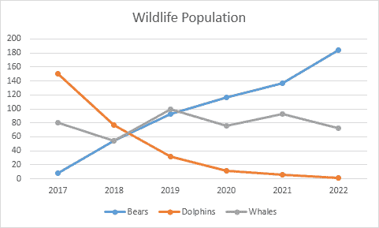
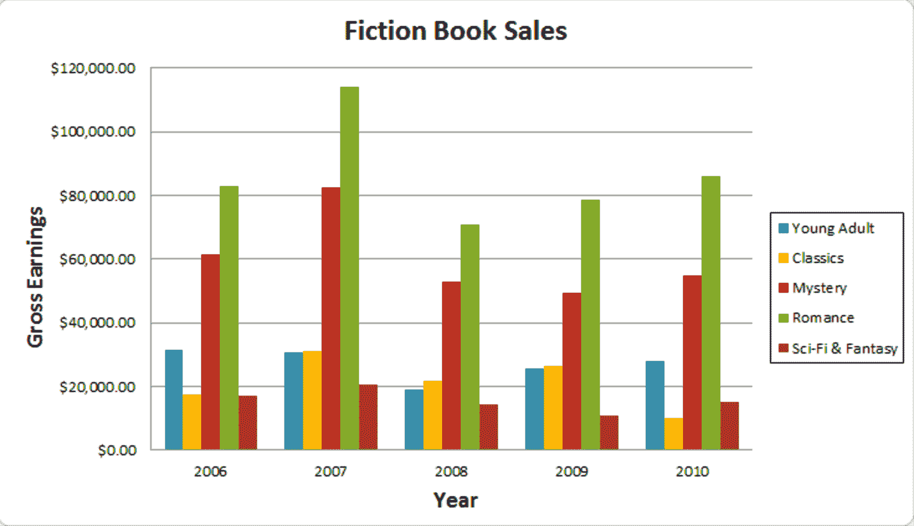
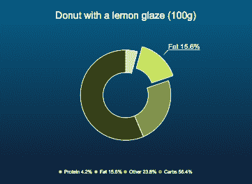
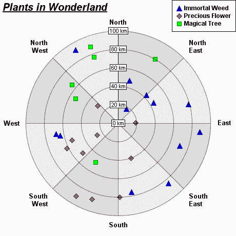
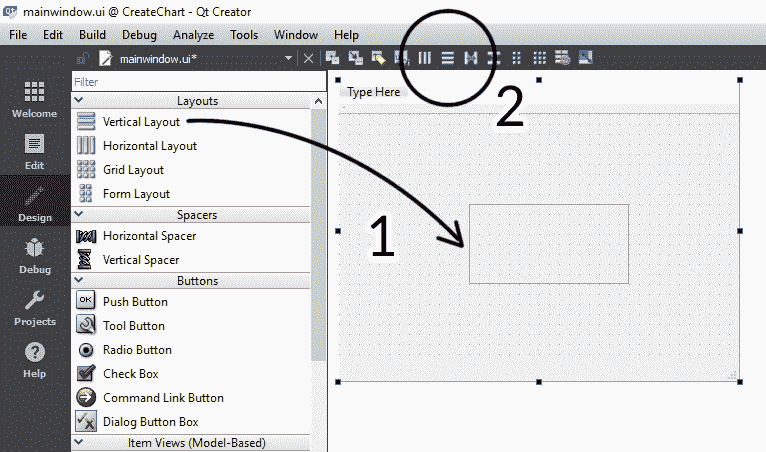
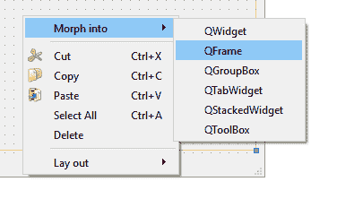
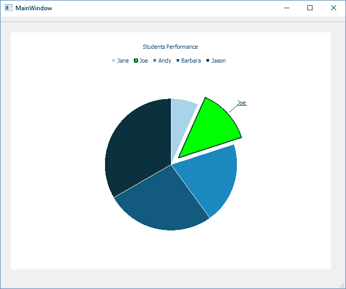
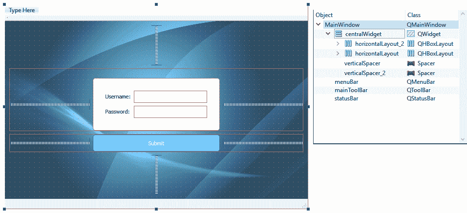
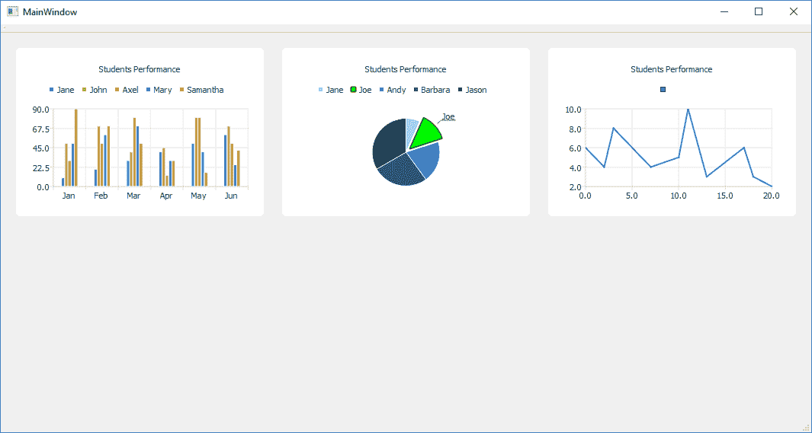
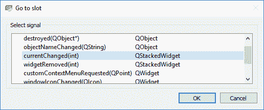

# 四、图表

在前一章中，我们学习了如何使用 Qt 的`sql`模块从数据库中检索数据。有许多方法可以将这些数据呈现给用户，例如以表格或图表的形式显示。在本章中，我们将学习如何做后者——使用 Qt 的图表模块用不同类型的图形和图表呈现数据。

在本章中，我们将涵盖以下主题:

*   Qt 中图表的类型
*   图表和图形实现
*   创建仪表板页面

从 Qt 5.7 开始，之前只对商业用户开放的几个模块对所有开源包用户都是免费的，包括 Qt Charts 模块。因此，对于大多数没有商业许可的 Qt 用户来说，它被认为是一个非常新的模块。

请注意，与 LGPLv3 许可下提供的大多数 Qt 模块不同，Qt Chart 模块是在 GPLv3 许可下提供的。与 LGPLv3 不同，GPLv3 许可证要求您发布应用的源代码，而您的应用也必须在 GPLv3 获得许可。这意味着您不允许将 Qt 图表与您的应用静态链接。它还防止该模块用于专有软件。

To learn more about the GNU licenses, please head over to the following link: [https://www.gnu.org/licenses/gpl-faq.html.](https://www.gnu.org/licenses/gpl-faq.html)

我们开始吧！

# Qt 中图表的类型

Qt 支持最常用的图表，甚至允许开发人员定制它们的外观和感觉，以便它们可以用于许多不同的目的。Qt 图表模块提供以下图表类型:

*   折线图和样条线图
*   条形图
*   饼图
*   极坐标图
*   面积图和散点图
*   盒须图
*   烛台图表

# 折线图和样条线图

第一种类型的图表是**线和样条图表**。这些图表通常显示为一系列由线条连接的点/标记。在折线图中，点用直线连接，以显示变量在一段时间内的变化。另一方面，样条曲线图表与折线图非常相似，除了点由样条曲线/曲线而不是直线连接:



# 条形图

**条形图**是除折线图和饼图之外最常用的图表之一。条形图与折线图非常相似，只是它没有沿着轴连接数据。相反，条形图使用单个矩形显示其数据，其高度由数据值决定。这意味着该值越高，矩形将变得越高:



# 饼图

A **饼图**，顾名思义，就是一种看起来像饼图的图表类型。饼图以饼图切片的形式显示其数据。每块饼图的大小将由其值相对于其余数据的总百分比决定。因此，饼图通常用于显示分数、比率、百分比或一组数据的一部分:


有时，饼图也可以显示为圆环形状(也称为圆环图):



# 极坐标图

**极坐标图**以圆形图的形式呈现数据，其中数据的放置基于角度和与图形中心的距离，这意味着数据值越高，点离图表中心越远。您可以在极坐标图中显示多种类型的图形，如直线、样条线、面积和散点图，以可视化数据:



如果你是一个游戏玩家，你应该已经注意到这种类型的图形在一些视频游戏中用来显示游戏角色的属性:


# 面积图和散点图

**面积图**将其数据显示为一个面积或形状来表示体积。它通常用于比较两个或多个数据集之间的差异。


**散点图**则用于显示一组数据点，并用于显示两个或多个数据集之间的非线性关系。


# 盒须图

**箱形和须状图**将数据表示为四分位数，用须状图进行扩展，以显示数值的可变性。盒子上可能有垂直延伸的线，叫做*须*。这些线表示上四分位数和下四分位数之外的可变性，这些线或胡须之外的任何点都被认为是异常值。盒须图最常用于统计分析，如股票市场分析:


# 烛台图表

**烛台图**在视觉上与盒须图非常相似，只是用来表示开盘价和收盘价之间的差异，同时通过不同的颜色显示数值的方向(无论是增加还是减少)。如果特定数据段的值保持不变，矩形将根本不会显示:


For more information regarding the different types of charts supported by Qt, please head over to the following link: [https://doc.qt.io/qt-5/qtcharts-overview.html.](https://doc.qt.io/qt-5/qtcharts-overview.html)

Qt 支持项目所需的大多数图表类型。在 Qt 中实现这些图表也非常容易。让我们看看我们怎么做！

# 实现图表

Qt 通过将复杂的绘制算法放在不同的抽象层后面，并为我们提供一组类和函数，使绘制不同类型的图表变得容易，这些类和函数可以用来轻松创建这些图表，而无需知道绘制算法在幕后是如何工作的。这些类和函数都包含在 Qt 附带的图表模块中。

让我们创建一个新的 Qt Widgets 应用项目，并尝试在 Qt 中创建我们的第一个图表。

创建新项目后，打开项目文件(`.pro`)并将`charts`模块添加到您的项目中，如下所示:

```cpp
QT += core gui charts 
```

然后，打开`mainwindow.h`并添加以下内容，以包括使用`charts`模块所需的头文件:

```cpp
#include <QtCharts> 
#include <QChartView> 
#include <QBarSet> 
#include <QBarSeries> 
```

`QtCharts`和`QtChartView`头对于 Qt 的`charts`模块都是必不可少的。任何类型的图表都必须包含这两者才能工作。另外两个标题，即`QBarSet`和`QBarSeries`，在这里使用，因为我们要创建一个条形图。根据要创建的图表类型，项目中包含的标题会有所不同。

接下来，打开`mainwindow.ui`并将垂直布局或水平布局拖动到中心小部件。然后，选择中心小部件并单击水平布局或垂直布局。布局方向不是特别重要，因为我们将只在这里创建一个图表:



然后，右键单击刚刚拖动到中心小部件的布局小部件，并选择变形到| QFrame。这将把布局小部件更改为 QFrame 小部件，同时仍然保持其布局属性。如果您从 Widget Box 创建一个 QFrame，它将没有我们需要的布局属性。这一步很重要，以便我们以后可以将其设置为图表的父级:



现在打开`mainwindow.cpp`并添加以下代码:

```cpp
MainWindow::MainWindow(QWidget *parent) : 
   QMainWindow(parent), 
   ui(new Ui::MainWindow) 
{ 
   ui->setupUi(this); 

   QBarSet *set0 = new QBarSet("Jane"); 
   QBarSet *set1 = new QBarSet("John"); 
   QBarSet *set2 = new QBarSet("Axel"); 
   QBarSet *set3 = new QBarSet("Mary"); 
   QBarSet *set4 = new QBarSet("Samantha"); 

   *set0 << 10 << 20 << 30 << 40 << 50 << 60; 
   *set1 << 50 << 70 << 40 << 45 << 80 << 70; 
   *set2 << 30 << 50 << 80 << 13 << 80 << 50; 
   *set3 << 50 << 60 << 70 << 30 << 40 << 25; 
   *set4 << 90 << 70 << 50 << 30 << 16 << 42; 

   QBarSeries *series = new QBarSeries(); 
   series->append(set0); 
   series->append(set1); 
   series->append(set2); 
   series->append(set3); 
   series->append(set4); 
} 
```

上面的代码初始化了将在条形图中显示的所有类别。然后，我们还向每个类别添加了六个不同的数据项，这些数据项稍后将以条形/矩形的形式表示。

`QBarSet`类代表条形图中的一组条。它将几个小节组合成一个小节集，然后可以对其进行标记。另一方面，QBarSeries 表示按类别分组的一系列条形。换句话说，具有相同颜色的条属于相同的系列。

接下来，初始化`QChart`对象，并向其添加序列。我们还设置了图表的标题并启用了动画:

```cpp
QChart *chart = new QChart(); 
chart->addSeries(series); 
chart->setTitle("Student Performance"); 
chart->setAnimationOptions(QChart::SeriesAnimations); 
```

之后，我们创建一个条形图类别轴，并将其应用于条形图的 *x* 轴。我们使用了一个`QStringList`变量，它类似于一个数组，但是明确用于存储字符串。然后`QBarCategoryAxis`将获取字符串列表，并将其填充到 *x* 轴上:

```cpp
QStringList categories; 
categories << "Jan" << "Feb" << "Mar" << "Apr" << "May" << "Jun"; 
QBarCategoryAxis *axis = new QBarCategoryAxis(); 
axis->append(categories); 
chart->createDefaultAxes(); 
chart->setAxisX(axis, series); 
```

然后，我们为 Qt 创建一个图表视图来呈现条形图，并将其设置为主窗口中框架小部件的子窗口；否则，它不会呈现在主窗口上:

```cpp
QChartView *chartView = new QChartView(chart); 
chartView->setParent(ui->verticalFrame); 
```

单击 Qt 创建器中的运行按钮，您应该会看到如下内容:


接下来，让我们做一个饼图；真的很简单。首先，我们不包括`QBarSet`和`QBarSeries`，而是包括`QPieSeries`和`QPieSlice`:

```cpp
#include <QPieSeries> 
#include <QPieSlice> 
```

然后，创建一个`QPieSeries`对象，设置每个数据的名称和值。之后，将其中一个切片设置为不同的视觉样式，并使其从其余切片中弹出。然后，创建一个`QChart`对象，并将其与我们已经创建的`QPieSeries`对象链接起来:

```cpp
QPieSeries *series = new QPieSeries(); 
series->append("Jane", 10); 
series->append("Joe", 20); 
series->append("Andy", 30); 
series->append("Barbara", 40); 
series->append("Jason", 50); 

QPieSlice *slice = series->slices().at(1); 
slice->setExploded(); // Explode this chart 
slice->setLabelVisible(); // Make label visible 
slice->setPen(QPen(Qt::darkGreen, 2)); // Set line color 
slice->setBrush(Qt::green); // Set slice color 

QChart *chart = new QChart(); 
chart->addSeries(series); 
chart->setTitle("Students Performance"); 
```

最后，同样重要的是，创建`QChartView`对象，并将其与我们刚刚创建的`QChart`对象链接。然后，将其设置为框架小部件的子部件，我们就可以开始了！

```cpp
QChartView *chartView = new QChartView(chart);
chartView->setParent(ui->verticalFrame);
```

现在按下“运行”按钮，您应该可以看到如下内容:



For more examples of how to create different charts in Qt, please check out their sample code at the following link: [https://doc.qt.io/qt-5/qtcharts-examples.html](https://doc.qt.io/qt-5/qtcharts-examples.html).

既然我们已经看到用 Qt 创建图形和图表很容易，那么让我们扩展我们在前面章节中开始的项目，并为它创建一个仪表板！

# 创建仪表板页面

在前一章中，我们创建了一个功能性登录页面，允许用户使用他们的用户名和密码登录。我们接下来需要做的是创建仪表板页面，用户成功登录后会自动进入该页面。

仪表板页面通常为用户提供有关其公司、业务、项目、资产和/或其他统计数据状态的快速概览。下图显示了仪表板页面的示例:


如您所见，仪表板页面上使用了大量图表和图形，因为这是显示大量数据而不会让用户感到不知所措的最佳方式。此外，图表可以让用户轻松了解整体情况，而无需过多挖掘细节。

让我们打开之前的项目，打开`mainwindow.ui`文件。用户界面应该如下所示:



如您所见，我们现在已经有了登录页面，但是我们还需要为仪表板添加另一个页面。为了让多个页面在同一个程序中共存，并且能够随时在不同的页面之间切换，Qt 为我们提供了一种叫做**qstackedwiget**的东西。

堆叠的小部件就像一本书，你可以添加越来越多的页面，但它一次只显示一页。每个页面都是一个完全不同的图形用户界面，所以它不会干扰堆叠小部件中的其他页面。

由于上一个登录页面并没有考虑堆叠的小部件，我们必须对它进行一些调整。首先，将堆叠小部件从小部件框拖放到应用的中央小部件，然后，我们需要将中央小部件下的所有内容移动到堆叠小部件的第一页，我们将其重命名为 loginPage:


接下来，将中心小部件的所有布局设置设置为`0`，使其完全不包含边距，如下所示:


之后，我们必须删除中心小部件的样式表属性中的代码，并将其粘贴到登录页面的样式表属性中。换句话说，背景图像、按钮样式和其他视觉设置现在仅应用于登录页面。

完成后，在堆叠小部件的页面之间切换时，您应该会得到两个完全不同的图形用户界面(仪表板页面现在是空的):


接下来，将网格布局拖放到仪表板页面，并将“垂直布局”应用到仪表板页面:


之后，将六个垂直布局拖放到网格布局中，如下所示:


然后，选择我们刚刚添加到网格布局中的每个垂直布局，并将其转换为 QFrame:


就像我们在图表实现示例中所做的那样，我们必须将布局变成一个`QFrame`(或`QWidget`)以便我们可以将图表作为子对象附加在上面。如果您直接从小部件框中拖动`QFrame`并且不使用变形，`QFrame`对象没有布局属性，因此图表可能不会调整自身大小以适合`QFrame`的几何图形。另外，将那些`QFrame`对象命名为`chart1`到`chart6`，因为我们将在下面的步骤中需要它们。完成后，让我们继续编写代码。

首先，打开您的项目(`.pro`)文件并添加`charts`模块，就像我们在本章前面的示例中所做的那样。然后，打开`mainwindow.h`并包括所有需要的标题。这一次，我们还包括用于创建折线图的`QLineSeries`标题:

```cpp
#include <QtCharts> 
#include <QChartView> 

#include <QBarSet> 
#include <QBarSeries> 

#include <QPieSeries> 
#include <QPieSlice> 

#include <QLineSeries> 
```

之后，声明图表的指针，如下所示:

```cpp
QChartView *chartViewBar; 
QChartView *chartViewPie; 
QChartView *chartViewLine; 
```

然后，我们将添加创建条形图的代码。这与我们之前在图表实现示例中创建的条形图相同，只是它现在附加到了名为`chart1`的`QFrame`对象，并被设置为在渲染时启用*抗锯齿*。抗锯齿功能可消除所有图表的锯齿边缘，从而使渲染看起来更平滑:

```cpp
MainWindow::MainWindow(QWidget *parent) : 
   QMainWindow(parent), 
   ui(new Ui::MainWindow) 
{ 
   ui->setupUi(this); 

   ////////BAR CHART///////////// 
   QBarSet *set0 = new QBarSet("Jane"); 
   QBarSet *set1 = new QBarSet("John"); 
   QBarSet *set2 = new QBarSet("Axel"); 
   QBarSet *set3 = new QBarSet("Mary"); 
   QBarSet *set4 = new QBarSet("Samantha"); 

   *set0 << 10 << 20 << 30 << 40 << 50 << 60; 
   *set1 << 50 << 70 << 40 << 45 << 80 << 70; 
   *set2 << 30 << 50 << 80 << 13 << 80 << 50; 
   *set3 << 50 << 60 << 70 << 30 << 40 << 25; 
   *set4 << 90 << 70 << 50 << 30 << 16 << 42; 

   QBarSeries *seriesBar = new QBarSeries(); 
   seriesBar->append(set0); 
   seriesBar->append(set1); 
   seriesBar->append(set2); 
   seriesBar->append(set3); 
   seriesBar->append(set4); 

   QChart *chartBar = new QChart(); 
   chartBar->addSeries(seriesBar); 
   chartBar->setTitle("Students Performance"); 
   chartBar->setAnimationOptions(QChart::SeriesAnimations); 

   QStringList categories; 
   categories << "Jan" << "Feb" << "Mar" << "Apr" << "May" << "Jun"; 
   QBarCategoryAxis *axis = new QBarCategoryAxis(); 
   axis->append(categories); 
   chartBar->createDefaultAxes(); 
   chartBar->setAxisX(axis, seriesBar); 

   chartViewBar = new QChartView(chartBar); 
   chartViewBar->setRenderHint(QPainter::Antialiasing); 
   chartViewBar->setParent(ui->chart1); 
} 
```

接下来，我们还添加了饼图的代码。同样，这也是上一个示例中的饼图:

```cpp
QPieSeries *seriesPie = new QPieSeries(); 
seriesPie->append("Jane", 10); 
seriesPie->append("Joe", 20); 
seriesPie->append("Andy", 30); 
seriesPie->append("Barbara", 40); 
seriesPie->append("Jason", 50); 

QPieSlice *slice = seriesPie->slices().at(1); 
slice->setExploded(); 
slice->setLabelVisible(); 
slice->setPen(QPen(Qt::darkGreen, 2)); 
slice->setBrush(Qt::green); 

QChart *chartPie = new QChart(); 
chartPie->addSeries(seriesPie); 
chartPie->setTitle("Students Performance"); 

chartViewPie = new QChartView(chartPie); 
chartViewPie->setRenderHint(QPainter::Antialiasing); 
chartViewPie->setParent(ui->chart2); 
```

最后，我们还向仪表板添加了一个折线图，这是一个新的东西。代码非常简单，非常类似于饼图:

```cpp
QLineSeries *seriesLine = new QLineSeries(); 
seriesLine->append(0, 6); 
seriesLine->append(2, 4); 
seriesLine->append(3, 8); 
seriesLine->append(7, 4); 
seriesLine->append(10, 5); 
seriesLine->append(11, 10); 
seriesLine->append(13, 3); 
seriesLine->append(17, 6); 
seriesLine->append(18, 3); 
seriesLine->append(20, 2); 

QChart *chartLine = new QChart(); 
chartLine->addSeries(seriesLine); 
chartLine->createDefaultAxes(); 
chartLine->setTitle("Students Performance"); 

chartViewLine = new QChartView(chartLine); 
chartViewLine->setRenderHint(QPainter::Antialiasing); 
chartViewLine->setParent(ui->chart3); 
```

完成后，我们必须在主窗口类中添加一个调整大小事件槽，并在主窗口调整大小时使图表跟随其各自父窗口的大小。这可以通过首先进入`mainwindow.h`并在事件处理程序声明中添加:

```cpp
protected: 
   void resizeEvent(QResizeEvent* event); 
```

然后，打开`mainwindow.cpp`并添加以下代码:

```cpp
void MainWindow::resizeEvent(QResizeEvent* event) 
{ 
   QMainWindow::resizeEvent(event); 

   chartViewBar->resize(chartViewBar->parentWidget()->size()); 
   chartViewPie->resize(chartViewPie->parentWidget()->size()); 
   chartViewLine->resize(chartViewLine->parentWidget()->size()); 
} 
```

请注意，必须首先调用`QMainWindow::resizeEvent(event)`，以便在调用其下的自定义方法之前触发默认行为。`resizeEvent()`是 Qt 提供的众多事件处理程序之一，用于响应其事件，如鼠标事件、窗口事件、绘画事件等。与信号和插槽机制不同，您需要替换事件处理程序的虚拟函数，使其在调用事件时执行您希望它执行的操作。

如果我们现在构建并运行该项目，我们应该会得到如下结果:



看起来很整洁，不是吗！然而，为了简单起见，也为了不混淆读者，这些图表都是硬编码的，没有使用数据库中的任何数据。如果您打算使用数据库中的数据，请不要在程序启动期间进行任何 SQL 查询，因为如果您加载的数据非常大，或者您的服务器非常慢，这将使您的程序冻结。

最好的方法是仅当您从登录页面切换到仪表板页面时(或者切换到任何其他页面时)才加载数据，这样加载时间对用户来说就不那么明显了。为此，右键单击堆叠小部件并选择转到插槽。然后，选择当前更改(整数)并单击确定。



之后，Qt 会自动创建一个新的槽函数。当堆叠小部件在页面之间切换时，将自动调用该函数。您可以通过检查`arg1`变量来检查当前切换到哪个页面。如果目标页面是堆叠小部件中的第一个页面，则`arg1`值将为`0`，如果目标页面是第二个页面，则为`1`，依此类推。

只有当堆叠小部件显示仪表板页面时，您才能提交 SQL 查询，仪表板页面是第二个页面(`arg1`等于`1`):

```cpp
void MainWindow::on_stackedWidget_currentChanged(int arg1) 
{ 
   if (arg1 == 1) 
   { 
      // Do it here 
   } 
} 
```

唷！这一章要消化的东西太多了！希望这一章能帮助你理解如何为你的项目创建一个漂亮且信息丰富的页面。

# 摘要

Qt 中的图表模块是特征和视觉美感的结合。它不仅易于实现，不需要编写很长的代码来显示图表，而且还可以根据您的视觉需求进行定制。我们真的需要感谢 Qt 开发者开放了这个模块，允许非商业用户免费使用！

在这一章中，我们学习了如何创建一个非常漂亮的仪表板，并使用 Qt 图表模块在上面显示不同类型的图表。在下一章中，我们将学习如何使用视图小部件、对话框和文件选择对话框。