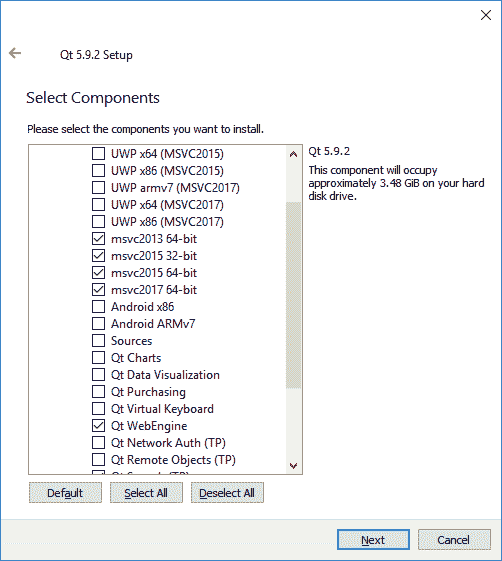
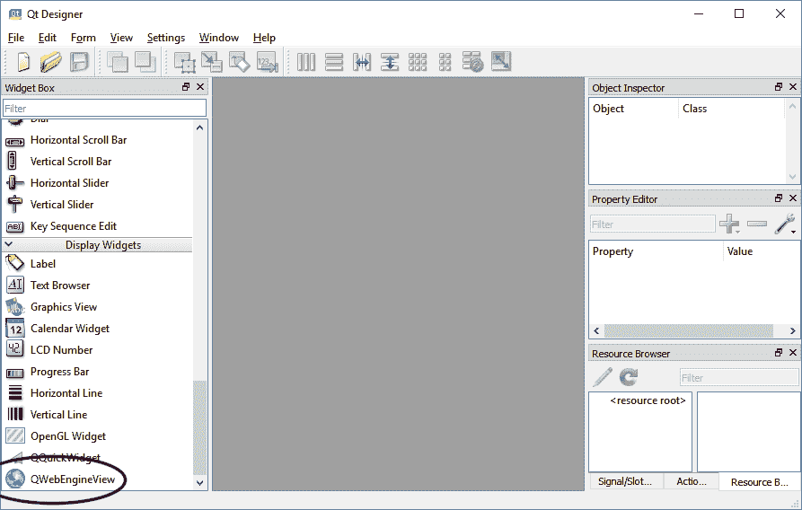
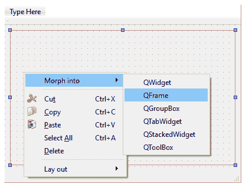
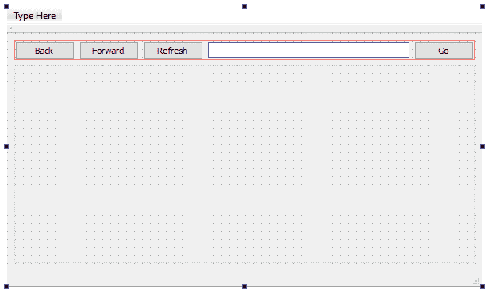
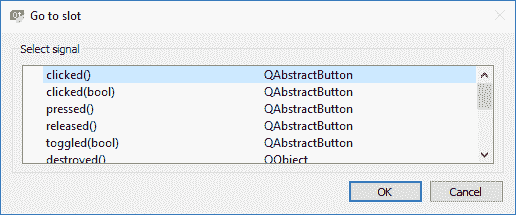
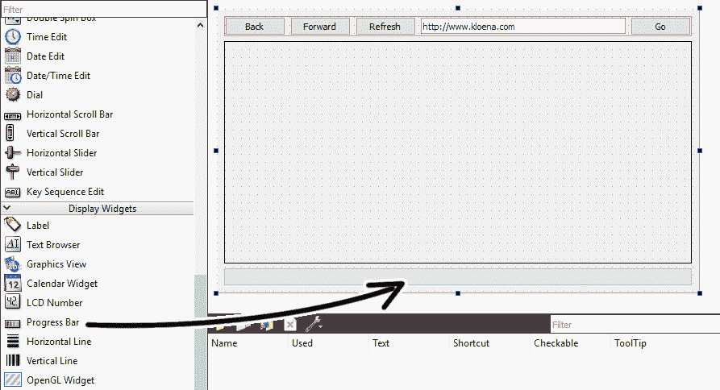
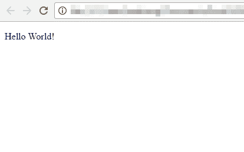
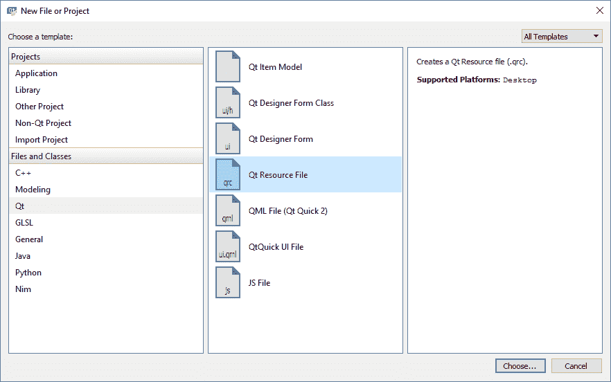
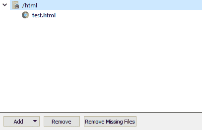
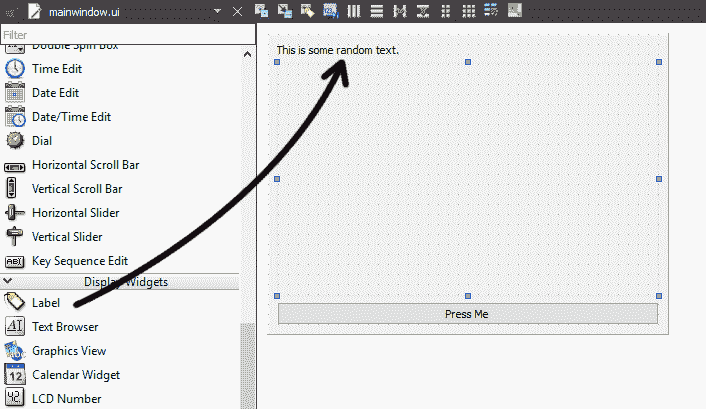

# 六、整合网络内容

在前一章中，我们学习了如何在 Qt 中使用项目视图和对话框。在本章中，我们将学习如何将 web 内容集成到我们的 Qt 应用中。

从 90 年代末和 21 世纪初的网络时代开始，我们的世界越来越多地通过互联网连接起来。自然，运行在我们计算机上的应用也在朝着这个方向发展。如今，我们的大多数(如果不是全部的话)软件都以某种方式连接到互联网，通常是为了检索有用的信息并将其显示给用户。最简单的方法是在应用的用户界面中嵌入一个网络浏览器显示(也称为网络视图)。这样，用户不仅可以查看信息，而且可以用一种审美的方式来查看。

通过使用 web 视图，开发人员可以利用其渲染能力，并使用 **HTML** ( **超文本标记语言**)和 **CSS** ( **级联样式表**)的强大组合来装饰其内容。在本章中，我们将探索 Qt 的网络引擎模块，并创建我们自己的网络浏览器。

在本章中，我们将涵盖以下主题:

*   创建自己的网络浏览器
*   会话、cookies 和缓存
*   集成 JavaScript 和 C++

不用多说，让我们看看如何在 Qt 中创建我们自己的网络浏览器！

# 创建自己的网络浏览器

曾几何时，Qt 使用一个名为 **WebKit** 的不同模块在其用户界面上呈现网页内容。但是，从 5.5 版本开始，WebKit 模块已经完全被弃用，取而代之的是一个名为 **WebEngine** 的新模块。

新的 WebEngine 模块基于谷歌打造的 **Chromium** 框架，只会在 Windows 平台的 **Visual C++** 编译器上工作。因此，如果您正在运行 Windows，请确保您已经在计算机上安装了 **Microsoft Visual Studio** 以及所有与计算机上安装的 Visual Studio 版本相匹配的 Qt 的 **MSVC** 组件。除此之外，这一章还需要 Qt 网络引擎组件。如果您在 Qt 的安装过程中跳过了这些组件，您所需要做的就是再次运行相同的安装程序并将其安装在那里:



# 添加 web 视图小部件

一旦你准备好了，让我们开始吧！首先，打开 Qt Creator 并创建一个新的 Qt Widgets 应用项目。然后，打开项目(`.pro`)文件，并添加以下文本以启用模块:

```cpp
QT += core gui webengine webenginewidgets 
```

如果您没有安装 MSVC 组件(在 Windows 上)或 Qt 网络引擎组件，如果您试图构建项目，此时会出现错误消息。如果是这样，请再次运行 Qt 安装程序。

接下来，打开`mainwindow.h`并添加以下头文件:

```cpp
#ifndef MAINWINDOW_H 
#define MAINWINDOW_H 

#include <QMainWindow> 
#include <QWebEngineView> 
```

之后，打开`mainwindow.h`并添加以下代码:

```cpp
private: 
   Ui::MainWindow *ui; 
 QWebEngineView* webview; 
```

然后，添加以下代码:

```cpp
MainWindow::MainWindow(QWidget *parent) : 
   QMainWindow(parent), 
   ui(new Ui::MainWindow) 
{ 
   ui->setupUi(this); 

   webview = new QWebEngineView(ui->centralWidget); 
   webview->load(QUrl("http://www.kloena.com")); 
} 
```

现在构建并运行程序，您应该会看到以下结果:


其实就这么简单。您现在已经成功地在应用中放置了 web 视图！

我们之所以编写 C++ 代码来创建 web 视图，是因为 Qt Creator 使用的默认 Qt Designer 在小部件框中没有 web 视图。前面的代码只是创建了`QWebEngineView`对象，设置了它的父对象(在本例中是中心小部件)，并在显示 web 视图小部件之前设置了网页的 URL。如果您想使用 Qt 设计器在您的用户界面上放置一个网络引擎视图，您必须运行位于 Qt 安装目录中的独立 Qt 设计器。比如你运行的是 Windows，它位于`C:QtQt5.10.25.10.2msvc2017_64bin`。请注意，它位于支持 web 引擎的编译器名称所在的目录中:



# 为网络浏览器创建用户界面

接下来，我们将把它变成一个合适的网络浏览器。首先，我们需要添加一些布局小部件，以便我们可以在之后将其他小部件放置到位。将垂直布局(1)拖到中心视图上，并从对象列表中选择中心视图。然后，单击位于顶部的垂直布局按钮(2):


然后，选择新添加的垂直布局，右键单击并选择变形为| QFrame。我们这样做的原因是，我们希望将 web 视图小部件放在这个 QFrame 对象下，而不是中心小部件下。我们必须将布局小部件转换成一个 QFrame(或任何继承的 QWidget)对象，这样它就可以*将*网页视图作为它的子视图。最后，将 QFrame 对象重命名为`webviewFrame`:



完成后，让我们在 QFrame 对象上方拖放一个水平布局小部件。现在我们可以看到水平布局小部件和 QFrame 对象的大小是相同的，我们不希望这样。接下来，选择 QFrame 对象，并将其垂直策略设置为扩展:


然后，您会看到顶部布局小部件现在非常薄。让我们暂时将其高度设置为`20`，如是:


之后，拖放三个按钮到水平布局，我们现在可以将其上边距设置回`0`:


将按钮标签分别设置为`Back`、`Forward`和`Refresh`。您也可以使用图标而不是文本来显示在这些按钮上。如果您希望这样做，只需将文本属性设置为空，并从图标属性中选择一个图标。为了简单起见，我们将在本教程的按钮上显示文本。

接下来，在三个按钮的右侧放置一个行编辑小部件，然后添加另一个带有`Go`标签的按钮:



之后，右键单击每个按钮并选择转到插槽。将弹出一个窗口，选择点击()并按确定。



这些按钮的信号功能如下所示:

```cpp
void MainWindow::on_backButton_clicked() 
{ 
   webview->back(); 
} 

void MainWindow::on_forwardButton_clicked() 
{ 
   webview->forward(); 
} 

void MainWindow::on_refreshButton_clicked() 
{ 
   webview->reload(); 
} 

void MainWindow::on_goButton_clicked() 
{ 
   loadPage(); 
} 
```

基本上`QWebEngineView`类已经为我们提供了`back()`、`forward()`、`reload()`等功能，所以我们只需要在按下相应按钮时调用这些功能即可。然而，`loadPage()`函数是我们将要编写的自定义函数:

```cpp
void MainWindow::loadPage() 
{ 
   QString url = ui->addressInput->text(); 
   if (!url.startsWith("http://") && !url.startsWith("https://")) 
   { 
         url = "http://" + url; 
   } 
   ui->addressInput->setText(url); 
   webview->load(QUrl(url)); 
} 
```

还记得在`mainwindow.h`中添加`loadPage()`的声明。

我认为我们应该做更多的事情，而不仅仅是调用`load()`函数。通常情况下，用户在输入网页的网址时不会包括`http://`(或`https://)`方案，但当我们将网址传递给网页视图时，这是必需的。为了解决这个问题，我们自动检查方案的存在。如果没有找到，我们会手动将`http://`方案添加到网址中。另外，别忘了在开始时调用它来替换`load()`功能:

```cpp
MainWindow::MainWindow(QWidget *parent) : 
   QMainWindow(parent), 
   ui(new Ui::MainWindow) 
{ 
   ui->setupUi(this); 

 webview = new QWebEngineView(ui->webviewFrame); 
   loadPage(); 
} 
```

接下来，右键单击文本输入并选择转到插槽。然后，选择返回按下()并单击确定按钮:


当用户输入完网页网址后，按下键盘上的*返回*键，将调用该槽功能。从逻辑上讲，用户会期望页面开始加载，而不必在每次输入完网址后都按“开始”按钮。代码真的很简单，我们只需要调用上一步刚创建的`loadPage()`函数:

```cpp
void MainWindow::on_addressInput_returnPressed() 
{ 
   loadPage(); 
} 
```

现在我们已经完成了大量的代码，让我们构建并运行我们的项目，看看结果如何:


显示的结果看起来并没有那么好。出于某种原因，新的 web 视图似乎无法在不断扩大的规模政策下正常扩展，至少在撰写本书时使用的 5.10 版本上是如此。它可能会在未来的版本中被修复，但是让我们找到一种方法来解决这个问题。我所做的是在主窗口中覆盖一个名为`paintEvent()`的继承函数。在`mainwindow.h`中，简单添加函数声明，如下所示:

```cpp
public: 
   explicit MainWindow(QWidget *parent = 0); 
   ~MainWindow(); 
 void paintEvent(QPaintEvent *event); 
```

然后，在`mainwindow.cpp`中这样写下它的定义:

```cpp
void MainWindow::paintEvent(QPaintEvent *event) 
{ 
   QMainWindow::paintEvent(event); 
   webview->resize(ui->webviewFrame->size()); 
} 
```

每当主窗口需要重新渲染其小部件时(例如当窗口正在调整大小时)，Qt 将自动调用该`paintEvent()`函数。由于该函数将在应用初始化时以及窗口调整大小时调用，我们将使用该函数手动调整 web 视图的大小以适应其父小部件。

再次构建并运行该程序，无论您如何调整主窗口的大小，您都应该能够很好地适应 web 视图。此外，我还删除了菜单栏、工具栏和状态栏，以使整个界面看起来更加整洁，因为我们没有在这个应用中使用这些:


接下来，我们需要一个进度条向用户显示页面加载的当前进度。为此，首先我们需要在 web 视图下面放置一个进度条小部件:



然后，将这两个插槽功能添加到`mainwindow.h`:

```cpp
private slots: 
   void on_backButton_clicked(); 
   void on_forwardButton_clicked(); 
   void on_refreshButton_clicked(); 
   void on_goButton_clicked(); 
   void on_addressInput_returnPressed(); 
   void webviewLoading(int progress); 
   void webviewLoaded(); 
```

他们在`mainwindow.cpp`中的功能定义如下:

```cpp
void MainWindow::webviewLoading(int progress) 
{ 
   ui->progressBar->setValue(progress); 
} 

void MainWindow::webviewLoaded() 
{ 
   ui->addressInput->setText(webview->url().toString()); 
} 
```

第一个函数`webviewLoading()`只是从 web 视图中获取进度级别(以百分比值的形式)，并直接将其提供给进度条小部件。

第二个功能`webviewLoaded()`将把地址输入上的 URL 文本替换为网页视图加载的网页的实际 URL。如果没有此功能，在您按下后退按钮或前进按钮后，地址输入将不会显示正确的网址。完成后，让我们再次编译并运行该项目。结果看起来很神奇:


你会问我，如果我不用 Qt 做网页浏览器，这有什么实际用途？将网页视图嵌入到应用中还有许多其他用途，例如，通过装饰精美的 HTML 页面向用户显示产品的最新消息和更新，这是游戏市场中大多数在线游戏使用的常见方法。例如，流客户端还使用网络视图向玩家显示最新的游戏和折扣。

这些通常被称为混合应用，它将 web 内容与原生 x 相结合，因此您可以利用来自 web 的动态内容以及原生运行的代码，这些代码具有高性能和一致外观的优势。

除此之外，您还可以使用它以 HTML 格式显示可打印的报告。您可以轻松地将报告发送到打印机，或者通过调用`webview->page()->print()`或`webview->page()->printToPdf()`将其保存为 PDF 文件。

To learn more about printing from the web view, check out the following link: [http://doc.Qt.io/Qt-5/qwebenginepage.html#print.](http://doc.Qt.io/Qt-5/qwebenginepage.html#print)

您可能还想使用 HTML 创建程序的整个用户界面，并将所有的 HTML、CSS 和图像文件嵌入到 Qt 的资源包中，并从 web 视图本地运行它。可能性是无穷无尽的，唯一的限制是你的想象力！

To learn more about Qt WebEngine, check out the documentation here: [https://doc.Qt.io/Qt-5/qtwebengine-overview.html.](https://doc.Qt.io/Qt-5/qtwebengine-overview.html)

# 管理浏览器历史记录

Qt 的 web 引擎将用户访问过的所有链接存储到一个数组结构中，供以后使用。web 视图小部件通过调用`back()`和`forward()`在历史之间来回移动。

如果您需要手动访问该浏览历史，请在`mainwindow.h`中添加以下标题:

```cpp
#include <QWebEnginePage> 
```

之后，使用以下代码以`QWebEngineHistory`对象的形式获取浏览历史:

```cpp
QWebEngineHistory* history = QWebEnginePage::history(); 
```

您可以从`history->items()`获取整个访问链接列表，或者使用`back()`或`forward()`等功能在历史记录之间导航。要清除浏览历史，请调用`history->clear()`。或者，您也可以这样做:

```cpp
QWebEngineProfile::defaultProfile()->clearAllVisitedLinks();
```

To learn more about the `QWebEngineHistory` class, visit the following link: [http://doc.Qt.io/Qt-5/qwebenginehistory.html.](http://doc.Qt.io/Qt-5/qwebenginehistory.html)

# 会话、cookies 和缓存

与任何其他网络浏览器一样，`WebEngine`模块也支持用于存储会话和缓存的临时数据和持久数据的机制。会话和缓存非常重要，因为它们允许网站记住您的上次访问，并将您与数据(如购物车)相关联。会话、cookie 和缓存的定义如下所示:

*   **Session** :通常情况下，Session 是服务器端的文件，包含带有唯一标识符的用户信息，从客户端发送出去，映射到特定的用户。然而，在 Qt 中，会话只是意味着没有任何截止日期的 cookie，因此当程序关闭时，它将消失。
*   **Cookie**:Cookie 是客户端文件，包含用户信息或任何其他您想要保存的信息。与会话不同，cookies 有一个截止日期，这意味着它们将保持有效，并且可以在到达截止日期之前检索，即使程序已经关闭并再次打开。
*   **缓存**:缓存是一种通过在第一次加载时将页面及其资源保存到本地磁盘来加快页面加载的方法。如果用户在下次访问时再次加载相同的页面，网络浏览器将重用缓存的资源，而不是等待下载完成，这可以显著加快页面加载时间。

# 管理会话和 cookies

默认情况下，`WebEngine`不保存任何 cookie，将所有用户信息视为临时会话，这意味着当您关闭程序时，您在网页上的登录会话将自动无效。

要在 Qt 的`WebEngine `模块上启用 cookies，首先在`mainwindow.h`中添加以下标题:

```cpp
#include <QWebEngineProfile> 
```

然后，只需调用以下函数来强制持久 cookies:

```cpp
QWebEngineProfile::defaultProfile()->setPersistentCookiesPolicy(QWebEngineProfile::ForcePersistentCookies);
```

调用上述函数后，您的登录会话将在关闭程序后继续存在。要将其恢复为非持久性 cookies，我们只需调用:

```cpp
QWebEngineProfile::defaultProfile()->setPersistentCookiesPolicy(QWebEngineProfile::NoPersistentCookies); 
```

除此之外，您还可以更改 Qt 程序存储 cookies 的目录。为此，请将以下代码添加到源文件中:

```cpp
QWebEngineProfile::defaultProfile()->setPersistentStoragePath("your folder");  
```

如果出于某种原因，您想要手动删除所有 cookies，请使用以下代码:

```cpp
QWebEngineProfile::defaultProfile()->cookieStore()->deleteAllCookies(); 
```

# 管理缓存

接下来，让我们谈谈缓存。有两种类型的缓存可以在网络引擎模块中使用，即内存缓存和磁盘缓存。内存缓存使用计算机的内存来存储缓存，一旦关闭程序，缓存就会消失。另一方面，磁盘缓存保存硬盘中的所有文件，因此即使在您关闭计算机后，它们仍然会保留。

默认情况下，网络引擎模块会将所有缓存保存到磁盘，如果需要将它们更改为内存缓存，请调用以下函数:

```cpp
QWebEngineProfile::defaultProfile()->setHttpCacheType(QWebEngineProfile::MemoryHttpCache); 
```

或者，您也可以通过调用:

```cpp
QWebEngineProfile::defaultProfile()->setHttpCacheType(QWebEngineProfile::NoCache); 
```

至于改变你的程序保存缓存文件的文件夹，调用`setCachePath()`函数:

```cpp
QWebEngineProfile::defaultProfile()->setCachePath("your folder"); 
```

最后，要删除所有缓存文件，调用`clearHttpCache()`:

```cpp
QWebEngineProfile::defaultProfile()->clearHttpCache(); 
```

您可以使用许多其他功能来更改与 cookies 和缓存相关的设置。

You can read more about it at the following link: [https://doc.Qt.io/Qt-5/qwebengineprofile.html](https://doc.Qt.io/Qt-5/qwebengineprofile.html)

# 集成 JavaScript 和 C++

使用 Qt 的 web 引擎模块的一个强大功能是，它可以从 C++ 调用 JavaScript 函数，也可以从 JavaScript 调用 C++ 函数。这使得它不仅仅是一个网页浏览器。您可以使用它来访问 web 浏览器标准不支持的功能，例如文件管理和硬件集成。W3C 标准不可能做到这一点；因此，不可能用原生 JavaScript 来实现。但是，您可以使用 C++ 和 Qt 实现这些功能，然后只需从您的 JavaScript 中调用 C++ 函数。让我们看看如何通过 Qt 实现这一点。

# 从 C++ 调用 JavaScript 函数

之后，在我们刚刚创建的 HTML 文件中添加以下代码:

```cpp
<!DOCTYPE html><html> 
   <head> 
      <title>Page Title</title> 
   </head> 
   <body> 
      <p>Hello World!</p> 
   </body> 
</html> 
```

这些是基本的超文本标记语言标签，除了一行写着`Hello World!`的单词之外，什么也不会给你。您可以尝试使用网络浏览器加载它:



之后，让我们回到我们的 Qt 项目，转到文件|新文件或项目，并创建一个 Qt 资源文件:



然后，打开我们刚刚创建的 Qt 资源文件，添加一个`/html`前缀，然后将 HTML 文件添加到资源文件中，如下所示:



当资源文件仍然打开时，右键单击 text.html，然后选择“将资源路径复制到剪贴板”。紧接着，将您的网页视图的网址更改为:

```cpp
webview->load(QUrl("qrc:///html/test.html")); 
```

你可以使用刚从资源文件中复制的链接，但是一定要在链接的前面加上 URL 方案`qrc://`。立即构建并运行您的项目，您应该能够立即看到结果:


接下来，我们需要在 JavaScript 中设置一个函数，C++ 将在稍后调用该函数。我们将创建一个简单的函数，弹出一个简单的消息框，并在调用时将`Hello World!`文本更改为其他内容:

```cpp
<!DOCTYPE html> 
<html> 
   <head> 
         <title>Page Title</title> 
         <script> 
               function hello() 
               { 
                  document.getElementById("myText").innerHTML =       
                  "Something happened!"; 
                  alert("Good day sir, how are you?"); 
               } 
         </script> 
   </head> 
   <body> 
         <p id="myText">Hello World!</p> 
   </body> 
</html> 
```

请注意，我已经在`Hello World!`文本中添加了一个 ID，以便我们能够找到它并更改其文本。一旦你完成了，让我们再次去我们的 Qt 项目。

让我们继续向我们的程序 UI 添加一个按钮，当按钮被按下时，我们希望我们的 Qt 程序调用我们刚刚在 JavaScript 中创建的`hello()`函数。在 Qt 中做到这一点其实非常容易；您只需从`QWebEnginePage`类调用`runJavaScript()`函数，如下所示:

```cpp
void MainWindow::on_pushButton_clicked() 
{ 
   webview->page()->runJavaScript("hello();"); 
} 
```

从下面的截图中可以看出，结果非常惊人:


你可以做很多事情，不仅仅是改变文本或调用消息框。例如，您可以在 HTML 画布中开始或停止动画，显示或隐藏 HTML 元素，触发 Ajax 事件以从 PHP 脚本中检索信息，等等...无尽的可能！

# 从 JavaScript 调用 C++ 函数

接下来，让我们看看如何从 JavaScript 调用 C++ 函数。为了演示，我将在 web 视图上方放置一个文本标签，我们将使用 JavaScript 函数更改它的文本:



通常，JavaScript 只能在 HTML 环境中工作，因此只能改变 HTML 元素，而不能改变 web 视图之外的东西。然而，Qt 允许我们通过使用网络频道模块来做到这一点。因此，让我们打开我们的项目(`.pro`)文件，并将 web 频道模块添加到项目中:

```cpp
QT += core gui webengine webenginewidgets webchannel 
```

之后，打开`mainwindow.h`并在`QWebChannel`表头添加:

```cpp
#include <QMainWindow> 
#include <QWebEngineView> 
#include <QWebChannel> 
```

同时，我们还声明了一个名为`doSomething()`的函数，前面有一个`Q_INVOKABLE`宏:

```cpp
Q_INVOKABLE void doSomething(); 
```

`Q_INVOKABLE`宏告诉 Qt 向 JavaScript 引擎公开该函数，这样就可以从 JavaScript 调用该函数(还有 QML，因为 QML 也是基于 JavaScript 的)。

然后在`mainwindow.cpp`中，我们必须首先创建一个`QWebChannel`对象，并将我们的主窗口注册为一个 JavaScript 对象。您可以将任何 Qt 对象注册为 JavaScript 对象，只要它是从`QObject`类派生的。

因为我们要从 JavaScript 调用`doSomething()`函数，所以我们必须向 JavaScript 引擎注册主窗口。之后，我们还需要将刚刚创建的`QWebChannel`对象设置为我们的网页视图的网页频道。代码如下所示:

```cpp
QWebChannel* channel = new QWebChannel(this); 
channel->registerObject("mainwindow", this); 
webview->page()->setWebChannel(channel); 
```

完成后，让我们定义`doSomething()`函数。我们只需要做一些简单的事情——更改我们的 Qt 图形用户界面上的文本标签，仅此而已:

```cpp
void MainWindow::doSomething() 
{ 
   ui->label->setText("This text has been changed by javascript!"); 
} 
```

我们已经完成了 C++ 代码，让我们打开我们的 HTML 文件。我们需要做几件事来使这个工作。首先，我们需要包含默认情况下嵌入到您的 Qt 程序中的`qwebchannel.js`脚本，这样您就不必在 Qt 目录中搜索该文件。在`head`标签之间添加以下代码:

```cpp
<script type="text/javascript" src="qrc:///qtwebchannel/qwebchannel.js"></script> 
```

然后，当 web 视图成功加载文档时，我们在 JavaScript 中创建一个`QWebChannel`对象，并将`mainwindow`变量从 Qt(我们之前在 C++ 中注册的)链接到实际的主窗口对象。该步骤必须在网页加载完成后进行(通过`window.onload`回调)；否则，创建 web 频道时可能会出现问题:

```cpp
var mainwindow; 
window.onload = function() 
{ 
   new QWebChannel(Qt.webChannelTransport,function(channel) 
   { 
         mainwindow = channel.objects.mainwindow; 
   }); 
} 
```

之后，我们创建一个调用`doSomething()`函数的 JavaScript 函数:

```cpp
function myFunction() 
{ 
   mainwindow.doSomething(); 
} 
```

最后，在 HTML 正文中添加一个按钮，确保按下按钮时`myFunction()`被调用:

```cpp
<body> 
   <p id="myText">Hello World!</p> 
   <button onclick="myFunction()">Do Something</button> 
</body> 
```

立即构建并运行该程序，您应该能够获得以下结果:


除了改变 Qt 小部件的属性之外，使用这个方法你可以做很多有用的事情。例如，将文件保存到本地硬盘，从条形码扫描仪获取扫描数据，等等。本地技术和网络技术之间不再有任何障碍。但是，一定要特别注意这种技术可能带来的安全隐患。俗话说:

"With great power comes great responsibility."

# 摘要

在这一章中，我们学习了如何创建自己的 web 浏览器，并使其与本机代码交互。Qt 为我们提供了网络渠道技术，这使得 Qt 成为一个非常强大的软件开发平台。

它既利用了 Qt 的强大功能，又利用了网络技术的美丽，这意味着在开发方面你可以有更多的选择，而不仅仅局限于 Qt 的方法。我真的很兴奋，迫不及待地想看看你用这个能取得什么成就！

在下一章加入我们，学习如何使用 Qt 创建一个类似于谷歌地图的地图查看器！