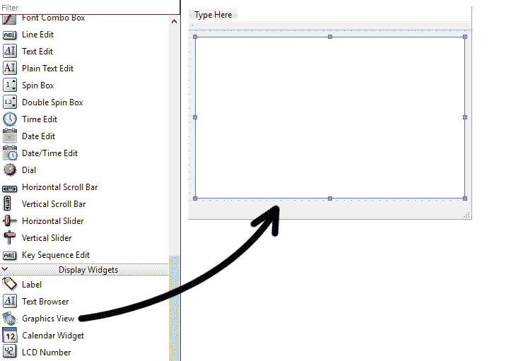
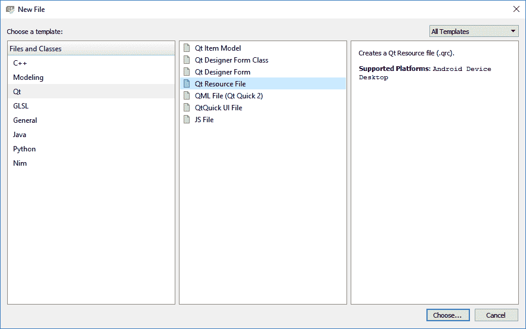
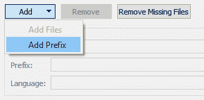
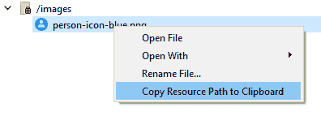
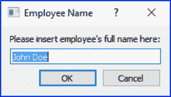
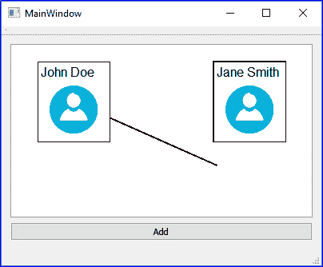

# 八、图形视图

在前一章中，我们通过在地图上显示坐标数据，了解了视觉呈现对用户的重要性。在本章中，我们将进一步探讨使用 Qt 的 Graphics View 框架来表示图形数据的可能性。

在本章中，我们将涵盖以下主题:

*   图形视图框架
*   可移动图形项目
*   创建组织结构图

在本章的最后，您将能够使用 C++ 和 Qt 的 API 创建组织结构图显示。我们开始吧！

# 图形视图框架

图形视图框架是 Qt 中小部件模块的一部分，因此默认情况下已经支持它，除非您正在运行 Qt 控制台应用程序，该应用程序不需要小部件模块。

Qt 中的 Graphics View 视图的工作原理非常像白板，您可以使用 C/C++ 代码在上面绘制任何东西，例如绘制形状、线条、文本甚至图像。对于初学者来说，这一章可能有点难理解，但这绝对是一个有趣的项目。我们开始吧！

# 设置新项目

首先，创建一个新的 Qt Widgets 应用程序项目。之后，打开`mainwindow.ui`，将图形视图小部件拖放到主窗口，如下所示:



然后，通过单击画布顶部的“垂直布局”按钮，为图形视图创建布局。之后，打开`mainwindow.h`并添加以下标题和变量:

```cpp
#include <QGraphicsScene> 
#include <QGraphicsRectItem> 
#include <QGraphicsEllipseItem> 
#include <QGraphicsTextItem> 
#include <QBrush> 
#include <QPen> 

private:
  Ui::MainWindow *ui;
  QGraphicsScene* scene;
```

之后，打开`mainwindow.cpp`。打开后，添加以下代码:

```cpp
MainWindow::MainWindow(QWidget *parent) : 
   QMainWindow(parent), 
   ui(new Ui::MainWindow) 
{ 
   ui->setupUi(this); 

   scene = new QGraphicsScene(this); 
   ui->graphicsView->setScene(scene); 

   QBrush greenBrush(Qt::green); 
   QBrush blueBrush(Qt::blue); 
   QPen pen(Qt::black); 
   pen.setWidth(2); 

   QGraphicsRectItem* rectangle = scene->addRect(80, 0, 80, 80, pen, greenBrush); 
   QGraphicsEllipseItem* ellipse = scene->addEllipse(0, -80, 200, 60, pen, blueBrush); 
   QGraphicsTextItem* text = scene->addText("Hello World!", QFont("Times", 25)); 
} 
```

现在构建并运行程序，您应该会看到如下内容:


代码有点长，所以让我来解释一下它是做什么的，以及它是如何把图形绘制到屏幕上的。

正如我之前所说的，图形视图小部件就像一个画布或白板，允许你在上面画任何你想要的东西。然而，我们还需要一种叫做图形场景的东西，它本质上是一个场景图，在图形视图上显示图形组件之前，它以父子层次结构存储所有图形组件。场景图层次是上一张截图中出现的图像，其中每个对象都有一个或多个链接在一起的父对象或子对象:


在前面的代码中，我们首先创建了一个`QGraphicsScene`对象，并将其设置为图形视图小部件的图形场景:

```cpp
scene = new QGraphicsScene(this); 
ui->graphicsView->setScene(scene); 
```

但是，在本例中，我们不必将图形项目链接在一起，因此我们将独立创建它们，如下所示:

```cpp
QBrush greenBrush(Qt::green); 
...
QGraphicsTextItem* text = scene->addText("Hello World!", QFont("Times", 25)); 
```

`QPen`和`QBrush`类用于定义这些图形项的渲染样式。`QBrush`通常用于定义物品的背景颜色和图案，而`QPen`通常会影响物品的轮廓。

Qt 为最常见的形状提供了许多类型的图形项目，包括:

*   `QGraphicsEllipseItem`–椭圆项目
*   `QGraphicsLineItem`–行项目
*   `QGraphicsPathItem`–任意路径项
*   `QGraphicsPixmapItem` – 像素地图项目
*   `QGraphicsPolygonItem`多边形项目
*   `QGraphicsRectItem`–矩形项目
*   `QGraphicsSimpleTextItem`–简单文本标签项目
*   `QGraphicsTextItem`–高级格式化文本项目

For more information, please visit this link: [http://doc.qt.io/archives/qt-5.8/qgraphicsitem.html#details.](http://doc.qt.io/archives/qt-5.8/qgraphicsitem.html#details)

# 可移动图形项目

在前面的示例中，我们已经成功地在图形视图小部件上绘制了一些简单的形状和文本。然而，这些图形项目不是交互式的，因此不适合我们的目的。我们想要的是一个交互式组织结构图，用户可以用鼠标移动项目。让这些物品在 Qt 下移动其实真的很容易；让我们看看如何通过继续我们以前的项目来做到这一点。

首先，确保您没有更改我们的图形视图小部件的默认交互属性，该属性设置为启用(复选框已选中):


然后，在前面`Hello World`示例中我们刚刚创建的每个图形项下面添加以下代码:

```cpp
QGraphicsRectItem* rectangle = scene->addRect(80, 0, 80, 80, pen, greenBrush); 
rectangle->setFlag(QGraphicsItem::ItemIsMovable); 
rectangle->setFlag(QGraphicsItem::ItemIsSelectable); 

QGraphicsEllipseItem* ellipse = scene->addEllipse(0, -80, 200, 60, pen, blueBrush); 
ellipse->setFlag(QGraphicsItem::ItemIsMovable); 
ellipse->setFlag(QGraphicsItem::ItemIsSelectable); 

QGraphicsTextItem* text = scene->addText("Hello World!", QFont("Times", 25)); 
text->setFlag(QGraphicsItem::ItemIsMovable); 
text->setFlag(QGraphicsItem::ItemIsSelectable); 
```

再次构建并运行程序，这一次您应该能够在图形视图中选择并移动项目。一定要注意`ItemIsMovable`和`ItemIsSelectable`都给你一个不同的行为——前者标志将使项目可通过鼠标移动，后者使项目可选择，这通常在选择时使用虚线轮廓给它一个视觉指示。每个标志都独立工作，不会影响其他标志。

我们可以利用 Qt 中的信号和时隙机制来测试`ItemIsSelectable`标志的效果。让我们回到我们的代码，并添加以下行:

```cpp
ui->setupUi(this); 
scene = new QGraphicsScene(this); 
ui->graphicsView->setScene(scene); 
connect(scene, &QGraphicsScene::selectionChanged, this, &MainWindow::selectionChanged); 
```

只要您在图形视图小部件上选择了一个项目，就会触发`selectionChanged()`信号，然后调用我们的`MainWindow`类下的`selectionChanged()`槽函数(我们需要编写该函数)。让我们打开`mainwindow.h`并添加另一个显示调试消息的标题:

```cpp
#include <QDebug> 
```

然后，我们声明插槽函数，如下所示:

```cpp
private: 
   Ui::MainWindow *ui; 

public slots: 
 void selectionChanged(); 
```

之后打开`mainwindow.cpp`并定义槽功能，如下图:

```cpp
void MainWindow::selectionChanged() 
{ 
   qDebug() << "Item selected"; 
} 
```

现在尝试再次运行该程序；您应该会看到一行调试消息，显示“项目选择”,每当单击一个图形项目时，就会出现该消息。真的很简单，不是吗？

至于`ItemIsMovable`标志，我们无法使用信号和时隙方法进行测试。这是因为从`QGraphicsItem`类继承的所有类都不是从`QObject`类继承的，因此信号和槽机制在这些类上不起作用。这是 Qt 开发人员有意为之的，目的是使其轻量级，从而提高性能，尤其是在屏幕上呈现成千上万个项目时。

即使信号和插槽不是这个选项，我们仍然可以使用事件系统，这需要覆盖`itemChange()`虚拟功能，我将在下一节中演示。

# 创建组织结构图

让我们继续学习如何使用图形视图创建组织结构图。组织结构图是显示组织结构及其员工职位关系层次的图表。使用图形表示很容易理解公司的结构；因此，最好使用图形视图，而不是表格。

这一次，我们需要为图形项目创建我们自己的类，这样我们就可以利用 Qt 的事件系统，并对它的分组和显示有更多的控制。

首先，通过转到文件|新文件或项目来创建一个 C/C++ 类:


接下来，在单击下一步和完成按钮之前，将我们的班级命名为`profileBox`:


之后，打开`mainwindow.h`并添加这些标题:

```cpp
#include <QWidget> 
#include <QDebug> 
#include <QBrush> 
#include <QPen> 
#include <QFont> 
#include <QGraphicsScene> 
#include <QGraphicsItemGroup> 
#include <QGraphicsItem> 
#include <QGraphicsRectItem> 
#include <QGraphicsTextItem> 
#include <QGraphicsPixmapItem> 
```

然后，打开`profilebox.h`，让我们的`profileBox`类改为继承`QGraphicsItemGroup`:

```cpp
class profileBox : public QGraphicsItemGroup 
{ 
public: 
   explicit profileBox(QGraphicsItem* parent = nullptr); 
```

之后打开`profilebox.cpp`，在类的构造器处，设置`QBrush`、`QPen`和`QFont`，一会用于渲染:

```cpp
profileBox::profileBox(QGraphicsItem *parent) : QGraphicsItemGroup(parent) 
{ 
   QBrush brush(Qt::white); 
   QPen pen(Qt::black); 
   QFont font; 
   font.setFamily("Arial"); 
   font.setPointSize(12); 
} 
```

之后，同样在构造器中，创建一个`QGraphicsRectItem`、`QGraphicsTextItem`和一个`QGraphicsPixmapItem`:

```cpp
QGraphicsRectItem* rectangle = new QGraphicsRectItem(); 
rectangle->setRect(0, 0, 90, 100); 
rectangle->setBrush(brush); 
rectangle->setPen(pen); 

nameTag = new QGraphicsTextItem(); 
nameTag->setPlainText(""); 
nameTag->setFont(font); 

QGraphicsPixmapItem* picture = new QGraphicsPixmapItem(); 
QPixmap pixmap(img/person-icon-blue.png"); 
picture->setPixmap(pixmap); 
picture->setPos(15, 30); 
```

然后，将这些项目添加到组中，该组是当前类，因为该类继承自`QGraphicsItemGroup`类:

```cpp
this->addToGroup(rectangle); 
this->addToGroup(nameTag); 
this->addToGroup(picture); 
```

最后，为当前类设置三个标志，分别是`ItemIsMovable`、`ItemIsSelectable`和`ItemSendsScenePositionChanges`:

```cpp
this->setFlag(QGraphicsItem::ItemIsMovable); 
this->setFlag(QGraphicsItem::ItemIsSelectable); 
this->setFlag(QGraphicsItem::ItemSendsScenePositionChanges); 
```

这些标志非常重要，因为出于性能原因，默认情况下它们都是禁用的。上一节我们已经介绍了`ItemIsMovable`和`ItemIsSelectable`，而`ItemSendsPositionChanges`则是新内容。当用户移动图形项目时，此标志会使图形项目通知图形场景，因此得名。

接下来，创建另一个名为`init()`的函数来设置员工档案。为了简单起见，我们只设置员工姓名，但是，如果您愿意，您可以做更多的事情，例如根据级别设置不同的背景颜色，或者更改他们的个人资料图片:

```cpp
void profileBox::init(QString name, MainWindow *window, QGraphicsScene* scene) 
{ 
   nameTag->setPlainText(name); 
   mainWindow = window; 
   scene->addItem(this); 
} 
```

请注意，我们还在这里设置了主窗口和图形场景指针，以便以后使用。我们必须将`QGraphicsItem`添加到场景中，然后它才会在屏幕上呈现。在这种情况下，我们将所有图形项目分组到一个`QGraphicsItemGroup`中，因此我们只需要将该组添加到场景中，而不是单个项目。

请注意，您必须在`#include "mainwindow.h"`之后为`profilebox.h`中的`MainWindow`类进行前向声明，以避免出现递归头包含的错误。同时，我们还在`profilebox.h`中放置了`MainWindow`和`QGraphicsTextItem`指针，以便以后调用:

```cpp
#include "mainwindow.h" 

class MainWindow; 

class profileBox : public QGraphicsItemGroup 
{ 
public: 
   explicit profileBox(QGraphicsItem* parent = nullptr); 
   void init(QString name, MainWindow* window, QGraphicsScene* scene); 

private: 
   MainWindow* mainWindow; 
   QGraphicsTextItem* nameTag; 

```

您还会注意到，我在`QGraphicsPixmapItem`中使用了一个图标作为装饰图标:


该图标是存储在资源文件中的一个巴布亚新几内亚图像。您可以从我们 GitHub 页面上的示例项目文件中获取此图像:[http://GitHub . com/PacktPublishing/hand-GUI-Programming-with-C-QT5](http://github.com/PacktPublishing/Hands-On-GUI-Programming-with-C-QT5)

让我们为您的项目创建一个资源文件。转到文件|新文件或项目，并选择 Qt 类别下的 Qt 资源文件选项:



创建空资源文件后，通过转到添加|添加前缀来添加新前缀。我们将这个前缀称为`images`:



然后，选择新创建的`images`前缀，点击添加|添加文件。将图标图像添加到资源文件并保存。您现在已经成功地将图像添加到项目中。


If your prefix name or filename is different than the prefix name or filename in this book, you may right-click on your image in the resource file and select Copy Resource Path to Clipboard and replace the one in the code with your path.



之后，打开`mainwindow.h`并添加:

```cpp
#include "profilebox.h"
```

然后，打开`mainwindow.cpp`并添加以下代码，手动创建一个剖面框:

```cpp
MainWindow::MainWindow(QWidget *parent) : 
   QMainWindow(parent), 
   ui(new Ui::MainWindow) 
{ 
   ui->setupUi(this); 

   scene = new QGraphicsScene(this); 
   ui->graphicsView->setScene(scene); 

   connect(scene, &QGraphicsScene::selectionChanged, this, &MainWindow::selectionChanged); 

   profileBox* box = new profileBox(); 
   box->init("John Doe", this, scene); 
} 
```

现在构建并运行项目，您应该会看到如下内容:


看起来整洁；但是我们还远没有完成。还有一些事情要做——我们必须允许用户通过用户界面添加或删除配置文件框，而不是使用代码。同时，我们还需要添加连接不同配置文件框的线条，以展示不同员工之间的关系以及他们在公司中的位置。

让我们从简单的部分开始。再次打开`mainwindow.ui`，在图形视图小部件底部添加一个按钮，并命名为`addButton`:


然后，右键单击按钮并选择转到插槽...之后，选择单击的选项并单击确定。将自动为您创建一个新的插槽功能，称为`on_addButton_clicked()`。添加以下代码，以允许用户在单击“添加”按钮时创建配置文件框:

```cpp
void MainWindow::on_addButton_clicked() 
{ 
   bool ok; 
   QString name = QInputDialog::getText(this, tr("Employee Name"), 
   tr("Please insert employee's full name here:"), QLineEdit::Normal,  
   "John Doe", &ok); 
   if (ok && !name.isEmpty()) 
   { 
         profileBox* box = new profileBox(); 
         box->init(name, this, scene); 
   } 
} 
```

用户现在可以通过单击添加按钮轻松创建任意数量的配置文件框，而不是使用代码创建每个配置文件框。还会出现一个消息框，让用户在创建配置文件框之前输入员工姓名:



接下来，我们将创建另一个名为`profileLine`的类。这次我们就让这个类继承`QGraphicsLineItem`。`profileline.h`基本上是这样的:

```cpp
#include <QWidget> 
#include <QGraphicsItem> 
#include <QPen> 

class profileLine : public QGraphicsLineItem 
{ 
public: 
   profileLine(QGraphicsItem* parent = nullptr); 
   void initLine(QGraphicsItem* start, QGraphicsItem* end); 
   void updateLine(); 

   QGraphicsItem* startBox; 
   QGraphicsItem* endBox; 

private: 
}; 
```

类似于`profileBox`类，我们还为`profileLine`类创建了一个`init`函数，叫做`initLine()`函数。该函数接收两个`QGraphicsItem`对象作为渲染线的起点和终点。除此之外，我们还创建了一个`updateLine()`函数，用于在轮廓框移动时重新绘制线条。

接下来，打开`profileline.cpp`并向构造函数添加以下代码:

```cpp
profileLine::profileLine(QGraphicsItem *parent) : QGraphicsLineItem(parent) 
{ 
   QPen pen(Qt::black); 
   pen.setWidth(2); 
   this->setPen(pen); 

   this->setZValue(-999); 
} 
```

我们用`QPen`设置线条的颜色为黑色，宽度为`2`。之后，我们还将该行的`Zvalue`设置为`-999`，这样它将始终保留在轮廓框的后面。

之后，将以下代码添加到我们的`initLine()`函数中，使其看起来像这样:

```cpp
void profileLine::initLine(QGraphicsItem* start, QGraphicsItem* end) 
{ 
   startBox = start; 
   endBox = end; 

   updateLine(); 
} 
```

它所做的基本上是为它设置盒子来定位它的起点和终点。之后，调用`updateLine()`函数渲染线条。

最后，`updateLine()`功能如下:

```cpp
void profileLine::updateLine() 
{ 
   if (startBox != NULL && endBox != NULL) 
   { 
         this->setLine(startBox->pos().x() + startBox->boundingRect().width() / 2, startBox->pos().y() + startBox->boundingRect().height() / 2, endBox->pos().x() + endBox->boundingRect().width() / 2, endBox->pos().y() + endBox->boundingRect().height() / 2); 
   } 
} 
```

前面的代码看起来有点复杂，但如果我这样说，它真的很简单:

```cpp
this->setLine(x1, y1, x2, y2); 
```

数值`x1`和`y1`基本上是第一个轮廓盒的中心位置，而`x2`和`y2`是第二个轮廓盒的中心位置。由于我们通过调用`pos()`得到的位置值是从左上角开始的，所以我们必须得到轮廓框的边界尺寸，并将其除以 2 以得到它的中心位置。然后，将该值添加到左上角位置，使其偏移到中心。

完成后，让我们再次打开`mainwindow.cpp`并将以下代码添加到`on_addButton_clicked()`功能中:

```cpp
void MainWindow::on_addButton_clicked() 
{ 
   bool ok; 
   QString name = QInputDialog::getText(this, tr("Employee Name"), tr("Please insert employee's full name here:"), QLineEdit::Normal, "John Doe", &ok); 
   if (ok && !name.isEmpty()) 
   { 
         profileBox* box = new profileBox(); 
         box->init(name, this, scene); 

         if (scene->selectedItems().size() > 0) 
         { 
               profileLine* line = new profileLine(); 
               line->initLine(box, scene->selectedItems().at(0)); 
               scene->addItem(line); 

               lines.push_back(line); 
         } 
   } 
} 
```

在前面的代码中，我们检查用户是否选择了任何配置文件框。如果没有，我们不需要创建任何线。否则，创建一个新的`profileLine`对象，并将新创建的轮廓框和当前选择的轮廓框设置为`startBox`和`endBox`属性。

之后，将该行添加到我们的图形场景中，这样它就会出现在屏幕上。最后，将这个`profileLine`对象存储到一个`QList`数组中，以便我们以后使用。`mainwindow.h`中的数组声明如下:

```cpp
private: 
   Ui::MainWindow *ui; 
   QGraphicsScene* scene; 
   QList<profileLine*> lines; 
```

立即构建并运行项目。通过点击`Add`按钮，输入名称，并在第一个框保持选中的情况下选择确定，您应该能够看到创建第二个配置文件框时出现的线条。但是，每当您将配置文件框从其原始位置移开时，您可能会注意到一个问题——这些行根本不会自动更新！：



这就是我们将这些行放入`QList`数组的主要原因，这样每当用户移动概要文件框时，我们就可以更新这些行。

为此，首先，我们需要覆盖名为`itemChanged()`的`profileBox`类中的虚拟函数。让我们打开`profilebox.h`并添加以下代码行:

```cpp
class profileBox : public QGraphicsItemGroup 
{ 
public: 
   explicit profileBox(QGraphicsItem* parent = nullptr); 
   void init(QString name, MainWindow* window, QGraphicsScene* scene); 
   QVariant itemChange(GraphicsItemChange change, const QVariant 
   &value) override; 
```

然后，打开`profilebox.cpp`并添加`itemChanged()`的代码:

```cpp
QVariant profileBox::itemChange(GraphicsItemChange change, const QVariant &value) 
{ 
   if (change == QGraphicsItem::ItemPositionChange) 
   { 
         qDebug() << "Item moved"; 

         mainWindow->updateLines(); 
   } 

   return QGraphicsItem::itemChange(change, value); 
} 
```

`itemChanged()`函数是`QGraphicsItem`类中的一个虚拟函数，当图形项发生变化时，无论是位置变化、可见性变化、父项变化、选择变化等等，Qt 的事件系统都会自动调用这个函数。

因此，我们所需要做的就是覆盖该函数，并向该函数添加我们自己的自定义行为。在前面的示例代码中，我们所做的只是在主窗口类中调用`updateLines()`函数。

接下来，打开`mainwindow.cpp`并定义`updateLines()`功能。顾名思义，这个函数要做的是遍历存储在线数组中的所有剖面线对象，并更新其中的每一个，如下所示:

```cpp
void MainWindow::updateLines() 
{ 
   if (lines.size() > 0) 
   { 
         for (int i = 0; i < lines.size(); i++) 
         { 
               lines.at(i)->updateLine(); 
         } 
   } 
} 
```

完成后，再次构建并运行项目。这一次，您应该能够创建一个组织结构图，如下所示:


这只是一个更简单的版本，向您展示了如何利用 Qt 强大的图形视图系统来显示一组数据的图形表示，普通人很容易理解这些数据。

在完成之前的最后一件事——我们还没有讨论如何删除配置文件框。其实挺简单的，我们打开`mainwindow.h`添加`keyReleaseEvent()`功能，看起来是这样的:

```cpp
public: 
   explicit MainWindow(QWidget *parent = 0); 
   ~MainWindow(); 

   void updateLines(); 
   void keyReleaseEvent(QKeyEvent* event); 
```

当键盘按钮被按下和释放时，Qt 的事件系统也会自动调用这个虚拟函数。功能的内容在`mainwindow.cpp`中是这样的:

```cpp
void MainWindow::keyReleaseEvent(QKeyEvent* event) 
{ 
   qDebug() << "Key pressed: " + event->text(); 

   if (event->key() == Qt::Key_Delete) 
   { 
         if (scene->selectedItems().size() > 0) 
         { 
               QGraphicsItem* item = scene->selectedItems().at(0); 
               scene->removeItem(item); 

               for (int i = lines.size() - 1; i >= 0; i--) 
               { 
                     profileLine* line = lines.at(i); 

                     if (line->startBox == item || line->endBox == 
                     item) 
                     { 
                           lines.removeAt(i); 
                           scene->removeItem(line); 
                           delete line; 
                     } 
               } 
               delete item; 
         } 
   } 
} 
```

在这个功能中，我们首先检测用户正在按下的键盘按钮。如果按钮是`Qt::Key_Delete (delete button)`，那么我们将通过检查`scene->selectedItems().size()`是否为空来检查用户是否选择了任何配置文件框。如果用户确实选择了配置文件框，则从图形场景中移除该项目。之后，循环通过线阵列，并检查是否有任何轮廓线连接到已删除的轮廓框。从场景中移除任何连接到轮廓框的线，我们就完成了:


此截图显示了从组织结构图中删除`Jane Smith`档案框的结果。请注意，连接轮廓框的线已被正确移除。这一章就到这里；我希望你发现这很有趣，也许会继续创造比这更好的东西！

# 摘要

在本章中，我们学习了如何使用 Qt 创建一个应用程序，允许用户轻松创建和编辑组织结构图。我们学习了`QGraphicsScene`、`QGrapicsItem`、`QGraphicsTextItem`、`QGraphicsPixmapItem`等帮助我们在短时间内创建交互式组织结构图的课程。在接下来的一章中，我们将学习如何使用网络摄像头拍摄图像！