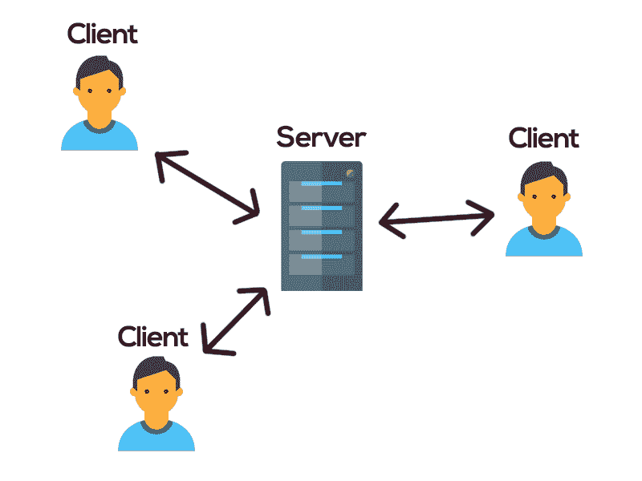
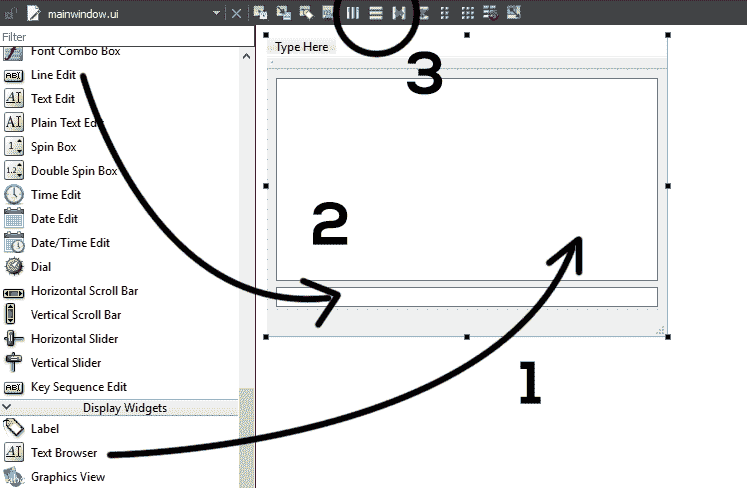
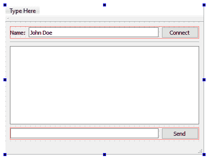
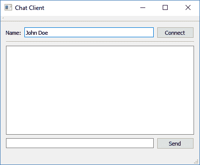
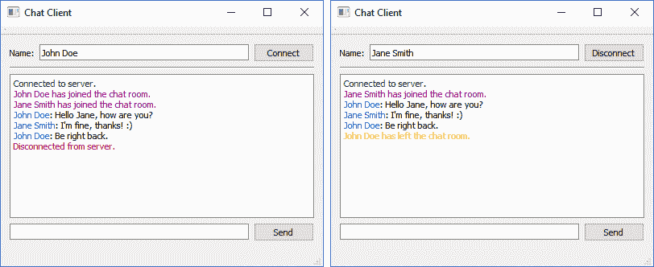
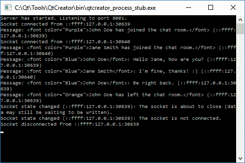

# 即时消息

公司软件的一个重要特征是与员工沟通的能力。因此，内部即时消息系统是软件的关键部分。通过在 Qt 中加入网络模块，我们可以很容易地用它创建一个聊天系统。

在本章中，我们将涵盖以下主题:

*   Qt 网络模块
*   创建即时消息服务器
*   创建即时消息客户端

使用 Qt 创建一个即时通讯系统比你想象的要容易得多。我们开始吧！

# Qt 网络模块

在下一节中，我们将了解 Qt 网络模块，以及它如何帮助我们通过 TCP 或 UDP 连接协议实现服务器-客户端通信。

# 连接协议

Qt 中的网络模块是既提供低级网络功能(如 TCP 和 UDP 套接字)又提供高级网络类(用于 web 集成和网络通信)的模块。

在本章中，我们将使用 **TCP** ( **传输控制协议**)互联网协议来代替 **UDP** ( **用户数据报协议**)协议。主要区别在于，TCP 是一种面向连接的协议，要求所有客户端在能够相互通信之前建立与服务器的连接。

另一方面，UDP 是一种不需要连接的无连接协议。客户端将只发送它需要发送到目的地的任何数据，而不检查数据是否已经被另一端接收到。两种协议各有利弊，但 TCP 更适合我们的示例项目。我们想确保收件人收到每条聊天消息，不是吗？

两种协议的区别如下:

*   TCP:
    *   面向连接的协议
    *   适用于要求高可靠性的应用，并且对数据传输时间要求不高
    *   TCP 的速度比 UDP 慢
    *   在发送下一个数据之前，要求接收客户端确认收到
    *   绝对保证传输的数据保持完整，并按照发送的顺序到达
*   UDP:
    *   无连接协议
    *   适合需要快速、高效传输的应用，如游戏和 VOIP
    *   因为不尝试错误恢复，所以 UDP 比 TCP 轻量级且更快
    *   也适用于回答来自大量客户端的小查询的服务器
    *   不能保证发送的数据到达目的地，因为没有跟踪连接，也不需要接收客户端的任何确认

由于我们不采用对等连接方式，我们的聊天系统将需要两个不同的软件——服务器程序和客户端程序。服务器程序将充当中间人(就像邮递员一样)，接收来自所有用户的所有消息，并将它们相应地发送给目标接收者。服务器程序将在服务器机房的一台计算机上与普通用户隔离。

另一方面，客户端程序是所有用户都使用的即时通讯软件。这个程序是安装在用户计算机上的程序。用户可以使用这个客户端程序发送他们的消息，也可以看到其他人发送的消息。我们的消息传递系统的整体架构如下所示:



让我们开始设置我们的项目并启用 Qt 的网络模块！对于这个项目，我们将先从服务器程序开始，然后再处理客户端程序。

# 设置新项目

首先，创建一个新的 Qt 控制台应用程序项目。然后，打开项目文件(`.pro`)并添加以下模块:

```cpp
QT += core network 
Qt -= gui 
```

你应该注意到这个项目没有任何`gui`模块(我们确保它被明确删除)，因为我们不需要任何服务器程序的用户界面。这也是我们选择 Qt 控制台应用程序而不是通常的 Qt 小部件应用程序的原因。

实际上，就是这样——您已经成功地将网络模块添加到您的项目中。在下一节中，我们将学习如何为我们的聊天系统创建服务器程序。

# 创建即时消息服务器

在下一节中，我们将学习如何创建一个即时消息服务器来接收用户发送的消息，并将它们重新分发到各自的收件人。

# 创建传输控制协议服务器

在本节中，我们将学习如何创建一个不断监听特定端口的传入消息的 TCP 服务器。为了简单起见，我们将只创建一个全局聊天室，其中每个用户都可以看到聊天室中每个用户发送的消息，而不是带有朋友列表的一对一消息传递系统。一旦你理解了聊天系统是如何工作的，你就可以很容易地把这个系统即兴发挥给后者。

首先，转到文件|新建文件或项目，并在 C++类别下选择 C++类。然后，将类命名为`server`，选择 QObject 作为基类。在继续创建自定义类之前，请确保选中了包含对象选项。你应该也注意到了`mainwindow.ui`、`mainwindow.h`和`mainwindow.cpp`的缺席。这是因为控制台应用程序项目中没有用户界面。

一旦创建了服务器类，让我们打开`server.h`并添加以下头、变量和函数:

```cpp
#ifndef SERVER_H 
#define SERVER_H 

#include <QObject> 
#include <QTcpServer> 
#include <QTcpSocket> 
#include <QDebug> 
#include <QVector> 

private: 
   QTcpServer* chatServer; 
   QVector<QTcpSocket*>* allClients; 

public:
   explicit server(QObject *parent = nullptr);
 void startServer();
   void sendMessageToClients(QString message); public slots: void newClientConnection();
  void socketDisconnected();
  void socketReadyRead();
  void socketStateChanged(QAbstractSocket::SocketState state);
```

接下来，创建一个名为`startServer()`的函数，并将以下代码添加到`server.cpp`中的函数定义中:

```cpp
void server::startServer() 
{ 
   allClients = new QVector<QTcpSocket*>; 

   chatServer = new QTcpServer(); 
   chatServer->setMaxPendingConnections(10); 
   connect(chatServer, SIGNAL(newConnection()), this, 
   SLOT(newClientConnection())); 

   if (chatServer->listen(QHostAddress::Any, 8001)) 
   { 
         qDebug() << "Server has started. Listening to port 8001."; 
   } 
   else 
   { 
         qDebug() << "Server failed to start. Error: " + chatServer-
         >errorString(); 
   } 
} 
```

我们创建了一个名为`chatServer`的`QTcpServer`对象，并让它不断地监听端口`8001`。您可以选择任何未使用的端口号，范围从`1024`到`49151`。这个范围之外的其他号码通常是为普通系统保留的，比如 HTTP 或 FTP 服务，所以我们最好不要使用它们来避免冲突。我们还创建了一个名为`allClients`的`QVector`数组来存储所有连接的客户端，以便我们以后可以使用它来将传入的消息重定向到所有用户。

我们还使用`setMaxPendingConnections()`功能将最大挂起连接数限制为 10 个客户端。您可以使用此方法将活动客户端的数量保持在特定数量，以便服务器的带宽始终在其限制范围内。这样可以保证良好的服务质量，保持积极的用户体验。

# 倾听客户

每当客户端连接到服务器时，`chatServer`将触发`newConnection()`信号，因此我们将该信号连接到名为`newClientConnection()`的自定义插槽功能。插槽功能如下所示:

```cpp
void server::newClientConnection() 
{ 
   QTcpSocket* client = chatServer->nextPendingConnection(); 
   QString ipAddress = client->peerAddress().toString(); 
   int port = client->peerPort(); 

   connect(client, &QTcpSocket::disconnected, this, &server::socketDisconnected); 
   connect(client, &QTcpSocket::readyRead, this, &server::socketReadyRead); 
   connect(client, &QTcpSocket::stateChanged, this, &server::socketStateChanged); 

   allClients->push_back(client); 

   qDebug() << "Socket connected from " + ipAddress + ":" + QString::number(port); 
} 
```

每一个连接到服务器的新客户端都是一个`QTcpSocket`对象，可以通过调用`nextPendingConnection()`从`QTcpServer`对象中获取。您可以通过分别拨打`peerAddress()`和`peerPort()`获取客户端的信息，如其 IP 地址和端口号。然后，我们将每个新客户端存储到`allClients`阵列中以备将来使用。我们还将客户端的`disconnected()`、`readyRead()`和`stateChanged()`信号连接到其各自的插槽功能。

当客户端与服务器断开连接时，会触发`disconnected()`信号，随后会调用`socketDisconnected()`、`slot`功能。我们在这个函数中所做的只是在服务器控制台上显示消息，仅此而已。您可以在这里做任何您喜欢的事情，比如将用户的离线状态保存到数据库等等。为了简单起见，我们将在控制台窗口上打印出消息:

```cpp
void server::socketDisconnected() 
{ 
   QTcpSocket* client = qobject_cast<QTcpSocket*>(QObject::sender()); 
   QString socketIpAddress = client->peerAddress().toString(); 
   int port = client->peerPort(); 

   qDebug() << "Socket disconnected from " + socketIpAddress + ":" + 
   QString::number(port); 
} 
```

接下来，每当客户端向服务器发送消息时，都会触发`readyRead()`信号。我们已经将信号连接到一个名为`socketReadyRead()`的槽函数，它看起来像这样:

```cpp
void server::socketReadyRead() 
{ 
   QTcpSocket* client = qobject_cast<QTcpSocket*>(QObject::sender()); 
   QString socketIpAddress = client->peerAddress().toString(); 
   int port = client->peerPort(); 

   QString data = QString(client->readAll()); 

   qDebug() << "Message: " + data + " (" + socketIpAddress + ":" + 
   QString::number(port) + ")"; 

   sendMessageToClients(data); 
} 
```

在前面的代码中，我们只是将消息重定向到一个名为`sendMessageToClients()`的自定义函数，该函数负责将消息传递给所有连接的客户端。我们一会儿就来看看这个函数是如何工作的。我们使用`QObject::sender()`获取发出`readyRead`信号的对象的指针，并将其转换为`QTcpSocket`类，这样我们就可以访问其`readAll()`功能。

之后，我们还将另一个名为`stateChanged()`的信号连接到`socketStateChanged()`槽功能。慢速功能如下所示:

```cpp
void server::socketStateChanged(QAbstractSocket::SocketState state) 
{ 
   QTcpSocket* client = qobject_cast<QTcpSocket*>(QObject::sender()); 
   QString socketIpAddress = client->peerAddress().toString(); 
   int port = client->peerPort(); 

   QString desc; 

   if (state == QAbstractSocket::UnconnectedState) 
         desc = "The socket is not connected."; 
   else if (state == QAbstractSocket::HostLookupState) 
         desc = "The socket is performing a host name lookup."; 
   else if (state == QAbstractSocket::ConnectingState) 
         desc = "The socket has started establishing a connection."; 
   else if (state == QAbstractSocket::ConnectedState) 
         desc = "A connection is established."; 
   else if (state == QAbstractSocket::BoundState) 
         desc = "The socket is bound to an address and port."; 
   else if (state == QAbstractSocket::ClosingState) 
         desc = "The socket is about to close (data may still be 
         waiting to be written)."; 
   else if (state == QAbstractSocket::ListeningState) 
         desc = "For internal use only."; 

   qDebug() << "Socket state changed (" + socketIpAddress + ":" + 
   QString::number(port) + "): " + desc; 
} 
```

每当客户端的网络状态发生变化时，例如连接、断开、侦听等，就会触发此功能。我们将简单地根据它的新状态打印出相关的消息，这样我们就可以更容易地调试我们的程序。

现在，让我们看看`sendMessageToClients()`函数是什么样子的:

```cpp
void server::sendMessageToClients(QString message) 
{ 
   if (allClients->size() > 0) 
   { 
         for (int i = 0; i < allClients->size(); i++) 
         { 
               if (allClients->at(i)->isOpen() && allClients->at(i)-
               >isWritable()) 
               { 
                     allClients->at(i)->write(message.toUtf8()); 
               } 
         } 
   } 
} 
```

在前面的代码中，我们简单地循环通过`allClients`数组，并将消息数据传递给所有连接的客户端。

最后，打开`main.cpp`并添加以下代码来启动我们的服务器:

```cpp
#include <QCoreApplication> 
#include "server.h" 

int main(int argc, char *argv[]) 
{ 
   QCoreApplication a(argc, argv); 

   server* myServer = new server(); 
   myServer->startServer(); 

   return a.exec(); 
} 
```

现在构建并运行程序，您应该会看到如下内容:


除了显示服务器正在监听端口`8001`之外，看起来没有任何事情发生。别担心，因为我们还没有创建客户端程序。我们继续！

# 创建即时消息客户端

在下一节中，我们将继续创建我们的即时消息客户端，用户将使用它来发送和接收消息。

# 设计用户界面

在本节中，我们将学习如何为即时消息客户端设计用户界面并为其创建功能:

1.  首先，通过转到文件|新文件或项目来创建另一个 Qt 项目。然后在应用程序类别下选择 Qt 小部件应用程序。
2.  项目创建完成后，打开`mainwindow.ui`并将线条编辑和文本浏览器拖到窗口画布上。然后，选择中心小部件，并单击位于上面小部件栏上的垂直布局按钮，将垂直布局效果应用于小部件:



3.  之后，在底部放置一个水平布局，并将线编辑放入布局中。然后，从小部件框中拉出一个按钮，将其命名为`sendButton`；我们还将其标签设置为`Send`，如下图:


4.  完成后，拖放另一个水平布局，并将其放在文本浏览器的顶部。之后，在水平布局中放置标签、线编辑和按钮，如下所示:



我们调用行编辑小部件`nameInput`，并为其设置一个默认文本为`John Doe`，这样用户就有了一个默认名称。然后，我们调用按钮`connectButton`并将其标签更改为`Connect`。

我们已经完成了一个非常简单的即时消息程序的用户界面设计，它将完成以下任务:

1.  连接到服务器
2.  让用户设置他们的名字
3.  可以看到所有用户发送的消息
4.  用户可以输入并发送他们的消息，让所有人都能看到

现在编译并运行项目，您应该会看到您的程序如下所示:



请注意，我还将窗口标题更改为`Chat Client`，使其看起来稍微专业一些。您可以通过在层次窗口中选择`MainWindow`对象并更改其`windowTitle`属性来实现。

在下一节中，我们将开始编程部分的工作，并实现上面列表中提到的特性。

# 实现聊天功能

在我们开始编写任何代码之前，我们必须首先通过打开我们的项目文件(`.pro`)来启用网络模块，并在那里添加`network`关键字:

```cpp
QT += core gui network 
```

接下来，打开`mainwindow.h`并添加以下标题和变量:

```cpp
#ifndef MAINWINDOW_H 
#define MAINWINDOW_H 

#include <QMainWindow> 
#include <QDebug> 
#include <QTcpSocket> 

private: 
   Ui::MainWindow *ui; 
   bool connectedToHost; 
   QTcpSocket* socket; 
```

我们在`mainwindow.cpp`中默认将`connectedToHost`变量设置为`false`:

```cpp
MainWindow::MainWindow(QWidget *parent) : 
   QMainWindow(parent), 
   ui(new Ui::MainWindow) 
{ 
   ui->setupUi(this); 
   connectedToHost = false; 
} 
```

完成后，我们需要实现的第一个特性是服务器连接。打开`mainwindow.ui`，右键单击连接按钮，然后选择转到插槽...，并选择`clicked()`。之后，会自动为您创建一个槽函数。在`SLOT`功能中添加以下代码:

```cpp
void MainWindow::on_connectButton_clicked() 
{ 
   if (!connectedToHost) 
   { 
         socket = new QTcpSocket(); 

         connect(socket, SIGNAL(connected()), this, 
         SLOT(socketConnected())); 
         connect(socket, SIGNAL(disconnected()), this, 
         SLOT(socketDisconnected())); 
         connect(socket, SIGNAL(readyRead()), this, 
         SLOT(socketReadyRead())); 

         socket->connectToHost("127.0.0.1", 8001); 
   } 
   else 
   { 
         QString name = ui->nameInput->text(); 
         socket->write("<font color="Orange">" + name.toUtf8() + " has 
         left the chat room.</font>"); 

         socket->disconnectFromHost(); 
   } 
} 
```

我们在前面的代码中所做的基本上是检查`connectedToHost`变量。如果变量是`false`(意味着客户端没有连接到服务器)，创建一个名为`socket`的`QTcpSocket`对象，并使其连接到端口`8801`上的`127.0.0.1`主机。IP 地址`127.0.0.1`代表本地主机。由于这仅用于测试目的，我们将客户端连接到位于同一台计算机上的测试服务器。如果您在另一台计算机上运行服务器，您可以根据需要将 IP 地址更改为局域网或广域网地址。

当`connected()`、`disconnected()`和`readReady()`信号被触发时，我们还将`socket`对象连接到其各自的插槽功能。这与我们之前所做的服务器代码完全相同。如果客户端已经连接到服务器，并且单击了连接(现在标记为`Disconnect`)按钮，则向服务器发送断开消息并终止连接。

接下来，我们将看看槽函数，我们在上一步中将其连接到了`socket`对象。第一个是`socketConnected()`函数，当客户端成功连接到服务器时将调用该函数:

```cpp
void MainWindow::socketConnected() 
{ 
   qDebug() << "Connected to server."; 

   printMessage("<font color="Green">Connected to server.</font>"); 

   QString name = ui->nameInput->text(); 
   socket->write("<font color="Purple">" + name.toUtf8() + " has joined 
   the chat room.</font>"); 

   ui->connectButton->setText("Disconnect"); 
   connectedToHost = true; 
} 
```

首先，客户端将在应用程序输出和文本浏览器小部件上显示`Connected to server.`消息。我们将在一分钟后看到`printMessage()`功能是什么样子的。然后，我们从输入字段中获取用户名，并将其合并到文本消息中，然后将其发送到服务器，以便通知所有用户。最后，将连接按钮的标签设置为`Disconnect`，将`connectedToHost`变量设置为`true`。

在这之后，让我们看看`socketDisconnected()`，顾名思义，每当客户端与服务器断开连接时都会调用它:

```cpp
void MainWindow::socketDisconnected() 
{ 
   qDebug() << "Disconnected from server."; 

   printMessage("<font color="Red">Disconnected from server.</font>"); 

   ui->connectButton->setText("Connect"); 
   connectedToHost = false; 
} 
```

前面的代码非常简单。它所做的只是在应用程序输出和文本浏览器小部件上显示断开的消息，然后将断开按钮的标签设置为`Connect`，将`connectedToHost`变量设置为`false`。请注意，由于只有在客户端与服务器断开连接后才会调用该函数，因此我们无法再向服务器发送任何消息来通知它断开连接。您应该在服务器端检查连接是否断开，并相应地通知所有用户。

然后是`socketReadyRead()`功能，每当服务器向客户端发送数据时都会触发。这个函数甚至比之前的函数更简单，因为它所做的只是将输入数据传递给`printMessage()`函数，而没有其他功能:

```cpp
void MainWindow::socketReadyRead() 
{ 
   ui->chatDisplay->append(socket->readAll()); 
} 
```

最后，我们来看看`printMessage()`函数是什么样子的。其实也一样简单。它所做的只是将消息附加到文本浏览器中，然后就完成了:

```cpp
void MainWindow::printMessage(QString message) 
{ 
   ui->chatDisplay->append(message); 
} 
```

最后，让我们看看如何实现向服务器发送消息的功能。打开`mainwindow.ui`，右键点击发送按钮，选择转到插槽...，并选择`clicked()`选项。为您创建插槽函数后，向函数中添加以下代码:

```cpp
void MainWindow::on_sendButton_clicked() 
{ 
   QString name = ui->nameInput->text(); 
   QString message = ui->messageInput->text(); 
   socket->write("<font color="Blue">" + name.toUtf8() + "</font>: " + 
   message.toUtf8()); 

   ui->messageInput->clear(); 
} 
```

首先，我们取用户的名字，并将其与消息结合起来。然后，在通过调用`write()`将整个东西发送到服务器之前，我们将名称设置为蓝色。之后，清除消息输入字段，我们就完成了。由于文本浏览器默认接受富文本，我们可以通过将文本放在`<font>`标签中来使用富文本来给文本着色。

立即编译并运行项目；你们应该能够在不同的客户上互相聊天！在连接客户端之前，不要忘记打开服务器。如果一切顺利，你应该看到这样的情况:



同时，您还应该看到服务器端的所有活动:



就这样！我们已经成功地使用 Qt 创建了一个简单的聊天系统。欢迎你即兴发挥，创造一个完善的信息系统！

# 摘要

在本章中，我们学习了如何使用 Qt 的网络模块创建即时消息系统。在下一章中，我们将深入探讨使用 Qt 进行图形渲染的奇妙之处。