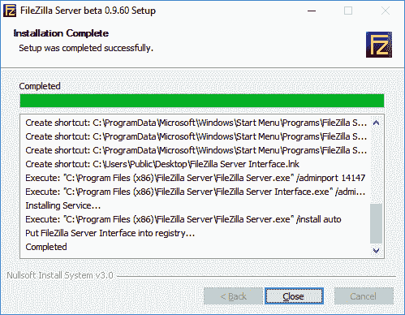
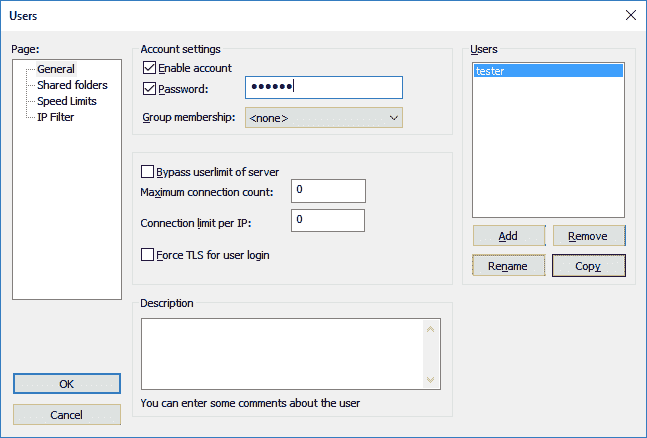
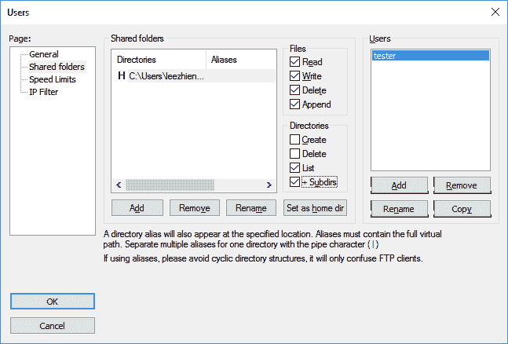
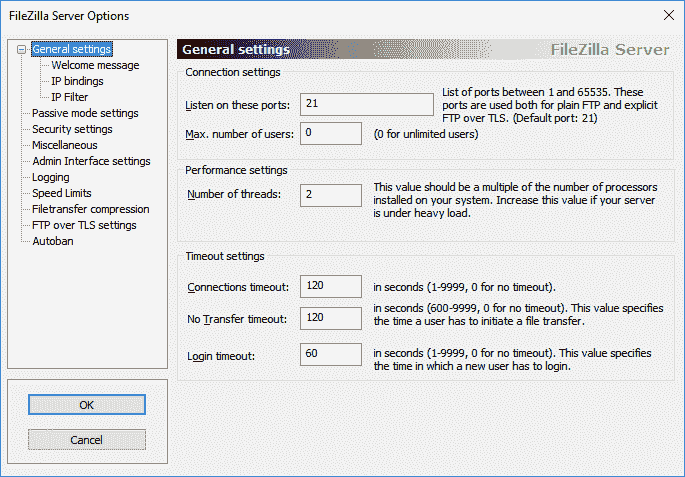
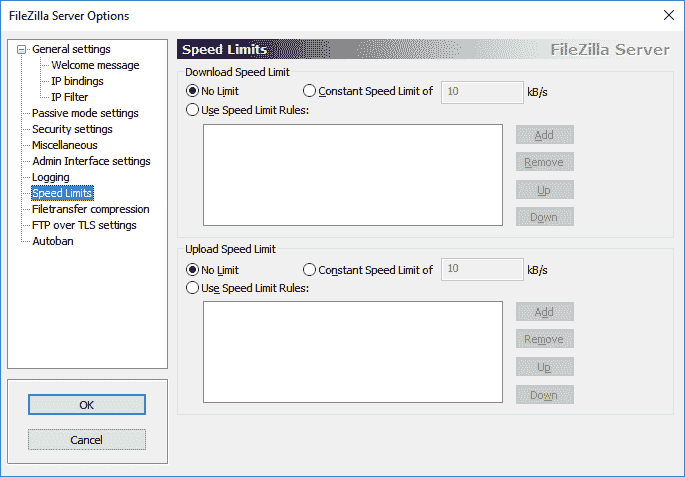
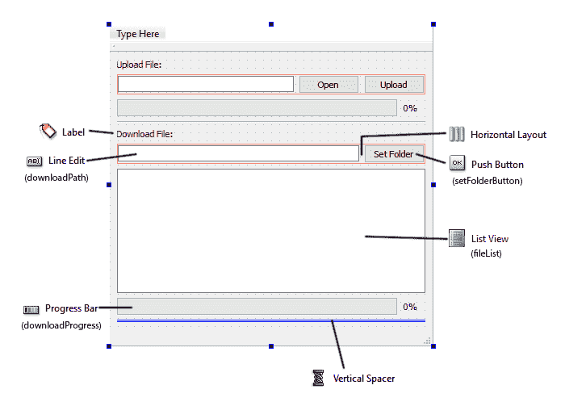
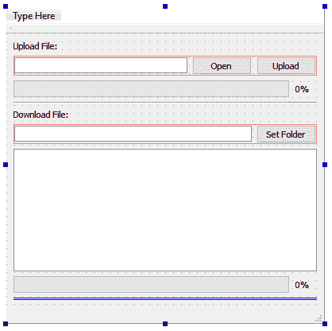
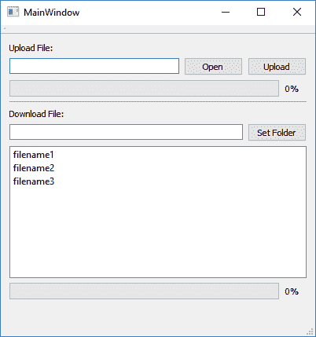
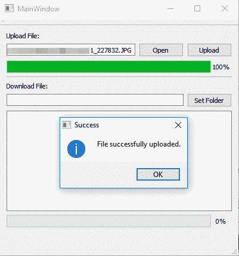

# 十二、云存储

在前一章中，我们学习了如何使用 Qt 在屏幕上绘制图像。然而，在这一章中，我们将学习一些完全不同的东西，那就是设置我们自己的文件服务器并将其链接到我们的 Qt 应用程序。

在本章中，我们将涵盖以下主题:

*   设置文件传输协议服务器
*   在列表视图中显示文件列表
*   上传文件到文件传输协议服务器
*   从文件传输协议服务器下载文件

我们开始吧！

# 设置文件传输协议服务器

在下一节中，我们将学习如何设置一个文件传输协议服务器，它存储用户上传的所有文件，并允许他们随时下载。本节与 Qt 无关，因此如果您已经有一个正在运行的 FTP 服务器，请跳过这一部分，进入本章的下一节。

# 介绍文件传输协议

**文件传输协议**是**文件传输协议**的缩写。FTP 用于在网络上将文件从一台计算机传输到另一台计算机，通常是通过互联网。FTP 只是众多不同形式的云存储技术中的一种，但也是一种可以在自己的电脑上轻松设置的简单技术。

有许多不同的 FTP 服务器是由不同的人群为特定的操作系统开发的。在本章的这一节中，我们将学习如何设置运行在 Windows 操作系统上的 FileZilla 服务器。如果您正在运行其他操作系统，如 GNU、Linux 或 macOS，还有许多其他 FTP 服务器程序可以使用，如 VSFTP 和 Pure-FTPd。

在 Debian、Ubuntu 或其他类似的 Linux 变体上，在终端上运行`sudo apt-get install vsftpd`将安装和配置一个 FTP 服务器。在苹果电脑上，从苹果菜单中打开“系统偏好设置”，然后选择“共享”。然后，单击服务选项卡并选择文件传输协议访问。最后，单击开始按钮开始运行 FTP 服务器。

如果您已经有一个运行的 FTP 服务器，请跳到下一节，在这一节中，我们将开始学习 C++ 编程。

# 正在下载文件

FileZilla 真的很容易设置和配置。它提供了一个功能齐全且易于使用的用户界面，并且不需要任何操作经验。我们需要做的第一件事是下载 FileZilla。我们将按如下方式进行:

1.  打开你的浏览器，跳到[https://filezilla-project.org](https://filezilla-project.org)。您将在主页上看到两个下载按钮。
2.  点击下载文件服务器，它会将我们带到下载页面:


3.  进入下载页面后，点击下载文件服务器按钮，开始下载软件。我们不会使用文件客户端，所以您不必下载它。一切准备就绪后，让我们开始安装软件。
4.  像大多数 Windows 软件一样，安装过程非常简单。将所有内容保留为默认设置，并一直单击“下一步”，直到安装过程开始。安装最多需要几分钟时间才能完成。
5.  一旦完成，点击关闭按钮，我们就完成了！：



# 设置文件索引

一旦安装了 FileZilla，控制面板很可能会自动打开。

1.  由于这是您第一次启动 FileZilla，它会要求您设置服务器。保持服务器的 IP 地址为`127.0.0.1`(即**本地主机**)，管理端口为`14147`。
2.  输入管理服务器所需的密码，并选中“始终连接到此服务器”选项。按下连接，FTP 服务器现在将启动！这显示在下面的截图中:


3.  FTP 服务器开始运行后，我们需要创建一个用户帐户。单击左侧第四个图标，打开“用户”对话框:


4.  然后，在常规页面下，单击位于窗口右侧的添加按钮。通过设置用户名创建帐户，然后按“确定”。

5.  我们现在不必将用户设置为任何组，因为用户组仅在您有许多具有相同权限设置的用户时有用，因为一次更改所有用户设置或将用户移动到不同的组更容易。创建用户后，选中密码选项并键入所需的密码。将密码放在您的 FTP 帐户上始终是一个很好的做法:



6.  之后，我们将进入共享文件夹页面，为新创建的用户添加一个共享目录。
7.  确保选中“删除”和“追加”选项，以便可以替换同名文件。我们将使用它来更新我们的文件列表:



8.  如果单击左侧第三个图标，将出现文件服务器选项对话框。您基本上可以在这里配置一切来满足您的需求。例如，如果您不想使用默认端口号`21`，您可以在“常规设置”页面下的选项窗口中简单地更改它:



9.  您也可以在“速度限制”页面下为所有用户或特定用户设置速度限制。当许多用户同时下载大量文件时，这可以防止服务器性能降低:



接下来，让我们继续创建我们的 Qt 项目！

# 在列表视图中显示文件列表

在前面的部分中，我们成功地设置了一个 FTP 服务器并保持其运行。在下一节中，我们将学习如何创建一个显示文件列表、将文件上传到文件传输协议服务器并最终从中下载文件的文件传输协议客户端程序。

# 设置项目

像往常一样，让我们使用 **Qt Creator** 创建一个新项目。以下步骤将有所帮助:

1.  我们可以通过转到文件|新文件或项目并选择 Qt 小部件应用程序来创建一个新项目。
2.  创建项目后，打开项目(`.pro`)文件并添加`network`关键字，以便 Qt 知道您需要项目中的网络模块:

```cpp
QT += core gui network
```

# 设置用户界面

之后，打开`mainwindow.ui`并执行以下步骤来设计上传文件的用户界面上部:

1.  在每一个小部件的顶部放置一个标签，上面写着上传文件。
2.  在标签下方分别放置一个水平布局和两个按钮，分别写着“打开”和“上传”。
3.  在水平布局下放置进度条。
4.  在底部放一条水平线，后跟一个垂直间隔:


接下来，我们将构建用于下载文件的用户界面的底部:



这次我们的用户界面和上半部分非常相似，只是我们在第二个进度条之前增加了一个列表视图，用于显示文件列表。对于这个示例程序，我们将所有内容都放在同一个页面上，这样解释起来就更简单、更容易理解。

# 显示文件列表

接下来，我们将学习如何在 FTP 服务器上保存和显示文件列表。事实上，默认情况下，文件传输协议服务器确实提供了文件列表，Qt 能够在旧版本中使用`qtftp`模块显示它。但是，从第 5 版开始，Qt 完全放弃了`qtftp`模块，这个功能也不复存在。

If you're still interested in the old `qtftp` module, you can still obtain its source code on GitHub by visiting the following link: [https://github.com/qt/qtftp](https://github.com/qt/qtftp)

在 Qt 中，我们使用`QNetworkAccessManager`类与我们的文件传输协议服务器通信，因此专门为文件传输协议设计的功能不再工作。但是，不要担心，我们会研究其他替代方法来达到同样的结果。

在我看来，最好的方法是使用在线数据库来存储文件列表及其信息(文件大小、格式、状态等)。如果您有兴趣学习如何将您的 Qt 应用程序连接到数据库，请参考[第 3 章](02.html)、*数据库连接*。然而，为了简单起见，我们将使用另一种工作正常但不太安全的方法——将文件名直接保存在文本文件中，并将其存储在 FTP 服务器上。

If you're doing a serious project for your client or company, please do not use this method. Check out [Chapter 3](02.html), *Database Connection*, and learn to use an actual database instead.

好吧，假设除了使用文本文件没有其他方法；我们要怎么做？很简单:创建一个名为`files.txt`的文本文件，并将其放入我们在本章开头刚刚创建的 FTP 目录中。

# 编写代码

接下来，打开`mainwindow.h`并添加以下标题:

```cpp
#include <QMainWindow> 
#include <QDebug> 
#include <QNetworkAccessManager> 
#include <QNetworkRequest> 
#include <QNetworkReply> 
#include <QFile> 
#include <QFileInfo> 
#include <QFileDialog> 
#include <QListWidgetItem> 
#include <QMessageBox> 
```

之后，添加以下变量和函数:

```cpp
private: 
   Ui::MainWindow *ui; 
 QNetworkAccessManager* manager; 

   QString ftpAddress; 
   int ftpPort; 
   QString username; 
   QString password; 

   QNetworkReply* downloadFileListReply; 
   QNetworkReply* uploadFileListReply; 

   QNetworkReply* uploadFileReply; 
   QNetworkReply* downloadFileReply; 

   QStringList fileList; 
   QString uploadFileName; 
   QString downloadFileName; 

public:
   void getFileList();
```

完成上一步后，打开`mainwindow.cpp`并向类构造函数添加以下代码:

```cpp
MainWindow::MainWindow(QWidget *parent) : 
   QMainWindow(parent), 
   ui(new Ui::MainWindow) 
{ 
   ui->setupUi(this); 

 manager = new QNetworkAccessManager(this); 

   ftpAddress = "ftp://127.0.0.1/"; 
   ftpPort = 21; 
   username = "tester"; // Put your FTP user name here
   password = "123456"; // Put your FTP user password here 
   getFileList(); 
} 
```

我们所做的基本上是初始化`QNetworkAccessManager`对象，并设置存储我们的 FTP 服务器信息的变量，因为我们将在后面的步骤中多次重复使用它。之后，我们将调用`getFileList()`功能，开始从我们的 FTP 服务器下载`files.txt`。`getFileList()`功能如下:

```cpp
void MainWindow::getFileList() 
{ 
   QUrl ftpPath; 
   ftpPath.setUrl(ftpAddress + "files.txt"); 
   ftpPath.setUserName(username); 
   ftpPath.setPassword(password); 
   ftpPath.setPort(ftpPort); 

   QNetworkRequest request; 
   request.setUrl(ftpPath); 

   downloadFileListReply = manager->get(request); 
   connect(downloadFileListReply, &QNetworkReply::finished, this, 
   &MainWindow::downloadFileListFinished); 
} 
```

我们使用一个`QUrl`对象来存储关于我们的服务器和我们试图下载的文件的位置的信息，然后在通过调用`QNetworkAccessManager::get()`将其发送出去之前，将其馈送给一个`QNetworkRequest`对象。因为我们不知道什么时候所有的文件都会被完全下载，所以我们使用了 Qt 的`SIGNAL`和`SLOT`机制。

我们连接了来自我们的`downloadFileListReply`指针的`finished()`信号(指向`mainwindow.h`中的一个`QNetworkReply`对象)，并将其链接到`slot`函数`downloadFileListFinished()`，我们定义如下:

```cpp
void MainWindow::downloadFileListFinished() 
{ 
   if(downloadFileListReply->error() != QNetworkReply::NoError) 
   { 
         QMessageBox::warning(this, "Failed", "Failed to load file 
         list: " + downloadFileListReply->errorString()); 
   } 
   else 
   { 
         QByteArray responseData; 
         if (downloadFileListReply->isReadable()) 
         { 
               responseData = downloadFileListReply->readAll(); 
         } 

         // Display file list 
         ui->fileList->clear(); 
         fileList = QString(responseData).split(","); 

         if (fileList.size() > 0) 
         { 
               for (int i = 0; i < fileList.size(); i++) 
               { 
                     if (fileList.at(i) != "") 
                     { 
                           ui->fileList->addItem(fileList.at(i)); 
                     } 
               } 
         } 
   } 
} 
```

代码有点长，所以我将函数分解为以下步骤:

1.  如果下载过程中出现任何问题，显示一个消息框，告诉我们问题的性质。
2.  如果一切顺利，下载完成，我们将通过调用`downloadFileListReply` | `readAll()`来读取数据。
3.  然后，清除列表小部件并开始解析文本文件的内容。我们这里使用的格式非常简单；我们只使用了一个逗号符号来分隔每个文件名:`filename1,filename2,filename,...`重要的是我们在实际项目中不要这样做。
4.  一旦我们调用`split(",")`将字符串分割成一个字符串列表，做一个`for`循环并在列表小部件上显示每个文件名。

为了测试前面的代码是否有效，创建一个名为`files.txt`的文本文件，并将以下文本添加到文件中:

```cpp
filename1,filename2,filename3 
```

然后，将文本文件放入您的 FTP 目录并运行您的项目。您应该能够在应用程序上看到它是这样显示的:



一旦它开始工作，我们就可以清除文本文件的内容，进入下一部分。

# 上传文件到文件传输协议服务器

由于我们的 FTP 目录中还没有任何文件(除了文件列表)，让我们编写代码来允许我们上传第一个文件。

1.  首先，打开`mainwindow.ui`，右键点击打开按钮。然后，选择转到插槽并选择单击的()选项:



2.  将自动为您创建一个`slot`功能。然后，将以下代码添加到函数中，以打开文件选择器窗口，供用户选择他们想要上传的文件:

```cpp
void MainWindow::on_openButton_clicked() 
{ 
   QString fileName = QFileDialog::getOpenFileName(this, "Select 
   File", qApp->applicationDirPath()); 
   ui->uploadFileInput->setText(fileName); 
}
```

3.  之后，重复此步骤，并对上传按钮执行相同的操作。这一次，其`slot`函数的代码如下所示:

```cpp
void MainWindow::on_uploadButton_clicked() 
{ 
   QFile* file = new QFile(ui->uploadFileInput->text()); 
   QFileInfo fileInfo(*file); 
   uploadFileName = fileInfo.fileName(); 

   QUrl ftpPath; 
   ftpPath.setUrl(ftpAddress + uploadFileName); 
   ftpPath.setUserName(username); 
   ftpPath.setPassword(password); 
   ftpPath.setPort(ftpPort); 

   if (file->open(QIODevice::ReadOnly)) 
   { 
         ui->uploadProgress->setEnabled(true); 
         ui->uploadProgress->setValue(0); 

         QNetworkRequest request; 
         request.setUrl(ftpPath); 

         uploadFileReply = manager->put(request, file); 
         connect(uploadFileReply, 
         SIGNAL(uploadProgress(qint64,qint64)), this, 
         SLOT(uploadFileProgress(qint64,qint64))); 
         connect(uploadFileReply, SIGNAL(finished()), this,  
         SLOT(uploadFileFinished())); 
   } 
   else 
   { 
         QMessageBox::warning(this, "Invalid File", "Failed to open 
         file for upload."); 
   } 
} 

```

代码看起来有点长，让我们分解一下:

1.  我们使用`QFile`类打开我们想要上传的文件(文件路径取自`ui->uploadFileInput->text()`)。如果文件不存在，显示一个消息框通知用户。
2.  然后，我们将我们的 FTP 服务器和上传目的地的信息填充到一个`QUrl`对象中，然后将其馈送到一个`QNetworkRequest`对象中。
3.  之后，我们开始读取我们文件的内容，并将其提供给`QNetworkAccessManager::put()`功能。

4.  由于我们不知道文件什么时候会完全上传，所以我们使用了 Qt 提供的`SIGNAL`和`SLOT`机制。我们将`uploadProgress()`和`finished()`信号分别与我们的两个自定义`slot`功能`uploadFileProgress()`和`uploadFileFinised()`联系起来。

`slot`功能`uploadFileProgress()`会告诉我们当前上传的进度，因此我们可以用它来设置进度条:

```cpp
void MainWindow::uploadFileProgress(qint64 bytesSent, qint64 bytesTotal) 
{ 
   qint64 percentage = 100 * bytesSent / bytesTotal; 
   ui->uploadProgress->setValue((int) percentage); 
} 
```

同时，文件上传完成后将触发`uploadFileFinished()`功能:

```cpp
void MainWindow::uploadFileFinished() 
{ 
   if(uploadFileReply->error() != QNetworkReply::NoError) 
   { 
         QMessageBox::warning(this, "Failed", "Failed to upload file: " 
         + uploadFileReply->errorString()); 
   } 
   else 
   { 
         QMessageBox::information(this, "Success", "File successfully 
         uploaded."); 
   } 
} 

```

我们还没有完成前面的功能。由于新文件已经添加到 FTP 服务器，我们必须更新现有的文件列表，并替换存储在 FTP 目录中的`files.txt`文件。由于代码稍长，我们将把代码分成几个部分，所有这些都发生在显示“文件成功上传”消息框之前。

1.  首先，让我们检查新上传的文件是否已经存在于我们的文件列表中(替换 FTP 服务器上的旧文件)。如果是的话，那么我们可以跳过整个事情；否则，将文件名附加到我们的`fileList`字符串列表中，如以下代码所示:

```cpp
// Add new file to file list array if not exist yet 
bool exists = false; 
if (fileList.size() > 0) 
{ 
   for (int i = 0; i < fileList.size(); i++) 
   { 
         if (fileList.at(i) == uploadFileName) 
         { 
               exists = true; 
         } 
   } 
} 

if (!exists) 
{ 
   fileList.append(uploadFileName); 
} 
```

2.  之后，在我们应用程序的目录中创建一个临时文本文件(`files.txt`)，并将新文件列表保存在文本文件中:

```cpp
// Create new files.txt 
QString fileName = "files.txt"; 
QFile* file = new QFile(qApp->applicationDirPath() + "/" + fileName); 
file->open(QIODevice::ReadWrite); 
if (fileList.size() > 0) 
{ 
   for (int j = 0; j < fileList.size(); j++) 
   { 
         if (fileList.at(j) != "") 
         { 
               file->write(QString(fileList.at(j) + ",").toUtf8()); 
         } 
   } 
} 
file->close(); 
```

3.  最后，我们使用`QFile`类打开刚刚创建的文本文件，再次上传到 FTP 服务器，替换旧的文件列表:

```cpp
// Re-open the file 
QFile* newFile = new QFile(qApp->applicationDirPath() + "/" + fileName); 
if (newFile->open(QIODevice::ReadOnly)) 
{ 
   // Update file list to server 
   QUrl ftpPath; 
   ftpPath.setUrl(ftpAddress + fileName); 
   ftpPath.setUserName(username); 
   ftpPath.setPassword(password); 
   ftpPath.setPort(ftpPort); 

   QNetworkRequest request; 
   request.setUrl(ftpPath); 
   uploadFileListReply = manager->put(request, newFile); 
   connect(uploadFileListReply, SIGNAL(finished()), this, SLOT(uploadFileListFinished())); 
   file->close(); 
} 
```

4.  同样，我们使用`SIGNAL`和`SLOT`机制，以便在文件列表上传后通知我们。`slot`功能`uploadFileListFinished()`如下所示:

```cpp
void MainWindow::uploadFileListFinished() 
{ 
   if(uploadFileListReply->error() != QNetworkReply::NoError) 
   { 
         QMessageBox::warning(this, "Failed", "Failed to update file list: " + uploadFileListReply->errorString()); 
   } 
   else 
   { 
         getFileList(); 
   } 
} 

```

5.  我们基本上只是在把文件列表更新到 FTP 服务器后再调用`getFileList()`。如果您现在构建并运行项目，您应该能够将您的第一个文件上传到您的本地 FTP 服务器，万岁！


# 从文件传输协议服务器下载文件

现在，我们已经成功地将第一个文件上传到了 FTP 服务器，让我们创建一个将文件下载回计算机的功能！

1.  首先，再次打开`mainwindow.ui`，右键点击设置文件夹按钮。选择转到插槽...并点击()信号创建`slot`功能。`slot`功能很简单；它只会打开一个文件选择对话框，但这次它只会让用户选择一个文件夹，因为我们为它提供了一个`QFileDialog::ShowDirsOnly`标志:

```cpp
void MainWindow::on_setFolderButton_clicked() 
{ 
   QString folder = QFileDialog::getExistingDirectory(this, tr("Open Directory"), qApp->applicationDirPath(), QFileDialog::ShowDirsOnly); 
   ui->downloadPath->setText(folder); 
} 
```

2.  然后，右键单击列表小部件并选择转到插槽...这一次，我们将选择`itemDoubleClicked(QListWidgetItem*)`选项:



3.  当用户双击列表小部件中的项目时，将触发以下功能，启动下载。文件名可以通过调用`item->text()`从`QListWidgetItem`对象中获取:

```cpp
void MainWindow::on_fileList_itemDoubleClicked(QListWidgetItem *item) 
{ 
   downloadFileName = item->text(); 

   // Check folder 
   QString folder = ui->downloadPath->text(); 
   if (folder != "" && QDir(folder).exists()) 
   { 
         QUrl ftpPath; 
         ftpPath.setUrl(ftpAddress + downloadFileName); 
         ftpPath.setUserName(username); 
         ftpPath.setPassword(password); 
         ftpPath.setPort(ftpPort); 

         QNetworkRequest request; 
         request.setUrl(ftpPath); 

         downloadFileReply = manager->get(request); 
         connect(downloadFileReply, 
         SIGNAL(downloadProgress(qint64,qint64)), this, 
         SLOT(downloadFileProgress(qint64,qint64))); 
         connect(downloadFileReply, SIGNAL(finished()), this, 
         SLOT(downloadFileFinished())); 
   } 
   else 
   { 
         QMessageBox::warning(this, "Invalid Path", "Please set the 
         download path before download."); 
   } 
} 
```

4.  就像我们在`upload`功能中所做的一样，我们也使用了这里的`SIGNAL`和`SLOT`机制来获得下载过程的进程以及完成的信号。在下载过程中将调用`slot`函数`downloadFileProgress()`，我们用它来设置第二个进度条的值:

```cpp
void MainWindow::downloadFileProgress(qint64 byteReceived,qint64 bytesTotal) 
{ 
   qint64 percentage = 100 * byteReceived / bytesTotal; 
   ui->downloadProgress->setValue((int) percentage); 
} 
```

5.  然后，当文件下载完成后，将调用`slot`功能`downloadFileFinished()`。之后，我们要做的是读取文件的所有数据，并将其保存到我们想要的目录中:

```cpp
void MainWindow::downloadFileFinished() 
{ 
   if(downloadFileReply->error() != QNetworkReply::NoError) 
   { 
         QMessageBox::warning(this, "Failed", "Failed to download 
         file: " + downloadFileReply->errorString()); 
   } 
   else 
   { 
         QByteArray responseData; 
         if (downloadFileReply->isReadable()) 
         { 
               responseData = downloadFileReply->readAll(); 
         } 

         if (!responseData.isEmpty()) 
         { 
               // Download finished 
               QString folder = ui->downloadPath->text(); 
               QFile file(folder + "/" + downloadFileName); 
               file.open(QIODevice::WriteOnly); 
               file.write((responseData)); 
               file.close(); 

               QMessageBox::information(this, "Success", "File 
               successfully downloaded."); 
         } 
   } 
}
```

6.  立即构建程序，您应该能够下载文件列表中列出的任何文件！：


# 摘要

在本章中，我们学习了如何使用 Qt 的网络模块创建我们自己的云存储客户端。在下一章中，我们将学习更多关于多媒体模块的知识，并使用 Qt 从头开始创建我们自己的多媒体播放器。