# Qt Quick 和 QML

在这一章中，我们将学习一些与本书其余章节非常不同的东西。Qt 由两种不同的开发应用程序的方法组成。第一种方法是 Qt Widgets 和 C++，我们在前面的章节中已经介绍过了。第二种方法是使用 Qt Quick 控件和 QML 脚本语言，这将在本章中介绍。

在本章中，我们将涵盖以下主题:

*   Qt Quick 和 QML 简介
*   快速部件和控制
*   Qt 快速设计器
*   Qt 快速布局
*   基本 QML 脚本

你准备好了吗？我们开始吧！

# Qt Quick 和 QML 简介

在下一节中，我们将学习什么是 Qt Quick 和 QML，以及我们如何利用它们来开发 Qt 应用程序，而不需要编写 C++代码。

# 介绍 Qt Quick

**Qt Quick** 是 Qt 中的一个模块，它为开发面向触摸和面向视觉的应用程序提供了一整套用户界面引擎和语言基础设施。选择 Qt Quick 的开发人员将使用 Qt Quick 对象和控件，而不是使用通常的 Qt Widgets 进行用户界面设计。

此外，开发人员将使用 QML 语言编写他们的代码，该语言具有类似于 JavaScript 的语法，而不是用 C++代码编写。但是，您可以使用 Qt 提供的 C++ API 来扩展 QML 应用程序，方法是交叉调用每种语言的函数(在 QML 调用 C++函数，反之亦然)。

开发人员可以通过在创建项目时选择正确的选项来选择他们更喜欢的开发应用程序的方法。开发人员可以选择 Qt 快速应用程序，而不是选择通常的 Qt 小部件应用程序选项，该选项告诉 Qt 创建者为您的项目创建不同的启动文件和设置，以支持 Qt 快速模块:

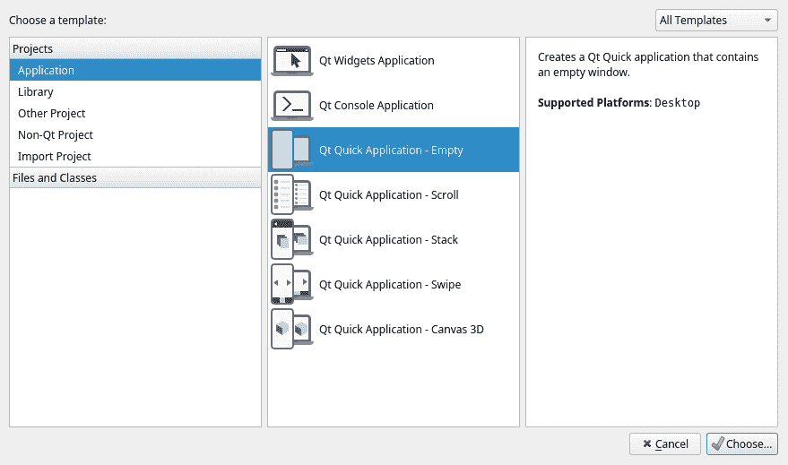

当您创建一个 Qt 快速应用程序项目时，Qt 创建者会要求您为您的项目选择最低要求的 Qt 版本:

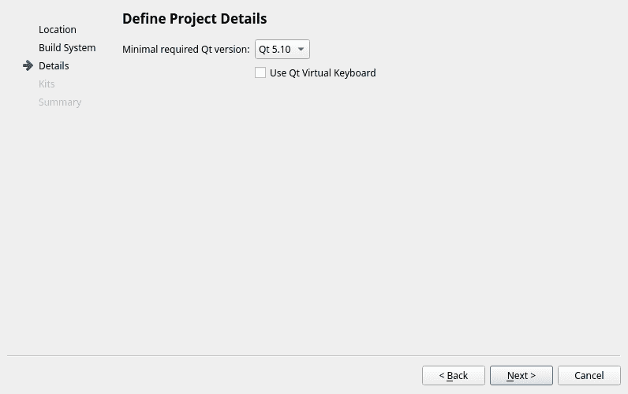

一旦您选择了一个 Qt 版本，Qt 快速设计器将决定启用哪些功能以及哪些小部件将出现在 QML 类型窗口中。我们将在后面的章节中更多地讨论这些。

# 介绍 QML

**QML** ( **Qt 建模语言**)是一种用户界面标记语言，用于设计触摸友好的用户界面，类似于 CSS 在 HTML 上的工作方式。与 C++或 JavaScript 都是命令式语言不同，QML 是一种声明式语言。在声明式编程中，您只表达脚本中的逻辑，而不描述其控制流。它只是告诉计算机做什么，而不是怎么做。然而，命令式编程需要语句来指定动作。

当您打开新创建的 Qt Quick 项目时，您将在项目中看到`main.qml`和`MainForm.ui.qml`，而不是通常的`mainwindow.h`和`mainwindow.cpp`文件。您可以在以下截图中的项目目录中看到这一点:


这是因为整个项目将主要在 QML 运行，而不是 C++。您将看到的唯一 C++文件是`main.cpp`，所做的只是在应用程序启动期间加载`main.qml`文件。在`main.cpp`中执行此操作的代码如下所示:

```cpp
int main(int argc, char *argv[]) 
{ 
   QGuiApplication app(argc, argv); 

   QQmlApplicationEngine engine; 
   engine.load(QUrl(QStringLiteral("qrc:/main.qml"))); 
   if (engine.rootObjects().isEmpty()) 
         return -1; 

   return app.exec(); 
} 
```

您应该已经意识到 QML 文件有两种类型，一种扩展名为`.qml`，另一种扩展名为`.ui.qml`。即使它们都运行在相同的语法上等等，它们在您的项目中服务于非常不同的目的。

首先是`.ui.qml`文件(多了一个。`ui`开头)作为基于 Qt Quick 的用户界面设计的声明性文件。您可以使用 Qt 快速设计器可视化编辑器编辑`.ui.qml`文件，并轻松设计应用程序的图形用户界面。您也可以将自己的代码添加到文件中，但是它们可以包含的代码有一些限制，尤其是那些与逻辑代码相关的代码。当您运行您的 Qt Quick 应用程序时，Qt Quick 引擎将读取存储在`.ui.qml`文件中的所有信息，并相应地构建用户界面，这与 Qt Widgets 应用程序中使用的`.ui`文件非常相似。

然后，我们有了另一个只有`.qml`扩展名的文件。该文件仅用于构建 Qt Quick 应用程序中的逻辑和功能，非常类似于 Qt Widget 应用程序中使用的`.h`和`.cpp`文件。这两种不同的格式将应用程序的可视化定义与其逻辑块分开。这允许开发人员将相同的逻辑代码应用于不同的用户界面模板。您不能使用 Qt 快速设计器打开`.qml`文件，因为它不用于图形用户界面声明。`.qml`文件由开发人员手工编写，他们使用的 QML 语言特性没有限制。

让我们先打开`MainForm.ui.qml`，看看这两个 QML 文件的不同之处。默认情况下，Qt Creator 会打开用户界面设计器(Qt 快速设计器)；但是，让我们转到代码编辑模式，按下左侧面板上的编辑按钮:

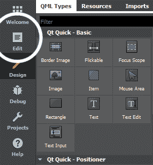

然后，您将能够看到 QML 脚本，它形成了您刚刚在设计模式中看到的用户界面。让我们分析一下这段代码，看看与 C++相比，QML 是如何工作的。在`MainForm.ui.qml`中首先看到的是这一行代码:

```cpp
import QtQuick 2.6 
```

这很简单；我们需要导入带有适当版本号的`Qt Quick`模块。不同的 Qt Quick 版本可能有不同的功能，并支持不同的小部件控件。有时，甚至语法也可能略有不同。请确保您为您的项目选择了正确的版本，并且它支持您需要的功能。如果不知道用哪个版本，一定要考虑最新版本。

接下来，我们将看到不同的图形用户界面对象(我们称之为 QML 类型)在两个大括号之间声明。我们看到的第一个是`Rectangle`型:

```cpp
    Rectangle { 
       property alias mouseArea: mouseArea 
       property alias textEdit: textEdit 

       width: 360 
       height: 360 
       ... 
```

在这种情况下，`Rectangle`类型是窗口背景，很像 Qt widget Application 项目中使用的中心 Widget。让我们看看`Rectangle`下面的其他 QML 类型:

```cpp
    MouseArea { 
        id: mouseArea 
        anchors.fill: parent 
    } 

    TextEdit { 
        id: textEdit 
        text: qsTr("Enter some text...") 
        verticalAlignment: Text.AlignVCenter 
        anchors.top: parent.top 
        anchors.horizontalCenter: parent.horizontalCenter 
        anchors.topMargin: 20 
        Rectangle { 
            anchors.fill: parent 
            anchors.margins: -10 
            color: "transparent" 
            border.width: 1 
        } 
    } 
```

`MousArea`类型，顾名思义，是检测鼠标点击和触摸事件的无敌形状。通过在上面放一个`MouseArea`，你基本上可以把任何东西变成一个按钮。在此之后，我们还有一个`TextEdit`类型，它的行为完全类似于 Qt 小部件应用程序中的`Line Edit`小部件。

您可能已经注意到`Rectangle`声明中有两个属性带有`alias`关键字。这两个属性公开了`MouseArea`和`TextEdit`类型，并允许其他 QML 脚本与之交互，接下来我们将学习如何操作。

现在，打开`main.qml`看看它的代码:

```cpp
import QtQuick 2.6 
import QtQuick.Window 2.2 

Window { 
    visible: true 
    width: 640 
    height: 480 
    title: qsTr("Hello World") 

    MainForm { 
        anchors.fill: parent 
        mouseArea.onClicked: { 
            console.log(qsTr('Clicked on background. Text: "' + 
            textEdit.text + '"')) 
        } 
    } 
} 
```

在上面的代码中，有一个`Window`类型，只有通过导入`QtQuick.Window`模块才能使用。设置`Window`类型的属性后，声明`MainForm`类型。这种`MainForm`类型实际上是我们之前在`MainForm.ui.qml`中看到的整个用户界面。由于`MouseArea`和`TextEdit`类型已经在`MainForm.ui.qml`中暴露，我们现在可以在`main.qml`中访问和使用它们。

QML 还使用了 Qt 提供的信号和时隙机制，但是编写形式略有不同，因为我们不再编写 C++代码了。例如，我们可以看到上面的代码中使用了`onClicked`，这是一个内置信号，相当于 Qt Widgets 应用程序中的`clicked()`。由于`.qml`文件是我们定义应用程序逻辑的地方，我们可以定义当`onClicked`被调用时会发生什么。另一方面，我们不能在`.ui.qml`做同样的事情，因为它只允许与视觉相关的代码。如果您试图在`.ui.qml`文件中编写逻辑相关的代码，您将收到 Qt Creator 的警告。

就像 Qt Widgets 应用程序一样，您也可以像以前一样构建和运行项目。默认示例应用程序如下所示:

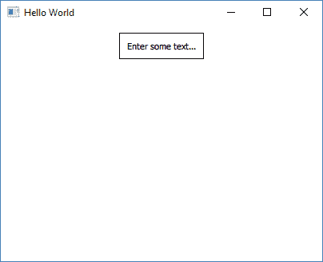

您可能会意识到构建过程非常快。这是因为默认情况下，QML 代码不会编译成二进制。QML 是一种解释语言，就像 JavaScript 一样，因此不需要编译就可以执行。在构建过程中，所有的 QML 文件都会被打包到应用程序的资源系统中。然后，一旦应用程序启动，QML 文件将被 Qt Quick 引擎加载和解释。

但是，您仍然可以选择将您的 QML 脚本编译成二进制，使用 Qt 中包含的`Qt Quick Compiler`程序，使代码执行比平时稍快。除非您试图在资源非常有限的嵌入式系统上运行应用程序，否则这是一个不需要的可选步骤。

现在我们已经理解了什么是 **Qt Quick** 和 **QML** 语言，让我们来看看 Qt 提供的所有不同的 QML 类型。

# 快速部件和控制

在 Qt Quick 的领域中，小部件和控件被称为`QML types`。默认情况下， **Qt 快速设计器**为我们提供了一组基本的 QML 类型。您还可以导入不同模块附带的其他 QML 类型。此外，如果现有的 QML 类型都不符合您的需求，您甚至可以创建自己的自定义类型。

让我们看看默认情况下 Qt 快速设计器附带了哪些 QML 类型。首先，下面是基本类别下的 QML 类型:


让我们看看不同的选项:

*   **边框图像**:边框图像是一种 QML 类型，旨在创建可缩放的矩形形状，可以保持其角形状和边框。
*   **Flickable** : Flickable 是一个 QML 类型，包含它的所有子类型，并在其剪辑区域内显示它们。Flickable 也被扩展并被`ListView`和`GridView`类型用于滚动长内容。它也可以通过触摸屏轻击手势来移动。
*   **焦点范围**:焦点范围是一个低级的 QML 类型，用来方便其他 QML 类型的构建，可以在被按下或者释放的时候获取键盘焦点。我们通常不会直接使用这个 QML 类型，而是使用直接从它继承的其他类型，比如`GroupBox`、`ScrollView`、`StatusBar`等等。
*   **形象**:这种`Image`类型不言自明。它在本地或从网络加载图像。
*   **项**:`Item`类型是 Qt Quick 中所有视觉项最基本的 QML 类型。Qt Quick 中的所有可视化项目都继承自这个`Item`类型。
*   **鼠标** **区域**:我们已经看到了默认 Qt 快速应用项目中`MouseArea`类型的用法示例。它检测预定义区域内的鼠标点击和触摸事件，并在检测到时调用点击信号。
*   **矩形** : A `Rectangle` QML 类型与`Item`类型非常相似，只是它有一个可以填充纯色或渐变的背景。或者，您也可以用自己的颜色和厚度为其添加边框。
*   **文字**:`Text`QML 类型也挺不言自明的。它只是在窗口上显示一行文本。您可以使用它来显示具有特定字体系列和字体大小的纯文本和富文本。
*   **文本编辑**:文本编辑 QML 类型相当于 Qt Widgets 应用中的`Text Edit`小部件。它允许用户在聚焦时键入文本。它可以显示纯文本和格式化文本，这与`Text Input`类型有很大不同。
*   **文本输入**:文本输入 QML 类型相当于 Qt Widgets 应用中的 Line Edit widget，它只能显示一行可编辑的纯文本，与`Text Edit`类型不同。您还可以通过验证器或输入掩码对其应用输入约束。通过将`echoMode`设置为`Password`或`PasswordEchoOnEdit`，也可用于密码输入字段。

我们在这里讨论的 QML 类型是默认情况下 Qt 快速设计器附带的最基本的类型。这些也是用于构建其他一些更复杂的 QML 类型的基本构件。Qt Quick 附带了许多额外的模块，我们可以将其导入到我们的项目中，例如，如果我们在`MainForm.ui.qml`文件中添加以下行:

```cpp
import QtQuick.Controls 2.2
```

当您切换到设计模式时，您的 Qt 快速设计器上会出现一堆附加的 QML 类型:

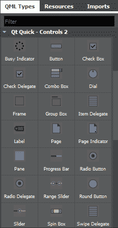

We won't go through all these QML types one by one, as there are too many of them. If you are interested in learning more about these QML types, please visit the following link:[ https://doc.qt.io/qt-5.10/qtquick-controls-qmlmodule.html](https://doc.qt.io/qt-5.10/qtquick-controls-qmlmodule.html)

# Qt 快速设计器

接下来，我们将查看 Qt 快速应用程序项目的 Qt 快速设计器布局。当你打开一个`.ui.qml`文件，Qt 快速设计器，Qt Creator 工具集中包含的设计器工具，会自动为你启动。

那些从本书第一章开始就关注所有示例项目的人可能会意识到 Qt 快速设计器看起来与我们一直使用的有点不同。这是因为 Qt Quick 项目与 Qt Widgets 项目有很大的不同，所以设计工具自然也应该看起来不同，以满足其需求。

让我们看看 Qt 快速设计器在 Qt 快速项目中的外观:

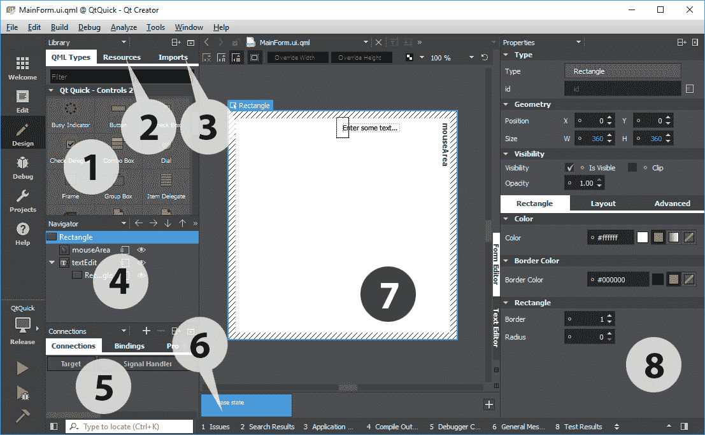

1.  库:“库”窗口显示当前项目可用的所有 QML 类型。您可以点按它并将其拖到画布窗口，以将其添加到您的用户界面。您也可以创建自己的自定义 QML 类型并在此显示。
2.  资源:“资源”窗口显示列表中的所有资源，这些资源可以在用户界面设计中使用。
3.  导入:通过“导入”窗口，您可以将不同的 Qt 快速模块导入到当前项目中。
4.  导航器:“导航器”窗口以树形结构显示当前 QML 文件中的项目。它类似于 Qt Widgets 应用程序项目中的对象操作窗口。
5.  连接:“连接”窗口由几个不同的选项卡组成:连接、绑定、属性和后端。这些选项卡允许您向 QML 文件添加连接(信号和插槽)、绑定和属性，而无需切换到编辑模式。
6.  状态窗格:状态窗格显示 QML 项目中通常描述用户界面配置的不同状态，例如用户界面控件、其属性和行为以及可用的操作。
7.  画布:画布是设计应用程序用户界面的工作区域。
8.  属性窗格:类似于我们在 Qt Widgets 应用程序项目中使用的属性编辑器，QML 设计器中的属性窗格显示所选项目的属性。更改此处的值后，您可以立即在用户界面中看到结果。

# Qt 快速布局

就像 Qt Widget 应用程序一样，Qt Quick 应用程序中也存在布局系统。唯一的区别是它被称为快速定位:

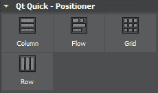

最明显的相似之处是列和行定位器。这两个与 Qt Widgets 应用程序中的垂直布局和水平布局完全相同。除此之外，网格定位器也与网格布局相同。

Qt Quick 中唯一额外的东西是流量定位器。流动定位器中包含的项目像页面上的文字一样排列，项目沿着一个轴排成一行，项目沿着另一个轴并排放置。


# 基本 QML 脚本

在下一节中，我们将学习如何使用 Qt Quick Designer 和 QML 创建我们的第一个 Qt Quick 应用程序！

# 设置项目

不用多说，让我们把我们的手放在 QML 身上，自己创建一个 Qt Quick 应用程序！对于这个示例项目，我们将使用 Qt 快速设计器和 QML 脚本创建一个虚拟登录屏幕。首先，让我们打开 Qt Creator，通过转到文件|新文件或项目来创建一个新项目...

之后，选择 Qt 快速应用程序并按选择....之后，一直按“下一步”，直到创建项目。我们将使用这个示例项目的所有默认设置，包括最低要求的 Qt 版本:


创建项目后，我们需要向项目中添加一些图像文件，以便以后使用:


You can get the source files (including these images) at our GitHub page: [http://github.com/PacktPublishing/Hands-On-GUI-Programming-with-C-QT5](http://github.com/PacktPublishing/Hands-On-GUI-Programming-with-C-QT5)

我们可以通过右键单击项目窗格中的`qml.qrc`文件并选择在编辑器中打开来将这些图像添加到我们的项目中。添加一个名为`images`的新前缀，并将所有图像文件添加到该前缀中:


之后，打开`MainForm.ui.qml`，删除 QML 文件中的所有内容。我们从头开始，在画布上添加一个项目类型，将其大小设置为 400 x 400，并将其称为`loginForm`。之后，在下面加一个`Image`类型，称之为`background`。然后我们将背景图像应用到`Image`类型，画布现在看起来像这样:

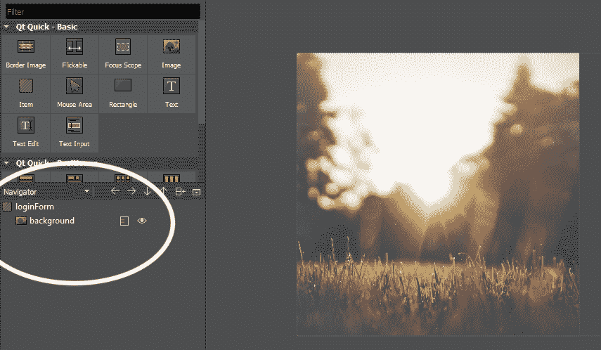

然后，在`Image`类型(背景)下添加一个`Rectangle`类型，并在属性窗格中打开布局选项卡。启用垂直和水平定位选项。之后，将`width`设置为`402`，将`height`设置为`210`，将`vertical anchor margin`设置为`50`:


接下来，我们将矩形的颜色设置为`#fcf9f4`，边框颜色设置为`#efedeb`，然后将边框值设置为`1`。到目前为止，用户界面如下所示:

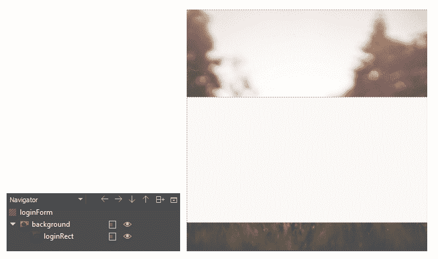

接下来，在矩形下添加图像 QML 类型，并将其锚点设置为顶部锚点和水平锚点。然后，我们将其顶部锚点边距设置为`-110`，并将徽标图像应用到其`image source`属性。您可以通过点按画布顶部的小按钮来打开和关闭 QML 类型的边框和条纹，以便更容易查看结果，尤其是当画布上堆满了东西时:

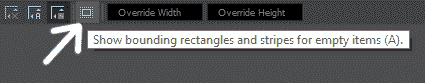

然后，我们在`loginRect`矩形下的画布上添加三个`Rectangle`类型，分别叫做`emailRect`、`passwordRect`和`loginButton`。矩形的锚点设置如下所示:


然后，我们将`emailRect`和`passwordRect`的`border`值设置为`1`，将`color`设置为`#ffffff`，将`bordercolor`设置为`#efedeb`。至于`loginButton`，我们将`border`设置为`0`，将`radius`设置为`2`，将`color`设置为`#27ae61`。登录屏幕现在如下所示:

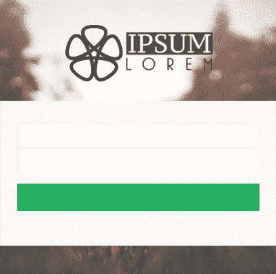

目前看来不错。接下来，我们将在`emailRect`和`passwordRect`上添加一个`TextInput`、`Image`、`MouseArea`和一个`Text` QML 类型。由于这里有许多 QML 类型，我将列出需要设置的属性:

*   TextInput 组件:
    *   选择颜色设置为`#4f0080`
    *   启用左锚、右锚和垂直锚
    *   左定位边距`20`、右定位边距`40`和垂直边距 3
    *   将回声模式设置为密码，仅用于密码输入
*   图像:
    *   启用右锚和垂直锚
    *   右锚定边距设置为`10`
    *   将图片来源分别设置为电子邮件图标或密码图标
    *   将图像填充模式设置为保留预期

*   鼠标区域:
    *   启用填充父项目
*   文本:
    *   将文本属性分别设置为`E-Mail`和`Password`
    *   文本颜色设置为`#cbbdbd`
    *   文本对齐方式设置为左对齐和上对齐
    *   启用左锚、右锚和垂直锚
    *   左锚定边距`20`、右锚定边距`40`和垂直边距-1

完成后，也在`loginButton`上添加一个`MouseArea`和`Text`。启用`MouseArea`的`fill parent item`，启用【QML】类型的`vertical`和`horizontal anchors`。然后，将其`text`属性设置为`LOGIN`。

你不必 100%遵循我的所有步骤，它们只是一个指导方针，让你达到与上面截图相似的结果。但是，你最好应用自己的设计，创造一些独特的东西！

唷！经过上述漫长的过程，我们的登录屏幕现在应该如下所示:


在进入`main.qml`之前，我们需要做的最后一件事是在我们的登录屏幕中展示一些 QML 类型，这样我们就可以将其链接到我们的`main.qml`文件进行逻辑编程。事实上，我们可以直接在设计工具上做到这一点。您只需要点击位于对象名称旁边的小矩形图标，并确保图标上的三条线穿透矩形框，如下所示:

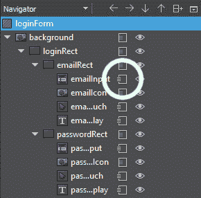

我们需要公开/导出的 QML 类型有`emailInput`(文本输入)、`emailTouch`(鼠标区域)、`emailDisplay`(文本)、`passwordInput`(文本输入)、`passwordTouch`(鼠标区域)、`passwordDisplay`(文本)和`loginMouseArea`(鼠标区域)。一旦你完成了所有这些，让我们打开`main.qml`。

起初，我们的`main.qml`应该是这样的，它只会打开一个空窗口:

```cpp
import QtQuick 2.6 
import QtQuick.Window 2.2 

Window { 
    id: window 
    visible: true 
    width: 800 
    height: 600 
    title: qsTr("My App") 
} 
```

之后，加入`MainForm`对象，将其锚点设置为`anchors.fill: parent`。然后，当点击`loginButton`时(或触摸，如果在触摸设备上运行)，在控制台窗口上打印出一行文本`Login pressed`:

```cpp
Window { 
    id: window 
    visible: true 
    width: 800 
    height: 600 
    title: qsTr("My App") 

    MainForm 
    { 
        anchors.fill: parent 

        loginMouseArea.onClicked: 
        { 
            console.log("Login pressed"); 
        } 
    } 
} 
```

之后，我们将对点击/触摸电子邮件输入上的`MouseArea`时的行为进行编程。由于我们是手动创建自己的文本字段，而不是使用`QtQuick.Controls`模块提供的`TextField` QML 类型，我们必须手动隐藏和显示`E-Mail`和`Password`文本显示，以及当用户点击/触摸`MouseArea`时改变输入焦点。

之所以选择不用`TextField`类型，是因为我几乎无法定制`TextField's`的视觉呈现，那为什么不自己创作呢？手动聚焦电子邮件输入的代码如下所示:

```cpp
emailTouch.onClicked: 
{ 
    emailDisplay.visible = false;      // Hide emailDisplay 
    emailInput.forceActiveFocus();     // Focus emailInput 
    Qt.inputMethod.show();       // Activate virtual keyboard 
} 

emailInput.onFocusChanged: 
{ 
    if (emailInput.focus == false && emailInput.text == "") 
    { 
        emailDisplay.visible = true;   // Show emailDisplay if 
        emailInput is empty when loses focus 
    } 
} 
```

之后，对密码字段执行相同的操作:

```cpp
passwordTouch.onClicked: 
{ 
    passwordDisplay.visible = false;   // Hide passwordDisplay 
    passwordInput.forceActiveFocus();  // Focus passwordInput 
    Qt.inputMethod.show();       // Activate virtual keyboard 
} 

passwordInput.onFocusChanged: 
{ 
    if (passwordInput.focus == false && passwordInput.text == "") 
    { 
        passwordDisplay.visible = true;      // Show passwordDisplay if  
        passwordInput is empty when loses focus 
    } 
} 
```

就是这样；我们完了！现在，您可以编译并运行该程序。你应该得到这样的东西:


如果您没有看到图像，并且收到错误消息说 Qt 无法打开图像，请回到您的`MainForm.ui.qml`并在源属性的前面添加前缀`img/`。这是因为 Qt 快速设计器加载的图像没有前缀，而您的最终程序需要前缀。添加前缀后，您可能会意识到您不再看到图像显示在 Qt 快速设计器上，但它将在您的最终程序中正常工作。

我不确定这是一个 bug，还是他们故意的。希望 Qt 的开发人员能把它修好，我们就不用再做那个额外的步骤了。就是这样；希望您已经理解了 Qt Widgets 应用程序和 Qt Quick 应用程序之间的异同。现在，您可以从这两个选项中选择最适合您项目需求的选项！

# 摘要

在本章中，我们学习了什么是 Qt Quick，以及如何使用 QML 语言创建程序。在下一章中，我们将学习如何将我们的 Qt 项目导出到不同的平台，而不会有太多的麻烦。走吧！