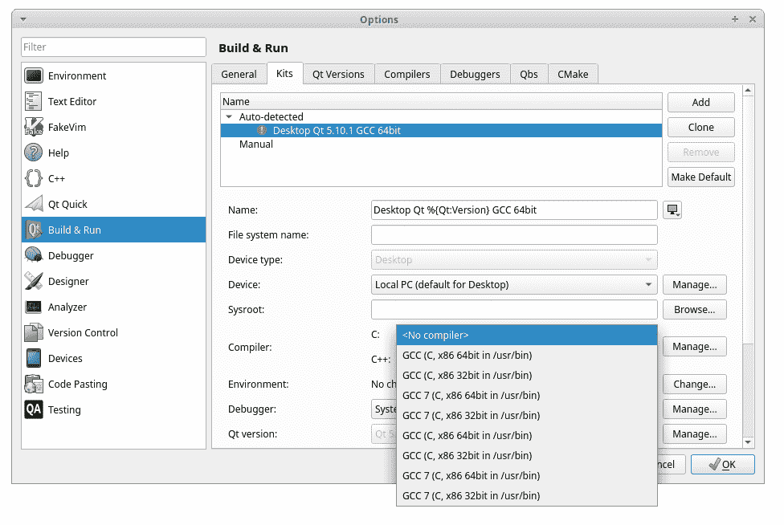
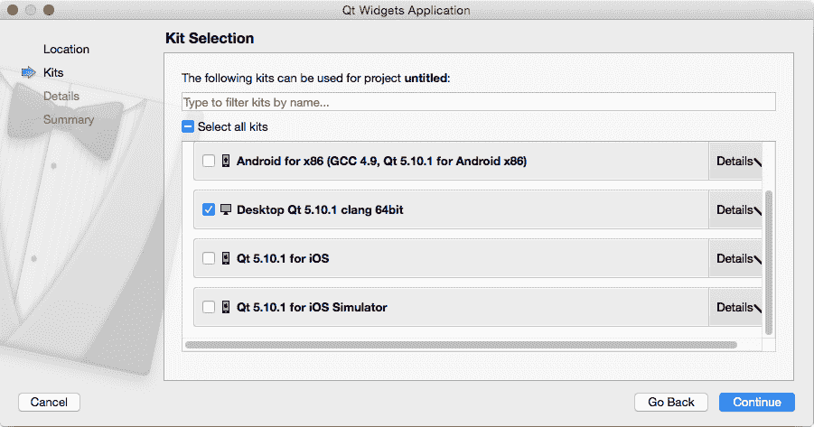
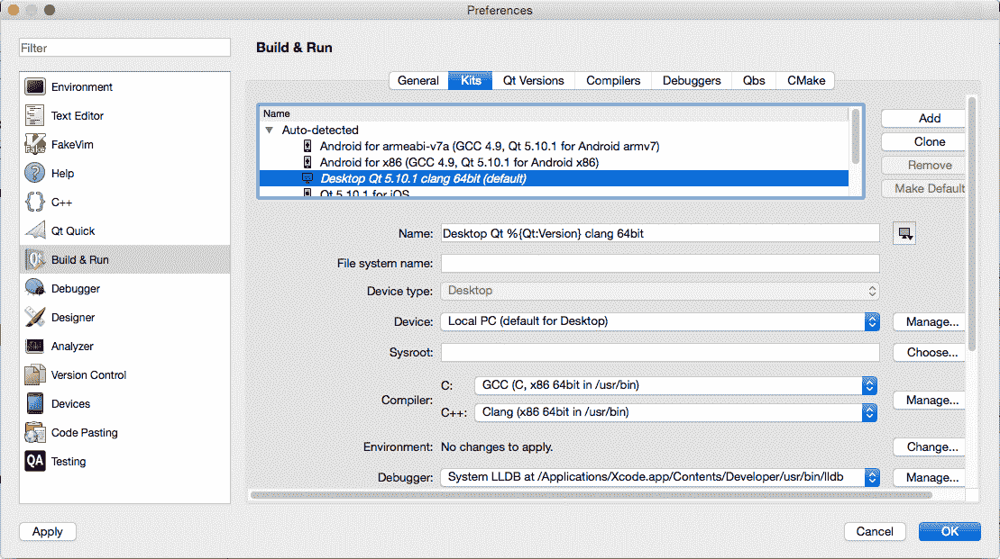
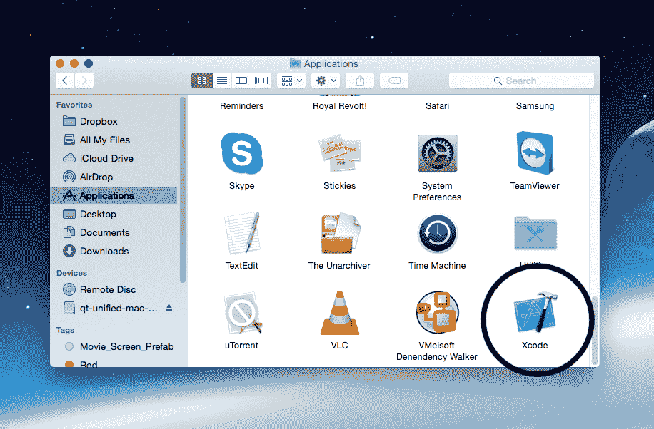
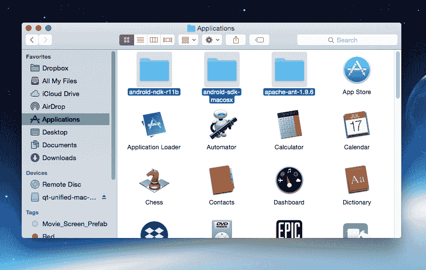

# 十五、跨平台开发

自从第一次发布以来，Qt 就以其跨平台能力而闻名。这也是创始人决定创建这个框架时的主要目标之一，早在它被**诺基亚**以及后来的**Qt 公司**接管之前。

在本章中，我们将涵盖以下主题:

*   编译程序
*   生成设置
*   部署到电脑平台
*   部署到移动平台

我们开始吧。

# 理解编译器

在本章中，我们将了解从 Qt 项目生成可执行文件的过程。这个过程就是我们所说的**编译**或者**构建**。用于此目的的工具称为**编译器**。在下一节中，我们将学习什么是编译器，以及如何使用它来为我们的 Qt 项目生成可执行文件。

# 什么是编译器？

当我们使用 Qt 或任何其他软件开发工具包开发一个应用程序时，我们经常不得不将我们的项目编译成可执行文件，但是当我们编译我们的项目时，实际上发生了什么呢？

一个**编译器**是一个把用高级编程语言或计算机指令编写的计算机代码转换成可以被计算机读取和执行的机器代码或低级形式的软件。根据您运行的操作系统和计算机处理器，这种低级机器代码有很大的不同，但是您不必担心它，因为编译器会为您转换它。

这意味着你所需要担心的是用人类可读的编程语言编写逻辑代码，并让编译器为你完成这项工作。理论上，通过使用不同的编译器，您应该能够将代码编译成可在不同操作系统和硬件上运行的可执行程序。我在这里理论上使用*这个词，是因为实际上这比仅仅使用不同的编译器要困难得多，你可能还需要实现支持目标平台的库。然而，Qt 已经为你处理了所有这些，所以你不必做额外的工作。*

 *在当前版本中，Qt 支持以下编译器:

*   **GNU 编译器集合(GCC)** : GCC 是 Linux 和 macOS 的编译器
*   **MinGW(Windows 的极简 GNU)**:MinGW 是 GCC 和 GNU Binutils(二进制实用程序)的原生软件端口，用于在 Windows 上开发应用
*   **微软 Visual C++ (MSVC)** : Qt 支持 MSVC 2013、2015、2017 三个版本构建 Windows 应用
*   **XCode** : XCode 是为 macOS 和 iOS 开发应用程序的开发人员使用的主要编译器
*   **Linux ICC(英特尔 C++ 编译器)** : Linux ICC 是英特尔针对 Linux 应用开发的一套 C 和 C++ 编译器的编译器
*   **Clang** : Clang 是 Windows、Linux 和 macOS 的 LLVM 编译器的 C、C++、Objective C 和 Objective C++ 前端
*   **Nim** : Nim 是 Windows、Linux 和 macOS 的 Nim 编译器
*   **QCC** : QCC 是为 QNX 操作系统编译 C++ 应用的接口

# 用 Make 构建自动化

在软件开发中， **Make** 是一个构建自动化工具，通过读取名为 **Makefiles** 的配置文件，指定如何派生目标平台，从而自动从源代码构建可执行程序和库。简而言之，Make 程序生成构建配置文件，并使用它们来告诉编译器在生成最终的可执行程序之前要做什么。

Qt 支持两种类型的 Make 程序:

*   **qmake** :是 Qt 团队开发的原生 make 程序。它在 Qt Creator 上工作得最好，我强烈建议将其用于所有 Qt 项目。
*   **CMake** :另一方面，虽然这是一个非常强大的构建系统，但是它并没有完成 qmake 专门为一个 Qt 项目所做的所有事情，比如:
    *   运行**元对象编译器** ( **主运行中心**)
    *   告诉编译器在哪里寻找 Qt 头
    *   告诉链接器在哪里寻找 Qt 库

为了成功编译一个 Qt 项目，你必须在 CMake 上手动执行前面的步骤。只有在下列情况下，才应该使用 CMake:

*   您正在处理一个非 Qt 项目，但是希望使用 Qt 创建器来编写代码

*   您正在处理一个需要复杂配置的大型项目，而 qmake 根本无法处理

*   你真的很喜欢用 CMake，而且你很清楚自己在做什么

Qt 在为您的项目选择合适的工具时非常灵活。它不仅仅坚持自己的构建系统和编译器。它给了开发者选择最适合他们项目的自由。

# 生成设置

在编译或构建项目之前，编译器需要知道几个细节才能继续。这些细节被称为**构建设置**，这是编译过程中非常重要的一个方面。在下一节中，我们将了解什么是构建设置，以及如何以准确的方式配置它们。

# Qt 项目(。专业)文件

我相信你已经知道 **Qt 项目文件**，因为我们在整本书中已经无数次提到它。一个`.pro`文件实际上是 *qmake* 用来构建你的应用程序、库或插件的项目文件。它包含所有的信息，比如到头文件和源文件的链接、项目所需的库、不同平台/环境的定制过程等等。一个简单的项目文件可能如下所示:

```cpp
QT += core gui widgets 

TARGET = MyApp 
TEMPLATE = app 

SOURCES +=  
        main.cpp  
        mainwindow.cpp 

HEADERS +=  
        mainwindow.h 

FORMS +=  
        mainwindow.ui 

RESOURCES +=  
    resource.qrc 
```

它只是告诉 qmake 哪些 Qt 模块应该包含在项目中，可执行程序的名称是什么，应用程序的类型是什么，最后是指向需要包含在项目中的头文件、源文件、表单声明文件和资源文件的链接。所有这些信息对于 qmake 生成配置文件和成功构建应用程序都是至关重要的。对于更复杂的项目，您可能希望针对不同的操作系统对项目进行不同的配置。这也可以在 Qt 项目文件中轻松完成。

To learn more about how you can configure your project differently for different operating systems, please refer to the following link: [http://doc.qt.io/qt-5/qmake-language.html#scopes-and-conditions.](http://doc.qt.io/qt-5/qmake-language.html#scopes-and-conditions)

# 评论

您可以在项目文件中添加自己的注释，提醒自己添加特定配置行的目的，这样您就不会忘记为什么在一段时间没有接触后添加了一行。注释以散列符号(`#`)开始，之后您可以编写任何内容，因为构建系统将简单地忽略整行文本。例如:

```cpp
# The following define makes your compiler emit warnings if you use 
# any feature of Qt which has been marked as deprecated (the exact warnings 
# depend on your compiler). Please consult the documentation of the 
# deprecated API in order to know how to port your code away from it. 
DEFINES += QT_DEPRECATED_WARNINGS 
```

您还可以添加虚线或使用空格来使您的评论与众不同:

```cpp
#------------------------------------------------- 
# 
# Project created by QtCreator 2018-02-18T01:59:44 
# 
#------------------------------------------------- 
```

# 模块、配置和定义

您可以向项目中添加不同的 Qt 模块、配置选项和定义。让我们看看如何实现这些。要添加其他模块，只需在`QT +=`后面添加`module`关键字，如下所示:

```cpp
QT += core gui sql printsupport charts multimedia 
```

或者您也可以在前面添加一个条件，以确定何时将特定模块添加到项目中:

```cpp
greaterThan(QT_MAJOR_VERSION, 4): QT += widgets 
```

您也可以将配置设置添加到项目中。例如，我们想特别要求编译器在编译我们的项目时遵循 2011 版的 C++ 规范(称为 C++ 11)，并使其成为多线程应用程序:

```cpp
CONFIG += qt c++ 11 thread
```

You must use `+=`, not `=`, or qmake will not be able to use Qt's configuration to determine the settings needed for your project. Alternatively, you can also use `-=` to remove a module, configuration, and definition from your project.

至于给我们的编译器添加定义(或变量)，我们使用`DEFINES`关键字，如下所示:

```cpp
DEFINES += QT_DEPRECATED_WARNINGS 
```

在编译您的项目之前，Qmake 将此变量的值作为编译器 C 预处理器宏(`-D`选项)添加。早期的定义告诉 Qt 编译器，如果您使用了被标记为不推荐使用的 Qt 的任何功能，就会发出警告。

# 平台特定设置

您可以为不同的平台设置不同的配置或设置，因为不是每个设置都能适合所有的用例。例如，如果我们想要为不同的操作系统包含不同的头路径，我们可以执行以下操作:

```cpp
win32:INCLUDEPATH += "C:/mylibs/extra headers" 
unix:INCLUDEPATH += "/home/user/extra headers" 
```

或者，您也可以将设置放在大括号中，其行为类似于编程语言中的`if`语句:

```cpp
win32 { 
    SOURCES += extra_code.cpp 
} 
```

You can check out all the settings you can use in your project file by visiting the following link: [http://doc.qt.io/qt-5/qmake-variable-reference.html.](http://doc.qt.io/qt-5/qmake-variable-reference.html)

# 部署到电脑平台

让我们继续学习如何在 Windows、Linux 和 macOS 等平台上部署我们的应用程序。

# Windows 操作系统

在本节中，我们将学习如何将我们的应用程序部署到不同的操作系统。尽管 Qt 开箱即用地支持所有主要平台，但为了使您的应用程序易于部署到所有平台，您可能需要设置一些配置。

我们要介绍的第一个操作系统是最常见的一个，微软视窗系统。

Starting from Qt 5.6, **Windows XP** is no longer supported by Qt.

可能有某些插件在您尝试部署的 Windows 版本上无法正常工作，所以在决定进行项目之前，请务必查看文档。然而，可以肯定地说，Qt 的大部分功能都将开箱即用。

默认情况下，当你把 MinGW 32 位编译器安装到你的电脑上时，它会和 Qt 一起出现。不幸的是，它默认不支持 64 位，除非你从源代码编译 Qt。如果你需要构建 64 位应用程序，你可以考虑在安装**微软 Visual Studio** 的同时安装 Qt 的 MSVC 版本。微软 Visual Studio 可从以下链接免费获取:[https://www.visualstudio.com/vs](https://www.visualstudio.com/vs)。

您可以在 Qt Creator 中设置编译器设置，方法是转到工具|选项，然后转到构建和运行类别，并选择工具包选项卡:


如您所见，有多个在不同编译器上运行的工具包，您可以在其中进行配置。默认情况下，Qt 已经配备了五个套件——一个用于安卓，一个用于 MinGW，三个用于 MSVC(2013、2015 和 2017 版本)。Qt 将自动检测这些编译器的存在，并相应地为您配置这些设置。

如果您没有安装 **Visual Studio** 或 **Android SDK** ，套件选项前面会出现一个带感叹号的红色图标。安装所需的编译器后，尝试重新启动 Qt Creator。它现在将检测新安装的编译器。你应该没有问题为 Windows 平台编译，因为 Qt 将为你处理其余的。我们将在另一节中更多地讨论安卓平台。

编译完应用程序后，打开安装 Qt 的文件夹。将相关的动态链接库文件复制到您的应用程序文件夹中，并将其打包，然后分发给您的用户。没有这些 DLL 文件，您的用户可能无法运行 Qt 应用程序。

For more information, please visit the following link: [http://doc.qt.io/qt-5/windows-deployment.html.](http://doc.qt.io/qt-5/windows-deployment.html)

至于为应用程序设置自定义图标，您必须将以下代码添加到您的项目(`.pro`)文件中:

```cpp
win32:RC_ICONS = myappico.ico 
```

前面的代码只在 Windows 平台上有效，这就是为什么我们要在它前面加上`win32`关键字。

# Linux 操作系统

**Linux** (或 GNU/Linux)一般被认为是主导云/服务器市场的主要操作系统。由于 Linux 不像 Windows 或 macOS 那样是一个单一的操作系统(Linux 是由不同的供应商以不同的 Linux 发行版的形式提供的，它们并不完全兼容)，所以开发人员很难构建他们的应用程序，并期望它们在不同的 Linux 发行版(**发行版**)上完美运行。但是，如果您在 Qt 上开发您的 Linux 应用程序，只要 Qt 库存在于目标系统上，它就很有可能在大多数发行版上工作，如果不是在所有主要发行版上的话。

Linux 上的默认工具包选择比 Windows 简单得多。由于 64 位应用程序已经成为大多数 Linux 发行版的主流和标准已经有一段时间了，所以我们在安装 Qt 时只需要包含 **GCC** 64 位编译器。安卓也有一个选项，但我们稍后会详细讨论:


如果您是第一次在 Qt Creator 上编译您的 Linux 应用程序，我非常肯定您会得到以下错误:


这是因为您没有安装构建 Linux 应用程序所需的相关工具，如 Make、GCC 和其他程序。

不同的 Linux 发行版安装程序的方法略有不同，但我不会在这里一一解释。在我的例子中，我使用的是一个 Ubuntu 发行版，所以我首先打开终端，输入以下命令来安装包含 Make 和 GCC 的`build-essential`包:

```cpp
sudo apt-get install build-essential 
```

前面的命令只适用于继承自 **Debian** 和 **Ubuntu** 的发行版，可能不适用于其他发行版，如 **Fedora** 、 **Gentoo** 、 **Slackware** 等。您应该搜索 Linux 发行版用来安装这些包的适当命令，如下图所示:


安装适当的软件包后，重新启动 Qt Creator 并转到工具|选项。然后，转到构建和运行类别，打开工具包选项卡。现在，您应该能够为桌面工具包选择 C 和 C++ 选项的编译器:



但是，在尝试再次编译时，您可能会得到另一个错误，显示无法找到-lGL:


这是因为 Qt 正在尝试寻找`OpenGL`库，在你的系统上找不到。这可以通过使用以下命令安装`Mesa development`库包来轻松解决:

```cpp
sudo apt-get install libgl1-mesa-dev 
```

同样，前面的命令只适用于 Debian 和 Ubuntu 变体。如果您没有运行 Debian 或 Ubuntu 分叉之一，请为您的 Linux 发行版寻找合适的命令:


一旦安装了这个包，您应该能够毫无问题地编译和运行您的 Qt 应用程序:


至于使用其他不太流行的编译器之一，如 **Linux ICC** 、 **Nim** 或 **QCC** ，您必须通过单击位于 Kits 界面右侧的添加按钮手动设置它，然后键入所有适当的设置以使其工作。大多数人不使用这些编译器，所以我们暂时跳过它们。

说到分发 Linux 应用程序，它比 Windows 或 macOS 复杂得多。这是因为 Linux 不是一个单一的操作系统，而是一堆不同的发行版，它们有自己的依赖关系和配置，这使得分发程序非常困难。

最安全的方法是静态编译你的程序，这有它自己的优缺点。你的程序将会变得非常庞大，这使得更新软件对那些网速慢的用户来说是一个很大的负担。除此之外，如果你没有做开源项目，没有 Qt 商业许可，Qt 许可也禁止你静态构建。要了解更多关于 Qt 许可选项的信息，请访问以下链接:[https://www1.qt.io/licensing-compariso.n.](https://www1.qt.io/licensing-comparison)

另一种方法是要求用户在运行应用程序之前安装正确版本的 Qt，但这将在用户方面产生大量问题，因为不是每个用户都非常精通技术，并且有耐心经历所有这些麻烦来避免依赖地狱。

因此，最好的方法是将 Qt 库与您的应用程序一起分发，就像我们在 Windows 平台上所做的那样。该库可能在某些 Linux 发行版上不起作用(很少出现这种情况，但有一点可能性)，但这可以通过为不同的发行版创建不同的安装程序来轻松克服，现在每个人都很高兴。

但是，出于安全原因，默认情况下，Linux 应用程序通常不会在其本地目录中查找其依赖项。您必须在 qmake 项目(`.pro`)文件的可执行文件`rpath`设置中使用`$ORIGIN`关键字:

```cpp
unix:!mac{ 
QMAKE_LFLAGS += -Wl,--rpath=$$ORIGIN 
QMAKE_RPATH= 
} 
```

设置`QMAKE_RPATH`将清除 Qt 库的默认`rpath`设置。这允许将 Qt 库与应用程序捆绑在一起。如果你想让`rpath`包含 Qt 库的路径，不要设置`QMAKE_RPATH`。

之后，只需将 Qt 安装文件夹中的所有库文件复制到应用程序的文件夹中，并从文件名中删除其次要版本号。例如，将`libQtCore.so.5.8.1`重命名为`libQtCore.so.5`，现在它应该能够被您的 Linux 应用程序检测到。

至于应用程序图标，默认情况下，您不能将任何图标应用于 Linux 应用程序，因为它不受支持。即使一些桌面环境如 KDE 和 GNOME 确实支持应用程序图标，但图标必须手动安装和配置，这对用户来说不是很方便。它甚至可能无法在某些用户的电脑上工作，因为每个发行版的工作方式与其他发行版略有不同。为应用程序设置图标的最佳方式是在安装过程中创建桌面快捷方式(symlink)，并将图标应用于快捷方式。

# 苹果电脑

在我看来， **macOS** 是软件界最单一最集中的操作系统。它不仅设计为仅在麦金塔电脑上运行，还要求您仅从苹果应用商店下载或购买软件。

毫无疑问，这让一些关心选择自由的人感到不安，但另一方面，这也意味着开发人员在应用程序构建和分发方面需要处理的问题更少了。

除此之外，macOS 应用程序的行为与 ZIP 存档非常相似，在 ZIP 存档中，每个应用程序都有自己的目录，其中携带了适当的库。因此，用户没有必要事先在他们的操作系统上安装 Qt 库，一切都开箱即用。

至于套件选择，macOS 的 Qt 支持安卓、64 位、iOS 和 iOS 模拟器的套件:



从 Qt 5.10 及更高版本开始，Qt 不再支持 32 位版本的 macOS。另外，Qt 不支持 PowerPC 上的 OS X；而且由于 Qt 内部使用 Cocoa，为 Carbon 构建也是不可能的，请注意这一点。

在编译您的 macOS 应用程序之前，请先从应用商店安装 Xcode，然后再继续。Xcode 是一个面向 macOS 的集成开发环境，包含一套由苹果开发的软件开发工具，用于为 macOS 和 iOS 开发软件。一旦你安装了 Xcode，Qt Creator 就会检测到它的存在，并自动为你设置编译器设置，这很棒:



一旦您编译了项目，生成的可执行程序就是一个单一的应用程序包，可以很容易地分发给您的用户。因为所有的库文件都打包在应用程序包中，所以它应该在用户的电脑上开箱即用。

为 Mac 设置应用程序图标是一项相当简单的任务。只需将以下代码行添加到您的项目(`.pro`)文件中，我们就可以开始了:

```cpp
ICON = myapp.icns 
```

请注意，图标格式是`.icns`，而不是我们通常用于 Windows 的`.ico`。

# 部署到移动平台

除了 Windows、Linux 和 macOS 等平台，移动平台确实同样重要。有许多开发人员希望将其应用程序部署到移动平台上。让我们看看是怎么做到的。我们将覆盖两大平台，它们是，iOS 和安卓。

# ios

在 iOS 上部署 Qt 应用程序真的很简单很容易。就像我们之前对 macOS 所做的一样，您需要首先在您的开发 PC 上安装 Xcode:



然后，重启 Qt Creator。它现在应该检测到 Xcode 的存在，然后会自动为您设置编译器设置:


之后，只要插上你的 iPhone，点击运行按钮！

在 Qt 上构建 iOS 应用程序真的很容易。然而，分发它们不是。这是因为 iOS 是一个非常封闭的生态系统，就像一个有围墙的花园。您不仅需要在苹果注册为应用程序开发人员，还需要对您的 iOS 应用程序进行代码签名，然后才能将其分发给您的用户。如果你想为 iOS 构建应用程序，你就无法避免这些步骤。

您可以通过访问以下链接了解更多信息:[https://developer.apple.com/app-store/submissions.](https://developer.apple.com/app-store/submissions)

# 机器人

尽管安卓是一个基于 Linux 的操作系统，但与你在电脑上运行的 Linux 平台相比，它是非常不同的。要在 Qt 上构建安卓应用程序，您必须首先将**安卓软件开发工具包**、**安卓 NDK** 和 **Apache ANT** 安装到您的开发电脑上，无论您运行的是 Windows、Linux 还是 macOS:



在 Qt 上构建安卓应用时，这三个包是必不可少的。一旦它们全部安装完毕，重启 Qt Creator，瞧，它现在应该已经检测到它们的存在，并且构建设置现在已经被自动设置:


最后，你可以用 Qt Creator 打开`AndroidManifect.xml`文件来配置你的安卓应用:


您可以在这里设置所有内容，例如包名、版本代码、SDK 版本、应用程序图标、权限等等。

与 iOS 相比，安卓是一个开放的系统，因此在将应用程序分发给用户之前，您不需要做任何事情。然而，如果你想在谷歌 Play 商店发布你的应用程序，你可以选择注册成为谷歌游戏开发者。

# 摘要

在这一章中，我们学习了如何为不同的平台编译和分发我们的 Qt 应用程序，例如 Windows、Linux、macOS、安卓和 iOS。在下一章中，我们将学习可以节省开发时间的不同调试方法。让我们来看看！*