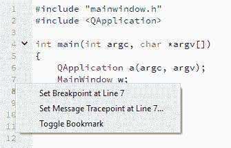
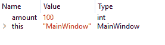

# 十六、测试和调试

我们在阅读编程相关的教程或文章时，经常会看到 *debug* 这个词。但是你知道调试是什么意思吗？编程术语中的*错误*指的是计算机程序中的错误或缺陷，导致软件无法正常运行，这通常会导致不正确的输出甚至崩溃。

在本章中，我们将涵盖以下主题，并学习如何调试我们的 Qt 项目:

*   调试技术
*   Qt 支持的调试器
*   单元测试

我们开始吧。

# 调试技术

技术问题在开发过程中一直存在。为了解决这些问题，我们需要找出所有这些问题，并在向用户发布我们的应用程序之前解决它们，以免影响公司/团队的声誉。用于查找技术问题的方法称为调试。在这一节中，我们将看看专业人员用来确保他们的程序可靠和高质量的常见调试技术。

# 识别问题

无论编程语言或平台如何，在调试程序时，最重要的是知道代码的哪一部分导致了问题。有几种方法可以识别有问题的代码:

*   询问用户 bug 发生的时间点；例如，按下了哪个按钮，导致崩溃的步骤是什么，等等。
*   注释掉部分代码，然后再次构建并运行程序，检查问题是否仍然存在。如果仍然如此，继续注释掉更多的代码，直到找到有问题的代码行。
*   通过设置数据断点，使用内置调试器检查目标函数中的变量更改。您可以很容易地发现您的某个变量是否已更改为意外的值，或者某个对象指针是否已成为未定义的指针。
*   确保安装程序中为用户提供的所有库的版本号与项目中使用的版本号相匹配。

# 使用 QDebug 打印变量

您也可以使用`QDebug`类将变量值打印到应用程序输出窗口。`QDebug`和标准库中的`std::cout`非常相似，但是使用`QDebug`的好处是因为它是 Qt 的一部分，所以它支持 Qt 类的开箱即用，并且它能够在不需要任何转换的情况下输出它的值。

要启用`QDebug`，我们必须首先包含它的表头:

```cpp
#include <QDebug> 
```

之后，我们可以调用`qDebug()`将变量打印到应用输出窗口:

```cpp
int amount = 100; 
qDebug() << "You have obtained" << amount << "apples!"; 
```

结果将如下所示:


通过使用`QDebug`，我们将能够检查我们的功能是否正常运行。检查完问题后，您可以注释掉包含`qDebug()`的特定代码行。

# 设置断点

设置断点是调试程序的另一个好方法。当您在 Qt Creator 中右键单击脚本的行号时，您将获得一个包含三个选项的弹出菜单，如下图所示:



第一个选项叫做在第行设置断点...，它允许您在脚本的特定行设置断点。创建断点后，行号旁边会出现一个红点图标:


第二个选项叫做在第行设置消息跟踪点...，当程序到达该特定代码行时，它会打印一条消息。创建断点后，行号旁边会出现一个眼睛图标:


第三个选项是切换书签，它允许您为自己的参考设置书签。让我们创建一个名为`test()`的函数来尝试断点:

```cpp
void MainWindow::test() 
{ 
   int amount = 100; 
   amount -= 10; 
   qDebug() << "You have obtained" << amount << "apples!"; 
} 
```

之后，我们在`MainWindow`构造函数中调用`test()`函数:

```cpp
MainWindow::MainWindow(QWidget *parent) : 
   QMainWindow(parent), 
   ui(new Ui::MainWindow) 
{ 
   ui->setupUi(this); 
   test(); 
} 
```

然后，按下位于 Qt 创建器窗口左下方的开始调试按钮:


您可能会收到如下错误消息:


在这种情况下，请确保项目工具包链接了调试器。如果这个错误仍然发生，请关闭您的 Qt 创建器，转到您的项目文件夹并删除`.pro.user`文件。之后，用 Qt Creator 打开你的项目。Qt Creator 将再次重新配置您的项目，现在调试模式应该可以工作了。

让我们在代码中添加两个断点并运行它。一旦我们的程序启动，我们将看到一个黄色箭头出现在第一个红点的顶部:


这意味着调试器已在第一个断点处停止。位于 Qt Creator 右侧的“局部变量和表达式”窗口现在将在此显示变量及其值和类型:



在上图中，您可以看到该值仍然为 100，因为此时减操作尚未运行。我们需要做的下一件事是点击位于您的 Qt Creator 底部的堆栈窗口顶部的“单步执行”按钮:


之后，调试器将移动到下一个断点，在这里我们可以看到该值如预期的那样减少到 90:


您可以使用此方法轻松检查您的应用程序。要删除断点，您只需再次单击红点图标。

请注意，您必须在调试模式下运行此程序。这是因为在调试模式下编译时，附加的调试符号将嵌入到您的应用程序或库中，使您的调试器能够访问二进制源代码中的信息，例如标识符、变量和例程的名称。这也是为什么如果在调试模式下编译，应用程序或库的文件大小会大得多的原因。

# Qt 支持的调试器

Qt 支持不同类型的调试器。根据您为项目运行的平台和编译器，所使用的调试器也会有所不同。以下是 Qt 通常支持的调试器列表:

*   **windows(minw):**gdb(GNU 调试器)
*   **Windows(MSVC):**CDB(Windows 调试工具)
*   **macOS** : LLDB (LLVM 调试器)，FSF·GDB(实验)
*   **Linux** : GDB，LLDB(实验)
*   **Unix** (FreeBSD、OpenBSD 等)。):GDB
*   **Android** : GDB
*   **iOS** : LLDB

# 电脑调试

有了 **GDB (GNU 调试器)，**如果你在 Windows 上使用 MinGW 编译器，就不需要任何手动设置，因为它通常伴随着你的 Qt 安装。如果您正在运行其他操作系统，如 Linux，您可能需要在将其与 Qt Creator 链接之前手动安装它。Qt Creator 检测到 GDB 的存在，并自动将其与您的项目链接。如果没有，您可以很容易地找到位于您的 Qt 目录中的 GDB 可执行文件，并自己链接它。

**CDB(Windows 调试工具)**另一方面，需要在你的 Windows 机器上手动安装。请注意，Qt 不支持 Visual Studio 的内置调试器。因此，您需要通过在安装 windows SDK 时选择一个名为 Windows 调试工具的可选组件来单独安装 CDB 调试器。Qt Creator 通常也会识别 CDB 的存在，并将其放在调试器选项页面下的调试器列表中。您可以转到工具|选项|生成和运行|调试器来查找设置，如下图所示:


# 安卓设备调试

安卓设备的调试比个人电脑稍微复杂一些。您必须安装安卓开发所需的所有软件包，如 JDK(版本 6 或更高版本)、安卓软件开发工具包和安卓 NDK。然后还需要 Windows 平台上的 Android Debug Bridge (ADB) 驱动才能启用 USB 调试，因为 Windows 上默认的 USB 驱动不允许调试。

# macOS 和 iOS 的调试

至于 macOS 和 iOS，使用的调试器是 **LLDB (LLVM Debugger)** ，默认自带 Xcode。Qt Creator 还会识别它的存在，并自动将其与您的项目链接。

每个调试器都有一点不同，在 Qt Creator 上的行为可能会有所不同。如果您熟悉这些工具并知道自己在做什么，还可以在它们各自的 IDE (Visual Studio、XCode 等)上运行非 GDB 调试器。

如果需要向项目中添加其他调试器，可以转到工具|选项|生成和运行|工具包，然后单击克隆复制现有工具包。然后，在调试器选项卡下，单击添加按钮添加新的调试器选项:


在“名称”字段中，键入调试器的描述性名称，以便您可以轻松记住它的用途。然后，在“路径”字段中指定调试器二进制文件的路径，以便 Qt Creator 知道在您启动调试过程时要运行哪个可执行文件。除此之外，Qt 创建者使用类型和版本字段来标识调试器版本的类型。此外，Qt Creator 还展示了将在 ABIs 领域的嵌入式设备上使用的 ABI 版本。

To learn more about the in-depth information on how to set up different debuggers in Qt, please visit the following link:
[http://doc.qt.io/qtcreator/creator-debugger-engines.html.](http://doc.qt.io/qtcreator/creator-debugger-engines.html)

# 单元测试

单元测试是对应用程序中的单个模块、类或方法进行测试的自动化过程。单元测试在开发周期的早期发现问题。这既包括程序员实现中的错误，也包括单元规范中的缺陷或缺失部分。

# Qt 中的单元测试

Qt 自带内置的单元测试模块，我们可以通过在我们的项目文件(`.pro`)中添加`testlib`关键字来使用:

```cpp
QT += core gui testlib 
```

之后，在我们的源代码中添加以下标题:

```cpp
#include <QtTest/QtTest> 
```

然后，我们可以开始测试我们的代码。我们必须将我们的测试函数声明为私有槽。除此之外，类还必须从`QOBject`类继承。例如，我创建了两个名为`testString()`和`testGui()`的文本函数，如下所示:

```cpp
private slots: 
   void testString(); 
   void testGui(); 
```

函数定义如下所示:

```cpp
void MainWindow::testString() 
{ 
   QString text = "Testing"; 
   QVERIFY(text.toUpper() == "TESTING"); 
} 

void MainWindow::testGui() 
{ 
   QTest::keyClicks(ui->lineEdit, "testing gui"); 
   QCOMPARE(ui->lineEdit->text(), QString("testing gui")); 
} 
```

我们使用了`QTest`类提供的一些宏，如`QVERIFY`、`QCOMPARE`等，来评估作为参数传递的表达式。如果表达式的计算结果为`true`，测试函数将继续执行。否则，描述失败的消息被附加到测试日志中，测试函数停止执行。

我们在应用中也使用了`QTest::keyClicks()`来模拟鼠标点击。在前面的示例中，我们模拟了在主窗口小部件上单击线编辑小部件。然后，我们向行编辑输入一行文本，并使用`QCOMPARE`宏测试文本是否已经正确插入行编辑小部件。如果发生任何错误，Qt 将在应用程序输出窗口中向我们显示问题。

然后，注释掉我们的`main()`函数，改用`QTEST_MAIN()`函数开始测试我们的`MainWindow`类:

```cpp
/*int main(int argc, char *argv[]) 
{ 
   QApplication a(argc, argv); 
   MainWindow w; 
   w.show(); 

   return a.exec(); 
}*/ 
QTEST_MAIN(MainWindow) 
```

如果我们现在构建并运行我们的项目，我们应该会得到如下类似的结果:

```cpp
********* Start testing of MainWindow ********* 
Config: Using QtTest library 5.9.1, Qt 5.9.1 (i386-little_endian-ilp32 shared (dynamic) debug build; by GCC 5.3.0) 
PASS   : MainWindow::initTestCase() 
PASS   : MainWindow::_q_showIfNotHidden() 
PASS   : MainWindow::testString() 
PASS   : MainWindow::testGui() 
PASS   : MainWindow::cleanupTestCase() 
Totals: 5 passed, 0 failed, 0 skipped, 0 blacklisted, 880ms 
********* Finished testing of MainWindow ********* 
```

还有很多宏可以用来测试应用程序。

For more information, please visit the following link:
[http://doc.qt.io/qt-5/qtest.html#macros](http://doc.qt.io/qt-5/qtest.html#macros)

# 摘要

在本章中，我们学习了如何通过使用多种调试技术来识别我们的 Qt 项目中的技术问题。除此之外，我们还了解了 Qt 在不同操作系统上支持的不同调试器。最后，我们还学习了如何通过单元测试来自动化一些调试步骤。

就这样！我们已经到了这本书的结尾。希望这本书对学习如何使用 Qt 从头开始构建自己的应用程序很有用。你可以在 GitHub 上寻找所有的源代码。祝你一切顺利！