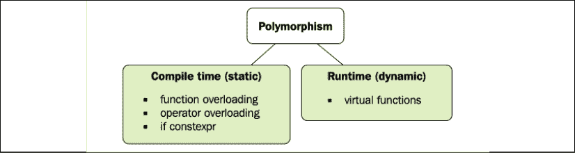
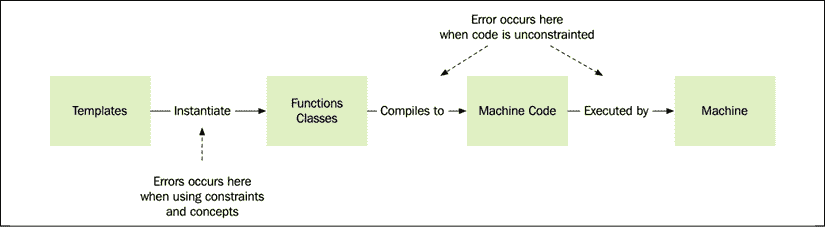

# eight

# 编译时编程

C++ 能够在编译时计算表达式，这意味着程序执行时已经计算出了值。尽管自 C++ 98 以来元编程已经成为可能，但由于其复杂的基于模板的语法，它最初非常复杂。随着`constexpr`、`if constexpr`以及最近的 C++ *概念*的引入，元编程变得更加类似于编写常规代码。

本章将向您简要介绍 C++ 中的编译时表达式计算，以及它们如何用于优化。

我们将涵盖以下主题:

*   使用 C++ 模板的元编程以及如何在 C++ 20 中编写缩写的函数模板
*   在编译时使用类型特征检查和操作类型
*   由编译器计算的常量表达式
*   C++ 20 概念以及如何使用它们来为我们的模板参数添加约束
*   元编程的一些真实例子

我们将首先介绍模板元编程。

# 模板元编程简介

当编写常规的 C++ 代码时，它最终被转换成机器代码。**元编程**另一方面，允许我们编写将自身转换为常规 C++ 代码的代码。更广义地说，元编程是一种我们编写转换或生成其他代码的代码的技术。通过使用元编程，我们可以避免复制基于我们使用的数据类型仅略有不同的代码，或者我们可以通过预先计算最终程序执行前已知的值来最小化运行时成本。没有什么能阻止我们使用其他语言生成 C++ 代码。例如，我们可以通过广泛使用预处理器宏或者编写 Python 脚本来为我们生成或修改 C++ 文件来进行元编程:

<figure class="mediaobject"></figure>

图 8.1:元程序生成常规的 C++ 代码，这些代码稍后将被编译成机器代码

尽管我们可以使用任何语言来生成常规代码，但是使用 C++，我们有特权使用**模板**和**常量表达式**在语言本身内编写元程序。C++ 编译器可以执行我们的元程序，并生成常规的 C++ 代码，编译器将进一步将其转换为机器代码。

使用模板和常量表达式直接在 C++ 中进行元编程比使用其他技术有很多优势:

*   我们不必解析 C++ 代码(编译器会为我们解析)。
*   使用 C++ 模板元编程时，对于分析和操作 C++ 类型有很好的支持。
*   元程序的代码和常规的非泛型代码混合在 C++ 源代码中。有时，这可能会使您很难理解在运行时和编译时分别执行了哪些部分。然而，总的来说，这是使 C++ 元编程有效使用的一个非常重要的方面。

在其最简单和最常见的形式中，C++ 中的模板元编程用于生成接受不同类型的函数、值和类。当编译器使用模板生成类或函数时，模板被称为**实例化**。常量表达式由编译器进行**评估**以生成常量值:

<figure class="mediaobject"></figure>

图 8.2:c++ 中的编译时编程。将生成常规 C++ 代码的元程序是用 C++ 本身编写的。

这是一个有些简化的视图；没有什么说 C++ 编译器需要以这种方式执行转换。然而，考虑在这两个不同的阶段执行 C++ 元编程是很有用的:

*   初始阶段，模板和常量表达式生成函数、类和常量值的常规 C++ 代码。这个阶段通常被称为**恒定评估**。
*   第二阶段，编译器最终将常规 C++ 代码编译成机器代码。

本章后面，我将把元编程生成的 C++ 代码称为*常规 C++ 代码*。

当使用元编程时，重要的是要记住它的主要用例是创建优秀的库，从而对用户代码隐藏复杂的构造/优化。请注意，无论元程序的代码内部有多复杂，重要的是将其隐藏在一个好的界面后面，以便用户代码库易于阅读和使用。

让我们继续，创建我们的第一个生成函数和类的模板。

## 创建模板

让我们来看看一个简单的`pow()`函数和一个`Rectangle`类。通过使用**类型模板参数**，`pow()`函数和`Rectangle`类可以用于任何整数或浮点类型。没有模板，我们将不得不为每个基本类型创建一个单独的函数/类。

编写元编程代码可能非常复杂；更简单的方法是想象预期的常规 C++ 代码是什么样子的。

下面是一个简单函数模板的例子:

```cpp
// pow_n accepts any number type 
template <typename T> 
auto pow_n(const T& v, int n) { 
  auto product = T{1}; 
  for (int i = 0; i < n; ++ i) { 
    product *= v; 
  }
  return product; 
} 
```

使用此函数将生成一个返回类型取决于模板参数类型的函数:

```cpp
auto x = pow_n<float>(2.0f, 3); // x is a float 
auto y = pow_n<int>(3, 3);      // y is an int 
```

显式模板参数类型(在这种情况下为`float`和`int`)可以(最好)省略，编译器可以自己解决这个问题。这个机制叫做**模板参数演绎**，因为编译器*演绎*模板参数。以下示例将导致与前面所示相同的模板实例化:

```cpp
auto x = pow_n(2.0f, 3);  // x is a float 
auto y = pow_n(3, 3);     // y is an int 
```

相应地，简单的类模板可以定义如下:

```cpp
// Rectangle can be of any type 
template <typename T> 
class Rectangle { 
public: 
  Rectangle(T x, T y, T w, T h) : x_{x}, y_{y}, w_{w}, h_{h} {} 
  auto area() const { return w_ * h_; } 
  auto width() const { return w_; } 
  auto height() const { return h_; } 
private:
  T x_{}, y_{}, w_{}, h_{}; 
}; 
```

当使用类模板时，我们可以显式指定模板应该为其生成代码的类型，如下所示:

```cpp
auto r1 = Rectangle<float>{2.0f, 2.0f, 4.0f, 4.0f}; 
```

但是也有可能受益于**类模板参数推演** ( **CTAD** )，让编译器为我们推演参数类型。以下代码将实例化一个`Rectangle<int>`:

```cpp
auto r2 = Rectangle{-2, -2, 4, 4};   // Rectangle<int> 
```

然后，函数模板可以接受一个`Rectangle`对象，其中使用任意类型`T`定义矩形尺寸，如下所示:

```cpp
template <typename T> 
auto is_square(const Rectangle<T>& r) { 
  return r.width() == r.height(); 
} 
```

类型模板参数是最常见的模板参数。接下来，您将看到如何使用数字参数而不是类型参数。

## 使用整数作为模板参数

除了一般类型之外，模板也可以是其他类型，例如整型和浮点型。在下面的例子中，我们将在模板中使用一个`int`，这意味着编译器将为作为模板参数传递的每个唯一整数生成一个新函数:

```cpp
template <int N, typename T> 
auto const_pow_n(const T& v) { 
  auto product = T{1}; 
  for (int i = 0; i < N; ++ i) { 
    product *= v; 
  }
  return product; 
} 
```

下面的代码将强制编译器实例化两个不同的函数:一个将值平方，一个将值立方:

```cpp
auto x2 = const_pow_n<2>(4.0f);   // Square
auto x3 = const_pow_n<3>(4.0f);   // Cube 
```

注意模板参数`N`和功能参数`v`的区别。对于`N`的每个值，编译器都会生成一个新函数。但是，`v`作为常规参数传递，因此不会产生新的函数。

## 提供模板的专门化

默认情况下，每当我们使用带有新参数的模板时，编译器都会生成常规的 C++ 代码。但是也可以为模板参数的某些值提供自定义实现。比方说，我们想要提供我们的`const_pow_n()`函数的常规 C++ 代码，当它与整数一起使用时，`N`的值是`2`。我们可以为这种情况编写一个**模板专门化**，如下所示:

```cpp
template<>
auto const_pow_n<2, int>(const int& v) {
  return v * v;
} 
```

对于函数模板，我们需要在编写特殊化时固定*所有*模板参数。例如，不可能只指定`N`的值，而让类型参数`T`不指定。但是，对于类模板，可以只指定模板参数的一个子集。这叫**偏模板特殊化**。编译器会先选择最具体的模板。

我们不能将部分模板专门化应用于函数的原因是函数可以重载(而类不能)。如果我们被允许混合重载和部分专门化，这将是非常难以理解的。

## 编译器如何处理模板函数

当编译器处理一个模板函数时，它用扩展的模板参数构造一个正则函数。以下代码将使编译器生成常规函数，因为它使用模板:

```cpp
auto a = pow_n(42, 3);          // 1\. Generate new function
auto b = pow_n(42.f, 2);        // 2\. Generate new function
auto c = pow_n(17.f, 5);        // 3.
auto d = const_pow_n<2>(42.f);  // 4\. Generate new function
auto e = const_pow_n<2>(99.f);  // 5.
auto f = const_pow_n<3>(42.f);  // 6\. Generate new function 
```

因此，当编译时，与常规函数不同，编译器将为每一组唯一的*模板参数*生成新的函数。这意味着它相当于手动创建四个不同的函数，如下所示:

```cpp
auto pow_n__float(float v, int n) {/*...*/}   // Used by: 1
auto pow_n__int(int v, int n) {/*...*/}       // Used by: 2 and 3
auto const_pow_n__2_float (float v) {/*...*/} // Used by: 4 and 5
auto const_pow_n__3_float(float v) {/*...*/}  // Used by: 6 
```

这对于理解元编程是如何工作的很重要。模板代码生成非模板化的 C++ 代码，然后作为常规代码执行。如果生成的 C++ 代码不编译，将在编译时捕获错误。

## 缩写函数模板

C++ 20 引入了一种新的缩写语法来编写函数模板，它采用了与泛型 lambdas 相同的风格。通过对函数参数类型使用`auto`，我们实际上是在创建一个函数模板，而不是一个常规函数。回想一下我们最初的`pow_n()`模板，它是这样声明的:

```cpp
template <typename T>
auto pow_n(const T& v, int n) { 
  // ... 
```

使用缩写的函数模板语法，我们可以改为使用`auto`来声明它:

```cpp
auto pow_n(const auto& v, int n) { // Declares a function template
  // ... 
```

这两个版本的区别在于缩写版本没有变量`v`类型的显式占位符。由于我们在实现中使用了占位符`T`，因此该代码将不幸无法编译:

```cpp
auto pow_n(const auto& v, int n) {
  auto product = T{1}; // Error: What is T?
  for (int i = 0; i < n; ++ i) { 
    product *= v; 
  } 
  return product;
} 
```

要解决这个问题，我们可以使用`decltype`说明符。

## 接收带有 decltype 的变量的类型

`decltype`说明符用于检索变量的类型，并在显式类型名称不可用时使用。

有时，我们需要一个类型的显式占位符，但是没有可用的占位符，只有变量名可用。这发生在我们之前实现`pow_n()`函数时，使用缩写的函数模板语法。

让我们看一个通过修复我们的`pow_n()`实现来使用`decltype`的例子:

```cpp
auto pow_n(const auto& v, int n) {
  auto product = decltype(v){1};   // Instead of T{1}
  for (int i = 0; i < n; ++ i) { product *= v; } 
  return product;
} 
```

虽然这段代码编译并运行，但是我们有点幸运，因为`v`的类型实际上是一个`const`引用，而不是我们想要的变量`product`的类型。我们可以通过使用从左到右的声明样式来解决这个问题。但是，试图重写产品被定义为看起来相同的东西的界限揭示了一个问题:

```cpp
auto pow_n(const auto& v, int n) {
  decltype(v) product{1};
  for (int i = 0; i < n; ++ i) { product *= v; } // Error!
  return product;
} 
```

现在，我们得到了一个编译错误，因为`product`是一个`const`引用，可能没有被赋值。

我们真正想要的是在定义变量`product`时，从`v`的类型中去掉`const`引用。为此，我们可以使用名为`std::remove_cvref`的便捷模板。我们对`product`的定义应该是这样的:

```cpp
typename std::remove_cvref<decltype(v)>::type product{1}; 
```

唷！在这种特殊情况下，坚持我们最初的`template <typename T>`语法可能会更容易。但是现在，您已经学会了如何将`std::remove_cvref`与`decltype`一起使用，这是编写通用 C++ 代码时的常见模式。

在 C++ 20 之前，在泛型 lambdas 的体中常见到`decltype`。然而，现在可以通过向通用 lambdas 添加显式模板参数来避免相当不方便的`decltype`:

```cpp
auto pow_n = []<class T>(const T& v, int n) { 
  auto product = T{1};
  for (int i = 0; i < n; ++ i) { product *= v; }
  return product;
}; 
```

在λ的定义中，我们编写`<class T>`是为了获得可以在函数体内部使用的参数类型的标识符。

可能需要一些时间来习惯使用`decltype`和实用程序来操作类型。可能`std::remove_cvref`刚开始看起来有点神秘。这是一个来自`<type_traits>`标题的模板，我们将在下一节进一步研究。

# 类型特征

在进行模板元编程时，您可能经常会发现自己处于这样的情况:您需要在编译时处理的类型的信息。在编写常规(非泛型)C++ 代码时，我们使用我们完全了解的具体类型，但在编写模板时情况并非如此；在编译器实例化模板之前，具体的类型是不确定的。类型特征让我们提取模板正在处理的类型的信息，以便生成高效且正确的 C++ 代码。

为了提取关于模板类型的信息，标准库提供了一个类型特征库，可在`<type_traits>`头中获得。所有类型特征都是在编译时评估的。

## 类型特征类别

类型性状有两类:

*   以布尔值或整数值形式返回类型信息的类型特征。
*   返回新类型的类型特征。这些类型特征也被称为元功能。

第一类根据输入返回`true`或`false`，以`_v`(值的缩写)结束。

`_v`后缀是在 C++ 17 中添加的。如果你的库实现没有为类型特征提供`_v`后缀，那么你可以使用旧版本`std::is_floating_point<float>::value`。换句话说，去掉`_v`分机，在最后加上`::value`。

下面是一些使用基本类型的类型特征进行编译时类型检查的例子:

```cpp
auto same_type = std::is_same_v<uint8_t, unsigned char>; 
auto is_float_or_double = std::is_floating_point_v<decltype(3.f)>; 
```

类型特征也可以用于用户定义的类型:

```cpp
class Planet {};
class Mars : public Planet {};
class Sun {};
static_assert(std::is_base_of_v<Planet, Mars>);
static_assert(!std::is_base_of_v<Planet, Sun>); 
```

第二类类型特征返回一个新类型，以`_t`(类型的简称)结束。这些类型特征转换(或元函数)在处理指针和引用时非常有用:

```cpp
// Examples of type traits which transforms types
using value_type = std::remove_pointer_t<int*>;  // -> int
using ptr_type = std::add_pointer_t<float>;      // -> float* 
```

我们前面使用的类型特征`std::remove_cvref`也是这个范畴的一部分。它从类型中移除引用部分(如果有)以及`const`和`volatile`限定符。`std::remove_cvref`在 C++ 20 中引入。在此之前，通常使用`std::decay`来完成这项任务。

## 使用类型特征

正如已经提到的一样，所有类型特征都是在编译时评估的。例如，这个函数，如果值大于或等于零，则返回`1`，否则返回`-1`，对于无符号整数，可以立即返回`1`，如下所示:

```cpp
template<typename T>
auto sign_func(T v) -> int {
  if (std::is_unsigned_v<T>) { 
    return 1; 
  } 
  return v < 0 ? -1 : 1; 
} 
```

由于类型特征是在编译时评估的，当分别用无符号整数和有符号整数调用时，编译器将生成下表中所示的代码:

<colgroup><col> <col></colgroup> 
| 与无符号整数一起使用... | ...生成的函数: |
| 

```cpp
auto unsigned_v = uint32_t{42};
auto sign = sign_func(unsigned_v); 
```

 | 

```cpp
int sign_func(uint32_t v) {
  if (true) { 
    return 1; 
  } 
  return v < 0 ? -1 : 1; 
} 
```

 |
| 与有符号整数一起使用... | ...生成的函数: |
| 

```cpp
auto signed_v = int32_t{-42}; 
auto sign = sign_func(signed_v); 
```

 | 

```cpp
int sign_func(int32_t v) {
  if (false) { 
    return 1; 
  } 
  return v < 0 ? -1 : 1; 
} 
```

 |

表 8.1:根据我们传递给 sign_func()的类型(在左列)，编译器会生成不同的函数(在右列)。

接下来，我们来谈谈常量表达式。

# 用常量表达式编程

前缀为`constexpr`关键字的表达式告诉编译器，表达式应该在编译时计算:

```cpp
constexpr auto v = 43 + 12; // Constant expression 
```

`constexpr`关键字也可以和函数一起使用。在这种情况下，它告诉编译器，如果允许编译时评估的所有条件都满足，那么某个函数将在编译时进行评估。否则，它将在运行时执行，就像常规函数一样。

A `constexpr`功能有几个限制；不允许执行以下操作:

*   处理局部静态变量
*   处理`thread_local`变量
*   调用任何本身不是`constexpr`函数的函数

使用`constexpr`关键字，编写编译时评估的函数就像编写常规函数一样简单，因为它的参数是常规参数，而不是模板参数。

考虑以下`constexpr`功能:

```cpp
constexpr auto sum(int x, int y, int z) { return x + y + z; } 
```

让我们这样调用函数:

```cpp
constexpr auto value = sum(3, 4, 5); 
```

由于`sum()`的结果在常量表达式中使用，并且其所有参数都可以在编译时确定，编译器将生成以下常规 C++ 代码:

```cpp
const auto value = 12; 
```

然后像往常一样，将其编译成机器代码。换句话说，编译器计算一个`constexpr`函数，并生成计算结果的常规 C++ 代码。

如果我们改为调用`sum()`并将结果存储在标有`constexpr`的变量*而不是*中，编译器*可能会在编译时*(最有可能)评估`sum()`:

```cpp
auto value = sum(3, 4, 5); // value is not constexpr 
```

总之，如果一个`constexpr`函数是从常量表达式中调用的，并且它的所有参数都是常量表达式，那么它保证会在编译时被求值。

## 运行时上下文中的 Constexpr 函数

在前面的例子中，的求和值(`3`、`4`、`5`)在编译时是编译器已知的，但是`constexpr`函数如何处理那些直到运行时才知道值的变量呢？如前所述，`constexpr`是编译器的一个指示器，在特定条件下，可以在编译时对函数进行求值。如果变量的值在运行时被调用之前是未知的，它们将像常规函数一样被计算。

在下面的例子中，`x`、`y`和`z`的值是在运行时由用户提供的，因此编译器不可能在编译时计算总和:

```cpp
int x, y, z; 
std::cin >> x >> y >> z;      // Get user input
auto value = sum(x, y, z); 
```

如果我们根本不打算在运行时使用`sum()`，我们可以通过使其成为即时函数来禁止这种使用。

## 使用 consteval 声明即时函数

可以在运行时或编译时调用`constexpr`函数。如果我们想限制某个函数的使用，使其只在编译时被调用，我们可以通过使用关键字`consteval`而不是`constexpr`来实现。让我们假设我们想要在运行时禁止`sum()`的所有使用。使用 C++ 20，我们可以用下面的代码做到这一点:

```cpp
consteval auto sum(int x, int y, int z) { return x + y + z; } 
```

使用`consteval`声明的函数被称为**立即函数**，并且只能产生常数。如果要调用`sum()`，需要从常量表达式内部调用，否则编译会失败:

```cpp
constexpr auto s = sum(1, 2, 3); // OK
auto x = 10;
auto s = sum(x, 2, 3);           // Error, expression is not const 
```

如果我们试图将`sum()`用于编译时未知的参数，编译器也会抱怨:

```cpp
int x, y, z; 
std::cin >> x >> y >> z; 
constexpr auto s = sum(x, y, z); // Error 
```

接下来我们讨论`if` `constexpr`语句。

## if constexpr 语句

`if constexpr`语句允许模板函数在编译时评估同一函数中的不同范围(也称为编译时多态性)。看看下面的例子，一个名为`speak()`的函数模板试图根据类型来区分成员函数:

```cpp
struct Bear { auto roar() const { std::cout << "roar\n"; } }; 
struct Duck { auto quack() const { std::cout << "quack\n"; } }; 
template <typename Animal> 
auto speak(const Animal& a) { 
  if (std::is_same_v<Animal, Bear>) { a.roar(); } 
  else if (std::is_same_v<Animal, Duck>) { a.quack(); } 
} 
```

假设我们编译了以下几行:

```cpp
auto bear = Bear{};
speak(bear); 
```

编译器随后将生成一个`speak()`函数，类似如下:

```cpp
auto speak(const Bear& a) {
  if (true) { a.roar(); }
  else if (false) { a.quack(); } // This line will not compile
} 
```

如您所见，编译器将保留对成员函数`quack()`的调用，这将导致编译失败，因为`Bear`不包含`quack()`成员函数。由于`else if (false)`声明，即使`quack()`成员函数永远不会被执行，也会发生这种情况。

为了使`speak()`函数编译，无论类型如何，我们都需要通知编译器，如果`if`语句是`false`，我们希望完全忽略范围。顺势而为，这正是`if constexpr`所做的。

以下是我们如何编写能够同时处理`Bear`和`Duck`的`speak()`函数，即使它们不共享一个公共接口:

```cpp
template <typename Animal> 
auto speak(const Animal& a) { 
  if constexpr (std::is_same_v<Animal, Bear>) { a.roar(); } 
  else if constexpr (std::is_same_v<Animal, Duck>) { a.quack(); } 
} 
```

当`Animal == Bear`调用`speak()`时，如下所示:

```cpp
auto bear = Bear{};
speak(bear); 
```

编译器生成以下函数:

```cpp
auto speak(const Bear& animal) { animal.roar(); } 
```

当`Animal == Duck`、调用`speak()`时，如下所示:

```cpp
auto duck = Duck{};
speak(duck); 
```

编译器生成以下函数:

```cpp
auto speak(const Duck& animal) { animal.quack(); } 
```

如果用任何其他原语类型调用`speak()`，如`Animal == int`，如下所示:

```cpp
speak(42); 
```

编译器生成一个空函数:

```cpp
auto speak(const int& animal) {} 
```

与常规的`if`语句不同，编译器现在能够生成多个不同的函数:一个使用`Bear`，另一个使用`Duck`，如果类型既不是`Bear`也不是`Duck`，则生成最后一个。如果我们想让第三种情况成为编译错误，我们可以通过添加一个带有`static_assert`的`else`情况来实现:

```cpp
template <typename Animal> 
auto speak(const Animal& a) { 
  if constexpr (std::is_same_v<Animal, Bear>) { a.roar(); } 
  else if constexpr (std::is_same_v<Animal, Duck>) { a.quack(); }
  else { static_assert(false); } // Trig compilation error
} 
```

稍后我们将更多地讨论`static_assert`的用处。

如前所述，这里使用`constexpr`的方式可以称为编译时多态性。那么，它与运行时多态性有什么关系呢？

### 与运行时多态性的比较

作为的旁注，如果我们是用传统的运行时多态性实现前面的例子，使用继承和虚函数来实现相同的功能，那么实现将如下所示:

```cpp
struct AnimalBase {
  virtual ~AnimalBase() {}
  virtual auto speak() const -> void {}
};
struct Bear : public AnimalBase {
  auto roar() const { std::cout << "roar\n"; } 
  auto speak() const -> void override { roar(); }
};
struct Duck : public AnimalBase {
  auto quack() const { std::cout << "quack\n"; }
  auto speak() const -> void override { quack(); }
}; 
auto speak(const AnimalBase& a) { 
  a.speak();
} 
```

必须使用指针或引用来访问对象，并且在*运行时*推断类型，这导致与编译时版本相比的性能损失，在编译时版本中，当应用程序执行时，一切都是可用的。下图显示了 C++ 中两种类型多态性的区别:

<figure class="mediaobject"></figure>

图 8.3:虚函数支持运行时多态性，而函数/运算符重载和 if constexpr 支持编译时多态性。

现在，我们将继续看看如何将`if constexpr`用于更有用的事情。

### 使用 if constexpr 的通用模数函数示例

这个例子将向您展示如何使用`if constexpr`来区分运算符和全局函数。在 C++ 中，`%`运算符用于获取整数的模，而`std::fmod()`用于浮点类型。假设我们想要概括我们的代码库并创建一个名为`generic_mod()`的通用模数函数。

如果我们用常规的`if`语句来实现`generic_mod()`，如下所示:

```cpp
template <typename T> 
auto generic_mod(const T& v, const T& n) -> T {
  assert(n != 0);
  if (std::is_floating_point_v<T>) { return std::fmod(v, n); }
  else { return v % n; }
} 
```

如果使用`T == float`调用，它将失败，因为编译器将生成以下函数，这将无法编译:

```cpp
auto generic_mod(const float& v, const float& n) -> float {
  assert(n != 0);
  if (true) { return std::fmod(v, n); }
  else { return v % n; } // Will not compile
} 
```

即使应用程序无法到达它，编译器也会生成不符合`float`的行`return v % n;`。编译器不在乎应用程序无法访问它——因为它无法为它生成程序集，所以它将无法编译。

如同在前面的例子中，我们将将`if`语句更改为`if constexpr`语句:

```cpp
template <typename T> 
auto generic_mod(const T& v, const T& n) -> T { 
  assert(n != 0);
  if constexpr (std::is_floating_point_v<T>) {
    return std::fmod(v, n);
  } else {                 // If T is a floating point,
    return v % n;          // this code is eradicated
  }
} 
```

现在，当用浮点类型调用该函数时，它将生成以下函数，其中`v % n`操作被根除:

```cpp
auto generic_mod(const float& v, const float& n) -> float { 
  assert(n != 0);
  return std::fmod(v, n); 
} 
```

运行时`assert()`告诉我们，如果第二个参数为 0，我们就不能调用这个函数。

## 编译时检查编程错误

Assert 语句是一个简单但非常强大的工具，用于验证代码库中调用者和被调用者之间的不变量和契约，(参见*第 2 章*、*基本 C++ 技术*。)使用`assert()`可以在执行程序时检查编程错误。但是我们要始终努力尽早发现错误，如果有一个常量表达式，在使用`static_assert()`编译程序的时候就能捕捉到编程错误。

### 使用断言在运行时触发错误

查看`pow_n()`的模板化版本。假设我们想防止用负指数(即`n`值)来调用它。为了防止在运行时版本中出现这种情况，其中`n`是常规参数，我们可以添加一个运行时断言:

```cpp
template <typename T> 
auto pow_n(const T& v, int n) { 
  assert(n >= 0); // Only works for positive numbers 
  auto product = T{1}; 
  for (int i = 0; i < n; ++ i) {
    product *= v; 
  }
  return product; 
} 
```

如果调用函数时`n`为负值，程序会中断，并通知我们应该从哪里开始寻找 bug。这很好，但是如果我们能够在编译时而不是运行时跟踪这个错误，那就更好了。

### 使用 static_assert 在编译时触发错误

如果我们对模板版本做同样的操作，我们可以利用`static_assert()`。与常规断言不同的是，`static_assert()`声明将拒绝编译，如果条件不满足的话。所以，中断构建比在运行时中断程序要好。在下面的例子中，如果模板参数`N`是负数，`static_assert()`将阻止函数编译:

```cpp
template <int N, typename T>
auto const_pow_n(const T& v) {
  static_assert(N >= 0, "N must be positive"); 
  auto product = T{1}; 
  for (int i = 0; i < N; ++ i) { 
    product *= v; 
  } 
  return product; 
}
auto x = const_pow_n<5>(2);  // Compiles, N is positive
auto y = const_pow_n<-1>(2); // Does not compile, N is negative 
```

换句话说，有了正则变量，编译器只知道类型，不知道包含什么。使用编译时值，编译器知道类型和值。这允许编译器计算其他编译时值。

我们可以(应该)使用`unsigned int`来代替使用`int`并断言它是非负的。在本例中，我们仅使用签名的`int`来演示`assert()`和`static_assert()`的使用。

使用编译时断言是在编译时检查约束的一种方式。这是一个简单但非常有用的工具。在过去的几年里，对编译时编程的支持在 C++ 中取得了一些非常令人兴奋的进展。现在，我们将继续讨论 C++ 20 最大的特性之一，它将约束检查提升到了一个新的水平。

# 制约因素和概念

到目前为止，我们已经介绍了许多编写 C++ 元程序的重要技术。您已经看到了模板如何在类型特征库的出色支持下为我们生成具体的类和函数。此外，您已经看到了`constexpr`、`consteval`和`if constexpr`的使用如何帮助我们将计算从运行时转移到编译时。这样，我们可以在编译时检测编程错误，并以更低的运行时成本编写程序。这很好，但是在用 C++ 编写和使用泛型代码时，仍然有很大的改进空间。我们尚未解决的一些问题包括:

1.  接口太通用了。当使用任意类型的模板时，很难知道该类型的需求是什么。如果我们只检查模板接口，这使得模板很难使用。相反，我们必须依赖文档或者深入挖掘模板的实现。
2.  编译器很晚才捕捉到类型错误。编译器最终会在编译常规 C++ 代码时检查类型，但是错误消息通常很难解释。相反，我们希望在实例化阶段捕获类型错误。
3.  不受约束的模板参数使元编程变得困难。到目前为止，我们在本章中编写的代码使用了不受约束的模板参数，除了一些静态断言。对于小示例来说，这是可以管理的，但是如果我们能够访问更有意义的类型，就更容易编写元程序并对其进行推理，就像类型系统帮助我们编写正确的非泛型 C++ 代码一样。
4.  条件代码生成(编译时多态性)可以使用`if constexpr`来执行，但是它很快变得难以大规模读写。

正如您将在本节中看到的，C++ 概念通过引入两个新的关键词:`concept`和`requires`，以优雅而有效的方式解决了这些问题。在探索约束和概念之前，我们将花一些时间考虑没有概念的模板元编程的缺点。然后，我们将使用约束和概念来加强我们的代码。

## 点 2D 模板的无约束版本

假设我们正在编写一个处理二维坐标系的程序。我们有一个类模板，用`x`和`y`坐标表示一个点，如下所示:

```cpp
template <typename T>
class Point2D {
public:
  Point2D(T x, T y) : x_{x}, y_{y} {}
  auto x() { return x_; }
  auto y() { return y_; }
  // ...
private:
  T x_{};
  T y_{};
}; 
```

假设我们需要找到两点之间的欧几里得距离 **p1** 和 **p2** ，如下图所示:

<figure class="mediaobject"></figure>

图 8.4:寻找 p1 和 p2 之间的欧几里得距离

为了计算距离，我们实现了一个取两点的自由函数，并使用了毕达哥拉斯定理(实际的数学在这里不太重要):

```cpp
auto dist(auto p1, auto p2) {
  auto a = p1.x() - p2.x();
  auto b = p1.y() - p2.y();
  return std::sqrt(a*a + b*b);
} 
```

一个小的测试程序验证了我们可以用整数实例化`Point2D`模板并计算两点之间的距离:

```cpp
int main() {
  auto p1 = Point2D{2, 2};
  auto p2 = Point2D{6, 5};
  auto d = dist(p1, p2);
  std::cout << d;
} 
```

这段代码编译运行良好，输出`5`到控制台。

### 通用接口和错误消息

在继续之前，让我们绕一小段路，反思一下功能模板`dist()`。假设我们无法轻松访问`dist()`的实现，只能读取界面:

```cpp
auto dist(auto p1, auto p2) // Interface part 
```

退货类型和`p1`、`p2`的类型能说什么？实际上没什么——因为`p1`和`p2`完全是*不受约束的*，所以`dist()`的界面并没有给我们透露什么。然而，这并不意味着我们可以将任何东西传递给`dist()`，因为最终，生成的常规 C++ 代码必须编译。

例如，如果我们尝试用两个整数而不是像这样的`Point2D`对象来实例化我们的`dist()`模板:

```cpp
 auto d = dist(3, 4); 
```

编译器会很乐意生成一个常规的 C++ 函数，类似于这样:

```cpp
auto dist(int p1, int p2) {
  auto a = p1.x() – p2.x();  // Will generate an error:
  auto b = p1.y() – p2.y();  // int does not have x() and y()
  return std::sqrt(a*a + b*b);
} 
```

稍后编译器检查常规 C++ 代码时，将会发现错误。当试图用两个整数实例化`dist()`时，Clang 生成以下错误消息:

```cpp
error: member reference base type 'int' is not a structure or union
auto a = p1.x() – p2.y(); 
```

这个错误消息指的是`dist()`的*实现*，这个功能`dist()`的调用者不需要知道。这是一个微不足道的例子，但是试图解释由于从复杂的模板库中向模板提供错误类型而导致的错误消息可能是一个真正的挑战。

更糟糕的是，如果我们真的运气不好，我们会通过提供完全没有意义的类型来完成整个编译。在这种情况下，我们用`const char*`实例化一个`Point2D`:

```cpp
int main() {
  auto from = Point2D{"2.0", "2.0"}; // Ouch!
  auto to = Point2D{"6.0", "5.0"};   // Point2D<const char*>
  auto d = dist(from, to);
  std::cout << d;
} 
```

它编译并运行，但是输出可能不是我们所期望的。我们希望在过程的早期捕捉到这些类型的错误，这可以通过使用如下图所示的约束和概念来实现:

<figure class="mediaobject"></figure>

图 8.5:类型错误可以在实例化阶段使用约束和概念来捕获

稍后，您将看到如何使这段代码更具表现力，以便更容易正确使用，更难误用。我们将通过在代码中添加概念和约束来实现这一点。但是首先，我将快速概述如何定义和使用概念。

## 约束和概念的句法概述

本节是对约束和概念的简短介绍。我们不会在本书中完全涵盖它们，但我会为您提供足够的材料来提高生产力。

### 定义新概念

借助你已经熟悉的类型特征，定义新概念很简单。以下示例使用关键字`concept`定义概念`FloatingPoint`:

```cpp
template <typename T>
concept FloatingPoint = std::is_floating_point_v<T>; 
```

赋值表达式的右边是我们可以指定类型`T`的约束的地方。也可以使用`||`(逻辑或)和`&&`(逻辑与)组合多个约束。以下示例使用`||`将浮点和积分组合成一个`Number`概念:

```cpp
template <typename T>
concept Number = FloatingPoint<T> || std::is_integral_v<T>; 
```

您会注意到，也可以使用右侧已经定义的概念来构建概念。标准库包含一个`<concepts>`头，它定义了很多有用的概念，比如`std::floating_point`(我们应该使用它，而不是定义我们自己的)。

此外，我们可以使用`requires`关键字来添加一组应该添加到我们的概念定义中的语句。例如，这是范围库中概念`std::range`的定义:

```cpp
template<typename T>
concept range = requires(T& t) {
  ranges::begin(t);
  ranges::end(t);
}; 
```

简而言之，这个概念表明范围是我们可以传递给`std::ranges::begin()`和`std::ranges::end()`的东西。

可以写比这更复杂的`requires`子句，稍后你会看到更多。

### 用概念约束类型

我们可以使用`requires`关键字为模板参数类型添加约束。以下模板只能使用`std::integral`概念用整型参数实例化:

```cpp
template <typename T>
requires std::integral<T>
auto mod(T v, T n) { 
  return v % n;
} 
```

我们可以在定义类模板时使用相同的技术:

```cpp
template <typename T>
requires std::integral<T>
struct Foo {
  T value;
}; 
```

另一种语法允许我们用更简洁的方式来写，直接用以下概念替换`typename`:

```cpp
template <std::integral T>
auto mod(T v, T n) { 
  return v % n;
} 
```

此表单也可以与类模板一起使用:

```cpp
template <std::integral T>
struct Foo {
  T value;
}; 
```

如果我们想在定义函数模板时使用缩写的函数模板形式，可以在`auto`关键字前添加概念:

```cpp
auto mod(std::integral auto v, std::integral auto n) {
  return v % n;
} 
```

返回类型也可以通过使用概念来约束:

```cpp
std::integral auto mod(std::integral auto v, std::integral auto n) {
  return v % n;
} 
```

如您所见，有许多方法可以指定相同的内容。结合概念的缩写形式确实使读写约束函数模板变得容易。C++ 概念的另一个强大特性是能够以一种清晰和表达的方式重载函数。

### 函数重载

回想一下我们之前使用`if constexpr`实现的`generic_mod()`功能。它看起来像这样:

```cpp
template <typename T> 
auto generic_mod(T v, T n) -> T { 
  if constexpr (std::is_floating_point_v<T>) {
    return std::fmod(v, n);
  } else {
    return v % n;
  } 
} 
```

通过使用概念，我们可以重载一个函数模板，就像我们写一个普通的 C++ 函数一样:

```cpp
template <std::integral T>
auto generic_mod(T v, T n) -> T {             // Integral version
  return v % n;
}
template <std::floating_point T>
auto generic_mod(T v, T n) -> T {             // Floating point version
  return std::fmod(v, n);
} 
```

有了您对约束和概念的新知识，是时候使用`Point2D`模板回到我们的例子，看看如何改进它了。

## 点 2D 模板的受约束版本

现在知道了如何定义和使用概念，让我们通过编写更好版本的模板`Point2D`和`dist()`来使用它们。请记住，我们的目标是获得一个更具表现力的界面，并让不相关的参数类型导致的错误出现在模板实例化中。

我们将从创建算术类型的概念开始:

```cpp
template <typename T>
concept Arithmetic = std::is_arithmetic_v<T>; 
```

接下来，我们将创建一个名为`Point`的概念，定义一个点应该具有成员函数`x()`和`y()`返回相同的类型，并且该类型应该支持算术运算:

```cpp
template <typename T>
concept Point = requires(T p) {
  requires std::is_same_v<decltype(p.x()), decltype(p.y())>;
  requires Arithmetic<decltype(p.x())>;
}; 
```

这个概念现在可以通过显式约束使`dist()`的界面变得更好:

```cpp
auto dist(Point auto p1, Point auto p2) {
  // Same as before ... 
```

这是开始看起来非常有希望，所以让我们也给我们的返回类型添加一个约束。虽然`Point2D`可能是用整型实例化的，但是我们知道距离可以是一个浮点数。标准库中的概念`std::floating_point`非常适合于此。以下是`dist()`的最终版本:

```cpp
std::floating_point auto dist(Point auto p1, Point auto p2) { 
  auto a = p1.x() - p2.x();
  auto b = p1.y() - p2.y();
  return std::sqrt(a*a + b*b);
} 
```

我们的接口现在更具描述性，当我们试图用错误的参数类型实例化它时，我们将在实例化阶段而不是最终编译阶段得到错误。

我们现在应该对我们的`Point2D`模板做同样的事情，以避免有人不小心用它不打算处理的类型实例化它。例如，我们希望防止有人用`const char*`实例化`Point2D`类，如下所示:

```cpp
auto p1 = Point2D{"2.0", "2.0"}; // How can we prevent this? 
```

我们已经创建了`Arithmetic`概念，我们可以在这里使用它在`Point2D`的模板参数中放置约束。我们是这样做的:

```cpp
template <Arithmetic T> // T is now constrained!
class Point2D {
public:
  Point2D(T x, T y) : x_{x}, y_{y} {}
  auto x() { return x_; }
  auto y() { return y_; }
  // ...
private:
  T x_{};
  T y_{};
}; 
```

我们唯一需要改变的是指定类型`T`应该支持由概念`Arithmetic`指定的操作。当编译器试图实例化一个`Point2D<const char*>`类时，试图使用`const char*`实例化一个模板将会产生一个直接的错误消息。

## 向代码中添加约束

概念的有用性远远超出了模板元编程。这是 C++ 20 的一个基本特性，它改变了我们使用概念而不是具体类型或用`auto`声明的完全不受约束的变量来编写和推理代码的方式。

一个概念非常类似于一个类型(如`int`、`float`或`Plot2D<int>`)。类型和概念都指定了一组支持的对象操作。通过检查类型或概念，我们可以确定成员函数如何构造、移动、比较和访问某些对象，等等。然而，一个很大的区别是，一个概念并没有说明一个对象是如何存储在内存中的，而一个类型除了提供它所支持的一组操作之外，还提供了这些信息。例如，我们可以在类型上使用`sizeof`运算符，但不能在概念上使用。

有了概念和`auto`，我们可以声明变量，而不需要拼写出确切的类型，但仍然可以用我们的代码非常清楚地表达意图。看看下面的代码片段:

```cpp
const auto& v = get_by_id(42); // What can I do with v? 
```

大多数时候，当我们偶然发现这样的代码时，我们感兴趣的是知道我们可以在`v`上执行什么操作，而不是知道确切的类型。在`auto`前面加上一个概念就不同了:

```cpp
const Person auto& v = get_by_id(42);
v.get_name(); 
```

几乎在所有我们可以使用关键字`auto`的上下文中都可以使用概念:局部变量、返回值、函数参数等等。在我们的代码中使用概念使更容易阅读。在撰写本书时(2020 年年中)，目前还没有对已建立的 C++ IDEs 中的概念的额外支持。然而，代码完成只是时间问题，基于概念的其他有用的编辑器功能也将可用，并使 C++ 编码更加有趣和安全。

## 标准库中的概念

C++ 20 还包含了一个带有预定义概念的新`<concepts>`头。你已经看到了的一些动作。许多概念都是基于类型特征库中的特征。然而，有几个基本概念以前没有用特征来表达。其中最重要的是`std::equality_comparable`、`std::totally_ordered`等比较概念，以及`std::movable`、`std::copyable`、`std::regular`、`std::semiregular`等客体概念。我们不会在标准库中的概念上花费更多的时间，但是在开始定义自己的概念之前，请记住记住它们。在正确的一般性水平上定义概念并不容易，在现有概念的基础上定义新概念通常是明智的。

让我们通过看一些 C++ 中元编程的真实例子来结束这一章。

# 元编程的真实例子

高级元编程可以看起来非常学术，所以为了展示它的有用性，让我们看一些例子，这些例子不仅展示了元编程的语法，还展示了它如何在实践中使用。

## 示例 1:创建通用安全转换函数

当在 C++ 中的数据类型之间进行转换时，有许多不同的方法会出错:

*   如果转换为位长度较低的整数类型，可能会丢失一个值。
*   如果将负值转换为无符号整数，可能会丢失一个值。
*   如果从指针转换到除`uintptr_t`以外的任何整数，正确的地址可能会变得不正确。这是因为 C++ 只保证`uintptr_t`是唯一可以保留地址的整数类型。
*   如果从`double`到`float`选角，结果可能是`int`如果`double`数值太大`float`无法扣压。
*   如果用`static_cast()`在指针之间进行转换，如果类型没有共享一个公共基类，我们可能会得到未定义的行为。

为了使我们的代码更加健壮，我们可以创建一个通用的检查转换函数，该函数在调试模式下验证我们的转换，并在发布模式下尽可能快地执行我们的转换。

根据要转换的类型，会执行不同的检查。如果我们试图在未验证的类型之间转换，它将不会编译。

这些是`safe_cast()`要处理的情况:

*   **同类型**:很明显，如果我们铸造的是同类型，我们只需要返回输入值。
*   **指向指针**的指针:如果在指针之间进行转换，`safe_cast()`在调试模式下执行动态转换，以验证其是否可转换。
*   **双精度到浮点** : `safe_cast()`在从`double`到`float`进行铸造时接受精度损失，但有一个例外——如果从`double`到`float`进行铸造，双精度可能太大，浮动无法处理结果。
*   **算术到算术**:如果在算术类型之间转换，值会转换回其原始类型，以验证精度没有丢失。
*   **指向非指针的指针**:如果从指针转换为非指针类型，`safe_cast()`验证目标类型是`uintptr_t`或`intptr_t`，这是唯一保证保存地址的整数类型。

在任何其他情况下，`safe_cast()`函数都无法编译。

让我们看看如何实现这一点。我们从在`constexpr`布尔中获取关于我们的强制转换操作的信息开始。它们之所以是`constexpr`布尔人而不是`const`布尔人，是因为我们稍后将在`if constexpr`表达式中使用它们，这需要`constexpr`条件:

```cpp
template <typename T> constexpr auto make_false() { return false; }
template <typename Dst, typename Src> 
auto safe_cast(const Src& v) -> Dst{ 
  using namespace std;
  constexpr auto is_same_type = is_same_v<Src, Dst>;
  constexpr auto is_pointer_to_pointer =  
    is_pointer_v<Src> && is_pointer_v<Dst>; 
  constexpr auto is_float_to_float =  
    is_floating_point_v<Src> && is_floating_point_v<Dst>; 
  constexpr auto is_number_to_number =  
    is_arithmetic_v<Src> && is_arithmetic_v<Dst>; 
  constexpr auto is_intptr_to_ptr = 
    (is_same_v<uintptr_t,Src> || is_same_v<intptr_t,Src>)
    && is_pointer_v<Dst>;
  constexpr auto is_ptr_to_intptr =
    is_pointer_v<Src> &&
    (is_same_v<uintptr_t,Dst> || is_same_v<intptr_t,Dst>); 
```

因此，既然已经拥有了关于作为`constexpr`布尔人的强制转换的所有必要信息，我们在编译时断言我们可以执行强制转换。如前所述，如果条件不满足，则`static_assert()`将无法编译(不同于常规断言，后者在运行时验证条件)。

注意`if` / `else`链条末端`static_assert()`和`make_false<T>`的用法。我们不能仅仅输入`static_assert(false)`，因为那样会阻止`safe_cast()`编译；相反，我们利用模板功能`make_false<T>()`将生成延迟到需要的时候。

当执行实际的`static_cast()`时，我们转换回原始类型，并使用常规运行时`assert()`验证结果是否等于未测试的参数。这样，我们可以确保`static_cast()`没有丢失任何数据:

```cpp
 if constexpr(is_same_type) { 
    return v; 
  }
  else if constexpr(is_intptr_to_ptr || is_ptr_to_intptr){
    return reinterpret_cast<Dst>(v); 
  } 
  else if constexpr(is_pointer_to_pointer) { 
    assert(dynamic_cast<Dst>(v) != nullptr); 
    return static_cast<Dst>(v); 
  } 
  else if constexpr (is_float_to_float) { 
    auto casted = static_cast<Dst>(v); 
    auto casted_back = static_cast<Src>(v); 
    assert(!isnan(casted_back) && !isinf(casted_back)); 
    return casted; 
  }  
  else if constexpr (is_number_to_number) { 
    auto casted = static_cast<Dst>(v); 
    auto casted_back = static_cast<Src>(casted); 
    assert(casted == casted_back); 
    return casted; 
  } 
  else {
    static_assert(make_false<Src>(),"CastError");
    return Dst{}; // This can never happen, 
    // the static_assert should have failed 
  }
} 
```

注意我们如何使用`if constexpr`来有条件地编译函数。如果我们使用常规的`if`语句，函数将无法编译:

```cpp
auto x = safe_cast<int>(42.0f); 
```

这是因为编译器会尝试编译下面一行`dynamic_cast`只接受指针:

```cpp
// type To is an integer
assert(dynamic_cast<int>(v) != nullptr); // Does not compile 
```

但是，由于有了`if constexpr`和`safe_cast<int>(42.0f)`构造，以下函数可以正确编译:

```cpp
auto safe_cast(const float& v) -> int {
  constexpr auto is_same_type = false;
  constexpr auto is_pointer_to_pointer = false;
  constexpr auto is_float_to_float = false;
  constexpr auto is_number_to_number = true;
  constexpr auto is_intptr_to_ptr = false;
  constexpr auto is_ptr_to_intptr = false
  if constexpr(is_same_type) { /* Eradicated */ }
  else if constexpr(is_intptr_to_ptr||is_ptr_to_intptr){/* Eradicated */}
  else if constexpr(is_pointer_to_pointer) {/* Eradicated */}
  else if constexpr(is_float_to_float) {/* Eradicated */}
  else if constexpr(is_number_to_number) {
    auto casted = static_cast<int>(v);
    auto casted_back = static_cast<float>(casted);
    assert(casted == casted_back);
    return casted;
  }
  else { /* Eradicated */ }
} 
```

正如你所看到的，除了`is_number_to_number`子句之外，`if constexpr`语句之间的所有东西都被完全消除了，允许函数编译。

## 示例 2:编译时的哈希字符串

假设我们有一个资源系统，由识别位图的无序字符串映射组成。如果已经加载了位图，系统返回加载的位图；否则，它会加载位图并返回它:

```cpp
// External function which loads a bitmap from the filesystem
auto load_bitmap_from_filesystem(const char* path) -> Bitmap {/* ... */}
// Bitmap cache 
auto get_bitmap_resource(const std::string& path) -> const Bitmap& { 
  // Static storage of all loaded bitmaps
  static auto loaded = std::unordered_map<std::string, Bitmap>{};
  // If the bitmap is already in loaded_bitmaps, return it
  if (loaded.count(path) > 0) {
    return loaded.at(path);
  } 
  // The bitmap isn't already loaded, load and return it 
  auto bitmap = load_bitmap_from_filesystem(path.c_str());
  loaded.emplace(path, std::move(bitmap)); 
  return loaded.at(path); 
} 
```

然后，在需要位图资源的地方使用位图缓存:

*   如果尚未加载，`get_bitmap_resource()`功能将加载并返回
*   如果已经加载到其他地方，`get_bitmap_resource()`将简单地返回加载的函数

因此，不管先执行哪一个绘制函数，第二个函数都不必从磁盘加载位图:

```cpp
auto draw_something() {
  const auto& bm = get_bitmap_resource("my_bitmap.png");
  draw_bitmap(bm);
}
auto draw_something_again() {
  const auto& bm = get_bitmap_resource("my_bitmap.png");
  draw_bitmap(bm);
} 
```

由于我们使用的是无序映射，所以每当我们检查位图资源时，都需要计算哈希值。现在，您将看到我们如何通过将计算转移到编译时来优化运行时代码。

### 编译时散列和计算的优点

我们将尝试解决的问题是，每次执行第`get_bitmap_resource("my_bitmap.png")`行时，应用程序都会在运行时计算字符串`"my_bitmap.png"`的散列和。我们想要做的是在编译时执行这个计算，这样当应用程序执行时，散列和已经被计算出来了。换句话说，正如您已经学会了在编译时使用元编程来生成函数和类一样，我们现在将让它在编译时生成散列和。

你可能已经得出结论，这是一个所谓的*微优化*:计算一个小字符串的散列和完全不会影响应用程序的性能，因为这是一个非常小的操作。这大概是完全正确的；这只是如何将计算从运行时转移到编译时的一个示例，可能还有其他情况会对性能产生重大影响。

顺便说一下，当为弱硬件编写软件时，字符串散列是一种纯粹的奢侈，但是在编译时散列字符串在任何平台上都给了我们这种奢侈，因为一切都是在编译时计算的。

### 实现并验证编译时哈希函数

为了使编译器能够在编译时计算散列和，我们重写了`hash_function()`，使其将原始的空终止`char`字符串作为像`std::string`这样的高级类的参数，该类在编译时无法计算。现在，我们可以将`hash_function()`标记为`constexpr`:

```cpp
constexpr auto hash_function(const char* str) -> size_t {
  auto sum = size_t{0};
  for (auto ptr = str; *ptr != '\0'; ++ ptr)
    sum += *ptr;
  return sum;
} 
```

现在，让我们用编译时已知的原始文本字符串来调用它:

```cpp
auto hash = hash_function("abc"); 
```

编译器将生成以下代码，即`a`、`b`和`c` ( `97`、`98`、`99`)对应的 ASCII 值之和:

```cpp
auto hash = size_t{294}; 
```

仅仅累加单个值是一个非常糟糕的散列函数；不要在实际应用程序中这样做。之所以在这里只是因为容易把握。更好的散列函数是将所有单个字符与`boost::hash_combine()`结合，如*第 4 章*、*数据结构*所述。

`hash_function()`只有编译器在编译时知道字符串，才会在编译时求值；如果没有，编译器会在运行时执行`constexpr`，就像其他任何表达式一样。

现在我们已经有了散列函数，是时候创建一个使用它的字符串类了。

### 构造一个预散列的字符串类

我们现在已经准备好为预散列字符串实现一个类，该类将使用我们创建的散列函数。该类包括以下内容:

*   将原始字符串作为参数并在构造时计算哈希的构造函数。
*   比较运算符。
*   一个`get_hash()`成员函数，返回哈希值。
*   `std::hash()`的重载，它只是返回哈希值。此重载由`std::unordered_map`、`std::unordered_set`或标准库中使用哈希值的任何其他类使用。简单来说，这使得容器知道`PrehashedString`有一个散列函数。

下面是一个`PrehashedString`类的基本实现:

```cpp
class PrehashedString {
public:
  template <size_t N>
  constexpr PrehashedString(const char(&str)[N])
      : hash_{hash_function(&str[0])}, size_{N - 1},
      // The subtraction is to avoid null at end
        strptr_{&str[0]} {}
  auto operator==(const PrehashedString& s) const {
    return
      size_ == s.size_ &&
      std::equal(c_str(), c_str() + size_, s.c_str());
  }
  auto operator!=(const PrehashedString& s) const {
    return !(*this == s); }
  constexpr auto size()const{ return size_; }
  constexpr auto get_hash()const{ return hash_; }
  constexpr auto c_str()const->const char*{ return strptr_; }
private:
  size_t hash_{};
  size_t size_{};
  const char* strptr_{nullptr};
};
namespace std {
template <>
struct hash<PrehashedString> {
  constexpr auto operator()(const PrehashedString& s) const {
    return s.get_hash();
  }
};
} // namespace std 
```

注意构造函数中的模板技巧。这迫使`PrehashedString`只接受编译时字符串。原因是`PrehashedString`类不拥有`const char* ptr`，因此我们只能在编译时创建的字符串中使用它:

```cpp
// This compiles
auto prehashed_string = PrehashedString{"my_string"};
// This does not compile
// The prehashed_string object would be broken if the str is modified
auto str = std::string{"my_string"};
auto prehashed_string = PrehashedString{str.c_str()};
// This does not compile.
// The prehashed_string object would be broken if the strptr is deleted
auto* strptr = new char[5];
auto prehashed_string = PrehashedString{strptr}; 
```

那么，现在我们已经准备好了一切，让我们看看编译器是如何处理`PrehashedString`的。

### 计算预灰化字符串

这里有一个简单的测试函数，返回字符串`"abc"` 的哈希值(为了简单起见):

```cpp
auto test_prehashed_string() {
  const auto& hash_fn = std::hash<PrehashedString>{};
  const auto& str = PrehashedString("abc");
  return hash_fn(str);
} 
```

由于我们的哈希函数只是对值求和，并且`"abc"`中的字母的 ASCII 值为 *a* = 97、 *b* = 98、 *c* = 99，汇编程序(由 Clang 生成)应该在某处输出和 97 + 98 + 99 = 294。检查汇编器，我们可以看到`test_prehashed_string()`函数恰好编译成一个`return`语句，返回`294`:

```cpp
mov eax, 294
ret 
```

这意味着整个`test_prehashed_string()`函数已经在编译时执行；当应用程序执行时，散列和已经被计算出来了！

### 用预灰化字符串计算 get_bitmap_resource()

让我们回到我们最初的`get_bitmap_resource()`功能，`std::string`，它最初是用换来的一个`PrehashedString`:

```cpp
// Bitmap cache
auto get_bitmap_resource(const PrehashedString& path) -> const Bitmap& 
{
  // Static storage of all loaded bitmaps
  static auto loaded_bitmaps =
    std::unordered_map<PrehashedString, Bitmap>{};
  // If the bitmap is already in loaded_bitmaps, return it
  if (loaded_bitmaps.count(path) > 0) {
    return loaded_bitmaps.at(path);
  }
  // The bitmap isn't already loaded, load and return it
  auto bitmap = load_bitmap_from_filesystem(path.c_str());
  loaded_bitmaps.emplace(path, std::move(bitmap));
  return loaded_bitmaps.at(path);
} 
```

我们还需要一个函数来测试:

```cpp
auto test_get_bitmap_resource() { return get_bitmap_resource("abc"); } 
```

我们想知道的是这个函数是否预先计算了散列和。由于`get_bitmap_resource()`做了相当多的工作(构造一个静态的`std::unordered_map`、检查地图等等)，最终的装配大约是 500 行。然而，如果我们的神奇散列和在汇编程序中被发现，这意味着我们成功了。

当检查由 Clang 生成的汇编程序时，我们会发现一行对应于我们的散列和，`294`:

```cpp
.quad   294                     # 0x126 
```

为了确认这一点，我们将字符串从`"abc"`更改为`"aaa"`，这应该会将汇编器中的这一行更改为 97 * 3 = 291，但其他一切都应该完全相同。

我们这样做是为了确保这不仅仅是突然出现的其他神奇数字，与散列和完全无关。

检查生成的汇编程序，我们会发现期望的结果:

```cpp
.quad   291                     # 0x123 
```

除了这一行之外，所有内容都是相同的，因此我们可以放心地假设散列是在编译时计算的。

我们看到的例子表明，我们可以将编译时编程用于非常不同的事情。添加可以在编译时验证的安全检查允许我们在不运行程序和用覆盖测试搜索错误的情况下发现错误。并且将昂贵的运行时操作转移到编译时间会使我们的最终程序更快。

# 摘要

在本章中，您已经学习了如何使用元编程在编译时而不是运行时生成函数和值。您还发现了如何通过使用模板、`constexpr`、`static_assert()`和`if constexpr`、类型特征和概念，以现代 C++ 方式实现这一点。此外，通过常量字符串散列，您看到了如何在实际环境中使用编译时计算。

在下一章中，您将学习如何进一步扩展您的 C++ 工具箱，以便您可以通过构造隐藏的代理对象来创建库。