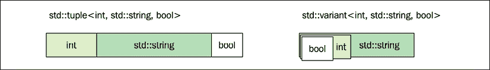

# nine

# 基本公用事业

本章将介绍 C++ 实用程序库中的一些基本类。为了有效地处理包含不同类型元素的集合，将使用前一章中介绍的一些元编程技术。

C++ 容器是同质的，这意味着它们只能存储一种类型的元素。一个`std::vector<int>`存储一组整数，所有存储在一个`std::list<Boat>`中的对象都属于`Boat`类型。但是有时候，我们需要跟踪不同类型元素的集合。我将这些集合称为**异质集合**。在异构集合中，元素可能有不同的类型。下图显示了`int`的同质集合和包含不同类型元素的异质集合的示例:

<figure class="mediaobject"></figure>

图 9.1:同质和异质集合

本章将介绍 C++ 实用程序库中的一组有用的模板，这些模板可用于存储各种类型的多个值。本章分为四节:

*   用`std::optional`表示可选值
*   使用`std::pair`、`std::tuple`和`std::tie()`的固定大小集合
*   使用带有类型`std::any`和`std::variant`元素的标准容器动态调整集合大小
*   一些真实的例子证明了`std::tuple`和`std::tie()`的有用性，以及我们在*第 8 章*、*编译时编程*中介绍的元编程概念

让我们从探索`std::optional`及其一些重要的用例开始。

# 用 std::optional 表示可选值

虽然 C++ 17 中的一个很小的特性，`std::optional`是标准库的一个很好的补充。它简化了一个在`std::optional`之前无法清晰直接表达的常见案例。简而言之，它是任何类型的小型包装器，其中包装的类型可以是初始化的，也可以是未初始化的。

用 C++ 的行话来说，`std::optional`是一个*堆栈分配的容器，最大大小为一个*。

## 可选返回值

在引入`std::optional`之前，没有明确的方法定义可能不返回定义值的函数，比如两条线段的交点。有了`std::optional`的引入，这样的可选返回值就可以清晰的表达出来。下面是一个函数的实现，该函数返回两行之间的可选交集:

```cpp
// Prerequisite
struct Point { /* ... */ }; 
struct Line { /* ... */ };  
auto lines_are_parallel(Line a, Line b) -> bool { /* ... */ }
auto compute_intersection(Line a, Line b) -> Point { /* ... */ }
auto get_intersection(const Line& a, const Line& b) 
  -> std::optional<Point> 
{
  if (lines_are_parallel(a, b))
    return std::optional{compute_intersection(a, b)};
  else
    return {};
} 
```

`std::optional`的语法类似指针的语法；该值由`operator*()`或`operator->()`访问。试图使用`operator*()`或`operator->()`访问空可选值是未定义的行为。也可以使用`value()`成员函数访问该值，如果可选值不包含任何值，该函数将引发`std::bad_optional_access`异常。下面是一个返回的`std::optional`的简单例子:

```cpp
auto set_magic_point(Point p) { /* ... */ }
auto intersection = get_intersection(line0, line1);
if (intersection.has_value()) {
  set_magic_point(*intersection);
} 
```

`std::optional`持有的对象始终是堆栈分配的，将一个类型包装成`std::optional`的内存开销是一个 bool 的大小(通常是一个字节)，加上可能的填充。

## 可选成员变量

假设我们有一个代表人头的类。头部可以有某种帽子，也可以没有帽子。通过使用`std::optional`来表示 hat 成员变量，实现尽可能具有表现力:

```cpp
struct Hat { /* ... */ };
class Head {
public:
  Head() { assert(!hat_); }      // hat_ is empty by default
  auto set_hat(const Hat& h) { 
    hat_ = h; 
  }
  auto has_hat() const { 
    return hat_.has_value(); 
  }
  auto& get_hat() const { 
    assert(hat_.has_value()); 
    return *hat_; 
  }
  auto remove_hat() { 
    hat_ = {};        // Hat is cleared by assigning to {}
  } 
private:
  std::optional<Hat> hat_;
}; 
```

如果没有`std::optional`，表示可选成员变量将依赖于例如指针或额外的`bool`成员变量。两者都有缺点，例如在堆上分配，或者在没有警告的情况下意外访问被认为是空的可选对象。

## 避免枚举中的空状态

在旧的 C++ 代码库中可以看到的一种模式是`enum` s 中的*空状态*或*空状态*。

```cpp
enum class Color { red, blue, none };  // Don't do this! 
```

在前面的`enum`中，`none`是所谓的空状态。在`Color` `enum`中添加`none`值的原因是为了能够表示可选颜色，例如:

```cpp
auto get_color() -> Color; // Returns an optional color 
```

但是这种设计没有办法表示非可选的颜色，这就使得*所有的*代码都需要处理多余的空状态`none`。

更好的选择是避免额外的空状态，而是用类型`std::optional<Color>`表示可选颜色:

```cpp
enum class Color { red, blue };
auto get_color() -> std::optional<Color>; 
```

这清楚地表明，我们可能不会得到一个颜色回来。但是我们也知道，一旦我们有了一个`Color`对象，它就不可能是空的:

```cpp
auto set_color(Color c) { /* c is a valid color, now use it ... */ } 
```

实现`set_color()`时，我们知道客户端已经传递了一个有效的颜色。

## 排序和比较标准::可选

使用下表所示的规则`std::optional`同样具有可比性和可排序性:

<colgroup><col> <col></colgroup> 
| 两个*空*可选值被认为相等。 | 一个空的可选项被认为比一个非空的少*。* |
| 

```cpp
auto a = std::optional<int>{};
auto b = std::optional<int>{};
auto c = std::optional<int>{4};
assert(a == b);
assert(b != c); 
```

 | 

```cpp
auto a = std::optional<int>{};
auto b = std::optional<int>{4};
auto c = std::optional<int>{5};
assert(a < b);
assert(b < c); 
```

 |

因此，如果对`std::optional<T>`的容器进行排序，空的可选值将在容器的开头结束，而非空的可选值将照常排序，如下所示:

```cpp
auto c = std::vector<std::optional<int>>{{3}, {}, {1}, {}, {2}};
std::sort(c.begin(), c.end());
// c is {}, {}, {1}, {2}, {3} 
```

如果您习惯于使用指针表示可选值，使用 out 参数设计 API，或者在枚举中添加特殊的空状态，那么是时候将`std::optional`添加到您的工具箱中了，因为它为这些反模式提供了一个高效且安全的替代方案。

让我们继续探索可以容纳不同类型元素的固定大小的集合。

# 固定大小的异构集合

C++ 实用程序库包括两个类模板，可用于存储不同类型的多个值:`std::pair`和`std::tuple`。它们都是固定大小的集合。就像`std::array`一样，不可能在运行时动态添加更多的值。

`std::pair`和`std::tuple`的最大区别在于`std::pair`只能保存两个值，而`std::tuple`可以在编译时以任意大小实例化。在进入`std::tuple`之前，我们先简单介绍一下`std::pair`。

## 使用标准::对

类模板`std::pair`存在于`<utility>`头中，自从引入标准模板库以来，在 C++ 中已经可用。它用在标准库中，算法需要返回两个值，例如`std::minmax()`，它可以返回初始值设定项列表的最小值和最大值:

```cpp
std::pair<int, int> v = std::minmax({4, 3, 2, 4, 5, 1});
std::cout << v.first << " " << v.second;     // Outputs: "1 5" 
```

前面的示例显示了可以通过成员`first`和`second`访问`std::pair`的元素。

在这里，`std::pair`保存相同类型的值，所以，也可以在这里返回一个数组。但是让`std::pair`更有趣的是它可以保存不同类型的*值。这就是为什么我们认为这是一个异类集合，尽管事实上它只能保存两个值。*

标准库中`std::pair`保存不同值的一个例子是关联容器`std::map`。`std::map`的值类型是由键和与键相关联的元素组成的一对:

```cpp
auto scores = std::map<std::string, int>{};
scores.insert(std::pair{"Neo", 12}); // Correct but ineffecient
scores.emplace("Tri", 45);           // Use emplace() instead
scores.emplace("Ari", 33);
for (auto&& it : scores) { // "it" is a std::pair
  auto key = it.first;
  auto val = it.second;
  std::cout << key << ": " << val << '\n';
} 
```

显式命名`std::pair`类型的要求已经降低，在现代 C++ 中，使用初始化列表和结构化绑定来隐藏我们正在处理`std::pair`的值的事实是很常见的。下面的例子表达了同样的事情，但没有明确提到潜在的`std::pair`:

```cpp
auto scores = std::map<std::string, int> {
  {"Neo", 12},                            // Initializer lists
  {"Tri", 45},
  {"Ari", 33}
};
for (auto&& [key, val] : scores) {       // Structured bindings
  std::cout << key << ": " << val << '\n';
} 
```

我们将在本章后面的内容中更多地讨论结构化绑定。

顾名思义，`std::pair`只能保存两个值。C++ 11 引入了一个名为`std::tuple`的新实用类，它是`std::pair`的推广，可以容纳任意数量的元素。

## 标准::元组

`std::tuple`可以用作固定大小的异构集合，可以声明为任何大小。例如与`std::vector`相比，它的大小在运行时不能改变；您不能添加或删除元素。

元组可以通过如下方式明确指定其成员类型来构建:

```cpp
auto t = std::tuple<int, std::string, bool>{}; 
```

或者，我们可以使用类模板参数推导来初始化它，如下所示:

```cpp
auto t = std::tuple{0, std::string{}, false}; 
```

这将使编译器生成一个类，大致可以这样看:

```cpp
struct Tuple {
  int data0_{};
  std::string data1_{};
  bool data2_{};
}; 
```

与 C++ 标准库中的许多其他类一样，`std::tuple`也有一个对应的`std::make_tuple()`函数，它从参数中自动推导出类型:

```cpp
auto t = std::make_tuple(42, std::string{"hi"}, true); 
```

但是正如前面所说的，从 C++ 17 开始，这些`std::make_`函数中的很多都是多余的，因为 C++ 17 类可以从构造函数中推导出这些类型。

### 访问元组的成员

使用自由功能模板`std::get<Index>()`可以访问`std::tuple`的各个元素。你可能想知道为什么不能像普通的`at(size_t index)`成员功能的容器一样访问成员。原因是像`at()`这样的成员函数只允许返回一种类型，而元组由不同索引处的不同类型组成。相反，函数模板`std::get()`与索引一起用作模板参数:

```cpp
auto a = std::get<0>(t);     // int
auto b = std::get<1>(t);     // std::string
auto c = std::get<2>(t);     // bool 
```

我们可以想象`std::get()`函数是这样实现的:

```cpp
template <size_t Index, typename Tuple>
auto& get(const Tuple& t) {
  if constexpr(Index == 0) {
    return t.data0_;
  } else if constexpr(Index == 1) {
    return t.data1_;
  } else if constexpr(Index == 2) {
    return t.data2_;
  }
} 
```

这意味着当我们如下创建和访问元组时:

```cpp
auto t = std::tuple(42, true);
auto v = std::get<0>(t); 
```

编译器大致生成以下代码:

```cpp
// The Tuple class is generated first:
class Tuple { 
  int data0_{};
  bool data1_{};
public:
  Tuple(int v0, bool v1) : data0_{v0}, data1_{v1} {} 
};
// get<0>(Tuple) is then generated to something like this:
auto& get(const Tuple& tpl) { return data0_; }

// The generated function is then utilized:
auto t = Tuple(42, true); 
auto v = get(t); 
```

请注意，这个例子只能被认为是一种简单的方式来想象编译器在构建`std::tuple`时会生成什么；`std::tuple`的内部非常复杂。然而，重要的是要理解`std::tuple`类基本上是一个简单的结构，其成员可以被编译时索引访问。

`std::get()`函数模板也可以使用 typename 作为参数。它是这样使用的:

```cpp
auto number = std::get<int>(tuple);
auto str = std::get<std::string>(tuple); 
```

只有当指定的类型在元组中包含一次时，这才是可能的。

### 迭代标准::元组成员

从程序员的角度来看，`std::tuple`似乎可以像任何其他容器一样，用基于范围的常规`for`循环进行迭代，如下所示:

```cpp
auto t = std::tuple(1, true, std::string{"Jedi"});
for (const auto& v : t) {
  std::cout << v << " ";
} 
```

这不可能的原因是`const auto& v`的类型只被求值一次，并且由于`std::tuple`包含不同类型的元素，所以这段代码根本不会编译。

常规算法也是如此，因为迭代器不会改变指向的类型；因此，`std::tuple`不提供`begin()`或`end()`成员函数，也不提供下标运算符`[]`来访问值。因此，我们需要想出一些其他的方法来展开元组。

### 展开元组

由于元组不能像往常一样迭代，我们需要做的是使用元编程来展开循环。从前面的例子中，我们希望编译器生成如下内容:

```cpp
auto t = std::tuple(1, true, std::string{"Jedi"});
std::cout << std::get<0>(t) << " ";
std::cout << std::get<1>(t) << " ";
std::cout << std::get<2>(t) << " ";
// Prints "1 true Jedi" 
```

如您所见，我们迭代元组的每个索引，这意味着我们需要元组中包含的类型/值的数量。然后，由于元组包含不同的类型，我们需要编写一个元函数，为元组中的每种类型生成一个新函数。

如果我们从一个为特定索引生成调用的函数开始，它将如下所示:

```cpp
template <size_t Index, typename Tuple, typename Func> 
void tuple_at(const Tuple& t, Func f) {
  const auto& v = std::get<Index>(t);
  std::invoke(f, v);
} 
```

然后我们可以把它和一个通用的 lambda 结合起来，就像你在*第二章* *【基本 C++ 技巧】* *:* 中所学的那样

```cpp
auto t = std::tuple{1, true, std::string{"Jedi"}};
auto f = [](const auto& v) { std::cout << v << " "; };
tuple_at<0>(t, f);
tuple_at<1>(t, f);
tuple_at<2>(t, f);
// Prints "1 true Jedi" 
```

有了函数`tuple_at()`之后，我们就可以进行实际的迭代了。我们首先需要的是元组中作为编译时常数的值的数量。幸运的是，这个值可以通过类型特征`std::tuple_size_v<Tuple>`获得。使用`if constexpr`，我们可以通过创建一个类似的函数来展开迭代，该函数根据索引采取不同的动作:

*   如果索引等于元组大小，它将生成一个空函数
*   否则，它将在传递的索引处执行 lambda，并生成一个新函数，索引中添加 1

这是代码的外观:

```cpp
template <typename Tuple, typename Func, size_t Index = 0> void tuple_for_each(const Tuple& t, const Func& f) {
  constexpr auto n = std::tuple_size_v<Tuple>;
  if constexpr(Index < n) {
    tuple_at<Index>(t, f);
    tuple_for_each<Tuple, Func, Index+1>(t, f);
  }
} 
```

正如您所看到的，默认索引被设置为零，这样我们在迭代时就不必指定它了。这个`tuple_for_each()`函数可以这样调用，λ直接到位:

```cpp
auto t = std::tuple{1, true, std::string{"Jedi"}};
tuple_for_each(t, [](const auto& v) { std::cout << v << " "; });
// Prints "1 true Jedi" 
```

相当不错；在语法上，它看起来与`std::for_each()`算法非常相似。

#### 为元组实现其他算法

将扩展到`tuple_for_each()`，迭代元组的不同算法可以以类似的方式实现。以下是元组的`std::any_of()`是如何实现的示例:

```cpp
template <typename Tuple, typename Func, size_t Index = 0> 
auto tuple_any_of(const Tuple& t, const Func& f) -> bool { 
  constexpr auto n = std::tuple_size_v<Tuple>; 
  if constexpr(Index < n) { 
    bool success = std::invoke(f, std::get<Index>(t)); 
    if (success) {
      return true;
    }
    return tuple_any_of<Tuple, Func, Index+1>(t, f); 
  } else { 
    return false; 
  } 
} 
```

它可以这样使用:

```cpp
auto t = std::tuple{42, 43.0f, 44.0}; 
auto has_44 = tuple_any_of(t, [](auto v) { return v == 44; }); 
```

函数模板`tuple_any_of()`遍历元组中的每种类型，并为当前索引处的元素生成一个 lambda 函数，然后与`44`进行比较。在这种情况下，`has_44`会评估到`true`，作为最后一个元素，一个`double`值，就是`44`。如果我们添加一个与`44`不可比的类型的元素，比如`std::string`，我们会得到一个编译错误。

### 访问元组元素

在到 C++ 17 之前，有两种访问`std::tuple`元素的标准方式:

*   对于访问单个元素，使用功能`std::get<N>(tuple)`。
*   为了访问多个元素，使用了功能`std::tie()`。

虽然它们都有效，但执行如此简单任务的语法非常冗长，如下例所示:

```cpp
// Prerequisite 
using namespace std::string_literals;  // "..."s
auto make_saturn() { return std::tuple{"Saturn"s, 82, true}; }
int main() {
  // Using std::get<N>()
  {
    auto t = make_saturn();
    auto name = std::get<0>(t);
    auto n_moons = std::get<1>(t);
    auto rings = std::get<2>(t);
    std::cout << name << ' ' << n_moons << ' ' << rings << '\n';
    // Output: Saturn 82 true   }
    // Using std::tie()
  {
    auto name = std::string{};
    auto n_moons = int{};
    auto rings = bool{};
    std::tie(name, n_moons, rings) = make_saturn();
    std::cout << name << ' ' << n_moons << ' ' << rings << '\n';
  }
} 
```

为了能够优雅地执行这个常见任务，在 C++ 17 中引入了结构化绑定。

#### 结构化绑定

使用结构化绑定，可以使用`auto`和括号声明列表一次初始化多个变量。与一般的`auto`关键字一样，您可以通过使用相应的修饰符来控制变量应该是可变引用、前向引用、常量引用还是值。在以下示例中，正在构建`const`参考文献的结构化绑定:

```cpp
const auto& [name, n_moons, rings] = make_saturn();
std::cout << name << ' ' << n_moons << ' ' << rings << '\n'; 
```

结构化绑定也可用于提取`for`循环中元组的单个成员，如下所示:

```cpp
auto planets = { 
  std::tuple{"Mars"s, 2, false}, 
  std::tuple{"Neptune"s, 14, true} 
};
for (auto&& [name, n_moons, rings] : planets) { 
   std::cout << name << ' ' << n_moons << ' ' << rings << '\n'; 
} 
// Output:
// Mars 2 false 
// Neptune 14 true 
```

这里有一个快速提示。如果希望返回多个带有命名变量而不是元组索引的参数，可以返回在函数内部定义的结构，并使用自动返回类型推断:

```cpp
auto make_earth() {
  struct Planet { std::string name; int n_moons; bool rings; };
  return Planet{"Earth", 1, false}; 
}
// ...
auto p = make_earth(); 
std::cout << p.name << ' ' << p.n_moons << ' ' << p.rings << '\n'; 
```

结构化绑定也与结构一起工作，因此，我们可以如下直接捕获单个数据成员，即使它是一个结构:

```cpp
auto [name, num_moons, has_rings] = make_earth(); 
```

在这种情况下，我们可以为标识符选择任意的名称，因为相关的是`Planet`的数据成员的顺序，就像返回元组一样。

现在，我们将看看在处理任意数量的函数参数时`std::tuple`和`std::tie()`的另一个用例。

### 可变模板参数包

**变量** **模板参数包** 使程序员能够创建可以接受任意数量参数的模板函数。

#### 具有可变数量参数的函数示例

如果我们要创建一个函数，用任意数量的不带变量模板参数包的参数组成一个字符串，我们需要使用 C 风格的变量参数(就像`printf()`一样)，或者为每个数量的参数创建一个单独的函数:

```cpp
auto make_string(const auto& v0) { 
  auto ss = std::ostringstream{}; 
  ss << v0; 
  return ss.str(); 
} 
auto make_string(const auto& v0, const auto& v1) { 
   return make_string(v0) + " " + make_string(v1); 
}
auto make_string(const auto& v0, const auto& v1, const auto& v2) { 
  return make_string(v0, v1) + " " + make_string(v2); 
} 
// ... and so on for as many parameters we might need 
```

这是我们功能的预期用途:

```cpp
auto str0 = make_string(42);
auto str1 = make_string(42, "hi");
auto str2 = make_string(42, "hi", true); 
```

如果我们需要大量的参数，这将变得乏味，但是使用参数包，我们可以将其实现为接受任意数量参数的函数。

#### 如何构造变量参数包

参数包是通过在类型名前面加三个点，在变量参数扩展包后加三个点来标识的，中间加一个逗号:

```cpp
template<typename ...Ts> 
auto f(Ts... values) {
  g(values...);
} 
```

下面是语法解释:

*   `Ts`是类型列表
*   `<typename ...Ts>`表示函数处理列表
*   `values...`扩展包，以便在每个值之间添加一个逗号

要将其转化为代码，请考虑这个`expand_pack()`函数模板:

```cpp
template <typename ...Ts>
auto expand_pack(const Ts& ...values) {
   auto tuple = std::tie(values...);
} 
```

让我们这样调用前面的函数:

```cpp
expand_pack(42, std::string{"hi"}); 
```

在这种情况下，编译器将生成类似如下的函数:

```cpp
auto expand_pack(const int& v0, const std::string& v1) {
  auto tuple = std::tie(v0, v1);
} 
```

这是单个参数包部件扩展到的内容:

<colgroup><col> <col></colgroup> 
| 表情: | 扩展到: |
| `template <typename... Ts>` | `template <typename T0, typename T1>` |
| `expand_pack(const Ts& ...values)` | `expand_pack(const T0& v0, const T1& v1)` |
| `std::tie(values...)` | `std::tie(v0, v1)` |

表 9.1:扩展表达式

现在，让我们看看如何使用可变参数包创建`make_string()`函数。

进一步说初始的`make_string()`函数，为了从每个参数中创建一个字符串，我们需要迭代这个包。没有办法直接迭代一个参数包，但是一个简单的解决方法是用它做一个元组，然后用`tuple_for_each()`函数模板迭代它，如下所示:

```cpp
template <typename ...Ts> 
auto make_string(const Ts& ...values) { 
  auto ss = std::ostringstream{}; 
  // Create a tuple of the variadic parameter pack 
  auto tuple = std::tie(values...); 
  // Iterate the tuple 
  tuple_for_each(tuple, [&ss](const auto& v) { ss << v; }); 
  return ss.str();
}
// ...
auto str = make_string("C++", 20);  // OK: str is "C++" 
```

参数包用`std::tie()`转换成`std::tuple`，然后用`tuple_for_each()`迭代。综上所述，我们需要使用`std::tuple`来处理参数的原因是因为我们希望支持任意数量的各种类型的参数。如果我们只需要支持一种特定类型的参数，我们可以使用带有基于范围的`for`循环的`std::array`，如下所示:

```cpp
template <typename ...Ts>
auto make_string(const Ts& ...values) {
  auto ss = std::ostringstream{};
  auto a = std::array{values...};     // Only supports one type
  for (auto&& v : a) { ss << v; }
  return ss.str();
}
// ...
auto a = make_string("A", "B", "C");  // OK: Only one type
auto b = make_string(100, 200, 300);  // OK: Only one type
auto c = make_string("C++", 20);      // Error: Mixed types 
```

如您所见，`std::tuple`是一个具有固定大小和固定元素位置的异构集合——或多或少像一个常规结构，但没有命名成员变量。

我们如何在此基础上创建一个动态大小的集合(例如`std::vector`和`std::list`)，但是能够存储混合类型的元素？我们将在下一节中研究解决这个问题的方法。

# 动态调整大小的异构集合

我们在本章的第一节中提到，C++ 提供的动态大小的容器是同质的，这意味着我们只能存储一种类型的元素。但是有时候，我们需要跟踪一个包含不同类型元素的动态集合。为了做到这一点，我们将使用包含类型`std::any`或`std::variant`元素的容器。

最简单的解决方法就是用`std::any`作为基型。`std::any`对象可以在其中存储任何类型的值:

```cpp
auto container = std::vector<std::any>{42, "hi", true}; 
```

不过，它也有一些缺点。首先，每次访问其中的值时，都必须在运行时测试该类型。换句话说，我们在编译时完全丢失了存储值的类型信息。相反，我们必须依赖运行时类型检查来获取信息。其次，它在堆上而不是堆栈上分配对象，这可能会对性能产生重大影响。

如果我们想要迭代我们的容器，我们需要明确地对每个`std::any`对象说这个:*如果你是一个 int，那么做这个，如果你是一个 char 指针，那么做那个*。这是不可取的，因为它需要重复的源代码，并且它也比使用其他替代方法效率低，我们将在本章后面介绍。

以下示例编译；该类型被明确测试和铸造:

```cpp
for (const auto& a : container) {
  if (a.type() == typeid(int)) {
    const auto& value = std::any_cast<int>(a);
    std::cout << value;
  }
  else if (a.type() == typeid(const char*)) {
    const auto& value = std::any_cast<const char*>(a);
    std::cout << value;
  }
  else if (a.type() == typeid(bool)) {
    const auto& value = std::any_cast<bool>(a);
    std::cout << value;
  }
} 
```

因为`std::any`对象不知道如何访问它的存储值，所以我们不能用常规的流操作符打印它。因此，下面的代码不会编译；编译器不知道`std::any`中存储了什么:

```cpp
for (const auto& a : container) { 
  std::cout << a;                // Does not compile
} 
```

我们通常不需要`std::any`提供的类型的完全灵活性，并且在许多情况下，我们最好使用`std::variant`，我们接下来将介绍它。

## 标准::变体

如果我们不需要在容器中存储*任何*类型的能力，而是希望专注于容器初始化时声明的一组固定类型，则`std::variant`是更好的选择。

`std::variant`与`std::any`相比，有两个主要优势:

*   它不会将其包含的类型存储在堆中(与`std::any`不同)
*   它可以用泛型 lambda 来调用，这意味着您不必明确知道它当前包含的类型(本章后面的部分将详细介绍这一点)

`std::variant`的工作方式有点类似于元组，只是它一次只存储一个对象。包含的类型和值是我们最后赋予它的类型和值。下图说明了使用相同类型实例化的`std::tuple`和`std::variant`之间的区别:

<figure class="mediaobject"></figure>

图 9.2:类型元组与类型变量

这里有一个使用`std::variant`的例子:

```cpp
using VariantType = std::variant<int, std::string, bool>; 
VariantType v{}; 
std::holds_alternative<int>(v);  // true, int is first alternative
v = 7; 
std::holds_alternative<int>(v);  // true
v = std::string{"Anne"};
std::holds_alternative<int>(v);  // false, int was overwritten 
v = false; 
std::holds_alternative<bool>(v); // true, v is now bool 
```

我们使用`std::holds_alternative<T>()`来检查变体当前是否持有给定的类型。您可以看到，当我们为变量分配新值时，类型会发生变化。

除了存储实际值外，`std::variant`还通过使用通常大小为`std::size_t`的指数来跟踪当前持有的替代品。这意味着`std::variant`的总规模通常是最大备选方案的规模加上指数的规模。我们可以通过对我们的类型使用`sizeof`运算符来验证这一点:

```cpp
std::cout << "VariantType: "<< sizeof(VariantType) << '\n';
std::cout << "std::string: "<< sizeof(std::string) << '\n';
std::cout << "std::size_t: "<< sizeof(std::size_t) << '\n'; 
```

使用带有 libc++ 的 Clang 10.0 编译和运行这段代码会生成以下输出:

```cpp
VariantType: 32
std::string: 24
std::size_t: 8 
```

可以看到，`VariantType`的大小是`std::string`和`std::size_t`的总和。

### std::变体的异常安全性

当一个新值被分配给一个`std::variant`对象时，它被放置在与当前变量保持值相同的位置。如果由于某种原因，新值的构造或赋值失败并引发异常，旧值可能无法恢复。相反，变体可能变得毫无价值。您可以使用成员函数`valueless_by_exception()`检查变量对象是否无值。当试图使用`emplace()`成员函数构造一个对象时，可以证明这一点:

```cpp
struct Widget {
  explicit Widget(int) {    // Throwing constructor
    throw std::exception{};
  }
};
auto var = std::variant<double, Widget>{1.0};
try {
  var.emplace<1>(42); // Try to construct a Widget instance
} catch (...) {
  std::cout << "exception caught\n";
  if (var.valueless_by_exception()) {  // var may or may not 
    std::cout << "valueless\n";        // be valueless
  } else {
    std::cout << std::get<0>(var) << '\n';
  }
} 
```

抛出并捕获异常后，初始`double`值 1.0 可能会也可能不会消失。该操作不能保证回滚，这通常可以从标准库容器中得到。换句话说，`std::variant`没有提供强有力的异常安全保证，其原因是性能开销，因为它需要`std::variant`使用堆分配。`std::variant`的这种行为是一个有用的特性，而不是缺点，因为这意味着您可以在具有实时要求的代码中安全地使用`std::variant`。

如果你想要一个堆分配版本，但是有很强的异常安全保证和“永不清空”保证，`boost::variant`提供了这个功能。如果你对实现这种类型的挑战感兴趣，[https://www . boost . org/doc/libs/1 _ 74 _ 0/doc/html/variant/design . html](https://www.boost.org/doc/libs/1_74_0/doc/html/variant/design.html)提供了一个有趣的阅读。

### 访问变体

当访问`std::variant`中的变量时，我们使用全局函数`std::visit()`。正如您可能已经猜到的，在处理异构类型时，我们必须使用我们的主要伙伴:泛型 lambda:

```cpp
auto var = std::variant<int, bool, float>{};
std::visit([](auto&& val) { std::cout << val; }, var); 
```

当在示例中用泛型 lambda 和变量`var`调用`std::visit()`时，编译器将在概念上将 lambda 转换为一个常规类，该类对变量中的每种类型都有`operator()`重载。这看起来类似于这样:

```cpp
struct GeneratedFunctorImpl {
  auto operator()(int&& v)   { std::cout << v; }
  auto operator()(bool&& v)  { std::cout << v; }
  auto operator()(float&& v) { std::cout << v; }
}; 
```

然后使用`std::holds_alternative<T>()`将`std::visit()`功能扩展为`if...else`链，或者使用`std::variant`索引的跳转表，以生成对`std::get<T>()`的正确调用。

在前面的例子中，我们将通用 lambda 中的值直接传递给`std::cout`，而不考虑当前持有的备选项。但是，如果我们想做不同的事情，这取决于我们要去的是哪种类型呢？可以用于这种情况的模式是定义一个变量类模板，该模板将从一组 lambdas 继承。然后，我们需要为我们访问的每种类型定义这个。听起来很复杂，不是吗？这一开始看起来有点神奇，也考验了我们的元编程技能，但是一旦我们有了变量类模板，它就很容易使用了。

我们将从变量类模板开始。以下是它的外观:

```cpp
template<class... Lambdas>
struct Overloaded : Lambdas... {
  using Lambdas::operator()...;
}; 
```

如果您使用的是 C++ 17 编译器，您还需要添加一个显式推导指南，但是从 C++ 20 开始就不需要了:

```cpp
template<class... Lambdas> 
Overloaded(Lambdas...) -> Overloaded<Lambdas...>; 
```

就这样。模板类`Overloaded`将继承我们用来实例化模板的所有 lambda，函数调用运算符`operator()()`将被每个 lambda 重载一次。现在可以创建一个无状态对象，它只包含调用运算符的多个重载:

```cpp
auto overloaded_lambdas = Overloaded{
  [](int v)   { std::cout << "Int: " << v; },
  [](bool v)  { std::cout << "Bool: " << v; },
  [](float v) { std::cout << "Float: " << v; }
}; 
```

我们可以使用不同的参数对其进行测试，并验证是否调用了正确的重载:

```cpp
overloaded_lambdas(30031);    // Prints "Int: 30031"
overloaded_lambdas(2.71828f); // Prints "Float: 2.71828" 
```

现在，我们可以用`std::visit()`来使用它，而不需要将`Overloaded`对象存储在左值中。以下是最终的样子:

```cpp
auto var = std::variant<int, bool, float>{42};
std::visit(Overloaded{
  [](int v)   { std::cout << "Int: " << v; },
  [](bool v)  { std::cout << "Bool: " << v; },
  [](float v) { std::cout << "Float: " << v; }
}, var);
// Outputs: "Int: 42" 
```

因此，一旦我们有了`Overloaded`模板，我们就可以使用这种方便的方式为不同类型的参数指定一组 lambdas。在下一节中，我们将开始将`std::variant`与标准容器一起使用。

## 使用变体的异构集合

现在我们有了一个可以存储任何类型的提供列表的变体，我们可以在此基础上扩展到一个异构集合。我们通过简单地创建我们变体的`std::vector`来做到这一点:

```cpp
using VariantType = std::variant<int, std::string, bool>;
auto container = std::vector<VariantType>{}; 
```

我们现在可以将不同类型的元素推送到向量中:

```cpp
container.push_back(false);
container.push_back("I am a string"s);
container.push_back("I am also a string"s);
container.push_back(13); 
```

向量现在在内存中看起来像这样，向量中的每个元素都包含变量的大小，在这种情况下是`sizeof(std::size_t) + sizeof(std::string)`:

<figure class="mediaobject"></figure>

图 9.3:变体载体

当然，我们也可以`pop_back()`或者以容器允许的任何其他方式修改容器:

```cpp
container.pop_back();
std::reverse(container.begin(), container.end());
// etc... 
```

## 访问变量容器中的值

现在已经有了大小动态的异构集合的样板，让我们看看如何像普通的`std::vector`一样使用它:

1.  **构建变体**的异构容器:这里，我们构建一个不同类型的`std::vector`。注意初始化列表包含不同的类型:

    ```cpp
    using VariantType = std::variant<int, std::string, bool>;
    auto v = std::vector<VariantType>{ 42, "needle"s, true }; 
    ```

2.  **通过使用常规 for 循环**进行迭代来打印内容:要使用常规`for`循环来迭代容器，我们使用`std::visit()`和泛型 lambda。全局函数`std::visit()`负责类型转换。该示例将每个值打印到`std::cout`，与类型无关:

    ```cpp
    for (const auto& item : v) { 
      std::visit([](const auto& x) { std::cout << x << '\n';}, item);
    } 
    ```

3.  **检查容器中有哪些类型**:这里，我们按类型检查容器的每个元素。这是通过使用全局函数`std::holds_alternative<type>`来实现的，如果变量当前持有要求的类型，则返回`true`。以下示例计算容器中当前包含的布尔值数量:

    ```cpp
    auto num_bools = std::count_if(v.begin(), v.end(),
                                   [](auto&& item) {
      return std::holds_alternative<bool>(item);
    }); 
    ```

4.  **通过包含的类型和值找到内容**:在这个例子中，我们通过组合`std::holds_alternative()`和`std::get()`来检查容器的类型和值。本示例检查容器是否包含具有值`"needle"` :

    ```cpp
    auto contains = std::any_of(v.begin(), v.end(),
                                [](auto&& item) {
      return std::holds_alternative<std::string>(item) &&
        std::get<std::string>(item) == "needle";
    }); 
    ```

    的`std::string`

### 全局函数 std::get()

全局功能模板`std::get()`可用于`std::tuple`、`std::pair`、`std::variant`和`std::array`。实例化`std::get()`有两种方法，一种是用索引，一种是用类型:

*   `std::get<Index>()`:当`std::get()`与一个索引一起使用时，如在`std::get<1>(v)`中，它在`std::tuple`、`std::pair`或`std::array`中返回相应索引处的值。
*   `std::get<Type>()`:当`std::get()`与类型一起使用时，如在`std::get<int>(v)`中，返回`std::tuple`、`std::pair` 或`std::variant`中的相应值。在`std::variant`的情况下，如果变体当前不包含该类型，则会引发`std::bad_variant_access` 异常。请注意，如果`v`是一个`std::tuple`并且`Type`被包含了不止一次，您必须使用索引来访问该类型。

讨论了实用程序库中的基本模板后，让我们来看看本章中介绍的一些实际应用。

# 一些真实的例子

我们将通过检查两个例子来结束本章的，其中`std::tuple`、`std::tie()`和一些模板元编程可以帮助我们在实践中编写干净高效的代码。

## 示例 1:投影和比较运算符

随着 C++ 20 的出现，实现类的比较运算符的需求急剧减少，但是当我们想要为特定场景以某种定制顺序对对象进行排序时，仍然有需要提供定制比较函数的情况。考虑以下类别:

```cpp
struct Player {
  std::string name_{};
  int level_{};
  int score_{};
  // etc...
};
auto players = std::vector<Player>{};
// Add players here... 
```

假设我们想要根据属性对玩家进行排序:主要排序顺序`level_`和次要排序顺序`score_`。在实现比较和排序时看到这样的代码并不少见:

```cpp
auto cmp = [](const Player& lhs, const Player& rhs) {
  if (lhs.level_ == rhs.level_) {
    return lhs.score_ < rhs.score_;
  }
  else {
    return lhs.level_ < rhs.level_;
  }
};
std::sort(players.begin(), players.end(), cmp); 
```

当属性数量增加时，使用嵌套的`if-else`块以这种方式编写比较运算符很快变得容易出错。我们真正想表达的是，我们正在比较一个*投影`Player`属性的*(在这个例子中，是一个严格的子集)。`std::tuple`可以帮助我们以更简洁的方式重写这段代码，而不需要`if-else`语句。

让我们使用`std::tie()`，它创建了一个`std::tuple`来保存我们传递给它的左值的引用。下面的代码创建了两个投影，`p1`和`p2`，并使用`<`运算符对它们进行比较:

```cpp
auto cmp = [](const Player& lhs, const Player& rhs) {
  auto p1 = std::tie(lhs.level_, lhs.score_); // Projection
  auto p2 = std::tie(lhs.level_, lhs.score_); // Projection
  return p1 < p2;
};
std::sort(players.begin(), players.end(), cmp); 
```

与使用`if-else`语句的初始版本相比，这非常干净且易于阅读。但这真的有效率吗？似乎我们只需要创建临时对象来比较两个玩家。当在微基准中运行这个并检查生成的代码时，使用`std::tie()`真的没有任何开销；事实上，在这个例子中，使用`std::tie()`的版本比使用`if-else`语句的版本稍快。

使用范围算法，我们可以通过向`std::ranges::sort()`提供投影作为参数来进行排序，这使得代码更加清晰:

```cpp
std::ranges::sort(players, std::less{}, [](const Player& p) {
  return std::tie(p.level_, p.score_); 
}); 
```

这是一个例子，说明了如何在不需要带有命名成员的完整结构的情况下使用`std::tuple`，而不牺牲代码的清晰度。

## 示例 2:反射

术语**反射**是指在对一个类的内容一无所知的情况下检查该类的能力。与许多其他编程语言相比，C++ 没有内置反射，这意味着我们必须自己编写反射功能。反射计划包含在 C++ 标准的未来版本中；希望我们能在 C++ 23 中看到这个特性。

在这个例子中，我们将限制反射，使类能够迭代它们的成员，就像我们可以迭代元组的成员一样。通过使用反射，我们可以为序列化或日志记录创建通用函数，这些函数可以自动处理任何类。这减少了大量的样板代码，这是传统上 C++ 类所需要的。

### 让一个类反映它的成员

由于我们需要自己实现所有的反射功能，我们将从通过一个名为`reflect()`的函数公开成员变量开始。我们将继续使用上一节中介绍的`Player`类。下面是我们添加`reflect()`成员函数和构造函数时的样子:

```cpp
class Player {
public:
  Player(std::string name, int level, int score)
      : name_{std::move(name)}, level_{level}, score_{score} {}

  auto reflect() const {
    return std::tie(name_, level_, score_);
  } 
private:
  std::string name_;
  int level_{};
  int score_{};
}; 
```

`reflect()`成员函数通过调用`std::tie()`返回成员变量的引用元组。我们现在可以开始使用`reflect()`函数，但是首先，要注意使用手工反射的替代方法。

### 简化反射的 C++ 库

在 C++ 库世界中，已经有不少简化反射创建的尝试。一个例子是路易斯·迪翁的元编程库 *Boost Hana* ，它通过一个简单的宏赋予类反射能力。最近， *Boost* 还增加了安东尼·波罗钦的*精准平映*，自动*反映类的公共内容，只要所有成员都是简单类型即可。*

 *然而，为了清楚起见，在这个例子中，我们将只使用我们自己的`reflect()`成员函数。

### 使用反射

既然`Player`类有能力反映它的成员变量，我们可以自动化批量功能的创建，否则需要我们重新键入每个成员变量。您可能已经知道，C++ 可以自动生成构造函数、析构函数和比较运算符，但是其他运算符必须由程序员实现。一个这样的功能是`operator<<()`，它将其内容输出到一个流中，以便将它们存储在一个文件中，或者更常见的是，将它们记录在应用日志中。

通过重载`operator<<()`并使用我们在本章前面实现的`tuple_for_each()`函数模板，我们可以简化类的`std::ostream`输出的创建，如下所示:

```cpp
auto& operator<<(std::ostream& ostr, const Player& p) { 
  tuple_for_each(p.reflect(), [&ostr](const auto& m) { 
    ostr << m << " "; 
  }); 
  return ostr; 
} 
```

现在，该类可以用于任何`std::ostream`类型，如下所示:

```cpp
auto v = Player{"Kai", 4, 2568}; 
std::cout << v;                  // Prints: "Kai 4 2568 " 
```

通过一个元组来反映我们的类成员，我们只需要在类中添加/移除成员时更新我们的反映函数，而不是更新每个函数和迭代所有成员变量。

### 有条件地重载全局函数

现在我们有了一个使用反射而不是手动键入每个变量来编写大容量函数的机制，我们仍然需要为每种类型键入简化的大容量函数。如果我们希望为每一种可以反映的类型生成这些函数，会怎么样？

通过使用约束，我们可以有条件地为所有具有`reflect()`成员函数的类启用`operator<<()`。

首先，我们需要创建一个引用`reflect()`成员函数的新概念:

```cpp
template <typename T> 
concept Reflectable = requires (T& t) {
  t.reflect();
}; 
```

当然，这个概念只是检查一个类是否有名为`reflect()`的成员函数；它并不总是返回元组。一般来说，我们应该对像这样只使用单个成员函数的弱概念持怀疑态度，但是它符合示例的目的。无论如何，我们现在可以在全局命名空间中重载`operator<<()`，让所有可反射的类能够被比较并打印到一个`std::ostream`:

```cpp
auto& operator<<(std::ostream& os, const Reflectable auto& v) {
  tuple_for_each(v.reflect(), [&os](const auto& m) {
    os << m << " ";
  });
  return os;
} 
```

前面的函数模板将仅针对包含`reflect()`成员函数的类型进行实例化，因此不会与任何其他重载冲突。

### 测试反射能力

现在，我们已经准备好了一切:

*   我们将要测试的`Player`类有一个`reflect()`成员函数，该函数返回对其成员的一组引用
*   全局`std::ostream& operator<<()`对于可反射类型是重载的

下面是一个验证该功能的简单测试:

```cpp
int main() {
  auto kai = Player{"Kai", 4, 2568}; 
  auto ari = Player{"Ari", 2, 1068}; 

  std::cout << kai; // Prints "Kai 4 2568" 
  std::cout << ari; // Prints "Ari 2 1068" 
} 
```

这些例子已经证明了一些小但重要的实用程序的有用性，比如`std::tie()`和`std::tuple`结合一点元编程。

# 摘要

在本章中，您已经学习了如何使用`std::optional`来表示代码中的可选值。您还看到了如何将`std::pair`、`std::tuple`、`std::any`和`std::variant`与标准容器和元编程结合在一起，以存储和迭代不同类型的元素。您还了解到`std::tie()`是一个概念简单但功能强大的工具，可用于投影和反射。

在下一章中，您将了解如何通过学习如何构造隐藏的代理对象来进一步扩展您的 C++ 工具箱以创建库。*