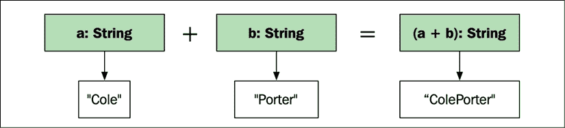
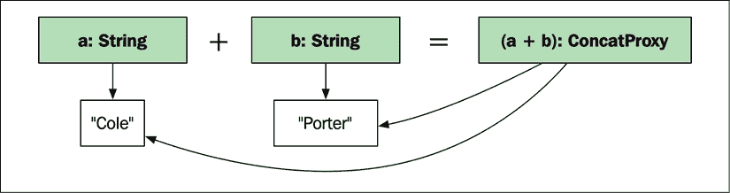
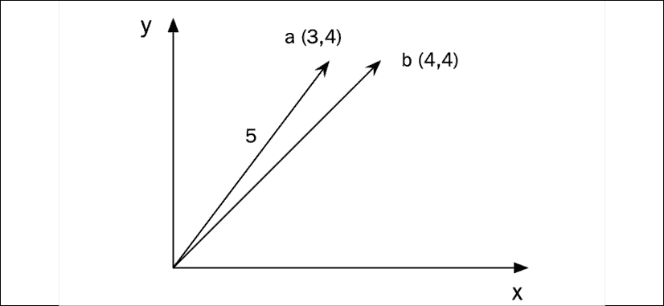
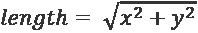
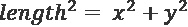

# Ten

# 代理对象和惰性评估

在本章中，您将学习如何使用代理对象和惰性评估，以便将某些代码的执行推迟到需要的时候。使用代理对象可以在幕后进行优化，从而保持暴露的接口不变。

本章包括:

*   懒惰而急切的评价
*   使用代理对象来避免多余的计算
*   使用代理对象时重载运算符

# 引入惰性计算和代理对象

首先也是最重要的一点，本章中使用的技术用于向库的用户隐藏库中的优化。这很有用，因为将每一个优化技术作为一个单独的功能公开需要库用户的大量关注和教育。它还用大量特定的函数膨胀了代码库，使其难以阅读和理解。通过使用代理对象，我们可以实现引擎盖下的优化；生成的代码既优化又可读。

## 懒惰与急切的评价

**懒人** **评估**是一种将手术推迟到真正需要其结果时使用的手法。相反的，马上进行的操作，叫做**急切评估**。在某些情况下，急切的评估是不可取的，因为我们最终可能会构建一个从未使用过的值。

为了演示急切评估和懒惰评估之间的区别，让我们假设我们正在编写某种具有多个级别的游戏。每当一个关卡完成后，我们需要显示当前的分数。在这里，我们将重点关注游戏的几个组成部分:

*   一个`ScoreView`类，负责在获得奖励的情况下用可选的奖励图像显示用户的分数
*   一个表示加载到内存中的图像的`Image`类
*   从磁盘加载图像的`load()`功能

在这个例子中，类和函数的实现并不重要，但是声明如下:

```cpp
class Image { /* ... */ };                   // Buffer with JPG data
auto load(std::string_view path) -> Image;   // Load image at path
class ScoreView {
public:
  // Eager, requires loaded bonus image
  void display(const Image& bonus);
  // Lazy, only load bonus image if necessary
  void display(std::function<Image()> bonus);
  // ...
}; 
```

提供了两个版本的`display()`:第一个版本需要一个完全加载的奖励图像，而第二个版本接受一个只有在需要奖励图像时才会调用的功能。使用第一个*急切的*版本会是这样的:

```cpp
// Always load bonus image eagerly
const auto eager = loadimg/stars.jpg");
score.display(eager); 
```

使用第二个*惰性*版本会是这样的:

```cpp
// Load default image lazily if needed
auto lazy = [] { return loadimg/stars.jpg"); }; 
score.display(lazy); 
```

即使从未显示过，急切版本也总是会将默认图像加载到内存中。但是奖励图像的懒加载会保证只有`ScoreView`真的需要显示奖励图像时才会加载图像。

这是一个非常简单的例子，但是它的思想是你的代码以几乎相同的方式被表达，就像它被急切地声明一样。一种隐藏代码延迟计算的技术是使用代理对象。

## 代理对象

代理对象是内部库对象，不打算对库的用户可见。他们的任务是将操作推迟到需要的时候，并收集一个表达式的数据，直到它可以被评估和优化。然而，代理对象在黑暗中起作用；库的用户应该能够处理表达式，就像代理对象不在那里一样。换句话说，使用代理对象，您可以在库中封装优化，同时保持接口不变。现在，您将学习如何使用代理对象来评估更高级的表达式。

# 避免使用代理对象构造对象

急切的评估可能会产生不必要的效果，即对象被不必要地构造。通常这不是一个问题，但是如果对象构建成本很高(例如，因为堆分配)，可能有合理的理由优化掉无用的短期对象的不必要构建。

## 使用代理比较串联字符串

我们现在将通过一个使用代理对象的最小例子来告诉你它们是什么以及可以用来做什么。它不是为您提供优化字符串比较的通用生产就绪解决方案。

说了这么多，看看这个连接两个字符串并比较结果的代码片段:

```cpp
auto a = std::string{"Cole"}; 
auto b = std::string{"Porter"}; 
auto c = std::string{"ColePorter"}; 
auto is_equal = (a + b) == c;        // true 
```

下面是前面代码片段的可视化表示:

<figure class="mediaobject"></figure>

图 10.1:将两个字符串连接成一个新字符串

这里的问题是(`a + b`)构造一个新的临时字符串，以便与`c`进行比较。不用构造一个新字符串，我们可以直接比较连接，如下所示:

```cpp
auto is_concat_equal(const std::string& a, const std::string& b,
                     const std::string& c) { 
  return  
    a.size() + b.size() == c.size() && 
    std::equal(a.begin(), a.end(), c.begin()) &&  
    std::equal(b.begin(), b.end(), c.begin() + a.size()); 
} 
```

我们可以这样使用它:

```cpp
auto is_equal = is_concat_equal(a, b, c); 
```

就性能而言，我们已经取得了胜利，但是从语法上来说，像这样充满特殊情况便利功能的代码库很难维护。因此，让我们看看如何在保持原始语法不变的情况下实现这种优化。

## 实现代理

首先，我们将创建一个代理类来表示两个字符串的连接:

```cpp
struct ConcatProxy { 
  const std::string& a; 
  const std::string& b; 
}; 
```

然后，我们将构建自己的`String`类，它包含一个`std::string`和一个重载的`operator+()`函数。请注意，这是如何制作和使用代理对象的示例；创建自己的`String`类不是我推荐的:

```cpp
class String { 
public: 
  String() = default; 
  String(std::string str) : str_{std::move(str)} {} 
  std::string str_{};
}; 

auto operator+(const String& a, const String& b) {
   return ConcatProxy{a.str_, b.str_};
} 
```

下面是前面代码片段的可视化表示:

<figure class="mediaobject"></figure>

图 10.2:代表两个字符串连接的代理对象

最后，我们将创建一个全局`operator==()`函数，该函数将依次使用优化的`is_concat_equal()`函数，如下所示:

```cpp
auto operator==(ConcatProxy&& concat, const String& str) {
  return is_concat_equal(concat.a, concat.b, str.str_); 
} 
```

既然我们已经做好了一切，我们就能两全其美:

```cpp
auto a = String{"Cole"}; 
auto b = String{"Porter"}; 
auto c = String{"ColePorter"}; 
auto is_equal = (a + b) == c;     // true 
```

换句话说，我们获得了`is_concat_equal()`的性能，同时保留了使用`operator==()`的表达语法。

## 右值修饰符

在前面的代码中，全局`operator==()`函数只接受`ConcatProxy`值:

```cpp
auto operator==(ConcatProxy&& concat, const String& str) { // ... 
```

如果我们接受左值，我们可能会意外地错误使用代理，如下所示:

```cpp
auto concat = String{"Cole"} + String{"Porter"};
auto is_cole_porter = concat == String{"ColePorter"}; 
```

这里的问题是，在执行比较时，持有`"Cole"`和`"Porter"`的临时`String`对象都已经被破坏，导致失败。(记住`ConcatProxy`类只保存对字符串的引用。)但是由于我们强制使`concat`对象成为一个右值，前面的代码将不会编译，从而避免了可能的运行时崩溃。当然，您可以使用`std::move(concat) == String("ColePorter")`将其转换为右值来强制编译它，但这并不是一个现实的情况。

## 分配串联代理

现在，你可能会想，如果我们真的想将连接的字符串存储为新字符串，而不只是比较它，会怎么样？我们所做的只是重载一个`operator String()`函数，如下所示:

```cpp
struct ConcatProxy {
  const std::string& a;
  const std::string& b;
  operator String() const && { return String{a + b}; }
}; 
```

两个字符串的串联现在可以隐式地将其自身转换为一个字符串:

```cpp
String c = String{"Marc"} + String{"Chagall"}; 
```

但是有一个小问题:我们不能用`auto`关键字初始化新的`String`对象，因为这会导致`ConcatProxy`:

```cpp
auto c = String{"Marc"} + String{"Chagall"};
// c is a ConcatProxy due to the auto keyword here 
```

可惜我们没有办法绕开这个；结果必须显式转换为`String`。

是时候看看我们的优化版本与正常情况相比有多快了。

## 性能赋值

为了评估的性能优势，我们将使用以下基准，它连接并比较大小为`50`的`10'000`字符串:

```cpp
template <typename T>
auto create_strings(int n, size_t length) -> std::vector<T> {
  // Create n random strings of the specified length
  // ...
}
template <typename T> 
void bm_string_compare(benchmark::State& state) {
  const auto n = 10'000, length = 50;
  const auto a = create_strings<T>(n, length);
  const auto b = create_strings<T>(n, length);
  const auto c = create_strings<T>(n, length * 2);
  for (auto _ : state) {
    for (auto i = 0; i < n; ++i) {
      auto is_equal = a[i] + b[i] == c[i];
      benchmark::DoNotOptimize(is_equal);
    }
  }
}
BENCHMARK_TEMPLATE(bm_string_compare, std::string);
BENCHMARK_TEMPLATE(bm_string_compare, String);
BENCHMARK_MAIN(); 
```

在英特尔酷睿 i7 CPU 上执行时，我使用 gcc 实现了 40 倍的加速。使用`std::string`的版本直接在 1.6 ms 内完成，而使用`String`的代理版本仅在 0.04 ms 内完成，当使用长度为 10 的短字符串运行相同的测试时，加速约为 20 倍。大变化的一个原因是小字符串将通过利用*第 7 章*、*内存管理*中讨论的小字符串优化来避免堆分配。基准测试向我们展示了当我们去掉临时字符串和可能的堆分配时，代理对象的加速是相当可观的。

`ConcatProxy`类帮助我们在比较字符串时隐藏一个优化。希望这个简单的例子能启发您开始思考如何在实现性能优化的同时保持 API 设计的整洁。

接下来，您将看到可以隐藏在代理类后面的另一个有用的优化。

# 推迟 sqrt 计算

本节将向您展示如何使用代理对象，以便在比较二维向量的长度时推迟甚至避免使用计算量大的`std::sqrt()`函数。

## 一个简单的二维向量类

让我们从一个简单的二维向量类开始。它有 *x* 和 *y* 坐标和一个名为`length()`的成员函数，该函数计算从原点到位置 *(x，y)* 的距离。我们将这个班级称为`Vec2D`。定义如下:

```cpp
class Vec2D {
public:
  Vec2D(float x, float y) : x_{x}, y_{y} {}
  auto length() const {
    auto squared = x_*x_ + y_*y_;
    return std::sqrt(squared);
  }
private:
  float x_{};
  float y_{};
}; 
```

下面是客户端如何使用`Vec2D`的一个例子:

```cpp
auto a = Vec2D{3, 4}; 
auto b = Vec2D{4, 4};
auto shortest = a.length() < b.length() ? a : b;
auto length = shortest.length();
std::cout << length; // Prints 5 
```

示例创建两个向量，并比较它们的长度。然后将最短向量的长度打印成标准长度。*图 10.3* 显示了矢量和计算出的原点长度:

<figure class="mediaobject"></figure>

图 10.3:两个不同长度的 2D 矢量。向量 a 的长度是 5。

## 基础数学

看看计算的数学，你可能会注意到一些有趣的东西。长度公式如下:

<figure class="mediaobject"></figure>

然而，如果我们只需要比较两个向量之间的距离，那么平方长度就是我们所需要的，如下式所示:

<figure class="mediaobject"></figure>

可以使用函数`std::sqrt()`计算平方根。但是，如前所述，如果我们只想比较两个向量之间的长度，则不需要平方根运算，因此可以省略它。好的一点是`std::sqrt()`是一个相对较慢的操作，这意味着如果我们根据向量的长度来比较许多向量，我们可以获得一些性能。问题是，我们如何在保持干净语法的同时做到这一点？让我们看看当比较长度时，如何使用代理对象让一个简单的库在引擎盖下执行这种优化。

为了清楚起见，我们从最初的`Vec2D`类开始，但是我们将`length()`函数分成两部分–`length_squared()`和`length()`，如下所示:

```cpp
class Vec2D {
public:
  Vec2D(float x, float y) : x_{x}, y_{y} {}  
  auto length_squared() const {
    return x_*x_ + y_*y_;  
  }
  auto length() const {
    return std::sqrt(length_squared());
  }
private:
  float x_{};
  float y_{};
}; 
```

现在我们的`Vec2D` 类的客户如果想在只比较不同向量的长度时获得一些性能，可以使用`length_squared()`。

假设我们想要实现一个方便的实用函数，返回一系列`Vec2D`对象的最小长度。我们现在有两个选项:在进行比较时，使用`length()`功能或`length_squared()`功能。它们相应的实现如下例所示:

```cpp
// Simple version using length()
auto min_length(const auto& r) -> float {
  assert(!r.empty());
  auto cmp = [](auto&& a, auto&& b) {
    return a.length () < b.length();
  };
  auto it = std::ranges::min_element(r, cmp);
  return it->length();
} 
```

使用`length_squared()`进行比较的第二个优化版本如下:

```cpp
// Fast version using length_squared()
auto min_length(const auto& r) -> float {
  assert(!r.empty());
  auto cmp = [](auto&& a, auto&& b) {
    return a.length_squared() < b.length_squared(); // Faster
  };
  auto it = std::ranges::min_element(r, cmp);
  return it->length(); // But remember to use length() here!
} 
```

在`cmp`里面使用`length()`的第一个版本的优点是可读性更强，更容易答对，而第二个版本的优点是速度更快。提醒大家，第二个版本的加速是因为我们可以避免调用`cmp` lambda 里面的`std::sqrt()`。

最佳解决方案是第一个版本的语法使用`length()`，第二个版本的性能使用`length_squared()`。

根据这个类将要使用的上下文，可能有充分的理由公开一个函数，比如`length_squared()`。但是让我们假设我们团队中的其他开发人员不理解拥有`length_squared()`函数的原因，并且发现这个类令人困惑。因此，我们决定想出一些更好的方法来避免函数的两个版本暴露向量的长度属性。正如您可能已经猜到的那样，现在是代理类隐藏这种复杂性的时候了。

为了实现这一点，我们返回一个对用户隐藏的中间对象，而不是从`length()`成员函数返回一个`float`值。根据用户如何使用隐藏的代理对象，它应该避免`std::sqrt()`操作，直到真正需要它。在接下来的部分中，我们将实现一个名为`LengthProxy`的类，这将是我们将从`Vec2D::length()`返回的代理对象的类型。

## 实现长度代理对象

是时候实现包含表示平方长度的数据成员的`LengthProxy`类了。实际的平方长度从不公开，以防止类的用户将平方长度与常规长度混合。相反，`LengthProxy`有一个隐藏的`friend`函数，将它的平方长度与常规长度进行比较，如下所示:

```cpp
class LengthProxy { 
public: 
  LengthProxy(float x, float y) : squared_{x * x + y * y} {} 
  bool operator==(const LengthProxy& other) const = default; 
  auto operator<=>(const LengthProxy& other) const = default; 
  friend auto operator<=>(const LengthProxy& proxy, float len) { 
    return proxy.squared_ <=> len*len;   // C++20
  } 
  operator float() const {      // Allow implicit cast to float
    return std::sqrt(squared_); 
  }  
private: 
  float squared_{}; 
}; 
```

我们已经定义`operator float()`允许从`LengthProxy`到`float`的隐式转换。`LengthProxy`物体之间也可以相互比较。通过使用新的 C++20 比较，我们 简单地`default`相等运算符和三向比较运算符，让编译器为我们生成所有必要的比较运算符。

接下来，我们重写`Vec2D`类以返回类`LengthProxy`的对象，而不是实际的`float`长度:

```cpp
class Vec2D { 
public: 
  Vec2D(float x, float y) : x_{x}, y_{y} {} 
  auto length() const { 
    return LengthProxy{x_, y_};    // Return proxy object
  } 
  float x_{}; 
  float y_{}; 
}; 
```

有了这些添加，是时候使用我们新的代理类了。

## 比较长度和长度代理

在这个例子中，我们将 比较两个向量`a`和`b`，并确定`a`是否比`b`短。请注意，代码在语法上看起来与我们没有使用代理类时完全一样:

```cpp
auto a = Vec2D{23, 42}; 
auto b = Vec2D{33, 40}; 
bool a_is_shortest = a.length() < b.length(); 
```

在引擎盖下，最终陈述扩展为类似于以下内容:

```cpp
// These LengthProxy objects are never visible from the outside
LengthProxy a_length = a.length(); 
LengthProxy b_length = b.length(); 
// Member operator< on LengthProxy is invoked, 
// which compares member squared_ 
auto a_is_shortest = a_length < b_length; 
```

很好！`std::sqrt()`操作省略，而`Vec2D`类的界面仍然完好无损。由于省略了`std::sqrt()`操作，我们之前实现的`min_length()`的简单版本现在可以更有效地执行比较。下面是简单的实现，现在也变得高效了:

```cpp
// Simple and efficient 
auto min_length(const auto& r) -> float { 
  assert(!r.empty()); 
  auto cmp = [](auto&& a, auto&& b) { 
    return a.length () < b.length(); 
  }; 
  auto it = std::ranges::min_element(r, cmp); 
  return it->length(); 
} 
```

`Vec2D`对象之间的优化长度比较现在发生在引擎盖下。实现`min_length()`功能的程序员不需要知道这个优化就能从中受益。如果我们需要实际长度，让我们看看它看起来像什么。

## 使用长度代理计算长度

请求 实际长度时，调用代码有一点变化。要触发对`float`的隐式转换，我们必须在声明下面的`len`变量时提交一个`float`；也就是说，我们不能像平时一样只使用`auto`:

```cpp
auto a = Vec2D{23, 42};
float len = a.length(); // Note, we cannot use auto here 
```

如果我们只写`auto`，那么`len`对象将是`LengthProxy`类型，而不是`float`类型。我们不希望代码库的用户显式处理`LengthProxy`对象；代理对象应该在黑暗中操作，应该只利用它们的结果(在这种情况下，比较结果或实际距离值为`float`)。即使我们不能完全隐藏代理对象，让我们看看如何收紧它们以防止误用。

### 防止长度代理的滥用

您可能已经注意到 可能会出现使用`LengthProxy`类可能导致性能下降的情况。在下面的例子中，根据程序员对长度值的请求，多次调用`std::sqrt()`函数:

```cpp
auto a = Vec2D{23, 42};
auto len = a.length();
float f0 = len;       // Assignment invoked std::sqrt()
float f1 = len;       // std::sqrt() of len is invoked again 
```

虽然这是一个人为的例子，但是现实世界中可能会发生这种情况，我们希望强制`Vec2d`的用户对每个`LengthProxy`对象只调用一次`operator float()`。为了防止误用，我们使`operator float()`成员函数仅在右值上可调用；也就是说，`LengthProxy`对象只有在不绑定变量的情况下才能转换为浮点。

我们通过在`operator float()`成员函数中使用`&&`作为修饰符来强制这种行为。`&&`修改器就像`const`修改器一样工作，但是当`const`修改器强制成员函数不修改对象时，`&&`修改器强制函数对临时对象进行操作。

修改如下:

```cpp
operator float() const && { return std::sqrt(squared_); } 
```

如果我们在与变量相关联的`LengthProxy`对象上调用`operator float()`，比如下面例子中的`dist`对象，编译器将拒绝编译:

```cpp
auto a = Vec2D{23, 42};
auto len = a.length(); // len is of type LenghtProxy
float f = len;         // Doesn't compile: len is not an rvalue 
```

但是，我们仍然可以直接在从`length()`返回的右值上调用`operator float()`，如下所示:

```cpp
auto a = Vec2D{23, 42}; 
float f = a.length();    // OK: call operator float() on rvalue 
```

一个临时的`LengthProxy`实例仍然会在后台创建，但是由于它没有绑定到一个变量，我们 可以隐式地将其转换为`float`。这将防止误用，例如在`LengthProxy`对象上多次调用`operator float()`。

## 性能赋值

为了方便起见，让我们看看我们实际获得了多少性能。我们将对以下版本的`min_element()`进行基准测试:

```cpp
auto min_length(const auto& r) -> float {
  assert(!r.empty());
  auto it = std::ranges::min_element(r, [](auto&& a, auto&& b) {
    return a.length () < b.length(); });
  return it->length();
} 
```

为了将代理对象优化与某些东西进行比较，我们将定义一个替代版本`Vec2DSlow`，它总是使用`std::sqrt()`计算实际长度:

```cpp
struct Vec2DSlow {
  float length() const {                  // Always compute
    auto squared = x_ * x_ + y_ * y_;     // actual length
    return std::sqrt(squared);            // using sqrt()
  }
  float x_, y_;
}; 
```

使用带有函数模板的 Google Benchmark，我们可以看到在找到 1000 个向量的最小长度时，我们获得了多少性能:

```cpp
template <typename T> 
void bm_min_length(benchmark::State& state) {
  auto v = std::vector<T>{};
  std::generate_n(std::back_inserter(v), 1000, [] {
    auto x = static_cast<float>(std::rand());
    auto y = static_cast<float>(std::rand());
    return T{x, y};
  });
  for (auto _ : state) {
    auto res = min_length(v);
    benchmark::DoNotOptimize(res);
  }
}
BENCHMARK_TEMPLATE(bm_min_length, Vec2DSlow);
BENCHMARK_TEMPLATE(bm_min_length, Vec2D);
BENCHMARK_MAIN(); 
```

在英特尔 i7 CPU 上运行该基准测试产生了以下结果:

*   使用未优化的`Vec2DSlow`和`std::sqrt()`需要 7900 纳秒
*   使用`Vec2D`和`LengthProxy`需要 1800 纳秒

这一性能优势相当于超过 4 倍的加速。

这是我们如何避免在某些情况下不必要的计算的一个例子。但是我们没有让`Vec2D`的界面变得更加复杂，而是设法将优化封装在代理对象中，这样所有客户端都可以从优化中受益，而不会牺牲清晰度。

在 C++中优化表达式的相关技术是**表达式模板**。这使用模板元编程在编译时生成表达式树。该技术可用于避免临时变量，并支持惰性评估。表达式模板是 Boost **基础线性代数库** ( **uBLAS** )和 **Eigen** 、[http://eigen.tuxfamily.org](http://eigen.tuxfamily.org)中使线性代数算法和矩阵运算快速的技术之一。您可以在比雅尼·斯特劳斯特鲁普的《C++编程语言》*第四版*中*阅读更多关于设计矩阵类时如何使用表达式模板和融合运算的内容。*

在本章的最后，我们将研究当代理对象与重载操作符结合时，从代理对象中获益的其他方法。

# 创造性运算符重载和代理对象

正如你可能已经知道的，C++有能力重载几个运算符，包括标准数学运算符，如加号和减号。可以利用重载的数学运算符来创建自定义的数学类，这些类表现为数字内置类型，以使代码更易读。另一个例子是流操作符，它在标准库中被重载，以便将对象转换为流，如下所示:

```cpp
std::cout << "iostream " << "uses " << "overloaded " << "operators."; 
```

然而，一些库在其他上下文中使用重载。如前所述，Ranges 库使用重载来组成如下视图:

```cpp
const auto r = {-5, -4, -3, -2, -1, 0, 1, 2, 3, 4, 5};
auto odd_positive_numbers = r 
  | std::views::filter([](auto v) { return v > 0; }) 
  | std::views::filter([](auto v) { return (v % 2) == 1; }); 
```

接下来，我们将探讨如何在代理类中使用管道操作符。

## 作为扩展方法的管道操作符

相比其他语言，比如 C#、Swift、JavaScript，C++不支持扩展方法；也就是说，不能用新的成员函数在本地扩展类。

例如，不能用`contains(T val)`函数扩展`std::vector`来像这样使用:

```cpp
auto numbers = std::vector{1, 2, 3, 4};
auto has_two = numbers.contains(2); 
```

但是，您可以重载管道操作符来实现这种几乎等效的语法:

```cpp
auto has_two = numbers | contains(2); 
```

通过使用代理类，可以很容易地完成这个任务。

### 管道操作员

我们这里的目标是实现一个简单的管道操作符，这样我们就可以编写以下内容:

```cpp
auto numbers = std::vector{1, 3, 5, 7, 9}; 
auto seven = 7; 
bool has_seven = numbers | contains(seven); 
```

与可移植语法一起使用的`contains()`函数有两个参数:`numbers`和`seven`。因为左边的参数`numbers`可以是任何东西，所以我们需要重载来包含右边唯一的东西。因此，我们创建了一个名为`ContainsProxy`的`struct`模板，它保存了右边的参数；这样，超载的管道操作员可以识别超载:

```cpp
template <typename T>
struct ContainsProxy { const T& value_; };
template <typename Range, typename T>
auto operator|(const Range& r, const ContainsProxy<T>& proxy) {
  const auto& v = proxy.value_;
  return std::find(r.begin(), r.end(), v) != r.end();
} 
```

现在我们可以这样使用`ContainsProxy`:

```cpp
auto numbers = std::vector{1, 3, 5, 7, 9}; 
auto seven = 7; 
auto proxy = ContainsProxy<decltype(seven)>{seven};  
bool has_seven = numbers | proxy; 
```

管道操作符可以工作，尽管语法仍然很难看，因为我们需要指定类型。为了使语法更简洁，我们可以简单地创建一个便利函数，该函数接受值并创建一个包含以下类型的代理:

```cpp
template <typename T>
auto contains(const T& v) { return ContainsProxy<T>{v}; } 
```

这就是我们所需要的。我们现在可以将它用于任何类型或容器:

```cpp
auto penguins = std::vector<std::string>{"Ping","Roy","Silo"};
bool has_silo = penguins | contains("Silo"); 
```

本节中包含的示例显示了实现管道操作器的基本方法。保罗·富尔茨的“范围”库和“适合”库等库可在[https://github.com/pfultz2/Fit](https://github.com/pfultz2/Fit)获得，它们实现了采用常规函数的适配器，并赋予其使用管道语法调用的能力。

# 摘要

在这一章中，你学会了懒惰评价和渴望评价的区别。您还学习了如何使用隐藏的代理对象在幕后实现惰性评估，这意味着您现在了解了如何实现惰性评估优化，同时保留类的易于使用的接口。将复杂的优化隐藏在库类中，而不是将其公开在应用程序代码中，这使得应用程序代码更易读，更不容易出错。

在下一章中，我们将转移注意力，转而使用 C++进行并发和并行编程。