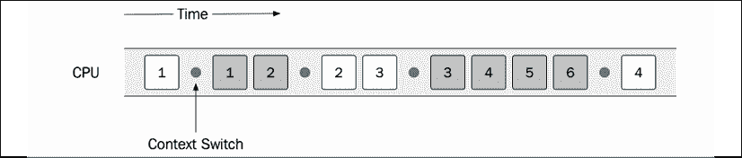
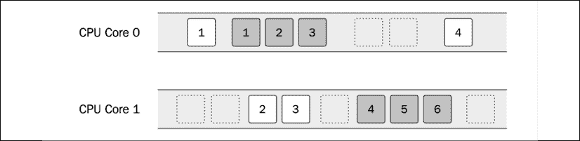
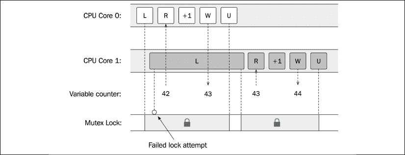
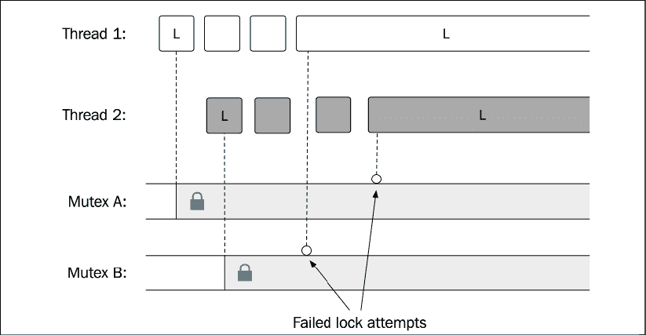
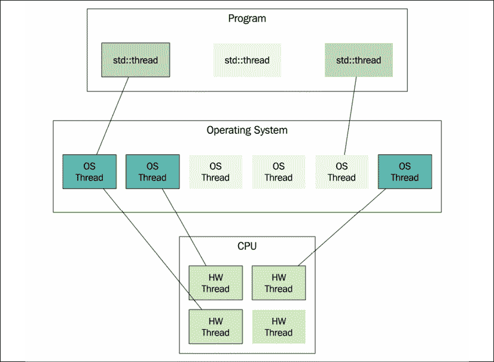
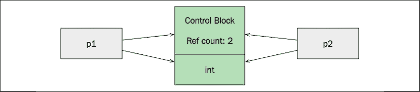
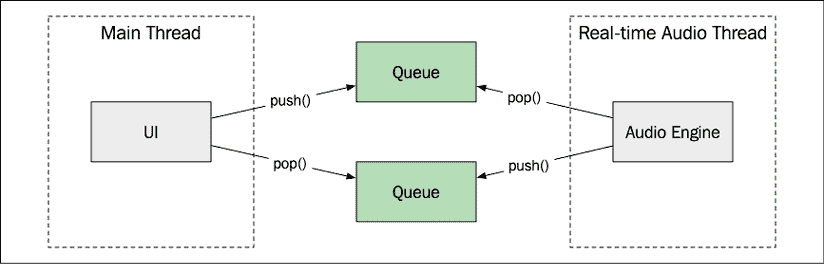

# Eleven

# 并发

在上一章介绍了惰性评估和代理对象之后，我们现在将探讨如何使用共享内存的线程在 C++ 中编写并发程序。我们将通过编写没有数据竞争和死锁的程序来寻找使并发程序正确的方法。本章还将包含如何让并发程序以低延迟和高吞吐量运行的建议。

在我们继续之前，您应该知道这一章并不是对并发编程的完整介绍，也不会涵盖 C++ 中并发的所有细节。相反，本章介绍了用 C++ 编写并发程序的核心构建块，并混合了一些与性能相关的指导原则。如果您以前没有编写过并发程序，那么浏览一些介绍性材料来涵盖并发编程的理论方面是明智的。像死锁、临界区、条件变量和互斥这样的概念将被简要讨论，但是这将更多地作为一个复习而不是对概念的彻底介绍。

本章包括以下内容:

*   并发编程的基础，包括并行执行、共享内存、数据竞争和死锁
*   介绍 C++ 线程支持库、原子库和 C++ 内存模型
*   无锁编程的一个简单例子
*   绩效指南

# 理解并发的基础

一个并发程序可以同时执行多个任务。一般来说，并发编程比顺序编程要困难得多，但是程序从并发中受益有几个原因:

*   **效率**:现在的智能手机和台式电脑都有多个 CPU 内核，可以并行执行多个任务。如果你设法把一个大任务拆分成可以并行运行的子任务，理论上可以用 CPU 核数来划分大任务的运行时间。对于在只有一个内核的机器上运行的程序，如果任务是输入/输出绑定的，性能仍然会有所提高。当一个子任务等待输入输出时，其他子任务仍然可以在中央处理器上执行有用的工作。
*   **响应性和低延迟上下文**:对于具有图形用户界面的应用，重要的是永远不要阻塞 UI，使应用变得无响应。为了防止无响应，通常让长时间运行的任务(如从磁盘加载文件或从网络获取一些数据)在单独的后台线程中执行，这样负责用户界面的线程就永远不会被长时间运行的任务阻塞。另一个低延迟的例子是实时音频。负责产生音频数据缓冲区的功能在单独的高优先级线程中执行，而程序的其余部分可以在低优先级线程中运行，以处理用户界面等。
*   **模拟**:并发可以让模拟现实世界中并发的系统变得更加容易。毕竟，我们身边的大多数事情都是并发发生的，有时用顺序编程模型来建模并发流是非常困难的。在本书中，我们不会关注模拟，而是关注与性能相关的并发方面。

并发为我们解决了许多问题，但引入了新的问题，我们将在下一节讨论。

# 是什么让并发编程变得困难？

并发编程很难的原因有很多，如果你以前写过并发程序，你很可能已经遇到了这里列出的那些:

*   以安全的方式在多个线程之间共享状态是困难的。每当我们拥有可以同时读写的数据时，我们都需要某种方式来保护这些数据免受数据竞争的影响。稍后你会看到很多这样的例子。
*   并发程序通常更复杂，因为有多个并行执行流。
*   并发使调试变得复杂。由于数据竞争而出现的错误可能很难调试，因为它们依赖于线程的调度方式。这类错误很难重现，在最坏的情况下，当使用调试器运行程序时，它们甚至可能不复存在。有时，对控制台的无害调试跟踪可以改变多线程程序的行为方式，并使错误暂时消失。你被警告了！

在我们开始看使用 C++ 的并发编程之前，先介绍几个与并发和并行编程相关的通用概念。

# 并发性和并行性

**并发**和**并行**是两个有时可以互换使用的术语。然而，它们并不相同，了解它们之间的差异很重要。如果一个程序有多个单独的控制流在重叠时间段内运行，则称该程序并发运行。在 C++ 中，每个单独的控制流都由一个线程来表示。不过，线程可能会也可能不会同时执行。如果他们这样做，他们被称为并行执行。对于并行运行的并发程序，需要在支持指令并行执行的机器上执行；也就是拥有多个 CPU 内核的机器。

乍一看，似乎很明显，出于效率的原因，如果可能的话，我们总是希望并发程序并行运行。然而，这并不一定总是正确的。本章中介绍的许多同步原语(如互斥锁)只需要支持线程的并行执行。不是并行运行的并发任务不需要相同的锁定机制，并且更容易推理。

## 时间分片

你可能会问，“在只有一个 CPU 内核的机器上并发线程是如何执行的？”答案是**时间切片**。它与操作系统用来支持进程并发执行的机制相同。为了理解时间切片，让我们假设有两个应该同时执行的独立指令序列，如下图所示:

<figure class="mediaobject"></figure>

图 11.1:两个独立的指令序列

编号框代表说明。每个指令序列在单独的线程中执行，标记为 **T1** 和 **T2** 。操作系统将调度每个线程在中央处理器上有一些有限的时间，然后执行上下文切换。上下文切换将存储正在运行的线程的当前状态，并加载应该执行的线程的状态。这样做的频率足够高，以至于看起来好像线程同时在运行。然而，上下文切换非常耗时，而且很可能会在每次新线程在 CPU 内核上执行时产生大量缓存未命中。因此，我们不希望上下文切换发生得太频繁。

下图显示了在单个 CPU 上调度的两个线程的可能执行顺序:

<figure class="mediaobject"></figure>

图 11.2:两个线程的可能执行。圆点表示上下文切换

线程 T1 的第一条指令开始，然后是一个上下文切换，让线程 T2 执行前两条指令。作为程序员，无论操作系统调度程序如何调度任务，我们都必须确保程序能够按预期运行。如果一个序列由于某种原因无效，有办法通过使用锁来控制指令的执行顺序，这将在后面介绍。

如果一台机器有多个中央处理器内核，就有可能并行执行这两个线程。然而，不能保证(甚至不太可能)在程序的整个生命周期中，这两个线程将分别在一个内核上执行。整个系统在中央处理器上共享时间，因此调度程序也会让其他进程执行。这也是线程没有被调度在专用内核上的原因之一。

*图 11.3* 显示了相同的两个线程的执行，但是现在它们运行在一个有两个 CPU 内核的机器上。正如所见，第一个线程的第二条和第三条指令(白色方框)与另一个线程执行的时间完全相同——两个线程并行执行:

<figure class="mediaobject"></figure>

图 11.3:在多核机器上执行的两个线程。这使得并行执行两个线程成为可能。

接下来我们讨论共享内存。

## 共用存储器

在同一进程中创建的线程共享相同的虚拟内存。这意味着线程可以访问进程中可寻址的任何数据。操作系统保护使用虚拟内存的进程之间的内存，但并不能防止我们意外访问进程内部的内存，而这些内存并不打算在不同的线程之间共享。虚拟内存只是保护我们不去访问分配给我们自己的不同进程的内存。

在多个线程之间共享内存是处理线程间通信的一种非常有效的方式。然而，在线程之间以安全的方式共享内存是用 C++ 编写并发程序的主要挑战之一。我们应该始终努力最小化线程间共享资源的数量。

幸运的是，默认情况下并非所有内存都是共享的。每个线程都有自己的堆栈，用于存储处理函数调用所需的局部变量和其他数据。除非一个线程将对局部变量的引用或指针传递给其他线程，否则没有其他线程能够从该线程访问堆栈。这是尽可能多地使用堆栈的又一个原因(如果您在阅读*第 7 章*、*内存管理*后，还没有确信堆栈是存放数据的好地方)。

还有**线程本地存储**，有时缩写为 **TLS** ，可用于存储线程上下文中的全局变量，但线程之间不共享这些变量。线程局部变量可以被认为是一个全局变量，其中每个线程都有自己的副本。

其他一切默认共享；即堆上分配的动态内存、全局变量和静态局部变量。每当您共享了由某个线程变异的数据时，您需要确保没有其他线程同时访问该数据，否则您将面临数据竞争。

还记得*第七章**内存管理*中*进程内存*部分的图吗，图中图解了一个进程的虚拟地址空间？在这里，它再次被修改，以显示当一个进程包含多个线程时它是什么样子。如下图所示，每个线程都有自己的堆栈内存，但所有线程只有一个堆:

<figure class="mediaobject"></figure>

图 11.4:一个进程的虚拟地址空间的可能布局

在这个例子中，进程包含三个线程。默认情况下，堆内存由所有线程共享。

## 数据竞赛

当两个线程同时访问同一个内存，并且至少有一个线程正在改变数据时，就会发生**数据竞争**。如果你的程序有数据竞赛，这意味着你的程序有未定义的行为。编译器和优化器将*假设*你的代码中没有数据竞争，并在这个假设下优化它。这可能会导致崩溃或其他完全令人惊讶的行为。换句话说，你在任何情况下都不能允许程序中的数据竞争。编译器通常不会警告您数据竞争，因为它们在编译时很难被检测到。

调试数据竞赛可能是一个真正的挑战，有时需要工具，如**线程消毒工具**(来自 Clang)或**并发可视化工具**(Visual Studio 扩展)。这些工具通常会检测代码，以便运行时库可以在运行您正在调试的程序时检测、警告或可视化潜在的数据竞争。

### 示例:数据竞赛

*图 11.5* 显示了两个线程将要更新一个名为`counter`的整数。假设这些线程都是用指令`++ counter`递增一个全局计数器变量。事实证明，增加一个`int`可能涉及多个中央处理器指令。这可以在不同的 CPU 上以不同的方式完成，但让我们假设`++ counter`会生成以下编造的机器指令:

*   **R** :从内存中读取计数器
*   **+1** :递增计数器
*   **W** :将新的计数器值写入内存

现在，如果我们有两个线程将更新最初为 42 的`counter`值，我们将期望在两个线程都运行之后它变成 44。但是，如下图所示，不能保证指令会按顺序执行以保证`counter`变量的正确增量。

<figure class="mediaobject"></figure>

图 11.5:两个线程都在增加同一个共享变量

如果没有数据竞争，计数器将达到值 44，但实际上，它只达到 43。

在本例中，两个线程都读取值 42，并将该值增加到 43。然后，他们都写了新的值，43，这意味着我们永远不会达到 44 的正确答案。如果第一个线程能够在下一个线程开始读取之前写入值 43，我们最终将得到 44。还要注意，即使只有一个中央处理器内核，这也是可能的。调度程序可以用类似的方式调度这两个线程，这样两个读指令都可以在任何写操作之前执行。

同样，这是一个可能的场景，但重要的是行为是未定义的。当你的程序进行数据竞赛时，任何事情都可能发生。其中一个例子是**撕**，这是**撕读**和**撕写**的通称。当一个线程将部分值写入内存，而另一个线程同时读取值时，就会发生这种情况，因此最后会得到一个损坏的值。

### 避免数据竞争

如何避免数据比赛？有两个主要选项:

*   使用原子数据类型代替`int`。这将告诉编译器以原子方式执行读取、递增和写入。我们将在本章后面花更多的时间讨论原子数据类型。
*   使用互斥锁(互斥)，保证多个线程不会同时执行一个关键部分。**临界区**是代码中不能同时执行的地方，因为它更新或读取共享内存，这可能会产生数据竞争。

还值得强调的是，不可变的数据结构——从不改变的数据结构——可以被多个线程访问，而没有任何数据竞争的风险。最大限度地减少可变对象的使用有很多好处，但是在编写并发程序时，这变得更加重要。一种常见的模式是总是创建新的不可变对象，而不是改变现有的对象。当新对象完全构造并表示新状态时，它可以与旧对象交换。这样，我们就可以最小化代码的关键部分。只有交换是一个关键部分，因此需要受到原子操作或互斥的保护。

## 互斥（体）…

一个**互斥体**，简称**互斥锁**，是一个避免数据竞争的同步原语。需要进入临界区的线程首先需要锁定互斥体(锁定有时也称为获取互斥锁)。这意味着在持有锁的第一个线程解锁互斥体之前，没有其他线程可以锁定同一个互斥体。这样，互斥保证了一次只有一个线程在临界区内。

在*图 11.6* 中，可以看到*一节演示的竞态条件是如何通过使用互斥来避免数据竞态示例*的。标有 **L** 的指令为锁定指令，标有 **U** 的指令为解锁指令。在核心 0 上执行的第一个线程首先到达临界区，并在读取计数器值之前锁定互斥体。然后，它将计数器加 1，并将其写回内存。之后，它会释放锁。

在核心 1 上执行的第二个线程在第一个线程获得互斥锁后到达临界区。由于互斥体已经被锁定，线程被阻塞，直到第一个线程不受干扰地更新了计数器并释放了互斥体:

<figure class="mediaobject"></figure>

图 11.6:互斥锁保护了关键部分，避免了计数器变量上的数据竞争

最终的结果是，这两个线程可以以安全和正确的方式更新可变共享变量。但是也意味着两个线程不能再并行运行了。如果线程所做的大部分工作都不能在不序列化的情况下完成，那么从性能的角度来看，使用线程是没有意义的。

第二线程被第一线程阻塞的状态称为**争用**。这是我们努力最小化的事情，因为它损害了并发程序的可伸缩性。如果争用程度很高，增加更多的 CPU 内核不会提高性能。

## 僵局

当使用互斥锁保护共享资源时，存在陷入名为**死锁**状态的风险。当两个线程在等待对方释放锁时，可能会发生死锁。这两个线程都无法继续运行，并且都陷入了死锁状态。发生死锁需要满足的一个条件是，一个已经持有锁的线程试图获取额外的锁。当系统变得越来越大时，跟踪系统中运行的所有线程可能使用的所有锁变得越来越困难。这是总是试图最小化共享资源使用的一个原因，这证明了独占锁定的必要性。

*图 11.7* 显示两个线程处于等待状态，试图获取另一个线程持有的锁:

<figure class="mediaobject"></figure>

图 11.7:死锁状态的一个例子

接下来让我们讨论同步和异步任务。

## 同步和异步任务

本章我将参考**同步任务**和**异步任务**。同步任务就像普通的 C++ 函数。当同步任务完成它应该做的任何事情时，它会将控制权返回给任务的调用方。任务的调用方正在等待或被阻止，直到同步任务完成。

另一方面，异步任务会立即将控件返回给调用方，并同时执行它的工作。

*图 11.8* 中的顺序分别显示了调用同步和异步任务的区别:

<figure class="mediaobject"></figure>

图 11.8:同步调用和异步调用。异步任务立即返回，但在调用方重新获得控制后继续工作。

如果你之前没有见过异步任务，一开始可能会觉得奇怪，因为 C++ 中的普通函数遇到返回语句或者到达函数体末尾的时候总是会停止执行。异步应用编程接口越来越普遍，你可能以前遇到过，例如，在使用异步 JavaScript 时。

有时，我们使用术语**阻塞**来表示阻塞调用者的操作；也就是说，让调用者一直等到操作完成。

对并发性有了一个大概的介绍之后，是时候探索 C++ 对线程编程的支持了。

# C++ 中的并发编程

C++ 中的并发支持使得程序可以并发执行多个任务。如前所述，编写一个正确的并发 C++ 程序通常比编写一个在一个线程中顺序执行所有任务的程序要困难得多。本节还将演示一些常见的陷阱，让您意识到编写并发程序所涉及的所有困难。

并发支持最初是在 C++ 11 中引入的，后来扩展到 C++ 14、C++ 17 和 C++ 20。在并发成为语言的一部分之前，它是通过操作系统、**POSIX Threads**(**pthreads**)或其他一些库的本机并发支持来实现的。

有了 C++ 语言中直接的并发支持，我们就可以编写跨平台的并发程序了，太棒了！然而，有时在处理平台上的并发性时，您必须获得特定于平台的功能。例如，C++ 标准库中不支持设置线程优先级、配置 CPU 亲缘关系(CPU 固定)或设置新线程的堆栈大小。

还应该说，随着 C++ 20 的发布，线程支持库得到了相当大的扩展，在语言的未来版本中很可能会增加更多的特性。由于硬件的开发方式，对良好的并发支持的需求越来越大，在高并发程序的效率、可伸缩性和正确性方面还有很多有待发现的地方。

## 线程支持库

我们现在将浏览 C++ 线程支持库，并介绍其最重要的组件。

### 线

一个正在运行的程序至少包含一个线程。当你的主函数被调用时，它在一个线程上执行，这个线程通常被称为**主线程**。每个线程都有一个标识符，这在调试并发程序时非常有用。以下程序打印主线程的线程标识符:

```cpp
int main() { 
  std::cout << "Thread ID: " <<  std::this_thread::get_id() << '\n'; 
} 
```

运行前面的程序可能会产生如下结果:

```cpp
 Thread ID: 0x1001553c0 
```

可以让线程休眠。生产代码中很少使用 Sleep，但是在调试过程中非常有用。例如，如果您有一个只在极少数情况下发生的数据竞争，那么在代码中添加睡眠可能会使它出现得更频繁。这就是如何让当前运行的线程休眠一秒钟:

```cpp
std::this_thread::sleep_for(std::chrono::seconds{1}); 
```

在代码中插入随机休眠后，您的程序永远不应该暴露任何数据竞争。添加睡眠后，您的程序可能无法令人满意地工作；缓冲区可能会变满，UI 可能会滞后，等等，但是它应该总是以可预测和定义的方式运行。我们无法控制线程的调度，随机休眠模拟了不太可能但可能的调度场景。

现在，让我们使用`<thread>`头中的`std::thread`类创建一个额外的线程。它代表一个执行线程，通常是一个操作系统线程的包装器。`print()`函数将从我们显式创建的线程中调用:

```cpp
void print() { 
  std::this_thread::sleep_for(std::chrono::seconds{1}); 
  std::cout << "Thread ID: "<<  std::this_thread::get_id() << '\n'; 
} 

int main() { 
  auto t1 = std::thread{print}; 
  t1.join(); 
  std::cout << "Thread ID: "<<  std::this_thread::get_id() << '\n'; 
} 
```

当创建线程时，我们传入一个可调用对象(一个函数、lambda 或一个函数对象)，每当线程在 CPU 上获得预定时间时，它就会开始执行该对象。我添加了一个睡眠调用，让我们明白为什么需要在线程上调用`join()`。当一个`std::thread`对象被析构时，它一定是*加入了*或者*分离了*，否则会导致程序调用`std::terminate()`，如果我们没有安装自定义的`std::terminate_handler`，默认情况下会调用`std::abort()`。

在前面的例子中，`join()`函数是阻塞的——它一直等到线程运行完毕。因此，在前面的例子中，`main()`函数将不会返回，直到线程`t1`完成运行。考虑以下行:

```cpp
t1.join(); 
```

假设我们通过用下面一行替换前面一行来分离线程`t1`:

```cpp
t1.detach(); 
```

在这种情况下，我们的主函数会在线程`t1`醒来打印消息之前结束，结果程序(很可能)只会输出主线程的线程 ID。请记住，我们无法控制线程的调度，在`print()`函数有时间休眠、唤醒并打印其线程标识后，主线程有可能但极不可能输出其消息*。*

在这个例子中用`detach()`代替`join()`也引入了另一个问题。我们在没有任何同步的情况下使用两个线程的`std::cout`，并且由于`main()`不再等待线程`t1`完成，理论上它们都可以并行使用`std::cout`。幸运的是，`std::cout`是线程安全的，可以从多个线程使用，不会引入数据竞争，因此没有未定义的行为。但是，线程生成的输出仍然有可能是交错的，导致如下情况:

```cpp
Thread ID: Thread ID: 0x1003a93400x700004fd4000 
```

如果我们想避免交错输出，我们需要将字符的输出视为一个关键部分，并同步访问`std::cout`。稍后我们将更多地讨论关键路段和比赛条件，但首先，让我们介绍一下`std::thread`的一些细节。

### 线程状态

在我们进一步讨论之前，您应该很好地理解`std::thread`对象真正代表什么，以及它可以处于什么状态。我们还没有讨论在执行 C++ 程序的系统中通常有什么样的线程。

在下图中，您可以看到一个假设的运行系统的快照。

<figure class="mediaobject"></figure>

图 11.9:假设运行系统的快照

从底部开始，图中显示了 CPU 及其**硬件线程**。那些是中央处理器上的执行单元。在这个例子中，中央处理器提供了四个硬件线程。通常表示它有四个内核，但也可以是其他配置；例如，一些内核可以执行两个硬件线程。这就是通常所说的**超线程**。运行时可以用以下内容打印硬件线程的总数:

```cpp
 std::cout << std::thread::hardware_concurrency() << '\n';
  // Possible output: 4 
```

如果在运行平台上无法确定硬件线程的数量，前面的代码也可能输出`0`。

硬件线程上面的层包含**操作系统线程**。这些是实际的软件线程。操作系统调度器确定硬件线程何时执行操作系统线程以及执行多长时间。在*图 11.9* 中，目前六个软件线程中有三个正在执行。

图中最顶层包含`std::thread`对象。`std::thread`对象只不过是一个普通的 C++ 对象，可能与底层操作系统线程相关联，也可能不相关联。`std::thread`的两个实例不能与同一个底层线程相关联。在图中可以看到程序目前有三个`std::thread`的实例；两个与线程相关联，一个与线程无关。可以使用`std::thread::joinable`属性来找出`std::thread`对象处于什么状态。如果螺纹已经:

*   默认构造；也就是说，如果它没有什么可执行的
*   已从(其关联的运行线程已转移到另一个`std::thread`对象)
*   通过调用`detach()`分离
*   已经加入了对`join()`的呼叫

否则`std::thread`对象是处于可合并状态的。请记住，当`std::thread`对象被析构时，它必须不再处于可连接状态，否则程序将终止。

### 可接合螺纹

C++ 20 引入了一个新的线程类`std::jthread`。它与`std::thread`非常相似，但有几个重要的补充:

*   `std::jthread`支持使用停止令牌停止线程。这是我们在 C++ 20 之前使用`std::thread`时不得不手动实现的东西。
*   `std::jthread`的析构函数将发送停止请求，并在销毁时加入线程，而不是在应用处于不可连接状态时终止应用。

接下来我将说明后一点。首先，我们将使用`print()`函数，其定义如下:

```cpp
void print() {
  std::this_thread::sleep_for(std::chrono::seconds{1});
  std::cout << "Thread ID: "<<  std::this_thread::get_id() << '\n';
} 
```

它休眠一秒钟，然后打印当前线程标识符:

```cpp
int main() {
  std::cout << "main begin\n"; 
  auto joinable_thread = std::jthread{print};  
  std::cout << "main end\n";
} // OK: jthread will join automatically 
```

在我的机器上运行代码时产生了以下输出:

```cpp
main begin
main end
Thread ID: 0x1004553c0 
```

现在让我们改变我们的`print()`函数，使它在一个循环中连续输出消息。然后，我们需要某种方式来告知`print()`功能何时停止。`std::jthread`(相对于`std::thread`)通过使用停止令牌对此提供了内置支持。当`std::jthread`调用`print()`函数时，如果`print()`函数接受这样的参数，它可以传递一个`std::stop_token`的实例。下面是我们如何使用停止标记实现这个新的`print()`函数的一个例子:

```cpp
void print(std::stop_token stoken) {
  while (!stoken.stop_requested()) { 
    std::cout << std::this_thread::get_id() << '\n';
    std::this_thread::sleep_for(std::chrono::seconds{1});
  }
  std::cout << "Stop requested\n";
} 
```

`while`-循环在每次迭代时通过调用`stop_requested()`检查该函数是否被请求停止。从我们的`main()`功能，现在可以通过调用我们的`std::jthread`实例上的`request_stop()`来请求停止:

```cpp
int main() {
  auto joinable_thread = std::jthread(print);
  std::cout << "main: goes to sleep\n";
  std::this_thread::sleep_for(std::chrono::seconds{3});
  std::cout << "main: request jthread to stop\n";
  joinable_thread.request_stop();
} 
```

当我运行这个程序时，它会生成以下输出:

```cpp
main: goes to sleep
Thread ID: 0x70000f7e1000
Thread ID: 0x70000f7e1000
Thread ID: 0x70000f7e1000
main: request jthread to stop
Stop requested 
```

在这个例子中，我们可以省略对`request_stop()`的显式调用，因为`jthread`将在销毁时自动调用`request_stop()`。

新的`jthread`类是对 C++ 线程库的欢迎添加，它应该是在 C++ 中获取线程类的首选。

### 保护关键部分

正如我已经提到的，我们的代码不能包含任何数据竞争。不幸的是，用数据种族编写代码非常容易。当使用线程以这种方式编写并发程序时，找到关键部分并用锁保护它们是我们经常需要考虑的事情。

C++ 为我们提供了一个`std::mutex`类，可以用来保护关键部分，避免数据竞争。我将通过一个经典的例子演示如何使用互斥体，这个例子使用了一个由多个线程更新的共享可变计数器变量。

首先，我们定义一个全局可变变量和递增计数器的函数:

```cpp
auto counter = 0; // Warning! Global mutable variable
void increment_counter(int n) {
  for (int i = 0; i < n; ++ i)
    ++ counter;
} 
```

接下来的`main()`函数创建了两个线程，它们都将执行`increment_counter()`函数。还要注意在这个例子中，我们如何将参数传递给线程调用的函数。我们可以向线程构造函数传递任意数量的参数，以便匹配要调用的函数签名中的参数。最后，我们断言，如果程序没有竞争条件，计数器具有我们期望的值:

```cpp
int main() {
  constexpr auto n = int{100'000'000};
  {
    auto t1 = std::jthread{increment_counter, n};
    auto t2 = std::jthread{increment_counter, n};
  }
  std::cout << counter << '\n';
  // If we don't have a data race, this assert should hold:
  assert(counter == (n * 2));
} 
```

这个计划很可能会失败。`assert()`功能不成立，因为程序当前包含比赛条件。当我重复运行程序时，最终得到的是不同的计数器值。我没有达到`200000000`的值，反而最终只得到`137182234`。该示例与本章前面说明的数据竞争示例非常相似。

带有表达式`++ counter`的行是一个关键部分——它使用一个共享的可变变量，并由多个线程执行。为了保护关键部分，我们现在将使用包含在`<mutex>`标题中的`std::mutex`。稍后，您将看到我们如何通过使用 atomics 来避免本例中的数据竞争，但是，目前，我们将使用锁。

首先，我们在`counter`旁边添加全局`std::mutex`对象:

```cpp
auto counter = 0; // Counter will be protected by counter_mutex
auto counter_mutex = std::mutex{}; 
```

但是`std::mutex`对象本身不就是一个可变的共享变量吗，如果被多个线程使用，会产生数据竞争？是的，它是一个可变的共享变量，但是不，它不会产生数据竞争。C++ 线程库中的同步原语，比如`std::mutex`，就是为这个特殊目的而设计的。在这方面，它们非常特殊，使用硬件指令，或者我们平台上需要的任何东西，来保证它们自己不会产生数据竞赛。

现在我们需要在关键部分使用互斥体来读取和更新计数器变量。我们可以在`counter_mutex`上使用`lock()`和`unlock()`成员函数，但是更安全的方法是总是使用 RAII 来处理互斥。把互斥体想象成一种资源，当我们使用完它时，它总是需要被解锁。线程库为我们提供了一些有用的 RAII 类模板来处理锁定。在这里，我们将使用`std::scoped_lock<Mutex>`模板来确保我们安全地释放互斥体。下面是更新后的`increment_counter()`函数，现在用互斥锁保护:

```cpp
void increment_counter(int n) {
  for (int i = 0; i < n; ++ i) {
    auto lock = std::scoped_lock{counter_mutex};
    ++ counter;
  }
} 
```

该程序现已从数据竞赛中解放出来，并按预期运行。如果我们再运行一次，`assert()`函数中的条件现在将成立。

### 避免僵局

只要一个线程从不一次获取多个锁，就没有死锁的风险。然而，有时需要在已经持有先前获得的锁的同时获得另一个锁。在这些情况下，可以通过同时抓住两个锁来避免死锁的风险。C++ 通过使用`std::lock()`函数有一种方法可以做到这一点，该函数接受任意数量的锁和块，直到获取所有锁。

下面是一个账户间转账的例子。在交易过程中，两个账户都需要保护，因此我们需要同时获取两个锁。以下是它的工作原理:

```cpp
struct Account { 
  Account() {} 
  int balance_{0}; 
  std::mutex m_{}; 
}; 

void transfer_money(Account& from, Account& to, int amount) { 
   auto lock1 = std::unique_lock<std::mutex>{from.m_, std::defer_lock}; 
   auto lock2 = std::unique_lock<std::mutex>{to.m_, std::defer_lock}; 

   // Lock both unique_locks at the same time 
   std::lock(lock1, lock2); 

   from.balance_ -= amount; 
   to.balance_ += amount; 
} 
```

我们再次使用一个 RAII 类模板来确保每当这个函数返回时，我们都会释放锁。在这种情况下，我们使用`std::unique_lock`，这为我们提供了延迟互斥锁的可能性。然后，我们通过使用`std::lock()`函数显式地同时锁定两个互斥体。

### 条件变量

一个**条件变量**使得线程可以等待，直到满足某个特定的条件。线程也可以使用条件变量向其他线程发出条件已经改变的信号。

并发程序中的一种常见模式是让一个或多个线程等待数据以某种方式被使用。这些线程通常被称为**消费者**。另一组线程则负责生成准备使用的数据。这些产生数据的线程被称为**生产者**，如果只是一个线程，则称为**生产者**。

生产者和消费者模式可以使用条件变量来实现。为此，我们可以使用`std::condition_variable`和`std::unique_lock`的组合。让我们看一个生产者和消费者的例子，让他们不那么抽象:

```cpp
auto cv = std::condition_variable{}; 
auto q = std::queue<int>{}; 
auto mtx = std::mutex{};     // Protects the shared queue 
constexpr int sentinel = -1; // Value to signal that we are done 

void print_ints() { 
  auto i = 0; 
  while (i != sentinel) { 
    { 
      auto lock = std::unique_lock<std::mutex>{mtx}; 
      while (q.empty()) {
        cv.wait(lock); // The lock is released while waiting 
      }
      i = q.front(); 
      q.pop(); 
    } 
    if (i != sentinel) { 
      std::cout << "Got: " << i << '\n'; 
    } 
  } 
} 

auto generate_ints() { 
  for (auto i : {1, 2, 3, sentinel}) { 
    std::this_thread::sleep_for(std::chrono::seconds(1)); 
    { 
      auto lock = std::scoped_lock{mtx}; 
      q.push(i); 
    } 
    cv.notify_one(); 
  } 
} 

int main() { 
   auto producer = std::jthread{generate_ints}; 
   auto consumer = std::jthread{print_ints}; 
} 
```

我们正在创建两条线程:一条`consumer`线程和一条`producer`线程。`producer`线程生成一个整数序列，每秒钟将它们推到全局`std::queue<int>`一次。每当一个元素被添加到队列中，生产者使用`notify_one()`发出条件已经改变的信号。

程序检查队列中是否有可供消费线程消费的数据。还要注意，在通知条件变量时，不需要持有锁。

使用者线程负责将数据(即整数)打印到控制台。它使用条件变量来等待空队列的改变。当消费者调用`cv.wait(lock)`时，线程进入睡眠状态，离开 CPU 让其他线程执行。重要的是要理解为什么我们在调用`wait()`时需要传递变量`lock`。除了让线程休眠之外，`wait()`还会在休眠时解锁互斥体，然后在互斥体返回之前获取互斥体。如果`wait()`没有释放互斥体，生产者将无法向队列中添加元素。

为什么消费者在等待带有`while`循环的条件变量，而不是`if`语句？这是一种常见的模式，有时我们需要这样做，因为可能有其他消费者也在我们之前被唤醒并清空了队列。然而，在我们的程序中，我们只有一个消费者线程，所以这不可能发生。然而，消费者有可能从等待中醒来，即使生产者线程没有信号。这种现象被称为**虚假唤醒**，这种情况发生的原因超出了本书的范围。

作为使用`while`循环的替代，我们可以使用接受谓词的`wait()`的重载版本。这个版本的`wait()`检查谓词是否满足，并将为我们做循环。在我们的示例中，它看起来像这样:

```cpp
// ...
auto lock = std::unique_lock<std::mutex>{mtx}; 
cv.wait(lock, [] { return !q.empty(); });
// ... 
```

你可以在安东尼·威廉姆斯的 *C++ 并发运行**第二版*中找到更多关于虚假唤醒的信息。你现在至少知道如何处理可能发生虚假唤醒的情况:总是在 while 循环中检查条件，或者使用接受谓词*的重载版本`wait()`。*

条件变量和互斥体是自在 C++ 中引入线程以来，在 C++ 中已经可用的同步原语。C++ 20 附带了用于同步线程的额外有用的类模板，即`std::counting_semaphore`、`std::barrier`和`std::latch`。稍后我们将介绍这些新的原语。首先，我们将花一些时间在返回值和错误处理上。

### 返回数据和处理错误

本章到目前为止给出的例子已经使用共享变量在线程之间传递状态。我们使用互斥锁来确保避免数据竞争。像我们一直在做的那样，在互斥体中使用共享数据，当程序的大小增加时，可能很难做到正确。在维护使用扩展到代码库的显式锁定的代码方面，也有很多工作要做。跟踪共享内存和显式锁定会让我们远离真正想要完成的事情，并在编写程序时花费时间。

此外，我们还没有处理任何错误处理。如果一个线程需要向其他线程报告错误怎么办？我们如何使用异常来做到这一点，就像我们习惯于在函数需要报告运行时错误时所做的那样？

在标准库`<future>`头中，我们可以找到一些类模板，可以帮助我们编写没有全局变量和锁的并发代码，此外，还可以在线程之间传递异常来处理错误。我现在将展示**期货**和**承诺**，它们代表了价值的两个方面。未来是价值的接受方，承诺是价值的回报方。

下面是一个使用`std::promise`将结果返回给调用者的例子:

```cpp
auto divide(int a, int b, std::promise<int>& p) { 
  if (b == 0) { 
    auto e = std::runtime_error{"Divide by zero exception"}; 
    p.set_exception(std::make_exception_ptr(e)); 
  } 
  else { 
    const auto result = a / b; 
    p.set_value(result); 
  } 
} 

int main() { 
   auto p = std::promise<int>{}; 
   std::thread(divide, 45, 5, std::ref(p)).detach(); 

   auto f = p.get_future(); 
   try { 
     const auto& result = f.get(); // Blocks until ready 
     std::cout << "Result: " << result << '\n'; 
   } 
   catch (const std::exception& e) { 
     std::cout << "Caught exception: " << e.what() << '\n'; 
   } 
} 
```

调用者(即`main()`函数)创建`std::promise`对象，并将其传递给`divide()`函数。我们需要使用来自`<functional>`的`std::ref`，以便可以通过`std::thread`到`compute()`正确转发参考。

当`divide()`函数计算出结果后，它通过调用`set_value()`函数通过传递返回值。如果`divide()`函数出现错误，它会调用承诺上的`set_exception()`函数。

未来代表计算的价值，它可能已经计算，也可能还没有计算。因为未来是一个普通的对象，例如，我们可以把它传递给其他需要计算值的对象。最后，当某个客户端需要该值时，它会调用`get()`来获取实际值。如果在该时间点没有计算，对`get()`的调用将被阻止，直到完成。

还要注意我们是如何通过正确的错误处理来回传递数据的，没有使用任何共享的全局数据，也没有显式锁定。承诺为我们解决了这个问题，我们可以专注于实现程序的基本逻辑。

### 任务

有了未来和承诺，我们设法摆脱了显式锁和共享的全局数据。我们的代码将受益于尽可能使用更高级别的抽象，尤其是当代码库增长时。在这里，我们将进一步探索自动为我们设置未来和承诺的类。您还将看到我们如何摆脱线程的手动管理，并将其留给库。

在许多情况下，我们不需要管理线程；相反，我们真正需要的是能够异步执行一个**任务**，并让该任务自己与程序的其余部分同时执行，然后最终将结果或错误传达给程序中需要它的部分。这项任务应该单独执行，以最大限度地减少争用和数据竞争的风险。

我们将从重写前面两个数相除的例子开始。这一次，我们将使用`<future>`中的`std::packaged_task`，这使得设定承诺的所有工作对我们来说都是正确的:

```cpp
int divide(int a, int b) { // No need to pass a promise ref here! 
  if (b == 0) { 
    throw std::runtime_error{"Divide by zero exception"}; 
  } 
  return a / b; 
} 

int main() { 
  auto task = std::packaged_task<decltype(divide)>{divide}; 
  auto f = task.get_future(); 
  std::thread{std::move(task), 45, 5}.detach(); 

  // The code below is unchanged from the previous example 
  try { 
    const auto& result = f.get(); // Blocks until ready 
    std::cout << "Result: " << result << '\n'; 
  } 
  catch (const std::exception& e) { 
    std::cout << "Caught exception: " << e.what() << '\n'; 
  } 
  return 0; 
} 
```

`std::packaged_task`本身是一个可调用的对象，可以移动到我们正在创建的`std::thread`对象。如你所见，`std::packaged_task`现在为我们做了大部分工作:我们不必自己创造承诺。但是，更重要的是，我们可以像普通函数一样编写我们的`divide()`函数，而不需要通过 promise 显式返回值或异常；`std::packaged_task`会为我们做到这一点。

作为本节的最后一步，我们还希望摆脱手动线程管理。创建线程不是免费的，稍后您将看到程序中的线程数量会影响性能。似乎我们是否应该为我们的`divide()`函数创建一个新线程的问题不一定取决于`divide()`的调用者。库再次通过提供另一个有用的名为`std::async()`的函数模板来帮助我们。在我们的`divide()`示例中，我们唯一需要做的是用对`std::async()`的简单调用替换创建`std::packaged_task`和`std::thread`对象的代码:

```cpp
 auto f = std::async(divide, 45, 5); 
```

我们现在已经从基于线程的编程模型切换到了基于任务的模型。完整的基于任务的示例现在如下所示:

```cpp
int divide(int a, int b) { 
  if (b == 0) { 
    throw std::runtime_error{"Divide by zero exception"}; 
  } 
  return a / b; 
} 

int main() { 
  auto future = std::async(divide, 45, 5); 
  try { 
    const auto& result = future.get(); 
    std::cout << "Result: " << result << '\n'; 
  } 
  catch (const std::exception& e) { 
    std::cout << "Caught exception: " << e.what() << '\n'; 
  } 
} 
```

这里只剩下最少的代码来处理并发性。异步调用函数的推荐方式是使用`std::async()`。关于为什么以及什么时候首选`std::async()`的更深入的讨论，我强烈推荐斯科特·迈耶斯在*有效现代 C++* 中的*并发*章节。

## C++ 20 中的附加同步原语

C++ 20 附带了一些额外的同步原语，即`std::latch`、`std::barrier`和`std::counting_semaphore`(以及模板专门化`std::binary_semaphore`)。本部分将概述这些新类型以及它们可能有用的一些典型场景。我们将从`std::latch`开始。

### 使用闩锁

锁存器是一种同步原语，可用于同步多个线程。它创建了一个所有线程必须到达的同步点。你可以把锁存器想象成递减计数器。通常，所有线程都会递减计数器一次，然后等待锁存达到零再继续。

锁存器通过传递内部计数器的初始值来构造:

```cpp
auto lat = std::latch{8}; // Construct a latch initialized with 8 
```

然后线程可以使用`count_down()`递减计数器:

```cpp
lat.count_down(); // Decrement but don't wait 
```

线程可以等待锁存达到零:

```cpp
lat.wait(); // Block until zero 
```

也可以检查(无阻塞)计数器是否达到零:

```cpp
if (lat.try_wait()) { 
  // All threads have arrived ...
} 
```

通常在递减计数器后等待锁存器达到零，如下所示:

```cpp
lat.count_down();
lat.wait(); 
```

事实上，这个用例足够常见，值得一个定制的成员函数；`arrive_and_wait()`递减锁存器，然后等待锁存器达到零:

```cpp
lat.arrive_and_wait(); // Decrement and block while not zero 
```

在处理并发性时，加入一组分叉任务是一个常见的场景。如果任务只需要在最后加入，我们可以使用未来对象的数组(等待)或者只等待所有线程完成。但是在其他情况下，我们希望一组异步任务到达一个公共的同步点，然后让任务继续运行。这些情况通常发生在多个工作线程开始实际工作之前需要某种初始化的时候。

#### 示例:使用 std::latch 初始化线程

下面的例子演示了当多个工作线程在开始工作之前需要运行一些初始化代码时如何使用`std::latch`。

创建线程时，会为堆栈分配一个连续的内存块。通常，当该内存首次在虚拟地址空间中分配时，它尚未驻留在物理内存中。相反，当使用堆栈时，将产生*页错误*，以便将虚拟内存映射到物理内存。操作系统为我们处理映射，这是一种在需要时延迟映射内存的有效方法。通常，这正是我们想要的:我们尽可能晚且仅在需要时支付内存映射的成本。但是，在低延迟很重要的情况下，例如在实时代码中，可能需要完全避免页面错误。堆栈内存不太可能被操作系统调出，因此运行一些会产生页面错误的代码，从而将虚拟堆栈内存映射到物理内存，通常就足够了。这个过程叫做**预置**。

没有可移植的方法来设置或获取 C++ 线程的堆栈大小，所以这里我们将假设堆栈至少为 500 KB。下面的代码试图预设堆栈的前 500 KB:

```cpp
void prefault_stack() {
  // We don't know the size of the stack
  constexpr auto stack_size = 500u * 1024u; 
  // Make volatile to avoid optimization
  volatile unsigned char mem[stack_size]; 
  std::fill(std::begin(mem), std::end(mem), 0);
} 
```

这里的想法是在堆栈上分配一个会占用大量堆栈内存的数组。然后，为了生成页面错误，我们使用`std::fill()`写入数组中的每个元素。volatile 关键字在前面没有提到，它在 C++ 中是一个有些混乱的关键字。与并发无关；这里添加它只是为了防止编译器优化掉这些代码。通过声明`mem`数组`volatile`，编译器不允许忽略对数组的写入。

现在，让我们关注实际的`std::latch`。假设我们想要创建大量的工作线程只有在所有的线程栈都被预置后才开始工作。我们可以使用`std::latch`来实现这种同步，如下所示:

```cpp
auto do_work() { /* ... */ }
int main() {
  constexpr auto n_threads = 2;
  auto initialized = std::latch{n_threads};
  auto threads = std::vector<std::thread>{};
  for (auto i = 0; i < n_threads; ++ i) {
    threads.emplace_back([&] {
      prefault_stack();
      initialized.arrive_and_wait(); 
      do_work();
    });
  }
  initialized.wait();
  std::cout << "Initialized, starting to work\n";
  for (auto&& t : threads) {
    t.join();
  }
} 
```

所有线程到达后，主线程可以开始向工作线程提交工作。在这个例子中，所有线程都在等待其他线程到达，方法是在锁存器上调用`arrive_and_wait()`。一旦闩锁达到零，就不能再使用了。没有复位闩锁的功能。如果我们有一个场景需要多个同步点，我们可以改为使用`std::barrier`。

### 使用屏障

屏障类似于闩锁，但有两个主要的增加:屏障可以*重用*，并且每当所有线程都到达屏障时，它可以运行*完成功能*。

通过传递内部计数器的初始值和完成函数来构建屏障:

```cpp
auto bar = std::barrier{8, [] {
  // Completion function
  std::cout "All threads arrived at barrier\n";
}}; 
```

线程可以像我们使用闩锁一样到达并等待:

```cpp
bar.arrive_and_wait(); // Decrement but don't wait 
```

每当所有线程都到达时(也就是说，当屏障的内部计数器达到零时)，就会发生两件事:

*   屏障调用提供给构造函数的完成函数。
*   完成函数返回后，内部计数器复位到初始值。

障碍在基于**分叉连接模型**的并行编程算法中很有用。通常，迭代算法包含一个可以并行运行的部分和另一个需要顺序运行的部分。多个任务被分叉并并行运行。然后，当所有任务都完成并连接后，执行一些单线程代码来确定算法应该继续还是完成。

<figure class="mediaobject"></figure>

图 11.10:分叉连接模型的一个例子

遵循分叉连接模型的并发算法将受益于使用障碍，并且可以优雅而高效的方式避免其他显式锁定机制。让我们看看如何使用屏障但是用两个主要的来解决一个简单的问题。

#### 示例:使用 std::barrier 的分叉连接

我们的下一个例子是一个玩具问题，它将演示叉连接模型。我们将创建一个小的程序，它将模拟一组掷骰子，并计算在获得所有 6 分之前需要掷骰子的次数。掷骰子是我们可以同时做的事情。在单线程中执行的连接步骤检查结果，并确定是再次掷骰子还是结束。

首先，我们需要实现六面掷骰子的代码。为了生成 1 到 6 之间的数字，我们可以使用在`<random>`标题中找到的类的组合，如下所示:

```cpp
auto engine = 
  std::default_random_engine{std::random_device{}()};
auto dist = std::uniform_int_distribution<>{1, 6};
auto result = dist(engine); 
```

这里`std::random_device`负责为引擎生成一个种子，该种子将产生伪随机数。要以相等的概率选择 1 到 6 之间的整数，我们使用`std::uniform_int_distribution`。变量`result`是掷骰子的结果。

现在，我们希望将这段代码封装到一个函数中，该函数将生成一个随机整数。生成种子和创建引擎通常很慢，我们希望避免每次调用都这样做。一种常见的方法是声明具有`static`持续时间的随机引擎，以便它在程序的整个生命周期内都存在。然而，`<random>`中的类不是线程安全的，所以我们需要以某种方式保护`static`引擎。我将借此机会演示如何使用线程本地存储，而不是用互斥锁来同步访问，互斥锁会使随机数生成器按顺序运行。

下面是如何将引擎声明为`static thread_local`对象:

```cpp
auto random_int(int min, int max) {
  // One engine instance per thread
  static thread_local auto engine = 
    std::default_random_engine{std::random_device{}()};
  auto dist = std::uniform_int_distribution<>{min, max};
  return dist(engine);
} 
```

每个线程将创建一个存储持续时间为`thread_local`的静态变量；因此，在不使用任何同步原语的情况下，从多个线程并发调用`random_int()`是安全的。有了这个小助手函数，我们可以继续使用`std::barrier`来实现我们程序的其余部分:

```cpp
int main() {
  constexpr auto n = 5; // Number of dice
  auto done = false;
  auto dice = std::array<int, n>{};
  auto threads = std::vector<std::thread>{};
  auto n_turns = 0;
  auto check_result = [&] { // Completion function
    ++ n_turns;
    auto is_six = [](auto i) { return i == 6; };
    done = std::all_of(dice.begin(), dice.end(), is_six); 
  };
  auto bar = std::barrier{n, check_result}; 
  for (int i = 0; i < n; ++ i) {
    threads.emplace_back([&, i] {
      while (!done) {
        dice [i] = random_int(1, 6); // Roll dice        
        bar.arrive_and_wait();       // Join
      }});
  }
  for (auto&& t : threads) { 
    t.join();
  }
  std::cout << n_turns << '\n';
} 
```

lambda `check_result()`是每次所有线程到达屏障时都会调用的完成函数。完成功能检查每个骰子的值，并确定是否应该玩新一轮或我们是否完成。

传递给`std::thread`对象的 lambda 通过值捕获索引`i`，这样所有线程都有一个唯一的索引。其他变量`done`、`dice`和`bar`通过引用获取。

还要注意我们如何变异和读取不同线程通过引用捕获的变量，而不会引入任何数据竞争，这要归功于屏障执行的协调。

### 使用信号量的信令和资源计数

字**旗语**的意思是可以用来发信号的东西，比如旗帜或者灯。在接下来的例子中，你将看到我们如何使用信号量为发信号通知其他线程可以等待的不同状态。

信号量也可以用来控制对资源的访问，类似于`std::mutex`如何限制对关键部分的访问:

```cpp
class Server {
public:
  void handle(const Request& req) {
    sem_.acquire();
    // Restricted section begins here.
    // Handle at most 4 requests concurrently.
    do_handle(req);
    sem_.release();
  }
private:
  void do_handle(const Request& req) { /* ... */ }
  std::counting_semaphore<4> sem_{4};
}; 
```

在这种情况下，信号量用`4`的值初始化，这意味着最多可以同时处理四个并发请求。多个线程可以访问同一个部分，而不是互斥地访问代码中的某个部分，但是对该部分中当前线程的数量有限制。

如果信号量大于零，成员函数`acquire()`递减信号量。否则`acquire()`阻塞，直到信号量允许其递减并进入受限部分。`release()`递增计数器而不阻塞。如果信号量在增加`release()`之前为零，等待的线程将被发出信号。

除了`acquire()`功能，也可以尝试使用`try_acquire()`功能在不阻塞的情况下递减计数器*。如果成功递减计数器，则返回`true`，否则返回`false`。功能`try_acquire_for()`和`try_acquire_until()`可以类似的方式使用。但是当计数器已经为零时，他们不会立即返回`false`，而是在返回给调用者之前，在指定的时间内自动尝试递减计数器。*

这三个函数遵循与标准库中其他类型相同的模式，例如，`std::timed_mutex`及其`try_lock()`、`try_lock_for()`和`try_lock_until()`成员函数。

`std::counting_semaphore`是一个模板，其中一个模板参数接受信号量的最大值。将信号量增加(释放)到其最大值以上被认为是编程错误。

最大大小为 1 的`std::counting_semaphore` 被称为**二进制信号量**。`<semaphore>` 报头包括二进制信号量的别名声明:

```cpp
std::binary_semaphore = std::counting_semaphore<1>; 
```

保证二进制信号量比具有更高最大值的计数信号量更有效地实现。

信号量的另一个重要属性是释放信号量的线程可能不是获取它的线程。这与`std::mutex`形成对比，后者要求获取互斥体的线程也是必须释放互斥体的线程。然而，对于信号量，一种类型的任务做等待(获取)和另一种类型的任务做信号(释放)是很常见的。这将在我们的下一个示例中演示。

#### 示例:使用信号量的有界缓冲区

下面的示例演示了一个有界缓冲区。这是一个固定大小的缓冲区，可以让多个线程从中读写。同样，这个例子演示了您已经看到的使用条件变量的生产者-消费者模式。生产者线程是写入缓冲区的线程，而读者线程是从缓冲区读取(和弹出元素)的线程。

下图显示了缓冲区(固定大小的数组)和跟踪读写位置的两个变量:

<figure class="mediaobject"></figure>

图 11.11:有界缓冲区有一个固定的大小

我们将一步一步来，从关注有界缓冲区内部逻辑的版本开始。使用信号量的信令将在下一个版本中添加。这里，最初的尝试演示了如何使用读取和写入位置:

```cpp
template <class T, int N> 
class BoundedBuffer {
  std::array<T, N> buf_;
  std::size_t read_pos_{};
  std::size_t write_pos_{};
  std::mutex m_;
  void do_push(auto&& item) {
    /* Missing: Should block if buffer is full */
    auto lock = std::unique_lock{m_};
    buf_[write_pos_] = std::forward<decltype(item)>(item);
    write_pos_ = (write_pos_ + 1) % N;
  }
public:
  void push(const T& item) { do_push(item); }
  void push(T&& item) { do_push(std::move(item)); }
  auto pop() {
    /* Missing: Should block if buffer is empty */
    auto item = std::optional<T>{};
    {
      auto lock = std::unique_lock{m_};
      item = std::move(buf_[read_pos_]);
      read_pos_ = (read_pos_ + 1) % N;
    }
    return std::move(*item);
  }
}; 
```

第一次尝试包含固定大小的缓冲区、读写位置和一个互斥体，用于保护数据成员免受数据竞争的影响。这个实现应该能够让任意数量的线程同时调用`push()`和`pop()`。

`push()`功能在`const T&`和`T&&`上过载。这是标准库容器使用的优化技术。`T&&`版本避免了调用者传递右值时复制参数。

为了避免重复推送操作的逻辑，一个辅助函数`do_push()`包含了实际的逻辑。通过使用转发引用(`auto&& item`)和`std::forward`，`item`参数将被移动分配或复制分配，这取决于客户端是使用右值还是左值调用`push()`。

然而，这个版本的有界缓冲区并不完整，因为它不能保护我们不使`write_pos`点位于(或超出)`read_pos`。同样地，`read_pos`绝不能指向`write_pos`(或更远)。我们想要的是一个缓冲区，生产者线程在缓冲区满的时候阻塞，消费者线程在缓冲区空的时候阻塞。

这是一个使用计数信号量的完美应用。信号量*阻塞*当信号量已经为零时试图减少信号量的线程。每当值为零的信号量递增时，信号量*就向被阻塞的线程发出信号*。

对于有界缓冲区，我们需要两个信号量:

*   第一个信号量`n_empty_slots`记录缓冲区中空槽的数量。它将以缓冲区大小的值开始。
*   第二个信号量`n_full_slots`记录缓冲区中满槽的数量。

确保你理解为什么需要两个计数信号量(而不是一个)。原因是有两种截然不同的*状态*需要发出信号:当缓冲器*满时*和当缓冲器*空时*。

在使用两个计数信号量添加信号处理之后，有界缓冲区现在看起来像这样(在这个版本中添加的行用“new”标记):

```cpp
template <class T, int N> 
class BoundedBuffer {
  std::array<T, N> buf_;
  std::size_t read_pos_{};
  std::size_t write_pos_{};
  std::mutex m_;
  std::counting_semaphore<N> n_empty_slots_{N}; // New
  std::counting_semaphore<N> n_full_slots_{0};  // New
  void do_push(auto&& item) {
    // Take one of the empty slots (might block)
    n_empty_slots_.acquire();                   // New
    try {
      auto lock = std::unique_lock{m_};
      buf_[write_pos_] = std::forward<decltype(item)>(item);
      write_pos_ = (write_pos_ + 1) % N;
    } catch (...) {
      n_empty_slots_.release();                 // New
      throw;
    }
    // Increment and signal that there is one more full slot
    n_full_slots_.release();                    // New
  }
public:
  void push(const T& item) { do_push(item); }
  void push(T&& item) { do_push(std::move(item)); }
  auto pop() {
    // Take one of the full slots (might block)
    n_full_slots_.acquire();                // New
    auto item = std::optional<T>{};
    try {
      auto lock = std::unique_lock{m_};
      item = std::move(buf_[read_pos_]);
      read_pos_ = (read_pos_ + 1) % N;
    } catch (...) {
      n_full_slots_.release();             // New
      throw;
    }
    // Increment and signal that there is one more empty slot
    n_empty_slots_.release();              // New
    return std::move(*item);
  }
}; 
```

这个版本支持多个生产者和消费者。两个信号量的使用保证了两个信号量都不会达到大于缓冲区中元素最大数量的值。例如，生产者线程不可能在没有首先检查至少有一个空槽的情况下添加一个值并增加`n_full_slots`信号量。

还要注意的是`acquire()`和`release()`是从不同的线程调用的。例如，消费者线程在等待(`acquire()`)在`n_full_slots`信号量上，生产者线程在同一信号量上发信号(`release()`)。

添加到 C++ 20 中的新同步原语是众所周知的结构，在线程库中很常见。与`std::mutex`和`std::condition_variable`相比，它们为同步访问共享资源提供了方便且通常更有效的选择。

## C++ 中的原子支持

标准库包含对**原子变量**的支持，有时称为**原子**。原子变量是一个变量，可以安全地使用并从多个线程中变异，而不会引入数据竞争。

你还记得我们之前看到的数据竞争的例子吗，两个线程更新了一个全局计数器？我们通过添加互斥锁和计数器解决了这个问题。我们可以使用`std::atomic<int>`来代替使用显式锁:

```cpp
std::atomic<int> counter; 

auto increment_counter(int n) { 
  for (int i = 0; i < n; ++ i) 
    ++ counter; // Safe, counter is now an atomic<int> 
} 
```

`++ counter`是表示`counter.fetch_add(1)`的方便方式。可以在原子上调用的所有成员函数都可以安全地从多个线程并发调用。

原子类型来自`<atomic>`头。在`std::atomic_int`表单上命名的所有标量数据类型都有类型定义。这和说`std::atomic<int>`一模一样。可以在`std::atomic`模板中包装一个自定义类型，只要该自定义类型是可复制的即可。基本上，这意味着一个类的对象完全由其数据成员的位来描述。这样，通过仅复制原始字节，可以用例如`std::memcpy()`复制对象。因此，如果一个类包含虚函数、指向动态内存的指针等等，就不可能仅仅复制对象的原始位并期望它工作，因此它是不可复制的。这可以在编译时检查，因此如果您试图创建一个不容易复制的类型的原子，您将会得到编译错误:

```cpp
struct Point { 
  int x_{}; 
  int y_{}; 
}; 

auto p = std::atomic<Point>{};       // OK: Point is trivially copyable 
auto s = std::atomic<std::string>{}; // Error: Not trivially copyable 
```

也可以创建原子指针。这使得指针本身是原子的，而不是它所指向的对象。稍后我们将更多地讨论原子指针和引用。

### 无锁属性

使用原子而不是用互斥来保护对变量的访问的一个原因是为了避免使用`std::mutex`带来的性能开销。此外，互斥体可以在不确定的持续时间内阻塞线程并引入优先级反转(参见*线程优先级*一节)这一事实排除了在低延迟上下文中的互斥体。换句话说，您的代码中可能有些部分有延迟要求，完全禁止使用互斥锁。在这种情况下，知道原子变量是否使用互斥是很重要的。

原子变量可以使用也可以不使用锁来保护数据；这取决于变量的类型和平台。如果原子不用锁，就说是**无锁**。如果变量是无锁的，您可以在运行时查询它:

```cpp
auto variable = std::atomic<int>{1};
assert(variable.is_lock_free());          // Runtime assert 
```

这很好，因为现在我们至少在运行程序时断言使用`variable`对象是无锁的。通常，所有相同类型的原子对象要么是无锁的，要么是不锁的，但是在一些奇异的平台上，两个原子对象可能会产生不同的答案。

一般来说，更有趣的是知道原子类型(`std::atomic<T>`)在某个平台上是否保证是无锁的，最好我们希望在编译时而不是运行时知道这一点。从 C++ 17 开始，也可以通过使用`is_always_lock_free()`来验证原子专门化在编译时是无锁的，如下所示:

```cpp
static_assert(std::atomic<int>::is_always_lock_free); 
```

如果`atomic<int>`在我们瞄准的平台上不是无锁的，这个代码会产生编译错误。现在，如果我们编译一个假设`std::atomic<int>`不使用锁的程序，它将无法编译，这正是我们想要的。

在现代平台上，任何符合原生字长的`std::atomic<T>`通常都是*无锁的*。而在现代 x64 芯片上，你甚至可以得到两倍于此的金额。例如，在现代英特尔 CPU 上编译的 libc++ 上，`std::atomic<std::complex<double>>`总是无锁的。

### 原子旗帜

保证始终无锁定的原子类型是`std::atomic_flag`(与目标平台无关)。因此，`std::atomic_flag`没有为我们提供`is_always_lock_free()` / `is_lock_free()`功能，因为它们总是返回`true`。

原子标志可以用来保护关键部分，作为使用`std::mutex`的替代。因为锁在概念上很容易理解，所以我将在这里用它作为一个例子。但是，应该注意的是，我在本书中演示的锁的实现不是生产就绪代码，而是概念实现。下面的示例演示了如何从概念上实现一个简单的自旋锁:

```cpp
class SimpleMutex {       
  std::atomic_flag is_locked_{};           // Cleared by default
public:
  auto lock() noexcept {
    while (is_locked_.test_and_set()) {
      while (is_locked_.test());           // Spin here
    }
  } 
  auto unlock() noexcept {
    is_locked_.clear();
  }
}; 
```

`lock()`功能调用`test_and_set()`设置标志，同时获取标志的前一个值。如果`test_and_set()`返回`false`，则意味着呼叫者设法获得锁(在先前被清除时设置标志)。否则，内部`while`循环将在旋转循环中使用`test()`不断轮询标志的状态。我们在额外的内部循环中使用`test()`的原因是性能:`test()`不会使缓存行无效，而`test_and_set()`会。该锁定协议称为**测试和测试设置**。

这种自旋锁可以工作，但对资源不是很友好；当线程正在执行时，它不断地使用 CPU 一遍又一遍地检查相同的条件。我们可以在每次迭代中添加一个指数回退的短暂睡眠，但是很难针对不同的平台和场景进行微调。

幸运的是，C++ 20 给`std::atomic`增加了一个等待和通知 API，这使得线程可以等待(以资源友好的方式)一个原子变量来改变它的值。

### 原子等待和通知

由于 C++ 20，`std::atomic`和`std::atomic_flag`提供了等待和通知的功能。函数`wait()`阻塞当前线程，直到原子变量的值改变，其他线程通知等待的线程。线程可以通过调用`notify_one()`或`notify_all()`来通知发生了变化。

有了这个新的功能，我们可以避免连续轮询原子的状态，而是以一种更加资源友好的方式等待，直到值发生变化；这类似于 a `std::condition_variable`如何让我们等待并通知状态变化。

通过使用等待和通知，上一节实现的`SimpleMutex`可以这样改写:

```cpp
class SimpleMutex {       
  std::atomic_flag is_locked_{}; 
public:
  auto lock() noexcept {
    while (is_locked_.test_and_set())
      is_locked_.wait(true);    // Don't spin, wait
  } 
  auto unlock() noexcept {
    is_locked_.clear();
    is_locked_.notify_one();   // Notify blocked thread
  }
}; 
```

我们将旧值(`true`)传递给`wait()`。等到`wait()`返回时，原子变量肯定已经改变，不再是`true`。但是，不能保证我们将捕捉到*所有*变量的变化。该变量可能已从状态 A 更改为状态 B，然后返回到状态 A，而没有通知等待的线程。这是无锁编程中的一种现象，称为 **ABA 问题**。

这个例子演示了使用`std::atomic_flag`的等待和通知功能。在`std::atomic`类模板上也有相同的等待和通知 API。

请注意，本章中介绍的自旋锁不是生产就绪代码。实现高效的锁通常需要正确使用内存排序(稍后讨论)和不可移植的代码，这超出了本书的范围。详细讨论可在[https://Timur . audio/使用-锁定-实时-音频-安全处理](https://timur.audio/using-locks-in-real-time-audio-processing-safely)中找到。

现在，我们将继续讨论原子指针和原子引用。

### 在多线程环境中使用 shared_ptr

那`std::shared_ptr`呢？能否在多线程环境下使用，当多个线程正在访问一个被多个共享指针引用的对象时，引用计数是如何处理的？

为了理解共享指针和线程安全，我们需要回忆一下`std::shared_ptr`通常是如何实现的(另请参见*第 7 章*、*内存管理*)。考虑以下代码:

```cpp
// Thread 1 
auto p1 = std::make_shared<int>(42); 
```

代码在堆上创建一个`int`和一个指向`int`对象的引用计数智能指针。使用`std::make_shared()`创建共享指针时，会在`int`旁边创建一个`control block`。控制块包含一个参考计数变量，每当创建指向`int`的新指针时，该变量递增，每当指向`int`的指针被破坏时，该变量递减。总而言之，当执行前面的代码行时，会创建三个独立的实体:

*   实际的`std::shared_ptr`对象`p1`(栈上的局部变量)
*   控制块(堆对象)
*   一个`int`(堆对象)

下图显示了三个对象:

<figure class="mediaobject"></figure>

图 11.12:一个 shared_ptr 实例 p1，指向整数对象和一个包含引用计数的控制块。在这种情况下，只有一个使用 int 的共享指针，因此 ref 计数为 1。

现在，考虑一下如果下面的代码由第二个线程执行会发生什么:

```cpp
// Thread 2 
auto p2 = p1; 
```

我们正在创建一个指向`int`(和控制块)的新指针。当创建`p2`指针时，我们读取`p1`，但是在更新引用计数器时，我们也需要变异控制块。控制块位于堆中，由两个线程共享，因此需要同步以避免数据竞争。由于控制块是隐藏在`std::shared_ptr`接口后面的实现细节，我们没有办法知道如何保护它，事实证明它已经被实现处理了。

通常，它会使用可变的原子计数器。换句话说，引用计数器更新是线程安全的，这样我们就可以使用来自不同线程的多个共享指针，而不用担心同步引用计数器。这是一个很好的实践，也是设计类时需要考虑的事情。如果从客户端的角度来看，您正在对看似语义只读(`const`)的方法中的变量进行变异，那么您应该使变异变量线程安全。另一方面，客户端可以检测到的所有变异函数都应该留给类的客户端来同步。

下图显示了可以访问同一对象的两个`std::shared_ptrs`、`p1`和`p2`。`int`是共享对象，控制块是`std::shared_ptr`实例之间的内部共享对象。默认情况下，控制块是线程安全的:

<figure class="mediaobject"></figure>

图 11.13:两个共享 ptr 访问同一个对象

总结一下:

*   共享对象，本例中的`int`不是线程安全的，如果从多个线程访问，需要显式锁定。
*   控制块已经是线程安全的，所以引用计数机制在多线程环境中工作。

让我们继续保护`shared_ptr`实例。

#### 保护 shared_ptr 实例

现在只剩下一部分了:上例中实际的`std::shared_ptr`物体、`p1`和`p2`呢？为了理解这一点，让我们来看一个只使用一个名为`p`的全局`std::shared_ptr`对象的例子:

```cpp
// Global, how to protect? 
auto p = std::shared_ptr<int>{}; 
```

如何在不引入数据竞争的情况下，从多线程中变异`p`？一种选择是每当我们使用`p`时，用显式互斥来保护`p`。或者，我们可以为`std::shared_ptr`使用模板专门化`std::atomic`(在 C++ 20 中引入)。换句话说，可以像这样将`p`声明为原子共享指针:

```cpp
// Global, protect using atomic
auto p = std::atomic<std::shared_ptr<int>>{}; 
```

此模板专门化可能是也可能不是无锁的。你可以用`is_lock_free()`成员函数来验证。另一件需要注意的事情是，专门化`std::atomic<std::shared_ptr<T>>`是规则`std::atomic`的一个例外，该规则只能专门化那些很容易复制的类型。无论如何，我们很高兴终于在标准库中拥有了这种有用的类型。

下面的示例演示如何从多个线程自动加载和存储共享指针对象:

```cpp
// Thread T1 calls this function
auto f1() { 
  auto new_p = std::make_shared<int>(std::rand());  // ... 
  p.store(new_p);
} 

// Thread T2 calls this function
auto f2() { 
  auto local_p = p.load(); 
  // Use local_p... 
} 
```

在前面的例子中，我们假设有两个线程`T1`和`T2`，分别调用函数`f1()`和`f2()`。通过调用`std::make_shared<int>()`，从线程`T1`创建新的堆分配的`int`对象。

这个例子中有一个微妙的细节需要考虑:堆分配的`int`在哪个线程中被删除了？当`local_p`超出`f2()`功能范围时，可能是对`int`的最后一次引用(引用计数为零)。在这种情况下，从线程`T2`中删除堆分配的`int`。否则，调用`std::atomic_store()`时会从线程`T1`中删除。所以，答案是`int`的删除可以从两个线程中进行。

### 原子引用

到目前为止，你已经看到`std::atomc_flag`和`std::atomic<>`有许多有用的专门化。`std::atomic`可以用`std::atomic<T*>`这样的指针来专门化，但是你还没有看到如何用引用类型来使用原子。写`std::atomic<T&>`是不可能的；相反，标准库为我们提供了一个名为`std::atomic_ref`的模板。

模板`std::atomic_ref`是在 C++ 20 中引入的。它的接口与`std::atomic`相同，之所以有一个单独的名称是为了避免影响使用`std::atomic<T>`的现有通用代码的风险。

原子引用允许我们对引用的非原子对象执行原子操作。当我们引用客户端提供的对象或一些不提供内部同步对象的第三方代码时，这可能很方便。我们将看一个例子来演示原子引用的有用性。

#### 示例:使用原子引用

假设我们正在编写一个将硬币翻转指定次数的函数:

```cpp
void flip_coin(std::size_t n, Stats& outcomes); 
```

结果累积在类型为`Stats`的`outcomes`对象中，如下所示:

```cpp
struct Stats {
  int heads_{};
  int tails_{};
};
std::ostream& operator<<(std::ostream& os, const Stats &s) {
  os << "heads: " << s.heads_ << ", tails: " << s.tails_;
  return os;
} 
```

客户端可以使用同一个`Stats`实例多次调用`flip_coins()`，翻转的结果被添加到`Stats`:

```cpp
auto outcomes = Stats{};
flip_coin(30, outcomes); 
flip_coin(10, outcomes); 
```

假设我们想并行化`flip_coin()`的实现，让多个线程变异`Stats`对象。在中，我们可以假设如下:

*   `Stats`结构无法更改(可能来自第三方库)。
*   我们希望客户端不知道我们的效用函数`flip_coin()`是并发的；也就是说，`flip_coin()`函数的并发应该对调用者完全*透明。*

在本例中，我们将重用之前定义的函数来生成随机数:

```cpp
int random_int(int min, int max); // See implementation above 
```

现在我们准备定义我们的`flip_coin()`函数，它将使用两个线程来翻转硬币`n`的次数:

```cpp
void flip_coin(std::size_t n, Stats &outcomes) {
  auto flip = [&outcomes](auto n) {
    auto heads = std::atomic_ref<int>{outcomes.heads_};
    auto tails = std::atomic_ref<int>{outcomes.tails_};
    for (auto i = 0u; i < n; ++ i) {
      random_int(0, 1) == 0 ? ++ heads : ++ tails;
    }
  };
  auto t1 = std::jthread{flip, n / 2};       // First half
  auto t2 = std::jthread{flip, n - (n / 2)}; // The rest
} 
```

无论何时抛出硬币，这两个线程都会更新非原子结果对象。我们将创建两个`std::atomic_ref<int>`变量来自动更新结果对象的成员，而不是使用`std::mutex`。重要的是要记住，为了保护正面和反面计数器免受数据竞争的影响，所有对计数器的并发访问都需要使用`std::atomic_ref`来保护。

下面的小程序演示了`flip_coin()`函数可以在不知道`flip_coin()`的并发实现的情况下调用:

```cpp
int main() {
  auto stats = Stats{};
  flip_coin(5000, stats);       // Flip 5000 times
  std::cout << stats << '\n';
  assert((stats.tails_ + stats.heads_) == 5000);
} 
```

在我的机器上运行该程序会产生以下输出:

```cpp
heads: 2592, tails: 2408 
```

这个例子结束了我们关于 C++ 中各种原子类模板的部分。自 C++ 11 以来，原子一直是标准库的一部分，并且还在继续发展。C++ 20 引入了:

*   专业化`std::atomic<std::shared_ptr<T>>`
*   原子引用；也就是`std::atomic_ref<T>`模板
*   等待和通知 API，它是使用条件变量的轻量级替代

我们现在将继续讨论 C++ 内存模型，以及它与原子和并发编程的关系。

## C++ 内存模型

为什么我们要在关于并发的一章中讨论 C++ 的内存模型？内存模型与并发性密切相关，因为它定义了对内存的读写应该如何在线程间可见。这是一个相当复杂的主题，涉及到编译器优化和多核计算机体系结构。不过，好消息是，如果您的程序没有数据竞争，并且您使用了 atomics 库默认提供的内存顺序，那么您的并发程序将根据易于理解的直观内存模型运行。尽管如此，重要的是至少要了解什么是内存模型以及默认内存顺序保证了什么。

赫伯·萨特在他的演讲*原子武器:C++ 内存模型和现代硬件 1 & 2* 中彻底解释了本部分所涵盖的概念。这些讲座可在[https://herbsutter . com/2013/02/11/原子武器-c-memory-model-and-model-hardware/](https://herbsutter.com/2013/02/11/atomic-weapons-the-c-memory-model-and-modern-hardware/)免费获得，如果您需要更多这方面的深度，强烈推荐您参加。

### 指令重新排序

为了理解内存模型的重要性，您首先需要一些关于我们编写的程序是如何实际执行的背景知识。

当我们编写并运行一个程序时，可以合理地假设源代码中的指令将按照它们在源代码中出现的相同顺序执行。这不是真的。我们编写的代码将在最终执行之前分多个阶段进行优化。编译器和硬件都会对指令重新排序，目的是更有效地执行程序。这不是新技术:编译器已经这样做了很长时间，这也是优化构建比非优化构建运行得更快的原因之一。只要在运行程序时无法观察到指令的重新排序，编译器(和硬件)就可以自由地对指令进行重新排序。程序运行*就好像*一切都按照程序顺序发生。

让我们看一个示例代码片段:

```cpp
int a = 10;      // 1 
std::cout << a;  // 2 
int b = a;       // 3 
std::cout << b;  // 4 
// Observed output: 1010 
```

这里，很明显，第二行和第三行可以互换，而不会引入任何可观察到的效果:

```cpp
int a = 10;      // 1 
int b = a;       // 3 This line moved up  
std::cout << a;  // 2 This line moved down 
std::cout << b;  // 4 
// Observed output: 1010 
```

下面是另一个例子，它与*第 4 章*、*数据结构*中的例子相似，但不完全相同，其中编译器可以在迭代二维矩阵时优化缓存不友好的版本:

```cpp
constexpr auto ksize = size_t{100}; 
using MatrixType = std::array<std::array<int, ksize>, ksize>; 

auto cache_thrashing(MatrixType& matrix, int v) { // 1 
  for (size_t i = 0; i < ksize; ++ i)              // 2 
    for (size_t j = 0; j < ksize; ++ j)            // 3 
      matrix[j][i] = v;                           // 4 
} 
```

您在*第 4 章*、*数据结构*中看到，类似这样的代码会产生大量的缓存未命中，从而影响性能。编译器可以通过重新排序`for`语句来优化这一点，如下所示:

```cpp
auto cache_thrashing(MatrixType& matrix, int v) { // 1 
  for (size_t j = 0; j < ksize; ++ j)              // 3 Line moved up 
    for (size_t i = 0; i < ksize; ++ i)            // 2 Line moved down 
      matrix[j][i] = v;                           // 4  
} 
```

在执行程序时没有办法观察两个版本的区别，但是后者会跑得更快。

编译器和硬件执行的优化(包括指令流水线、分支预测和缓存层次结构)是非常复杂且不断发展的技术。幸运的是，原始程序的所有这些转换都可以看作是源代码中读写的重新排序。这也意味着执行转换的是编译器还是硬件的某个部分并不重要。C++ 程序员需要知道的重要一点是，指令可以被重新排序，但没有任何可观察到的效果。

如果您一直在尝试调试程序的优化版本，您可能已经注意到，由于重新排序，很难完成它。因此，通过使用调试器，重新排序在某种意义上是可观察的，但是当以正常方式运行程序时，它们是不可观察的。

### 原子和内存顺序

当用 C++ 编写单线程程序时，没有发生数据竞争的风险。我们可以愉快地编写程序，而不用担心指令的重新排序。然而，当谈到多线程程序中的共享变量时，情况就完全不同了。编译器(和硬件)只根据*一个*线程的真实和可观察到的情况进行所有优化。编译器无法知道其他线程能够通过共享变量观察到什么，所以作为程序员，我们的工作就是通知编译器允许什么样的重新排序。事实上，当我们使用原子变量或互斥来保护我们免受数据竞争时，这正是我们正在做的。

当用互斥体保护临界区时，保证只有当前拥有锁的线程才能执行临界区。但是，互斥体也在关键部分周围创建内存栅栏，以通知系统在关键部分边界不允许某些重新排序。获取锁时增加`acquire`栅栏，解除锁时增加`release`栅栏。

我将用一个例子来证明这一点。假设我们有四个指令: **i1** 、 **i2** 、 **i3** 和 **i4** 。每个指令之间没有依赖性，因此系统可以任意地对指令重新排序，而没有任何可观察到的影响。指令 i2 和 i3 使用共享数据，因此是需要互斥保护的关键部分。添加互斥锁的`acquire`和`release`后，现在有一些重新排序不再有效。显然，我们不能将属于关键部分的指令移到关键部分之外，否则它们将不再受到互斥体的保护。单向栅栏确保没有指令可以从关键部分移出。i1 指令可以通过获取栅栏在临界区内移动，但不能超出释放栅栏。i4 指令也可以通过释放栅栏在临界区内移动，但不能超出获取栅栏。

下图显示了单向栅栏如何限制指令的重新排序。任何读或写指令都不能越过获取栅栏，任何东西都不能越过释放栅栏:

<figure class="mediaobject"></figure>

图 11.14:单向栅栏限制了指令的重新排序

当获取互斥体时，我们正在创建一个获取内存栅栏。它告诉系统，任何内存访问(读或写)都不能移动到获取栏所在的行之上。系统有可能将 i4 指令移至释放栏之上，超过 i3 和 i2 指令，但由于存在获取栏，因此不会超出此范围。

现在，让我们来看看原子变量而不是互斥体。当我们在程序中使用共享原子变量时，它会给我们两件事:

*   **防止撕裂写入**:原子变量总是自动更新的，因此读取器无法读取部分写入的值。
*   **通过添加足够的内存栅栏来同步内存**:这防止了某些指令重新排序，以保证原子操作指定的特定内存顺序。

如果我们的程序没有数据竞争，并且我们在使用 atomics 时使用默认内存顺序，那么 C++ 内存模型保证了**顺序一致性**。那么，什么是顺序一致性呢？顺序一致性保证执行的结果与按照原程序指定的顺序执行的操作相同。线程之间的指令交错是任意的；也就是说，我们无法控制线程的调度。起初这听起来可能很复杂，但这可能是您已经想到的如何执行并发程序的方式。

顺序一致性的缺点是会损害性能。因此，可以用原子来代替松散的内存模型。这意味着您只能获得防止写入被破坏的保护，而不能获得由顺序一致性提供的内存顺序保证。

我强烈建议您不要使用除默认顺序一致性内存顺序之外的任何东西，除非您对较弱的内存模型可能带来的影响有非常透彻的了解。

我们在这里不再进一步讨论放松记忆顺序，因为它超出了本书的范围。但是作为附带说明，您可能有兴趣知道`std::shared_ptr`中的参考计数器在递增计数器时(但在递减计数器时)使用了一个宽松的模型。这就是为什么`std::shared_ptr`成员函数`use_count()`在多线程环境中使用时只报告实际引用的大概数量。

内存模型和原子高度相关的一个领域是无锁编程。下一节将让你了解什么是无锁编程以及它的一些应用。

# 无锁编程

无锁编程很难。在本书中，我们不会花很多时间讨论无锁编程，但是相反，我将为您提供一个如何实现非常简单的无锁数据结构的示例。在网上和书中(比如前面提到的安东尼·威廉姆斯的书)，有大量的资源致力于无锁编程，这些资源将解释在编写自己的无锁数据结构之前需要理解的概念。一些你可能听说过的概念，比如**比较互换** ( **CAS** )和 ABA 问题，本书就不做进一步讨论了。

## 示例:无锁队列

在这里，您将在看到一个无锁队列的例子，这是一个相对简单但有用的无锁数据结构。无锁队列可以用于与不能使用锁同步访问共享数据的线程进行单向通信。

它的实现很简单，因为需求有限:它只支持*一个读取器*线程和*一个写入器*线程。队列的容量也是固定的，在运行时不能改变。

无锁队列是组件的一个例子，可以在异常通常被放弃的环境中使用。因此，接下来的队列设计没有例外，这使得该应用编程接口不同于本书中的其他示例。

类模板`LockFreeQueue<T>`有如下公共界面:

*   `push()`:向队列中添加一个元素，成功后返回`true`。该函数只能由(唯一的)*编写线程*调用。为了避免客户端提供右值时不必要的复制，`push()`在`const T&`和`T&&.`上重载。这种技术也在本章前面介绍的`BoundedBuffer`类中使用。
*   `pop()`:返回一个带有队列前元素的`std::optional<T>`，除非队列为空。该函数只能由(唯一的)*读者线程*调用。
*   `size()`:返回队列的当前大小。这个函数可以由*两个线程*同时调用。

以下是队列的完整实现:

```cpp
template <class T, size_t N>
class LockFreeQueue {
  std::array<T, N> buffer_{};   // Used by both threads
  std::atomic<size_t> size_{0}; // Used by both threads
  size_t read_pos_{0};          // Used by reader thread
  size_t write_pos_{0};         // Used by writer thread
  static_assert(std::atomic<size_t>::is_always_lock_free);
  bool do_push(auto&& t) {      // Helper function
    if (size_.load() == N) { 
      return false; 
    }
    buffer_[write_pos_] = std::forward<decltype(t)>(t);
    write_pos_ = (write_pos_ + 1) % N;
    size_.fetch_add(1);
    return true;
  }
public:
  // Writer thread
  bool push(T&& t) { return do_push(std::move(t)); }
  bool push(const T& t) { return do_push(t); }
  // Reader thread
  auto pop() -> std::optional<T> {
    auto val = std::optional<T>{};    
    if (size_.load() > 0) {
      val = std::move(buffer_[read_pos_]);
      read_pos_ = (read_pos_ + 1) % N;
      size_.fetch_sub(1);
    }
    return val;
  }
  // Both threads can call size()
  auto size() const noexcept { return size_.load(); }
}; 
```

唯一需要原子访问的数据成员是`size_`变量。`read_pos_` 成员仅由读者线程使用，`write_pos_`仅由作者线程使用。那么那`std::array`型的缓冲器呢？它是可变的，可以被两个线程访问？这不需要同步吗？由于算法确保两个线程永远不会同时访问数组中的同一个元素，所以 C++ 保证数组中的单个元素可以在没有数据竞争的情况下被访问。元素有多小并不重要；即使是`char`阵也持有这种保证。

像这样的非阻塞队列什么时候有用？一个例子是在音频编程中，当有一个 UI 运行在主线程上，需要从实时音频线程发送或接收数据，在任何情况下都不能阻塞。实时线程不能使用互斥锁、分配/释放内存，或者做任何其他可能导致线程等待优先级较低的线程的事情。像这样的场景需要无锁数据结构。

读取器和写入器在`LockFreeQueue`中都是无锁的，因此我们可以有两个队列实例在主线程和音频线程之间双向通信，如下图所示:

<figure class="mediaobject"></figure>

图 11.15:使用两个无锁队列在主线程和实时音频线程之间传递状态

正如已经提到的，这本书只是触及了无锁编程的表面。现在是时候用一些关于编写并发程序时性能的指南来结束这一章了。

# 绩效指南

在试图提高性能之前，让一个并发程序正确运行的重要性怎么强调都不为过。此外，在应用这些与绩效相关的指导方针之前，您首先需要建立一种可靠的方法来衡量您正在努力改进的方面。

## 避免争论

每当多个线程使用共享数据时，就会发生争用。争用会损害性能有时争用导致的开销会使并行算法比单线程算法工作得更慢。

使用导致等待和上下文切换的锁是一个明显的性能损失，但是同样不明显的是，锁和原子都禁用编译器生成的代码中的优化，并且它们在运行时当 CPU 执行代码时这样做。为了保证顺序一致性，这是必要的。但是请记住，解决此类问题的方法是永远不要忽略同步，从而引入数据竞争。数据竞赛意味着未定义的行为，拥有一个快速但不正确的程序不会让任何人高兴。

相反，我们需要尽量减少花在关键部分的时间。我们可以通过减少进入关键部分的次数，并通过最小化关键部分本身来做到这一点，这样一旦我们进入其中，我们就可以尽快离开它。

## 避免阻塞操作

要编写一个总是流畅运行的现代响应 UI 应用，绝对有必要永远不要阻塞主线程超过几毫秒。一个流畅运行的应用每秒更新其界面 60 次。这意味着，如果你正在做的事情阻塞用户界面线程超过 16 毫秒，FPS 将下降。

考虑到这一点，您可以在应用中设计您的内部 API。每当您编写一个执行输入/输出或其他可能需要几毫秒以上时间的函数时，都需要将其实现为异步函数。这种模式在 iOS 和 Windows 中变得非常普遍，例如，所有网络 API 都变成了异步的。

## 线程/中央处理器内核数量

一台机器的中央处理器内核越多，运行的线程就越活跃。如果你成功地将一个顺序的受 CPU 限制的任务分割成一个并行版本，你可以通过让多个内核并行处理该任务来获得性能。

从单线程算法到可以由两个线程运行的算法，在最好的情况下，性能可以翻倍。但是，在添加越来越多的线程之后，当没有更多的性能提升时，您最终会达到一个极限。添加超过该限制的线程实际上会降低性能，因为添加的线程越多，上下文切换造成的开销就越大。

I/O 密集型任务，例如，将花费大量时间等待网络数据的网络爬虫，在达到 CPU 超额订阅的极限之前需要大量线程。等待输入/输出的线程很可能会从中央处理器中切换出来，为准备执行的其他线程腾出空间。对于受 CPU 限制的任务，使用比机器上的内核更多的线程通常没有意义。

控制一个大程序中的线程总数可能很难。控制线程数量的一个好方法是使用可以调整大小以匹配当前硬件的线程池。

在*第 14 章*、*并行算法*中，你会看到如何并行算法以及如何根据 CPU 内核数量调整并发量的例子。

## 线程优先级

线程的优先级会影响线程的调度方式。优先级高的线程比优先级低的线程更容易被调度。线程优先级对于降低任务延迟非常重要。

操作系统提供的线程通常有优先级。目前没有办法用当前的 C++ 线程 API 设置线程的优先级。但是，通过使用`std::thread::native_handle`，您可以获得底层操作系统线程的句柄，并使用本机 API 来设置优先级。

与线程优先级相关的一种现象会损害性能，应该避免，这种现象被称为**优先级反转**。当具有高优先级的线程等待获取当前由低优先级线程持有的锁时，就会发生。这种依赖关系伤害了高优先级线程，高优先级线程被阻塞，直到下一次低优先级线程被调度以释放锁。

对于实时应用，这是一个大问题。实际上，这意味着您不能使用锁来保护任何需要被实时线程访问的共享资源。例如，产生实时音频的线程以最高可能的优先级运行，为了避免优先级反转，音频线程不可能调用任何可能阻塞并导致上下文切换的函数(包括`std::malloc()`)。

## 线程关联性

线程关联性使得调度程序可以提示哪些线程可以从共享相同的中央处理器缓存中受益。换句话说，这是对调度器的请求，如果可能的话，一些线程应该在特定的内核上执行，以最小化缓存未命中。

为什么要在一个特定的内核上执行一个线程？答案还是缓存。运行在同一内存上的线程可以从运行在同一个内核上获益，因此可以利用热缓存。对于调度程序来说，这只是将线程分配给内核时要考虑的众多参数之一，因此这几乎不能保证，但同样，操作系统之间的行为也有很大不同。线程优先级，甚至所有内核的利用率(避免过热)，都是现代调度器需要考虑的需求之一。

用当前的 c++ API 以可移植的方式设置线程关联性是不可能的，但是大多数平台都支持在线程上设置关联性掩码的某种方式。为了访问特定于平台的功能，您需要获得本机线程的句柄。下面的示例演示了如何在 Linux 上设置线程关联掩码:

```cpp
#include <pthreads> // Non-portable header 
auto set_affinity(const std::thread& t, int cpu) {
  cpu_set_t cpuset;
  CPU_ZERO(&cpuset);
  CPU_SET(cpu, &cpuset);
  pthread_t native_thread = t.native_handle(); 
  pthread_set_affinity(native_thread, sizeof(cpu_set_t), &cpuset); 
} 
```

注意，这不是可移植的 C++，但是如果您正在进行性能关键的并发编程，很可能需要对线程进行一些不可移植的配置。

## 虚假分享

**虚假共享**，或者破坏性干扰，会显著降低性能。当两个线程使用一些数据(在逻辑上不在线程间共享)但碰巧位于同一高速缓存行时，就会出现这种情况。想象一下，如果这两个线程在不同的内核上执行，并不断更新驻留在共享缓存行上的变量，会发生什么。尽管线程之间没有真正的数据共享，但线程会使彼此的缓存行无效。

当使用全局数据或线程间共享的动态分配数据时，很可能会出现错误共享。可能发生错误共享的一个例子是，当分配一个在线程间共享的数组，但每个线程只使用该数组的一个元素时。

这个问题的解决方案是填充阵列中的每个元素，使得两个相邻的元素不能驻留在同一高速缓存行上。从 C++ 17 开始，就有了一种可移植的方法，将`<new>`中定义的`std::hardware_destructive_interference_size`常数与和`alignas`说明符结合使用。下面的示例演示如何创建防止错误共享的元素:

```cpp
struct alignas(std::hardware_destructive_interference_size) Element {
   int counter_{};
}; 

auto elements = std::vector<Element>(num_threads); 
```

向量中的元素现在保证驻留在单独的高速缓存行上。

# 摘要

在本章中，您已经看到了如何创建可以并发执行多个线程的程序。我们还介绍了如何通过锁保护关键部分或使用原子来避免数据竞争。您了解到 C++ 20 附带了一些有用的同步原语:锁存、屏障和信号量。然后我们研究了执行顺序和 C++ 内存模型，这在编写无锁程序时变得非常重要。您还发现不可变数据结构是线程安全的。本章最后给出了一些提高并发应用性能的指南。

接下来的两章专门介绍一个全新的 C++ 20 特性，名为 coroutines，它允许我们以顺序的方式编写异步代码。