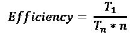
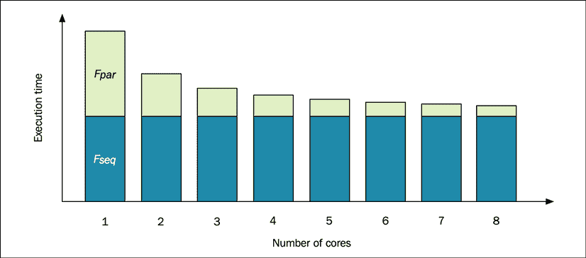
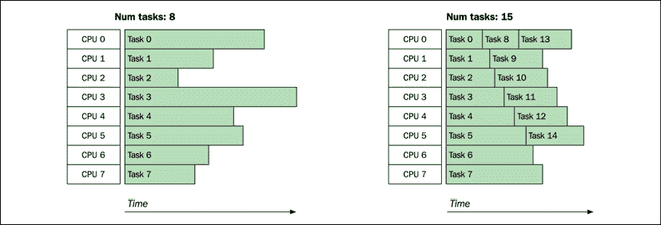
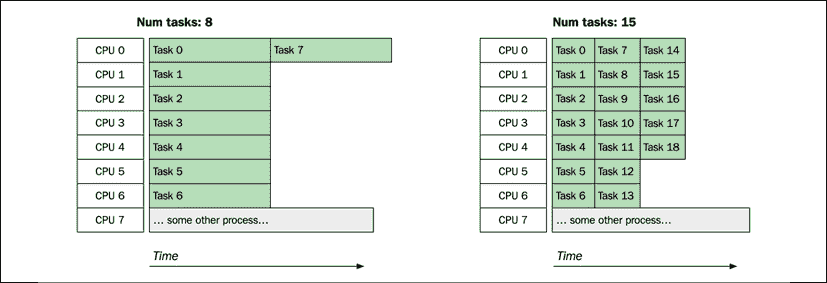
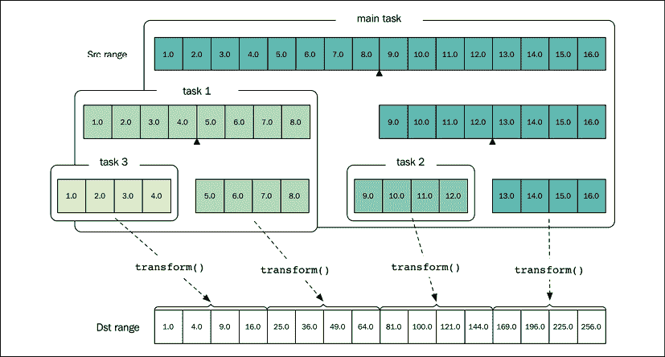
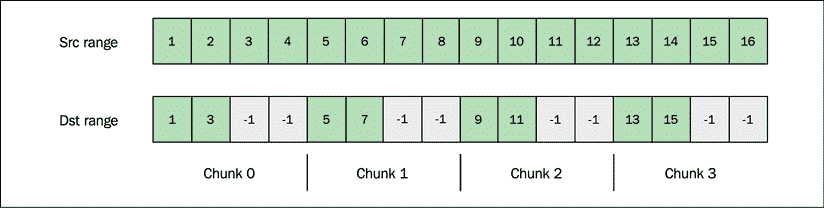
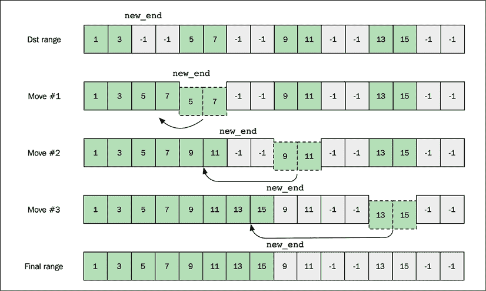

# 十四、并行算法

前面几章集中讨论了如何通过使用线程和协程在我们的程序中引入并发和异步。本章着重于独立任务的并行执行，它与并发性相关但又不同。

在前面的章节中，我强调我更喜欢标准的库算法，而不是手工的`for`-循环。在本章中，您将看到在 C++ 17 引入的执行策略中使用标准库算法的一些巨大优势。

这一章不会深入探讨并行算法或并行编程的理论，因为这些主题太复杂了，无法在一章中涵盖。此外，有许多关于这个主题的书。相反，本章将采用一种更实用的方法，并演示如何扩展当前的 C++ 代码库来利用并行性，同时保持代码库的可读性。换句话说，我们不希望并行性妨碍可读性；相反，我们希望将并行性抽象出来，这样代码的并行化就只是改变算法参数的问题。

在本章中，您将学习:

*   用于实现并行算法的各种技术
*   如何评估并行算法的性能
*   如何调整代码库以使用标准库算法的并行扩展

并行编程是一个复杂的话题，所以在开始之前，首先需要了解引入并行的动机。

# 平行的重要性

从程序员的角度来看，如果现在的计算机硬件是 100 GHz 的单核 CPU，而不是 3 GHz 的多核 CPU，那就非常方便了；我们不需要关心并行性。不幸的是，让单核处理器越来越快已经达到了物理极限。因此，随着计算机硬件向多核处理器和可编程图形处理器方向发展，程序员必须使用高效的并行模式来充分利用硬件。

并行算法允许我们通过在多核 CPU 或 GPU 上同时执行多个独立任务或子任务来优化程序。

# 并行算法

如*第 11 章*、*并发*所述，术语*并发*和*并行*可能会有点难以区分。提醒一下，如果一个程序有多个独立的控制流在重叠的时间段内运行，那么它就被称为并发运行。另一方面，并行程序同时(完全同时)执行多个任务或子任务，这需要具有多个内核的硬件。我们使用并行算法来优化延迟或吞吐量。如果我们没有能够同时执行多个任务以获得更好性能的硬件，那么并行化算法是没有意义的。下面将介绍几个简单的公式，帮助您了解在评估并行算法时需要考虑哪些因素。

## 评估并行算法

在本章中，**加速**被定义为算法的顺序和并行版本之间的比，如下所示:

<figure class="mediaobject"></figure>

*T* <sub class="italic">1</sub> 是使用在一个核上执行的顺序算法解决问题所花费的时间，*T*T6【n】T7 是使用 *n* 个核解决相同问题所花费的时间。*时间*指挂钟时间(不是 CPU 时间)。

与顺序算法相比，并行算法通常更复杂，需要更多的计算资源(例如，中央处理器时间)。并行版本的好处来自于将算法分散到几个处理单元的能力。

考虑到这一点，同样值得注意的是，并非所有算法在并行运行时都能获得相同的性能提升。并行算法的**效率**可以通过以下公式计算:

<figure class="mediaobject"></figure>

在这个公式中， *n* 是执行算法的核心数。由于*T*<sub class="italic">1</sub>/*T*<sub class="italic">n</sub>表示加速，所以效率也可以表示为*加速* / *n* 。

如果效率为 *1.0* ，算法并行化完美。例如，这意味着我们在具有八个内核的计算机上执行并行算法时，可以实现 8 倍的加速。然而，在实践中，有许多参数限制了并行执行，例如创建线程、内存带宽和上下文切换，如*第 11 章*、*并发中所述。*因此，通常情况下，效率远低于 1.0。

并行算法的效率取决于如何独立处理每个工作块。例如，`std::transform()`对于并行化来说是微不足道的，因为每个元素彼此完全独立地被处理。这将在本章后面进行演示。

效率还取决于问题大小和内核数量。例如，由于并行算法增加的复杂性导致的开销，并行算法在小数据集上的性能可能非常差。同样，在大量内核上执行程序可能会遇到计算机中的其他瓶颈，例如内存带宽。我们说，当我们改变内核数量和/或输入大小时，如果效率保持不变，则并行算法可以扩展。

记住并非程序的所有部分都可以并行化也很重要。这一事实限制了程序的理论最大加速，即使我们有无限数量的内核。我们可以使用*第三章*、*分析和测量性能*中介绍的**阿姆达尔定律**来计算最大可能加速比。

## 重新审视阿姆达尔定律

在这里，我们将把阿姆达尔定律应用于并行程序。它是这样工作的:一个程序的总运行时间可以分成两个不同的部分或*分数*:

*   *F* <sub class="italic">seq</sub> 是程序中只能依次*执行的部分*
*   *F* <sub class="italic">par</sub> 是可以在*并行*中执行的程序的分数

由于这两个分数一起组成了整个程序，这意味着*F*<sub xmlns:epub="http://www.idpf.org/2007/ops" class="italic">seq</sub>= 1-*F*T6】par。现在，阿姆达尔定律告诉我们，在 *n 个*核上执行的程序的**最大加速比**为:

<figure class="mediaobject"></figure>

为了直观显示这个定律的效果，下图显示了一个程序的执行时间，顺序部分在底部，并行部分在顶部。增加内核数量只会影响并行分数，这将对最大加速进行限制:

<figure class="mediaobject"></figure>

图 14.1:阿姆达尔定律定义了最大加速比；在这种情况下，它是 2x

在上图中，在单个 CPU 上运行时，顺序部分占执行时间的 50%。因此，在执行这样的程序时，我们通过增加更多内核可以实现的最大加速是 2 倍。

为了让您对如何实现并行算法有所了解，我们现在将通过几个示例。我们将从`std::transform()`开始，因为它相对容易分裂成多个独立的部分。

## 实现并行标准::转换()

虽然从算法上来说`std::transform()`很容易实现，但实际上，即使是实现一个的初级并行版本也比乍看起来要复杂。

算法`std::transform()`为序列中的每个元素调用一个函数，并将结果存储在另一个序列中。`std::transform()`的顺序版本的一个可能的实现可能看起来像这样:

```cpp
template<class SrcIt, class DstIt, class Func>
auto transform(SrcIt first, SrcIt last, DstIt dst, Func func) {
  while (first != last) {
      *dst++ = func(*first++);
  }
} 
```

标准库版本也返回`dst`迭代器，但是在我们的例子中我们将忽略它。为了理解`std::transform()`并行版本的挑战，让我们从一个天真的方法开始。

### 幼稚的实现

`std::transform()`的一个天真的并行实现可能看起来像这样:

*   将元素分成与计算机内核数量相对应的块
*   在单独的任务中处理每个块
*   等待所有任务完成

使用`std::thread::hardware_concurrency()`确定支持的硬件线程数量，一个可能的实现如下所示:

```cpp
template <typename SrcIt, typename DstIt, typename Func>
auto par_transform_naive(SrcIt first, SrcIt last, DstIt dst, Func f) {
  auto n = static_cast<size_t>(std::distance(first, last));
  auto n_cores = size_t{std::thread::hardware_concurrency()};
  auto n_tasks = std::max(n_cores, size_t{1});
  auto chunk_sz = (n + n_tasks - 1) / n_tasks;
  auto futures = std::vector<std::future<void>>{};
  // Process each chunk on a separate
  for (auto i = 0ul; i < n_tasks; ++ i) {
    auto start = chunk_sz * i;
    if (start < n) {
      auto stop = std::min(chunk_sz * (i + 1), n);
      auto fut = std::async(std::launch::async,
         [first, dst, start, stop, f]() {
          std::transform(first + start, first + stop, dst + start, f);
      });
      futures.emplace_back(std::move(fut));
    }
  }
  // Wait for each task to finish
  for (auto&& fut : futures) {
    fut.wait();
  }
} 
```

请注意，`hardware_concurrency()`可能会返回`0`，如果由于某种原因，它是不确定的，因此被箝位为至少一个。

`std::transform()`和我们的并行版本之间的一个细微差别是，它们对迭代器提出了不同的要求。`std::transform()`可以对绑定到`std::cin`的`std::istream_iterator<>`等输入输出迭代器进行操作。这对于`par_transform_naive()`是不可能的，因为迭代器是从多个任务中复制和使用的。正如您将看到的，本章中没有可以对输入和输出迭代器进行操作的并行算法。相反，并行算法至少需要允许多遍遍历的前向迭代器。

#### 性能赋值

继续的天真实现，让我们用一个简单的性能评估来衡量它的性能，与在单个 CPU 内核上执行的`std::transform()`的顺序版本相比。

在这个测试中，我们将测量时间(墙上的时钟)和改变数据输入大小时花费在 CPU 上的总时间。

我们将使用*第 3 章*、*性能分析和测量*中介绍的谷歌基准来设置该基准。为了避免代码重复，我们将实现一个为我们的基准测试设置测试夹具的函数。夹具需要一个带有一些示例值的源范围、一个结果的目标范围和一个转换函数:

```cpp
auto setup_fixture(int n) {
  auto src = std::vector<float>(n);
  std::iota(src.begin(), src.end(), 1.0f); // Values from 1.0 to n
  auto dst = std::vector<float>(src.size());
  auto transform_function = [](float v) { 
    auto sum = v;
    for (auto i = 0; i < 500; ++ i) {
      sum += (i * i * i * sum);
    }
    return sum;
  };
  return std::tuple{src, dst, transform_function};
} 
```

现在我们已经建立了我们的夹具，是时候实施实际的基准了。会有两个版本:一个是顺序版本`std::transform()`，一个是我们的并行版本`par_transform_naive()`:

```cpp
void bm_sequential(benchmark::State& state) {
  auto [src, dst, f] = setup_fixture(state.range(0));
  for (auto _ : state) {
    std::transform(src.begin(), src.end(), dst.begin(), f);
  }
}
void bm_parallel(benchmark::State& state) {
  auto [src, dst, f] = setup_fixture(state.range(0));
  for (auto _ : state) {
    par_transform_naive(src.begin(), src.end(), dst.begin(), f);
  }
} 
```

仅测量`for`循环内的代码。通过使用`state.range(0)`作为输入大小，我们可以通过向每个基准添加一系列值来生成不同的值。事实上，我们需要为每个基准测试指定几个参数，因此我们创建了一个助手函数来应用我们需要的所有设置:

```cpp
void CustomArguments(benchmark::internal::Benchmark* b) {
  b->Arg(50)->Arg(10'000)->Arg(1'000'000)  // Input size
      ->MeasureProcessCPUTime()            // Measure all threads
      ->UseRealTime()                      // Clock on the wall 
      ->Unit(benchmark::kMillisecond);     // Use ms
} 
```

关于自定义参数需要注意的几点:

*   我们将值 50、10，000 和 1，000，000 作为参数传递给基准。在`setup_fixture()`函数中创建向量时，它们被用作输入大小。使用测试功能中的`state.range(0)`可以访问这些值。
*   默认情况下，Google Benchmark 只测量主线程上的 CPU 时间。但是由于我们对所有线程的总 CPU 时间感兴趣，所以我们使用`MeasureProcessCPUTime()`。
*   谷歌基准测试决定每个测试需要重复多少次，直到达到统计稳定的结果。我们希望库为此使用挂钟时间，而不是 CPU 时间，因此我们应用设置`UseRealTime()`。

差不多了。最后，注册基准并致电 main:

```cpp
BENCHMARK(bm_sequential)->Apply(CustomArguments);
BENCHMARK(bm_parallel)->Apply(CustomArguments);
BENCHMARK_MAIN(); 
```

在打开优化(使用带有-O3 的 gcc)的情况下编译了这段代码之后，我在一台使用八个内核的笔记本电脑上执行了这个基准测试。下表显示了使用 50 个元素时的结果:

<colgroup><col> <col> <col> <col></colgroup> 
| 算法 | 中央处理器 | 时间 | 加速 |
| `std::transform()` | 0.02 毫秒 | 0.02 毫秒 | 0.25 倍 |
| `par_transform_naive()` | 0.17 毫秒 | 0.08 毫秒 |

*CPU* 是花在 CPU 上的总时间。*时间*是挂钟时间，也是我们最感兴趣的。*加速*是比较顺序版本和并行版本经过的时间时的相对加速(本例中为 0.02/0.08)。

显然，对于这个只有 50 个元素的小数据集，顺序版本优于并行算法。有了 10，000 个元素，我们才真正开始看到并行化的好处:

<colgroup><col> <col> <col> <col></colgroup> 
| 算法 | 中央处理器 | 时间 | 加速 |
| `std::transform()` | 0.89 毫秒 | 0.89 毫秒 | 4.5 倍 |
| `par_transform_naive()` | 1.95 毫秒 | 0.20 毫秒 |

最后，使用 1，000，000 个元素会给我们带来更高的效率，如下表所示:

<colgroup><col> <col> <col> <col></colgroup> 
| 算法 | 中央处理器 | 时间 | 加速 |
| `std::transform()` | 9071 毫秒 | 9092 毫秒 | 7.3 倍 |
| `par_transform_naive()` | 9782 毫秒 | 1245 毫秒 |

这次最后一次运行的并行算法效率真的很高。它在八个内核上执行，因此效率为 7.3x/8 = 0.925。这里给出的结果(绝对执行时间和相对加速)不应该太依赖。其中，结果取决于计算机体系结构、操作系统调度程序以及执行测试时机器上当前正在运行的其他工作。然而，基准测试结果证实了前面讨论的几个要点:

*   对于小数据集，顺序版本`std::transform()`比并行版本快得多，因为创建线程等会产生开销。
*   与`std::transform()`相比，并行版本总是使用更多的计算资源(CPU 时间)。
*   对于大型数据集，当测量挂钟时间时，并行版本优于顺序版本。在八核机器上运行时，加速比超过 7 倍。

我们的算法效率高(至少在大数据集上)的一个原因是计算成本分布均匀，每个子任务都是高度独立的。然而，情况并非总是如此。

#### 幼稚实现的缺点

如果每个工作块都有相同的计算成本，并且算法在没有其他应用使用硬件的环境中执行，那么简单的实现可能会做得很好。然而，情况很少如此；相反，我们想要一个既高效又可扩展的好的通用并行实现。

下面的插图显示了我们想要避免的问题。如果每个区块的计算成本不相等，则实现仅限于耗时最多的区块:

<figure class="mediaobject"></figure>

图 14.2:计算时间与块大小不成比例的可能情况

如果应用和/或操作系统有其他进程要处理，操作将不会并行处理所有区块:

<figure class="mediaobject"></figure>

图 14.3:计算时间与块大小成比例的可能情况

在*图 14.3* 中可以看到，将操作拆分成更小的块，使得并行化调整到当前条件，避免了单个任务拖住整个操作。

还要注意，对于小数据集，天真的实现是不成功的。有许多方法可以调整幼稚的实现，以获得更好的性能。例如，我们可以通过将内核数量乘以某个大于 1 的因子来创建更多任务和更小的任务。或者，为了避免小数据集上的大量开销，我们可以让块大小决定要创建的任务数量等。

现在，您已经了解了如何实现和评估一个简单的并行算法。我们不会对幼稚的实现进行任何微调；相反，我将展示一种在实现并行算法时使用的不同的有用技术。

### 分步解决

将问题划分为更小子问题的算法技术称为**分治**。我们将在这里使用分治法实现另一个版本的并行变换算法。其工作原理如下:如果输入范围小于指定的阈值，则处理该范围；否则，范围将被分成两部分:

*   第一部分在新分支的任务上处理
*   另一部分在调用线程中递归处理

下图显示了分治算法如何使用以下数据和参数递归转换一个范围:

*   范围大小:16
*   源范围包含从 1.0 到 16.0 的浮动
*   块大小:4
*   变换函数:`[](auto x) { return x*x; }`

<figure class="mediaobject"></figure>

图 14.4:一个范围被递归划分用于并行处理。源数组包含从 1.0 到 8.0 的浮点值。目标数组包含转换后的值。

在*图 14.4* 中，你可以看到主任务生成了两个异步任务(**任务 1** 和**任务 2** )最后对范围内的最后一个组块进行变换。**任务 1** 生成**任务 3** ，然后变换剩余的包含值 5.0、6.0、7.0 和 8.0 的元素。让我们开始实施。

#### 履行

就实现而言，这是相当小的一部分代码。传入的范围被递归地分成两个块；第一个块作为新任务调用，第二个块在同一任务上递归处理:

```cpp
template <typename SrcIt, typename DstIt, typename Func>
auto par_transform(SrcIt first, SrcIt last, DstIt dst,
                   Func func, size_t chunk_sz) {
  const auto n = static_cast<size_t>(std::distance(first, last));
  if (n <= chunk_sz) {
    std::transform(first, last, dst, func);
    return;
  }
  const auto src_middle = std::next(first, n / 2);
  // Branch of first part to another task
  auto future = std::async(std::launch::async, [=, &func] {
    par_transform(first, src_middle, dst, func, chunk_sz);
  });
  // Recursively handle the second part
  const auto dst_middle = std::next(dst, n / 2);
  par_transform(src_middle, last, dst_middle, func, chunk_sz);
  future.wait(); 
} 
```

像这样将递归和多线程结合在一起可能需要一段时间才能理清思路。在下面的例子中，您将会看到在实现更复杂的算法时也可以使用这种模式。但首先，让我们看看它的表现。

#### 性能赋值

为了评估我们的新版本，我们将通过更新转换功能来修改基准夹具，根据输入值，该版本需要更多的时间。输入值的范围将通过使用`std::iota()`填充该范围来增加。这样做意味着算法需要处理不同大小的作业。以下是新的`setup_fixture()`功能:

```cpp
auto setup_fixture(int n) {
  auto src = std::vector<float>(n);
  std::iota(src.begin(), src.end(), 1.0f);  // From 1.0 to n
  auto dst = std::vector<float>(src.size());
  auto transform_function = [](float v) { 
    auto sum = v;
    auto n = v / 20'000;                  // The larger v is, 
    for (auto i = 0; i < n; ++ i) {        // the more to compute
      sum += (i * i * i * sum);
    }
    return sum;
  };
  return std::tuple{src, dst, transform_function};
} 
```

现在，我们可以尝试通过使用块大小的递增参数来找到分治算法要使用的最佳块大小。看看我们的分而治之算法与这个新夹具上的天真版本相比表现如何也将是有趣的，这个新夹具需要处理不同大小的作业。下面是完整的代码:

```cpp
// Divide and conquer version
void bm_parallel(benchmark::State& state) {
  auto [src, dst, f] = setup_fixture(10'000'000);
  auto n = state.range(0);        // Chunk size is parameterized
  for (auto _ : state) {
    par_transform(src.begin(), src.end(), dst.begin(), f, n);
  }
}
// Naive version
void bm_parallel_naive(benchmark::State& state) {
  auto [src, dst, f] = setup_fixture(10'000'000);
  for (auto _ : state) {
    par_transform_naive(src.begin(), src.end(), dst.begin(), f);
  }
}
void CustomArguments(benchmark::internal::Benchmark* b) {
  b->MeasureProcessCPUTime()
    ->UseRealTime()
    ->Unit(benchmark::kMillisecond);
}
BENCHMARK(bm_parallel)->Apply(CustomArguments)
  ->RangeMultiplier(10)           // Chunk size goes from 
  ->Range(1000, 10'000'000);      // 1k to 10M
BENCHMARK(bm_parallel_naive)->Apply(CustomArguments);
BENCHMARK_MAIN(); 
```

下图显示了我在使用八核英特尔酷睿 i7 CPU 的 macOS 上运行测试时所取得的结果:

<figure class="mediaobject"></figure>

图 14.5:我们的朴素算法和使用不同块大小的分治算法之间的比较

当使用大约 10，000 个元素的块时，达到了最佳效率，这创建了 1，000 个任务。对于较大的块，性能在处理最终块所需的时间上受到瓶颈，而与计算相比，过小的块导致创建和调用任务的开销过大。

这个例子的一个要点是，调度 1000 个小任务而不是几个大任务的性能损失在这里不是问题。使用线程池限制线程数量是可能的，但是`std::async()`在这种情况下似乎工作得相当好。通用实现会选择使用相当多的任务，而不是试图匹配内核的确切数量。

在实现并行算法时，找到块大小和任务数量的最佳值是一个真正的问题。如您所见，这取决于许多变量，也取决于是否针对延迟或吞吐量进行了优化。获得洞察力的最好方法是在你的算法应该运行的环境中进行测量。

现在，您已经学习了如何使用分治法实现并行转换算法，让我们看看如何将相同的技术应用于其他问题。

## 实现并行标准::计数 _if()

分治法的一个好处是它可以应用于许多问题。我们可以很容易地使用相同的技术来实现`std::count_if()`的并行版本，不同的是我们需要累加返回值，如下所示:

```cpp
template <typename It, typename Pred> 
auto par_count_if(It first, It last, Pred pred, size_t chunk_sz) { 
  auto n = static_cast<size_t>(std::distance(first, last)); 
  if (n <= chunk_sz) 
    return std::count_if(first, last, pred);
  auto middle = std::next(first, n/2); 
  auto fut = std::async(std::launch::async, [=, &pred] { 
    return par_count_if(first, middle, pred, chunk_sz); 
  }); 
  auto num = par_count_if(middle, last, pred, chunk_sz); 
  return num + fut.get(); 
} 
```

如您所见，这里唯一的区别是我们需要在函数的末尾对结果求和。如果你想让块的大小取决于核心的数量，你可以很容易地将`par_count_if()`包装在一个外部函数中:

```cpp
template <typename It, typename Pred> 
auto par_count_if(It first, It last, Pred pred) { 
  auto n = static_cast<size_t>(std::distance(first, last));
  auto n_cores = size_t{std::thread::hardware_concurrency()};
  auto chunk_sz = std::max(n / n_cores * 32, size_t{1000});

  return par_count_if(first, last, pred, chunk_sz);
} 
```

这里的神奇数字 32 是一个有些任意的因素，如果给我们一个大的输入范围，它会给我们更多的块和更小的块。像往常一样，我们需要测量性能，以得出一个好的常数。现在让我们继续，尝试解决一个更复杂的并行算法。

## 实现并行标准::copy_if()

我们已经看了`std::transform()`和`std::count_if()`，它们很容易顺序和并行实现。如果我们采用另一种很容易按顺序实现的算法`std::copy_if()`，并行执行就会困难得多。

依次实现`std::copy_if()`就这么简单:

```cpp
template <typename SrcIt, typename DstIt, typename Pred> 
auto copy_if(SrcIt first, SrcIt last, DstIt dst, Pred pred) { 
  for (auto it = first; it != last; ++ it) { 
    if (pred(*it)) { 
      *dst = *it; 
      ++ dst;
    }
  }
  return dst;
} 
```

为了演示如何使用它，请考虑以下示例，其中我们有一个包含整数序列的范围，并且我们只想将奇数复制到另一个范围中:

```cpp
const auto src = {1, 2, 3, 4}; 
auto dst = std::vector<int>(src.size(), -1); 
auto new_end = std::copy_if(src.begin(), src.end(), dst.begin(), 
                            [](int v) { return (v % 2) == 1; }); 
// dst is {1, 3, -1, -1}
dst.erase(new_end, dst.end()); // dst is now {1, 3} 
```

现在，如果我们想制作`copy_if()`的并行版本，我们会立即遇到问题，因为我们不能同时写入目标迭代器。这是一次行为未定义的失败尝试，因为两个任务将写入目标范围内的相同位置:

```cpp
// Warning: Undefined behavior
template <typename SrcIt, typename DstIt, typename Func> 
auto par_copy_if(SrcIt first, SrcIt last, DstIt dst, Func func) { 
  auto n = std::distance(first, last);
  auto middle = std::next(first, n / 2); 
  auto fut0 = std::async([=]() { 
    return std::copy_if(first, middle, dst, func); }); 
  auto fut1 = std::async([=]() { 
    return std::copy_if(middle, last, dst, func); });
  auto dst0 = fut0.get();
  auto dst1 = fut1.get();
  return *std::max(dst0, dst1); // Just to return something...
} 
```

我们现在有两种简单的方法:要么同步我们写入的索引(通过使用原子/无锁变量)，要么将算法分成两部分。接下来我们将探讨这两种方法。

### 方法 1:使用同步写入位置

我们可能考虑的第一种方法是通过使用原子`size_t`和`fetch_add()`成员函数来同步写位置，正如您在*第 11 章*、*并发*中所了解的。每当一个线程试图写一个新元素时，它获取当前索引并自动添加一个；因此，每个值都被写入一个唯一的索引。

在我们的代码中，我们将算法分成两个函数:内部函数和外部函数。原子写索引将在外部函数中定义，而算法的主要部分将在内部函数中实现。

#### 内部功能

内部的函数需要一个原子`size_t`来同步写位置。由于算法是递归的，不能存储原子`size_t`本身；它需要一个外部函数来调用算法:

```cpp
template <typename SrcIt, typename DstIt, typename Pred>
void inner_par_copy_if_sync(SrcIt first, SrcIt last, DstIt dst,
                            std::atomic_size_t& dst_idx,
                            Pred pred, size_t chunk_sz) {
  const auto n = static_cast<size_t>(std::distance(first, last));
  if (n <= chunk_sz) {
    std::for_each(first, last, [&](const auto& v) {
      if (pred(v)) {
        auto write_idx = dst_idx.fetch_add(1);
        *std::next(dst, write_idx) = v;
      }
    });
    return;
  }
  auto middle = std::next(first, n / 2);
  auto future = std::async([first, middle, dst, chunk_sz, &pred, &dst_idx] {
    inner_par_copy_if_sync(first, middle, dst, dst_idx, pred, chunk_sz);
  });
  inner_par_copy_if_sync(middle, last, dst, dst_idx, pred, chunk_sz);
  future.wait();
} 
```

这仍然是一个各个击破的算法，希望你会开始看到我们正在使用的模式。写索引`dst_idx`的原子更新确保了多个线程永远不会写入目标序列中的同一个索引。

#### 外部函数

从客户端代码调用的外部函数只是原子`size_t`的占位符，它被初始化为零。然后，该函数初始化内部函数，从而进一步并行化代码:

```cpp
template <typename SrcIt, typename DstIt, typename Pred>
auto par_copy_if_sync(SrcIt first,SrcIt last,DstIt dst,
                      Pred p, size_t chunk_sz) {
  auto dst_write_idx = std::atomic_size_t{0};
  inner_par_copy_if_sync(first, last, dst, dst_write_idx, p, chunk_sz);
  return std::next(dst, dst_write_idx);
} 
```

一旦内部函数返回，我们可以使用`dst_write_idx`来计算目标范围的结束迭代器。现在让我们看看解决同样问题的另一种方法。

### 方法 2:将算法分成两部分

第二种方法是将算法分成两部分。首先，在并行块中执行条件复制，然后将得到的稀疏范围压缩为连续范围。

#### 第一部分–将元素并行复制到目标范围

第一部分以块的形式复制元素，从而产生稀疏的目标数组，如图 14.6*所示。每个块都有条件地并行复制，结果范围迭代器存储在`std::future`对象中，供以后检索:*

<figure class="mediaobject"></figure>

图 14.6:条件复制第一步后的稀疏目标范围

下面的代码实现了算法的前半部分:

```cpp
template <typename SrcIt, typename DstIt, typename Pred>
auto par_copy_if_split(SrcIt first, SrcIt last, DstIt dst, 
                       Pred pred, size_t chunk_sz) -> DstIt {
  auto n = static_cast<size_t>(std::distance(first, last));
  auto futures = std::vector<std::future<std::pair<DstIt, DstIt>>>{};
  futures.reserve(n / chunk_sz);
  for (auto i = size_t{0}; i < n; i += chunk_sz) {
    const auto stop_idx = std::min(i + chunk_sz, n);
    auto future = std::async([=, &pred] {
      auto dst_first = dst + i;
      auto dst_last = std::copy_if(first+i, first+stop_idx,                                   dst_first, pred);
      return std::make_pair(dst_first, dst_last);
    });
    futures.emplace_back(std::move(future));
  }
  // To be continued ... 
```

我们现在已经将元素(应该复制的)复制到稀疏目标范围中。是时候通过将元素向左移动来填补空白了。

#### 第二部分–将稀疏范围按顺序移动到连续范围

创建稀疏范围时，使用每个`std::future`的结果值进行合并。当零件重叠时，合并按顺序执行:

```cpp
 // ...continued from above... 
  // Part #2: Perform merge of resulting sparse range sequentially 
  auto new_end = futures.front().get().second; 
  for (auto it = std::next(futures.begin()); it != futures.end(); ++ it)  { 
    auto chunk_rng = it->get(); 
    new_end = std::move(chunk_rng.first, chunk_rng.second, new_end);
  } 
  return new_end; 
} // end of par_copy_if_split 
```

算法的第二部分将所有子范围移动到范围的开头，如下图所示:

<figure class="mediaobject"></figure>

图 14.7:将稀疏范围合并成连续范围

随着两个算法解决同一个问题，是时候看看它们如何达标了。

### 性能赋值

使用这个并行版本的`copy_if()`带来的性能提升在很大程度上取决于谓词的开销。因此，我们在基准测试中使用了两个不同的谓词，计算成本不同。这里是*廉*谓词:

```cpp
auto is_odd = [](unsigned v) { 
  return (v % 2) == 1; 
}; 
```

越昂贵的*谓词检查其参数是否是质数:*

```cpp
auto is_prime = [](unsigned v) {
  if (v < 2) return false;
  if (v == 2) return true;
  if (v % 2 == 0) return false;
  for (auto i = 3u; (i * i) <= v; i+=2) {
    if ((v % i) == 0) {
      return false; 
     }
  }
  return true;
}; 
```

注意，这并不是实现`is_prime()`的特别优化的方式，这里仅用于基准测试的目的。

基准测试代码在这里没有详细说明，但是包含在附带的源代码中。比较了三种算法:`std::copy_if()`、`par_copy_if_split()`和`par_copy_if_sync()`。下图显示了使用英特尔酷睿 i7 处理器测量的结果。在这个基准测试中，并行算法使用的块大小为 100，000。

<figure class="mediaobject"></figure>

图 14.8:条件复制策略与计算时间的关系

衡量性能时最明显的观察是同步版本`par_copy_if_sync()`在使用廉价的`is_odd()`谓词时有多慢。灾难性的性能实际上不是由于原子写索引；相反，这是因为硬件的缓存机制由于几个线程写入同一缓存行而被破坏(正如您在*第 7 章*、*内存管理*中了解到的)。

所以，有了这些知识，我们现在明白为什么`par_copy_if_split()`表现更好了。在便宜的谓词上，`is_odd()`、`par_copy_if_split()`比`std::copy_if()`快 2 倍左右，但是有了昂贵的`is_prime()`，效率几乎提高到 5 倍。效率的提高是因为在并行执行的算法的第一部分花费了大部分计算。

您现在应该已经掌握了一些可以用于并行化算法的技术。当使用标准库中的并行算法时，这些新的见解将帮助您理解需求和期望。

# 并行标准库算法

从 C++ 17 开始，标准库已经用大多数(但不是全部)算法的并行版本进行了扩展。更改您的算法以允许并行执行只是添加一个参数，告诉算法使用哪个并行执行策略。

正如本书前面所强调的，如果您的代码库基于标准的库算法，或者至少如果您有使用算法编写 C++ 的习惯，那么通过在合适的地方添加执行策略，您将几乎免费获得即时的性能提升:

```cpp
auto v = std::vector<std::string>{ 
  "woody", "steely", "loopy", "upside_down" 
};
// Parallel sort
std::sort(std::execution::par, v.begin(), v.end()); 
```

一旦您指定了执行策略，您就进入了并行算法的领域，与最初的顺序版本相比，并行算法有一些显著的不同。首先，最小迭代器类别要求从输入迭代器变为前向迭代器。其次，您的代码抛出的异常(从复制构造函数或传递给算法的函数对象)永远不会到达您这里。而是要求算法调用`std::terminate()`。第三，由于并行实现的复杂性增加，算法的复杂性保证(时间和内存)可能会放松。

当使用标准库算法的并行版本时，您需要指定一个执行策略，说明如何允许算法并行执行。然而，实现可以决定顺序执行算法。如果您比较不同标准库实现中并行算法的效率和可伸缩性，您可以预期看到很大的差异。

## 执行策略

**执行策略**通知算法执行是否可以并行化以及如何并行化。标准库的并行扩展中包含四个默认的执行策略。编译器和第三方库可以针对某些硬件和条件扩展这些策略。例如，已经可以使用供应商特定的策略，从标准库算法中使用现代显卡的并行能力。

执行策略在标题`<execution>`中定义，并位于名称空间`std::execution`中。目前有四种不同的标记类型，每个执行策略一种。您不能实例化这些类型；相反，每种类型都有一个预定义的对象。例如，并行执行策略有一个名为`std::execution::parallel_policy`的类型，该类型的预定义实例名为`std::execution::par`。每个策略有一个*类型*(而不是一个有多个预定义实例的类型)的原因是，您提供的策略可以在编译时由库来区分。

### 顺序策略

顺序执行策略`std::execution::seq`使算法以无并行性的顺序执行，类似于没有额外执行策略参数的算法的运行方式。然而，每当您指定一个执行策略时，这意味着您正在使用一个具有宽松复杂性保证和更严格迭代器要求的算法版本；它还假设你提供的代码没有抛出异常，否则算法会调用`std::terminate()`。

### 平行政策

并行执行策略`std::execution::par`可以认为是并行算法的标准执行策略。您提供给算法的代码需要是线程安全的。理解这个要求的一种方法是考虑你将要使用的算法的顺序版本中的循环体。例如，想一想`copy_if()`的顺序版本，我们在本章前面是这样拼写的:

```cpp
template <typename SrcIt, typename DstIt, typename Pred> 
auto copy_if(SrcIt first, SrcIt last, DstIt dst, Pred pred) { 
  for (auto it = first; it != last; ++ it) 
  {                            // Start of loop body
    if (pred(*it)) {           // Call predicate
      *dst = *it;              // Copy construct 
      ++ dst;
    }
  }                            // End of loop body 
  return dst;
} 
```

在该算法中，循环体内部的代码将调用您提供的谓词，并对范围内的元素调用复制赋值运算符。如果您将`std::execution::par`传递给`copy_if()`，您有责任保证这些部分是线程安全的，并且可以安全地并行执行。

让我们看一个提供不安全代码的例子，然后看看我们能做些什么。假设我们有一个字符串向量:

```cpp
auto v = std::vector<std::string>{"Ada", "APL" /* ... */ }; 
```

如果我们想使用并行算法计算向量中所有字符串的总大小，一个不充分的方法是使用`std::for_each()`，如下所示:

```cpp
auto tot_size = size_t{0};
std::for_each(std::execution::par, v.begin(), v.end(),
              [&](const auto& s) { 
  tot_size += s.size(); // Undefined behavior, data race!
}); 
```

由于函数对象的主体不是线程安全的(因为它从多个线程更新共享变量)，这段代码表现出未定义的行为。当然，我们可以用`std::mutex`来保护`tot_size`变量，但是这将会破坏并行执行这段代码的全部目的，因为互斥体一次只允许一个线程进入主体。使用`std::atomic`数据类型将是另一种选择，但这也会降低效率。

这里的解决办法是*根本不用*来解决这个问题。相反，我们可以使用`std::transform_reduce()`或`std::reduce()`，它们是为这种工作量身定做的。以下是使用`std::reduce()`的方法:

```cpp
auto tot_size = std::reduce(std::execution::par, v.begin(), v.end(),                             size_t{0}, [](auto i, const auto& s) { 
  return i + s.size();   // OK! Thread safe
}); 
```

通过去掉 lambda 内部的可变引用，lambda 的主体现在是线程安全的。对`std::string`对象的`const`引用没问题，因为它从不变异任何字符串对象，因此不会引入任何数据竞争。

通常，您传递给算法的代码是线程安全的，除非您的函数对象通过引用捕获对象或者具有其他副作用，例如写入文件。

### 未排序策略

C++ 20 中添加了未排序策略。它告诉算法，允许使用例如 SIMD 指令对循环进行矢量化。实际上，这意味着您不能在传递给算法的代码中使用任何同步原语，因为这可能会导致死锁。

为了理解死锁是如何发生的，我们将回到前面不充分的例子，计算向量中所有字符串的总大小。假设我们不使用`std::reduce()`，而是通过添加互斥来保护`tot_size`变量，如下所示:

```cpp
auto v = std::vector<std::string>{"Ada", "APL" /* ... */ };
auto tot_size = size_t{0};
auto mut = std::mutex{};
std::for_each(std::execution::par, v.begin(), v.end(),
              [&](const auto& s) { 
    auto lock = std::scoped_lock{mut}; // Lock
    tot_size += s.size(); 
  }                                    // Unlock
); 
```

现在使用`std::execution::par`执行这段代码是安全的，但是效率非常低。如果我们将执行策略更改为`std::execution::unseq`，结果不仅是一个低效的程序，而且是一个有死锁风险的程序！

未排序的执行策略告诉算法，它可能会以优化编译器通常不允许的方式对代码的指令重新排序。

为了使算法受益于矢量化，它需要从输入范围读取多个值，然后一次将 SIMD 指令应用于多个值。让我们分析一下`for_each()`循环中的两次迭代会是什么样子，有没有重新排序。这里有两个没有任何重新排序的循环迭代:

```cpp
{ // Iteration 1
  const auto& s = *it++ ;
  mut.lock();
  tot_size += s.size();
  mut.unlock();
}
{ // Iteration 2
  const auto& s = *it++ ;
  mut.lock();
  tot_size += s.size();
  mut.unlock();
} 
```

算法允许以如下方式合并这两次迭代:

```cpp
{ // Iteration 1 & 2 merged
  const auto& s1 = *it++ ;
  const auto& s2 = *it++ ;
  mut.lock();
  mut.lock();                // Deadlock!
  tot_size += s1.size();     // Replace these operations
  tot_size += s2.size();     // with vectorized instructions
  mut.unlock();
  mut.unlock();
} 
```

试图在同一个线程上执行这段代码将会死锁，因为我们试图连续锁定同一个互斥体两次。换句话说，当使用`std::execution::unseq`策略时，您必须确保您提供给算法的代码不会获取任何锁。

请注意，优化编译器可以随时对您的代码进行矢量化。然而，在这些情况下，就像编译器和硬件被允许执行的任何其他优化一样，由编译器来保证矢量化不会改变程序的含义。这里的不同之处在于，当向算法明确提供`std::execute::unseq`策略时，*保证您提供的代码是安全的，可以进行矢量化。*

### 并行未排序策略

并行未排序策略`std::execution::par_unseq`像并行策略一样并行执行算法，此外它还可以向量化循环。

除了四个标准执行策略之外，标准库供应商还可以为您提供带有自定义行为的附加策略，并对输入设置其他约束。例如，英特尔并行 STL 库定义了四种只接受随机访问迭代器的自定义执行策略。

## 异常处理

如果您向算法提供四种标准执行策略之一，您的代码不得抛出异常，否则算法将调用`std::terminate()`。这与通常的单线程算法有很大区别，后者总是将异常传播回调用者:

```cpp
auto v = {1, 2, 3, 4};
auto f = [](auto) { throw std::exception{}; };
try {
  std::for_each(v.begin(), v.end(), f);
} catch (...) {
  std::cout << "Exception caught\n";
} 
```

使用执行策略运行相同的代码会导致调用`std::terminate()`:

```cpp
try {
  std::for_each(std::execution::seq, v.begin(), v.end(), f);
} catch (...) {
  // The thrown std:::exception never reaches us.
  // Instead, std::terminate() has been called 
} 
```

你可能认为这意味着并行算法被声明为`noexcept`，但事实并非如此。很多并行算法需要分配内存，因此允许标准并行算法本身抛出`std::bad_alloc`。

还应该说，其他库提供的执行策略可能会以不同的方式处理异常。

现在，我们将继续讨论在 C++ 17 中首次引入并行算法时添加和修改的一些算法。

## 对并行算法的添加和更改

标准库中的大多数算法都是现成的并行版本。但是，也有一些值得注意的例外，包括`std::accumulate()`和`std::for_each()`，因为它们的原始规格要求按顺序执行。

### 标准::累积()和标准::减少()

`std::accumulate()`算法不能并行化，因为它必须按照元素的顺序执行，这是不可能并行化的。取而代之的是，添加了一个名为`std::reduce()`的新算法，它的工作原理与`std::accumulate()`类似，只是它的执行是无序的。

对于交换运算，它们的结果是一样的，因为累加的顺序无关紧要。换句话说，给定一个整数范围:

```cpp
const auto r = {1, 2, 3, 4}; 
```

通过加法或乘法累加它们:

```cpp
auto sum = 
  std::accumulate(r.begin(), r.end(), 0, std::plus<int>{});

auto product = 
  std::accumulate(r.begin(), r.end(), 1, std::multiplies<int>{}); 
```

将产生与调用`std::reduce()`而不是`std::accumulate()`相同的结果，因为整数的加法和乘法都是可交换的。例如:

<figure class="mediaobject"></figure>

但是，如果运算不可交换，结果就是*不确定*，因为它取决于参数的顺序。例如，如果我们要累积如下字符串列表:

```cpp
auto v = std::vector<std::string>{"A", "B", "C"};
auto acc = std::accumulate(v.begin(), v.end(), std::string{});
std::cout << acc << '\n'; // Prints "ABC" 
```

该代码将始终产生字符串`"ABC"`。但是，通过使用`std::reduce()`，得到的字符串中的字符可以是任何顺序，因为字符串连接是不可交换的。换句话说，字符串`"A" + "B"`并不等于和`"B" + "A"`。因此，以下使用`std::reduce()`的代码可能会产生不同的结果:

```cpp
auto red = std::reduce(v.begin(), v.end(), std::string{}); 
std::cout << red << '\n'; 
// Possible output: "CBA" or "ACB" etc 
```

与性能相关的一个有趣的点是浮点数学是不可交换的。通过对浮点值使用`std::reduce()`，结果可能会有所不同，但这也意味着`std::reduce()`可能比`std::accumulate()`快得多。这是因为`std::reduce()`被允许对操作进行重新排序，并以一种`std::accumulate()`在使用严格浮点数学时不被允许的方式利用 SIMD 指令。

#### std::transform_reduce()

作为标准库算法的补充，`std::transform_reduce()`也被添加到`<numeric>`头。它确实做到了它所说的:它将一系列元素转换为`std::transform()`，然后应用一个函数对象。这使它们无序累积，如`std::reduce()`:

```cpp
auto v = std::vector<std::string>{"Ada","Bash","C++"}; 
auto num_chars = std::transform_reduce( 
  v.begin(), v.end(), size_t{0}, 
  [](size_t a, size_t b) { return a + b; },     // Reduce
  [](const std::string& s) { return s.size(); } // Transform 
); 
// num_chars is 10 
```

引入并行算法时，`std::reduce()`和`std::transform_reduce()`都被添加到 C++ 17 中。另一个必要的改变是调整`std::for_each()`的返回类型。

### std::for_each()

很少使用的属性`std::for_each()`是返回传递给它的函数对象。这使得使用`std::for_each()`在有状态函数对象中积累值成为可能。以下示例演示了一个可能的用例:

```cpp
struct Func {
  void operator()(const std::string& s) {
    res_ += s;
  };
  std::string res_{};    // State
};
auto v = std::vector<std::string>{"A", "B", "C"};
auto s = std::for_each(v.begin(), v.end(), Func{}).res_;
// s is "ABC" 
```

这种用法类似于我们使用`std::accumulate()`可以实现的，因此在尝试并行化它时也表现出相同的问题:无序执行函数对象会产生不确定的结果，因为调用顺序是未定义的。因此，`std::for_each()`的并行版本只是返回`void`。

## 并行化基于索引的 for 循环

尽管我建议使用算法，但有时特定任务需要原始的、基于索引的`for`循环。通过将算法`std::for_each()`包含在库中，标准库算法提供了基于范围的`for`循环的等价物。

然而，没有等同于基于索引的`for`循环的算法。换句话说，我们不能简单地通过向代码添加并行策略来轻松地并行化代码:

```cpp
auto v = std::vector<std::string>{"A", "B", "C"};
for (auto i = 0u; i < v.size(); ++ i) { 
  v[i] += std::to_string(i+1); 
} 
// v is now { "A1", "B2", "C3" } 
```

但是让我们看看如何通过结合算法来构建一个。正如你已经得出的结论，实现并行算法是复杂的。但是在这种情况下，我们将使用`std::for_each()`作为构建块来构建`parallel_for()`算法，从而将复杂的并行性留给`std::for_each()`。

### 将 std::for_each()与 STD::view::iota()组合在一起

基于标准库算法的基于索引的`for`循环可以通过将范围库中的`std::for_each()`与`std::views::iota()`相结合来创建(参见*第 6 章*、*范围和视图*)。它看起来是这样的:

```cpp
auto v = std::vector<std::string>{"A", "B", "C"};
auto r = std::views::iota(size_t{0}, v.size()); 
std::for_each(r.begin(), r.end(), [&v](size_t i) { 
  v[i] += std::to_string(i + 1); 
}); 
// v is now { "A1", "B2", "C3" } 
```

然后可以通过使用并行执行策略进一步并行化:

```cpp
std::for_each(std::execution::par, r.begin(), r.end(), [&v](size_t i) { 
  v[i] += std::to_string(i + 1); 
}); 
```

如前所述，当传递对 lambda 的引用时，我们必须非常小心，lambda 将像这样从多个线程调用。通过仅通过唯一索引`i`访问向量元素，我们避免了在对向量中的字符串进行变异时引入数据竞争。

### 通过包装简化结构

为了使以简洁的语法迭代索引，前面的代码被包装到一个名为`parallel_for()`的实用函数中，如下所示:

```cpp
template <typename Policy, typename Index, typename F>
auto parallel_for(Policy&& p, Index first, Index last, F f) {
  auto r = std::views::iota(first, last);
  std::for_each(p, r.begin(), r.end(), std::move(f));
} 
```

`parallel_for()`功能模板可以这样直接使用:

```cpp
auto v = std::vector<std::string>{"A", "B", "C"};
parallel_for(std::execution::par, size_t{0}, v.size(),
              [&](size_t i) { v[i] += std::to_string(i + 1); }); 
```

由于`parallel_for()`建立在`std::for_each()`之上，它接受`std::for_each()`接受的任何政策。

我们将在这一章结束时简单介绍一下 GPU，以及它们现在和将来如何用于并行编程。

# 在图形处理器上执行算法

**图形** **处理单元**(**GPU**)最初设计用于处理计算机图形渲染的点和像素。简而言之，图形处理器所做的是检索像素数据或顶点数据的缓冲区，对每个缓冲区单独执行简单的操作，并将结果存储在新的缓冲区中(最终显示)。

以下是一些可以在早期阶段在 GPU 上执行的简单、独立操作的示例:

*   将点从世界坐标转换为屏幕坐标
*   在特定点执行光照计算(通过光照计算，我指的是计算图像中特定像素的颜色)

由于这些操作可以并行执行，图形处理器被设计成并行执行小操作。后来，这些图形操作变得可编程，尽管程序是根据计算机图形编写的(也就是说，内存读取是根据从纹理读取颜色来完成的，并且结果总是作为颜色写入纹理)。这些程序被称为**着色器**。

随着时间的推移，引入了更多着色器类型的程序，着色器获得了越来越多的低级选项，例如从缓冲区读取和写入原始值，而不是从纹理读取和写入颜色值。

从技术上讲，一个中央处理器通常由几个通用的缓存内核组成，而一个图形处理器由大量高度专业化的内核组成。这意味着可伸缩性好的并行算法非常适合在 GPU 上执行。

GPU 有自己的内存，在算法可以在 GPU 上执行之前，CPU 需要在 GPU 内存中分配内存，并将数据从主内存复制到 GPU 内存。接下来发生的事情是，中央处理器在图形处理器上启动一个例程(也称为内核)。最后，中央处理器将数据从图形处理器内存复制回主内存，使其可用于在中央处理器上执行的“正常”代码。在中央处理器和图形处理器之间来回复制数据所产生的开销是图形处理器更适合批处理任务的原因之一，在批处理任务中，吞吐量比延迟更重要。

现在有几个库和抽象层可以从 C++ 访问 GPU 编程，但是标准的 C++ 在这方面几乎什么都不提供。但是并行执行策略`std::execution::par`和`std::execution::par_unseq`允许编译器将标准算法的执行从 CPU 转移到 GPU。这方面的一个例子是 NVC++，英伟达高性能计算编译器。它可以被配置为编译标准的 C++ 算法，以便在 NVIDIA GPUs 上执行。

如果你想了解更多关于 C++ 和 GPU 编程的现状，我强烈推荐王敏德([https://accu.org/video/spring-2019-day-3/wong/](https://accu.org/video/spring-2019-day-3/wong/))在 ACCU 2019 大会上的演讲*用现代 C++* 进行 GPU 编程。

## 摘要

在本章中，您已经了解了手工制作并行执行的算法的复杂性。您现在还知道如何分析、测量和调整并行算法的效率。您在学习并行算法时获得的见解将加深您对 C++ 标准库中并行算法的需求和行为的理解。C++ 自带四种标准执行策略，编译器厂商可以对其进行扩展。这为将图形处理器用于标准算法打开了大门。下一个 C++ 标准 C++ 23 很可能会增加对 GPU 并行编程的支持。

你现在已经读到这本书的结尾了。恭喜你！性能是代码质量的一个重要方面。但是，性能往往以牺牲其他质量方面为代价，比如可读性、可维护性和正确性。掌握编写高效干净代码的艺术需要实践训练。我希望你已经从这本书中学到了一些东西，你可以在创建令人惊叹的软件时将其融入到你的日常生活中。

解决绩效问题通常归结为愿意进一步调查事情。通常情况下，它需要充分了解硬件和底层操作系统，以便能够从测量数据中得出结论。当我觉得有必要的时候，这本书已经触及了这些方面的表面。在第二版中写了关于 C++ 20 的特性之后，我现在期待着开始在我作为软件开发人员的职业中使用这些特性。正如我之前提到的，本书中的许多代码目前只得到编译器的部分支持。我将继续更新 GitHub 存储库，并添加关于编译器支持的信息。祝你好运！

**分享你的经历**

谢谢你抽出时间来读这本书。如果你喜欢这本书，帮助别人找到它。在[https://www.amazon.com/dp/1839216549](https://www.amazon.com/dp/1839216549)留下评论。*