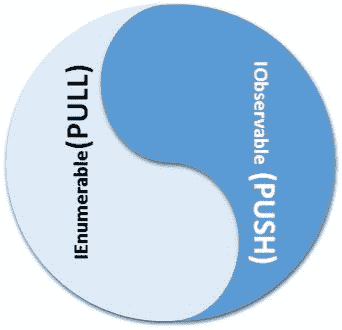

# 反应式编程模型–概述和历史

X Windows 系统、微软 Windows 和 IBM OS/2 演示管理器使 GUI 编程在 PC 平台上流行起来。这是对之前存在的字符模式用户界面和批处理风格编程模型的重大转变。对事件的响应成为全球软件开发人员的主要关注点，平台供应商求助于创建基于 C 的低级 API，这些 API 依赖于函数指针和回调来使程序员能够处理事件。编程模型大多基于协作多线程模型，随着更好的微处理器的出现，大多数平台开始支持先发制人的多线程。处理事件(和其他异步任务)变得更加复杂，以传统方式响应事件变得不太可扩展。尽管出现了优秀的基于 C++ 的图形用户界面工具包，但事件处理主要是使用消息标识、基于函数指针的调度和其他低级技术来完成的。一家著名的编译器供应商甚至尝试在 C++ 语言中添加语言扩展，以实现更好的 Windows 编程。处理事件、异步和相关的问题需要重新看待问题。幸运的是，现代 C++ 标准支持函数式编程、语言级并发(带有内存模型)和更好的内存管理技术，使程序员能够处理异步数据流(通过将事件视为流)。这是使用称为反应式编程的编程模型来实现的。为了客观地看待问题，本章将概述以下主题:

*   事件驱动编程模型及其在各种平台上的实现。
*   什么是反应式编程？
*   反应式编程的不同模型。
*   一些简单的程序，使概念理解更好。
*   我们书的哲学。

# 事件驱动编程模型

事件驱动编程是一种编程模型，其中流程控制由事件决定。事件的例子有鼠标点击、按键、手势、传感器数据、来自其他程序的消息等等。一个事件驱动的应用程序有一种机制，可以在接近实时的基础上检测事件，并通过调用适当的事件处理过程来响应或反应它们。由于早期的大部分事件处理程序都是用 C/C++ 编写的，因此它们采用了回调(使用函数指针)等低级技术来编写这些事件处理程序。后来的系统，如 Visual Basic、Delphi 和其他快速应用程序开发工具，确实增加了对事件驱动编程的本地支持。为了更清楚地说明问题，我们将参观各个平台的事件处理机制。这将帮助读者理解反应式编程模型正在解决的问题(从图形用户界面编程上下文)。

Reactive programming treats data as streams and events in windowing systems can be treated as streams to be processed in a uniform manner. The Reactive programming model provides support for gathering events from different sources as streams, filtering streams, the transformation of streams, performing actions on streams, and so on. The programming model handles asynchrony, scheduling details as part of the framework. This chapter is mostly based on the key data structures of the Reactive programming model and how we can implement basic Reactive programs. In an industrial-strength reactive program, the code written will be asynchronous and the examples from this chapter are synchronous. We give the necessary background information and language constructs in the following chapters before out of order execution and schedules are discussed. These implementations are here for elucidation and can be treated as learning examples.

# 事件驱动编程

X Windows 编程模型是一个跨平台的 API，大部分在 POSIX 系统上支持，甚至已经移植到微软 Windows。事实上，X 是一个网络窗口协议，它需要一个窗口管理器来管理窗口堆栈。屏幕内容由 X 服务器管理，客户端库将提取内容并在本地机器上显示。在桌面环境中，服务器在同一台机器上本地运行。以下程序将帮助读者理解 XLib 编程模型的要点以及事件在平台中是如何处理的:

```cpp
#include <X11/Xlib.h>
#include <stdio.h>
#include <stdlib.h>
#include <string.h>

int main(void)
{
    Display *display;
    Window window;
    XEvent event;
    char *msg = "Hello, World!";
    int s;
```

前面的代码片段包含了正确的头文件，程序员应该包含这些头文件来获取 XLib C 库提供的函数原型。程序员从头开始编写 XLib 程序时，应该了解一些数据结构。如今，人们使用 Qt、WxWidgets、Gtk+、Fox 工具包等库来编写商业质量的 X 程序。

```cpp
    /* open connection with the server */
    display = XOpenDisplay(NULL);
    if (display == NULL){
        fprintf(stderr, "Cannot open display\n");
        exit(1);
    }
    s = DefaultScreen(display);
    /* create window */
    window = XCreateSimpleWindow(display,
             RootWindow(display, s), 10, 10, 200, 200, 1,
             BlackPixel(display, s), WhitePixel(display, s));

    /* select kind of events we are interested in */
    XSelectInput(display, window, ExposureMask | KeyPressMask);

    /* map (show) the window */
    XMapWindow(display, window);
```

前面的代码片段初始化了服务器，并按照特定的规范创建了一个窗口。传统上，大多数视窗操作系统程序运行在一个管理级联窗口的窗口管理器下。在显示窗口之前，我们通过调用`XSelectInput` API 调用来选择我们感兴趣的消息:

```cpp
    /* event loop */
    for (;;)
    {
        XNextEvent(display, &event);

        /* draw or redraw the window */
        if (event.type == Expose)
        {
            XFillRectangle(display, window,
                DefaultGC(display, s), 20, 20, 10, 10);
            XDrawString(display, window,
                DefaultGC(display, s), 50, 50, msg, strlen(msg));
        }
        /* exit on key press */
        if (event.type == KeyPress)
        break;
    }
```

然后，程序进入无限循环，同时轮询任何事件，适当的 Xlib 应用编程接口将用于在窗口上绘制一个字符串。用窗口术语来说，它被称为**消息**循环。事件的检索将通过`XNextEvent`应用编程接口调用完成:

```cpp
    /* close connection to server */
    XCloseDisplay(display);

    return 0;
    }
```

一旦我们脱离了无限消息循环，到服务器的连接将被关闭。

# 微软视窗上的事件驱动编程

微软公司创造了一个图形用户界面编程模型，可以被认为是世界上最成功的窗口系统。第三版的视窗软件获得了巨大的成功(1990 年)，微软随后推出了视窗 NT 和视窗 95/98/ME 系列。让我们来看看微软视窗的事件驱动编程模型(请参考微软文档，详细了解这种编程模型是如何工作的)。以下程序将帮助我们理解使用 C/C++ 编写 Windows 编程的要点:

```cpp
#include <windows.h>
//----- Prtotype for the Event Handler Function
LRESULT CALLBACK WndProc(HWND hWnd, UINT message,
                         WPARAM wParam, LPARAM lParam);
//--------------- Entry point for a Idiomatic Windows API function
int WINAPI WinMain(HINSTANCE hInstance,
              HINSTANCE hPrevInstance, LPSTR lpCmdLine, int nCmdShow)
{

MSG msg = {0};
WNDCLASS wc = {0};
wc.lpfnWndProc = WndProc;
wc.hInstance = hInstance;
wc.hbrBackground = (HBRUSH)(COLOR_BACKGROUND);
wc.lpszClassName = "minwindowsapp";
if( !RegisterClass(&wc) )
  return 1;
```

前面的代码片段用窗口的必要模板初始化了一个名为`WNDCLASS`(现代系统为`WNDCLASSEX`)的结构。结构中最重要的字段是`lpfnWndProc`，它是响应此窗口实例中事件的函数的地址:

```cpp
if( !CreateWindow(wc.lpszClassName,
                  "Minimal Windows Application",
                  WS_OVERLAPPEDWINDOW|WS_VISIBLE,
                  0,0,640,480,0,0,hInstance,NULL))
    return 2;
```

我们将调用`CreateWindow`(或现代系统上的`CreateWindowEx`)应用编程接口调用，根据`WNDCLASS.lpszClassname`参数中提供的类名创建一个窗口:

```cpp
    while( GetMessage( &msg, NULL, 0, 0 ) > 0 )
        DispatchMessage( &msg );
    return 0;
}
```

前面的代码片段进入了一个无限循环，消息将从消息队列中检索，直到我们得到一条`WM_QUIT`消息。`WM_QUIT`信息将我们带出无限循环。在调用`DispatchMessage`应用编程接口调用之前，消息有时会被翻译。`DispatchMessage`调用窗口回调程序(`lpfnWndProc`):

```cpp
LRESULT CALLBACK WndProc(HWND hWnd, UINT message,
                         WPARAM wParam, LPARAM lParam) {
switch(message){
  case WM_CLOSE:
    PostQuitMessage(0);break;
  default:
    return DefWindowProc(hWnd, message, wParam, lParam);
}
return 0;
}
```

前面的代码片段是一个极简`callback`函数。您可以参考微软文档来了解 Windows API 编程以及在这些程序中如何处理事件

# Qt 下的事件驱动编程

Qt 框架是一个工业级、跨平台和多平台的图形用户界面工具包，运行在视窗、GNU Linux、macOS X 和其他苹果系统上。该工具包已被编译成嵌入式系统和移动设备。C++ 编程模型利用了一种叫做**元对象编译器** ( **MOC** )的东西，它将仔细阅读指令的源代码(一堆嵌入在源代码中的宏和语言扩展)，并生成适当的附加源代码来生成事件处理程序。因此，在 C++ 编译器获得源代码之前，必须运行 MOC 过程，通过移除那些特定于 Qt 系统的额外语言构造来生成合法的 ANSI C++ 代码。请参考 Qt 文档了解更多信息。以下简单的 Qt 程序将演示 Qt 编程及其事件处理系统的关键方面:

```cpp
#include <qapplication.h>
#include <qdialog.h>
#include <qmessagebox.h>
#include <qobject.h>
#include <qpushbutton.h>

class MyApp : public QDialog {
  Q_OBJECT
public:
    MyApp(QObject* /*parent*/ = 0):
    button(this)
    {
      button.setText("Hello world!"); button.resize(100, 30);

      // When the button is clicked, run button_clicked
      connect(&button,
              &QPushButton::clicked, this, &MyApp::button_clicked);
    }
```

宏`Q_OBJECT`是对主运行中心生成`Event Dispatch`表的指令。当我们将事件源连接到事件接收器时，会给`Event Dispatch`表一个条目。生成的代码将与 C++ 代码一起编译，以生成可执行文件:

```cpp
public slots:
    void button_clicked() {
      QMessageBox box;
      box.setWindowTitle("Howdy");
      box.setText("You clicked the button");
      box.show();
      box.exec();
    }

protected:
  QPushButton button;
};
```

语言扩展*公共槽*将被 MOC 剥离(做好源代码生成工作后)为与 ANSI C/C++ 编译器兼容的形式:

```cpp
int main(int argc, char** argv) {
  QApplication app(argc, argv);
  MyApp myapp;
  myapp.show();
  return app.exec();
}
```

前面的代码片段初始化了 Qt 应用程序对象并显示了主窗口。实际上，Qt 是 C++ 语言最突出的应用程序开发框架，并且它与 Python 编程语言有很好的绑定。

# MFC 下的事件驱动编程

微软基金会类库仍然是编写基于微软视窗的桌面程序的流行库。如果我们将 **ActiveX 模板库** ( **ATL** )与它混合在一起，它确实对 web 编程有一些支持。作为一个 C++ 库，MFC 使用一种称为消息映射的机制来处理事件。作为宏给出的示例事件处理表是每个 MFC 程序的一部分:

```cpp
BEGIN_MESSAGE_MAP(CClockFrame,CFrameWnd)
    ON_WM_CREATE()
    ON_WM_PAINT()
    ON_WM_TIMER()
END_MESSAGE_MAP()
```

前面的消息映射将响应`OnCreate`、`OnPaint`和`Ontimer`标准窗口应用编程接口消息。在这些消息图的深处是数组，我们将使用`message id`作为调度事件的索引。仔细观察，它与标准的视窗应用编程接口消息模型没有太大区别。

The code listing is not given here because we have globally a GUI implementation of one of the key interfaces for the Reactive Programming model using MFC. The implementation is based on the MFC library and the reader can go through the annotated listing to gain an understanding of non-trivial event processing in MFC.

# 其他事件驱动的编程模型

COM+和 CORBA 等分布式对象处理框架确实有自己的事件处理框架。COM+事件模型基于连接点的概念(由`IConnectionPointContainer` / `IConnectionPoint`接口建模)，CORBA 确实有自己的事件服务模型。CORBA 标准提供了基于拉和基于推的事件通知。COM+和 CORBA 超出了本书的范围，读者应该查阅各自的文档。

# 经典事件处理模型的局限性

浏览各种平台支持的事件处理的全部目的是将事情放在正确的角度。这些平台中的事件响应逻辑大多与编写代码的平台相耦合。随着多核编程的出现，编写低级多线程代码变得困难，并且 C++ 编程语言提供了基于声明性任务的编程模型。但是事件源大多在 C++ 标准之外！C++ 语言没有标准的图形用户界面编程库、访问外部设备的接口标准等等。出路是什么？幸运的是，来自外部来源的事件和数据可以聚合成流(或序列)，并且通过使用函数式编程结构(如 Lambda 函数)可以非常高效地处理。额外的好处是，如果我们求助于关于变量和流的可变性的某种限制，并发性和并行性被构建到流处理模型中。

# 反应式编程模型

简单来说，反应式编程就是用异步数据流编程。通过对流应用各种操作，我们可以实现不同的计算目标。反应式程序的主要任务是将数据转换成流，而不管数据的来源是什么。在编写现代图形用户界面应用程序时，我们处理鼠标移动和点击事件。目前，大多数系统都获得回调，并在事件发生时处理这些事件。大多数情况下，处理程序在调用与事件调用相关联的操作方法之前会执行一系列过滤操作。在这个特定的上下文中，反应式编程帮助我们将鼠标移动和点击事件聚合到一个集合中，并在通知处理程序逻辑之前对它们设置一个过滤器。这样，应用程序/处理程序逻辑不会被不必要地执行。

流处理模型是众所周知的，它很容易被应用程序开发人员编码。几乎任何东西都可以转换成一条流。这些候选包括消息、日志、属性、推特订阅源、博客文章、RSS 订阅源等等。函数式编程技术非常擅长处理流。像现代 C++ 这样的语言，对对象/函数编程有很好的支持，是编写反应式程序的自然选择。反应式编程背后的基本思想是，随着时间的推移，某些数据类型代表一个值。在这个编程范例中，这些数据类型(或者说数据序列)被表示为可观察的序列。涉及这些变化的(时间相关的)值的计算本身也将具有随时间变化的值，并且需要异步接收通知(当相关数据变化时)。

# 功能反应编程

几乎所有现代编程语言都支持函数式编程结构。函数式编程结构，如转换、应用、过滤、折叠等，非常适合处理流。使用函数式编程结构对异步数据流进行编程通常称为函数式反应式编程(出于所有实际目的)。这里给出的定义是可操作的。请参考作为哈斯克尔社区一部分的 Conal Elliott 和 Paul Hudak 所做的工作，了解严格的定义。如今，将反应式编程与 FP 相结合在开发人员中越来越受欢迎。Rx.Net、RxJava、RxJs、RxCpp 等库的出现就是一个证明。

Even though reactive programming is the core subject of this book, in this chapter we will be sticking to an OOP approach. This is necessitated because of the fact that we need to introduce some standard interfaces (emulated in C++ using virtual functions) necessary for doing Reactive programming. Later on, after learning about FP constructs supported by C++ , readers can do some mental model mapping from OOP to FP constructs. We will also keep away from concurrency stuff to focus on software interfaces in this chapter. [Chapters 2](02.html#12AK80-51c8384cc2cb48e691b461190723b468), *A Tour of the Modern C++ and Its Key Idioms*, [Chapter 3](03.html#1O8H60-51c8384cc2cb48e691b461190723b468), *Language-Level Concurrency and Parallelism in C++*, and [Chapter 4](04.html#27GQ60-51c8384cc2cb48e691b461190723b468), *Asynchronous and Lock-Free Programming in C++*, will give the necessary background to understand reactive programming using FP constructs.

# 反应式程序的关键接口

为了帮助你理解反应性程序内部真正发生的事情，我们将编写一些玩具程序来将事情放在适当的上下文中。从软件设计的角度来看，如果您将并发性/并行性放在一边，专注于软件接口，那么反应式程序应该具有:

*   实现`IObservable<T>`的事件源
*   实现`IObserver<T>`的事件接收器
*   向事件源添加订阅者的机制
*   当数据出现在源位置时，将通知订阅者

In this particular chapter, we have written code using classic C++ constructs. This is because we have not yet introduced Modern C++ constructs. We have also used raw pointers, something which we can mostly avoid while writing Modern C++ code. The code in this chapter is written to conform to the ReactiveX documentation in general. In C++, we do not use inheritance-based techniques like we do in Java or C#.

首先，让我们定义观察者、可观察和一个`CustomException`类:

```cpp
#pragma once 
//Common2.h 

struct CustomException /*:*public std::exception */ {
```

```cpp
   const char * what() const throw () { 
         return "C++ Exception"; 
   } 
}; 
```

`CustomException`类只是一个占位符，让界面变得完整。既然我们已经决定在本章中只使用经典的 C++ 语言，我们就没有偏离`std::exception`类:

```cpp
template<class T> class IEnumerator {
public:
      virtual bool HasMore() = 0;
      virtual T next() = 0;
      //--------- Omitted Virtual destructor for brevity
};
template <class T> class IEnumerable{
public:
      virtual IEnumerator<T> *GetEnumerator() = 0;
      //---------- Omitted Virtual destructor for brevity
};
```

`Enumerable`接口由数据源使用，我们可以从中枚举数据，`IEnuerator<T>`将由客户端用于迭代。

The purpose of defining interfaces for Iterator (`IEnuerable<T>`/`IEnumerator<T>`) is to make the reader understand that they are very closely related to the `Observer<T>`/`Observable<T>` pattern. We will define `Observer<T>`/`Observable<T>` as follows:

```cpp
template<class T> class IObserver
{
public:
      virtual void OnCompleted() = 0;
      virtual void OnError(CustomException *exception) = 0;
      virtual void OnNext(T value) = 0;
};
template<typename T>
class IObservable
{
public:
      virtual bool Subscribe(IObserver<T>& observer) = 0;
};
```

`IObserver<T>`是数据接收器将用来接收来自数据源的通知的接口。数据源将实现`IObservable<T>`接口。

We have defined the `IObserver<T>` interface and it has got three methods. They are `OnNext` (when the item is notified to the Observer), `OnCompleted` (when there is no more data), and `OnError` (when an exception is encountered). `Observable<T>` is implemented by the event source and event sinks can insert objects that implement `IObserver<T>` to receive notifications.

# 基于拉与推的反应式编程

反应性程序可分为**推式**和**拉式**。基于拉的系统等待将数据流推送到请求者(在我们的例子中是订阅者)的请求。这是主动轮询数据源以获取更多信息的典型情况。这采用了迭代器模式，`IEnumerable <T>` / `IEnumerator <T>`接口是专门为这种本质上同步的场景而设计的(应用程序可以在拉数据时阻塞)。另一方面，基于推送的系统聚合事件并通过信号网络推送来实现计算。在这种情况下，与基于拉的系统不同，数据和相关更新从源(在这种情况下是可观察的序列)传递给订户。这种异步特性是通过不阻塞订阅者，而是让它对更改做出反应来实现的。正如您所看到的，在丰富的用户界面环境中，使用这种推送模式更为有益，在这种环境中，您不希望在等待某些事件时阻塞主用户界面线程。这变得非常理想，从而使反应性程序具有响应性。

# IEnumerable/IObservable 对偶

如果你仔细看看，这两种模式之间只有细微的区别。`IEnumerable<T>`可以认为是推式`IObservable<T>`的拉式等价物。事实上，它们是对偶。当两个实体交换信息时，一个实体的拉动对应于另一个实体推动信息。下图说明了这种二元性:



让我们通过查看这个样本代码来理解这种二元性，它是一个数字序列生成器:

We have striven to use classic C++ constructs to write programs for this particular chapter as there are chapters on Modern C++ language features, language level concurrency, lock-free programming, and related topics for implementing Reactive constructs in Modern C++.

```cpp
#include <iostream>
#include <vector>
#include <iterator>
#include <memory>
#include "../Common2.h"
using namespace std;

class ConcreteEnumberable : public IEnumerable<int>
{
      int *numberlist,_count;
public:
      ConcreteEnumberable(int numbers[], int count):
            numberlist(numbers),_count(count){}
      ~ConcreteEnumberable() {}

      class Enumerator : public IEnumerator<int>
      {
      int *inumbers, icount, index;
      public:
      Enumerator(int *numbers,
            int count):inumbers(numbers),icount(count),index(0) {}
      bool HasMore() { return index < icount; }
      //---------- ideally speaking, the next function should throw
      //---------- an exception...instead it just returns -1 when the 
      //---------- bound has reached
      int next() { return (index < icount) ?
                   inumbers[index++ ] : -1; }
      ~Enumerator() {}
      };
      IEnumerator<int> *GetEnumerator()
            { return new Enumerator(numberlist, _count); }
};
```

前面的类将整数数组作为参数，我们可以在实现`IEnumerable<T>`接口时枚举这些元素。`Enumeration`逻辑由嵌套类实现，嵌套类实现`IEnumerator<T>`接口:

```cpp
int main()
{
      int x[] = { 1,2,3,4,5 };
      //-------- Has used Raw pointers on purpose here as we have
      //------- not introduced unique_ptr,shared_ptr,weak_ptr yet
      //-------- using auto_ptr will be confusting...otherwise
      //-------- need to use boost library here... ( an overkill)
      ConcreteEnumberable *t = new ConcreteEnumberable(x, 5);
      IEnumerator<int> * numbers = t->GetEnumerator();
      while (numbers->HasMore())
            cout << numbers->next() << endl;
      delete numbers;delete t;
      return 0;
}
```

主程序实例化`ConcreteEnuerable`类的一个实现，并遍历每个元素。

我们将编写一个偶数序列生成器来演示这些数据类型如何一起工作，将基于拉的程序转换为基于推的程序。健壮性方面的优先级较低，以保持列表简洁:

```cpp
#include "stdafx.h"
#include <iostream>
#include <vector>
#include <iterator>
#include <memory>
#include "../Common2.h"
using namespace std;

class EvenNumberObservable : IObservable<int>{
      int *_numbers,_count;
public:
      EvenNumberObservable(int numbers[],
            int count):_numbers(numbers),_count(count){}
      bool Subscribe(IObserver<int>& observer){
            for (int i = 0; i < _count; ++ i)
                  if (_numbers[i] % 2 == 0)
                        observer.OnNext(_numbers[i]);
            observer.OnCompleted();
            return true;
      }
};
```

前面的程序取一个整数数组，过滤掉奇数，如果遇到偶数就通知`Observer<T>`。在这种特殊情况下，数据源将数据推送到`observer`。`Observer<T>`执行情况如下:

```cpp
class SimpleObserver : public IObserver<int>{
public:
      void OnNext(int value) { cout << value << endl; }
      void OnCompleted() { cout << _T("hello completed") << endl; }
      void OnError( CustomException * ex) {}
};
```

`SimpleObserver`类实现了`IObserver<T>`接口，它能够接收通知并对通知做出反应:

```cpp
int main()
{
      int x[] = { 1,2,3,4,5 };
      EvenNumberObservable *t = new EvenNumberObservable(x, 5);
      IObserver<int>> *xy = new SimpleObserver();
      t->Subscribe(*xy);
      delete xy; delete t;
      return 0;
}
```

从前面的例子中，你可以看到一个人如何自然地从一个可观察的自然数序列中订阅偶数。当检测到偶数时，系统会自动将数值`push` ( `publish`)转换为`observer` ( `subscriber`)。代码给出了关键接口的显式实现，这样人们就可以理解或推测幕后真正发生了什么。

# 将事件转换为可观察的

我们现在已经理解了如何将基于`IEnumerable<T>`的拉程序转换为基于`IObservable<T>` / `IObserver<T>`的推程序。在现实生活中，事件源并不像我们在前面给出的数字流例子中发现的那么简单。让我们看看如何用一个小的 MFC 程序将`MouseMove`事件转换成流:

We have chosen MFC for this particular implementation because we have a chapter dedicated to Qt-based reactive programming. In that chapter, we will be implementing Reactive programs in idiomatic asynchronous push-based streams. In this MFC program, we simply do a filtering operation to see whether the mouse is moving in a bounding rectangle and, if so, notify the `observer`. We are using synchronous dispatch here. This example is synchronous too:

```cpp
#include "stdafx.h"
#include <afxwin.h>
#include <afxext.h>
#include <math.h>
#include <vector>
#include "../Common2.h"

using namespace std;
class CMouseFrame :public CFrameWnd,IObservable<CPoint>
{
private:
      RECT _rect;
      POINT _curr_pos;
      vector<IObserver<CPoint> *> _event_src;
public:
      CMouseFrame(){
            HBRUSH brush =
                  (HBRUSH)::CreateSolidBrush(RGB(175, 238, 238));
            CString mywindow = AfxRegisterWndClass(
                  CS_HREDRAW | CS_VREDRAW | CS_DBLCLKS,
                  0, brush, 0);
            Create(mywindow, _T("MFC Clock By Praseed Pai"));
      }
```

代码的前一部分定义了一个`Frame`类，该类从`MFC`库中派生出`CFrameWnd`类，并且还实现了`IObservable<T>`接口，以迫使程序员实现`Subscribe`方法。`IObserver<T>`的一个向量将存储`observers`或`Subscribers`的列表。对于这个例子，我们只有一个`observer`。代码中`observer`的数量没有限制:

```cpp
      virtual bool Subscribe(IObserver<CPoint>& observer) {
            _event_src.push_back(&observer);
            return true;
      }
```

`Subscribe`方法只是把对`observer`的引用存储到一个向量上，返回`true`:当鼠标移动时，我们从`MFC`库中得到通知，如果是矩形区域，会通知`observer`(通知代码如下):

```cpp
      bool FireEvent(const CPoint& pt) {
            vector<IObserver<CPoint> *>::iterator it =
                  _event_src.begin();
            while (it != _event_src.end()){
                  IObserver<CPoint> *observer = *it;
                  observer->OnNext(pt);
                  //---------- In a Real world Rx programs there is a 
                  //--------- sequence stipulated to call methods...
                  //--------- OnCompleted will be called only when 
                  //--------- all the data is processed...this code
                  //--------- is written to demonstrate the call schema
                  observer->OnCompleted();
                  it++ ;
            }
            return true;
      }
```

`FireEvent`方法遍历`observer`并调用`observer`的`OnNext`方法。它还调用观察者的每个实例的`OnCompleted`方法:Rx 调度机制在调用`observer`方法时遵循某些规则。如果调用`OnComplete`方法，同一`observer`上不再调用`OnNext`。同样，如果调用`OnError`，则不会向`observer`发送更多消息。如果我们需要遵循这里的 Rx 模型所规定的约定，那么列表就会变得复杂。这里给出代码的目的是以示意的方式展示 Rx 编程模型是如何工作的。

```cpp
      int OnCreate(LPCREATESTRUCT l){
            return CFrameWnd::OnCreate(l);
      }
      void SetCurrentPoint(CPoint pt) {
            this->_curr_pos = pt;
            Invalidate(0);
      }
```

`SetCurrentPoint`方法由`observer`调用，以设置必须绘制文本的当前点。调用`Invalidate`方法来触发`WM_PAINT`消息，并且`MFC`子系统将它路由到`OnPaint`(因为它在`Message`地图中是有线的):

```cpp
      void OnPaint()
      {
            CPaintDC d(this);
            CBrush b(RGB(100, 149, 237));
            int x1 = -200, y1 = -220, x2 = 210, y2 = 200;
            Transform(&x1, &y1); Transform(&x2, &y2);
            CRect rect(x1, y1, x2, y2);
            d.FillRect(&rect, &b);
            CPen p2(PS_SOLID, 2, RGB(153, 0, 0));
            d.SelectObject(&p2);

            char *str = "Hello Reactive C++";
            CFont f;
            f.CreatePointFont(240, _T("Times New Roman"));
            d.SelectObject(&f);
            d.SetTextColor(RGB(204, 0, 0));
            d.SetBkMode(TRANSPARENT);
            CRgn crgn;
            crgn.CreateRectRgn(rect.left,rect.top,
            rect.right ,rect.bottom);
            d.SelectClipRgn(&crgn);
            d.TextOut(_curr_pos.x, _curr_pos.y,
            CString(str), strlen(str));
      }
```

当进行`Invalidate`调用时，`MFC`框架调用`OnPaint`方法。该方法在屏幕上绘制`literal`字符串`Hello Reactive C++ `:

```cpp
      void Transform(int *px, int *py) {
            ::GetClientRect(m_hWnd, &_rect);
            int width = (_rect.right - _rect.left) / 2,
            height = (_rect.bottom - _rect.top) / 2;
           *px = *px + width; *py = height - *py;
      }
```

`Transform`方法计算`Frame`的工作区的边界，并将`Cartesian`坐标转换为设计坐标。这种计算可以通过世界坐标转换更好地完成:

```cpp
      void OnMouseMove(UINT nFlags, CPoint point)
      {
            int x1 = -200,y1= -220, x2 = 210,y2 = 200;
            Transform(&x1, &y1);Transform(&x2, &y2);
            CRect rect(x1, y1, x2, y2);
            POINT pts;
            pts.x = point.x; pts.y = point.y;
            rect.NormalizeRect();
            //--- In a real program, the points will be aggregated
            //---- into a list (stream)
            if (rect.PtInRect(point)) {
                  //--- Ideally speaking this notification has to go
                  //--- through a non blocking call
                  FireEvent(point);
            }
      }
```

`OnMouseMove`方法检查鼠标位置是否在屏幕中心的矩形内，并向`observer`发出通知:

```cpp
      DECLARE_MESSAGE_MAP();
};

BEGIN_MESSAGE_MAP(CMouseFrame, CFrameWnd)
      ON_WM_CREATE()
      ON_WM_PAINT()
      ON_WM_MOUSEMOVE()
END_MESSAGE_MAP()
class WindowHandler : public IObserver<CPoint>
{
private:
      CMouseFrame *window;
public:
      WindowHandler(CMouseFrame *win) : window(win) { }
      virtual ~WindowHandler() { window = 0; }
      virtual void OnCompleted() {}
      virtual void OnError(CustomException *exception) {}
      virtual void OnNext(CPoint value) {
            if (window) window->SetCurrentPoint(value);
      }
};
```

前一类`WindowHandler`实现`IObserver<T>`接口，处理`CMouseFrame`通知的事件，实现`IObservable<CPoint>`接口。在这个预设的例子中，我们通过调用`SetCurrentPoint`方法在鼠标位置绘制字符串来设置当前点:

```cpp
class CMouseApp :public CWinApp
{
      WindowHandler *reactive_handler;
public:
      int InitInstance(){
            CMouseFrame *p = new CMouseFrame();
            p->ShowWindow(1);
            reactive_handler = new WindowHandler(p);
            //--- Wire the observer to the Event Source
            //--- which implements IObservable<T>
            p->Subscribe(*reactive_handler);
            m_pMainWnd = p;
            return 1;
      }
      virtual ~CMouseApp() {
            if (reactive_handler) {
                  delete reactive_handler;
                  reactive_handler = 0;
           }
      }
};

CMouseApp a;
```

# 我们书的哲学

本章的目的是向读者介绍反应式编程模式的关键接口——它们是`IObservable<T>`和`IObserver<T>.`,它们实际上是`IEnumerable<T>`和`IEnumerator<T>`接口的对偶。我们学习了如何在经典的 C++ 中建模这些接口(嗯，大部分是)，并拥有所有这些接口的玩具实现。最后，我们实现了一个捕获鼠标移动并通知观察者列表的图形用户界面程序。这些玩具实现是为了让我们熟悉 Reactive 编程模型的思想和理想。我们的实现可以被认为是基于面向对象的反应式编程的实现。

为了精通 C++ 反应式编程，程序员必须熟悉以下主题:

*   现代 C++ 提供的高级语言结构
*   现代 C++ 提供的函数式编程结构
*   异步编程(RxCpp 为您处理！)模型
*   事件流处理
*   对 RxCpp 等工业实力图书馆的了解
*   RxCpp 在图形用户界面和网络编程中的应用
*   高级反应式编程结构
*   处理错误和异常

这一章主要是关于关键的习惯用法，以及为什么我们需要一个健壮的模型来处理异步数据。接下来的三章将涵盖现代 C++ 的语言特性，用 C++ 标准构造处理并发/并行，以及无锁编程(通过内存模型保证成为可能)。上述主题将为用户掌握功能反应式编程打下坚实的基础。

在[第 5 章](05.html#2RHM00-51c8384cc2cb48e691b461190723b468)、*可观测性介绍*中，我们将再次回到可观测性的话题，并以功能性的方式实现接口，以重申一些概念。在[第 6 章](06.html#352RK0-51c8384cc2cb48e691b461190723b468)、*使用 C++* 的事件流编程介绍中，我们将借助两个工业级的库走向高级事件流处理主题，这两个库使用**领域特定嵌入式语言** ( **DSEL** )方法进行事件流处理。

到目前为止，已经为用户接触工业级 RxCpp 库及其细微差别以编写专业质量的现代 C++ 程序做好了准备。在[第 7 章](07.html#3M85O0-51c8384cc2cb48e691b461190723b468)、*数据流计算和 RxCpp 库介绍*和[第 8 章](08.html#49AH00-51c8384cc2cb48e691b461190723b468)、*RxCpp–关键元素*中，我们将介绍这个精彩的库。以下章节将涵盖使用 Qt 库和 RxCpp 中的高级运算符的反应式图形用户界面编程。

最后三章涵盖了反应式设计模式、C++ 中的微服务以及处理错误/异常的高级主题。到这本书的结尾，以经典 C++ 开始的读者将会涵盖很多领域，不仅是在编写 Reactive 程序方面，而且在 C++ 语言本身方面。由于主题的性质，我们将涵盖 C++ 17 的大部分特性(在编写时)。

# 摘要

在本章中，我们了解了 Rx 编程模型的一些关键数据结构。我们实现了它们的玩具版本，以使我们熟悉支撑它们的概念上的细微差别。我们从窗口应用编程接口、XLib 应用编程接口、MFC 和 Qt 如何处理图形用户界面事件开始。我们也简要地讨论了事件是如何在 COM+/CORBA 中处理的。然后，快速概述了反应式编程。在介绍了一些接口之后，我们从头开始实现了它们。最后，为了完整起见，在 MFC 之上实现了这些接口的 GUI 版本。我们还讨论了这本书的关键哲学方面。

在下一章中，我们将通过强调移动语义、Lambdas、类型推断、基于范围的循环、可管道操作符、智能指针等，对现代 c++(c++ version 11/14/17)的关键特性进行一次旋风式的考察。这对于编写反应式编程的基本代码来说是必不可少的。