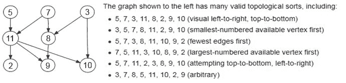
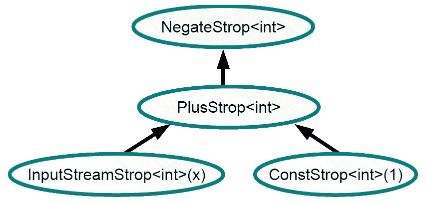
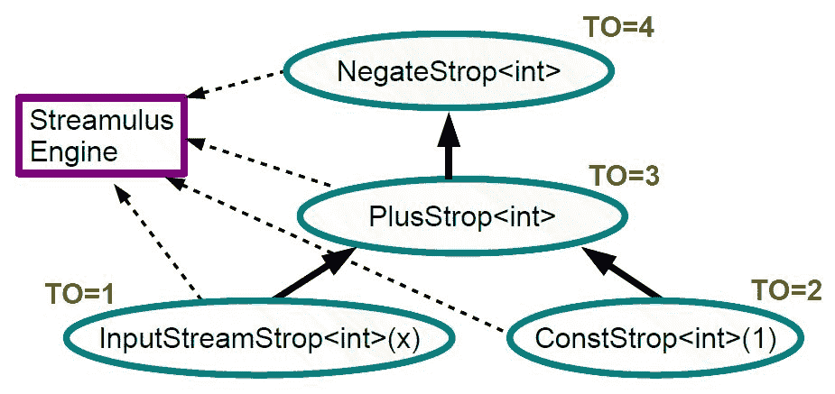

# 六、C++ 事件流编程简介

这一章将是使用 C++ 编程反应系统所需的一系列先决条件章节中的最后一章。我们之所以需要经历相当多的概念，是因为反应式编程模型在实现其健壮的编程模型时统一了许多计算概念。要开始被动思考，程序员必须熟悉面向对象编程、函数式编程、语言级并发、无锁编程、异步编程模型、设计模式、调度算法、数据流编程模型、声明式编程，甚至一点图论！我们在开始这本书时，先看了各种图形用户界面系统的事件驱动编程模型，以及围绕它们构建代码的方法。我们讲述了现代 C++ 的核心精髓[第 2 章](02.html#12AK80-51c8384cc2cb48e691b461190723b468)，*现代 C++ 及其关键习惯用法之旅*。在[第 3 章](03.html#1O8H60-51c8384cc2cb48e691b461190723b468)、*C++*中的语言级并发和并行，以及[第 4 章](04.html#27GQ60-51c8384cc2cb48e691b461190723b468)、*c++ 中的异步和无锁编程*中，我们分别介绍了 c++ 语言和无锁编程支持的语言级并发。在[第 5 章](05.html#2RHM00-51c8384cc2cb48e691b461190723b468)、*可观察对象介绍*中，我们重点讨论了如何在 GOF 模式的背景下，通过处理反应式编程模型来透视它。剩下的就是事件流编程。现在我们将关注事件流的处理或事件流编程。在本章中，我们将了解以下内容:

*   什么是 Stream 编程模型？
*   流编程模型的优势
*   使用带有公共域库的 C++ 进行流编程
*   使用 Streamulus 的流编程
*   事件流编程

# 什么是 Stream 编程模型？

在我们进入 Stream 编程模型的主题之前，我们将后退一步，看看与 POSIX shell 编程模型的相似之处。在典型的命令行 shell 程序中，每个命令都是一个程序，每个程序都是一个命令。在实现计算目标或任务后，我们可以将一个程序的输出通过管道传输到另一个程序。实际上，我们可以链接一系列命令来完成更大的计算任务。我们可以将它视为一个数据流，通过一系列过滤器或转换来获取输出。我们也可以把前面的过程称为*命令合成*。在现实生活中，使用*命令组合*，大量的程序被少量的外壳代码所取代。通过将函数的输入视为流、序列或列表，同样的过程可以在 C++ 程序中实现。数据可以作为一个标准的数据容器从一个函数或函数对象(又名函子)传递到另一个函数或函数对象。

Dr. Donald Knuth, the legendary computer scientist and Stanford University Professor was asked to write a program that:

*   读取文本文件并确定 *n* 个常用词
*   打印出单词及其频率的排序列表

Knuth's solution was a ten-page Pascal program! Doug McIlroy realized the same with just the following shell script:

`tr -cs A-Za-z ' n ' | tr A-Z a-z | sor t | uniq -c | sor t -rn | sed ${1}q`So much for the power of command composition.

# 流编程模型的优势

传统的面向对象程序对层次结构建模良好，与处理线性集合相比，处理层次结构是一个困难的过程。在 Stream 编程模型的情况下，我们可以将输入视为放入容器中的实体流，将输出视为实体包，而无需修改输入数据流。使用 C++ 泛型编程技术，我们可以编写与容器无关的代码来处理流。这种模式的一些优点是:

*   流编程简化了程序逻辑
*   流可以支持惰性评估和功能风格转换
*   流更适合并发编程模型(源流是不可变的)
*   我们可以组合函数来创建更高阶的函数来处理它们
*   流促进了声明式编程模型
*   他们可以聚合、过滤和转换来自不同来源的数据
*   它们分离数据源和处理它们的实体
*   它们提高了代码的可读性(开发人员可以更快地理解代码)
*   他们可以利用数据并行性和任务并行性
*   我们可以利用数百个定义良好的流操作符(算法)来处理数据

# 使用流库的应用流编程

在本节中，我们将介绍使用由乔纳·谢尼曼编写的公共领域库 *`Streams`* 库进行流编程的主题。图书馆位于[https://github.com/jscheiny/Streams](https://github.com/jscheiny/Streams)，可从[http://jscheiny.github.io/Streams/api.html#](http://jscheiny.github.io/Streams/api.html)获得 API 文档。介绍如下(摘自图书馆 GitHub 页面):

`Streams` is a C++ library that provides lazy evaluation and functional-style transformations on data, to ease the use of C++ standard library containers and algorithms. `Streams` supports many common functional operations such as map, filter, and reduce, as well as various other useful operations such as various set operations (union, intersection, difference), partial sum, and adjacent difference, as well as many others.

我们可以看到一个熟悉**标准模板库** ( **STL** )的程序员显然会对这个库放心。STL 容器被视为流数据源，STL 算法可以被视为流数据源上的转换。该库使用现代 C++ 支持的函数式编程习惯用法，并且还支持惰性评估。懒评估的概念在这里非常有意义，因为它是函数式编程模型和 Rx 编程模型的基石。

# 懒惰评价

在编程语言中，有两种重要的方法来计算函数的参数，如下所示:

*   **应用顺序评估** ( **AO** )
*   **正常顺序评估** ( **否**)

在 AO 的情况下，参数在传递给被调用方之前，在调用上下文中进行评估。大多数传统编程语言都遵循这种方法。在否的情况下，变量的评估被推迟，直到计算结果在被调用者的上下文中得到保证。一些函数式编程语言，如 Haskell、F#、ML，都遵循 NO 模型。在函数式编程语言中，大多数函数的计算都是透明的(函数的调用不会产生副作用)；我们只需要对表达式求值一次(对于作为参数的特定值),结果可以共享，当带有相同参数的相同函数的求值再次出现执行时。这叫**懒评**。因此，懒惰评估可以被认为是一个与先前计算结果共享的 NO。默认情况下，C++ 编程语言不支持函数参数的惰性计算，但是可以使用不同的技术进行模拟，例如变量模板和表达式模板。

# 一个简单的流程序

为了开始使用`Streams`库，让我们编写一个小程序来生成一个数字流，并计算前十个数字的平方:

```cpp
//--------- Streams_First.cpp 
#include "Stream.h" 
using namespace std; 
using namespace Stream; 
using namespace Stream::op; 
int main(){ 
  //-------- counter(n) - Generate a series of value 
  //-------- Map (Apply a Lambda) 
  //-------- limit(n) -- Take first ten items 
  //-------- Sum -- aggregate 
  int total = MakeStream::counter(1) 
    | map_([] (int x) { return x * x; } // Apply square on each elements 
    | limit(10) //take first ten elements
```

```cpp
   | sum();  // sum the Stream contents Streams::op::sum 
   //----------- print the result 
   cout << total << endl; 
} 
```

前面的代码片段生成了一个值列表(使用`MakeStream::counter(1)`)，生成的值将使用 map 函数进行转换(在本例中，计算正方形)。当在流中组装十个元素(`limit(10)`)时，我们称之为流上的运算符和。

# 使用流范例聚合值

现在我们已经理解了 Stream 库所设想的 Stream 编程的基础，让我们编写一段代码来计算存储在 std::vector 容器中的数字的平均值:

```cpp
//--------------- Streams_Second.cpp 
// g++ -I./Streams-master/sources Streams_Second.cpp 
// 
#include "Stream.h" 
#include <ioStream> 
#include <vector> 
#include <algorithm> 
#include <functional> 
using namespace std; 
using namespace Stream; 
using namespace Stream::op; 
int main() { 
  std::vector<double> a = { 10,20,30,40,50 }; 
  //------------ Make a Stream and reduce  
  auto val =  MakeStream::from(a)  | reduce(std::plus<void>()); 
  //------ Compute the arithematic average 
  cout << val/a.size() << endl; 
} 
```

前面的代码片段从`std::vector`创建了一个流，并使用`std::plus`函子应用了一个简化过程。这相当于聚合了流中的值。最后，我们用`std::vector`中的元素数除以聚合值。

# 短期交易日志和流范例

`Streams`库可以与 STL 容器无缝配合。以下代码片段将映射流上的函数，并将结果数据转换为向量容器:

```cpp
//--------------- Streams_Third.cpp 
// g++ -I./Streams-master/sources Streams_Third.cpp 
// 
#include "Stream.h" 
#include <ioStream> 
#include <vector> 
#include <algorithm> 
#include <functional> 
#include <cmath> 
using namespace std; 
using namespace Stream; 
using namespace Stream::op; 
double square( double a ) { return a*a; } 
int main() { 
  std::vector<double> values = { 1,2,3,4,5 }; 
  std::vector<double> outputs = MakeStream::from(values) 
               | map_([] (double a ) { return a*a;})  
               | to_vector(); 
  for(auto pn : outputs ) 
  { cout << pn << endl; } 
} 
```

前面的代码片段将`std::vector<double>`转换为流，应用平方函数，并将素材转换回`std:::vector<double>`。之后，向量被迭代以打印内容。`Streams`库文档非常详细，包含许多代码示例，您可以使用它们来为生产质量的应用编写代码。参考美国石油学会文件，可在[http://jscheiny.github.io/Streams/api.html](http://jscheiny.github.io/Streams/api.html)获得。

# 关于流库的一句话

`Streams`库是一个设计良好的软件，具有直观的编程模型。任何使用过函数式编程和 Streams 编程的程序员都会在几个小时内对它感到很舒服。熟悉 STL 的人也会发现这个库非常直观。从编程模型的角度来看，应用编程接口可以分为:

*   核心方法(流初始化)
*   生成器(流创建者)
*   有状态中间操作符(功能性不可变转换)
*   无状态中间运算符
*   终端操作员

前面提到的图书馆文献揭示了这个奇妙图书馆的各个方面。

# 事件流编程

我们对流编程模型的工作有了一些了解。当我们将事件作为流处理时，它可以归类为事件流编程。在编程社区中，事件驱动架构被认为是制作现代程序的更好模型。依赖事件流编程的软件的一个很好的例子是版本控制系统。在版本控制系统中，一切都被视为一个事件。典型的例子包括签出代码、提交、回滚和分支。

# 事件流编程的优势

与传统的事件编程模型相比，将事件聚合为流并在下游系统中处理它们具有许多优势。一些主要优势是:

*   事件源和事件接收器不耦合
*   事件接收器可以处理事件，而不用担心事件源
*   我们可以应用流处理操作符来处理和过滤流
*   转换和过滤可以在聚合级别完成
*   事件可以通过流处理网络传播
*   事件处理可以很容易地并行化(声明式并行)

# 流库及其编程模型

来自 Irit Katiel 的 Streamulus 库是一个通过编程模型使事件流的编程变得更容易的库，它实现了**特定领域的嵌入式语言** ( **DSEL** )。为了理解编程模型，让我们检查一个将数据流式传输到聚合接收数据的类中的程序:

```cpp
#include "Streamulus.h" 
#include <ioStream> 
using namespace std; 
using namespace Streamulus; 
struct print {     
    static double temp; 
    print() { } 
    template<typename T> 
    T operator()(const T& value) const {  
        print::temp += value; 
        std::cout << print::temp << std::endl;  return value; 
     } 
}; 
double print::temp = 0; 
```

前面的函子只是累加传递给静态变量的值。对于`Streamify`模板(`Streamify<print>(s)`)对函数的每次调用，到目前为止累积的值将被打印到控制台。通过下面的列表可以了解更多信息:

```cpp
void hello_Stream() { 
    using namespace Streamulus; 
    // Define an input Stream of strings, whose name is "Input Stream" 
    InputStream<double> s = 
             NewInputStream<double>("Input Stream", true /* verbose */); 
    // Construct a Streamulus instance 
    Streamulus Streamulus_engine;   

```

我们使用`NewInputStream<T>`模板方法创建一个流。该函数需要一个参数来确定日志是否应该打印到控制台。通过给出第二个参数`false`，我们可以关闭详细模式。我们需要创建一个 Streamulus 引擎的实例来编排数据流。流引擎对流表达式进行拓扑排序，以确定变更传播顺序:

```cpp
    // For each element of the Stream:  
    //     aggregate the received value into a running sum
```

```cpp
    //     print it  
    Streamulus_engine.Subscribe(Streamify<print>( s));    
```

我们使用`Streamify<f>` strop (Stream 运算符)来序列化对我们刚刚创建的打印函子的调用。我们可以创建自己的流操作符，通常 Streamify 就足够了。Streamfiy 创建一个事件函子和一个 strop:

```cpp
    // Insert data to the input Stream 
    InputStreamPut<double>(s, 10); 
    InputStreamPut<double>(s, 20); 
    InputStreamPut<double>(s, 30);     
} 
int main() {  hello_Stream();  return 0; } 
```

前面的代码片段将一些值发送到流中。我们将能够看到累计金额在控制台上打印三次。在主函数中，我们调用`hello_Stream`函数来触发所有的动作。

既然我们已经了解了 Streamulus 系统如何用一个简单的程序工作，那么让我们编写一个程序，更好地阐明这个库的语义。下面的程序通过一系列单参数函子对数据进行流式处理，以演示库的功能。我们还在清单中大量使用流表达式:

```cpp
/////////////////////////// 
//  g++ -I"./Streamulus-master/src"  -I<PathToBoost>s Streamulus_second.cpp 
#include "Streamulus.h" 
#include <ioStream> 
using namespace std; 
using namespace Streamulus; 
//-------  Functors for doubling/negating and halfving values 
struct twice {     
    template<typename T> 
    T operator()(const T& value) const {return value*2;} 
}; 
struct neg {     
    template<typename T> 
    T operator()(const T& value) const{ return -value; } 
}; 
struct half{     
    template<typename T> 
    T operator()(const T& value) const { return 0.5*value;} 
};
```

前面这组函子本质上是算术性质的。`twice`函子将参数加倍，`neg`函子翻转参数的符号，`half`函子将值缩放 0.5 以将参数的值减半:

```cpp
struct print{     
    template<typename T> 
    T operator()(const T& value) const{  
        std::cout << value << std::endl; 
        return value; 
    } 
}; 
struct as_string  { 
    template<typename T> 
    std::string operator()(const T& value) const {  
        std::stringStream ss; 
        ss << value; 
        return ss.str(); 
    } 
};
```

前面两个函数对象如何工作是显而易见的——第一个(打印)只是将值输出到控制台。`as_string`使用`std::stringStream`类将参数转换为字符串:

```cpp
void DataFlowGraph(){ 
    // Define an input Stream of strings, whose name is "Input Stream" 
    InputStream<double> s = 
          NewInputStream<double>("Input Stream", false /* verbose */); 
    // Construct a Streamulus instance 
    Streamulus Streamulus_engine;             
    // Define a Data Flow Graph for Stream based computation  
    Subscription<double>::type val2 =  Streamulus_engine.Subscribe(Streamify<neg> 
                         (Streamify<neg>(Streamify<half>(2*s)))); 
    Subscription<double>::type val3 = Streamulus_engine.Subscribe( 
                                      Streamify<twice>(val2*0.5)); 
    Streamulus_engine.Subscribe(Streamify<print>(Streamify<as_string>(val3*2))); 
    //------------------ Ingest data into the Stream 
    for (int i=0; i<5; i++) 
        InputStreamPut(s, (double)i); 
}
```

`DataFlowGraph()`创建了`InputStream<T>`来处理双值流。实例化`Streamulus`对象(引擎)后，我们通过`Streamify<f>`流操作符粘附了一系列函子。该操作可以被认为是一种具有单个自变量函数的函数组合。建立机制后，我们使用`InputStreamPut`函数将数据注入到流中:

```cpp
int main(){ 
    DataFlowGraph(); //Trigger all action 
    return 0; 
} 
```

# Streamulus 库——对其内部的一瞥

`Streamulus`库基本上创建了一个变更传播图来简化流处理。我们可以将图的节点视为计算，将边视为将数据从一个节点带到另一个节点的缓冲区。几乎所有的数据流系统都遵循相同的语义。`Streamulus`库帮助我们构建因变量的图，这有助于我们将更改传播到子节点。变量更新的顺序将通过对图进行拓扑排序来定义。

A graph is a data structure where a set of dependent entities is represented as nodes (or vertices) and their relationship (as edges) between them. In computer science, especially when it comes to scheduling and analyzing dependencies, a particular version of graph, called directed acyclic graphs, is preferred for its unique qualities. A DAG is a directed graph without cycles. We can perform an operation called a topological sort to determine the linear order in which the entities are dependent. The topological sorting can only be performed on a DAG and they are not unique. In the following graph, we can find multiple topological orders:



# Streamulus 库——表达式处理研究

我们将看看`Streamulus`如何使用简单的流表达式处理表达式:

```cpp
InputStream<int>::type x = NewInputStream<int>("X"); 
Engine.Subscribe( -(x+1)); 
```

`- (x+1)`流表达式将产生以下图形。术语 strop 代表流操作符，每个节点被组织为一个 strop:



一旦正确标记了节点，将对图进行拓扑排序以确定执行顺序。下图显示了拓扑排序(可以有多个拓扑顺序):



Streamulus 引擎遍历该图，找出流操作符必须应用于通过网络传播的数据的顺序。**至**标签代表**拓扑顺序**。拓扑排序后，将产生一个按拓扑顺序排列的线性流算子列表。执行引擎将按照拓扑顺序执行代码。

The Streamulus engine performs its magic using the boost proto library. The latter manages expression trees for the Streamulus library. To really go through the source code of the library, you need to be comfortable with template meta programming, especially expression templates. Meta programming is a technique where we write code to generate or transform source code. It turned out that the C++ template mechanism was Turing complete by Erwin Unruh in the year 1994.

# 电子表格库——一个变更传播引擎

电子表格经常被吹捧为反应系统的典型例子。在电子表格中，页面被组织为单元格矩阵。当单元格发生变化时，将重新计算所有从属单元格以反映变化。每个细胞都会这样。实际上，如果您有一个像 Streamulus 这样的库，那么为电子表格建模是很容易的。幸运的是，库的设计者自己编写了另一个依赖 Streamulus 进行变更传播的库。

Spreadsheet is a C++ library that enables spreadsheet-programming, that is, setting up variables (cells) where each cell is assigned an expression that can contain the values of other cells. Changes are propagated to all dependent cells, as in a spreadsheet. Spreadsheet was developed to demonstrate the use of Streamulus. Spreadsheet is a header-only library. It uses boost and Streamulus. So put these three libraries in your include path. The details of the library can be found at [https://github.com/iritkatriel/spreadsheet](https://github.com/iritkatriel/spreadsheet).

我们将浏览一个利用`Spreadsheet`库的示例程序，该库包含在项目的 GitHub 存储库中(`main.cpp`):

```cpp
#include "spreadsheet.hpp" 
#include <ioStream> 
int main (int argc, const char * argv[]) {  
    using namespace spreadsheet; 
    Spreadsheet sheet; 
    Cell<double> a = sheet.NewCell<double>(); 
    Cell<double> b = sheet.NewCell<double>(); 
    Cell<double> c = sheet.NewCell<double>(); 
    Cell<double> d = sheet.NewCell<double>(); 
    Cell<double> e = sheet.NewCell<double>(); 
    Cell<double> f = sheet.NewCell<double>();
```

前面的代码片段创建了一组单元格，用作 IEEE 双精度浮点数的容器。初始化单元格后，我们将开始用以下一组表达式来改变单元格的值:

```cpp
    c.Set(SQRT(a()*a() + b()*b())); 
    a.Set(3.0); 
    b.Set(4.0); 
    d.Set(c()+b()); 
    e.Set(d()+c()); 
```

现在，我们将使用前面的表达式对值进行变异。在通过`Set`方法的每次赋值之后，将通过单元触发一次计算传递。`Streamulus`库管理底层流程:

```cpp
    std::cout << " a=" << a.Value()  
              << " b=" << b.Value()  
              << " c=" << c.Value()  
              << " d=" << d.Value()  
              << " e=" << e.Value()  
              << std::endl;
```

前面的代码片段将单元格的值打印到控制台。我们将再次更改单元格的表达式，以触发计算流程图:

```cpp
    c.Set(2*(a()+b())); 
    c.Set(4*(a()+b())); 
    c.Set(5*(a()+b())); 
    c.Set(6*(a()+b())); 
    c.Set(7*(a()+b())); 
    c.Set(8*(a()+b())); 
    c.Set(a()); 
    std::cout << " a=" << a.Value()  
              << " b=" << b.Value()  
              << " c=" << c.Value()  
              << " d=" << d.Value()  
              << " e=" << e.Value()  
              << std::endl;     
    std::cout << "Goodbye!n"; 
    return 0; 
} 
```

可以细读图书馆的源代码来了解图书馆的内部运作。电子表格是一个很好的例子，说明如何利用 Streamulus 库来编写健壮的软件。

# 另一个流处理库

RaftLib 是一个值得任何对并行编程或基于流的编程感兴趣的人(开发人员)查看的库。图书馆在 https://github.com/RaftLib/RaftLib。以下描述可从前面的网站获得

RaftLib is a C++ Library for enabling Stream/data-flow parallel computation. Using simple right-shift operators (just like the C++ Streams that you would use for string manipulation), you can link parallel compute kernels together. With RaftLib, we do away with explicit use of pthreads, std::thread, OpenMP, or any other parallel threading library. These are often mis-used, creating non-deterministic behavior. RaftLib's model allows lock-free FIFO-like access to the communications channels connecting each compute kernel. The full system has many auto-parallelization, optimization, and convenience features that enable relatively simple authoring of performant applications.

由于篇幅限制，我们不会在本书中详细介绍`RaftLib`。图书馆作者(乔纳森·比尔德)的精彩演讲可在[https://www.youtube.com/watch?v=IiQ787fJgmU](https://www.youtube.com/watch?v=IiQ787fJgmU)获得。让我们看一下展示这个库的工作原理的代码片段:

```cpp
#include <raft> 
#include <raftio> 
#include <cstdlib> 
#include <string> 

class hi : public raft::kernel 
{ 
public: 
    hi() : raft::kernel(){ output.addPort< std::string >( "0" ); } 
    virtual raft::kstatus run(){ 
        output[ "0" ].push( std::string( "Hello Worldn" ) ); 
        return( raft::stop );  
    } 
}; 

int main( int argc, char **argv ) { 
    /** instantiate print kernel **/ 
    raft::print< std::string > p; 
    /** instantiate hello world kernel **/ 
    hi hello; 
    /** make a map object **/ 
    raft::map m; 
    /** add kernels to map, both hello and p are executed concurrently **/ 
    m += hello >> p; 
    /** execute the map **/ 
    m.exe(); 
    return( EXIT_SUCCESS ); 
} 
```

作为一名程序员，你应该为定制计算定义一个内核，并使用`>>`操作符来流式传输数据。在前面的代码中，`hi`类就是这样一个内核。参考`Raftlib`文档(可在前面的 RaftLib 网址上获得)和源代码示例，了解更多关于这个精彩的库的信息。

# 这些东西和 Rx 编程有什么关系？

基本上，反应式编程模型将事件视为通过变更传播图传播的数据流。为此，我们需要将事件元素聚合到基于容器的数据结构中，并在此基础上创建一个流。有时，如果有大量数据，我们甚至会将统计技术应用于样本事件。在被通知给等待通知的观察者之前，生成的流可以在源级别使用函数转换进行过滤和转换。事件源应该对事件流调度采取一种先发制人的方法，以避免事件源接收器和事件接收器之间的耦合。何时调度事件数据将由调度软件决定，该软件以异步方式运行功能转换管道。因此，反应式编程的关键要素是:

*   可观察的(其他人感兴趣的数据流)
*   观察者(对观察对象感兴趣并订阅通知的实体)
*   调度程序(它决定流何时应该在网络中传播)
*   函数运算符(事件过滤和转换)

简而言之，`Scheduler`(Rx 引擎的一部分)在通知订阅者之前，异步取一个`Observable`进行过滤和转换，如图所示:


# 摘要

在本章中，我们讨论了事件流编程的主题。与传统的事件处理模型相比，将事件视为流有许多优势。我们从`Streams`库开始，了解了它的编程模型。我们还编写了一些程序来熟悉这个库及其语义。`Streams`库有很好的文档，您应该参考它的文档来了解更多信息。在 Streams 库之后，我们看了 Streamulus 库，它为事件流的操作提供了一种 DSEL 方法。我们写了几个程序，还研究了 T2 图书馆的一些示例程序。我们还提到了`Raftlib`库，一个用于流处理的替代库。随着事件流编程模型的覆盖，我们现在已经完成了理解反应式编程的先决条件，特别是 RxCpp 库。在下一章中，我们将开始使用 RxCpp 库进入反应式系统设计的编程模型。