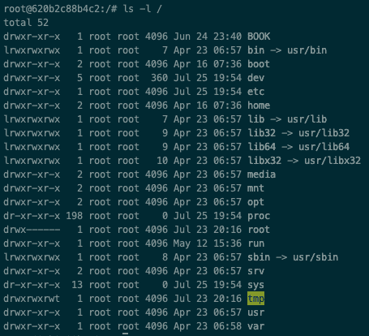
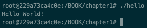

# 系统编程入门

在这一章，你将被介绍整本书的框架基础。您将学习(或更新您的知识)Linux 是如何设计的，您还将学习外壳、用户和组、进程标识和线程标识，以便能够熟练使用 Linux 系统，并为下一章做好准备。此外，你还将学习如何开发一个简单的`hello world`程序，并了解它的 makefile，以及如何执行和调试它。本章的另一个重要方面是从 shell 和源代码的角度了解 Linux 如何处理错误。这些基础知识对于理解后面章节中的其他高级主题非常重要。如果不需要复习，您可以安全地跳过这一章和下一章。

本章将涵盖以下食谱:

*   学习 Linux 基础知识—体系结构
*   学习 Linux 基础知识–外壳
*   学习 Linux 基础知识-用户
*   使用 makefile 编译和链接程序
*   使用 **GNU 项目调试器** ( **GDB** )调试程序
*   学习 Linux 基础——进程和线程
*   处理 Linux bash 错误
*   处理 Linux 代码错误

# 技术要求

为了让您立即尝试这些程序，我们设置了一个 Docker 映像，其中包含了我们在整本书中需要的所有工具和库。这是基于 Ubuntu 19.04 的。

要进行设置，请执行以下步骤:

1.  从[www.docker.com](https://www.docker.com/)下载并安装 Docker 引擎。
2.  从 Docker Hub 中拉出图像:`docker pull kasperondocker/system_programming_cookbook:latest`。
3.  图像现在应该可以使用了。输入以下命令查看图像:`docker images`。
4.  你现在至少应该有这个形象:`kasperondocker/system_programming_cookbook`。
5.  借助以下命令，使用交互式外壳运行 Docker 映像:`docker run -it --cap-add sys_ptrace kasperondocker/system_programming_cookbook:latest /bin/bash`。
6.  运行容器上的外壳现已可用。运行`root@39a5a8934370/# cd /BOOK/`按章节开发所有程序。

需要`--cap-add sys_ptrace`参数来允许 Docker 容器中的 GDB 设置断点，默认情况下，Docker 不允许设置断点。

# 学习 Linux 基础-架构

**Linux** 是 Unix 操作系统的克隆，由 Linus Torvalds 在 90 年代初开发。这是一个多用户、多任务操作系统，运行在各种平台上。出于性能原因，Linux 内核采用了单片架构。这意味着它在一个二进制文件中是独立的，并且它的所有**服务**都在内核空间中运行。这是一开始最有争议的话题之一。安迪·塔南鲍姆(阿姆斯特丹自由大学教授)反对它的单一系统，他说:*这是回到 1970 年代的一大步。*他还反驳了它的可移植性，称: *LINUX 与 80 x 86 的联系相当紧密。不是办法*。在 *minix* 用户群中，还是有涉及 Torvalds、Tanenbaum 等人的全聊天的线程。

下图显示了主要的 Linux 构建块:


让我们描述一下我们在图表中看到的层:

*   在顶层，有用户应用程序、进程、编译器和工具。该层(运行在用户空间)通过系统调用与 Linux 内核(运行在内核空间)通信。
*   **系统库**:这些是一组函数，应用程序可以通过它们与内核进行交互。
*   **内核**:这个组件包含了 Linux 系统的核心。除此之外，它还有调度程序、网络、内存管理和文件系统。
*   **内核模块**:这些模块包含一些内核代码，它们仍然在内核空间中运行，但是是完全动态的(也就是说，它们可以随运行的系统一起加载和卸载)。它们通常包含设备驱动程序、特定于实现协议的特定硬件模块的内核代码等。内核模块的一个巨大优势是用户可以在不重建内核的情况下加载它们。

**GNU** 是递归首字母缩略词，代表 **GNU 不是 Unix** 。GNU 是一个自由软件的操作系统。注意这里的术语*操作系统*。事实上，单独使用 GNU 意味着代表操作系统所需的全套工具、软件和内核部分。GNU 操作系统内核被称为 **Hurd** 。由于赫德还没有做好生产准备，GNU 通常使用 Linux 内核，这种组合被称为 **GNU/Linux 操作系统**。

那么，GNU/Linux 操作系统上有哪些 GNU 组件呢？软件包*例如 **GNU 编译器集合**(**GCC**)**GNU C 库**、GDB、GNU Bash 外壳和 **GNU 网络对象模型环境** ( **GNOME** )桌面环境，仅举几例。理查德·斯托尔曼和**自由软件基金会**(**FSF**)——史泰曼是其创始人——创作了**自由软件定义**来帮助尊重用户的自由。*自由软件*被认为是授予用户以下四种自由(所谓**基本自由**:[https://isocpp.org/std/the-standard](https://isocpp.org/std/the-standard))的任何软件包:

1.  为任何目的运行程序的自由(自由 *0* )。
2.  研究程序如何工作和改变它的自由，所以它可以按照你的意愿进行计算(自由 *1* )。获取源代码是实现这一点的先决条件。
3.  重新分发副本以便帮助他人的自由(自由 *2* )。
4.  向他人分发您的修改版本的自由(自由 *3* )。通过这样做，你可以给整个社区一个从你的改变中获益的机会。获取源代码是实现这一点的先决条件。

这些原则的具体实例在 FSF 创作的 GNU/GPU 许可中。所有的 GNU 软件包都是在 GNU/GPU 许可下发布的。

# 怎么做...

Linux 在所有发行版中都有一个非常标准的文件夹结构，所以知道这一点可以让你很容易地找到程序并将它们安装在正确的位置。让我们看一下它，如下所示:

1.  在 Docker 图像上打开一个终端。
2.  键入命令`ls -l /`。

# 它是如何工作的...

该命令的输出将包含以下文件夹:



正如您所看到的，这个文件夹结构非常有条理，并且在所有发行版中都是一致的。在幕后，Linux 文件系统是非常模块化和灵活的。用户应用程序可以与 GNU C 库(提供打开、读取、写入和关闭等接口)或直接与 Linux 系统调用交互。在这种情况下，系统调用接口与**虚拟的** **文件系统** *(* 通常被称为***)*。VFS 是具体文件系统实现之上的抽象(例如，ext3、**日志文件系统** ( **JFS** )等等)。我们可以想象，这种架构提供了高度的灵活性。**

 **# 学习 Linux 基础-外壳

外壳是一个命令解释器，它接收输入中的命令，将它们重定向到 GNU/Linux，并返回输出。它是用户和 GNU/Linux 之间最常见的接口。有不同的 shell 程序可用。最常用的是 Bash shell(GNU 项目的一部分)、tcsh shell、ksh shell 和 zsh shell(这基本上是一个扩展的 Bash shell)。

你为什么需要一个贝壳？如果用户需要通过**命令行**与操作系统交互，则需要外壳。在这个食谱中，我们将展示一些最常见的 shell 命令。很多时候，术语*外壳*和*终端*可以互换使用，尽管严格来说，它们不是完全一样的东西。

# 怎么做...

在本节中，我们将学习在 shell 上运行的基本命令，例如，查找文件、`grep`将文本导入文件、复制和删除:

1.  打开一个 shell:根据 GNU/Linux 发行版的不同，打开一个新的 shell 命令有不同的快捷键。在 Ubuntu 上，按*Ctrl*+*Alt*+*T*，或者按 *Alt* + *F2、*然后输入`gnome-terminal`。
2.  关闭外壳:要关闭终端，只需输入`exit`并按*进入*。
3.  `find`命令:用于在目录层次结构中搜索文件。最简单的形式是这样的:

```cpp
find . -name file
```

它也支持通配符:

```cpp
$ find /usr/local "python*"
```

4.  `grep`命令通过匹配模式打印线条:

```cpp
 $ grep "text" filename
```

`grep`还支持递归搜索:

```cpp
 $ grep "text" -R /usr/share
```

5.  管道命令:在外壳上运行的命令可以连接起来，使一个命令的输出成为另一个命令的输入。连接是通过`|`(管道)操作符完成的:

```cpp
$ ls -l | grep filename
```

6.  编辑文件:在 Linux 上编辑文件最常用的两个工具是`vi`和`emacs`(如果你对编辑文件不感兴趣，`cat filename`会将文件打印成标准输出)。前者由 Unix 操作系统继承，后者是 GNU 项目的一部分。本书将广泛使用`vi`:

```cpp
 $ vi filename
```

接下来，我们将研究与文件操作相关的 shell 命令。

7.  这是删除文件的命令:

```cpp
$ rm filename
```

8.  这是删除目录的命令:

```cpp
$ rm -r directoryName
```

9.  这是克隆文件的命令:

```cpp
$ cp file1 file2
```

10.  这是克隆文件夹的命令:

```cpp
$ cp -r folder1 folder2  
```

11.  这是使用相对和绝对路径克隆文件夹的命令:

```cpp
$ cp -r /usr/local/folder1 relative/folder2
```

下一节将描述这些命令。

# 它是如何工作的...

让我们来看看*中讨论的命令是如何做到的...*部分，详细说明:

1.  第一个命令从当前文件夹中搜索(`.`)，可以包含绝对路径(例如`/usr/local`)或相对路径(例如`tmp/binaries`)。比如这里，`-name`就是要搜索的文件。
2.  第二个命令从`/usr/local`文件夹中搜索任何以`python`开头的文件或文件夹。`find`命令提供了巨大的灵活性和多种选择。更多信息，请通过`man find`命令参考`man page`。
3.  `grep`命令在`filename`文件中搜索并打印任何包含单词`text`的行。
4.  `grep`递归搜索命令从`/usr/share`文件夹中递归搜索并打印任何文件中包含单词`text`的任何一行。
5.  Pipe 命令(`|`):第一个命令的输出如下截图所示。所有文件和目录的列表作为输入传递给第二个命令(`grep`，它将用于`grep`文件名:


现在，让我们来看看执行诸如编辑文件、添加/删除文件和目录等操作的命令。

**编辑文件**:

*   `vi`命令将在编辑模式下打开文件名，假设当前用户对其具有写权限(我们将在后面更详细地讨论权限)。
    以下是`vi`中最常用命令的简短总结:
    *   *移动* *+ :* (即*移动*键+冒号)切换编辑模式。
    *   *Shift + :i* 插入。
    *   *Shift +:追加一个*。
    *   *Shift + :q！*退出当前会话，不保存。
    *   *Shift + :wq* 保存并退出当前会话。
    *   *Shift +:设置 nu* 显示文件上的行号。
    *   *班次+ :23* ( *进入*)到 23 号线。
    *   按下( *Esc* ) 键切换到命令模式。
    *   *。*重复最后一个命令。
    *   *cw* 改变单词，或将光标指向单词的开头。
    *   *dd 至*移除当前线路。
    *   *yy* 复制当前行。如果在 *yy* 命令之前选择了一个数字 *N* ，则 *N* 行将被复制。
    *   *p* 用 *yy* 命令粘贴复制的行。
    *   *u* 撤销。

**添加和删除文件和目录**:

1.  第一个命令删除名为`filename`的文件。
2.  第二个命令递归删除`directoryName`及其内容。
3.  第三个命令创建`file2`，这是`file1`的精确副本。
4.  第四个命令创建`folder2`作为`folder1`的克隆:


在这个配方中显示的命令的执行中有一个共同的模式。它们如下所示:

1.  用户输入命令，点击*进入*。
2.  该命令由 Linux 解释。
3.  Linux 与其不同的部分(内存管理、网络、文件系统等)交互来执行命令。这发生在内核空间**。**
4.  结果将返回给用户。

# 还有更多...

这个食谱显示了一些最常见的命令。掌握所有选项，即使只是最常见的 shell 命令，也是很棘手的，这就是为什么`man pages`被创建的原因。它们为 Linux 用户提供了坚实而清晰的参考。

# 请参见

[第八章](08.html)、*处理控制台 I/O 和文件*，将深入到控制台 I/O 和文件管理。

# 学习 Linux 基础知识-用户

Linux 是一个多用户和多任务操作系统，所以基本的用户管理技能是必须的。这个方法将向您展示文件和目录的权限是如何构造的，如何添加和删除用户，如何更改用户的密码，以及如何将用户分配到组。

# 怎么做...

以下一系列步骤显示了用于基本用户管理活动的有用命令:

1.  **创建用户**:使用 Linux 为每个人配置一个用户不仅是最佳实践，也是推荐的做法。创建用户非常简单:

```cpp
root@90f5b4545a54:~# adduser spacex --ingroup developers
Adding user `spacex' ...
Adding new user `spacex' (1001) with group `developers' ...
Creating home directory `/home/spacex' ...
Copying files from `/etc/skel' ...
New password:
Retype new password:
passwd: password updated successfully
Changing the user information for spacex
Enter the new value, or press ENTER for the default
Full Name []: Onorato
Room Number []:
Work Phone []:
Home Phone []:
Other []:
Is the information correct? [Y/n] Y
```

`spacex`用户已创建并分配到现有的`developers`组。要切换到新创建的用户，请使用新用户的凭据登录:

```cpp
root@90f5b4545a54:~# login spacex
Password:
Welcome to Ubuntu 19.04 (GNU/Linux 4.9.125-linuxkit x86_64)
* Documentation: https://help.ubuntu.com
* Management: https://landscape.canonical.com
* Support: https://ubuntu.com/advantage
This system has been minimized by removing packages and content that are
not required on a system that users do not log into.
To restore this content, you can run the 'unminimize' command.
The programs included with the Ubuntu system are free software;
the exact distribution terms for each program are described in the
individual files in /usr/share/doc/*/copyright.
Ubuntu comes with ABSOLUTELY NO WARRANTY, to the extent permitted by
applicable law.
spacex@90f5b4545a54:~$
```

2.  **更新用户密码**:定期更换密码。下面是执行此操作的命令:

```cpp
spacex@90f5b4545a54:~$ passwd
Changing password for spacex.
 Current password:
 New password:
 Retype new password:
 passwd: password updated successfully
 spacex@90f5b4545a54:~$
```

3.  **将用户分配到一个组**:如图所示，用户在创建时可以被分配到一个组。或者，通过运行以下命令，可以随时将用户分配到组中:

```cpp
root@90f5b4545a54:~# usermod -a -G testers spacex
 here spacex is added to the testers group
```

4.  **删除用户**:同样，删除用户也很简单:

```cpp
root@90f5b4545a54:~# userdel -r spacex
userdel: spacex mail spool (/var/mail/spacex) not found
root@90f5b4545a54:~#
```

`-r`选项表示删除`spacex`主目录和`mail spool`。

5.  现在，让我们看看最后一个命令，它显示了当前用户(`spacex`)所属的组列表:

```cpp
spacex@90f5b4545a54:~$ groups
 developers testers
 spacex@90f5b4545a54:~$
```

如您所见，`spacex`用户属于`developers`和`testers`组。

# 它是如何工作的...

在*步骤 1* 中，我们使用`adduser`命令添加`spacex`用户，并根据上下文将该用户添加到`developers`组。

S *tep 2* 显示如何更改当前用户的密码。要更改密码，必须提供以前的密码。定期更改密码是一种很好的做法。

如果我们想将一个用户分配到一个组，可以通过`usermod`命令来完成。在*步骤 3* 中，我们已经将`spacex`用户添加到了`testers`组。`-a`和`-G`参数只是表示新的组(`-G`)将被附加到用户的当前组(`-a`)中。也就是说，`spacex`用户将被分配到`testers`组，该组将根据上下文创建。在同一步骤中，`groups`命令显示当前用户属于哪个组。如果你只想创建一个组，那么`groupadd group-name`就是你需要的命令。

*步骤 4* 显示如何通过`userdel`命令移除用户，传递`-r`参数。此参数确保我们要删除的用户的所有文件都将被删除。

# 还有更多...

在 Linux 文件系统上，每个文件和目录都有一组定义谁能做什么的信息。机制简单，功能强大。文件(或目录)上允许的操作分别是读、写和执行(`r`、`w`和`x`)。这些操作可以由文件或目录的所有者、一组用户或所有用户来完成。Linux 用所有者:`rwx`表示此信息；集团:`rwx`；所有用户:`rwx`；或者，更简单地说:`rwx-rwx-rwx`(共 9 个)。实际上，Linux 在这些标志之上还有一个标志，代表文件的类型。它可以是文件夹(`d`)、到另一个文件的符号链接(`l`)、常规文件(`-`)、命名管道(`p`)、套接字(`s`)、字符设备文件(`c`)和块设备(`b`)。文件的典型权限如下所示:

```cpp
root@90f5b4545a54:/# ls -l
 -rwxr-xr-x 1 root root 13 May 8 20:11 conf.json
```

让我们详细看看这个:

*   从左侧阅读，第一个字符`-`，告知我们`conf.json`是一个常规文件。
*   接下来的三个角色是关于当前用户`rwx`。用户对文件拥有完全的**读取** ( **r** )、**写入** ( **w** )和**执行** ( **x** )权限。
*   接下来的三个字符是关于用户所属的组，`r-x`。属于该组的所有用户都可以读取和执行该文件，但不能对其进行修改(未选择`w`，标记为`-`)。
*   最后三个字符是关于所有其他用户的，`r-x`。所有其他用户只能读取和执行文件(`r`和`x`被标记，而`w`没有)。

所有者(或根用户)可以更改文件的权限。实现这一点最简单的方法是通过`chmod`命令:

```cpp
 $ chmod g+w conf.json 
```

这里，我们要求 Linux 内核将写权限(`w`)添加到组用户类型(`g`)中。用户类型如下:`u`(针对用户)、`o`(针对其他人)、`a`(针对所有人)和`g`(针对群组)，权限标志可以是`x`、`w`、`r`，如前所述。`chmod`也可以接受一个整数:

```cpp
 $ chmod 751 conf.json 
```

每个组类型的权限标志都有二进制到十进制的转换，例如:
`wxr`:111 = 7
`w-r`:101 = 5
`--r`:001 = 1

一开始可能有点神秘，但对于日常使用来说非常实用和方便。

# 请参见

`man pages`是一个无限的信息资源，应该是你首先看到的。像`man groups`、`man userdel`或`man adduser`这样的命令会有所帮助。

# 使用 makefile 编译和链接程序

makefile 是描述`make`实用程序用来构建(编译和链接)目标(可执行文件、共享对象等)的程序源之间关系的文件。Makefiles 非常重要，因为它们有助于保持源代码的组织性和易于维护。一个程序要成为可执行的，必须被编译并与其他库链接。GCC 是最广泛使用的编译器集合。C 和 C++世界中使用的两个编译器是 GCC 和 g++(分别用于 C 和 C++程序)。这本书将使用 g++。

# 怎么做...

本节将展示如何编写 makefile 来编译和运行一个简单的 C++程序。我们将开发一个简单的程序，并创建它的 makefile 来学习它的规则:

1.  让我们从打开`hello.cpp`文件开始开发程序:

```cpp
$vi hello.cpp
```

2.  输入以下代码(参考*学习 Linux 基础知识- shell* 配方查看`vi`命令):

```cpp
#include <iostream>
int main()
{
    std::cout << "Hello World!" << std::endl;
    return 0;
}
```

3.  保存并退出:在`vi`中，从命令模式中，键入`:wq`，这意味着写入并退出。`:x`的命令也有同样的效果。
4.  从 shell 中，创建一个名为`Makefile`的新文件:

```cpp
$ vi Makefile
```

5.  输入以下代码:

```cpp
CC = g++
all: hello
hello: hello.o
      ${CC} -o hello hello.o
hello.o: hello.cpp
      ${CC} -c hello.cpp
clean:
      rm hello.o hello
```

虽然这是一个典型的`Hello World!` 程序，但是展示一个 makefile 的结构是很有用的。

# 它是如何工作的...

简单地说，makefile 由一组规则组成。规则由目标、先决条件列表和命令组成。

第一步，我们打开文件(`hello.cpp`)并输入*第二步*中列出的程序。同样，我们在`hello.cpp`程序的同一个文件夹中打开了另一个文件`Makefile`，并输入了特定的 makefile 命令。现在让我们深入到 makefile 内部。典型的 makefile 包含以下内容:

1.  第一个规则由一个名为`all`的目标和一个名为`hello`的先决条件组成。此规则没有命令。
2.  第二条规则由一个名为`hello`的目标组成。它在`hello.o`上有一个先决条件和一个链接的命令:`g++`。
3.  第三个规则有一个名为`hello.o`的目标，是`hello.cpp`的先决条件，还有一个编译命令:`g++ -c hello.cpp`。
4.  最后一个规则有一个`clean`目标，带有删除所有`hello`和`hello.o`可执行文件的命令。这将强制重新编译文件。
5.  对于任何规则，如果任何源文件发生变化，则执行定义的命令。

我们现在可以使用我们创建的 makefile 来编译程序:

```cpp
$ make
```

我们还能够执行该程序，其输出如下:



从源文件生成二进制可执行文件的过程包括编译和链接阶段，此处压缩在单个命令中；大多数情况下都是这样。一般来说，大型系统代码库依赖于更复杂的机制，但是步骤仍然是相同的:源文件编辑、编译和链接。

# 还有更多...

这个简单的例子向我们展示了 makefile 及其`make`命令的基本概念。事情远不止如此。这里有几个例子:

1.  宏的使用:makefile 允许使用宏，可以看作**变量**。这些可用于将 makefile 组织得更加模块化，例如:
    *   程序中使用的所有动态库的宏:`LIBS = -lxyz -labc`。
    *   编译器本身的宏(如果您想更改为另一个编译器):`COMPILER = GCC`。
    *   在所有生成文件中引用这些宏:`$(CC)`。这给了我们在一个地方做出改变的自由。
2.  只需在 shell 中键入`make`，makefile 中定义的第一个规则就会运行。在我们的案例中，第一条规则是`all`。如果我们通过将 **`clean`** 作为第一个规则来改变 makefile，那么在没有参数的情况下运行`make`将会执行`clean`规则。一般来说，您总是会传递一些参数——例如，`make clean`。

# 用 GDB 调试程序

调试是从软件系统中识别和消除错误的过程。GNU/Linux 操作系统有一个名为 GDB 的**标准** *事实上的*工具(也就是说，不是任何标准的一部分，但几乎被 Linux 世界中的任何人使用)。安装在本书 Docker 上的 GDB 版本是 8.2.91 版本。当然，也有一些图形工具可以在幕后使用 GDB，但是 Linux 上的 GDB 以其可靠性、简单性和速度走在了前面。在这个配方中，我们将调试我们在前面配方中编写的软件。

# 怎么做...

为了使用一些 GDB 命令，我们需要修改之前的程序并在其中添加一些变量:

1.  打开一个外壳，通过输入以下代码修改`hello.cpp`文件:

```cpp
 #include <iostream>
 int main()
 {
    int x = 10;
    x += 2;
    std::cout << "Hello World! x = " << x << std::endl;
    return 0;
 }
```

这是一个非常简单的程序:取一个变量，加上`2`，打印结果。

2.  让我们通过键入以下命令来确保程序已被编译:

```cpp
root@bffd758254f8:~/Chapter1# make
 g++ -c hello.cpp
 g++ -o hello hello.o
```

3.  现在我们有了可执行文件，我们将调试它。在命令行中，键入`gdb hello`:

```cpp
root@bffd758254f8:~/Chapter1# gdb hello
 GNU gdb (Ubuntu 8.2.91.20190405-0ubuntu3) 8.2.91.20190405-git
 Copyright (C) 2019 Free Software Foundation, Inc.
 License GPLv3+: GNU GPL version 3 or later <http://gnu.org/licenses/gpl.html>
 This is free software: you are free to change and redistribute it.
 There is NO WARRANTY, to the extent permitted by law.
 Type "show copying" and "show warranty" for details.
 This GDB was configured as "x86_64-linux-gnu".
 Type "show configuration" for configuration details.
 For bug reporting instructions, please see:
 <http://www.gnu.org/software/gdb/bugs/>.
 Find the GDB manual and other documentation resources online at:
 <http://www.gnu.org/software/gdb/documentation/>.
For help, type "help".
 Type "apropos word" to search for commands related to "word"...
 Reading symbols from hello...
 (No debugging symbols found in hello)
 (gdb)
```

4.  可以看到，最后一行写着(`No debugging symbols found in hello`)。GDB 不需要调试符号来调试程序，所以我们必须与编译器沟通，在编译过程中包含调试符号。我们必须退出当前会话；为此，输入`q` ( *进入*)。然后，编辑 makefile，并将`-g`选项添加到`g++`编译器部分(`hello.o`目标):

```cpp
CC = g++
all: hello
hello: hello.o
    ${CC} -o hello hello.o
hello.o: hello.cpp
    $(CC) -c -g hello.cpp
clean:
    rm hello.o hello
```

5.  让我们再次运行它，但是，首先，我们必须用`make`命令重建应用程序:

```cpp
root@bcec6ff72b3c:/BOOK/chapter1# gdb hello
GNU gdb (Ubuntu 8.2.91.20190405-0ubuntu3) 8.2.91.20190405-git
Copyright (C) 2019 Free Software Foundation, Inc.
License GPLv3+: GNU GPL version 3 or later <http://gnu.org/licenses/gpl.html>
This is free software: you are free to change and redistribute it.
There is NO WARRANTY, to the extent permitted by law.
Type "show copying" and "show warranty" for details.
This GDB was configured as "x86_64-linux-gnu".
Type "show configuration" for configuration details.
For bug reporting instructions, please see:
<http://www.gnu.org/software/gdb/bugs/>.
Find the GDB manual and other documentation resources online at:
 <http://www.gnu.org/software/gdb/documentation/>.
For help, type "help".
Type "apropos word" to search for commands related to "word"...
Reading symbols from hello...
(No debugging symbols found in hello)
(gdb)
```

我们准备调试它。调试会话通常包括设置断点、观察变量的内容、设置观察点等。下一节将展示最常见的调试命令。

# 它是如何工作的...

在前一节中，我们已经看到了创建程序和 makefile 所需的步骤。在这一节中，我们将学习如何调试我们开发的`Hello World!`程序。

让我们从可视化我们要调试的代码开始。我们通过运行`l`命令(列表的缩写)来实现:

```cpp
(gdb) l
 1 #include <iostream>
 2 int main()
 3 {
 4    int x = 10;
 5    x += 2;
 6    std::cout << "Hello World! x = " << x << std::endl;
 7    return 0;
 8 }
```

我们必须设置一个断点。要设置断点，我们运行`b 5`命令。这会在当前模块中的代码行号`5`处设置一个断点:

```cpp
(gdb) b 5
 Breakpoint 1 at 0x1169: file hello.cpp, line 5.
 (gdb)
```

现在是运行程序的时候了。要运行程序，我们键入`r`命令。这运行了我们从 GDB 开始的`hello`程序:

```cpp
(gdb) r
 Starting program: /root/Chapter1/hello
```

一旦启动，GDB 将自动在流程遇到的任何断点处停止。在这种情况下，过程运行，然后在`hello.cpp`文件的第`5`行停止:

```cpp
Breakpoint 1, main () at hello.cpp:5
 5 x += 2;
```

为了逐步进行，我们在 GDB 上运行`n`命令(即，单步执行)。这将执行当前可视化的代码行。类似的命令是`s`(步入)。如果当前命令是一个函数，它将进入函数:

```cpp
(gdb) n
6 std::cout << "Hello World! x = " << x << std::endl;
the 'n' command (short for next) execute one line. Now we may want to check the content of the variable x after the increment:
```

如果我们需要知道一个变量的内容，我们运行`p`命令(print 的缩写)，它打印一个变量的内容。在这种情况下，如预期的那样，`x = 12`被打印:

```cpp
(gdb) p x
$1 = 12
```

现在，让我们运行程序直到结束(或者直到下一个断点，如果设置的话)。这是通过`c`命令完成的(continue 的缩写):

```cpp
(gdb) c 
 Continuing.
 Hello World! x = 12
 [Inferior 1 (process 101) exited normally]
 (gdb)
```

GDB 通过让程序员一行行地单步执行程序，真正起到了解释器的作用。这有助于开发人员解决问题、在运行时查看变量的内容、更改变量的状态等等。

# 还有更多...

GDB 有很多非常有用的命令。在接下来的章节中，GDB 将会被更多的探索。这里还有四个命令要显示:

1.  `s`:台阶的简称。如果在一个方法上被调用，它就会进入这个方法。
2.  `bt`:回溯的简称。打印调用堆栈。
3.  `q`:戒的简称。用来离开 GDB。
4.  `d`:删除的简称。它删除了一个断点。例如，`d 1`删除第一个断点集。

The main page of the GNU GDB Project can be found here: [https://www.gnu.org/software/gdb](https://www.gnu.org/software/gdb). More detailed information can be found on the `man dbg` `man pages` and online. You can also refer to *Using GDB: A Guide to the GNU Source-Level Debugger,* by Richard M. Stallman and Roland H. Pesch*.*

# 学习 Linux 基础——进程和线程

进程和线程是任何操作系统的执行单元。在本食谱中，您将学习如何在命令行上处理 GNU/Linux 上的进程和线程。进程是一个程序的运行实例，具有一组定义明确的资源，如文件、处理器状态和分配给它的执行线程。

Linux 中的进程由`sched.h`头文件中定义的`task_struct`结构定义。另一方面，线程由`thread_info.h`头文件中的`thread_info`结构定义。线程是执行主进程的一个可能流程。一个进程至少有一个线程(主线程)。一个进程的所有线程在一个系统上并发运行。

在 Linux 上需要记住的一个方面是，它没有区分进程和线程。线程就像一个进程，与其他进程共享一些资源。因此，在 Linux 中，线程通常被称为**轻量级进程** ( **LWP** )。

# 怎么做...

在本节中，我们将逐步学习在 GNU/Linux 发行版上控制进程和线程的所有最常见的命令:

1.  `ps`命令显示当前系统中的进程、属性和其他参数:

```cpp
root@5fd725701f0f:/# ps u
USER PID %CPU %MEM VSZ RSS TTY STAT START TIME COMMAND
root 1 0.0 0.1 4184 3396 pts/0 Ss 17:20 0:00 bash
root 18 0.0 0.1 5832 2856 pts/0 R+ 17:22 0:00 ps u
```

2.  获取进程(及其线程)信息的另一种方法是查看`/process/PID`文件夹。该文件夹包含所有进程信息、进程的线程(以子文件夹的形式，带有**进程标识符** ( **进程标识符**))、内存等等:

```cpp
root@e9ebbdbe3899:/# ps aux
USER PID %CPU %MEM VSZ RSS TTY STAT START TIME COMMAND
root 1 0.0 0.1 4184 3344 pts/0 Ss 16:24 0:00 bash
root 149 0.0 0.1 4184 3348 pts/1 Ss 17:40 0:00 bash
root 172 85.0 0.0 5832 1708 pts/0 R+ 18:02 0:04 ./hello
root 173 0.0 0.1 5832 2804 pts/1 R+ 18:02 0:00 ps aux
root@e9ebbdbe3899:/# ll /proc/172/
total 0
dr-xr-xr-x 9 root root 0 May 12 18:02 ./
dr-xr-xr-x 200 root root 0 May 12 16:24 ../
dr-xr-xr-x 2 root root 0 May 12 18:02 attr/
-rw-r--r-- 1 root root 0 May 12 18:02 autogroup
-r-------- 1 root root 0 May 12 18:02 auxv
-r--r--r-- 1 root root 0 May 12 18:02 cgroup
--w------- 1 root root 0 May 12 18:02 clear_refs
-r--r--r-- 1 root root 0 May 12 18:02 cmdline
-rw-r--r-- 1 root root 0 May 12 18:02 comm
-rw-r--r-- 1 root root 0 May 12 18:02 coredump_filter
-r--r--r-- 1 root root 0 May 12 18:02 cpuset
lrwxrwxrwx 1 root root 0 May 12 18:02 cwd -> /root/Chapter1/
-r-------- 1 root root 0 May 12 18:02 environ
lrwxrwxrwx 1 root root 0 May 12 18:02 exe -> /root/Chapter1/hello*
dr-x------ 2 root root 0 May 12 18:02 fd/
dr-x------ 2 root root 0 May 12 18:02 fdinfo/
-rw-r--r-- 1 root root 0 May 12 18:02 gid_map
-r-------- 1 root root 0 May 12 18:02 io
-r--r--r-- 1 root root 0 May 12 18:02 limits
... 
```

3.  一个过程也可能被扼杀。从技术上讲，终止一个进程意味着停止它的执行:

```cpp
root@5fd725701f0f:/# kill -9 PID
```

该命令将`kill`信号(`9`)发送给用 PID 识别的过程。其他信号可以发送到进程，例如`HUP`(挂断)和`INT`(中断)。

# 它是如何工作的...

在 *s* *tep 1* 中，对于每个流程，我们可以看到以下内容:

*   流程所属的用户
*   PID
*   特定时刻 CPU 和内存的百分比
*   进程开始的时间及其运行时间
*   用于运行进程的命令

通过`ps aux`命令，我们可以抓取`hello`流程的 PID，也就是`172`。我们现在可以进入`/proc/172`文件夹。

进程和线程是操作系统的构建模块。在这个食谱中，我们已经看到了如何在命令行上与内核交互，通过一个命令(例如，`ps`)获取进程的信息，以及通过查看进程运行时 Linux 更新的特定文件夹。同样，每次我们调用一个命令(在这种情况下，为了获得进程的信息)，该命令必须进入内核空间以获得关于它的有效和更新的信息。

# 还有更多...

`ps`命令的参数比本食谱中的基本参数多得多。完整的列表可以在它的 Linux 手册页`man ps`上找到。

作为`ps`的替代方案，一个更高级和交互式的命令是`top`命令，`man top`。

# 处理 Linux bash 错误

我们已经看到，与 Linux 内核交互的一种方式是通过外壳，通过调用命令。我们可以想象，一个命令可能会失败，一种传达失败的方法是返回一个非负整数值。0，在大多数情况下，意味着成功。这个食谱将告诉你如何处理外壳上的错误。

# 怎么做...

本节将向您展示如何直接从 shell 和通过脚本获取错误，这是脚本开发的一个基本方面:

1.  首先，运行以下命令:

```cpp
root@e9ebbdbe3899:/# cp file file2
 cp: cannot stat 'file': No such file or directory
 root@e9ebbdbe3899:/# echo $?
 1
```

2.  创建一个名为`first_script.sh`的新文件，并输入以下代码:

```cpp
#!/bin/bash
cat does_not_exists.txt
if [ $? -eq 0 ]
then
    echo "All good, does_not_exist.txt exists!"
    exit 0
else
    echo "does_not_exist.txt really DOES NOT exists!!" >&2
    exit 11
fi
```

3.  保存文件，退出(`:wq`或`:x`)。
4.  给予当前用户对`first_script.sh`文件的执行权限(`x`标志):

```cpp
root@e9ebbdbe3899:~# chmod u+x first_script.sh
```

下一节将详细介绍这些步骤。

# 它是如何工作的...

在*步骤 1* 中，`cp`命令失败，因为`file`和`file2`不存在。通过查询`echo $?`，得到错误码；在这种情况下，就是`1`。这在编写 bash 脚本时特别有用，因为我们可能需要检查特定的条件。

在*步骤 2* 中，脚本只是列出了`does_not_exist.txt`文件并读取返回的错误代码。如果一切顺利，它会打印一条确认消息并返回`0`。否则，返回错误代码`11`。

通过运行脚本，我们得到如下输出:


在这里，我们注意到一些事情:

*   我们记录了我们的错误字符串。
*   错误代码是我们在脚本中设置的。

在幕后，每次调用一个命令，它就进入内核空间。该命令被执行，并且返回状态以整数的形式被发送回用户。考虑这个返回状态真的很重要，因为我们可能有一个明显成功(没有输出)但最终失败(返回不同于`0`的代码)的命令。

# 还有更多...

命令返回状态的一个重要方面是，它可以用来(有条件地)运行下一个命令。为此使用了两个重要的运算符:`&&`(与)和`||`(或)。

在这里的两个命令中，第二个命令在第一个命令成功的情况下运行(也只有在第一个命令成功的情况下运行`&&`运算符)。如果将`file.txt`复制到项目文件夹中，则会删除它:

```cpp
cp file.txt ~/projects && rm -f file.txt
```

让我们看看第二个例子:

```cpp
cp file.txt ~/projects || echo 'copy failed!'
```

在前面的例子中，只有当第一个命令失败时，第二个命令才会运行(操作符`||`)。如果复印失败，则打印`copy failed!`。

在这个食谱中，我们刚刚展示了命令可以组合在一个 shell 脚本上来创建一个更复杂的命令，并且通过控制错误代码，我们可以控制执行的流程。手册页是一个很好的资源，因为它们包含所有的命令和错误代码(例如，`man cp`和`man cat`)。

# 处理 Linux 代码错误

这个方法代表了错误处理主题的第二面:源代码级别的错误处理。Linux *通过命令以及编程接口公开了*的内核特性。在这个食谱中，我们将看到如何处理错误代码和`errno`通过一个 C 程序，打开一个文件。

# 怎么做...

在本节中，我们将看到如何从 C 程序中的系统调用中获取错误。为此，我们将创建一个程序来打开一个不存在的文件，并显示 Linux 返回的错误的详细信息:

1.  创建新文件:`open_file.c`。
2.  在新创建的文件中编辑以下代码:

```cpp
#include <fcntl.h>
#include <stdio.h>
#include <stdlib.h>
#include <errno.h>
#include <string.h>

int main(int argc, char *argv[])
{
    int fileDesc = open("myFile.txt", O_RDONLY);
    if (fileDesc == -1)
    {
        fprintf(stderr, "Cannot open myFile.txt .. error: %d\n", 
           fileDesc);
        fprintf(stderr, "errno code = %d\n", errno);
        fprintf(stderr, "errno meaningn = %s\n", strerror(errno));
        exit(1);
    }
}
```

3.  保存文件并退出(`:x`)。
4.  编译代码:`gcc open_file.c`。
5.  前面的编译(不带参数)将产生一个名为`a.out`的二进制文件(这是 Linux 和 Unix 操作系统上的默认名称)。

# 它是如何工作的...

列出的程序试图以读取模式打开文件。通过`fprintf`命令，误差被打印在标准误差上。通过运行它，输出如下:


有几个注意事项需要强调。程序是严格按照开放系统调用的手册页(`man 2 open`)开发的:

```cpp
RETURN VALUES
     If successful, open() returns a non-negative integer, termed a 
file descriptor. It 
      returns -1 on failure, and sets errno to indicate the error
```

开发人员(本例中为我们)检查文件描述符为`-1`(由`fprintf`确认)也打印`errno`(代码为`2`)。`errno 2`是什么意思？`strerror`对于这个范围非常有用，可以从`errno`(很神秘)翻译成程序员(或用户)能理解的东西。

# 还有更多...

在[第 2 章](02.html)*重温 C++* ，我们将看到 C++如何通过提供更高级的机制，以及易于编写和更简洁的代码来帮助程序员。即使我们试图直接最小化与内核 API 的交互，支持使用 C++11-14-17 更高级的机制，也会有需要检查错误状态的情况。在这种情况下，请注意错误管理。**