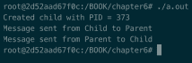
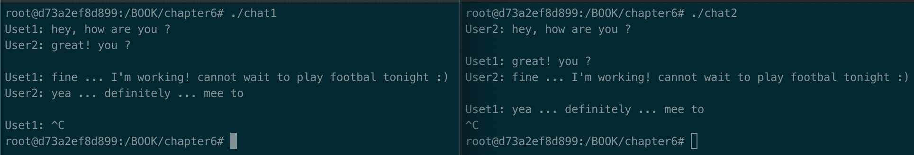
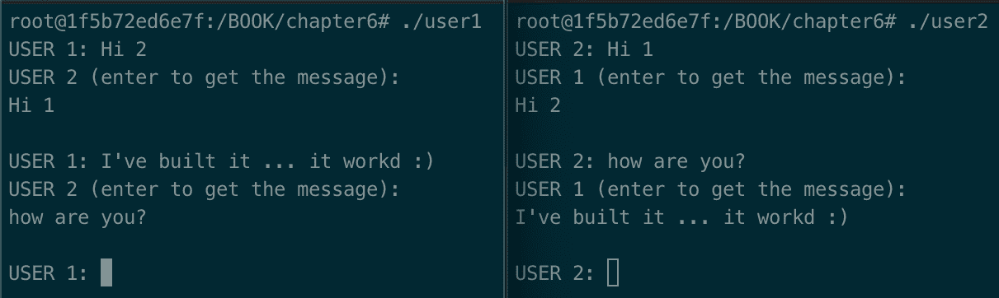

# 管道、先进先出、消息队列和共享内存

进程间的通信是软件系统的重要组成部分，选择合适的通信技术并不是一件简单的事情。开发人员在做出选择时应该记住的一个重要区别是进程是否将在同一台机器上运行。本章重点介绍第一类，您将学习如何基于管道、**先进先出** ( **先进先出**)、消息队列和共享内存开发**进程间通信** ( **IPC** )解决方案。它将首先概述第一个食谱中的四种 IPC 类型、它们的特点以及这些类型之间的差异。然后，每种类型的食谱将提供将它们应用于日常工作所需的实践信息。本章不包含任何特定于 C++ 的解决方案，以便让您熟悉 Linux 本机机制。

本章将涵盖以下主题:

*   学习不同类型的仪表板组合仪表
*   学习如何使用最古老的 IPC 形式——管道
*   学习如何使用先进先出
*   学习如何使用消息队列
*   学习如何使用共享内存

# 技术要求

为了让您立即尝试这些程序，我们设置了一个 Docker 映像，其中包含了我们在整本书中需要的所有工具和库。这是基于 Ubuntu 19.04 的。

要进行设置，请执行以下步骤:

1.  从[www.docker.com](http://www.docker.com)下载安装 Docker 引擎。
2.  通过运行以下命令从 Docker Hub 中拉出图像:`docker pull kasperondocker/system_programming_cookbook:latest`。
3.  图像现在应该可以使用了。输入以下命令查看图像:`docker images`。
4.  你现在至少应该有这个形象:`kasperondocker/system_programming_cookbook`。
5.  借助以下命令，使用交互式外壳运行 Docker 映像:`docker run -it --cap-add sys_ptrace kasperondocker/system_programming_cookbook:latest /bin/bash`。
6.  运行容器上的外壳现已可用。键入`root@39a5a8934370/# cd /BOOK/`以获取所有开发的程序，按章节。

需要`--cap-add sys_ptrace`参数来允许 Docker 容器中的 **GNU 项目调试器** ( **GDB** )设置断点，默认情况下，Docker 不允许设置断点。

**Disclaimer**: The C++ 20 standard has been approved (that is, technically finalized) by WG21 in a meeting in Prague at the end of February. This means that the GCC compiler version that this book uses, 8.3.0, does not include (or has very, very limited support for) the new and cool C++ 20 features. For this reason, the Docker image does not include the C++ 20 recipe code. GCC keeps the development of the newest features in branches (you have to use appropriate flags for that, for example, `-std=c++ 2a`); therefore, you are encouraged to experiment with them by yourself. So, clone and explore the GCC contracts and module branches and have fun.

# 学习不同类型的仪表板组合仪表

该配方的目标是为在同一台机器上运行的进程通常使用的不同 IPC 解决方案提供指导。它将从开发人员的角度(您的角度)概述主要特征。)，解释它们之间的不同之处。

# 怎么做...

下表显示了 Linux 机器上始终可用的四种 IPC 类型，其中各列代表我们认为开发人员在做出设计选择时应该考虑的独特因素:

|  | ****流程【r】******需要得意洋洋吗？** | **需要同步吗？** | **通讯类型** | **范围** | **仁涉？** |
| **管道** | 是 | 一般不会 | 半双工 | 同一台机器 | 是 |
| **先进先出** | 不 | 一般不会 | 半双工 | 通常是同一台机器 | 是 |
| **讯息伫列** | 不 | 一般不会 | 半双工 | 同一台机器 | 是 |
| **共享内存** | 不 | 是 | 半双工 | 同一台机器 | 是 |

该表的列有以下描述:

*   **需要流程的关系？**:表示是否需要流程之间的关系(例如父子关系)来实现特定的 IPC。
*   **需要同步吗？**:这表示你是否需要考虑进程之间任何形式的同步(例如互斥、信号量等等；参见[第 5 章](05.html)、*是否使用互斥体、信号量和条件变量*。
*   **通信类型**:两个或两个以上实体之间的通信可以是半双工(最接近的类比是对讲机，在对讲机中，在任何给定时间只有一个人可以说话)或全双工(例如电话，由此两个人可以同时说话)。这将对设计的解决方案产生深远的影响。
*   **范围**:这表示解决方案是否可以应用到更广的范围，就不同机器上的进程之间的 IPC 而言。
*   **仁涉？**:这警告你关于内核参与通信过程。*它是如何工作的...*部分将解释为什么这很重要。

在下一节中，我们将逐行分析表中突出显示的单个特征。

# 它是如何工作的...

列表中的第一个 IPC 机制是一个**管道**。管道需要两个进程(例如，父子进程)之间的关系才能工作。这种关系是必要的，以便通过两个过程(与先进先出相反)使管道**可见**。它就像一个变量，必须通过一个方法可见才能使用。在管道配方中，我们将看到这在技术上是如何工作的。

通信类型为半双工:数据从进程 *A* 流向进程 *B、*，因此不需要同步。为了在两个进程之间实现全双工通信类型，必须使用两个管道。出于两个进程必须有关系才能使用管道的相同原因，管道不能用作两个不同机器上的进程之间的通信机制。Linux 内核参与了通信，因为数据被复制到内核，然后被进一步复制到接收进程。

表格中的第二个 IPC 机制是**先进先出**(或**命名管道**)。它是一个命名管道，因为它需要创建一个路径名，实际上，它是一种特殊的文件。这使得先进先出可以被任何进程使用，即使它们之间没有关系。他们所需要的只是所有进程将使用的先进先出路径(同样，一个文件名)。这种情况下也不需要同步。但是，我们必须小心，因为有些情况下需要同步，正如`man page`所规定的。

POSIX.1 says that writes ([http://man7.org/linux/man-pages/man2/write.2.html](http://man7.org/linux/man-pages/man2/write.2.html)) of less than `pipe_BUF` bytes must be atomic (that is, the output data is written to the pipe as a contiguous sequence). Writes of more than `pipe_BUF` bytes may be nonatomic (that is, the kernel may interleave the data with data written by other processes). POSIX.1 requires `pipe_BUF` to be at least 512 bytes. (On Linux, `pipe_BUF` is 4,096 bytes.) The precise semantics depends on whether the file descriptor is nonblocking (`O_NONBLOCK`); whether there are multiple writers to the pipe; and on *n*, the number of bytes to be written.

一般规则是，如果您对进程之间应该进行多少数据交换有任何疑问，请始终提供同步机制(例如，互斥、信号量和许多其他机制)。先进先出(同样，管道)提供半双工通信机制，除非为每个进程提供两个先进先出(每个进程一个读取器和一个写入器)；在这种情况下，它将成为全双工通信。先进先出通常用于同一台机器上进程之间的 IPC，但是，由于它是基于文件的，如果文件被其他机器看到，先进先出可能用于不同机器上进程之间的 IPC。即使在这种情况下，内核也参与到 IPC 中，数据从内核空间复制到进程的用户空间。

一个**消息队列**是一个存储在内核中的消息链表。该定义已经包含一条信息；这是内核提供的一种通信机制，同样，这意味着数据在内核之间来回复制。消息队列不需要进程之间的任何关系；他们必须共享一个密钥才能访问同一个队列。如果消息小于或等于`pipe_BUF`，Linux 内核保证队列上操作的原子性。在这种情况下，需要同步机制。消息队列不能在计算机范围之外使用。

表中最后一个 IPC 机制是**共享内存**。这是最快的 IPC 形式。这是有代价的，因为使用共享内存的进程应该使用某种形式的同步(例如互斥或信号量)，正如`man page`所建议的那样(`man shm_overview`)。

Any time there is a critical section to protect, processes must synchronize the access using a mechanism we've seen in [Chapter 5](05.html), *Using Mutexes, Semaphores, and Condition Variables.*

进程必须在同一台机器上运行，才能使用相同的共享内存，并且它用一个键来标识，消息队列也是如此。由于共享内存驻留在内核空间中，数据从内核空间复制到读取和删除它的进程。

# 还有更多...

这四种形式的 IPC 最初是在 Unix System V 上开发的，然后在 Linux 支持的更现代的 POSIX 标准中重新实现。有些情况下，进程不在同一台机器上，在这些情况下，我们需要使用其他机制，比如套接字，我们将在下一章中看到。当然，套接字在通信过程中具有更广泛的适用性，而与它在网络中的位置无关。

可以说，这种普遍性是有代价的:它们比这个食谱中描述的机制要慢。因此，作为开发人员，这是在做出设计选择时必须考虑的一个因素。

# 请参见

*   [第 5 章](05.html) *，使用互斥体、信号量和条件变量*:关于可以使用的同步机制。
*   [第 7 章](07.html) *，网络编程*:用套接字的概念(面向连接和无连接)来补充这一章。

# 学习如何使用最古老的 IPC 形式——管道

在上一个食谱中，你学会了如何根据一些关键因素来选择 IPC。现在是动手操作这四种通信类型的时候了，这个食谱的重点是管道。在本食谱中，您将学习如何使用管道使两个进程通过使用两个管道进行全双工通信。我们通常不会使用任何形式的同步，因为这不是必需的。在*它是如何工作的...*部分，我们来看看为什么不需要，什么时候不需要。

# 怎么做...

在本节中，我们将开发一个程序，该程序将创建两个进程，其独特的目标是相互发送消息。如我们所见，使用管道，数据向一个方向流动。为了进行双向通信，并模拟一般情况，我们将使用两个管道:

1.  我们实例化了要发送的两条消息，以及它们的大小，稍后我们将需要它们:

```cpp
#include <stdio.h>
#include <unistd.h>
#include <string.h>
#include <sys/types.h>
#include <sys/wait.h>

char* msg1 = "Message sent from Child to Parent";
char* msg2 = "Message sent from Parent to Child";
#define MSGSIZE 34
#define IN      0
#define OUT 1
```

2.  接下来，我们进入初始化部分。我们需要为收到的消息实例化空间，包括`childToParent`和`parentToChild`管道，以及我们用来跟踪孩子的**进程标识符** ( **PID** ):

```cpp
int main()
{
    char inbufToParent[MSGSIZE];
    char inbufToChild[MSGSIZE];
    int childToParent[2], parentToChild[2], pid, nbytes;

    inbufToParent[0] = 0;
    inbufToChild[0] = 0;
    if (pipe(childToParent) < 0)
        return 1;

    if (pipe(parentToChild) < 0)
        return 1;
```

3.  现在，让我们看看儿童部分。这个部分有两部分:第一部分，孩子向家长发送`msg1`消息；第二种，孩子从父母那里收到`msg2`信息:

```cpp
if ((pid = fork()) > 0)
{
        printf("Created child with PID = %d\n", pid);
        close(childToParent[IN]);
        write(childToParent[OUT], msg1, strlen(msg1));
        close(childToParent[OUT]);

        close (parentToChild[OUT]);

        read(parentToChild[IN], inbufToChild, strlen(msg2));
        printf("%s\n", inbufToChild);
        close (parentToChild[IN]);
        wait(NULL);
}
```

4.  最后，让我们看看父代码。它有两个部分:一部分接收来自孩子的信息，第二部分回复信息:

```cpp
else
{
        close (childToParent[OUT]);
        read(childToParent[IN], inbufToParent, strlen(msg1));
        printf("%s\n", inbufToParent);
        close (childToParent[IN]);

        close (parentToChild[IN]);
        write(parentToChild[OUT], msg2, strlen(msg2));
        close (parentToChild[OUT]);
}
return 0;
```

我们已经通过编程实现了我们在[第 1 章](01.html)、*系统编程入门*中所学的 shell(参见*学习 Linux 基础知识–shell*食谱)。下一节将详细介绍这些步骤。

# 它是如何工作的...

在第一步中，我们只是定义了两个进程要使用的`msg1`和`msg2`，并定义了读取它们所需的消息长度`MSGSIZE`。

第二步本质上将两个管道`childToParent`和`parentToChild`定义为两个整数的数组。它们被`pipe`系统调用用来创建两个通信缓冲区，进程可以通过`childToParent[0]`和`childToParent[1]`文件描述符访问这两个缓冲区。该消息被写入`childToParent[1]`并用先进先出策略从`childToParent[0]`读取。为了避免缓冲器未初始化的情况，该步骤将`inbuf1`和`inbuf2`的指针设置为`0`。

第三步处理孩子的代码。它写入`childToParent[1]`，然后从`parentToChild[0]`读取。子进程对`childToParentp[1]`的写入可以由父进程在`childToParent[0]`上读取。`read`和`write`系统调用使进程进入内核模式，并将输入数据暂时保存在内核空间，直到第二个进程读取它。要遵循的一条规则是，管道的未使用端必须关闭。在我们的情况下，我们写信给`childToParent[1]`；所以，我们关闭管道的`read`端，`childToParent[0]`，一旦读取，我们关闭`write`端，因为这是不使用的。

第四步，非常类似于第三步，有子代码的对称代码。它在`childToParent[0]`管道上读取并在`parentToChild[1]`上写入，遵循关闭未使用的管道末端的相同规则。

从分析的代码来看，管道不能被非祖先进程使用的原因现在应该很清楚了:`childToParent`和`parentToChild`文件描述符在运行时必须对父进程和子进程可见。

如果我们在 Docker 容器的`/BOOK/Chapter06/`文件夹中用`gcc pipe.c`编译代码并运行它，输出如下:



这表明父节点和子节点正确地发送和接收了两条消息。

# 还有更多...

对于绝大多数用例，管道旨在用于少量数据，但是可能有需要大量数据的场景。我们在本章中遵循的标准 POSIX 规定，小于`pipe_BUF`字节的`write`必须是原子的。它进一步规定`pipe_BUF`必须至少是 512 字节(在 Linux 上，是 4kb)；否则，您必须通过使用信号量和互斥体等机制来处理用户级的同步。

# 请参见

*   [第 1 章](01.html)、*系统编程入门*，从 shell 角度展示了管道概念。
*   [第 5 章](05.html)、*使用互斥体、信号量和条件变量*有必要的工具来添加同步，以防发送和接收的数据大于`pipe_BUF`。

# 学习如何使用先进先出

我们在前面的配方中看到的管道是暂时的，也就是说，当没有过程打开它们时，它们就不复存在了。 **FIFOs** (也叫**命名管道**)不同；它们是作为文件系统上的特殊文件存在的特殊管道。原则上，任何进程，假设它有正确的权限，都可以访问先进先出。最后一个是先进先出的特点。使用文件允许我们编写一个更通用的通信机制来将进程置于通信中，即使没有祖先关系；或者，换句话说，我们可以使用 FIFO 来获取任意两个文件进行通信。在这个食谱中，你将学习如何编程先进先出。

# 怎么做...

在本节中，我们将开发一个基于 FIFOs 的非常原始的聊天程序，从而产生两个不同的程序，在运行时允许两个用户聊天:

1.  让我们创建一个名为`fifo_chat_user1.c`的文件，并添加我们稍后需要的包含，并且`MAX_LENGTH`定义确定两个用户可以交换的消息的最大长度:

```cpp
#include <stdio.h>
#include <string.h>
#include <fcntl.h>
#include <sys/stat.h>
#include <unistd.h>

#define MAX_LENGTH 128
```

2.  接下来，从`main`开始。这里需要定义`fd`文件描述符来打开文件；我们打算存储文件的路径；我们将用来存储`msgReceived`和`msgToSend`消息的两个字符串；最后，`mkfifo`系统调用以定义的路径创建先进先出:

```cpp
int main()
{
    char* fifoChat = "/tmp/chat";
    mkfifo(fifoChat, 0600);

    char msgReceived[MAX_LENGTH], msgToSend[MAX_LENGTH];
```

3.  我们现在需要一个无限循环来不断地`write`和`read`。我们通过创建两个部分来做到这一点:在`write`部分，我们以写模式打开`fifoChat`文件，用`fgets`从用户那里获得消息，并将`msgToSend`写入文件，用`fd`文件描述符表示。在阅读器部分，我们以读取模式打开文件，用`read`方法读取文件内容，打印输出，关闭`fd`:

```cpp
    while (1)
    {
        int fdUser1 = open(fifoChat, O_WRONLY);
        printf("User1: ");
        fgets(msgToSend, MAX_LENGTH, stdin);
        write(fdUser1, msgToSend, strlen(msgToSend)+1);
        close(fdUser1);

        int fdUser2 = open(fifoChat, O_RDONLY);
        read(fdUser2, msgReceived, sizeof(msgReceived));
        printf("User2: %s\n", msgReceived);
        close(fdUser2);
    }
    return 0;
}
```

4.  第二个程序非常相似。唯一不同的是`while`循环，反之亦然。在这里，我们有`read`部分，然后是`write`部分。您可以将`fifo_chat_user1.c`文件复制到`fifo_chat_user2.c`中进行修改，如下所示:

```cpp
while (1)
{
        int fdUser2 = open(myfifo, O_RDONLY);
        read(fdUser2, msgReceived, sizeof(msgReceived));
        printf("User1: %s\n", msgReceived);
        close(fdUser2);

        int fdUser1 = open(myfifo, O_WRONLY);
        printf("User2: ");
        fgets(msgToSend, MAX_LENGTH, stdin);
        write(fdUser1, msgToSend, strlen(msgToSend)+1);
        close(fdUser1);
}
```

虽然这不是你能找到的最具互动性的聊天方式，但尝试先进先出绝对有用。在下一节中，我们将分析本节中看到的步骤。

# 它是如何工作的...

让我们首先编译并运行这两个程序。在这种情况下，我们希望给可执行文件一个不同的名称，以便区分它们:

```cpp
gcc fifo_chat_user1.c -o chatUser1

gcc fifo_chat_user2.c -o chatUser2
```

这会创建两个可执行文件:`chatUser1`和`chatUser2`。让我们在两个独立的终端上运行它们，然后聊天:



在*步骤 1* 中，我们本质上定义了`MAX_LENGTH`到`128`字节，并添加了我们需要的定义。

在*步骤 2* 中，我们在`fifoChat`指定的路径上创建了`mkfifo` FIFO，指向`/tmp/chat`文件，权限为`6`(用户读写)、`0`(用户所属组不读、不写、不执行)和`0`(用户不读、不写、不执行)。一旦调用`mkfifo`就可以检查这些设置:

```cpp
root@d73a2ef8d899:/BOOK/chapter6# ls -latr /tmp/chat
prw------- 1 root root 0 Oct 1 23:40 /tmp/chat
```

在*步骤 3* 中，我们用`open`方法打开了 FIFO。值得一提的是`open`是打开普通文件的同一个方法，在返回的描述符上，我们可以调用`read`和`write`，就像我们在普通文件上做的一样。在这一步中，我们做了一个无限循环，让用户想聊多久就聊多久。如您所见，`read`和`write`部分在*步骤 4* 中互换，如果第一个用户正在写，则允许第二个用户读取，反之亦然。

先进先出由内核通过先进先出策略进行内部管理。每次我们`write`或`read`数据从/到 FIFO，数据就从/传到内核。你应该记住这一点。当`chat2`程序调用`read`方法时，消息从`chat1`可执行文件传递到内核空间，然后再返回到用户空间。

# 还有更多...

到目前为止应该很清楚，先进先出是一种特殊的管道。这意味着我们对管道的限制同样适用于先进先出。例如，除非发送的数据量超过`pipe_BUF`限制，标准 POSIX 定义为 512 字节，Linux 设置为 4 KB，否则不需要同步。

另一个需要强调的方面是，命名管道(FIFO)可以用于 *N* 到 *M* 的通信类型(即多个读取器和多个写入器)。如果满足前面的条件，内核保证操作(`read`和`write`调用)的原子性。

# 请参见

*   [第三章](03.html)，*处理流程和线程*
*   [第 5 章](05.html)、*使用互斥体、信号量和条件变量*

# 学习如何使用消息队列

另一个由符合 POSIX 的操作系统(以及 Linux 内核)直接支持的机制是消息队列。消息队列本质上是存储在内核中的消息的链表，其中每个队列都由一个标识来标识。在这个食谱中，我们将使用一个消息队列重写聊天程序，强调主要的优点和缺点。

# 怎么做...

在这一部分，我们将从*学习如何使用先进先出*食谱改写聊天程序。这将允许您亲自查看先进先出和消息队列之间的异同:

1.  创建一个名为`mq_chat_user_1.c`的新文件，并添加以下包含和定义:

```cpp
#include <stdio.h>
#include <string.h>
#include <mqueue.h>

#define MAX_MESSAGES 10
#define MAX_MSG_SIZE 256
```

2.  在`main`方法中，现在让我们定义两个消息队列描述符(`user1Desc`和`user2Desc`)来存储后面`mq_open`方法的结果。我们必须定义并初始化`mq_attr`结构来存储我们将要创建的消息队列的配置:

```cpp
int main()
{
    mqd_t user1Desc, user2Desc;
    char message[MAX_MSG_SIZE];
    char message2[MAX_MSG_SIZE];

    struct mq_attr attr;
    attr.mq_flags = 0;
    attr.mq_maxmsg = MAX_MESSAGES;
    attr.mq_msgsize = MAX_MSG_SIZE;
    attr.mq_curmsgs = 0;
```

3.  我们可以打开两个`/user1`和`/user2`消息队列:

```cpp
    if ((user1Desc = mq_open ("/user1", O_WRONLY | O_CREAT,
         "0660", &attr)) == -1)
    {
        perror ("User1: mq_open error");
        return (1);
     }
     if ((user2Desc = mq_open ("/user2", O_RDONLY | O_CREAT,
         "0660", &attr)) == -1)
     {
         perror ("User2: mq_open error");
         return (1);
     }
```

4.  程序的中心部分是发送和接收来自两个用户的消息的循环。为此，我们必须:
    1.  使用`user1Desc`消息队列描述符，通过`mq_send`方法向用户 2 发送消息。
    2.  使用`user2Desc`消息队列描述符接收用户 2 通过`mq_receive`发送给我们的最终消息:

```cpp
    while (1)
    {
        printf("USER 1: ");
        fgets(message, MAX_MSG_SIZE, stdin);
        if (mq_send (user1Desc, message, strlen (message)
            + 1, 0) == -1)
        {
            perror ("Not able to send message to User 2");
            continue;
        }
        if (mq_receive (user2Desc, message2, MAX_MSG_SIZE,
             NULL) == -1)
        {
            perror ("tried to receive a message from User 2
                but I've failed!");
            continue;
        }
        printf("USER 2: %s\n", message2);
    }
    return 0;
}
```

5.  我们需要另一个程序来回复用户 1。这个程序很相似；唯一不同的是，它在`user2Desc`上发送消息(这次在写入模式下打开)并从`user1Desc`读取(在读取模式下打开)。

让我们现在运行程序。我们需要在 shell 中键入以下两个命令来编译`mq_chat_user_1.c`和`mq_chat_user_2.c`程序:

```cpp
gcc mq_chat_user_1.c -o user1 -g -lrt
gcc mq_chat_user_2.c -o user2 -g -lrt
```

我们正在编译和链接程序，并生成`user1`和`user2`可执行文件。我们添加了`-lrt`(这是 POSIX.1b 实时扩展库)，因为我们需要包含 POSIX 消息队列实现。请记住，对于`-l`，您要求编译器为链接器阶段考虑一个特定的库。在下一节中，我们将看到输出，并分析之前看到的所有步骤。

# 它是如何工作的...

通过运行`./user1`和`./user2`可执行文件，我们将得到以下输出:


让我们看看以下步骤:

1.  **第一步**:我们需要`#include <stdio.h>`进行用户输入输出，`#include <string.h>`通过`strlen`获取字符串长度，`#include <mqueue.h>`可以访问消息队列接口。在这一步中，我们定义了队列中消息的最大数量(`10`)和队列中消息的最大大小(`256`字节)。
2.  **第二步**:在程序的`main`方法中，我们定义了两个消息队列描述符(`user1Desc`和`user2Desc`)来保持对消息队列的引用；两个消息数组(`message`和`message2`)存储两个用户之间发送和接收的消息；最后，我们定义并初始化了`struct mq_attr`结构，用于初始化我们将在下一步中使用的消息队列。
3.  **第三步**:这一步，我们打开了两个消息队列。这是`/user1`和`/user2`，它们位于`/dev/mqueue`:

```cpp
root@1f5b72ed6e7f:/BOOK/chapter6# ll /dev/mqueue/user*
------x--- 1 root root 80 Oct 7 13:11 /dev/mqueue/user1*
------x--- 1 root root 80 Oct 7 13:11 /dev/mqueue/user2*
```

`mq_chat_user_1.c`以只写模式打开`/user1`消息队列，如果不存在，则创建该队列。它还以只读模式打开`/user2`，如果不存在，则创建它。应该清楚的是，如果当前进程没有消息队列(我们用`660`打开)的访问权限，`mq_open`将失败。

4.  **第四步**:这一步包含了我们程序的主要逻辑。它有一个无限循环，从用户 1 向用户 2 发送消息，从用户 2 向用户 1 接收消息。用来发送消息的方法是`mq_send`。它需要消息队列描述符、要发送的消息、其长度(`+1`，因为我们需要包含终止符)和消息优先级(在本例中我们没有使用)。`mq_send`(更多信息参见`man mq_send`)如果队列中没有空间，则阻塞直到有足够的空间可用。

发送后，我们调用`mq_receive`方法(更多信息参见`man mq_receive`)从用户 2 处获取最终消息。它需要消息队列描述符，一个包含消息的数组，我们可以接收的最大大小，以及优先级。请记住，如果队列中没有消息，则`mq_receive`会阻止。

For more info, see the `man mq_receive` page.

由于发送和接收是核心概念，让我们用一个模式来更深入地分析它们:


**(1)** 在这种情况下，用户 1 进程调用`mq_send`。Linux 内核复制了一份从用户空间发送到内核空间的消息。 **(3)** 的情况也是如此。

**(2)** 当用户 2 进程在同一个消息队列(`user1Desc`)上调用`mq_receive`时，Linux 内核将消息从内核空间复制到用户空间，复制`message2`缓冲区中的数据。 **(4)** 的情况也是如此。

# 还有更多...

有些情况下，您可能需要根据优先级从队列中获取消息，但我们在本例中没有使用。你能修改这个食谱的程序以包括优先权吗？你有什么要修改的？

你可能已经注意到我们在这个食谱中使用了`perror`方法。`perror`方法在标准输出中打印最后一个错误(`errno`)，该错误以描述性格式出现。对开发人员的好处是，您不必显式获取`errno`值并将其转换为字符串；这是自动为你完成的。

我们为管道和先进先出描述的原子性概念同样适用于消息队列。如果消息小于`pipe_BUF`，则保证消息的传递是原子的。否则，开发人员必须提供同步机制。

# 请参见

[第 3 章](03.html)、*处理进程和线程*(关于线程)和[第 5 章](05.html)、*使用互斥体、信号量和条件变量*(关于同步)中的食谱。像往常一样，`man pages`提供了一个很好的信息来源，建议的起点是`man  mq_overview`。

# 学习如何使用共享内存

正如我们所知，在我们目前看到的所有 IPC 机制中，内核在进程之间的通信中扮演着积极的角色。信息确实从 Linux 内核流向进程，反之亦然。在这个食谱中，我们将学习最快的进程间通信形式，它不需要内核作为进程间的中介。像往常一样，尽管 System V APIs 广泛可用，但我们将使用最新、更简单、设计更好的 POSIX APIs。我们将使用共享内存重写我们的聊天应用，更详细地挖掘它。

# 怎么做...

在这一节中，我们将着重于使用 POSIX 共享内存 API 开发一个简单的聊天应用。由于内核不(直接)参与通信过程，我们需要提供一种同步机制来保护关键部分(共享内存)免受两个进程的读写影响:

1.  让我们从添加我们需要的包含和定义开始。我们将有两个共享内存空间(`STORAGE_ID1`和`STORAGE_ID2`)来实现进程之间的双向通信:

```cpp
#include <stdio.h>
#include <sys/mman.h>
#include <fcntl.h>
#include <unistd.h>
#include <string.h>

#define STORAGE_ID1 "/SHM_USER1"
#define STORAGE_ID2 "/SHM_USER2"
#define STORAGE_SIZE 32
```

2.  在`main`方法中，我们需要两个数组来存储发送和接收的消息。此外，我们需要打开两个具有以下标志的共享内存空间:读写模式，如果不存在则创建，以及分别指示文件所有者的读写权限的标志`(S_IRUSR`和`S_IWUSR`:

```cpp
int main(int argc, char *argv[])
{
    char message1[STORAGE_SIZE];
    char message2[STORAGE_SIZE];

    int fd1 = shm_open(STORAGE_ID1, O_RDWR | O_CREAT, S_IRUSR | 
        S_IWUSR);
    int fd2 = shm_open(STORAGE_ID2, O_RDWR | O_CREAT, S_IRUSR | 
        S_IWUSR);
    if ((fd1 == -1) || (fd2 == -1))
    {
        perror("open");
        return 10;
    }
```

3.  由于共享内存基于`mmap`(我们本质上是将一个文件映射到内存的一部分)，我们需要将文件描述符 1 ( `fd1`)指向的文件扩展到我们需要的大小`STORAGE_SIZE`。然后，我们需要将两个文件描述符映射到共享模式(`MAP_SHARED`)下的一部分内存，当然，还要检查错误:

```cpp
    // extend shared memory object as by default it's initialized 
    //  with size 0
    int res1 = ftruncate(fd1, STORAGE_SIZE);
    if (res1 == -1)
    {
        perror("ftruncate");
        return 20;
    }

    // map shared memory to process address space
    void *addr1 = mmap(NULL, STORAGE_SIZE, PROT_WRITE, MAP_SHARED, 
        fd1, 0);
    void *addr2 = mmap(NULL, STORAGE_SIZE, PROT_WRITE, MAP_SHARED, 
        fd2, 0);
    if ((addr1 == MAP_FAILED) || (addr2 == MAP_FAILED))
    {
        perror("mmap");
        return 30;
    }
```

4.  在`main`循环中，与前面两个食谱一样，我们在两个共享内存实例中使用`read`和`write`:

```cpp
    while (1)
    {
        printf("USER 1: ");
        fgets(message1, STORAGE_SIZE, stdin);
        int len = strlen(message1) + 1;
        memcpy(addr1, message1, len);

        printf("USER 2 (enter to get the message):"); getchar();
        memcpy(message2, addr2, STORAGE_SIZE);
        printf("%s\n", message2);
    }

    return 0;
}
```

5.  第二个程序反映了这个。你可以在`/BOOK/Chapter06`文件夹中找到他们两个:`shm_chat_user1.c`(我们描述的那个)和`shm_chat_user2.c`。

让我们通过在外壳上键入以下两个命令来编译和链接两个`shm_chat_user1.c`和`shm_chat_user2.c`程序:

```cpp
gcc shm_chat_user1.c -o user1 -g -lrt
gcc shm_chat_user2.c -o user2 -g -lrt
```

输出将是两个二进制文件:`user1`和`user2`。在这种情况下，我们也添加了`-lrt`，因为我们需要包含 POSIX 共享内存实现(没有它，链接阶段将抛出`undefined reference to 'shm_open'`错误)。在下一节中，我们将分析本节中看到的所有步骤。

# 它是如何工作的...

运行`./user1`和`./user2`程序会产生以下交互:



让我们执行以下步骤:

*   **第一步**:第一步只是包括我们需要的几个表头:`stdio.h`为标准输入/输出(例如:`perror`、`printf`等)；`mman.h`为共享内存 APIs`mmap`和`fcntl.h`为`shm_open`旗帜(例如，`O_CREAT`、`O_RDWR`等)；`unistd.h`为`ftruncate`法；`string.h`为`strlen`和`memcpy`方法。

我们定义了`STORAGE_ID1`和`STORAGE_ID2`来标识两个共享内存对象，它们将在`/dev/shm`文件夹中可用:

```cpp
root@1f5b72ed6e7f:/BOOK/chapter6# ll /dev/shm/SHM_USER*
-rw------- 1 root root 32 Oct 7 23:26 /dev/shm/SHM_USER1
-rw------- 1 root root 0 Oct 7 23:26 /dev/shm/SHM_USER2
```

*   **第二步**:在这一步中，我们在堆栈上为两个消息(`message1`和`message2`)分配了空间，我们将使用这两个消息在进程之间发送和接收消息。然后，我们创建并打开两个新的共享内存对象，并检查是否有任何错误。
*   **步骤 3** :一旦两个共享内存对象可用，我们就需要扩展这两个文件(通过两个文件描述符`fd1`和`fd2`，每个程序一个文件描述符)，并且——非常重要——将`fd1`和`fd2`映射到当前进程的虚拟地址空间。
*   **第四步**:这一步是程序的中心部分。这里有几件有趣的事情需要注意。首先，我们可以看到，用户空间和内核空间之间的数据移动不像 FIFOs、管道和消息队列那样。我们只是在本地缓冲区(在堆栈上分配)和我们映射的内存之间进行内存复制，反之亦然。第二个因素是，由于我们只是处理内存复制，性能将优于其他 IPC 机制。

这一步的机制很简单:我们要求用户键入一条消息并将其存储在`message1`缓冲区中，然后用`addr1`将该缓冲区复制到内存映射地址。read 部分(我们从第二个用户那里读取消息)也很简单:我们将消息从内存复制到本地缓冲区`message2`。

# 还有更多...

如您所见，在这个配方中，两个过程之间没有同步。那是为了让你只关注一个方面:共享记忆的交流。再次邀请读者改进这段代码，通过使用线程使其更具交互性，并通过使用同步机制使其更安全。

从内核 2.6.19 开始，Linux 支持使用**访问控制列表** ( **访问控制列表**)来控制虚拟文件系统中对象的权限。更多信息见`man acl`。

# 请参见

关于线程和同步的方法:

*   [第三章](03.html)，*处理流程和线程*
*   [第 5 章](05.html)、*使用互斥体、信号量和条件变量*