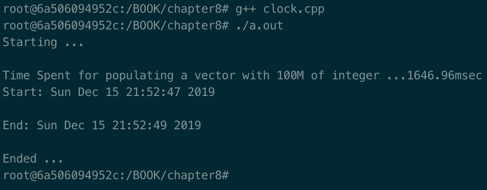

# 九、处理时间接口

时间在操作系统和应用中有多种形式。通常，应用需要处理以下**类**时间:

*   **时钟**:实际的时间和日期，就像你在手表上看到的一样
*   **时间点**:对应用的使用情况(例如，处理器或一般资源)进行分析、监控和故障排除所花费的处理时间
*   **持续时间**:单调时间，即某一事件经过的时间

在本章中，我们将从 C++ 和 POSIX 的角度处理所有这些方面，以便您的工具箱中有更多可用的工具。本章中的食谱将教你如何通过使用时间点来衡量一个事件，为什么你应该使用一个稳定的时钟，以及时间何时超过以及如何缓解它。您将学习如何用 POSIX 和 C++ 实现这些概念。

本章将涵盖以下食谱:

*   了解 C++ 时间接口
*   使用 C++ 20 日历和时区
*   了解 Linux 计时
*   处理睡眠时间和超时

# 技术要求

为了立即试用本章中的程序，我们设置了一个 Docker 映像，其中包含了我们在本书中需要的所有工具和库。它基于 Ubuntu 19.04。

要进行设置，请执行以下步骤:

1.  从[www.docker.com](https://www.docker.com/)下载安装 Docker 引擎。
2.  从 Docker Hub 中拉出图像:`docker pull kasperondocker/system_programming_cookbook:latest`。
3.  图像现在应该可以使用了。输入以下命令查看图像:`docker images`。
4.  你应该有如下图像:`kasperondocker/system_programming_cookbook`。
5.  借助`docker run -it --cap-add sys_ptrace kasperondocker/system_programming_cookbook:latest /bin/bash`命令，用交互式外壳运行 Docker 图像。
6.  运行容器上的外壳现已可用。前往`root@39a5a8934370/# cd /BOOK/`获取本书将要开发的所有程序。

需要`--cap-add sys_ptrace`参数来允许 **GDB** (简称 **GNU 项目调试器**)设置断点，Docker 默认不允许。

**Disclaimer**: The C++ 20 standard has been approved (that is, technically finalized) by WG21 in a meeting in Prague at the end of February. This means that the GCC compiler version that this book uses, 8.3.0, does not include (or has very, very limited support for) the new and cool C++ 20 features. For this reason, the Docker image does not include the C++ 20 recipe code. GCC keeps the development of the newest features in branches (you have to use appropriate flags for that, for example, `-std=c++ 2a`); therefore, you are encouraged to experiment with them by yourself. So, clone and explore the GCC contracts and module branches and have fun.

# 了解 C++ 时间接口

C++ 11 标准确实标志着关于时间的重要一步。在此之前(C++ 标准 98 及之前)，系统和应用开发人员不得不依赖于特定于实现的 API(即 POSIX)或外部库(例如`boost`)来操纵**时间**，这意味着可移植性较低的代码。这个食谱将教你如何使用标准时间操作库编写 C++ 代码。

# 怎么做...

让我们编写一个程序来学习 C++ 标准中支持的**时钟**、**时间点**和**持续时间**的概念:

1.  创建一个新文件，并将其称为`chrono_01.cpp`。我们首先需要几个包括:

```cpp
#include <iostream>
#include <vector>
#include <chrono>
```

2.  在`main`部分，我们需要测量一些东西，所以让我们用一些整数填充一个`std::vector`:

```cpp
int main ()
{
    std::cout << "Starting ... " << std::endl;
    std::vector <int> elements;
    auto start = std::chrono::system_clock::now();

    for (auto i = 0; i < 100'000'000; ++ i)
        elements.push_back(i);

    auto end = std::chrono::system_clock::now();
```

3.  现在我们有了两个时间点`start`和`end`，让我们计算一下差值(即持续时间)并打印出来，看看花了多长时间:

```cpp
    // default seconds
    std::chrono::duration<double, std::milli> diff = end - start;
    std::cout << "Time Spent for populating a vector with     
        100M of integer ..." 
              << diff.count() << "msec" << std::endl;
```

4.  现在，我们要以另一种格式打印`start`变量；例如，在带有`ctime`的日历本地时间格式中:

```cpp
    auto tpStart = std::chrono::system_clock::to_time_t(start);
    std::cout << "Start: " << std::ctime(&tpStart) << std::endl;

    auto tpEnd = std::chrono::system_clock::to_time_t(end);
    std::cout << "End: " << std::ctime(&tpEnd) << std::endl;
    std::cout << "Ended ... " << std::endl;
}
```

这个程序使用了一些`std::chrono`特性，如`system_clock`、`time_point`和标准库中可用的持续时间，从 C++ 标准的第 11 版开始就这样做了。

# 它是如何工作的...

*步骤 1* 负责包含我们稍后需要的标题:`<iostream>`用于标准输出，`<vector>`和`<chrono>`用于时间。

*步骤 2* 定义了一个称为元素的 **int 向量。因此，我们可以在`chrono`命名空间中的`system_clock`类上调用`now()`方法来获取当前时间。虽然我们使用了`auto`，但是这个方法返回了一个表示时间点的`time_point`对象。然后，我们循环了 1 亿次来填充`elements`数组，以强调我们使用了新的 C++ 14 特性来表示 *100，000，000* ，这提高了代码的可读性。最后，我们通过调用`now()`方法并将`time_point`对象存储在`end`变量中来获取另一个时间点。**

在*第 3 步*中，我们看了执行循环需要多长时间。为了计算这个，我们实例化了一个`duration`对象，这是一个需要两个参数的模板类:

*   **表示**:表示刻度数的类型。
*   **时期**:这个可以是(除了别的以外)`std::nano`、`std:micro`、`std::milli`等等。

期间的默认值为`std::seconds`。然后，我们只在标准输出上写`diff.cout()`，它代表`start`和`end`之间的毫秒数。计算这种差异的另一种方法是使用`duration_cast`；例如`std::chrono::duration_cast<std::chrono::milliseconds> (end-start).count()`。

在*步骤 4 中，*我们在日历`localtime`表示中打印`start`和`end` `time_point`变量(注意容器时间可能与主机容器不同步)。为此，我们需要使用`system_clock`类的`to_time_t()`静态变量将它们转换成`time_t`，然后将它们传递给`std::ctime`方法。

现在，让我们构建并运行这个:



在下一节中，我们将学习更多关于这个食谱的知识。

# 还有更多...

我们开发的程序使用`system_clock`类。`chrono`命名空间中有三个时钟类:

*   `system_clock`:这代表所谓的**挂钟时间** *。*它可以随时调整，例如通过闰秒引入额外的不精确性或用户刚刚设置它。在大多数实现中，它的纪元(即它的起点)使用 UNIX 时间，这意味着从 1970 年 1 月 1 日 <sup>st</sup> 开始计数。
*   `steady_clock`:这代表了所谓的**单调时钟**。永远不会调整。它保持稳定。在大多数实现中，它的起点是机器启动的时间。为了计算某个事件的过去时间，您应该考虑使用这种类型的时钟。
*   `high_resolution_clock`:这是可用的滴答时间最短的时钟。它可能只是`system_clock`或`steady_clock`的别名，或者是一个完全不同的实现。它是实现定义的。

要记住的第二个方面是 C++ 20 标准包括`time_of_day`、日历和时区。

# 请参见

*   *学习 Linux 定时*食谱进行简单对比
*   *c++ 之旅，第二版，*比雅尼·斯特劳斯特鲁普

# 使用 C++ 20 日历和时区

C++ 20 标准用日历特性丰富了`std::chrono`命名空间。它们包括了你所期望的所有典型特性，以及一种更习惯和直观的玩法。这个食谱将教你一些最重要的特性，以及与`std::chrono`名称空间的日历部分交互有多简单。

# 怎么做...

让我们看一些代码:

1.  创建一个新文件，确保包含`<chrono>`和`<iostream>`。我们有个约会，我们想知道一周中的哪一天`bday`会到来:

```cpp
#include <chrono>
#include <iostream>

using namespace std;
using namespace std::chrono;

int main ()
{
    auto bday = January/30/2021;
    cout << weekday(bday) << endl;

    auto anotherDay = December/25/2020;
    if (bday == anotherDay)
        cout << "the two date represent the same day" << endl;
    else
        cout << "the two dates represent two different days"    
            << endl;
}
```

2.  有一整套课程可以让你玩日历。让我们来看看其中的一些:

```cpp
#include <chrono>
#include <iostream>

using namespace std;
using namespace std::chrono;

int main ()
{
    auto today = year_month_day{ floor<days>(system_clock::now()) };
    auto ymdl = year_month_day_last(today.year(), month*day* last{ month{ 2 } });
    auto last_day_feb = year_month_day{ ymdl };
    std::cout << "last day of Feb is: " << last_day_feb
        << std::endl;

    return 0;
}
```

3.  让我们玩一下时区，并打印不同时区的时间列表:

```cpp
#include <chrono>
#include <iostream>

using namespace std;
using namespace std::chrono;

int main()
{
    auto zone_names = {
       "Asia/Tokyo",
       "Europe/Berlin",
       "Europe/London",
       "America/New_York",
    };

    auto localtime = zoned_time<milliseconds>(date::current_zone(),
                                              system_clock::now());
    for(auto const& name : zone_names)
        cout << name
             << zoned_time<milliseconds>(name, localtime)
             << std::endl;

    return 0;
}
```

4.  经常使用的一个特性是用来找出两个时区之间的差异:

```cpp
#include <chrono>
#include <iostream>

using namespace std;
using namespace std::chrono;

int main()
{
    auto current = system_clock::now();
    auto lon = zoned_time{"Europe/London", current_time};
    auto newYork = zoned_time{"America/New_York", current_time};
    cout <<"Time Difference between London and New York:" 
         << (lon.get_local_time() - newYork.get_local_time())
             << endl;

    return 0;
}
```

让我们深入`std::chrono`日历部分，了解更多关于这个食谱的信息。

# 它是如何工作的...

在新的 C++ 20 标准中有很多日历和时区助手函数。这个食谱只是触及了表面，但仍然让我们理解了处理时间是多么容易。所有`std::chrono`日历和时区功能的参考可以在[https://en.cppreference.com/w/cpp/chrono](https://en.cppreference.com/w/cpp/chrono)找到。

*第一步*使用`weekday`方法获取一周中的某一天(使用公历)。在调用`weekday`方法之前，我们需要得到一个具体的日期，用 C++ 20，我们只需要设置`auto bday = January/30/2021`，代表一个日期。现在，我们可以将其传递给`weekday`方法，以获得一周中的特定一天，在我们的情况下是周六。一个有用的特性是我们可以比较日期，就像我们可以比较`bday`和`anotherDay`变量一样。`weekday`和所有其他`std::chrono`日历方法一样，处理闰秒。

*步骤 2* 显示了`year_month_day`和`year_month_day_last`方法的使用。这个库包含一整套类似于这两个的类，例如`month_day`和`month_day_lat`等等。他们显然有不同的范围，但他们的原则保持不变。在这一步中，我们有兴趣知道 2 月的最后一天。我们用`year_month_day{ floor<days>(system_clock::now()) }`在`today`变量中设置当前日期，然后将`today`传递给`year_month_day_last`方法，该方法将返回类似于`2020/02/last`的内容，并将其存储在`ymdl`变量中。我们可以再用`year_month_day`的方法得到二月的最后一天。我们可以跳过几个步骤，直接调用`year_month_day_last`方法。出于教育目的，我们执行了这一步骤。

*第三步*进入时区范围。此步骤中的代码片段通过迭代`zone_names`数组打印时区列表。这里，我们首先通过遍历由字符串标识的每个时区来获得`localtime`。然后，我们使用`zoned_time`方法将`localtime`转换为由`name`变量标识的时区。

在*第 4 步*中，我们讲述了一个有趣且反复出现的问题:寻找两个时区之间的时差。原则不变；我们仍然使用`zoned_time`方法获取两个时区的当地时间，在本例中是`"America/New_York"`和`"Europe/London"`。然后，我们减去两个本地时间，得到差值。

# 还有更多...

`std::chrono`日历提供了各种各样的方法，欢迎您探索。完整列表可在[https://en.cppreference.com/w/cpp/chrono](https://en.cppreference.com/w/cpp/chrono)获得。

# 请参见

*   *c++ 之旅，第二版*，作者:比雅尼·斯特劳斯特鲁普，*第 13.7 章，时间*

# 学习 Linux 定时

在 C++ 11 之前，标准库不包含任何直接的时间管理支持，所以系统开发人员不得不使用*外部*源。外部，我们指的是外部库(例如，Boost([https://www.boost.org/](https://www.boost.org/))或特定于操作系统的应用编程接口。我们认为系统开发人员有必要从 Linux 的角度理解时间的概念。本食谱将帮助您使用 POSIX 标准掌握**时钟**、**时间点**、**持续时间**等概念。

# 怎么做...

在这个食谱中，我们将编写一个程序，这样我们就可以从 Linux 的角度了解**时钟**、**时间点**和**持续时间**的概念。让我们开始吧:

1.  在 shell 中，创建一个名为`linux_time_01.cpp`的新文件，并添加以下包含和函数原型:

```cpp
#include <iostream>
#include <time.h>
#include <vector>

void timespec_diff(struct timespec* start, struct timespec* stop, struct timespec* result);
```

2.  现在，我们想看看`clock_gettime`通话中`CLOCK_REALTIME`和`CLOCK_MONOTONIC`的区别。我们需要定义两个`struct timespec`变量:

```cpp
int main ()
{
    std::cout << "Starting ..." << std::endl;
    struct timespec tsRealTime, tsMonotonicStart;
    clock_gettime(CLOCK_REALTIME, &tsRealTime);
    clock_gettime(CLOCK_MONOTONIC, &tsMonotonicStart);
```

3.  接下来，我们需要打印`tsRealTime`和`tsMonoliticStart`变量的内容来看看区别:

```cpp
    std::cout << "Real Time clock (i.e.: wall clock):"
        << std::endl;
    std::cout << " sec :" << tsRealTime.tv_sec << std::endl;
    std::cout << " nanosec :" << tsRealTime.tv_nsec << std::endl;

    std::cout << "Monotonic clock:" << std::endl;
    std::cout << " sec :" << tsMonotonicStart.tv_sec << std::endl;
    std::cout << " nanosec :" << tsMonotonicStart.tv_nsec+
        << std::endl;
```

4.  我们需要一个任务来监控，所以我们将使用一个`for`循环来填充一个`std::vector`。在这之后，我们立即得到一个时间点在`tsMonotonicEnd`变量:

```cpp
    std::vector <int> elements;
    for (int i = 0; i < 100'000'000; ++ i)
        elements.push_back(i);

    struct timespec tsMonotonicEnd;
    clock_gettime(CLOCK_MONOTONIC, &tsMonotonicEnd);
```

5.  现在，我们要打印任务的工期。为此，我们调用`timespec_diff`(辅助方法)来计算`tsMonotonicEnd`和`tsMonotonicStart`之间的差异:

```cpp
    struct timespec duration;
    timespec_diff (&tsMonotonicStart, &tsMonotonicEnd, &duration);

    std::cout << "Time elapsed to populate a vector with
        100M elements:" << std::endl;
    std::cout << " sec :" << duration.tv_sec << std::endl;
    std::cout << " nanosec :" << duration.tv_nsec << std::endl;
    std::cout << "Finished ..." << std::endl;
}
```

6.  最后，我们需要实现一个辅助方法来计算`start`和`stop`变量表示的时间之间的时间差(即持续时间):

```cpp
// helper method
void timespec_diff(struct timespec* start, struct timespec* stop, struct timespec* result)
{
    if ((stop->tv_nsec - start->tv_nsec) < 0) 
    {
        result->tv_sec = stop->tv_sec - start->tv_sec - 1;
        result->tv_nsec = stop->tv_nsec - start->tv_nsec
          + 100'000'0000;
    } 
    else 
    {
        result->tv_sec = stop->tv_sec - start->tv_sec;
        result->tv_nsec = stop->tv_nsec - start->tv_nsec;
    }
    return;
}
```

前面的程序展示了如何收集时间点来计算事件的持续时间。现在，让我们深入了解这个项目的细节。

# 它是如何工作的...

首先，让我们编译并执行程序:


我们可以立即注意到实时时钟(秒)比单调时钟(秒)大得多。通过做一些数学计算，你会注意到第一个大约是 49 年，第二个大约是 12 个小时。为什么会这样？第二个观察是，我们的代码花费了`1 second`和`644348500`纳秒来填充一个 1 亿个项目的向量。让我们收集一些见解来解释这一点。

*第 1 步*只是增加了一些 includes 和我们写的计算时间差的原型。

*步骤 2* 定义了两个变量`struct timespec tsRealTime`和`struct timespec tsMonotonicStart`，用于存储两个时间点。然后，我们通过传递`CLOCK_REALTIME`和`tsRealTime`变量两次调用`clock_gettime()`方法。我们通过用`tsMonotonicStart`变量传递`CLOCK_MONOTONIC`第二次这样做。`CLOCK_REALTIME`和`CLOCK_MONOTONIC`都是`clockid_t`型。当`clock_gettime()`被`CLOCK_REALTIME`调用时，我们得到的时间将是`wall-clock`时间(或实时)。

这个时间点和`std::chrono::SYSTEM_CLOCK`有着相同的问题，我们在*学习关于 C++ 时间界面*的食谱中看到过。它可以调整(例如，如果系统时钟与 NTP 同步)，因此这不适合计算事件的经过时间(或持续时间)。当使用`CLOCK_MONOTONIC`参数调用`clock_gettime()`时，时间不会调整，大多数实现会从系统启动时就开始计时(即从机器启动时开始计时)。这非常适合事件持续时间的计算。

*第三步*只是打印时间点的结果，即`tsRealTime`和`tsMonotonicStart`。我们可以看到第一个包含 1970 年 1 月 1 日 <sup>st</sup> 以来的秒数(大约 49 年)，而后者包含我的机器启动后的秒数(大约 12 小时)。

*第四步*只需在一个`std::vector`中增加 1 亿个项目，然后在`tsMonotonicEnd`中获得另一个时间点，该时间点将用于计算该事件的持续时间。

*步骤 5* 计算`tsMonotonicStart`和`tsMonotonicEnd`之间的差值，并通过调用`timespec_diff()`辅助方法将结果存储在`duration`变量中。

*第六步*执行`timespec_diff()`方法，逻辑计算(`tsMonotonicEnd - tsMonotonicStart`)。

# 还有更多...

对于`clock_gettime()`方法，我们使用 POSIX 作为对应物集合方法:`clock_settime()`。`gettimeofday()` : `settimeofday()`同样有效。

值得强调的是`gettimeofday()`是`time()`的扩展，返回一个`struct timeval`(即秒和微秒)。这种方法的问题是它可以调整。这是什么意思？假设你用`usegettimeofday()`得到事件发生前的一个时间点进行测量，然后得到事件发生后的另一个时间点进行测量。在这里，你会计算两个时间点之间的差异，认为一切都很好。这里可能会出现什么问题？想象一下，在您获取的两个时间点之间，**网络时间协议** ( **NTP** )服务器要求本地机器调整本地时钟，使其与时间服务器同步。计算的持续时间不准确，因为事件发生后的时间点会受到 NTP 同步的影响。NTP 只是这方面的一个例子。本地时钟也可以用其他方式调整。

# 请参见

*   *学习 C++ 时间界面*配方，用于与 C++ 进行比较
*   *Linux 系统编程，第二版*，*作者:*罗伯特·拉芙

# 处理睡眠时间和超时

在系统编程环境中，时间不仅仅包括测量事件持续时间或读取时钟的行为。也有可能让一个进程休眠一段时间。这个食谱将教你如何使用基于秒 *-* 的应用编程接口、基于微秒的应用编程接口和具有纳秒分辨率的`clock_nanosleep()`方法来让一个进程休眠。此外，我们将了解什么是时间超支，以及如何最大限度地减少它们。

# 怎么做...

在这一节中，我们将编写一个程序来学习如何使用不同的 POSIX APIs 让程序进入睡眠状态。我们还将研究 C++ 替代方案:

1.  打开一个 shell，创建一个名为`sleep.cpp`的新文件。我们需要添加一些稍后需要的标题:

```cpp
#include <iostream>
#include <chrono>
#include <thread>    // sleep_for
#include <unistd.h>  // for sleep
#include <time.h>    // for nanosleep and clock_nanosleep
```

2.  我们将使用`sleep()`方法和`std::chrono::steady_clock`类作为时间点来计算结束时的持续时间，从而使程序休眠`1`秒钟:

```cpp
int main ()
{
    std::cout << "Starting ... " << std::endl;

    auto start = std::chrono::steady_clock::now();
    sleep (1);
    auto end = std::chrono::steady_clock::now();
    std::cout << "sleep() call cause me to sleep for: " 
              << std::chrono::duration_cast<std::chrono::
                  milliseconds> (end-start).count() 
              << " millisec" <<     std::endl;
```

3.  让我们看看`nanosleep()`是如何工作的。我们仍然使用`std::chrono::steady_clock`来计算持续时间，但是我们需要一个`struct timespec`。我们将使进程休眠大约`100`毫秒:

```cpp
    struct timespec reqSleep = {.tv_sec = 0, .tv_nsec = 99999999};
    start = std::chrono::steady_clock::now();
    int ret = nanosleep (&reqSleep, NULL);
    if (ret)
         std::cerr << "nanosleep issue" << std::endl;
    end = std::chrono::steady_clock::now();
    std::cout << "nanosleep() call cause me to sleep for: " 
              << std::chrono::duration_cast<std::
                  chrono::milliseconds> (end-start).count() 
              << " millisec" << std::endl;
```

4.  让进程进入睡眠状态的一种更高级的方法是使用`clock_nanosleep()`，它允许我们指定一些有趣的参数(更多细节见下一节):

```cpp
    struct timespec reqClockSleep = {.tv_sec = 1, 
        .tv_nsec = 99999999};
    start = std::chrono::steady_clock::now();
    ret = clock_nanosleep (CLOCK_MONOTONIC, 0,
        &reqClockSleep, NULL);
    if (ret)
        std::cerr << "clock_nanosleep issue" << std::endl;
    end = std::chrono::steady_clock::now();
    std::cout << "clock_nanosleep() call cause me to sleep for: " 
              << std::chrono::duration_cast<std::chrono::
                  milliseconds> (end-start).count() 
              << " millisec" << std::endl;
```

5.  现在，让我们看看如何使用 C++ 标准库(通过`std::this_thread::sleep_for`模板方法)让当前线程进入睡眠状态:

```cpp
    start = std::chrono::steady_clock::now();
    std::this_thread::sleep_for(std::chrono::milliseconds(1500));
    end = std::chrono::steady_clock::now();
    std::cout << "std::this_thread::sleep_for() call
      cause me to sleep for: " 
              << std::chrono::duration_cast<std::chrono::
                  milliseconds> (end-start).count() 
              << " millisec" << std::endl;
    std::cout << "End ... " << std::endl;
}
```

现在，让我们更详细地看一下这些步骤。

# 它是如何工作的...

该程序将以四种不同的方式进入休眠状态。让我们看看运行时:


*步骤 1* 只包含我们需要的标题:`<iostream>`为标准输出和标准误差(`cout`和`cerr`)，`<chrono>`为将用于测量实际睡眠的时间点，`<thread>`为`sleep_for`方法，`<unistd>`为`sleep()`，而`<time.h>`为`nanosleep()`和`clock_nanosleep()`。

*第二步*使用`sleep()`方法使流程休眠`1`秒。我们使用`steady_clock::now()`来获得时间点，`duration_cast`来投射差异并获得实际持续时间。准确地说，`sleep()`如果进程至少已经成功休眠了指定的时间，则返回`0`，但是它可以返回一个介于 0 和指定秒之间的值，该值将代表**而不是**休眠的时间。

*第三步*展示如何使用`nanosleep()`让一个进程进入睡眠状态。我们决定使用这种方法，因为`usleep()`在 Linux 上已经被否决了。`nanosleep()`比`sleep()`有优势，因为它有纳秒级的分辨率，`POSIX.1b`是标准化的。`nanosleep()`成功返回`0`，出错返回`-1`。它通过将`errno`全局变量设置为发生的特定错误来实现这一点。`struct timespec`变量包含`tv_sec`和`tv_nsec`(秒和纳秒)。

*第四步*使用了更复杂的`clock_nanosleep()`。这个方法包含两个我们还没有看到的参数。第一个参数是`clock_id`并接受`CLOCK_REALTIME`和`CLOCK_MONOTONIC`，这是我们在前面的食谱中看到的。根据经验，如果你睡到绝对时间(挂钟时间)，你想使用第一个，如果你睡到相对时间值，你想使用第二个。根据我们在前面的食谱中看到的内容，这是有意义的。

第二个参数是标志；可以是`TIME_ABSTIME`也可以是`0`。如果第一个被通过，`reqClockSleep`变量将被视为绝对变量，但是如果`0`被通过，那么它将被视为相对变量。为了进一步澄清绝对时间的概念，它可能来自于之前对`clock_gettime()`的调用，该调用将绝对时间点存储在一个变量中，比如`ts`。加上`2`秒，我们就可以把`&ts`(也就是变量`ts`的地址)传给`clock_nanosleep()`，等到那个特定的绝对时间。

*第五步*让进程的当前线程休眠 1.5 秒(本例中当前线程为主线程，所以整个进程都会休眠)(1500 毫秒= 1.5 秒)。`std::this_thread::sleep_for`简单有效。它是一个模板方法，接受一个参数作为输入；也就是`duration`，需要表示类型和周期(`_Rep`、`_Period`)，就像我们在*学习 C++ 时间界面*菜谱中看到的一样。在这种情况下，我们只传递了以毫秒为单位的周期，并使表示处于默认状态。

这里有一个问题我们要注意:时间****超限**。我们在本食谱中使用的所有界面都保证了该过程将休眠*至少与请求的时间一样长*。否则他们会返回一个错误。出于不同的原因，他们的睡眠时间可能比我们要求的时间稍长。一个原因可能是调度程序选择了不同的任务来运行。当计时器的粒度大于请求的时间时，就会出现此问题。例如，想想计时器显示的时间(`10msec`)以及睡眠时间为`5 msec`。我们可能会遇到这样的情况，流程必须比预期多等待`5`毫秒，这是 100%长。通过使用支持高精度时间源的方法，如`clock_nanosleep()`、`nanosleep()`和`std::this_thread::sleep_for()`，可以缓解时间超限。**

 **# 还有更多...

我们没有明确提到`nanosleep()`和`clock_nanosleep()`的线程含义。这两种方法都会导致当前线程休眠。在 Linux 上休眠意味着线程(或者进程，如果是单线程应用)将进入**不可运行**状态，这样 CPU 就可以继续执行其他任务(请记住 Linux 并不区分线程和进程)。

# 请参见

*   *学习 C++ 时间界面*食谱复习`std::chrono::duration<>`模板类
*   *学习 Linux 定时*食谱，回顾**实时**和**单调**的概念**