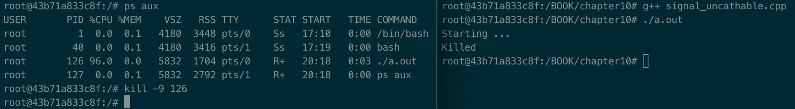
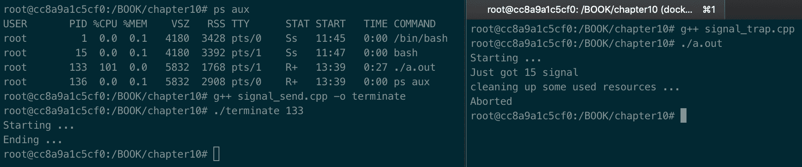

# 管理信号

信号是软件中断。它们提供了一种管理异步事件的方法，例如，终端用户键入中断键或另一个进程发送必须管理的信号。每个信号都有一个以`SIG`开头的名字(例如`SIGABRT`)。本章将教你如何编写代码来正确管理软件中断，Linux 为每个信号定义的默认动作是什么，以及如何覆盖它们。

本章将涵盖以下食谱:

*   了解所有信号及其默认动作
*   学习如何忽略信号
*   学习如何捕捉信号
*   学习如何向另一个进程发送信号

# 技术要求

为了让您立即尝试本章中的程序，我们建立了一个 Docker 映像，它包含了我们在整本书中需要的所有工具和库，它基于 Ubuntu 19.04。

要进行设置，请执行以下步骤:

1.  从[www.docker.com](http://www.docker.com)下载并安装 Docker 引擎。
2.  从 Docker Hub 中拉出图像:`docker pull kasperondocker/system_programming_cookbook:latest`。
3.  图像现在应该可以使用了。输入以下命令查看图像:`docker images`。
4.  你现在至少应该有这个形象:`kasperondocker/system_programming_cookbook`。

5.  借助以下命令，使用交互式外壳运行 Docker 映像:`docker run -it --cap-add sys_ptrace kasperondocker/system_programming_cookbook:latest /bin/bash`。
6.  运行容器上的外壳现已可用。使用`root@39a5a8934370/# cd /BOOK/`按章节获取所有开发的程序。

`--cap-add sys_ptrace`参数是允许 Docker 容器中的 GDB 设置断点所必需的，默认情况下，Docker 不允许设置断点。

# 了解所有信号及其默认动作

这个食谱将向您展示 Linux 支持的所有信号和相关的默认操作。我们还将了解为什么信号是一个重要的概念，以及 Linux 对软件中断做了什么。

# 怎么做...

在本节中，我们将列出我们的 Linux 发行版支持的所有信号，以便能够描述*中最常见的信号是如何工作的...*段。

在 shell 中，键入以下命令:

```cpp
root@fefe04587d4e:/# kill -l
```

如果您在基于 Ubuntu 版发行版的图书 Docker 映像上运行此命令，您将获得以下输出:

```cpp
 1) SIGHUP 2) SIGINT 3) SIGQUIT 4) SIGILL 5) SIGTRAP
 6) SIGABRT 7) SIGBUS 8) SIGFPE 9) SIGKILL 10) SIGUSR1
11) SIGSEGV 12) SIGUSR2 13) SIGPIPE 14) SIGALRM 15) SIGTERM
16) SIGSTKFLT 17) SIGCHLD 18) SIGCONT 19) SIGSTOP 20) SIGTSTP
21) SIGTTIN 22) SIGTTOU 23) SIGURG 24) SIGXCPU 25) SIGXFSZ
26) SIGVTALRM 27) SIGPROF 28) SIGWINCH 29) SIGIO 30) SIGPWR
31) SIGSYS 34) SIGRTMIN 35) SIGRTMIN+1 36) SIGRTMIN+2 37) SIGRTMIN+3
38) SIGRTMIN+4 39) SIGRTMIN+5 40) SIGRTMIN+6 41) SIGRTMIN+7 42) SIGRTMIN+8
43) SIGRTMIN+9 44) SIGRTMIN+10 45) SIGRTMIN+11 46) SIGRTMIN+12 47) SIGRTMIN+13
48) SIGRTMIN+14 49) SIGRTMIN+15 50) SIGRTMAX-14 51) SIGRTMAX-13 52) SIGRTMAX-12
53) SIGRTMAX-11 54) SIGRTMAX-10 55) SIGRTMAX-9 56) SIGRTMAX-8 57) SIGRTMAX-7
58) SIGRTMAX-6 59) SIGRTMAX-5 60) SIGRTMAX-4 61) SIGRTMAX-3 62) SIGRTMAX-2
63) SIGRTMAX-1 64) SIGRTMAX

```

在下一节中，我们将了解一个进程可以接收的最常见信号的默认动作是什么，每个信号的描述，以及 Linux 如何管理这些软件中断。

# 它是如何工作的...

在*第 1 步中，*我们执行`kill -l`命令来获取当前 Linux 发行版支持的所有信号。下表提供了带有默认操作和描述的最常见信号列表:

| **信号** | **描述** | **默认动作** |
| `SIGHUP` | 控制进程的终端已关闭(例如，用户已注销？) | 结束的 |
| `SIGABRT` | `abort()`发出的信号 | 终止(如果可能，使用核心转储) |
| `SIGSEGV` | 无效的内存引用 | 终止(如果可能，使用核心转储) |
| `SIGSYS` | 错误的系统调用或进程试图执行无效的系统调用。 | 终止(如果可能，使用核心转储) |
| `SIGINT` | 键盘产生的中断(例如 *Ctrl* + *C* ) | 结束的 |
| `SIGQUIT` | 键盘生成的退出(例如: *Ctrl* + */* ) | 终止(如果可能，使用核心转储) |
| `SIGPIPE` | 一个进程试图写入管道，但没有读取器 | 结束的 |
| `SIGILL` | 一个进程试图执行非法指令 | 终止(如果可能，使用核心转储) |
| `SIGALRM` | `alarm()`发出的信号 | 结束的 |
| `SIGSTOP` | 停止进程 | 停止进程 |
| `SIGIO` | 异步输入/输出事件 | 结束的 |
| `SIGTRAP` | 断点被捕获 | 结束的 |
| `SIGTERM` | 终止信号(可捕捉) | 结束的 |
| `SIGKILL` | 流程终止(不可捕捉) | 结束的 |

对于发送给进程的每个信号，Linux 应用其默认动作。当然，系统开发人员可以通过在过程中实现期望的动作来覆盖这个动作，正如我们将在*学习如何捕捉信号*配方中看到的。

信号在`<signal.h>`头文件中定义，只是正整数，有意义的名称总是以`SIG` 字为前缀。当一个信号(也就是软件中断)被发出时，Linux 会做什么？简单地说，它总是应用相同的顺序生命周期，如下所示:

1.  信号是由另一个进程的用户发出的，或者是由 Linux 本身发出的。
2.  信号被存储起来，直到 Linux 能够传送它。
3.  交付后，Linux 会执行以下特定操作之一:
    1.  忽略信号:我们已经看到有不可忽略的信号(例如`SIGKILL`)。
    2.  执行默认操作:您可以参考上表的第 3 列。
    3.  用注册的函数(系统开发人员实现的)处理信号。

# 还有更多...

在`<signal.h>`头文件中描述和定义的所有信号都符合 POSIX。这意味着每个标识符、它们的名称和默认动作都是由 POSIX.1-2003 标准定义的，Linux 遵循该标准。这保证了应用中`signals`实现或支持的可移植性。

# 请参见

*   学习如何捕捉信号食谱
*   学习如何忽略信号食谱
*   学习如何向另一个过程发送信号配方
*   [第 3 章](03.html)、*处理进程和线程*刷新进程和线程。

# 学习如何忽略信号

可能有些情况下我们只需要忽略一个特定的信号。不过，放心，不可忽视的信号很少，比如`SIGKILL`(不可查)。这个食谱将教你如何忽略一个可捕捉的信号。

# 怎么做...

要忽略可捕捉的信号，请执行以下步骤:

1.  在 shell 中，打开一个名为`signal_ignore.cpp`的新源文件，并通过添加以下代码开始:

```cpp
#include<stdio.h>
#include<signal.h>
#include <iostream>

int main()
{
    std::cout << "Starting ..." << std::endl;
    signal(SIGTERM, SIG_IGN);
    while (true) ;
    std::cout << "Ending ..." << std::endl;
    return 0;
}
```

2.  在第二个程序(`signal_uncatchable.cpp`)中，我们希望看到一个*不可切换的*信号不能被*忽略*。为此，我们将使用我们在*学习所有信号及其默认动作*配方中看到的`SIGKILL`信号，该信号不可捕捉(即程序不能忽略):

```cpp
#include<stdio.h>
#include<signal.h>
#include <iostream>

int main()
{
    std::cout << "Starting ..." << std::endl;
    signal(SIGKILL, SIG_IGN);
    while (true) ;
    std::cout << "Ending ..." << std::endl;
    return 0;
}
```

下一部分将解释前面两个程序的细节。

# 它是如何工作的...

*步骤 1* 包含忽略`SIGTERM`信号的程序。我们通过调用`signal();`系统调用来做到这一点，方法是将特定信号作为第一个参数(`SIGTERM`)传递，将要遵循的动作作为第二个参数传递，在这种情况下，第二个参数是`SIG_IGN`，忽略它。

*第二步*与*第一步*代码相同。我们只是使用了传递`SIGKILL`参数和`SIG_IGN`的`signal();`方法。换句话说，我们要求 Linux 忽略这个进程的`SIGKILL`信号(`signal_uncatchable.cpp`一旦构建并执行就会成为一个进程)。正如我们在*学习所有信号及其默认动作*配方中了解到的那样，`SIGKILL`是一个不可调谐的信号。

现在让我们构建并运行这两个程序。我们期待看到的是第一个节目中忽略的`SIGTERM`信号和第二个节目中分别无法忽略的`SIGKILL`信号。第一个程序的输出如下:


在这里，我们使用`ps aux`检索流程的`PID`，并通过运行命令发送`SIGTERM`信号:`kill -15 115`(其中`15`代表`SIGKILL`)。如您所见，通过完全忽略终止该进程的信号，该进程一直在运行。

第二个程序`signal_uncatchable.cpp`显示，即使我们指定捕捉`SIGKILL`信号，Linux 还是忽略了这一点，杀死了我们的进程。我们可以在下面的截图中看到这一点:



# 还有更多...

要获得 Linux 机器上支持的所有信号的列表，`kill -l`命令非常有帮助，`man signal`包含成功将信号集成到程序中所需的所有细节。

# 请参见

*   学习[第 1 章](01.html)*中的*Linux 基础–外壳*食谱，了解如何在外壳上运行程序*
*   *学习如何捕捉信号*食谱
*   *学习如何向另一个过程发送信号*食谱
*   *学习所有信号及其默认动作*配方
*   [章节3](03.html) *，处理进程和线程，*刷新进程和线程

# 学习如何捕捉信号

这个食谱将教你如何在程序中捕捉(或捕捉)信号。可能需要对特定信号执行一些操作。例如，当应用收到终止信号(`SIGTERM`)时，我们需要在退出前清理一些已使用的资源。

# 怎么做...

让我们编写一个应用，捕捉`SIGTERM`信号，打印一个字符串，并终止应用:

1.  在一个 shell 中，创建一个名为`signal_trap.cpp`的新文件。除了其他报头之外，我们还需要包括`<signal.h>`，以便能够处理信号。我们还必须添加管理我们想要捕获的信号所需的原型。在`main`方法中，我们通过传递想要捕获的`SIGTERM`和用于管理它的方法来调用`signal()`系统调用:

```cpp
#include<stdio.h>
#include<signal.h>
#include <iostream>

void handleSigTerm (int sig);

int main()
{
    std::cout << "Starting ..." << std::endl;
    signal(SIGTERM, handleSigTerm);
    while (true);
    std::cout << "Ending ..." << std::endl;
    return 0;
}
```

2.  我们需要定义`handleSigTerm()`方法(可以任意命名):

```cpp
void handleSigTerm (int sig)
{
    std::cout << "Just got " << sig << " signal" << std::endl;
    std::cout << "cleaning up some used resources ..."
        << std::endl;
    abort();
}
```

下一节将详细描述该程序。

# 它是如何工作的...

*步骤 1* 本质上定义了`main`方法。首先，我们需要`<signal.h>`表头。在`main`方法的定义中，中心部分是`signal()`系统调用，我们在这里传递我们想要诱捕的`SIGTERM`信号和我们想要被 Linux 调用的方法。这是一个值得强调的重要方面。`signal()`系统调用接受(作为第二个参数)一个指向系统开发人员必须定义的函数的指针，正如我们所做的那样。在内核中，当一个软件中断被引发时，Linux 将其发送到特定的进程，并且该方法将被调用(以回调的形式)。`signal()`方法的原型是这样的:

```cpp
void(*signal(int, void (*)(int)))(int);
```

*步骤 2* 定义了管理我们想要捕捉的`SIGTERM`信号的方法。这种简单的方法展示了一些有趣的东西。首先，这个方法是从`signal()`系统调用中调用的回调。其次，我们必须将其原型定义为`void (*)(int) `，即返回 void 并接受输入中的一个整数(它代表应用实际接收到的信号)。任何与这个原型不同的东西都会导致编译错误。

现在，让我们构建并执行上一节中开发的程序:


我们构建并链接了`signal_trap.cpp`程序，并生成了`a.out`可执行文件。我们经营它；与流程相关的 PID 是`46`。在右边的外壳上，我们发送`SIGTERM`信号(标识符= `15`)到带有 PID `46`的进程。正如你在标准输出(左边的外壳)上看到的，这个过程捕捉到了信号，并调用了我们定义的方法`handleSigTerm()`。该方法在标准输出中打印一些日志，并调用`abort()`系统调用，向运行进程发送`SIGABORT`信号。在*学习所有信号及其默认动作*配方中可以看到，`SIGABORT`的默认动作是终止进程(并生成核心转储)。当然，根据您的需求，您可以使用它并以另一种更合适的方式终止该过程(例如，`exit()`)。

# 还有更多...

那么，当一个进程分叉(或执行)另一个进程时，信号会发生什么呢？下表将帮助您理解如何处理具有流程-子流程关系的信号:

| **信号行为** | **工艺叉** | **流程执行** |
| 默认 | 遗传的 | 遗传的 |
| 忽略 | 遗传的 | 遗传的 |
| 有把手的 | 遗传的 | 不是遗传的 |

在这个阶段，当一个进程分叉另一个进程时，子进程基本上继承了父进程的所有行为，你不应该感到惊讶。当一个进程执行另一个任务(带有`exec`)时，它继承**默认行为**和**忽略行为**，但它不继承已实现的已处理方法。

# 请参见

*   学习如何忽略信号食谱
*   *学习所有信号及其默认动作*配方
*   学习如何向另一个过程发送信号配方
*   [第 3 章](03.html)、*处理进程和线程，*刷新进程和线程

# 学习如何向另一个进程发送信号

可能会有这样的场景:一个进程需要向其他进程发送信号。这个食谱将教你如何通过动手实践来实现。

# 怎么做...

我们将编写一个程序，向正在运行的进程发送`SIGTERM`信号。我们将看到进程如预期的那样终止。在一个 shell 中，打开一个名为`signal_send.cpp`的新源文件。我们将使用系统调用`kill()`，它向`pid`指定的进程发送信号`sig`。程序接受一个输入参数，即终止程序的`pid`:

```cpp
#include<stdio.h>
#include<signal.h>
#include <iostream>

int main(int argc, char* argv[])
{
    std::cout << "Starting ..." << std::endl;
    if (argc <= 1)
    {
       std::cout << "Process pid missing ..." << std::endl;
       return 1;
    }
    int pid = std::atoi(argv[1]);
    kill (pid, SIGTERM);

    std::cout << "Ending ..." << std::endl;
    return 0;
}
```

我们将使用在*中开发的`signal_trap.cpp`程序学习如何捕获信号*配方作为终止过程。下一节将深入讨论这里的代码细节。

# 它是如何工作的...

为了看到正确的行为，我们需要运行一个我们打算终止的进程。我们将运行`signal_trap.cpp`程序。让我们如下构建并运行`signal_send.cpp`程序:



在这里，我们做了一些事情，如下所示:

1.  我们已经构建了`signal_trap.cpp`程序并生成了`a.out`可执行文件。
2.  运行`./a.out`。
3.  在左边的外壳上，我们取了`a.out`流程的`pid`，也就是`133`。
4.  我们已经将`signal_send.cpp`程序构建为`terminate`可执行文件。
5.  我们用流程的变量`a.out`运行`./terminate`，我们想要终止:`./terminate 133`。
6.  在右边的外壳上，我们可以看到`a.out`进程正确终止。

*第一步*有几件事我们必须解释。首先，我们从命令行参数解析`pid`变量，转换成整数，然后保存到`pid`变量中。其次，我们通过将`pid`变量和`SIGTERM`信号传递给运行过程来调用`kill()`系统调用。

`man 2 kill`: `int kill(pid_t pid, int sig);` 
The `kill()` function sends the signal specified by `sig` to `pid`.
For System V compatibility, if the PID is negative (but not `-1`), the signal is sent to all of the processes whose process group IDs are equal to the absolute value of the process number. However, if the `pid` is 0, `sig` is sent to every process in the **invoking process's** process group.

# 还有更多...

为了向另一个(或多个)进程发送信号，发送进程必须具有适当的权限。简单来说，一个进程可以向另一个进程发送信号，如果当前用户拥有它的话。

在某些情况下，进程必须向自己发送信号。在这种情况下，系统调用`raise()`执行以下任务:

```cpp
int raise (int signo);
```

注意最后一点，也是非常重要的一点:管理发出的信号的处理程序代码必须是可重入的。背后的基本原理是，进程可能处于任何处理的中间，因此处理程序在修改任何静态或全局数据时必须非常小心。如果操作的数据是在堆栈上分配的或者是在输入中传递的，那么函数就是**可重入的**。

# 请参见

*   学习如何捕捉信号食谱
*   学习如何忽略信号食谱
*   *学习所有信号及其默认动作*配方