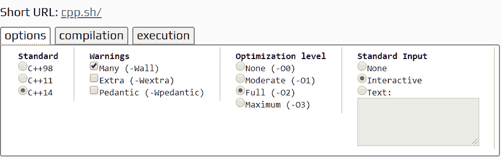

# 前言

## 大约

本节简要介绍本课程和软件要求，以便完成所有包含的活动和练习。

# 关于书

你已经知道你想学习 C++ 开发，学习 C++ 更聪明的方法是边做边学。*C++ 工作坊*专注于建立你的实践技能，这样你就可以用有效的现代 c++ 开发高性能的软件应用，甚至是你自己的独立游戏。你将从导致真实结果的真实例子中学习。

在整个*C++ 研讨会*中，您将采取一种引人入胜的逐步方法来理解 c++ 代码。你不必耐着性子听完任何不必要的理论。如果时间紧迫，你可以每天跳一个练习，或者花一整个周末学习高级面向对象的原理。这是你的选择。按照你的方式学习，你会以一种令人满意的方式建立和加强关键技能。

*c++ Workshop*的每一个物理打印副本都解锁了对交互版的访问。有了详细介绍所有练习和活动的视频，您将始终有一个有指导的解决方案。您还可以对照评估来评估自己，跟踪进度，并接收内容更新。完成后，您甚至可以获得一个可以在线共享和验证的安全凭据。这是一种额外的学习体验，包含在您的印刷本中。要兑换，请遵循 C++ 书籍开头的说明。

快节奏直接，*C++ 工作坊*是 c++ 初学者的理想伴侣。您将像软件开发人员一样构建和迭代代码，一路学习。这个过程意味着你会发现你的新技能会坚持下去，并作为最佳实践嵌入其中。未来几年的坚实基础。

## 关于章节

*第 1 章**您的第一个 C++ 应用*将为您提供开始构建基本 C++ 应用所需的基本工具和技术。

*第 2 章*、*控制流*，介绍了用于控制整个应用的执行流的各种工具和技术。

*第 3 章*、*内置数据类型*，介绍了 C++ 提供的内置数据类型，包括它们的基本属性以及在向量和数组中的使用。然后在创建一个真实的注册应用时使用这些。

*第 4 章*、*运算符、*介绍了 C++ 提供的各种运算符，描述了它们的作用以及它们如何允许我们操纵数据。

*第 5 章*、*指针和引用、*介绍了 C++ 提供的各种运算符，描述了它们的作用以及它们如何允许我们操作数据。

*第 6 章*、*动态变量*引入了动态变量——也就是说，可以在需要时创建的变量，可以保存任意大量的数据，这些数据只受可用内存的限制。

*第 7 章*、*动态变量的所有权和生存期、*使得 C++ 程序中指针的使用更安全、更容易理解。

*第 8 章*、*类和结构、*借助实例和练习介绍了结构和类的基础知识。

*第 9 章*、*面向对象原则、*介绍了设计类的最佳实践，并将向您概述抽象和封装，在哪里使用它们，以及它们如何使您的定制 C++ 类型受益。

*第 10 章*、*高级面向对象原则、*介绍了一些高级面向对象原则，包括继承和多态，这些原则将允许我们构建更加动态和强大的 C++ 应用。

*第 11 章*、*模板、*涵盖了模板的概述，并给出了一些如何使用模板以及在哪里使用模板的例子，并教你如何实现模板类型和函数。

*第 12 章*、*容器和迭代器*，提供了使用 C++ 标准库提供的容器和迭代器的概述。

*第 13 章*、*异常处理*介绍了异常处理，这是 C++ 用于报告和恢复程序中意外事件的机制。

## 惯例

文本中的码字如下所示:`#include <typeinfo>`行通过`name()`函数给出了对传入类型名称的访问

代码块设置如下:

```cpp
#include <iostream>
#include <string.h>
using namespace std;
template<typename T>
bool compare(T t1, T t2)
{
    return t1 == t2;
}
```

新的术语和重要的词语是这样显示的:“在前面的章节中，介绍了**面向对象编程** ( **OOP** )以及示例和用例。”

长代码片段被截断，GitHub 上代码文件的对应名称被放在截断代码的顶部。到整个代码的永久链接被放在代码片段的下面。它应该如下所示:

```cpp
Example09_1.cpp
23     string getName() 
24     {
25         return m_trackName;
26     }
27 
28     void setName(string newTrackName) 
29     {
30         // if S-Club is not found set the track name - otherwise do nothing 
31         if (newTrackName.find("S-Club") == string::npos) 
32         {
33             m_trackName = newTrackName;
34          }
35     }
36 
37     void setLength(float newTrackLength) 
38     {
39         if (newTrackLength < MAX_TRACK_LENGTH && newTrackLength > 0) 
40         // no prog metal for us! 
41         {
42             m_lengthInSeconds = newTrackLength;
43         }
44     }
The complete code for this example can be found at: https://packt.live/2DLDVQf
```

## 开始之前

我们可以使用许多工具来编译我们的 C++ 程序，这里涉及的工具太多了，所以这里有一些建议和入门指南:

## 在线编译器

**cpp.sh** 是一个在线 C++ 编译器，也是作者在本书中广泛使用的一个。访问 [cpp.sh](http://cpp.sh) 并确保选项设置如下所示:



图 0.1:CPP . sh 在线编译器截图

这就是我们开始使用这个编译器所需要做的。只需写出代码并点击运行按钮。任何错误都将出现在编译选项卡中，交互式标准输入和输出将位于执行选项卡上。这里是在线 C++ 编译器的部分列表，您可以在练习时使用。如果你正在使用的一个变得迟钝，或者你根本找不到它，尝试另一个:

**Tutorialspoint C++ 编译器**:这个网站允许你编译一个包含在单个文件中的 C++ 程序。它打印来自操作系统的错误消息。你可以在[https://www.tutorialspoint.com/compile_cpp_online.php](https://www.tutorialspoint.com/compile_cpp_online.php)找到它。

**godbolt 编译器浏览器**:这个网站可以让你在很多不同的编译器上编译单个文件，并显示输出汇编语言；对于某些口味来说，它的 UI 有点微妙。它打印来自操作系统的错误消息。你可以在[https://godbolt.org/](https://godbolt.org/)找到它。

**coliru** :这个网站允许你编译单个文件。它打印来自操作系统的错误消息。你可以在[http://coliru.stacked-crooked.com/](http://coliru.stacked-crooked.com/)找到它。

**repl.it** :这个网站可以让你编译多个文件。你可以在[https://repl.it/languages/cpp](https://repl.it/languages/cpp)找到它。

**Rextester** :这个网站让你用微软 Visual C++ 编译一个文件。你可以在[https://rextester.com/](https://rextester.com/)找到它。

## 安装代码包

在[https://github.com/PacktWorkshops/The-CPP-Workshop](https://github.com/PacktWorkshops/The-CPP-Workshop)从 GitHub 下载代码文件，并将其放入名为`C:\Code`的新文件夹中。有关完整的代码包，请参考这些代码文件。

如果您在安装或代码启动和运行方面遇到任何问题，请联系 workshops@packt.com 的团队。