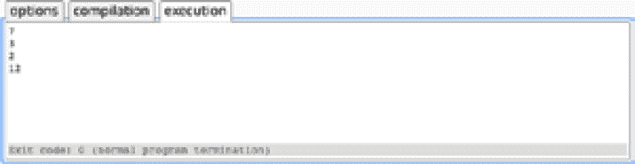
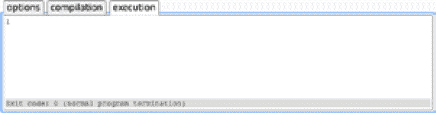
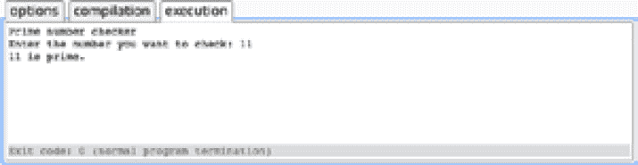
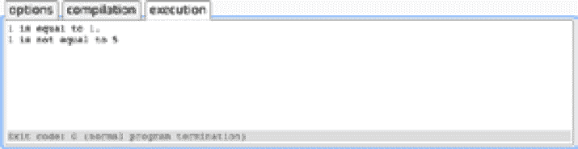
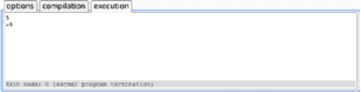
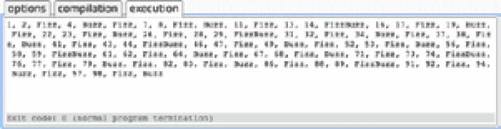

# 4。经营者

概观

本章介绍了 C++ 提供的各种运算符，描述了它们的功能，以及它们如何允许我们操作数据。到本章结束时，您将能够描述和使用各种算术、关系和赋值运算符。然后我们将研究一元运算符和逻辑运算符，最后是重载运算符，用于自定义类型。这一章将以一个流行的编程练习结束，这个练习将实现这一章中涉及的操作符。

# 简介

在最后一章中，我们学习了 C++ 提供的各种数据类型，以及如何使用它们来存储和表示系统中的数据。在这一章中，我们将看看操作符，我们分配和操作这些数据的机制。到目前为止，我们在整个工作中一直在使用它们——至少在某种程度上，很难编写 C++ 并且不使用它们——但是我们还没有正面解决它们。这就是我们现在要做的。

运算符有多种形状和大小，但总的来说，它们的作用是允许我们与数据进行交互。无论是赋值、修改还是复制，这些都是通过操作符完成的。我们将从算术和关系运算符开始。这使我们能够进行数学运算，如加、减、除数字，并相互比较数值。

然后我们将继续研究赋值运算符。这些允许我们将数据分配给变量，并将变量相互分配。到目前为止，这是我们使用最多的运算符，但关于这一点以及将赋值运算符和算术运算符结合在一起的多种变体，肯定还有更多要了解的。

我们将看到的最后一种运算符类型是逻辑运算符和一元运算符。逻辑运算符允许我们检查条件，从而产生一个布尔值供我们检查。一元运算符是对单个值进行操作的运算符，以某种方式对其进行更改。

我们将通过查看重载和分配我们自己的运算符来结束这一章。虽然我们有各种各样的运算符可用，但有时我们可能需要重载它们，为特定类型提供我们自己的行为。C++ 允许我们这样做。它还允许我们为自己的用户定义类型定义运算符。

在本章的最后，我们将在最后一个活动中测试我们对操作者的理解，在这个活动中，我们创建了 **Fizz Buzz** 应用，这是一个用于测试 C++ 熟练程度的常见活动。完成后，我们将对现有的操作员有全面的了解，使我们能够自信而胜任地与系统中的数据进行交互。

# 算术运算符

算术运算符是那些允许我们对数据进行数学运算的运算符。除了模数运算符之外，这些都是非常简单明了的，因为它们具有我们日常数学中使用的相同符号。例如，为了添加一个数字，您只需像在任何地方一样使用“+”号。一般来说，这些运算符将用于数字数据类型，但是，没有什么能阻止类型实现这个运算符。这将作为本章的最后一个主题。

让我们快速了解一下我们的四个基本运算符:加法、减法、乘法和除法。如前所述，这四个运算符具有您日常使用的相同符号，因此应该很熟悉。以下示例实现了所有四种类型的算术运算符:

```cpp
// Arithmetic operators. 
#include <iostream>
#include <string>
int main() 
{
    int addition = 3 + 4;
    int subtraction = 5 - 2;
    int division = 8 / 4;
    int multiplication = 3 * 4;
    std::cout << addition << "\n";
    std::cout << subtraction << "\n";
    std::cout << division << "\n";
    std::cout << multiplication << "\n";
}
```

如果运行前面的代码，应该会获得以下输出:



图 4.1:观察我们简单的算术运算符

在这些操作中，我们可以同时使用变量和常数(也就是简单的数字)，它们是可以互换的。这里有一个例子:

```cpp
    int myInt = 3;
    int addition = myInt + 4;
```

在这段代码中，我们将常量`4`的值添加到变量`myInt`中。其结果是`addition`变量现在的值为 7。

我们要看的最后一个算术运算符是模数运算符。该运算符返回整数除法的余数，用`%`符号表示:

```cpp
// Arithmetic operators.
#include <iostream>
#include <string>
int main()
{
    int modulus = 11 % 2;
    std::cout << modulus << "\n";
}
```

运行上述代码后，您将获得以下输出:



图 4.2:模运算符

在这个例子中，我们执行`11 % 2`。这里，2 将 11 除以 5，剩下 1 的余数。这是模数运算符找到的值。这个操作符在很多情况下都很有用，比如确定一个数是偶数还是奇数，以设定的增量做某事，或者在随机数生成过程中，就像我们在*第三章【控制流】*中看到的那样。让我们看一些这样的例子:

```cpp
    // Determine if a number is even.
    bool isEven = myInt % 2 == 0;
    // Print multiples of 5.
    for (int i = 0; i < 100; ++ i)
    {
        if (i % 5 == 0)
        {
            std::cout << i << "\n";
        }
    }
    // Generate a random number between 1 and 10.
    srand(time(0));
    int random = (rand() % 10) + 1;
```

注意

在前面的代码中，使用了`=`和`==`运算符。稍后将更详细地介绍这些内容；但是，`=`是赋值运算符，`==`是等式运算符。前者给事物赋值，后者检查事物是否相等。稍后会有更多关于这个的内容。

在这个片段中，我们首先通过检查除以 2 后是否有余数来确定一个数是否为偶数。如果没有余数，那么这个数干净利落地除以 2——因此，它是偶数。

接下来，我们将数字从 0 循环到 99，只打印 5 的倍数。这使用了与第一个例子类似的方法，但是在这里，我们只除以 5。如果我们这样做，没有余数，那么它确实是 5 的倍数。

在代码片段的最后两行，我们使用模数运算符生成一个范围内的随机数。`rand() % 10`运算会得到一个 0 到 9 之间的答案，然后我们加 1 将这个范围从 1 增加到 10。

重要的是要注意这里的运算符优先级，以及求值的顺序。值得庆幸的是，我们在数学中所学的关于求和运算顺序的基本规则在 C++ 中得到了维护；也就是说，加法将优先于减法。C++ 包含许多运算符，因此可以在[https://packt.live/2QO1j7t](https://packt.live/2QO1j7t)找到运算符及其优先级的完整列表。意识到什么优先于什么会非常有帮助。

但是，如果我们想手动指定求和中的运算顺序，我们可以使用括号。以下面两个总和为例:

```cpp
    //Example 1
    int a = 3 * 4 - 2;    // a = 10
    //Example 2
    int b = 3 * (4 - 2);  // b = 6
```

在第一个总和中，我们把操作的顺序留给它们自然的样子。这意味着先做乘法，再做减法，给我们的答案是 10。在第二个例子中，我们把减法用括号括起来，所以它首先被计算出来。4 减去 2 得到 2，然后乘以 3 得到我们的解:6。圆括号的正确使用是非常重要的，它让我们能够确保我们的表达式以我们期望的方式被评估。

现在让我们编写一个应用，实现这里介绍的一些运算符来确定一个数是否是质数。

## 练习 21:质数检查器

在本章的第一个练习中，我们将编写一个应用来确定一个数是否是质数。这将利用模数运算符；其他的操作符都很简单，所以我们不需要在这里再讨论什么。质数是一个整数，大于 1，只能被 1 和自身整除；我们可以使用模数运算符来帮助我们确定这一点。看看下面的步骤:

注意

这个练习的完整代码可以在这里找到:[https://packt.live/2QDdILi](https://packt.live/2QDdILi)。

1.  首先，我们将要求用户输入他们想要检查的数字是否是质数:

    ```cpp
    // Prime number checker.
    #include <iostream>
    #include <string>
    int main()
    {
        int numberToCheck = 0;
        std::cout << "Prime number checker\n";
        std::cout << "Enter the number you want to check: ";
        std::cin >> numberToCheck;
    ```

2.  我们现在可以开始确定这个数是否是质数的过程了。我们对质数的部分定义是，它必须大于 1，所以我们可以直接忽略低于或等于这个值的任何值:

    ```cpp
        if (numberToCheck <= 1)
        {
            std::cout << numberToCheck << " is not prime.";
            return 0;
        }
    ```

3.  2 是一个有趣的质数，因为它是唯一的偶数。所有大于这个数的偶数至少可以被 1、2 和它们自己的值整除。考虑到这一点，我们现在可以添加一个快速检查来处理这种情况:

    ```cpp
        else if (numberToCheck == 2)
        {
            std::cout << numberToCheck << " is prime.";
            return 0;   
        }
    ```

4.  Now we can get to the main section of the prime check. We've handled the "special" cases, where the number entered is 0, 1, or 2, so now we need to handle values greater than 2\. To do this, we can determine whether any numbers greater than 1 and less than the value the user inputs, will divide exactly into the number we're checking.

    注意

    对此有更多可能的优化，例如只检查偶数值。然而，为了不太偏离模数运算，我们将省略它们。

    我们之前使用了模数运算符，并看到它如何在除法之后获取余数；如果我们将它与用户的输入和一个循环值一起使用，我们就可以确定我们的输入值是否有除 1 或自身之外的任何因素。1 的因子和数本身是不会被查的，所以我们知道如果我们找到任何其他的因子，那么数就不可能是质数。如果我们找不到，那就是:

    ```cpp
        for (int i = 2; i < numberToCheck; ++ i)
        {
            if (numberToCheck % i == 0)
            {
                std::cout << numberToCheck << " is not prime.";
                return 0;
            }
        }
        std::cout << numberToCheck << " is prime.";
    }
    ```

5.  完整的程序如下:

    ```cpp
    // Exercise 21: Prime number checker.
    #include <iostream>
    #include <string>
    int main() 
    {
        int numberToCheck = 0;
        std::cout << "Prime number checker\n";
        std::cout << "Enter the number you want to check: ";
        std::cin >> numberToCheck;
        if (numberToCheck <= 1) 
        {
            std::cout << numberToCheck << " is not prime.";
            return 0;
        } 
        else if (numberToCheck == 2) 
        {
            std::cout << numberToCheck << " is prime.";
            return 0;
        }
        for (int i = 2; i < numberToCheck; ++ i) 
        {
            if (numberToCheck % i == 0) 
            {
                std::cout << numberToCheck << " is not prime.";
                return 0;
            }
        }
        std::cout << numberToCheck << " is prime.";
    }
    ```

6.  我们现在可以运行这个应用并测试它的功能。前五个质数是 2、3、5、7 和 11。我们可以检查这些以及它们周围的数字，以确定我们的应用是否正常工作:



图 4.3:确定一个数是否是质数

通过使用模数运算符，我们能够确定一个数是否是素数。这只是模数运算符以及一般算术运算符的众多用途之一。

# 关系运算符

关系运算符允许我们相互比较值。例如，我们可以检查一个值是否大于另一个值，或者两个值是否相等。这些运算符不仅处理整数值，还处理集合和对象。经常检查的两个基本关系是:**相等**和**比较**。

## 平等

用于确定两个值相等的关系运算符是`==`和`!=`；也就是分别相等和不相等。一个值放在运算符的两边，左边是 LHS，右边是 RHS，比较的是这两个值。返回一个布尔值，表示相等检查是否为真。

这两个运算符可以如下使用:

```cpp
// Relational operators. Equality. 
#include <iostream>
#include <string>
int main()
{
    int myInt1 = 1;
    int myInt2 = 1;
    int myInt3 = 5;
    if (myInt1 == myInt2)
    {
        std::cout << myInt1 << " is equal to " << myInt2 << ".\n";
    }
    if (myInt1 != myInt3) 
    {
        std::cout << myInt1 << " is not equal to " << myInt3;
    }
}
```

在这个小程序中，我们已经声明了一些整数，并使用两个关系等式运算符确定了哪些是相等的。运行上述代码后，将获得以下输出:



图 4.4:我们可以通过使用关系运算符来测试两个值或对象的相等性

我们的两个相等检查都返回 true，因此我们执行了两个 print 语句。请注意，仅仅因为它们都返回 true，并不意味着它们都是相等的。在第一个例子中，我们检查它们是否相等，在第二个例子中，我们检查它们是否不相等。

除了使用简单的整数值，我们还可以使用它来测试浮点类型、对象和列表的相等性，假设这些运算符已经定义。正是在这个运算符定义中，概述了确定两个对象是否相等的规则；我们将在这一章的最后详细介绍这一点以及重载操作符。

比较浮点类型的相等性时，重要的是要知道`==`可能会产生错误的结果。所有浮点运算都有出错的可能，因为浮点数无法用二进制精确表示；相反，它们被存储为非常接近的近似值。这可能会导致错误。为了抵消这一点，通常检查两个浮点数之间的差值是否低于某个非常小的值，例如ε。如果差值低于这个小值，我们通常会认为两者“足够接近”。当然，这取决于你的需求，但一般来说，这就足够了。我们不会更详细地讨论浮点错误，因为这是一个很大的话题；但是，在使用浮点比较时，请记住这一点。

注意

关于浮点比较的进一步阅读，可以参考[https://packt.live/2s4njk2](https://packt.live/2s4njk2)。

## 对比

关系运算符的另一个子集是比较运算符。这些允许我们比较变量的值。我们有四种选择:大于(`>`)、小于(`<`)、大于或等于(`>=`)以及小于或等于(`<=`)。它们的使用方式与等式运算符相同；也就是说，它们既有左侧值，也有右侧值，如果比较结果为`true`，它们将返回真；如果比较结果为假，它们将返回`false`。

如何使用这些运算符的示例如下:

```cpp
// Relational operators. Equality. 
#include <iostream>
#include <string>
int main() 
{
    int myInt1 = 1;
    int myInt2 = 1;
    int myInt3 = 5;
    if (myInt1 > myInt2) 
    {
        std::cout << myInt1 << " is greater than" << myInt2 << ".\n";
    }
    if (myInt1 < myInt3) 
    {
        std::cout << myInt1 << " is less than " << myInt3 << ".\n";
    }
    if (myInt3 >= myInt2) 
    {
        std::cout << myInt3 << " is greater than or equal to " << myInt2                   << ".\n";
    }
    if (myInt2 <= myInt1) 
    {
        std::cout << myInt2 << " is less than or equal to " << myInt1;
    }
}
```

类似于我们检查相等性的方式，这里，我们将两个值进行比较。前两个相当简单——我们只是检查一个数字是大于另一个，还是小于另一个。最后两个语句使用“或等于”运算符。在这些情况下，如果值也相等，则大于或小于检查将返回 true。它是我们前面看到的等式(`==`)运算符和前两个比较运算符的混合。

如果我们在编译器中运行这段代码，我们可以看到执行了哪些语句:


图 4.5:使用关系比较运算符来确定值之间的关系

我们可以看到，除了一个比较外，所有比较都被评估为真，因此我们执行了三个打印语句。

## 练习 22:时间计算器

在本练习中，我们将编写一个小应用，根据小时来确定一天中的时间。我们将让用户以军事时间格式(例如，1800)输入时间，并将向他们呈现一个代表一天中适当时间的字符串。以下是完成练习的步骤:

注意

这个练习的完整代码可以在这里找到:[https://packt.live/2rg9ONu](https://packt.live/2rg9ONu)。

1.  我们将从向用户输出指令开始，然后将他们的答案读入一个整数:

    ```cpp
    #include <iostream>
    #include <string>
    int main() 
    {
        std::cout << "***Time of Day Calculator***\n";
        std::cout << "Enter time in military format.               eg. (1800, 1430)\n\n";
        std::cout << "Enter time: ";

        std::string input;
        getline(std::cin, input);

        int time = std::stoi(input);
    ```

2.  现在我们可以开始评估我们的时代了。我们从确保我们的价值在有效范围内开始。如果`time`小于`0000`或大于`2400`，那么我们会打印一条消息给用户，通知他们他们的时间无效:

    ```cpp
        if (time < 0000 || time > 2400)
        {
            std::cout << "Invalid time.";
            return 0;
        }
    ```

3.  在我们开始定义时间范围之前，我们可以检查一天中的特定时间，从午夜开始。当时间等于`0000`时会是这种情况，如果是，我们会打印消息`"It's currently midnight."` :

    ```cpp
        if (time == 0000)
        {
            std::cout << "It's currently midnight.";
        }
    ```

4.  接下来，我们检查时间是否是中午。当时间等于`1200`时会是这种情况，如果是，我们会打印消息`"It's currently noon."` :

    ```cpp
        else if (time == 1200)
        {
            std::cout << "It's currently noon.";
        }
    ```

5.  现在我们将开始定义一些时间范围。我们将从早上开始，我们将它归类为早上 6 点到中午之间的时间。如果是这样的话，我们会打印消息`"It's currently morning."` :

    ```cpp
        else if (time >= 0600 && time < 1200)
        {
            std::cout << "It's currently morning.";
        }
    ```

6.  我们的下一个时间范围是下午。这将适用于下午 12:01 到 5 点之间的时间。在这种情况下，我们将打印消息`"It's currently afternoon."` :

    ```cpp
        else if (time > 1200 && time <= 1700)
        {
            std::cout << "It's currently afternoon.";
        }
    ```

7.  接下来是晚上，我们将这个范围定义为下午 5 点以后但晚上 8 点以前的任何时间，当这种情况出现时，我们将打印消息`"It's currently evening."` :

    ```cpp
        else if (time > 1700 && time <= 2000)
        {
            std::cout << "It's currently evening.";
        }
    ```

8.  我们的最终时间范围是晚上，我们将它定义为晚上 8 点之后但早上 6 点之前的任何时间。当这种情况发生时，我们将打印消息`"It's currently night."` :

    ```cpp
        else if (time > 2000 || time < 0600)
        {
            std::cout << "It's currently night.";
        }
    }
    ```

9.  完整的程序如下:

    ```cpp
    // Time of Day Calculator.
    #include <iostream>
    #include <string>
    int main() 
    {
        std::cout << "***Time of Day Calculator***\n";
        std::cout << "Enter time in military format.               eg. (1800, 1430)\n\n";
        std::cout << "Enter time: ";
        std::string input;
        getline(std::cin, input);
        int time = std::stoi(input);
        if (time < 0000 || time > 2400) 
        {
            std::cout << "Invalid time.";
            return 0;
        }
        if (time == 0000) 
        {
            std::cout << "It's currently midnight.";
        }
        else if (time == 1200) 
        {
            std::cout << "It's currently noon.";
        }
        else if (time >= 0600 && time < 1200) 
        {
            std::cout << "It's currently morning.";
        } 
        else if (time > 1200 && time <= 1700) 
        {
            std::cout << "It's currently afternoon.";
        } 
        else if (time > 1700 && time <= 2000) 
        {
            std::cout << "It's currently evening.";
        } 
        else if (time > 2000 || time < 0600) 
        {
            std::cout << "It's currently night.";
        }
    }
    ```

10.  如果我们现在运行这个应用，我们的用户应该能够输入时间，并向他们显示一天中的时间:


图 4.6:使用关系运算符，我们可以确定现在是一天中的什么时间

在本练习中，我们使用了一些关系运算符来确定一天中的当前时间。没有输入验证，因此用户输入必须与我们期望的匹配，否则我们将得到未定义的行为，但是我们可以研究如何使用关系运算符来比较和分类输入的时间。

# 一元运算符

到目前为止，我们使用的运算符都有一个值，通常称为操作数，位于它们的两边:rhs 和 lhs。然而，一元运算符是那些只取一个值并对其进行修改的运算符。我们将快速查看负(`-`)、增量(`++ `)和减量(`--`)。还有许多其他一元运算符(逻辑补码(`!`)和按位补码(`~`))，但我们将在下面的章节中介绍这些运算符。

让我们从负(`-`)运算符开始；这允许我们操纵一个值的符号。它相当简单——当放在一个值前面时，它会将一个负值变成正值，将一个正值变成负值。

这里有一个例子:

```cpp
// Negation example.
#include <iostream>
#include <string>
int main()
{
    int myInt = -1;
    std::cout << -myInt * 5 << std::endl;
    myInt = 1;
    std::cout << -myInt * 5 << std::endl;
}
```

如果我们在代码编辑器中运行这个应用，我们可以看到这些运算符对我们的价值的影响:



图 4.7:使用减号运算符更改符号

我们可以从这个输出中看到，我们输出的符号与变量的符号相反，因为我们将它与减运算符一起使用。

我们要看的其他一元运算符是递增(`++ `)和递减(`--`)。这两个运算符允许我们分别将一个值增加或减少一。我们已经在`for`循环中使用了增量(`++ `)运算符来增加循环计数器。减量(`--`)的工作方式相同，但方向相反。

在下面的代码中，我们定义一个值，然后递增或递减它，并查看它的值:

```cpp
// Increment/Decrement example.
#include <iostream>
#include <string>
int main()
{
    int myInt = 1;
    std::cout << ++ myInt << std::endl;
    std::cout << --myInt << std::endl;
}
```

在这个简单的片段中，我们将一个值定义为 1，递增它，然后立即再次递减它，在每个阶段打印它的值。在代码编辑器中运行后，您将获得以下输出:


图 4.8:使用增量或减量来修改值

我们可以看到，在增加我们的值后，它增加了 1，在减少值后，它恢复正常。我们需要注意一些有趣的事情。与减运算符不同，增运算符和减运算符实际上改变了与之一起使用的变量的值。在递增之后，我们的变量没有返回到它的初始值，就像我们看到的减运算符一样；也就是说，一旦增加，增加的值就成为新值。

同样重要的是要注意，一个值可以是前增量，也可以是后增量。也就是说，递增或递减运算符可以放在变量的前面或后面，这将改变值的返回方式。让我们进行一个小练习，突出这个细微的差别。

## 练习 23:增量前/增量后示例

我们刚刚看到，可以对一个值进行前增量或后增量，它们各自在操作方式上有细微但明显的区别。让我们通过编写一个同时做这两者的应用来看一个例子。你能猜出输出吗？看看下面的步骤:

注意

这个练习的完整代码可以在这里找到:[https://packt.live/2QADmQC](https://packt.live/2QADmQC)。

1.  首先声明我们的函数标题和`#include`语句:

    ```cpp
    // Pre/Post Increment Example.
    #include <iostream>
    #include <string>
    ```

2.  接下来，我们将定义我们的`main`函数并定义一个`int`，给它一个默认值`5`。然后，我们将在打印语句中预先增加该值，然后单独打印该值:

    ```cpp
    int main()
    {
        int myInt = 5;
        std::cout << ++ myInt << std::endl;
        std::cout << myInt << std::endl;
    ```

3.  现在，我们将整数重置为 5，然后在一个 print 语句中再次递增。然而，这一次，我们将后递增该值:

    ```cpp
        myInt = 5;
        std::cout << myInt++ << std::endl;
        std::cout << myInt << std::endl;
    }
    ```

4.  完整的程序如下:

    ```cpp
    // Pre/Post Increment Example.
    #include <iostream>
    #include <string>
    int main() 
    {
        int myInt = 5;
        std::cout << ++ myInt << std::endl;
        std::cout << myInt << std::endl;
        myInt = 5;
        std::cout << myInt++ << std::endl;
        std::cout << myInt << std::endl;
    }
    ```

5.  让我们运行这段代码，检查不同类型的增量是如何与`std::cout`语句交互的。你认为每条线的产量会是多少？运行应用前，请做好记录:


图 4.9:前增量和后增量给了我们不同的结果

在第一种情况下，我们两次都输出`6`。这意味着增量发生在打印值之前。然而，在第二种情况下，我们可以看到我们打印了数字`5`和`6`。这意味着首先打印该值，然后进行增量。记住操作的顺序很重要，因为从这个例子中很容易看出我们是如何引入一个难以追踪的微妙错误的。然而，如果你增加一个值而忽略表达式结果，比如增加一个`for`循环，那么两者都可以。

# 赋值运算符

赋值操作符允许我们给对象赋值。到目前为止，在我们的章节中，我们已经多次使用了这个运算符——这是编程中最基本的操作之一，但和往常一样，我们可以了解到更多关于这些运算符的信息。

最基本的赋值运算符是我们取一个值并将其赋给一个对象，如下所示:

```cpp
    int myInt = 5;
```

我们对此很熟悉，但我们可能不熟悉的是将这些与算术运算符相结合的概念。让我们想象一个场景，我们需要将一个值增加 5。我们可以这样做:

```cpp
    myInt = myInt + 5;
```

我们取`myInt`的值，加上`5`，再赋回原变量。然而，我们可以通过将两个操作符结合在一起，以更精细的方式来实现这一点。赋值运算符之前可以有一个算术运算符来实现这一点，如下所示:

```cpp
    myInt += 5;
```

这是任何算术运算符的情况；它们可以在赋值运算符之前，并且它们的效果是组合的。这可以在下面的示例应用中看到:

```cpp
// Assignment Operators Example. 
#include <iostream>
#include <string>
int main()
{
    int myInt = 5;
    myInt += 5;
    std::cout << myInt << std::endl;
    myInt -= 5;
    std::cout << myInt << std::endl;
    myInt *= 5;
    std::cout << myInt << std::endl;
    myInt /= 5;
    std::cout << myInt << std::endl;
    myInt %= 5;
    std::cout << myInt << std::endl;
}
```

如果我们在编辑器中运行这段代码，我们可以看到赋值语句如何改变`myInt`的值:


图 4.10:简单赋值运算符和算术运算符的组合

通过将简单的赋值运算符与算术运算符结合起来，我们能够在一条语句中执行数学运算和赋值。这适用于我们稍后将介绍的各种按位运算符。

# 逻辑运算符

逻辑运算符允许我们在一条语句中一起计算多个布尔值。我们之前已经看到，当我们评估一个条件时，比如在`if`语句中，我们会得到一个布尔值。因此，我们可以使用逻辑运算符同时组合和计算两个或多个条件。

我们有三个这样的运营商可供选择:

*   **和(& & )** :当两个条件都为真时，返回真，否则返回假。
*   **或(||)** :当任一条件为真时返回真，否则返回假。
*   **不是(！)**:条件为假则返回真，否则返回真；本质上，它返回与条件相反的结果。

让我们用一个例子来看看这些操作符是如何工作的。

## 练习 24:逻辑运算符示例

为了演示这些逻辑运算符是如何工作的，让我们创建一个快速的示例应用。我们将从用户那里获取一些输入，可能是一些名字，并使用我们的操作符对它们进行检查:

注意

这个练习的完整代码可以在这里找到:[https://packt.live/2KGX0a2](https://packt.live/2KGX0a2)。

1.  首先，让我们添加一个程序标题，并添加我们的`#include`语句:

    ```cpp
    // Logical Operators Exercise.
    #include <iostream>
    #include <string>
    ```

2.  现在我们可以定义我们的`main`函数了。首先，我们需要定义三个字符串变量，并从用户那里获取三个名称:

    ```cpp
    int main()
    {
        std::string name1;
        std::string name2;
        std::string name3;
        std::cout << "Please enter name 1: ";
        std::cin >> name1;
        std::cout << "Please enter name 2: ";
        std::cin >> name2;
        std::cout << "Please enter name 3: ";
        std::cin >> name3;
    ```

3.  现在我们可以做第一次检查了。我们将首先检查一下我们的名字是否都一样。为此，我们将对照`name2`检查`name1`，对照`name3`检查`name2`。然后我们将使用`&&`运算符来确保这两个都是真的。如果是，我们知道所有匹配的名字，所以我们可以输出一条消息:

    ```cpp
        // Check if all or any of the names match.
        if (name1 == name2 && name2 == name3)
        {
            std::cout << "\nAll the names are the same.";
        }
    ```

4.  如果失败，我们将检查是否有匹配的名字。我们将对照其他条件检查每个`name`，如果以下任一条件为真，则使用`||`运算符返回真:

    ```cpp
        else if (name1 == name2 || name2 == name3 || name1 == name3)
        {
            std::cout << "\nSome of the names matched.";    
        }
    ```

5.  Finally, we'll use the `!` operator check whether `name1` and `name2` match. We're also going to use a ternary statement for this. First, we'll add the code, and then look at what it's doing:

    ```cpp
        // Check if names 1 and 2 are different.
        std::cout << "\nNames 1 and 2 are "               << (!(name1 == name2) ? "different." : "the same.")               << std::endl;
        }
    ```

    在这个三元语句中，我们检查`name1`和`name2`是否匹配，然后用`!`运算符否定结果。这意味着如果两个名称不同，三元语句条件将为真。然后我们用它来返回正确的字符串。

    请注意，我们在这里使用了括号，这可以归结为我们前面谈到的优先顺序。例如，我们希望在尝试应用`!`运算符之前对`name1`和`name2`进行评估。同样，我们希望在将整个三元语句与`<<`运算符一起使用之前对其进行求值；否则，我们会得到一个错误。这是一个很好的例子，说明我们如何使用括号来控制优先顺序。

6.  完整的程序如下:

    ```cpp
    // Logical Operators Exercise.
    #include <iostream>
    #include <string>
    int main() 
    {
        std::string name1;
        std::string name2;
        std::string name3;
        std::cout << "Please enter name 1: ";
        std::cin >> name1;
        std::cout << "Please enter name 2: ";
        std::cin >> name2;
        std::cout << "Please enter name 3: ";
        std::cin >> name3;
        // Check if all or any of the names match.
        if (name1 == name2 && name2 == name3) 
        {
            std::cout << "\nAll the names are the same.";
        } 
        else if (name1 == name2 || name2 == name3 || name1 == name3) 
        {
            std::cout << "\nSome of the names matched.";
        }
        // Check if names 1 and 2 are different.
        std::cout << "\nNames 1 and 2 are "               << (!(name1 == name2) ? "different." : "the same.")               << std::endl;
    }
    ```

7.  运行应用，并用几个不同的名称测试它:


图 4.11:使用逻辑运算符测试条件

在本练习中，我们使用了许多具有不同条件的逻辑运算符。通过这样做，我们能够作为一个集体来评估多个条件，例如只有当所有的值都为真时，我们才能做一些事情。我们还能够通过翻转条件的逻辑值来操纵条件(使用`!`运算符返回相反的值)。这非常有用，就如何使用它们而言，这只是冰山一角。

# 操作员超载

到目前为止，我们看到的所有运算符都是由 C++ 定义的。然而，这并不是说我们不能像处理函数一样在自己的类中重载它们。运算符重载非常强大，允许我们用自己的类型为 C++ 中的大多数运算符定义自己的行为。重载运算符的语法如下:

```cpp
returnType operator symbol (arguments)
```

让我们用一个简单的测试类来看一下这个例子:

```cpp
// Operator Overloading Example 
#include <iostream>
#include <string>
class MyClass 
{
    public:
    void operator + (MyClass const & other) 
    {
        std::cout << "Overloaded Operator Called" << std::endl;
        return;
    }
};
int main() 
{
    MyClass A = MyClass();
    MyClass B = MyClass();
    A + B;
}
```

在这个微不足道的例子中，我们创建了一个小的`MyClass`类，并重载了`+`运算符，提供了我们自己的定义。目前，我们在那里所做的只是打印一条消息，让我们知道我们的操作员代码已经运行。然而，您可以想象我们如何在这里放置我们想要的任何东西，为我们的对象定义自定义行为。让我们运行代码并确认我们使用的是重载运算符:


图 4.12:用我们自己的行为重载操作符

在运行应用时，我们确实看到了我们打印的消息，所以我们知道我们正在运行我们的重载操作行为。通过这样做，我们可以将本章中介绍的运算符用于我们自己的类型。让我们通过重载一个自定义类型的相等操作符来看看这个更真实的应用。

## 练习 25:运算符重载示例

让我们覆盖一个简单的`Person`类的等式运算符，该类封装了一个名称和年龄。我们可以想象对同一个人有多个引用，并且想要检查它们是否相同，例如检查同一个人是否存在于多个列表中。等式运算符会让我们检查。看看下面的步骤:

注意

这个练习的完整代码可以在这里找到:[https://packt.live/2QyS4b0](https://packt.live/2QyS4b0)。

1.  首先，我们将添加我们的`#includes` :

    ```cpp
    // Operator Overloading Example
    #include <iostream>
    #include <string>
    ```

2.  接下来，我们将宣布我们的`Person`类。这将是一个简单的类，包含一个名字和一个年龄。首先定义类名，我们需要的成员变量，以及初始化它们的构造函数:

    ```cpp
    class Person
    {
    public:
        Person(int age, std::string name) : age(age), name(name)
        {
        };
        float age = 0;
        std::string name = "";
    ```

3.  现在我们可以让`==`操作员超载了。我们将从初始声明开始。我们想重载`==`运算符，返回一个 bool 我们将接受另一个与我们要比较的对象类型相同的对象:

    ```cpp
        bool operator== (Person const& other)
        {
    ```

4.  现在是操作者身体的时候了；如果姓名和年龄完全匹配，则可以认为两个`Person`记录相同。我们可以检查这一点，并返回结果值。这也将完成我们的类定义，所以我们将添加我们的结束括号:

    ```cpp
          return ((age == other.age) && (name == other.name));
       }
    };
    ```

5.  现在，为了看到我们的新操作员在行动，我们将宣布三个`Person`记录。两个相同，第三个名字不同，年龄不同:

    ```cpp
    int main()
    {
        Person PersonA = Person(27, "Lucy");
        Person PersonB = Person(27, "Lucy");
        Person PersonC = Person(27, "Susan");
    ```

6.  最后，我们将使用新的运算符检查哪些类型是相同的。评价`PersonA``PersonB``PersonB``PersonC`:

    ```cpp
        std::cout << (PersonA == PersonB) << std::endl;
        std::cout << (PersonB == PersonC) << std::endl;
    }
    ```

    的平等性
7.  完整的程序如下:

    ```cpp
    // Operator Overloading Example
    #include <iostream>
    #include <string>
    class Person 
    {
    public:
        Person(int age, std::string name): age(age), name(name) {};
        float age = 0;
        std::string name = "";
        bool operator == (Person const & other) 
        {
            return ((age == other.age) && (name == other.name));
        }
    };
    int main() 
    {
        Person PersonA = Person(27, "Lucy");
        Person PersonB = Person(27, "Lucy");
        Person PersonC = Person(27, "Susan");
        std::cout << (PersonA == PersonB) << std::endl;
        std::cout << (PersonB == PersonC) << std::endl;
    }
    ```

8.  让我们运行这段代码，看看我们得到了什么:


图 4.13:人甲和人乙匹配。乙和丙不是

由于 A 和 B 的姓名和年龄匹配，我们的等式运算符返回 true，因此我们打印该值。人 B 和人 C 的名字不同，所以不匹配，我们打印 0(即假)。我们可以看到，通过为我们自己的用户类型定义这些操作符，我们为它们提供了很多功能。

# 按位运算符

按位操作是对单个位进行操作的操作，例如向左移动一位，为此，我们有一套称为按位运算符的专用运算符。我们在这里不打算讲太多细节——关于按位运算符的完整讨论改天再说。但是，我们将快速了解一下我们可以使用的按位运算符，以及它们的一些使用示例。这会给你一些初步的了解，这样当你以后遇到他们的时候，他们就会很熟悉了。

注意

请记住，位(即二进制数字)是计算机中最基本的数据单位。有两个可能的值，1 或 0，所有数据都以位的形式存储。机器上最小的可寻址数据单元是一个字节，它由 8 位组成，因此按位运算允许我们单独操作位。

在下面的例子中，我们将使用位组。这是一个简单的位集合，允许我们看到按位运算符的结果。每个示例将采用以下格式:

```cpp
{lhs bitset} {operator} {rhs bitset} = {resulting bitset}
```

原则上，这与正常计算没有什么不同(如 *a + b = c* )，所以不要让任何潜在的对位的不熟悉造成混淆。有了序言，我们继续吧。

C++ 为我们提供了六个按位运算符，如下所示:

*   **&二进制与**:该运算符仅将两个操作数中的那些位复制到新值中。考虑以下例子:00110 & 01100 = 00100。这里，两个原始值中都只有第三位，因此这是结果中唯一设置的位。
*   **|二进制或**:该运算符将任一操作数中的位复制到新值。考虑以下示例:00110 | 01100 = 01110。这里，在我们的第一个操作数中，设置了第二位和第三位，在第二个操作数中，设置了第三位和第四位。因此，结果是设置了第二、第三和第四位。
*   **~二进制补码**:该运算符翻转一个值中的每个位。考虑以下示例:~00110 = 11001。这里，在我们的第一个操作数中，唯一设置的位是第二个和第三个。因此，我们的结果设置了除这些以外的所有位。
*   **< <二进制左移位运算符**:该运算符将左操作数中的位向左移位右操作数中指定的数字。考虑以下示例:00110 < < 2 = 11000。这里，我们的左操作数设置了第二位和第三位，因此将它们向左移动两个位置后，现在设置了第四位和第五位。
*   **>> Binary Right Shift Operator**: This operator will shift the bits in the left operand to the right by the number specified in the right operand. Consider the following example: 01100 >> 2 = 00011\. Here, our left operand has the third and fourth bits set, so after shifting them two places to the right, the first and second bits are now set.

    注意

    在本文中，术语“按位”和“二进制”是可以互换的。同样正确的说法是“二进制与”或“按位与”。

让我们看看这些代码示例。作为标准库的一部分，提供的是 bitset 类。这使我们能够将一个整数值表示为它的一系列位，从而更容易看到按位运算的结果。下面的代码表示前面给出的示例:

```cpp
// Bitwise Operator Examples. 
#include <iostream>
#include <string>
#include <bitset>
int main() 
{
    int myInt1 = 6; // 00110 when expressed in binary 
    int myInt2 = 12; // 01100 when expressed in binary 
    // Binary AND 
    std::cout << std::bitset < 5 > (myInt1 & myInt2) << std::endl;
    // Binary OR 
    std::cout << std::bitset < 5 > (myInt1 | myInt2) << std::endl;
    // Binary Ones Compliment 
    std::cout << std::bitset < 5 > (~myInt1) << std::endl;
    // Binary Left Shift Operator 
    std::cout << std::bitset < 5 > (myInt1 << 2) << std::endl;
    // Binary Right Shift Operator 
    std::cout << std::bitset < 5 > (myInt2 >> 2) << std::endl;
}
```

注意

`std::bitset<5>`中`5`的值表示位集中的位数。关于位集的更多信息，可以参考[https://packt.live/2QGLqzp](https://packt.live/2QGLqzp)。

如果我们在编辑器中运行这段代码，我们可以看到按位运算的结果与练习的结果相匹配:


图 4.14:通过使用 bitset 类，我们可以看到按位运算的结果

虽然一开始操纵单个位看起来令人生畏，但在很多情况下，它非常有用。一个这样的场合是用旗帜。也许我们想跟踪多个事物，比如说，游戏引擎中的活动层。我们有多个可以同时激活的层，因此我们可以定义一个整数，给出一系列位，并使用每个位来确定哪些层是激活的:

```cpp
    int layer1 = 1;             // 00001
    int layer2 = 2;             // 00010
    int layer3 = 4;             // 00100
    int layer4 = 8;             // 01000
    //[…]
    int activeLayers = 9;       // 01001
```

在前面的示例片段中，我们定义了四个层，每个层都有不同的位设置为值`1`。由于每一层需要不同的位，我们可以用一个 4 位组来表示它们。例如，`layer 1`设置第一位，`layer 4`设置第四位。如果我们想表示这两个层都是活动的，我们可以将它们的两位值都设置为 1，得到数字 9(二进制的 01001，或者第一个和第四个位)。这只是它们各自值的按位“与”。这称为位屏蔽，有许多潜在的应用——管理活动层，如本例所示。

这就是位运算的全部内容，因为它是一个很大的主题。希望这个简短的介绍已经解释了基础知识，这样将来当你运行位运算时就不会完全陌生了。现在让我们进入最后一个活动，在这个活动中，我们创建了一个著名的编程测试:Fizz Buzz。

## 活动 4:嘶嘶嗡嗡

第一部分的最后一项活动将是我们创建 Fizz Buzz 应用。这是一项常见的活动，用于测试各种语言之间的编程理解，并利用到目前为止涵盖的许多主题。

Fizz Buzz 测试背后的想法很简单:编写一个程序，输出数字 1 到 100。对于 3 的倍数，打印单词“Fizz”而不是数字，对于 5 的倍数，打印单词“Buzz”:



图 4.15:Fizz Buzz 应用——一个常见的编码测试练习

注意

这个活动的完整代码可以在这里找到:[https://packt.live/2KHiSC7](https://packt.live/2KHiSC7)。

以下步骤将帮助您完成本活动:

1.  像往常一样，我们将从包含应用所需的头开始，并开始我们的主循环。
2.  Fizz Buzz 应用告诉我们，对于 3 的倍数，我们将打印`Fizz`，对于 5 的倍数，我们将打印`Buzz`。然而，这两种情况可以同时发生。例如，15 是两者的倍数，所以我们接下来将定义一个布尔值(`multiple`)，这将有助于我们跟踪这一点，并给它一个初始值`false`。
3.  接下来，我们可以检查我们当前的循环值`i`是否是 3 的倍数。如果是这样，我们将打印单词`Fizz`并将我们的倍数布尔设置为`true`。
4.  然后我们可以对`Buzz`进行同样的操作，检查`i`是否是 5 的倍数。同样，如果是这样，我们将把我们的多重布尔设置为真。
5.  现在，我们已经检查了我们的数字是 3 的倍数还是 5 的倍数，并且有一个布尔值，如果是`true`，我们可以用它来确定我们是否打印正常的数字。如果我们的`multiple` `bool`仍然是`false`的话，那么我们知道我们需要打印正常的数字，`i`。
6.  最后，我们将做一点格式化。如果我们不在循环的最后一次迭代中，我们将打印一个逗号后跟一个空格。这将使我们的应用在打印时更加整洁。
7.  Let's run the application now and see it in action. We should see numbers leading up to 100\. Multiples of 3 will be replaced with `Fizz`, multiples of 5 by `Buzz`, and multiples of both by `FizzBuzz`.

    注意

    这个活动的解决方案可以在第 524 页找到。

这个简单的应用允许我们在一个常见的编码练习中使用一些常见的运算符，申请人可以被要求这样做。操作员允许我们与程序中的数据进行交互，因此对它们的使用有深刻的理解是关键。

# 总结

在这一章中，我们仔细研究了 C++ 提供的操作符，以及如何使用它们与数据进行交互。它们被分组展示——首先是算术运算符。这些允许我们对我们的值执行数学运算(例如将两个数字相加)，或者在我们刚刚完成的活动的情况下，使用模数来确定一个数字是否是另一个数字的倍数。然后，我们继续研究关系运算符。这些允许我们相互比较值，例如确定两个对象是否相等，或者一个数是否大于另一个数。

然后我们继续讨论一元运算符。这些运算符对单个操作数进行操作，例如增加一个值或否定一个布尔值。这导致了对赋值和逻辑运算符的关注。我们探索了如何将简单赋值运算符和算术运算符结合起来，以更简洁地相乘我们的值，以及如何在单个条件下计算多个布尔值，例如检查两个布尔值是否为真。

最后，我们快速浏览了一些高级的按位运算符，介绍了按位运算的概念。然后，我们通过查看运算符重载来结束这一章，通过这种方式，我们可以为用户定义的类型定义这些运算符的行为。

我们在这一章学到的技能在这一章的最后一项活动`Fizz` `Buzz`挑战中得到了应用。我们打印了数字 1 到 100，但是当满足特定标准时，我们打印的是单词而不是数字。这是跨不同学科和语言的应用的常见编码练习，因此这是一个测试我们技能的很好的真实例子。

本章总结了我们对 C++ 的初步介绍。前四章的目标是介绍一些核心主题和概念，让我们尽快开始编写代码。希望您现在对基础知识充满信心，并且能够轻松地打开编辑器并编写简单的 C++ 应用。现在我们进入下一组章节，我们将在这些基本技能的基础上，以继承、多态性和面向对象编程等主题更深入地探索 C++。