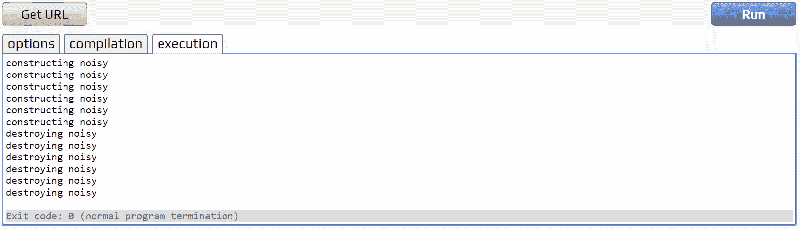
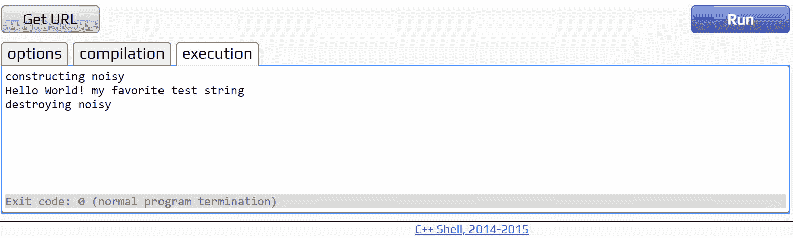
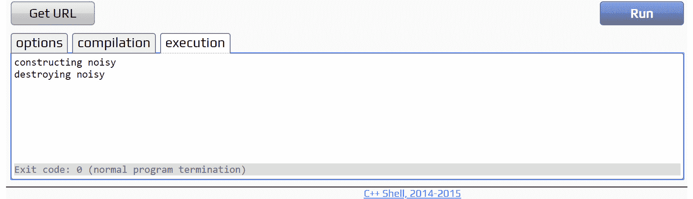
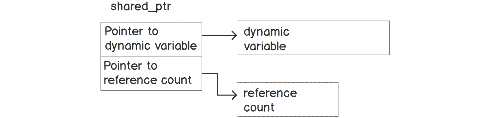
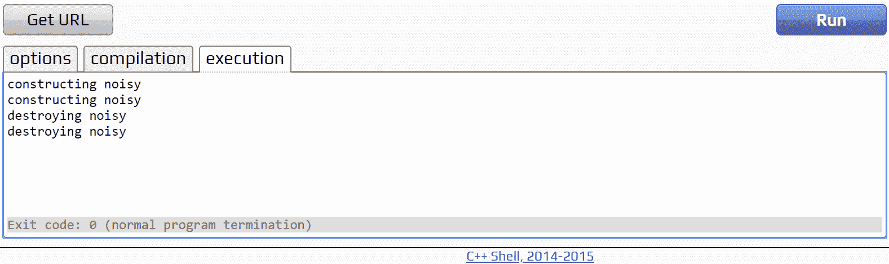

# 7。动态变量的所有权和寿命

概观

本章提供了一些工具和策略，使 C++程序中指针和动态变量的使用更加安全和易于理解。到本章结束时，您将能够描述 C++在动态变量所有权和生存期方面的弱点；解释自有和无主指针的使用；将指针嵌入到类实例中，以建立所有权并控制动态变量的生存期；使用智能指针类`unique_ptr<>`和`shared_ptr<>`来自动化动态变量的所有权和生存期。

# 简介

在前一章中，我们学习了如何创建和删除动态变量和动态数组。我们还学习了至少七种使用动态变量出错的方法，这些方法会导致程序崩溃。显然，这些强大的工具需要一些纪律才能正确使用。在这一章中，我们描述了管理动态变量的方法，这些方法可以减少在使用动态变量时出错的机会，首先从生命周期和所有权的概念开始。

生存期和所有权是有经验的开发人员用来驯服动态变量复杂性的关键概念，这样就不会发生内存泄漏。动态变量的生存期和所有权的概念并没有完全用 C++语法来表达。它们是开发人员必须管理的东西。

每个`new`表达式的结果必须分配给一个指针变量，否则新的动态变量将不可访问。这个指针变量可以说在创建时就拥有动态变量。每个`delete`-表达式都以一个指向动态变量的指针作为参数。当这个指针被删除时，可以说它拥有动态变量。

## 动态变量的寿命

大多数变量都有明确的生命周期。在他们生命的开始，变量被构造或初始化。在其生命的最后，变量被破坏。全局(`static`或`extern`)变量在`main()`开始之前以特定的顺序被构造。在`main()`退出后，它们会自动销毁，与它们的构建顺序相反。函数局部变量和块局部变量也称为自动变量，在声明它们的地方构造。当执行离开声明变量的范围(用花括号分隔)时，它们就会被销毁。当包含类成员变量的类实例被销毁时，它们也被销毁。

动态变量，包括动态数组，是这些简单规则的令人沮丧的例外。动态变量从可执行语句创建之时起一直存在，直到被另一个可执行语句销毁。该程序可以显式控制由动态变量构建的数据结构的生命周期。这是一把双刃剑，因为如果程序忘记销毁动态变量，它的内存将变得不可访问。

## 动态变量的所有权

销毁动态变量的责任由整个程序分担。C++允许程序的任何一行创建或销毁指向动态变量的附加指针，并且允许程序自由定义动态变量的生存期。然而，如果开发人员忘记删除或双重删除动态变量，C++会受到严厉的惩罚:内存泄漏或操作系统的错误陷阱导致程序停止运行。此外，搜寻这些 bug 可能需要跟踪程序中的所有执行路径。这种管理动态变量的责任分散、失败成本巨大的情况几乎令人无法忍受。

开发人员可能试图通过非正式地记录动态变量的*所有权*来驯服动态变量的原始力量。指针变量被指定为*在其生命周期内拥有*一个动态变量。该指针被称为*拥有的*指针。指定的指针变量用于删除动态变量。任何其他指向动态变量的指针都被称为*无主*指针。这不是 C++编译器可以帮助的。这是开发人员可能会出错的事情，因为编译器不会强制执行开发人员的所有权规则。

C++充满了无主指针。标准库迭代器和`std::string_view`实例是无主指针。许多函数将无主指针返回到标准库数据结构中。非 C++编程语言的拥护者可能会引用无主指针是多么危险，作为放弃 C++的充分理由。这种担心在某种程度上是有道理的。但不要放弃所有希望；有很好的方法来应对所有权和寿命。

管理动态变量所有权的最强大方法之一是将动态变量的所有者指针设置为类成员变量，并在类实例被销毁时删除动态成员变量。然后开发人员可以声明该类的全局、函数局部或块局部实例，该类实例中包含的动态变量将与该类实例具有相同的生存期。这种技术使得动态变量的生命周期和其他类型变量的生命周期一样容易理解。

## 资源获取是初始化(RAII)

拥有指向动态变量的指针并在实例被销毁时删除动态变量的类实例是更广泛的习惯用法的一个实例，其中类实例获取一些资源，拥有该资源，并在类实例被销毁时释放该资源。这个成语叫做 **RAII** ( **资源获取就是初始化**)。

RAII 是 C++中一个强大的习惯用法，用于许多资源:动态变量、打开的文件、窗口句柄、信号量和互斥体(这是多线程同步原语，本书不讨论)。RAII 类如此有用的原因是它们管理自己拥有的资源的生命周期。开发人员不必考虑如何释放资源。都是自动的。

## 练习 49:终生示范

本练习中的程序创建并销毁了一些类实例，以说明全局变量、函数局部变量和块局部变量的生存期:

注意

这个练习的完整代码可以在这里找到:[https://packt.live/2Dd3qJD](https://packt.live/2Dd3qJD)。

1.  进入程序的骨架:

    ```cpp
    #include <iostream>
    using namespace std;
    int main()
    { 
        return 0;
    }
    ```

2.  输入`class noisy`的定义。在这种情况下，`noisy`接受一个以 null 结尾的字符串构造函数参数，该参数对声明实例的范围提供注释:

    ```cpp
    class noisy
    {
        char const* s_;
    public:
        noisy(char const* s) 
        { cout << "constructing " << s << endl; s_ = s; }
       ~noisy()
        { cout << "destroying " << s_ << endl; }
    };
    ```

3.  输入函数`func()`的定义，声明一个函数-局部`noisy`实例，然后返回:

    ```cpp
    void func(char const* s)
    {
        noisy func(s);
    }
    ```

4.  Enter two global declarations of `noisy` instances at file scope:

    ```cpp
    noisy f("global 1");
    noisy ff("global 2");
    ```

    在控制转移到`main()`之前，所有的文件范围变量都按照它们被声明的顺序一个接一个地被构造。执行从`main()`返回后，按相反顺序销毁。如果您在多个文件中声明文件范围变量，有一个规则会告诉您它们的构造顺序。如果你需要了解，你可以在标准的副本中查找。

5.  In `main()`, create an instance of `noisy` called `n1`:

    ```cpp
        noisy n1("main() function local 1");
    ```

    `n1`是对所有`main()`都有效的函数局部变量。这实际上与全局变量的生存期相同。不同的是`n1`的定义只在`main()`内可见，而`f`和`ff`的定义在文件中随处可见。

6.  用一个说法`"function local 2"`来称呼`func()`。`func()`将在创建时打印一对消息，然后立即销毁一个`noisy`实例:

    ```cpp
        func("function local 2");
    ```

7.  接下来，输入由大括号组成的块范围。这是合法的 C++语法，它允许开发人员用自己的局部声明创建一个范围:

    ```cpp
        {
        }
    ```

8.  在空的花括号里是另一个`noisy`的声明和对`func()`的调用。因此，构造了块局部`noisy`，然后调用`func()`，这在函数范围内构造了一个`noisy`实例。然后`func()`返回，破坏功能范围`noisy`实例。当执行离开大括号块时，它会暂停足够长的时间，以便在经过时破坏`noisy`实例:

    ```cpp
            noisy n("block local");
            func("function local 3");
    ```

9.  After the block, `main()` returns, which also destroys the `noisy` instance in `main()`'s scope.

    没有任何与此对应的可见代码，但是两个全局`noisy`实例被销毁，顺序与构建相反。

10.  完整的程序如下所示。

    ```cpp
    #include <iostream>
    using namespace std;
    class noisy
    {
        char const* s_;
    public:
        noisy(char const* s) 
        { cout << "constructing " << s << endl; s_ = s; }
       ~noisy()
        { cout << "destroying " << s_ << endl; }
    };
    void func(char const* s)
    {
        noisy func(s);
    }
    noisy f("global 1");
    noisy ff("global 2");
    int main()
    {
        noisy n1("main() function local 1");
        func("function local 2");
        {
            noisy n("block local");
            func("function local 3");
        }
        return 0;
    }
    ```

11.  Compile and run the program. Its output is as follows, along with a description of what you are seeing:

    

图 7.1:练习 49 中程序的输出以及相应的描述

所以，我们从这个练习中学到了:

*   一个变量的生命周期——如果适当地包装在一个类实例中，也意味着一个动态变量——可以扩展到一个程序的所有执行，或者所有的`main()`和从`main()`内部调用的任何函数，或者所有的其他函数，或者一个函数中的一个块。
*   我们可以使用大括号在函数的作用域内创建块作用域，不同的声明在该作用域内有效。这比动态变量更有用。
*   由于变量的生命周期从它被声明时开始，我们可以通过在我们希望它的生命周期开始的块的中间声明变量来进一步约束变量的生命周期。

任何地方你看到`class noisy`的一个实例说`constructing…`，记住这也是一个机会去创建一个动态变量，它的指针被一个类拥有，比如`noisy`，并且和那个`noisy`实例有相同的寿命。

当`class noisy`的一个实例说`destroying…`时，这是一个销毁与`noisy`实例具有相同寿命的动态变量的机会。

很难想象一个动态变量需要有一个生命周期，而不是使用这个例子说明的 RAII 类可能有的生命周期，但是维护完全自由的代码审查和调试成本很少值得，因为 RAII 是如此强大。

## 练习 50:数据结构中的自有指针

本练习中的程序展示了如何管理数据结构中动态变量的生存期和所有权。拥有动态内容的数据结构是 C++开发中经常出现的模式。在本练习中，`numeric_list`类拥有构成列表的所有动态创建的`numeric_item`实例。

注意

这个练习的完整代码可以在这里找到:[https://packt.live/2QIrBYG](https://packt.live/2QIrBYG)。

一个常见的 C++习惯用法是，一个类定义数据结构，而另一个类定义数据结构中的项目。在非面向对象的语言中，程序员通常会为数据结构项声明一个记录结构，而一个简单的指针指向数据结构的根。

在 C++中，您可以附加作用于整个数据结构的成员函数，例如打印或删除它。`numeric_list::head_`是指向`numeric_item`的自有指针。当`numeric_list`的一个实例被销毁时，析构函数删除列表中的每个动态变量。单个`numeric_item`实例中的`next_`指针不是自有指针；所有实例都属于`numeric_list`中的`head_`指针:

1.  输入默认的`main()`函数和结构`numeric_item`的定义。你以前见过这些，在*第 6 章动态变量*的末尾:

    ```cpp
    #include <iostream>
    using namespace std;
    struct numeric_item
    {
        int value_;
        numeric_item* next_;
    };
    int main()
    {
        return 0;
    }
    ```

2.  Enter a definition of class `numeric_list`:

    ```cpp
    class numeric_list
    {
        numeric_item* head_;
    public:
        numeric_list() : head_(nullptr) {}
       ~numeric_list();
        void print();
        void add(int v);
        numeric_item* find(int v);
    };
    ```

    `numeric_list`有一个私有成员变量——一个指向`numeric_item`的指针，叫做`head_`。它的公共接口有一个构造函数、一个析构函数、一个名为`print()`的`void`函数、一个名为`add()`的`void`函数和一个名为`find()`的函数，该函数接受一个`int`参数并返回一个指向`numeric_item`的无主指针，该指针可能是`nullptr`。

3.  The functions in `numeric_list` are declared in the class definition for `numeric_list` but are defined outside the class definition, the way you would do if the class definition was in a header file while the member functions were defined in a `.cpp` file. When defined in this way, the compound function name with `numeric_list` and `::`, must be added to the front of the function name as it appears inside the class definition.

    注意

    在 Java 中，所有成员函数都必须在类定义中定义。这种语法在 C++中也有效，但对于大多数 C++开发人员来说，这不是一种熟悉的风格。C++开发人员习惯于将类定义作为类和其他地方出现的成员函数定义的简明概述。大多数开发人员将模板成员函数放在类定义中。一些开发人员将短成员函数放在类定义中。

    析构函数由 C++运行时系统隐式调用，但如果您显式调用它，它的名称将是`~numeric_list()`。因为`head_`是一个拥有的指针，析构函数必须删除指针拥有的任何动态变量，在这种情况下，这是列表的每个元素。析构函数遍历列表，重复从列表中删除第一个项目，然后删除那个被删除的项目。

    析构函数如下所示:

    ```cpp
    numeric_list::~numeric_list()
    {
        while (head_ != nullptr)
        {
            numeric_item* p = head_;
            head_ = head_->next_;
            cout << "deleting " << p->value_ << endl;
            delete p;
        }
    }
    ```

    删除`head_`，然后说`head_ = head_->next_;`是常见的错误。这个看似简单的符号的问题在于，删除`head_`后，它不再指向任何东西。我见过运行此错误的代码。我也见过它失败。

4.  `print()`功能与上一章练习中的相同。转载于此:

    ```cpp
    void numeric_list::print()
    {
        for (numeric_item* p = head_; p != nullptr; p = p->next_)
        {
            cout << p->value_ << " ";
        }
        cout << endl;
    }
    ```

5.  `add()`函数创建一个新的`numeric_item`实例，并将其添加到列表的头部:

    ```cpp
    void numeric_list::add(int v)
    {
        numeric_item* newp = new numeric_item;
        newp->value_ = v;
        newp->next_ = head_;
        head_ = newp;
    }
    ```

6.  The `find()` function iterates through the list looking for an item that has the same value as the `v` argument. It returns an unowned pointer to the found item, or `nullptr` if no item is found:

    ```cpp
    numeric_item* numeric_list::find(int v)
    {
        for (numeric_item* p = head_; p != nullptr; p = p->next_)
        {
            if (p->value_ == v) 
                return p;
        }
        return nullptr;
    }
    ```

    为什么`find()`返回的这个指针是无主的？删除此指针会损坏列表。前一个列表项将指向不再有效的东西，因此程序的行为将是未定义的。即使程序在那之前没有崩溃`numeric_item`的析构函数最终会重复删除已经删除的项目，让程序成为一个燃烧的残骸。

    一个没有写这个列表类的开发者怎么知道`find()`返回的指针是无主的？他们不知道，除非编写这个类的开发人员证明了这一点。类定义中带有函数声明的注释可能会说:`// returns unowned pointer to list_item, or nullptr`。

    任何时候容器类的成员函数，比如`numeric_list`，返回一个无主指针都是一个出错的机会。开发人员必须确保容器类销毁后不使用无主指针。正如后面将要显示的，无主指针变量和列表容器同时被销毁——因为执行离开了`main()`——所以在这种情况下，使用无主指针不会引起问题。

7.  下一步是开始进入`main()`的身体。首先，声明一个名为`l`的`numeric_list`实例。当`main()`返回:

    ```cpp
        numeric_list l;
    ```

    时，该函数-局部变量将被销毁
8.  创建一个`for`循环向列表中添加五个项目，然后打印出列表:

    ```cpp
        for (int i = 1; i < 6; ++i)
        {
            l.add(i);
        }
        l.print();
    ```

9.  Declare a `numeric_item` pointer called `p`, and assign to `p` the value returned by `l.find(4)`. The value in `p` is an unowned pointer. We already know `find()` will discover an item with this value because we added it moments ago. Output a message if the returned pointer is not `nullptr`, just to be sure:

    ```cpp
        numeric_item* p = l.find(4);
        if (p != nullptr)
            cout << "found numeric_item 4" << endl;
    ```

    就这样。当`main()`返回时，`p`仍然指向`l`中的一个项目。`p`没有被删除，但是没关系，因为`p`是一个无主的指针。

    当`main()`返回时，`l`的析构函数被调用。由于`l`有一个自有指针，`l`的析构函数必须删除它所指向的任何东西，这就是整个列表。

10.  Compile and run the program. Its output is reproduced here:

    

图 7.2:练习 50 中程序的输出

不出所料，程序在列表中插入了五项，五项由`print()`输出。在列表中找到了`4`项，列表的析构函数删除了这五项。

无主指针是不安全的指针。绝对没有什么*可以阻止*开发者在引用它的拥有的指针已经被销毁并且动态变量已经被删除之后，仍然持有一个没有拥有的指针。C++开发人员必须承担责任，确保这不会发生，以换取他们代码的快速执行。

但是开发人员如何知道这个无主指针没有指向垃圾呢？我们可以很容易地在`l`里面看到拥有的指针的寿命。是`main()`的全部。这基本上就是整个程序。无主指针`p`的寿命呢？它从它的声明点开始，在那里它被初始化为一个值，直到`main()`结束。当它指向垃圾时，就没有机会使用`p`。如果`l`和`p`在功能或块范围内声明，分析将是相同的。

注意

你会发现不喜欢写评论的人会声称代码应该是自己的文档。这个危险的建议忽略了这样一个事实，即程序本身并不记录动态变量的寿命和所有权。

有时，一个函数读取一个文件，接受一个输入，或者以其他方式收集数据，这些数据变成了一个动态变量。当这种情况发生时，拥有的指针可能是函数本地的。当指向动态变量的指针被返回时，所有权转移发生。C++代码中没有任何内容告诉您函数返回的原始指针何时是自有指针。您阅读了该函数的文档或注释，或者您意识到，由于该函数返回的是无数字节的缓冲区，而不是参数，因此它必须是一个自有指针。

## 练习 51:所有权的转让

本练习提供了一个程序必须转移原始指针所有权的例子。以下是完成练习的步骤:

注意

这个练习的完整代码可以在这里找到:[https://packt.live/2s0Kvzs](https://packt.live/2s0Kvzs)。

1.  进入骨架`main()`程序:

    ```cpp
    #include <iostream>
    using namespace std;
    int main()
    {
        return 0;
    }
    ```

2.  为`<cstring>`添加`include`指令，因为该程序使用字符串函数:

    ```cpp
    #include <cstring>
    ```

3.  定义一个名为`noisy_and_big`的`noisy`类。它不同于通常的`noisy`类，有一个 10，000 字节的`char`数组，模拟一个`struct`大到必须动态分配:

    ```cpp
    struct noisy_and_big
    {
        noisy_and_big() { cout << "constructing noisy" << endl; }
       ~noisy_and_big() { cout << "destroying noisy" << endl; }
        char big_buffer_[10000];
    };
    ```

4.  Define a function to create `noisy_and_big` instances:

    ```cpp
    noisy_and_big* get_noisy_and_big(char const* str)
    {
        noisy_and_big* ownedp = new noisy_and_big;
        strcpy(ownedp->big_buffer_, str);
    }
    ```

    在实际代码中，缓冲区将通过读取文件或获取网络数据包来填充，但是对于这个简短的演示，只需在缓冲区中写入一个字符串。同样在真实代码中，在我们使用`strcpy()`将其复制到`big_buffer`之前，我们必须检查`str`的长度。

    创建`noisy_and_big`实例时，`ownedp`是其所有者。然而，`ownedp`只活到了功能结束。`get_noisy_and_big()`必须要么删除`ownedp`(这没有意义)，要么在概念上将所有权转移给呼叫者。

5.  进入`main()`的身体。第一个语句声明了一个名为`newownedp`的指针，并将调用`get_noisy_and_big()`的结果赋给它。现在，`newownedp`是主人。输出一条消息，显示缓冲区的内容已经到达:

    ```cpp
        noisy_and_big* newownedp = get_noisy_and_big("a big, big buffer");
        cout << "noisy and big: " << newownedp->big_buffer_ << endl;
    ```

6.  生产代码对`noisy_and_big`实例做了一些有用的事情，然后是时候删除拥有的指针:

    ```cpp
        delete newownedp;
    ```

7.  完整的程序如下所示。

    ```cpp
    #include <iostream>
    #include <cstring>
    using namespace std;
    struct noisy_and_big
    {
        noisy_and_big() { cout << "constructing noisy" << endl; }
       ~noisy_and_big() { cout << "destroying noisy" << endl; }
        char big_buffer_[10000];
    };
    noisy_and_big* get_noisy_and_big(char const* str)
    {
        noisy_and_big* ownedp = new noisy_and_big;
        strcpy(ownedp->big_buffer_, str);
    }
    int main()
    {
        noisy_and_big* newownedp = get_noisy_and_big("a big, big buffer");
        cout << "noisy and big: " << newownedp->big_buffer_ << endl;
        delete newownedp;
        return 0;
    }
    ```

8.  编译并运行程序。其输出转载于此:


图 7.3:练习 51 中程序的输出

`noisy_and_big`实例在`get_noisy_and_big()`中构建，在`main()`中销毁。所有权从一个拥有指针转移到另一个拥有指针。重要的是，C++中没有任何内容指示转移。这都是关于文件和惯例。

跟踪动态变量所有权的规则是在 C++开发的前 20 年里将有经验的 C++开发人员与新手区分开来的事情之一。大多数人都认为，缺乏对所有权跟踪的自动化支持远非最佳。幸运的是，有更好的解决方案，我们接下来将对此进行研究。

# 智能指针—自动拥有动态变量

之前的练习已经演示了拥有的指针可以被包装在类实例中，这样可以在类被破坏时删除指针拥有的动态变量。这种设计可以更进一步，创建一个只包含指向动态变量的自有指针的类。这样的对象称为智能指针。

C++标准库中智能指针的设计利用了 C++的大多数高级特性，包括运算符函数、模板元编程、移动语义、变量模板和完美转发。这个设计太先进了，无法在这个简短的课程中涵盖。然而，结果是一个看起来和行为都很像原始指针的东西，但是当智能指针被销毁时，它会删除自己拥有的动态变量。

## unique_ptr < >

`unique_ptr<>`是一个拥有动态变量的智能指针模板类。在 C++中，模板类是一种可以生成类族的宏。模板是 C++编程中的一个重要话题。它们包含在*第 11 章*、*模板*中。现在，最重要的是包含一个带有`include`指令的模板类库，然后通过在模板类声明中用尖括号命名类型来专门化特定类型的模板，如下所示:

```cpp
#include <memory>
unique_ptr<MyClass> pMyClass;
```

该声明创建了一个指向动态 MyClass 变量的智能指针。`unique_ptr<>`生成的代码与原始指针的代码一样快。之所以叫`unique_ptr`，是因为它不分享所有权。

`unique_ptr<>`相对于原始指针的诸多优势包括:

*   `unique_ptr<>`拥有自己的动态变量，当`unique_ptr<>`被破坏时删除动态变量。
*   `unique_ptr<>`从不包含随机位。要么包含`nullptr`要么包含指向动态变量的指针。
*   `unique_ptr<>`在其动态变量被删除后不包含悬空指针。它在销毁时删除动态变量，或者`unique_ptr::reset()`删除动态变量并将`unique_ptr<>`内部的指针设置为`nullptr`。
*   `unique_ptr<>`单据所有权。在使用`unique_ptr<>`作为自有指针的程序中，原始指针是无主指针。

## Ex ercise 52:与 unique_ptr < >合作

本练习构建并销毁一些指向动态变量和动态数组的`unique_ptr<>`实例，并展示如何将动态变量的所有权从一个`unique_ptr<>`转移到另一个:

注意

这个练习的完整代码可以在这里找到:[https://packt.live/2D3A1lk](https://packt.live/2D3A1lk)。

1.  进入骨架`main()`程序:

    ```cpp
    #include <iostream>
    using namespace std;
    int main()
    {
        return 0;
    }
    ```

2.  `<memory>`表头是定义`unique_ptr<>`模板的地方。包括`#include <iostream>`下面的`<memory>`:

    ```cpp
    #include <memory>
    ```

3.  该程序使用`<cstring>`标题中的一个字符串函数。包括`<cstring>`:T2
4.  输入`class noisy`的定义。这个版本的`noisy`有两种不同的构造函数:默认构造函数和接受 int 参数的构造函数。在本练习中，我们将通过以两种方式构建`noisy`来展示`new`表达式的一些选项:

    ```cpp
    struct noisy
    {
        noisy() { cout << "default constructing noisy" << endl; }
        noisy(int i) { cout << "constructing noisy: arg " << i << endl; }
       ~noisy() { cout << "destroying noisy" << endl; }
    };
    ```

5.  在`main()`内部，首先声明一个名为`u1`的`unique_ptr<noisy>`实例，并将其初始化为一个新的`noisy`实例。这个`new`-表达式调用`noisy`的默认构造函数。:

    ```cpp
        unique_ptr<noisy> u1(new noisy);
    ```

6.  声明一个名为`u2`的`unique_ptr<noisy>`实例。`unique_ptr<>`的默认构造函数将该指针设置为`nullptr`。然后，将`u2`设置为初始化为`100`的新`noisy`实例。使用接受`int`参数的`noisy`构造函数。成员函数`unique_ptr::reset()`删除`unique_ptr`当前引用的任何动态变量，然后将`unique_ptr`设置为指向`reset()`的参数。在这种情况下，`u2`指向`nullptr`，所以`reset()`的作用是将`u2`设置为新的`noisy`实例:

    ```cpp
        unique_ptr<noisy> u2;
        u2.reset(new noisy(100));
    ```

7.  Declare a `unique_ptr<>` instance to a `noisy` array called `u3`, and initialize it to a new dynamic array of three `noisy` instances:

    ```cpp
        unique_ptr<noisy[]> u3(new noisy[3]);
    ```

    关于这个声明有几件事需要注意。首先，一个数组的`unique_ptr<>`与一个普通变量的`unique_ptr<>`的声明不同，因此模板将选择适合删除数组的`delete[]`表达式。另一件需要注意的事情是`unique_ptr<>`从不自己创建动态变量，而是接受在`unique_ptr<>`之外创建的动态变量的所有权。在下一个练习中，我们将看到`make_unique()`函数，它同时创建了`unique_ptr<>`实例和动态变量。

8.  向名为`u4`的`noisy`数组声明一个`unique_ptr`实例。将其初始化为两个`noisy`实例的新动态数组，第一个初始化为 1，第二个默认初始化，因为初始值设定项列表中没有足够的初始值设定项:

    ```cpp
        unique_ptr<noisy[]> u4(new noisy[2]{1});
    ```

9.  声明一个名为`u5`的`unique_ptr<noisy>`实例。默认初始化为`nullptr` :

    ```cpp
        unique_ptr<noisy> u5;
    ```

10.  输出`u1`和`u5`的原始指针值，使用`get()`成员函数获得一个原始的、无主的指针:

    ```cpp
        cout << "before transfer of ownership u1 = " << u1.get()          << ", u5 = " << u5.get() << endl;
    ```

11.  将`u1`中动态变量的所有权转移至`u5`。使用`release()`成员函数释放`u1`动态变量的所有权，并返回一个拥有的原始指针。这成为`reset()`的参数，它删除`u5`拥有的动态变量，然后从`u1`接受拥有的原始指针的所有权。由于`u5`是默认构造的，所以它之前的值是`nullptr` :

    ```cpp
        u5.reset(u1.release());
    ```

12.  输出所有权转移后`u1`和`u5`的原始指针:

    ```cpp
        cout << "after transfer of ownership u1 = " << u1.get()
             << ", u5 = " << u5.get() << endl;
    ```

13.  通过不同的方法将`u5`的所有权转移回`u1`。使用移动语义，使用功能`std::move()`将`u5`移动到`u1`。移动语义是一个高级的 C++概念，它太复杂了，本书无法涵盖，但它是一个值得您在未来关注的概念。函数返回的`unique_ptr<>`实例也通过移动语义转移所有权。在此声明的末尾，`u5`是`nullptr` :

    ```cpp
        u1 = move(u5);
    ```

14.  转移后输出`u1`和【T1:

    ```cpp
        cout << "after second transfer u1 = " << u1.get()
             << ", u5 = " << u5.get() << endl;
    ```

15.  Create a `unique_ptr<>` instance to a `char` array. This is a common idiom for creating dynamically sized buffers without having to worry about deleting them later. This buffer will be automatically deleted as `main()` returns. Put a short string in the buffer and use `get()` to output the `char` pointer as a string:

    ```cpp
        unique_ptr<char[]> buf(new char[20]);
        strcpy(buf.get(), "xyzzy");
        cout << "buf = " << buf.get() << endl;
    ```

    当`main()`返回时，所有`unique_ptr<>`实例被销毁，其动态内容被删除。完成的程序是这样的。

    ```cpp
    #include <iostream>
    #include <memory>
    #include <cstring>
    using namespace std;
    struct noisy
    {
        noisy() { cout << "default constructing noisy" << endl; }
        noisy(int i) { cout << "constructing noisy: arg " << i << endl; }
       ~noisy() { cout << "destroying noisy" << endl; }
    };
    int main()
    {
        unique_ptr<noisy> u1(new noisy);
        unique_ptr<noisy> u2;
        u2.reset(new noisy(100));
        unique_ptr<noisy[]> u3(new noisy[3]);
        unique_ptr<noisy[]> u4(new noisy[2]{1});
        unique_ptr<noisy> u5;
        cout << "before transfer of ownership u1 = " << u1.get()
             << ", u5 = " << u5.get() << endl;
        u5.reset(u1.release());
        cout << "after transfer of ownership u1 = " << u1.get() 
             << ", u5 = " << u5.get() << endl;
        u1 = move(u5);
        cout << "after second transfer u1 = " << u1.get() 
             << ", u5 = " << u5.get() << endl;
        unique_ptr<char[]> buf(new char[20]);
        strcpy(buf.get(), "xyzzy");
        cout << "buf = " << buf.get() << endl;
        return 0;
    }
    ```

16.  Compile and run the completed program. Its output looks as shown below. Of course, different runs of the program may print out different hexadecimal pointer addresses:

    

图 7.4:练习 52 中程序的输出

第一行输出来自`u1`。然后，以`100`为构造函数参数构造`u2`。接下来的三行是`u3`中嘈杂阵的三个成员。接下来的两行是`u4`中嘈杂的阵。从`u1`到`u5`再回到的转移出现在意料之中。输出缓冲区。然后删除`u1`中的`noisy`实例、`u2`中的`noisy`实例、`u3`中的三个`noisy`实例、`u4`中的两个`noisy`实例。`u5`为`nullptr`。

值得注意的是，开发者不需要删除任何东西。智能指针跟踪事物，并自动删除它们拥有的动态变量。

注意

处置由`unique_ptr<>`实例拥有的动态变量的`delete`表达式隐藏在`unique_ptr<>`的定义中。一些软件团队利用这一点在大型代码库上运行自动化工具，寻找`delete`关键字的实例来标记代码评审期间的特别注意。消除所有显式的`delete`-使用智能指针的表达式可能会提高代码库的质量。

`unique_ptr<>`并不能解决所有问题。例如，`unique_ptr<>`的默认版本不够智能，无法在列表头被破坏时删除链表数据结构的所有成员。`unique_ptr<>`模板有一个很少使用的可选第二个参数，称为`deleter`，这是当`unique_ptr`实例被破坏时要调用的函数。这允许`unique_ptr<>`的扩展删除整个数据结构，并允许它做其他事情，例如关闭打开的文件。

C++中智能指针的广泛采用标志着 C++程序相对于旧的 C 和 C++代码库的可靠性有了显著提高。尽管 C++是一种“不安全”的语言，但是遵循现代 C++实践的团队几乎没有内存泄漏的问题。我们将在未来的章节中发现，智能指针在与 C++异常处理相结合时特别强大。

## make_unique()

`make_unique()`是一个模板函数，它创建一个动态变量，并将其分配给适当类型的`unique_ptr`实例，然后返回。正如`unique_ptr<>`在其定义中隐藏了`delete`表达式一样，`make_unique()`对`new`表达式也是如此。这允许团队使用禁止“裸”`new` -和`delete`-表达式的编码标准来提高代码质量。

## 练习 53:使用 make_unique()

本练习演示如何使用`make_unique()`隐藏新的表达式。以下是完成练习的步骤:

注意

这个练习的完整代码可以在这里找到:[https://packt.live/35nhLiQ](https://packt.live/35nhLiQ)。

1.  进入骨架`main()`程序:

    ```cpp
    #include <iostream>
    using namespace std;
    int main()
    {
        return 0;
    }
    ```

2.  `<memory>`表头是定义`unique_ptr<>`模板的地方。包括`#include <iostream>`下面的`<memory>`:

    ```cpp
    #include <memory>
    ```

3.  输入类`noisy`的定义:

    ```cpp
    struct noisy
    {
        noisy() { cout << "constructing noisy" << endl; }
       ~noisy() { cout << "destroying noisy" << endl; }
    };
    ```

4.  在`main()`内部，声明一个名为`u1`的`unique_ptr<noisy>`实例，并将其初始化为一个新的`noisy`实例:

    ```cpp
        unique_ptr<noisy> u1(new noisy);
    ```

5.  声明一个`unique_ptr<noisy>`叫做`u2`。将呼叫返回的值分配给`make_unique<noisy>()` :

    ```cpp
        unique_ptr<noisy> u2 = make_unique<noisy>();
    ```

6.  Declare a `unique_ptr<>` instance to a `noisy` array called `u3`, using the `auto` keyword to avoid re-entering the type of the variable, then assign the value returned by `make_unique<noisy[]>(4)`, which creates an array of four `noisy` instances:

    ```cpp
        auto u3 = make_unique<noisy[]>(4);
    ```

    将`u3`的声明与前一行声明`u2`进行比较:`u3`声明中的`auto`关键字允许开发人员省略类型名称，因为它可以从初始值中推导出来。这种现代 C++语法的优势在开发人员第一次声明具有长类型名或一堆模板参数的东西时变得很明显。

7.  完成的程序是这样的。

    ```cpp
    #include <iostream>
    #include <memory>
    using namespace std;
    struct noisy
    {
        noisy() { cout << "constructing noisy" << endl; }
       ~noisy() { cout << "destroying noisy" << endl; }
    };
    int main()
    {
        unique_ptr<noisy> u1(new noisy);
        unique_ptr<noisy> u2 = make_unique<noisy>();
        auto u3 = make_unique<noisy[]>(4);
        return 0;
    }
    ```

8.  编译并运行完成的程序。它的输出如下所示:



图 7.5:练习 53 中程序的输出

第一个声明创建一个`noisy`实例。第二个创造了另一个。第三个创造四个。当`main()`退出时，由于`unique_ptr<>`实例被销毁，所有六个都被删除。

`make_unique()`并不完美。例如，数组版本只能默认初始化一个动态数组。`make_unique()`具有隐藏`new`关键词的宝贵属性。`make_unique()`存在的部分原因是与`make_shared()`的风格兼容，这将在后面介绍。

在下一个练习中，我们将看到智能指针如何帮助简化类的实现，通常不需要编写析构函数。

## 作为类成员变量的唯一 _ptr < >

当类被销毁时，调用其析构函数，销毁类实例；然后调用每个成员变量的析构函数，销毁成员。基本类型的析构函数，如`int`或`char`，什么也不做。但是，当成员是类实例时，会调用该成员的析构函数。

当类成员是智能指针时，当包含智能指针的类实例被销毁时，会自动调用智能指针的析构函数。开发人员无需编写任何代码来删除智能指针所拥有的动态变量。

如果包含动态变量的所有类成员都是智能指针，则类析构函数可能为空。即使析构函数为空，成员析构函数也会在类实例被销毁时运行。智能指针使您的类的代码看起来简单而流畅，并使代码更容易检查。一旦你开始使用智能指针，你就再也不想回去了。

## 练习 54:使用唯一 _ptr < >作为类成员变量

本练习包括创建一个简单的类，其成员是智能指针，以说明当智能指针是类成员时产生的简化类语法:

注意

这个练习的完整代码可以在这里找到:[https://packt.live/2DaBO7W](https://packt.live/2DaBO7W)。

1.  进入骨架`main()`程序:

    ```cpp
    #include <iostream>
    using namespace std;
    int main()
    {
        return 0;
    }
    ```

2.  `unique_ptr<>`模板在`<memory>`表头定义。包括`#include <iostream>`之后的`<memory>`:

    ```cpp
    #include <memory>
    ```

3.  该程序使用`<cstring>`标题中的一个字符串函数。包括`<cstring>`如下:

    ```cpp
    #include <cstring>
    ```

4.  输入类`noisy`的常用定义:

    ```cpp
    struct noisy
    {
        noisy() { cout << "constructing noisy" << endl; }
       ~noisy() { cout << "destroying noisy" << endl; }
    };
    ```

5.  Enter a definition for class `autobuf`, which is intended to model a class containing a very large buffer, as if the data were read in from a file or a network packet:

    ```cpp
    class autobuf
    {
        unique_ptr<noisy> np_;
        unique_ptr<char[]> ptr_;
    public:
        autobuf(char const* str);
        char* get();
    };
    ```

    该类有两个成员变量。一个名为 np 的成员是类`noisy`实例的`unique_ptr<>`。这种嘈杂实例的存在会打印一条信息，使得在构建或销毁`autobuf`实例时更容易看到。另一个是一个`unique_ptr<>`实例到一个`char`阵，叫做`ptr_`。现在，`autobuf`有一个默认构造函数和一个名为`get()`的访问器函数，该函数返回一个指向缓冲区的无主指针。`autobuf`的析构函数由编译器自动生成。编译器把它做对了，我们根本不用考虑它。

6.  接下来，定义`autobuf`的两个成员函数。`:`后面的两行是构造函数初始化列表。这为两个成员变量提供了初始值。`np_`获得一个新的动态`noisy`实例，`ptr_`获得一个足够大的`char`缓冲区来保存构造函数的`str`参数:

    ```cpp
    autobuf::autobuf(char const* str)
      : np_(make_unique<noisy>()),
        ptr_(make_unique<char[]>(strlen(str) + 1))
    {
        strcpy(ptr_.get(), str);
    }
    ```

7.  `get()`函数使用`unique_ptr<>`的`get()`成员函数:

    ```cpp
    char* autobuf::get() 
    {
        return ptr_.get();
    }
    ```

    返回一个指向缓冲区的无主指针
8.  在`main()`中，声明一个名为`buffer`的`autobuf`实例。将其初始化为任何方便的文字字符串。使用`buffer`的`get()`成员函数在`buffer`中输出字符串，以返回指向`char`数组的指针:

    ```cpp
        autobuf buffer("my favorite test string");
        cout << "Hello World! " << buffer.get() << endl;
    ```

9.  完整的程序转载如下。

    ```cpp
    #include <iostream>
    #include <memory>
    #include <cstring>
    using namespace std;
    struct noisy
    {
        noisy() { cout << "constructing noisy" << endl; }
        ~noisy() { cout << "destroying noisy" << endl; }
    };
    class autobuf
    {
        unique_ptr<noisy> np_;
        unique_ptr<char[]> ptr_;
    public:
        autobuf(char const* str);
        char* get();
    };
    autobuf::autobuf(char const* str)
      : np_(make_unique<noisy>()),
        ptr_(make_unique<char[]>(strlen(str) + 1))
    {
        strcpy(ptr_.get(), str);
    }
    char* autobuf::get() 
    {
        return ptr_.get();
    }
    int main()
    {
        autobuf buffer("my favorite test string");
        cout << "Hello World! " << buffer.get() << endl; 
        return 0;
    }
    ```

10.  Compile and run the program. Its output is reproduced here:

    

图 7.6:练习 54 中程序的输出

当`main()`开始执行时，`autobuf`的构造函数创建一个新的`noisy`实例，打印输出的第一行。输出语句写输出的第二行，包含`buffer`的内容。然后，行刑离开`main()`，导致`buffer`被摧毁。编译器生成的`buffer`析构函数销毁`np_`(指向`noisy`的智能指针)，删除`noisy`并打印第三行输出，以及`ptr_`(指向`char`数组的智能指针)，删除`char`数组。

在这个简单的例子中，开发人员不需要为`autobuf`编写析构函数似乎并不是什么大事。然而，乘以许多类——其中一些有多个成员变量——会有所不同，因为开发人员不必记得为每个动态变量向每个析构函数添加代码。

## 函数参数和返回值中唯一的 _ptr < >

通常将无主指针作为函数参数传递给函数，因为调用程序中的指针通常在被调用函数的持续时间内存在。A `unique_ptr<>`用作函数参数是危险的。如果实际参数是`unique_ptr<>`实例，函数的形式参数将窃取实际参数的值，使实际参数等于`nullptr`。如果函数的实际参数是一个无主指针，`unique_ptr<>`参数将获得指针的所有权，并在函数退出时将其删除。这几乎从来都不是开发者想要的。相反，将函数的形式参数设为无主指针，并使用`unique_ptr<>`的`get()`成员函数获取无主指针作为函数参数。

`unique_ptr<>`可以在函数返回时使用，表示调用者必须获得返回的动态变量的所有权。

## 练习 55:在函数返回值中使用唯一的 _ptr < >

本练习展示了如何通过向动态变量返回`unique_ptr<>`实例来转移其所有权:

注意

这个练习的完整代码可以在这里找到:[https://packt.live/2OB8ZHm](https://packt.live/2OB8ZHm)。

1.  进入骨架`main()`程序:

    ```cpp
    #include <iostream>
    using namespace std;
    int main()
    {
        return 0;
    }
    ```

2.  `unique_ptr<>`在`<memory>`表头定义。包括`#include <iostream>`之后的`<memory>`:

    ```cpp
    #include <memory>
    ```

3.  定义类`noisy`。我们之前见过这个类:

    ```cpp
    struct noisy
    {
        noisy() { cout << "constructing noisy" << endl; }
       ~noisy() { cout << "destroying noisy" << endl; }
    };
    ```

4.  创建一个名为`func()`的函数，该函数模拟一个创建指向大型数据结构的自有指针的函数，可能是通过读取文件或接收网络数据包。`func()`不接受任何参数，返回一个`unique_ptr<>`实例:

    ```cpp
    unique_ptr<noisy> func()
    {
        return make_unique<noisy>();
    }
    ```

5.  在`main()`中，调用`func()`，捕捉返回值。使用`auto`关键字可以避免查找`func()`返回的指针的确切类型。请注意这种现代 C++语法是如何简化的:

    ```cpp
    auto u1 = func();
    ```

6.  完成的程序是这样的。

    ```cpp
    #include <iostream>
    #include <memory>
    using namespace std;
    struct noisy
    {
        noisy() { cout << "constructing noisy" << endl; }
       ~noisy() { cout << "destroying noisy" << endl; }
    };
    unique_ptr<noisy> func()
    {
        return make_unique<noisy>();
    }
    int main()
    {
        auto u1 = func();
        return 0;
    }
    ```

7.  The output of this program is reproduced here. A single instance of `noisy` is created inside `func()`, transferred to `u1`, and then deleted when `main()` returns, signaling the successful transfer of ownership:

    

图 7.7:练习 55 中程序的输出

在绝大多数编程情况下，一个指向动态变量的指针是合适的。对于其余的情况，C++为共享所有权提供了一个引用计数的`shared_ptr<>`。

# 动态变量的共享所有权

在 C++11 之前，标准库中有一个更有限的智能指针`auto_ptr<>`。`auto_ptr<>`模板类的许多限制之一是，它不能用作 C++标准库容器类中的元素类型，也不能将动态变量的所有权转移到函数之外。标准库包含一个被称为`shared_ptr<>`的引用计数智能指针类，该类可用于函数参数、返回值和标准库容器。几年来，一些球队专门使用`shared_ptr<>`并禁止使用原始指针。

`shared_ptr<>`的问题是在运行时指令方面比较昂贵。除了`shared_ptr<>`拥有的动态变量外，它还创建了第二个动态变量来保存引用计数，如图*图 7.8* 所示，并在删除最后一个引用时删除引用计数。对内存分配器的每次调用都非常昂贵:



图 7.8:共享 ptr 的简化内存布局

递增和递减引用计数的代码使用昂贵的线程安全互锁递增和递减。这比简单的增量或减量慢 10 倍。作为`shared_ptr<>`实例的每个函数参数必须在调用函数时递增，并在函数返回时递减。对于频繁调用的函数，成本会变得很高。`shared_ptr<>`的实现变得更加复杂，以支持很少使用的自定义删除器和`weak_ptr<>`实例，这在本章中没有描述。

## 练习 56:使用 shared_ptr < >

在本练习中，我们创建了几个共享指针，并调用了一个以共享指针为参数并返回共享指针的函数。这个程序的思想是一个函数条件一个动态变量永远不是`nullptr`，所以程序不需要测试`nullptr`:

注意

这个练习的完整代码可以在这里找到:[https://packt.live/2ObtwDb](https://packt.live/2ObtwDb)。

1.  进入骨架`main()`程序:

    ```cpp
    #include <iostream>
    using namespace std;
    int main()
    {
        return 0;
    }
    ```

2.  `shared_ptr<>`模板在`<memory>`表头定义。包括`#include <iostream>`下面的`<memory>`:

    ```cpp
    #include <memory>
    ```

3.  定义一个函数`func()`，该函数以`char`数组的`shared_ptr<>`为参数，并返回一个`shared_ptr<>`到一个`char`数组:

    ```cpp
    shared_ptr<char[]> func(shared_ptr<char[]> str)
    {
    }
    ```

4.  在`func()`内，测试`str`是否等于`nullptr`。如果`str`为`nullptr` :

    ```cpp
        if (!str)
        {
        }
    ```

    ，表达式`!str`返回`true`
5.  如果`str`为`nullptr`，将其值重置为新的一个字符数组。将字符值设置为空终止符`'\0'` :

    ```cpp
            str.reset(new char[1]);
            str[0] = '\0';
    ```

6.  在`main()`内部，创建一个`shared_ptr<>`实例到一个名为`null`的`char`数组。`shared_ptr<>`默认构造函数将`null`初始设置为`nullptr` :

    ```cpp
        shared_ptr<char[]> null;
    ```

7.  测试`null`是否等于`nullptr`。这次我们通过获取无主指针并将其与`nullptr`进行比较来执行测试，而不是使用表达式`!null`。如果`null`等于`nullptr`，打印消息:

    ```cpp
        if (null.get() == nullptr)
            cout << "null is equal to nullptr" << endl;
    ```

8.  以`null`为自变量调用`func()`。创建一个名为`result1`的`auto`变量来接收`func()`返回的值:

    ```cpp
        auto result1 = func(null);
    ```

9.  如果`result1`等于`nullptr`，则输出消息:

    ```cpp
        if (result1.get() == nullptr)
            cout << "result1 is equal to nullptr" << endl;
    ```

10.  以`result1`为自变量再次调用`func()`。然后，在`result1`中捕捉返回值:

    ```cpp
        result1 = func(result1);
    ```

11.  生成的程序如下所示:

    ```cpp
    #include <iostream>
    #include <memory>
    using namespace std;
    shared_ptr<char[]> func(shared_ptr<char[]> str)
    {
        if (!str)
        {
            str.reset(new char[1]);
            str[0] = '\0';
        }
        return str;
    }
    int main()
    {
        shared_ptr<char[]> null;
        if (null.get() == nullptr)
            cout << "null is equal to nullptr" << endl;
        auto result1 = func(null);
        if (result1.get() == nullptr)
            cout << "result1 is equal to nullptr" << endl;
        result1 = func(result1);
        return 0;
    }
    ```

12.  Compile and execute the program on a C++ compiler that supports C++17\. Online compilers supporting C++17 include **Coliru** and **Tutorialspoint**. Unfortunately, cpp.sh is only a C++14 compiler and will not compile this code. The output looks like this:

    

图 7.9:练习 56 中程序的输出

这个程序看起来很简单，但是有很多事情在进行。我们无法通过仪器`shared_ptr`看到它在运行，所以下面是程序执行的描述:

*   创建`shared_ptr`实例`null`。它的指针被设置为`nullptr`。因为它不指向动态变量，所以动态变量或引用计数不需要分配。
*   通过获取原始指针并验证其等于`nullptr`，证明`null`为空。
*   呼叫`func()`。实际论点`null`被复制到形式论点`str`中。既然`null`等于`nullptr`，`str`也包含`nullptr`。
*   测试`str`是否等于`nullptr`。既然是，创建一个新的动态`char`数组并将`str`重置为该值。`str`还创建一个新的动态变量来保存引用计数，并将引用计数设置为 1。
*   将`str`拥有的动态变量设置为空终止符`'\0'`。
*   返回`str`。现在，`str`被复制到`result1`中，它将指向动态字符数组的指针和引用计数复制到`str`中，并将其引用计数增加到 2，因为`str`和`result1`都指向动态数组。然后调用`str`的析构函数，将`str`的引用计数减 1，函数返回。
*   测试`result1`是否等于`nullptr`。不等于`nullptr`因为刚刚设置了一个一字动态数组，所以什么都不打印。
*   现在再次调用`func()`。
*   `result1`被复制构建成`str`。由于`result1`不是`nullptr`，其参考计数增加到 2。
*   `str`测试为`nullptr`。由于`str`不是`nullptr`(是单字符数组)，测试失败。
*   返回`str`。`str`被复制到`result1`中。请记住`str`和`result1`已经指向相同的`char`数组和相同的参考计数。因此，首先，将要分配的对象的引用计数增加到 3。然后，将要被覆盖的对象的引用计数减为 2。然后，`str`被破坏，参考计数递减到 1。由于没有引用计数变为 0，因此不会删除任何内容。
*   现在`main()`回归。`result1`被销毁，因此它所拥有的对象的引用计数递减为 0。`char`阵被删除。参考计数被删除。
*   `null`被摧毁。已经等于`nullptr`了，所以什么都没发生。

## make_shared()

`make_shared()`是一个模板函数，它创建一个动态变量，并将其分配给适当类型的`shared_ptr<>`实例。正如`unique_ptr<>`和`shared_ptr<>`在其定义中隐藏了`delete`表达式一样，`make_shared()`对`new`表达式也是如此:


图 7.10:make _ shared()后动态对象和引用计数的简化内存布局

`make_shared()`有额外的注意能力。它为单个对象中的动态变量和引用计数分配存储空间。由于创建动态对象是最昂贵的 C++操作，因此减少分配数量可以显著提高大量使用`shared_ptr<>`的代码的性能。

`make_shared()`有局限性。从 C++17 开始不能创建动态数组，尽管它是为 C++20 提出的。无法指定删除程序。

## 练习 57:使用 make_shared()

本练习使用`make_shared()`构建几个动态变量:

注意

这个练习的完整代码可以在这里找到:[https://packt.live/2OyeFBO](https://packt.live/2OyeFBO)。

1.  进入骨架`main()`程序:

    ```cpp
    #include <iostream>
    using namespace std;
    int main()
    {
        return 0;
    }
    ```

2.  `make_shared()`模板功能在`<memory>`表头定义。包括`#include <iostream>`之后的`<memory>`:

    ```cpp
    #include <memory>
    ```

3.  输入类`noisy`的定义:

    ```cpp
    struct noisy
    {
        noisy() { cout << "constructing noisy" << endl; }
       ~noisy() { cout << "destroying noisy" << endl; }
    };
    ```

4.  在`main()`内部，声明一个名为`u1`的`shared_ptr<noisy>`实例，并将其初始化为一个新的`noisy`实例:

    ```cpp
        shared_ptr<noisy> u1(new noisy);
    ```

5.  声明一个名为`u2`的`shared_ptr<noisy>`实例。将呼叫返回的值分配给`make_shared<noisy>()` :

    ```cpp
        shared_ptr<noisy> u2 = make_shared<noisy>();
    ```

6.  声明一个名为`u3`的`shared_ptr<noisy>`实例，并为其分配`u2`。`noisy`实例的所有权由`u2`和`u3`共享:

    ```cpp
        shared_ptr<noisy> u3 = u2;
    ```

7.  释放`u2`的所有权。现在，`u3`是唯一拥有者:

    ```cpp
        u2.reset();
    ```

8.  完成的程序是这样的。

    ```cpp
    #include <iostream>
    #include <memory>
    using namespace std;
    struct noisy
    {
        noisy() { cout << "constructing noisy" << endl; }
       ~noisy() { cout << "destroying noisy" << endl; }
    };
    int main()
    {
        shared_ptr<noisy> u1(new noisy);
        shared_ptr<noisy> u2 = make_shared<noisy>();
        shared_ptr<noisy> u3 = u2;
        u2.reset();
        return 0;
    }
    ```

9.  Compile and run the completed program. Its output looks like this:

    

图 7.11:练习 56 中程序的输出

不出所料，`noisy`的两个实例被创建，两个被销毁。

## 活动 7:使用动态变量存储一本书的单词

在*第 6 章*、*动态变量*的开头，我们看了一个不使用动态变量的数据结构，用来存储一本书里的所有单词。不可能存储每本书，要么是因为单个单词太长，要么是因为单词数量太多，或者两者都有。有了动态变量，这些问题就可以克服。

在本练习中，您将实现一个程序来存储不受上述任何一个限制的书的单词。这个问题类似于书籍阅读器、网络浏览器和文本编辑器设计中面临的问题。

程序必须能够精确地重构输入。也就是说，它需要记录每个单词周围的空格数，并将每行的单词收集在一起。该程序应具有完全按照输入打印书籍的功能。

图书阅读器程序的输入可能是一个包含相关文本的文件。然而，对于这个活动，程序的输入是一个指向文字字符串的指针数组。文字字符串由由一个或多个空格或字符串终止符(`'\0'`)分隔的非空格单词组成，每个字符串代表一行书。

C++标准库定义的容器类可能很容易解决这个问题，但是请不要使用它们，即使您已经知道它们。`std::string`也会有帮助，但也不要用那个。这个活动的目的是测试你对指针和动态变量的知识。

这个示例输入，来自哈姆雷特的简短引用，足以测试您的设计，而不会增加您的耐心:

```cpp
    "What a piece of work is man, "
    "   How noble in reason, how infinite in faculty,"
    "In form and moving how express and admirable, "
    "   In action how like an Angel, In apprehension how like a god."
    "The beauty of the world.  The paragon of animals."
```

注意

这个活动的完整代码可以在这里找到:[https://packt.live/339ahi6](https://packt.live/339ahi6)。

以下是一些帮助您完成活动的提示:

1.  这是一个很大的任务，但是可以分解成几个部分。您需要一个数据结构来保存一个包含缓冲区的单词，该缓冲区包含单词字符串和空格数。它必须能够输出单词和空格。你可以把它们放到`cout`上，但是把它们放到绳子上可以让测试变得更容易。
2.  然后，您需要一个可以容纳一行单词的数据结构。它还必须能够输出该行。最后，你需要一个可以容纳整本书的行的数据结构，你需要输出这本书。使你创建的类彼此相似将有助于你在这个作业中找到结构，这将使你的工作进行得更快。
3.  每个单词都可以存储，以及该单词后面的空格数。如何表示前导空格？考虑一个零长度的单词。
4.  应该用什么数据结构来保存一个单词？单词的文本应该是`char`的动态数组。尾随空格的数量可以是`int`。指向动态数组的智能指针将使删除变得容易。
5.  应该使用什么数据结构来保持一条线？单词链表是一个明显的选择，所以下一个指针应该被添加到另外两个保存单词的字段中。列表的头节点应该是一个包含原始指针的类，该指针带有删除一行中所有单词的析构函数。
6.  应该使用什么数据结构来保存整本书？链表行将是一个合适的选择。可以使用动态数组，但是如果对数组大小的最初猜测是错误的，那么就必须有代码将数组复制到更大的数组中。书的头节点应该是一个包含原始指针的类，该指针带有删除书所有行的析构函数。您将希望向 line 类添加下一个指针。
7.  应该如何将空终止的字符串转换为单词列表？分隔字符串时只需要三个字符。每个单词后面都有空格。空终止符位于行尾。在循环中，您可以设置一个指向单词开头的指针，然后步进第二个指针寻找空格或空终止符。这些指针之间的区别在于单词的大小。别忘了给空终止符加 1。
8.  You will need a function to produce a string representing the line from the list of words. You will need to know how many characters to allocate. You can find this out by counting the size of the word, plus the number of spaces for each word, and adding 1 for a null terminator at the end of the line. Then, you can copy words and spaces into this array. Since you need to know the length of each word, it is appropriate to store the number of characters of each word as another `int` in the word class.

    注意

    这个活动的解决方案可以在第 534 页找到。

# 总结

指针和动态变量是基本 C++工具包中最有价值的两个工具。理解它们并很好地使用它们是值得的。我们了解到，C++并不强制执行任何关于动态变量创建或删除的规则。开发人员可以记录动态变量的所有权，为这种混乱带来一些秩序。我们了解到，管理动态变量所有权的一个强大方法是通过使用智能指针，它将动态变量与一个普通变量联系起来，该变量在一个定义明确的地方被销毁。C++是一种强大的编程语言，因为它提供了一系列选择，从最基本的不安全编程到昂贵的自动化智能库类。

在下一章中，我们将深入探讨类类型和面向对象编程。