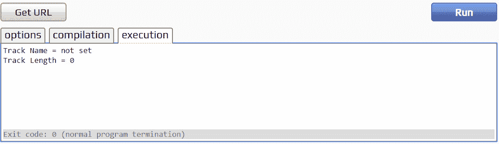
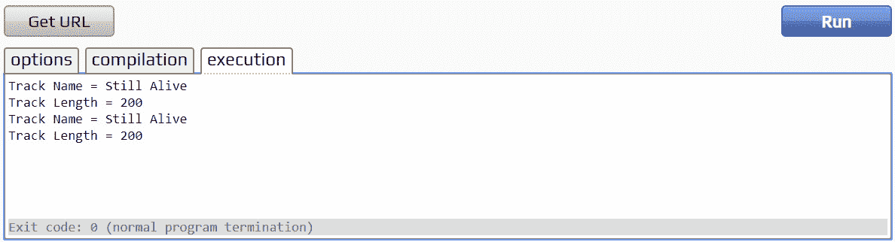
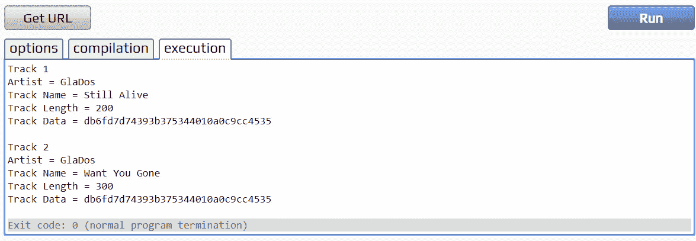
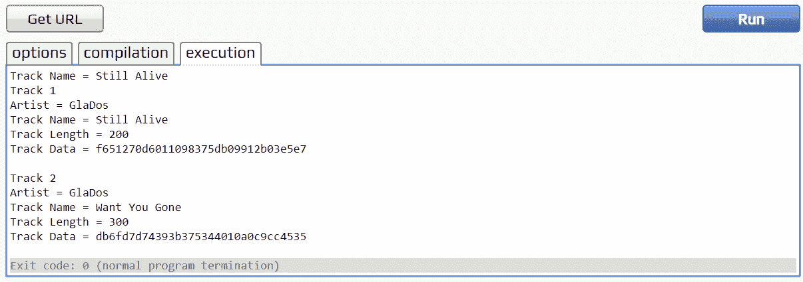
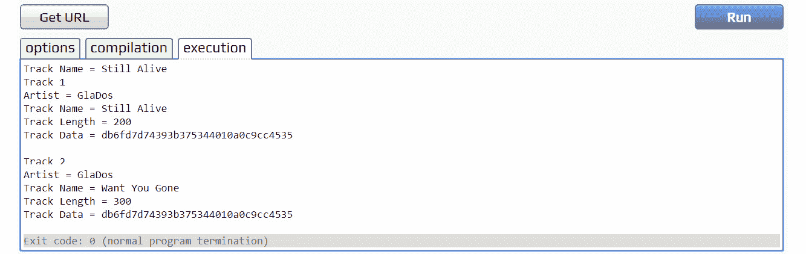

# 8。类和结构

概观

本章借助实例和练习介绍了结构和类的基础知识。到本章结束时，您将能够描述类、结构和联合类型之间的区别，以及如何使用构造函数和析构函数正确初始化和处理它们。

# 简介

C++是一门广泛的语言，你要学习的每一个特性或范例都需要深入的知识来释放它的全部潜力。C++有两种类型:内置类型和类类型。内置类型是构成语言核心的任何类型，例如`int`、`float`和`char`。类类型可以被认为是用户定义的类型；这些是我们通过声明类、结构、联合等创建的类型。C++标准库中的特性和类型(如向量和队列)都是使用 C++构建的类类型，这显示了该语言的真正力量及其创建感觉像内置类型一样易于使用的类型的能力。类是面向对象编程的基础，更详细地介绍它们将有助于为您提供所需的基础。拥有用可靠的接口创建健壮类型的能力对于成为一个强大的 C++程序员来说是至关重要的。

在*第 6 章*、*动态变量*中，您学习了构造函数和析构函数以及`new`和`delete`以及`new[]`和`delete[]`的使用。在本章中，您将学习如何使用构造函数初始化类成员变量，以及如何使用析构函数在类被销毁时进行清理。此外，您将了解复制构造函数和赋值运算符，以及它们之间的相互关系。最后，您将学习如何声明和使用`union`类型——封装数据的另一种方式。

# 类与结构

在 C++中，您可以选择将对象声明为结构还是类。两者都可以利用成员函数和继承，并且混合了公共、受保护和私有字段(后面几章将详细介绍)。类和结构的主要区别在于结构的成员变量和方法是公共的，而类的成员变量和方法是私有的。在下面的示例中，声明了两种等效的数据类型，以显示当类默认为私有时，结构如何将其成员默认为公共的(不使用公共、私有或受保护的关键字):

```cpp
struct MyStruct 
{
    int myInt = 0; // this defaults to public 
};
class MyClass 
{
    int myInt = 0; // this defaults to private 
};
int main() 
{
    MyStruct myStruct;
    MyClass myClass;
    // allowed - public 
    int i = myStruct.myInt;
    // not allowed - private - compiler error 
    int j = myClass.myInt;
    return 0;
}
```

除了这个细节之外，这些对象是相同的。C++中结构的实例与类的实例完全相同。在编译代码中，它们是相同的；内存使用、访问时间和内存对齐完全相同，并且没有任何开销与其中一个相关联。传统上，结构被用作**普通旧数据** ( **POD** )类型，以帮助向后兼容 C 库。POD 类型是没有构造函数、析构函数或虚拟成员函数的类或结构。在这种情况下，经常使用结构来表示这种意图，即使它从根本上没有任何区别。

# 工会

类和结构将数据成员存储在单独的内存块中，而联合类型只分配足够的内存来存储最大的数据成员。联盟的所有成员共享相同的内存位置；因此，如果不同的数据类型在内存中布局相同，则可以使用一大块分配的内存来访问不同的数据类型。联合是一种你不常见到的数据类型，但了解一下它们是如何工作的是值得的。一个有用的优势是能够以一种格式读取数据，然后以另一种格式访问它。

以下示例显示了名为`Backpack`的联合类型。它有一个由四个整数组成的数组和一个名为`data`的结构，该结构有四个`int`成员。仔细观察如何使用数组和结构设置和读取数据:

```cpp
Example08_1.cpp
1  #include <iostream>
2  
3  using namespace std;
4  
5  union Backpack
6  {
7      int contents[4];
8      struct
9      {
10         int food, water, key, flashlight;
11     }
12     data;
13 };
14
15 void DisplayContents(Backpack& backpack)
16 {
17     cout << "Has Food = " << backpack.data.food << endl;
18     cout << "Has Water = " << backpack.data.water << endl;
19     cout << "Has Key = " << backpack.data.key << endl;
20     cout << "Has Flashlight = " << backpack.data.flashlight << endl;
21 }
22
23 void UpdateBackpack(Backpack& backpack, int contents[4])
24 {
25     for(int i = 0; i < 4; i++)
26     {
27         backpack.contents[i] = contents[i] > backpack.contents[i]
28         ? contents[i] : backpack.contents[i];
29     }
30 }
31
32 void RemoveFromBackpack(Backpack& backpack, int idx)
33 {
34     backpack.contents[idx] = 0;
35 }
The complete example can be found here: https://packt.live/362LT3j
```

正如所展示的，联合可以允许以不同的方式存储和访问数据。这并不总是最好的主意，因为我们不能保证整数结构的大小与整数数组的大小相同。如果工会突然出现在你需要做的工作中，请记住这一点。

# 构造函数和析构函数

构造函数是用于初始化对象的类函数。每当创建对象时，都会调用构造函数。相反，每当对象被销毁时，就调用析构函数。构造函数不同于普通的成员函数，因为它们与它们所属的类同名。它们没有返回类型，如前所述，每当创建它们所属的类的实例时，都会自动调用它们。

## 施工人员

本节将介绍三种不同类型的构造函数:

*   默认构造函数
*   参数化构造函数
*   复制构造函数

这些类型的构造函数将通过创建一个简单的歌曲曲目列表类来依次覆盖，该类保存关于特定曲目的各种信息。

## 默认构造函数

默认构造函数是不带参数的构造函数，或者是所有参数都有默认值的构造函数。让我们看看一个非常简单的类，它有几个成员变量。这个类叫做`Track`，它代表一首音乐曲目(换句话说，一首歌):

```cpp
#include <iostream>
#include <string>
using namespace std;
class Track
{
public:
    float lengthInSeconds;
    string trackName;
};
```

下面是一个名为`Track`的类的声明，其中包含一些可能与它相关的数据:它的名称和长度。请注意，还没有为此类定义构造函数；至少，初始化类的实例需要一个默认构造函数。

由于在前面的`Track`类声明中没有显式定义默认构造函数，编译器会隐式为我们生成一个。下面的代码将创建一个`Track`类的实例:

```cpp
#include <iostream>
#include <string>
using namespace std;
class Track 
{
public:
    float lengthInSeconds;
    string trackName;
};
int main() 
{
    Track track;
    cout << "Track Name = " << track.trackName << endl;
    cout << "Track Length = " << track.lengthInSeconds << endl;
    return 0;
}
```

运行此代码将输出一个空字符串和一个随机浮点值，如下所示:


图 8.1:代码的输出

`cpp.sh`的编译器将我们的浮点值初始化为 0，然而我们不能总是保证不同的编译器都是这样。原因是编译器生成的默认构造函数会将数据成员初始化为默认值；在字符串是类类型的情况下(后面章节将详细介绍)，它有自己的默认构造函数，初始化为`empty`，在浮点的情况下，任何随机浮点值。这种行为显然不是有意针对哪怕是一个默认的`Track`对象；毕竟，谁听说过有一首曲目是`-4.71077e-33`(它是随机的，记得吗)秒长，除了一些晦涩的艺术歌曲之外，什么都没有？

现在，让我们在下面的练习中纠正这一点，并创建一个显式的默认构造函数，将成员变量初始化为“合理的”或者至少是合乎逻辑的。

## 练习 58:定义默认构造函数

默认构造函数与类同名，没有参数，也没有返回类型。在本练习中，我们将创建一个公共的构造函数，这样我们就可以从类外部调用它:

注意

这个练习的完整代码可以在这里找到:[https://packt.live/2KG6Icx](https://packt.live/2KG6Icx)。

1.  首先，我们可以在`Track`类的`public`关键字下创建构造函数的存根:

    ```cpp
    Track()
    {
    }
    ```

2.  我们现在必须填写我们的构造函数，以便在构造类后将成员变量设置为合理的值。我们将轨道长度设置为`0`，轨道名称设置为`not set`:T2
3.  现在，我们可以使用上一个示例中的`main`函数来测试我们的构造函数是否被调用:

    ```cpp
    int main()
    {
        Track track;

        cout << "Track Name = " << track.trackName << endl;
        cout << "Track Length = " << track.lengthInSeconds << endl;
        return 0;
    }
    ```

4.  完整的代码如下:

    ```cpp
    #include <iostream>
    #include <string>
    using namespace std;
    class Track
    { 
    public:
        float lengthInSeconds;
        string trackName;
        Track ()
        {
            lengthInSeconds = 0.0f; 
            trackName = "not set"; 
        }
    };
    int main()
    {
        Track track;
        cout << "Track Name = " << track.trackName << endl;
        cout << "Track Length = " << track.lengthInSeconds << endl;
        return 0;
    }
    ```

5.  运行代码。从下面可以看出，我们的输出反映了构造函数中的值:



图 8.2:反映构造函数值的输出

这更有意义，并且可以更好地控制`Track`实例的默认初始化。默认构造函数的定义还声明，它可以使用具有默认值的参数来定义。这种类型的构造函数既可以用作默认构造函数，也可以用作参数化构造函数，因此应该与参数化构造函数一起使用。

## 参数化构造函数

构造函数可以像任何其他函数一样接受参数。参数化构造函数是至少接受一个参数的构造函数。这是一个极其重要的概念，在 C++中你会不断利用它。当前的`Track`类构造函数如下所示:

```cpp
Track()
{
    lengthInSeconds = 0.0f;
    trackName = "not set";
}
```

每当创建`Track`的实例时，其成员变量将被设置为该构造函数中的值。显然，这不是特别有用；歌曲总是有不同的名字和长度。参数化构造函数允许我们通过将参数传递给构造函数来设置`Track`对象的成员变量在初始化时应该是什么。

您会记得，只要所有参数都有默认值，默认构造函数也可以接受参数。这实现了一种混合方法，其中构造函数可以用作默认构造函数，或者根据情况将参数传递给它。

## 练习 59:定义参数化构造函数

参数化构造函数本质上与默认构造函数具有相同的语法，不同之处在于，它自然采用参数。让我们看看通过向`Track`构造函数添加参数来创建参数化构造函数:

注意

这个练习的完整代码可以在这里找到:[https://packt.live/35kthvj](https://packt.live/35kthvj)。

1.  将现有的`Track`构造函数写入编译器:

    ```cpp
    Track()
    {
        lengthInSeconds = 0.0f;
        trackName = "not set";
    }
    ```

2.  首先增加一些可以设置`lengthInSeconds`、`trackName`的参数；我们需要一个`float`参数和一个`string`参数:

    ```cpp
    Track(float lengthInSeconds, string trackName)
    {
    ```

3.  此时，我们希望更清楚哪些变量是我们的类成员，哪些是传入的参数。为此，我们将在变量名前加上`m_`(在变量前加上`m_`是将变量表示为成员变量的常见方式):

    ```cpp
        // m_ prefix added to member variables, to avoid naming conflicts     //with parameter names
        float m_lengthInSeconds;
        string m_trackName;
    ```

4.  最后，我们可以将这些成员变量设置为传入参数的值:

    ```cpp
    Track(float lengthInSeconds, string trackName)
    {
        m_lengthInSeconds = lengthInSeconds;
        m_trackName = trackName;
    }
    ```

5.  现在，让我们用一个新的`main`函数来测试一下。我们将使用与默认构造函数练习相同的代码，但是现在，当创建我们的`Track`实例时，我们必须使用参数化构造函数。我们不再有默认构造函数，因为我们已经定义了自己的构造函数，编译器不会为我们生成默认值:

    ```cpp
    int main()
    {
        Track track(200.0f, "Still Alive");
        cout << "Track Name = " << track.m_trackName << endl;
        cout << "Track Length = " << track.m_lengthInSeconds << endl;
        return 0;
    }
    ```

6.  完整的代码如下:

    ```cpp
    #include <iostream>
    #include <string>
    using namespace std;
    class Track
    { 
    public:
        // m_ prefix added to member variables, to avoid naming conflicts     //with parameter names
        float m_lengthInSeconds;
        string m_trackName;
        Track(float lengthInSeconds, string trackName)
        {
            m_lengthInSeconds = lengthInSeconds;
            m_trackName = trackName;
        }
    };
    int main()
    {
        Track track(200.0f, "Still Alive");
        cout << "Track Name = " << track.m_trackName << endl;
        cout << "Track Length = " << track.m_lengthInSeconds << endl;
        return 0;
    }
    ```

7.  运行程序。程序应该分别输出`200`和`Still Alive`的长度和名称，如下图所示:


图 8.3:轨道名称和长度输出

参数化构造函数可以有默认值。这意味着我们可以像默认构造函数一样使用它们(没有参数)。这种默认值参数化构造函数在传递给构造函数的值大部分时间都是相同的情况下非常有用，但是我们希望在需要时可以选择更改它。您可以混合和匹配默认和非默认参数，但是任何默认参数都必须在非默认参数之后。下面是一个带有默认参数的`Track`类构造函数的例子:

```cpp
    // set default values to parameters
    Track(float lengthInSeconds = 0.0f, string trackName = "not set")
    {
        m_lengthInSeconds = lengthInSeconds;
        m_trackName = trackName;
    }
```

我们现在将转向更高级的构造函数。在编写健壮的类时，它们同样重要，这些类在所有情况下的行为都和我们期望的一样。

## 复制构造函数

复制构造函数是创建现有类实例副本的构造函数。除了默认构造函数之外，如果没有定义，编译器还会自动为每个类类型创建一个复制构造函数。

复制构造函数在许多情况下都会被调用，但是要记住的最重要的一点是，当一个变量或对象从另一个对象创建时，使用复制构造函数。复制构造函数创建现有对象的副本，因此称为复制构造函数。

以我们的`Track`类为例，复制构造函数的语法如下:

```cpp
    Track(const Track& track)
    {
        lengthInSeconds = track.lengthInSeconds;
        trackName = track.trackName;
    }
```

查看这个语法，我们可以看到，复制构造函数的声明方式几乎与前面介绍的构造函数相同，但有一个重要的区别；它引用了一个`const`参数。使参数`const`确保复制构造函数不会改变传入的参数。对参数的引用用于复制构造函数的情况，这是调用复制构造函数的情况之一的结果；当对象通过值传递给函数时，将调用复制构造函数。

因此，如果参数不是引用，那么将它传递到复制构造函数将需要调用复制构造函数来进行复制。这个复制构造函数将创建一个副本，该副本将继续调用复制构造函数，以此类推(一个无限循环)。

## 浅拷贝或深拷贝

如前所述，编译器将为我们的类型创建一个复制构造函数。这个编译器生成的复制构造函数很可能与上一节示例中显示的相同。这称为浅拷贝，它贯穿每个成员变量，并为它们分配当前被拷贝对象的相应值。这种编译器生成的复制构造函数在很多情况下可能都很好，我们不必自己定义一个。当从已存在的对象创建新对象时，将调用复制构造函数。

以下示例显示了将调用复制构造函数的另一种情况(在本例中，是编译器生成的复制构造函数):

```cpp
#include <iostream>
#include <string>
using namespace std;
class Track
{
public:
    Track(float lengthInSeconds = 0.0f, string trackName = "not set")
    {
          m_lengthInSeconds = lengthInSeconds;
          m_trackName = trackName;
    }
    // m_ prefix added to member variables, to avoid naming conflicts with 
    //parameter names
    float m_lengthInSeconds;
    string m_trackName;
};
int main()
{
    Track track(200.0f, "Still Alive");
    Track track2 = track; // copy constructor is called
    cout << "Track Name = " << track.m_trackName << endl;
    cout << "Track Length = " << track.m_lengthInSeconds << endl;
    cout << "Track Name = " << track2.m_trackName << endl;
    cout << "Track Length = " << track2.m_lengthInSeconds << endl;
    return 0;
}
```

前面的代码应该输出以下内容:



图 8.4:编译器生成的复制构造函数的输出

`track2`对象是从`track`对象创建的；编译器生成的复制构造函数创建一个浅层副本。对象的浅拷贝拷贝所有成员。当所有成员都是值时，这通常很好。那么，什么时候肤浅的复制还不够呢？当一个类有动态分配的内存时，通常需要深度复制。

当对指向动态内存的指针进行浅拷贝时，只拷贝指针，而不拷贝指针指向的内存。`Track`类可以有一个可播放的片段样本，可能是几秒钟的声音。为了简洁起见，假设我们可以将这个可播放片段的数据存储在一个字符数组中，由其他一些声音软件来解析和播放。以下是具有此概念的示例`Track`类:

```cpp
#include <iostream>
#include <string>
#include <cstring>
using namespace std;
class Track 
{
public:
    Track(float lengthInSeconds = 0.0f, string trackName = "not set", const 
    char * data = NULL) 
    {
        m_lengthInSeconds = lengthInSeconds;
        m_trackName = trackName;
        // create the sample clip from data 
        m_dataSize = strlen(data);
        m_data = new char[m_dataSize + 1];
        strcpy(m_data, data);
    }
    // definitely need a destructor to clean up the data 
   ~Track() 
    {
        delete[] m_data;
    }
    // m_ prefix added to member variables, to avoid naming conflicts with
    //parameter names 
    float m_lengthInSeconds;
    string m_trackName;
    // sample clip data 
    int m_dataSize;
    char * m_data;
};
int main() 
{
    Track track(200.0f, "Still Alive",     "f651270d6011098375db09912b03e5e7");
    Track track2 = track;
    cout << "Track 1" << endl;
    cout << "Track Name = " << track.m_trackName << endl;
    cout << "Track Length = " << track.m_lengthInSeconds << endl;
    cout << "Track Data = " << track.m_data << endl;
    cout << endl;
    cout << "Track 2" << endl;
    cout << "Track Name = " << track2.m_trackName << endl;
    cout << "Track Length = " << track2.m_lengthInSeconds << endl;
    cout << "Track Data = " << track2.m_data << endl;
    return 0;
}
```

前面的代码将产生以下输出:


图 8.5:浅拷贝

此时的类还在使用编译器生成的复制构造函数，这意味着`track2`是`track`的浅拷贝。这里的问题是，浅拷贝只是拷贝指针的地址。换句话说，`track`和`track2`的`m_data`变量都指向同一个内存地址。这可以通过向`Track`类添加额外的功能来演示，以允许通过函数更改`m_data`变量，如以下代码片段所示:

```cpp
#include <iostream>
#include <string>
#include <cstring>
using namespace std;
class Track 
{
public:
    // added additional artist name constructor parameter 
    Track(float lengthInSeconds = 0.0f, string trackName = "not set",           string artistName = "not set", const char * data = NULL) 
    {
        m_lengthInSeconds = lengthInSeconds;
        m_trackName = trackName;
        m_artistName = artistName;
        // create the sample clip from data 
        m_dataSize = strlen(data);
        m_data = new char[m_dataSize + 1];
        strcpy(m_data, data);
        }
   ~Track() 
    {
        delete[] m_data;
    }
    void SetData(float lengthInSeconds = 0.0f, string trackName = "not                  set", const char * newData = NULL) 
    {
        m_lengthInSeconds = lengthInSeconds;
        m_trackName = trackName;
        // delete the array so it can be recreated 
        delete[] m_data;
        // create the sample clip from data 
        m_dataSize = strlen(newData);
        m_data = new char[m_dataSize + 1];
        strcpy(m_data, newData);
    }
    // m_ prefix added to member variables, to avoid naming conflicts with
    //parameter names 
    float m_lengthInSeconds;
    string m_trackName;
    // additional artist name string member variable 
    string m_artistName;
    // sample clip data 
    int m_dataSize;
    char * m_data;
};
```

一个合理的步骤可能是允许创建`Track`对象，然后创建具有相同艺术家姓名的这些对象的副本，以便创建一个分类相册。新增的`SetData`功能以新的长度、曲目名称和可播放的片段数据作为参数，如果一个新的曲目只是另一个的副本，那么就不再需要在每个曲目上设置艺术家的名字。真是天才。下面的片段展示了实践中的这个想法:

```cpp
int main() 
{
    Track track(200.0f, "Still Alive", "GlaDos",    "f651270d6011098375db09912b03e5e7");
    // copy the first track with the artist name 
    Track track2 = track;
    // set the new needed data 
    track2.SetData(300.0f, "Want You Gone",     -"db6fd7d74393b375344010a0c9cc4535");
    cout << "Track 1" << endl;
    cout << "Artist = " << track.m_artistName << endl;
    cout << "Track Name = " << track.m_trackName << endl;
    cout << "Track Length = " << track.m_lengthInSeconds << endl;
    cout << "Track Data = " << track.m_data << endl;
    cout << endl;
    cout << "Track 2" << endl;
    cout << "Artist = " << track2.m_artistName << endl;
    cout << "Track Name = " << track2.m_trackName << endl;
    cout << "Track Length = " << track2.m_lengthInSeconds << endl;
    cout << "Track Data = " << track2.m_data << endl;
    return 0;
}
```

前面的代码片段应该会产生以下输出:



图 8.6:使用设置数据功能更新给定艺术家的轨迹数据

不幸的是，如果我们不同时添加一个显式的复制构造函数，这个天才的想法有一个致命的缺陷。请注意，虽然`track2`上的`m_data`变量确实发生了变化，但这也影响了复制的`track`对象上的`m_data`变量，因为它们指向同一个地方。当程序完成并调用两个轨道的析构函数，试图释放已经被破坏的内存时，这将导致运行时错误。这就是所谓的双自由误差。以下是一个看似无害的功能:

```cpp
void PrintTrackName(Track track)
{
    cout << "Track Name = " << track.m_trackName << endl;
}
```

当对象通过值传递给函数时会发生什么？

复制构造函数被调用。调用此函数时，其值被打印的`Track`对象实际上是一个局部变量，它是传入的`Track`对象的副本，一旦这个局部变量超出范围，它的析构函数将被调用。`Track`类删除其析构函数中的`m_data`数组，并且由于`Track`类没有正确执行深度复制的用户定义的复制构造函数，因此它删除传入对象使用的相同的`m_data`变量。下面是一个超出范围的变量示例:

```cpp
void PrintTrackName(Track track)
{
    cout << "Track Name = " << track.m_trackName << endl;
}
int main()
{
    Track track(200.0f, "Still Alive", "GlaDos",     "f651270d6011098375db09912b03e5e7");
    PrintTrackName(track);
    cout << "Track 1" << endl;
    cout << "Artist = " << track.m_artistName << endl;
    cout << "Track Name = " << track.m_trackName << endl;
    cout << "Track Length = " << track.m_lengthInSeconds << endl;
    cout << "Track Data = " << track.m_data << endl;
    return 0;
}
```

前面的代码将产生以下输出:


图 8.7:通过值传递对象时的输出

由于函数通过值传递给打印轨道函数，然后超出范围，轨道中的数据被删除。这两个问题都可以通过添加执行深度复制的复制构造函数来解决。

我们需要一种方法来正确处理我们动态分配的内存的副本，我们知道编译器生成的副本构造函数不会为我们这样做；我们需要自己写。我们可以从查看我们的`Track`类如何在其通常的构造函数中构造自己开始。以下是*浅拷贝或深拷贝*部分中的示例中概述的使用动态分配数据的`Track`构造函数:

```cpp
        // added additional artist name constructor parameter
        Track(float lengthInSeconds = 0.0f, string trackName = "not set",               string artistName = "not set", const char* data = NULL)
        {
            m_lengthInSeconds = lengthInSeconds;
            m_trackName = trackName;
            m_artistName = artistName;
            // create the sample clip from data
            m_dataSize = strlen(data);
            m_data = new char[m_dataSize + 1];
            strcpy(m_data, data);
        }
```

现在我们已经学习了几个复制构造函数的例子，我们将在下面的练习中通过定义一个复制构造函数来实现我们的学习。我们将使用前面的代码片段作为参考，然后在此基础上进行构建。

## 练习 60:定义复制构造函数

在本练习中，我们将定义一个复制构造函数。为此，我们可以使用前面代码片段中的构造函数作为引用，但使用传递到`Track`对象中的新构造函数的值:

注意

练习的完整代码可以在这里找到:[https://packt.live/2rX6ozE](https://packt.live/2rX6ozE)。

1.  首先，我们创建复制构造函数的存根。您会记得，我们需要将对`Track`对象的`const`引用传递给我们的复制构造函数:

    ```cpp
    Track(const Track& track)
    {
    }
    ```

2.  现在，我们可以将成员变量分配给传入的`Track`对象的值，方式类似于常规构造函数:

    ```cpp
    Track(const Track& track)
    {
        // these can be shallow copied
        m_lengthInSeconds = track.m_lengthInSeconds;
        m_trackName = track.m_trackName;
        m_artistName = track.m_artistName;
        m_dataSize = track.m_dataSize;
    }
    ```

3.  现在，我们不能只将数据数组分配给磁道数据数组，因为正如我们所讨论的，这只会复制指针地址，并导致两个数据数组指向同一个位置。因此，我们必须使用`new[]`初始化数据数组(我们已经从`m_dataSize`中的存储值知道了大小):

    ```cpp
    Track(const Track& track)
    {
        // these can be shallow copied
        m_lengthInSeconds = track.m_lengthInSeconds;
        m_trackName = track.m_trackName;
        m_artistName = track.m_artistName;
        m_dataSize = track.m_dataSize;
        // allocate memory for the copied pointer
        m_data = new char[m_dataSize + 1];
    ```

4.  Finally, we use the `strcpy` function just like the constructor, but pass in the data from the `track` object we are copying from:

    ```cpp
    Track(const Track& track)
    {
        // these can be shallow copied
        m_lengthInSeconds = track.m_lengthInSeconds;
        m_trackName = track.m_trackName;
        m_artistName = track.m_artistName;
        m_dataSize = track.m_dataSize;
        // allocate memory for the copied pointer
        m_data = new char[m_dataSize + 1];
        // copy the value from the old object
        strcpy(m_data, track.m_data);
    }
    ```

    我们现在有了一个可以正确处理数据的工作副本构造函数。

5.  运行程序。您应该获得以下输出:



图 8.8:使用复制构造函数时的输出

复制构造函数直接复制值类型的任何成员，但是，在动态创建来保存数据的`char`数组的情况下，它必须为新类创建一个新的`char`数组，然后从另一个实例复制数据。我们现在知道这是必需的，因为我们想要数据的副本，而不是指向其他实例数据的指针。

## 复制分配运算符

要遵循的一般规则，被称为三个的**规则(由于 C++11 中额外的特殊成员函数，现在被称为五个**的**规则，将在后面的章节中更详细地介绍)，是如果析构函数、复制构造函数或赋值操作符被显式定义，那么这三个可能都应该被显式定义(记住编译器将隐式定义这些没有被显式定义的)。当一个现有对象被分配给另一个现有对象时，调用赋值运算符。**

当这个复制赋值操作发生时，它的行为很像复制构造函数，只是它必须处理现有变量的清理，而不是给未初始化的变量赋值。赋值运算符也必须正确处理自我赋值。

就像复制构造函数一样，如果没有显式声明，编译器将生成一个复制赋值操作符，就像复制构造函数一样，这只是一个浅复制。以下示例在实践中展示了这一点:

```cpp
{
    Track track(200.0 f, "Still Alive",
    "GlaDos","f651270d6011098375db09912b03e5e7");
    PrintTrackName(track);
    // construct another track with new values    
    Track track2(300.0 f, "Want You Gone", "GlaDos", 
    "db6fd7d74393b375344010a0c9cc4535");
    // here the assignment operator is called 
    track2 = track;
    // set the new needed data 
    track2.SetData(300.0 f, "Want You Gone",     "db6fd7d74393b375344010a0c9cc4535");
    cout << "Track 1" << endl;
    cout << "Artist = " << track.m_artistName << endl;
    cout << "Track Name = " << track.m_trackName << endl;
    cout << "Track Length = " << track.m_lengthInSeconds << endl;
    cout << "Track Data = " << track.m_data << endl;
    cout << endl;
    cout << "Track 2" << endl;
    cout << "Artist = " << track2.m_artistName << endl;
    cout << "Track Name = " << track2.m_trackName << endl;
    cout << "Track Length = " << track2.m_lengthInSeconds << endl;
    cout << "Track Data = " << track2.m_data << endl;
    return 0;
}
```

前面的代码应该会产生以下输出:


图 8.9:重载赋值运算符时的输出

我们用复制构造函数讨论的同样的问题发生在编译器生成的复制赋值操作符上；我们的动态数据没有被正确复制。

创建重载赋值运算符时，我们可以再次查看之前编写的代码来帮助我们。上一个练习(*步骤 2)* 中的复制构造函数是一个很好的起点:

```cpp
Track(const Track& track)
{
    // these can be shallow copied
    m_lengthInSeconds = track.m_lengthInSeconds;
    m_trackName = track.m_trackName;
    m_artistName = track.m_artistName;
    m_dataSize = track.m_dataSize;
    // allocate memory for the copied pointer
    m_data = new char[m_dataSize + 1];
    // copy the value from the old object
    strcpy(m_data, track.m_data);
}
```

在下面的练习中，我们将实现这一点来重载赋值运算符。

## 练习 61:重载赋值运算符

在本练习中，我们将重载赋值运算符来创建`Track`类中对象的副本。以下是完成练习的步骤:

注意

这个练习的完整代码可以在这里找到:[https://packt.live/2KHv3ij](https://packt.live/2KHv3ij)。

1.  Create the stub of our overloaded assignment operator:

    ```cpp
    Track& operator=(const Track& track)
    {
    }
    ```

    就像复制构造函数一样，我们将传入对`track`的`const`引用，但是由于这不是一个构造函数，我们将需要一个返回值。该返回值将是非常量`Track`引用(这不是必需的，但这是编译器生成赋值运算符的方式)。

2.  赋值运算符的一个重要检查是验证我们没有试图将对象赋值给它自己。这就是所谓的自我分配，如果是这种情况，我们不需要执行我们的复制。

    ```cpp
    Track& operator=(const Track& track)
    {
        // check for self assignment
        if(this != &track)
        {
    ```

3.  接下来，我们可以做成员变量的浅拷贝:

    ```cpp
            // these can be shallow copied
            m_lengthInSeconds = track.m_lengthInSeconds;
            m_trackName = track.m_trackName;
            m_artistName = track.m_artistName;
            m_dataSize = track.m_dataSize;
    ```

4.  现在我们到了一个步骤，它在功能上与复制构造函数不同。由于我们分配给一个现有的对象，我们需要删除动态分配的数组，这样我们就可以将新的值复制到它上面。首先，我们创建一个新的`char*`数组，并将传入的轨迹参考对象数据复制到其中:

    ```cpp
            // allocate new memory and copy the existing data from the         //passed in object
            char* newData = new char[m_dataSize];
            strcpy(newData, track.m_data);
    ```

5.  现在删除现有的`m_data`数组:

    ```cpp
            // since this is an already existing object we must deallocate         //existing memory
            delete[] m_data;
    ```

6.  最后，我们可以将`newData`数组分配给现在删除的`m_data`数组。请注意，我们不能只将传入的轨迹引用`m_data`分配给现有的`m_data`数组，因为这样我们就会让它们指向同一个地方，我们知道这不是我们想要的行为。为了解决这个问题，我们创建了一个新的数组，并使`m_data`数组指向该数组:

    ```cpp
            // assign the new data 
            m_data = newData;
    ```

7.  现在，我们可以返回一个我们分配到的轨道的引用；使用`this`关键字:

    ```cpp
        }
        return *this;
    }
    ```

8.  Now that we have a working assignment operator, we can test it using the same example as the copy constructor. Run the code, and you will obtain the following output:

    

图 8.10:重载赋值运算符的输出

虽然比复制构造函数稍微复杂一点，但原理基本上是一样的，而且很明显，如果需要定义显式复制构造函数，那么几乎总是需要定义显式复制赋值运算符。

## 析构函数

析构函数是特殊的成员函数，在对象的生命周期结束时调用。当对象超出范围或指向它们的指针被删除时，对象就会被销毁。正如构造函数负责对象的创建，析构函数负责对象的销毁。如果已经动态分配了任何内存，则对象的析构函数必须使用`delete`或`delete[]`释放该内存，具体取决于数据类型。析构函数与类同名，不带参数，没有返回值，用波浪符号`~`表示。以下示例显示了定义析构函数所需的语法:

```cpp
~Track()
{
    delete[] m_data;
}
```

当处理动态分配内存的成员变量时，可以使用析构函数来确保在对象被销毁时释放内存。与前面的概念相关的动态分配内存的问题也适用于析构函数。如果一个类动态分配内存，那么应该创建一个显式析构函数来确保这个内存被正确释放。

我们不需要对非动态分配的成员变量和内置类型做任何事情；他们会毁了自己。

## 活动 8:创建视频剪辑类

`Track`班教会了我们很多关于写作课的知识。我们现在将实现一些非常相似的东西来帮助巩固我们的理解。我们将编写一个表示视频剪辑的类。这在很大程度上与我们的`Track`类相同，需要构造函数、析构函数、复制构造函数和复制赋值运算符重载。我们希望这个活动的结果是有一个行为类似于`Track`类的`VideoClip`类。成功完成活动后，输出应该包含视频轨道长度、名称和发行年份等信息。一种可能的输出如下:


图 8.11:视频剪辑类的可能输出

以下步骤将帮助您完成活动:

注意

活动的完整代码可以在这里找到:[https://packt.live/2KHMwXP](https://packt.live/2KHMwXP)。

1.  打开`cpp.sh`开始一个空白项目。
2.  创建`VideoClip`课程大纲。
3.  为视频长度和视频名称创建成员变量。
4.  编写一个默认构造函数，将视频长度和名称初始化为默认值。
5.  编写一个参数化构造函数，将视频长度和名称设置为传递的参数。
6.  创建一个数据字符数组和数据大小成员变量，并在两个构造函数中初始化它们。
7.  创建正确处理数据数组复制的复制构造函数。
8.  创建一个复制赋值运算符重载，以正确处理数据数组的复制。
9.  编写一个析构函数，删除分配的数据数组。
10.  更新`main`功能，创建三个不同的`videoClip`实例，并输出它们的值。
11.  Test the copy constructor and copy assignment operators within the `main` function by initializing a video clip using an existing instance and initializing an instance of a video clip with its constructor and then later assigning it to another existing instance.

    注意

    这个活动的解决方案可以在第 542 页找到。

# 总结

本章中我们已经介绍了几个概念。我们研究了联合和结构，以及它们与类的区别(以及它们的区别)。然后，我们详细讨论了不同类型的构造函数，并讨论了复制对象时可能出现的问题以及如何解决这些问题。我们了解了三大法则及其重要性。最后，我们快速看一下析构函数。

我们发现，在定义自己的类型时，C++有一些非常具体的东西我们必须记住，并发现我们必须非常小心地处理动态内存，并相应地设计我们的类。只要我们遵循本章中的指导方针，我们就可以看到 C++为我们提供了创建健壮且易于使用的类型所需的所有工具。

所有这些信息为我们提供了必要的知识，使我们能够更深入地了解面向对象的概念，相信我们已经掌握了基础知识。下一章将讨论如何最好地从面向前的角度来设计我们的类，以确保它们只能按照我们想要的方式使用。