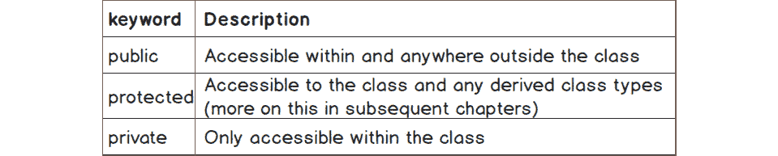
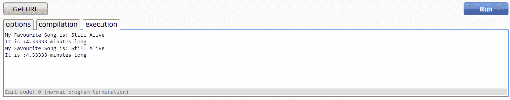
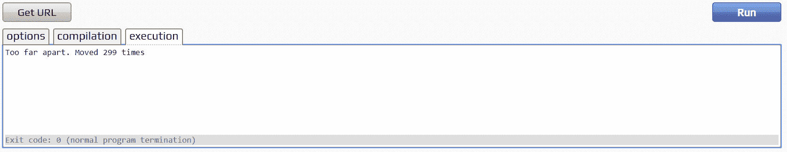
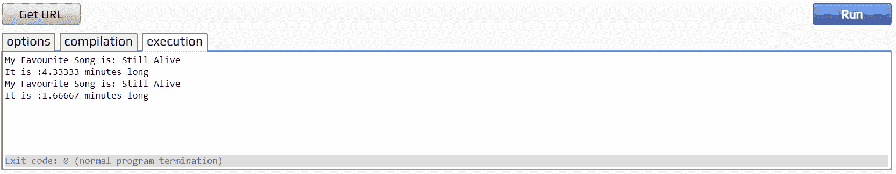

# 9。面向对象原则

概观

本章介绍了设计类的最佳实践，并将向您概述抽象和封装，在哪里使用它们，以及它们如何使您的自定义 C++类型受益。关于类的更多细节以及它们如何适应面向对象的编程范式也将被涵盖。

# 简介

前一章提供了关于对象构造的详细信息，以及关于 C++提供的定义这些对象的不同关键字的信息。我们了解到，在创建自己的类型时，我们必须小心，并确保它们被适当地构造和销毁。本章将进一步深入面向对象编程，解释设计类时应该牢记的重要原则，以便最有效地利用**面向对象编程** ( **OOP** )范例。

在本章中，我们将进一步介绍定义我们自己的类型的最佳实践。通过这些知识，我们可以编写防止意外使用的类，并且，使用公共和私有函数以及成员变量，我们可以清楚地表明我们打算如何使用一个类。

封装允许我们隐藏我们不希望用户直接访问的数据，而抽象为类的用户提供了一个接口，该接口公开了类的所有重要用途，但隐藏了细节。这两个主题都将在本章中涉及，同时还有一些关于类的更详细的解释。

# 类和面向对象

类是一种将数据分组并提供操作该数据的功能的方法。类类型是对象的 C++表示。类本质上是对象的同义词。在前一章中，`Track`类是`Track`类型对象的原型。

注意

原型一词是一个描述性术语，以方便解释，而不是一个官方术语。

注意原型这个词很重要，因为它暗示了可重用性的概念，这是面向对象设计方法的主要好处之一。一旦一个对象有了它的原型基础，那么细节就可以在不改变底层描述的情况下暴露出来。从原型(**类**)用自己的细节(**数据**)构建的对象被称为对象或类的实例。

以下是前一章中使用的`Track`类:

```cpp
#include <iostream>
#include <string>
using namespace std;
class Track
{
public:
    Track(float lengthInSeconds, string trackName)
    {
        m_lengthInSeconds = lengthInSeconds;
        m_trackName = trackName;
    }
    float m_lengthInSeconds;
    string m_trackName;
};
```

如果让你从根本上描述`Track`物体，你很可能会把它描述成一个有名字和长度的东西。这描述了组成类的成员变量。当被要求描述一个特定的轨道时，比如`Track track(180.0f, "Still Alive")`，很可能你会把它描述为**一个名为《还活着》的轨道，它有 3 分钟长**。这显然是一个对象实例的描述。从根本上说，它仍然是一个有名称和长度的轨道，但现在描述更详细，因为细节已经设定。使用以下片段构建的另一个`Track`怎么样？

```cpp
    Track anotherTrack(260.0f, "Want You Gone");
```

同样，很有可能我们会把它描述为**一首 4 分 20 秒长的名为《想要你离开》的曲目**。当描述一个对象时，知道预期是什么使得描述它(即实现它)变得更加简单。同样的概念也适用于面向对象设计的类，因为我们知道如何存储对象的细节，以及我们想要访问的细节的名称。这也扩展到创建可以在多个程序中使用的类，而不仅仅是在同一个程序中，本质上是创建一个“代码库”，可以用来执行以前编写的任务，例如，数学类或文件解析类。这是**复用**的基础。

在这一章的下一部分，我们将讨论一系列概念中的一个，这些概念被称为首字母缩写 **SOLID** 。这个首字母缩略词及其思想是由罗伯特·c·马丁创造的，他通常被称为鲍勃叔叔**【马丁 97】**。这个首字母缩略词是前五个面向对象设计原则的简写，如下所示:

*   **S**–单一责任原则
*   **O**–开闭原理
*   **L**–利斯科夫替代原则
*   **I**–界面分离原理
*   **D**–依赖倒置原理
*   我们不会涵盖所有这些，但是 **S** (对于单一责任原则)对本章特别重要。

## 固态硫

固体首字母缩写中的 S 代表**单一责任原则** ( **SRP** ) **【马丁 97】**。SRP 规定“*一个班应该只有一个也只有一个变更的理由，也就是说一个班应该只有一个工作。*”

回到**可重用性的概念**可以阐明这个原则的重要性。如果为了某种目的试图重用一些代码，它不应该带来一堆需要维护的额外责任或者可能是冗余的代码。此外，这些额外的职责可能依赖于其他类。因此，他们也需要搬进新项目。显然，这种依赖类的循环是不可取的。任何具有我们需要的功能的类都应该能够独立使用(*...一个班应该只有一个工作*”)。有时候，给一个班级一点额外的责任似乎是无害的。然而，应该仔细考虑将这个责任抽象并交给另一个类，然后这个类可以被需要它提供的功能的其他类重用。

## 练习 62:创建打印值的类

在本练习中，我们将创建一个类，用于打印我们的类中的值。SRP 上的前一段指出，类应该只有一项工作——一项职责——因此，让我们演示一种方法，通过从类本身中移除打印到控制台的职责，并将该职责赋予另一个类，我们可以实现这一点。虽然这个练习可能很简单，但是如果我们愿意的话，可以轻松地将打印到控制台的类替换为输出到文件的类，这对我们来说是非常有用的。以下是完成练习的步骤:

注意

这个练习的完整代码可以在这里找到:[https://packt.live/2pD3LlP](https://packt.live/2pD3LlP)。

1.  Add the `ValuePrinter` class to an empty file in `cpp.sh`. It is very simple and only consists of overloaded functions to print a message plus a `float`, an `int`, or a `string`. It will look like the following:

    ```cpp
    #include <iostream>
    #include <string>
    using namespace std;
    class ValuePrinter
    {
    public:
        void Print(string msg, float f)
        {
            cout << msg << " : " << f << endl;
        }
        void Print(string msg, int i)
        {
            cout << msg << " : " << i << endl;
        }
        void Print(string msg, string s)
        {
            cout << msg << " : " << s << endl;
        }
    };
    ```

    现在让我们创建一个可以利用这个`ValuePrinter`的类。

2.  创建一个名为`Article`的类，并为其提供标题、页数、字数和作者的成员变量。我们还将编写一个构造函数来初始化我们的成员变量，并添加`ValuePrinter`作为成员变量。这个类应该如下:

    ```cpp
    class Article
    {
    public:
        Article(string title, int pageCount, int wordCount, string author)
        {
            m_title = title;
            m_pageCount = pageCount;
            m_wordCount = wordCount;
            m_author = author;
        }
        string m_title;
        int m_pageCount;
        int m_wordCount;
        string m_author;
        ValuePrinter valuePrinter;
    ```

3.  接下来我们想在`Article`内部创建一个函数，使用`ValuePrinter`成员对象打印我们的成员变量。我们将调用这个函数`ShowDetails`，它应该看起来像下面的例子:

    ```cpp
        void ShowDetails()
        {
            valuePrinter.Print("Article Title", m_title);
            valuePrinter.Print("Article Page Count", m_pageCount);
            valuePrinter.Print("Article Word Count", m_wordCount);
            valuePrinter.Print("Article Author", m_author);
        }
    };
    ```

4.  我们现在可以在`main`函数中测试这一点，以查看使用`ValuePrinter` :

    ```cpp
    int main()
    {
        Article article("Celebrity Crushes!", 2, 200, "Papa Ratsea");
        article.ShowDetails();
        return 0;
    }
    ```

    打印出的值
5.  Run the complete program. You should obtain the following output:

    

图 9.1:使用值打印机打印值

作为真正巩固这个概念的附加练习，尝试实现一个类型有一个`string`成员变量和一个保存区域的`float`的`Shape`类，然后重用`ValuePrinter`编写一个`Shape` `ShowDetails`函数。

我们可以看到在前面的练习中呈现的模式是多么的有用。我们已经将打印到控制台的责任从`Article`类转移到了另一个类。如果我们需要改变`ValuePrinter`的内部运作方式，那么`Article`就根本不需要改变。以这种方式使用`ValuePrinter`可以很好地进入我们接下来的两个主题:**封装**和**抽象**。

## 封装

作为面向对象程序设计中的一个基本概念，封装对于理解非常重要，应该应用于您设计的大多数类。封装结合了类的数据和成员函数来处理这些数据。只能通过类提供的成员对类中的数据进行操作；成员数据不应直接访问。

这就是所谓的**数据隐藏**，C++给了我们一些关键词，当我们编写实现这一点的类时，可以利用这些关键词。这些关键词被称为**访问修饰语**。下表(*图 9.2* )显示了这些关键词及其含义:



图 9.2:描述不同关键字的表格

使用前面的表格和封装的解释，考虑下面的`Track`类，我们一直在使用它:

```cpp
#include <iostream>
#include <string>
using namespace std;
class Track
{
public:
    Track(float lengthInSeconds, string trackName)
    {
        m_lengthInSeconds = lengthInSeconds;
        m_trackName = trackName;
    }
    float m_lengthInSeconds;
    string m_trackName;
};
```

符合这个原则吗？不，不是。保存数据的两个成员变量都在`public`关键字下，因此，如图 9.2 所示，可以从类内和类外的任何地方访问。另一段代码完全有可能抓取一个`Track`实例并弄乱它，唯一的限制是类型。下面的`main`函数使用了`Track`类，并展示了从`Track`类中获取数据并修改它是多么容易:

```cpp
int main()
{
    // create
    Track t(260.0f, "Still Alive");
    cout << "My Favourite Song is: " << t.m_trackName << endl;  
    // mess with it
    t.m_lengthInSeconds = 9405680394634.4895645f; 
    // Song is now pretty much 300 millennia long!
    t.m_trackName = "S-Club Party"; // OH NO!!
    cout << "My Favourite Song is: " << t.m_trackName;
    return 0;
}
```

我们对封装的定义是**成员数据不应该被直接访问**。*图 9.2* 向我们展示了要使成员变量从类外部不可访问，我们可以使用`private`关键字。下面的代码片段显示了`private`关键字用于阻止从类外部访问成员变量，然后显示了试图改变它们的`main`函数:

注意

建造师依然是**公众**。**私人**建造者是另一章的话题。

```cpp
#include <iostream> 
#include <string> 
using namespace std; 
class Track 
{
public: 
    Track(float lengthInSeconds, string trackName) 
    { 
        m_lengthInSeconds = lengthInSeconds; 
        m_trackName = trackName; 
    } 
private: 
    float m_lengthInSeconds; 
    string m_trackName; 
}; 
int main() 
{
    // create 
    Track t(260.0f, "Still Alive"); 
    cout << "My Favourite Song is: " << t.m_trackName << endl; 
    // mess with it - Agh! thwarted, compiler error: these variables are private 
    t.m_lengthInSeconds = 9405680394634.4895645f; 
    t.m_trackName = "S-Club Party"; 
    cout << "My Favourite Song is: " << t.m_trackName; 
    return 0; 
}
```

运行此代码会导致编译器出现如下错误:

```cpp
'float Track::m_lengthInSeconds' is private within this context
'std::string Track::m_trackName' is private within this context
```

现在成员变量是`private`，任何试图直接设置这些变量的人都将面临编译器错误。这些数据现在是隐藏的，一旦在构造函数中设置了变量，就不能直接更改或访问它们。然而，这提出了一个新问题；既然变量无法从类外部访问，就不能将它们打印到控制台或读入可能需要使用它们的地方。例如，前面代码片段中的下面一行代码将不再编译:

```cpp
    cout << "My Favourite Song is: " << t.m_trackName << endl;
```

成员函数也可以是`private`，因为可能有我们希望保留在类内部的函数。函数对于拆分代码或实现可在类中的其他函数中重用的功能很重要。通过制作这些功能`private`，我们保证它们只会被类本身使用，不会暴露给类的用户；他们不是`public`界面的一部分。

## 练习 63:使用私有成员变量创建职位类

在本练习中，我们将创建一个名为`Position`的类，该类保存 2D 笛卡尔坐标:x 和 y。x 和`y`都是将在构造函数中设置的`private`成员变量，我们将创建一个`public`成员函数，该函数采用另一组浮点数(`x`、`y`)并将它们和我们的位置之间的欧几里德距离作为`float`类型返回。以下是执行本练习的步骤:

注意

这个练习的完整代码可以在这里找到:[https://packt.live/2OwnHPU](https://packt.live/2OwnHPU)。

1.  首先，我们可以通过将`Position`声明为类来创建我们类的存根。在`cpp.sh`中创建新项目，并输入下面的类存根和我们将要使用的`#include`语句。我们需要`cmath`的平方根函数:

    ```cpp
    #include <iostream>
    #include <cmath>
    class Position
    {
    };
    ```

2.  接下来，我们可以创建组成我们的坐标的成员变量，`x`和`y`。我们希望这些成员变量是私有的，所以我们将在它们上面使用`private`关键字。两个变量都是浮点数，我们将在它们前面加上`m_`，用于表示一个变量是成员变量:

    ```cpp
    #include <iostream>
    #include <cmath>
    class Position
    {
    private:
        float m_x;
        float m_y;
    };
    ```

3.  我们需要一种方法来设置这些变量。我们将在构造函数中使用初始化列表语法来实现这一点。我们的构造函数需要是`public`，所以我们将在我们的构造函数上面使用该关键字，如下面的代码片段所示:

    ```cpp
    #include <iostream>
    #include <cmath>
    class Position
    {
    public:
        Position(float x, float y) : m_x(x), m_y(y) {}
    private:
        float m_x;
        float m_y;
    };
    ```

4.  我们现在需要创建我们的`distance`函数。这是一个`public`成员函数，它将另一个`x`坐标和任意一个`y`坐标作为参数，并将该坐标到我们类中存储的位置的距离返回为(`m_x`，`m_y`)。在实现功能之前，我们可以先创建这个成员函数的存根:

    ```cpp
    #include <iostream>
    #include <cmath>
    class Position
    {
    public:
        Position(float x, float y) : m_x(x), m_y(y) {}
        float distance(float x, float y)
        {
            // we must return something at this point if we want it to         //compile
            return 0;
        }
    private:
        float m_x;
        float m_y;
    };
    ```

5.  We can now implement the `distance` function by using a derivation of the Pythagorean Theorem:

    

    图 9.3:勾股定理

6.  这将是我们两个位置之间的直线距离:

    ```cpp
        float distance(float x, float y)
        {
            float xDiff = x - m_x;
            float yDiff = y - m_y;
            return std::sqrt(((xDiff * xDiff) + (yDiff * yDiff)));
        }
    ```

7.  我们现在都准备好测试我们的新班级了。创建一个`main`函数，创建一个设置为(`10`，`20`)的`Position`对象，并打印从该对象到(`100`，`40`)的距离。下面是这样做的代码:

    ```cpp
    int main()
    {
        Position pos(10.0f, 20.0f);
        std::cout << "The distance from pos to (100, 40) is:"               << pos.distance(100.0f, 40.0f) << std::endl;
        return 0;
    }
    ```

8.  运行完整的代码。您将收到以下输出:


图 9.4:距离输出

在本练习中，我们通过将位置数据`private`添加到我们的`Position`类中来封装位置数据。任何希望使用这些值的人都必须通过我们提供的`public`功能来使用。我们如何在保持一定程度的控制的同时访问`private`数据成员？本章的下一部分将介绍一种可以提供解决方案的常见模式。

## 吸气剂和沉降剂

类以某种方式被利用，但是**封装**的概念声明成员数据不应该被直接访问。使成员变量**私有**确保了我们例子中的情况，但是我们最终渲染了`Track`类，因为它最明显的目的:保存关于轨道的可读数据。保护数据同时仍允许合理访问的常用技术是使用**获取器和设置器**。不出所料，getter 获取数据，setter 设置数据。获取者通常以单词`get`为前缀，设置者以单词`set`为前缀。这里是`Track`类，它的成员数据有 getters:

```cpp
#include <iostream>
#include <string>
using namespace std;
class Track 
{
public:
    Track(float lengthInSeconds, string trackName) 
    {
        m_lengthInSeconds = lengthInSeconds;
        m_trackName = trackName;
    }
    float getLength() 
    {
        return m_lengthInSeconds;
    }
    string getName() 
    {
    return m_trackName;
    }
private:
    float m_lengthInSeconds;
    string m_trackName;
};
int main() 
{
    // create 
    Track t(260.0 f, "Still Alive");
    cout << "My Favourite Song is: " << t.getName() << endl;
    cout << "It is :" << t.getLength() / 60.0 f << " minutes long";
    return 0;
}
```

在前面的代码中，`getLength`返回`m_lengthInSeconds`变量，`getName`返回`m_trackName`变量。这些函数都是`public`函数，因此可以在类外使用，允许我们打印它们的值，同时保留变量本身`private`，因此可以安全地从类外直接访问。

**设置器**允许设置一些数据。值得注意的是，直接设置器本质上会破坏封装，因为它会暴露要再次更改的变量。setter 允许公开的成员变量不允许的一件事是对要设置的数据进行验证。请在以下代码的帮助下考虑这一点:

```cpp
Example09_1.cpp
23     string getName() 
24     {
25         return m_trackName;
26     }
27 
28     void setName(string newTrackName) 
29     {
30         // if S-Club is not found set the track name - otherwise do nothing 
31         if (newTrackName.find("S-Club") == string::npos)
32         {
33             m_trackName = newTrackName;
34          }
35     }
36 
37     void setLength(float newTrackLength) 
38     {
39         if (newTrackLength < MAX_TRACK_LENGTH && newTrackLength > 0) 
40         // no prog metal for us! 
41         {
42             m_lengthInSeconds = newTrackLength;
43         }
44     }
The complete code for this example cam be found at: https://packt.live/2DLDVQf
```

在上例中，添加了`setName`和`setLength`。`setName`函数将一个字符串作为参数来设置`m_trackName`，但是首先，它会检查该参数是否等于`S-Club`，如果是这样，则不会设置变量。`setLength`函数将一个浮点数作为参数，并使用它来设置`m_trackLengthInSeconds`变量，但在设置该变量之前，它会验证该变量是否大于零且不大于`MAX_TRACK_LENGTH`。

运行前面的示例代码片段将产生以下输出:



图 9.5:使用 setter 方法的输出

在这里讨论的例子中，试图将数据设置为无效的东西(在这个上下文中)是行不通的，因此满足了前面概述的封装标准。我们的数据现在更安全了，只能以我们已经批准的方式使用公共接口进行设置。

注意

这些检查也可以在构造函数中执行，以确保数据在该点有效。

## 练习 64:位置类中的获取者和设定者

在*练习 63* 、*创建位置类*中，使用`Private`成员变量，我们创建了一个`Position`类和一个`distance`函数。我们的`distance`函数的问题是，我们不能将另一个`Position`类的对象值作为参数传递给它，因为计算距离所需的变量对我们不可用；他们是私人的。解决这个问题的一种方法是传递一个`Position`对象作为参数，这提出了一个关于 C++中私有元素的重要注意点:它们实际上可以被相同类型的类访问，因为这种访问控制是基于每个类的，而不是基于每个对象的。

不过，目前我们不会传入一个`Position`对象，因为为了便于讨论，我们假设我们不知道一个`Position`对象有多大，当我们只需要它的`x`和`y`值时，我们不想不必要地复制它。因此，在本练习中，我们将为我们的`Position`类实现一些 getters，并创建一个使用`distance`函数的示例程序，以确保两个位置不会相距太远。

注意

这个练习的完整代码可以在这里找到:[https://packt.live/2O63D7O](https://packt.live/2O63D7O)。

以下是完成练习的步骤:

1.  首先，我们可以从*练习 63* 、*创建位置类*中查看`Position`类，并将其复制到我们的新示例中:

    ```cpp
    #include <iostream>
    #include <cmath>
    class Position
    {
    public:
        Position(float x, float y) : m_x(x), m_y(y) {}
        float distance(float x, float y)
        {
            float xDiff = x - m_x;
            float yDiff = y - m_y;
            return std::sqrt(((xDiff * xDiff) + (yDiff * yDiff)));
        }
    private:
        float m_x;
        float m_y;
    };
    ```

2.  在这个类中，我们可以为名为`getX()`和`getY()`的私有成员变量添加一些 getters。他们只会返回我们的`m_x`和`m_y`变量。在我们的`distance`功能后添加它们，但确保它们仍在`public`关键字下:

    ```cpp
        float getX() { return m_x; }
        float getY() { return m_y; }
    ```

3.  此时，我们可以构造一个新的`Position`对象，并访问其变量以通过距离检查。让我们看看这在更新后的`main`函数中会是什么样子:

    ```cpp
    int main()
    {
        Position pos(10.0f, 20.0f);
        Position pos2(100.0f, 200.0f);
        std::cout << "The distance between pos and pos2 is: " 
            << pos.distance(pos2.getX(), pos2.getY());
        return 0;
    }
    ```

4.  在我们进入`main`函数之前，我们将为成员变量创建设置器。在我们的吸气剂下面添加沉降器，如图所示:

    ```cpp
        void setX(float x) { m_x = x; }
        void setY(float y) { m_y = y; }
    ```

5.  现在，对于我们的`main`函数，我们将定义我们的位置可以分开的最大距离(在这种情况下，将是 500 个单位)。然后，我们将在一个循环中更新我们的位置，如果我们到达这个最大距离，就停止。为此，我们将利用我们的吸气剂和设置剂，以及`distance`功能。我们将一个位置向另一个位置的相反方向移动，首先通过减去它们的 *x* 和 *y* 值(*方向(x，y)**=**(pos2X–pos1X，pos2Y–pos1Y)*)得到两个位置之间的方向，然后归一化。我们可以通过将两个位置之间的 *x* 和 *y* 除以距离来归一化(我们在上一步中得到了这个)。你可能会认为这是向量数学，但如果不是，别担心；重要的部分是我们吸气剂和沉降剂的使用。这是我们的`distance`检查的`main`功能:

    ```cpp
    int main()
    {
        float maxDistance = 500.0f;
        Position pos(10.0f, 20.0f);
        Position pos2(100.0f, 200.0f);
        bool validDistance = true;
        int numberOfTimesMoved = 0;
        while(validDistance)
        {
            float distance = pos.distance(pos2.getX(), pos2.getY());
            if(distance > maxDistance)
            {
                validDistance = false;
                break;
            }
            // get direction
            float xDirection = pos2.getX() - pos.getX();
            float yDirection = pos2.getY() - pos.getY();
            // normalize
            float normalizedX = xDirection / distance;
            float normalizedY = yDirection / distance;
            pos.setX(pos.getX() - normalizedX);
            pos.setY(pos.getY() - normalizedY);
            numberOfTimesMoved++;
        }
        std::cout << "Too far apart." << " Moved " << numberOfTimesMoved               << " times" ;
        return 0;
    }
    ```

6.  运行此`main`功能获得输出:



图 9.6:将计数打印到控制台

请注意，该程序还会输出位置在到达最大距离之前改变的次数。

# 返回值或参考值

决定如何返回 getter 的值很重要，并且需要一些关于可用选项的知识。在 C++中，我们可以通过值、指针和引用以及它们的`const`对应物来返回变量，我们将很快讨论；但是，我们不会在本章中介绍指针。如何返回变量的选择很大程度上取决于它的用例，本章的这一部分将在我们的`Track`类的上下文中讨论这一点，特别是它如何应用于我们的获取器和设置器。

## 按值返回

从`Track`类看下面的`getLength`方法:

```cpp
    float getLength() { return m_lengthInSeconds; }
```

这是**按值返回**。换句话说，这个方法返回`m_lengthInSeconds`值的副本。如果该值被分配给另一个变量，那么对`m_lengthInSeconds`的任何修改都不会反映在新变量中(反之亦然)，因为它是返回的值的副本。这里有一个例子:

```cpp
int main()
{
    // create
    Track t(260.0f, "Still Alive");
    cout << "My Favourite Song is: " << t.getName() << endl;
    cout << "It is :" << t.getLength() / 60.0f << " minutes long" << endl;
    // create a new variable and assign to it     // the value of the track length
    float tLength = t.getLength();
    // modify it
    tLength = 100.0f;
    cout << "My Favourite Song is: " << t.getName() << endl;
    cout << "It is :" << t.getLength() / 60.0f << " minutes long";
    return 0;
}
```

前面的代码将产生以下输出:


图 9.7:歌曲的打印时长

修改`tLength`并没有修改`m_lengthInSeconds`的值(反之亦然)。这是安全的，通常也是可取的行为。我们不希望类外的东西能够修改`private`成员变量。

## 参照返回

除了返回数据或对象的值，方法还可以返回对数据或对象的引用。返回引用不会复制数据的值；它将返回一个引用，允许数据继续被修改。通过引用返回很快，因为它不需要执行`copy`操作。通常，它用于返回大型结构或类，在这些结构或类中，复制对性能有害。以下方法是`getLength`功能，修改后返回一个引用:

```cpp
float& getLength() { return m_lengthInSeconds; }
```

这允许以下列方式修改数据:

```cpp
int main()
{
    // create
    Track t(260.0f, "Still Alive");
    cout << "My Favourite Song is: " << t.getName() << endl;
    cout << "It is :" << t.getLength() / 60.0f << " minutes long" << endl;
    // getLength now returns a reference and can be modified
    t.getLength() = 100.0f;
    cout << "My Favourite Song is: " << t.getName() << endl;
    cout << "It is :" << t.getLength() / 60.0f << " minutes long";
    return 0;
}
```

前面的代码将产生以下输出:



图 9.8:修改数据以打印歌曲时长

从输出中可以看出，轨道长度已被修改。封装和**数据隐藏**已经被抛出窗外。我们的数据不应该被这样修改。**只能通过类提供的方法对类中的数据进行操作。成员数据不应直接访问。**前面的例子完全打破了这个概念。

值得注意的是，将返回的引用分配给非引用类型变量实际上只会分配一个副本，而不是引用。以下面的片段为例:

```cpp
int main()
{
    // create
    Track t(260.0f, "Still Alive");
    cout << "My Favourite Song is: " << t.getName() << endl;
    cout << "It is :" << t.getLength() / 60.0f << " minutes long" << endl;
    // getLength returns a reference but this actually is a copy
    float tLength = t.getLength();
    tLength = 100.0f;
    cout << "My Favourite Song is: " << t.getName() << endl;
    cout << "It is :" << t.getLength() / 60.0f << " minutes long";
    return 0;
}
```

该代码片段产生以下输出:


图 9.9:歌曲的打印时长

前面的代码片段使用了`getLength`函数，该函数返回一个引用。然而，从输出中我们可以看到，它实际上并没有给`tLength`赋值。这可能看起来很明显，因为`tLength`实际上不是一个参考类型，但它值得知道，这样你就不会在未来被发现。

将引用分配给另一个引用类型时，任何修改都将反映在类成员数据中，因为新引用本质上只是同一事物的另一个名称。这里有一个例子:

```cpp
int main()
{
    // create
    Track t(260.0f, "Still Alive");
    cout << "My Favourite Song is: " << t.getName() << endl;
    cout << "It is :" << t.getLength() / 60.0f << " minutes long" << endl;
    // getLength now returns a reference and can be modified
    float& tLength = t.getLength();
    tLength = 100.0f;
    cout << "My Favourite Song is: " << t.getName() << endl;
    cout << "It is :" << t.getLength() / 60.0f << " minutes long";
    return 0;
}
```

前面的代码片段产生了以下输出:


图 9.10:歌曲的打印时长

请注意，修改`tLength`也会修改`Track`对象的长度。

通过引用返回时要记住的另一件重要事情是不要通过引用返回函数的局部变量，因为一旦该变量超出范围(局部变量在函数末尾超出范围并被破坏)，引用将是对垃圾的引用。这里有一个例子来说明这一点:

```cpp
    float& getLengthInMinutes()
    {
        float lengthInMinutes = m_lengthInSeconds / 60.0f;
        return lengthInMinutes;
    } // lengthInMinutes out of scope here
```

谢天谢地，运行前面的代码通常会导致警告或错误。这个建议也适用于**临时**变量。例如，在计算表达式时，编译器将生成一个临时变量来存储表达式结果:

```cpp
    float& getLengthInMinutes()
    {
        // creates a temporary
        return m_lengthInSeconds / 60.0f;
    }  // temporary out of scope here
```

注意

这两个例子都可以通过值返回。

## const

如前所述，在某些情况下，类可能希望返回一个引用，例如当它返回的对象很大时，复制它会对性能产生影响。返回引用的问题是它破坏了封装。在需要返回引用但不可修改的情况下，我们可以使用 C++ `const`关键字。该关键字将数据标记为只读。解释`const`的各种用途，它是如何使用的，以及什么可以被标记为`const`需要很长时间，可能会相当混乱，但请记住，基本上这是一种明确如何使用一段数据的方式。

## 返回常量引用

我们知道如何以及何时通过引用返回，但是我们可以用不同的方式从函数中返回变量，那就是以`const`引用的形式。我们知道`const`将数据标记为只读，因此`const`引用是被标记为只读的引用—不可修改的引用。

这是我们在参考文献示例中使用的`getLength`函数，现在用`const`标记:

```cpp
const float& getLength() { return m_lengthInSeconds; }
```

下面的代码片段试图以与引用部分中的示例相同的方式使用这些数据:

```cpp
int main()
{
    // create
    Track t(260.0f, "Still Alive");
    cout << "My Favourite Song is: " << t.getName() << endl;
    cout << "It is :" << t.getLength() / 60.0f << " minutes long" << endl;
    // getLength now returns a const reference
    float& tLength = t.getLength();
    tLength = 100.0f;
    cout << "My Favourite Song is: " << t.getName() << endl;
    cout << "It is :" << t.getLength() / 60.0f << " minutes long";
    return 0;
}
```

如果运行此代码，我们将收到以下错误:

```cpp
error: binding 'const float' to reference of type 'float&' discards qualifiers
```

这个编译器错误告诉我们从`getLength()`返回的`const`引用只能绑定到另一个`const`引用。我们可以利用这一点；因为该引用将是`const`，所以它也将是只读的，从而保护数据。

下面是一个例子，说明我们如何通过将返回的`const`引用分配给另一个`const`引用来消除前面的编译器错误:

```cpp
int main()
{
    // create
    Track t(260.0f, "Still Alive");
    cout << "My Favourite Song is: " << t.getName() << endl;
    cout << "It is :" << t.getLength() / 60.0f << " minutes long" << endl;
    // getLength now returns a const reference
    const float& tLength = t.getLength();
    tLength = 100.0f;
    cout << "My Favourite Song is: " << t.getName() << endl;
    cout << "It is :" << t.getLength() / 60.0f << " minutes long";
    return 0;
}
```

请注意，该示例还试图为`const`引用分配一个新值，导致另一个编译器错误——这与我们的预期完全一样:

```cpp
error: assignment of read-only reference
```

注意

使用以下语法会引发相同的错误:`t.getLength() = 100.0f;`。

## 常量函数

成员函数也可以声明为`const`。声明为`const`的成员函数不允许修改成员数据，即使它们是类本身的一部分。这使得程序员清楚函数的意图，任何修改类的人都应该知道函数的意图是`const`，因此不应该修改成员数据，因为这会对整个应用程序产生影响。这里是标记为`const`的`getLength`功能。注意`const`是在声明之后表示函数本身为`const`，而不是返回的`float`值:

```cpp
    float getLength() const
    {
    // modify member data in const function
    m_lengthInSeconds = 10.0f;
    return m_lengthInSeconds;
    }
```

运行此程序会产生以下错误:

```cpp
error: assignment of member 'Track::m_lengthInSeconds' in read-only object
```

这个代码片段产生的编译器错误是`const` `getLength`成员函数试图修改一些成员数据的结果。

注意`const`成员函数可以在非常数和`const`对象上调用，而非常数成员函数只能在非`const`对象上调用。

假设我们在`Track`类中有以下非常数成员函数:

```cpp
    float getLength() { return m_lengthInSeconds; }
```

`main`函数创建一个`const` `Track`对象，并尝试调用非`const`函数:

```cpp
int main()
{
    // create
    const Track t(260.0f, "Still Alive");
    cout << "It is :" << t.getLength() / 60.0f << " minutes long" << endl;
    return 0;
}
```

这将导致以下编译器错误，因为`Track`对象`t`是`const`并试图调用非`const`成员函数:

```cpp
error: passing 'const Track' as 'this' argument discards qualifiers
```

`const`是 C++中一个重要的、偶尔会让人困惑的部分。前面的例子和段落只是一个小例子。测试创建`const`对象并通过`const`引用返回，以获得语法的感觉。

## 抽象

**抽象**和**封装**是同一个硬币的两面。将数据封装在类中可以抽象出数据的功能，只向用户公开类设计所需的方法，并隐藏类对其成员数据执行的所有基本实现细节。**抽象只为用户提供了一个必不可少的界面，隐藏了背景细节**。

接下来的示例将使用一个`Playlist`类来说明这一点，该类可以保存`Track`对象以及以下功能:

*   添加轨道并按名称删除它们
*   按字母顺序或相反的字母顺序对轨道进行排序
*   按最短或最长轨道对轨道进行排序
*   打印当前轨道的名称及其长度

`Playlist`类将不负责创建`Track`对象。和前面的例子一样，`main`函数将创建这些`Track`对象。`Track`对象已经从前面的例子简化为**不变的**(创建后不能改变)。这是通过使用`const`实现的，如下面的片段所示，这是我们的`Track`类在本章这一部分的上下文中的声明:

```cpp
#include <iostream>
#include <string>
#include <vector>
#include <algorithm>
using namespace std;
class Track 
{
public:
    Track(float lengthInSeconds, string trackName) 
    {
        m_lengthInSeconds = lengthInSeconds;
        m_trackName = trackName;
    }
    float getLength() const 
    {
        return m_lengthInSeconds;
    }
    string getName() const 
    {
        return m_trackName;
    }
private:
    float m_lengthInSeconds;
    string m_trackName;
};
```

`Playlist`类比较长，使用了 STL(排序和**向量**)的一些特性，这些特性在本书中还没有涉及到。理解类中的每一行代码并不重要(尽管我们敦促您看得更远一点，并尝试理解一些代码来拓宽您的知识)；更重要的是要理解对最终用户隐藏所有这些细节的概念。以下是`Playlist`类的定义:

```cpp
Example9_02.cpp
1  class Playlist 
2  { 
3  public:   
4      void AddTrack(const Track* track) 
5      { 
6          if(!any_of(m_tracks.begin(), m_tracks.end(), [&track](const Track* t){            return t->getName() == track->getName(); })) 
7          { 
8             m_tracks.push_back(track); 
9             return;
10         } 
11         cout << "Track: " << track->getName()                 << " Not added as already exists in playlist"; 
12     } 
13 
14     void RemoveTrack(const string trackName) 
15     { 
16         m_tracks.erase(remove_if(m_tracks.begin(), m_tracks.end(), 
17         [&trackName](const Track* t){ return t->getName() == trackName; })); 
18     } 
19 
20     void PrintTracks() const 
21     {
22         for (auto & track : m_tracks) 
23         {
24             // round seconds 
25             int seconds = static_cast<int>(track->getLength()); 
26             std:: cout << track->getName() << " - " << seconds / 60 << ":"                << seconds % 60 << endl; 
27         } 
28     } 
The complete code can be found at: https://packt.live/3a4XPVa
```

这个班有很多，但这就是重点。很明显，所有这些功能不需要为`Playlist`类的用户所知，只需要知道作为公共接口提供的方法。下面是这个`Playlist`类的一个示例用例。从使用该类的人的角度来看，如下面的代码片段所示，`Playlist`类没有太多内容。所有的细节都被提取出来，现在以一个简单的`public`界面的形式呈现给用户:

```cpp
int main()
{
    Track t(100.0f, "Donut Plains");
    Track t2(200.0f, "Star World");
    Track t3(300.0f, "Chocolate Island");
    Playlist p;
    p.AddTrack( &t);
    p.AddTrack( &t2);
    p.AddTrack( &t3);
    p.SortAlphabetically(false);
    p.PrintTracks();
    p.SortAlphabetically(true);
    p.PrintTracks();
    p.SortByLength(false);
    p.PrintTracks();
    p.SortByLength(true);
    p.PrintTracks();
    return 0;
}
```

运行前面的代码片段后，您将获得以下输出:


图 9.11:播放列表类的输出

在外面，`Playlist`类使用起来很简单。所有的细节都在类本身内部，还有`Track`对象，从而确保`Playlist`类自己的数据不受外部干扰。这种类型的细节抽象意味着这些细节可以在不使用类的情况下进行更改，甚至不需要知道发生了更改。好的**封装**和**抽象**将代码从需要知道被使用对象的任何具体信息中分离出来，如果具体信息不重要，那么它们可以很容易地被更改。例如，`Track`对象可以以与前面示例完全不同的方式存储在`Playlist`类中，任何使用`Playlist`的东西都不需要了解它。

## 活动 9:一个基本的 RPG 战斗系统

既然您已经了解了封装和抽象，我们可以将它与我们关于创建类、获取器和设置器、构造器及其各种形式的知识结合起来。为了帮助巩固我们关于类的知识，我们现在将从头开始创建一个类，同时努力将我们所学到的关于最佳实践的一切都牢记在心。我们要创建一个非常简单的 **RPG 战斗系统**。一个 RPG 是一个角色扮演游戏，在这些游戏中，通常会有英雄和怪物轮流发动攻击和使用物品的战斗。这些攻击和物品的属性会以某种方式影响它们；我们将实现这个战斗系统的一个非常简单的版本的开始。完成活动后，字符名称及其项目的统计数据应显示在屏幕上。

注意

这个练习的完整代码可以在这里找到:[https://packt.live/3312hzy](https://packt.live/3312hzy)。

以下是一些有助于您完成活动的步骤:

1.  为字符、攻击和项目创建类，每个类中有一个`name`变量，可以在构造函数中设置。
2.  给攻击一个攻击统计(T0)变量，给物品一个治疗统计(T1)变量。添加适当的获取器、设置器和构造器。
3.  让字符在其构造函数中接受一系列攻击和项目，并存储它们，以便在需要使用时按名称查找。
4.  创建攻击其他角色、使用物品和对攻击做出反应的函数。
5.  创建名为`strengthMultiplier`和`defenseMultiplier`的成员变量。这些应该会影响角色的攻防统计。
6.  创建一个函数，将字符的名称和其他统计信息打印到控制台。
7.  用几个不同的字符测试`main`函数中的所有内容。

以下是一些帮助您完成活动的提示:

1.  记住三的规则。
2.  回顾前几章，提醒自己如何在存储字符名称时创建动态`char`数组。
3.  Feel free to use any containers that you may already be familiar with, but if intending to keep working with arrays (the solution uses arrays), then `memcpy` is the equivalent function to `strcpy` that you will need if the array is not a `char` array.

    注意

    这个活动的解决方案可以在第 549 页找到。然而，解决方案只是创建该系统的一种方式，不应被视为最终答案。

# 总结

在 C++中定义类型时，最佳实践的主题非常广泛，我们在本章中已经介绍了大量内容，以帮助您创建健壮且可维护的类。我们通过使用`private`关键字来封装数据，以确保我们决定如何访问该数据。我们查看了 getters 和 setters，以提供对数据的访问，并以一种可验证的方式对其进行修改。我们还研究了如何使用引用来访问我们的数据并直接修改它，以及当我们只希望在其他地方读取或使用数据而不更改对象的内部数据时，如何通过值返回数据。我们发现`const`可以用来确保任何我们不希望被改变的成员变量可以和成员函数一起被标记为这样。

在下一章中，我们将看看可以使用什么来确保我们创建的任何动态对象都可以使用智能指针正确销毁。指针是 C++的主要部分，有自己的陷阱和最佳实践。您将了解普通指针和智能指针之间的区别，以及它们为什么重要。