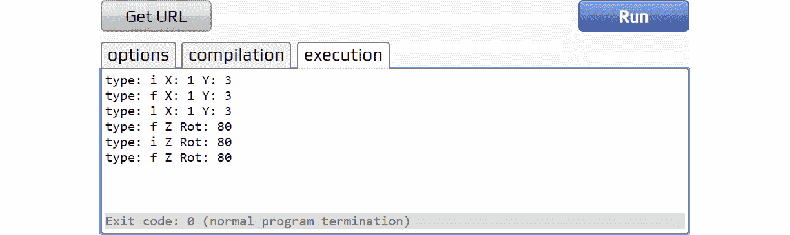
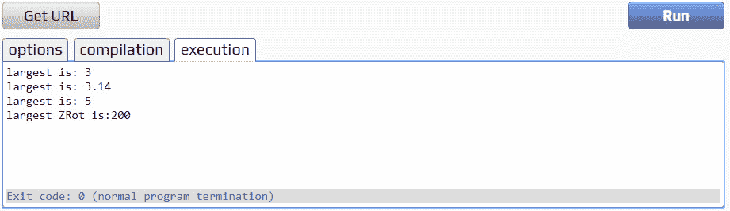
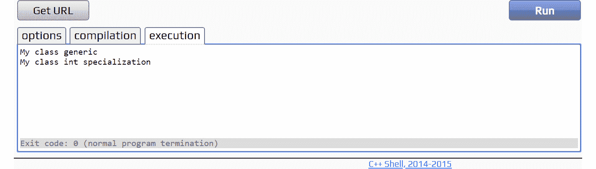
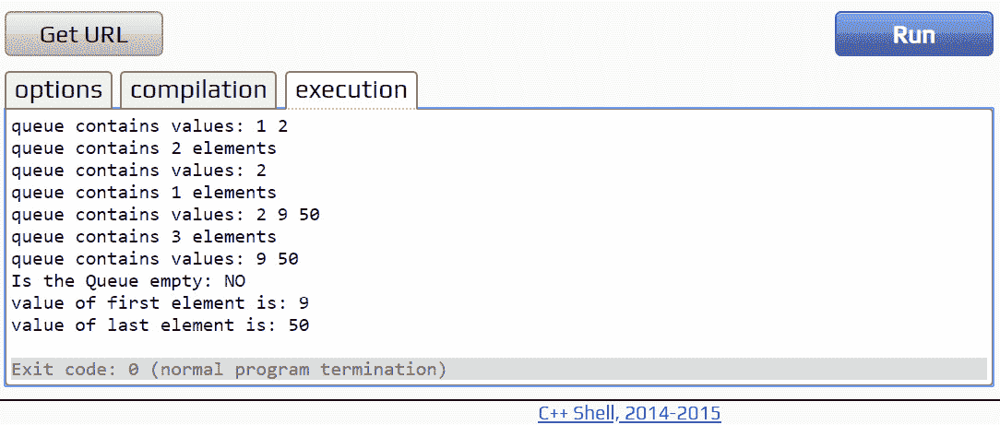

# 11 时。模板

概观

本章概述了模板，并给出了一些如何使用模板以及在哪里使用模板的示例。到本章结束时，您将有足够的信心在可能适用的地方实现模板类型和函数，并拥有一些基础知识。

# 简介

在前几章中，介绍了 **OOP** ，以及示例和用例。详细介绍了类和创建类的最佳实践。在这一章中，我们将看到 OOP 的另一个强大特性——模板。

**模板**允许对不同的数据类型重用代码。使用模板的一个例子是 C++ 标准模板库(或 STL)。这个库是一组提供通用容器和算法的模板类。该库可以用于任何数据类型，这是使用模板函数和类实现的。在本章中，我们将介绍模板类和模板函数的创建，以允许创建可重用的代码。

具体来说，我们将描述以下主题:模板类、模板函数和模板专门化。

模板的核心是一种通用编程的形式。它允许我们重用一组功能，而这些功能不需要特定于一种类型。例如，一个类可以保存数据并为类型为`int`的变量提供一些功能。如果我们需要对`float`类型的变量执行相同的功能，那么我们需要复制该代码，用`float`替换`int`。但是，使用模板，我们可以重用这些代码，并允许编译器为每种类型生成我们需要的代码。我们将从展示如何声明模板开始，然后通过例子和练习来更详细地介绍。

# 语法

创建模板需要使用一个新的 C++ 关键字:`template`。这个关键字让编译器知道这个类或函数打算用作模板，模板*定义*中模板参数的实例应该用模板*实例化*提供的实际数据类型替换:

```cpp
template <typename T>
template <class T>
```

在前面的例子中，`T`是模板参数。在模板类或函数中使用类型`T`的任何地方，它都将被实际类型替换。通过一些例子，这将变得更加清晰。`T`是模板参数的一个非常常见的名称，但是这个名称可以是您想要的任何名称。

## 模板类

这里提供了一个非常简单的模板类示例:

```cpp
template<typename T>
class Position
{
public:
    Position(T x, T y) 
    {
        m_x = x;
        m_y = y;
    }
    T const getX() { return m_x; }
    T const getY() { return m_y; }
private:
    T m_x;
    T m_y;
};
```

请注意模板语法的使用。在这种情况下，我们声明`T`出现的任何地方都可以用我们在创建这个类的实例时选择的类型来替换。这个类是 2D 位置值的简单持有者。根据所需的精度，这些位置值可以存储为`int`、`float`甚至`long`类型。通过使用模板，通过在创建类实例时传递预期的类型，该类可以用于所有这些类型。让我们用一个小练习来测试一下。

## 练习 71:为位置对象创建不同的类型

使用前面的模板类，编写一个`main`函数，创建几个不同的`Position`对象。每个都应该使用不同的模板参数(`T`的替换)，然后打印出成员变量的类型，该类型现在是模板参数的类型。要获取变量的类型，我们可以使用包含在`<typeinfo>`头中的`typeid`运算符。

注意

练习的完整代码可以在[https://packt.live/2rhi6Vm](https://packt.live/2rhi6Vm)找到。

以下是完成练习的步骤:

1.  声明一个将`T`替换为`int`的`Position`对象:

    ```cpp
    int main()
    {
        Position<int> intPosition(1, 3);
    ```

2.  声明一个将`T`替换为`float`的`Position`对象:

    ```cpp
        Position<float> floatPosition(1.5f, 3.14f);
    ```

3.  声明一个将`T`替换为`long`的`Position`对象:

    ```cpp
        Position<long> longPosition(1, 3);
    ```

4.  包括我们文件顶部的`<typeinfo>`标题:

    ```cpp
    #include <typeinfo>
    ```

5.  在`Position`的每个实例中输出我们的`m_x`变量的类型:

    ```cpp
        cout << "type: " << typeid(intPosition.getX()).name() <<  " X: "          << intPosition.getX() << " Y: " << intPosition.getY()          << endl;
        cout << "type: " << typeid(floatPosition.getX()).name() <<  " X: "          << floatPosition.getX() << " Y: " << floatPosition.getY()          << endl;
        cout << "type: " << typeid(longPosition.getX()).name() <<  " X: "          << longPosition.getX() << " Y: " << longPosition.getY()          << endl;
    ```

6.  The complete program looks like this:

    ```cpp
    #include <iostream>
    #include <string>
    #include <typeinfo>
    using namespace std;
    template<typename T>
    class Position
    {
    public:
        Position(T x, T y)
        {
            m_x = x;
            m_y = y;
        }
        T const getX() { return m_x; }
        T const getY() { return m_y; }
    private:
        T m_x;
        T m_y;
    };
    int main()
    {
        Position<int> intPosition(1, 3);
        Position<float> floatPosition(1.5f, 3.14f);
        Position<long> longPosition(1, 3);
        cout << "type: " << typeid(intPosition.getX()).name() << " X: "          << intPosition.getX() << " Y: " << intPosition.getY()          << endl;
        cout << "type: " << typeid(floatPosition.getX()).name() << " X: "          << floatPosition.getX() << " Y: " << floatPosition.getY()          << endl;
        cout << "type: " << typeid(longPosition.getX()).name() << " X: "          << longPosition.getX() << " Y: " << longPosition.getY()          << endl;
        return 0;
    }
    ```

    运行上述代码后，您将获得以下输出:


图 11.1:三种位置类型

在我们的练习中，创建了三个`Position`类型，每个类型都有不同的模板参数类型:`int`、`float`和`long`。`#include <typeinfo>`行允许通过`name()`函数访问传入类型的名称(注意这些名称不能保证在编译器之间是相同的)。通过传递`Position`类的`x`值来打印该函数的值表明`T`的类型确实已经被传递给模板类的类型所替换。输出显示`i`、`f`和`l`在本编译器中分别是`int`、`float`和`long`的名称。

## 多个模板参数

在前一节中，我们看到在示例中使用了单个模板参数。但是，也可以使用多个模板参数。在以下示例中，有一个附加的模板参数`U`，它被用作`Position`类中`z`旋转的数据类型:

```cpp
#include <iostream>
#include <typeinfo>
using namespace std;
template<typename T, typename U>
class Position
{
public:
    Position(T x, T y, U zRot)
    {
        m_x = x;
        m_y = y;
        m_zRotation = zRot;
    }
    T const getX() { return m_x; }
    T const getY() { return m_y; }
    U const getZRotation() { return m_zRotation; } 
private:
    T m_x;
    T m_y;
    U m_zRotation;
};
```

就像`T`一样，当我们创建类的实例时，任何使用`U`的地方都会被另一种类型替换。前面的类和以前几乎一样，但是现在有一个`getZRotation`函数不返回`T`将要引用的类型。相反，它返回`U`将引用的类型。我们可以使用`main`函数进行测试，一旦创建了一个实例，该函数将再次打印我们类中的值类型:

```cpp
int main()
{
    Position<int, float> intPosition(1, 3, 80.0f);
    Position<float, int> floatPosition(1.0f, 3.0f, 80);
    Position<long, float> longPosition(1.0, 3.0, 80.0f);
    cout << "type: " << typeid(intPosition.getX()).name() <<  " X: "          << intPosition.getX() << " Y: " << intPosition.getY() << endl;
    cout << "type: " << typeid(floatPosition.getX()).name() <<  " X: "          << floatPosition.getX() << " Y: " << floatPosition.getY() << endl;
    cout << "type: " << typeid(longPosition.getX()).name() <<  " X: "          << longPosition.getX() << " Y: " << longPosition.getY() << endl;
    cout << "type: " << typeid(intPosition.getZRotation()).name()          <<  " Z Rot: " << intPosition.getZRotation() << endl;
    cout << "type: " << typeid(floatPosition.getZRotation()).name()          <<  " Z Rot: " << floatPosition.getZRotation() << endl;
    cout << "type: " << typeid(longPosition.getZRotation()).name()          << " Z Rot: " << longPosition.getZRotation() << endl;
    return 0;
}
```

上述代码产生以下输出:



图 11.2:U 型的输出

类模板非常强大，可以帮助您在整个 C++ 应用程序中重用代码。只要我们知道一个类在一个类型上执行的某些功能对不止一个类型有用，那么我们就有了一个模板类的候选。然而，模板类并不是我们实现这种重用的唯一方式；另一种方式是通过使用**模板功能**。

## 模板函数

拥有一个可以利用许多不同数据类型的类是非常有用的，但有时，它是一小段需要以“模板化”方式重用的代码。这就是**模板函数**进来的地方。模板函数允许特定的函数是通用的，而不是整个类。下面是一个模板函数的示例，它返回两个相同类型的数字之间的最大值:

```cpp
template<typename T>
T getLargest(T t1, T t2)
{
    if(t1 > t2)
    {
        return t1;
    }
    else
    {
        return t2;
    }
}
```

这里使用的语法与声明模板类时相同，但它被放在函数签名之上，而不是类声明之上。此外，就像模板类一样，在任何出现`T`的地方，它都将被模板参数的类型替换。

在下面的练习中，我们将使用`getLargest`类来比较之前创建的`Position`类的`x`和`y`变量。

## 练习 72:使用模板函数比较位置值

上例中的`getLargest`函数可以用来比较`Position`类的`x`和`y`变量。与我们在创建类的实例时所做的不同，我们在使用它时不必将类型传递给函数。编译程序时，编译器会创建一个适用于每种类型的函数版本。让我们写一个有助于理解这一点的例子。

注意

练习的完整代码可以在[https://packt.live/2O7pICT](https://packt.live/2O7pICT)找到。

以下是完成练习的步骤:

1.  首先，我们从`Position`类开始:

    ```cpp
    #include <iostream>
    #include <typeinfo>
    using namespace std;
    template<typename T, typename U>
    class Position
    {
    public:
        Position(T x, T y, U zRot)
        {
            m_x = x;
            m_y = y;
            m_zRotation = zRot;
        }
            T const getX() { return m_x; }
            T const getY() { return m_y; }
            U const getZRotation() { return m_zRotation; }
        private:
            T m_x;
            T m_y;
            U m_zRotation;
    };
    ```

2.  这个类之后，我们可以添加`getLargest`功能:

    ```cpp
    template<typename T>
    T getLargest(T t1, T t2)
    {
        if(t1 > t2)
        {
            return t1;
        }
        else
        {
            return t2;
        }
    }
    ```

3.  And finally, we can create some `Position` objects and pass the `x` value to `getLargest` while comparing the `m_zRotation` values of the `int` and `long` `Position` instances:

    ```cpp
    int main()
    {
        Position<int, float> intPosition(1, 3, 80.5f);
        Position<float, int> floatPosition(2.5f, 3.14f, 80);
        Position<long, float> longPosition(5, 3, 200);
        cout << "largest is: " << getLargest(intPosition.getX(),          intPosition.getY()) << endl;
        cout << "largest is: " << getLargest(floatPosition.getX(),          floatPosition.getY()) << endl;
        cout << "largest is: " << getLargest(longPosition.getX(),          longPosition.getY()) << endl;
        cout << "largest ZRot is:" << getLargest(intPosition.         getZRotation(), longPosition.getZRotation()) << endl; 
        return 0;
    }
    ```

    当您运行完整的代码时，您应该获得以下输出:



图 11.3:包含 x 和 y 变量比较的输出

我们可以看到，我们不需要指定传递给模板函数的类型；编译器为我们做了这项工作。此外，请注意，该函数的类型不是基于我们使用的实例的`T`值，而是基于我们传入的成员变量的实际类型。通过将`z`旋转值与`x`位置值进行比较，这一点就很清楚了，后者是不同类型的——编译器仍然为我们创建了正确的函数。

## 模板专门化

虽然模板在很大程度上是为了使类更通用而设计的，但是在某些情况下，一个特定的数据类型需要有自己的实现。模板专门化允许我们创建以我们已经理解的通用方式工作的模板，但是对于特定的数据类型可以有不同的行为。这在许多情况下都很有用，例如对于大多数数据类型来说很快的算法，但在特定情况下可能会很慢或效率低下。为了说明这一点，这里有一个简单的`compare`函数，在 C 风格字符串的情况下使用`strcmp`，在其他类型的情况下使用*等式运算符*进行比较。

**模板功能:**

```cpp
template<typename T>
bool compare(T t1, T t2)
{
    return t1 == t2;
}
```

这是一个例子，我们需要一个特殊的环境，因此需要一个特殊化，因为`const` `char*`是一个指针，等式运算符只比较指针地址，而不比较字符串的内容:

**专用模板功能:**

```cpp
template <>
bool compare<const char*>(const char* c1, const char* c2)
{
    return strcmp(c1, c2) == 0;
}
```

请注意，在使用专门的模板函数时，使用具体的数据类型来代替通用的`T`，但它不会作为模板参数传递到模板<>；相反，它在函数名之后传入。以下示例测试这些功能:

```cpp
#include <iostream>
#include <string.h>

using namespace std;
template<typename T>
bool compare(T t1, T t2)
{
    return t1 == t2;
}
template <>
bool compare<const char*>(const char* c1, const char* c2)
{
    return strcmp(c1, c2) == 0;
}
const char* TRUE_STR = "TRUE";
const char* FALSE_STR = "FALSE";
int main()
{
    cout << (compare(1, 1) ? TRUE_STR : FALSE_STR) << endl;
    cout << (compare("hello","hello") ? TRUE_STR : FALSE_STR) << endl;
    cout << (compare(1, 2) ? TRUE_STR : FALSE_STR) << endl;
    cout << (compare("hello","goodbye") ? TRUE_STR : FALSE_STR) << endl;
    return 0;
}
```

前面的代码将产生以下输出:


图 11.4:使用 strcmp 比较字符串时的输出和使用等式运算符比较其他类型时的输出

使用类代替函数也可以达到同样的效果，如以下示例所示:

```cpp
#include <iostream>
using namespace std;
template <class T>
class MyClass
{
public:
    MyClass() { cout << "My class generic" << endl; }
};
template <>
class MyClass <int>
{
public:
    MyClass() { cout << "My class int specialization" << endl; }
};

int main()
{
    MyClass<float> floatClass;
    MyClass<int> intClass;
    return 0;
}
```

上述代码产生以下输出:



图 11.5:使用类代替函数时的输出

## 其他模板注意事项

创建和使用模板类时，需要考虑几点。这里简单介绍一下。

### 强制接受类型

当创建我们的模板类时，值得记住的是，已经假设传入的参数属于可以在我们想要的上下文中使用的类型。情况并非总是如此，需要采取措施来确保事情按照预期的方式运行——例如，如果我们有一个模板函数，它将值相加，然后我们向它传递一个字符串或自定义类型。不幸的是，我们无法在模板声明中设置我们想要接受的类型。有很多方法可以实现这一点，但是很多选项都是针对特定用途的，超出了本书的范围。如果您知道可能会使用肯定会导致重大问题的类型，那么应该记住如何处理无效类型。

### 模板和默认构造函数

前面例子中的另一个假设是，任何模板参数类型都有一个默认构造函数。这是因为模板类和其他类一样，仍然有责任调用其成员变量的默认构造函数，如果给定的类型没有默认构造函数，它将无法编译。以`Position`类为例(因为它没有默认构造函数)，我们可以看到如果我们将该类型作为模板参数传递给另一个模板类会发生什么:

```cpp
#include <iostream>
using namespace std;
template<typename T>
class Position
{
public:
    Position(T x, T y)
    {
        m_x = x;
        m_y = y;
    }
    T const getX() { return m_x; }
    T const getY() { return m_y; }
private:
    T m_x;
    T m_y;
};
```

该类已被再次简化为其原始形式。下面是一个模板类的示例，该模板类的模板参数类型可以是位置:

```cpp
template<class T>
class PositionHolder
{
public:
    PositionHolder()
    {
    }
    T getPosition() { return m_position; }
private:
    T m_position;
};
int main()
{
    PositionHolder<Position<float>> positionHolder;
    return 0;
}
```

`PositionHolder`是一个新的模板类，将用于包装`Position<T>`类型。运行此代码将产生类似下面的编译器错误:

```cpp
error: no matching function for call to 'Position<float>::Position()
```

由此我们可以推断，已经尝试调用`Position`的默认构造函数，由于`Position`没有构造函数，这导致了编译器错误。修复此错误的一个选项是使`PositionHolder`构造函数成为模板化函数，该函数可以将正确类型的值传递给初始化列表中`Position<T>`的构造函数:

```cpp
    template<typename U>
    PositionHolder(U x, U y) : m_position(x,y)
    {
    }
```

创建`PositionHolder`现在需要传入`T`参数在其构造函数中需要的变量值。本质上，我们现在让`PositionHolder`负责将适当的值传递给`T`的构造者:

```cpp
int main()
{
    PositionHolder<Position<float>> positionHolder(20.0f, 30.0f);
    return 0;
}
```

这是可行的，但是会很快变得笨拙，对`Position`构造函数的任何更新都意味着对`PositionHolder`构造函数的更新，并且`PositionHolder`可以包含的任何类型都需要这个双参数构造函数。更好的选择是在`Position`中定义一个复制构造函数并调用它。这里是`Position`类的复制构造函数:

```cpp
    Position(const T& t)
    {
        m_x = t.m_x;
        m_y = t.m_y;
    }
```

现在，`PositionHolder`可以在自己的构造函数中使用这个复制构造函数，如下所示:

```cpp
    PositionHolder(const T& t) : m_position(t)
    {
    }
```

现在，当我们想要添加一个`Position`对象到`PositionHolder`时，我们可以构造一个新的位置来复制，或者根据情况添加一个现有的`Position`对象:

```cpp
int main()
{
    PositionHolder<Position<float>> positionHolder(Position<float>(20.0f, 30.0f));
    return 0;
}
```

现在可以从另一个位置创建存储的位置，由模板参数类型来定义它自己的复制构造函数。请注意，在前面的情况下，不需要定义复制构造函数，因为浅复制就足够了，但是情况并不总是这样，应该记住这一点。

# 创建通用队列

有了这些新的模板知识，我们现在可以尝试创建一些实用的东西。在接下来的章节中，我们将介绍 **STL** 中的容器，但在此之前，了解一些容器如何在更简单的层次上工作是很有用的。然后，如果出现其中一个不太适合我们需求的情况，我们可以写一些更适合我们的东西，仍然给我们 STL 的易用界面。

## 什么是队列？

我们可以将队列定义为一个容器，其数据结构为先入**、**先出** ( **先进先出**)。元素从后面插入，从前面删除。队列对许多事情都很有用，例如安排可以执行然后删除的任务。想象一下排队，就像你在商店排队一样。如果你排在队伍的第一位，那么你将被首先招待。**

对于我们的例子，我们将把我们的队列建立在 STL 队列的基础上，并尝试实现它已经提供的所有东西。也就是说，STL 队列提供了以下功能:

*   `empty()`:返回 bool，表示队列是否为空。
*   `size()`:返回队列的当前大小或元素数量。
*   `swap()`:交换两个队列的内容(这里我们不实现这个，但是您可以自己尝试作为扩展任务)。
*   `emplace()`:在队列的末尾添加一个元素(同样，我们不会实现这个，因为它不在本章的范围内)。
*   `front()`和`back()`:分别返回队列中第一个和最后一个元素的指针。
*   `push(element)`和`pop()`:分别将一个元素推到队列的末尾，删除第一个元素。

以下是初始类定义，示例的其余部分将从该定义开始构建:

```cpp
template<class T>
class Queue
{
public:
private:
};
```

查看我们需要实现的函数，我们可以看到我们需要存储队列中的第一个和最后一个元素，以便它们可以从`front()`和`back()`返回。随着本章的深入，我们将讨论使用动态内存来存储队列元素。当使用这个动态内存时，我们将分配内存来保存我们的数据，然后返回一个指向这个内存块中第一个元素的指针。因此，`front()`将仅仅是指向我们队列数据的指针，`back()`将指向我们数据的最后一个构造元素减 1(换句话说，最后一个构造元素)之后的一个。

下面是元素在队列中的布局图:


图 11.6:元素在队列中的布局

考虑到这一点，下面是反映这一点的更新类:

```cpp
template<class T>
class Queue
{
public:
    T* front() { return queueData; }
    const T* front() const { return queueData; }
    T* back() { return queueDataEnd - 1; }
    const T* back() const { return queueDataEnd - 1; }
private:
    T* queueData;
    T* queueDataEnd;
};
```

请注意，`front()`和`back()`成员函数有`const`和非`const`版本。这允许我们同时使用`const`和非`const`队列。我们现在需要定义`size()`函数，但是我们实际上不需要存储这个函数，因为我们可以从指向第一个元素的指针和经过最后一个元素的指针(`queueData`和`queueDataEnd`)来计算它。**从另一个指针中减去一个指针，得到这两个指针位置之间的元素数量；该值属于** `ptrdiff_t` **类型**。

`size`函数需要返回一个我们知道可以在队列中存储任意数量元素的类型的值。在下面这个片段中，`size_t`可以存储任何类型(包括数组)的理论上可能的对象的最大大小，我们的`Queue`类带有一个实现的`size()`函数，现在变成如下:

```cpp
template<class T> 
class Queue 
{ 
public: 
    T* front() { return queueData; }
    const T* front() const { return queueData; }
    T* back() { return queueDataEnd - 1; }
    const T* back() const { return queueDataEnd - 1; }
        size_t size() const { return queueDataEnd - queueData; }
private:
    T* queueData;
    T* queueDataEnd;
};
```

我们现在也可以通过检查`size()`是否返回`0`来简单地创建`empty()`函数:

```cpp
    bool empty() const { return size() == 0; }
```

## 在队列中实现构造函数和析构函数

对于这个队列，我们将编写两个构造函数:一个默认构造函数创建一个空队列(第一个和最后一个元素都是 0)，一个构造函数取一个大小值并分配足够的内存来存储`T`的那么多元素。初始化过程将使用一个我们称之为`init()`的函数，该函数负责为我们的元素分配内存。下面是包含这些构造函数的更新类(稍后将介绍`init`函数):

```cpp
template<class T>   
class Queue   
{ 
public:
    Queue() { init(); } 
    explicit Queue(size_t numElements, const T& initialValue = T()) 
    {
        init(numElements, initialValue); 
    } 
    T* front() { return queueData; }  
    const T* front() const { return queueData; }  
    T* back() { return queueDataEnd - 1; }  
    const T* back() const { return queueDataEnd - 1; }  
    size_t size() const { return queueDataEnd - queueData; }  
    bool empty() const { return size() == 0; } 
private:  
    void init() {} 
    void init(size_t numElements, const T& initialValue) {} 
    T* queueData;  
    T* queueDataEnd; 
};
```

请注意，采用大小的`Queue`构造函数的默认参数为`initialValue`，该参数使用的是`T`的默认构造函数。当没有初始值被传递给构造函数时使用。`explicit`关键字还用于确保如果作为参数传递，编译器不能隐式构造此类型以从一种类型转换为另一种类型:

```cpp
    explicit Queue(size_t numElements, const T& initialValue = T()) 
    {
        init(numElements, initialValue); 
    }
```

还要注意有两个`init()`函数:一个重载取两个参数，将被同样取两个参数的构造函数使用，如图:

```cpp
void init() {} 
void init(size_t numElements, const T& initialValue) {}
```

我们现在有了构造函数，但是，当然，我们需要一个析构函数和它的等价函数`init()``destroy()`。这是带有析构函数的更新类和我们的`destroy()`函数的框架:

```cpp
template<class T>   
class Queue   
{ 
public:   
    Queue() { init(); } 
    explicit Queue(size_t numElements, const T& initialValue = T()) 
    {
         init(numElements, initialValue); 
    } 
   ~Queue() { destroy(); }
    T* front() { return queueData; }  
    const T* front() const { return queueData; }  
    T* back() { return queueDataEnd - 1; }  
    const T* back() const { return queueDataEnd - 1; }  
    size_t size() const { return queueDataEnd - queueData; }  
    bool empty() const { return size() == 0; } 
private:  
    void init() {} 
    void init(size_t numElements, const T& initialValue) {} 
    void destroy() {}
    T* queueData;  
    T* queueDataEnd; 
};
```

`destroy`函数将负责释放内存并销毁我们队列中的任何元素。`init`功能将使用包含在`<memory>`标题中的两个功能:`uninitialized_fill`和`uninitialized_copy`。现在，`uninitialized_fill`将一个值复制到由范围[第一个，最后一个]定义的未初始化的内存区域，而`uninitialized_copy`将一个值范围[第一个，最后一个]复制到未初始化的内存区域。在我们更新类以拥有其中一个`init`函数之前，使用`uninitialized_fill`函数，我们需要覆盖我们将用来分配内存的内容。

## 动态记忆

我们希望每当一个新元素被推到队列上时，队列能够增长，就像 STL 版本一样。我们首先想到的可能是使用新的`T[]`数组初始值来分配内存。然而，这会给我们带来本章前面概述的相同问题，即新的`T[]`数组将调用`T`的默认构造函数，因此`T`将仅限于具有默认构造函数的类型。我们希望情况不是这样，因此，我们必须找到另一个为容器分配内存的选项。

### 分配器

使用`<memory>`标题，我们可以进入`allocator<T>`类型。这种类型允许我们分配一块内存来存储`T`的对象，并且不初始化对象。使用`allocator<T>`类型还允许我们分配比当前需要的更多的内存，这样我们就可以消除初始化内存的开销，并且只有当队列变得太大时才这样做。每当队列需要增长时，创建两倍于我们所需的存储是一个好策略。如果队列永远不会比这个大，那么分配更多内存的开销就会被移除；请注意，新的`T[]`数组不允许我们进行这种优化。

对`allocator<T>`的一个警告是，我们现在需要跟踪初始化和未初始化内存之间的分区，因此我们的类变得稍微复杂一些；但是好处还是很明显的。

我们可以更新我们的类，使其有一个`allocator<T>`变量作为成员，这样我们就可以利用它，还有一个新的指针，它将指向已分配内存末尾的一个指针:

```cpp
#include <iostream> 
// need the memory header 
#include <memory> 
using namespace std; 
template<class T>    
class Queue    
{
public:    
    Queue() { init(); }  
    explicit Queue(size_t numElements, const T& initialValue = T())  
    {   
        init(numElements, initialValue);  
    }  
   ~Queue() { destroy(); } 
    T* front() { return queueData; }   
    const T* front() const { return queueData; }   
    T* back() { return queueDataEnd - 1; }   
    const T* back() const { return queueDataEnd - 1; }   
    size_t size() const { return queueDataEnd - queueData; }   
    bool empty() const { return size() == 0; }  
private:   
    void init() {}  
    void init(size_t numElements, const T& initialValue) {}  
    void destroy() {} 

    // the allocator object 
    allocator<T> alloc; 
    T* queueData;   
    T* queueDataEnd; 
    T* memLimit; // one past the end of allocated memory 
};
```

在前面的例子中，我们添加了内存头、一个`allocator<T>`成员变量和一个指向已分配内存末尾的指针。使用`allocator<T>`成员变量允许我们实现`init()`函数来分配内存，并使用`uninitialized_fill`向其复制初始值:

```cpp
void init()
{
    queueData = queueDataEnd = memLimit = 0;
}

void init(size_t numElements, const T& initialValue)
{
    queueData = alloc.allocate(numElements);
    queueDataEnd = memLimit = queueData + numElements;
    uninitialized_fill(queueData, queueDataEnd, initialValue);
}
```

不带参数的`init`函数只是将我们所有的指针设置为`0`，创建了一个没有分配内存的空队列。第二个`init`函数分配足够的内存来保存我们的`T`对象的`numElements`。从`allocate`函数，它返回一个指向我们数据的第一个元素的指针。为了获取我们需要的超过最后构造的元素的末尾和内存限制的其他指针，我们简单地增加`numElements`到`queueData`指针(第一个元素)，并将其分配给`queueDataEnd`和`memLimit`指针。这两个都指向最后一个构造元素之后的一个，此时，它是分配内存之后的一个。然后，我们使用`uninitialized_fill`将初始元素复制到内存块中，分别使用`queueData`和`queueDataEnd`作为范围中的第一个和最后一个。下面的例子就是我们的`destroy`功能；它使用`destroy`分配器和解除分配函数来清理我们的类:

```cpp
void destroy()
{
    if (queueData != 0)
    {
        T* it = queueDataEnd;
        while (it != queueData)
        { 
            alloc.destroy(--it);
        }
        alloc.deallocate(queueData, memLimit - queueData);
    }
    queueData = queueDataEnd = memLimit = 0;
}
```

这个函数通过我们的`queueData`向后循环，调用任何构造元素的析构函数，然后使用`deallocate`函数释放分配的内存。进入`deallocate`的第二个参数是我们希望释放的内存大小。我们跟踪第一个和第二个经过分配的内存，这样我们就可以得到指针差，并将其用作`deallocate`函数的第二个参数。

## 调整大小和追加

现在我们有了一个分配器，我们可以使用它来创建函数，在需要时调整内存块的大小，并在可用内存中构造对象。我们将这些函数称为`resize()`和`append()`。如前所述，每当调整队列大小时，我们都会将分配的内存量增加一倍。以下是全部功能:

```cpp
void resize()
{
    size_t newSize = max(2 * (queueDataEnd - queueData), ptrdiff_t(1));
    T* newData = alloc.allocate(newSize);
    T* newDataEnd = uninitialized_copy(queueData, queueDataEnd, newData);
    destroy();
    queueData = newData;
    queueDataEnd = newDataEnd;
    memLimit = queueData + newSize;
    }
void append(const T& newValue)
{
    alloc.construct(queueDataEnd++, newValue);
}
```

`resize()`函数首先计算需要分配多少内存，由于队列可能是空的，它使用`max`函数来确保我们总是为至少一个元素分配足够的空间(2 乘以 0 仍然是 0)。然后使用分配器分配这个`newSize`内存量，`uninitialized_copy`将现有的`queueData`复制到新的内存区域。然后调用`destroy`函数删除现有数据，然后将新指针重新分配给我们的成员指针。我们的成员指针现在正确地指向新分配的内存空间及其开始和限制。`append()`使用分配器的`construct`功能在已分配内存的第一个可用空间中构造一个元素，在构造的元素之后。

## 推和弹出

现在我们来到`Queue`的界面端。这些是任何使用队列的人都会使用的功能，它们允许在我们的队列中添加和删除元素。已经写了很多复杂的东西，所以这些函数并不是很多。然而，有一件事要记住:我们正在创建一个先进先出容器。因此，当调用`pop`时，被推入容器的第一个元素将首先被移除。这意味着我们需要销毁队列中的第一个元素，然后将所有剩余的元素移过，并减少指向最后一个元素的指针(`queueDataEnd`)。这里是`pop()`功能，它以一种非常简单的方式实现了这个功能:

```cpp
void pop()
{
    if (queueData != 0)
    {
        alloc.destroy(queueData);
        for (int i = 0; i < size(); i++)
        {
            queueData[i] = queueData[i + 1];
        }
        queueDataEnd -= 1;
    }
}
```

随着这个循环的进行，它将`i`处的元素分配给`i + 1`处的元素，因此元素`1`将被转换为元素`0`，而`2`将被转换为`1`，以此类推。然后，它递减指向`queueDataEnd`的指针，因为队列现在小了一个元素。

推送元素以如下方式使用我们现有的`resize`和`append`功能:

```cpp
void push(const T& element)
{
    if (queueDataEnd == memLimit)
        resize();
        append(element);
}
```

如果在我们分配的内存中有足够的空间，那么队列将不会被调整大小。无论哪种方式，一个元素都会被添加到队列中。在调用`resize`之后调用`append`(如果需要的话)可以确保我们有足够的空间来做追加而不需要先检查。

## 定型和测试

最后，我们的`Queue`实现了我们为其设定的所有功能。你会记得在关于构造函数的一章中，讨论了第三条的**规则，如果一个类需要实现一个析构函数，那么它几乎总是需要实现一个复制构造函数并重载赋值运算符。我们不会详细讨论复制构造函数和赋值操作符，因为它们已经被介绍过了，但是我们将讨论一个新的`init()`函数的创建，该函数可以在实现它们时使用:**

```cpp
void init(T* front, T* back)
{
    queueData = alloc.allocate(back - front);
    memLimit = queueDataEnd = uninitialized_copy(front, back, queueData);
}
```

给定指向内存块开始和结束的指针，这个重载的`init()`函数分配空间，然后将元素复制到它上面。您可以看到这在复制构造函数和重载赋值运算符中是多么有用；它大大简化了这些功能，因为我们在复制时不必重写任何`init`代码:

```cpp
    Queue(const Queue& q) { init(q.front(), q.back()); }
    Queue& operator=(const Queue& rhs)
    {
        if (&rhs != this)
        {
             destroy();
             init(rhs.front(), rhs.back());
        }
        return *this;
    }
```

现在一切就绪，我们终于可以测试队列的功能了。以下是对`int`值队列的一个非常简单的测试:

```cpp
Example 11_01.cpp
113 int main()
114 {
115     Queue<int> testQueue;
116     testQueue.push(1);
117     testQueue.push(2);
118     cout << "queue contains values: ";
119 
120     for (auto it = testQueue.front(); it != testQueue.back() + 1; ++ it)
121     {
122         cout << *it << " ";
123     }
124 
125     cout << endl;
126     cout << "queue contains " << testQueue.size() << " elements" << endl;
127     testQueue.pop();
128     cout << "queue contains values: ";
129 
130     for (auto it = testQueue.front(); it != testQueue.back() + 1; ++ it)
131     {
132         cout << *it << " ";
133     }
134 
135     cout << endl;
136     cout << "queue contains " << testQueue.size() << " elements" << endl;
137     
138     testQueue.push(9);
139     testQueue.push(50);
140     
141     cout << "queue contains values: ";
        //[…]
163     return 0;
164 }
The complete code for this example can be found at: https://packt.live/2O8A9WR
```

当您使用完整且更新的`Queue`类运行前面的代码时，您将获得以下输出:



图 11.7:测试队列时的输出

## 活动 11:创建通用堆栈

队列具有**先进先出**数据结构，而堆栈具有**后进**、**先出** ( **后进先出**)数据结构。想象一堆数据结构就像一堆杂志。在此堆栈中，您从顶部取出料盒(我们不会从堆栈底部抓取料盒)，顶部也是添加到堆栈中的最后一个料盒。在本练习中，您将创建一个堆栈数据结构。本章的*创建通用队列*部分概述了实现这一点的所有要素，最重要的区别包含在`pop()`函数中。`front()`和`back()`功能也将分别被重命名为`top()`和`bottom()`，并将指向堆栈中的正确位置。

注意

活动的完整代码可以在[https://packt.live/2r9XgYi](https://packt.live/2r9XgYi)找到。

以下是一些有助于完成活动的步骤:

1.  使用通用队列示例作为基础编写通用堆栈。
2.  改变`pop()`函数来处理后进先出数据结构。
3.  在`main`函数中测试堆栈，输出数据测试堆栈是否正常工作。

成功完成活动后，您应该获得类似以下内容的输出:


图 11.8:活动的最终输出

注意

这个活动的解决方案可以在第 564 页找到。

# 总结

模板是一个复杂的主题，然而通过这一章，我们发现这种复杂性可以创造出惊人的可重用代码。这里创建的`Queue`类可以保存任何元素的队列，而无需对其内部进行任何更改，这在编写需要在许多领域重用的代码时是一个巨大的好处。虽然不如 STL 队列功能全面、健壮或性能好，但它仍然能让我们了解，如果 STL 对我们不可用，或者由于某种原因不适合我们的需求，如何在不做太多工作的情况下重新创建 STL 容器的初级版本。我们查看了模板函数和类，发现了它们在正确使用时的强大功能，以及我们可能需要注意的地方。

在下一章中，我们将介绍 STL 本身，并仔细观察它提供的容器。STL 将成为你未来 C++ 编程的无价之宝。它为我们做了很多艰苦的工作，这意味着我们不必像到目前为止在章节练习和示例中使用的那样一直实现低级内存操作。我们可以利用 STL 为我们提供的通用算法和容器的强大实现。