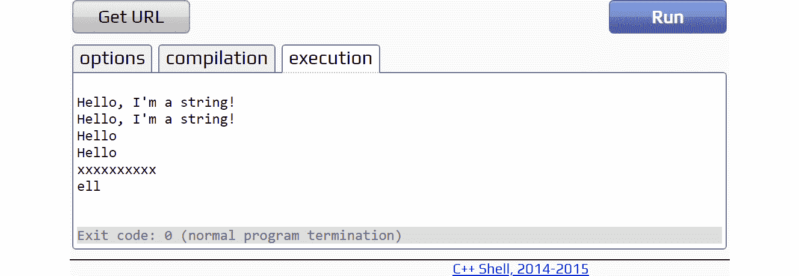
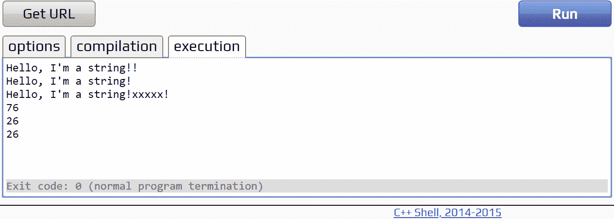
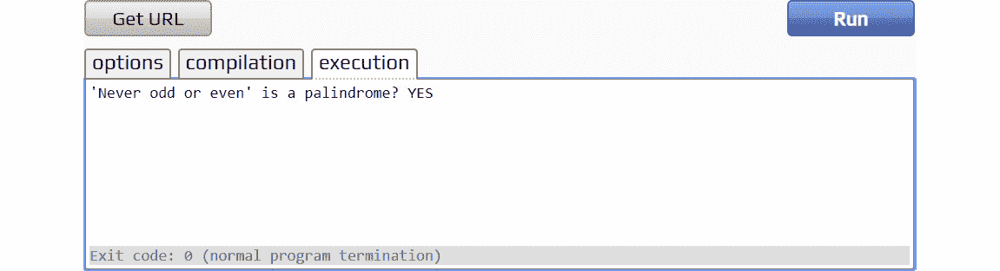
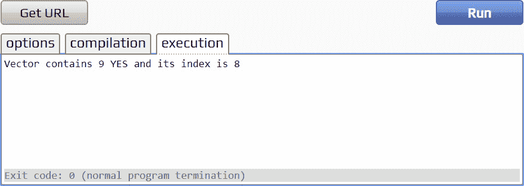
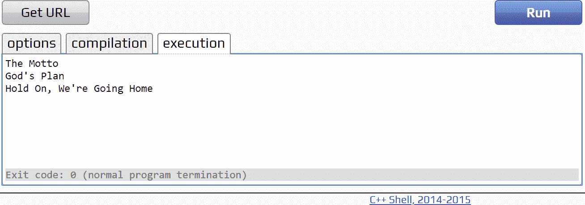
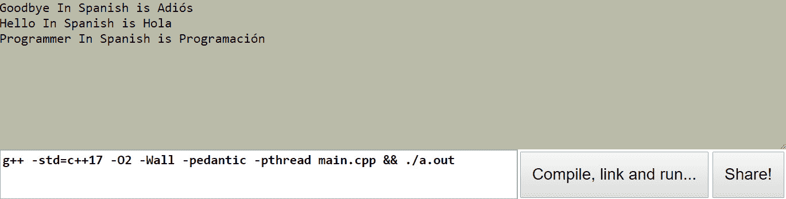
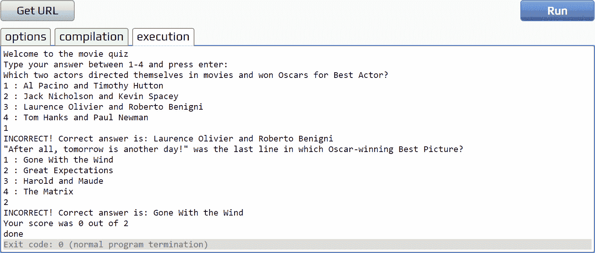

# 12 时。容器和迭代器

概观

本章将概述如何使用 C++标准库提供的容器和迭代器。该库为我们提供了许多算法和存储数据的方法，这样我们就可以专注于编写实用的代码，同时相信一个经过测试的健壮库正在为我们的程序提供动力。

# 简介

在本课程的前几章中，我们给出了没有使用 C++标准库的例子和练习。这可能会导致很多代码经常做得很少。我们坚持使用原始数组来帮助理解语言的基础；但是，在这一章中，我们将介绍强大的功能，这些功能将允许您用惊人的少量代码编写复杂的行为和功能。一旦你将标准库引入到你的项目中，C++真的会成为一种工作的乐趣，而且，任何 C++编译器都会很方便地提供它。我们可以不使用原始数组，不编写自己的队列和堆栈，而是使用预先存在的实现，所有这些都有一个公共接口。在开始我们的旅程之前，我们将首先解释什么是容器，并讨论它们的不同类型，然后讨论迭代器，以及它们如何使用这些容器变得非常自然和高效。

# 容器

C++标准库中的容器是一组常见的数据结构。这些结构采用列表、堆栈、数组等形式。容器可以存储数据和对象，并且可以分为几种不同的类型。这些类型以及与之关联的容器类是顺序容器——字符串、向量、列表、deque 和数组。

## 绳子是一个容器

在 C++中，字符串是一种类类型，这意味着它们是一个对象，具有成员变量和作用于它们的函数；它们是标准库中的一个容器，就像其他容器一样。在字符串类接口下面是一个 C 风格的字符数组，字符串类提供了在这个序列中访问单个字节的功能。与标准字符数组相比，使用字符串的好处是，许多可以在其他容器中使用的算法，如排序和搜索，也可以应用于字符串。如果我们使用一个标准的 C 风格的字符数组来保存我们的字符串，就像我们在前面的章节中所做的那样，那么我们将无法利用这些预先编写的算法，我们将不得不编写自己的算法。

标准库提供的每个容器都有一组构造函数，这些构造函数为我们初始化容器提供了灵活性。本章将在引入新容器时介绍这些内容。有些构造函数不会立即对我们有用，但它们值得我们将来了解。

## 字符串构造函数

字符串类有几种不同的构造函数可以使用:

*   `string();`:我们可以用这个创建一个没有字符的空字符串。
*   `string(const string& str);`:我们可以用这个从另一个字符串的副本构造一个字符串。
*   `string(const string& str, size_t pos, size_t len = npos);`:我们可以用这个从现有字符串的子串构造一个字符串。
*   `string(const char* s);`:我们可以用这个用`s`指向的 C 风格 char 数组的副本来构造一个字符串。
*   `string(const char* s, size_t pos, size_t n);`:我们可以用这个来构造一个字符串，这个字符串使用的是一个由`s`指向的 C 风格的`char`数组的副本，其中有特定数量的元素要复制(`n`)。
*   `string(size_t n, char c);`:我们可以用它来构造一个大小为`n`字符的字符串，初始化为`c`的副本。
*   `template <class InputIterator> string (InputIterator first, InputIterator last);`:我们可以用它来构造一个范围在第一个迭代器和最后一个迭代器之间的字符串。

我们将在下面的练习中实现其中的一些字符串。

## 练习 73:创建字符串

如*字符串构造器*部分所示，有许多方法可以构造字符串。我们可以尝试这些，并打印它们的值。首先，在 cpp.sh 上打开一个新文件，创建一个基本的`main`函数，该函数还包括`<iostream>`和`<string>`。我们还将声明我们正在使用`std`命名空间，因为字符串存在于该命名空间中，并且我们可以避免需要键入范围运算符和命名空间。

注意

本练习的完整代码可以在[https://packt.live/2rXH6ln](https://packt.live/2rXH6ln)找到。

以下是完成练习的步骤:

1.  从`main`功能开始:

    ```cpp
    #include <iostream>
    #include <string>
    using namespace std;
    int main()
    {
        return 0;
    }
    ```

2.  使用`string()`构造函数

    ```cpp
        string str;
    ```

    创建一个空字符串
3.  使用带有`string(const char* s)` :

    ```cpp
        string str1("Hello, I'm a string!");
    ```

    的 C 风格字符数组创建字符串
4.  使用`string(const string& str);` :

    ```cpp
        string str2(str1);
    ```

    从另一个字符串的副本创建一个字符串
5.  使用`string(const string& str, size_t pos, size_t len = npos)` :

    ```cpp
        string str3(str1, 0, 5);
    ```

    从现有字符串的子字符串创建一个字符串
6.  用`string(const char* s, size_t pos, size_t n)` :

    ```cpp
        string str4("Hello, I'm a string!", 0, 5);
    ```

    从 C 风格字符数组的子字符串创建一个字符串
7.  使用字符和`string(size_t n, char c)` :

    ```cpp
        string str5(10, 'x');
    ```

    所需的长度创建一个字符串
8.  从现有字符串的子字符串创建一个字符串，但是使用迭代器来遗漏第一个和最后一个字符`<class InputIterator> string (InputIterator first, InputIterator last)`模板:

    ```cpp
        string str6(str4.begin() + 1, str4.end() - 1);
    ```

9.  编写以下输出命令:

    ```cpp
        cout << str << endl;
        cout << str1 << endl;
        cout << str2 << endl;
        cout << str3 << endl;
        cout << str4 << endl;
        cout << str5 << endl;
        cout << str6 << endl;
    ```

10.  下面是完整的程序:

    ```cpp
    #include <iostream>
    #include <string>
    using namespace std;
    int main()
    {
        string str;
        string str1("Hello, I'm a string!");
        string str2(str1);
        string str3(str1, 0, 5);
        string str4("Hello, I'm a string!", 0, 5);
        string str5(10, 'x');
        string str6(str4.begin() + 1, str4.end() - 1);
        cout << str << endl;
        cout << str1 << endl;
        cout << str2 << endl;
        cout << str3 << endl;
        cout << str4 << endl;
        cout << str5 << endl;
        cout << str6 << endl;
        return 0;
    }
    ```

11.  Run the complete program. You should obtain the following output:

    

图 12.1:输出字符串

所有这些构造函数都给了我们很大的灵活性，允许我们控制如何初始化字符串。

## 分配给字符串

字符串也可以使用赋值操作符以及通过构造函数来初始化。有几种不同的重载可用，如下所述:

*   `string& operator= (const string& str);`:从现有字符串的副本初始化
*   `string& operator= (const char* s);`:从 C 风格字符数组的副本初始化
*   `string& operator= (char c);`:用`char`初始化

下面的代码片段显示了一些给字符串赋值的例子。我们在这里不需要太多的细节，但是知道当我们想要将一个字符串分配给另一个字符串或者从一个现有的字符串初始化一个字符串时，那么标准库已经涵盖了我们:

```cpp
#include <iostream>
#include <string>
using namespace std;
int main()
{
    string str = "Hello, I'm a string!";
    string str1 = str;
    string str2;
    str2 = 'x';
    cout << str << endl;
    cout << str1 << endl;
    cout << str2 << endl;
    return 0;
}
```

上述代码产生以下输出:


图 12.2:使用赋值运算符时的输出

以这个例子中`str`的方式初始化字符串是非常常见的。`Hello, I'm a string!`实际上是一个字符数组，所以我们从 C 风格的 char 数组的副本中初始化一个字符串。

## 对字符串的操作

字符串类提供了许多不同的操作来操作底层的字节序列。您可能会发现其中一些类似于第 11 章、*模板*中的通用队列。对字符串的操作非常有用。我们可能需要在字符串中添加一个字符来帮助我们识别它们，或者我们可能需要删除程序中不需要的无关字符，当我们读取字符串的地方以这种方式存储它们时。让我们看看一些可以使用的字符串操作:

*   `push_back(char c)`:将一个字符(c)推到字符串的末尾。
*   `pop_back()`:删除字符串的最后一个字符。
*   `capacity()`:提供字符串的当前容量。这不一定对应于字符串的当前大小，因为就像*第 11 章*、*模板*中描述的队列一样，它可能有预分配的额外内存。
*   `resize(size_t n) & resize(size_t n, char c)`:调整字符串的大小。如果该值小于当前字符串大小，字符序列中该大小之后的任何内容都将被移除。重载函数接受一个字符 c，并将任何新元素初始化为 c 的副本。
*   `shrink_to_fit()`:将字符串的容量设置为当前大小。
*   `reserve(size_t n)`:将字符串的容量更改为允许 n 个字符。

下面是一个简单程序中使用的所有这些函数的示例:

```cpp
#include <iostream> 
#include <string> 
using namespace std; 
int main() 
{
    string str("Hello, I'm a string"); 
    str.push_back('!'); 
    str.push_back('!'); 
    cout << str << endl; 
    str.pop_back(); 
    cout << str << endl; 
    // notice this will keep existing contents and append x for the rest 
    str.resize(25, 'x'); 
    // reserve space for 50 chars - capacity() 
    str.reserve(50); 
    // notice that ! is pushed after the last char not     //the end of allocated space 
    str.push_back('!'); 
    cout << str << endl; 
    cout << str.capacity() << endl; 
    cout << str.size() << endl; 
    str.shrink_to_fit(); 
    // note : shrink_to_fit is not guaranteed to be exactly size() 
    // depending on compiler implementation 
    cout << str.capacity() << endl; 
    return 0; 
}
```

前面的代码将产生以下输出:



图 12.3:对字符串执行回推操作时的输出

## 迭代器

就像我们将介绍的其他容器一样，字符串有迭代器，可以用来允许在循环中遍历字符串。

来自字符串和大多数标准库容器的迭代器可以通过以下函数访问:

*   `begin()`:字符串开头的迭代器
*   `end()`:字符串末尾的迭代器
*   `rbegin()`:字符串开头的反向迭代器
*   `rend()`:字符串末尾的反向迭代器

标准库中容器的迭代器类型可以使用类名加上作用域运算符和迭代器反向迭代器来获得，具体取决于需要哪种类型。对于字符串，这意味着可以使用`string::iterator`或`string::reverse_iterator`获得迭代器。这些迭代器可以存储为变量以供重用，或者在`for`循环中使用，它们存在于 for 循环的范围内。

下面是一个使用这些迭代器循环并显示字符串内容的简单示例:

```cpp
#include <iostream> 
#include <string> 
using namespace std; 
int main() 
{
    string str("Hello, I'm a string"); 
    for(string::iterator it = str.begin(); it != str.end(); it++) 
    { 
        cout << *it; 
    }
    cout << endl; 
    for(string::reverse_iterator rit = str.rbegin(); rit != str.rend();         rit++) 
    { 
        cout << *rit; 
    } 
    cout << endl; 
    return 0;
}
```

上述代码产生以下输出:


图 12.4:使用字符串迭代器和反向迭代器时的输出

请注意，反向迭代器允许我们在容器中反向移动的同时使用递增 for 循环。这两个迭代器都被称为双向迭代器，这意味着我们可以在两个方向上进行迭代，因此如果需要，我们可以在两个方向上循环这两种类型的迭代器。

## 进一步研究

字符串类有许多有用的操作，与 C 风格的字符数组相比，这些操作非常强大。有一些函数可以查找字符串中的某些字符，删除或替换字符串中的字符，将一个字符串复制到字符数组中，并将一个字符串追加到另一个字符串中。此外，字符串类提供重载操作符，如`+=`追加到字符串中，以及`+`连接字符串。与其在这里用例子列出所有这些函数，不如研究这些函数并将它们应用到自己的示例程序中。

## 练习 74:是回文吗？

因为字符串的行为就像标准库中的其他容器一样，所以我们可以利用`<algorithm>`头中存在的常见算法。这使得能够用最少的代码进行复杂的操作。

下面的练习展示了我们如何编写一个函数来检查一个字符串是否是回文，利用一些算法。

注意

本练习的完整代码可以在[https://packt.live/37tTYQ3](https://packt.live/37tTYQ3)找到。

以下是完成练习的步骤:

1.  我们的第一个任务是允许用户输入要检查的文本。我们将使用`std::getline`函数从`std::cin`中读取并将其存储在字符串中。这就是我们的主要功能:T2
2.  Now we must create the stub of our `isPalindrome` function and place it above our `main` function. This function will take a `const` reference to a string and return a `bool`:

    ```cpp
    bool isPalindrome(const string& str)
    {
        return false;
    }
    int main()
    {
        string str;

        getline(cin, str);

        cout << "'" << str << "'" << " is a palindrome? "          << (isPalindrome(str) ? "YES" : "NO") << endl;
        return 0;
    }
    ```

    通过输入要检查的字符串来测试这一点。当然，在这一点上它会说`NO`，但我们会知道到目前为止一切都在编译中。

3.  There are some characters that we would like to ignore in our palindrome check, such as spaces and punctuation. The following code implements this:

    ```cpp
    bool isPalindrome(const string& str)
    {
        // make a copy of the string
        string s(str.begin(), str.end());
        // remove any spaces or punctuation
        s.erase(remove_if(s.begin (), s.end (), [](const char& c) { return
        ispunct(c) || isspace(c);}), s.end());
    ```

    有很多回文包含标点和空格，如果考虑到这些，会使回文无效。我们会选择完全忽略这些，只检查字母。为此，我们将使用范围构造函数复制传入的字符串，然后使用`remove_if`算法给我们一个只包含非空格或标点符号元素的范围。

    `remove_if`算法将任何不满足我们给它的谓词的元素转移到容器的末尾，并将满足谓词的元素留在容器开头的一个范围内。然后它返回一个迭代器，我们可以使用它来指向我们想要的范围内的最后一个元素。我们可以使用这个迭代器作为字符串`erase`函数的第一个参数，删除所有超出我们关心范围的元素。

    现在，我们已经删除了我们不需要的元素，我们现在可以移动到较低的外壳，我们剩余的元素；至于我们的回文检查，我们希望它不区分大小写。为此，我们可以使用`transform`算法。这个算法允许我们对一个范围内的每个元素调用一个函数。我们将在范围内的每个元素上使用一个名为`tolower`的函数。

4.  编写以下代码，将`transform`算法合并到`isPalindrome`函数中:

    ```cpp
        // lower case what's left
        transform(s.begin(), s.end(), s.begin(), ::tolower);
    ```

5.  现在我们有了一系列小写字符，不包含任何标点符号或空格，我们可以创建字符串的反向版本。为此，我们将再次使用范围构造函数，但这次我们将传入反向迭代器。然后我们可以比较这两个字符串，看看它们是否匹配。如果有，那么我们有一个回文:

    ```cpp
        // create a reversed version of the string
        string sr(s.rbegin(), s.rend());

        // compare them
        return (s == sr);
    }
    ```

6.  现在我们可以在一个新的`main`函数中测试我们的回文检查器。我们将把我们的字符串初始化为一个经典的回文，“从不奇数或偶数”，然后把它传递到我们的函数中，并显示它是否是回文:

    ```cpp
    int main()
    {
        string str = "Never odd or even";

        cout << "'" << str << "'" << " is a palindrome? "          << (isPalindrome(str) ? "YES" : "NO") << endl;

        return 0;
    }
    ```

7.  下面是完整的代码:

    ```cpp
    #include <iostream>
    #include <string>
    #include <algorithm>
    using namespace std;
    bool isPalindrome(const string & str) {
        // make a copy of the string
        string s(str.begin(), str.end());
        // remove any spaces or punctuation
        s.erase(remove_if(s.begin(), s.end(), [](const char & c) {
        return ispunct(c) || isspace(c); }), s.end());
        // lower case what's left
        transform(s.begin(), s.end(), s.begin(), ::tolower);
        // create a reversed version of the string
        string sr(s.rbegin(), s.rend());
        // compare them
        return (s == sr);
    }
    int main() 
    {
        string str = "Never odd or even";
        cout << "'" << str << "'" << " is a palindrome? "          << (isPalindrome(str) ? "YES" : "NO") << endl;
        return 0;
    }
    ```

8.  运行完整的代码。您将获得以下输出:



图 12.5:回文

字符串通常是比使用字符数组更好的选择。它们提供了许多有用的功能，并且通常更容易使用。标准库还升级了我们经常使用的另一种类型:数组。让我们继续讨论数组的替代方法——向量。

# 向量-方便、可调整大小的数组

向量实现了多用途的动态数组。请记住，C++数组必须是固定大小的；我们不能调整数组的大小，如果需要添加另一个元素，我们将不得不创建新的数组并复制内容。我们在本课程中创建的自定义类中已经做了很多这样的工作。向量允许我们创建一个容器，它可以在我们需要的时候调整大小。向量中的元素是连续存储的，即以相邻的方式布局，因此可以通过指向元素的偏移指针和迭代器来访问。我们可以通过包含`<vector>`头来利用向量。

## 向量构造函数

当我们想要创建一个新的向量时，向量给了我们许多不同的构造函数来使用。这里概述了这些构造函数的选择:

*   `vector();`:构造一个空向量。
*   `vector(size_t n, const T& value = T());`:使用以 t 为参数的构造函数或者`T`默认的默认构造函数，构造一个包含多个元素(n)的向量，可选地进行初始化。
*   `template <class InputIterator> vector(InputIterator first, InputIterator last);`:从第一个迭代器和最后一个迭代器之间的范围构造一个向量。
*   `vector(const vector& other);`:通过复制另一个向量来构造一个向量(复制构造函数)。
*   `vector (initializer_list<value_type> il);`:使用初始化列表构造一个向量。

下面的代码片段显示了这些正在使用的构造函数:

```cpp
#include <iostream>
#include <vector>
using namespace std;
int main()
{
    // default constructed empty vector
    vector<int> intVector;
    vector<int> initializerListIntVector = {1,2,3};
    // default constructed vector of 5 floats
    vector<float> floatVector(5);
    // vector of 5 floats initialized to 1.0f
    vector<float> floatVectorAllOne(5, 1.0f);
    // vector constructed from an existing vector
    vector<float> anotherFloatVector(floatVector);
    // range constructed vector
    vector<float> rangeConstructedFloatVector(anotherFloatVector.begin(),
    anotherFloatVector.end());
    return 0; 
}
```

每个构造函数都在这个片段中使用，供您参考。所有这些构造函数在某些情况下都是有用的，所以花点时间去学习它们，以确保你的程序使用了正确的构造函数。

## 向量赋值

向量也可以使用向量重载赋值运算符`vector& operator=( const vector& other )`为其赋值。这里有一个例子:

```cpp
#include <iostream>
#include <vector>
using namespace std;
int main()
{
    // default constructed vector of 5 floats
    vector<float> floatVector(5);
    vector<float> floatVectorAssigned = floatVector;
    return 0;
}
```

当给向量赋值时，它必须具有有效的转换。如果没有，编译器将在该行报告错误。例如`vector<int>`不能分配给`vector<float>`。但是，如果您使用的是范围构造函数，并且两种类型之间存在转换，那么可以按照下面的代码片段来构造它们:

```cpp
#include <iostream>
#include <vector>
using namespace std;
int main()
{
    // default constructed vector of 5 floats
    vector<float> floatVector(5);

    vector<int> intVector(floatVector.begin(), floatVector.end());

    return 0;
}
```

这里，我们已经使用一系列的`float`构造了一个`int`向量。因为这些类型可以被转换，所以构造函数可以正确地处理这个。

## 练习 75:访问向量中的元素

从本章的介绍中我们知道，向量是一个顺序容器，因此我们的元素可以顺序迭代，并且可以通过索引访问。向量的行为确实非常像原始数组，而且当您需要一个顺序容器时，向量几乎总是比数组更好的选择。为了引入向量，我们将创建一个小程序，该程序填充一个向量并通过索引访问一个元素，然后还迭代该向量和其中所有元素的值:

注意

本练习的完整代码可以在[https://packt.live/2QQtalv](https://packt.live/2QQtalv)找到。

1.  从`cpp.sh`上的新文件开始，添加一个主功能。要访问向量，我们需要包含向量头和 iostream，这样我们就可以打印我们的值:

    ```cpp
    #include <iostream>
    #include <vector>
    using namespace std;
    int main()
    {
        return 0;
    }
    ```

2.  现在，我们可以创建我们的向量，并使用初始化列表构造函数`(initializer_list<value_type> il)`向量

    ```cpp
    int main()
    {
        vector<int> vec = {1,2,3,4,5,6,7,8,9,10};

        return 0;
    }
    ```

    用一些值来填充它
3.  When we want to iterate over the elements in a container, we can use the range `for` loop. In this case, it would look like the following:

    ```cpp
        for(auto v : vec)
        {
            cout << v << " ";
        }
    ```

    `auto`关键字允许我们让编译器计算出向量中包含的内容。然后，它循环遍历所有元素，并按顺序将它们作为这里称为`v`的元素返回。

4.  我们现在还可以通过索引访问向量中的元素。获取数字 4，在我们的零索引向量中，它位于索引`3` :

    ```cpp
        cout << vec[3];
    ```

5.  当我们运行程序时，我们应该看到我们所有的`vec`值都和数字 4 一起打印出来。下面是代码:

    ```cpp
    #include <iostream>
    #include <vector>
    using namespace std;
    int main()
    {
        vector<int> vec = {1,2,3,4,5,6,7,8,9,10};

        for(auto v : vec)
        {
            cout << v << " ";
        }

        cout << vec[3];

        return 0;
    }
    ```

6.  运行代码。您将获得以下输出:


图 12.6:访问向量的元素

访问向量的元素显然非常重要，然而向量允许我们执行许多其他操作。下一节将向您概述这些操作。

## 向量运算

对向量的大多数有用操作都涉及到在向量中添加和移除元素。这是向量的本质，也是它们优于标准数组的原因。就像字符串一样，我们将开始看到不同容器上的操作之间的一些共性。以下是一些可应用于向量的有用函数:

*   `push_back()`:将一个元素推到向量的后面。
*   `pop_back()`:移除并销毁向量中的最后一个元素。
*   `insert(const_iterator pos, const T& val)`:在`pos`迭代器指定的位置插入`val`元素。
*   `erase(const_iterator pos) & erase(const_iterator first, const_iterator last)`:擦除`pos`迭代器中的元素或第一个和最后一个迭代器之间的范围。
*   `clear()`:移除并销毁矢量的所有元素。
*   `emplace()`:类似于`insert`，但是 insert 引用了一个已经构建的元素，而侵位构建了一个新的元素，并增长了向量来适应它。

与字符串类似，向量也公开函数来获取容量、调整大小和保留内存。

## 搜索向量

很多编程都涉及到根据一些特定的逻辑找到特定的元素或元素范围。我们可能希望找到值小于 10 的`vector<int>`的所有元素。我们可能想在向量中搜索一个符合我们标准的特定元素。包含在标准库<算法>头中的算法可以应用于我们的向量，允许我们用最少的代码轻松搜索特定的元素。最重要的向量搜索算法是`std::find`和`std::find_if`。

这些算法使用迭代器来搜索向量中的一系列元素，并将迭代器返回到符合条件的第一个元素。如果没有元素符合条件，那么返回一个到向量末尾的迭代器。这可以在检查元素是否存在时进行比较。看下面的例子，它检查一个特定的`int`是否包含在一个`vector<int>`中:

```cpp
#include <iostream>
#include <algorithm>    // std::find
#include <vector>
using namespace std;
bool contains(const int value, const vector<int>& vec)
{
    return (find(vec.begin(), vec.end(), value) != vec.end());
}
```

在前面的函数中，find 算法将迭代器带到我们想要搜索的范围的开始。由于我们要搜索整个向量，所以我们传入`begin()`，这是向量的开始，然后结束为向量的结束。这构成了整个阵列。最后一个参数是值，也就是我们希望找到的`int`。然后将从该函数返回的值与`end()`进行比较。如果它相等，那么我们知道它不包含在向量中，因为`end()`指向最后一个元素的过去，而不是元素本身。下面的代码片段使用这个函数来检查整数向量中的数字 9:

```cpp
int main()
{
    vector<int> vec = {1,2,3,4,5,6,7,8,9,10};

    const int numToCheck = 9;

    cout << "Vector contains " << numToCheck << " "          << (contains(numToCheck, vec) ? "YES" : "NO");
    cout << endl;
    return 0;
}
```

该检查的输出应该是:


图 12.7:查找算法的输出

此外，我们可以使用`std::distance`函数，通过获取从向量开始到找到的元素的偏移量，返回向量中元素的索引。下面的代码片段检查一个元素是否包含在一个向量中，如果包含，则返回它的索引。如果没有找到元素，则返回`-1`，我们可以对照检查:

```cpp
#include <iostream>
#include <algorithm>    // std::find
#include <vector>
using namespace std;
long contains(const int value, const vector<int>& vec)
{
    vector<int>::const_iterator it = find(vec.begin(), vec.end(), value);

    if(it != vec.end()) // we found the element
        return distance(vec.begin(), it);

    return -1;
}
```

在这个函数中，`find`算法的使用方式与之前类似，但这次找到的元素的迭代器存储在`it`中。对`it`是否等于`end`进行相同的检查(未找到)，如果找到元素，距离函数返回索引，即数组中第一个元素和找到的元素之间的元素数量。

下面的代码片段利用这个函数来检查数字 9 是否包含在我们的向量中，如果包含，我们可以得到它的索引:

```cpp
int main()
{
    vector<int> vec = {1,2,3,4,5,6,7,8,9,10};
    const int numToCheck = 9;
    long index = contains(numToCheck, vec);
    cout << "Vector contains " << numToCheck << " "          << (index != -1 ? "YES" : "NO");
    if(index != -1)
        cout << " and its index is " << index;

    cout << endl;
    return 0;
}
```

前面的代码将产生以下输出:



图 12.8:检查向量中的元素

我们可以更进一步，创建一个模板函数，它可以从任何类型的向量中找到该类型的元素。下面的例子展示了标准库在编写最少的通用代码时是多么强大:

```cpp
template<typename T>
long contains(const T& value, const vector<T>& vec)
{
    auto it = find(vec.begin(), vec.end(), value);

    if(it != vec.end()) // we found the element
        return distance(vec.begin(), it);
    return -1;
}
```

这里，我们用`auto`关键字替换了`int`迭代器。这意味着我们将得到正确类型的迭代器，即使它不是显式类型的。此外，该函数现在是一个模板函数，任何类型都已被`T`取代。现在，如果我们运行与之前相同的代码片段，但是使用新的`contains()`函数，我们应该会得到相同的结果，而不需要显式使用`int`纯向量`contains()`函数。

## 练习 76:使用自定义比较对向量进行排序

向量排序是另一种常见的操作。有一些内置的比较可以用于简单的排序，比如在整数向量上按升序和降序排序。有时，我们可能希望基于更精细的东西对向量进行排序，例如基于自定义类型中某个特定变量的升序或降序。

注意

本练习的完整代码可以在[https://packt.live/2tXeDN2](https://packt.live/2tXeDN2)找到。

使用轨迹对象实现这一点，并根据轨迹长度对轨迹进行排序:

1.  首先，我们将编写一个简单的类轨道，它有一个名称、长度和受欢迎程度:

    ```cpp
    #include <iostream>
    #include <algorithm>
    using namespace std;
    class Track
    {
    public:
        Track(float length, string name, int popularity) :           m_trackLength(length), m_trackName(name),           m_popularityRating(popularity) {}
        float getLength() const { return m_trackLength; }
        string getName() const { return m_trackName; }
        int getPopularity() const { return m_popularityRating; }
    private:
        float m_trackLength;
        string m_trackName;
        int m_popularityRating;
    };
    ```

2.  由此，我们可以创建一个轨迹向量，我们将使用我们的自定义比较进行排序:

    ```cpp
    int main()
    { 
        vector<Track> tracks;
        tracks.push_back(Track(199.0f, "God's Plan", 100));
        tracks.push_back(Track(227.0f, "Hold On, We're Going Home", 95));
        tracks.push_back(Track(182.0f, "The Motto", 80));
        return 0;
    }
    ```

3.  自定义比较本质上是一个函数，它接受两个相同类型的参数并返回一个`bool`。我们如何定义这个函数取决于我们自己，但是对于我们当前的程序，我们只想按升序对轨道长度进行排序，这样我们就可以比较轨道长度值:

    ```cpp
    bool trackLengthCompare(const Track& t1, const Track& t2)
    {
        return (t1.getLength() < t2.getLength());
    }
    ```

4.  现在，我们可以在排序算法中使用它来按升序对我们的曲目进行排序，然后打印出来。我们可以将自定义排序函数作为参数传递给排序函数，同时将迭代器传递给向量的开头和结尾:

    ```cpp
        sort(tracks.begin(), tracks.end(), trackLengthCompare);
    ```

5.  We can test this code in our `main` function and also print out the values once they are sorted:

    ```cpp
    int main()
    { 
        vector<Track> tracks;
        tracks.push_back(Track(199.0f, "God's Plan", 100));
        tracks.push_back(Track(227.0f, "Hold On, We're Going Home", 95));
        tracks.push_back(Track(182.0f, "The Motto", 80));
        sort(tracks.begin(), tracks.end(), trackLengthCompare);
        for (auto t : tracks)
        {
            cout << t.getName() << endl;
        }
        return 0;
    }
    ```

    下面是完整的代码:

    ```cpp
    #include<iostream>
    #include<string>
    #include<algorithm>
    using namespace std;
    class Track
    {
    public:
        Track(float length, string name, int popularity) :           m_trackLength(length), m_trackName(name),           m_popularityRating(popularity) {}
        float getLength() const { return m_trackLength; }
        string getName() const { return m_trackName; }
        int getPopularity() const { return m_popularityRating; }
    private:
        float m_trackLength;
        string m_trackName;
        int m_popularityRating;};
        bool trackLengthCompare(const Track& t1, const Track& t2)
        {
            return (t1.getLength() < t2.getLength());
        }
    int main()
    {
        vector<Track> tracks;
        tracks.push_back(Track(199.0f, "God's Plan", 100));
        tracks.push_back(Track(227.0f, "Hold On, We're Going Home", 95));
        tracks.push_back(Track(182.0f, "The Motto", 80));
        sort(tracks.begin(), tracks.end(), trackLengthCompare);
        for (auto t : tracks)
        {
            cout << t.getName() << endl;
        }
        return 0;
    }
    ```

    运行代码后，您将获得以下输出:

    

    图 12.9:带有自定义比较的排序输出

    既然我们已经理解了如何使用 sort 函数，那么尝试用以下额外的功能来扩展这个练习:

6.  写一个人气等级对比:

    ```cpp
        bool trackPopularityCompare(const Track& t1, const Track& t2)
        {
            return (t1.getPopularity () < t2.getPopularity());
        }
    ```

7.  按曲目长度降序排序:

    ```cpp
        bool trackLengthCompare(const Track& t1, const Track& t2)
        {
            return (t1.getLength() > t2.getLength());
        }
    ```

8.  按名称长度排序:

    ```cpp
        bool trackNameLengthCompare(const Track& t1, const Track& t2)
        {
            return (t1.getName().size() < t2.getName().size());
        }
    ```

# 地图/无序地图:我们的关联容器

地图和无序地图是关联容器。地图/无序地图中的元素与一个键相关联，并通过该键进行访问。地图/无序地图中没有两个元素可以具有相同的键。在内部，使用内部比较对象按关键字对地图进行排序。相反，无序映射中的元素不是按关键字排序的，而是以允许按关键字快速检索元素的方式存储的。映射通常更适合迭代和查找键，而无序映射更能有效地通过相关键直接访问元素。如果你最终在数据中循环并以某种方式使用每个元素，那么地图是最合适的；如果您主要是通过元素的键从容器中获取元素，而不是在整个集合中循环，那么无序映射是最合适的。

## 构建地图和无序地图

以下是构建地图时要使用的构造函数的选择:

*   `map()`:默认构造函数，空映射
*   `map(const map& x)`:从另一个地图的副本构建一个地图
*   `template <class InputIterator>; map (InputIterator first, InputIterator last)`:根据范围构建地图
*   `map (initializer_list<value_type> il)`:使用初始化列表构造一个地图

下面是一个示例片段，展示了如何使用上述构造函数:

```cpp
#include <iostream>
#include <map>
using namespace std;
int main()
{
    map<int, int> myMap;
    map<int, int> copiedMap(myMap);
    map<int, int> rangeMap(copiedMap.begin(), copiedMap.end());
    map<int, int> initList = { {1,2}, {2,3}, {3,4} };
}
```

当声明一个映射时，我们需要传入两个模板参数，如前面的片段所示。首先是我们希望地图中的键是什么类型。这些是我们将与第二个参数类型相关联的标识符；价值。键和值的结合是关联容器的“关联”部分。

当然，无序映射也有一组类似的构造函数，其中一些添加了指定内部哈希表使用的最小桶数的选项，用于通过键检索元素。桶在内部将容器的序列划分成更小的子序列。如果未指定该值，则自动确定。这些是无序映射的构造函数:

*   `unordered_map(size_type n)`:构建一个具有可选最小桶大小的无序地图
*   `unordered_map(const unordered_map& x)`:从另一个无序地图的副本构建一个无序地图
*   `template <class InputIterator>unordered_map (InputIterator first, InputIterator last)`:从一个范围构建一个无序的地图
*   `unordered_map (initializer_list<value_type> il, size_type n)`:用可选的最小存储桶大小，从初始化列表中构造一个无序映射

下面是一个示例片段，其中实现了上述每个映射:

```cpp
#include <iostream>
#include <unordered_map>
using namespace std;
int main()
{
    unordered_map<int, int> myUnorderedMap;
    unordered_map<int, int> copiedUnorderedMap(myUnorderedMap);
    unordered_map<int, int> rangeUnorderedMap(copiedUnorderedMap.begin(), 
    copiedUnorderedMap.end());
    unordered_map<int, int> initList = { {1,2}, {2,3}, {3,4} };
}
```

## 对地图和无序地图的操作

映射和无序映射公开了与其他容器类似的操作，如字符串和向量。这些容器的独特之处在于，当向`map` / `unordered_map`中添加元素时，我们使用`std::pair`；我们在下文中称之为键值对。我们可以使用`std::make_pair`创建键值对。以下示例显示了如何将元素插入到地图和无序地图中。注意插入元素时`std::pair`的使用。这个键值对是键和值的关联:

```cpp
#include <iostream> 
#include <unordered_map> 
#include <map>
using namespace std;

int main()
{
    unordered_map<int, int> myUnorderedMap;
    map<int, int> myMap;
    myUnorderedMap.insert(make_pair(1, 2));
    myMap.insert(make_pair(1, 2));
}
```

遍历映射时，迭代器将指向映射中的键值对。映射或无序映射中的每个元素都是一个键值对，该对的键类型是我们声明的键模板参数类型，值是我们的值模板参数类型(在前面的例子中，键是一个`int`，值也是一个`int`)。我们可以使用第一个访问键，使用第二个访问值。

以下示例显示了地图的简单遍历和打印(同样适用于无序地图):

```cpp
#include <iostream> 
#include <map>
#include <string>
using namespace std;
int main()
{
    map<string, string> myStringMap = 
    {
        {"Hello", "Hola"},
        {"Goodbye", "Adiós"},
        {"Programmer", "Programación"}
    };
    for (const auto& loc : myStringMap)
    {
       cout << loc.first << " In Spanish is " << loc.second << endl;
    }
}
```

当您运行前面的代码时，您将获得以下输出:



图 12.10:地图的遍历和打印

在这个例子中，映射是使用初始化列表构造函数预先填充的。使用初始值设定项列表时，值用逗号和大括号分隔，组成键值对:

```cpp
{"Hello", "Hola"},
```

然后，该示例使用 ranged `for`循环遍历每个元素，并分别打印其第一个和第二个键和值。

## 练习 77:地图测验

除了像浮点数和整数这样的内置类型，我们还可以使用自定义类型作为键。关键自定义类型的一个要求是，我们需要通过重载`<`运算符来实现比较，或者创建一个自定义对象，该对象可以在声明地图时作为模板参数传入。这是必需的，以便地图知道如何对其关键字进行排序。

注意

本练习的完整代码可以在[https://packt.live/2FkP6js](https://packt.live/2FkP6js)找到。

让我们用一张地图写一些实际的东西——在本例中，是一个有多个选项的测验，在最后显示我们的分数:

1.  首先，我们将创建名为`Question`的自定义键类型。这将有问题本身的成员变量，它的问题编号(我们将在比较对象中使用它)，以及正确答案的索引:

    ```cpp
    #include <iostream>
    #include <map>
    #include <string>
    #include <vector>
    using namespace std;
    class Question 
    {
    public:
        Question(int questionNumber, string question, int answerIndex):              m_questionNumber(questionNumber), m_question(question),              m_answerIndex(answerIndex) {}
        int getQuestionNumber() const 
        {
            return m_questionNumber;
        }
        string getQuestion() const 
        {
            return m_question;
        }
        int getAnswerIndex() const 
        {
            return m_answerIndex;
        }
    private:
        int m_questionNumber;
        string m_question;
        int m_answerIndex;
    };
    ```

2.  Next, we will create the custom comparison object that the map will use to sort the keys:

    ```cpp
    struct QuestionCompare
    {
        bool operator() (const Question& lhs, const Question& rhs) const
        {
            return lhs.getQuestionNumber() < rhs.getQuestionNumber();
        }
    };
    ```

    我们现在有几个步骤来创建我们的测验，所以我们必须声明我们的地图。我们地图的关键将是我们定制的`Question`类型。容器中键值对的值部分也可以是容器。这意味着我们可以拥有一对`<int, vector<int>>`或`<float, map<int, int>>`类型的键值对。通过使用字符串向量作为值类型，我们将利用一对的值部分作为我们多重选择的容器的能力。最后，我们将使用自定义比较对象作为最终模板参数:

    ```cpp
    int main()
    {
        map<Question, vector<string>, QuestionCompare> quiz;
    ```

3.  现在我们可以创建我们的`Question`对象和包含答案的字符串向量，然后将它们插入测验地图:

    ```cpp
        Question question1(1, "Which two actors directed themselves     in movies and won Oscars 2 for Best Actor?", 2);
        vector<string> question1Answers =
        {
            "Al Pacino and Timothy Hutton",
            "Jack Nicholson and Kevin Spacey",
            "Laurence Olivier and Roberto Benigni",
            "Tom Hanks and Paul Newman"
        };
        Question question2(2, "\"After all, tomorrow is another day!\"     was the last line 12 in which Oscar-winning Best Picture?", 0);
        vector<string> question2Answers =
        {
            "Gone With the Wind",
            "Great Expectations",
            "Harold and Maude",
            "The Matrix"
        };
        quiz.insert(make_pair(question1, question1Answers));
        quiz.insert(make_pair(question2, question2Answers));
    ```

4.  现在我们可以创建我们的主循环，它会询问我们的问题，然后等待输入。我们将首先为我们的地图获取一个迭代器，然后继续提问，获取答案，并增加我们的迭代器，直到它匹配`quiz.end()` :

    ```cpp
        cout << "Welcome to the movie quiz" << endl;
        cout << "Type your answer between 1-4 and press enter:"          << endl;
        map<Question, vector<string>>::        iterator quizIterator = quiz.begin();
        vector<bool> correctAnswers;
        while (quizIterator != quiz.end())
        {
            cout << quizIterator->first.getQuestion() << endl;
            int answerIndex = 1;
            for(auto answer : quizIterator->second)
            {
                cout << answerIndex << " : " << answer << endl;
                answerIndex++;
            }
            int answer;
            cin >> answer;
    ```

5.  We will push any correct answers onto a vector of `bool` values and then use the size of that vector to output the score at the end:

    ```cpp
            int correctAnswer = quizIterator->first.getAnswerIndex();
            bool wasCorrect = answer - 1 == correctAnswer;
            cout << (wasCorrect ? "CORRECT!" : "INCORRECT!")              << " Correct answer is: "              << quizIterator->second[correctAnswer] << endl;
            if (wasCorrect)
                    correctAnswers.push_back(answer);
            quizIterator++;
        }
        cout << "Your score was " << correctAnswers.size()          << " out of " << quiz.size() << endl;
        cout << "done";
    }
    ```

    完整测验的输出如下:



图 12.11:最终输出

如您所见，关联容器对于依赖于可以通过键查找的值的程序非常有用，或者甚至只是将一个特定的值与另一个值相关联，就像练习对问题及其各自可能的`answer`向量所做的那样。

# 集合/多集合

集合就像地图一样是一个关联容器，就像地图一样，每个键都是唯一的；它不能有多个相同的键。集合的区别在于它不是键值对的容器。它本质上是一个唯一键的容器，就像一个向量，向量中的每个元素都是唯一的。元素一旦被添加到集合中，就不能被修改；但是它可以从集合中移除。多集的行为就像一个集合，除了允许多个非唯一键。

## 施工人员

构建集合时，我们还可以传入用于对集合进行排序的比较器。比较器是一个用来决定元素在集合中如何排序的函数。以下是用于集合和多集合的构造函数的选择(为简洁起见，仅显示集合):

*   `set();`:默认空集
*   `set(const key_compare& comp);`:用选择的比较对象清空集合
*   `set(const set& x);`:复制构造函数
*   `template <class InputIterator> set (InputIterator first, InputIterator last, const key_compare& comp = key_compare());`:带有可选选择比较的范围构造器
*   `set (initializer_list<value_type> il, const key_compare& comp = key_compare());`:带有可选选择比较的初始化列表

## 练习 78:一组的自定义比较器

默认情况下，集合将按升序对元素进行排序，因此如果我们要创建一组整数，它们将按升序排序。这对于像`int`这样的内置类型来说很好，但是如果我们有自己的自定义类型，那么我们必须定义元素是如何排序的。我们可以定义该类型的哪个属性用于排序，甚至可以将默认排序从升序更改为降序。在本练习中，我们将创建一个名为 Person 的类，其中包含姓名和年龄。然后，我们将为该集合创建一个自定义比较，以按年龄降序对人员元素进行排序:

注意

本练习的完整代码可以在[https://packt.live/2D6re26](https://packt.live/2D6re26)找到。

1.  首先，我们来写`Person`课。很简单:

    ```cpp
    class Person
    {
    public:
        Person(string name, int age)
        {
            m_name = name;
            m_age = age;
        }
        string getName() const { return m_name; }
        int getAge() const { return m_age; }
    private:
        string m_name;
        int m_age;
    };
    ```

2.  现在，创建一个自定义比较器。这里，我们将使用一个函子，它是一个*对象*，可以像*函数*一样使用。函子将被用来比较集合中的每个元素，当它被添加时，决定顺序。比较器获取两个元素并返回一个`bool`:T1
3.  现在我们可以创建一些`Person`对象，将它们添加到集合中，然后打印出来。下面是完整的源代码:

    ```cpp
    #include <iostream>
    #include <string>
    #include <set>
    using namespace std;
    class Person 
    {
    public:
        Person(string name, int age) 
        {
            m_name = name;
            m_age = age;
        }
        string getName() const 
        {
            return m_name;
        }
        int getAge() const {
        return m_age;
        }
    private:
        string m_name;
        int m_age;
    };
    struct customComparator 
        {
            bool operator()(const Person & a,
            const Person & b) const {
            return (a.getAge() > b.getAge());
        }
    };
    int main() 
    {
        set < Person, customComparator > personSet;
        Person a("bob", 35);
        Person b("bob", 25);
        personSet.insert(a);
        personSet.insert(b);

        for (auto person: personSet) 
        {
            cout << person.getAge() << endl;
        }
    }
    ```

4.  运行完整的代码。您应该获得以下输出:


图 12.12:一组自定义比较器的输出

## 操作

集合还有一些额外的有用操作，以及获取大小的等效操作，以及插入和获取其他容器公开的迭代器:

*   `count(const T& val);`:返回集合内匹配`val`的元素个数。记住一个集合的元素都是唯一的，所以这个函数最多只能返回 1。这对于查找集合中是否存在某个键很有用。
*   `lower_bound(const T& val);`:返回一个迭代器到`val`，如果存在的话，或者返回一个基于比较对象的集合中肯定不会在`val`之前的值。
*   `upper_bound(const T& val);`:返回一个迭代器到`val`，如果它存在的话，或者返回一个基于比较对象的集合中肯定会跟随`val`的值。
*   `equal_range(const T& val);`:返回一个包含`val`的范围的上下界的对的迭代器。同样，由于集合中的元素是唯一的，如果迭代器存在的话，它将返回给`val`。

在下面的练习中，我们将使用一个集合来获取多集合中唯一元素的数量。

## 练习 79:使用集合获取多集合中唯一元素的数量

因为集合不允许非唯一元素，但是多集合允许，所以我们可以通过在多集合中插入每个元素来使用集合来获取多集合中唯一元素的数量。如果我们试图添加集合中已经存在的元素，那么它将不会被添加。在尝试添加所有元素后，我们可以计算集合中包含多少元素。这将是唯一元素的数量:

注意

本练习的完整代码可以在[https://packt.live/2OqKyMs](https://packt.live/2OqKyMs)找到。

1.  在一个新的`main`函数中，我们可以声明我们的集合和多集合:

    ```cpp
    #include <iostream>
    #include <string>
    #include <set>
    #include <stdlib.h>
    using namespace std;
    int main()
    {
        set<int> intSet;
        multiset<int> intMultiset;
    ```

2.  We can then add a bunch of random numbers into our multiset by looping and inserting into the multiset:

    ```cpp
        for(unsigned int i = 0; i < 100; i++)
        {
            intMultiset.insert(1 + rand() % 100);
        }
    ```

    注意

    前面的代码片段是一个简单的随机数生成示例。

3.  我们现在可以迭代这个多集合，并尝试将每个元素添加到集合中:

    ```cpp
        for(auto i  : intMultiset)
        {
            intSet.insert(i);
        }
    ```

4.  最后，我们可以使用`size`功能打印集合中的元素数量:

    ```cpp
        cout << "there are " << intSet.size()          << " unique elements in the multiset";
    }
    ```

5.  下面是完整的代码:

    ```cpp
    #include <iostream>
    #include <string>
    #include <set>
    #include <stdlib.h>
    using namespace std;
    int main() 
    {
        set < int > intSet;
        multiset < int > intMultiset;
        for (unsigned int i = 0; i < 100; i++) 
        {
            intMultiset.insert(1 + rand() % 100);
        }
        for (auto i: intMultiset) 
        {
            intSet.insert(i);
        }
        cout << "there are " << intSet.size()          << " unique elements in the multiset";
    }
    ```

6.  以下是我们程序的可能输出:


图 12.13:练习的最终输出

# 队列/堆栈

队列是一种具有先进先出行为的容器。相反，堆栈是具有后进先出行为的容器。当向队列中添加元素时，它们被添加到队列的末尾，元素将从前面弹出或偷看。当向堆栈中添加元素时，我们可以认为它们被添加到顶部，然后元素也会从顶部弹出或偷看。这就是先进先出和后进先出的区别。当需要以特定的顺序检索和移除元素时，这两个容器都非常有用；章末活动将利用一个队列来处理以定义的顺序遍历元素。

## 施工人员

构建队列时，我们还可以决定该队列的底层容器。这同样适用于堆栈。如果我们不为自己选择容器类型，那么默认情况下，将使用`std::deque`。

队列和堆栈的模板声明使用以下语法:

```cpp
template <class T, class Container = deque<T> > class queue;
template <class T, class Container = deque<T> > class stack;
```

我们可以看到两种类型的容器默认为`deque`。

堆栈和队列的构造函数都很少，通常，我们希望使用这些类型的默认构造函数和一个可选的自定义容器对象:

*   `queue();`:构建一个空队列
*   `stack();`:构造一个空堆栈

## 操作

队列和堆栈都支持以下操作:

*   `empty();`:返回容器是否为空
*   `size();`:返回容器内的元素数量
*   `push();`:插入元素
*   `pop();`:移除元素

队列专门公开后续函数:

*   `front();`:队列中的下一个元素
*   `back();`:队列中的最后一个元素

堆栈显示`top()`功能，这是`queue`的`front()`功能的后进先出等效功能。

在前一章中，您已经看到了队列和堆栈的实现。我们鼓励您在这里进一步尝试自己的实现。

## 活动 12:将 RPG 战斗转换为使用标准库容器

现在我们已经了解了标准库提供的不同容器，我们可以通过使用容器来改进之前的一个活动， **RPG 战斗**(包含在*第 11 章*、*模板*中)，而不是原始数组，也是一个队列来创建一个怪物的战书供我们战斗。这个活动将有助于展示我们能用相对少量的代码对容器做多少事情。使用标准的库容器，我们以前使用原始数组的所有函数都将变得更短，并且我们不需要实现复制构造函数和赋值操作符；标准库容器将自己处理复制。成功完成活动后，您应该会获得以下输出:


图 12.14:活动的最终输出

注意

本次活动的完整代码可在[https://packt.live/2pCMg55](https://packt.live/2pCMg55)找到。

以下是完成活动的步骤:

1.  更改`Attack`、`Item`和`Character`类，使用字符串代替`char`数组。
2.  删除任何现在不需要的复制构造函数、析构函数和赋值实现。
3.  让`Character`类取`Attack`和`Item`的向量，而不是原始数组。
4.  实现`attack`和`defend`功能，用矢量代替数组，更新显示功能，利用矢量。
5.  在主功能中，实现一个保存不同`Character`类型的队列，供玩家对战。
6.  Fight each monster in the queue until the queue is empty and display a `win` string. Also, allow the use of items and a default attack.

    注意

    这个活动的解决方案可以在第 567 页找到。

# 总结

在 C++中有很多我们可以利用的容器，每一个都有自己非常具体的用途。虽然这些细节很重要，但是意识到这些容器中的接口到底有多相似也很重要。这个通用接口帮助我们编写更少的代码，并且也快速理解如何使用我们以前可能没有使用过的容器。这非常强大，是编写坚实的 C++代码的基础。在本书的下一章，也是最后一章，我们将研究异常的处理。