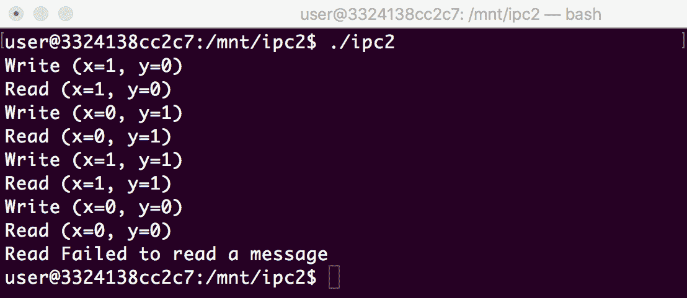

# 八、通信和序列化

复杂的嵌入式系统很少由单个应用组成。 将所有逻辑放在同一个应用中是脆弱的，容易出错，有时几乎不可行，因为系统的不同功能可能由不同的团队甚至不同的供应商开发。 这就是为什么隔离独立应用中的功能逻辑并使用定义良好的协议相互通信是扩展嵌入式软件的常用方法。 此外，这种隔离只需极少的修改即可用于与远程系统上托管的应用通信，从而使其更具可伸缩性。 我们将学习如何通过将应用的逻辑拆分成相互通信的独立组件来构建健壮且可伸缩的应用。

在本章中，我们将介绍以下主题：

*   在应用中使用进程间通信
*   进程间通信机制探讨
*   了解消息队列和发布者-订阅者模型
*   使用 C++ lambdas 进行回调
*   探索数据序列化
*   使用 FlatBuffers 库

本章中的菜谱将帮助您理解可伸缩和独立于平台的数据交换的基本概念。 它们可以用来实现从嵌入式系统到云或远程后端的数据传输，或者用来设计使用微服务架构的嵌入式系统。

# 在应用中使用进程间通信

大多数现代操作系统使用底层硬件平台提供的内存虚拟化支持来相互隔离应用进程。

每个进程都有自己的虚拟地址空间，完全独立于其他应用的地址空间。 这给开发人员带来了巨大的好处。 由于应用的寻址进程是独立的，因此一个应用不会意外损坏另一个应用的内存。 因此，一个应用中的故障不会影响整个系统。 由于所有其他应用都继续工作，因此系统可以通过重新启动出现故障的应用来恢复。

内存隔离的好处是要付出代价的。 由于一个进程不能访问另一个进程的内存，它需要使用专用的**A****应用接口**(**API**)进行数据交换，或者使用操作系统提供的**进程间通信**(**IPC**)。

在本食谱中，我们将学习如何使用共享文件在两个进程之间交换信息。 它可能不是最高效的性能机制，但它无处不在，易于使用，足以满足各种实际用例。

# 怎么做……

在本食谱中，我们将创建一个示例应用，该应用创建两个流程。 一个进程生成数据，而另一个进程读取数据并将其打印到控制台：

1.  在您的工作目录(`~/test`)中，创建一个名为`ipc1`的子目录。
2.  使用您喜欢的文本编辑器在`ipc1`子目录中创建一个`ipc1.cpp`文件。
3.  我们将定义两个模板化类来组织数据交换。 第一个类`Writer`用于将数据写入文件。 让我们将其定义放在`ipc1.cpp`文件中：

```cpp
#include <fstream>
#include <iostream>
#include <thread>
#include <vector>

#include <unistd.h>

std::string kSharedFile = "/tmp/test.bin";

template<class T>
class Writer {
  private:
    std::ofstream out;
  public:
    Writer(std::string& name):
      out(name, std::ofstream::binary) {}

    void Write(const T& data) {
      out.write(reinterpret_cast<const char*>(&data), sizeof(T));
    }
};
```

4.  紧随其后的是`Reader`类的定义，该类负责从文件中读取数据：

```cpp
template<class T>
class Reader {
  private:
    std::ifstream in;
  public:
    Reader(std::string& name) {
      for(int count=10; count && !in.is_open(); count--) {
        in.open(name, std::ifstream::binary);
        std::this_thread::sleep_for(std::chrono::milliseconds(10));
      }
    }

    T Read() {
      int count = 10;
      for (;count && in.eof(); count--) {
        std::this_thread::sleep_for(std::chrono::milliseconds(10));
      }

      T data;
      in.read(reinterpret_cast<char*>(&data), sizeof(data));
      if (!in) {
        throw std::runtime_error("Failed to read a message");
      }
      return data;
    }
};
```

5.  接下来，我们定义将用于数据的数据类型：

```cpp
struct Message {
  int x, y;
};

std::ostream& operator<<(std::ostream& o, const Message& m) {
  o << "(x=" << m.x << ", y=" << m.y << ")";
}
```

6.  为了将所有内容包装在一起，我们定义了`DoWrites`和`DoReads`函数，以及调用它们的`main`函数：

```cpp
void DoWrites() {
  std::vector<Message> messages {{1, 0}, {0, 1}, {1, 1}, {0, 0}};
  Writer<Message> writer(kSharedFile);
  for (const auto& m : messages) {
    std::cout << "Write " << m << std::endl;
    writer.Write(m);
  }
}

void DoReads() {
  Reader<Message> reader(kSharedFile);
  try {
    while(true) {
      std::cout << "Read " << reader.Read() << std::endl;
    }
  } catch (const std::runtime_error& e) {
    std::cout << e.what() << std::endl;
  }
}

int main(int argc, char** argv) {
  if (fork()) {
    DoWrites();
  } else {
    DoReads();
  }
}
```

7.  最后，创建一个`CMakeLists.txt`文件，其中包含程序的构建规则：

```cpp
cmake_minimum_required(VERSION 3.5.1)
project(ipc1)
add_executable(ipc1 ipc1.cpp)

set(CMAKE_SYSTEM_NAME Linux)
set(CMAKE_SYSTEM_PROCESSOR arm)

SET(CMAKE_CXX_FLAGS "--std=c++ 11")

set(CMAKE_CXX_COMPILER /usr/bin/arm-linux-gnueabi-g++)
```

现在您可以构建和运行应用了。

# 它是如何运作的..。

在我们的应用中，我们使用文件系统中的共享文件探索两个独立进程之间的数据交换。 一个进程将数据写入文件，另一个进程从同一文件读取数据。

文件可以存储任何非结构化的字节序列。 在我们的应用中，我们利用 C++ 模板的功能来处理严格类型的 C++ 值，而不是原始字节流。 这种方法有助于编写干净、无错误的代码。

我们从定义`Write`类开始。 它是一个简单的包装器，位于用于文件输入/输出的标准 C++ `fstream`类之上。 该类的构造函数仅打开一个文件流来写入以下内容：

```cpp
Writer(std::string& name):
      out(name, std::ofstream::binary) {}
```

除了构造函数，该类只包含一个方法`Write`，该方法负责将数据写入文件。 由于文件 API 使用字节流操作，因此我们首先需要将模板化数据类型转换为原始字符缓冲区。 我们可以使用 C++ `reinterpret_cast`来实现这一点：

```cpp
out.write(reinterpret_cast<const char*>(&data), sizeof(T));
```

`Reader`类执行相反的工作-它读取由`Writer`类写入的数据。 它的构造函数稍微复杂一些。 因为在创建`Reader`类的实例时数据文件可能还没有准备好，所以构造函数会尝试循环打开它，直到打开尝试成功。 它进行`10`次尝试，每个尝试之间有 10 毫秒的暂停：

```cpp
for(int count=10; count && !in.is_open(); count--) {
        in.open(name, std::ifstream::binary);
        std::this_thread::sleep_for(std::chrono::milliseconds(10));
      }
```

`Read`方法将数据从输入流读取到临时值中，并将其返回给调用方。 与`Write`方法类似，我们使用`reinterpret_cast`将数据对象的内存作为原始字符缓冲区进行访问：

```cpp
in.read(reinterpret_cast<char*>(&data), sizeof(data));
```

我们还在`Read`方法中添加了一个等待循环，以等待`Write`写入数据。 如果我们到达文件末尾，则最多等待 1 秒以获取新数据：

```cpp
      for (;count && in.eof(); count--) {
        std::this_thread::sleep_for(std::chrono::milliseconds(10));
      }
```

如果此时文件中没有数据，或者在出现 I/O 错误的情况下，我们会抛出一个异常来指示：

```cpp
      if (!in) {
        throw std::runtime_error("Failed to read a message");
      }
```

Please note that we do not need to add any code to handle a situation where a file cannot be opened within 1 second, or data is not ready within one second. Both of these cases are handled by the same preceding code.

现在已经实现了`Writer`和`Reader`类，我们可以为数据交换定义数据类型了。 在我们的应用中，我们将交换坐标，表示为`x`和`y`整数值。 我们的数据消息如下所示：

```cpp
struct Message {
  int x, y;
};
```

为方便起见，我们覆盖了`Message`结构的`<<`运算符。 每当将`Message`的实例写入输出流时，它的格式为`(x, y)`：

```cpp
std::ostream& operator<<(std::ostream& o, const Message& m) {
  o << "(x=" << m.x << ", y=" << m.y << ")";
}
```

准备就绪后，让我们编写用于数据交换的函数。 `DoWrites`函数定义一个包含四个坐标的矢量，并创建一个`Writer`对象：

```cpp
  std::vector<Message> messages {{1, 0}, {0, 1}, {1, 1}, {0, 0}};
  Writer<Message> writer(kSharedFile);
```

然后，它在循环中写入所有坐标：

```cpp
  for (const auto& m : messages) {
    std::cout << "Write " << m << std::endl;
    writer.Write(m);
  }
```

反过来，`DoReads`函数使用与其前面的`Writer`实例相同的文件名创建`Reader`类的实例。 它进入一个无穷无尽的循环，试图读取文件中的所有消息：

```cpp
 while(true) {
      std::cout << "Read " << reader.Read() << std::endl;
    }
```

当没有更多的消息可用时，`Read`方法抛出一个异常来中断循环：

```cpp
  } catch (const std::runtime_error& e) {
    std::cout << e.what() << std::endl;
  }
```

函数的作用是：创建两个独立的进程，在其中一个进程中运行`DoWrites`，在另一个进程中运行`DoReads`。 运行应用后，我们将获得以下输出：


正如我们所看到的，写入者确实写了四个坐标，而读取器能够使用共享文件读取相同的四个坐标。

# 还有更多的..。

我们创建的应用尽可能简单，专注于严格类型的数据交换，并将数据同步和数据序列化排除在讨论范围之外。 我们将使用此应用作为更高级技术的基础，这些技术将在下面的食谱中描述。

# 进程间通信机制探讨

除了我们已经了解的共享文件之外，现代操作系统还提供了许多 IPC 机制，即：

*   管道 / 烟斗 / 管 / 笛
*   命名管道
*   本地套接字
*   网络套接字
*   共享内存

有趣的是，它们中的许多提供的 API 与我们在处理常规文件时使用的 API 完全相同。 因此，在这些类型的 IPC 之间切换是微不足道的，我们用来读写本地文件的代码也可以用来与远程网络主机上运行的应用通信。

在本食谱中，我们将学习如何使用可移植操作系统接口(**POSIX**)命名管道在驻留在同一台计算机上的两个应用之间进行通信。

# 正在做好准备

我们将使用我们创建的应用的源代码作为*的一部分，在 Applications*配方中使用进程间通信作为本配方的起点。

# 怎么做……

在本食谱中，我们将从使用 IPC 常规文件的源代码开始。 我们将修改它以使用名为**命名管道**的 IPC 机制：

1.  将`ipc1`目录的内容复制到名为`ipc2`的新目录中。
2.  打开`ipc1.cpp`文件，在`#include <unistd.h>`之后再添加两个`include`实例：

```cpp
#include <unistd.h>
#include <sys/types.h>
#include <sys/stat.h>
```

3.  修改`Writer`类的`Write`方法，增加一行：

```cpp
    void Write(const T& data) {
      out.write(reinterpret_cast<const char*>(&data), sizeof(T));
 out.flush();
    }
```

4.  `Reader`类中的修改更为实质性。 构造函数和`Read`方法都会受到影响：

```cpp
template<class T>
class Reader {
  private:
    std::ifstream in;
  public:
    Reader(std::string& name):
      in(name, std::ofstream::binary) {}

    T Read() {
      T data;
      in.read(reinterpret_cast<char*>(&data), sizeof(data));
      if (!in) {
        throw std::runtime_error("Failed to read a message");
      }
      return data;
    }
};
```

5.  向`DoWrites`函数添加一个小更改。 唯一的区别是我们在发送每条消息后增加了 10 毫秒的延迟：

```cpp
void DoWrites() {
  std::vector<Message> messages {{1, 0}, {0, 1}, {1, 1}, {0, 0}};
  Writer<Message> writer(kSharedFile);
  for (const auto& m : messages) {
    std::cout << "Write " << m << std::endl;
    writer.Write(m);
 std::this_thread::sleep_for(std::chrono::milliseconds(10));
  }
}
```

6.  最后，修改我们的`main`函数以创建命名管道，而不是常规文件：

```cpp
int main(int argc, char** argv) {
 int ret = mkfifo(kSharedFile.c_str(), 0600);
 if (!ret) {
 throw std::runtime_error("Failed to create named pipe");
 }
  if (fork()) {
    DoWrites();
  } else {
    DoReads();
  }
}
```

现在您可以构建和运行应用了。

# 它是如何运作的..。

如您所见，我们对应用的代码进行了最少的更改。 所有读写数据的机制和 API 都保持不变。 关键的区别隐藏在一行代码后面：

```cpp
 int ret = mkfifo(kSharedFile.c_str(), 0600);
```

该行创建名为`named pipe`的特殊类型的文件。 它看起来像一个普通文件-它有名称、权限属性和修改时间。 但是，它不存储任何实际数据。 写入此文件的所有内容都会立即传送到读取此文件的进程。

这种差异有一系列后果。 由于文件中没有存储任何实际数据，因此在写入任何数据之前，所有读取尝试都会被阻止。 类似地，在读取器读取之前的数据之前，写入被阻止。

因此，不再需要进行外部数据同步。 看一下`Reader`类实现。 它在构造函数或`Read`方法中没有重试循环。

为了测试我们是否真的不需要使用任何额外的同步，我们在写入每条消息后添加了一个人为延迟：

```cpp
 std::this_thread::sleep_for(std::chrono::milliseconds(10));
```

当我们构建和运行应用时，我们可以看到以下输出：



尽管我们在`Reader`代码中没有添加任何延迟或检查，但每个`Write`方法后面都有正确的`Read`方法。 操作系统的 IPC 机制为我们透明地处理数据同步，从而产生更干净、更具可读性的代码。

# 还有更多的..。

如您所见，使用命名管道与使用常规函数一样简单。 套接字 API 是 IPC 的另一种广泛使用的机制。 它稍微复杂一些，但提供了更多的灵活性。 通过选择不同的传输层，开发人员可以将相同的套接字 API 用于本地数据交换和与远程主机的网络连接。

有关套接字 API 的更多信息，请参见[http://man7.org/linux/man-pages/man7/socket.7.html](http://man7.org/linux/man-pages/man7/socket.7.html.)。

# 了解消息队列和发布者-订阅者模型

POSIX 操作系统提供的大多数 IPC 机制都非常基础。 它们的 API 是使用文件描述符构建的，它们将输入和输出通道视为原始字节序列。

然而，应用倾向于将特定长度和目的的数据片段用于数据交换消息。 尽管操作系统的 API 机制具有灵活性和通用性，但它们并不总是便于消息交换。 这就是在默认 IPC 机制之上构建专用库和组件以简化消息交换模式的原因。

在本食谱中，我们将学习如何使用**发布者-订阅者**(**发布订阅**)模型在两个应用之间实现异步数据交换。

该模型易于理解，被广泛用于设计为相互通信的独立、松散耦合组件的集合的软件系统的开发。 功能隔离和异步数据交换使我们能够构建灵活、可扩展和健壮的解决方案。

在发布-订阅模型中，应用充当发布者、订阅者或两者兼而有之。 应用不需要向特定应用发送请求并期望它们响应，而是可以向特定主题发布消息或订阅以接收有关其感兴趣的主题的消息。 发布消息时，应用不关心有多少订阅者在收听该主题。 类似地，订阅者不知道哪个应用将发送关于特定主题的消息，或者何时期待该消息。

# 怎么做……

作为探索 IPC 配方的机制的*的一部分，我们创建的应用已经包含了许多构建块，我们可以重用它们来实现发布/订阅通信。*

`Writer`类可以充当发布者，`Reader`类可以充当订阅者。 我们实现它们来处理将定义我们的消息的严格定义的数据类型。 我们在前面的配方中使用的命名管道机制在字节级别工作，不能保证消息自动传递。

为了克服这一限制，我们将使用 POSIX 消息队列 API 而不是命名管道。 用于标识`Reader`和`Writer`都将在其构造函数中接受的消息队列的名称将用作主题：

1.  将我们在前面的配方中创建的`ipc2`目录的内容复制到一个新目录中：`ipc3`。
2.  让我们为 POSIX 消息队列 API 创建一个 C++ 包装器。 在编辑器中打开`ipc1.cpp`，添加所需的头文件和常量定义：

```cpp
#include <unistd.h>
#include <signal.h>
#include <fcntl.h>
#include <sys/stat.h>
#include <mqueue.h>

std::string kQueueName = "/test";
```

3.  然后，定义一个`MessageQueue`类。 它将消息队列句柄作为其私有数据成员保存。 通过 C++ RAII 成语，我们可以使用构造函数和析构函数以安全的方式管理句柄的打开和关闭：

```cpp
class MessageQueue {
  private:
    mqd_t handle;
  public:
    MessageQueue(const std::string& name, int flags) {
      handle = mq_open(name.c_str(), flags);
      if (handle < 0) {
        throw std::runtime_error("Failed to open a queue for 
         writing");
      }
    }

    MessageQueue(const std::string& name, int flags, int max_count, 
     int max_size) {
      struct mq_attr attrs = { 0, max_count, max_size, 0 };
      handle = mq_open(name.c_str(), flags | O_CREAT, 0666, 
       &attrs);
      if (handle < 0) {
        throw std::runtime_error("Failed to create a queue");
      }
    }

    ~MessageQueue() {
      mq_close(handle);
    }

```

4.  然后，我们定义两个向队列写入消息和从队列读取消息的简单方法：

```cpp
    void Send(const char* data, size_t len) {
      if (mq_send(handle, data, len, 0) < 0) {
        throw std::runtime_error("Failed to send a message");
      }
    }

    void Receive(char* data, size_t len) {
      if (mq_receive(handle, data, len, 0) < len) {
        throw std::runtime_error("Failed to receive a message");
      }
    }
};
```

5.  我们现在修改`Writer`和`Reader`类以使用新的 API。 我们的`MessageQueue`包装器完成了大部分繁重的任务，代码更改很少。 现在，`Writer`类如下所示：

```cpp
template<class T>
class Writer {
  private:
    MessageQueue queue;
  public:
    Writer(std::string& name):
      queue(name, O_WRONLY) {}

    void Write(const T& data) {
      queue.Send(reinterpret_cast<const char*>(&data), sizeof(data));
    }
};
```

6.  `Reader`类中的修改更为实质性。 我们让它充当订阅者，并将直接从队列获取和处理消息的逻辑封装到类中：

```cpp
template<class T>
class Reader {
  private:
    MessageQueue queue;
  public:
    Reader(std::string& name):
      queue(name, O_RDONLY) {}

    void Run() {
      T data;
      while(true) {
        queue.Receive(reinterpret_cast<char*>(&data), 
          sizeof(data));
        Callback(data);
      }
    }

  protected:
    virtual void Callback(const T& data) = 0;
};
```

7.  由于我们仍然希望尽可能保持`Reader`类的泛型，因此我们将定义一个从`Reader`派生的新类(`CoordLogger`)，以定义消息的具体处理：

```cpp
class CoordLogger : public Reader<Message> {
  using Reader<Message>::Reader;

  protected:
    void Callback(const Message& data) override {
      std::cout << "Received coordinate " << data << std::endl;
    }
};
```

8.  `DoWrites`代码基本保持不变；唯一的变化是我们使用不同的常量来标识队列：

```cpp
void DoWrites() {
  std::vector<Message> messages {{1, 0}, {0, 1}, {1, 1}, {0, 0}};
  Writer<Message> writer(kQueueName);
  for (const auto& m : messages) {
    std::cout << "Write " << m << std::endl;
    writer.Write(m);
    std::this_thread::sleep_for(std::chrono::milliseconds(10));
  }
}
```

9.  由于消息处理逻辑已移至`Reader`和`CoordLogger`类，因此`DoReads`现在就像下面这样简单：

```cpp
void DoReads() {
 CoordLogger logger(kQueueName);
 logger.Run();
}
```

10.  更新后的`main`函数如下：

```cpp
int main(int argc, char** argv) {
  MessageQueue q(kQueueName, O_WRONLY, 10, sizeof(Message));
  pid_t pid = fork();
  if (pid) {
    DoWrites();
    std::this_thread::sleep_for(std::chrono::milliseconds(100));
    kill(pid, SIGTERM);
  } else {
    DoReads();
  }
}
```

11.  最后，我们的应用需要与`rt`库链接。 我们通过在`CMakeLists.txt`文件中添加一行来完成此操作：

```cpp
target_link_libraries(ipc3 rt)
```

现在您可以构建和运行应用了。

# 它是如何运作的..。

在我们的应用中，我们重用了前面配方中创建的应用的大量代码*，探索 IPC*的机制。 要实现发布-订阅模式，我们需要进行两个重要的更改：

*   使我们的 IPC 基于消息。 我们应该能够自动发送和接收消息。 一个发布者发送的消息不应破坏其他发布者发送的消息，订阅者应该能够整体阅读消息。
*   让订阅者定义一旦有新消息可用就调用的回调。

为了进行基于消息的通信，我们从命名管道切换到 POSIX 消息队列 API。 消息队列 API 不同于命名管道的常规基于文件的 API，这就是为什么我们在 Linux 标准库提供的纯 C 接口之上实现 C++ 包装器的原因。

包装器的主要目标是使用**Resource Acquisition is Initialization**(**RAII**)习惯用法提供安全的资源管理。 我们通过定义通过调用`mq_open`获取队列处理程序的构造函数和使用`mq_close`释放队列处理程序的析构函数来实现这一点。 这样，当`MessageQueue`类的相应实例被销毁时，队列将自动关闭。

包装类有两个构造函数。 一个构造函数用于打开现有队列。 它接受两个参数-队列名称和访问标志。 第二个构造函数用于创建新队列。 它接受两个附加参数-消息长度和队列中消息的最大大小。

在我们的应用中，我们在`main`函数中创建一个队列，传递`10`作为队列中可以存储的消息数量。 `Message`结构的大小是队列中消息的最大大小：

```cpp
  MessageQueue q(kQueueName, O_WRONLY, 10, sizeof(Message));
```

然后，`DoWrites`和`DoReads`函数打开已创建的同名队列。

由于我们的`MessageQueue`类的公共 API 类似于我们用于使用命名管道的 IPC 的`fstream`接口，因此只需对写入器和读取器进行最小的更改，即可使它们与另一种 IPC 机制一起工作。 我们使用`MessageQueue`的实例而不是`fstream`作为数据成员，保持其他逻辑不变。

要让订阅者定义他们的回调方法，我们需要修改`Reader`类。 我们引入了`Run`方法，而不是读取并返回单个方法的`Read`方法。 它循环队列中所有可用的消息。 对于读取的每个方法，它都会调用一个回调方法：

```cpp
      while(true) {
        queue.Receive(reinterpret_cast<char*>(&data), sizeof(data));
        Callback(data);
      }
```

我们的目标是保持`Reader`类对于不同类型的消息的泛型和可重用性。 然而，并不存在泛型回调这样的东西。 每个回调都是特定的，应该由`Reader`类的用户定义。

解决这一矛盾的一种方法是使`Reader`成为抽象类。 我们将`Callback`方法定义为`virtual`函数：

```cpp
  protected:
    virtual void Callback(const T& data) = 0;
```

现在，由于`Reader`是抽象的，我们不能创建该类的实例。 我们必须继承它，并在名为`CoordLogger`的派生类中提供`Callback`方法的定义：

```cpp
  protected:
    void Callback(const Message& data) override {
      std::cout << "Received coordinate " << data << std::endl;
    }
```

请注意，由于`Reader`构造函数接受参数，因此我们还需要在继承的类中定义构造函数。 我们将使用 C++ 11 标准中添加的继承构造函数：

```cpp
  using Reader<Message>::Reader;
```

现在，有了能够处理`Message`类型消息的`CoordLogger`类，我们就可以在我们的`DoReads`实现中使用它了。 我们只需要创建该类的一个实例并调用它的`Run`方法：

```cpp
  CoordLogger logger(kQueueName);
  logger.Run();
```

当我们运行应用时，我们会得到以下输出：


此输出与前面配方中的输出没有太大不同，但现在实现的可伸缩性更强。 `DoReads`方法不执行任何特定于消息的操作。 它唯一的任务是创建和运行订阅服务器。 所有数据处理都封装在特定的类中。 您可以在不更改应用体系结构的情况下添加、替换和组合发布者和订阅者。

# 还有更多的..。

POSIX 消息队列 API 为消息队列提供了基本功能，但也有一些限制。 不可能使用一个消息队列向多个订阅者发送消息。 您必须为每个订阅者创建单独的队列，否则从队列中读取的订阅者中只有一个会收到消息。

有许多精致的消息队列和发布-订阅中间件以外部库的形式提供。 ZeroMQ 是一个强大、灵活、同时也是轻量级的传输库。 这使得它成为使用数据交换的发布-订阅模型构建的嵌入式应用的理想选择。

# 使用 C++ lambdas 进行回调

在发布-订阅模型中，订阅者通常注册一个回调，当来自发布者的消息传递给订阅者时将调用该回调。

在前面的配方中，我们创建了一种使用继承和抽象类注册回调的机制。 它不是 C++ 中唯一可用的机制。 C++ 中提供的 Lambda 函数(从 C++ 11 标准开始)可以用作替代解决方案。 这消除了定义派生类所需的大量样板代码，并且在大多数情况下，允许开发人员以更清晰的方式表达他们的意图。

在本食谱中，我们将学习如何使用 C++ lambda 函数来定义回调。

# 怎么做……

我们将使用前面菜谱中的大部分代码，*了解消息队列和发布者-订阅者模型*。 我们将修改`Reader`类以接受回调作为参数。 通过这个修改，我们可以直接使用`Reader`，而不需要依赖继承来定义回调：

1.  将我们在前面的配方中创建的`ipc3`目录的内容复制到一个新目录中：`ipc4`。
2.  保持所有代码不变，但`Reader`类除外。 让我们将其替换为以下代码片段：

```cpp
template<class T>
class Reader {
  private:
    MessageQueue queue;
    void (*func)(const T&);
  public:
    Reader(std::string& name, void (*func)(const T&)):
      queue(name, O_RDONLY), func(func) {}

    void Run() {
      T data;
      while(true) {
        queue.Receive(reinterpret_cast<char*>(&data), 
         sizeof(data));
        func(data);
      }
    }
};
```

3.  既然我们的`Reader`类已经更改，我们就可以更新`DoReads`方法了。 我们可以使用 lambda 函数定义回调处理程序并将其传递给`Reader`构造函数：

```cpp
void DoReads() {
  Reader<Message> logger(kQueueName, [](const Message& data) {
    std::cout << "Received coordinate " << data << std::endl;
  });
  logger.Run();
}
```

4.  不再需要`CoordLogger`类，因此我们可以安全地将其从代码中完全删除。
5.  您可以构建和运行应用。

# 它是如何运作的..。

在这个配方中，我们修改了前面定义的`Reader`类，以接受其构造函数中的一个附加参数。 此参数具有特定的数据类型-指向函数的指针，该函数将用作回调：

```cpp
Reader(std::string& name, void (*func)(const T&)):
```

处理程序存储在数据字段中以备将来使用：

```cpp
void (*func)(const T&);
```

现在，`Run`方法每次读取消息时，都会调用存储在`func`字段中的函数，而不是我们需要覆盖的`Callback`方法：

```cpp
queue.Receive(reinterpret_cast<char*>(&data), sizeof(data));
func(data);
```

去掉`Callback`函数使`Reader`成为一个具体的类，我们可以直接创建它的实例。 但是，现在我们需要提供一个处理程序作为其构造函数的参数。

使用纯 C 语言，我们必须定义一个`named`函数并将其名称作为参数传递。 使用 C++，这种方法也是可能的，但 C++ 还提供了匿名函数或 lambda 函数的机制，这些函数可以在适当的位置定义。

在`DoReads`方法中，我们创建了一个 lambda 函数，并将其直接传递给`Reader`构造函数：

```cpp
  Reader<Message> logger(kQueueName, [](const Message& data) {
 std::cout << "Received coordinate " << data << std::endl;
 });
```

构建和运行应用会产生以下输出：


正如我们所看到的，它与我们在前面的菜谱中创建的应用的输出相同。 但是，我们使用更少的代码和更好的可读性来完成这项工作。

应该明智地使用 lambda 函数。 如果保持最小，它们会使代码更具可读性。 如果函数超过五行，请考虑改用命名函数。

# 还有更多的..。

C++ 为处理类似函数的对象提供了灵活的机制，并将它们与参数绑定。 这些机制被广泛用于转发调用和构建函数适配器。 [https://en.cppreference.com/w/cpp/utility/functional](https://en.cppreference.com/w/cpp/utility/functional)上的*函数对象*页是深入理解这些主题的一个很好的起点。

# 探索数据序列化

我们已经在[第 3 章](03.html)、*《使用不同的体系结构》*中简要介绍了序列化的某些方面。 当涉及到数据交换时，序列化是至关重要的。 序列化的任务是以接收方应用可以明确读取的方式表示发送方应用发送的所有数据。 鉴于发送器和接收器可能运行在不同的硬件平台上，并通过各种传输链路连接-**传输控制协议**/**网际协议**(**TCP/IP**)网络、**串行外设接口**(**SPI**)总线或串行链路，这项任务就不那么简单了。

根据需求，有许多不同的实现序列化的方法，这就是 C++ 标准库不提供现成的序列化的原因。

在本食谱中，我们将学习如何在 C++ 应用中实现简单的泛型序列化和反序列化。

# 怎么做……

序列化的目标是以一种可以在另一个系统或另一个应用中正确解码的方式对任何数据进行编码。 开发人员面临的典型障碍如下：

*   特定于平台的差异，例如数据对齐和字节顺序。
*   分散在内存中的数据；例如，链表的元素可以位于彼此相距较远的位置。 由指针链接的断开连接的块的表示对于内存来说是自然的，但在将其传输到另一个进程时不能自动转换为字节序列。

解决此问题的一般方法是让类定义将其内容转换为序列化形式并从序列化形式恢复类实例的函数。

在我们的应用中，我们将重载输出流的`operator<<`和输入流的`operator>>`，以分别序列化和反序列化数据：

1.  在您的`~/test`工作目录中，创建一个名为`stream`的子目录。
2.  使用您喜欢的文本编辑器在`stream`子目录中创建`stream.cpp`文件。
3.  从要序列化的数据结构的定义开始：

```cpp
#include <iostream>
#include <sstream>
#include <list>

struct Point {
  int x, y;
};

struct Paths {
  Point source;
  std::list<Point> destinations;
};
```

4.  接下来，我们重载`<<`和`>>`操作符，这两个操作符分别负责将`Point`对象写入流和从流中读取对象。 对于`Point`数据类型，请输入以下内容：

```cpp
std::ostream& operator<<(std::ostream& o, const Point& p) {
  o << p.x << " " << p.y << " ";
  return o;
}

std::istream& operator>>(std::istream& is, Point& p) {
  is >> p.x;
  is >> p.y;
  return is;
}
```

5.  后跟`Paths`对象的`<<`和`>>`重载运算符：

```cpp
std::ostream& operator<<(std::ostream& o, const Paths& paths) {
  o << paths.source << paths.destinations.size() << " ";
  for (const auto& x : paths.destinations) {
    o << x;
  }
  return o;
}

std::istream& operator>>(std::istream& is, Paths& paths) {
  size_t size;
  is >> paths.source;
  is >> size;
  for (;size;size--) {
    Point tmp;
    is >> tmp;
    paths.destinations.push_back(tmp);
  }
  return is;
}
```

6.  现在，让我们将所有内容包装在`main`函数中：

```cpp
int main(int argc, char** argv) {
  Paths paths = {{0, 0}, {{1, 1}, {0, 1}, {1, 0}}};

  std::stringstream in;
  in << paths;
  std::string serialized = in.str();
  std::cout << "Serialized paths into the string: ["
            << serialized << "]" << std::endl;

  std::stringstream out(serialized);
  Paths paths2;
  out >> paths2;
  std::cout << "Original: " << paths.destinations.size()
            << " destinations" << std::endl;
  std::cout << "Restored: " << paths2.destinations.size()
            << " destinations" << std::endl;

  return 0;
}
```

7.  最后，创建一个`CMakeLists.txt`文件，其中包含程序的构建规则：

```cpp
cmake_minimum_required(VERSION 3.5.1)
project(stream)
add_executable(stream stream.cpp)

set(CMAKE_SYSTEM_NAME Linux)
set(CMAKE_SYSTEM_PROCESSOR arm)

SET(CMAKE_CXX_FLAGS "--std=c++ 11")

set(CMAKE_CXX_COMPILER /usr/bin/arm-linux-gnueabi-g++)
```

现在您可以构建和运行应用了。

# 它是如何运作的..。

在我们的测试应用中，我们定义了一个数据类型来表示从一个源点到多个目标点的路径。 我们有意使用分散在内存中的层次结构来演示如何以通用方式处理此问题。

如果我们对性能没有特定的要求，序列化的可能方法之一是以文本格式存储数据。 除了简单之外，它还有两大优势：

*   文本编码自动解决与字节顺序、对齐方式和整数数据类型大小相关的所有问题。
*   它是人类可读的。 开发人员无需任何附加工具即可使用序列化数据进行调试。

要使用文本表示，我们可以使用标准库提供的输入流和输出流。 它们已经定义了写入和读取格式化数字的函数。

`Point`结构定义为两个整数值：`x`和`y`。 我们覆盖此数据类型的`operator<<`以写入`x`和`y`值，后跟空格。 这样，我们就可以在覆盖的`operator>>`操作中顺序读取它们。

`Path`数据类型稍微复杂一些。 它包含目的地的链接列表。 由于列表的大小可能会有所不同，因此我们需要在序列化列表内容之前写入列表的实际大小，以便能够在反序列化过程中正确地恢复它：

```cpp
  o << paths.source << paths.destinations.size() << " ";
```

因为我们已经覆盖了`<<`和`>>`运算符的`Point`方法，所以我们可以在`Paths`方法中使用它们。 这样，我们将`Point`对象写入流或从流中读取它们，而不知道它们的数据字段的内容。 递归处理分层数据结构：

```cpp
  for (const auto& x : paths.destinations) {
    o << x;
  }
```

最后，我们测试我们的序列化和反序列化实现。 我们创建`Paths`对象的示例实例：

```cpp
Paths paths = {{0, 0}, {{1, 1}, {0, 1}, {1, 0}}};
```

然后，我们使用`std::stringstream`数据类型将其内容序列化为字符串：

```cpp
  std::stringstream in;
  in << paths;
  std::string serialized = in.str();
```

接下来，我们创建一个空的`Path`对象，并将字符串的内容反序列化到其中：

```cpp
  Paths paths2;
  out >> paths2;
```

最后，我们检查它们是否匹配。 当我们运行应用时，我们可以使用以下输出来执行此操作：


还原对象的`destinations`列表的大小与原始对象的`destinations`列表的大小匹配。 我们还可以看到序列化数据的内容。

此示例说明如何为任何数据类型生成自定义序列化。 它可以在没有任何外部库的情况下完成。 但是，在性能和内存效率很重要的情况下，使用第三方序列化库将是更实际的方法。

# 还有更多的..。

从头开始实现序列化是很困难的。 位于[https://uscilab.github.io/cereal/](https://uscilab.github.io/cereal/)的谷物库和位于[https://www.boost.org/doc/libs/1_71_0/libs/serialization/doc/index.html](https://www.boost.org/doc/libs/1_71_0/libs/serialization/doc/index.html)的 Boost 库提供了一个基础，可以帮助您更快、更轻松地向应用添加序列化。

# 使用 FlatBuffers 库

序列化和反序列化是一个复杂的主题。 虽然临时序列化看起来简单明了，但很难使其泛型、易于使用和快速。 值得庆幸的是，有一些库可以处理所有这些复杂性。

在本食谱中，我们将学习如何使用其中一个序列化库：FlatBuffers。 它的设计考虑到了嵌入式编程，使序列化和反序列化内存变得高效和快速。

FlatBuffers 使用**接口定义语言**(**IDL**)定义数据模式。 该架构描述了我们需要序列化的数据结构的所有字段。 在设计模式时，我们使用名为**flatc**的特殊工具来生成特定编程语言的代码，在我们的示例中是 C++。

生成的代码以序列化形式存储所有数据，并为开发人员提供所谓的**getter**和**setter**方法来访问数据字段。 Getter 动态执行反序列化。 以序列化形式存储数据使 FlatBuffer 真正提高了内存效率。 不需要额外的内存来存储序列化数据，而且在大多数情况下，反序列化的开销很低。

在本食谱中，我们将学习如何开始在我们的应用中使用 FlatBuffer 进行数据序列化。

# 怎么做……

FlatBuffers 是一组工具和库。 在使用之前，我们需要下载并构建它：

1.  从[https://codeload.github.com/google/flatbuffers/zip/master](https://codeload.github.com/google/flatbuffers/zip/master)下载最新的 FlatBuffer 存档，并将其解压到`test`目录中。 这将创建一个名为`flatbuffers-master`的新目录。
2.  切换到构建控制台，将目录更改为`flatbuffers-master`，然后运行以下命令来构建和安装库和工具。 确保您以 root 身份运行。 如果没有，按*Ctrl*+*C*退出用户外壳：

```cpp
# cmake .
# make
# make install
```

现在，我们可以在应用中使用 FlatBuffers 了。 让我们重用我们在前面的一个食谱中创建的应用：

3.  将`ipc4`目录的内容复制到新创建的名为`flat`的目录中。
4.  创建名为`message.fbs`的文件，在编辑器中打开该文件，然后输入以下代码：

```cpp
 struct Message {
 x: int;
 y: int;
}
```

5.  通过运行以下命令从`message.fbs`生成 C++ 源代码：

```cpp
$ flatc --cpp message.fbs
```

这将创建一个名为`message_generated.h`的新文件。

6.  在编辑器中打开`ipc1.cpp`。 在`mqueue.h`include 之后添加生成的`message_generated.h`文件的`include`指令：

```cpp
#include <mqueue.h>

#include "message_generated.h"
```

7.  现在，去掉代码中声明的`Message`结构。 我们将改用在 FlatBuffers 架构文件中生成的结构。

8.  由于 FlatBuffers 使用 getter 方法而不是直接访问结构字段，因此我们需要修改用于将点数据打印到控制台的重新定义的`operator<<`操作的主体。 更改很小-我们只向每个数据字段添加括号：

```cpp
 std::ostream& operator<<(std::ostream& o, const Message& m) {
  o << "(x=" << m.x() << ", y=" << m.y() << ")";
}
```

9.  代码修改已经完成。 现在，我们需要更新构建规则以链接到 FlatBuffers 库。 打开`CMakeLists.txt`并输入以下行：

```cpp
cmake_minimum_required(VERSION 3.5.1)
project(flat)
add_executable(flat ipc1.cpp)

set(CMAKE_SYSTEM_NAME Linux)
set(CMAKE_SYSTEM_PROCESSOR arm)

SET(CMAKE_CXX_FLAGS_RELEASE "--std=c++ 11")
SET(CMAKE_CXX_FLAGS_DEBUG "${CMAKE_CXX_FLAGS_RELEASE} -g -DDEBUG")
target_link_libraries(flat rt flatbuffers)

set(CMAKE_C_COMPILER /usr/bin/arm-linux-gnueabi-gcc)
set(CMAKE_CXX_COMPILER /usr/bin/arm-linux-gnueabi-g++)

set(CMAKE_FIND_ROOT_PATH_MODE_PROGRAM NEVER)
set(CMAKE_FIND_ROOT_PATH_MODE_LIBRARY ONLY)
set(CMAKE_FIND_ROOT_PATH_MODE_INCLUDE ONLY)
set(CMAKE_FIND_ROOT_PATH_MODE_PACKAGE ONLY)
```

10.  切换到构建控制台，然后切换到用户 shell：

```cpp
# su - user
$
```

11.  构建并运行应用。

# 它是如何运作的..。

FlatBuffers 是一个外部库，它在 Ubuntu 包存储库中不可用，这就是为什么我们需要首先下载、构建和安装它。 安装完成后，我们可以在应用中使用它。

我们使用使用 C++ lambdas for callback 配方为*创建的现有应用作为起点。 在该应用中，我们定义了一个名为`Message`的结构来表示我们用于 IPC 的数据类型。 我们将用 FlatBuffers 提供的新数据类型替换它。 这个新的数据类型将透明地执行所有必要的序列化和反序列化。*

我们从代码中完全删除了`Message`结构的定义。 相反，我们生成一个新的头文件，名为`message_generated.h`。 此文件是从`message.fbs`FlatBuffers 架构文件生成的。 此架构文件定义了一个具有两个整数字段的结构-`x`和`y`：

```cpp
  x: int;
  y: int;
```

此定义与前面的定义相同；唯一的区别是语法-FlatBuffers 的架构使用冒号将字段名称与字段类型分开。

一旦通过`flatc`命令调用创建了`message_generated.h`，我们就可以在我们的代码中使用它了。 我们按如下方式添加适当的`include`：

```cpp
#include "message_generated.h"
```

生成的消息与我们之前使用的消息结构相同，但是正如我们前面讨论的那样，FlatBuffers 以序列化的形式存储数据，并且需要动态地反序列化数据。 这就是为什么我们必须使用`x()`访问器方法而不只是`x`和`y()`访问器方法而不是只使用`y`，而不是直接访问数据字段。

我们使用直接访问消息数据字段的唯一位置是重写的`operator<<`操作。 我们添加圆括号将直接字段访问转换为调用 FlatBuffers getter 方法：

```cpp
  o << "(x=" << m.x() << ", y=" << m.y() << ")";
```

让我们构建并运行应用。 我们将看到以下输出：


输出与我们的自定义消息数据类型相同。 只需对代码进行少量修改，我们就可以将消息迁移到 FlatBuffer。 现在，我们可以在多台计算机上运行我们的发布器和订阅器-这些计算机可以有不同的体系结构-并确保每台计算机都能正确地解释消息。

# 还有更多的..。

除了 FlatBuffer 之外，还有许多其他序列化库和技术，每种技术都有其优缺点。 要更好地了解如何在应用中设计序列化，请参阅[https://isocpp.org/wiki/faq/serialization](https://isocpp.org/wiki/faq/serialization)上的*C++ 序列化常见问题*。