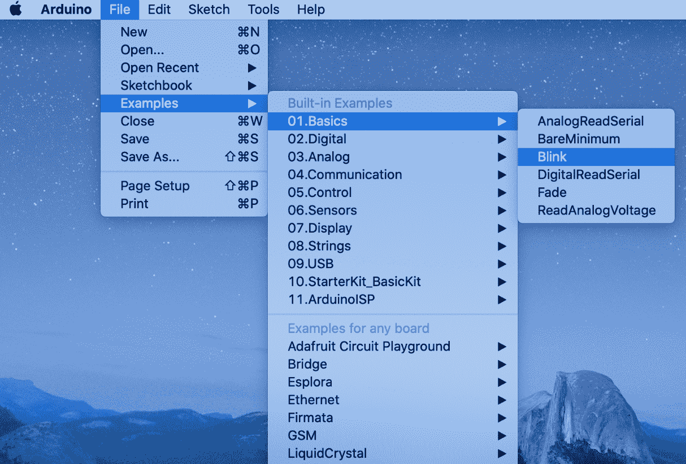
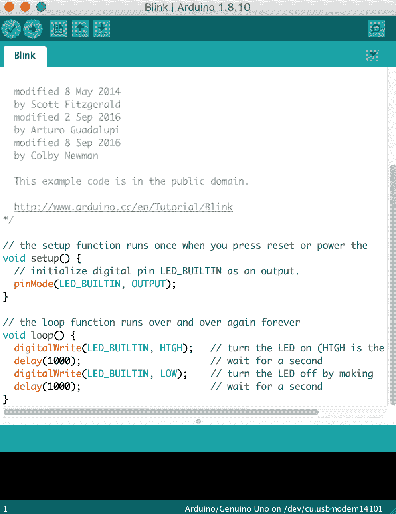
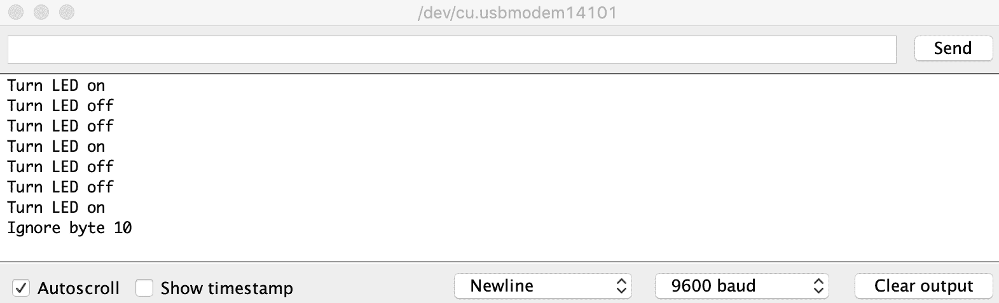

# 十五、微控制器编程

在前几章中，我们主要讨论了适用于相对强大的嵌入式系统的主题，这些嵌入式系统具有兆字节的内存并运行 Linux 操作系统。现在，我们将探索嵌入式系统领域的另一面——微控制器。

正如我们在介绍中所讨论的，微控制器通常用于执行简单的、通常是实时的任务，例如收集数据或向特定设备提供高级应用编程接口。微控制器价格低廉，能耗低，可以在各种环境条件下工作，是物联网应用的完美选择。

他们低成本的另一面是他们的能力。通常，它们具有以千字节为单位的板载内存，并且没有硬件内存映射。他们根本不运行任何操作系统，或者运行像 FreeRTOS 这样的简单实时操作系统。

有许多型号的微控制器，是为特定应用量身定制的。在本章中，我们将学习如何使用 Arduino 开发环境。这些配方是为 Arduino UNO 板创建的，该板构建在 ATmega328 微控制器之上，该微控制器广泛用于教育和原型制作，但它们也适用于其他 Arduino 板。

我们将涵盖以下主题:

*   建立开发环境
*   编译和上传程序
*   调试微控制器代码

这些食谱将有助于设置环境和开始微控制器的开发。

# 建立开发环境

Arduino UNO 板附带了一个集成开发环境，即 IDE，称为 Arduino IDE。可以从[https://www.arduino.cc/](https://www.arduino.cc/)T2【网站】免费下载。

在本食谱中，我们将学习如何设置和连接您的 Arduino 板。

# 怎么做...

我们将安装 Arduino IDE，将 Arduino UNO 板连接到您的计算机，然后在 IDE 和板之间建立通信:

1.  在浏览器中，打开下载([https://www.arduino.cc/en/Main/Software](https://www.arduino.cc/en/Main/Software))页面，选择与您的操作系统相匹配的安装选项。
2.  下载完成后，按照*入门*([https://www.arduino.cc/en/Guide/HomePage](https://www.arduino.cc/en/Guide/HomePage))页面的安装说明进行操作。
3.  使用 USB 电缆将 Arduino 板连接到计算机。它会自动开机。
4.  运行 Arduino IDE。
5.  现在，我们需要在 IDE 和板之间建立通信。切换到 Arduino IDE 窗口。在应用菜单中，选择工具->端口。这将打开一个带有串行端口选项的子菜单。选择名称中有 Arduino 的那个。
6.  在“工具”菜单中，单击“电路板”项目，然后选择 Arduino 电路板的型号。
7.  选择工具->电路板信息菜单项。

# 它是如何工作的...

Arduino 主板附带一个免费的 IDE，可以从制造商的网站下载。集成开发环境的安装很简单，与您的平台的任何其他软件的安装没有什么不同。

所有代码都是在集成开发环境中编写、编译和调试的，但是生成的编译图像应该被刷新到目标板上并在那里执行。为此，集成开发环境应该能够与主板通信。

主板通过通用串行总线连接到运行集成开发环境的计算机。USB 电缆不仅提供通信，还为电路板供电。板一连接到计算机，它就打开并开始工作。

集成开发环境使用串行接口与主板通信。由于您的计算机上可能已经配置了多个串行端口，因此设置通信的步骤之一是选择一个可用的端口。通常是名字里有 Arduino 的那个:


最后，一旦选择了端口，我们就让 IDE 知道我们使用的 Arduino 板的类型。一旦完成，我们就可以检查板和 IDE 之间的通信是否真的有效。当我们调用板信息菜单项时，集成开发环境会显示一个对话框窗口，其中包含与连接的板相关的信息:


如果对话框没有出现，这表明有问题。主板可能已断开或损坏，或者选择了错误的端口。否则，我们准备好构建和运行我们的第一个程序。

# 还有更多...

如果出现问题，请考虑阅读 Arduino 网站上的故障排除部分([https://www.arduino.cc/en/Guide/Troubleshooting](https://www.arduino.cc/en/Guide/Troubleshooting))。

# 编译和上传程序

在前面的食谱中，我们学习了如何设置开发环境。现在，让我们编译并运行我们的第一个程序。

Arduino UNO 板本身没有屏幕，但是我们需要一些方法来知道我们的程序正在做什么。然而，它确实有一个内置的发光二极管，我们可以通过我们的程序进行控制，而无需将任何外部设备连接到主板。

在这个食谱中，我们将学习如何编译和运行一个程序，在 Arduino UNO 板上闪烁一个内置的 LED。

# 怎么做...

我们将编译一个集成开发环境附带的现有示例应用并上传到板上:

1.  将 Arduino 板连接到您的计算机，并打开 Arduino IDE。
2.  在 Arduino IDE 中，打开文件菜单，选择示例-> 01。基础->眨眼。
3.  一个新的窗口将会打开。在此窗口中，单击上传按钮。
4.  观察板上的内置指示灯如何开始闪烁。

# 它是如何工作的...

Arduino 是一个广泛用于教育目的的平台。它被设计成易于使用，并附有一堆例子。对于我们的第一个程序，我们选择了一个不需要电路板与外部外设连接的应用。启动集成开发环境后，我们从可用的示例中选择了 Blink 应用，如下所示:



这将打开一个包含程序代码的窗口:



除了程序的源代码，我们还可以看到一个黑色的控制台窗口和一个状态栏，表明 Arduino UNO 板是通过`/dev/cu.usbmodem14101`串口连接的。设备名称取决于主板型号，端口名称在 Windows 或 Linux 中可能会有所不同。

在源代码上面，我们可以看到几个按钮。第二个按钮是向右箭头，是上传按钮。一旦我们按下它，集成开发环境就开始构建应用，然后将生成的二进制文件上传到板上。我们可以在控制台窗口中看到构建状态:


应用在上传后立即启动。如果我们看一下主板，可以看到内置的黄色 LED 已经开始闪烁。我们能够构建并运行第一个 Arduino 应用。

# 还有更多...

上传后，您的程序存储在主板上的闪存中。如果您关闭主板电源，然后再次打开，即使没有运行 IDE，程序也会开始运行。

# 调试微控制器代码

与更强大的嵌入式平台如树莓 PI 相比，Arduino 的调试能力有限。Arduino IDE 不提供集成调试器，Arduino 板本身没有内置屏幕。然而，它确实有通用异步收发器，并提供了一个串行接口，可用于调试目的。

在这个食谱中，我们将学习如何使用 Arduino 串行接口来调试和读取用户输入。

# 怎么做...

我们将为 Arduino 控制器实现一个简单的程序，该程序等待串行端口上的用户输入，并根据数据打开或关闭内置 LED:

1.  打开 Arduino IDE，并在其文件菜单中选择新建。将显示一个新的“草图”窗口。
2.  将以下代码片段粘贴到“草图”窗口中:

```cpp
void setup() {
 pinMode(LED_BUILTIN, OUTPUT);
 Serial.begin(9600);
 while (!Serial);
}

void loop() {
  if (Serial.available() > 0) {
      int inByte = Serial.read();
      if (inByte == '1') {
        Serial.print("Turn LED on\n");
        digitalWrite(LED_BUILTIN, HIGH);
      } else if (inByte == '0') {
        Serial.print("Turn LED off\n");
        digitalWrite(LED_BUILTIN, LOW); 
      } else {
        Serial.print("Ignore byte ");
        Serial.print(inByte);
        Serial.print("\n");
      }
      delay(500);
  }
}
```

3.  单击上传按钮构建并运行代码。
4.  在 Arduino IDE 的“工具”菜单中选择“串行监视器”。将出现串行监视器窗口。
5.  在串行监视器窗口中，输入`1010110`。

# 它是如何工作的...

我们创建了一个新的 Arduino 草图，它由两个函数组成。第一个函数`setup`在程序启动时被调用，用于提供应用的初始配置。

在我们的例子中，我们需要初始化串行接口。串行通信最重要的参数是其每秒比特数的速度。微控制器和集成开发环境应该同意使用相同的速度，否则通信将无法工作。默认情况下，串行监视器每秒使用 9600 位，我们在程序中使用该值:

```cpp
Serial.begin(9600);
```

不过，可以使用更高的通信速度。串行监视器在屏幕右下角有一个下拉菜单，允许选择其他速度。如果您决定使用其他速度，则应相应地修改代码。

我们还配置了引脚 13，对应于内置发光二极管，用于输出:

```cpp
pinMode(LED_BUILTIN, OUTPUT);
```

我们用常量`LED_BUILTIN`代替`13`，让代码更容易理解。第二个函数`loop`，定义了 Arduino 程序的一个无限循环。对于每次迭代，我们从串行端口读取一个字节:

```cpp
if (Serial.available() > 0) {
      int inByte = Serial.read();
```

如果字节是`1`，我们打开 LED，写一条信息回串口:

```cpp
        Serial.print("Turn LED on\n");
        digitalWrite(LED_BUILTIN, HIGH);
```

同样，对于`0`，我们关闭 LED:

```cpp
        Serial.print("Turn LED off\n");
        digitalWrite(LED_BUILTIN, LOW); 
```

所有其他值都会被忽略。从端口读取每个字节后，我们增加 500 微秒的延迟。这样，我们可以定义不同的眨眼模式。比如我们发`1001001`，LED 会先亮 0.5 秒，再灭 1 秒，再亮 0.5 秒，再灭 1 秒，最后再亮。

如果我们运行代码并在串行监视器中输入`1001001`，我们可以看到以下输出:



指示灯按预期闪烁，除此之外，我们还可以在串行监视器中看到调试消息。这样，我们可以调试真实的、更复杂的应用。