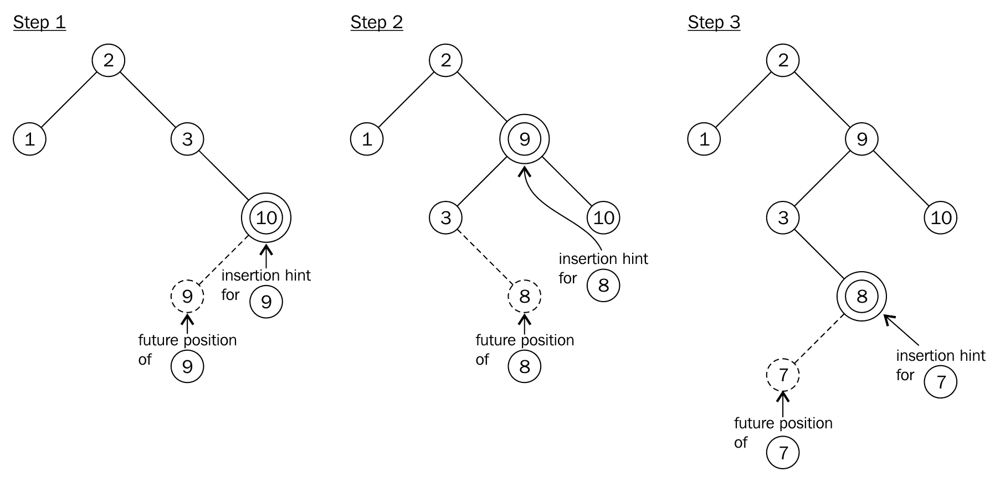
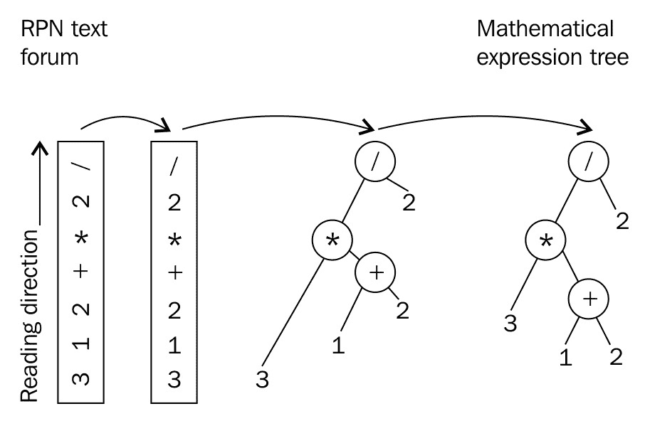

# 集装箱

我们将在本章介绍以下食谱:

*   使用`std::vector`上的擦除-移除成语
*   在 T2 时间从未排序的中删除项目
*   快速或安全地访问`std::vector`实例
*   保持`std::vector`实例排序
*   高效且有条件地将项目插入`std::map`
*   了解`std::map::insert` 的新插入提示语义
*   有效修改`std::map`项的键
*   使用自定义类型的`std::unordered_map`
*   从用户输入中过滤重复项，并用`std::set`按字母顺序打印
*   用`std::stack`实现一个简单的 RPN 计算器
*   用`std::map`实现字频计数器
*   用`std::set`实现一个寻找文本中超长句子的写作风格辅助工具
*   使用`std::priority_queue`执行个人待办事项列表

# 在 std::vector 上使用擦除-移除习惯用法

很多 C++新手程序员了解到`std::vector`，它基本上像一个*自动增长数组*一样工作，就此打住。后来，他们只查找它的文档，以便了解如何做非常具体的事情，例如，*移除*物品。像这样使用 STL 容器只会触及它们对编写*干净*、*可维护、*和*快速*代码有多大帮助的表面。

这一部分是关于从向量实例中间移除项目。当一个项目从向量中消失，并且位于其他项目之间的中间位置*时，它右边的所有项目必须*将*向左移动一个槽*(这使得该任务的运行时间成本在 *O(n)* 内)。许多新手程序员会使用*循环*来做这件事，因为这也不是一件很难做的事情。不幸的是，在这样做的时候，他们可能会忽略很多优化潜力。最后，手工制作的循环既没有比 STL 方式更快的*，也没有比 STL 方式更漂亮的*，我们接下来会看到。****

 **# 怎么做...

在这一节中，我们用一些示例整数填充一个`std::vector`实例，然后从中删除一些特定的项目。我们这样做的方式被认为是从向量中移除多个项目的*正确的*方式。

1.  当然，在我们做任何事情之前，我们需要包括一些标题。

```cpp
      #include <iostream>
      #include <vector>
      #include <algorithm>
```

2.  然后，我们声明我们正在使用名称空间`std`来节省一些打字时间。

```cpp
      using namespace std;
```

3.  现在我们创建一个整数向量，并用一些示例项填充它。

```cpp
      int main()
      {
          vector<int> v {1, 2, 3, 2, 5, 2, 6, 2, 4, 8};
```

4.  下一步是移除这些项目。我们移除什么？有多个`2`值。让我们移除它们。

```cpp
          const auto new_end (remove(begin(v), end(v), 2));
```

5.  有趣的是，这只是两步中的一步。向量仍然具有相同的大小。下一行使它实际上更短。

```cpp
          v.erase(new_end, end(v));
```

6.  让我们在这里停下来，以便将向量的内容打印到终端，然后继续。

```cpp
          for (auto i : v) {
              cout << i << ", ";
          }
          cout << 'n';
```

7.  现在，让我们移除整个*类*的物品，而不是特定的*值*。为了做到这一点，我们首先定义一个谓词函数，它接受一个数字作为参数，并返回`true`，如果它是一个*奇数*数字。

```cpp
          const auto odd ([](int i) { return i % 2 != 0; });
```

8.  现在我们使用`remove_if`函数，并用谓词函数来填充它。我们不再像以前那样分两步走，而是一步到位。

```cpp
          v.erase(remove_if(begin(v), end(v), odd), end(v));
```

9.  现在所有奇数项都没了，但是矢量的*容量*还是老 10 元素。在最后一步中，我们还将它减少到向量的实际*当前*大小。请注意，这可能会导致向量代码分配一个新的内存块，该内存块可以容纳旧块中的所有项目并将其移动到新块中。

```cpp
          v.shrink_to_fit();
```

10.  现在，让我们在第二次删除项目后打印内容，就这样。

```cpp
          for (auto i : v) {
              cout << i << ", ";
          }
          cout << 'n';
      }
```

11.  编译和运行程序会从两种项目删除方法中产生以下两个输出行。

```cpp
      $ ./main 
      1, 3, 5, 6, 4, 8, 
      6, 4, 8,
```

# 它是如何工作的...

食谱中变得明显的是，当从向量中间移除项目时，它们首先需要被*移除*，然后*删除*。至少我们使用的函数有这样的名字。诚然，这令人困惑，但让我们仔细看看它，以了解这些步骤的意义。

从向量中移除所有`2`值的代码如下所示:

```cpp
const auto new_end (remove(begin(v), end(v), 2));
v.erase(new_end, end(v));
```

`std::begin`和`std::end`函数都接受一个向量实例作为参数，并返回给我们迭代器，这些迭代器指向第一个*项和最后一个项之后的*，就像在即将到来的图表中绘制的那样。**

 *将这些值和数值`2`输入到`std::remove`函数后，它将向前移动非`2`值，就像我们可以用手动编程循环那样。在此过程中，算法将严格保持所有非`2`值的顺序。快速看一下插图可能会有点混乱。在第 2 步中，仍然有一个值`2`，向量应该变得更短，因为有四个值`2`，它们都应该被删除。相反，初始数组中的`4`和`8`是重复的。那是什么？


让我们只看一下所有的项目，它们都在这个范围内，并且从图中的`begin`迭代器到`new_end`迭代器。`new_end`迭代器指向的项目是超出范围的第一个项目*，因此不包括在内。只关注那个区域(这些只是从`1`到包含`8`的项目)，我们意识到*这个*是*正确的*范围，从这个范围中`2`的所有值都被去掉了。*

这就是`erase`调用起作用的地方:我们必须告诉向量，它不再认为从`new_end`到`end`的所有项目都是向量的项目。对于向量来说，这个顺序很容易理解，因为它只需将其`end`迭代器指向`new_end`的位置，就完成了。注意`new_end`是`std::remove`调用的返回值，所以我们可以直接使用它。

Note that the vector did more magic than just moving an internal pointer. If that vector was a vector of more complicated objects, it would have called all the destructors of the to-be-removed items.

之后，向量看起来像图表的第 3 步:现在它被认为*更小*。现在不在范围内的旧物品*还在记忆中*。

为了让向量只占用它需要的内存，我们最后进行`shrink_to_fit`调用。在调用过程中，它会根据需要分配尽可能多的内存，移动所有项目，并删除我们不再需要的更大的块。

在第 8 步中，我们定义了一个*谓词*函数，并且仅在一步中将其与`std::remove_if`一起使用。这是可行的，因为无论 remove 函数返回什么迭代器，在向量的 erase 函数中使用都是安全的。即使*没有找到奇数项*，函数也只做*没有做*，返回`end`迭代器。那么，像`v.erase(end, end);`这样的呼叫也没有任何作用，因此它是无害的。

# 还有更多...

`std::remove`功能也适用于其他容器。与`std::array`一起使用时，注意不支持调用`erase`的第二步，因为它们没有自动尺寸处理。仅仅因为`std::remove`有效地只移动项目，不执行它们的实际删除，它也可以用在不支持调整大小的数组等数据结构上。在数组的情况下，可以用哨兵值覆盖新结束迭代器的值，例如字符串的`''`。

# 在 O(1)时间内从未排序的标准::向量中删除项目

在`std::vector`中间的某个地方删除项目需要 *O(n)* 时间。这是因为移除一个项目产生的间隙必须通过将间隙后面的所有项目向左移动一个槽来填充。

像这样移动物品，如果它们复杂和/或非常大并且包含许多物品，可能会很贵，但我们会保留它们的订单。如果保持顺序不重要，我们可以对此进行优化，如本节所示。

# 怎么做...

在本节中，我们将用一些示例数字填充一个`std::vector`实例，并实现一个快速移除函数，该函数在 *O(1)* 时间内移除向量中的任何项目。

1.  首先，我们需要包含所需的头文件。

```cpp
      #include <iostream>
      #include <vector>
      #include <algorithm>
```

2.  然后，我们定义了一个主函数，在这个主函数中，我们用示例号来实例化一个向量。

```cpp
      int main()
      {
          std::vector<int> v {123, 456, 789, 100, 200};
```

3.  下一步是删除索引`2`处的值(当然是从零开始计数，所以是第三个数字`789`)。我们将用于该任务的功能尚未实现。我们稍后会做。然后，我们打印矢量的内容。

```cpp
          quick_remove_at(v, 2);

          for (int i : v) {
              std::cout << i << ", ";
          }                                           
          std::cout << 'n';
```

4.  现在，我们将删除另一个项目。它将是值`123`，假设我们不知道它的指数。因此，我们将使用`std::find`函数，该函数接受一个范围(向量)和一个值，然后搜索该值的位置。之后，它返回给我们一个指向`123`值的*迭代器*。我们将使用相同的`quick_remove_at`函数，但是这是一个*重载的*版本的*以前的*版本，它接受*迭代器*。也还没有实施。

```cpp
          quick_remove_at(v, std::find(std::begin(v), std::end(v), 123));

          for (int i : v) {
              std::cout << i << ", ";
          }
          std::cout << 'n';
      }
```

5.  除了两个`quick_remove_at`功能，我们就完了。让我们实现这些。(请注意，它们至少应该在主函数之前声明。让我们在这里定义它们。)
    这两个函数都接受对某个向量*的引用(在我们的例子中，是它的`int`值)，所以我们不知道用户会想出什么样的向量。对我们来说，它是`T`价值观的载体。我们使用的第一个`quick_remove_at`函数接受*索引*值，这些值是*数字*，所以界面如下图所示:*

```cpp
      template <typename T>
      void quick_remove_at(std::vector<T> &v, std::size_t idx)
      {
```

6.  现在来了食谱的肉-我们如何快速删除项目，而不会移动太多其他的？首先，我们简单地取向量中最后一项的值，并使用它来覆盖要删除的项。其次，我们切掉向量的最后一项。这是两个步骤。我们用一个小的健全性检查包围这个代码。如果索引值明显超出向量范围，我们什么也不做。否则，例如，代码会在空向量上崩溃。

```cpp
          if (idx < v.size()) {
              v[idx] = std::move(v.back());
              v.pop_back();
          }
      }
```

7.  `quick_remove_at`的另一个实现工作原理类似。它不接受数字索引，而是接受`std::vector<T>`的迭代器。以泛型方式获取其类型并不复杂，因为 STL 容器已经定义了这样的类型。

```cpp
      template <typename T>
      void quick_remove_at(std::vector<T> &v, 
                           typename std::vector<T>::iterator it)
      {

```

8.  现在，我们将访问迭代器指向的值。就像在另一个函数中一样，我们将用向量中的最后一个元素覆盖它。因为我们这次处理的不是数字索引，而是迭代器，所以如果迭代器的位置正常，我们需要稍微检查一下。如果它指向人工结束位置，我们不允许取消引用它。

```cpp
          if (it != std::end(v)) {
```

9.  在 if 块中，我们做了和以前一样的事情-我们用最后一个位置的项的值覆盖要移除的项-然后我们从向量中删除最后一个元素:

```cpp
              *it = std::move(v.back());
              v.pop_back();
          }
      }
```

10.  就这样。编译和运行程序会产生以下输出:

```cpp
      $ ./main 
      123, 456, 200, 100,                           
      100, 456, 200,
```

# 它是如何工作的...

`quick_remove_at`功能可以快速移除物品，而不会接触太多其他物品。它以一种相对有创意的方式做到了这一点:它有点像*交换**实际项目，*，该项目应与矢量中的最后一个*项目一起移除。虽然最后一项与实际选择的项目没有*连接*，但它处于*特殊位置*:去掉最后一项就是*便宜*！向量的大小只需要缩小一个槽，就这样。在该步骤中不会移动任何项目。请看下图，它有助于想象这是如何发生的:*

 *

配方代码中的两个步骤如下所示:

```cpp
v.at(idx) = std::move(v.back());
v.pop_back();
```

这是迭代器版本，看起来几乎相同:

```cpp
*it = std::move(v.back());
v.pop_back();
```

逻辑上我们*交换*选中的项目和最后一个。但是代码不交换项目，它把最后一个移动到第一个上面。为什么呢？如果我们交换了项目，那么我们必须将所选项目存储在一个*临时*变量中，将最后一个项目移动到所选项目，然后将临时值再次存储在最后一个槽中。这似乎*没有用*，因为我们无论如何都要*删除*最后一项。

好吧，好吧，所以交换是无用的，单向覆盖是更好的选择。看到这一点，我们可以认为这一步也可以用一个简单的`*it = v.back();`来完成，对吗？是的，这将是完全正确的*，但是想象一下我们在每个槽中存储了一些非常大的字符串，或者甚至是另一个向量或地图——在这种情况下，这个小赋值将导致非常昂贵的副本。中间的`std::move`调用只是一个*优化:*在*字符串*的示例中，字符串项内部指向*堆中的一个大字符串*。我们不需要复制它。相反，当*移动*一个字符串时，移动的目的地到达另一个的字符串数据的*点。移动源项目保持不变，但处于无用状态，这很好，因为我们无论如何都要移除它。**

 *# 以快速或安全的方式访问标准::矢量实例

`std::vector`可能是 STL 中使用最广泛的容器，因为它像数组一样保存数据，并围绕这种表示增加了很多舒适性。然而，错误地访问向量仍然是危险的。如果一个向量包含 100 个元素，而我们的代码偶然试图访问索引 123 处的一个元素，这显然是不好的。这样的程序可能会崩溃，这可能是最好的情况，因为这种行为会使它非常明显地有一个 bug！如果它没有崩溃，我们可能会观察到程序只是时不时地表现得*奇怪*，这可能会导致比崩溃程序更令人头疼的问题。有经验的程序员可能会在任何直接索引向量访问之前添加一些检查。这样的检查并没有增加代码的可读性，很多人并不知道`std::vector`已经内置了绑定检查！

# 怎么做...

在本节中，我们将使用两种不同的方式来访问一个`std::vector`，然后看看我们如何利用它们来编写更安全的程序，而不降低可读性。

1.  让我们包括所有需要的头文件，并用`1000`乘以值`123`填充一个示例向量，这样我们就可以访问一些东西:

```cpp
      #include <iostream>
      #include <vector>

      using namespace std;

      int main()
      {
          const size_t container_size {1000};
          vector<int> v (container_size, 123);
```

2.  现在，我们使用`[]`运算符访问超出边界的向量:

```cpp
         cout << "Out of range element value: " 
              << v[container_size + 10] << 'n';
```

3.  接下来，我们使用`at`函数访问它:

```cpp
          cout << "Out of range element value: " 
               << v.at(container_size + 10) << 'n';
      }
```

4.  让我们运行程序，看看会发生什么。该错误消息是特定于 GCC 的。其他编译器会发出不同但相似的错误消息。第一次阅读以一种奇怪的方式成功了。它不会导致程序崩溃，但它是一个与`123`完全不同的*值*。我们看不到另一个访问的输出行，因为它有目的地崩溃了整个程序。如果那个出界通道是个意外，我们会更早发现它！

```cpp
      Out of range element value: -726629391
      terminate called after throwing an instance of 'std::out_of_range'
        what():  array::at: __n (which is 1010) >= _Nm (which is 1000)
      Aborted (core dumped)
```

# 它是如何工作的...

`std::vector`提供`[]`操作符和`at`功能，它们基本上做完全一样的工作。然而，`at`函数执行额外的边界检查，如果超过向量边界，则抛出*异常*。这在像我们这样的情况下非常有用，但也会让程序慢一点*。*

 *特别是在用索引成员做数值计算时，需要非常快，坚持`[]`索引访问是有利的。在任何其他情况下，`at`功能有助于发现通常性能损失可以忽略的缺陷。

It is good practice to use the `at` function by default. If the resulting code is too slow but has proven to be bug-free, the `[]` operator can be used in performance-sensitive sections instead.

# 还有更多...

当然，我们可以*处理*出界访问，而不是让整个应用*崩溃*。为了处理，我们*捕捉*异常，以防被`at`函数抛出。捕捉这样的异常很简单。我们只是用`try`块包围`at`调用，并在`catch`块中定义错误处理。

```cpp
try {
    std::cout << "Out of range element value: " 
              << v.at(container_size + 10) << 'n';
} catch (const std::out_of_range &e) {
     std::cout << "Ooops, out of range access detected: " 
               << e.what() << 'n';
}
```

By the way, `std::array` also provides an `at` function.

# 保持标准::矢量实例排序

数组和向量本身不会对它们的有效载荷对象进行排序。但是，如果我们需要，这并不意味着我们总是必须切换到数据结构，这是自动设计的。如果一个`std::vector`对于我们的用例来说是完美的，那么以*排序方式*向它添加项目仍然是非常简单和实用的。

# 怎么做...

在本节中，我们将使用随机单词填充一个`std::vector`，对其进行排序，然后插入更多的单词，同时保持向量的排序单词顺序不变。

1.  让我们首先包括我们需要的所有标题。

```cpp
      #include <iostream>
      #include <vector>
      #include <string>
      #include <algorithm>
      #include <iterator> 
      #include <cassert>
```

2.  我们还声明，我们使用名称空间`std`是为了节省一些`std::`前缀:

```cpp
      using namespace std;
```

3.  然后我们写一个小的主函数，用一些随机字符串填充一个向量。

```cpp
      int main()
      {
          vector<string> v {"some", "random", "words", 
                            "without", "order", "aaa", 
                            "yyy"};
```

4.  接下来我们要做的是*排序*那个向量。让我们用一些断言和之前 STL 中的`is_sorted`函数来做，这表明向量实际上是*而不是之前排序的*，而是之后排序的*。*

```cpp
          assert(false == is_sorted(begin(v), end(v)));
          sort(begin(v), end(v));
          assert(true == is_sorted(begin(v), end(v)));
```

5.  现在，我们终于使用一个新的`insert_sorted`函数将一些随机单词添加到排序后的向量中，之后我们还需要实现这个函数。这些单词应该放在正确的位置，这样之后向量仍然会被排序:

```cpp
          insert_sorted(v, "foobar");
          insert_sorted(v, "zzz");
```

6.  所以，现在让我们在源文件中稍微早一点实现`insert_sorted`。

```cpp
      void insert_sorted(vector<string> &v, const string &word)
      {
          const auto insert_pos (lower_bound(begin(v), end(v), word));
          v.insert(insert_pos, word);
      }
```

7.  现在，回到我们停止的主函数，我们现在可以继续打印向量，并看到插入过程工作正常:

```cpp
          for (const auto &w : v) { 
              cout << w << " ";
          }
          cout << 'n';
      }
```

8.  编译和运行该程序会产生以下排序良好的输出:

```cpp
      aaa foobar order random some without words yyy zzz
```

# 它是如何工作的...

整个程序是围绕`insert_sorted`函数构建的，该函数完成这一部分的内容:对于任何新的字符串，它都定位在排序向量中必须插入的位置，以便*保持*向量中字符串的顺序。然而，我们假设向量之前被排序过。否则，这是行不通的。

定位步骤由 STL 函数`lower_bound`完成，该函数接受三个参数。前两个表示基础范围的*开始*和*结束*。在这种情况下，范围是我们的单词向量。第三个参数是单词，应该插入。然后，该函数找到该范围内的第一个项目，该项目大于或等于第三个参数的*并返回指向它的迭代器。*

手头有了合适的位置，我们把它交给了`std::vector`成员方法`insert`，它只接受两个参数。第一个参数是迭代器，它指向向量中应该插入第二个参数的位置。我们可以使用同样的迭代器，这看起来非常方便，它刚刚退出了`lower_bound`函数。第二个参数当然是要插入的项目。

# 还有更多...

`insert_sorted`功能相当通用。如果我们泛化其参数的类型，它也会作用于其他容器的有效载荷类型，甚至作用于其他容器，如`std::set`、`std::deque`、`std::list`等等！(请注意，set 有自己的`lower_bound`成员函数，其功能与`std::lower_bound`相同，但效率更高，因为它专门用于 set。)

```cpp
template <typename C, typename T>
void insert_sorted(C &v, const T &item)
{
    const auto insert_pos (lower_bound(begin(v), end(v), item));
    v.insert(insert_pos, item);
}
```

当试图将配方中的向量类型从`std::vector`切换到其他类型时，请注意并非所有容器都支持`std::sort`。该算法需要随机访问容器，例如`std::list`没有实现。

# 高效且有条件地将项目插入标准::映射

有时，我们希望用键值对填充地图，在填充地图时，我们可能会遇到两种不同的情况:

1.  密钥尚不存在。创建一个新的键值对。
2.  密钥已经存在。取*已有*项，*修改*项。

我们可以天真地使用`map`的`insert`或`emplace`方法，看看它们是否成功。如果没有，我们有案例 2 并修改现有项目。在这两种情况下，插入并放置创建我们尝试插入的项目，在第二种情况下，新创建的项目被丢弃。在这两种情况下，我们都会得到一个无用的构造函数调用。

从 C++17 开始，就有了`try_emplace`函数，它使我们只能在插入时有条件地创建项目。让我们实现一个程序，获取亿万富翁的名单，并构建一个地图，告诉我们每个国家的亿万富翁人数。除此之外，它还储存了每个国家最富有的人。我们的例子不会包含昂贵的创建项目，但是每当我们在现实项目中发现自己处于这样的情况时，我们知道如何用`try_emplace`来掌握它。

# 怎么做...

在这一部分，我们将实现一个应用程序，从亿万富翁的名单中创建一个地图。这张地图从每个国家映射到该国最富有的人的参考，以及一个显示该国有多少亿万富翁的计数器。

1.  像往常一样，我们需要首先包含一些头，并且我们声明我们默认使用名称空间`std`。

```cpp
      #include <iostream>
      #include <functional>
      #include <list>
      #include <map>

      using namespace std;
```

2.  让我们为我们的列表定义一个代表亿万富翁项目的结构。

```cpp
      struct billionaire {
          string name;
          double dollars;
          string country;
      };
```

3.  在主功能中，我们首先定义亿万富翁的名单。世界上有许多亿万富翁，所以让我们用一些国家的一些最富有的人来构建一个有限的名单。此列表已经订购。这个排名实际上是从位于 https://www.forbes.com/billionaires/list/: T4 的 2017 年福布斯全球亿万富豪榜中获得的

```cpp
      int main()
      {
          list<billionaire> billionaires {
              {"Bill Gates", 86.0, "USA"},
              {"Warren Buffet", 75.6, "USA"},
              {"Jeff Bezos", 72.8, "USA"},
              {"Amancio Ortega", 71.3, "Spain"},
              {"Mark Zuckerberg", 56.0, "USA"},
              {"Carlos Slim", 54.5, "Mexico"},
              // ...
              {"Bernard Arnault", 41.5, "France"},
              // ...
              {"Liliane Bettencourt", 39.5, "France"},
              // ...
              {"Wang Jianlin", 31.3, "China"},
              {"Li Ka-shing", 31.2, "Hong Kong"}
              // ...
          };
```

4.  现在，让我们定义地图。它从国家字符串映射到一对。这对组合包含了我们名单中每个国家第一个亿万富翁的(`const`)副本。这无疑是每个国家最富有的亿万富翁。这两个变量中的另一个变量是一个计数器，我们将为该国的每一个亿万富翁增加这个计数器。

```cpp
          map<string, pair<const billionaire, size_t>> m;
```

5.  现在，让我们浏览一下列表，并尝试为每个国家放置一对新的有效载荷。这两个包含一个我们目前正在关注的亿万富翁的参考和一个计数器值`1`。

```cpp
          for (const auto &b : billionaires) {
              auto [iterator, success] = m.try_emplace(b.country, b, 1);
```

6.  如果这一步成功了，那么我们就不需要做其他事情了。我们为其提供构造函数参数`b, 1`的对已经被构造并插入到地图中。如果插入不成功，因为国家/地区密钥已经存在，则该对没有被构造。如果我们的亿万富翁结构非常大，这将为我们节省复制它的运行时成本。
    但是，在不成功的情况下，我们仍然需要为这个国家增加计数器。

```cpp
              if (!success) {
                  iterator->second.second += 1;
              }
          }
```

7.  好了，就这样。我们现在可以打印每个国家有多少亿万富翁，每个国家谁最富有。

```cpp
          for (const auto & [key, value] : m) {
              const auto &[b, count] = value;

              cout << b.country << " : " << count 
                   << " billionaires. Richest is "
                   << b.name << " with " << b.dollars 
                   << " B$n";
          }
      }
```

8.  编译并运行程序会产生以下输出。(当然，输出是有限的，因为我们限制了我们的输入图。)

```cpp
      $ ./efficient_insert_or_modify
      China : 1 billionaires. Richest is Wang Jianlin with 31.3 B$
      France : 2 billionaires. Richest is Bernard Arnault with 41.5 B$
      Hong Kong : 1 billionaires. Richest is Li Ka-shing with 31.2 B$
      Mexico : 1 billionaires. Richest is Carlos Slim with 54.5 B$
      Spain : 1 billionaires. Richest is Amancio Ortega with 71.3 B$
      USA : 4 billionaires. Richest is Bill Gates with 86 B$
```

# 它是如何工作的...

整个食谱围绕`std::map`的`try_emplace`功能展开，这是一个新的 C++17 加法。它有以下签名:

```cpp
std::pair<iterator, bool> try_emplace(const key_type& k, Args&&... args);
```

因此，被插入的键是参数`k`，并且相关联的值是从参数包`args`构造的。如果我们成功地插入了项目，那么函数返回一个*迭代器*，它指向地图中的新节点，*将*与一个设置为`true`的布尔值配对。如果插入是*而不是*成功的，返回对中的布尔值被设置为`false`，迭代器指向新项目将与之冲突的项目。

这个特征在我们的案例中非常有用——当我们第一次看到一个来自特定国家的亿万富翁时，这个国家还不是地图上的关键。在这种情况下，我们必须将*插入*，同时将一个新的计数器设置为`1`。如果我们*已经看到了一个来自特定国家的亿万富翁，我们必须获得其现有计数器的参考，以便增加它。这正是第 6 步中发生的情况:*

```cpp
if (!success) {
    iterator->second.second += 1;
}
```

Note that both the `insert` and `emplace` functions of `std::map` work exactly the same way. A crucial difference is that `try_emplace` will *not* construct the object associated with the key if the key already exists. This boosts the performance in case objects of that type are expensive to create.

# 还有更多...

如果我们将地图的类型从`std::map`切换到`std::unordered_map`，整个程序仍然有效。这样，我们可以简单地从一种实现切换到另一种实现，这种实现具有不同的性能特征。在这个食谱中，唯一可以观察到的区别是亿万富翁地图不再按字母顺序打印，因为哈希地图不会像搜索树那样对对象进行排序。

# 了解 std::map::insert 的新插入提示语义

在`std::map`中查找项目需要 *O(log(n))* 时间。这对于插入新项目是一样的，因为必须查找插入它们的位置。因此，天真地插入 *M* 新项目需要 *O(M * log(n))* 时间。

为了提高效率，`std::map`插入函数接受一个可选的*插入提示*参数。插入提示基本上是一个迭代器，它指向要插入的项的未来位置附近。如果提示正确，那么我们得到*摊销*T5】O(1)插入时间。

# 怎么做...

在本节中，我们将在一个`std::map`中插入多个项目，并为此使用插入提示，以减少查找次数。

1.  我们正在将字符串映射到数字，因此我们需要包含用于`std::map`和`std::string`的头文件。

```cpp
      #include <iostream>
      #include <map>
      #include <string>
```

2.  下一步是实例化一个已经包含一些示例字符的地图。

```cpp
      int main()
      {
          std::map<std::string, size_t> m {{"b", 1}, {"c", 2}, {"d", 3}};
```

3.  我们现在将插入多个项目，并且对于每个项目，我们将使用插入提示。由于我们一开始没有提示，我们将只做第一次插入，指向地图的`end`迭代器。

```cpp
          auto insert_it (std::end(m));
```

4.  我们现在将从字母表中向后插入项目，同时始终使用我们拥有的迭代器提示，然后将其重新初始化为`insert`函数的返回值。下一项将被插入到提示的前面。

```cpp
          for (const auto &s : {"z", "y", "x", "w"}) {
              insert_it = m.insert(insert_it, {s, 1});
          }
```

5.  为了展示它是如何*而不是*完成的，我们插入了一个字符串，它将被放在地图最左边的位置，但是给它一个完全*错误的*提示，它指向地图最右边的位置-`end`。

```cpp
          m.insert(std::end(m), {"a", 1});
```

6.  最后，我们只是打印我们所拥有的。

```cpp
          for (const auto & [key, value] : m) {
              std::cout << """ << key << "": " << value << ", ";
          }
          std::cout << 'n';
      }
```

7.  这是我们编译和运行程序时得到的输出。显然，错误的插入提示并没有造成太大的伤害，因为地图排序仍然是正确的。

```cpp
      "a": 1, "b": 1, "c": 2, "d": 3, "w": 1, "x": 1, "y": 1, "z": 1,
```

# 它是如何工作的...

在这个方法中，与普通映射插入的唯一区别是额外的提示迭代器。我们谈到了*正确*和*错误*的提示。

一个*正确的*提示将指向一个现有的元素，该元素比要插入的元素大*，这样新插入的键将正好在提示之前*。如果这不适用于用户在插入过程中提供的提示，插入功能将返回到非优化插入，再次产生 *O(log(n))* 性能。**

 *对于第一次插入，我们得到了地图的`end`迭代器，因为我们没有更好的开始提示。在树中安装了一个“z”之后，我们知道安装“y”将在“z”的前面插入一个新项目，这使它有资格成为一个正确的提示。这也适用于“x”，如果在插入“y”后放入树中，以此类推。这就是为什么可以使用迭代器的原因，迭代器是由最后一个*插入的*返回给下一个*插入的*的。

It is important to know, that before C++11, insertion hints were considered correct when they pointed *before* the position of the newly inserted item.

# 还有更多...

有趣的是，一个错误的提示甚至不会破坏或打乱地图中项目的顺序，那么这到底是怎么回事，插入时间摊销 *O(1)* 是什么意思？

`std::map`通常使用二叉查找树实现。将新关键字插入搜索树时，将从顶部开始与其他节点的关键字进行比较。如果键小于或大于一个节点的键，则搜索算法向左或向右分支，向下到下一个更深的节点。在这样做的同时，搜索算法将在到达当前树的最大深度的点停止，在该点它将放置带有其关键字的新节点。有可能这一步破坏了树的平衡，所以它也将纠正这一点，随后使用重新平衡算法作为内务处理任务。

当我们用彼此直接相邻的键值将项目插入到树中时(就像整数`1`是整数`2`的邻居一样，因为没有其他整数适合它们之间)，它们也可以*经常*被插入到树中彼此相邻的位置。对于某个键和伴随的提示，很容易检查这是否为真。如果这种情况适用，搜索算法步骤可以省略，这样可以节省一些关键的运行时间。之后，重新平衡算法可能仍然必须运行。

当这样的优化可以*经常*完成，但不能*总是*完成时，这仍然可以导致*平均*性能增益。有可能显示一个*导致的*运行时复杂性，它在多次*插入后稳定下来，然后它被称为**分摊复杂性**。*



如果插入提示错误，插入功能将简单地*放弃*提示，并使用搜索算法重新开始。这是正确的，但是显然*比*慢。

# 有效修改标准::地图项目的关键字

由于`std::map`数据结构从键映射到值的方式是键总是唯一的和排序的，因此用户不能修改已经插入的映射节点的键是至关重要的。为了防止用户修改完全排序的地图节点的关键项目，在关键类型中添加了`const`限定符。

这种限制是完全合理的，因为它使用户更难错误地使用`std::map`。但是，如果我们真的需要更改一些地图项目的关键点，我们该怎么办？

在 C++17 之前，我们必须从树中移除需要更改键值的项目，以便重新插入它们。这种方法的缺点是总是不必要地重新分配一些内存，这在性能方面听起来很糟糕。

从 C++17 开始，我们可以移除并重新插入地图节点*而不需要*任何内存的重新分配。我们将在这个食谱中看到它是如何工作的。

# 怎么做...

我们实现了一个小应用程序，它在一个虚构的比赛中以一种`std::map`结构安排车手的位置。当车手在比赛中互相超越时，我们需要改变他们的位置键，这就是我们新的 C++17 方式。

1.  让我们首先包含必要的头，并声明我们使用名称空间`std`。

```cpp
      #include <iostream>
      #include <map>      

      using namespace std;
```

2.  我们将打印操纵地图结构前后的比赛位置，所以让我们实现一个小助手函数。

```cpp
      template <typename M>
      void print(const M &m)
      {
          cout << "Race placement:n";
          for (const auto &[placement, driver] : m) {
              cout << placement << ": " << driver << 'n';
          }
      }
```

3.  在主函数中，我们实例化并初始化一个映射，该映射从表示驱动程序位置的整数值映射到包含驱动程序名称的字符串。我们也打印地图，因为我们将在接下来的步骤中修改它。

```cpp
      int main()
      {
          map<int, string> race_placement {
              {1, "Mario"}, {2, "Luigi"}, {3, "Bowser"},
              {4, "Peach"}, {5, "Yoshi"}, {6, "Koopa"},
              {7, "Toad"}, {8, "Donkey Kong Jr."}
          };

          print(race_placement);
```

4.  假设在一圈比赛中，布瑟出了点小事故，掉到了最后一名，小毛驴孔趁机从最后一名跳到了第三名。在这种情况下，我们首先需要从地图中提取它们的地图节点，因为这是操纵它们的键的唯一方法。`extract`函数是 C++17 的一个新特性。它从地图中移除物品，没有任何与分配相关的副作用。让我们也为这个任务打开一个新的范围。

```cpp
          {
              auto a (race_placement.extract(3));
              auto b (race_placement.extract(8));
```

5.  现在我们可以交换布瑟和小毛驴孔的钥匙了。虽然地图节点的键通常是不可变的，因为它们被声明为`const`，但是我们可以修改我们使用`extract`方法提取的项目的键。

```cpp
              swap(a.key(), b.key());
```

6.  `std::map`的`insert`方法在 C++17 中获得了一个新的重载，它接受提取节点的句柄，以便在不接触分配器的情况下插入它们。

```cpp
              race_placement.insert(move(a));
              race_placement.insert(move(b));
          }
```

7.  离开瞄准镜后，我们就完事了。我们打印新的比赛位置，让应用程序终止。

```cpp
          print(race_placement);
      }
```

8.  编译并运行程序会产生以下输出。我们首先在新地图实例中看到种族位置，然后在交换布瑟和小孔驴的位置后再次看到它。

```cpp
      $ ./mapnode_key_modification 
      Race placement:
      1: Mario
      2: Luigi
      3: Bowser
      4: Peach
      5: Yoshi
      6: Koopa
      7: Toad
      8: Donkey Kong Jr.
      Race placement:
      1: Mario
      2: Luigi
      3: Donkey Kong Jr.
      4: Peach
      5: Yoshi
      6: Koopa
      7: Toad
      8: Bowser
```

# 它是如何工作的...

在 C++17 中，`std::map`得到了一个新的成员函数抽取。它有两种口味:

```cpp
node_type extract(const_iterator position);
node_type extract(const key_type& x);
```

在这个配方中，我们使用了第二个，它接受一个键，然后找到并提取与该键参数匹配的映射节点。第一个接受迭代器，这意味着它比快*，因为它不需要搜索项目。*

如果我们试图用第二种方法(使用键搜索的方法)提取一个不存在的项目，它会返回一个空的*`node_type`实例。`empty()`成员方法返回一个布尔值，告诉我们一个`node_type`实例是否为空。在空实例上访问任何其他方法都会导致未定义的行为。*

 *提取节点后，我们能够使用`key()`方法修改它们的密钥，这给了我们对密钥的非托管访问，尽管密钥通常是常量。

请注意，为了再次将节点重新插入到地图中，我们必须将移动到`insert`功能中。这是有意义的，因为`extract`是为了避免不必要的复制和分配。请注意，当我们移动`node_type`实例时，这不会导致任何容器值的实际移动。

# 还有更多...

使用提取方法提取的地图节点实际上非常通用。我们可以从一个`map`实例中提取节点，并将其插入到任何其他`map`甚至`multimap`实例中。它也在`unordered_map`和`unordered_multimap`实例之间以及`set` / `multiset`和各自的`unordered_set` / `unordered_multiset`中工作。

为了在不同的映射/集合结构之间移动项目，键、值和分配器的类型需要相同。请注意，即使是这种情况，我们也不能将节点从`map`移动到`unordered_map`，或者从`set`移动到`unordered_set`。

# 将标准::无序 _ 映射用于自定义类型

如果我们使用`std::unordered_map`而不是`std::map`，我们在选择应该使用的按键类型时有不同的自由度。`std::map`要求所有关键项目之间有一个自然的顺序。这样，可以对项目进行排序。但是，如果我们想要，例如，数学向量作为一个关键类型呢？对于此类类型，在较小的*`<`关系中没有*的含义，因为矢量`(0, 1)`并不比`(1, 0)`小*或大*。它们只是指向不同的方向。这对`std::unordered_map`来说完全没问题，因为它不会通过项目的较小/较大排序关系，而是通过*哈希值*来区分项目。我们唯一需要做的就是为自己的类型实现一个*散列函数*，以及一个等于* `==`运算符实现的*，它告诉两个对象是否相同。本节将在一个示例中演示这一点。****

 *# 怎么做...

在本节中，我们将定义一个简单的`coord`结构，它没有*默认的*哈希函数，所以我们需要自己定义它。然后我们通过将`coord`值映射到数字来使用它。

1.  我们首先包括打印和使用`std::unordered_map`所需的内容。

```cpp
      #include <iostream>
      #include <unordered_map>
```

2.  然后我们定义自己的自定义结构，它不会被现有的散列函数轻易散列:

```cpp
      struct coord {
          int x;
          int y;
      };
```

3.  我们不仅需要一个哈希函数来将该结构用作哈希映射的关键字，还需要一个比较运算符实现:

```cpp
      bool operator==(const coord &l, const coord &r)
      {
          return l.x == r.x && l.y == r.y;
      }
```

4.  为了扩展 STL 自身的散列能力，我们将打开`std`命名空间并创建我们自己的`std::hash`模板结构专门化。它包含与其他哈希专门化相同的`using`类型别名子句。

```cpp
      namespace std
      {

      template <>
      struct hash<coord>
      {
          using argument_type = coord;
          using result_type   = size_t;
```

5.  这个`struct`的肉就是`operator()`的定义。我们只是在添加`struct coord`的数字成员值，这是一种糟糕的散列技术，但是为了展示如何实现它，它已经足够好了。一个好的散列函数试图在整个值范围内尽可能均匀地分布值，以减少*散列冲突*的数量。

```cpp
          result_type operator()(const argument_type &c) const
          {
              return static_cast<result_type>(c.x) 
                   + static_cast<result_type>(c.y);
          }
      };

      }
```

6.  我们现在可以实例化一个新的`std::unordered_map`实例，它接受`struct coord`实例作为关键字，并将其映射到任意值。因为这个食谱是关于为`std::unordered_map`启用我们自己的类型，这已经差不多了。让我们用自己的类型实例化一个基于散列的地图，用一些项目填充它，并打印它的:

```cpp
      int main()
      {

          std::unordered_map<coord, int> m {{{0, 0}, 1}, {{0, 1}, 2}, 
                                            {{2, 1}, 3}};

          for (const auto & [key, value] : m) {
              std::cout << "{(" << key.x << ", " << key.y 
                        << "): " << value << "} ";
          }
          std::cout << 'n';
      }
```

7.  编译和运行程序会产生以下输出:

```cpp
      $ ./custom_type_unordered_map
      {(2, 1): 3} {(0, 1): 2} {(0, 0): 1}
```

# 它是如何工作的...

通常，当我们实例化类似`std::unordered_map`的基于散列的映射实现时，我们会写道:

```cpp
std::unordered_map<key_type, value_type> my_unordered_map;
```

编译器创建我们的`std::unordered_map`特殊化时，后台会发生很多神奇的事情，这一点不太明显。那么，让我们来看看它的完整模板类型定义:

```cpp
template<
    class Key,
    class T,
    class Hash      = std::hash<Key>,
    class KeyEqual  = std::equal_to<Key>,
    class Allocator = std::allocator< std::pair<const Key, T> >
> class unordered_map;
```

前两种模板类型是我们用`coord`和`int`填充的，这是简单明了的部分。其他三种模板类型是可选的，因为它们会自动填充现有的标准模板类，这些模板类本身采用模板类型。我们选择前两个参数作为默认值。

关于这个配方，`class Hash`模板参数是一个有趣的参数:当我们没有明确定义其他任何东西时，它将在`std::hash<key_type>`上专门化。STL 已经包含了许多类型的`std::hash`专门化，例如`std::hash<std::string>`、`std::hash<int>`、`std::hash<unique_ptr>`等等。这些类知道如何处理这样的特定类型，以便从中计算最佳哈希值。

然而，STL 还不知道如何从我们的`struct coord`计算哈希值。所以我们所做的只是定义*另一个*专业化，它知道如何处理它。编译器现在可以浏览它知道的所有`std::hash`专门化的列表，并将找到我们的实现，使其与我们作为键类型提供的类型相匹配。

如果我们没有添加一个新的`std::hash<coord>`专门化，而是将其命名为`my_hash_type`，我们仍然可以在下面的实例化行中使用它:

```cpp
std::unordered_map<coord, value_type, my_hash_type> my_unordered_map;
```

这显然更容易键入，而且不如编译器自己找到正确的哈希实现时读起来好。

# 从用户输入中过滤重复项，并使用 std::set 按字母顺序打印它们

`std::set`是一个奇怪的容器:它的工作原理有点像`std::map`，但它只包含键作为值，没有键值对。因此，它很难用作将一种类型的值映射到另一种类型的方法。看似，只是因为它的用例不太明显，很多开发者甚至不知道它的存在。然后他们开始自己实施事情，虽然`std::set`在这些情况下会有很大的帮助。

本节展示了如何将`std::set`用于一个示例中，在该示例中，我们收集了许多潜在的不同项目，以便*过滤*它们并输出一组*独特的*项目。

# 怎么做...

在本节中，我们将从标准输入中读取一串单词。所有*独特的*单词被放入一个`std::set`实例中。这样，我们就可以从流中枚举所有唯一的单词。

1.  我们将使用几种不同的 STL 类型，为此我们需要包含多个头。

```cpp
      #include <iostream>
      #include <set>
      #include <string>
      #include <iterator>
```

2.  为了节省一些打字时间，我们将声明我们正在使用命名空间`std`:

```cpp
      using namespace std;
```

3.  现在我们已经在编写实际的程序，它从`main`函数实例化一个存储字符串的`std::set`开始。

```cpp
      int main()
      {
          set<string> s;
```

4.  接下来要做的是获取用户输入。我们只是从标准输入中读取，并使用方便的`istream_iterator`来完成。

```cpp
          istream_iterator<string> it {cin};
          istream_iterator<string> end;
```

5.  有了一对代表用户输入的`begin`和`end`迭代器，我们就可以用一个`std::inserter`来填充这个集合。

```cpp
          copy(it, end, inserter(s, s.end()));
```

6.  已经这样了。为了看看我们从标准输入中得到什么*独特的*单词，我们只打印我们的集合的内容。

```cpp
          for (const auto word : s) {
              cout << word << ", ";
          }
          cout << 'n';
      }
```

7.  让我们用下面的输入来编译和运行我们的程序。对于前面的输入，我们得到了下面的输出，其中所有的重复项都被剔除，唯一的单词按字母顺序排序。

```cpp
      $ echo "a a a b c foo bar foobar foo bar bar" | ./program
      a, b, bar, c, foo, foobar,
```

# 它是如何工作的...

这个节目由两个有趣的部分组成。第一部分是使用`std::istream_iterator`访问用户输入，第二部分是使用`std::copy`算法将其与我们的`std::set`实例结合，之后我们将其包装成一个`std::inserter`实例！可能看起来令人惊讶的是，只有一行代码完成了所有的工作*标记*输入，*将*放入按字母顺序排序的*集合中，*删除*所有重复项。*

# std::istream_iterator

当我们想从一个流中处理大量相同的*类型的数据时，这个类真的很有趣，这正是这个食谱中的情况:我们逐字解析整个输入，并以`std::string`实例的形式将其放入集合中。*

 *`std::istream_iterator`取一个模板参数。这就是我们想要的输入类型。我们选择`std::string`是因为我们假设文本单词，但是它也可能是`float`数字，例如。基本上可以是每一种可以写`cin >> var;`的类型。构造函数接受一个`istream`实例。标准输入由全局输入流对象`std::cin`表示，在这种情况下，这是一个可接受的`istream`参数。

```cpp
istream_iterator<string> it {cin};
```

我们已经实例化的输入流迭代器`it`能够做两件事:当它被解引用时(`*it`)，它产生当前的输入符号。当我们通过其模板参数向`std::string`键入迭代器时，该符号将是一个包含一个单词的字符串。当它递增(`++it`)时，它将跳转到下一个单词，我们可以通过再次取消引用来访问它。

但是等等，在我们再次取消引用它之前，我们需要在每次增量之后小心。如果标准输入为空*，迭代器必须*而不是*再次被取消引用。相反，我们应该终止循环，在循环中，我们取消引用迭代器来获取每个单词。中止条件，让我们知道迭代器变得无效，是与`end`迭代器的比较。如果`it == end`成立，我们就过了输入的终点。*

 *我们通过创建一个带有无参数标准构造函数的`std::istream_iterator`实例来创建结束迭代器。它的目的是作为比较的对应物，在每次迭代中作为中止条件:

```cpp
istream_iterator<string> end;
```

一旦`std::cin`空了，我们的`it`迭代器实例就会*注意到*并与`end`返回的`true`进行比较。

# 标准::插入器

我们在`std::copy`调用中使用`it`和`end`对作为*输入*迭代器。第三个参数必须是*输出*迭代器。为此，我们不能只拿`s.begin()`或`s.end()`。在一个空集合中，两者是相同的，所以我们甚至不允许*去引用*它，不管那是为了从它那里读取还是分配给它。

这就是`std::inserter`发挥作用的地方。这是一个返回`std::insert_iterator`的函数，它的行为类似于迭代器，但做的事情不同于通常的迭代器。当我们增加它时，它什么也不做。当我们取消引用它并给它赋值时，它会取它所连接的容器，*将该值作为*新的*项插入其中！*

通过`std::inserter`实例化`std::insert_iterator`时，需要两个参数:

```cpp
auto insert_it = inserter(s, s.end());
```

`s`是我们的集合，`s.end()`是一个迭代器，指向新项目应该插入的位置。对于我们开始的一个空集合，这和`s.begin()`一样有意义。当用于向量或列表等其他数据结构时，第二个参数对于定义插入迭代器插入新项的位置至关重要。

# 把它放在一起

最终，*所有*的动作都发生在`std::copy`呼叫期间:

```cpp
copy(input_iterator_begin, input_iterator_end, insert_iterator);
```

这个调用通过输入迭代器从`std::cin`中拉出下一个单词标记，并将其推入我们的`std::set`中。之后，它递增两个迭代器，并检查输入迭代器是否等于输入端迭代器。如果不是，那么标准输入中还剩下单词，所以会*重复*。

重复的单词会自动删除。如果集合中已经包含了一个特定的单词，再次添加它没有效果。这在`std::multiset`中是不同的，相反，它将接受重复。

# 用标准::堆栈实现一个简单的 RPN 计算器

`std::stack`是一个适配器类，它允许用户将对象*推到*上，就像在一堆真实的对象上一样，并再次将对象*从*上弹出。在本节中，我们围绕该数据结构构建了一个反向波兰符号(RPN)计算器，以展示如何使用它。

RPN 是一种符号，可以用来以一种非常简单的解析方式表达数学表达式。在 RPN 中，`1 + 2`为`1 2 +`。首先是操作数，然后是操作。另一个例子:`(1 + 2) * 3`是 RPN 中的`1 2 + 3 *`，这已经说明了为什么它更容易解析，因为我们不需要*括号*来定义子表达式。



# 怎么做...

在本节中，我们将从标准输入中读取 RPN 中的一个数学表达式，然后将其输入到一个对其求值的函数中。最后，我们将数字结果打印回给用户。

1.  我们将使用 STL 中的许多助手，因此有几个包括:

```cpp
      #include <iostream>
      #include <stack>
      #include <iterator>
      #include <map>
      #include <sstream>
      #include <cassert>
      #include <vector>
      #include <stdexcept>
      #include <cmath>
```

2.  我们还声明我们正在使用名称空间`std`来节省我们的打字时间。

```cpp
      using namespace std;
```

3.  然后，我们立即开始实现我们的 RPN 解析器。它将接受一个迭代器对，这表示一个字符串形式的数学表达式的开始和结束，它将被一个标记一个标记地使用。

```cpp
      template <typename IT>
      double evaluate_rpn(IT it, IT end)
      {
```

4.  当我们遍历代币时，我们需要在途中记住所有的*操作数*，直到我们看到一个*操作*。这就是我们需要堆栈的地方。所有的数字都将被解析并保存在双精度浮点中，所以它将是一堆`double`值。

```cpp
          stack<double> val_stack;
```

5.  为了方便地访问堆栈上的元素，我们实现了一个助手。它通过从中提取最高的项来修改堆栈，然后返回该项。这样，我们可以在以后一步完成这项任务。

```cpp
          auto pop_stack ([&](){ 
              auto r (val_stack.top()); 
              val_stack.pop(); 
              return r; 
          });
```

6.  另一个准备是定义所有支持的数学运算。我们将它们保存在地图中，地图将每个操作标记与实际操作相关联。这些操作由可调用的 lambdas 表示，它接受两个操作数，例如，将它们相加或相乘，然后返回结果。

```cpp
          map<string, double (*)(double, double)> ops {
              {"+", [](double a, double b) { return a + b; }},
              {"-", [](double a, double b) { return a - b; }},
              {"*", [](double a, double b) { return a * b; }},
              {"/", [](double a, double b) { return a / b; }},
              {"^", [](double a, double b) { return pow(a, b); }},
              {"%", [](double a, double b) { return fmod(a, b); }},
          };
```

7.  现在我们终于可以迭代输入了。假设输入迭代器给我们字符串，我们为每个标记输入一个新的`std::stringstream`，因为它可以解析数字。

```cpp
          for (; it != end; ++it) {
              stringstream ss {*it};
```

8.  现在每一个标记，我们都试图从中获得一个`double`值。如果成功，我们就有了一个*操作数*，我们将它推送到堆栈上。

```cpp
              if (double val; ss >> val) {
                  val_stack.push(val);
              }
```

9.  如果确实*没有*成功，那一定是操作符以外的东西；在这种情况下，它只能是一个*操作数*。知道我们支持的所有操作都是*二进制*，我们需要从堆栈中弹出最后两个*操作数。*

```cpp
              else {
                  const auto r {pop_stack()};
                  const auto l {pop_stack()};
```

10.  现在我们通过对已经发出字符串的迭代器`it`进行解引用来获得操作数。通过查询`ops`映射，我们得到一个 lambda 对象，它接受两个操作数`l`和`r`作为参数。

```cpp
                  try {
                      const auto & op     (ops.at(*it));
                      const double result {op(l, r)};
                      val_stack.push(result);
                  }
```

11.  我们用`try`子句包围了数学部分的应用程序，因此我们可以捕捉可能发生的异常。地图的`at`调用将抛出`out_of_range`异常，以防用户提供我们不知道的数学运算。在这种情况下，我们将重新抛出一个不同的异常，它表示`invalid argument`，并携带我们未知的操作字符串。

```cpp
                  catch (const out_of_range &) {
                      throw invalid_argument(*it);
                  }
```

12.  已经这样了。循环一结束，我们就得到堆栈上的最终结果。所以我们只返回那个。(此时，我们可以断言堆栈大小是否为 1。如果不是，那么就会有遗漏的操作。)

```cpp
              }
          }

          return val_stack.top();
      }
```

13.  现在我们可以使用我们的小 RPN 解析器了。为了做到这一点，我们将标准输入包装成`std::istream_iterator`对，并将其输入到 RPN 解析器函数中。最后，我们打印结果:

```cpp
      int main()
      {
          try {
              cout << evaluate_rpn(istream_iterator<string>{cin}, {}) 
                   << 'n';
          }
```

14.  我们再次将该行包装到`try`子句中，因为用户输入仍然可能包含我们没有实现的操作。在这种情况下，我们必须捕获在这种情况下抛出的异常，并打印一条错误消息:

```cpp
          catch (const invalid_argument &e) {
              cout << "Invalid operator: " << e.what() << 'n';
          }
      }
```

15.  编译完程序，我们就可以玩了。输入`"3 1 2 + * 2 /"`表示表达式`( 3 * (1 + 2) ) / 2`，并产生正确的结果:

```cpp
      $ echo "3 1 2 + * 2 /" | ./rpn_calculator
      4.5
```

# 它是如何工作的...

整个方法围绕着将操作数推到堆栈上，直到我们在输入中看到一个操作。在这种情况下，我们再次从堆栈中弹出最后两个操作数，对它们应用操作，并将结果再次推送到堆栈上。为了理解这个配方中的所有代码，重要的是要理解我们如何从输入中区分*操作数*和*操作*，我们如何处理我们的堆栈，以及我们如何选择和应用正确的数学操作。

# 堆栈处理

我们简单地使用`std::stack`的`push`功能将项目推送到堆栈上:

```cpp
val_stack.push(val);
```

从中弹出值看起来有点复杂，因为我们为此实现了一个 lambda，它捕获了对`val_stack`对象的引用。让我们看看相同的代码，通过一些更多的注释进行了增强:

```cpp
auto pop_stack ([&](){
    auto r (val_stack.top()); // Get top value copy
    val_stack.pop();          // Throw away top value
    return r;                 // Return copy
});
```

这个λ是获取栈顶值所必需的，并且*在*的一个*步骤中从那里移除*。`std::stack`的界面设计方式不允许在单次*调用中进行。然而，定义一个 lambda 既快速又简单，所以我们现在可以得到这样的值:*

```cpp
double top_value {pop_stack()};
```

# 从用户输入中区分操作数和操作

在`evaluate_rpn`的主循环中，我们从迭代器中取出当前字符串标记，然后看看它是否是操作数。如果字符串可以被解析成一个`double`变量，那么它就是一个数字，因此也是一个操作数。我们认为所有不容易被解析为数字的事物(例如`"+"`)都是*操作*。

这个任务的裸代码框架如下:

```cpp
stringstream ss {*it};
if (double val; ss >> val) {
    // It's a number!
} else {
    // It's something else than a number - an operation!
}
```

流操作符`>>`告诉我们它是否是一个数字。首先，我们把绳子包成一个`std::stringstream`。然后我们使用`stringstream`对象的能力从`std::string`流入`double`变量，这涉及到解析。如果解析*失败了*，我们知道它是这样做的，因为我们要求它把某个东西解析成一个数字，这个数字就是*没有数字*。

# 选择和应用正确的数学运算

当我们意识到当前用户输入的令牌不是数字后，我们只是假设它是一个操作，比如`+`或者`*`。然后我们查询我们的地图，我们称之为`ops`，查找那个操作，并返回给我们一个函数，这个函数接受两个操作数，并返回和，或乘积，或任何合适的值。

地图本身的类型看起来相对复杂:

```cpp
map<string, double (*)(double, double)> ops { ... };
```

它从`string`映射到`double (*)(double, double)`。后者是什么意思？该类型描述应为“*指针指向一个取两个双精度值的函数，并返回一个双精度值*”。想象一下`(*)`部分是函数的名字，比如在`double sum(double, double)`中，这样立刻更容易阅读。这里的技巧是我们的 lambda `[](double, double) { return /* some double */ }`可以转换成一个函数指针，它实际上与指针描述相匹配。不捕获任何东西的*通常可以转换成函数指针。*

这样，我们可以方便地向地图询问正确的操作:

```cpp
const auto & op     (ops.at(*it));
const double result {op(l, r)};
```

这个映射隐式地为我们做了另一个工作:如果我们说`ops.at("foo")`，那么`"foo"`是一个有效的键值，但是我们没有存储任何这样命名的操作。在这种情况下，地图会抛出一个异常，我们在食谱中捕捉到了这个异常。每当我们捕捉到一个不同的异常时，我们都会重新抛出它，以便为这个错误案例提供一个描述性的含义。与`out of range`异常相比，用户将更清楚`invalid argument`异常意味着什么。请注意，`evaluate_rpn`函数的用户可能没有阅读过它的实现，因此可能根本不知道我们正在内部使用地图。

# 还有更多...

由于`evaluate_rpn`函数接受迭代器，所以用不同于标准输入流的输入来填充它是非常容易的。这使得测试或者适应不同的用户输入源变得非常容易。

例如，从字符串流或字符串向量中给它提供迭代器，看起来像下面的代码，对此`evaluate_rpn`根本不需要改变:

```cpp
int main()
{
    stringstream s {"3 2 1 + * 2 /"};
    cout << evaluate_rpn(istream_iterator<string>{s}, {}) << 'n';

    vector<string> v {"3", "2", "1", "+", "*", "2", "/"};
    cout << evaluate_rpn(begin(v), end(v)) << 'n';
}
```

Use iterators wherever it makes sense. This makes your code very composable and reusable.

# 用 std::map 实现字频计数器

`std::map`在对某些东西进行分类以便收集关于该数据的统计数据时非常有用。通过将可修改的有效载荷对象附加到代表对象类别的每个键上，实现例如单词频率直方图是非常简单的。这就是我们在这一部分要做的。

# 怎么做...

在本节中，我们将阅读标准输入中的所有用户输入，例如，可能是包含文章的文本文件。我们将输入标记为单词，以便计算哪个单词出现的频率。

1.  像往常一样，我们需要包含我们将要使用的数据结构中的所有头。

```cpp
      #include <iostream>
      #include <map> 
      #include <vector> 
      #include <algorithm> 
      #include <iomanip>
```

2.  为了节省一些打字时间，我们声明使用命名空间`std`。

```cpp
      using namespace std;
```

3.  我们将使用一个助手函数来从单词中裁剪可能附加的逗号、点或冒号。

```cpp
      string filter_punctuation(const string &s)
      {
          const char *forbidden {".,:; "};
          const auto  idx_start (s.find_first_not_of(forbidden));
          const auto  idx_end   (s.find_last_not_of(forbidden));

          return s.substr(idx_start, idx_end - idx_start + 1);
      }
```

4.  现在我们从实际的程序开始。我们将收集一张地图，将我们看到的每个单词与该单词的频率计数器关联起来。此外，我们还维护了一个变量，它记录了迄今为止我们所看到的最长单词的大小，因此当我们在程序结束时打印单词频率表时，我们可以很好地缩进它。

```cpp
      int main()
      {
          map<string, size_t> words;
          int max_word_len {0};
```

5.  当我们从`std::cin`流入一个`std::string`变量时，输入流会在途中删除空白。这样我们一个字一个字地得到输入。

```cpp
          string s;
          while (cin >> s) {
```

6.  我们现在的单词，可能包含逗号、点或冒号，因为它可能在一个句子或类似句子的末尾。我们用之前定义的辅助函数过滤掉它。

```cpp
              auto filtered (filter_punctuation(s));
```

7.  万一这个词是目前为止最长的词，我们需要更新`max_word_len`变量。

```cpp
              max_word_len = max<int>(max_word_len, filtered.length());
```

8.  现在我们将在我们的`words`地图中增加该单词的计数器值。如果是第一次发生，在我们递增它之前，它是隐式创建的。

```cpp
              ++words[filtered];
          }
```

9.  循环结束后，我们知道我们将输入流中所有唯一的单词保存在`words`映射中，并与表示每个单词频率的计数器配对。地图使用单词作为关键字，并按照它们的*字母*顺序进行排序。我们想要的是打印所有按照*频率*排序的单词，所以频率最高的单词优先。为了实现这一点，我们将首先实例化一个向量，所有这些词频对都适合这个向量，并将它们从映射移动到向量。

```cpp
          vector<pair<string, size_t>> word_counts;
          word_counts.reserve(words.size());
          move(begin(words), end(words), back_inserter(word_counts));
```

10.  向量现在仍然包含所有词频对，其顺序与`words`图保持的顺序相同。现在我们重新排序，以开头出现频率最高的词，结尾出现频率最低的词为序。

```cpp
          sort(begin(word_counts), end(word_counts),
              [](const auto &a, const auto &b) { 
                  return a.second > b.second; 
              });
```

11.  现在所有的数据都是有序的，所以我们把它推送到用户终端。使用`std::setw`流操纵器，我们以一种很好的缩进格式格式化数据，所以它看起来有点像一个表。

```cpp
          cout << "# " << setw(max_word_len) << "<WORD>" << " #<COUNT>n";
          for (const auto & [word, count] : word_counts) {
              cout << setw(max_word_len + 2) << word << " #" 
                   << count << 'n';
          }
      }
```

12.  编译程序后，我们可以将任何文本文件导入其中，以便获得频率表。

```cpp
      $ cat lorem_ipsum.txt | ./word_frequency_counter
      #       <WORD> #<COUNT>
                  et #574
               dolor #302
                 sed #273
                diam #273
                 sit #259
               ipsum #259
      ...
```

# 它是如何工作的...

这个方法集中在收集一个`std::map`中的所有单词，然后将所有项目从地图中推出并放入一个`std::vector`中，然后进行不同的排序，以便打印数据。为什么呢？

我们来看一个例子。当我们计算字符串`"a a b c b b b d c c"`中的词频时，我们会得到以下地图内容:

```cpp
a -> 2
b -> 4
c -> 3
d -> 1
```

然而，这不是我们想要呈现给用户的顺序。程序应该先打印`b`，因为它的频率最高。然后是`c`，然后是`a`，然后是`d`。遗憾的是，我们无法请求地图给我们关联值最高的“*键*，然后是关联值第二高的“*键*，以此类推。

这里，向量开始发挥作用。我们键入的向量包含成对的字符串和计数器值。这样，当项目从地图中消失时，它可以将项目准确地保存在表单中。

```cpp
vector<pair<string, size_t>> word_counts;
```

然后我们使用`std::move`算法使用词频对填充向量。这样做的好处是，保留在堆上的字符串部分不会被复制，而是会从映射转移到向量。这样我们可以避免大量的复制。

```cpp
move(begin(words), end(words), back_inserter(word_counts));
```

Some STL implementations use short string optimization--if the string is not too long, it will *not* be allocated on the heap and stored in the string object directly instead. In that case, a move is not faster. But moves are also never slower!

下一个有趣的步骤是排序操作，它使用 lambda 作为自定义比较运算符:

```cpp
sort(begin(word_counts), end(word_counts),
        [](const auto &a, const auto &b) { return a.second > b.second; });
```

排序算法将两两取项，并进行比较，这就是排序算法的作用。通过提供 lambda 函数，该比较不仅比较`a`是否小于`b`(这是默认实现)，还比较`a.second`是否大于`b.second`。请注意，所有对象都是字符串及其计数器值的*对*，通过编写`a.second`，我们可以访问单词的计数器值。这样，我们将所有高频词移向向量的开头，低频词移向后面。

# 使用 std::multimap 实现一个写作风格助手工具，用于查找文本中的超长句子

每当有很多物品需要进行排序存储，并且排序所依据的关键字可以多次出现时，`std::multimap`就是一个不错的选择。

我们来找一个用例的例子:用德语写文字的时候，用很长的句子是可以的。用英语写课文的时候是*不是*。我们将实现一个工具，帮助德国作者分析他们的英语文本文件，重点是所有句子的长度。为了帮助作者改进文本风格，它会根据句子的长度对句子进行分组。这样，作者可以挑选最长的并分解它们。

# 怎么做...

在本节中，我们将从标准输入中读取所有用户输入，我们将通过整句话而不是单词来标记。然后我们将收集一个`std::multimap`中的所有句子，并与携带其长度的变量配对。之后，我们将所有的句子，按照它们的长度排序，输出给用户。

1.  像往常一样，我们需要包含所有需要的头。`std::multimap`和`std::map`来自同一个表头。

```cpp
      #include <iostream>
      #include <iterator>
      #include <map>
      #include <algorithm>
```

2.  我们使用了很多来自命名空间`std`的函数，所以我们自动声明它的使用。

```cpp
      using namespace std;
```

3.  当我们通过提取文本中点字符之间的内容来标记字符串时，我们将获得被空格(如空格、新的线符号等)包围的文本句子。这些会以错误的方式增加它们的大小，所以我们使用我们现在定义的辅助函数过滤掉它们。

```cpp
      string filter_ws(const string &s)
      {
          const char *ws {" rnt"};
          const auto a (s.find_first_not_of(ws));
          const auto b (s.find_last_not_of(ws));
          if (a == string::npos) {
              return {};
          }
          return s.substr(a, b);
      }
```

4.  实际的句子长度计数函数应该取一个包含所有文本的巨型字符串，然后返回一个`std::multimap`，将排序后的句子长度映射到句子中。

```cpp
      multimap<size_t, string> get_sentence_stats(const string &content)
      {
```

5.  我们首先声明`multimap`结构，它是返回值，以及一些迭代器。因为我们将有一个循环，我们需要一个`end`迭代器。然后我们使用两个迭代器来指向文本中连续的点。之间的一切都是一个文字句子。

```cpp
          multimap<size_t, string> ret;

          const auto end_it (end(content));
          auto it1 (begin(content));
          auto it2 (find(it1, end_it, '.'));
```

6.  `it2`永远比`it1`远一个点。只要`it1`没有到达文末，我们就没事。第二个条件检查`it2`是否真的至少是进一步的一些字符。如果不是这样，它们之间就没有字符可读了。

```cpp
          while (it1 != end_it && distance(it1, it2) > 0) {
```

7.  我们从迭代器之间的所有字符创建一个字符串，并从它的开始和结束过滤所有空白，以便计算纯句子的长度。

```cpp
              string s {filter_ws({it1, it2})};
```

8.  有可能这个句子除了空白之外，不包含任何东西。在这种情况下，我们干脆放弃它。否则，我们通过确定有多少个单词来计算它的长度。这很容易，因为所有单词之间只有一个空格。然后我们把字数和句子一起保存在`multimap`里。

```cpp
              if (s.length() > 0) {
                  const auto words (count(begin(s), end(s), ' ') + 1);
                  ret.emplace(make_pair(words, move(s)));
              }
```

9.  对于下一个循环迭代，我们将前导迭代器`it1`放在下一个句子的点字符上。下面的迭代器`it2`放在前导迭代器的*旧的*位置之后一个字符。

```cpp
              it1 = next(it2, 1);
              it2 = find(it1, end_it, '.');
          }
```

10.  循环结束后，`multimap`包含所有与其字数成对的句子，可以返回。

```cpp
          return ret;
      }
```

11.  现在我们使用这个函数。首先，我们告诉`std::cin`不要跳过空格，因为我们希望句子中有空格。为了读取整个文件，我们从封装了`std::cin`的输入流迭代器中初始化一个`std::string`。

```cpp
      int main()
      {
          cin.unsetf(ios::skipws);
          string content {istream_iterator<char>{cin}, {}};
```

12.  由于我们只需要`multimap`结果进行打印，所以我们将`get_sentence_stats`调用直接放入循环中，并用我们的字符串进行馈送。在循环体中，我们逐行打印项目。

```cpp
          for (const auto & [word_count, sentence] 
                   : get_sentence_stats(content)) {
              cout << word_count << " words: " << sentence << ".n";
          }
      }
```

13.  在编译完代码后，我们可以从任何文本文件中为应用程序提供文本。Lorem Ipsum 文本示例产生以下输出。对于包含许多句子的长文本，由于输出很长，它会先打印最短的句子，然后打印最长的句子。这样，我们首先看到最长的句子，因为终端通常会自动滚动到输出的末尾。

```cpp
      $ cat lorem_ipsum.txt | ./sentence_length
      ...
      10 words: Nam quam nunc, blandit vel, luctus pulvinar, 
      hendrerit id, lorem.
      10 words: Sed consequat, leo eget bibendum sodales, 
      augue velit cursus nunc,.
      12 words: Cum sociis natoque penatibus et magnis dis 
      parturient montes, nascetur ridiculus mus.
      17 words: Maecenas tempus, tellus eget condimentum rhoncus, 
      sem quam semper libero, sit amet adipiscing sem neque sed ipsum.
```

# 它是如何工作的...

整个食谱专注于将一个大字符串分解成文本句子，根据句子的长度进行评估，然后在`multimap`中排序。因为`std::multimap`本身很容易使用，程序复杂的部分是循环，循环迭代句子:

```cpp
const auto end_it (end(content));
auto it1 (begin(content));         // (1) Beginning of string
auto it2 (find(it1, end_it, '.')); // (1) First '.' dot

while (it1 != end_it && std::distance(it1, it2) > 0) {
    string sentence {it1, it2};

    // Do something with the sentence string...

    it1 = std::next(it2, 1);      // One character past current '.' dot
    it2 = find(it1, end_it, '.'); // Next dot, or end of string
}
```

让我们看看下面的代码，它由三个句子组成:


`it1`和`it2`总是一起通过绳子向前移动。这样他们总是指向*一句*的开头和结尾。`std::find`算法在这方面对我们帮助很大，因为它像“*一样从当前位置开始，然后将迭代器返回到下一个点字符。如果没有，返回结束迭代器*。”

在我们提取一个句子字符串后，我们确定它包含多少单词，因此我们可以将其插入到`multimap.`中。我们使用单词的*数量*作为地图节点的*键*，字符串本身作为与之相关联的有效载荷对象。很容易出现长度相同的多个句子。这将使我们无法将它们全部插入一个`std::map`。但是既然我们使用了`std::multimap`，这就没有问题了，因为它可以轻松处理多个相同值的按键。它会将所有*排序后的*保持在一条直线上，这就是我们需要按长度枚举所有句子并输出给用户的。

# 还有更多...

将整个文件读入一个大字符串后，我们遍历该字符串并再次创建每个句子的副本。这是不必要的，因为我们也可以使用`std::string_view`，这将在本书后面介绍。

另一种迭代获取两个连续点之间的字符串的方法是`std::regex_iterator`，这也将在本书的后一章中介绍。

# 使用 std::priority_queue 实现个人待办事项列表

`std::priority_queue`是另一个容器适配器类，如`std::stack`。它是另一个数据结构的包装器(默认情况下是`std::vector`)，并为它提供了一个类似队列的接口。这意味着项目可以逐步推入其中，并逐步再次弹出。先推入*的*，会先弹出*的*。这通常也缩写为**先进先出** ( **先进先出**)队列。这是堆栈的反面，最后一个推上的*项会先从其中弹出*。**

 **虽然我们只是描述了`std::queue`的行为，但这一部分展示了`std::priority_queue`是如何工作的。这个适配器是特殊的，因为它不仅考虑了先进先出的特性，而且还将其与优先级混合在一起。这意味着先进先出原则被分解为子先进先出队列，这些队列是按照项目的优先级排序的。

# 怎么做...

在这一部分，我们将建立一个廉价的*待办事项列表组织*结构。我们不解析用户输入是为了让这个程序简短并专注于`std::priority_queue`。因此，我们只是将一个具有优先级和描述的未排序的待办事项列表填充到一个优先级队列中，然后像从先进先出队列数据结构中读取它们一样，但根据单个项目的优先级进行分组。

1.  我们需要先包含一些标题。`std::priority_queue`在头文件`<queue>`中。

```cpp
      #include <iostream>
      #include <queue>
      #include <tuple>
      #include <string>
```

2.  我们如何将待办事项存储在优先队列中？问题是，我们不能添加项目并附加优先级。优先队列将尝试使用队列中所有项目的*自然顺序*。我们现在可以实现我们自己的`struct todo_item`，并给它一个优先级号和一个字符串待办事项描述，然后实现比较运算符`<`，以便使它们可排序。或者，我们可以只取`std::pair`，它使我们能够将两件事情聚合成一个类型，并自动为我们实现比较。

```cpp
      int main()
      {
          using item_type = std::pair<int, std::string>;
```

3.  我们现在有了一个新的类型`item_type`，它由一个整数优先级和一个字符串描述组成。因此，让我们实例化一个优先级队列，它维护这样的项目。

```cpp
          std::priority_queue<item_type> q;
```

4.  我们现在将使用具有不同优先级的不同项目来填充优先级队列。目标是提供一个*非结构化的*列表，然后优先级队列告诉我们*在*中要做什么*按照哪个顺序*。如果有漫画要看，有作业要做，当然作业一定要先做。不幸的是，`std::priority_queue`没有接受初始化列表的构造函数，我们可以从一开始就用它来填充队列。(使用向量或普通列表，它会以这种方式工作。)所以我们首先定义列表，并在下一步中插入它。

```cpp
          std::initializer_list<item_type> il {
              {1, "dishes"},
              {0, "watch tv"},
              {2, "do homework"},
              {0, "read comics"},
          };
```

5.  我们现在可以轻松地遍历未排序的待办事项列表，并使用`push`函数一步一步地插入它们。

```cpp
          for (const auto &p : il) {
              q.push(p);
          }
```

6.  所有项目都是隐式排序的，因此我们有一个队列，它给出了优先级最高的项目。

```cpp
          while(!q.empty()) {
              std::cout << q.top().first << ": " << q.top().second << 'n';
              q.pop();
          }
          std::cout << 'n';
      }
```

7.  让我们编译并运行我们的程序。的确，它告诉我们，先做作业，洗碗后，终于可以看电视，看漫画了。

```cpp
      $ ./main
      2: do homework
      1: dishes
      0: watch tv
      0: read comics
```

# 它是如何工作的...

`std::priority`列表非常好用。我们只使用了三个功能:

1.  `q.push(item)`将一个项目推入队列。
2.  `q.top()`返回对首先从队列中出来的项目的引用。
3.  `q.pop()`删除队列中最前面的项目。

但是物品订购是如何工作的呢？我们将一个优先级整数和一个待办事项描述字符串组合到一个`std::pair`中，得到自动排序。如果我们有一个`std::pair<int, std::string>`实例`p`，我们可以写`p.first`来访问*整数*部分，`p.second`来访问*字符串*部分。我们在打印所有待办事项的循环中做到了这一点。

但是优先级队列是怎么推断出`{2, "do homework"}`比`{0, "watch tv"}`更重要的是*而不是我们告诉它比较数字部分的呢？*

比较运算符`<`处理不同的情况。假设我们比较`left < right`和`left`和`right`是一对。

1.  `left.first != right.first`，然后返回`left.first < right.first`。
2.  `left.first == right.first`，然后返回`left.second < right.second`。

这样，我们可以根据需要订购物品。唯一重要的是优先级是该对中的*第一*成员，描述是该对中的*第二*成员。否则，`std::priority_queue`会以一种看起来项目的字母顺序比它们的优先级更重要的方式对项目进行排序。(那样的话，*看电视*会被建议为*先做*的事情，*做作业*一段时间*再*。这对我们这些懒惰的人来说至少是件好事！)**************