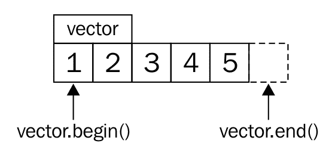
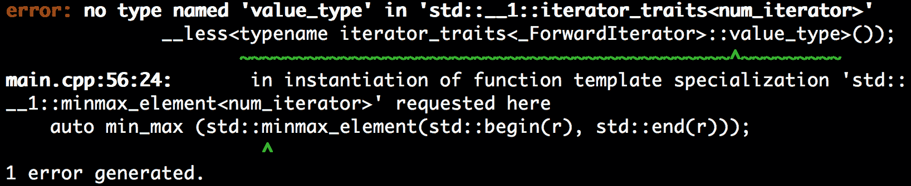
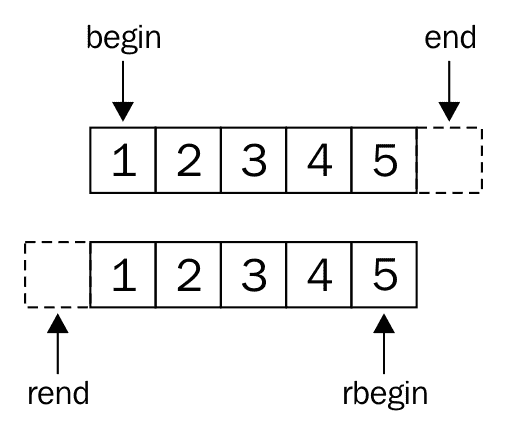

# 迭代程序

我们在本章中介绍了以下食谱:

*   建立自己的可迭代范围
*   使您自己的迭代器与 STL 迭代器类别兼容
*   使用迭代器包装来填充通用数据结构
*   根据迭代器实现算法
*   使用反向迭代器适配器反过来迭代
*   用迭代器哨兵终止范围内的迭代
*   使用已检查的迭代器自动检查迭代器代码
*   构建自己的 zip 迭代器适配器

# 介绍

迭代器是 C++ 中一个非常重要的概念。STL 的目标是尽可能灵活和通用，迭代器在这方面有很大的帮助。不幸的是，它们有时使用起来有点繁琐，这就是为什么许多新手*避开*它们，回到 *C 风格的 C++* 。一个避免迭代器的程序员基本上放弃了 STL 的一半潜力。这一章讨论迭代器，并很快阐明它们是如何工作的。快速的介绍可能还不够，但是*食谱*真的是为了给迭代器内部一个好的感觉。

大多数容器类，还有老式的 C 风格数组，都以这样或那样的方式包含一个数据项的*范围*。许多处理大量数据项的日常任务并不关心如何获取这些数据。然而，例如，如果我们考虑一个整数数组和一个整数的*链表*，并且想要计算两个结构的所有项目的*和*，我们会得到两个不同的算法，如下所示:

*   一种算法，通过检查数组的大小并将其总结如下来处理数组:

```cpp
      int sum {0};
      for (size_t i {0}; i < array_size; ++ i) { sum += array[i]; }
```

*   另一种算法，通过迭代处理链表，直到它到达末尾:

```cpp
      int sum {0};
      while (list_node != nullptr) { 
          sum += list_node->value; list_node = list_node->next; 
      }
```

都是关于*求和整数*的，但是我们打出来的字符百分比有多大，直接关系到*实际的*求和任务？其中一个是否与第三种数据结构一起工作，比如说`std::map`，或者我们必须实现它的另一个版本？没有迭代器，这将把我们引向荒谬的方向。

只有在迭代器的帮助下，才有可能以通用的形式实现这一点:

```cpp
int sum {0};
for (int i : array_or_vector_or_map_or_list) { sum += i; }
```

这个漂亮而简短的所谓基于范围的`for`循环从 C++ 11 开始就存在了。它只是一个语法糖，扩展成类似于下面的代码:

```cpp
{ 
    auto && __range = array_or_vector_or_map_or_list ; 
    auto __begin = std::begin(__range);
    auto __end   = std::end(__range);
    for ( ; __begin != __end; ++ __begin) { 
        int i = *__begin; 
        sum += i;
    } 
}
```

对于已经使用过迭代器的人来说，这是一顶旧帽子，对于没有使用过迭代器的人来说，这看起来完全是一种魔力。假设我们的整数向量如下所示:



`std::begin(vector)`命令与`vector.begin()`相同，并返回给我们一个指向第一项的迭代器(T4 1)。`std::end(vector)`与`vector.end()`相同，返回一个迭代器，该迭代器指向最后一个项之后的一个项*(经过 **5** )。*

在每次迭代中，循环检查开始迭代器是否不等于结束迭代器。如果是，它将*取消引用*开始迭代器，从而访问它所指向的整数值。然后，它*递增*迭代器，重复与结束迭代器的比较，等等。在那一刻，当想象迭代器是普通的 *C* 风格的指针时，再次读取循环代码是有帮助的。事实上，普通的 C 风格指针也是一种有效的迭代器。

# 迭代器类别

迭代器有多个类别，它们有不同的限制。它们并不太难记住，只要记住一个类别需要的能力是从下一个强大的类别继承而来的。迭代器类别的全部意义在于，如果一个算法知道它在处理什么类型的迭代器，它就可以以一种优化的方式实现。这样，程序员可以向后靠，表达自己的意图，而编译器可以为给定的任务选择*最优实现*。

让我们按照正确的顺序来看一下:


# 输入迭代器

输入迭代器只能在*读取它们所指向的*值时被取消引用。一旦它们被递增，它们所指向的最后一个值在递增过程中被*无效*。这意味着不可能多次迭代这样的范围。`std::istream_iterator`就是这一类的例子。

# 向前迭代器

前向迭代器与输入迭代器相同，但它们的不同之处在于它们所代表的范围可以多次迭代。`std::forward_list`迭代器就是一个例子。这样的列表只能向前*迭代，不能向后，但是我们想迭代多少次就迭代多少次。*

 *# 双向迭代器

顾名思义，双向迭代器可以递增和递减，以便向前或向后迭代。例如，`std::list`、`std::set`和`std::map`的迭代器就支持这一点。

# 随机存取迭代器

随机访问迭代器允许一次跳过多个值，而不是单步执行。这是`std::vector`和`std::deque`的迭代器的情况。

# 连续迭代器

这个类别指定了所有前述的需求，加上被迭代的数据位于连续内存中的需求，就像它在数组中一样，或者`std::vector`。

# 输出迭代器

输出迭代器从其他类别中分离出来。这是因为迭代器可以是纯输出迭代器，它只能递增并用于*将*写入它所指向的数据。如果正在读取它们，该值将是未定义的。

# 可变迭代器

如果迭代器同时是输出迭代器和其他类别之一，那么它就是可变迭代器。它可以读写。如果我们从一个非常量的容器实例中获得一个迭代器，它通常就是这种类型的。

# 建立自己的可迭代范围

我们已经意识到迭代器是各种容器迭代的*标准接口*。我们只需要实现前缀增量操作符`++ `、去引用操作符`*`和对象比较操作符`==`，然后我们已经有了一个适合花哨的 C++ 11 基于范围的`for`循环的原语迭代器。

为了更好地适应这一点，这个方法展示了如何实现一个迭代器，当遍历它时，它只发出一个数字范围。它没有任何容器结构或类似结构的支持。这些数字是在迭代时临时生成的。

# 怎么做...

在这个食谱中，我们将实现我们自己的迭代器类，然后，我们将遍历它:

1.  首先，我们包括标题，它使我们能够打印到终端:

```cpp
      #include <iostream>
```

2.  我们的迭代器类将被称为`num_iterator`:

```cpp
      class num_iterator {
```

3.  它唯一的数据成员是一个整数。那个整数用于计数。构造函数用于初始化它。让构造函数*显式*一般是一种很好的形式，从另一个类型创建一个类型，避免*偶然*隐式转换。请注意，我们还为`position`提供了默认值。这使得`num_iterator`类的实例可以默认构造。虽然我们不会在整个配方中使用默认构造函数，但这非常重要，因为一些 STL 算法依赖于迭代器是默认可构造的:

```cpp
          int i;
      public:

          explicit num_iterator(int position = 0) : i{position} {}
```

4.  当取消引用我们的迭代器(`*it`)时，它将发出一个整数:

```cpp
          int operator*() const { return i; }
```

5.  递增迭代器(`++ it`)只会递增其内部计数器`i`:

```cpp
          num_iterator& operator++() {
              ++ i;
              return *this;
          }
```

6.  一个`for`循环将比较迭代器和结束迭代器。如果它们*不相等*，它将继续迭代:

```cpp
          bool operator!=(const num_iterator &other) const {
              return i != other.i;
          }
      };
```

7.  那是迭代器类。我们仍然需要一个中间对象来编写`for (int i : intermediate(a, b)) {...}`，然后它包含开始和结束迭代器，该迭代器被预编程为从`a`迭代到`b`。我们称之为`num_range`:

```cpp
      class num_range {
```

8.  它包含两个整数成员，表示迭代应该从哪个数字开始，哪个数字是最后一个数字之后的第一个数字。这意味着如果我们想从`0`迭代到`9`，`a`设置为`0`，`b`设置为`10`:

```cpp
          int a;
          int b;

      public:
          num_range(int from, int to)
              : a{from}, b{to}
          {}
```

9.  我们只需要实现两个成员函数:`begin`和`end`函数。两者都返回指向数值范围开始和结束的迭代器:

```cpp
          num_iterator begin() const { return num_iterator{a}; }
          num_iterator end()   const { return num_iterator{b}; }
      };
```

10.  就这样。我们可以用它。让我们编写一个主函数，它只是在从`100`到`109`的范围内迭代，并打印它的所有值:

```cpp
      int main()
      {
          for (int i : num_range{100, 110}) {
              std::cout << i << ", ";
          }
          std::cout << 'n';
      }
```

11.  编译和运行程序会产生以下终端输出:

```cpp
      100, 101, 102, 103, 104, 105, 106, 107, 108, 109,
```

# 它是如何工作的...

假设我们编写了以下代码:

```cpp
for (auto x : range) { code_block; }
```

编译器将对其进行如下评估:

```cpp
{ 
    auto __begin = std::begin(range);
    auto __end   = std::end(range);
    for ( ; __begin != __end; ++ __begin) { 
        auto x = *__begin; 
        code_block
    } 
}
```

查看这段代码时，很明显迭代器的唯一要求是以下三个操作符:

*   `operator!=`:不对等比较
*   `operator++ `:前缀增量
*   `operator*`:取消引用

范围的要求是它有一个`begin`和一个`end`方法，这两个方法返回两个迭代器，表示一个范围的开始和结束。

In this book, we're mostly using `std::begin(x)` instead of `x.begin()`. This is generally a good style because `std::begin(x)` automatically calls `x.begin()` if that member method is available. If `x` is an array that does not have a `begin()` method, `std::begin(x)` will automatically find out how to deal with it. The same applies to `std::end(x)`. User defined types that do not provide `begin()`/`end()` members do not work with `std::begin`/`std::end`.

我们在这个食谱中所做的只是将一个简单的计数算法放入前向迭代器接口。实现一个迭代器和一个范围总是涉及到这个最小量的样板代码，这一方面可能有点烦人。另一方面，看看使用`num_range`的循环是非常有益的，因为它看起来如此*非常简单*！

Scroll back and have a thorough look on which of the methods of the iterator and the range class are `const`. Forgetting to make those functions `const` can make the compiler *reject* your code in a lot of situations because it is a common thing to iterate over `const` objects.

# 使您自己的迭代器与 STL 迭代器类别兼容

无论我们提出什么样的容器数据结构，为了有效地将它与所有的 STL 优点混合在一起，我们需要让它们提供迭代器接口。在最后一节中，我们学习了如何做到这一点，但是我们很快意识到*的一些* STL 算法*无法用我们的自定义迭代器很好地编译*。为什么呢？

问题是，很多 STL 算法试图找出更多关于我们要求它们处理的迭代器的信息。不同的迭代器*类别*具有不同的能力，因此，实现相同的*算法可能有不同的可能性。例如，如果我们将*普通数字*从一个`std::vector`复制到另一个*，这可以通过快速`memcpy`调用来实现。如果我们从或向`std::list`复制数据，这将不再是*而不是*了，必须逐个单独复制项目。STL 算法的实现者对这种自动优化投入了大量的精力。为了帮助他们，我们可以给迭代器配备一些关于它们的*信息*。本节展示了如何实现这一点。

# 怎么做...

在本节中，我们将实现一个对数字进行计数的原始迭代器，并将其与 STL 算法一起使用，STL 算法最初不会用它进行编译。然后我们做必要的事情使它与 STL 兼容。

1.  首先，我们需要像往常一样包含一些标题:

```cpp
      #include <iostream>
      #include <algorithm>
```

2.  然后我们实现一个基本的计数迭代器，如前一节所述。当迭代它时，它会发出简单的递增整数。`num_range`充当方便的*开始*和*结束*迭代器提供者:

```cpp
      class num_iterator 
      {
          int i;
      public:

          explicit num_iterator(int position = 0) : i{position} {}

          int operator*() const { return i; }

          num_iterator& operator++() {
              ++ i;
              return *this;
          }

          bool operator!=(const num_iterator &other) const {
              return i != other.i;
          }

          bool operator==(const num_iterator &other) const {
              return !(*this != other); 
          }
      };

      class num_range {
          int a;
          int b;

      public:
          num_range(int from, int to)
              : a{from}, b{to}
          {}

          num_iterator begin() const { return num_iterator{a}; }
          num_iterator end()   const { return num_iterator{b}; }
      };
```

3.  为了保留`std::`名称空间前缀并保持代码可读，我们声明使用名称空间`std`:

```cpp
      using namespace std;
```

4.  现在让我们实例化一个从`100`到`109`的范围。注意值`110`是结束迭代器的位置。这意味着`110`是范围之外的第一个号*(这就是它从`100`到`109`的原因):*

```cpp
      int main()
      {
          num_range r {100, 110};
```

5.  而现在，我们用它搭配`std::minmax_element`。这个算法用两个成员返回给我们`std::pair`:一个迭代器指向范围内的最小值，另一个迭代器指向范围内的最大值。这些当然是`100`和`109`，因为这就是我们构建系列的方式:

```cpp
          auto [min_it, max_it] (minmax_element(begin(r), end(r)));
          cout << *min_it << " - " << *max_it << 'n';
      }
```

6.  编译代码会导致以下错误消息。是一些与`std::iterator_traits`有关的错误。稍后会有更多。在其他编译器和/或 STL 库实现上有*其他*错误或者*根本没有*错误，这可能会发生*。当版本 5.0.0(中继线 299766)出现此错误信息时:*

 *

7.  为了解决这个问题，我们需要激活迭代器类的迭代器特性功能。就在`num_iterator`定义之后，我们编写了下面的`std::iterator_traits`类型的模板结构专门化。它告诉 STL 我们的`num_iterator`属于类别前向迭代器，它迭代`int`值:

```cpp
      namespace std {
        struct iterator_traits<num_iterator> {

          using iterator_category = std::forward_iterator_tag;

          using value_type = int;

          using difference_type = void;

          using pointer = int*;

          using reference = int&;

        };
      }
```

8.  我们再编译一遍；我们可以看到它是有效的！最小/最大函数的输出如下，这正是我们所期望的:

```cpp
      100 - 109
```

# 它是如何工作的...

一些 STL 算法需要知道它们所使用的迭代器类型的特征。有些人需要知道迭代器迭代的项目类型。这有不同的实现原因。

然而，假设迭代器类型为`my_iterator`，所有 STL 算法都将通过`std::iterator_traits<my_iterator>`访问该类型信息。这个特性类包含多达五种不同的类型成员定义:

*   `difference_type`:写`it1 - it2`是什么类型的结果？
*   `value_type`:我们用`*it`访问的项目是什么类型的(注意这是【纯输出迭代器的 T2】)？
*   `pointer`:指针必须是什么类型才能指向一个项目？
*   `reference`:引用一个项目必须是什么类型？
*   `iterator_category`:迭代器属于哪一类？

`pointer`、`reference`和`difference_type`类型定义对我们的`num_iterator`没有意义，因为它没有迭代真实的*内存*值(我们只是*返回* `int`值，但是它们不像在数组中那样持久可用)。因此，最好不要定义它们，因为如果一个算法依赖于那些在内存中可引用的项目，那么当与我们的迭代器结合时，它可能会有问题。

# 还有更多...

直到 C++ 17，才鼓励让迭代器类型直接从`std::iterator<...>`继承，这会自动用所有类型定义填充我们的类。这仍然有效，但是从 C++ 17 开始就不鼓励了。

# 使用迭代器适配器填充通用数据结构

在很多情况下，我们想用海量数据填充任何容器，但是数据源和容器没有*通用接口*。在这种情况下，我们需要编写自己的手工算法，只处理如何将数据从源推到宿的问题。通常，这会分散我们对解决具体的 T4 问题的实际工作的注意力。

由于 STL 提供的另一个抽象:**迭代器适配器**，在概念上不同的数据结构之间简单传输数据的任务可以用一行代码来实现。本节演示了其中一些的用法，以便给人一种它们有多有用的感觉。

# 怎么做...

在本节中，我们使用一些迭代器包装器只是为了展示它们的存在以及它们如何在日常编程任务中帮助我们。

1.  我们需要首先包含一些标题:

```cpp
      #include <iostream>
      #include <string>
      #include <iterator>
      #include <sstream>
      #include <deque>
```

2.  声明我们使用命名空间`std`可以让我们在以后少打一些字:

```cpp
      using namespace std;
```

3.  我们从`std::istream_iterator`开始。我们专注于`int`。这样，它将尝试将标准输入解析为整数。例如，如果我们迭代它，它看起来就像是`std::vector<int>`。结束迭代器被实例化为相同类型，但没有任何构造函数参数:

```cpp
      int main()
      {
          istream_iterator<int> it_cin {cin};
          istream_iterator<int> end_cin;
```

4.  接下来，我们实例化`std::deque<int>`并将标准输入中的所有整数复制到 deque 中。deque 本身不是一个迭代器，所以我们使用`std::back_inserter`辅助函数将其包装到`std::back_insert_iterator`中。这个特殊的迭代器包装器将对我们从标准输入中获得的每个项目执行`v.push_back(item)`。这样德格就自动成长了！

```cpp
          deque<int> v;

          copy(it_cin, end_cin, back_inserter(v));
```

5.  在下一个练习中，我们使用`std::istringstream`将物品复制到德格的*中间*。因此，让我们首先以字符串的形式定义一些示例数字，并从中实例化 stream 对象:

```cpp
          istringstream sstr {"123 456 789"};
```

6.  然后，我们需要一个提示，在哪里插入 deque。它将是中间的，所以我们使用 deque 的开始指针，并将其馈送到`std::next`函数。这个函数的第二个参数表示它将返回一个由`v.size() / 2`步推进的迭代器，即*半*步。(我们将`v.size()`转换为`int`，因为`std::next`的第二个参数是用作第一个参数的迭代器的`difference_type`。在这种情况下，这是一个有符号整数类型。根据编译器标志，如果我们没有显式强制转换，编译器可能会在此时*警告*。)

```cpp
          auto deque_middle (next(begin(v), 
                                  static_cast<int>(v.size()) / 2));
```

7.  现在，我们可以一步一步地将解析的整数从输入字符串流复制到 deque 中。同样，流迭代器包装器的结束迭代器只是一个没有构造函数参数的空`std::istream_iterator<int>`(即代码行中的空`{}`括号)。deque 被包装到一个插入器包装器中，它是一个`std::insert_iterator`，使用`deque_middle`迭代器指向 deque 的中间:

```cpp
          copy(istream_iterator<int>{sstr}, {}, inserter(v, deque_middle));
```

8.  现在，让我们使用`std::front_insert_iterator`在德格的前面插入一些项目:

```cpp
          initializer_list<int> il2 {-1, -2, -3};
          copy(begin(il2), end(il2), front_inserter(v));
```

9.  在最后一步中，我们将整个内容打印到用户外壳中。`std::ostream_iterator`的工作方式类似于输出迭代器，在我们的例子中，它只是将所有从其复制的整数转发到`std::cout`，然后在每个项目后追加`", "`:

```cpp
          copy(begin(v), end(v), ostream_iterator<int>{cout, ", "});
          cout << 'n';
      }
```

10.  编译并运行程序会产生以下输出。你能识别哪个代码行插入了哪个号码吗？

```cpp
      $ echo "1 2 3 4 5" | ./main
      -3, -2, -1, 1, 2, 123, 456, 789, 3, 4, 5,
```

# 它是如何工作的...

在这一节中，我们使用了许多不同的迭代器适配器。它们都有一个共同点，那就是它们将一个对象包装到一个迭代器中，而这个迭代器本身并不是迭代器。

# 标准::back_insert_iterator

`back_insert_iterator`可以缠绕`std::vector`、`std::deque`、`std::list`等。它将调用容器的`push_back`方法，该方法将新项目*插入到现有项目的*之后。如果容器实例不够大，它将自动增长。

# 标准::front_insert_iterator

`front_insert_iterator`做的和`back_insert_iterator`完全一样，但是它调用容器的`push_front`方法，在所有现有的项目之前插入新的项目*。请注意，对于像`std::vector`这样的容器，这意味着所有现有项目都需要再移动一个插槽，以便为前面的新项目留出空间。*

# std::insert_iterator

这个迭代器适配器类似于其他插入器，但是能够在现有项目之间插入新项目*。构造这样一个包装器的`std::inserter`辅助函数需要两个参数。第一个参数是容器，第二个参数是迭代器，它指向要插入新项的位置。*

# std::istream_iterator

`istream_iterator`是另一个非常方便的适配器。它可以与任何`std::istream`对象(例如，可以是标准输入或文件)一起使用，并将尝试根据实例化它的模板参数解析来自该流对象的输入。在本节中，我们使用了`std::istream_iterator<int>(std::cin)`，它为我们从标准输入中提取整数。

溪流的特别之处在于，我们经常无法提前知道溪流有多长。这就留下了一个问题，如果我们不知道流的终点在哪里，那么*迭代器将指向哪里？其工作方式是迭代器*知道*何时到达流的末尾。当它与结束迭代器进行比较时，它将有效地*而不是真正地*将自己与结束迭代器进行比较，而是如果流有任何标记*离开*则返回。这就是为什么结束迭代器构造函数不接受任何参数。*

# std::ostream_iterator

`ostream_iterator`和`istream_iterator`是一样的，但是它的工作原理正好相反:它不从的*输入*流中获取代币*，而是将代币*推入*的*输出*流中。`istream_iterator`的另一个区别是它的构造函数接受第二个参数，这是一个字符串，应该在每个项目之后被推入输出流。这很有用，因为这样我们可以在每个项目后打印一个分隔`", "`或一个新行。*

# 根据迭代器实现算法

迭代器通常通过*将*的*位置*从容器的一个项目移动到另一个项目来进行迭代。但是它们根本不需要迭代数据结构。迭代器也可以用来实现算法，在这种情况下，它们会在递增时计算下一个值(`++ it`)并在取消引用时返回该值(`*it`)。

在本节中，我们通过以迭代器的形式实现斐波那契函数来演示这一点。斐波那契函数的递归定义如下:`F(n) = F(n - 1) + F(n - 2)`。它从`F(0) = 0`和`F(1) = 1`的起始值开始。这导致以下编号顺序:

*   `F(0) = 0`
*   `F(1) = 1`
*   `F(2) = F(1) + F(0) = 1`
*   `F(3) = F(2) + F(1) = 2`
*   `F(4) = F(3) + F(2) = 3`
*   `F(5) = F(4) + F(3) = 5`
*   `F(6) = F(5) + F(4) = 8`
*   ...等等

如果我们以可调用函数的形式实现这一点，该函数返回任意数字的斐波那契值 *n* ，我们将得到递归的自调用函数，或者循环实现。这很好，但是如果我们写一些程序，其中必须以某种模式消耗斐波那契数，一个接一个，会怎么样呢？我们会有两种可能——要么我们重新计算每个新斐波那契数的所有递归调用，这是对计算时间的浪费，要么我们将最后两个斐波那契数保存为临时变量，并使用它们来计算下一个。在后一种情况下，我们重新实现了斐波那契算法循环实现。看起来我们最终会把*的*斐波那契代码和我们的实际代码混合在一起，这解决了一个不同的问题:

```cpp
size_t a {0};
size_t b {1};

for (size_t i {0}; i < N; ++ i) {
    const size_t old_b {b};
    b += a;
    a  = old_b;

    // do something with b, which is the current fibonacci number
}
```

迭代器是一种有趣的解决方法。如何将我们在基于循环的迭代斐波那契实现中所做的步骤包装在斐波那契值迭代器的前缀增量`++ `运算符实现中？正如本节所展示的，这非常容易。

# 怎么做...

在这一节中，我们集中实现一个迭代器，它在迭代斐波那契数列的同时，从数列中生成数字。

1.  为了能够将斐波那契数打印到终端，我们需要首先包含一个标题:

```cpp
      #include <iostream>
```

2.  我们称之为斐波那契迭代器。它将携带一个成员`i`，该成员保存斐波那契序列中的索引位置，`a`和`b`将是保存最后两个斐波那契值的变量。如果用默认构造函数实例化，斐波那契迭代器将被初始化为值`F(0)`:

```cpp
      class fibit
      {
          size_t i {0};
          size_t a {0};
          size_t b {1};
```

3.  接下来，我们定义标准构造函数和另一个构造函数，它允许我们在任何斐波那契数步骤初始化迭代器:

```cpp
      public:
          fibit() = default;

          explicit fibit(size_t i_)
              : i{i_}
          {}
```

4.  当解引用我们的迭代器(`*it`)时，它只会发出当前步骤的斐波那契数:

```cpp
          size_t operator*() const { return b; }
```

5.  当递增迭代器(`++ it`)时，它会将其状态移动到下一个斐波那契数。该函数包含与基于循环的斐波那契实现相同的代码:

```cpp
          fibit& operator++() {
              const size_t old_b {b};
              b += a;
              a = old_b;
              ++ i;
              return *this;
          }
```

6.  在循环中使用时，递增的迭代器与结束迭代器进行比较，为此我们需要定义`!=`运算符。我们只是比较斐波那契迭代器当前所在的*步骤*，这使得为步骤`1000000`定义结束迭代器变得更容易，例如，因为我们不需要提前计算如此高的斐波那契数*:*

```cpp
          bool operator!=(const fibit &o) const { return i != o.i; }
      };
```

7.  为了能够在基于范围的`for`循环中使用斐波那契迭代器，我们必须预先实现一个范围类。我们称之为`fib_range`，它的构造函数将接受一个参数，这个参数告诉我们想要迭代的斐波那契数列范围有多远:

```cpp
      class fib_range
      {
          size_t end_n;

      public:
          fib_range(size_t end_n_)
              : end_n{end_n_}
          {}
```

8.  其`begin`和`end`函数返回指向位置`F(0)`和`F(end_n)`的迭代器:

```cpp
          fibit begin() const { return fibit{}; }
          fibit end()   const { return fibit{end_n}; }
      };
```

9.  好了，现在让我们忘掉所有迭代器相关的样板代码。我们不需要再次接触它，因为我们现在有了一个助手类，它很好地向我们隐藏了所有的实现细节！让我们打印前 10 个斐波那契数:

```cpp
      int main()
      {
          for (size_t i : fib_range(10)) {
              std::cout << i << ", ";
          }
          std::cout << 'n';
      }
```

10.  编译和运行程序会产生以下 shell 输出:

```cpp
      1, 1, 2, 3, 5, 8, 13, 21, 34, 55,
```

# 还有更多...

为了在 STL 中使用这个迭代器，它必须支持`std::iterator_traits`类。要了解如何做到这一点，请看一下*另一个*配方，它正好处理这个问题:*使你自己的迭代器与 STL 迭代器类别兼容。*

Try to think in terms of iterators. This leads to very elegant code in many situations. Don't worry about performance: compilers find it *trivial* to optimize away the iterator-related boilerplate code!

为了保持示例简单，我们对此没有做任何事情，但是如果我们确实将斐波那契迭代器发布为库，就会发现它存在可用性缺陷-使用构造函数参数创建的`fibit`实例将仅用作结束迭代器，因为它不包含有效的斐波那契值。我们小小的图书馆并不强制这种用法。修复它有不同的可能性:

*   将`fibit(size_t i_)`构造函数设为私有，并将`fib_range`类声明为`fibit`类的朋友。这样，用户只能以正确的方式使用它。
*   使用迭代器哨兵，以防止用户取消引用结束迭代器。看看我们介绍的方法:*用迭代器哨兵*终止范围内的迭代

# 使用反向迭代器适配器反过来迭代

有时候，反过来迭代一个范围是有价值的，不是向前，而是向后。基于范围的`for`循环以及所有的 STL 算法通常通过*递增*迭代器来迭代给定的范围，尽管向后迭代需要*递减*迭代器。当然，也可以将*迭代器包装成一个层，将*的增量*调用有效地转换成*的减量*调用。对于我们想要支持的每一种类型，这听起来都像是大量的样板代码。*

STL 提供了一个有用的*反向迭代器适配器*，帮助我们设置这样的迭代器。

# 怎么做...

在本节中，我们将以不同的方式使用反向迭代器，只是为了展示它们是如何使用的:

1.  我们需要像往常一样，首先包含一些标题:

```cpp
      #include <iostream>
      #include <list>
      #include <iterator>
```

2.  接下来，我们声明我们使用名称空间`std`以便节省一些打字时间:

```cpp
      using namespace std;
```

3.  为了有东西可以迭代，让我们实例化一个整数列表:

```cpp
      int main()
      {
          list<int> l {1, 2, 3, 4, 5};
```

4.  现在让我们以相反的形式打印这些整数。为此，我们使用`std::list`的`rbegin`和`rend`函数遍历列表，并使用方便的`ostream_iterator`适配器通过标准输出将这些值推出:

```cpp
          copy(l.rbegin(), l.rend(), ostream_iterator<int>{cout, ", "});
          cout << 'n';
```

5.  如果容器不提供便利的`rbegin`和`rend`函数，但至少提供双向迭代器，`std::make_reverse_iterator`函数会有所帮助。它接受*普通*迭代器，并将其转换为*反向*迭代器:

```cpp
          copy(make_reverse_iterator(end(l)),
               make_reverse_iterator(begin(l)),
               ostream_iterator<int>{cout, ", "});
          cout << 'n';
      }
```

6.  编译和运行我们的程序会产生以下输出:

```cpp
      5, 4, 3, 2, 1, 
      5, 4, 3, 2, 1,
```

# 它是如何工作的...

为了能够将普通迭代器转换为反向迭代器，它必须至少支持双向迭代。这个要求由*双向*类或更高的迭代器来满足。

一种反向迭代器类型*包含*一个普通迭代器，*完全模仿*它的接口，但是它*将*的增量操作重新连接为减量操作。

下一个细节是关于迭代器的开始和结束位置。让我们看一下下图，它显示了一个保持在可迭代范围内的标准数字序列。如果序列从`1`到`5`，那么开始迭代器必须指向元素`1`，结束迭代器必须指向一个元素经过`5`:



定义反向迭代器时，`rbegin`迭代器必须指向`5`，而`rend`迭代器必须指向 `1`之前的元素*。把这本书翻过来，看它是否完全有意义。*

如果我们想要自己的定制容器类支持反向迭代，我们不需要自己实现所有这些细节；我们只需使用`std::make_reverse_iterator`助手函数将正常迭代器包装成反向迭代器，它就可以为我们完成所有的运算符重新布线和偏移校正。

# 用迭代器哨兵终止范围内的迭代

STL 算法和基于范围的`for`循环都假设迭代的开始和结束位置是预先已知的*。然而，在某些情况下，很难在迭代到达之前知道终点位置*。**

 *一个非常简单的例子是迭代普通的 C 风格字符串，其长度在*运行时*之前是未知的。迭代这些字符串的代码通常如下所示:

```cpp
for (const char *c_ponter = some_c_string; *c_pointer != ''; ++ c_pointer) {
    const char c = *c_pointer;
    // do something with c
}
```

将此放入基于范围的`for`循环的唯一方法似乎是将其包装到`std::string`中，该循环具有`begin()`和`end()`功能:

```cpp
for (char c : std::string(some_c_string)) { /* do something with c */ }
```

然而，`std::string`的构造函数将在我们的`for`循环能够迭代整个字符串之前迭代它。从 C++ 17 开始，我们也有`std::string_view`，但是它的构造函数也会遍历字符串一次。对于*短*弦来说，这并不值得真正的麻烦，但这也只是一个问题*类的例子，*在*其他情况*下可以值得麻烦。当`std::istream_iterator`捕捉到来自`std::cin`的输入时，它也必须处理这个问题，因为当用户仍在输入*键时，它的结束迭代器不能真实地指向用户输入的结束。*

C++ 17 带来了一个好消息，它不要求开始迭代器和结束迭代器是同一类型的。本节演示如何将这个*小规则变化*变成*大使用*。

# 怎么做...

在这一节中，我们将与 range 类一起构建一个迭代器，它使我们能够迭代长度未知的字符串，而无需提前找到*结束*位置*。*

 *1.  首先，一如既往，我们需要包含标题:

```cpp
      #include <iostream>
```

2.  迭代器 sentinel 是这一部分的核心元素。令人惊讶的是，它的类定义可以保持完全空白:

```cpp
      class cstring_iterator_sentinel {};
```

3.  现在我们实现迭代器。它将包含一个字符串指针，也就是我们迭代的*容器*:

```cpp
      class cstring_iterator {
          const char *s {nullptr};
```

4.  构造函数只是将内部字符串指针初始化为用户提供的任何字符串。让我们将构造函数显式化，以防止从字符串到字符串迭代器的意外隐式转换:

```cpp
      public:
          explicit cstring_iterator(const char *str)
              : s{str}
          {}
```

5.  当迭代器在某个点上解引用时，它将只返回这个位置的字符值:

```cpp
          char operator*() const { return *s; }
```

6.  递增迭代器只会增加字符串中的位置:

```cpp
          cstring_iterator& operator++() {
              ++ s;
              return *this;
          }
```

7.  这是有趣的部分。我们实现`!=`运算符进行比较，因为它被 STL 算法和基于范围的`for`循环使用。但是，这一次，我们实现它不是为了将迭代器与其他*迭代器*进行比较，而是为了将迭代器与*哨兵*进行比较。当我们比较一个迭代器和另一个迭代器时，我们只能检查它们的内部字符串指针是否都指向同一个地址，这有点限制。通过与一个空的 sentinel 对象进行比较，我们可以执行一个完全不同的语义——我们检查迭代器指向的字符是否是一个终止的`''`字符，因为这代表了字符串的*结尾*！

```cpp
          bool operator!=(const cstring_iterator_sentinel) const {
              return s != nullptr && *s != '';
          }
      };
```

8.  为了在基于范围的`for`循环中使用它，我们需要一个范围类，它发出开始和结束迭代器:

```cpp
      class cstring_range {
          const char *s {nullptr};
```

9.  用户在实例化过程中唯一需要提供的是将被迭代的字符串:

```cpp
      public:
          cstring_range(const char *str)
              : s{str}
          {}
```

10.  我们从`begin()`函数返回一个正常的`cstring_iterator`，它指向字符串的开头。从`end()`功能，我们只需返回*哨兵类型*。请注意，如果没有 sentinel 类型，我们还会返回一个迭代器，但是如果我们没有提前搜索它，我们应该从哪里知道字符串的结尾呢？

```cpp
          cstring_iterator begin() const { 
              return cstring_iterator{s}; 
          }
          cstring_iterator_sentinel end() const { 
              return {}; 
          }
      };
```

11.  就这样。我们可以立即使用它。来自用户的字符串是我们无法预先知道长度的输入的一个例子。为了迫使用户给出一些输入，如果用户在 shell 中启动程序时没有提供至少一个参数，我们将中止程序:

```cpp
      int main(int argc, char *argv[])
      {
          if (argc < 2) {
              std::cout << "Please provide one parameter.n";
              return 1;
          }
```

12.  如果程序到现在还在执行，那么我们知道`argv[1]`包含一些用户字符串:

```cpp
          for (char c : cstring_range(argv[1])) {
              std::cout << c;
          }
          std::cout << 'n';
      }
```

13.  编译和运行程序会产生以下输出:

```cpp
      $ ./main "abcdef"
      abcdef
```

循环打印我们刚刚输入的内容并不奇怪，因为这只是基于哨兵的迭代器范围实现的一个很小的例子。这种迭代终止方法将帮助您实现自己的迭代器，无论您在哪里遇到*与结束位置*的比较没有帮助的情况。

# 使用已检查的迭代器自动检查迭代器代码

不管迭代器有多有用，代表什么样的泛型接口，迭代器都很容易被*误用*，就像指针一样。当处理指针时，代码必须以这样一种方式编写:当它们指向无效的内存位置时，它*永远不会*去引用它们。迭代器也是如此，但是*有很多规则*规定迭代器什么时候有效，什么时候无效。通过稍微研究一下 STL 文档就可以很容易地了解到这些，但是仍然有可能编写有问题的代码。

在最好的情况下，这种有缺陷的代码会在*开发人员*面前爆炸，而此时它正在*测试*，而不是在客户端机器上测试*。然而，在许多情况下，代码似乎只是默默工作，尽管它取消了悬空指针、迭代器等等的引用。在这种情况下，如果我们生成显示未定义行为的代码，我们希望成为*急切的警报*。*

 *幸好有帮手！GNU STL 实现有一个*调试模式*，GNU C++ 编译器以及 LLVM clang C++ 编译器都支持*附加库*，可以用来为我们生成*超敏感的*和*冗长的*二进制文件，这些文件会立即被各种各样的 bug 炸毁。这是*好用的*和*超级好用的*，我们会在这一节演示。微软 Visual C++ 标准库还提供了激活附加检查的可能性。

# 怎么做...

在本节中，我们将编写一个程序，故意访问无效的迭代器:

1.  首先，我们包括标题。

```cpp
      #include <iostream>
      #include <vector>
```

2.  现在，让我们实例化一个整数向量，并获得第一项的迭代器，值`1`。我们在向量上应用`shrink_to_fit()`是为了确保其容量确实是*`3`，因为其实现*可能会*分配比必要更多的内存作为一点储备，以使未来的项目插入更快:*

```cpp
      int main()
      {
          std::vector<int> v {1, 2, 3};
          v.shrink_to_fit();

          const auto it (std::begin(v));
```

3.  然后我们打印取消引用的迭代器，这完全没问题:

```cpp
          std::cout << *it << 'n';
```

4.  接下来，让我们给向量加上一个新的数字。由于向量不够大，无法接受另一个数字，它将自动增加其大小。它通过分配一个新的更大的内存块，将所有现有的项目移动到新的内存块，然后删除旧的内存块来实现:

```cpp
          v.push_back(123);
```

5.  现在，让我们通过这个迭代器再次打印向量中的`1`。这很糟糕。为什么呢？当向量将其所有值移动到新的内存块并丢弃旧的内存块时，它没有告诉迭代器这个变化。这意味着迭代器仍然指向旧的位置，我们无法知道从那以后它到底发生了什么:

```cpp
          std::cout << *it << 'n'; // bad bad bad!
      }
```

6.  Compiling and running this program leads to a flawless execution. The app doesn't crash, but what it prints when dereferencing the invalidated pointer is pretty much random. Leaving it like this is pretty dangerous, but at this point, no one tells us about that bug if we don't see it ourselves:

    

7.  Debug flags come to the rescue! The *GNU* STL implementation supports a preprocessor macro called `_GLIBCXX_DEBUG`, which activates a lot of sanity checking code in the STL. This makes the program slower, but it *finds bugs*. We can activate it by adding a `-D_GLIBCXX_DEBUG` flag to our compiler command line, or define it in the head of the code file before the `include` lines. As you can see, it kills the app in the mactivate different sanitizers. Let's compile the code with clan useful (the activation flag for checked iterators with the Microsoft Visual C++ compiler is `/D_ITERATOR_DEBUG_LEVEL=1`):

    

8.  The LLVM/clang implementation of the STL also has debug flags, but they serve the purpose of debugging *the STL* itself, not user code. For user code, you can activate different sanitizers. Let's compile the code with clang using the `-fsanitize=address -fsanitize=undefined` flags and see what happens:

    

*哇*这是对哪里出了问题的非常精确的描述。如果截屏没有被截断的话，它将会跨越这本书的*多个页面*。请注意，这不是一个哗众取宠的特性，因为它也适用于 GCC。

If you get runtime errors because some library is missing, then your compiler did not automatically ship with **libasan** and **libubsan**. Try to install them via your package manager or something similar.

# 它是如何工作的...

正如我们已经看到的，我们不需要在代码中改变任何东西来获得这种用于错误代码的*绊线*特性。它基本上是免费的*，只是在编译程序时在命令行上附加了一些编译器标志。*

 *该功能由*消毒剂*实现。杀毒软件通常由一个额外的编译器模块和一个运行时库组成。当杀毒程序被激活时，编译器会将*附加的* *信息*和*代码*添加到二进制文件中，这是我们程序的结果。在运行时，然后链接到程序二进制文件中的消毒库可以，例如，替换`malloc`和`free`函数，以便*分析*程序如何处理它获取的内存。

消毒剂可以检测不同种类的细菌。仅举几个有价值的例子:

*   **越界**:每当我们访问一个数组、向量或任何类似的超出其合法内存范围的东西时，就会触发这个事件。
*   **释放后使用**:如果我们在堆内存被释放后引用堆内存，就会触发这个事件(我们在本节中已经这样做了)。
*   **整数溢出**:如果一个整数变量通过计算不适合该变量的值而溢出，则会触发该事件。对于有符号整数，算术回绕是未定义的行为。
*   **指针对齐**:有些架构如果内存中有奇怪的对齐，就不能访问内存。

消毒剂可以检测到更多这样的错误。

*不可行**总是*激活所有可用的消毒剂，因为它们会使程序*变慢*。但是，在您的*单元测试*和*集成测试*中始终激活消毒剂是一种好的风格。

# 还有更多...

针对不同的 bug 类别有很多不同的杀毒软件，目前都还在开发中。我们可以也应该在互联网上告知自己如何改进我们的测试二进制文件。GCC 和 LLVM 项目主页在其在线文档页面中列出了它们的消毒功能:

*   [https://gcc . GNU . org/online docs/gcc/Instrumentation-options . html](https://gcc.gnu.org/onlinedocs/gcc/Instrumentation-Options.html)
*   [http://clang.llvm.org/docs/index.html](http://clang.llvm.org/docs/index.html)(在目录中寻找*消毒剂*

每一个程序员都应该意识到，并且*也应该一直这样做。不幸的是，令人担忧的是，许多公司并非如此，尽管错误代码是所有 T4 恶意软件和计算机病毒最重要的入口。*

当你得到一份软件开发人员的新工作时，检查你的团队是否真的使用了所有可能的消毒方法。如果没有，你有独特的机会在上班的第一天修复重要的偷偷摸摸的 bug！

# 构建自己的 zip 迭代器适配器

不同的编程语言导致不同的编程风格。这是因为有不同的方式来表达事物，并且它们对于每个用例的优雅程度是不同的。这并不奇怪，因为每种语言都有特定的目标。

一种非常特殊的编程风格是*纯* *函数编程*。它神奇地不同于 C 或 C++ 程序员习惯的*命令式*编程。虽然这种风格非常不同，但它在许多情况下都支持极其优雅的代码。

这种优雅的一个例子是公式的实现，例如数学点积。给定两个数学向量，对它们应用点积意味着将向量中相同位置的数字成对相乘，然后将所有相乘的值相加。两个向量的点积`(a, b, c) * (d, e, f)`为`(a * e + b * e + c * f)`。当然，我们也可以用 C 和 C++ 做到这一点。它可能如下所示:

```cpp
std::vector<double> a {1.0, 2.0, 3.0};
std::vector<double> b {4.0, 5.0, 6.0};

double sum {0};
for (size_t i {0}; i < a.size(); ++ i) {
    sum += a[i] * b[i];
}
// sum = 32.0
```

在那些可以认为*更优雅的*语言中是什么样子的？

*Haskell* 是一种纯函数式语言，这就是如何用神奇的一行程序计算两个向量的点积:


*Python* 不是一种纯粹的函数式语言，但它在某种程度上支持类似的模式，如下例所示:


STL 提供了一个称为`std::inner_product`的特定算法，它也在一行中解决了这个特定的问题。但关键是，在许多其他语言中，这样的代码只需在一行*中快速编写*，而无需*特定的库函数来支持这一确切目的。*

 *没有深入研究这种外来语法的解释，这两个例子中的一个重要共性是神奇的`zip`函数。它是做什么的？它采用两个向量`a`和`b`，并将其转换为一个*混合*向量。例如:`[a1, a2, a3]`和`[b1, b2, b3]`拉上拉链后会产生`[ (a1, b1), (a2, b2), (a3, b3) ]`。仔细看看；这真的很像拉链的工作原理！

相关的一点是，现在有可能在一个组合范围内迭代*，在该范围内可以进行成对乘法，然后求和为一个累加器变量。Haskell 和 Python 示例中也发生了完全相同的情况，没有添加任何循环或索引变量噪声。*

 *不可能使 C++ 代码完全像 Haskell 或 Python 中那样优雅和通用，但是本节解释了如何使用迭代器实现类似的魔法，通过实现一个 *zip 迭代器*。计算两个向量的点积的示例问题由特定的库更优雅地解决，这超出了本书的范围。然而，本节试图展示基于迭代器的库通过提供极其通用的构建块在编写富于表现力的代码方面有多大帮助。

# 怎么做...

在本节中，我们将重新创建哈斯克尔或 Python 中的 *zip* 函数。它将被硬编码到`double`变量的向量中，以避免干扰迭代器机制:

1.  首先，我们需要包含一些标题:

```cpp
      #include <iostream>
      #include <vector>
      #include <numeric>
```

2.  接下来，我们定义`zip_iterator`类。当迭代一个`zip_iterator`范围时，我们将在每个迭代步骤从两个容器中获得一对值。这意味着我们同时迭代两个容器:

```cpp
      class zip_iterator {
```

3.  zip 迭代器需要保存两个迭代器，每个容器一个迭代器:

```cpp
          using it_type = std::vector<double>::iterator;

          it_type it1;
          it_type it2;
```

4.  构造函数只是保存我们想要迭代的两个容器中的迭代器:

```cpp
      public:
          zip_iterator(it_type iterator1, it_type iterator2)
              : it1{iterator1}, it2{iterator2}
          {}
```

5.  递增 zip 迭代器意味着递增两个成员迭代器:

```cpp
          zip_iterator& operator++() {
              ++ it1;
              ++ it2;
              return *this;
          }
```

6.  如果两个成员迭代器与另一个 zip 迭代器中的成员迭代器不相等，则两个 zip 迭代器不相等。通常，人们会使用逻辑或(`||`)来代替和(`&&`)，但是假设范围的长度不相等。在这种情况下，不可能同时匹配*和*两个结束迭代器。这样，当我们到达*或*范围的*第一个*结束迭代器时，我们可以中止循环:

```cpp
          bool operator!=(const zip_iterator& o) const {
              return it1 != o.it1 && it2 != o.it2;
          }
```

7.  等式比较运算符只是使用另一个运算符实现的，但是否定了结果:

```cpp
          bool operator==(const zip_iterator& o) const {
              return !operator!=(o);
          }
```

8.  取消对 zip 迭代器的引用可以在相同的位置访问两个容器的元素:

```cpp
          std::pair<double, double> operator*() const {
              return {*it1, *it2};
          }
      };
```

9.  这是迭代器代码。我们需要使迭代器与 STL 算法兼容，因此我们为此定义了所需的类型特征样板代码。它基本上说这个迭代器只是一个前向迭代器，当被取消引用时，它会返回成对的双精度值。虽然我们在这个配方中没有使用`difference_type`，但是 STL 的不同实现可能需要它来编译:

```cpp
      namespace std {

      template <>
      struct iterator_traits<zip_iterator> {
         using iterator_category = std::forward_iterator_tag;
         using value_type = std::pair<double, double>;
         using difference_type = long int;
      };

      }
```

10.  下一步是定义一个范围类，从它的`begin`和`end`函数返回 us zip 迭代器:

```cpp
      class zipper {
          using vec_type = std::vector<double>;
          vec_type &vec1;
          vec_type &vec2;
```

11.  它需要引用两个现有的容器，以便从它们形成 zip 迭代器:

```cpp
      public:
          zipper(vec_type &va, vec_type &vb)
              : vec1{va}, vec2{vb}
          {}
```

12.  `begin`和`end`函数只是馈送成对的开始和结束指针，以便从那里构造 zip 迭代器实例:

```cpp
          zip_iterator begin() const { 
              return {std::begin(vec1), std::begin(vec2)}; 
          }
          zip_iterator end() const { 
              return {std::end(vec1), std::end(vec2)}; 
          }
      };
```

13.  就像在 Haskell 和 Python 的例子中一样，我们定义了两个`double`值的向量。我们还定义了默认情况下在主函数中使用名称空间`std`:

```cpp
      int main()
      {
          using namespace std;
          vector<double> a {1.0, 2.0, 3.0};
          vector<double> b {4.0, 5.0, 6.0};
```

14.  拉链对象将它们组合成一个类似矢量的范围，在该范围内我们可以看到成对的`a`和`b`值:

```cpp
          zipper zipped {a, b};
```

15.  我们将使用`std::accumulate`将该范围的所有项目相加。我们不能直接这样做，因为这意味着我们总结了`std::pair<double, double>`的实例，对于这些实例，总和的概念没有定义。因此，我们将定义一个 helper lambda，它取一对，将其成员相乘，并将其添加到累加器中。`std::accumulate`非常适合带有这样一个签名的 lambdas:

```cpp
          const auto add_product ([](double sum, const auto &p) {
             return sum + p.first * p.second;
          });
```

16.  现在，我们将其与压缩范围的开始和结束迭代器对以及累加器变量的开始值`0.0`一起输入到`std::accumulate`，最终，累加器变量包含乘积之和:

```cpp
          const auto dot_product (accumulate(
                  begin(zipped), end(zipped), 0.0, add_product));
```

17.  让我们打印点积结果:

```cpp
          cout << dot_product << 'n';
      }
```

18.  编译和运行程序会产生正确的结果:

```cpp
      32
```

# 还有更多...

好吧，对于一点语法糖来说，这是一个很大的工作量，它仍然没有哈斯克尔代码那样优雅。一个很大的缺陷是我们的小 zip 迭代器的硬编码特性——它只适用于双变量的`std::vector`范围。有了一点模板代码和一些类型特征，拉链可以做得更通用。这样，它可以组合列表和向量，或者去量化和映射，即使这些是专门针对完全不同的容器项目类型。

为了真正正确地使这样的类通用，所需要的工作量和思想是不可低估的。幸运的是，这样的库已经存在。一个流行的非 STL 库是*增强* `zip_iterator`。它非常通用且易于使用。

顺便说一句，如果你来这里是为了看用 C++ 做一个*点积*的最优雅的方法，而不是真的关心 zip-iterators 的概念，你应该看看`std::valarray`。自己看吧:

```cpp
#include <iostream>
#include <valarray>

int main()
{
    std::valarray<double> a {1.0, 2.0, 3.0};
    std::valarray<double> b {4.0, 5.0, 6.0};

    std::cout << (a * b).sum() << 'n';
}
```

# 范围库

有一个非常非常有趣的 C++ 库，它支持拉链和所有其他种类的魔法迭代器适配器、过滤器等等:*范围*库。它的灵感来自 Boost 范围库，在一段时间内，它看起来会进入 C++ 17，但不幸的是，我们将不得不等待*下一个*标准。之所以如此不幸，是因为它将通过从*泛型*和*简单的*代码块组成*复杂的*功能，大力*提高用 C++ 编写*表达性*和*快速*代码的可能性。*

它的文档中有一些非常简单的例子:

1.  计算从`1`到`10`所有数字的平方和:

```cpp
      const int sum = accumulate(view::ints(1)
                               | view::transform([](int i){return i*i;})
                               | view::take(10), 0);
```

2.  从一个数值向量中过滤掉所有不均匀的数字，并将其余的转换成字符串:

```cpp
      std::vector<int> v {1,2,3,4,5,6,7,8,9,10};

      auto rng = v | view::remove_if([](int i){return i % 2 == 1;})
                   | view::transform([](int i){return std::to_string(i);});

      // rng == {"2"s,"4"s,"6"s,"8"s,"10"s};
```

如果你感兴趣并且等不及下一个 C++ 标准，可以看看[https://ericniebler.github.io/range-v3/](https://ericniebler.github.io/range-v3/)的范围文档。*********