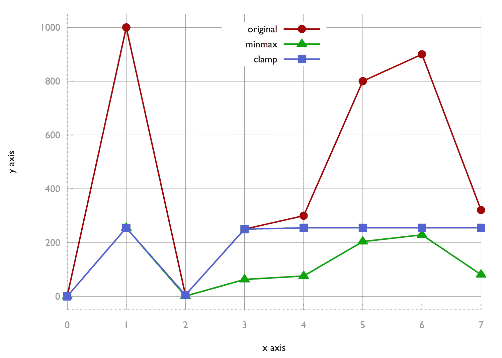
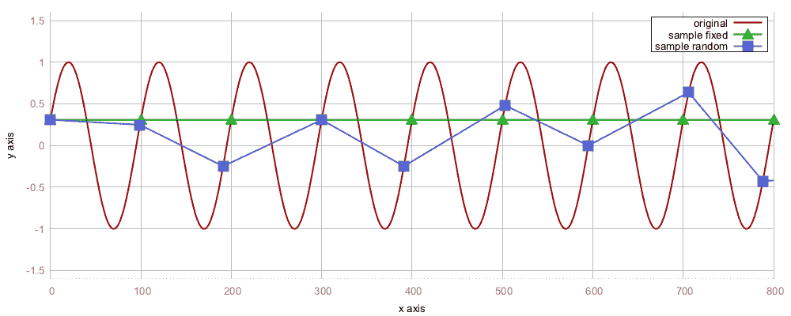
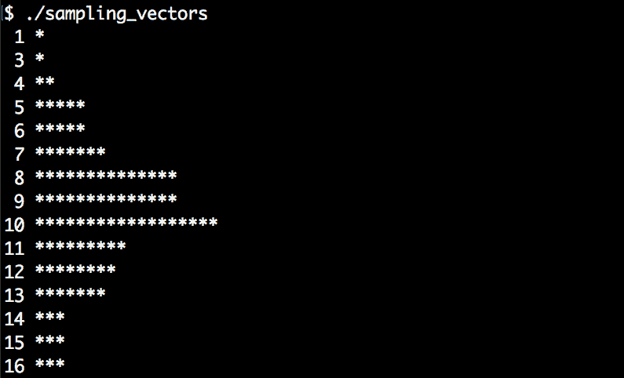

# STL 算法基础

我们将在本章介绍以下食谱:

*   将项目从容器复制到其他容器
*   分类容器
*   从容器中移除特定项目
*   转换容器的内容
*   在有序和无序向量中查找项目
*   通过`std::clamp`将向量的值限制在特定的数值范围内
*   用`std::search`定位字符串中的模式并选择最佳实现
*   采样大向量
*   生成输入序列的排列
*   实现字典合并工具

# 介绍

当然，STL 不仅包含数据结构，还包含*算法*。虽然数据结构帮助*存储*和*以不同的方式维护*数据，具有不同的动机和目标，但算法将特定的*转换*应用于此类数据结构中的数据。

让我们来看看一个标准任务，比如从一个向量中总结项目。这可以很容易地通过循环向量并把所有项目加到一个叫做`sum`的累加器变量中来实现:

```cpp
 vector<int> v {100, 400, 200 /*, ... */ };

 int sum {0};
 for (int i : v) { sum += i; }

 cout << sum << 'n';
```

但是因为这是一个相当标准的任务，所以也有一个 STL 算法:

```cpp
cout << accumulate(begin(v), end(v), 0) << 'n';
```

在这种情况下，手工制作的循环变体不会太长，而且它也不会比一行写着“T0”的代码更难阅读。然而，在很多情况下，读一个 10 行的代码循环只是为了意识到“我只是必须研究整个循环才能理解它是做一个标准任务的吗，X？”，而不是看到一行代码，它使用一个标准算法，该算法的名称清楚地说明了它的功能，如`accumulate`、`copy`、`move`、`transform`或`shuffle`。

基本思想是提供丰富多样的算法，供程序员日常使用，以减少重复实现它们的需要。这样，程序员就可以使用现成的算法实现，专注于*新的*问题，而不是把时间浪费在*已经通过 STL 解决的*问题上。另一个角度是正确性——如果一个程序员一次又一次地实现同一个东西一百次，这很可能会在一次或另一次尝试中引入一个轻微的*错误*。这将是完全不必要的，并且也非常*尴尬*例如，如果它是由一个同事在代码审查期间指出的，而与此同时，可以使用标准算法。

STL 算法的另一个要点是*效率*。许多 STL 算法提供同一算法的多个*专用*实现，这些实现根据它们所使用的*迭代器类型*而有所不同。例如，如果整数向量中的所有元素都应该归零，这可以通过 STL 算法`std::fill`来完成。因为向量的迭代器已经可以告诉编译器它在*连续的*内存上迭代，所以它可以选择使用 C 过程`memset`的`std::fill`的实现。如果程序员将容器类型从`vector`更改为`list`，那么 STL 算法就不能再使用`memset`了，必须遍历列表才能逐个将项目清零。如果程序员自己使用`memset`，实现将不必要地硬编码为使用向量或数组，因为大多数其他数据结构不会将其数据保存在连续的内存块中。在大多数情况下，试图变得聪明没有什么意义，因为 STL 的实现者可能已经实现了相同的想法，可以免费使用。

让我们总结一下前面的几点。使用 STL 算法有利于:

*   **可维护性**:算法的名称已经以一种直接的方式陈述了它们的作用。显式循环很少能像标准算法那样更好地阅读和理解数据结构。
*   **正确性**:STL 已经被专家编写和评审过了，被这么多人使用和测试过了，你在重新实现它的复杂部分的时候，几乎不可能达到同样的正确程度。
*   **效率**:默认情况下，STL 算法至少和大多数手工循环一样高效。

大多数算法在*迭代器*上工作。迭代器如何工作的概念已经在[第 20 章](02.html)、*迭代器*中解释过了。在这一章中，我们将集中于对不同的问题使用 STL 算法，以便了解它们如何被有利地使用。展示*所有* STL 算法会让这本书变成一个非常无聊的 C++参考，尽管已经有一个公开的 C++参考。

成为 STL 忍者的最好方法是让 C++引用一直在手边，或者至少保存在浏览器书签中。在解决一个任务时，每个程序员都应该带着心中的疑问看一看，“我的问题有没有 STL 算法？”，然后自己写代码。

一个非常好且完整的 C++参考资料可在以下网址在线查看:

[http://cppreference.com](http://cppreference.com)

也可以下载离线查看。

In job interviews, good fluency with the STL algorithms is often regarded as an indicator of a strong knowledge of C++.

# 将项目从容器复制到其他容器

最重要的 STL 数据结构支持迭代器。这意味着至少可以通过`begin()`和`end()`函数获得迭代器，它们指向数据结构的底层有效载荷数据，并允许对该数据进行迭代。不管迭代什么样的数据结构，迭代看起来总是一样的。

我们可以从向量、列表、字典、映射等中获取迭代器。使用迭代器适配器，我们甚至可以将迭代器作为文件、标准输入和标准输出的接口。此外，正如我们在上一章中看到的，我们甚至可以将迭代器接口包装在算法周围。现在，我们可以用迭代器访问一切，我们可以将它们与 STL 算法相结合，STL 算法接受迭代器作为参数。

展示迭代器如何帮助抽象不同数据结构本质的一个非常好的方法是`std::copy`算法，它只是将一组迭代器中的项目复制到一个输出迭代器中。在使用这种算法的地方，底层数据结构的性质不再真正相关。为了演示这一点，我们将玩一点`std::copy`。

# 怎么做...

在本节中，我们将使用`std::copy`的不同变体:

1.  让我们首先包含我们使用的数据结构所需的所有头。此外，我们声明使用`std`命名空间:

```cpp
       #include <iostream>
       #include <vector>
       #include <map>
       #include <string>
       #include <tuple>
       #include <iterator>
       #include <algorithm>

       using namespace std;
```

2.  我们将在下面使用成对的整数值和字符串值。为了很好地打印它们，我们应该首先为它们重载`<<`流操作符:

```cpp
       namespace std {
       ostream& operator<<(ostream &os, const pair<int, string> &p)
       {
           return os << "(" << p.first << ", " << p.second << ")";
       }
       }
```

3.  在`main`函数中，我们用一些默认值填充整数字符串对的`vector`。我们声明一个`map`变量，它将整数值与字符串值相关联:

```cpp
       int main()
       {
           vector<pair<int, string>> v {
               {1, "one"}, {2, "two"}, {3, "three"}, 
               {4, "four"}, {5, "five"}};

           map<int, string> m;
```

4.  现在，我们使用`std::copy_n`将向量前面的三个整数字符串对精确复制到地图上。因为矢量和地图是完全不同的数据结构，我们需要使用`insert_iterator`适配器从矢量转换项目。`std::inserter`功能为我们生产了这样一个适配器。请始终注意，使用像`std::copy_n`这样的算法结合插入迭代器是将项目复制/插入其他数据结构的最*通用*方式，但不是最快的*。使用数据结构特定的成员函数来插入项通常是最有效的方法:*

```cpp
           copy_n(begin(v), 3, inserter(m, begin(m)));
```

5.  之后让我们打印地图上的内容。在整本书中，我们经常使用`std::copy`功能打印容器的内容。`std::ostream_iterator`在这方面帮助很大，因为它允许我们将用户外壳的标准输出视为*另一个容器*，我们可以将数据复制到:

```cpp
           auto shell_it (ostream_iterator<pair<int, string>>{cout, 
                                                              ", "});

           copy(begin(m), end(m), shell_it);
           cout << 'n';
```

6.  让我们为下一个实验再次清理地图。这一次，我们*将*项从矢量移动到地图上，这一次，是*所有*项:

```cpp
           m.clear();

           move(begin(v), end(v), inserter(m, begin(m)));
```

7.  我们再次打印地图的新内容。此外，由于`std::move`是一个也改变数据*源*的算法，我们也将打印源向量。这样，我们可以看到它作为移动源时发生了什么:

```cpp
           copy(begin(m), end(m), shell_it);
           cout << 'n';

           copy(begin(v), end(v), shell_it);
           cout << 'n';
       }
```

8.  让我们编译并运行这个程序，看看它说了什么。前两行很简单。它们反映了应用`copy_n`和`move`算法后地图包含的内容。第三行很有趣，因为它显示我们用作移动源的向量中的字符串现在是空的。这是因为字符串的内容没有被复制，而是被有效地*移动了*(这意味着映射使用了堆内存中的字符串数据，该数据先前被向量 *)* 中的字符串对象引用。在重新分配之前，我们通常不应该访问作为移动源的项目，但是为了这个实验，让我们忽略它:

```cpp
      $ ./copying_items
      (1, one), (2, two), (3, three), 
      (1, one), (2, two), (3, three), (4, four), (5, five), 
      (1, ), (2, ), (3, ), (4, ), (5, ),
```

# 它是如何工作的...

由于`std::copy`是最简单的 STL 算法之一，所以它的实现非常短。让我们看看它是如何实现的:

```cpp
template <typename InputIterator, typename OutputIterator>
OutputIterator copy(InputIterator it, InputIterator end_it, 
                    OutputIterator out_it)
{
    for (; it != end_it; ++it, ++out_it) {
        *out_it = *it;
    }
    return out_it;
}
```

这看起来就像一个人天真地用手实现从一个可迭代范围到另一个范围的项目复制。在这一点上，人们也可能会问，“那么为什么不手工实现呢，这个循环足够简单，我甚至不需要返回值？”，这当然是个好问题。

虽然`std::copy`不是使代码明显变短的最佳示例，但许多其他实现更复杂的算法是这样的。不明显的是这类 STL 算法的隐藏式自动优化。如果我们碰巧将`std::copy`用于将它们的项目存储在连续内存中的数据结构(如`std::vector`和`std::array`所做的那样)*和*项目本身是*普通可分配副本*，那么编译器将选择完全不同的实现(假设迭代器类型是指针):

```cpp
template <typename InputIterator, typename OutputIterator>
OutputIterator copy(InputIterator it, InputIterator end_it, 
                    OutputIterator out_it)
{
    const size_t num_items (distance(it, end_it));
    memmove(out_it, it, num_items * sizeof(*it));
    return it + num_items;
}
```

这是`std::copy`算法的`memmove`变体在典型的 STL 实现中的简化版本。比标准循环版*快*，这次*，读起来也没那么好听。但是，如果用户的参数类型符合这种优化的要求，那么`std::copy`用户会自动从中受益。编译器为选择的算法选择最快的实现，而用户代码很好地表达了*算法做什么*，而没有用太多的*如何*的细节污染代码。*

 *STL 算法通常只是在*可读性*和*最佳实现*之间提供最佳折衷。

Types are usually trivially copy assignable if they only consist of one or multiple (wrapped by a class/struct) scalar types or classes, which can safely be moved using `memcopy`/`memmove` without the need to invoke a user-defined copy assignment operator.

我们也用了`std::move`。它的工作原理与`std::copy`完全一样，但是它将`std::move(*it)`应用于循环中的源迭代器，以便将*左值*转换为*右值*。这使得编译器选择目标对象的移动赋值运算符，而不是复制赋值运算符。对于很多复杂的对象，这个*执行*比较好但是*破坏*源对象。

# 分类容器

对值进行排序是一项相当标准的任务，可以通过各种方式完成。每一个被不得不学习大多数现有排序算法(以及它们的性能和稳定性在考试中的权衡)所折磨的计算机科学学生都知道这一点。

因为这是一个已经解决的问题，程序员不应该再浪费时间去解决它*，除非是为了学习的目的。*

 *# 怎么做...

在这一节中，我们将玩`std::sort`和`std::partial_sort`:

1.  首先，我们包括所有必要的内容，并声明我们使用`std`命名空间:

```cpp
       #include <iostream>
       #include <algorithm>
       #include <vector>
       #include <iterator>
       #include <random>       

       using namespace std;
```

2.  我们将多次打印整数向量的状态，所以让我们通过编写一个小程序来简化这个任务:

```cpp
       static void print(const vector<int> &v)
       {
           copy(begin(v), end(v), ostream_iterator<int>{cout, ", "});
           cout << 'n';
       }
```

3.  我们从包含一些示例数字的向量开始:

```cpp
       int main()
       {
           vector<int> v {1, 2, 3, 4, 5, 6, 7, 8, 9, 10};
```

4.  因为我们将对向量进行多次洗牌，以便使用不同的排序函数，所以我们需要一个随机数生成器:

```cpp
           random_device rd;
           mt19937 g {rd()};
```

5.  `std::is_sorted`功能告诉我们容器的内容是否排序。该行应打印`1`:

```cpp
           cout << is_sorted(begin(v), end(v)) << 'n';
```

6.  借助`std::shuffle`，我们围绕向量的内容进行摇动，以便稍后再次排序。前两个参数表示将被混洗的范围，第三个参数是随机数生成器:

```cpp
           shuffle(begin(v), end(v), g);
```

7.  `is_sorted`函数现在应该返回`false`，以便打印`0`，向量中的值应该相同但顺序不同。我们将在将两者再次打印到外壳后看到:

```cpp
           cout << is_sorted(begin(v), end(v)) << 'n';
           print(v);
```

8.  现在，我们使用`std::sort`重新建立原始物品订购。同样的打印到终端现在应该再次给我们从开始排序:

```cpp
           sort(begin(v), end(v));

           cout << is_sorted(begin(v), end(v)) << 'n';
           print(v);
```

9.  另一个有趣的功能是`std::partition`。也许，我们不想对列表进行完全排序，因为前面只有小于某个值的项目就足够了。所以，让我们*分割*向量，以便将所有小于`5`的项目移到前面并打印出来:

```cpp
           shuffle(begin(v), end(v), g);

           partition(begin(v), end(v), [] (int i) { return i < 5; });

           print(v);
```

10.  下一个与排序相关的功能是`std::partial_sort`。我们可以使用它来对容器的内容进行排序，但只是在一定程度上。它会将向量前半部分中所有向量元素中最小的`N`按排序顺序排列。其余的将驻留在后半部分，不会排序:

```cpp
           shuffle(begin(v), end(v), g);
           auto middle (next(begin(v), int(v.size()) / 2));
           partial_sort(begin(v), middle, end(v));

           print(v);
```

11.  如果我们要对一个没有*比较运算符的数据结构进行排序会怎么样？让我们定义一个，并制作这样的项目的向量:*

```cpp
           struct mystruct {
               int a;
               int b;
           };

           vector<mystruct> mv {{5, 100}, {1, 50}, {-123, 1000}, 
                                {3, 70}, {-10, 20}};
```

12.  `std::sort`函数可选地接受比较函数作为其第三个参数。让我们使用它，并为它提供这样的功能。为了证明这是可能的，我们通过他们的*第二*场`b`来比较他们。这样，它们将按照`mystruct::b`而不是`mystruct::a`的顺序出现:

```cpp
           sort(begin(mv), end(mv),
                [] (const mystruct &lhs, const mystruct &rhs) {
                    return lhs.b < rhs.b;
                });
```

13.  最后一步是打印`mystruct`项的排序向量:

```cpp
           for (const auto &[a, b] : mv) {
               cout << "{" << a << ", " << b << "} ";
           }
           cout << 'n';
       }
```

14.  让我们编译并运行我们的程序。
    第一个`1`来自初始化排序向量后的`std::is_sorted`调用。然后，我们对向量进行洗牌，从第二个`is_sorted`呼叫中得到一个`0`。第三行显示了洗牌后的所有矢量项目。下一个`1`是用`std::sort`再次排序后`is_sorted`调用的结果。
    然后，我们再次对整个向量进行混洗，*使用`std::partition`对其进行分割*。我们可以看到，所有小于`5`的项目在向量中也在`5`的左边。所有大于`5`的项目都在其右侧。除此之外，他们似乎被洗牌了。
    倒数第二行显示`std::partial_sort`的结果。直到中间的所有项目看起来都是严格排序的，但其余的没有。
    在最后一行，我们可以看到`mystruct`实例的向量。它们严格按照*第二个*成员值排序:

```cpp
      $ ./sorting_containers 
      1
      0
      7, 1, 4, 6, 8, 9, 5, 2, 3, 10, 
      1
      1, 2, 3, 4, 5, 6, 7, 8, 9, 10, 
      1, 2, 4, 3, 5, 7, 8, 10, 9, 6, 
      1, 2, 3, 4, 5, 9, 8, 10, 7, 6,
      {-10, 20} {1, 50} {3, 70} {5, 100} {-123, 1000}
```

# 它是如何工作的...

我们使用了不同的算法，这些算法与排序有关:

| **算法** | **目的** |
| `std::sort` | 接受一个范围作为参数，并对其进行简单排序。 |
| `std::is_sorted` | 接受一个范围作为参数，并告知*该范围是否已排序。* |
| `std::shuffle` | 这是排序的*反向*操作；它接受一个范围作为参数，*将它的项目打乱。* |
| `std::partial_sort` | 接受一个范围作为参数，并接受另一个迭代器，该迭代器告知输入范围应该在哪里排序。在迭代器后面，其余的项目看起来没有排序。 |
| `std::partition` | 接受一个范围和一个*谓词函数*。谓词函数返回`true`的所有项目都被移到范围的前面。其余的移到后面。 |

对于没有比较运算符`<`实现的对象，可以提供自定义的比较函数。这些应该总是有一个签名，如`bool function_name(const T &lhs, const T &rhs)`，并且在执行过程中不应该有任何副作用。

还有其他算法如`std::stable_sort`，也是排序但保留排序键和`std::stable_partition`相同的项目顺序。

`std::sort` has different implementations for sorting. Depending on the nature of the iterator arguments, it is implemented as selection sort, insertion sort, merge sort, or completely optimized for a smaller number of items. On the user side, we usually do not even need to care.

# 从容器中移除特定项目

复制、转换和过滤可能是对数据范围最常见的操作。在这一节中，我们集中于过滤项目。

从数据结构中过滤出项目，或者简单地删除特定的项目，对于不同的数据结构来说，效果完全不同。例如，在链表(如`std::list`)中，一个节点可以通过使它的前身指向它的后继来移除。在以这种方式从链接链中移除一个节点后，它可以返回给分配器。在连续存储数据结构(`std::vector`、`std::array`以及某种程度上的`std::deque`)时，只能通过用其他项目覆盖它们来移除项目。如果某个项目插槽被标记为要移除，则必须将它后面的所有项目再向前移动一个插槽，以填充间隙。这听起来很麻烦，但是如果我们想简单地从字符串中删除空白，例如，这应该可以在没有太多代码的情况下实现。

当手头有任何一个数据结构时，我们并不真的想关心*如何*移除一个项目。它应该发生。这就是`std::remove`和`std::remove_if`能为我们做的。

# 怎么做...

我们将通过不同的方式移除项目来转换向量的内容:

1.  让我们导入所有需要的头，并声明我们使用`std`命名空间:

```cpp
       #include <iostream>
       #include <vector>
       #include <algorithm>
       #include <iterator>      

       using namespace std;
```

2.  一个简短的打印助手函数将打印我们的矢量:

```cpp
       void print(const vector<int> &v)
       {
           copy(begin(v), end(v), ostream_iterator<int>{cout, ", "});
           cout << 'n';
       }
```

3.  我们将从包含一些简单整数值的示例向量开始。我们还将打印它，这样我们就可以看到它如何随着我们稍后应用于它的功能而变化:

```cpp
       int main()
       {
           vector<int> v {1, 2, 3, 4, 5, 6};
           print(v);
```

4.  现在让我们从向量中移除所有值为`2`的项目。`std::remove`移动其他项目，使向量中的一个值`2`消失。因为移除项目后向量的实际内容更短，`std::remove`返回给我们一个指向*新结束*的迭代器。新的结束迭代器和旧的结束迭代器之间的项目被认为是垃圾，所以我们告诉向量*删除*它们。我们用一个新的作用域包围这两个移除行，因为`new_end`迭代器无论如何都是无效的，所以它可以立即超出作用域:

```cpp
           {
               const auto new_end (remove(begin(v), end(v), 2));
               v.erase(new_end, end(v));
           }
           print(v);
```

5.  现在让我们去掉所有的奇数号。为了做到这一点，我们实现了一个谓词，它告诉我们一个数是否是奇数，并将其输入到`std::remove_if`函数中，该函数接受这样的谓词:

```cpp
           {
               auto odd_number ([](int i) { return i % 2 != 0; });
               const auto new_end (
                   remove_if(begin(v), end(v), odd_number));
               v.erase(new_end, end(v));
           }
           print(v);
```

6.  我们尝试的下一个算法是`std::replace`。我们用它来用值`123`覆盖`4`的所有值。`std::replace`函数也作为`std::replace_if`存在，它也接受谓词函数:

```cpp
           replace(begin(v), end(v), 4, 123);
           print(v);
```

7.  让我们向向量中注入全新的值，并创建两个新的空向量，以便对它们进行另一个实验:

```cpp
           v = {1, 2, 3, 4, 5, 6, 7, 8, 9, 10};

           vector<int> v2;
           vector<int> v3;
```

8.  然后，我们再次为奇数实现一个谓词，并实现另一个谓词函数，如果一个数是偶数，它会告诉相反的情况:

```cpp
           auto odd_number  ([](int i) { return i % 2 != 0; });
           auto even_number ([](int i) { return i % 2 == 0; });
```

9.  接下来的两行做了完全相同的事情。它们甚至将*值复制到向量`v2`和`v3`中。第一行使用`std::remove_copy_if`算法来实现，该算法将所有内容从一个源容器复制到另一个容器，该容器不满足谓词约束。另一行使用`std::copy_if`，它复制*完成谓词约束的所有内容:**

```cpp
           remove_copy_if(begin(v), end(v), 
                          back_inserter(v2), odd_number);
           copy_if(begin(v), end(v), 
                   back_inserter(v3), even_number);
```

10.  现在打印两个向量应该会得到相同的输出:

```cpp
           print(v2);
           print(v3);
       }
```

11.  让我们编译并运行这个程序。第一个输出行显示了初始化后的向量。第二行显示去掉`2`的所有值后。下一行显示了移除所有奇数的结果。在第四行之前，我们将`4`的所有值替换为`123`。
    最后两行显示矢量`v2`和`v3`:

```cpp
      $ ./removing_items_from_containers 
      1, 2, 3, 4, 5, 6, 
      1, 3, 4, 5, 6, 
      4, 6, 
      123, 6, 
      2, 4, 6, 8, 10, 
      2, 4, 6, 8, 10, 
```

# 它是如何工作的...

我们使用了不同的算法，这与过滤有关:

| **算法** | **目的** |
| `std::remove` | 接受范围和值作为参数，并移除任何出现的值。返回修改范围的新结束迭代器。 |
| `std::replace` | 接受一个范围和两个值作为参数，并用第二个值替换所有出现的第一个值。 |
| `std::remove_copy` | 接受一个范围、一个输出迭代器和一个值作为参数，并将所有不等于给定值的值从范围复制到输出迭代器。 |
| `std::replace_copy` | 类似于`std::replace`但类似于`std::remove_copy`的工作。源范围没有改变。 |
| `std::copy_if` | 工作方式与`std::copy`类似，但额外接受一个谓词函数作为参数，以便仅复制谓词接受的值，这使其成为一个*过滤器*函数。 |

For every one of the listed algorithms, there also exists an `*_if` version, which accepts a predicate function instead of a value, which then decides which values are to be removed or replaced.

# 转换容器的内容

如果说`std::copy`是最简单的适用于范围的 STL 算法，`std::transform`则是第二简单的 STL 算法。就像`copy`一样，它将项目从一个范围复制到另一个范围，但另外接受一个转换函数。该转换函数可以在输入类型的值被分配给目标范围中的项目之前改变输入类型的值。此外，它甚至可以构造一个完全不同的类型，如果源范围和目标范围的有效载荷项目类型不同，这将非常有用。它使用简单，但仍然非常有用，这使得它成为便携式日常程序中使用的普通标准组件。

# 怎么做...

在本节中，我们将使用`std::transform`来修改向量的项目，同时复制它们:

1.  像往常一样，我们首先需要包含所有必要的头，为了节省我们的打字时间，我们声明我们使用`std`名称空间:

```cpp
       #include <iostream>
       #include <vector>
       #include <string>
       #include <sstream>
       #include <algorithm>
       #include <iterator>       

       using namespace std;
```

2.  带有一些简单整数的向量将作为示例源数据结构:

```cpp
       int main()
       {
           vector<int> v {1, 2, 3, 4, 5};
```

3.  现在，我们将所有项目复制到一个`ostream_iterator`适配器，以便打印它们。`transform`函数接受一个函数对象，该对象接受容器有效载荷类型的项目，并在每次复制操作期间转换它们。在这种情况下，我们计算每个数字项目的*方块*，因此代码将打印向量中项目的方块，而无需我们将它们存储在任何地方:

```cpp
           transform(begin(v), end(v), 
               ostream_iterator<int>{cout, ", "},
               [] (int i) { return i * i; });
           cout << 'n';
```

4.  让我们做另一个转换。例如，从数字`3`中，我们可以生成一个可读性很好的字符串，比如`3^2 = 9`。下面的`int_to_string`函数对象就是使用`std::stringstream`对象实现的:

```cpp
           auto int_to_string ([](int i) {
               stringstream ss;
               ss << i << "^2 = " << i * i;
               return ss.str();
           });
```

5.  我们刚刚实现的函数从整数值返回字符串值。我们也可以说它将 T2 从整数映射到字符串。使用`transform`函数，我们可以将所有这样的映射从整数向量复制到字符串向量中:

```cpp
           vector<string> vs;

           transform(begin(v), end(v), back_inserter(vs),
                     int_to_string);
```

6.  打印完这些，我们就完成了:

```cpp
           copy(begin(vs), end(vs), 
                ostream_iterator<string>{cout, "n"});
      }
```

7.  让我们编译并运行这个程序:

```cpp
      $ ./transforming_items_in_containers 
      1, 4, 9, 16, 25, 
      1^2 = 1
      2^2 = 4
      3^2 = 9
      4^2 = 16
      5^2 = 25
```

# 它是如何工作的...

`std::transform`函数的工作方式与`std::copy`完全相同，但是在将值从源迭代器复制分配给目标迭代器时，它会在将结果分配给目标迭代器之前，将用户提供的转换函数应用于该值。

# 在有序和无序向量中查找项目

通常，我们需要告诉*在某个范围内是否存在某种物品。如果是这样，我们通常还需要修改它或访问与之相关的其他数据。*

寻找物品有不同的策略。如果项目以排序的顺序出现，那么我们可以做一个二分搜索法，这比一个接一个地线性浏览项目要快。如果没有排序，我们又陷入了线性遍历。

典型的 STL 搜索算法可以为我们做到这两点，所以了解它们和它们的特性是很好的。这一部分是关于简单线性搜索算法`std::find`、二分搜索法版本`std::equal_range`及其变体。

# 怎么做...

在本节中，我们将在一个小的示例数据集上使用线性和二分搜索法算法:

1.  我们首先包含所有必要的头，并声明我们使用`std`命名空间:

```cpp
      #include <iostream>
      #include <vector>
      #include <list>
      #include <algorithm>
      #include <string>

      using namespace std;
```

2.  我们的数据集将由`city`结构组成，这些结构只保存一个城市的名称及其人口数量:

```cpp
      struct city {
          string name;
          unsigned population;
      };
```

3.  搜索算法需要能够比较一个项目和另一个项目，所以我们为`city`结构实例重载`==`运算符:

```cpp
      bool operator==(const city &a, const city &b) {
          return a.name == b.name && a.population == b.population;
      }
```

4.  我们还想打印`city`实例，所以我们重载了流操作符`<<`:

```cpp
      ostream& operator<<(ostream &os, const city &city) {
          return os << "{" << city.name << ", " 
                    << city.population << "}";
      }
```

5.  搜索函数通常返回迭代器。这些迭代器指向找到的项，否则指向底层容器的结束迭代器。在最后一种情况下，我们不允许访问这样的迭代器。因为我们要打印我们的搜索结果，所以我们实现了一个函数，该函数向我们返回另一个函数对象，该对象封装了数据结构的结束迭代器。当用于打印时，它会将其迭代器参数与结束迭代器进行比较，然后打印该项，否则，只需`<end>`:

```cpp
      template <typename C>
      static auto opt_print (const C &container)
      {
          return [end_it (end(container))] (const auto &item) {
              if (item != end_it) {
                  cout << *item << 'n';
              } else {
                  cout << "<end>n";
              }
          };
      }
```

6.  我们从一些德国城市的示例向量开始:

```cpp
      int main()
      {
          const vector<city> c {
              {"Aachen",        246000},
              {"Berlin",       3502000},
              {"Braunschweig",  251000},
              {"Cologne",      1060000}
          };
```

7.  使用这个助手，我们构建了一个城市打印机函数，它捕获了我们的城市向量`c`的结束迭代器:

```cpp
          auto print_city (opt_print(c));
```

8.  我们用`std::find`找到矢量中的项目，省去了科隆的城市项目。起初，这种搜索看起来毫无意义，因为我们得到的正是我们搜索的项目。但是我们之前并不知道它在向量中的位置，而`find`函数正好返回给我们。然而，例如，我们可以让我们重载的`city`结构的运算符`==`只比较城市名称，然后我们可以仅使用城市名称进行搜索，甚至不知道它的人口。但这不是一个好的设计。下一步，我们将以不同的方式进行:

```cpp
          {
              auto found_cologne (find(begin(c), end(c), 
                  city{"Cologne", 1060000}));
              print_city(found_cologne);
          }
```

9.  在不知道一个城市的人口数量，也不篡改其`==`运算符的情况下，我们只能通过将其名称与向量内容进行比较来进行搜索。`std::find_if`函数接受谓词函数对象，而不是特定值。这样，当我们只知道科隆城市的名字时，我们可以搜索它:

```cpp
          {
              auto found_cologne (find_if(begin(c), end(c), 
                  [] (const auto &item) {
                      return item.name == "Cologne";
                  }));
              print_city(found_cologne);
          }
```

10.  为了使搜索更加美观和有表现力，我们可以实现谓词构建器。`population_higher_than`函数对象接受一个群体大小，并返回一个函数，告诉我们`city`实例的群体是否大于捕获的值。让我们用它在我们的小例子集中搜索一个拥有 200 多万居民的德国城市。在给定的矢量内，那个城市只有柏林:

```cpp
          {
              auto population_more_than ([](unsigned i) {
                  return [=] (const city &item) { 
                      return item.population > i; 
                  };
              });
              auto found_large (find_if(begin(c), end(c), 
                  population_more_than(2000000)));
              print_city(found_large);
          }
```

11.  我们刚刚使用的搜索函数线性遍历我们的容器。因此，它们具有运行时复杂性 *O(n)* 。STL 还有二分搜索法函数，在*O(log(n)】*内工作。让我们生成一个新的示例数据集，它只是由一些整数值组成，并为此构建另一个`print`函数:

```cpp
          const vector<int> v {1, 2, 3, 4, 5, 6, 7, 8, 9, 10};

          auto print_int (opt_print(v));
```

12.  `std::binary_search`函数返回布尔值，只是告诉我们*如果*找到了一个项目，但是它会*而不是*返回项目本身。重要的是，我们正在搜索的容器是*分类的*，因为否则，二分搜索法不能正常工作:

```cpp
          bool contains_7 {binary_search(begin(v), end(v), 7)};
          cout << contains_7 << 'n';
```

13.  为了获得我们正在搜索的项目，我们需要其他的 STL 函数。其中之一就是`std::equal_range`。它不返回我们找到的项目的迭代器，而是一对迭代器。第一个迭代器指向第一个不小于我们一直在寻找的值的项目*。第二个迭代器指向比它大*的第一个项目。在我们的范围内，从`1`到`10`，第一个迭代器指向实际的`7`，因为它是第一个项目，并不比`7`小。第二个迭代器指向`8`，因为它是第一个大于`7`的项目。如果我们有多个`7`值，两个迭代器实际上会表示一个*子范围*的项目:**

```cpp
          auto [lower_it, upper_it] (
              equal_range(begin(v), end(v), 7));
          print_int(lower_it);
          print_int(upper_it);
```

14.  如果我们只需要一个迭代器；我们可以用`std::lower_bound`或者`std::upper_bound`。`lower_bound`函数只返回一个不小于我们搜索的第一项的迭代器。`upper_bound`函数返回一个迭代器到第一个大于我们搜索的项目:

```cpp
          print_int(lower_bound(begin(v), end(v), 7));
          print_int(upper_bound(begin(v), end(v), 7));
      }
```

15.  让我们编译并运行程序，看看输出是否符合我们的假设:

```cpp
      $ ./finding_items 
      {Cologne, 1060000}
      {Cologne, 1060000}
      {Berlin, 3502000}
      1
      7
      8
      7
      8
```

# 它是如何工作的...

这些是我们在本食谱中使用的搜索算法:

| **算法** | **目的** |
| `std::find` | 接受搜索范围和比较值作为参数。返回一个迭代器，该迭代器指向等于比较值的第一项。线性搜索。 |
| `std::find_if` | 工作方式与`std::find`类似，但使用谓词函数而不是比较值。 |
| `std::binary_search` | 接受搜索范围和比较值作为参数。执行二分搜索法运算，如果范围包含该值，则返回`true`。 |
| `std::lower_bound` | 接受搜索范围和比较值，然后对不小于比较值的第一个项目*执行二分搜索法运算。返回指向该项的迭代器。* |
| `std::upper_bound` | 工作方式与`std::lower_bound`类似，但返回第一个大于比较值的项的迭代器。 |
| `std::equal_range` | 接受一个搜索范围和一个比较值，然后返回一对迭代器。第一个迭代器是`std::lower_bound`的结果，第二个迭代器是`std::upper_bound`的结果。 |

所有这些函数都接受自定义比较函数作为可选的附加参数。这样，搜索可以定制，就像我们在食谱中做的那样。

让我们仔细看看`std::equal_range`是如何工作的。假设我们有一个向量`v = {0, 1, 2, 3, 4, 5, 6, 7, 7, 7, 8}`，并调用`equal_range(begin(v), end(v), 7);`，以便为值`7`执行二分搜索法运算。当`equal_range`返回给我们一对下界和上界迭代器时，这些迭代器应该在之后表示范围`{7, 7, 7}`，因为在排序的向量中有这么多`7`的值。为了更清楚起见，请查看下图:


首先，`equal_range`使用典型的二分搜索法方法，直到它进入不小于搜索值的值范围*。然后，它分成一个`lower_bound`调用和一个`upper_bound`调用，以便将它们的返回值捆绑成一对作为返回值。*

 *为了得到一个二分搜索法函数，它只返回符合要求的第一个项目，我们可以实现以下内容:

```cpp
template <typename Iterator, typename T>
Iterator standard_binary_search(Iterator it, Iterator end_it, T value)
{
    const auto potential_match (lower_bound(it, end_it, value));
    if (potential_match != end_it && value == *potential_match) {
        return potential_match;
    }
    return end_it;
}
```

该功能使用`std::lower_bound`查找不小于`value`的第一项。由此产生的`potential_match`可以指向三种不同的情况:

*   无项目不小于`value`。在这种情况下，与`end_it`相同。
*   不小于`value`的第一项也是比`value`大的*。因此，我们必须通过返回`end_it`来表明我们找到了*而不是*。*
**   `potential_match`指向的项目等于`value`。所以，这不仅是一场*势*的比赛，更是一场*实*的比赛。所以我们可以退货。*

 *如果我们的类型`T`不支持`==`操作符，那它至少要支持二分搜索法的`<`操作符。然后，我们可以将对比改写为`!(value < *potential_match) && !(*potential_match < value)`。如果它既不小，也不大，那么它必须相等。

STL 没有开箱即用地提供这种功能的一个潜在原因是缺少关于存在多次命中可能性的知识，正如图中我们有多个`7`值。

Note that data structures such as `std::map`, `std::set`, and so on have their *own* `find` functions. These are, of course, faster than the more general algorithms because they are tightly coupled with the data structure's implementation and data representation.

# 使用标准::箝位将向量值限制在特定的数值范围内

在许多应用中，我们从某个地方获取数字数据。在我们绘制或以其他方式处理它之前，可能需要对它进行归一化，因为这些值彼此相差很远。

通常，这意味着对保存所有这些值的数据结构进行一点`std::transform`调用，结合一个简单的*缩放*函数。但是如果我们*不知道*值有多大或者有多小，我们需要首先浏览数据，以便为缩放函数找到正确的*尺寸*。

STL 包含用于此目的的有用功能:`std::minmax_element`和`std::clamp`。使用这些并结合一些 lambda 表达式胶水，我们可以很容易地执行这样的任务。

# 怎么做...

在本节中，我们将以两种不同的方式将向量值从示例数值范围归一化为归一化值，其中一种使用`std::minmax_element`，另一种使用`std::clamp`:

1.  像往常一样，我们首先需要包含以下头，并声明我们使用`std`命名空间:

```cpp
       #include <iostream>
       #include <vector>
       #include <algorithm>
       #include <iterator>       

       using namespace std;
```

2.  我们实现了一个函数供以后使用，该函数接受一个范围的最小值和最大值，以及一个新的最大值，这样它就可以将旧范围的值投影到我们想要的较小范围。函数对象接受这样的值，并返回另一个函数对象，该函数对象正好执行该转换。为简单起见，新的最小值为`0`，因此无论旧数据有什么偏移，其归一化值都将始终相对于`0`。为了可读性，我们忽略了`max`和`min`可能具有相同值的可能性，这将导致除以零:

```cpp
       static auto norm (int min, int max, int new_max)
       {
           const double diff (max - min);
           return [=] (int val) {
               return int((val - min) / diff * new_max);
           };
       }
```

3.  另一个名为`clampval`的函数对象构建器返回一个函数对象，该函数对象捕获`min`和`max`值，并用这些值调用`std::clamp`，以便将它们的值限制在该范围内:

```cpp
       static auto clampval (int min, int max)
       {
           return [=] (int val) -> int {
               return clamp(val, min, max);
           };
       }
```

4.  我们要标准化的数据是一个不同值的向量。例如，这可能是某种热度数据、景观高度或一段时间内的股价:

```cpp
       int main()
       {
           vector<int> v {0, 1000, 5, 250, 300, 800, 900, 321};
```

5.  为了能够对数据进行归一化，我们需要*最高的*和*最低的*值。`std::minmax_element`功能在这里帮助很大。它返回给我们一对迭代器，正好是这两个值:

```cpp
           const auto [min_it, max_it] (
               minmax_element(begin(v), end(v)));
```

6.  我们将把第一个向量的所有值复制到第二个向量。让我们实例化第二个向量，并准备好接受与第一个向量中一样多的新项目:

```cpp
           vector<int> v_norm;
           v_norm.reserve(v.size());
```

7.  使用`std::transform`，我们将值从第一个向量复制到第二个向量。在复制项目时，它们将被我们的规范化助手转换。旧向量的最小值和最大值是`0`和`1000`。归一化后的最小值和最大值分别为`0`和`255`:

```cpp
           transform(begin(v), end(v), back_inserter(v_norm),
                     norm(*min_it, *max_it, 255));
```

8.  在我们实施另一个标准化策略之前，我们先打印我们现在所拥有的:

```cpp
           copy(begin(v_norm), end(v_norm), 
                ostream_iterator<int>{cout, ", "});
           cout << 'n';
```

9.  我们与另一个辅助工具`clampval`重复使用相同的归一化向量，该辅助工具*将*旧范围夹到最小`0`和最大`255`的范围内:

```cpp
           transform(begin(v), end(v), begin(v_norm), 
                     clampval(0, 255));
```

10.  打印完这些值后，我们就完成了:

```cpp
           copy(begin(v_norm), end(v_norm),
                ostream_iterator<int>{cout, ", "});
           cout << 'n';
       }
```

11.  让我们编译并运行这个程序。将值减少到从`0`到`255`的值，我们可以将它们用作 RGB 颜色代码的亮度值，例如:

```cpp
      $ ./reducing_range_in_vector 
      0, 255, 1, 63, 76, 204, 229, 81, 
      0, 255, 5, 250, 255, 255, 255, 255,
```

12.  当我们绘制数据时，我们得到以下图表。正如我们所看到的，我们用最小值和最大值之差除以值的方法是原始数据的线性变换。*夹住的*图形丢失了一些信息。这两种变化在不同的情况下都很有用:



# 它是如何工作的...

除了`std::transform`之外，我们使用了两种算法:

`std::minmax_element`简单地接受输入范围的开始和结束迭代器。它在范围内循环，记录最大和最小的元素。这些值成对返回，然后用于我们的缩放函数。

相比之下，`std::clamp`函数不在可迭代范围内运行。它接受三个值:输入值、最小值和最大值。该函数的输出是输入值截止值，它位于允许的最小值和最大值之间。我们也可以写`max(min_val, min(max_val, x))`而不是`std::clamp(x, min_val, max_val)`。

# 使用 std::搜索在字符串中定位模式并选择最佳实现

在字符串中搜索一个字符串与在一个范围内找到一个*对象是稍微不同的问题。一方面，字符串当然也是一个可迭代的范围(字符)。另一方面，在一个字符串中找到一个字符串意味着在另一个*范围中找到一个范围。这伴随着每个潜在匹配位置的多次比较，所以我们需要一些其他的算法。**

`std::string`已经包含了一个`find`函数，可以做我们正在谈论的事情；然而，我们将在这一节集中讨论`std::search`。虽然`std::search`可能主要用于字符串，但它适用于各种容器。`std::search`更有趣的特点是，自 C++17 以来，它有一个稍微不同的附加界面，允许简单地交换搜索算法本身。这些算法经过优化，可以由用户自由选择，这取决于在哪个用例中哪个更好。此外，如果我们想出比已经提供的更好的东西，我们可以实现自己的搜索算法并将其插入`std::search`。

# 怎么做...

我们将对字符串使用新的`std::search`函数，并尝试它与搜索器对象的不同变体:

1.  首先，我们将包括所有必要的头，并声明我们使用`std`命名空间:

```cpp
       #include <iostream>
       #include <string>
       #include <algorithm>
       #include <iterator>
       #include <functional>       

       using namespace std;
```

2.  我们将根据搜索算法返回给我们的位置打印子字符串，因此让我们为此实现一个小助手:

```cpp
       template <typename Itr>
       static void print(Itr it, size_t chars)
       {
           copy_n(it, chars, ostream_iterator<char>{cout});
           cout << 'n';
       }
```

3.  一个 *lorem-ipsum 风格的*字符串将作为我们的示例字符串，我们将在其中搜索一个子字符串。在这种情况下，这是`"elitr"`:

```cpp
       int main()
       {
           const string long_string {
               "Lorem ipsum dolor sit amet, consetetur"
               " sadipscing elitr, sed diam nonumy eirmod"};
           const string needle {"elitr"};
```

4.  旧的`std::search`接口接受字符串的开始/结束迭代器和子字符串的开始/结束迭代器，我们在字符串中搜索特定的子字符串。然后它返回一个迭代器，指向它能找到的子串。如果没有找到字符串，返回的迭代器将是结束迭代器:

```cpp
           {
               auto match (search(begin(long_string), end(long_string),
                                  begin(needle), end(needle)));
               print(match, 5);
           }
```

5.  `std::search`的 C++17 版本不接受两对迭代器，而是接受一对开始/结束迭代器和一个*搜索器*对象。`std::default_searcher`取我们在较大字符串中搜索的子串的开始/结束对迭代器:

```cpp
           {
               auto match (search(begin(long_string), end(long_string),
                   default_searcher(begin(needle), end(needle))));
               print(match, 5);
           }
```

6.  这种变化的意义在于，以这种方式切换搜索算法很容易。`std::boyer_moore_searcher`使用*博耶-摩尔搜索算法*进行更快的搜索:

```cpp
           {
               auto match (search(begin(long_string), end(long_string),
                   boyer_moore_searcher(begin(needle), 
                                        end(needle))));
               print(match, 5);
           }
```

7.  C++17 STL 附带了三种不同的搜索对象实现。第三个是 B *欧耶-摩尔-霍斯普搜索算法*的实现:

```cpp
           {
               auto match (search(begin(long_string), end(long_string),
                   boyer_moore_horspool_searcher(begin(needle), 
                                                 end(needle))));
               print(match, 5);
           }
       }
```

8.  让我们编译并运行我们的程序。如果运行正确，我们应该到处都能看到相同的字符串:

```cpp
      $ ./pattern_search_string 
      elitr
      elitr
      elitr
      elitr
```

# 它是如何工作的...

为了得到完全相同的结果，我们使用了四种不同的方法来使用`std::search`。在什么情况下我们应该选择哪一个？

假设我们搜索模式的大字符串叫做`s`，模式叫做`p`。然后，`std::search(begin(s), end(s), begin(p), end(p));`和`std::search(begin(s), end(s), default_searcher(begin(p), end(p));`做完全一样的事情。

其他搜索器功能对象用更复杂的搜索算法实现:

*   `std::default_searcher`:这将重定向到遗留的`std::search`实现
*   `std::boyer_moore_searcher`:这使用*博耶-摩尔*搜索算法
*   `std::boyer_moore_horspool_searcher`:这类似地使用*博耶-摩尔-霍斯普*算法

是什么让其他算法如此特别？Boyer-Moore 算法的开发有一个特定的想法——搜索模式与字符串进行比较，从模式的*末端*开始，从右到左。如果搜索字符串*中的字符与重叠位置的模式中的字符不同*，并且*甚至没有出现在模式中*，那么很明显，模式可以通过其*全长*在搜索字符串上移动。请看下图，这发生在步骤 1 中。如果当前正在比较的字符与该位置的模式字符不同，但被模式包含在*中，那么算法知道需要向右移动多少个字符，以便至少与该字符正确对齐，然后，它从从右到左的比较开始。在图中，这发生在步骤 2 中。这样，与天真的搜索实现相比，博耶-摩尔算法可以省略大量不必要的比较:*


当然，如果它没有带来自己的*权衡*，这将成为新的默认搜索算法。它比默认算法更快，但它需要快速查找数据结构，以便确定搜索模式中包含哪些字符以及它们位于哪个偏移量。编译器将根据模式包含的底层类型选择不同的复杂实现(复杂类型的哈希映射和类型的原语查找表，如`char`)。最后，这意味着如果搜索字符串不太大，默认搜索实现将会更快。如果搜索本身需要一些相当长的时间，那么博耶-摩尔算法可以在*常数因子*的维度上带来性能提升。

**博耶-摩尔-霍斯普**算法是博耶-摩尔算法的简化。它放弃了*不良字符*规则，如果找到模式字符串中没有的搜索字符串字符，将导致整个模式宽度的移动。这个决定的代价是*比 Boyer-Moore 的未修改版本*稍微慢一点，但是它的操作也需要*更少的数据结构*。

Do not try to *reason* about which algorithm *should* be faster in a specific case. Always *measure* the performance of your code with data samples that are typical for your users and base your decision on the *results*.

# 采样大向量

当在某些情况下有非常大量的数值数据需要处理时，可能不可能在可行的时间内处理完。在这种情况下，可以对数据进行*采样*，以减少进一步处理的数据总量，然后*加快整个程序的速度。在其他情况下，这样做可能不是为了减少处理工作量，而是为了*保存*或*传输*数据。*

一个天真的采样想法可能是只选择每个*N<sup>th</sup>T4】数据点。这在很多情况下可能没问题，但在信号处理中，例如，它*可能会*导致一种称为**混叠**的数学现象。如果每个样本之间的距离变化一个小的随机偏移，混叠可以减少。请看下图，图中显示了一个*极端情况*只是为了说明这一点——虽然原始信号由正弦波组成，但图上的三角形点是采样点，正好在每一个*第 100 个*数据点采样。不幸的是，信号在这些点上有相同的 y 值*！由这些点连接而成的图形看起来像一条完全直的*水平线*。然而，方形点显示了我们采样每个`100 + random(-15, +15)`点时得到的结果。在这里，信号看起来仍然与原始信号非常不同，但它至少没有像固定步长采样情况下那样完全*消失*。**

`std::sample`功能不为固定偏移的采样点添加随机变更，而是选择完全随机的点；因此，它的工作原理与本例略有不同:



# 怎么做...

我们将采样一个非常大的随机数据向量。这一随机数据呈正态分布。采样后，结果点仍应显示正态分布，我们将对此进行检查:

1.  首先，我们需要包含我们使用的所有内容，并声明我们使用`std`命名空间，以便节省一些打字时间:

```cpp
       #include <iostream>
       #include <vector>
       #include <random>
       #include <algorithm>
       #include <iterator>
       #include <map>
       #include <iomanip>       

       using namespace std;
```

2.  如果我们在自己的常量变量中配置算法的特定特性，就更容易玩转代码。这些是大随机向量的大小和我们要从中提取的样本数量:

```cpp
       int main()
       {
           const size_t data_points   {100000};
           const size_t sample_points {100};
```

3.  大的、随机填充的向量应该从随机数生成器中获得数字，该生成器根据正态分布给出数字。任何正态分布都可以用平均值和平均值的标准偏差来表征:

```cpp
           const int    mean {10};
           const size_t dev  {3};
```

4.  现在，我们设置随机生成器。首先，我们实例化一个随机设备，并调用它一次，为随机生成器的构造函数获取一个种子。然后，我们实例化一个将正态分布应用于随机输出的分布对象:

```cpp
           random_device rd;
           mt19937 gen {rd()};
           normal_distribution<> d {mean, dev};
```

5.  现在，我们实例化一个整数向量，并用大量随机数填充它。这是使用`std::generate_n`算法实现的，该算法将调用一个生成器函数对象，使用`back_inserter`迭代器将其返回值馈送到我们的向量中。生成器函数对象只是包装`d(gen)`表达式，该表达式从随机设备中获取一个随机数，并将其馈送到分布对象中:

```cpp
           vector<int> v;
           v.reserve(data_points);

           generate_n(back_inserter(v), data_points, 
               [&] { return d(gen); });
```

6.  现在，我们实例化另一个向量，它将包含更小的样本集:

```cpp
           vector<int> samples;
           v.reserve(sample_points);
```

7.  `std::sample`算法的工作原理与`std::copy`相似，但它需要两个额外的参数:*样本数*，它将从输入范围中获取；以及*随机数生成器*对象，它将参考该对象来获取随机采样位置:

```cpp
           sample(begin(v), end(v), back_inserter(samples), 
                  sample_points, mt19937{random_device{}()});
```

8.  我们已经完成了采样。代码的其余部分用于显示目的。输入数据具有正态分布，如果采样算法运行良好，那么采样向量也应该呈现正态分布。为了查看还剩下多少正态分布，我们将打印以下值的*直方图*:

```cpp
           map<int, size_t> hist;

           for (int i : samples) { ++hist[i]; }
```

9.  最后，我们循环所有项目，以便打印直方图:

```cpp
           for (const auto &[value, count] : hist) {
               cout << setw(2) << value << " "
                    << string(count, '*') << 'n';
           }    
       }
```

10.  编译并运行程序后，我们看到采样向量仍然大致呈现正态分布的特征:



# 它是如何工作的...

`std::sample`算法是 C++17 自带的新算法。它的签名是这样的:

```cpp
template<class InIterator, class OutIterator,
         class Distance, class UniformRandomBitGenerator>
OutIterator sample(InIterator first, InIterator last,
                   SampleIterator out, Distance n, 
                   UniformRandomBitGenerator&& g);

```

输入范围由`first`和`last`迭代器表示，而`out`是输出运算符。这些迭代器的功能与`std::copy`完全相同；项目从一个范围复制到另一个范围。`std::sample`算法的特殊之处在于它将只复制输入范围的一部分，因为它只对`n`项进行采样。它在内部使用均匀分布，因此源范围内的每个数据点都以相同的概率被选择。

# 生成输入序列的排列

当测试必须处理输入序列的代码时，参数的顺序并不重要，测试它是否为该输入的所有可能排列产生相同的输出是有益的。例如，这样的测试可以检查自我实现的*排序*算法是否正确排序。

不管出于什么原因我们需要某个取值范围的所有置换，`std::next_permutation`都可以方便地为我们做到。我们可以在可修改的范围内调用它，它会将其项目的*顺序*更改为下一个*字典排列*。

# 怎么做...

在本节中，我们将编写一个从标准输入中读取多个单词字符串的程序，然后我们将使用`std::next_permutation`生成并打印这些字符串的所有排列:

1.  先有事情再说；我们包括所有必要的头，并声明我们使用`std`命名空间:

```cpp
      #include <iostream>
      #include <vector>
      #include <string>
      #include <iterator>
      #include <algorithm>      

      using namespace std;
```

2.  我们从一个字符串向量开始，用整个标准输入来填充。下一步是*排序*向量:

```cpp
      int main()
      {
          vector<string> v {istream_iterator<string>{cin}, {}};
          sort(begin(v), end(v));
```

3.  现在，我们在用户终端上打印矢量的内容。之后，我们称之为`std::next_permutation`。它系统地对向量进行洗牌，以生成其项目的排列，然后我们再次打印。一旦达到最后一个*排列，`next_permutation`将返回`false`:*

```cpp
          do {
              copy(begin(v), end(v), 
                   ostream_iterator<string>{cout, ", "});
              cout << 'n';
          } while (next_permutation(begin(v), end(v)));
      }
```

4.  让我们编译并运行带有一些示例输入的函数:

```cpp
      $ echo "a b c" | ./input_permutations 
      a, b, c, 
      a, c, b, 
      b, a, c, 
      b, c, a, 
      c, a, b, 
      c, b, a,
```

# 它是如何工作的...

`std::next_permutation`算法用起来有点怪。这是因为它只接受一对开始/结束迭代器，然后如果能够找到下一个置换就返回`true`。否则，返回`false`。但是*下一个排列*到底是什么意思？

`std::next_permutation`查找项目的下一个字典顺序的算法工作如下:

1.  找到最大的索引`i`，这样`v[i - 1] < v[i]`。如果没有，则返回`false`。
2.  现在，找到最大的指数`j`，比如`j >= i`和`v[j] > v[i - 1]`。
3.  *将`j`位置的物品和`i - 1`位置的物品互换*。
4.  将项目的顺序从位置`i`反转到范围的末端。
5.  返回`true`。

我们从中得出的单独排列的顺序将总是以相同的顺序出现。为了查看所有可能的排列，我们首先对数组进行排序，因为例如，如果我们输入`"c b a"`，算法将立即终止*，因为这已经是*元素的最后一个字典顺序*。*

 *# 实现字典合并工具

想象一下，我们有一个排序后的事物列表，别人拿出另一个排序后的事物列表，我们想互相分享列表。最好的办法是将这两个列表结合起来。这两个列表的组合也应该排序，因为这样，很容易查找特定的项目。

这样的操作也叫做**合并**。为了合并两个已排序的项目范围，我们将直观地创建一个新的范围，并用两个列表中的项目填充它。对于每次项目转移，我们必须比较输入范围的最前面的项目，以便始终从输入剩余的项目中选择*最小的*。否则，输出范围将不再排序。下图更好地说明了这一点:


`std::merge`算法正好可以为我们做到这一点，所以我们不需要瞎折腾太多。在本节中，我们将看到如何使用该算法。

# 怎么做...

我们将建立一个便宜的字典，从英语单词到德语翻译的一对一映射，并将它们存储在`std::deque`结构中。程序将从一个文件和一个标准输入中读取这样的字典，并在标准输出上再次打印一个大的合并字典。

1.  这次要包含很多头，我们声明使用`std`命名空间:

```cpp
      #include <iostream>
      #include <algorithm>
      #include <iterator>
      #include <deque>
      #include <tuple>
      #include <string>
      #include <fstream>     

      using namespace std;
```

2.  字典条目应该由从一种语言的字符串到另一种语言的字符串的对称映射组成:

```cpp
      using dict_entry = pair<string, string>;
```

3.  我们都要将这样的对打印到终端，并从用户输入中读取它们，因此我们需要重载`<<`和`>>`操作符:

```cpp
      namespace std {
      ostream& operator<<(ostream &os, const dict_entry p)
      {
          return os << p.first << " " << p.second;
      }

      istream& operator>>(istream &is, dict_entry &p)
      {
          return is >> p.first >> p.second;
      }

      }
```

4.  一个接受任何输入流对象的帮助函数将帮助我们从它构建一个字典。它构造字典条目对的`std::deque`，并且它们都是从输入流中读取的，直到它为空。在退回之前，我们对其进行分类:

```cpp
      template <typename IS>
      deque<dict_entry> from_instream(IS &&is)
      {
          deque<dict_entry> d {istream_iterator<dict_entry>{is}, {}};
          sort(begin(d), end(d));
          return d;
      }
```

5.  我们从不同的输入流创建两个单独的字典数据结构。从`dict.txt`文件打开一个输入流，我们假设它存在。它包含一行一行的单词对。另一个流是标准输入:

```cpp
      int main()
      {
          const auto dict1 (from_instream(ifstream{"dict.txt"}));
          const auto dict2 (from_instream(cin));
```

6.  由于辅助函数`from_instream`已经为我们整理了这两个字典，我们可以直接将它们输入到`std::merge`算法中。它通过其开始/结束迭代器对接受两个输入范围，并接受一个输出。输出将是用户外壳:

```cpp
          merge(begin(dict1), end(dict1),
                begin(dict2), end(dict2),
                ostream_iterator<dict_entry>{cout, "n"});
      }
```

7.  我们现在可以编译程序，但是在运行它之前，我们应该用一些示例内容创建`dict.txt`文件。让我们用一些英语单词和它们的德语翻译来填充它:

```cpp
      car       auto
      cellphone handy
      house     haus
```

8.  现在，我们可以启动程序，同时将一些英语-德语翻译输入到它的标准输入中。输出是一个合并的仍然排序的字典，其中包含两个输入的翻译。我们可以用它创建一个新的字典文件:

```cpp
      $ echo "table tisch fish fisch dog hund" | ./dictionary_merge
      car auto
      cellphone handy
      dog hund
      fish fisch
      house haus
      table tisch
```

# 它是如何工作的...

`std::merge`算法接受两对开始/结束迭代器，它们表示输入范围。这些范围必须是*排序的*。第五个参数是输出迭代器，它在合并过程中接受输入项。

还有一种变体叫做`std::inplace_merge`。这个算法和另一个算法做的一样，但是它不需要输出迭代器，因为它的工作原理是*代替*，顾名思义。它需要三个参数:一个*开头的*迭代器，一个*中间的*迭代器，以及一个*结尾的*迭代器。这些迭代器必须引用同一数据结构中的所有数据。中间迭代器同时是第一个范围的结束迭代器和第二个范围的开始迭代器。这意味着该算法处理单个范围，该范围实际上由两个连续的范围组成，例如`{A, C, B, D}`。第一个子范围是`{A, C}`，第二个子范围是`{B, D}`。`std::inplace_merge`算法然后可以在相同的数据结构内合并两者，从而产生`{A, B, C, D}`。*********